
# Guida Utente di Transrewrt

 

## Introduzione

Transrewrt ti aiuta a lavorare con il testo in tre modi principali:

- **Traduci** - converti il testo da una lingua all'altra.
- **Riscrivi** - riformula il testo in uno stile diverso, come più chiaro, più breve o più formale.
- **Trasforma** - elabora il testo utilizzando istruzioni AI personalizzate chiamate prompt.

 

Questa guida spiega come utilizzare l'app una volta installata e in esecuzione. Per i passaggi di installazione, consulta il [README](../README.md) principale.

 

> ℹ️ **NOTA** 
> Transrewrt è disponibile come app desktop per Windows e Linux e come web app self-hosted. Questa guida si concentra sull'uso quotidiano dell'app. Quando qualcosa si applica solo a una versione, è chiaramente indicato.

<small>**Leggi in altre lingue:** [English (UK)](../USER-GUIDE.md) · [Português (BR)](USER-GUIDE.pt-BR.md) · [العربية](USER-GUIDE.ar.md) · [বাংলা](USER-GUIDE.bn.md) · [Català](USER-GUIDE.ca.md) · [简体中文](USER-GUIDE.zh-CN.md) · [繁體中文](USER-GUIDE.zh-TW.md) · [Hrvatski](USER-GUIDE.hr.md) · [Čeština](USER-GUIDE.cs.md) · [Nederlands](USER-GUIDE.nl.md) · [English (US)](USER-GUIDE.en-US.md) · [Filipino](USER-GUIDE.tl.md) · [Français](USER-GUIDE.fr.md) · [Deutsch](USER-GUIDE.de.md) · [Ελληνικά](USER-GUIDE.el.md) · [हिन्दी](USER-GUIDE.hi.md) · [Magyar](USER-GUIDE.hu.md) · [Italiano](USER-GUIDE.it.md) · [日本語](USER-GUIDE.ja.md) · [Basa Jawa](USER-GUIDE.jv.md) · [한국어](USER-GUIDE.ko.md) · [Bahasa Melayu](USER-GUIDE.ms.md) · [فارسی](USER-GUIDE.fa.md) · [Polski](USER-GUIDE.pl.md) · [Português (PT)](USER-GUIDE.pt.md) · [ਪੰਜਾਬੀ](USER-GUIDE.pa.md) · [Română](USER-GUIDE.ro.md) · [Русский](USER-GUIDE.ru.md) · [Slovenčina](USER-GUIDE.sk.md) · [Español](USER-GUIDE.es.md) · [Kiswahili](USER-GUIDE.sw.md) · [Svenska](USER-GUIDE.sv.md) · [తెలుగు](USER-GUIDE.te.md) · [ภาษาไทย](USER-GUIDE.th.md) · [Türkçe](USER-GUIDE.tr.md) · [Українська](USER-GUIDE.uk.md) · [Tiếng Việt](USER-GUIDE.vi.md)</small>

 

<!-- START doctoc generated TOC please keep comment here to allow auto update -->
<!-- DON'T EDIT THIS SECTION, INSTEAD RE-RUN doctoc TO UPDATE -->
**Indice dei Contenuti** 

- [Prima di iniziare](#before-you-start)
  - [Come ottenere una chiave API (app desktop)](#how-to-get-an-api-key-desktop-app)
- [Per iniziare](#getting-started)
- [Parti principali della finestra](#main-parts-of-the-window)
  - [Barra laterale](#sidebar)
  - [Barra degli strumenti](#toolbar)
  - [Pannelli di input e output](#input-and-output-panels)
- [Traduci](#translate)
  - [Tradurre testo](#translate-text)
  - [Selezione della lingua](#language-selection)
  - [Impostazioni di traduzione utili](#helpful-translation-settings)
  - [Scorciatoie da tastiera](#keyboard-shortcuts)
- [Riscrivi](#rewrite)
  - [Riscrivere testo](#rewrite-text)
- [Trasforma](#transform)
  - [Eseguire un prompt esistente](#run-an-existing-prompt)
  - [Se non hai ancora prompt](#if-you-have-no-prompts-yet)
  - [Creare rapidamente un prompt](#create-a-prompt-quickly)
  - [Modificare un prompt](#edit-a-prompt)
  - [Testare un prompt prima di usarlo](#test-a-prompt-before-using-it)
  - [Gestire i prompt salvati](#manage-saved-prompts)
- [Dashboard](#dashboard)
  - [Filtrare i dati](#filter-the-data)
  - [Schede della dashboard](#dashboard-tabs)
  - [Esportare i dati](#export-data)
  - [Eliminare i record memorizzati per un modello](#delete-stored-records-for-a-model)
- [Impostazioni](#settings)
  - [Impostazioni generali](#general-settings)
  - [Modelli](#models)
  - [Lingue](#languages)
  - [Tracciamento dei costi](#cost-tracking)
  - [Prompt di trasformazione](#transform-prompts)
  - [Utenti](#users)
  - [Configurazione API](#api-config)
  - [Informazioni](#about)
- [Problemi comuni](#common-issues)
  - [L'app non traduce, riscrive o trasforma il testo](#the-app-will-not-translate-rewrite-or-transform-text)
  - [La lista dei modelli è vuota](#the-model-list-is-empty)
  - [Il risultato è troppo lento o troppo costoso](#the-result-is-too-slow-or-too-expensive)
  - [L'interfaccia è nella lingua sbagliata](#the-interface-is-in-the-wrong-language)
  - [Il testo è troppo piccolo o difficile da leggere](#the-text-is-too-small-or-hard-to-read)
  - [Ho modificato un prompt e perso le modifiche](#i-changed-a-prompt-and-lost-the-edits)
- [Consigli rapidi](#quick-tips)

<!-- END doctoc generated TOC please keep comment here to allow auto update -->

  

## Prima di iniziare

Per utilizzare Transrewrt, è necessario accedere al servizio AI tramite OpenRouter.

Non è necessario scegliere un modello a pagamento prima di iniziare. L'app include sempre un **modello gratuito** integrato, quindi per l'uso normale è sufficiente per iniziare a tradurre, riscrivere e trasformare il testo.

In parole semplici:

- Un **modello** è il motore AI che esegue il lavoro.
- Una **chiave API** è la tua credenziale di accesso personale per quel servizio.

Se si utilizza l'**app desktop**, sarà necessaria una chiave API. Per passaggi dettagliati, vedere [Come ottenere una chiave API](#how-to-get-an-api-key-desktop-app) qui sotto. In sintesi: crea un account su [OpenRouter](https://openrouter.ai), apri la pagina [Chiavi](https://openrouter.ai/keys), crea una nuova chiave e incollala in [**Impostazioni** > **Configurazione API**](#api-config) in Transrewrt.

Se si utilizza la **versione web**, il proprietario del server di solito la configura per te, quindi in normali circostanze non sarà necessario inserire manualmente una chiave API.

 

### Come ottenere una chiave API (app desktop)

Se si utilizza l'app desktop, seguire questi passaggi:

1. Vai su [OpenRouter](https://openrouter.ai) nel browser web.
2. Crea un account o accedi.
3. Apri la pagina [Chiavi](https://openrouter.ai/keys).
4. Fai clic sul pulsante per creare una nuova chiave API.
5. Assegna un nome alla chiave in modo da riconoscerla in seguito.
6. Copia la nuova chiave API.
7. Torna a Transrewrt e apri **Impostazioni** > **Configurazione API**.
8. Incolla la chiave in **Chiave API OpenRouter**.
9. Fai clic su **Testa configurazione API** per assicurarti che funzioni.

> ℹ️ **NOTA** 
> Puoi iniziare con il percorso gratuito di OpenRouter o con qualsiasi altro modello gratuito disponibile. In molti casi, è sufficiente per iniziare a usare Transrewrt senza scegliere un modello a pagamento.

  

## Per iniziare

Se è la prima volta che usi Transrewrt, segui questo ordine:

1. Apri l'app.
2. Scegli la tua **lingua dell'interfaccia** dall'icona del globo se necessario.
3. Se sei sull'**app desktop**, apri [**Impostazioni** > **Configurazione API**](#api-config), incolla la tua chiave API OpenRouter e fai clic su **Testa configurazione API**.
4. Apri [**Impostazioni** > **Modelli**](#models) e aggiungi uno o più modelli a **Modelli selezionati**.
5. Apri [**Impostazioni** > **Lingue**](#languages) e scegli le tue **Lingue principali** se vuoi che le lingue più utilizzate appaiano per prime.
6. Vai a **Traduci** ed esegui una semplice traduzione per confermare che tutto funzioni.
7. Una volta che funziona, prova **Riscrivi** e poi **Trasforma**.

Questo ordine è importante. Previene il problema più comune al primo utilizzo: tentare di eseguire un'attività prima che l'app abbia una connessione API funzionante o un modello selezionato.

  

## Parti principali della finestra

L'app è divisa in tre aree principali:

- La **barra laterale** a sinistra.
- La **barra degli strumenti** nella parte superiore.
- L'**area di lavoro** al centro.

 

### Barra laterale

Utilizza la barra laterale per spostarti all'interno dell'app:

 

<table>
  <tr>
    <td valign="top">
       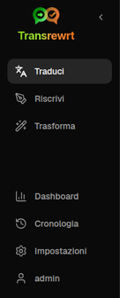
    </td>
    <td valign="top">
       
      <ul>
        <li><strong>Traduci</strong> apre l'area di lavoro per la traduzione.</li>
        <li><strong>Riscrivi</strong> apre l'area di lavoro per la riscrittura.</li>
        <li><strong>Trasforma</strong> apre l'area di lavoro per il prompt personalizzato.</li>
        <li><strong>Dashboard</strong> mostra informazioni sull'utilizzo e sui costi.</li>
        <li><strong>Impostazioni</strong> apre il pannello delle impostazioni.</li>
        <li><strong>Utente</strong> mostra il nome utente dell'utente connesso (solo web).</li>
      </ul>
       
      
Puoi anche comprimere la barra laterale per avere più spazio facendo clic sull'icona accanto al logo dell'app.

    </td>
  </tr>
</table>

 

### Barra degli strumenti

La barra degli strumenti cambia leggermente a seconda della posizione all'interno dell'app.

- A sinistra, mostra il nome della pagina corrente.
- A destra, mostra il **selettore del modello** e il controllo della **lingua dell'interfaccia**.

Il **selettore del modello** permette di scegliere quale motore AI utilizzare per l'attività corrente.

  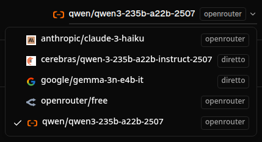

> ℹ️ **NOTA** 
> Alcuni modelli gratuiti potrebbero smettere di funzionare temporaneamente se non sono disponibili o hanno raggiunto un limite di utilizzo. Se ciò accade, l'app rimuoverà automaticamente quel modello dalla tua lista.

L'**icona del globo + codice lingua** cambia la lingua dell'interfaccia dell'app, come menu e pulsanti. **Non** cambia le lingue di traduzione utilizzate in **Traduci**.

  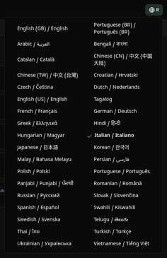

 

### Pannelli di input e output

La maggior parte degli spazi di lavoro utilizza un pannello **Input** a sinistra e un pannello **Output** a destra.

Il pannello **Input** mostra:

- Conteggio caratteri
- Conteggio parole
- Conteggio paragrafi

Il pannello **Output** può mostrare:

- La durata del task
- Il costo del task
- Il costo totale cumulativo
- **TPS** (token al secondo), una semplice misura di velocità
- Conteggi di caratteri, parole e paragrafi
- Il modello utilizzato

Se sei curioso sui termini tecnici:

- **Token** indica una piccola porzione di testo. Puoi pensarlo come parte di una parola o una parola breve.
- **TPS** indica quante di queste porzioni di testo il modello ha elaborato ogni secondo.

  

## Traduci

Utilizza **Traduci** per convertire il testo da una lingua all'altra.

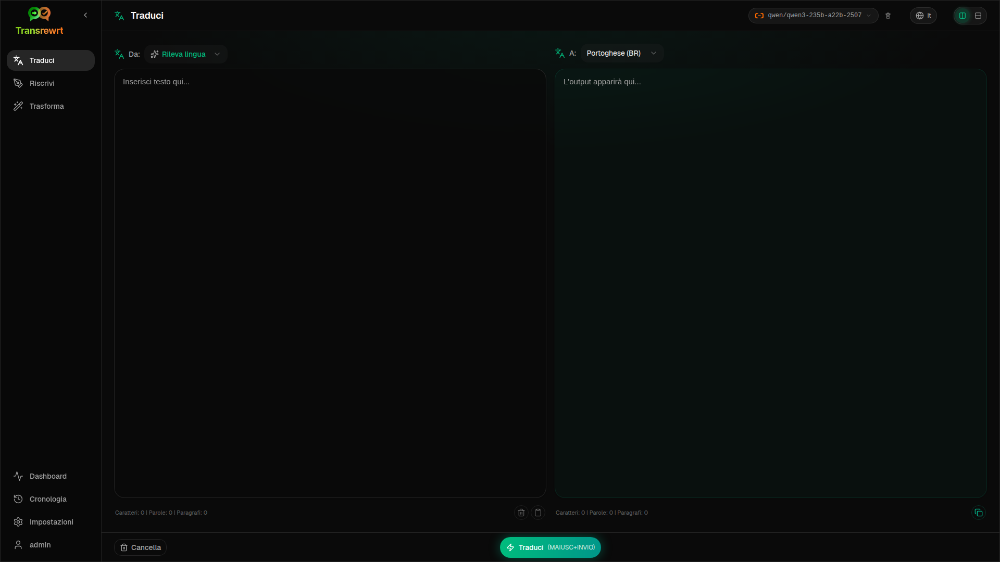

 

### Traduci testo

1. Apri **Traduci**.
2. Scegli una lingua in **Da**.
3. Scegli una lingua in **A**.
4. Scegli un modello nella barra degli strumenti.
5. Digita o incolla il testo in **Input**.
6. Fai clic su **Traduci**.
7. Leggi il risultato in **Output**.
8. Usa il pulsante di copia se vuoi copiare il risultato.

 

### Selezione della lingua

- **Da** può essere una lingua specifica o **Rileva lingua**.
- **A** è la lingua in cui vuoi il risultato.

Le tue **Lingue principali** selezionate appaiono in cima alla lista. Puoi impostarle in [**Impostazioni** > **Lingue**](#languages).

 

### Impostazioni di traduzione utili

In [**Impostazioni** > **Impostazioni generali**](#general-settings), puoi modificare il comportamento della traduzione:

- **Traduzione automatica all'incollamento** avvia una traduzione non appena incolli il testo.
- **Copia automatica del risultato negli appunti** copia il risultato automaticamente dopo un'esecuzione riuscita.
- **Traduzione in tempo reale (mentre digiti)** avvia le traduzioni mentre digiti.
- **Timeout (ms)** controlla quanto tempo l'app attende prima di eseguire una traduzione in tempo reale.

 

### Scorciatoie da tastiera

In [**Impostazioni** > **Impostazioni generali**](#general-settings), **Comportamento per INVIO** controlla cosa succede quando premi Invio:

- **Invio** può eseguire il task e **Shift+Invio** può aggiungere una nuova riga.
- Oppure l'app può fare il contrario.

La scorciatoia corrente è mostrata anche sul pulsante **Traduci**.

  

## Riscrivi

Utilizza **Riscrivi** quando vuoi migliorare la formulazione senza cambiarne il significato principale.

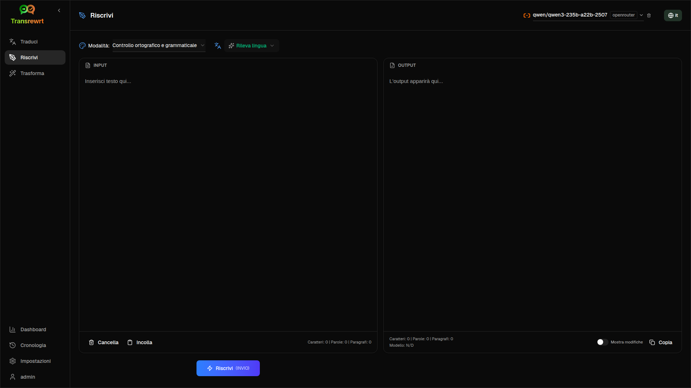

Questo è utile per:

- correggere ortografia e grammatica
- rendere il testo più chiaro
- rendere il testo più formale o più informale
- accorciare o espandere il testo
- far sembrare il testo più tecnico

 

### Riscrivi testo

1. Apri **Riscrivi**.
2. Scegli una **Modalità**.
3. Scegli un modello nella barra degli strumenti.
4. Digita o incolla il testo in **Input**.
5. Fai clic su **Riscrivi**.
6. Esamina il risultato in **Output**.

Lo stesso comportamento del tasto Invio descritto in [**Traduci**](#keyboard-shortcuts) si applica qui.

  

## Trasforma

Utilizza **Trasforma** quando vuoi che l'IA segua un insieme personalizzato di istruzioni.

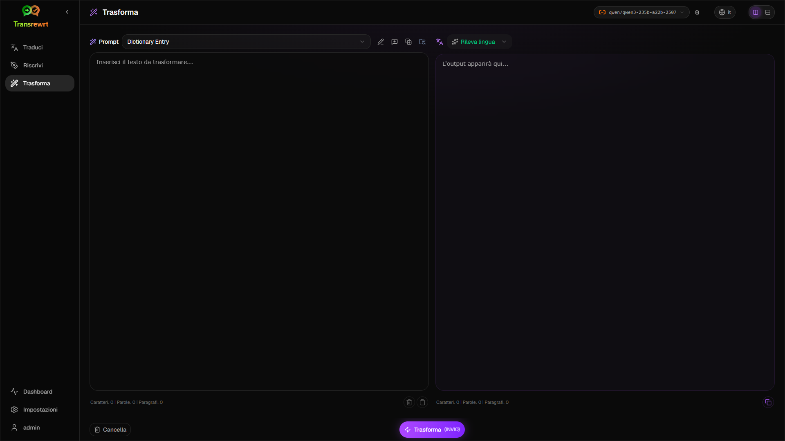

Questa è l'area più flessibile dell'app. Puoi usarla per compiti come:

- riassumere note
- trasformare testo grezzo in un'email rifinita
- estrarre punti chiave
- convertire il testo in un formato specifico

 

### Esegui un prompt esistente

1. Apri **Trasforma**.
2. Scegli un prompt dalla lista dei prompt.
3. Se appare una casella lingua **Target**, scegli una lingua se lo desideri.
4. Digita o incolla il testo in **Input**.
5. Fai clic su **Trasforma**.
6. Leggi il risultato in **Output**.

 

### Se non hai ancora prompt

Se la tua lista dei prompt è vuota, fai clic su **Carica prompt di esempio**. Questo aggiunge esempi predefiniti in modo che tu possa iniziare rapidamente.

> ℹ️ **NOTA** 
> I prompt di esempio sono forniti in inglese. Dopo averli caricati, puoi modificare un prompt e usare **Traduci prompt** se desideri adattare il testo del prompt a un'altra lingua.

 

### Creare rapidamente un prompt

Il modo più veloce per creare un prompt è:

1. Fare clic su **New prompt**.
2. Fare clic su **Generate prompt**.
3. Descrivere ciò che si desidera che il prompt faccia.
4. Scegliere un modello.
5. Lasciare che l'app crei una bozza per te.
6. Esaminare la bozza e fare clic su **Save**.

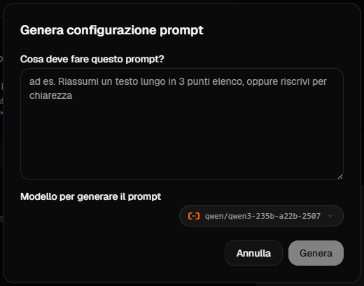

 

### Modificare un prompt

Quando si crea o modifica un prompt, l'editor appare a sinistra e l'area di test appare a destra.

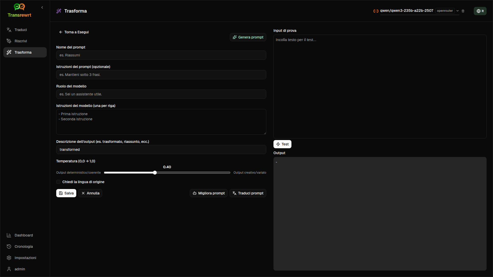

I campi principali sono:

- **Nome prompt**: il nome mostrato nell'elenco dei prompt.
- **Istruzioni per il prompt (opzionale)**: un breve suggerimento mostrato all'utente durante l'esecuzione del prompt.
- **Ruolo del modello**: il ruolo complessivo assegnato all'IA, ad esempio 'Sei un assistente utile.'
- **Istruzioni per il modello (una per riga)**: le regole specifiche che si desidera che l'IA segua.
- **Descrizione dell'output**: una breve parola che descrive il risultato, ad esempio 'summary' o 'rewrite'.
- **Temperatura (0.0 → 1.0)**: un cursore per la creatività.
- **Chiedi la lingua di destinazione**: aggiunge un selettore della lingua di destinazione all'esecuzione del prompt.

Se il termine tecnico **Temperatura** è nuovo per te, consideralo in questo modo:

- Una **più bassa** temperatura produce risultati più stabili e prevedibili.
- Una **più alta** temperatura produce maggiore varietà e creatività.

Puoi anche utilizzare:

- **`Generate prompt`** per creare una nuova bozza da una descrizione semplice
- **`Improve prompt`** per perfezionare un prompt esistente
- **`Translate prompt`** per tradurre i campi del prompt

> ⚠️ **AVVISO** 
> Fare clic su **`Save`** prima di fare clic su **`Back to Run`**. Se torni indietro senza salvare, le modifiche andranno perse.

 

### Testare un prompt prima di utilizzarlo

Il pannello di prova sulla destra permette di provare il prompt con testo di esempio prima di utilizzarlo nel lavoro quotidiano.

Ciò è utile quando:

- si crea un nuovo prompt
- si confrontano due versioni di un prompt
- si desidera verificare tono, lunghezza o formato dell'output

 

### Gestire i prompt salvati

Per gestire i prompt salvati in un unico posto, apri [**Impostazioni** > **Prompt di trasformazione**](#transform-prompts).

Qui puoi:

- elencare ed eliminare i tuoi prompt
- esportare i prompt come **JSON**, **CSV** o **XLSX**
- importare i prompt da un file

  

## Dashboard

Usa la **Dashboard** per vedere quanto stai utilizzando l'app e quanto ti costa.

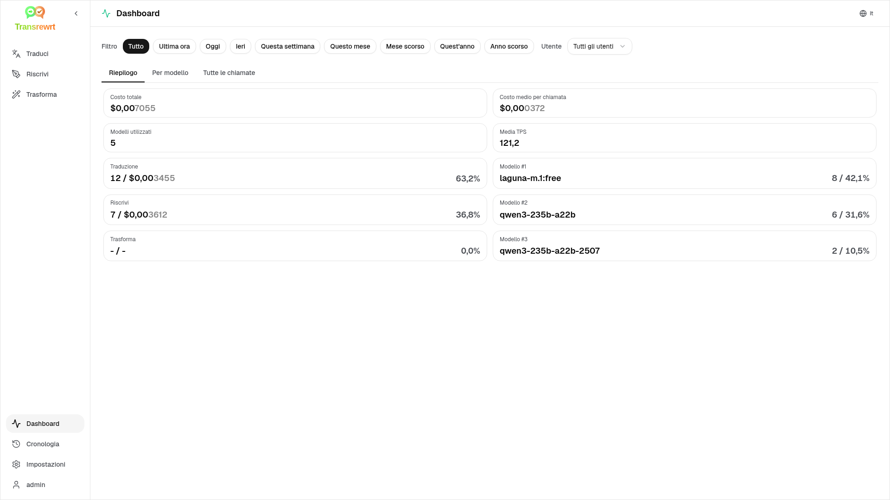

 

### Filtrare i dati

Utilizza i pulsanti di filtro in alto per modificare l'intervallo di tempo.

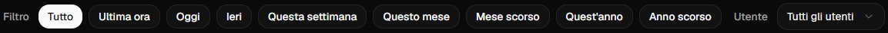

> ℹ️ **NOTA** 
> Nella versione web, gli amministratori possono anche vedere un filtro **Utente**. Questo consente di passare tra **Tutti gli utenti** e un utente specifico.

 

### Schede della dashboard

- **Riepilogo** fornisce una panoramica dell'utilizzo e dei costi.
- **Per utilizzo** suddivide l'attività per lingua di traduzione, modalità di riscrittura e prompt di trasformazione.
- **Per modello** mostra i modelli che hai utilizzato e il relativo costo.
- **Per giorno** mostra i totali giornalieri.
- **Tutte le chiamate** mostra la cronologia completa delle chiamate e permette di esportarla.

 

### Esportare i dati

Le tabelle della dashboard possono esportare i dati in:

- **JSON**
- **CSV**
- **XLSX**

Ciò è utile se si desidera esaminare l'attività al di fuori dell'app o condividere un report.

 

### Eliminare i record archiviati per un modello

In **Per modello** o **Tutte le chiamate**, è possibile rimuovere i record archiviati per un modello.

> ⚠️ **AVVISO** 
> L'eliminazione dei record archiviati non può essere annullata. Utilizzare questa operazione solo se si è certi di non aver più bisogno di questa cronologia.

Per eliminare tutti i dati o rimuovere i record in base alla loro età, vai a [**Impostazioni** > **Tracciamento costi**](#cost-tracking). Lì troverai le opzioni per eliminare tutti i dati archiviati o solo i dati più vecchi di una certa data.

  

## Impostazioni

Apri **Impostazioni** dalla barra laterale per personalizzare il comportamento dell'app.

Le schede disponibili possono variare:

- **Configurazione API** è disponibile solo nell'app desktop.
- **Utenti** è disponibile solo nell'app web e solo per gli amministratori.

 

### Impostazioni generali

Usa **Impostazioni generali** per controllare il comportamento di digitazione e l'aspetto.

**Comportamento**

- **Comportamento per INVIO** sceglie se Invio esegue il compito o inserisce una nuova riga.
- **Traduzione automatica al incolla** avvia la traduzione non appena incolli il testo.
- **Copia automatica del risultato negli appunti** copia automaticamente i risultati riusciti.
- **Traduzione in tempo reale (durante la digitazione)** traduce mentre digiti.
- **Timeout (ms)** imposta il tempo di attesa per la traduzione in tempo reale.

**Aspetto**

- **Cifre decimali del costo** modifica come vengono visualizzati i decimali del costo.
- **Famiglia di caratteri** modifica il carattere di scrittura nei pannelli di testo.
- **Dimensione** modifica la dimensione del carattere.
- **Solo web:** **mostra un margine intorno all'app** aggiunge spazio extra attorno all'interfaccia.

 

### Modelli

Usa **Impostazioni** > **Modelli** per scegliere quali modelli apparire nella barra degli strumenti.

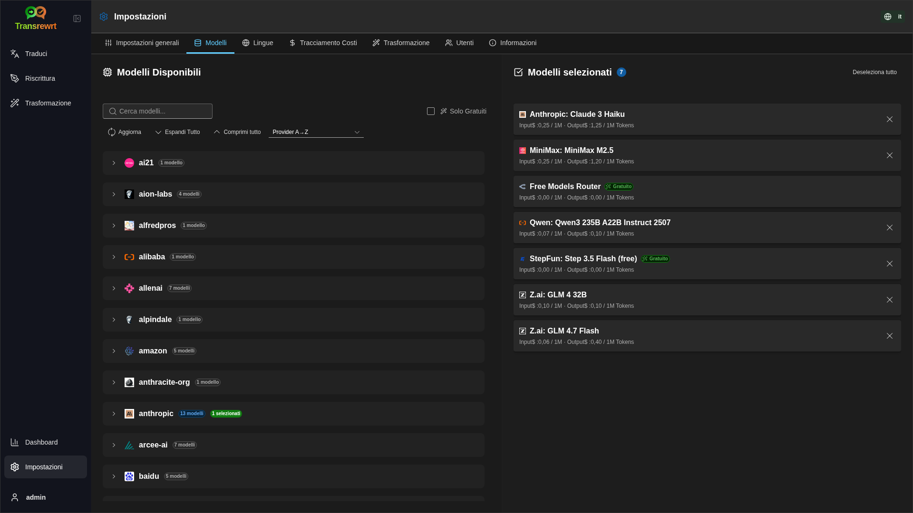

La pagina ha due elenchi:

- **Modelli disponibili** a sinistra
- **Modelli selezionati** a destra

I controlli utili includono:

- **Cerca modelli...** per trovare un modello per nome
- **Solo gratuiti** per mostrare solo i modelli gratuiti
- **Aggiorna** per ricaricare l'elenco
- **Espandi tutto** e **Comprimi tutto** quando ordini per provider

Per aggiungere un modello, fai clic su **Aggiungi**.

Per rimuovere un modello, fai clic su **X** accanto ad esso in **Modelli selezionati**.

Per cancellare l'elenco, fai clic su **Deseleziona tutto**. Il modello gratuito richiesto rimarrà nell'elenco.

> ℹ️ **NOTA** 
> Se non vuoi aggiungere crediti a OpenRouter subito, inizia abilitando **Solo gratuiti** e scegliendo i modelli gratuiti.

 

### Lingue

Usa **Impostazioni** > **Lingue** per organizzare gli elenchi di lingue utilizzati nell'app.

- **Lingue principali** sono bloccate vicino alla parte superiore degli elenchi di lingue in **Traduci** e **Trasforma**.
- **Lingua personalizzata** ti consente di aggiungere una lingua non presente nell'elenco predefinito.

Se aggiungi una lingua personalizzata, apparirà nei selettori di lingua insieme alle opzioni predefinite.

 

### Tracciamento dei costi

Usa **Impostazioni** > **Tracciamento costi** per gestire le informazioni sui costi.

- **Costo totale** mostra il totale in corso.
- **Copia valore** copia il totale negli appunti.
- **Reimposta costo** reimposta il totale memorizzato a zero.
- **Sincronizza con l'utilizzo della chiave API** imposta il totale per corrispondere all'utilizzo riportato da OpenRouter.
- **Utilizzo della chiave API** mostra i dettagli di utilizzo, se disponibili.
- **Elimina dati dei costi** rimuove tutti i dati o solo le voci più vecchie di una data selezionata.

> ⚠️ **AVVISO** 
> L'eliminazione dei dati non può essere annullata. Prima di eliminare, assicurati di eseguire il backup dei dati o esportarli tramite [**Dashboard** > **Tutte le chiamate**](#dashboard-tabs), altrimenti andranno persi permanentemente.

 

### Prompt di trasformazione

Usa **Impostazioni** > **Prompt di trasformazione** per gestire i prompt in blocco.

Puoi:

- esaminare i prompt salvati
- eliminare i prompt
- importare prompt da un file
- esportare prompt per backup o condivisione

 

### Utenti

**Solo web - solo amministratore**

Usa **Utenti** per gestire gli account utente nella versione web. Puoi aggiungere utenti, aggiornare i loro dati, reimpostare le password ed eliminare gli account.

 

### Configurazione API

**Solo desktop**

Usa **Configurazione API** per collegare l'app desktop a OpenRouter o a un proxy Transrewrt.

- **Chiave API di OpenRouter** è dove incolli la tua chiave.
- **URL API** è l'indirizzo del servizio. Lascia il valore predefinito a meno che non ti sia stato fornito uno diverso.
- **Usa proxy Transrewrt** instrada le richieste attraverso un servizio proxy invece che direttamente a OpenRouter.
- **Seme della chiave** appare quando l'opzione proxy è abilitata.
- **Testa configurazione API** verifica se la configurazione attuale funziona.

Per passaggi dettagliati su come ottenere la tua chiave API, consulta [Come ottenere una chiave API](#how-to-get-an-api-key-desktop-app) sopra.

> ℹ️ **NOTA** 
> Se non sei sicuro di cosa significhino **URL API**, **Usa proxy Transrewrt** o **Seme della chiave**, lasciali invariati e utilizza la configurazione OpenRouter predefinita. Maggiori informazioni sul proxy sono disponibili nel [repository Transrewrt Proxy](https://github.com/wsj-br/transrewrt-proxy).

 

### Informazioni

La scheda **Informazioni** mostra:

- il nome dell'app
- il numero di versione
- la data di compilazione
- un collegamento al repository del progetto

  

## Problemi comuni

Se qualcosa non funziona come previsto, controlla prima i seguenti punti.

 

### L'app non traduce, riscrive o trasforma il testo

Verifica che:

- hai selezionato un modello nella barra degli strumenti
- almeno un modello sia elencato in [**Impostazioni** > **Modelli**](#models)
- la configurazione API funzioni

Se stai utilizzando l'app desktop:

1. Apri [**Impostazioni** > **Configurazione API**](#api-config).
2. Verifica che la tua chiave API sia salvata.
3. fai clic su **Test API Configuration**.

 

### L'elenco dei modelli è vuoto

Apri [**Impostazioni** > **Modelli**](#models) e fai clic su **Refresh**.

Se necessario:

- cerca un modello
- attiva **Solo gratuiti**
- aggiungi uno o più modelli a **Modelli selezionati**

 

### Il risultato è troppo lento o troppo costoso

Prova uno o più di questi:

- scegli un modello diverso
- usa un input più breve
- disattiva **Traduzione in tempo reale (mentre si digita)** in [**Impostazioni** > **Impostazioni generali**](#general-settings)
- usa modelli gratuiti per attività semplici (vedi [Modelli](#models))

 

### L'interfaccia è nella lingua sbagliata

Fai clic sull'icona del globo nella [barra degli strumenti](#toolbar) e scegli la tua **Lingua dell'interfaccia** preferita.

 

### Il testo è troppo piccolo o difficile da leggere

Apri [**Impostazioni** > **Impostazioni generali**](#general-settings) e modifica:

- **Famiglia di caratteri**
- **Dimensione**

 

### Ho modificato un prompt e ho perso le modifiche

Quando modifichi un prompt, fai sempre clic su **Salva** prima di fare clic su **Torna a Esegui**.

  

## Consigli rapidi

- Inizia con [**Traduci**](#translate) per assicurarti che la configurazione funzioni prima di passare a [**Riscrivi**](#rewrite) o [**Trasforma**](#transform).
- Usa [**Riscrivi**](#rewrite) per miglioramenti quotidiani della formulazione.
- Usa [**Trasforma**](#transform) quando hai bisogno di un flusso di lavoro ripetibile per un'attività specifica.
- Usa il [**Dashboard**](#dashboard) se vuoi tenere sott'occhio l'utilizzo e i costi.
- Esporta i prompt regolarmente se crei una libreria di prompt che vuoi conservare in sicurezza (vedi [Prompt di trasformazione](#transform-prompts)).

  

## Dichiarazione di non responsabilità

I nomi dei prodotti e le icone appartengono ai rispettivi proprietari e sono utilizzati solo a scopo identificativo. Questo software non è affiliato né approvato da nessuno dei marchi menzionati.

  

## Licenza

Copyright © 2026 Waldemar Scudeller Jr.

[Apache License 2.0](LICENSE)