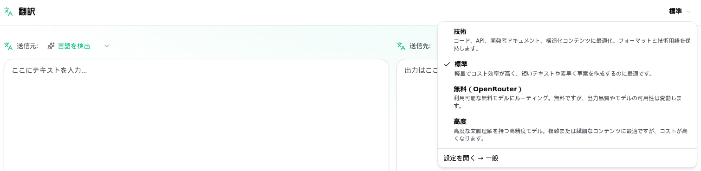

<a id="transrewrt-user-guide"></a>
# ユーザーガイド

<br/>

<a id="introduction"></a>
## 導入

Transrewrtは、テキストを以下の3つの方法で処理するのに役立ちます。

- **翻訳** - テキストをある言語から別の言語に変換します。
- **書き換え** - より明確、簡潔、またはよりフォーマルなど、異なるスタイルでテキストを言い換えます。
- **変換** - プロンプトと呼ばれるカスタムAI指示を使用してテキストを処理します。

デフォルトでは、アプリは **かんたん** モードで実行されます。設定で **プロバイダー**（OpenRouter、OpenAI、Ollama など）を選択するだけで、モデルID を選ぶことなく **プリセット**（例：無料 (OpenRouter)、標準、高度、技術）を選びます。[**設定** > **一般設定**](#general-settings) で **高度** モードに切り替えると、[**設定** > **モデル**](#models) の従来のモデル一覧を使用できます。

<br/>

このガイドでは、アプリのインストールと実行後の使い方を説明します。インストール手順については、メインの[**README**](README.ja.md)を参照してください。

<br/>

> ℹ️ **注記**<br/>
> Transrewrtは、WindowsおよびLinux向けのデスクトップアプリとして、またセルフホスト型のWebアプリとして利用可能です。このガイドではアプリの日常的な使用方法に焦点を当てています。特定のバージョンにのみ適用される内容については、明確にマークしています。

<small>**他の言語で読む：** </small>
<small id="lang-list">[English (UK)](../USER-GUIDE.md) · [Português (Brasil)](./USER-GUIDE.pt-BR.md) · [العربية](./USER-GUIDE.ar.md) · [বাংলা](./USER-GUIDE.bn.md) · [Català](./USER-GUIDE.ca.md) · [简体中文](./USER-GUIDE.zh-Hans.md) · [繁體中文](./USER-GUIDE.zh-Hant.md) · [Hrvatski](./USER-GUIDE.hr.md) · [Čeština](./USER-GUIDE.cs.md) · [Nederlands](./USER-GUIDE.nl.md) · [English (US)](./USER-GUIDE.en-US.md) · [Tagalog](./USER-GUIDE.tl.md) · [Français](./USER-GUIDE.fr.md) · [Deutsch](./USER-GUIDE.de.md) · [Ελληνικά](./USER-GUIDE.el.md) · [Hindi (Roman)](./USER-GUIDE.hi-Latn.md) · [Magyar](./USER-GUIDE.hu.md) · [Italiano](./USER-GUIDE.it.md) · [日本語](./USER-GUIDE.ja.md) · [한국어](./USER-GUIDE.ko.md) · [Bahasa Melayu](./USER-GUIDE.ms.md) · [فارسی](./USER-GUIDE.fa.md) · [Polski](./USER-GUIDE.pl.md) · [Basa Jawa](./USER-GUIDE.jv.md) · [Português](./USER-GUIDE.pt.md) · [پنجابی](./USER-GUIDE.pa-PK.md) · [Română](./USER-GUIDE.ro.md) · [Русский](./USER-GUIDE.ru.md) · [Slovenčina](./USER-GUIDE.sk.md) · [Español](./USER-GUIDE.es.md) · [Kiswahili](./USER-GUIDE.sw.md) · [Svenska](./USER-GUIDE.sv.md) · [తెలుగు](./USER-GUIDE.te.md) · [ไทย](./USER-GUIDE.th.md) · [Türkçe](./USER-GUIDE.tr.md) · [Українська](./USER-GUIDE.uk.md) · [Tiếng Việt](./USER-GUIDE.vi.md)</small>

<small>

> **UIおよびドキュメント翻訳に関する注意：** 英語（UK）以外のすべてのインターフェース言語はAIモデルで翻訳されています。表現が不正確または誤りを含む可能性があります。

</small>

<br/>

<!-- START doctoc generated TOC please keep comment here to allow auto update -->
<!-- DON'T EDIT THIS SECTION, INSTEAD RE-RUN doctoc TO UPDATE -->
**目次**

- [始める前に](#before-you-start)
  - [無料のOpenRouter APIキーを取得する方法（デスクトップアプリ）](#how-to-get-a-free-openrouter-api-key-desktop-app)
- [はじめに](#getting-started)
- [ウィンドウの主な構成](#main-parts-of-the-window)
  - [サイドバー](#sidebar)
  - [ツールバー](#toolbar)
  - [入力および出力パネル](#input-and-output-panels)
- [翻訳](#translate)
  - [テキストの翻訳](#translate-text)
  - [言語の選択](#language-selection)
  - [便利な翻訳設定](#helpful-translation-settings)
  - [翻訳の調整](#refining-your-translation)
  - [用語集の使用](#using-the-glossary)
- [書き換え](#rewrite)
  - [テキストの書き換え](#rewrite-text)
  - [書き換えの改善](#refining-your-rewrite)
- [変換](#transform)
  - [既存のプロンプトを実行](#run-an-existing-prompt)
  - [プロンプトがまだない場合](#if-you-have-no-prompts-yet)
  - [プロンプトをすばやく作成](#create-a-prompt-quickly)
  - [プロンプトの編集](#edit-a-prompt)
  - [使用前にプロンプトをテスト](#test-a-prompt-before-using-it)
- [ダッシュボード](#dashboard)
  - [データのフィルター](#filter-the-data)
  - [ダッシュボードのタブ](#dashboard-tabs)
  - [データのエクスポート](#export-data)
  - [モデルの保存済みレコードを削除](#delete-stored-records-for-a-model)
- [履歴](#history)
  - [履歴のフィルター](#filter-the-history)
  - [履歴データのエクスポート](#export-history-data)
- [設定](#settings)
  - [一般設定](#general-settings)
  - [モデル](#models)
  - [言語](#languages)
  - [コスト追跡](#cost-tracking)
  - [変換 (設定タブ)](#transform-settings-tab)
  - [用語集 (設定タブ)](#glossary-settings-tab)
  - [ユーザー](#users)
  - [API 設定](#api-config)
  - [について](#about)
- [一般的な問題](#common-issues)
  - [アプリがテキストを翻訳、書き換え、変換しない](#the-app-will-not-translate-rewrite-or-transform-text)
  - [モデルリストが空である](#the-model-list-is-empty)
  - [結果が遅すぎるかコストが高すぎる](#the-result-is-too-slow-or-too-expensive)
  - [インターフェイスの言語が間違っている](#the-interface-is-in-the-wrong-language)
  - [テキストが小さすぎるか読みにくい](#the-text-is-too-small-or-hard-to-read)
  - [ダッシュボードの概要が空に見える](#dashboard-summary-looks-empty)
  - [コストに「利用不可」と表示されるか、間違っているように見える](#cost-shows-not-available-or-seems-wrong)
  - [合計コストがプロバイダーの請求と一致しない](#total-cost-does-not-match-my-provider-bill)
  - [履歴ページがサイドバーにない](#the-history-page-is-missing-from-the-sidebar)
  - [Web アプリ: 予期せずログインページにリダイレクトされる](#web-app-redirected-to-the-login-page-unexpectedly)
  - [Web 管理者: パスワードを忘れたまたは紛失した](#web-admin-forgot-or-lost-a-password)
  - [ダッシュボードに他のユーザーのデータが表示されない (Web)](#dashboard-shows-no-data-for-other-users-web)
  - [プロンプトを変更して編集内容が失われた](#i-changed-a-prompt-and-lost-the-edits)
- [クイックヒント](#quick-tips)
- [免責事項](#disclaimer)
- [ライセンス](#license)

<!-- END doctoc generated TOC please keep comment here to allow auto update -->

<br/><br/>

<a id="before-you-start"></a>
## はじめに

Transrewrtを使用するには、少なくとも1つのAIプロバイダーへのアクセスが必要です。サポートされているプロバイダーは次のとおりです。[OpenRouter](https://openrouter.ai)（多くのモデルを集約）、OpenAI、Anthropic、Google Gemini、DeepSeek、Groq、Mistral、xAI、Cerebras、NVIDIA、Alibaba Cloud、apikey.fun、任意のOpenAI互換プロバイダー、およびローカルモデル用の[Ollama](https://ollama.com)です。

有料モデルを選択する必要はありません。OpenRouter API キーを追加すると、アプリは自動的に組み込みの **無料** OpenRouter オプションを有効にします。これにより、テキストの翻訳、書き換え、変換をすぐに開始できます。または、Cerebras、Google、Groq、Mistral AI、または [NVIDIA](https://build.nvidia.com/) (OpenAI 互換 API) から無料の API キーを取得することもできます。

わかりやすく言うと：

- **かんたん** モードでは、**プリセット**（無料 (OpenRouter)、標準、高度、技術）が選択した **プロバイダー**（OpenRouter、OpenAI、Ollama など）に対応するモデルにマッピングされます。現在のプロバイダーにマッピングがあるプリセットのみがツールバーに表示されます。翻訳、書き換え、変換の各操作でプリセットを選択します。
- **高度** モードでは、**モデル** は直接選択するAIエンジンです。モデルID には **プロバイダー接頭辞** が使われます（例：`openrouter/…`、`openai/…`、`ollama/…`）。
- **APIキー**（Ollamaの場合は**ベースURL**）は、アプリがそのプロバイダーに接続するための手段です。

**デスクトップアプリ**を使用している場合は、使用する各プロバイダーに対して[**設定** > **API設定**](#api-config)でキーを追加してください。OpenRouterのみを使用する場合は、以下の[無料のOpenRouter APIキーの取得方法](#how-to-get-a-free-openrouter-api-key-desktop-app)を参照してください。APIキーを使用したくない場合は、Ollama（[ollama.com](https://ollama.com)から）をインストールして、`translategemma:4b`などのローカルモデルを使用できます。

**Web版**を使用している場合、サーバー管理者が環境変数でプロバイダーを設定するため、アプリ内で直接APIキーを入力することはできません。

<br/>

<a id="how-to-get-a-free-openrouter-api-key-desktop-app"></a>
### 無料のOpenRouter APIキーの取得方法（デスクトップアプリ）

デスクトップアプリを使用している場合は、以下の手順に従ってください：

1. Webブラウザで[OpenRouter](https://openrouter.ai)にアクセスします。
2. アカウントを作成するか、ログインします。
3. [Keys](https://openrouter.ai/keys)ページを開きます。
4. 新しいAPIキーを作成するボタンをクリックします。
5. 後で識別できるように、キーに名前を付けます。
6. 新しいAPIキーをコピーします。
7. Transrewrtに戻り、**設定** > **API設定**を開きます。
8. キーを**OpenRouter APIキー**（**設定** > **API設定**内）に貼り付けます。
9. **OpenRouterキーをテスト**をクリックして、正しく動作するか確認します。

<br/><br/>

<a id="getting-started"></a>
## はじめましょう

初めてTransrewrtを使用する場合は、以下の順序で進めてください：

1. アプリを開きます。
2. 必要に応じて、地球儀アイコンから**インターフェース言語**を選択します。
3. **デスクトップアプリ**の場合は、[**設定** > **API設定**](#api-config)を開き、少なくとも1つのプロバイダー（例: OpenRouter）のAPIキーを追加し、**テスト**をクリックして正常に動作するか確認します。
4. [**設定** > **一般設定**](#general-settings)を開きます。**かんたん**モード（デフォルト）では、設定済みのキーを持つ**プロバイダー**を選択します。**高度**モードでは、[**設定** > **モデル**](#models)を開き、1つ以上のモデルを**選択したモデル**に追加します。
5. **翻訳**で、ツールバーから **プリセット**（かんたん）または **モデル**（高度）を選択します。
6. [**設定** > **言語**](#languages) を開き、よく使う言語を上位に表示したい場合は **主要言語** を選択します。
7. 単純な翻訳を実行して正しく動作しているか確認した後、**書き換え** と **変換** を試してください。

この順序は重要です。最もよくある初回利用時の問題——アプリが有効なAPI接続を持つ前、またはプリセット／モデルを選択する前にタスクを実行しようとする問題——を回避できます。

<br/><br/>

<a id="main-parts-of-the-window"></a>
## ウィンドウの主な構成部分

アプリは主に3つの領域に分かれています：

- 左側の**サイドバー**。
- 上部の**ツールバー**。
- 中央の**作業領域**。

<br/>

<a id="sidebar"></a>
### サイドバー

サイドバーを使用してアプリ内を移動します。アプリのロゴの横にあるアイコンをクリックすると、サイドバーを折りたたんでより多くのスペースを確保できます。

<br/>

<table>
  <tr>
    <td valign="top">
       
    </td>
    <td valign="top">
      <br/><br/>
      <ul>
        <li><strong>翻訳</strong>をクリックすると、翻訳作業スペースが開きます。</li><br/>
        <li><strong>書き換え</strong>をクリックすると、書き換え作業スペースが開きます。</li><br/>
        <li><strong>変換</strong>をクリックすると、カスタムプロンプト作業スペースが開きます。</li><br/>
        <li><strong>ダッシュボード</strong>をクリックすると、使用状況とコストの情報が表示されます。</li><br/>
        <li><strong>設定</strong>をクリックすると、設定パネルが開きます。</li><br/>
        <li><strong>履歴</strong>をクリックすると、入力テキストと出力テキストを含む使用履歴が表示されます。</li><br/>
        <li><strong>ユーザー</strong>をクリックすると、ログイン中のユーザーのユーザー名が表示されます（Web版のみ）。</li>
      </ul>
    </td>
  </tr>
</table>

<br/>

<a id="toolbar"></a>
### ツールバー

ツールバーの内容は、アプリ内の位置によってわずかに変化します。

- 左側には現在のページ名が表示されます。
- 右側には **プリセットまたはモデルセレクター** と **インターフェース言語** のコントロールが表示されます。

**かんたん** モードでは、ツールバーに組み込みプリセット **無料 (OpenRouter)**、**標準**、**高度**、**技術** の **プリセットセレクター** が表示されます。表示されるプリセットは、[**設定** > **一般設定**](#general-settings) で選択した **プロバイダー** によって異なります。たとえば、**無料 (OpenRouter)** はプロバイダーが OpenRouter の場合にのみ表示されます。**プロバイダー** が **Ollama** の場合、ツールバーにはプリセットの代わりにローカルにインストール済みのモデルが表示されます。

**高度**モードでは、**モデルセレクター**を使用して、現在のタスクで使用するAIエンジンを選択できます。



高度モードでは、一部の無料モデルが常に利用可能とは限りません。オフラインになったり、使用量の上限に達したりする可能性があります。アプリは自動的にそのモデルをリストから削除することがあります。表示されるモデルを制御するには、[**設定** > **モデル**](#models)に移動してください。ツールバーのモデル名の左にあるプロバイダーのアイコンからモデル設定を開けます。

<br/>

**地球儀のアイコン＋言語コード**は、アプリのインターフェース言語（メニューやボタンなど）を変更します。ただし、**翻訳**で使用する翻訳言語は**変更しません**。


<br/>

<a id="input-and-output-panels"></a>
### 入力および出力パネル

ほとんどの作業スペースでは、左側に**入力**パネル、右側に**出力**パネルが使用されます。

各パネルには以下の情報も表示されます。

| **入力**                                                          | **出力**                                                                                                                  |
|--------------------------------------------------------------------|-----------------------------------------------------------------------------------------------------------------------------|
| - 文字数 <br/>- 単語数 <br/>- 段落数   <br/> | - タスクにかかった時間<br/>- **TPS**（1秒あたりのトークン数）<br/>- 文字数、単語数、段落数<br/>- 使用したモデル |

技術用語について気になる場合は、以下の通りです。

- **トークン**とは、小さなテキストの断片を意味します。単語の一部または短い単語と考えてください。
- **TPS**とは、モデルが1秒間に処理したテキストの断片の数を意味します。

<br/>

また、各操作のコスト（利用可能な場合）と合計コストを[**設定** > **一般設定**](#general-settings)で`Show cost information on the actions`オプションを有効にすることで確認できます。

<br/><br/>

[--------------------------------------------------------------------------------------------------------------------------]: #

<a id="translate"></a>
## 翻訳

**翻訳**は、テキストをある言語から別の言語に変換したい場合に使用します。


<br/>

<a id="translate-text"></a>
### テキストの翻訳

1. **翻訳** を開きます。
2. **From** で言語を選択します。
3. **To** で言語を選択します。
4. ツールバーでプリセット（かんたん）またはモデル（高度）を選択します。
5. **入力**にテキストを入力または貼り付けます。
6. **翻訳**をクリックします。
7. **出力**で結果を確認します。
8. 結果をコピーする場合は、コピー用ボタンを使用します。
9. 必要に応じて、**言い換え…** や単語の代替で結果を洗練させます — [翻訳の洗練](#refining-translation)を参照してください。

<br/>

<a id="language-selection"></a>
### 言語の選択

- **From** は特定の言語または **言語を検出** に設定できます。
- **To** は、結果を取得したい言語です。

選択した **トップ言語** はリストの上部に表示されます。これらは[**設定** > **言語**](#languages)で設定できます。

<br/>

<a id="helpful-translation-settings"></a>
### 役立つ翻訳設定

[**設定** > **一般設定**](#general-settings)で、翻訳の動作を変更できます。

- **貼り付け時に自動実行**は、テキストを貼り付けるとすぐに翻訳を実行します。
- **結果をクリップボードにコピー**は、成功した実行後に結果を自動的にコピーします。
- **入力中のリアルタイム翻訳** (⚠️ これにより使用コストが増加する可能性があります) は、入力中に翻訳を実行します。
- **タイムアウト (ms)** は、アプリがリアルタイム翻訳を実行する前に待機する時間を制御します。
- **ENTERの動作対象**は、`Enter`がタスクを実行するか新しい行を挿入するかを選択します:
  - **Enter**は翻訳または書き換えを実行します（デフォルト）。
  - **Shift + Enter**は翻訳または書き換えを実行し、通常の**Enter**は新しい行を挿入します。

<br/>

<a id="refining-translation"></a>
### 翻訳の洗練

翻訳が成功した後、出力ヘッダーに**言い換え…** とバージョンのドロップダウンが表示され、**翻訳先:** 言語セレクターの隣に配置されます。そこで結果を洗練させることができます：

1. **言い換え…** — 出力でテキストが選択されていない場合、同じ入力の別の表現による完全な翻訳を取得します。モデルは既に持っているすべてのバージョンを受け取るため、新しい表現はそれらすべてと異なるものになります。最大 **5** つのバージョンを保存でき、バージョンのドロップダウンで切り替えることができます。テキストが選択されている場合、**言い換え…** は選択範囲の近くに単語の候補を表示します (右クリックと同じ)。選択がない場合、5 つのバージョンに達すると **言い換え…** は無効になります。選択がある場合は、5 つのバージョンでも機能します (単語の候補のみ、バージョン 5 を更新)。完全な言い換えの実行中は、**翻訳を停止** をクリックしてキャンセルできます。出力は言い換えの開始時にアクティブだったバージョンに戻ります。
2. **単語の候補** — 出力で 1 つ以上の単語または短いフレーズを選択します (単語の一部のみを選択した場合、アプリは選択範囲を完全な単語に拡張します)。その後、右クリックするか **言い換え…** をクリックします。選択範囲の近くに候補の短いリストが表示されます。いずれかをクリックして置き換えます。各オプションは選択範囲よりわずかに広い範囲を置き換える場合があります (例: 隣接する前置詞や冠詞)。これにより文の文法が保たれます。5 つ未満のバージョンがある場合、編集された出力は新しいバージョンとして保存されます。5 つのバージョンがある場合は、**バージョン 5** のみが更新されます。選択なしで右クリックすると、カーソルの下の単語が選択されます (そこに単語がない場合は何も起こりません)。**Esc** を押すかリストの外側をクリックすると、出力を変更せずにキャンセルできます。
3. **コスト** — 完全な **言い換え…** (選択なし) の実行と、単語の候補のリクエストはそれぞれモデルを再び使用し、使用コストが追加される場合があります (通常の翻訳実行と同じ)。

<br/>

<a id="using-the-glossary"></a>
### 用語集の使用

**用語集**とは、特定の言語ペアのソース/ターゲット用語のペアのリストです。用語集がオンの場合、Transrewrt は一致する用語をモデルに送信するため、好みの語句が翻訳全体で一貫して維持されます（たとえば、常に同じように翻訳されるべき製品名、ブランド用語、または役職名など）。

**翻訳**ページで使用するには:

1. 入力パネルの **用語集** スイッチをオンにします（自動実行および自動コピー スイッチの隣）。
2. **元の言語**と**ターゲット言語**を選択し、通常どおり翻訳します。その言語ペア用に保存された用語が自動的に適用されます。
3. 新しいペアをその場でキャプチャするには、**元の言語:** セレクターの隣にある **用語集に追加** をクリックします。ダイアログには現在の言語が事前入力されているため、**ソース用語**と**ターゲット用語**を入力するだけです。
4. 出力フッターの **用語集** リンク（またはダイアログ内の **用語集を管理** リンク）を使用して、[**設定** > **用語集**](#glossary-settings) に移動して、すべての用語を確認します。

用語は [**設定** > **用語集**](#glossary-settings) タブで追加、編集、インポート、エクスポートします。詳細は下記を参照してください。

<br/>

> ℹ️ **注記**<br/>
> 用語集の用語は**言語ペア**ごとに一致するため、英語 → フランス語用に保存された用語は、英語 → ドイツ語を翻訳する際には適用されません。用語を一致させるには特定のソース言語が必要なため、用語集は **言語を検出** をソースとして使用することはできません。

[--------------------------------------------------------------------------------------------------------------------------]: #

<a id="rewrite"></a>
## 書き換え

主な意味を変えずに表現を改善したい場合は、**書き換え** を使用します。テキストは同じ言語のままです (翻訳されません)。


これは以下の用途に便利です。

- スペルと文法の修正（**スペルと文法をチェック**）
- テキストの明確化（**明確さの向上**）
- 1回の実行で複数の異なる言い換えを生成（**代替バージョン**）
- テキストをよりフォーマルまたはカジュアルにする（**フォーマルにする** / **カジュアルにする**）
- テキストの短縮または拡張（**短縮** / **拡張**）
- テキストをより専門的にする（**専門的にする**）

<br/>

<a id="rewrite-text"></a>
### テキストの書き換え

1. **書き換え**を開きます。
2. **モード**を選択します（例: **明確性を向上**または**正式な表現に変更**）。
3. 必要に応じて**元の言語**をテキストの言語に設定します（または**言語を検出**のままにします）。
4. **入力**にテキストを入力または貼り付けします。
5. **書き換え**をクリックします。
6. **出力**で結果を確認します。
7. 必要に応じて**Rephrase…** または単語の候補で結果を調整します — [書き換えの調整](#refining-rewrite)を参照してください。

<br/>

> 💡 **ヒント**<br/>
> 「**スペルと文法をチェック**」モードを使用すると、出力パネルに **変更を表示** スイッチ（**コピー**の隣）が表示されます。
> このスイッチをオンまたはオフにして、テキストに適用された修正内容を表示または非表示にできます。

<br/>

> ℹ️ **注**<br/>
> 書き換えモード**代替バージョン**は、**単一の**実行で複数の言い換えを返し、出力内で`----`で区切られます。これは**Rephrase…** とは異なります。後者は時間をかけてバージョン履歴を構築します（クリックごとに1つの新しいバリアント）。[書き換えの調整](#refining-rewrite)を参照してください。

<br/>

<a id="refining-rewrite"></a>
### 書き換えの調整

書き換えが成功すると、**Rephrase…** とバージョンのドロップダウンがワークスペースの出力側に表示されます（分割レイアウトでは、出力列の上部ツールバーの実行メトリクスの隣に、スタックレイアウトでは、出力パネルの上部**元の言語:** の隣に表示されます）。そこで結果を調整できます — [翻訳の調整](#refining-translation)と同じ考え方ですが、テキストは同じ言語のままで、現在の書き換え**モード**が維持されます:

1. **Rephrase…** — 出力でテキストが選択されていない場合、同じ入力の別の完全な書き換えを異なる表現で取得します。選択したモード（例: より明確、より短い、より正式）が引き続き適用されます。モデルは既存のすべてのバージョンを受け取るため、新しい表現はそれらすべてと異なるものになります。最大**5**つのバージョンを保存でき、バージョンのドロップダウンで切り替えることができます。テキストが選択されている場合、**Rephrase…** は選択範囲の近くに単語の候補を開きます（右クリックと同じ）。選択がない場合、5つのバージョンに達すると**Rephrase…** は無効になります。選択がある場合、5つのバージョンでも引き続き機能します（単語の候補のみ、バージョン5を更新）。完全な言い換えの実行中は、**書き換えを停止**をクリックしてキャンセルできます。出力は言い換えが開始された時にアクティブだったバージョンに戻ります。
2. **単語の候補** — 出力で1つ以上の単語または短いフレーズを選択します（単語の一部のみを選択した場合、アプリは選択範囲を完全な単語に拡張します）。その後、右クリックするか**Rephrase…** をクリックします。選択範囲の近くに候補の短いリストが表示されます。いずれかをクリックして置き換えます。各オプションは選択範囲よりわずかに広い範囲を置き換える場合があり、文が文法的に正しく保たれます。5つのバージョン未満の場合、編集された出力は新しいバージョンとして保存されます。5つのバージョンの場合、**バージョン5**のみが更新されます。選択なしで右クリックすると、カーソルの下の単語が選択されます（そこに単語がない場合は何も起こりません）。**Esc**を押すか、リストの外側をクリックすると、出力を変更せずにキャンセルできます。
3. **コスト** — 完全な**Rephrase…**（選択なし）ごと、および各単語の候補リクエストは、再度モデルを使用し、使用コストが追加される場合があります（通常の書き換え実行と同じ）。

<br/><br/>

[--------------------------------------------------------------------------------------------------------------------------]: #

<a id="transform"></a>
## 変換

カスタムの指示に従ってAIに処理させたい場合は、**変換**を使用します。


これはアプリで最も柔軟性のある機能です。以下のようなタスクに使用できます。

- メモの要約
- ざっくりとした文章を洗練されたメールに変換
- 主要ポイントの抽出
- テキストを特定の形式に変換
- 入力テキストに対するその他のカスタム処理

<br/>

<a id="run-an-existing-prompt"></a>
### 既存のプロンプトを実行

1. **変換**を開きます。
2. プロンプトリストからプロンプトを選択します。
3. **From**言語ボックスが表示された場合、必要に応じて言語を選択します。
4. **入力**にテキストを入力または貼り付けます。
5. **変換**をクリックします。
6. **出力**に表示される結果を確認します。

<br/>

<a id="if-you-have-no-prompts-yet"></a>
### プロンプトがない場合

プロンプトリストが空の場合は、変換ワークスペースで **サンプルプロンプトを読み込む** をクリックしてください。このコントロールは、エクスポート/インポート行にある [**設定** > **変換**](#transform-settings) でも常に使用できます。どちらも組み込みのサンプルを追加するため、すぐに開始できます。

<br/>

> ℹ️ **注**<br/>
> サンプルプロンプトは英語で提供されています。読み込んだ後、プロンプトを編集し、**プロンプトを翻訳**を使ってあなたの言語に翻訳できます。

<br/>

<a id="create-a-prompt-quickly"></a>
### プロンプトをすばやく作成する

プロンプトを作成する最も速い方法は次のとおりです。

1. **新しいプロンプト** をクリックします。
2. **プロンプトを生成** をクリックします。
3. プロンプトに何をさせたいか説明します。
4. プリセット（かんたん）またはモデル（高度）を選択します。
5. アプリが下書きを作成するのを待ちます。
6. 下書きを確認し、**保存**をクリックします。


<br/>

<a id="edit-a-prompt"></a>
### プロンプトを編集する

プロンプトを作成または編集すると、左側にエディターが、右側にテストエリアが表示されます。


主なフィールドは以下のとおりです。

- **プロンプト名**: プロンプトリストに表示される名前です。
- **プロンプトの指示（オプション）**: プロンプト実行時にユーザーに表示される短いヒントです。
- **モデルの役割**: AIに割り当てる全体的な役割（例: 'あなたは役立つアシスタントです。'）。
- **モデルの指示（1行ごと）**: AIに従ってほしい特定のルール。
- **出力の説明 (例: 変換済み、要約済みなど)**: 結果を説明する短い単語です。
- **温度 (0.0 → 1.0)**: モデルの動作を制御します; 以下を参照してください。
- **ターゲット言語を要求**: プロンプトが実行されるときに言語セレクタを追加します。
技術用語**温度**が新しい場合は、次のように考えてください:

- **低い**温度では、安定し予測しやすい結果が得られます。
- **高い**温度では、より多様で創造的な結果が得られます。

また、以下も使用できます。

- `Generate prompt`: 簡単な説明から新しい下書きを作成
- `Improve prompt`: 既存のプロンプトを洗練
- `Translate prompt`: プロンプトのフィールドを翻訳

<br/>

> ⚠️ **警告**<br/>
> `Back to Run`をクリックする前に`Save`をクリックしてください。保存せずに戻ると、変更内容は失われます。

<br/>

<a id="test-a-prompt-before-using-it"></a>
### 使用前にプロンプトをテストする

右側のテストパネルを使用すると、日常業務で使用する前に、プロンプトをサンプルテキストで試すことができます。

これは以下の状況で便利です。

- 新しいプロンプトを作成しているとき
- 2つのバージョンのプロンプトを比較しているとき
- トーン、長さ、または出力形式を確認したいとき

<br/>

> ℹ️ **注記**<br/>
> [**設定** > **変換**](#transform-settings) で、保存したプロンプトのエクスポートおよびインポートが可能です。

プロンプトエディターで **プロンプトを生成**、**プロンプトを改善**、**プロンプトを翻訳** を使用する場合、**かんたん** モードでは翻訳や書き換えと同様のプリセット選択が提供され、**高度** モードではモデル一覧が使用されます。

<br/><br/>

[--------------------------------------------------------------------------------------------------------------------------]: #

<a id="dashboard"></a>
## ダッシュボード

**ダッシュボード**を使用して、アプリの使用量とコスト（有料モデルの場合）を確認できます。


<br/>

> ℹ️ **注記**<br/>
> **無料**のモデルのみを使用している場合、**コスト**の金額はゼロになることがあり、コストに焦点を当てたKPIは空に見えることがあります。ただし、選択した期間にアクティビティがある場合、**概要** タブには翻訳、書き換え、変換の呼び出し回数が引き続き表示されます。

<br/>

<a id="filter-the-data"></a>
### データのフィルター

上部のフィルターボタンを使用して、期間を変更できます。


<br/>

> ℹ️ **注記**<br/>
> **ユーザー**フィルターは、Web版で管理者にのみ表示されます。通常のユーザーはこのフィルターを見ることはできず、デスクトップアプリでは利用できません。

<br/>

<a id="dashboard-tabs"></a>
### ダッシュボードタブ

- **概要** にはKPIカードが表示されます：合計コスト、使用されたモデル、モード別呼び出し回数とコスト（合計呼び出し数に占める割合）、呼び出し1回あたりの平均コスト、平均TPS、および呼び出し回数の上位3モデル。
- **モデル別** には、各モデルの合計呼び出し数、合計コスト、平均TPSがリストされます。行を展開すると、翻訳、書き換え、変換ごとの内訳を確認できます。
- **すべての呼び出し** には、完全な呼び出しログが表示されます（幅広レイアウトではページネーション、狭い画面ではカード表示）し、エクスポートも可能です。

<br/>

<a id="export-data"></a>
### データのエクスポート

ダッシュボードの表は以下の形式でデータをエクスポートできます。

- **JSON**
- **CSV**
- **XLSX**

アプリ外で活動内容を確認したり、レポートを共有したりする場合に便利です。

<br/>

<a id="delete-stored-records-for-a-model"></a>
### モデルの保存済みレコードを削除

**モデル別**または**すべての呼び出し**で、「ごみ箱」アイコンをクリックして、特定のモデルの保存済みレコードを削除できます。

> ⚠️ **警告**<br/>
> 保存済みレコードの削除は元に戻せません。その履歴が不要になったことを確認したうえで実行してください。

すべてのデータを削除するか、特定の期間より古いレコードを削除するには、[**設定** > **コスト追跡**](#cost-tracking) に移動してください。ここでは、すべての保存されたデータを削除するか、特定の日付より前のデータのみを削除するオプションが利用できます。

<br/><br/>

[--------------------------------------------------------------------------------------------------------------------------]: #

<a id="history"></a>
## 履歴

**履歴**をクリックして、**Transrewrt** 内での操作履歴を確認します。各操作の入力と出力も確認できます。


<br/>

<a id="filter-the-history"></a>
### 履歴のフィルター

**履歴** は **ダッシュボード** ページと同じ期間フィルターを使用します。


<br/>

> ℹ️ **注記**<br/>
> **Webアプリ**では、（管理者を含む）すべてのユーザーが自分の実行履歴のみを表示できます。**ダッシュボード** の **ユーザー** フィルターは、管理者がアカウント全体の使用状況とコストを確認するためのものであり、**履歴** には適用されません。

<br/>

<a id="export-history-data"></a>
### 履歴データのエクスポート

履歴ページでは、フィルターされたデータを以下の形式でエクスポートできます。

- **JSON**
- **CSV**
- **XLSX**

アプリ外で活動内容を確認したり、レポートを共有したりする場合に便利です。

<br/><br/>

[--------------------------------------------------------------------------------------------------------------------------]: #

<a id="settings"></a>
## 設定

サイドバーから**設定**を開き、アプリの動作をカスタマイズします。

利用可能なタブは、使用しているプラットフォームとあなたの役割によって異なります。

| タブ              | デスクトップ | Web（管理者） | Web（通常ユーザー） | 備考                                        |
  |------------------|:-------:|:-----------:|:------------------:|----------------------------------------------|
  | 一般設定 |   はい   |     はい     |        はい         | **AI体験**（かんたん / 高度）を含む |
  | モデル           |   はい   |     はい     |        はい         | **AI体験** が **高度** の場合にのみ表示 |
  | 言語        |   はい   |     はい     |        はい         |                                              |
  | コスト追跡    |   はい   |     はい     |         -          |                                              |
  | 変換        |   はい   |     はい     |        はい         | 変換プロンプトの一括インポート/エクスポート      |
  | 用語集         |   はい   |     はい     |        はい         | 翻訳中に適用される用語ペア        |
  | ユーザー            |    -    |     はい     |         -          |                                              |
  | API設定       |   はい   |     はい     |         -          |                                              |
  | 情報            |   はい   |     はい     |        はい         |                                              |

**かんたん** モードでは、ツールバーのプリセットと一般設定の **プロバイダー** でモデル選択が行われ、**モデル** タブは非表示になります。

<br/>

> ℹ️ **注記**<br/>
> Web版では、各ユーザーが独自の設定を持ちます。AI体験、プロバイダー、選択したモデルまたはプリセット、言語、一般オプション、変換プロンプトなどの設定はユーザーごとに保存されます。あなたが行った変更は他のユーザーに影響しません。

<br/>

[--------------------------------------------------------------------------------------------------------------------------]: #

<a id="general-settings"></a>
### 一般設定

**一般設定** を使用して、入力動作、**履歴** に実行詳細を保存するかどうか、外観、および翻訳、書き換え、変換で使用するAIの選択方法を制御できます。

**AI体験**

- **かんたん**（デフォルト）：**プロバイダー**（OpenRouter、OpenAI、Anthropic、Google Gemini、DeepSeek、Groq、Mistral、xAI、Cerebras、またはOllama）を選択します。クラウドプロバイダーでは、ツールバーの組み込みプリセットを使用します。**Ollama** では、プリセットの代わりにマシンにインストール済みのローカルモデルが表示されます。かんたんモードでは、**プリセットカタログ** にカタログのバージョンと最終更新日時が表示され、**プリセットカタログを更新** をクリックするとプロジェクトリポジトリから最新のプリセット一覧を取得します（アプリは定期的にバックグラウンドでも確認します）。
- **高度**：ツールバーで個別のモデルを選択します。リストの管理は [**設定** > **モデル**](#models) で行います。

**外観**

- **テーマ** は、ライト、ダーク、システムの外観間で切り替えます。
- **アクションにコスト情報を表示** は、操作ごとのコスト（利用可能な場合）および「翻訳」「書き換え」「変換」出力パネルの合計コストの表示を制御します。
- **コスト小数桁数** は、コストの小数点以下の表示方法を変更します。
- **Web版のみ:** **アプリの周りに余白を表示** は、インターフェースの周囲に余白を追加します。
- **フォントファミリー**：テキストパネルの文字フォントを変更します。
- **サイズ**：フォントサイズを変更します。

**動作**

- **ENTERの動作対象**は、`Enter`がタスクを実行するか新しい行を挿入するかを選択します。
- **貼り付け時に自動実行**は、テキストを貼り付けるとすぐに翻訳を開始します。
- **結果をクリップボードにコピー**は、成功した結果を自動的にコピーします。
- **入力中のリアルタイム翻訳** (⚠️ これにより使用コストが増加する可能性があります) は、入力中に翻訳を実行します。
- **タイムアウト (ms)** は、リアルタイム翻訳の待機時間を設定します。

**履歴**

- **実行履歴を保持**は、翻訳、書き換え、変換の各操作ごとに**入力および出力テキスト**をサイドバーの[**履歴**](#history)ビュー用に保存するかどうかを制御します。オフにすると確認が求められ、確認した場合、保存された履歴テキストはデータベースから削除されます。ラベルに*管理者によって無効にされています*と表示されている場合、インストール時に環境変数に`HISTORY_DISABLED`が設定されています（[README](README.ja.md#configuration-and-environment)を参照）。この場合、UIから履歴を再び有効にすることはできません。
- **履歴データを削除**を使用すると、期間（たとえば数か月以上前など）または**すべてのデータ（クリア）**に基づいて、**データを削除**機能で保存されたテキストを削除できます。これは**履歴**ビューのための保存済み実行テキストにのみ影響し、**コストや使用量の合計は削除されません**。**コスト**データを削除または削減するには、[**設定** > **コスト追跡**](#cost-tracking)を使用してください。

**設定のバックアップ** (デスクトップアプリおよびウェブ管理者のみ)
- **使用データをバックアップに含める** - 有効にすると、ZIPには実行履歴とAPIコールデータも含まれます。
- **設定をバックアップ** - `transrewrt-config-backup-YYYY-MM-DD_HHMMSS.zip`のローカル時間で単一のZIPを作成し、`config.json`, `state.json`, オプションの暗号化キー、ユーザー、設定、カスタムプロンプト、および使用データを含めます（オプトインした場合）。バックアップが成功した後、確認メッセージに保存されたファイル名が表示されます。
- **バックアップから復元** - 最初に**確認ダイアログ**が開きます。ダイアログ内でバックアップZIPを選択します (**参照** / ファイルピッカーまたはサポートされている場合はドラッグアンドドロップ)、その後オプションを確認します:
  - **使用データを復元する** - 使用データを含めてバックアップされたZIPから使用/履歴をインポートします; 設定とプロンプトのみを希望する場合はオフにします。
  - **復元前に古い使用データを消去する** - バックアップを適用する前にこのインストールの既存の使用/履歴を削除します（オプション; クリーンな置き換えを希望する場合に使用）。
ウェブ版またはデスクトップ版のいずれかで作成されたバックアップは、他方で復元できます。デスクトップバックアップをウェブ版で復元する場合、データは管理者ユーザーに復元されます。

<br/>

<a id="models"></a>
### モデル

このタブは、[**一般設定**](#general-settings)で**AI体験**が**高度**に設定されている場合にのみ利用可能です。**設定** > **モデル**を使用して、ツールバーに表示するモデルを選択してください。


このページには2つのリストがあります：

- 左側の**利用可能なモデル**
- 右側の**選択したモデル**

便利な操作には以下が含まれます：

- **Search models...** を使用して、名前でモデルを検索します
- **Provider** のチップを使用して、リストを特定のエンジンに絞り込みます（OpenRouter、OpenAI、Ollama など）
- **Free Only** を選択して、無料モデルのみを表示します
- **Refresh** をクリックしてリストを再読み込みします
- プロバイダーで並べ替えている場合に、**Expand All** および **Collapse All** を使用します

モデルIDにはプロバイダーの接頭辞が含まれます（例：`openrouter/…` 対 `openai/…`）。**OpenAI (OpenRouter)** と **OpenAI (direct)** のようなバッジは、トラフィックがどのようにルーティングされるかを示しています。

> ℹ️ **NOTE**<br/>
> **OpenRouter Body Builder** (`openrouter/bodybuilder`) は汎用チャットモデルではなくルーターモデルです。このモデルの応答は、OpenRouter APIリクエストボディを記述するJSONになります（例：`requests` 配列に `model` と `messages` を含む）。このモデルを **Translate**、**Rewrite**、または **Transform** に使用すると、出力パネルには完成したテキストではなくそのJSONが表示されます。これらのタスクには通常のテキストモデルを選択してください。詳細はOpenRouterの [Body Builderモデルページ](https://openrouter.ai/openrouter/bodybuilder) を参照してください。

操作:

- モデルを追加するには、**Add** をクリックするか、エントリの任意の場所をクリックします。

- モデルを削除するには、**Selected Models** または「利用可能なモデル」のエントリにある **Selected** の横の **X** をクリックします。

- リストをクリアするには、**Deselect all** をクリックします。必須の無料モデルはリストに残ります。

<br/>

> ℹ️ **NOTE**<br/>
> OpenRouterにすぐにクレジットを追加したくない場合は、まず **Free Only** を有効にして無料モデルを選択してください（クレジットカード不要）。また、Ollamaを使用してAPIキーなしでローカルでモデルを実行することもできます。

<br/>

<a id="languages"></a>
### 言語

**Settings** > **Languages** を使用して、アプリで使用される言語リストを管理します。

- **Top languages** は、**Translate** および **Transform** の言語リスト上部に固定されます。
- **Custom language** を使用すると、組み込みリストにない言語を追加できます。

カスタム言語を追加すると、組み込みオプションとともに言語セレクターに表示されます。

<br/>

<a id="cost-tracking"></a>
### コスト追跡

**Settings** > **Cost Tracking** を使用してコスト情報を管理します。

- **Total Cost** は累計を表示します。
- **Copy Value** で合計をクリップボードにコピーします。
- **Reset Cost** で保存された合計をゼロにリセットします。
- **Sync with API key usage** で、合計をOpenRouterアカウントで報告された使用量と一致させます（OpenRouterのみ対応）。
- **API Key Usage** は、利用可能な場合にOpenRouterの使用詳細を表示します。
- **Delete cost data** で、すべてのデータまたは選択した日付より前のエントリのみを削除します。

**コスト追跡：** OpenRouterモデルを使用すると、アプリはOpenRouterから提供されるコスト情報に基づいて、実際の使用量と支出を表示します。その他のすべてのプロバイダーについては、アプリはOpenRouterが公開している価格を使用してコストを推定します。価格が利用できない場合、推定値はゼロになることがあります。

<br/>

> ℹ️ **NOTE**<br/>
> **すべてのコスト数値は参考用の推定値であり、公式な請求書ではありません。**

<br/>

> ⚠️ **WARNING**<br/>
> データの削除は元に戻せません。削除する前に、[**History**](#history) または [**Dashboard** > **All Calls**](#dashboard-tabs) からデータをバックアップまたはエクスポートしてください。そうしないとデータは完全に失われます。
> 各API呼び出しエントリに関連するすべての入力/出力履歴も削除されます。

<br/>

<a id="transform-settings"></a>
### 変換（設定タブ）

**設定** > **変換**を使用して、プロンプトを一括で管理します。

以下の操作が可能です。

- 保存済みのプロンプトを確認
- プロンプトを削除
- ファイルからプロンプトをインポート
- バックアップや共有のためにプロンプトをエクスポート
- プロンプトリストにサンプルプロンプトを読み込む

<br/>

<a id="glossary-settings"></a>
### 用語集（設定タブ）

翻訳中に適用される用語ペアを管理するには、**設定** > **用語集**を使用します（[用語集の使用](#using-the-glossary)を参照）。各用語には、**ソース言語**、**ターゲット言語**、**ソース用語**、および**ターゲット用語**があります。

以下の操作が可能です。

- **用語を追加** — テーブルの一番下の行に入力し（言語を選択し、ソース用語とターゲット用語を入力）、**+** ボタンをクリックします。
- **用語を検索** — **ソース言語**、**ターゲット言語**、またはフリー**テキスト**でリストをフィルタリングします。**フィルタをクリア**をクリックしてリセットします。
- **用語を削除** — 用語の行にあるゴミ箱アイコンをクリックします。
- **インポート** — `.csv`、`.xlsx`、または`.xls`ファイルから用語を読み込みます。ファイルには、`source_language`、`target_language`、`source_text`、および`target_text`の列が必要です。
- **CSVをエクスポート** / **XLSXをエクスポート** — バックアップまたは共有のために、すべての用語をダウンロードします。
- **CSVテンプレート** / **XLSXテンプレート** — 入力してインポートするための正しい列ヘッダーが含まれた空のファイルをダウンロードします。

<br/>

> ℹ️ **注意**<br/>
> **デスクトップアプリ**では、用語集はローカルに保存されます。**ウェブバージョン**では、ユーザーごとに個別の用語集が用意されているため、設定した用語が他のユーザーに影響することはありません。

<br/>

<a id="users"></a>
### ユーザー

Web版では、**ユーザー**を使用してユーザー アカウントを管理できます。ユーザーの追加、詳細の更新、パスワードのリセット、アカウントの削除が可能です。

<br/>

<a id="api-config"></a>
### API設定

サポートされているプロバイダーは次のとおりです。OpenRouter、OpenAI、Anthropic、Google Gemini、DeepSeek、Groq、Mistral、xAI、Cerebras、NVIDIA、Alibaba Cloud、apikey.fun、**Ollama**（ベースURL経由のローカルモデル）、およびオプションの**カスタムOpenAI互換プロバイダー**（名前、URL、APIキー — 高度モードのみ）。使用するプロバイダーのみを設定する必要があります。

**Webアプリケーション：管理者のみ**

API キーは、システムまたは Docker 環境変数を通じて設定されます。Web UI には入力されません。カスタム プロバイダーの場合、`CUSTOM_PROVIDER_NAME`、`CUSTOM_PROVIDER_URL`、および `CUSTOM_PROVIDER_API_KEY` (3 つすべてが必要) を設定します。このページには、キーが設定されているプロバイダーが表示され、`Test` ボタンをクリックして各プロバイダーをテストできます。

<br/>

> ℹ️ **注記**<br/>
> APIキーを変更するには、システムまたはDockerの設定で環境変数を更新し、サーバーまたはコンテナを再起動してください。

<br/>

> ℹ️ **注記**<br/>
> **設定のバックアップ**（[**一般設定** → 設定のバックアップ](#general-settings)を参照）は、ZIP内の`config.json`に**解決済み**のプロバイダーキーを埋め込むことができます。このZIPを復元しても、これらのキーはサーバーの永続化された設定ファイルに**コピーされません**。実行中のキーは、前述のとおり、引き続き環境および既存のファイル状態から取得されます。

<br/>

**デスクトップアプリケーション**

**API 設定**を使用して、使用する各プロバイダーのAPIキーを保存します。Ollamaの場合は、APIキーの代わりに**ベースURL**を入力します。カスタムOpenAI互換プロバイダー（自己ホスト型サーバーやゲートウェイなど、組み込みリストにないエンドポイント）の場合は、**プロバイダー名**、**ベースURL**（`https://my-llm.example.com/v1`など）、および**APIキー**を入力します。これら3つすべてが必要です。URLと名前はインラインで編集されます。APIキーを置き換えるには**編集**を使用します。カスタムプロバイダーのモデルは**高度**モードのみに表示されます（設定 → モデル）。

<br/>

> 💡 **ヒント** <br/>
> API キーを使用したくない場合や、使用料を支払いたくない場合は、[Ollama をダウンロード](https://ollama.com) して、モデル (例: `translategemma:4b`) を無料でローカルマシンで実行できます。または、無料の OpenRouter アカウント (クレジットカード不要) を作成して無料モデルを使用するか、Cerebras、Google、Groq、Mistral AI、または [NVIDIA](https://build.nvidia.com/) から無料の API キーを取得することもできます。

<br/>

- 必要なプロバイダーのみを追加してください。**設定** > **モデル**では、各モデルIDはプロバイダーで始まります（例：`openrouter/openrouter/free`、`openai/gpt-4o`、`nvidia/nvidia/nemotron-nano-3-30b-a3b`、`ollama/llama3`、`MyProvider/…`は、`MyProvider`という名前のカスタムエンドポイント用）。

APIキーを追加するには、テキストフィールドに値を入力して`Save`をクリックします。既存のキーを置き換えるには、`Edit`をクリックします。キーが正常に機能しているか確認するには、`Test`をクリックします。OllamaのベースURLの場合は、接続確認のために常に`Test`をクリックしてください。

<br/>

> ℹ️ **注記**<br/>
> 現在のAPIキーの値を表示することはできません。`Edit`ボタンを使用してのみ置き換えることができます。
> APIキーは設定内に暗号化されて保存されます。

<br/>

<a id="about"></a>
### 情報

**情報**タブには、次の内容が表示されます:

- アプリ名とタグライン
- バージョン番号とビルド日
- ライセンスおよび著作権情報（「**サードパーティ製品に関する通知**」を開くためのリンク付き）
- プロジェクトのリポジトリへのリンク

<br/><br/>

<a id="common-issues"></a>
## 一般的な問題

何かが期待通りに動作しない場合は、まず次の点を確認してください。

<br/>

<a id="the-app-will-not-translate-rewrite-or-transform-text"></a>
### アプリがテキストを翻訳、書き換え、または変換しない

次のことを確認してください:

- ツールバーで **プリセット**（かんたん）または **モデル**（高度）が選択されていること
- **かんたん** モードでは、[**設定** > **一般設定**](#general-settings) で、有効なキー（またはOllamaのURL）を持つ **プロバイダー** が選択されており、少なくとも1つのプリセットがそのプロバイダー用に設定されていること
- **高度** モードでは、少なくとも1つのモデルが [**設定** > **モデル**](#models) に登録されていること
- APIの設定が正常に動作していること

デスクトップアプリを使用している場合:

1. [**設定** > **API設定**](#api-config)を開きます。
2. 少なくとも1つのAPIキーが保存されていることを確認します。
3. プロバイダーの隣にある**テスト**をクリックして、キーが機能していることを確認します。

<br/>

<a id="the-model-list-is-empty"></a>
### モデルリストが空です

**かんたん**モードでは、[**設定** > **一般設定**](#general-settings)を開き、**プロバイダー**が設定されていることを確認し、[**API設定**](#api-config)（デスクトップ）でキーを追加またはテストするか、管理者に確認してください（web）。**Ollama**の場合は、ベースURLに対して**テスト**を実行し、モデルがローカルにインストールされていることを確認してください。

**高度**モードでは、[**設定** > **モデル**](#models)を開き、**更新**をクリックします。必要に応じてモデルを検索し、**無料のみ**を有効にして、**選択したモデル**にモデルを追加します。

<br/>

<a id="the-result-is-too-slow-or-too-expensive"></a>
### 結果が遅すぎるまたは高すぎる

次のいずれかを試してください:

- 別のプリセット（簡単）またはモデル（高度）を選択します。
- より短い入力を使用します。
- [**設定** > **一般設定**](#general-settings)で**入力中のリアルタイム翻訳**をオフにします。
- 簡単なタスクには無料モデルを使用します（[モデル](#models)を参照）。
<br/>

<a id="the-interface-is-in-the-wrong-language"></a>
### インターフェースが間違った言語です

[ツールバー](#toolbar)の地球アイコンをクリックし、お好みの**インターフェース言語**を選択してください。

<br/>

<a id="the-text-is-too-small-or-hard-to-read"></a>
### テキストが小さすぎるまたは読みづらい

[**設定** > **一般設定**](#general-settings)を開き、次のように変更します:

- **フォントファミリー**
- **サイズ**

<br/>

<a id="dashboard-summary-looks-empty"></a>
### ダッシュボードの概要が空に見える

以下の場合は正常です。

- **無料モデル**のみを使用しており、**コスト**の数値を確認している（ゼロの場合がある）— **概要**の呼び出し回数のKPIは、選択した期間からのデータを必要としています
- 選択された**時間フィルター**が呼び出しが行われた期間を含んでいない — **すべて**を選択して確認してみてください

**すべて**を選択してもKPIがゼロのままの場合、[**履歴**](#history)または**すべての呼び出し**タブに呼び出しが表示されているか確認してください。

<br/>

<a id="cost-shows-not-available-or-seems-wrong"></a>
### コストが「利用不可」と表示される、または正しくないように見える

**OpenRouter**経由でモデルを使用している場合、アプリはOpenRouterから報告された実際の支出を表示します。

**その他のプロバイダー**（OpenAIダイレクト、Anthropicダイレクトなど）については、OpenRouterが公開している価格データからコストが推定されます。モデルに一致する価格が見つからない場合、コストは**利用不可**と表示され、合計に加算されません。

<br/>

<a id="total-cost-does-not-match-my-provider-bill"></a>
### 合計コストがプロバイダーの請求額と一致しない

アプリ内のすべてのコスト数値は、参考用の**推定値**であり、公式な請求書ではありません。

合計を実際のOpenRouterの支出により近づけるには、[**設定** > **コスト追跡**](#cost-tracking)を開き、**APIキー使用量と同期**をクリックしてください。

<br/>

<a id="the-history-page-is-missing-from-the-sidebar"></a>
### 履歴ページがサイドバーに表示されない

**実行履歴を保持**がオフになっている可能性があります。[**設定** > **一般設定**](#general-settings)を開き、履歴が*管理者によって無効にされています*でない限り有効にしてください（環境に`HISTORY_DISABLED`が設定されている場合 — [README](README.ja.md#configuration-and-environment)を参照）。履歴を有効にしても、以前に削除されたテキストは復元されません。

<br/>

<a id="web-app-session-expired"></a>
### Webアプリ：ログインページに予期せずリダイレクトされる

セッションがタイムアウトした可能性があります。再度ログインしてください。頻繁に発生する場合は、サーバーのセッション有効期間の設定を確認してください。

<br/>

<a id="web-admin-forgot-or-lost-a-password"></a>
### Web管理者：パスワードを忘れた、または紛失した

これは**セルフホストのWebアプリ**（Docker）に該当します。デスクトップ（Electron）アプリには該当しません。

- 別の管理者がまだサインインできる場合は、[**設定** > **ユーザー**](#users)を開き、アカウントを選択してそこで**新しいパスワード**を設定できます。
- **ロックアウト**状態でもマシンまたはコンテナに**シェルアクセス**がある場合は、イメージに同梱されているヘルパーを使ってパスワードをリセットできます（デフォルト名を変更した場合は`transrewrt`を置き換えてください。パスワードにスペースまたは特殊文字が含まれる場合はクォートで囲んでください）：

```bash
docker exec transrewrt reset-web-password '<username>' '<new-password>'
```

他のアカウントを作成していない場合、デフォルトの管理者ユーザー名は`admin`です。引数を1つだけ渡す場合、それは`admin`の新しいパスワードとして扱われます。

Dockerではなく**ソースのチェックアウト**から実行している場合は、以下を使用します：

```bash
pnpm run reset-web-password -- <username> <new-password>
```

スクリプトはSQLiteデータベースのユーザー情報を更新します（存在しない場合は`admin`ユーザーを作成することもできます）。リセット後は、新しいパスワードでサインインしてください。

<br/>

<a id="dashboard-shows-no-data-for-other-users"></a>
### ダッシュボードに他のユーザーのデータが表示されない（Web）

「**ユーザー**」フィルターで全ユーザーのデータを閲覧できるのは、**管理者**のみです。通常のユーザーは、設計上、自身の活動データのみを閲覧できます。

<br/>

<a id="i-changed-a-prompt-and-lost-the-edits"></a>
### プロンプトを編集したが変更が失われた

プロンプトを編集する際は、必ず**保存**をクリックしてから、**実行に戻る**をクリックしてください。

<br/><br/>

<a id="quick-tips"></a>
## 便利なヒント

- [**翻訳**](#translate)から始めてセットアップが正常に機能することを確認し、その後[**書き換え**](#rewrite)や[**変換**](#transform)に進んでください。
- 日常的な文章の改善には[**書き換え**](#rewrite)を使用してください。
- 特定のタスクに対して繰り返し使えるワークフローが必要な場合は[**変換**](#transform)を使用してください。
- 使用状況とコストを確認したい場合は[**ダッシュボード**](#dashboard)を使用してください。
- [**履歴**](#history) を使用して、過去の操作とその完全な入力/出力テキストを確認してください。
- プロンプトライブラリを作成していて安全に保管したい場合や、他のユーザーと共有したい場合は、定期的にプロンプトをエクスポートしてください（[変換](#transform)を参照）。
- モデルIDに対して細かい制御が必要になるまで、**かんたん**モードのまま使用してください。すでに使用したいモデルが決まっている場合は、**高度**モードに切り替えてください。

<br/><br/>

<a id="disclaimer"></a>
## 免責事項

製品名およびアイコンはそれぞれの所有者に帰属し、識別目的でのみ使用されています。本ソフトウェアは、記載されているブランドと提携しているものではなく、それらのブランドによる推奨も受けていません。

<br/><br/>

<a id="license"></a>
## ライセンス

Copyright © 2026 Waldemar Scudeller Jr.

[Apache License 2.0](../LICENSE)
