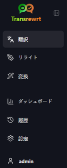
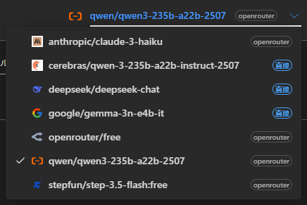
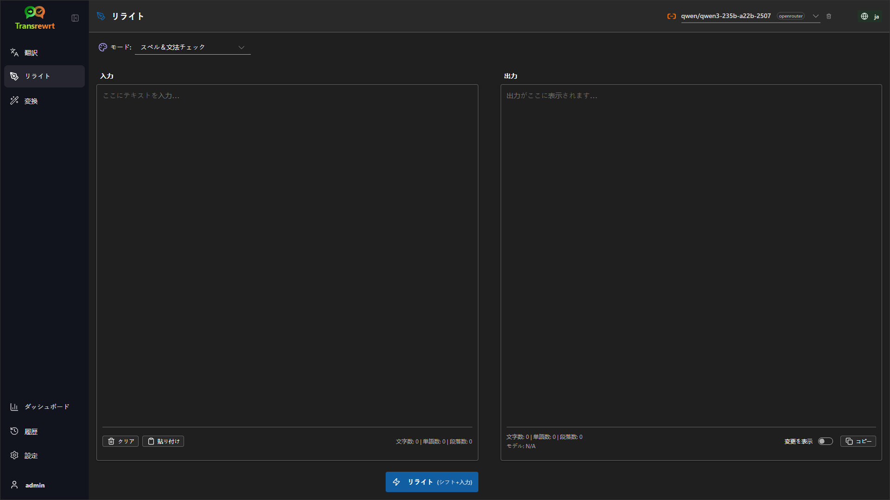
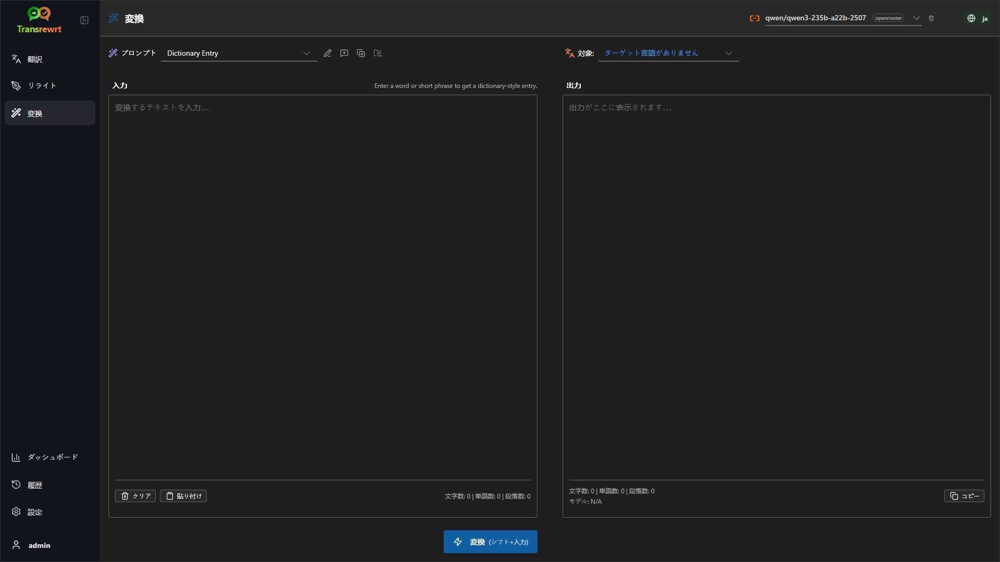
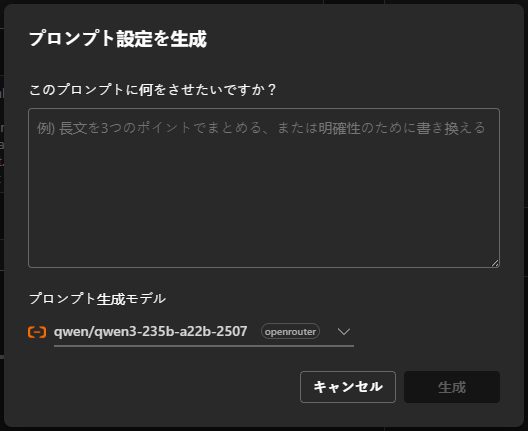
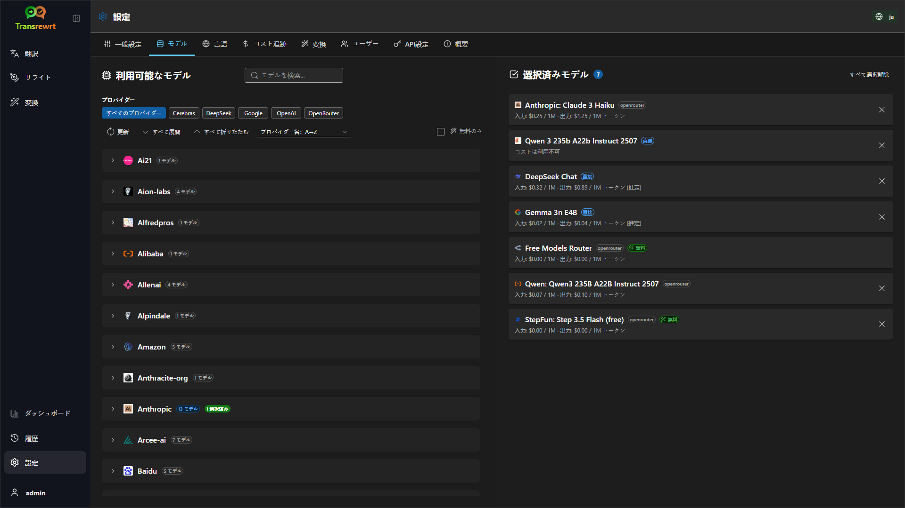

<a id="transrewrt-user-guide"></a>

# ユーザーガイド

<br/>

<a id="introduction"></a>

## 導入

Transrewrt は、テキストを以下の3つの方法で処理するのをサポートします。

- **翻訳（Translate）** - テキストをある言語から別の言語に変換します。
- **書き換え（Rewrite）** - テキストをより明確に、短く、あるいはよりフォーマルなスタイルなど、別の表現に言い換えます。
- **変換（Transform）** - プロンプトと呼ばれるカスタムAI指示を使用してテキストを処理します。

<br/>

このガイドでは、アプリのインストールと起動後の使い方を説明します。インストール手順については、メインの **[README](README.ja.md)** を参照してください。

<br/>

> ℹ️ **注意**<br/>
> Transrewrt は、WindowsおよびLinux向けのデスクトップアプリとして、またセルフホスティング可能なウェブアプリとして利用可能です。このガイドはアプリの日常的な使い方を扱っています。特定のバージョンにのみ適用される機能については、明記しています。

<small>**他の言語で読む：** </small>

<small id="lang-list"> [English (UK)](../USER-GUIDE.md) · [Português (BR)](USER-GUIDE.pt-BR.md) · [العربية](USER-GUIDE.ar.md) · [বাংলা](USER-GUIDE.bn.md) · [Català](USER-GUIDE.ca.md) · [简体中文](USER-GUIDE.zh-CN.md) · [繁體中文](USER-GUIDE.zh-TW.md) · [Hrvatski](USER-GUIDE.hr.md) · [Čeština](USER-GUIDE.cs.md) · [Nederlands](USER-GUIDE.nl.md) · [English (US)](USER-GUIDE.en-US.md) · [Filipino](USER-GUIDE.tl.md) · [Français](USER-GUIDE.fr.md) · [Deutsch](USER-GUIDE.de.md) · [Ελληνικά](USER-GUIDE.el.md) · [हिन्दी](USER-GUIDE.hi.md) · [Magyar](USER-GUIDE.hu.md) · [Italiano](USER-GUIDE.it.md) · [日本語](USER-GUIDE.ja.md) · [Basa Jawa](USER-GUIDE.jv.md) · [한국어](USER-GUIDE.ko.md) · [Bahasa Melayu](USER-GUIDE.ms.md) · [فارسی](USER-GUIDE.fa.md) · [Polski](USER-GUIDE.pl.md) · [Português (PT)](USER-GUIDE.pt.md) · [ਪੰਜਾਬੀ](USER-GUIDE.pa.md) · [Română](USER-GUIDE.ro.md) · [Русский](USER-GUIDE.ru.md) · [Slovenčina](USER-GUIDE.sk.md) · [Español](USER-GUIDE.es.md) · [Kiswahili](USER-GUIDE.sw.md) · [Svenska](USER-GUIDE.sv.md) · [తెలుగు](USER-GUIDE.te.md) · [ภาษาไทย](USER-GUIDE.th.md) · [Türkçe](USER-GUIDE.tr.md) · [Українська](USER-GUIDE.uk.md) · [Tiếng Việt](USER-GUIDE.vi.md)</small>

<small>

> **UI およびドキュメント翻訳に関する注意:** 英語（イギリス）の原文を除くすべてのインターフェース言語は、AI モデルを使用して翻訳されています。そのため、表現が不正確である場合や誤りが含まれる可能性があります。

</small>

<br/>


<!-- START doctoc generated TOC please keep comment here to allow auto update -->
<!-- DON'T EDIT THIS SECTION, INSTEAD RE-RUN doctoc TO UPDATE -->
**目次**

- [開始する前に](#before-you-start)
  - [無料のOpenRouter APIキーの取得方法（デスクトップアプリ）](#how-to-get-a-free-openrouter-api-key-desktop-app)
- [はじめに](#getting-started)
- [ウィンドウの主な部分](#main-parts-of-the-window)
  - [サイドバー](#sidebar)
  - [ツールバー](#toolbar)
  - [入力と出力パネル](#input-and-output-panels)
- [翻訳](#translate)
  - [テキストの翻訳](#translate-text)
  - [言語の選択](#language-selection)
  - [役立つ翻訳設定](#helpful-translation-settings)
- [リライト](#rewrite)
- [トランスフォーム](#transform)
  - [既存のプロンプトを実行する](#run-an-existing-prompt)
  - [まだプロンプトがない場合](#if-you-have-no-prompts-yet)
  - [素早くプロンプトを作成する](#create-a-prompt-quickly)
  - [プロンプトを編集する](#edit-a-prompt)
  - [使用前にプロンプトをテストする](#test-a-prompt-before-using-it)
- [ダッシュボード](#dashboard)
  - [データのフィルタリング](#filter-the-data)
  - [ダッシュボードのタブ](#dashboard-tabs)
  - [データのエクスポート](#export-data)

- [モデルの保存された記録を削除する](#delete-stored-records-for-a-model)
- [履歴](#history)
  - [データをフィルターする](#filter-the-data-1)
  - [履歴データをエクスポートする](#export-history-data)
- [設定](#settings)
  - [一般設定](#general-settings)
  - [モデル](#models)
  - [言語](#languages)
  - [コスト追跡](#cost-tracking)
  - [プロンプトの変換](#transform-prompts)
  - [ユーザー](#users)
  - [API設定](#api-config)
  - [このアプリについて](#about)
- [よくある問題](#common-issues)
  - [アプリがテキストを翻訳、書き換え、変換しない](#the-app-will-not-translate-rewrite-or-transform-text)
  - [モデル一覧が空である](#the-model-list-is-empty)
  - [結果が遅すぎるまたは高すぎる](#the-result-is-too-slow-or-too-expensive)
  - [インターフェースの言語が間違っている](#the-interface-is-in-the-wrong-language)
  - [テキストが小さすぎて読みづらい](#the-text-is-too-small-or-hard-to-read)
  - [ダッシュボードのチャートが空である](#dashboard-charts-are-empty)

- [コストが「利用不可」と表示される、または正しくないように見える](#cost-shows-not-available-or-seems-wrong)
  - [合計コストがプロバイダーの請求額と一致しない](#total-cost-does-not-match-my-provider-bill)
  - [サイドバーから履歴ページが消えている](#the-history-page-is-missing-from-the-sidebar)
  - [Webアプリ：ログインページに予期せずリダイレクトされる](#web-app-redirected-to-the-login-page-unexpectedly)
  - [Web管理者：パスワードを忘れた、または紛失した](#web-admin-forgot-or-lost-a-password)
  - [ダッシュボードに他のユーザーのデータが表示されない（Web）](#dashboard-shows-no-data-for-other-users-web)
  - [プロンプトを変更したが、編集内容を失った](#i-changed-a-prompt-and-lost-the-edits)
- [簡単なヒント](#quick-tips)
- [免責事項](#disclaimer)
- [ライセンス](#license)

<!-- END doctoc generated TOC please keep comment here to allow auto update -->

<br/><br/>

<a id="before-you-start"></a>

## はじめに

Transrewrt を使用するには、少なくとも1つのAIプロバイダーへのアクセスが必要です。対応しているプロバイダーは以下の通りです：[OpenRouter](https://openrouter.ai)（多数のモデルを統合）、OpenAI、Anthropic、Google Gemini、DeepSeek、Groq、Mist irres、xAI、Cerebras、およびローカルモデル向けの[Ollama](https://ollama.com)。

開始するには有料モデルを選択する必要はありません。OpenRouterのAPIキーを追加すると、アプリは自動的に内蔵の**無料**OpenRouterオプションを有効にします。これにより、すぐにテキストの翻訳、書き換え、変換を始めることができます。また、Cerebras、Google、Groq、Mistral AIから無料のAPIキーを取得することもできます。

わかりやすく言えば：

- **モデル**とは、実際の処理を行うAIエンジンのことです。各モデルには**プロバイダー接頭辞**（たとえば `openrouter/…`、`openai/…`、`ollama/…`）付きで表示されます。
- **APIキー**（またはOllamaの場合は**ベースURL**）は、アプリがそのプロバイダーに接続するための手段です。

**デスクトップアプリ**を使用している場合は、使用する各プロバイダーのキーを[**設定** > **API設定**](#api-config)で追加してください。OpenRouterのみを使用する場合は、下記の「[APIキーを取得する方法](#how-to-get-an-api-key-desktop-app)」を参照してください。APIキーを使いたくない場合は、Ollama（[ollama.com](https://ollama.com)から）をインストールし、代わりに`translategemma:4b`などのローカルモデルを使用できます。

**Web版**を使用している場合、プロバイダーはサーバーの管理者が環境変数で設定するため、アプリ内でAPIキーを直接入力することはできません。

<br/>

<a id="how-to-get-an-api-key-desktop-app"></a>

### 無料のOpenRouter APIキーの取得方法（デスクトップアプリ）

デスクトップアプリを使用している場合は、以下の手順に従ってください。

1. Webブラウザで[OpenRouter](https://openrouter.ai)にアクセスします。
2. アカウントを作成するか、サインインします。
3. [Keys](https://openrouter.ai/keys)ページを開きます。
4. 新しいAPIキーを作成するボタンをクリックします。
5. 後で識別できるように、キーに名前を付けます。
6. 新しいAPIキーをコピーします。
7. Transrewrtに戻り、**Settings** > **API Config** を開きます。
8. **OpenRouter API key**（**Settings** > **API Config**内）にキーを貼り付けます。
9. **Test OpenRouter key**をクリックし、正しく動作するか確認します。

<br/><br/>

<a id="getting-started"></a>

## はじめに

初めて Transrewrt を使用する場合は、以下の手順に従ってください：

1. アプリを開く。
2. 必要に応じて、グローブのアイコンから**インターフェース言語**を選択する。
3. **デスクトップアプリ**をご利用の場合は、[**設定** > **API 設定**](#api-config)を開き、少なくとも1つのプロバイダー（たとえば OpenRouter）のAPIキーを追加して、**テスト**をクリックし、正常に接続できるか確認する。
4. [**設定** > **モデル**](#models)を開き、1つ以上のモデルを**選択されたモデル**に追加する。
5. [**設定** > **言語**](#languages)を開き、よく使う言語を優先的に表示したい場合は、**主要言語**を選択する。
6. **翻訳**に移動し、簡単な翻訳を実行して、すべてが正常に機能していることを確認する。
7. それが成功したら、**リライト**を試し、その後で**変換**を試す。

この順序は重要です。アプリに有効なAPI接続や選択されたモデルが設定される前にタスクを実行しようとすることで発生する、最もよくある初回使用時の問題を避けることができます。

<br/><br/>

<a id="main-parts-of-the-window"></a>

## ウィンドウの主な構成要素

このアプリは、以下の3つの主要な領域に分かれています。

- 左側の **サイドバー**。
- 上部の **ツールバー**。
- 中央の **作業領域**。

<br/>

<a id="sidebar"></a>

### サイドバー

サイドバーを使用してアプリ内を移動してください。アプリのロゴ横のアイコンをクリックすることで、サイドバーを折りたたんでスペースを確保できます。

<br/>

<table>
  <tr>
    <td valign="top">
       
    </td>
    <td valign="top">
      <br/><br/>
      <ul>
        <li><strong>翻訳</strong>：翻訳ワークスペースを開きます。</li><br/>
        <li><strong>書き換え</strong>：書き換えワークスペースを開きます。</li><br/>
        <li><strong>変換</strong>：カスタムプロンプトのワークスペースを開きます。</li><br/>
        <li><strong>ダッシュボード</strong>：使用状況やコストの情報を表示します。</li><br/>
        <li><strong>設定</strong>：設定パネルを開きます。</li><br/>
        <li><strong>履歴</strong>：入力テキストと出力テキストを含む使用履歴を表示します。</li><br/>
        <li><strong>ユーザー</strong>：ログインしているユーザーのユーザー名を表示します（Web版のみ）。</li>
      </ul>

</td>
  </tr>
</table>

<br/>

<a id="toolbar"></a>

### ツールバー

ツールバーは、アプリ内の位置によって多少変わります。

- 左側には現在のページ名が表示されます。
- 右側には**モデルセレクタ**と**インターフェース言語**のコントロールが表示されます。

**モデルセレクタ**を使用すると、現在のタスクに使用するAIエンジンを選択できます。

  

無償のモデルの中には、常に利用可能でないものもあります。一時的にオフラインになったり、使用量の上限が設けられている場合があります。このような場合、アプリは自動的にそのモデルを利用可能なリストから除外します。表示されるモデルを管理するには、[**設定** > **モデル**](#models) に移動してモデルの一覧を編集してください。
また、ツールバー内のモデル名の左にあるプロバイダアイコンをクリックすることで、モデル設定を直接開くこともできます。

<br/>

**地球仪のアイコン＋言語コード**は、メニューやボタンなどのアプリインターフェースの言語を変更します。ただし、**翻訳**機能で使用される翻訳言語は変更されません。


<br/>

<a id="input-and-output-panels"></a>

### 入力と出力パネル

ほとんどのワークスペースでは、左側に**入力**パネル、右側に**出力**パネルを使用します。

各パネルには以下の情報も表示されます：

| **入力**                                                          | **出力**                                                                                                                  |
|--------------------------------------------------------------------|-----------------------------------------------------------------------------------------------------------------------------|
| - 文字数 <br/>- 単語数 <br/>- 段落数   <br/> | - 処理に要した時間<br/>- **TPS** (1秒あたりのトークン数)<br/>- 文字、単語、段落の数<br/>- 使用したモデル |

技術的な用語について疑問がある場合は、以下の通りです。

- **トークン** とは、小さなテキストのまとまりを意味します。単語の一部もしくは短い単語と考えてください。
- **TPS** とは、モデルが1秒間に処理するテキストのまとまりの数を意味します。

<br/>

各操作のコスト（利用可能な場合）および合計コストを、「[**設定** > **全般設定**](#general-settings)」で「操作にコスト情報を表示する」オプションを有効にすることで確認することもできます。

<br/><br/>

[--------------------------------------------------------------------------------------------------------------------------]: # 

<a id="translate"></a>

## 翻訳

テキストをある言語から別の言語に変換したい場合は、**翻訳**を使用してください。


<br/>

<a id="translate-text"></a>

### テキストの翻訳

1. **翻訳** を開く。
2. **元の言語** で言語を選択する。
3. **翻訳先** で言語を選択する。
4. ツールバーからモデルを選択する。
5. **入力** にテキストを入力または貼り付ける。
6. **翻訳** をクリックする。
7. **出力** で結果を確認する。
8. 結果をコピーする場合は、コピー用ボタンを使用する。

<br/>

<a id="language-selection"></a>

### 言語の選択

- **From（元の言語）** は特定の言語または **言語を検出** から選択できます。
- **To（翻訳後の言語）** は、結果を表示したい言語を選択します。

選択された **主要言語** は、リストの上部に表示されます。これらは[**設定** > **言語**](#languages)で設定できます。

<br/>

<a id="helpful-translation-settings"></a>

### 役立つ翻訳設定

[**設定** > **全般設定**](#general-settings) で、翻訳の動作を変更できます。

- **貼り付け時に自動翻訳**：テキストを貼り付けた直後に翻訳を実行します。
- **結果をクリップボードに自動コピー**：処理が成功した後、結果を自動的にクリップボードにコピーします。
- **リアルタイム翻訳（入力中）**：テキストを入力している間に翻訳を実行します。
- **タイムアウト（ミリ秒）**：リアルタイム翻訳を開始する前に、アプリがどれくらい待つかを調整します。
- **Enter キーの動作**：`Enter` キーを押したときに何が起こるかを制御します。

<br/><br/>

[--------------------------------------------------------------------------------------------------------------------------]: # 

<a id="rewrite"></a>

## 文章の書き換え

**書き換え**を使用すると、主な意味を変えることなく表現を改善できます。



以下の用途に便利です：

- スペルや文法の訂正（**スペルと文法をチェック**）
- より明確な表現への変更（**明確にする**）
- 一度の操作で複数の異なる言い回しの生成（**別のバージョン**）
- よりフォーマルまたはカジュアルな文章への変更（**フォーマル**／**カジュアル**）
- 文章の短縮または展開（**短くする**／**長くする**）
- より技術的なトーンへの変更（**技術的にする**）

<br/>

> 💡 **ヒント**<br/>
> 「**スペルと文法をチェック**」モードを使用すると、出力パネルに（「コピー」ボタンの隣に）「**変更を表示**」スイッチが表示されます。
> このスイッチをオンまたはオフにすることで、テキストに適用された修正箇所を表示または非表示にできます。

<br/><br/>

[--------------------------------------------------------------------------------------------------------------------------]: # 

<a id="transform"></a>

## 変換

**変換**は、AIにカスタムの指示セットに従って処理を行わせたい場合に使用します。



これはアプリケーションの中で最も柔軟性の高いエリアです。以下のタスクなどに利用できます。

- メモの要約
- 汎用的な文章を洗練されたメールに変換
- 主要ポイントの抽出
- テキストを特定の形式に変換
- 入力テキストを使ったその他のカスタム処理

<br/>

<a id="run-an-existing-prompt"></a>

### 既存のプロンプトを実行する

1. **Transform** を開く。
2. プロンプトリストからプロンプトを選択する。
3. **対象** 言語ボックスが表示された場合は、必要に応じて言語を選択する。
4. **入力**欄にテキストを入力または貼り付ける。
5. **Transform** をクリックする。
6. **出力**欄で結果を確認する。

<br/>

<a id="if-you-have-no-prompts-yet"></a>

### プロンプトがない場合

プロンプトリストが空の場合は、Transformワークスペースで **サンプルプロンプトを読み込む** をクリックしてください。このコントロールは、エクスポート／インポート行にある [**設定** > **Transformプロンプト**](#transform-prompts) でも常に使用できます。どちらを選んでも、組み込みのサンプルが追加され、すばやく作業を開始できます。

<br/>

> ℹ️ **注意**<br/>
> サンプルプロンプトは英語で提供されています。読み込んだ後、プロンプトを編集し、**プロンプトを翻訳** を使ってご使用の言語に翻訳できます。

<br/>

<a id="create-a-prompt-quickly"></a>

### プロンプトをすばやく作成する

プロンプトを作成する最も速い方法は次のとおりです。

1. **新しいプロンプト** をクリックします。
2. **プロンプトを生成** をクリックします。
3. プロンプトに何をさせるかを記述します。
4. モデルを選択します。
5. アプリにドラフトを作成させます。
6. ドラフトを確認し、**保存** をクリックします。




<br/>

<a id="edit-a-prompt"></a>

### プロンプトの編集

プロンプトを作成または編集すると、左側にエディターが表示され、右側にテスト領域が表示されます。


主なフィールドは以下の通りです。

- **プロンプト名**: プロンプトリストに表示される名前です。
- **プロンプトの指示（任意）**: プロンプト実行時にユーザーに表示される短いヒントです。
- **モデルの役割**: 「あなたは役立つアシスタントです」など、AIに与えられる全体的な役割です。
- **モデルの指示（1行に1つずつ）**: AIに従ってもらいたい具体的なルールです。
- **出力の説明**: 結果を短く表す単語。たとえば「要約」や「書き換え」など。
- **Temperature（0.0 → 1.0）**: モデルの挙動を決定します。詳細は以下をご覧ください。
- **対象言語を尋ねる**: プロンプト実行時に、対象言語を選択するセレクターを追加します。

**Temperature** という技術用語が初めての方は、次のように考えてください。

- **低い** Temperature では、より安定して予測可能な結果が得られます。

- **温度を高く**すると、バリエーションや創造性が増します。

また、以下の機能も利用できます：

- **`プロンプトの生成`**：簡単な説明から新しいプロンプト draft を作成
- **`プロンプトの改善`**：既存のプロンプトを洗練
- **`プロンプトの翻訳`**：プロンプトの内容を翻訳

<br/>

> ⚠️ **警告**<br/>
> **`実行に戻る`** をクリックする前に **`保存`** をクリックしてください。保存せずに戻った場合、変更内容は失われます。

<br/>

<a id="test-a-prompt-before-using-it"></a>

### プロンプトを使用する前のテスト

右側のテストパネルを使用すると、日常業務で使う前に、サンプルテキストでプロンプトを試すことができます。

これは以下の状況で便利です。

- 新しいプロンプトを作成している場合
- 複数のプロンプトのバージョンを比較している場合
- トーン、長さ、出力形式を確認したい場合

<br/>

> ℹ️ **注**<br/>
> 保存済みのプロンプトは、[**設定** > **変換プロンプト**](#transform-prompts) からエクスポートおよびインポートできます。

<br/><br/>

[--------------------------------------------------------------------------------------------------------------------------]: # 

<a id="dashboard"></a>

## ダッシュボード

**ダッシュボード**を使用して、アプリの利用量と（有料モデルの場合の）料金を確認できます。


<br/>

> ℹ️ **注意**<br/>
> **無料**のモデルのみを使用している場合、**コスト**の金額はゼロになり、コストに焦点を当てたサマリーは空に見える場合があります。ただし、選択した期間にアクティビティがある場合、**概要**、**時間経過による使用状況**、**モデル別の使用状況**には、**呼び出し回数**（翻訳、書き換え、変換）が引き続き表示されます。

<br/>

<a id="filter-the-data"></a>

### データのフィルタリング

上部のフィルターボタンを使用して、期間を変更してください。


<br/>

> ℹ️ **注**<br/>
> **ユーザー**フィルターは、Web版で管理者にのみ表示されます。通常のユーザーはこのフィルターを見ることはできず、デスクトップアプリでも使用できません。

<br/>

<a id="dashboard-tabs"></a>

### ダッシュボードのタブ

- **概要**：使用状況とコストの概要を確認できます。ここには、時間経過による使用状況（翻訳、リライト、変換の日別累積**呼び出し回数**を積み上げたグラフ）と、モデル別使用状況（翻訳、リライト、変換を含むモデルごとの**合計呼び出し回数**）が含まれます。
- **使用内容別**：翻訳言語、リライトモード、変換プロンプトごとに使用状況を細分化して表示します。
- **モデル別**：使用したモデルとそのコストを確認できます。
- **日別**：日ごとの合計使用量を表示します。
- **すべての呼び出し**：呼び出し履歴の全データを表示し、エクスポートすることもできます。

<br/>

<a id="export-data"></a>

### データのエクスポート

ダッシュボードのテーブルからは、以下の形式でデータをエクスポートできます。

- **JSON**
- **CSV**
- **XLSX**

アプリの外で活動内容を確認したり、レポートを共有したい場合に便利です。

<br/>

<a id="delete-stored-records-for-a-model"></a>

### モデルの保存済みレコードを削除する

**モデル別**または**すべての呼び出し**で、「ごみ箱」アイコンをクリックすることで、特定のモデルの保存済みレコードを削除できます。

> ⚠️ **警告**<br/>
> 保存済みレコードの削除は元に戻せません。履歴が不要になった場合にのみ、この操作を行ってください。

すべてのデータを削除する場合、またはデータの保存期間に基づいてレコードを削除する場合は、[**設定** > **コスト追跡**](#cost-tracking) に移動してください。ここでは、すべての保存データを削除したり、特定の日付より前のデータのみを削除するオプションが利用できます。

<br/><br/>

[--------------------------------------------------------------------------------------------------------------------------]: # 

<a id="history"></a>

## 履歴

**Transrewrt** 内での操作履歴（各処理の入力と出力を含む）を確認するには、**履歴** をクリックしてください。


<br/>

<a id="filter-the-history"></a>

### データのフィルタリング

**履歴**では、**ダッシュボード**ページと同じフィルターを使用します。時間範囲の選択にこれらを使ってください。


<br/>

> ℹ️ **注**<br/>
> **ユーザー**フィルターは、Web版では管理者にのみ表示されます。通常のユーザーはこのフィルターを見ることはできず、またデスクトップアプリでは利用できません。

<br/>

<a id="export-history-data"></a>

### 履歴データのエクスポート

履歴ページでは、フィルタされたデータを以下の形式でエクスポートできます。

- **JSON**
- **CSV**
- **XLSX**

これは、アプリの外で活動を確認したり、レポートを共有したい場合に便利です。

<br/><br/>

[--------------------------------------------------------------------------------------------------------------------------]: # 

<a id="settings"></a>

## 設定

サイドバーから**設定**を開くと、アプリの動作をカスタマイズできます。

利用可能なタブは、使用しているプラットフォームとアカウントの役割に応じて異なります：

| タブ | デスクトップ | Web（管理者） | Web（通常ユーザー） |
|-------------------|:-------:|:-----------:|:------------------:|
| 汎設定 |   はい   |     はい     |        はい         |
| モデル |   はい   |     はい     |        はい         |
| 言語 |   はい   |     はい     |        はい         |
| コスト追跡 |   はい   |     はい     |         —          |
| プロンプト変換 |   はい   |     はい     |        はい         |
| ユーザー |    —    |     はい     |         —          |
| API設定 |   はい   |     はい     |         —          |
| 情報 |   はい   |     はい     |        はい         |

<br/>

> ℹ️ **注記**<br/>
> Web版では、各ユーザーが独自の設定を持っています。選択されたモデル、言語、一般設定、および変換プロンプトなどの設定は、ユーザーごとに保存されます。あなたが行う変更は他のユーザーに影響しません。

<br/>

[--------------------------------------------------------------------------------------------------------------------------]: #

<a id="general-settings"></a>

### 一般設定

**一般設定**を使って、入力の動作方法、**履歴**に処理の詳細を保存するかどうか、および外観を制御できます。

**動作設定**

- **Enterキーの動作**：`Enter` キーでタスクを実行するか、改行を挿入するかを選択します。
- **貼り付け時に自動翻訳**：テキストを貼り付けた瞬間に翻訳を開始します。
- **結果をクリップボードに自動コピー**：成功した結果を自動的にコピーします。
- **リアルタイム翻訳（入力中）**：入力中に自動的に翻訳を行います。
- **タイムアウト（ミリ秒）**：リアルタイム翻訳の待ち時間を設定します。

**履歴**

- **実行履歴を保持する**：各翻訳、書き換え、変換の**入力・出力テキスト**をサイドバーの[**履歴**](#history)ビューに保存するかどうかを制御します。無効にすると確認を求められ、確認した場合はデータベースから保存済みの履歴が削除されます。

- **履歴データの削除**では、**データの削除**を使って、保存されたテキストを時間の経過に基づいて（たとえば数か月以上前、または**すべてのデータ（クリア）**）削除できます。これは**履歴**ビューの保存された実行テキストにのみ影響し、コストまたは使用量の合計データは**削除しません**。**コスト**データを削除または除去するには、[**設定** > **コスト追跡**](#cost-tracking) を使用してください。

**表示**

- **アクションにコスト情報を表示する** — 操作ごとのコスト（利用可能な場合）および「翻訳」「書き換え」「変換」出力パネルの合計コストを表示するかどうかを制御します。
- **コストの小数点以下の桁数** — コストの小数表示の桁数を変更します。
- **Web版のみ:** **アプリの周りに余白を表示する** — インターフェースの周囲に余分なスペースを追加します。
- **フォントファミリー** — テキストパネル内の文字のフォントを変更します。
- **サイズ** — フォントサイズを変更します。

**設定のバックアップ**

- **バックアップに使用データを含める** — 有効にすると、ZIPファイルに実行履歴およびAPI呼び出しのデータも含まれます。

- **設定のバックアップ** — `config.json`、`state.json`、（オプションで）暗号化キー、ユーザー、環境設定、カスタムプロンプト、および利用状況データ（利用に同意している場合）を含む1つのZIPファイル（デフォルトでUTC時刻による名前 `transrewrt-config-backup-YYYY-MM-DD_HHMMSS.zip`）を作成します。バックアップが成功すると、保存されたファイル名が確認メッセージに表示されます。
- **バックアップから復元** — まず**確認ダイアログ**が開きます。ダイアログ内でバックアップ用ZIPファイルを選択してください（**参照**／ファイルピッカー、またはサポートされている環境ではドラッグ＆ドロップが可能）。その後、以下のオプションを確認します：
  - **利用状況データを復元する** — バックアップ時に利用データを含めていた場合に、その履歴データをインポートします。設定とプロンプトのみを復元したい場合は、このオプションを解除してください。
  - **復元前に古い利用データを削除する** — バックアップを適用する前に、このインストールで現在保存されている利用履歴を削除します（任意。完全に置き換えたい場合に使用）。

Web版またはデスクトップ版のいずれかで作成されたバックアップは、もう一方のバージョンで復元できます。デスクトップ版のバックアップをWeb版で復元する場合、データは管理者ユーザーに復元されます。


<br/>

<a id="models"></a>

### モデル

**設定** > **モデル**を使用して、ツールバーに表示されるモデルを選択します。



このページには2つのリストがあります：

- 左側の「使用可能なモデル」
- 右側の「選択されたモデル」

便利なコントロールとして以下があります：

- **モデルを検索…**： 名前でモデルを検索
- **プロバイダー**チップ： リストを特定のエンジン（OpenRouter、OpenAI、Ollamaなど）に限定
- **無料のみ**： 無料モデルのみ表示
- **更新**： リストを再読み込み
- **すべて展開**および**すべて折りたたみ**： プロバイダーごとに並べ替えているときに使用

モデルIDにはプロバイダーのプレフィックスが含まれます（例： `openrouter/…` と `openai/…`）。**OpenAI (OpenRouter)** や **OpenAI (direct)** といったバッジは、トラフィックがどのようにルーティングされるかを示しています。

> ℹ️ **注**<br/>

> **OpenRouter Body Builder** (`openrouter/bodybuilder`) は汎用チャットモデルではなく、ルーターモデルです。このモデルの応答は、OpenRouter API リクエストボディ（たとえば、`model` と `messages` を含む `requests` 配列など）を記述する JSON になります。**翻訳**、**書き換え**、または**変換**のタスクにこれを使用すると、出力パネルには完成したテキストではなくその JSON が表示されます。これらのタスクには通常のテキストモデルを選択してください。詳細は OpenRouter の [Body Builder モデルページ](https://openrouter.ai/openrouter/bodybuilder) をご覧ください。

操作方法：

 - モデルを追加するには、**追加**をクリックするか、エントリ内の任意の場所をクリックしてください。

 - モデルを削除するには、「選択中のモデル」または「利用可能なモデル」の一覧にあるエントリの横の **X** をクリックしてください。

 - リストをクリアするには、**すべて選択解除**をクリックしてください。必須の無料モデルはリストに残ります。

<br/>

> ℹ️ **注意**<br/>

> OpenRouter にすぐにクレジットを追加したくない場合は、まずは **無料モデルのみ** を有効にして、無料モデル（クレジットカード不要）を選んでください。また、APIキーなしでローカルでモデルを実行するためにOllamaを使用することもできます。

<br/>

<a id="languages"></a>

### 言語

アプリ内の言語リストを管理するには、**設定** > **言語** を使用します。

- **主要言語**は、**翻訳**および**変換**画面の言語リスト上部に固定されます。
- **カスタム言語**を使用すると、標準で用意されていない言語を追加できます。

カスタム言語を追加した場合、標準の選択肢の横にその言語が言語選択欄に表示されます。

<br/>

<a id="cost-tracking"></a>

### コストの追跡

**設定** > **コストの追跡** を使用して、コスト情報の管理を行います。

- **総コスト**：現在までの累計コストを表示します。
- **値をコピー**：累計コストをクリップボードにコピーします。
- **コストをリセット**：保存された累計コストをゼロにリセットします。
- **API キーの使用量と同期**：OpenRouter アカウントで報告されている使用量に応じて、累計コストを調整します（OpenRouterのみ対応）。
- **API キーの使用量**：利用可能な場合に、OpenRouter の使用詳細を表示します。
- **コストデータの削除**：すべてのデータ、または選択した日付より前のエントリを削除します。

**コストの追跡について**：OpenRouterモデルを使用している場合、アプリはOpenRouterから提供されるコスト情報をもとに、実際の利用状況および支出額を表示します。その他のプロバイダーについては、OpenRouterが公開している価格をもとにコストを推定します。価格情報が利用できない場合は、推定値がゼロになることがあります。

<br/>

> ℹ️ **注意**<br/>
> **すべてのコスト数値は参考用の推定値であり、正式な請求書ではありません。**

<br/>

> ⚠️ **警告**<br/>

> データの削除は元に戻せません。削除する前に、必ずデータをバックアップするか、[**履歴**](#history)  
> または [**ダッシュボード** > **すべての呼び出し**](#dashboard-tabs) からエクスポートしてください。  
> そうしないと、データは完全に失われます。  
> 各API呼び出しエントリに関連するすべての入出力履歴も併せて削除されます。


<br/>

<a id="transform-prompts"></a>

### プロンプトの変換

**設定** > **プロンプトの変換** を使用して、複数のプロンプトを一括で管理できます。

以下の操作が可能です。

- 保存済みのプロンプトを確認する
- プロンプトを削除する
- ファイルからプロンプトをインポートする
- バックアップや共有のためにプロンプトをエクスポートする
- サンプルプロンプトをプロンプトリストに読み込む

<br/>

<a id="users"></a>

### ユーザー

**ユーザー**を使用して、Web版のユーザーアカウントを管理します。ユーザーの追加、詳細の更新、パスワードのリセット、アカウントの削除ができます。

<br/>

<a id="api-config"></a>

### API設定

サポートされているプロバイダーは以下のとおりです：OpenRouter、OpenAI、Anthropic、Google Gemini、DeepSeek、Groq、Mistral、xAI、Cerebras、および**Ollama**（ベースURL経由のローカルモデル）。使用するプロバイダーのみを設定する必要があります。

**ウェブアプリケーション：管理者のみ**

APIキーは、システムまたはDockerの環境変数を通じて設定されます。Web UIで入力するものではありません。このページでは、どのプロバイダーにキーが設定されているかを確認でき、各プロバイダーの横にある**`テスト`**ボタンをクリックして接続テストが行えます。

<br/>

> ℹ️ **注**<br/>
> APIキーを変更するには、システムまたはDockerの設定で環境変数を更新し、サーバーまたはコンテナを再起動してください。

> ℹ️ **注**<br/>

> **設定のバックアップ**（[**全般設定** → 構成バックアップ](#general-settings)を参照）では、ZIPの`config.json`内に**解決済み**のプロバイダーのキーを含めることができます。そのZIPを復元した場合、これらのキーがサーバーの保持されている設定ファイルに再びコピーされることはありません。実行中のキーは、前述の方法で環境変数および既存のファイル状態から引き続き取得されます。

<br/>

**デスクトップアプリケーション**

使用している各プロバイダーのAPIキーは、**API構成**に保存してください。Ollamaの場合は、APIキーの代わりに**ベースURL**を入力します。

<br/>

> 💡 **ヒント** <br/>
> APIキーを使用したくない、または利用料金を支払いたくない場合は、[Ollamaをダウンロード](https://ollama.com)して、`translategemma:4b` などのモデルを自分のマシンで無料でローカル実行できます。また、OpenRouterの無料アカウントを作成すれば（クレジットカード不要）無料モデルを利用できます。他にもCerebras、Google、Groq、Mistral AIなどから無料のAPIキーを取得することも可能です。

- 必要なプロバイダーのみを追加してください。**設定** > **モデル** で、各モデルIDはプロバイダー名で始まります（例: `openrouter/openrouter/free`、`openai/gpt-4o`、`ollama/llama3`）。

APIキーを追加するには、テキストフィールドに値を入力し、**`保存`** をクリックします。既存のキーを置き換えるには、**`編集`** をクリックします。キーが正常に動作しているかを確認するには、**`テスト`** をクリックします。OllamaのベースURLの場合は、接続を確認するために必ず**`テスト`**をクリックしてください。

<br/>

> ℹ️ **注意**<br/>
> APIキーの現在の値を確認することはできません。**`編集`** ボタンを使って置き換えることのみ可能です。
> APIキーは構成設定内に暗号化されて保存されます。

<br/>

<a id="about"></a>

### 概要

**概要** タブには以下の情報が表示されます：

- アプリ名
- バージョン番号
- ビルド日
- プロジェクトリポジトリへのリンク

<br/><br/>

<a id="common-issues"></a>

## よくある問題

期待通りに動作しない場合は、まず以下の点を確認してください。

<br/>

<a id="the-app-will-not-translate-rewrite-or-transform-text"></a>

### アプリがテキストを翻訳、書き換え、または変換しない

以下の項目を確認してください。

- ツールバーでモデルが選択されていること
- [**設定** > **モデル**](#models) に少なくとも1つのモデルが登録されていること
- APIの設定が正常に動作していること

デスクトップアプリを使用している場合：

1. [**設定** > **API設定**](#api-config) を開く。
2. 少なくとも1つのAPIキーが保存されていることを確認する。
3. プロバイダーの横にある**テスト**をクリックし、キーが正常に動作していることを確認する。

<br/>

<a id="the-model-list-is-empty"></a>

### モデルリストが空です

[**設定** > **モデル**](#models) を開き、「更新」をクリックしてください。

必要に応じて：

- モデルを検索する
- **無料のみ** を有効にする
- 1つ以上のモデルを **選択されたモデル** に追加する

<br/>

<a id="the-result-is-too-slow-or-too-expensive"></a>

### 結果が遅すぎるまたはコストが高すぎる

以下のいずれかを試してください：

- 異なるモデルを選択する
- 入力内容をより短くする
- [**設定** > **一般設定**](#general-settings)で**入力中のリアルタイム翻訳**を無効にする
- 簡単なタスクには無料のモデルを使用する（[モデル](#models)を参照）

<br/>

<a id="the-interface-is-in-the-wrong-language"></a>

### インターフェースの言語が正しくない

[ツールバー](#toolbar) の地球儀のアイコンをクリックし、希望する **インターフェース言語** を選択してください。

<br/>

<a id="the-text-is-too-small-or-hard-to-read"></a>

### テキストが小さすぎて読みづらい、または読みにくい

「**設定** > **全般設定**」を開き、以下を変更してください。

- **フォントファミリー**
- **サイズ**

<br/>

<a id="dashboard-charts-are-empty"></a>

### ダッシュボードのグラフが空です

以下の場合は、これが正常です。

- **無料モデル**のみを使用していて、**コスト**の数値を確認している場合（この場合、コストはゼロである可能性があります）。**概要（Summary）** の**使用量**に関する呼び出し回数のグラフは、選択された期間のデータをまだ必要としています。
- 選択された**時間フィルター**が、呼び出しが行われた期間をカバーしていない場合です。確認するには、**すべて（All）** を選択してみてください。

**すべて（All）** を選択してもグラフが空のままである場合は、[**履歴（History）**](#history) または **すべての呼び出し（All Calls）** タブに呼び出しが表示されるかを確認してください。

<br/>

<a id="cost-shows-not-available-or-seems-wrong"></a>

### 料金が「利用不可」と表示される場合や、料金が正しくない場合

**OpenRouter** を介してモデルを使用している場合、アプリはOpenRouterが報告した実際の使用料金を表示します。

**その他のプロバイダー**（OpenAI直接、Anthropic直接など）については、料金はOpenRouterが公表している価格データに基づいて計算されます。モデルに一致する価格が見つからない場合は、料金が **利用不可** と表示され、累計金額に加算されることはありません。

<br/>

<a id="total-cost-does-not-match-my-provider-bill"></a>

### 合計コストがプロバイダーの請求額と一致しません

アプリ内に表示されるすべてのコスト数値は、**参考用の見積もり**であり、正式な請求書ではありません。

合計金額を実際のOpenRouterの利用金額により近づけるには、[**設定** > **コストの追跡**](#cost-tracking) を開き、「APIキーの使用量と同期」をクリックしてください。

<br/>

<a id="the-history-page-is-missing-from-the-sidebar"></a>

### サイドバーに履歴ページが表示されていない

**実行履歴を保持する** 機能が無効になっている可能性があります。「[**設定** > **全般設定**](#general-settings)」を開いて、この機能を有効にしてください。オンにしても、それ以前に削除された履歴データが復元されることはありません。

<br/>

<a id="web-app-session-expired"></a>

### Webアプリ：ログインページに予期せずリダイレクトされる

セッションがタイムアウトしている可能性があります。再度ログインしてください。頻繁に発生する場合は、サーバーのセッション有効期限設定を確認してください。

<br/>

<a id="web-admin-forgot-or-lost-a-password"></a>

### Web管理者：パスワードを忘れた、または紛失した場合

これはデスクトップ版（Electron）ではなく、**自己ホスト型のWebアプリ**（Docker）に適用されます。

- 他の管理者がまだログインできる場合は、[**設定** > **ユーザー**](#users) に移動し、対象のアカウントを選択して、そこから**新しいパスワード**を設定できます。
- **アクセスできなくなった**けれど、マシンまたはコンテナに**シェルアクセス**がある場合、イメージに同梱されているツールを使用してパスワードをリセットできます（デフォルト名を変更している場合は `transrewrt` を置き換えてください。パスワードにスペースや特殊文字が含まれる場合は、クォートで囲んでください）。

```bash
docker exec transrewrt reset-web-password '<username>' '<new-password>'
```

他のアカウントを作成していない場合、デフォルトの管理者ユーザー名は `admin` です。引数を1つだけ指定した場合、それは `admin` の新しいパスワードとして扱われます。

Dockerではなく、**ソースコードから実行**している場合は、以下を使用してください。

```bash
pnpm run reset-web-password -- <username> <new-password>

スクリプトはSQLiteデータベース内のユーザー情報を更新します（不足している場合、`admin`ユーザーを作成することもできます）。リセット後は、新しいパスワードでサインインしてください。


<br/>

<a id="dashboard-shows-no-data-for-other-users"></a>

### ダッシュボードに他のユーザーのデータが表示されない（Web）

**管理者**のみが**ユーザー**フィルターを使用してすべてのユーザーのデータを閲覧できます。通常のユーザーは、設計上、自分自身の活動内容のみが表示されます。

<br/>

<a id="i-changed-a-prompt-and-lost-the-edits"></a>

### プロンプトを変更したが、編集内容が失われた場合

プロンプトを編集する際は、**「Runに戻る」** をクリックする前に、必ず **「保存」** をクリックしてください。

<br/><br/>

<a id="quick-tips"></a>

## すぐに使えるヒント

- 最初に [**翻訳 (Translate)**](#translate) を使用してセットアップが正常に動作することを確認し、その後 [**書き換え (Rewrite)**](#rewrite) や [**変換 (Transform)**](#transform) を試しましょう。
- 日常的な文章の改善には [**書き換え (Rewrite)**](#rewrite) を使いましょう。
- 特定のタスクを繰り返し行うワークフローが必要な場合は [**変換 (Transform)**](#transform) を使いましょう。
- 利用状況やコストを確認したい場合は [**ダッシュボード (Dashboard)**](#dashboard) を使いましょう。
- 過去の操作とその入力・出力テキストを確認するには [**履歴 (History)**](#history) を使いましょう。
- プロンプトライブラリを作成していて安全に保管したい場合や、他の人と共有したい場合は、定期的にプロンプトをエクスポートしましょう（[変換用プロンプト (Transform Prompts)](#transform-prompts) を参照）。

<br/><br/>

<a id="disclaimer"></a>

## 免責事項

商品名およびアイコンはそれぞれの所有者に帰属し、識別目的でのみ使用しています。本ソフトウェアは、言及されているブランドと一切関係なく、それらの支援や承認も受けておりません。

<br/><br/>

<a id="license"></a>

## ライセンス

Copyright © 2026 Waldemar Scudeller Jr.

[Apache License 2.0](LICENSE)