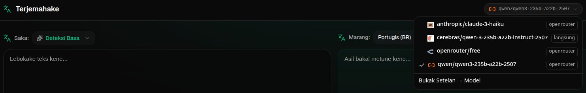

<a id="transrewrt-user-guide"></a>
# Pandhuan Panganggo

<br/>

<a id="introduction"></a>
## Pambuka

Transrewrt mbantu sampeyan ngolah tèks kanthi telung cara utama:

- **Terjemahna** - ngowahi tèks saka siji basa menyang basa liyane.
- **Tulis Ulang** - ngowahi gaya tèks kanthi cara liyane, kaya luwih jelas, luwih cendhak, utawa luwih resmi.
- **Transformasi** - ngolah tèks nggunakake instruksi AI kustom sing diarani prompt.

<br/>

Pandhuan iki nerangake carane nggunakake aplikasi sawise diinstal lan dijalanake. Kanggo langkah instalasi, deleng **[README](README.jv.md)** utama.

<br/>

> ℹ️ **CATETAN**<br/>
> Transrewrt kasedhiya minangka aplikasi desktop kanggo Windows lan Linux, lan minangka aplikasi web sing bisa dipasang dhewe. Pandhuan iki fokus marang panggunaan saben dina aplikasi kasebut. Yen ana sing mung lumrah kanggo siji vèrsi, bakal ditandhani kanthi jelas.

<small>**Macca ing basa liya:** </small>
<small id="lang-list"> [English (UK)](../USER-GUIDE.md) · [Português (BR)](USER-GUIDE.pt-BR.md) · [العربية](USER-GUIDE.ar.md) · [বাংলা](USER-GUIDE.bn.md) · [Català](USER-GUIDE.ca.md) · [简体中文](USER-GUIDE.zh-CN.md) · [繁體中文](USER-GUIDE.zh-TW.md) · [Hrvatski](USER-GUIDE.hr.md) · [Čeština](USER-GUIDE.cs.md) · [Nederlands](USER-GUIDE.nl.md) · [English (US)](USER-GUIDE.en-US.md) · [Filipino](USER-GUIDE.tl.md) · [Français](USER-GUIDE.fr.md) · [Deutsch](USER-GUIDE.de.md) · [Ελληνικά](USER-GUIDE.el.md) · [हिन्दी](USER-GUIDE.hi.md) · [Magyar](USER-GUIDE.hu.md) · [Italiano](USER-GUIDE.it.md) · [日本語](USER-GUIDE.ja.md) · [Basa Jawa](USER-GUIDE.jv.md) · [한국어](USER-GUIDE.ko.md) · [Bahasa Melayu](USER-GUIDE.ms.md) · [فارسی](USER-GUIDE.fa.md) · [Polski](USER-GUIDE.pl.md) · [Português (PT)](USER-GUIDE.pt.md) · [ਪੰਜਾਬੀ](USER-GUIDE.pa.md) · [Română](USER-GUIDE.ro.md) · [Русский](USER-GUIDE.ru.md) · [Slovenčina](USER-GUIDE.sk.md) · [Español](USER-GUIDE.es.md) · [Kiswahili](USER-GUIDE.sw.md) · [Svenska](USER-GUIDE.sv.md) · [తెలుగు](USER-GUIDE.te.md) · [ภาษาไทย](USER-GUIDE.th.md) · [Türkçe](USER-GUIDE.tr.md) · [Українська](USER-GUIDE.uk.md) · [Tiếng Việt](USER-GUIDE.vi.md)</small>

<small>

> **Catetan babagan terjemahan UI lan dokumentasi:** Kabeh basa antarmuka kajaba Inggris (UK) asli
> diterjemahake nggunakake model AI; basa bisa ora pas utawa ngandhut kesalahan.

</small>

<br/>

<!-- START doctoc generated TOC please keep comment here to allow auto update -->
<!-- DON'T EDIT THIS SECTION, INSTEAD RE-RUN doctoc TO UPDATE -->
**Tabel Isi**

- [Sadurunge miwiti](#before-you-start)
  - [Carane entuk kunci API OpenRouter gratis (aplikasi desktop)](#how-to-get-a-free-openrouter-api-key-desktop-app)
- [Mulai nggunakake](#getting-started)
- [Bagéan utama jendhela](#main-parts-of-the-window)
  - [Sidebar](#sidebar)
  - [Toolbar](#toolbar)
  - [Panel input lan output](#input-and-output-panels)
- [Terjemahan](#translate)
  - [Terjemahna tèks](#translate-text)
  - [Pemilihan basa](#language-selection)
  - [Setelan terjemahan sing migunani](#helpful-translation-settings)
- [Tulis Ulang](#rewrite)
- [Transformasi](#transform)
  - [Jalankan prompt sing wis ana](#run-an-existing-prompt)
  - [Yen durung duwe prompt](#if-you-have-no-prompts-yet)
  - [Gawe prompt kanthi cepet](#create-a-prompt-quickly)
  - [Sunting prompt](#edit-a-prompt)
  - [Tes prompt sadurunge digunakake](#test-a-prompt-before-using-it)
- [Dasbor](#dashboard)
  - [Filter data](#filter-the-data)
  - [Tab dasbor](#dashboard-tabs)
  - [Ekspor data](#export-data)
  - [Busak cathetan sing disimpen kanggo model](#delete-stored-records-for-a-model)
- [Riwayat](#history)
  - [Filter data](#filter-the-data-1)
  - [Ekspor data riwayat](#export-history-data)
- [Setelan](#settings)
  - [Setelan umum](#general-settings)
  - [Model](#models)
  - [Basa](#languages)
  - [Pelacakan biaya](#cost-tracking)
  - [Prompt transformasi](#transform-prompts)
  - [Pangguna](#users)
  - [Konfigurasi API](#api-config)
  - [Babagan](#about)
- [Masalah umum](#common-issues)
  - [Aplikasi ora bisa menerjemah, nulis ulang, utawa ngowahi tèks](#the-app-will-not-translate-rewrite-or-transform-text)
  - [Dhaptar model kosong](#the-model-list-is-empty)
  - [Asilé alon banget utawa larang banget](#the-result-is-too-slow-or-too-expensive)
  - [Antarmuka nganggo basa sing salah](#the-interface-is-in-the-wrong-language)
  - [Tèks cilik banget utawa angel diwaca](#the-text-is-too-small-or-hard-to-read)
  - [Grafik dasbor kosong](#dashboard-charts-are-empty)
  - [Biaya nuduhake "ora kasedhiya" utawa katon salah](#cost-shows-not-available-or-seems-wrong)
  - [Total biaya ora cocog karo tagihan panyedhiya](#total-cost-does-not-match-my-provider-bill)
  - [Kaca Riwayat ilang saka sidebar](#the-history-page-is-missing-from-the-sidebar)
  - [Aplikasi web: dialihake menyang kaca login kanthi ora dikarepake](#web-app-redirected-to-the-login-page-unexpectedly)
  - [Admin web: lali utawa ilang sandhi](#web-admin-forgot-or-lost-a-password)
  - [Dasbor ora nuduhake data kanggo pangguna liyane (web)](#dashboard-shows-no-data-for-other-users-web)
  - [Aku ngowahi prompt lan ilang suntingan](#i-changed-a-prompt-and-lost-the-edits)
- [Tip cepet](#quick-tips)
- [Penafian](#disclaimer)
- [Lisensi](#license)

<!-- END doctoc generated TOC please keep comment here to allow auto update -->

<br/><br/>

<a id="before-you-start"></a>
## Sadurunge miwiti

Kanggo nggunakake Transrewrt, sampeyan kudu duwe akses menyang paling ora siji panyedhiya AI. Panyedhiya sing didhukung yaiku: [OpenRouter](https://openrouter.ai) (sing nggabungake akeh model), OpenAI, Anthropic, Google Gemini, DeepSeek, Groq, Mistral, xAI, Cerebras, lan [Ollama](https://ollama.com) kanggo model lokal.

Sampeyan ora kudu milih model mbayar kanggo miwiti. Sawise sampeyan nambahake kunci API OpenRouter, aplikasi sacara otomatis ngaktifake pilihan OpenRouter **gratis** sing dibangun. Iki ngidini sampeyan langsung miwiti menerjemahake, nulis ulang, lan ngowahi teks. Alternatif, sampeyan uga bisa entuk kunci API gratis saka Cerebras, Google, Groq, utawa Mistral AI.

Ing basa sing gampang:

- Siji **model** yaiku mesin AI sing nindakake tugas. Model dicantumake kanthi **prefiks panyedhiya** (contone `openrouter/…`, `openai/…`, `ollama/…`).
- Siji **kunci API** (utawa, kanggo Ollama, **URL dhasar**) yaiku cara aplikasi ngakses panyedhiya kasebut.

Yen sampeyan nggunakake **aplikasi desktop**, tambahake kunci ing [**Setelan** > **Konfigurasi API**](#api-config) kanggo saben panyedhiya sing digunakake. Kanggo panggunaan mung OpenRouter, deleng [Cara entuk kunci API](#how-to-get-an-api-key-desktop-app) ing ngisor iki. Yen sampeyan ora pengin nggunakake kunci API, sampeyan bisa nginstal Ollama (saka [ollama.com](https://ollama.com)) lan nggunakake model lokal minangka gantine, kayata `translategemma:4b`.

Yen sampeyan nggunakake **versi web**, pemilik server ngonfigurasi panyedhiya nganggo variabel lingkungan, dadi sampeyan ora bisa ngetik kunci API langsung ing aplikasi.

<br/>

<a id="how-to-get-an-api-key-desktop-app"></a>
### Cara entuk kunci API OpenRouter gratis (aplikasi desktop)

Yen sampeyan nggunakake aplikasi desktop, tindakake langkah-langkah iki:

1. Menyang [OpenRouter](https://openrouter.ai) ing browser web sampeyan.
2. Gawe akun utawa mlebu.
3. Buka kaca [Keys](https://openrouter.ai/keys).
4. Klik tombol kanggo nggawe kunci API anyar.
5. Beri jeneng kanggo kunci supaya bisa dikenali mengko.
6. Salin kunci API anyar kasebut.
7. Balia menyang Transrewrt lan buka **Setelan** > **Konfigurasi API**.
8. Tempel kunci kasebut menyang **Kunci API OpenRouter** (ing ngisor **Setelan** > **Konfigurasi API**).
9. Klik **Tes kunci OpenRouter** kanggo mastekake bisa digunakake.

<br/><br/>

<a id="getting-started"></a>
## Miwiti

Yen iki wektu pisanan sampeyan nggunakake Transrewrt, tindakake urutan iki:

1. Buka aplikasi.
2. Pilih **Basa antarmuka** sampeyan saka ikon globe yen perlu.
3. Yen sampeyan nggunakake **aplikasi desktop**, buka [**Setelan** > **Konfigurasi API**](#api-config), tambah kunci API kanggo paling ora siji panyedhiya (contone OpenRouter), lan klik **Tes** kanggo mastekake bisa digunakake.
4. Buka [**Setelan** > **Model**](#models) lan tambah siji utawa luwih model menyang **Model Sing Dipilih**.
5. Buka [**Setelan** > **Basa**](#languages) lan pilih **Basa utama** sampeyan yen pengin basa sing paling asring digunakake katon dhisik.
6. Menyang **Terjemahan** lan jalanake terjemahan sederhana kanggo mastekake kabeh bisa digunakake.
7. Sawise iku bisa digunakake, coba **Tulis Ulang** banjur **Transformasi**.

Urutan iki penting. Iki nyegah masalah paling umum nalika nggunakake pertama kali: nyoba nindakake tugas sadurunge aplikasi duwe koneksi API sing bisa digunakake utawa model sing dipilih.

<br/><br/>

<a id="main-parts-of-the-window"></a>
## Bagéyan utama jendhela

Aplikasi dibagi dadi telung bagéyan utama:

- **Sidebar** ing sisih kiwa.
- **Toolbar** ing sisih ndhuwur.
- **Area kerja** ing tengah.

<br/>

<a id="sidebar"></a>
### Sidebar

Gunakake sidebar kanggo pindah-pindah ing aplikasi. Sampeyan bisa nutup sidebar kanggo entuk ruang luwih kanthi klik ikon ing samping logo aplikasi.

<br/>

<table>
  <tr>
    <td valign="top">
       
    </td>
    <td valign="top">
      <br/><br/>
      <ul>
        <li><strong>Terjemahan</strong> mbukak workspace terjemahan.</li><br/>
        <li><strong>Tulis Ulang</strong> mbukak workspace nulis ulang.</li><br/>
        <li><strong>Transformasi</strong> mbukak workspace prompt khusus.</li><br/>
        <li><strong>Dashboard</strong> nuduhake informasi panggunaan lan biaya.</li><br/>
        <li><strong>Setelan</strong> mbukak panel setelan.</li><br/>
        <li><strong>Riwayat</strong> nuduhake riwayat panggunaan kanthi teks input lan output</li><br/>
        <li><strong>Panganggo</strong> nuduhake jeneng pangguna sing mlebu (mung web).</li>
      </ul>
    </td>
  </tr>
</table>

<br/>

<a id="toolbar"></a>
### Toolbar

Toolbar owah sithik gumantung ing ngendi sampeyan ana ing aplikasi.

- Ing kiwa, nuduhake jeneng kaca saiki.
- Ing tengen, nuduhake **pemilih model** lan kontrol **Basa antarmuka**.

**Pemilih model** ngidini sampeyan milih mesin AI sing arep digunakake kanggo tugas saiki.



Sawetara model gratis bisa uga ora tansah kasedhiya—kadhangkala offline utawa duwe wates panggunaan. Yen iki kedadeyan, aplikasi bakal sacara otomatis mbusak model kasebut saka dhaptar sing kasedhiya. Kanggo ngontrol model sing muncul, menyang [**Setelan** > **Model**](#models) lan sunting dhaptar model sampeyan. 
Sampeyan uga bisa mbukak setelan model langsung kanthi klik ikon panyedhiya ing kiwa jeneng model ing toolbar.

<br/>

**Ikon globe + kode basa** ngowahi basa antarmuka aplikasi, kaya menu lan tombol. Iki ora **ngganti** basa terjemahan sing digunakake ing **Terjemahan**.


<br/>

<a id="input-and-output-panels"></a>
### Panel input lan output

Kebanyakan workspace nggunakake panel **Input** ing kiwa lan panel **Output** ing tengen.

Saben panel uga nuduhake:

| **Input**                                                          | **Output**                                                                                                                  |
|--------------------------------------------------------------------|-----------------------------------------------------------------------------------------------------------------------------|
| - Jumlah karakter <br/>- Jumlah tembung <br/>- Jumlah paragraf   <br/> | - Durasi tugas rampung<br/>- **TPS** (token saben detik)<br/>- Jumlah karakter, tembung, lan paragraf<br/>- Model sing digunakake |

Yen sampeyan penasaran babagan istilah teknis:

- **Token** tegese potongan cilik teks. Sampeyan bisa nganggep minangka bagian tembung utawa tembung cendhak.
- **TPS** tegese jumlah potongan teks sing diproses model saben detik.

<br/>

Sampeyan uga bisa ngawasi biaya saben operasi (yen kasedhiya) lan total biaya, kanthi ngaktifake opsi `Tuduhna informasi biaya ing tindakan` ing [**Setelan** > **Setelan Umum**](#general-settings).

<br/><br/>

[--------------------------------------------------------------------------------------------------------------------------]: #

<a id="translate"></a>
## Terjemahna

Gunakake **Terjemahna** nalika sampeyan arep ngowahi teks saka siji basa menyang basa liyane.


<br/>

<a id="translate-text"></a>
### Terjemahna teks

1. Buka **Terjemahna**.
2. Pilih basa ing **Saka**.
3. Pilih basa ing **Menyang**.
4. Pilih model ing toolbar.
5. Ketik utawa tempel teks menyang **Input**.
6. Klik **Terjemahna**.
7. Deleng asilé ing **Output**.
8. Gunakake tombol salin yen sampeyan arep nyalin asilé.

<br/>

<a id="language-selection"></a>
### Pemilihan basa

- **Saka** bisa dadi basa tartamtu utawa **Deteksi Basa**.
- **Menyang** yaiku basa sing arep digunakake kanggo asil.

Pilihan **Basa utama** sampeyan muncul ing ndhuwur dhaptar. Sampeyan bisa ngatur iki ing [**Setelan** > **Basa**](#languages).

<br/>

<a id="helpful-translation-settings"></a>
### Setelan terjemahan sing migunani

Ing [**Setelan** > **Setelan Umum**](#general-settings), sampeyan bisa ngganti cara kerja terjemahan:

- **Otomatis nerjemahake nalika tempel** nglakokake terjemahan sawise sampeyan nempelake teks.
- **Otomatis nyalin asil menyang clipboard** nyalin asil sacara otomatis sawise proses rampung.
- **Terjemahan langsung (nalika ngetik)** nglakokake terjemahan nalika sampeyan ngetik.
- **Batas wektu (ms)** ngatur suwe aplikasi nunggu sadurunge nglakokake terjemahan langsung.
- **Enter** ngatur apa sing kelakon nalika sampeyan menek `Enter`:

<br/><br/>

[--------------------------------------------------------------------------------------------------------------------------]: #

<a id="rewrite"></a>
## Tulis Ulang

Gunakake **Tulis Ulang** nalika sampeyan pengin nambahi gaya basa tanpa ngganti makna utama.


Fitur iki migunani kanggo:

- mbenerake ejaan lan tata basa (**Priksa Ejaan & Tata Basa**)
- ndadekake teks luwih jelas (**Ningkatake Kejelasan**)
- sawetara bentuk ulang sing béda ing siji proses (**Versi alternatif**)
- ndadekake teks luwih resmi utawa kurang resmi (**Formal** / **Informal**)
- ngecakake utawa ngamplakake teks (**Cekakke** / **Ambakke**)
- ndadekake teks kaya luwih teknis (**Gawe Teknis**)

<br/>

> 💡 **TIP**<br/>
> Nalika sampeyan nggunakake modus "**Priksa Ejaan & Tata Basa**", sawijining saklar **Tampilkan owahan.** bakal mucul ing panel output (sabenjure **Salin**).
> Aktifake utawa mateni kanggo nuduhake utawa ndhelikake koreksi spesifik sing diterapake ing teks panjenengan.

<br/><br/>

[--------------------------------------------------------------------------------------------------------------------------]: #

<a id="transform"></a>
## Transformasi

Gunakake **Transformasi** nalika sampeyan pengin AI nututi dhawuh khusus sing digawe dhewe.


Iki minangka bagéan paling fleksibel saka aplikasi. Sampeyan bisa nggunakake kanggo tugas-tugas kaya:

- ringkesan cathetan
- ngowahi teks kasar dadi email sing rapi
- ngambil poin utama
- ngowahi teks dadi format tartamtu
- aktivitas khusus liyane kanthi teks input

<br/>

<a id="run-an-existing-prompt"></a>
### Jalanke prompt sing wis ana

1. Buka **Transformasi**.
2. Pilih prompt saka dhaptar prompt.
3. Yen kotak **Sasaran** basa mucul, pilih basa yen perlu.
4. Ketik utawa tempel teks menyang **Input**.
5. Klik **Transformasi**.
6. Deleng asilé ing **Output**.

<br/>

<a id="if-you-have-no-prompts-yet"></a>
### Yen durung duwe prompt

Yen dhaptar prompt kosong, klik **Muat conto prompt** ing workspace Transformasi. Kontrol sing padha uga kasedhiya ing [**Setelan** > **Prompt transformasi**](#transform-prompts) ing baris ekspor/impor. Kaloro pilihan iki nambahake conto sing wis diintegrasikake supaya sampeyan bisa miwiti kanthi cepet.

<br/>

> ℹ️ **CATETAN**<br/>
> Conto prompt diwenehake ing basa Inggris. Sawise diunduh, sampeyan bisa nyunting prompt lan nggunakake **Terjemahake dhawuh** kanggo menerjemahakéé dadi basa panjenengan.

<br/>

<a id="create-a-prompt-quickly"></a>
### Gawe prompt kanthi cepet

Cara paling cepet kanggo gawe prompt yaiku:

1. Klik **Prompt anyar**.
2. Klik **Gawe prompt**.
3. Jlentrehna apa sing dikarepake saka prompt kasebut.
4. Pilih model.
5. Biyaraké aplikasi nggawe rancangan kanggo panjenengan.
6. Priksa rancangane lan klik **Simpen**.


<br/>

<a id="edit-a-prompt"></a>
### Sunting prompt

Nalika sampeyan gawe utawa nyunting prompt, éditor bakal katon ing kiwa lan wilayah tes katon ing tengen.


Wadhah utama kalebu:

- **Jeneng prompt**: jeneng sing ditampilake ing dhaptar prompt.
- **Instruksi prompt (opsional)**: cathetan cendhak sing ditampilake marang pangguna nalika ngeksekusi prompt.
- **Peran Model**: peran umum sing diparingake marang AI, contone 'Sampeyan minangka asisten sing mbantu.'
- **Instruksi Model (siji saben baris)**: aturan khusus sing pengin AI tundhuk.
- **Deskripsi output**: tembung cendhak sing nggambarake asil, contone 'ringkesan' utawa 'tulis ulang'.
- **Suhu (0.0 → 1.0)**: cara model bakal tumindak; deleng ing ngisor iki.
- **Takon basa tujuan**: nambah pamilah basa tujuan nalika prompt dijalanake.

Yen istilah teknis **Suhu** iku anyar kanggo sampeyan, bayangna kaya ngene:

- **Suhu** sing luwih **rendah** maringi asil sing luwih stabil lan bisa diprediksi.
- **Suhu** sing luwih **dhuwur** maringi variasi lan kreativitas sing luwih akeh.

Sampeyan uga bisa nggunakake:

- **`Gawe prompt`** kanggo nggawe rancangan anyar saka katerangan cendhak
- **`Improve prompt`** kanggo nyempurnakake prompt sing wis ana
- **`Terjemahna prompt`** kanggo menerjemahaké wadhah prompt

<br/>

> ⚠️ **PERINGATAN**<br/>
> Klik **`Simpen`** sadurunge klik **`Bali menyang Run`**. Yen sampeyan bali tanpa nyimpen, owah-owahane bakal ilang.

<br/>

<a id="test-a-prompt-before-using-it"></a>
### Tes prompt sadurunge digunakake

Panel tes ing tengen ngidini sampeyan nyoba prompt karo conto tèks sadurunge digunakake ing pagawean saben dina.

Iki migunani nalika:

- sampeyan lagi gawe prompt anyar
- sampeyan lagi mbandhingake loro vèrsi prompt
- sampeyan pengin mriksa irama, dawa, utawa format output

<br/>

> ℹ️ **CATETAN**<br/>
> Sampeyan bisa ngekspor lan ngimpor prompt sing wis disimpen ing [**Setelan** > **Prompt Transformasi**](#transform-prompts).

<br/><br/>

[--------------------------------------------------------------------------------------------------------------------------]: #

<a id="dashboard"></a>
## Dasbor

Gunakake **Dasbor** kanggo ndeleng sepira akeh sampeyan nggunakake aplikasi lan biayane (kanggo model bayar).


<br/>

> ℹ️ **CATETAN**<br/>
> Yen sampeyan mung nggunakake model **gratis**, jumlah **biaya** bisa nol lan ringkesan sing fokus marang biaya bisa katon kosong. Ing **Ringkesan**, **Panggunaan ngliwati wektu** lan **Panggunaan miturut model** isih nuduhake **jumlah panggilan** (terjemahna, tulis ulang, lan transformasi) nalika sampeyan duwe aktivitas ing periode sing dipilih.

<br/>

<a id="filter-the-data"></a>
### Filter data

Gunakake tombol filter ing ndhuwur kanggo ngganti rentang wektu.


<br/>

> ℹ️ **CATETAN**<br/>
> Filter **Panganggo** mung katon kanggo administrator ing versi web. Pangguna biasa ora bakal ndeleng filter iki, lan ora kasedhiya ing aplikasi desktop.

<br/>

<a id="dashboard-tabs"></a>
### Tab Dasbor

- **Ringkesan** menehi gambaran umum babagan panggunaan lan biaya. Kalebu **Panggunan ngliwati wektu** (jumlah **panggilan** kumulatif sing ditumpuk saben dina kanggo terjemahan, nulis ulang, lan transformasi) lan **Panggunan miturut model** (total **panggilan saben model**, kalebu transformasi).
- **Miturut Panggunaan** ngurai aktivitas miturut basa terjemahan, mode **Wuwuhan**, lan prompt transformasi.
- **Miturut Model** nuduhake model sing digunakake lan biayane.
- **Miturut Dina** nuduhake total saben dina.
- **Kabeh Panggilan** nuduhake riwayat panggilan lengkap lan ngidini ekspor.

<br/>

<a id="export-data"></a>
### Ekspor data

Tabel dasbor bisa mengekspor data ing:

- **JSON**
- **CSV**
- **XLSX**

Iki migunani yen sampeyan pengin ngevaluasi aktivitas njaba aplikasi utawa nuduhake laporan.

<br/>

<a id="delete-stored-records-for-a-model"></a>
### Busak rekaman sing disimpen kanggo model

Ing **Miturut Model** utawa **Kabeh Panggilan**, sampeyan bisa mbusak rekaman sing disimpen kanggo model kanthi klik ikon "tempa sampah".

> ⚠️ **PERINGATAN**<br/>
> Mbusek rekaman sing disimpen ora bisa dibatalake. Gunakake mung yen sampeyan yakin ora butuh riwayat kasebut maneh.

Kanggo mbusak kabeh data utawa mbusak rekaman adhedhasar umure, menyang [**Setelan** > **Pelacakan Biaya**](#cost-tracking). Ana sampeyan bakal nemokake pilihan kanggo mbusak kabeh data sing disimpen utawa mung data sing umure luwih tuwa tinimbang tanggal tartamtu.

<br/><br/>

[--------------------------------------------------------------------------------------------------------------------------]: #

<a id="history"></a>
## Riwayat

Klik **Riwayat** kanggo ndeleng riwayat tumindak sampeyan ing **Transrewrt**, kalebu input lan output saben operasi.


<br/>

<a id="filter-the-history"></a>
### Filter data

**Riwayat** nggunakake filter sing padha karo kaca **Dasbor**. Gunakake kanggo milih rentang wektu.


<br/>

> ℹ️ **CATETAN**<br/>
> Filter **Panganggo** mung katon kanggo administrator ing versi web. Pangguna biasa ora bakal ndeleng filter iki, lan ora kasedhiya ing aplikasi desktop.

<br/>

<a id="export-history-data"></a>
### Ekspor data riwayat

Kaca riwayat bisa mengekspor data sing difilter ing:

- **JSON**
- **CSV**
- **XLSX**

Iki migunani yen sampeyan pengin ngevaluasi aktivitas njaba aplikasi utawa nuduhake laporan.

<br/><br/>

[--------------------------------------------------------------------------------------------------------------------------]: #

<a id="settings"></a>
## Setelan

Bukak **Setelan** saka sisih kanggo ngatur cara aplikasi tumindak.

Tab sing kasedhiya gumantung marang platform lan peran panjenengan:

| Tab               | Desktop | Web (admin) | Web (panganggo biasa) |
  |-------------------|:-------:|:-----------:|:------------------:|
  | Setelan Umum  |   ya   |     ya     |        ya         |
  | Model            |   ya   |     ya     |        ya         |
  | Basa         |   ya   |     ya     |        ya         |
  | Pelacakan Biaya     |   ya   |     ya     |         —          |
  | Prompt Transformasi |   ya   |     ya     |        ya         |
  | Pangguna             |    —    |     ya     |         —          |
  | Konfigurasi API        |   ya   |     ya     |         —          |
  | Babagan             |   ya   |     ya     |        ya         |

<br/>

> ℹ️ **CATETAN**<br/>
> Ing versi web, saben pangguna duwe konfigurasi dhewe. Setelan kaya model sing dipilih, basa, opsi umum, lan prompt transformasi disimpen saben pangguna. Owah-owahan sing panjenengan gawe ora mangaruhi pangguna liya.

<br/>

[--------------------------------------------------------------------------------------------------------------------------]: #

<a id="general-settings"></a>
### Setelan Umum

Gunakake **Setelan Umum** kanggo ngatur tumindak ngetik, nentukake apa rincian eksekusi disimpen kanggo **Riwayat**, lan tampilan.

**Tumindak**

- **Tumindak kanggo ENTER** milih apa `Enter` nglakokake tugas utawa nambah baris anyar.
- **Otomatis nerjemahake nalika tempel** miwiti terjemahan sawise panjenengan nempelake teks.
- **Otomatis nyalin asil menyang clipboard** nyalin asil sing sukses sacara otomatis.
- **Terjemahan langsung (nalika ngetik)** nerjemahake nalika panjenengan ngetik.
- **Wektu habis (ms)** nentukake wektu nunggu kanggo terjemahan langsung.

**Riwayat**

- **Simpen riwayat eksekusi** ngatur apa saben terjemahan, nulis ulang, lan transformasi nyimpen **teks input lan output** kanggo tampilan [**Riwayat**](#history) ing sisih. Mateni fitur iki bakal takon konfirmasi; yen panjenengan konfirmasi, teks riwayat sing disimpen bakal dihapus saka database.
- **Busak data riwayat** ngidini panjenengan mbusak teks sing disimpen miturut umur (contone sing wis luwih saka sawetara wulan, utawa **kabèh data (resiki)**) nggunakake **Busak data**. Iki mung mangaruhi teks eksekusi sing disimpen kanggo tampilan **Riwayat**; iki **ora** ngapus total biaya utawa panggunaan. Kanggo mbusak utawa ngurangi data **biaya**, gunakake [**Setelan** > **Pelacakan Biaya**](#cost-tracking).

**Tampilan**

- **Tuduhna informasi rega ing tindakan** ngatur tampilan biaya saben operasi (yen kasedhiya) lan total biaya ing panel output **Terjemahna**, **Tulis Ulang**, lan **Transformasi**.
- **Digit pecahan biaya** ngowahi cara nuduhake desimal biaya.
- **Web wae:** **tampilake margin ing sakubenge app** nambah ruang ekstra ing sakubeng antarmuka.
- **Famili Font** ngowahi font tulisan ing panel teks.
- **Ukuran** ngowahi ukuran font.

**Cadangan Konfigurasi**

- **Sertakake data panggunaan ing cadangan** — yen diaktifake, ZIP uga ngandhut riwayat eksekusi lan data telpon API.
- **Cadangan konfigurasi** — nggawe siji file ZIP (`transrewrt-config-backup-YYYY-MM-DD_HHMMSS.zip` ing UTC kanthi standar) ngandhut `config.json`, `state.json`, opsi tombol enkripsi, pangguna, pilihan, prompt khusus, lan data panggunaan yen panjenengan milih. Sawise cadangan sukses, konfirmasi nuduhake jeneng file sing disimpen.
- **Pulihake saka cadangan** — mbukak **dialog konfirmasi dhisik**. Pilih file ZIP cadangan ing jero dialog (**Browse** / pemilih file utawa drag-and-drop yen didhukung), banjur priksa pilihan:
  - **Pulihake data panggunaan** — ngimpor panggunaan/riwayat saka ZIP nalika dicadangake kanthi sertake panggunaan; tinggalake yen panjenengan mung pengin setelan lan prompt.
  - **Bersihake data panggunaan lawas sadurunge dipulihake** — mbusak panggunaan/riwayat sing ana ing instalasi iki sadurunge nerapake cadangan (opsional; gunakake nalika panjenengan pengin ngganti kanthi resik).

Cadangan sing digawe ing versi web utawa desktop bisa dipulihake ing versi liyane. Nalika mulihake cadangan desktop ing versi web, datane bakal dipulihake menyang pangguna admin.

<br/>

<a id="models"></a>
### Model

Gunakake **Setelan** > **Model** kanggo milih model sing katon ing toolbar.


Kaca iki duwe loro dhaptar:

- **Model Sing Kasedhiya** ing kiwa
- **Model Sing Dipilih** ing tengen

Kontrol sing migunani kalebu:

- **Goleki model...** kanggo nemokake model miturut jeneng
- Chip **Panyedhiya** kanggo mungkasi dhaptar dadi siji mesin (OpenRouter, OpenAI, Ollama, …)
- **Gratis Wae** kanggo nuduhake mung model gratis
- **Refresh** kanggo mbukak maneh dhaptar
- **Bukak Kabeh** lan **Ciutna Kabeh** nalika panjenengan nyortir miturut panyedhiya

ID model kalebu awalan panyedhiya (contone `openrouter/…` vs `openai/…`). Badge kaya **OpenAI (OpenRouter)** vs **OpenAI (langsung)** nuduhake carane lalu lintas dikirim.

> ℹ️ **CATETAN**<br/>
> **OpenRouter Body Builder** (`openrouter/bodybuilder`) iku model router, dudu model chat umum: wangsulane yaiku JSON sing njlentrehake badan panjaluk API OpenRouter (contone larik `requests` kanthi `model` lan `messages`). Yen digunakake kanggo **Terjemahna**, **Tulis Ulang**, utawa **Transformasi**, panel output bakal nuduhake JSON kasebut tinimbang teks rampung. Pilih model teks biasa kanggo tugas kasebut. Delengen [kaca model Body Builder](https://openrouter.ai/openrouter/bodybuilder) ing OpenRouter.

Tindakan:

- Kanggo nambah model, klik **Tambah** utawa ing endi wae ing entri kasebut.

- Kanggo mbusak model, klik **X** ing sampingé ing **Model Sing Dipilih** utawa **Dipilih** ing entri ing Model Sing Kasedhiya.

- Kanggo resiki dhaftar, klik **Batal Pilih Kabeh**. Model gratis sing dibutuhake bakal tetep ana ing dhaftar.

<br/>

> ℹ️ **CATETAN**<br/>
> Yen sampeyan ora pengin nambah kredit menyang OpenRouter langsung, wiwiti kanthi ngaktifake **Gratis Wae** lan milih model gratis (ora perlu kartu kredit). Sampeyan uga bisa nggunakake Ollama kanggo ngoperasikake model lokal tanpa kunci API.

<br/>

<a id="languages"></a>
### Basa

Gunakake **Setelan** > **Basa** kanggo ngatur dhaftar basa sing digunakake ing aplikasi.

- **Basa utama** dikunci ing pucuk dhaftar basa ing **Terjemahna** lan **Transformasi**.
- **Basa kustom** ngidini sampeyan nambah basa sing ora ana ing dhaftar bawaan.

Yen sampeyan nambah basa kustom, basa kasebut bakal katon ing pamilih basa bebarengan karo pilihan bawaan.

<br/>

<a id="cost-tracking"></a>
### Pelacakan biaya

Gunakake **Setelan** > **Pelacakan Biaya** kanggo ngatur informasi biaya.

- **Total Biaya** nuduhake total sing terus diperbarui.
- **Salin Nilai** nyalin total menyang clipboard.
- **Reset Biaya** mbaleni total sing disimpen dadi nol.
- **Sinkronake karo panggunaan kunci API** ngatur total supaya cocog karo panggunaan sing dilaporake déning akun OpenRouter sampeyan (OpenRouter wae).
- **Panggunaan API Key** nuduhake rincian panggunaan OpenRouter, yen kasedhiya.
- **Busak data biaya** mbusak kabeh data, utawa mung entri sing umure luwih tuwa tinimbang tanggal sing dipilih.

**Pelacakan biaya:** Nalika sampeyan nggunakake model OpenRouter, aplikasi nuduhake panggunaan lan pengeluaran nyata sampeyan adhedhasar informasi biaya saka OpenRouter. Kanggo kabeh panyedhiya liyane, aplikasi ngira-ngira biaya nggunakake rega sing diterbitake déning OpenRouter, yen rega ora kasedhiya, perkiraan bisa waé nol.

<br/>

> ℹ️ **CATETAN**<br/>
>  **Kabeh angka biaya mung perkiraan kanggo referensi sampeyan wae, dudu pernyataan tagihan resmi.**

<br/>

> ⚠️ **PERINGATAN**<br/>
> Mbusek data ora bisa dibatalake. Sadurunge mbusak, pasthike sampeyan nyadhiyakake cadangan data utawa ngekspor liwat [**Riwayat**](#history)
> utawa [**Dasbor** > **Kabeh Panggilan**](#dashboard-tabs), yen ora data bakal ilang permanen.
> Kabeh riwayat input/output sing ana gandhèngané karo saben entri panjaluk API uga bakal dihapus.

<br/>

<a id="transform-prompts"></a>
### Prompt transformasi

Gunakake **Setelan** > **Prompt Transformasi** kanggo ngatur prompt sacara massal.

Sampeyan bisa:

- mariksa prompt sing wis disimpen

<br/>

<a id="users"></a>
### Pangguna

Gunakake **Pangguna** kanggo ngatur akun panganggo ing versi web. Sampeyan bisa nambah pangguna, nganyari rincian, ngreset sandhi, lan mbusak akun.

<br/>

<a id="api-config"></a>
### Konfigurasi API

Panyedhiya sing didhukung yaiku: OpenRouter, OpenAI, Anthropic, Google Gemini, DeepSeek, Groq, Mistral, xAI, Cerebras, lan **Ollama** (model lokal liwat URL dhasar). Sampeyan mung kudu ngonfigurasi panyedhiya sing digunakake.

**Aplikasi web: mung administrator**

Kunci API dikonfigurasi liwat variabel lingkungan sistem utawa Docker — ora dimasukkan ing antarmuka web. Kaca iki nuduhake panyedhiya sing duwe kunci dikonfigurasi lan ngidini sampeyan nguji saben kunci kanthi klik tombol **`Tes`**.

<br/>

> ℹ️ **CATETAN**<br/>
> Kanggo ngganti kunci API, pembarui variabel lingkungan ing konfigurasi sistem utawa Docker lan restart server utawa wadah.

> ℹ️ **CATETAN**<br/>
> **Cadangan konfigurasi** (deleng [**Setelan Umum** → Cadangan Konfigurasi](#general-settings)) bisa ngemot kunci panyedhiya sing wis **diselesaikan** ing `config.json` saka ZIP. Mbalekake ZIP iku **ora** nyalin kunci-kunci iku maneh menyang file konfigurasi sing disimpen ing server — kunci aktif isih saka lingkungan lan status file sing ana kaya sing dijelasake ing kono.

<br/>

**Aplikasi desktop**

Gunakake **Konfigurasi API** kanggo nyimpen kunci API kanggo saben panyedhiya sing digunakake. Kanggo Ollama, lebokake **URL dhasar** tinimbang kunci API.

<br/>

> 💡 **Tip** <br/>
> Yen sampeyan ora pengin nggunakake kunci API utawa mbayar panggunaan, sampeyan bisa [ngundhuh Ollama](https://ollama.com) lan njalankan model (kayata `translategemma:4b`) sacara lokal ing mesin sampeyan kanthi gratis. Alternatif, sampeyan bisa gawe akun OpenRouter gratis (ora perlu kartu kredit) kanggo nggunakake model gratis, utawa entuk kunci API gratis saka Cerebras, Google, Groq, utawa Mistral AI.

<br/>

- Tambahake mung panyedhiya sing dibutuhake. Ing **Setelan** > **Model**, saben ID model diwiwiti karo panyedhiya (contone `openrouter/openrouter/free`, `openai/gpt-4o`, `ollama/llama3`).

Kanggo nambah kunci API, lebokake nilai ing kolom teks lan klik **`Simpen`**. Kanggo ngganti kunci sing ana, klik **`Sunting`**. Kanggo mriksa manawa kunci iku bisa digunakake, klik **`Tes`**. Kanggo URL dhasar Ollama, tansah klik **`Tes`** kanggo mriksa koneksi.

<br/>

> ℹ️ **CATETAN**<br/>
> Sampeyan ora bisa ndeleng nilai saiki saka kunci API. Sampeyan mung bisa nggantina nganggo tombol **`Sunting`**.
> Kunci API disimpen kanthi dienkripsi ing konfigurasi.

<br/>

<a id="about"></a>
### Babagan

Tab **Babagan** nuduhake:

- jeneng aplikasi
- nomor vèrsi
- tanggal build
- pranala menyang repositori proyek

<br/><br/>

<a id="common-issues"></a>
## Masalah umum

Yen ana sing ora fungsi kaya sing dikarepake, priksa poin-poin ing ngisor iki dhisik.

<br/>

<a id="the-app-will-not-translate-rewrite-or-transform-text"></a>
### Aplikasi ora bisa nerjemahna, nulis ulang, utawa transformasi teks

Priksa manawa:

- sampeyan wis milih model ing toolbar
- paling ora siji model katon ing [**Setelan** > **Model**](#models)
- setup API sampeyan lagi work

Yen sampeyan nggunakake aplikasi desktop:

1. Buka [**Setelan** > **Konfigurasi API**](#api-config).
2. Priksa manawa paling ora siji kunci API wis disimpen.
3. Klik **Tes** ing sebelah panyedhiya kanggo ngonfirmasi kunci lagi work.

<br/>

<a id="the-model-list-is-empty"></a>
### Daftar model kosong

Buka [**Setelan** > **Model**](#models) lan klik **Refresh**.

Yen dibutuhake:

- goleki model
- nguripake **Gratis Wae**
- tambah siji utawa luwih model menyang **Model Sing Dipilih**

<br/>

<a id="the-result-is-too-slow-or-too-expensive"></a>
### Hasile alon utawa larang banget

Coba siji utawa luwih saka iki:

- pilih model liyane
- nggunakake input sing luwih cendhak
- mateni **Terjemahan langsung (nalika ngetik)** ing [**Setelan** > **Setelan Umum**](#general-settings)
- nggunakake model gratis kanggo tugas sederhana (delok [Model](#models))

<br/>

<a id="the-interface-is-in-the-wrong-language"></a>
### Antarmuka salah basa

Klik ikon globe ing [toolbar](#toolbar) lan pilih **Basa antarmuka** sing sampeyan pengin.

<br/>

<a id="the-text-is-too-small-or-hard-to-read"></a>
### Teks too small utawa angel dibaca

Buka [**Setelan** > **Setelan Umum**](#general-settings) lan owah-owah:

- **Font Family**
- **Size**

<br/>

<a id="dashboard-charts-are-empty"></a>
### Chart Dasbor kosong

Iki normal yen:

- sampeyan mung nggunakake **model gratis** lan sampeyan ndelok angka **biaya** (mungkin nol); chart **usage** (jumlah panggilan) ing **Ringkesan** isih butuh data saka periode sing dipilih
- **time filter** sing dipilih ora nglimputi periode nalika panggilan dilakoni — coba **Kabeh** kanggo mriksa

Yen grafik isih kosong sawise milih **Kabeh**, konfirmasi yèn ana panggilan sing katon ing [**Riwayat**](#history) utawa ing tab **Kabeh Panggilan**.

<br/>

<a id="cost-shows-not-available-or-seems-wrong"></a>
### Biaya nuduhake "ora kasedhiya" utawa kaya salah

Ketika nggunakake model liwat **OpenRouter**, aplikasi nuduhake pengeluaran nyata sing dilaporake déning OpenRouter.

Kanggo **panyedhiya liya** (OpenAI langsung, Anthropic langsung, lsp.), biaya diperkirakake saka data rega sing diterbitake déning OpenRouter. Yen ora ditemokake rega sing cocog kanggo model, biaya bakal katon minangka **ora kasedhiya** lan ora bakal ditambahake menyang total sing lagi mlaku.

<br/>

<a id="total-cost-does-not-match-my-provider-bill"></a>
### Total biaya ora cocog karo tagihan panyedhiya kula

Kabeh angka biaya ing aplikasi iki **perkiraan mung kanggo referensi**, dudu pernyataan tagihan resmi.

Kanggo njaluk total luwih cedhak karo pengeluaran OpenRouter nyata kula, bukak [**Setelan** > **Pelacakan Biaya**](#cost-tracking) lan klik **Sinkronake karo panggunaan kunci API**.

<br/>

<a id="the-history-page-is-missing-from-the-sidebar"></a>
### Kaca Riwayat ilang saka sisih

**Simpen riwayat eksekusi** bisa uga mati. Bukak [**Setelan** > **Setelan Umum**](#general-settings) lan aktifake. Cathetan: ngaktifake iki ora mbalekake data riwayat sing wis dihapus sadurungé.

<br/>

<a id="web-app-session-expired"></a>
### Aplikasi web: dialihake menyang kaca mlebu kanthi ora dikarepake

Sesi kula bisa uga wis kelangan wektu. Mlebu maneh. Yen kerep kedadeyan, priksa konfigurasi server kanggo setelan umur sesi.

<br/>

<a id="web-admin-forgot-or-lost-a-password"></a>
### Admin web: lali utawa ilang sandhi

Iki berlaku kanggo **aplikasi web sing di-host dhéwé** (Docker), dudu aplikasi desktop (Electron).

- Yen administrator liya isih bisa mlebu, dhèwèké bisa mbukak [**Setelan** > **Pangguna**](#users), pilih akun, lan atur **sandhi anyar** ing kana.
- Yen kula **terkunci metu** nanging duwé **akses shell** menyang mesin utawa wadah, setel maneh sandhi nganggo piranti bantuan sing dikirim bareng gambar (ganti `transrewrt` yen kula ngowahi jeneng asli, lan gunakake tanda petik kanggo sandhi yen ngandhut spasi utawa karakter khusus):

```bash
docker exec transrewrt reset-web-password '<username>' '<new-password>'
```

Jeneng pangguna admin asli yaiku `admin` yen kula durung tau nggawe akun liya. Yen kula mung mlebokake siji argumen, iku dianggep minangka sandhi anyar kanggo `admin`.

Yen kula mlaku saka **cek sumber** tinimbang Docker, gunakake:

```bash
pnpm run reset-web-password -- <username> <new-password>
```

Naskah iki ngowahi rekam pangguna ing database SQLite (lan bisa nggawe pangguna `admin` yen ora ana). Sawise setel maneh, mlebu nganggo sandhi anyar.

<br/>

<a id="dashboard-shows-no-data-for-other-users"></a>
### Dasbor ora nuduhake data kanggo pangguna liya (web)

Mung **administrator** sing bisa ndeleng data kabeh pangguna liwat filter **Panganggo**. Pangguna biasa mung ndeleng aktivitas dhéwé sacara desain.

<br/>

<a id="i-changed-a-prompt-and-lost-the-edits"></a>
### Kula ngowahi prompt lan ilang suntingan

Saben ngedit prompt, tansah klik **Simpen** sadurunge klik **Bali menyang Run**.

<br/><br/>

<a id="quick-tips"></a>
## Tip cepet

- Wiwiti nganggo [**Terjemahna**](#translate) kanggo mastekake yen setelan sampeyan wis siap digunakake sadurunge pindha menyang [**Tulis Ulang**](#rewrite) utawa [**Transformasi**](#transform).
- Gunakake [**Tulis Ulang**](#rewrite) kanggo perbaikan basa saben dina.
- Gunakake [**Transformasi**](#transform) nalika sampeyan butuh alur kerja sing bisa diulang kanggo tugas tartamtu.
- Gunakake [**Dasbor**](#dashboard) yen sampeyan pengin ngawasi panggunaan lan biaya.
- Gunakake [**Riwayat**](#history) kanggo nimbang operasi lawas lan teks input/output lengkap.
- Ekspor prompt kanthi rutin yen sampeyan lagi mbangun perpustakaan prompt sing pengin disimpen kanthi aman (deleng [Prompt transformasi](#transform-prompts)) utawa yen sampeyan pengin nuduhake karo wong liya.

<br/><br/>

<a id="disclaimer"></a>
## Penafian

Jeneng produk lan ikon dadi duwèké sing nduwèni lan mung digunakake kanggo tujuan identifikasi. Piranti lunak iki ora afiliasi karo utawa didukung déning merek-merek sing kasebut.

<br/><br/>

<a id="license"></a>
## Linsènsi

Hak Cipta © 2026 Waldemar Scudeller Jr.

[Apache License 2.0](LICENSE)
