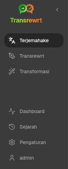
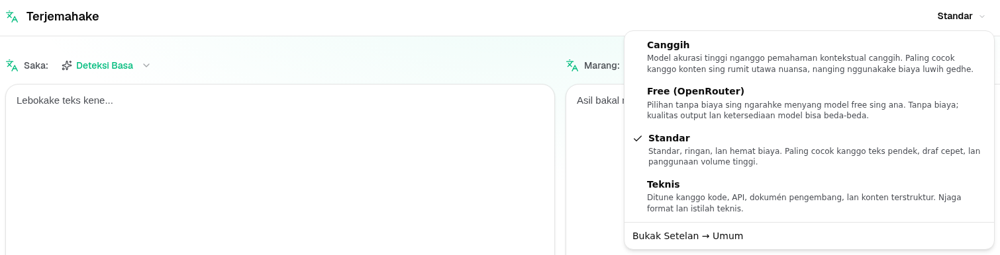
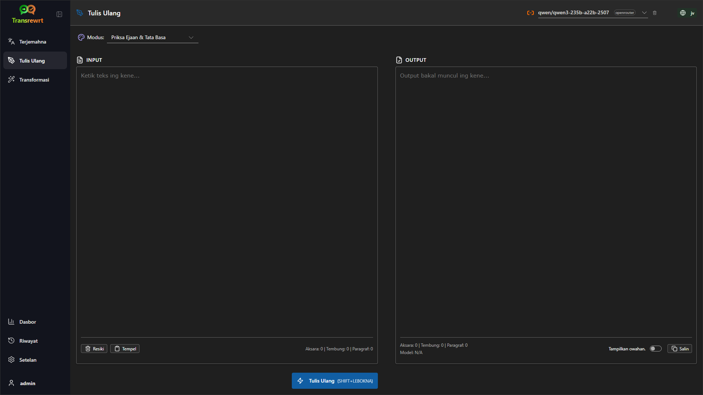
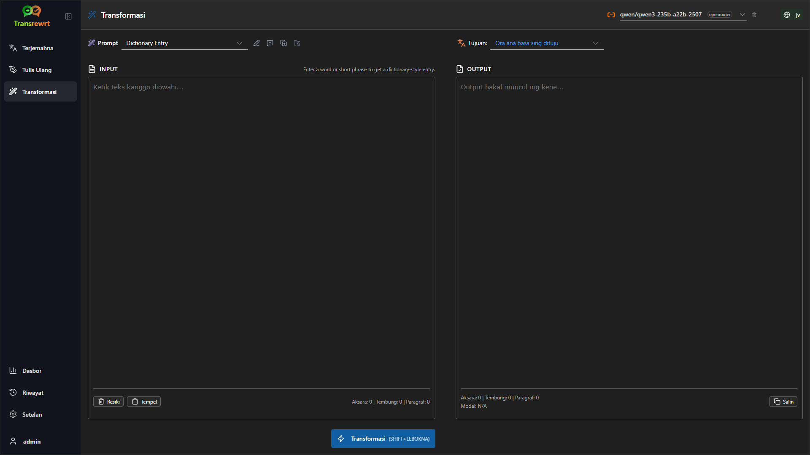
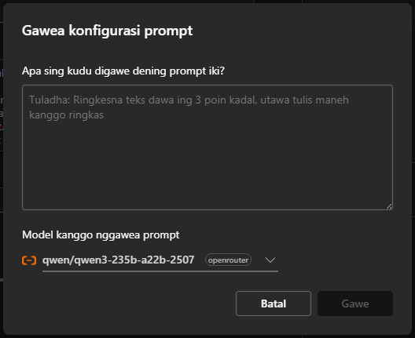
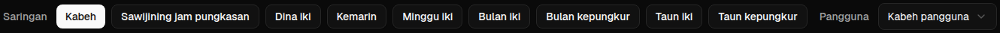

<a id="transrewrt-user-guide"></a>
# Pandhuan Pangguna

<br/>

<a id="introduction"></a>
## Pambuka

Transrewrt mbantu sampeyan ngolah tèks kanthi telung cara utama:

- **Terjemahake** - ngowahi tèks saka siji basa menyang basa liyane.
- **Tulis ulang** - nulis maneh tèks nganggo gaya sing beda, kaya luwih cetha, luwih cendhak, utawa luwih resmi.
- **Ubah** - ngolah tèks nganggo instruksi AI khusus sing diarani prompt.

Secara baku, aplikasi dijalanake ing modus **Gampang**: sampeyan milih **preset** (contone Gratis (OpenRouter), Standar, Lanjutan, utawa Teknis) lan **panyedhiya** ing Setelan, tanpa milih ID model. Pindha menyang **Lanjutan** ing [**Setelan** > **Setelan Umum**](#general-settings) yen sampeyan pengin daftar model klasik saka [**Setelan** > **Model**](#models).

<br/>

Pandhuan iki nerangake carane nggunakake aplikasi sawise diinstal lan dijalanake. Kanggo langkah instalasi, deleng [**README**](README.jv.md) utama.

<br/>

> ℹ️ **CATETAN**<br/>
> Transrewrt kasedhiya minangka aplikasi desktop kanggo Windows lan Linux, lan minangka aplikasi web kanggo dhewe. Pandhuan iki fokus marang panggunaan saben dina aplikasi kasebut. Yen ana sing mung ditrapake kanggo siji versi, bakal ditandhani kanthi jelas.

<small>**Macaa ing basa liya:** </small>
<small id="lang-list">[English (GB)](../USER-GUIDE.md) · [Português (Brasil)](./USER-GUIDE.pt-BR.md) · [العربية](./USER-GUIDE.ar.md) · [বাংলা](./USER-GUIDE.bn.md) · [Català](./USER-GUIDE.ca.md) · [中文 (中国大陆)](./USER-GUIDE.zh-CN.md) · [中文 (台灣)](./USER-GUIDE.zh-TW.md) · [Hrvatski](./USER-GUIDE.hr.md) · [Čeština](./USER-GUIDE.cs.md) · [Nederlands](./USER-GUIDE.nl.md) · [English (US)](./USER-GUIDE.en-US.md) · [Tagalog](./USER-GUIDE.tl.md) · [Français](./USER-GUIDE.fr.md) · [Deutsch](./USER-GUIDE.de.md) · [Ελληνικά](./USER-GUIDE.el.md) · [हिन्दी](./USER-GUIDE.hi.md) · [Magyar](./USER-GUIDE.hu.md) · [Italiano](./USER-GUIDE.it.md) · [日本語](./USER-GUIDE.ja.md) · [한국어](./USER-GUIDE.ko.md) · [Bahasa Melayu](./USER-GUIDE.ms.md) · [فارسی](./USER-GUIDE.fa.md) · [Polski](./USER-GUIDE.pl.md) · [Basa Jawa](./USER-GUIDE.jv.md) · [Português](./USER-GUIDE.pt.md) · [ਪੰਜਾਬੀ](./USER-GUIDE.pa.md) · [Română](./USER-GUIDE.ro.md) · [Русский](./USER-GUIDE.ru.md) · [Slovenčina](./USER-GUIDE.sk.md) · [Español](./USER-GUIDE.es.md) · [Kiswahili](./USER-GUIDE.sw.md) · [Svenska](./USER-GUIDE.sv.md) · [తెలుగు](./USER-GUIDE.te.md) · [ไทย](./USER-GUIDE.th.md) · [Türkçe](./USER-GUIDE.tr.md) · [Українська](./USER-GUIDE.uk.md) · [Tiếng Việt](./USER-GUIDE.vi.md)</small>

<small>

> **Cathetan bab terjemahan UI lan dokumentasi:** Kabeh basa antarmuka kajaba Basa Inggris (UK) asli 
> diterjemahake nggunakake model AI; ukara bisa ora tepat utawa ngemot kesalahan.

</small>

<br/>

<!-- START doctoc generated TOC please keep comment here to allow auto update -->
<!-- DON'T EDIT THIS SECTION, INSTEAD RE-RUN doctoc TO UPDATE -->
**Tabel Isi**

- [Sadurunge miwiti](#before-you-start)
  - [Carane entuk kunci API OpenRouter gratis (aplikasi desktop)](#how-to-get-a-free-openrouter-api-key-desktop-app)
- [Mulai](#getting-started)
- [Bagéan utama jendhela](#main-parts-of-the-window)
  - [Sidebar](#sidebar)
  - [Toolbar](#toolbar)
  - [Panel input lan output](#input-and-output-panels)
- [Terjemahake](#translate)
  - [Terjemahake tèks](#translate-text)
  - [Pilihan basa](#language-selection)
  - [Setelan terjemahan sing migunani](#helpful-translation-settings)
- [Tulis ulang](#rewrite)
- [Ubah](#transform)
  - [Jalankan prompt sing wis ana](#run-an-existing-prompt)
  - [Yen durung duwe prompt](#if-you-have-no-prompts-yet)
  - [Gawe prompt kanthi cepet](#create-a-prompt-quickly)
  - [Sunting prompt](#edit-a-prompt)
  - [Tes prompt sadurunge digunakake](#test-a-prompt-before-using-it)
- [Dasbor](#dashboard)
  - [Saring data](#filter-the-data)
  - [Tab dasbor](#dashboard-tabs)
  - [Ekspor data](#export-data)
  - [Hapus rekaman sing disimpen kanggo model](#delete-stored-records-for-a-model)
- [Riwayat](#history)
  - [Saring riwayat](#filter-the-history)
  - [Ekspor data riwayat](#export-history-data)
- [Setelan](#settings)
  - [Setelan umum](#general-settings)
  - [Model](#models)
  - [Basa](#languages)
  - [Pelacakan biaya](#cost-tracking)
  - [Ubah (tab setelan)](#transform-settings-tab)
  - [Pangguna](#users)
  - [Konfigurasi API](#api-config)
  - [Tentang](#about)
- [Masalah umum](#common-issues)
  - [Aplikasi ora bisa menerjemahake, nulis ulang, utawa ngowahi tèks](#the-app-will-not-translate-rewrite-or-transform-text)
  - [Dhaptar model kosong](#the-model-list-is-empty)
  - [Asilé alon banget utawa larang banget](#the-result-is-too-slow-or-too-expensive)
  - [Antarmuka nganggo basa sing salah](#the-interface-is-in-the-wrong-language)
  - [Teks kecil banget utawa angel diwaca](#the-text-is-too-small-or-hard-to-read)
  - [Ringkasan Dasbor katon kosong](#dashboard-summary-looks-empty)
  - [Biaya nuduhake "ora tersedia" utawa katon salah](#cost-shows-not-available-or-seems-wrong)
  - [Total biaya ora cocog karo tagihan panyedhiya sampeyan](#total-cost-does-not-match-my-provider-bill)
  - [Kaca Riwayat ilang saka sidebar](#the-history-page-is-missing-from-the-sidebar)
  - [Aplikasi web: dialihake menyang kaca login kanthi ora dikarepake](#web-app-redirected-to-the-login-page-unexpectedly)
  - [Admin web: lali utawa ilang sandhi](#web-admin-forgot-or-lost-a-password)
  - [Dasbor ora nuduhake data kanggo pangguna liya (web)](#dashboard-shows-no-data-for-other-users-web)
  - [Aku ngowahi prompt lan kehilangan suntingan](#i-changed-a-prompt-and-lost-the-edits)
- [Tip cepet](#quick-tips)
- [Penafian](#disclaimer)
- [Lisensi](#license)

<!-- END doctoc generated TOC please keep comment here to allow auto update -->

<br/><br/>

<a id="before-you-start"></a>
## Sadurungé miwiti

Kanggo nggunakaké Transrewrt, sampeyan kudu duwé akses menyang paling ora siji panyedhiya AI. Panyedhiya sing didhukung yaiku: [OpenRouter](https://openrouter.ai) (sing nggabungaké akeh model), OpenAI, Anthropic, Google Gemini, DeepSeek, Groq, Mistral, xAI, Cerebras, lan [Ollama](https://ollama.com) kanggo model lokal.

Sampeyan ora kudu milih model bayar kanggo miwiti. Sawisé sampeyan nambahaké kunci API OpenRouter, aplikasi sacara otomatis ngaktifaké pilihan OpenRouter **gratis** sing wis diintegrasikaké. Iki ngidinaké sampeyan miwiti terjemahan, nulis ulang, lan ngowahi tèks sacara langsung. Alternatifipun, sampeyan uga bisa entuk kunci API gratis saka Cerebras, Google, Groq, utawa Mistral AI.

Ing basa sing luwih gampang:

- Ing modus **Gampang**, sawijining **preset** (Gratis (OpenRouter), Standar, Lanjutan, utawa Teknis) dikaitake karo model kanggo **panyedhiya** sing dipilih (OpenRouter, OpenAI, Ollama, lan liya-liyane). Mung preset sing duwe peta kanggo panyedhiya saiki sing katon ing toolbar. Sampeyan milih preset nalika Terjemahake, Tulis Ulang, lan Ubah.
- Ing modus **Lanjutan**, sawijining **model** yaiku mesin AI sing langsung dipilih. ID model nggunakake **prefiks panyedhiya** (contone `openrouter/…`, `openai/…`, `ollama/…`).
- Sawijining **kunci API** (utawa, kanggo Ollama, **URL dhasar**) yaiku cara aplikasi ngakses panyedhiya kasebut.

Yen sampeyan nggunakake **aplikasi desktop**, tambahake kunci ing [**Setelan** > **Konfigurasi API**](#api-config) kanggo saben panyedhiya sing digunakake. Kanggo panggunaan mung OpenRouter, deleng [Carane entuk kunci API OpenRouter gratis](#how-to-get-a-free-openrouter-api-key-desktop-app) ing ngisor iki. Yen sampeyan ora pengin nggunakake kunci API, sampeyan bisa nginstal Ollama (saka [ollama.com](https://ollama.com)) lan nggunakake model lokal tinimbang, kaya `translategemma:4b`.

Yen sampeyan nggunakaké **versi web**, pemilik server ngonfigurasi panyedhiya nganggo variabel lingkungan, dadi sampeyan ora bisa ngisi kunci API langsung ing aplikasi.

<br/>

<a id="how-to-get-a-free-openrouter-api-key-desktop-app"></a>
### Carane entuk kunci API OpenRouter gratis (aplikasi desktop)

Yen sampeyan nggunakaké aplikasi desktop, tindakaké langkah-langkah iki:

1. Bukak [OpenRouter](https://openrouter.ai) ing panjelajah web sampeyan.
2. Gawe akun utawa mlebu.
3. Bukak kaca [Kunci](https://openrouter.ai/keys).
4. Klik tombol kanggo nggawe kunci API anyar.
5. Beri jeneng kanggo kunci supaya bisa dikenali mengko.
6. Salin kunci API anyar kasebut.
7. Balia menyang Transrewrt lan mbukak **Setelan** > **Konfigurasi API**.
8. Tempel kunci kasebut menyang **Kunci API OpenRouter** (ing ngisor **Setelan** > **Konfigurasi API**).
9. Klik **Tes kunci OpenRouter** kanggo mastekake yèn iku bisa digunakaké.

<br/><br/>

<a id="getting-started"></a>
## Miwiti

Yen iki wektu pisanan sampeyan nggunakaké Transrewrt, tindakaké urutan iki:

1. Buka aplikasi.
2. Pilih **Basa antarmuka** sampeyan saka ikon globe yen perlu.
3. Yen sampeyan nggunakake **aplikasi desktop**, buka [**Setelan** > **Konfigurasi API**](#api-config), tambah kunci API kanggo paling ora siji panyedhiya (kaya OpenRouter), lan klik **Tes** kanggo ngonfirmasi bisa digunakake.
4. Buka [**Setelan** > **Setelan Umum**](#general-settings). Ing modus **Gampang** (baku), pilih **Panyedhiya** sing duwe kunci dikonfigurasi. Ing modus **Lanjutan**, buka [**Setelan** > **Model**](#models) lan tambah siji utawa luwih model menyang **Model Dipilih**.
5. Ing **Terjemahake**, pilih **preset** (Gampang) utawa **model** (Lanjutan) ing toolbar.
6. Buka [**Setelan** > **Basa**](#languages) lan pilih **Basa utama** sampeyan yen pengin basa sing paling asring digunakake katon dhisik.
7. Jalanake terjemahan sederhana kanggo mastekake kabeh fungsi mlaku kanthi bener, banjur coba **Tulis Ulang** lan **Ubah**.

Urutan iki penting. Iki nyegah masalah paling umum nalika nggunakake pertama kali: nyoba nglakokake tugas sadurunge aplikasi duwe sambungan API sing bisa digunakake utawa preset/model sing dipilih.

<br/><br/>

<a id="main-parts-of-the-window"></a>
## Bagéyan utama jendhela

Aplikasi dibagi dadi telung bagéyan utama:

- **Sidebar** ing sisih kiwa.
- **Toolbar** ing sisih ndhuwur.
- **Area kerja** ing tengah.

<br/>

<a id="sidebar"></a>
### Sidebar

Gunakake sidebar kanggo pindah ing app. Sampeyan bisa nutup sidebar kanggo entuk ruang luwih akeh kanthi klik ikon ing samping logo app.

<br/>

<table>
  <tr>
    <td valign="top">
       
    </td>
    <td valign="top">
      <br/><br/>
      <ul>
        <li><strong>Terjemahake</strong> mbukak workspace terjemahan.</li><br/>
        <li><strong>Tulis ulang</strong> mbukak workspace panulisan maneh.</li><br/>
        <li><strong>Ubah</strong> mbukak workspace prompt kustom.</li><br/>
        <li><strong>Dasbor</strong> nuduhake informasi panggunaan lan biaya.</li><br/>
        <li><strong>Setelan</strong> mbukak panel setelan.</li><br/>
        <li><strong>Riwayat</strong> nuduhake riwayat panggunaan kanthi input lan teks output</li><br/>
        <li><strong>Pangguna</strong> nuduhake jeneng pangguna sing mlebu (mung web).</li>
      </ul>
    </td>
  </tr>
</table>

<br/>

<a id="toolbar"></a>
### Toolbar

Toolbar owah kanthi tipis gumantung saka lokasi sampeyan ing app.

- Ing kiwa, nuduhake jeneng kaca saiki.
- Ing tengen, nuduhake **pemilih preset utawa model** lan kontrol **Basa antarmuka**.

Ing modus **Gampang**, toolbar nuduhake **pemilih preset** kanthi preset sing wis diintegrasikake yaiku **Gratis (OpenRouter)**, **Standar**, **Lanjutan**, lan **Teknis**. Preset apa wae sing katon gumantung marang **Panyedhiya** sing dipilih ing [**Setelan** > **Setelan Umum**](#general-settings)—contone, **Gratis (OpenRouter)** mung katon nalika panyedhiyane yaiku OpenRouter. Yen **Panyedhiya** yaiku **Ollama**, toolbar nuduhake model lokal sing wis diinstal tinimbang preset.

Ing modus **Lanjutan**, **pemilih model** ngidini sampeyan milih mesin AI sing digunakake kanggo tugas saiki.



Ing modus Lanjutan, sawetara model gratis bisa uga ora tansah tersedia—bisa mati (offline) utawa wis tekan wates panggunaan. Aplikasi bisa mbusak model kasebut saka dhaptar sampeyan sacara otomatis. Kanggo ngontrol model apa wae sing katon, menyang [**Setelan** > **Model**](#models). Sampeyan bisa mbukak setelan model saka ikon panyedhiya ing sisih kiwa jeneng model ing bilah gawe.

<br/>

Ikon **globe + kode basa** ngganti basa antarmuka app, kayata menu lan tombol. Iku ora **ngganti** basa terjemahan sing digunakake ing **Terjemahake**.


<br/>

<a id="input-and-output-panels"></a>
### Panel Input lan output

Kebanyakan workspace nggunakake panel **Input** ing kiwa lan panel **Output** ing tengen.

Saben panel uga nuduhake:

| **Input**                                                          | **Output**                                                                                                                  |
|--------------------------------------------------------------------|-----------------------------------------------------------------------------------------------------------------------------|
| - Jumlah karakter <br/>- Jumlah tembung <br/>- Jumlah paragraf   <br/> | - Durasi tugas<br/>- **TPS** (token saben detik)<br/>- Jumlah karakter, tembung, lan paragraf<br/>- Model sing digunakake |

Yen sampeyan mikir babagan istilah teknis:

- **Token** tegese potongan cilik teks. Sampeyan bisa nganggep minangka bagian tembung utawa tembung cendhak.
- **TPS** tegese jumlah potongan teks sing diproses model saben detik.

<br/>

Sampeyan uga bisa ngawasi biaya saben operasi (manawa tersedia) lan total biaya, kanthi ngaktifake pilihan `Show cost information on the actions` ing [**Setelan** > **Setelan Umum**](#general-settings).

<br/><br/>

[--------------------------------------------------------------------------------------------------------------------------]: #

<a id="translate"></a>
## Terjemahake

Gunakake **Terjemahake** nalika sampeyan pengin ngowahi teks saka siji basa menyang basa liyane.


<br/>

<a id="translate-text"></a>
### Terjemahake teks

1. Buka **Terjemahake**.
2. Pilih basa ing **Saka**.
3. Pilih basa ing **Menyang**.
4. Pilih preset (Gampang) utawa model (Lanjutan) ing toolbar.
5. Ketik utawa tempel teks menyang **Input**.
6. Klik **Terjemahake**.
7. Maca asil ing **Output**.
8. Gunakake tombol salin menawa sampeyan pengin nyalin asil kasebut.

<br/>

<a id="language-selection"></a>
### Pemilihan basa

- **From** bisa dadi basa tartamtu utawa **Deteksi Basa**.
- **To** yaiku basa sing pengin digunakake kanggo asil.

**Basa Atas** sing dipilih bakal katon ing ndhuwur dhaptar. Sampeyan bisa ngatur iki ing [**Setelan** > **Basa**](#languages).

<br/>

<a id="helpful-translation-settings"></a>
### Setelan terjemahan sing migunani

Ing [**Setelan** > **Setelan Umum**](#general-settings), sampeyan bisa ngganti cara terjemahan ditindakake:

- **Otomatis nerjemahake nalika nempel** nglakokake terjemahan sawise sampeyan nempel teks.
- **Salin otomatis asil menyang clipboard** nyalin asil sacara otomatis sawise proses rampung.
- **Terjemahan real-time (saat mengetik)** nglakokake terjemahan nalika sampeyan ngetik.
- **Timeout (ms)** ngatur suwe aplikasi nunggu sadurunge nglakokake terjemahan real-time.
- **Perilaku kanggo ENTER** ngontrol apa sing kedadeyan nalika sampeyan menek `Enter`:
  - **Enter** nguripake terjemahan utawa nulis ulang (baku).
  - **Shift + Enter** nguripake terjemahan utawa nulis ulang; **Enter** biasa mlebuke baris anyar.

[--------------------------------------------------------------------------------------------------------------------------]: #

<a id="rewrite"></a>
## Tulis ulang

Gunakake **Tulis ulang** nalika sampeyan pengin nambahi gaya basa tanpa ngganti teges utama.



Fitur iki migunani kanggo:

- mbenakake ejaan lan tata basa (**Periksa Ejaan & Tata Bahasa**)
- njalari teks luwih cetha (**Improve Clarity**)
- sawetara reformulasi beda ing siji jalan (**Versi Alternatif**)
- njalari teks luwih formal utawa luwih informal (**Jadine Formal** / **Jadine Informal**)
- ngendhakake utawa nembahake teks (**Ngendhakake** / **Nembahake**)
- nggawe teks katon luwih teknis (**Jadine Teknis**)

<br/>

> 💡 **TIP**<br/>
> Nalika nggunakake modus "**Periksa Ejaan & Tata Bahasa**", tombol **Tampilake owah-owahan** bakal katon ing panel output (sebelah **Salin**).
> Aktifake utawa mateni kanggo nuduhake utawa ndhelikake koreksi tartamtu sing diterapake ing teks sampeyan.

<br/><br/>

[--------------------------------------------------------------------------------------------------------------------------]: #

<a id="transform"></a>
## Ubah

Gunakake **Ubah** nalika sampeyan pengin AI nututi dhaptar instruksi khusus.



Iki minangka bagéyan paling fleksibel saka aplikasi. Sampeyan bisa nggunakake kanggo tugas-tugas kaya:

- ringkesan cathetan
- ngowahi teks kasar dadi email sing rapi
- mbukak poin utama
- ngowahi teks dadi format tartamtu
- utawa kegiatan khusus liyane kanthi teks input

<br/>

<a id="run-an-existing-prompt"></a>
### Jalanke prompt sing ana

1. Buka **Transform**.
2. Pilih prompt saka dhaptar prompt.
3. Yen kotak **Target** basa mucul, pilih basa yen perlu.
4. Ketik utawa tempelna teks menyang **Input**.
5. Klik **Ubah**.
6. Maca asilé ing **Output**.

<br/>

<a id="if-you-have-no-prompts-yet"></a>
### Yen durung duwé prompt

Yen dhaptar prompt sampeyan kosong, klik **Muat contoh prompt** ing workspace Ubah. Kontrol sing padha tansah kasedhiya ing [**Setelan** > **Ubah**](#transform-settings) ing baris ekspor/impor. Kedhepan nambah contoh sing disertakake supaya sampeyan bisa miwiti kanthi cepet.

<br/>

> ℹ️ **CATETAN**<br/>
> Contoh prompt diwenehake ing basa Inggris. Sawise muat, sampeyan bisa nyunting prompt lan nggunakake **Terjemahkan prompt** kanggo menerjemahakéé menyang basa Anda.

<br/>

<a id="create-a-prompt-quickly"></a>
### Gawe prompt kanthi cepet

Cara paling cepet kanggo nggawe prompt yaiku:

1. Klik **Prompt anyar**.
2. Klik **Nggawe prompt**.
3. Jlentrehake apa sing pengin digawe dening prompt kasebut.
4. Pilih preset (Gampang) utawa model (Lanjutan).
5. Bebaske aplikasi nggawe rancangan kanggo sampeyan.
6. Priksa rancangane lan klik **Simpen**.



<br/>

<a id="edit-a-prompt"></a>
### Sunting prompt

Kala sampeyan nggawe utawa nyunting prompt, éditor bakal mucul ing sisih kiwa lan wilayah tes bakal mucul ing sisih tengen.


Bidang utama yaiku:

- **Jeneng prompt**: jeneng sing ditampilake ing dhaptar prompt.
- **Instruksi prompt (opsional)**: cathetan cendhak sing ditampilake marang pangguna nalika njalankan prompt.
- **Peran Model**: peran kabeh sing diwenehake marang AI, kayata 'Sampeyan minangka asisten sing mbantu.'
- **Instruksi Model (siji saben baris)**: aturan tartamtu sing pengin AI tundhuk.
- **Deskripsi output**: tembung cendhak sing njlènètaké asilé, kaya 'ringkasan' utawa 'tulis ulang'.
- **Suhu (0.0 → 1.0)**: cara model bakal tumindak; deleng ing ngisor iki.
- **Panyuwunan basa sasaran**: nambahaké pamilah basa sasaran nalika prompt dijalanaké.

Yen istilah teknis **Suhu** iku anyar kanggo sampeyan, pikirke kaya ngene:

- **Suhu sing luwih rendah** maringi asil sing luwih tetep lan prediktif.
- **Suhu sing luwih dhuwur** maringi variasi lan kreativitas sing luwih akeh.

Sampeyan uga bisa nggunakake:

- `Generate prompt` kanggo nggawe rancangan anyar saka jlentrehan cendhak
- `Improve prompt` kanggo nyempurnakake prompt sing wis ana
- `Translate prompt` kanggo menerjemahaké bidang prompt

<br/>

> ⚠️ **PERINGATAN**<br/>
> Klik `Save` sadurungé klik `Back to Run`. Yen sampeyan bali tanpa nyimpen, owah-owahane bakal ilang.

<br/>

<a id="test-a-prompt-before-using-it"></a>
### Tes prompt sadurungé digunakaké

Panel tes ing tengen ngidini sampeyan nyoba prompt karo tèks conto sadurungé digunakaké ing pagawéan saben dina.

Iki migunani nalika:

- sampeyan lagi nggawe prompt anyar
- sampeyan lagi mbandhingaké loro vèrsi prompt
- sampeyan pengin mriksa nada, dawa, utawa format output

<br/>

> ℹ️ **CATETAN**<br/>
> Sampeyan bisa ngekspor lan ngimpor prompt sing wis disimpen ing [**Setelan** > **Ubah**](#transform-settings).

Nalika nggunakake **Nggawe prompt**, **Tingkatake prompt**, utawa **Terjemahkan prompt** ing editor prompt, modus **Gampang** maringi pemilih preset sing padha karo Terjemahake lan Tulis Ulang; modus **Lanjutan** nggunakake daftar model.

<br/><br/>

[--------------------------------------------------------------------------------------------------------------------------]: #

<a id="dashboard"></a>
## Dasbor

Gunakaké **Dasbor** kanggo ndeleng sepira akeh aplikasi digunakaké lan biayane (kanggo model bayar).


<br/>

> ℹ️ **CATETAN**<br/>
> Yen mung nggunakake model **gratis**, jumlah **biaya** bisa nol lan KPI sing fokus marang biaya bisa katon kosong. Tab **Ringkasan** isih nuduhake jumlah pangelingan kanggo terjemahan, nulis ulang, lan transformasi nalika ana aktivitas ing periode sing dipilih.

<br/>

<a id="filter-the-data"></a>
### Saring data

Gunakaké tombol saringan ing ndhuwur kanggo ngowahi rentang wektu.



<br/>

> ℹ️ **CATETAN**<br/>
> Saringan **Pangguna** mung katon kanggo administrator ing versi web. Pangguna biasa ora bakal ndeleng saringan iki, lan ora kasedhiya ing aplikasi desktop.

<br/>

<a id="dashboard-tabs"></a>
### Tab Dasbor

- **Ringkasan** nuduhake kartu KPI: total biaya, model sing digunakake, jumlah pangelingan lan biaya saben modus (karo bagéan saka total pangelingan), biaya rata-rata saben pangelingan, TPS rata-rata, lan telu model paling dhuwur miturut jumlah pangelingan.
- **Dhèk model** menda saben model kanthi total pangelingan, total biaya, lan TPS rata-rata; bukak baris kanggo rincian miturut terjemahan, nulis ulang, lan transformasi.
- **Kabeh pangelingan API** nuduhake log pangelingan lengkap (dipaginasi ing tata letak ambegan, kertu ing layar sempit) lan ngidini ekspor.

<br/>

<a id="export-data"></a>
### Ekspor data

Tabel dasbor bisa ngekspor data ing format:

- **JSON**
- **CSV**
- **XLSX**

Iki migunani yen sampeyan pengin ngevaluasi aktivitas njaba aplikasi utawa barengake laporan.

<br/>

<a id="delete-stored-records-for-a-model"></a>
### Hapus rékaman sing disimpen kanggo model

Ing **Dhèk model** utawa **Kabeh pangelingan API**, sampeyan bisa mbusak rékaman sing disimpen kanggo model kanthi klik ikon "tempo sampah".

> ⚠️ **PERINGATAN**<br/>
> Mbusek rékaman sing disimpen ora bisa dibatalaké. Mung digunakaké yèn sampeyan yakin ora butuh riwayat iku manèh.

Kanggo ngapus kabeh data utawa mbusak rekaman berdasar umur, menyang [**Setelan** > **Pelacakan Biaya**](#cost-tracking). Ing kana sampeyan bakal nemokake pilihan kanggo ngapus kabeh data sing disimpen utawa mung data sing umure luwih tuwa saka tanggal tartamtu.

<br/><br/>

[--------------------------------------------------------------------------------------------------------------------------]: #

<a id="history"></a>
## Riwayat

Klik **Riwayat** kanggo ndeleng riwayat tindakan sampeyan ing jero **Transrewrt**, kalebu input lan output saben operasi.


<br/>

<a id="filter-the-history"></a>
### Saring riwayat

**Riwayat** nggunakake filter rentang wektu sing padha karo kaca **Dasbor**.


<br/>

> ℹ️ **CATETAN**<br/>
> Ing **aplikasi web**, kabeh wong (kalebu administrator) mung weruh riwayat eksekusi dhéwé. Filter **Pangguna** ing **Dasbor** kanggo admin kanggo ngevaluasi panggunaan lan biaya ing akun; ora berlaku kanggo **Riwayat**.

<br/>

<a id="export-history-data"></a>
### Ekspor data riwayat

Kaca riwayat bisa mengekspor data sing disaring menyang:

- **JSON**
- **CSV**
- **XLSX**

Iki migunani yen sampeyan pengin ngevaluasi aktivitas njaba aplikasi utawa barengake laporan.

<br/><br/>

[--------------------------------------------------------------------------------------------------------------------------]: #

<a id="settings"></a>
## Setelan

Bukak **Setelan** saka sidebar kanggo nyetel perilaku aplikasi.

Tab sing tersedia gumantung marang platform lan peran sampeyan:

| Tab              | Desktop | Web (admin) | Web (pangguna biasa) | Cathetan                                        |
  |------------------|:-------:|:-----------:|:------------------:|----------------------------------------------|
  | Setelan Umum |   ya   |     ya     |        ya         | Kalebu **Pengalaman AI** (Easy / Advanced) |
  | Model           |   ya   |     ya     |        ya         | Mung nalika **Pengalaman AI** ing modus **Advanced** |
  | Basa        |   ya   |     ya     |        ya         |                                              |
  | Pelacakan Biaya    |   ya   |     ya     |         -          |                                              |
  | Ubah        |   ya   |     ya     |        ya         | Impor/ekspor massal prompt transformasi      |
  | Pangguna            |    -    |     ya     |         -          |                                              |
  | Konfigurasi API       |   ya   |     ya     |         -          |                                              |
  | Tentang            |   ya   |     ya     |        ya         |                                              |

Ing modus **Gampang**, pilihan model dilakokake liwat preset ing toolbar lan **Panyedhiya** ing Setelan Umum; tab **Model** disembunyikan.

<br/>

> ℹ️ **CATETAN**<br/>
> Ing versi web, saben pangguna duwe konfigurasi dhewe. Setelan kaya Pengalaman AI, panyedhiya, model utawa preset sing dipilih, basa, pilihan umum, lan prompt transformasi disimpen saben pangguna. Pangalihan sing ditindakake ora mangaruhi pangguna liya.

<br/>

[--------------------------------------------------------------------------------------------------------------------------]: #

<a id="general-settings"></a>
### Setelan Umum

Gunakake **Setelan Umum** kanggo ngontrol perilaku ngetik, apa rincian eksekusi disimpen kanggo **Riwayat**, penampilan, lan cara milih AI kanggo Terjemahake, Nulis Ulang, lan Ubah.

**Pengalaman AI**

- **Gampang** (baku): pilih **Panyedhiya** (OpenRouter, OpenAI, Anthropic, Google Gemini, DeepSeek, Groq, Mistral, xAI, Cerebras, utawa Ollama). Panyedhiya awan nggunakake preset sing diintegrasikake ing toolbar. **Ollama** nuduhake model sing diinstal ing mesin sampeyan tinimbang preset. Ing modus Gampang, **Katalog preset** nuduhake versi katalog lan wektu pembaruan pungkasan; klik **Nganyari katalog preset** kanggo njupuk daftar preset paling anyar saka repositori proyek (aplikasi uga mriksa kanthi periodik ing mburine). 
- **Lanjutan**: pilih model dhewe-dhewe ing toolbar; atur daftar ing [**Setelan** > **Model**](#models).

Ing **aplikasi web**, panyedhiya sing katon gumantung marang kunci API sing disetel ing lingkungan server. Ing **aplikasi desktop**, atur kunci ing [**Konfigurasi API**](#api-config).

**Perilaku**

- **Perilaku kanggo ENTER** milih apa `Enter` ngeksekusi tugas utawa nambah baris anyar.
- **Otomatis nerjemahake nalika nempel** miwiti terjemahan sawise sampeyan nempelake teks.
- **Salin otomatis asil menyang clipboard** nyalin asil sing sukses sacara otomatis.
- **Terjemahan real-time (saat ngetik)** menerjemahake nalika sampeyan ngetik.
- **Batas wektu (ms)** ngatur wektu tunggu kanggo terjemahan real-time.

**Riwayat**

- **Simpen riwayat eksekusi** ngontrol apa saben terjemahan, nulis ulang, lan ngowahi nyimpen **input lan teks output** kanggo tampilan [**Riwayat**](#history) ing samping. Mateni fitur iki bakal takon konfirmasi; yen sampeyan konfirmasi, teks riwayat sing disimpen bakal dihapus saka database. Yen label nuduhake *dinonaktifake déning administrator*, instalasi sampeyan duwé `HISTORY_DISABLED` disetel ing lingkungan (deleng [README](README.jv.md#configuration-and-environment)); sampeyan ora bisa ngaktifake maneh riwayat liwat UI.
- **Hapus data riwayat** ngidini sampeyan mbusak teks sing disimpen berdasar umur (contone sing wis tuwa saka sawetara sasi, utawa **kabeh data (bener-bener resik)**) nggunakake **Hapus data**. Iki mung mengaruhi teks eksekusi sing disimpen kanggo tampilan **Riwayat**; iki ora **menghapus** total biaya utawa panggunaan. Kanggo mbusak utawa ngurangi data **biaya**, gunakake [**Setelan** > **Pelacakan Biaya**](#cost-tracking).

**Penampilan**

- **Tema** ngalih antarane tampilan cahya, gelap, lan sistem.
- **Tampilake informasi biaya ing tindakan** ngontrol tampilan biaya saben operasi (yen kasedhiya) lan total biaya ing panel output Terjemahake, Tulis Ulang, lan Ubah.
- **Digit pecahan biaya** ngowahi cara nuduhake desimal biaya.
- **Mung Web:** **tampilake margin ing sakeliling aplikasi** nambah ruwang tambahan ing sakeliling antarmuka.
- **Famili Font** ngowahi font tulisan ing panel teks.
- **Ukuran** ngowahi ukuran font.

**Cadangan Konfigurasi** (mung aplikasi desktop lan administrator web)

- **Sertakake data panggunaan ing cadangan** - yen diaktifake, ZIP uga ngandhut riwayat eksekusi lan data telpon API.
- **Cadangan konfigurasi** - nggawe siji file ZIP (`transrewrt-config-backup-YYYY-MM-DD_HHMMSS.zip` ing UTC kanthi standar) ngandhut `config.json`, `state.json`, kunci enkripsi opsional, pangguna, preferensi, prompt kustom, lan data panggunaan yen sampeyan milih. Sawise cadangan sukses, konfirmasi nuduhake jeneng file sing disimpen.
- **Pulihake saka cadangan** - mbukak **dialog konfirmasi dhisik**. Pilih file ZIP cadangan ing jero dialog (**Browse** / pemilih file utawa drag-and-drop yen didhukung), banjur priksa pilihan:
  - **Pulihake data panggunaan** - ngimpor panggunaan/riwayat saka ZIP nalika dicadangake kanthi data panggunaan kalebu; tinggalake mati yen sampeyan mung pengin setelan lan prompt.
  - **Bersihke data panggunaan lawas sadurunge dipulihake** - mbusak panggunaan/riwayat sing ana ing instalasi iki sadurunge nerapake cadangan (opsional; gunakake nalika sampeyan pengin ngganti kanthi resik).

Cadangan sing digawe ing versi web utawa desktop bisa dipulihake ing versi liyane. Nalika mulihake cadangan desktop ing versi web, datane bakal dipulihake menyang pangguna administrator.

<br/>

<a id="models"></a>
### Model

Tab iki mung tersedia nalika **Pengalaman AI** disetel dadi **Lanjutan** ing [**Setelan Umum**](#general-settings). Gunakna **Setelan** > **Model** kanggo milih model apa wae sing katon ing toolbar.


Kaca iki duwe loro dhaptar:

- **Model Kasedhiya** ing sisih kiwa
- **Model Dipilih** ing sisih tengen

Kontrol sing migunani kalebu:

- **Goleki model...** kanggo nemokake model miturut jeneng
- **Panyedhiya** chip kanggo mungkasi dhaptar dadi siji mesin (OpenRouter, OpenAI, Ollama, …)
- **Mung Gratis** kanggo nuduhake mung model gratis
- **Segari** kanggo mbukak maneh dhaptar
- **Bukak Kabeh** lan **Tutup Kabeh** nalika sampeyan nyusun miturut panyedhiya

ID model kalebu awalan panyedhiya (contone `openrouter/…` vs `openai/…`). Lencana kaya **OpenAI (OpenRouter)** vs **OpenAI (langsung)** nuduhake carane lalu lintas dikirim.

> ℹ️ **CATETAN**<br/>
> **OpenRouter Body Builder** (`openrouter/bodybuilder`) iku model router, dudu model chat umum: wangsulane yaiku JSON sing njlentrehake badan panjaluk API OpenRouter (contone larik `requests` kanthi `model` lan `messages`). Yen sampeyan nggunakake kanggo **Terjemahake**, **Tulis ulang**, utawa **Ubah**, panel output bakal nuduhake JSON kasebut tinimbang teks rampung. Pilih model teks biasa kanggo tugas kasebut. Deleng [kaca model Body Builder](https://openrouter.ai/openrouter/bodybuilder) ing OpenRouter.

Tindakan:

- Kanggo nambah model, klik **Tambah** utawa ing endi wae ing entri.

- Kanggo mbusak model, klik **X** ing sisihé ing **Model Dipilih** utawa **Dipilih** ing entri ing Model Kasedhiya.

- Kanggo mbersihake dhaptar, klik **Batal Pilih Kabeh**. Model gratis sing dibutuhake bakal tetep ana ing dhaptar.

<br/>

> ℹ️ **CATETAN**<br/>
> Yen sampeyan ora pengin nambah kredit menyang OpenRouter langsung, wiwiti kanthi ngaktifake **Mung Gratis** lan milih model gratis (ora perlu kartu kredit). Sampeyan uga bisa nggunakake Ollama kanggo njalankan model lokal tanpa kunci API.

<br/>

<a id="languages"></a>
### Basa

Gunakake **Setelan** > **Basa** kanggo ngatur dhaptar basa sing digunakake ing aplikasi.

- **Basa utama** dijepret ing pucuk dhaptar basa ing **Terjemahake** lan **Ubah**.
- **Basa kustom** ngidini sampeyan nambah basa sing ora ana ing dhaptar bawaan.

Yen sampeyan nambah basa kustom, bakal katon ing pamilah basa bebarengan karo pilihan bawaan.

<br/>

<a id="cost-tracking"></a>
### Pelacakan biaya

Gunakake **Setelan** > **Pelacakan Biaya** kanggo ngatur informasi biaya.

- **Total Biaya** nuduhake total sing terus tambah.
- **Salin Nilai** nyalin total menyang clipboard.
- **Atur Ulang Biaya** ngreset total sing disimpen dadi nol.
- **Sinkronake karo panggunaan kunci API** ngatur total supaya cocog karo panggunaan sing dilaporake dening akun OpenRouter sampeyan (mung OpenRouter).
- **Panggunaan Kunci API** nuduhake rincian panggunaan OpenRouter, yen kasedhiya.
- **Hapus data biaya** mbusak kabeh data, utawa mung entri sing luwih tuwa tinimbang tanggal sing dipilih.

**Pelacakan biaya:** Nalika sampeyan nggunakake model OpenRouter, aplikasi nuduhake panggunaan lan pengeluaran nyata sampeyan adhedhasar informasi biaya saka OpenRouter. Kanggo kabeh panyedhiya liyane, aplikasi ngira-ngira biaya nggunakake rega sing diterbitake dening OpenRouter, yen rega ora kasedhiya, perkiraan bisa waé nol.

<br/>

> ℹ️ **CATETAN**<br/>
> **Kabeh angka biaya mung perkiraan kanggo referensi sampeyan wae, dudu pernyataan tagihan resmi.**

<br/>

> ⚠️ **PERINGATAN**<br/>
> Panghapusan data ora bisa dibatalake. Sadurunge mbusak, pasthike sampeyan nyadhiyakake cadangan data utawa ngekspor liwat [**Riwayat**](#history)
> utawa [**Dasbor** > **Kabeh pangelingan API**](#dashboard-tabs), yen ora bakal ilang permanen.
> Kabeh riwayat input/output sing gegandhengan karo saben entri panjaluk API uga bakal dihapus.

<br/>

<a id="transform-settings"></a>
### Ubah (tab setelan)

Gunakna **Setelan** > **Ubah** kanggo ngatur prompt sacara massal.

Sampeyan bisa:

- mariksa prompt sing wis disimpen
- mbusak prompt
- ngimpor prompt saka file
- mengekspor prompt kanggo cadangan utawa dibagi
- muat contoh prompt menyang dhaptar prompt

<br/>

<a id="users"></a>
### Pangguna

Gunakake **Pangguna** kanggo ngatur akun pangguna ing versi web. Sampeyan bisa nambah pangguna, nganyari rincian, ngreset sandhi, lan mbusak akun.

<br/>

<a id="api-config"></a>
### Konfigurasi API

Panyedhiya sing didhukung yaiku: OpenRouter, OpenAI, Anthropic, Google Gemini, DeepSeek, Groq, Mistral, xAI, Cerebras, lan **Ollama** (model lokal liwat URL dhasar). Sampeyan mung kudu ngonfigurasi panyedhiya sing digunakake.

**Aplikasi web: administrator wae**

Kunci API dikonfigurasi liwat variabel lingkungan sistem utawa Docker - ora dimasukkan ing antarmuka web. Kaca iki nuduhake panyedhiya sing duwe kunci dikonfigurasi lan ngidini sampeyan nyoba saben kunci kanthi klik tombol `Test`.

<br/>

> ℹ️ **CATETAN**<br/>
> Kanggo ngowahi kunci API, perbarui variabel lingkungan ing konfigurasi sistem utawa Docker lan restart server utawa wadah.

<br/>

> ℹ️ **CATETAN**<br/>
> **Cadangan Konfigurasi** (deleng [**Setelan Umum** → Cadangan Konfigurasi](#general-settings)) bisa nemplak kunci panyedhiya sing wis **diselesaikan** ing `config.json` saka ZIP. Mbalekake ZIP iku ora **nyalin** kunci-kunci iku maneh menyang file konfigurasi server - kunci sing aktif isih saka lingkungan lan status file sing ana kaya sing dijelasake kono.

<br/>

**Aplikasi desktop**

Gunakake **Konfigurasi API** kanggo nyimpen kunci API kanggo saben panyedhiya sing digunakake. Kanggo Ollama, lebokake **URL dhasar** tinimbang kunci API.

<br/>

> 💡 **Tip** <br/>
> Yen sampeyan ora pengin nggunakake kunci API utawa mbayar panggunaan, sampeyan bisa [ngunduh Ollama](https://ollama.com) lan nggunakake model (kayata `translategemma:4b`) sacara lokal ing mesin sampeyan kanthi gratis. Alternatif, sampeyan bisa gawe akun OpenRouter gratis (ora perlu kartu kredit) kanggo nggunakake model gratis dheweke, utawa entuk kunci API gratis saka Cerebras, Google, Groq, utawa Mistral AI.

<br/>

- Tambahake mung panyedhiya sing dibutuhake. Ing **Setelan** > **Model**, saben id model diwiwiti karo panyedhiya (contone `openrouter/openrouter/free`, `openai/gpt-4o`, `ollama/llama3`).

Kanggo nambah kunci API, lebokake nilai ing kolom teks lan klik `Save`. Kanggo ngganti kunci sing ana, klik `Edit`. Kanggo mriksa manawa kunci bisa digunakake, klik `Test`. Kanggo URL dhasar Ollama, tansah klik `Test` kanggo mriksa koneksi.

<br/>

> ℹ️ **CATETAN**<br/>
> Sampeyan ora bisa ndeleng nilai kunci API saiki. Sampeyan mung bisa nggantina nggunakake tombol `Edit`.
> Kunci API disimpen kanthi dienkripsi ing konfigurasi.

<br/>

<a id="about"></a>
### Tentang

Tab **Tentang** nuduhake:

- jeneng lan tagline aplikasi
- nomor versi lan tanggal gawe
- informasi lisensi lan hak cipta, kanthi tautan kanggo mbukak **Pemberitahuan pihak ketiga**
- tautan menyang repositori proyek

<br/><br/>

<a id="common-issues"></a>
## Masalah umum

Yen ana sing ora mlaku kaya sing dikarepake, priksa dhisik poin-poin ing ngisor iki.

<br/>

<a id="the-app-will-not-translate-rewrite-or-transform-text"></a>
### Aplikasi ora bisa nindakake terjemahan, nulis ulang, utawa ngowahi teks

Priksa manawa:

- sampeyan wis milih **preset** (Gampang) utawa **model** (Lanjutan) ing toolbar
- ing modus **Gampang**, [**Setelan** > **Setelan Umum**](#general-settings) duwe **Panyedhiya** kanthi kunci sing bisa digunakake (utawa URL Ollama) lan paling ora siji preset kanggo panyedhiya kasebut
- ing modus **Lanjutan**, paling ora siji model kasebut ana ing [**Setelan** > **Model**](#models)
- setelan API sampeyan bisa digunakake

Yen sampeyan nggunakake aplikasi desktop:

1. Buka [**Setelan** > **Konfigurasi API**](#api-config).
2. Priksa manawa paling ora siji kunci API wis disimpen.
3. Klik **Tes** ing samping panyedhiya kanggo mastekake yen kuncine bisa digunakake.

<br/>

<a id="the-model-list-is-empty"></a>
### Dhaftar model kosong

Ing modus **Gampang**, bukak [**Setelan** > **Setelan Umum**](#general-settings), pastekna **Panyedhiya** wis disetel, lan tambah utawa tes kunci ing [**Konfigurasi API**](#api-config) (desktop) utawa takon marang administrator sampeyan (web). Kanggo **Ollama**, jalanke **Tes** ing URL dasar lan pastekna model-model wis diinstal sacara lokal.

Ing modus **Lanjutan**, bukak [**Setelan** > **Model**](#models) lan klik **Segari**. Yen perlu, goleki model, aktifake **Mung Gratis**, lan tambahake model menyang **Model Dipilih**.

<br/>

<a id="the-result-is-too-slow-or-too-expensive"></a>
### Asilé terlalu alon utawa larang

Coba siji utawa luwih saka iki:

- pilih preset liya (Gampang) utawa model (Lanjutan)
- gunakake input sing luwih cendhak
- mateni **Terjemahan langsung (saat mengetik)** ing [**Setelan** > **Setelan Umum**](#general-settings)
- gunakake model gratis kanggo tugas sederhana (deleng [Model](#models))

<br/>

<a id="the-interface-is-in-the-wrong-language"></a>
### Antarmukane nganggo basa sing salah

Klik ikon globe ing [bilah gawe](#toolbar) lan pilih **Basa antarmuka** sing dikekehan.

<br/>

<a id="the-text-is-too-small-or-hard-to-read"></a>
### Teksé kecil banget utawa angel diwaca

Bukak [**Setelan** > **Setelan Umum**](#general-settings) lan ganti:

- **Jeneng Font**
- **Ukuran**

<br/>

<a id="dashboard-summary-looks-empty"></a>
### Ringkesan Dasbor katon kosong

Iki normal yen:

- sampeyan mung nggunakake **model gratis** lan sampeyan lagi ndeleng angka **biaya** (bisa uga nol); KPI jumlah panggilan ing **Ringkasan** isih perlu data saka periode sing dipilih
- **saringan wektu** sing dipilih ora nutupi periode nalika panggilan dilakoni — coba **Kabeh** kanggo mriksa

Yen KPI isih nol sawise milih **Kabeh**, pastekna yen panggilan katon ing [**Riwayat**](#history) utawa ing tab **Kabeh panggilan**.

<br/>

<a id="cost-shows-not-available-or-seems-wrong"></a>
### Biaya nuduhake "ora tersedia" utawa katon salah

Ketika sampeyan nggunakake model liwat **OpenRouter**, aplikasi nuduhake pengeluaran nyata sing dilaporake dening OpenRouter.

Kanggo **panyedhiya liya** (OpenAI langsung, Anthropic langsung, lsp.), biaya diperkirakake saka data rega sing diterbitake dening OpenRouter. Yen ora ditemokake rega sing cocog kanggo model, biaya bakal katon minangka **ora tersedia** lan ora ditambahake menyang total sampeyan.

<br/>

<a id="total-cost-does-not-match-my-provider-bill"></a>
### Total biaya ora cocog karo tagihan panyedhiya sampeyan

Kabeh angka biaya ing aplikasi iki **diperkirakake mung kanggo referensi**, dudu pernyataan tagihan resmi.

Kanggo njaluk total luwih cedhak karo pengeluaran OpenRouter nyata sampeyan, bukak [**Setelan** > **Pelacakan Biaya**](#cost-tracking) lan klik **Sinkronake karo panggunaan kunci API**.

<br/>

<a id="the-history-page-is-missing-from-the-sidebar"></a>
### Kaca Riwayat ilang saka sisih

**Simpen riwayat eksekusi** bisa uga dimateni. Bukak [**Setelan** > **Setelan Umum**](#general-settings) lan aktifake, kajaba riwayat *dinonaktifake déning administrator* (`HISTORY_DISABLED` ing lingkungan — deleng [README](README.jv.md#configuration-and-environment)). Ngaktifake riwayat ora bakal mulihake teks sing sadurunge wis dihapus.

<br/>

<a id="web-app-session-expired"></a>
### Aplikasi web: dialihake menyang kaca login kanthi ora dikarepake

Sesi sampeyan bisa uga wis kelangan wektu. Mlebu maneh. Yen kerep kedadeyan, priksa konfigurasi server kanggo setelan umur sesi.

<br/>

<a id="web-admin-forgot-or-lost-a-password"></a>
### Admin web: lali utawa ilang sandhi

Iki berlaku kanggo aplikasi web **sing di-host dhewe** (Docker), dudu aplikasi desktop (Electron).

- Yen administrator liyane isih bisa mlebu, dheweke bisa mbukak [**Setelan** > **Pangguna**](#users), pilih akun, lan atur **sandhi anyar** ana.
- Yen sampeyan **terkunci metu** nanging duwe **akses shell** menyang mesin utawa wadah, atur maneh sandhi nggunakake helper sing dikirim karo gambar (ganti `transrewrt` yen sampeyan ngganti jeneng asli, lan gunakna tanda petik kanggo sandhi yen duwe spasi utawa karakter khusus):

```bash
docker exec transrewrt reset-web-password '<username>' '<new-password>'
```

Jeneng pangguna admin asli yaiku `admin` yen sampeyan durung tau nggawe akun liya. Nalika sampeyan mung mlebokake siji argumen, iku dianggep minangka sandhi anyar kanggo `admin`.

Yen sampeyan mlaku saka **cek sumber** tinimbang Docker, gunakna:

```bash
pnpm run reset-web-password -- <username> <new-password>
```

Skrip nganyari rekam pangguna ing database SQLite (lan bisa nggawe `admin` pangguna yen ilang). Sawise direset, mlebu nganggo sandi anyar.

<br/>

<a id="dashboard-shows-no-data-for-other-users"></a>
### Dasbor ora nuduhake data kanggo pangguna liya (web)

Mung **administrator** sing bisa ndeleng data saka kabeh pangguna liwat saringan **Pangguna**. Pangguna biasa mung weruh aktivitas dhewe sacara desain.

<br/>

<a id="i-changed-a-prompt-and-lost-the-edits"></a>
### Aku ngowahi prompt lan kehilangan suntingan

Saat nyunting prompt, tansah klik **Simpen** sadurunge klik **Mundur menyang Run**.

<br/><br/>

<a id="quick-tips"></a>
## Tip cepet

- Wiwiti karo [**Terjemahake**](#translate) kanggo mastekake yen setelanmu wis lancar sadurunge pindha menyang [**Tulis ulang**](#rewrite) utawa [**Ubah**](#transform).
- Gunakake [**Tulis ulang**](#rewrite) kanggo perbaikan basa saben dina.
- Gunakake [**Ubah**](#transform) nalika sampeyan butuh alur kerja sing bisa diulang kanggo tugas tartamtu.
- Gunakake [**Dasbor**](#dashboard) yen sampeyan pengin ngawasi panggunaan lan biaya.
- Gunakna [**Riwayat**](#history) kanggo nimbang operasi lawas lan teks input/output lengkap.
- Ekspor prompt kanthi rutin yen sampeyan lagi mbangun perpustakaan prompt sing pengin disimpen kanthi aman (deleng [Ubah](#transform)) utawa yen sampeyan pengin nuduhake marang wong liya.
- Tetep ing modus **Gampang** nganti sampeyan butuh kontrol rinci marang ID model; pindha menyang **Lanjutan** nalika sampeyan wis ngerti model apa wae sing pengin digunakake.

<br/><br/>

<a id="disclaimer"></a>
## Penafian

Nama produk lan ikon milik pemiliké dhéwé lan digunakaké mung kanggo tujuan identifikasi. Software iki ora duwé hubungan utawa disetujui déning merek-merek sing dijelasaké.

<br/><br/>

<a id="license"></a>
## Lisensi

Hak Cipta © 2026 Waldemar Scudeller Jr.

[Apache License 2.0](../LICENSE)
