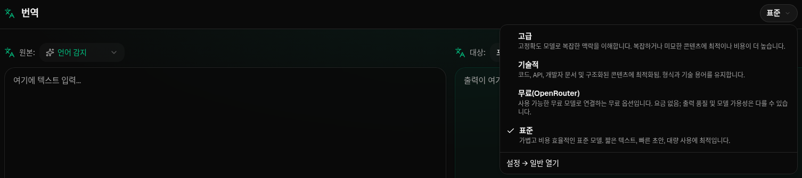
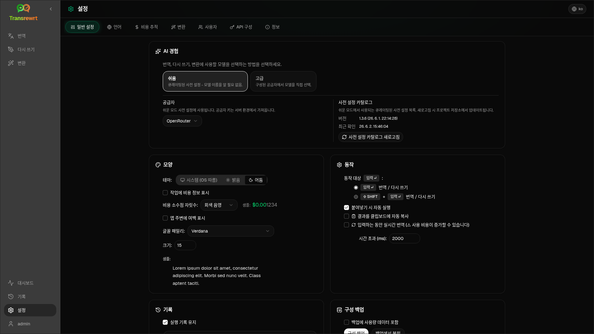

<a id="transrewrt-user-guide"></a>
# 사용자 가이드

<br/>

<a id="introduction"></a>
## 소개

Transrewrt는 텍스트 작업을 다음 세 가지 주요 방식으로 지원합니다:

- **번역** - 텍스트를 한 언어에서 다른 언어로 변환합니다.
- **다시 작성** - 더 명확하게, 더 간단하게 또는 더 격식 있게 등의 다른 스타일로 텍스트를 다시 표현합니다.
- **변환** - 프롬프트라고 불리는 사용자 정의 AI 지시사항을 사용하여 텍스트를 처리합니다.

기본적으로 앱은 **쉬움** 모드로 실행됩니다. 설정에서 **사전 설정**(예: 무료(OpenRouter), 표준, 고급 또는 기술)과 **제공업체**를 선택하면 모델 ID를 선택할 필요가 없습니다. [**설정** > **일반 설정**](#general-settings)에서 **고급** 모드로 전환하면 [**설정** > **모델**](#models)의 기존 모델 목록을 사용할 수 있습니다.

<br/>

이 가이드는 앱을 설치하고 실행한 후 사용 방법을 설명합니다. 설치 단계는 주요 [**README**](README.ko.md)를 참조하세요.

<br/>

> ℹ️ **참고**<br/>
> Transrewrt는 Windows 및 Linux용 데스크톱 앱과 자체 호스팅 웹 앱으로 제공됩니다. 이 가이드는 앱의 일상적인 사용에 중점을 둡니다. 특정 기능이 한 버전에만 해당하는 경우 명확히 표시합니다.

<small>**다른 언어로 읽기:** </small>
<small id="lang-list">[English (GB)](../USER-GUIDE.md) · [Português (Brasil)](./USER-GUIDE.pt-BR.md) · [العربية](./USER-GUIDE.ar.md) · [বাংলা](./USER-GUIDE.bn.md) · [Català](./USER-GUIDE.ca.md) · [中文 (中国大陆)](./USER-GUIDE.zh-CN.md) · [中文 (台灣)](./USER-GUIDE.zh-TW.md) · [Hrvatski](./USER-GUIDE.hr.md) · [Čeština](./USER-GUIDE.cs.md) · [Nederlands](./USER-GUIDE.nl.md) · [English (US)](./USER-GUIDE.en-US.md) · [Tagalog](./USER-GUIDE.tl.md) · [Français](./USER-GUIDE.fr.md) · [Deutsch](./USER-GUIDE.de.md) · [Ελληνικά](./USER-GUIDE.el.md) · [हिन्दी](./USER-GUIDE.hi.md) · [Magyar](./USER-GUIDE.hu.md) · [Italiano](./USER-GUIDE.it.md) · [日本語](./USER-GUIDE.ja.md) · [한국어](./USER-GUIDE.ko.md) · [Bahasa Melayu](./USER-GUIDE.ms.md) · [فارسی](./USER-GUIDE.fa.md) · [Polski](./USER-GUIDE.pl.md) · [Basa Jawa](./USER-GUIDE.jv.md) · [Português](./USER-GUIDE.pt.md) · [ਪੰਜਾਬੀ](./USER-GUIDE.pa.md) · [Română](./USER-GUIDE.ro.md) · [Русский](./USER-GUIDE.ru.md) · [Slovenčina](./USER-GUIDE.sk.md) · [Español](./USER-GUIDE.es.md) · [Kiswahili](./USER-GUIDE.sw.md) · [Svenska](./USER-GUIDE.sv.md) · [తెలుగు](./USER-GUIDE.te.md) · [ไทย](./USER-GUIDE.th.md) · [Türkçe](./USER-GUIDE.tr.md) · [Українська](./USER-GUIDE.uk.md) · [Tiếng Việt](./USER-GUIDE.vi.md)</small>

<small>

> **UI 및 문서 번역에 대한 참고:** 영어(영국) 원문을 제외한 모든 인터페이스 언어는 AI 모델을 사용해 번역되었으며, 표현이 부정확하거나 오류가 포함될 수 있습니다.

</small>

<br/>

<!-- START doctoc generated TOC please keep comment here to allow auto update -->
<!-- DON'T EDIT THIS SECTION, INSTEAD RE-RUN doctoc TO UPDATE -->
**목차**

- [시작하기 전에](#before-you-start)
  - [무료 OpenRouter API 키를 얻는 방법 (데스크톱 앱)](#how-to-get-a-free-openrouter-api-key-desktop-app)
- [시작하기](#getting-started)
- [창의 주요 구성 요소](#main-parts-of-the-window)
  - [사이드바](#sidebar)
  - [툴바](#toolbar)
  - [입력 및 출력 패널](#input-and-output-panels)
- [번역](#translate)
  - [텍스트 번역](#translate-text)
  - [언어 선택](#language-selection)
  - [유용한 번역 설정](#helpful-translation-settings)
- [다시 작성](#rewrite)
- [변환](#transform)
  - [기존 프롬프트 실행](#run-an-existing-prompt)
  - [아직 프롬프트가 없는 경우](#if-you-have-no-prompts-yet)
  - [빠르게 프롬프트 생성](#create-a-prompt-quickly)
  - [프롬프트 편집](#edit-a-prompt)
  - [사용 전 프롬프트 테스트](#test-a-prompt-before-using-it)
- [대시보드](#dashboard)
  - [데이터 필터링](#filter-the-data)
  - [대시보드 탭](#dashboard-tabs)
  - [데이터 내보내기](#export-data)
  - [모델에 대한 저장된 기록 삭제](#delete-stored-records-for-a-model)
- [기록](#history)
  - [기록 필터링](#filter-the-history)
  - [기록 데이터 내보내기](#export-history-data)
- [설정](#settings)
  - [일반 설정](#general-settings)
  - [모델](#models)
  - [언어](#languages)
  - [비용 추적](#cost-tracking)
  - [변환 (설정 탭)](#transform-settings-tab)
  - [사용자](#users)
  - [API 설정](#api-config)
  - [정보](#about)
- [일반적인 문제](#common-issues)
  - [앱이 텍스트를 번역, 다시 작성 또는 변환하지 못함](#the-app-will-not-translate-rewrite-or-transform-text)
  - [모델 목록이 비어 있음](#the-model-list-is-empty)
  - [결과가 너무 느리거나 비쌈](#the-result-is-too-slow-or-too-expensive)
  - [인터페이스 언어가 잘못됨](#the-interface-is-in-the-wrong-language)
  - [글자가 너무 작거나 읽기 어렵습니다](#the-text-is-too-small-or-hard-to-read)
  - [대시보드 요약이 비어 보입니다](#dashboard-summary-looks-empty)
  - [비용이 "사용 불가" 또는 잘못 표시됩니다](#cost-shows-not-available-or-seems-wrong)
  - [총 비용이 제공업체 청구서와 일치하지 않습니다](#total-cost-does-not-match-my-provider-bill)
  - [사이드바에 기록 페이지가 없음](#the-history-page-is-missing-from-the-sidebar)
  - [웹 앱: 예기치 않게 로그인 페이지로 리디렉션됨](#web-app-redirected-to-the-login-page-unexpectedly)
  - [웹 관리자: 비밀번호를 잊었거나 분실함](#web-admin-forgot-or-lost-a-password)
  - [대시보드에 다른 사용자의 데이터가 표시되지 않음 (웹)](#dashboard-shows-no-data-for-other-users-web)
  - [프롬프트를 수정했지만 편집 내용이 사라짐](#i-changed-a-prompt-and-lost-the-edits)
- [빠른 팁](#quick-tips)
- [면책 조항](#disclaimer)
- [라이선스](#license)

<!-- END doctoc generated TOC please keep comment here to allow auto update -->

<br/><br/>

<a id="before-you-start"></a>
## 시작하기 전에

Transrewrt를 사용하려면 최소한 하나의 AI 제공업체에 접근할 수 있어야 합니다. 지원되는 제공업체는 다음과 같습니다: [OpenRouter](https://openrouter.ai) (다양한 모델을 통합), OpenAI, Anthropic, Google Gemini, DeepSeek, Groq, Mistral, xAI, Cerebras 및 로컬 모델용 [Ollama](https://ollama.com).

시작하려면 유료 모델을 선택할 필요는 없습니다. OpenRouter API 키를 추가하는 즉시 앱은 내장된 **무료** OpenRouter 옵션을 자동으로 활성화합니다. 이를 통해 즉시 텍스트 번역, 다시 작성 및 변환을 시작할 수 있습니다. 또는 Cerebras, Google, Groq 또는 Mistral AI에서 무료 API 키를 발급받을 수도 있습니다.

간단히 설명하면:

- **쉬움** 모드에서는 **사전 설정**(무료(OpenRouter), 표준, 고급, 기술)이 선택한 **제공업체**(OpenRouter, OpenAI, Ollama 등)에 해당하는 모델로 매핑됩니다. 현재 제공업체에 매핑된 사전 설정만 도구 모음에 표시됩니다. 번역, 다시 작성, 변환 작업 시 사전 설정을 선택합니다.
- **고급** 모드에서는 **모델**을 직접 선택하는 AI 엔진입니다. 모델 ID는 **제공업체 접두사**를 사용합니다(예: `openrouter/…`, `openai/…`, `ollama/…`).
- **API 키**(또는 Ollama의 경우 **기본 URL**)는 앱이 해당 제공업체에 연결하는 데 사용하는 방법입니다.

**데스크톱 앱**을 사용하는 경우, 사용하는 각 제공업체에 대해 [**설정** > **API 설정**](#api-config)에서 키를 추가하세요. OpenRouter 전용 사용의 경우 아래의 [무료 OpenRouter API 키를 확보하는 방법](#how-to-get-a-free-openrouter-api-key-desktop-app)을 참조하세요. API 키를 사용하고 싶지 않다면 [ollama.com](https://ollama.com)에서 Ollama를 설치하고 `translategemma:4b`과 같은 로컬 모델을 사용할 수 있습니다.

**웹 버전**을 사용하는 경우 서버 소유자가 환경 변수를 통해 제공업체를 구성하므로 앱 내에서 직접 API 키를 입력할 수 없습니다.

<br/>

<a id="how-to-get-a-free-openrouter-api-key-desktop-app"></a>
### 무료 OpenRouter API 키를 확보하는 방법(데스크톱 앱)

데스크톱 앱을 사용하는 경우 다음 단계를 따르세요:

1. 웹 브라우저에서 [OpenRouter](https://openrouter.ai)로 이동합니다.
2. 계정을 생성하거나 로그인합니다.
3. [Keys](https://openrouter.ai/keys) 페이지를 엽니다.
4. 새 API 키를 생성하는 버튼을 클릭합니다.
5. 나중에 식별할 수 있도록 키에 이름을 지정합니다.
6. 새 API 키를 복사합니다.
7. Transrewrt로 돌아가 **설정** > **API 설정**을 엽니다.
8. **OpenRouter API 키** 필드에 키를 붙여넣습니다 (**설정** > **API 설정** 내).
9. **OpenRouter 키 테스트**를 클릭하여 제대로 작동하는지 확인합니다.

<br/><br/>

<a id="getting-started"></a>
## 시작하기

Transrewrt를 처음 사용하는 경우 다음 순서를 따르세요:

1. 앱을 엽니다.
2. 필요 시 지구본 아이콘에서 **인터페이스 언어**를 선택합니다.
3. **데스크톱 앱**을 사용 중인 경우, [**설정** > **API 설정**](#api-config)을 열고 하나 이상의 제공업체(예: OpenRouter)에 대한 API 키를 추가한 후 **테스트**를 클릭하여 작동 여부를 확인합니다.
4. [**설정** > **일반 설정**](#general-settings)을 엽니다. **쉬움** 모드(기본값)에서는 구성된 키가 있는 **제공업체**를 선택합니다. **고급** 모드에서는 [**설정** > **모델**](#models)을 열고 하나 이상의 모델을 **선택한 모델**에 추가합니다.
5. **번역**에서 도구 모음에서 **사전 설정**(쉬움) 또는 **모델**(고급)을 선택합니다.
6. [**설정** > **언어**](#languages)을 열고 자주 사용하는 언어를 맨 위에 표시하려면 **상위 언어**를 선택합니다.
7. 간단한 번역을 실행하여 모든 것이 제대로 작동하는지 확인한 후 **다시 작성** 및 **변환**을 시도합니다.

이 순서는 중요합니다. 가장 흔한 초기 사용 문제인 앱이 작동하는 API 연결이나 선택된 사전 설정/모델을 확보하기 전에 작업을 실행하려는 상황을 방지합니다.

<br/><br/>

<a id="main-parts-of-the-window"></a>
## 창의 주요 구성 요소

앱은 세 가지 주요 영역으로 나뉩니다:

- 왼쪽의 **사이드바**.
- 상단의 **툴바**.
- 중앙의 **작업 영역**.

<br/>

<a id="sidebar"></a>
### 사이드바

앱 내 이동은 사이드바를 사용하세요. 앱 로고 옆의 아이콘을 클릭하면 사이드바를 접어 더 많은 공간을 확보할 수 있습니다.

<br/>

<table>
  <tr>
    <td valign="top">
       
    </td>
    <td valign="top">
      <br/><br/>
      <ul>
        <li><strong>번역</strong>은 번역 작업 공간을 엽니다.</li><br/>
        <li><strong>다시 작성</strong>은 다시 작성 작업 공간을 엽니다.</li><br/>
        <li><strong>변환</strong>은 사용자 정의 프롬프트 작업 공간을 엽니다.</li><br/>
        <li><strong>대시보드</strong>는 사용량 및 비용 정보를 표시합니다.</li><br/>
        <li><strong>설정</strong>은 설정 패널을 엽니다.</li><br/>
        <li><strong>기록</strong>은 입력 및 출력 텍스트와 함께 사용 기록을 표시합니다.</li><br/>
        <li><strong>사용자</strong>는 로그인한 사용자의 사용자 이름을 표시합니다(웹 전용).</li>
      </ul>
    </td>
  </tr>
</table>

<br/>

<a id="toolbar"></a>
### 툴바

툴바는 앱 내 위치에 따라 약간씩 달라집니다.

- 왼쪽에는 현재 페이지 이름이 표시됩니다.
- 오른쪽에는 **사전 설정 또는 모델 선택기**와 **인터페이스 언어** 조정 기능이 표시됩니다.

**쉬움** 모드에서는 도구 모음에 기본 제공되는 **사전 설정 선택기**가 표시되며, 내장 사전 설정으로는 **무료(OpenRouter)**, **표준**, **고급**, **기술**이 있습니다. 표시되는 사전 설정은 [**설정** > **일반 설정**](#general-settings)에서 선택한 **제공업체**에 따라 달라집니다. 예를 들어, **무료(OpenRouter)** 는 제공업체가 OpenRouter일 때만 표시됩니다. **제공업체**가 **Ollama**인 경우 도구 모음에 사전 설정 대신 로컬에 설치된 모델이 나열됩니다.

**고급** 모드에서는 **모델 선택기**를 통해 현재 작업에 사용할 AI 엔진을 선택할 수 있습니다.



고급 모드에서는 일부 무료 모델이 항상 사용 가능한 것은 아닙니다. 오프라인이거나 사용량 한도에 도달할 수 있습니다. 앱이 자동으로 해당 모델을 목록에서 제거할 수 있습니다. 표시되는 모델을 제어하려면 [**설정** > **모델**](#models)으로 이동하세요. 툴바의 모델 이름 왼쪽에 있는 제공업체 아이콘을 클릭하여 모델 설정을 열 수 있습니다.

<br/>

**지구본 아이콘 + 언어 코드**는 메뉴 및 버튼과 같은 앱 인터페이스 언어를 변경합니다. 하지만 **번역**에서 사용하는 번역 언어는 **변경하지 않습니다**.


<br/>

<a id="input-and-output-panels"></a>
### 입력 및 출력 패널

대부분의 작업 공간은 왼쪽에 **입력** 패널과 오른쪽에 **출력** 패널을 사용합니다.

각 패널에는 다음도 표시됩니다:

| **입력**                                                          | **출력**                                                                                                                  |
|--------------------------------------------------------------------|-----------------------------------------------------------------------------------------------------------------------------|
| - 글자 수 <br/>- 단어 수 <br/>- 문단 수   <br/> | - 작업 소요 시간<br/>- **TPS** (초당 토큰 수)<br/>- 글자, 단어, 문단 수<br/>- 사용된 모델 |

기술 용어가 궁금하다면 다음을 참고하세요:

- **토큰**은 텍스트의 작은 조각을 의미합니다. 한 단어의 일부 또는 짧은 단어로 생각할 수 있습니다.
- **TPS**는 모델이 초당 처리한 텍스트 조각의 수를 의미합니다.

<br/>

또한 [**설정** > **일반 설정**](#general-settings)에서 옵션 `Show cost information on the actions`을 활성화하면 각 작업의 비용(가능한 경우)과 총 비용을 모니터링할 수 있습니다.

<br/><br/>

[--------------------------------------------------------------------------------------------------------------------------]: #

<a id="translate"></a>
## 번역

**번역**은 텍스트를 한 언어에서 다른 언어로 변환할 때 사용합니다.


<br/>

<a id="translate-text"></a>
### 텍스트 번역

1. **번역**을 엽니다.
2. **원본**에서 언어를 선택합니다.
3. **번역**에서 언어를 선택합니다.
4. 도구 모음에서 사전 설정(쉬움) 또는 모델(고급)을 선택합니다.
5. **입력**에 텍스트를 입력하거나 붙여넣습니다.
6. **번역**을(를) 클릭합니다.
7. **출력**에서 결과를 확인합니다.
8. 결과를 복사하려면 복사 버튼을 사용합니다.

<br/>

<a id="language-selection"></a>
### 언어 선택

- **From**은(는) 특정 언어 또는 **언어 감지**일 수 있습니다.
- **To**는 결과를 원하는 언어입니다.

선택한 **상위 언어**가 목록 상단에 표시됩니다. [**설정** > **언어**](#languages)에서 이 설정을 변경할 수 있습니다.

<br/>

<a id="helpful-translation-settings"></a>
### 유용한 번역 설정

[**설정** > **일반 설정**](#general-settings)에서 번역 동작 방식을 변경할 수 있습니다:

- **붙여넣기 시 자동 번역**은 텍스트를 붙여넣는 즉시 번역을 실행합니다.
- **결과를 자동으로 클립보드에 복사**는 성공적으로 실행된 후 결과를 자동으로 복사합니다.
- **실시간 번역(입력 중)** 은 입력하는 동안 번역을 실행합니다.
- **타임아웃(밀리초)** 은 실시간 번역을 실행하기 전에 앱이 대기하는 시간을 조정합니다.
- **ENTER 동작 설정**은 `Enter` 키를 눌렀을 때의 동작을 제어합니다:
  - **Enter**: 번역 또는 다시 작성 실행(기본값).
  - **Shift + Enter**: 번역 또는 다시 작성 실행; 일반 **Enter**는 새 줄 삽입.

[--------------------------------------------------------------------------------------------------------------------------]: #

<a id="rewrite"></a>
## 다시 작성

주된 의미는 유지한 채 문장의 표현을 개선하고자 할 때 **다시 작성**을(를) 사용하세요.


이 기능은 다음 작업에 유용합니다:

- 철자 및 문법 수정(**철자 및 문법 검사**)
- 텍스트 명확성 향상(**명확성 향상**)
- 한 번의 실행으로 여러 가지 다른 표현 제공(**대체 버전**)
- 텍스트를 더 공식적 또는 비공식적으로 변경(**공식적으로 작성** / **비공식적으로 작성**)
- 텍스트 축약 또는 확장 (**축약** / **확장**)
- 텍스트를 더 전문적인 어조로 변경 (**전문적으로 작성**)

<br/>

> 💡 **TIP**<br/>
> "**철자 및 문법 검사**" 모드를 사용하면 출력 패널에 **변경 사항 표시** 스위치가 나타납니다 (**복사** 옆).
> 이 스위치를 켜거나 끄면 텍스트에 적용된 수정 사항을 표시하거나 숨길 수 있습니다.

<br/><br/>

[--------------------------------------------------------------------------------------------------------------------------]: #

<a id="transform"></a>
## 변환

사용자 정의 지시사항을 AI가 따르게 하려면 **변환**을(를) 사용하세요.


이 기능은 앱에서 가장 유연한 영역입니다. 다음 작업에 활용할 수 있습니다:

- 메모 요약
- 초안 텍스트를 다듬어 이메일로 작성
- 핵심 내용 추출
- 텍스트를 특정 형식으로 변환
- 입력 텍스트로 수행할 기타 사용자 정의 작업

<br/>

<a id="run-an-existing-prompt"></a>
### 기존 프롬프트 실행

1. **변환**을(를) 엽니다.
2. 프롬프트 목록에서 프롬프트를 선택합니다.
3. **대상** 언어 상자가 나타나면 원하는 언어를 선택합니다.
4. **입력**란에 텍스트를 입력하거나 붙여넣습니다.
5. **변환**을(를) 클릭합니다.
6. **출력**에서 결과를 확인합니다.

<br/>

<a id="if-you-have-no-prompts-yet"></a>
### 아직 프롬프트가 없는 경우

프롬프트 목록이 비어 있는 경우 변환 작업 영역에서 **샘플 프롬프트 불러오기**를 클릭하세요. 동일한 기능은 내보내기/가져오기 행에 있는 [**설정** > **변환**](#transform-settings)에서도 항상 사용할 수 있습니다. 두 방법 모두 기본 제공 예제를 추가하여 빠르게 시작할 수 있습니다.

<br/>

> ℹ️ **참고**<br/>
> 샘플 프롬프트는 영어로 제공됩니다. 불러온 후 프롬프트를 편집하고 **프롬프트 번역**을 사용하여 사용자 언어로 번역할 수 있습니다.

<br/>

<a id="create-a-prompt-quickly"></a>
### 빠르게 프롬프트 생성하기

프롬프트를 생성하는 가장 빠른 방법은 다음과 같습니다.

1. **새 프롬프트**를 클릭합니다.
2. **프롬프트 생성**을 클릭합니다.
3. 프롬프트가 수행해야 할 작업을 설명합니다.
4. 사전 설정(쉬움) 또는 모델(고급)을 선택합니다.
5. 앱이 초안을 작성하도록 합니다.
6. 초안을 검토한 후 **저장**을(를) 클릭합니다.


<br/>

<a id="edit-a-prompt"></a>
### 프롬프트 편집하기

프롬프트를 생성하거나 편집할 때 왼쪽에 편집기가 나타나고 오른쪽에 테스트 영역이 나타납니다.


주요 필드는 다음과 같습니다.

- **프롬프트 이름**: 프롬프트 목록에 표시되는 이름입니다.
- **프롬프트 지침 (선택 사항)**: 프롬프트 실행 시 사용자에게 표시되는 간단한 안내입니다.
- **모델 역할**: '도움이 되는 조수입니다.'와 같이 AI에 할당된 전반적인 역할입니다.
- **모델 지침 (한 줄에 하나)**: AI가 따라야 할 구체적인 규칙입니다.
- **출력 설명**: '요약' 또는 '다시 작성'과 같이 결과를 설명하는 짧은 단어입니다.
- **온도 (0.0 → 1.0)**: 모델의 동작 방식을 결정합니다. 아래를 참조하세요.
- **대상 언어 묻기**: 프롬프트 실행 시 대상 언어 선택기를 추가합니다.

기술 용어 **온도**가 익숙하지 않다면 다음처럼 이해할 수 있습니다.

- **낮은** 온도는 더 안정적이고 예측 가능한 결과를 제공합니다.
- **높은** 온도는 더 다양한 창의성을 제공합니다.

또한 다음을 사용할 수 있습니다.

- `Generate prompt`: 간단한 설명으로 새 초안 생성
- `Improve prompt`: 기존 프롬프트 개선
- `Translate prompt`: 프롬프트 필드 번역

<br/>

> ⚠️ **경고**<br/>
> `Back to Run`을(를) 클릭하기 전에 `Save`을(를) 클릭하세요. 저장하지 않고 돌아가면 변경 사항이 모두 사라집니다.

<br/>

<a id="test-a-prompt-before-using-it"></a>
### 사용 전 프롬프트 테스트하기

오른쪽의 테스트 패널을 사용하면 일상 업무에 사용하기 전에 샘플 텍스트로 프롬프트를 시험해볼 수 있습니다.

다음과 같은 경우에 유용합니다:

- 새 프롬프트를 작성할 때
- 두 개의 프롬프트 버전을 비교할 때
- 톤, 길이 또는 출력 형식을 확인하고 싶을 때

<br/>

> ℹ️ **참고**<br/>
> 저장된 프롬프트는 [**설정** > **변환**](#transform-settings)에서 내보내기 및 가져오기를 할 수 있습니다.

프롬프트 편집기에서 **프롬프트 생성**, **프롬프트 개선**, **프롬프트 번역**을 사용할 때 **쉬움** 모드는 번역 및 다시 작성과 동일한 사전 설정 선택기를 제공하며, **고급** 모드는 모델 목록을 사용합니다.

<br/><br/>

[--------------------------------------------------------------------------------------------------------------------------]: #

<a id="dashboard"></a>
## 대시보드

**대시보드**를 사용하여 앱 사용량과 비용(유료 모델의 경우)을 확인할 수 있습니다.


<br/>

> ℹ️ **참고**<br/>
> **무료** 모델만 사용하는 경우 **비용**이 0일 수 있으며 비용 중심 KPI는 비어 보일 수 있습니다. 그러나 선택한 기간 동안 활동이 있는 경우 **요약** 탭에서는 번역, 다시 작성, 변환의 호출 수를 계속 표시합니다.

<br/>

<a id="filter-the-data"></a>
### 데이터 필터링

상단의 필터 버튼을 사용하여 기간을 변경할 수 있습니다.


<br/>

> ℹ️ **참고**<br/>
> **사용자** 필터는 웹 버전에서 관리자에게만 표시됩니다. 일반 사용자는 이 필터를 볼 수 없으며 데스크톱 앱에서는 사용할 수 없습니다.

<br/>

<a id="dashboard-tabs"></a>
### 대시보드 탭

- **요약**에는 총 비용, 사용된 모델, 모드별 호출 수 및 비용(총 호출 수 대비 비율), 호출당 평균 비용, 평균 TPS, 호출 수 기준 상위 3개 모델을 보여주는 KPI 카드가 표시됩니다.
- **모델 기준**은 각 모델별 총 호출 수, 총 비용, 평균 TPS를 나열하며, 행을 확장하면 번역, 다시 작성, 변환별 세부 정보를 확인할 수 있습니다.
- **모든 호출**은 전체 호출 기록을 표시하며(넓은 레이아웃에서는 페이지네이션, 좁은 화면에서는 카드 형식), 이를 내보낼 수 있습니다.

<br/>

<a id="export-data"></a>
### 데이터 내보내기

대시보드 테이블은 다음 형식으로 데이터를 내보낼 수 있습니다:

- **JSON**
- **CSV**
- **XLSX**

앱 외부에서 활동을 검토하거나 보고서를 공유하려는 경우 유용합니다.

<br/>

<a id="delete-stored-records-for-a-model"></a>
### 모델의 저장된 기록 삭제

**모델 기준** 또는 **모든 호출**에서 "휴지통" 아이콘을 클릭하여 특정 모델의 저장된 기록을 제거할 수 있습니다.

> ⚠️ **경고**<br/>
> 저장된 기록을 삭제하면 복구할 수 없습니다. 해당 기록이 더 이상 필요하지 않은 경우에만 사용하세요.

모든 데이터를 삭제하거나 기록의 보관 기간에 따라 기록을 제거하려면 [**설정** > **비용 추적**](#cost-tracking)로 이동하세요. 여기에서 저장된 모든 데이터를 삭제하거나 특정 날짜보다 오래된 데이터만 삭제하는 옵션을 사용할 수 있습니다.

<br/><br/>

[--------------------------------------------------------------------------------------------------------------------------]: #

<a id="history"></a>
## 기록

**기록**을(를) 클릭하여 **Transrewrt** 내에서 수행한 작업의 기록을 확인하세요. 각 작업의 입력과 출력도 함께 확인할 수 있습니다.


<br/>

<a id="filter-the-history"></a>
### 기록 필터링

**기록**은 **대시보드** 페이지와 동일한 기간 필터를 사용합니다.


<br/>

> ℹ️ **참고**<br/>
> **웹 앱**에서는 관리자 포함 모든 사용자가 자신의 실행 기록만 볼 수 있습니다. **대시보드**의 **사용자** 필터는 관리자가 여러 계정의 사용량 및 비용을 확인하기 위한 것이며, **기록**에는 적용되지 않습니다.

<br/>

<a id="export-history-data"></a>
### 기록 데이터 내보내기

기록 페이지에서는 필터링된 데이터를 다음 형식으로 내보낼 수 있습니다:

- **JSON**
- **CSV**
- **XLSX**

앱 외부에서 활동을 검토하거나 보고서를 공유하려는 경우 유용합니다.

<br/><br/>

[--------------------------------------------------------------------------------------------------------------------------]: #

<a id="settings"></a>
## 설정

사이드바에서 **설정**을(를) 열어 앱의 동작 방식을 사용자 지정하세요.

사용 가능한 탭은 플랫폼과 사용자의 역할에 따라 다릅니다:

| 탭 | 데스크톱 | 웹(관리자) | 웹(일반 사용자) | 비고 |
|------------------|:-------:|:-----------:|:------------------:|----------------------------------------------|
| 일반 설정 |   예   |     예     |        예         | **AI 기능**(쉬움 / 고급) 포함 |
  | 모델 |   예   |     예     |        예         | **AI 기능**이 **고급**일 때만 표시됨 |
  | 언어 |   예   |     예     |        예         |                                              |
  | 비용 추적 |   예   |     예     |         -          |                                              |
  | 변환 |   예   |     예     |        예         | 변환 프롬프트의 일괄 내보내기/가져오기 |
  | 사용자 |    -    |     예     |         -          |                                              |
  | API 설정 |   예   |     예     |         -          |                                              |
  | 정보 |   예   |     예     |        예         |                                              |

**쉬움** 모드에서는 도구 모음의 사전 설정과 일반 설정의 **제공업체**를 통해 모델을 선택하며, **모델** 탭은 숨겨집니다.

<br/>

> ℹ️ **참고**<br/>
> 웹 버전에서는 각 사용자가 자신의 설정을 갖습니다. AI 기능, 제공업체, 선택한 모델 또는 사전 설정, 언어, 일반 옵션, 변환 프롬프트 등의 설정은 사용자별로 저장됩니다. 사용자가 변경한 내용은 다른 사용자에게 영향을 주지 않습니다.

<br/>

[--------------------------------------------------------------------------------------------------------------------------]: #

<a id="general-settings"></a>
### 일반 설정

**일반 설정**에서 입력 동작, **기록**에 실행 세부 정보 저장 여부, 외형, 번역/다시 작성/변환 시 사용할 AI 선택 방법을 제어할 수 있습니다.

**AI 기능**

- **쉬움** (기본값): **제공업체**(OpenRouter, OpenAI, Anthropic, Google Gemini, DeepSeek, Groq, Mistral, xAI, Cerebras 또는 Ollama)를 선택합니다. 클라우드 제공업체는 도구 모음의 내장 사전 설정을 사용합니다. **Ollama**은 사전 설정 대신 사용자의 컴퓨터에 설치된 모델을 나열합니다. 쉬움 모드에서는 **사전 설정 카탈로그**에 카탈로그 버전과 마지막 업데이트 시간이 표시되며, **사전 설정 카탈로그 새로 고침**을 클릭하면 프로젝트 저장소에서 최신 사전 설정 목록을 가져옵니다(앱은 주기적으로 백그라운드에서도 확인함).
- **고급**: 도구 모음에서 개별 모델을 선택하고, [**설정** > **모델**](#models)에서 목록을 관리합니다.

**웹 앱**에서는 서버 환경에 설정된 API 키에 따라 표시되는 제공업체가 결정됩니다. **데스크톱 앱**에서는 [**API 설정**](#api-config)에서 키를 구성할 수 있습니다.

**동작**

- **ENTER 키 동작**은 `Enter`이 작업을 실행할지 아니면 새 줄을 삽입할지를 결정합니다.
- **붙여넣기 시 자동 번역**은 텍스트를 붙여넣는 즉시 번역을 시작합니다.
- **결과를 자동으로 클립보드에 복사**는 성공한 결과를 자동으로 클립보드에 복사합니다.
- **실시간 번역 (입력 중)** 은 입력하는 동안 번역을 수행합니다.
- **시간 초과 (ms)** 는 실시간 번역을 위한 대기 시간을 설정합니다.

**기록**

- **실행 기록 유지**는 사이드바의 [**기록**](#history) 보기에서 각 번역, 다시 작성 및 변환 작업의 **입력 및 출력 텍스트**를 저장할지 여부를 제어합니다. 이 기능을 끄면 확인을 요청하며, 확인 시 저장된 기록 텍스트가 데이터베이스에서 제거됩니다. 레이블에 *관리자에 의해 비활성화됨*이라고 표시된 경우, 설치 환경에서 `HISTORY_DISABLED`이 설정된 것입니다(자세한 내용은 [README](README.ko.md#configuration-and-environment) 참조). 이 경우 UI에서 기록 기능을 다시 켤 수 없습니다.
- **기록 데이터 삭제**를 사용하면 저장된 텍스트를 기간별로(예: 몇 개월 이전 또는 **모든 데이터 (지우기)**) **데이터 삭제** 기능을 통해 제거할 수 있습니다. 이 작업은 **기록** 보기의 저장된 실행 텍스트에만 영향을 미치며, 비용 또는 사용량 총계는 **삭제하지 않습니다**. **비용** 데이터를 제거하거나 축소하려면 [**설정** > **비용 추적**](#cost-tracking)을 사용하세요.

**외형**

- **테마**: 라이트, 다크, 시스템 외형 간 전환.
- **작업에 비용 정보 표시**: 작업당 비용(가능한 경우) 및 번역, 다시 작성, 변환 출력 패널의 총 비용 표시 여부 제어.
- **비용 소수점 자릿수**: 비용 소수점 표시 방법 변경.
- **웹 전용:** **앱 주변에 여백 표시** 인터페이스 주변에 여유 공간 추가.
- **글꼴**: 텍스트 패널의 글꼴 변경.
- **크기**: 글꼴 크기 변경.

**구성 백업** (데스크톱 앱 및 웹 관리자만 해당)

- **백업에 사용량 데이터 포함** - 활성화 시 ZIP 파일에 실행 기록 및 API 호출 데이터도 포함됩니다.
- **구성 백업** - `config.json`, `state.json`, 선택적 암호화 키, 사용자, 환경 설정, 사용자 정의 프롬프트 및 사용량 데이터(선택한 경우)를 포함한 단일 ZIP 파일을 생성합니다(`transrewrt-config-backup-YYYY-MM-DD_HHMMSS.zip` 기준 UTC). 백업이 성공하면 저장된 파일 이름이 확인 메시지에 표시됩니다.
- **백업에서 복원** - 먼저 **확인 대화상자**를 엽니다. 대화상자 내에서 백업 ZIP 파일을 선택하고(**찾아보기** / 파일 선택기 또는 지원되는 경우 드래그 앤 드롭), 옵션을 검토합니다:
  - **사용 데이터 복원** - 사용 데이터 포함 상태에서 백업된 ZIP 파일의 사용량/기록을 가져옵니다. 설정과 프롬프트만 원할 경우 이 옵션을 해제하세요.
  - **복원 전 이전 사용 데이터 지우기** - 백업을 적용하기 전에 이 설치에 있는 기존 사용량/기록을 제거합니다(선택 사항; 깨끗하게 교체하고자 할 때 사용).

웹 버전과 데스크톱 버전에서 생성된 백업은 서로 복원할 수 있습니다. 데스크톱 백업을 웹 버전에 복원할 경우, 데이터는 관리자 사용자에게 복원됩니다.

<br/>

<a id="models"></a>
### 모델

[**일반 설정**](#general-settings)에서 **AI 기능**이 **고급**으로 설정된 경우에만 이 탭을 사용할 수 있습니다. 툴바에 표시할 모델을 선택하려면 **설정** > **모델**을 사용하세요.



이 페이지에는 두 개의 목록이 있습니다:

- 왼쪽의 **사용 가능한 모델**
- 오른쪽의 **선택한 모델**

사용할 수 있는 주요 기능:

- 이름으로 모델을 찾으려면 **모델 검색...** 사용
- 목록을 하나의 엔진(OpenRouter, OpenAI, Ollama, …)으로 좁히려면 **제공업체** 칩 사용
- 무료 모델만 표시하려면 **무료 전용** 사용
- 목록을 다시 로드하려면 **새로고침** 사용
- 제공업체별로 정렬할 때 **Expand All** 및 **Collapse All**을(를) 사용합니다

모델 ID에는 제공업체 접두사가 포함됩니다 (예: `openrouter/…` 대 `openai/…`). **OpenAI (OpenRouter)** 또는 **OpenAI (direct)** 와 같은 배지로 트래픽이 어떻게 라우팅되는지 확인할 수 있습니다.

> ℹ️ **NOTE**<br/>
> **OpenRouter Body Builder**(`openrouter/bodybuilder`)은 일반 채팅 모델이 아닌 라우터 모델입니다. 이 모델의 응답은 OpenRouter API 요청 본문을 설명하는 JSON입니다 (예: `requests` 배열에 `model` 및 `messages` 포함). 이 모델을 **Translate**, **Rewrite** 또는 **Transform** 작업에 사용하면 출력 패널에 완성된 텍스트 대신 해당 JSON이 표시됩니다. 이러한 작업에는 일반 텍스트 모델을 선택하세요. 자세한 내용은 OpenRouter의 [Body Builder 모델 페이지](https://openrouter.ai/openrouter/bodybuilder)를 참조하세요.

작업:

- 모델을 추가하려면 **Add**를 클릭하거나 목록 항목의 아무 곳이나 클릭하세요.

- 모델을 제거하려면 **Selected Models**에서 해당 모델 옆의 **X**를 클릭하거나 사용 가능한 모델 목록에서 항목의 **Selected**를 클릭하세요.

- 목록을 지우려면 **Deselect all**을(를) 클릭하세요. 필수 무료 모델은 목록에 유지됩니다.

<br/>

> ℹ️ **NOTE**<br/>
> OpenRouter에 즉시 크레딧을 추가하고 싶지 않다면, 먼저 **Free Only**을(를) 활성화하고 무료 모델을 선택하세요 (신용카드 필요 없음). 또한 API 키 없이 로컬에서 모델을 실행하기 위해 Ollama를 사용할 수 있습니다.

<br/>

<a id="languages"></a>
### 언어

**Settings** > **Languages**를 사용하여 앱에서 사용하는 언어 목록을 관리하세요.

- **Top languages**는 **Translate** 및 **Transform**의 언어 목록 상단 근처에 고정됩니다.
- **Custom language**를 사용하면 기본 제공 목록에 없는 언어를 추가할 수 있습니다.

사용자 정의 언어를 추가하면 기본 제공 옵션과 함께 언어 선택기에서 표시됩니다.

<br/>

<a id="cost-tracking"></a>
### 비용 추적

**Settings** > **Cost Tracking**를 사용하여 비용 정보를 관리하세요.

- **Total Cost**는 누적 합계를 표시합니다.
- **Copy Value**는 합계를 클립보드에 복사합니다.
- **Reset Cost**는 저장된 합계를 0으로 초기화합니다.
- **Sync with API key usage**는 OpenRouter 계정에서 보고된 사용량과 일치하도록 합계를 설정합니다 (OpenRouter 전용).
- **API Key Usage**는 사용 가능한 경우 OpenRouter 사용량 세부 정보를 표시합니다.
- **Delete cost data**는 모든 데이터 또는 선택한 날짜보다 오래된 항목만 삭제합니다.

**비용 추적:** OpenRouter 모델을 사용할 경우, 앱은 OpenRouter에서 제공하는 비용 정보를 기반으로 실제 사용량과 지출을 표시합니다. 다른 모든 제공업체의 경우, 앱은 OpenRouter에서 공개한 가격을 기준으로 비용을 추정하며, 가격 정보가 없을 경우 추정치는 0일 수 있습니다.

<br/>

> ℹ️ **NOTE**<br/>
> **모든 비용 수치는 참고용 추정치이며 공식 청구서가 아닙니다.**

<br/>

> ⚠️ **WARNING**<br/>
> 데이터 삭제는 되돌릴 수 없습니다. 삭제하기 전에 반드시 데이터를 백업하거나 [**History**](#history)
또는 [**Dashboard** > **All Calls**](#dashboard-tabs)을 통해 내보내세요. 그렇지 않으면 데이터가 영구적으로 삭제됩니다.
각 API 호출 항목과 관련된 모든 입력/출력 기록도 함께 삭제됩니다.

<br/>

<a id="transform-settings"></a>
### 변환 (설정 탭)

**설정** > **변환**을 사용하여 프롬프트를 일괄 관리하세요.

다음 작업을 수행할 수 있습니다.

- 저장된 프롬프트 확인
- 프롬프트 삭제
- 파일에서 프롬프트 가져오기
- 백업 또는 공유를 위해 프롬프트 내보내기
- 프롬프트 목록에 샘플 프롬프트 불러오기

<br/>

<a id="users"></a>
### 사용자

웹 버전에서 **사용자**를 사용하여 사용자 계정을 관리할 수 있습니다. 사용자를 추가하고, 세부 정보를 업데이트하며, 비밀번호를 재설정하고, 계정을 삭제할 수 있습니다.

<br/>

<a id="api-config"></a>
### API 설정

지원되는 제공업체는 OpenRouter, OpenAI, Anthropic, Google Gemini, DeepSeek, Groq, Mistral, xAI, Cerebras 및 **Ollama**(기본 URL을 통한 로컬 모델)입니다. 사용하는 제공업체만 구성하면 됩니다.

**웹 애플리케이션: 관리자 전용**

API 키는 시스템 또는 Docker 환경 변수를 통해 구성되며, 웹 UI에 입력하지 않습니다. 이 페이지는 어떤 제공업체에 키가 구성되어 있는지 보여주며, `Test` 버튼을 클릭하여 각각을 테스트할 수 있습니다.

<br/>

> ℹ️ **참고**<br/>
> API 키를 변경하려면 시스템 또는 Docker 구성의 환경 변수를 업데이트하고 서버 또는 컨테이너를 다시 시작하십시오.

<br/>

> ℹ️ **참고**<br/>
> **구성 백업** (참조: [**일반 설정** → 구성 백업](#general-settings))은 ZIP 파일의 `config.json` 내에 **해결된** 제공업체 키를 포함할 수 있습니다. 해당 ZIP을 복원하면 해당 키가 서버의 지속 구성 파일에 다시 복사되지 **않습니다** - 라이브 키는 여기에 설명된 환경 및 기존 파일 상태에서 계속 제공됩니다.

<br/>

**데스크톱 애플리케이션**

사용하는 각 제공업체에 대한 API 키를 저장하려면 **API 설정**을 사용하십시오. Ollama의 경우 API 키 대신 **기본 URL**을 입력합니다.

<br/>

> 💡 **팁** <br/>
> API 키를 사용하거나 요금을 지불하고 싶지 않다면 [Ollama 다운로드](https://ollama.com)하여 기계에서 `translategemma:4b`과 같은 모델을 무료로 로컬로 실행할 수 있습니다. 또는 무료 OpenRouter 계정을 만들어(신용카드 필요 없음) 무료 모델을 사용하거나, Cerebras, Google, Groq 또는 Mistral AI에서 무료 API 키를 발급받을 수 있습니다.

<br/>

- 필요한 제공업체만 추가하세요. **설정** > **모델**에서 각 모델 ID는 제공업체로 시작됩니다(예: `openrouter/openrouter/free`, `openai/gpt-4o`, `ollama/llama3`).

API 키를 추가하려면 텍스트 필드에 값을 입력하고 `Save`을 클릭하세요. 기존 키를 교체하려면 `Edit`을 클릭하세요. 키가 작동하는지 확인하려면 `Test`을 클릭하세요. Ollama 기본 URL의 경우 연결을 확인하려면 항상 `Test`을 클릭하세요.

<br/>

> ℹ️ **참고**<br/>
> 현재 API 키의 값을 볼 수 없습니다. `Edit` 버튼을 사용하여만 교체할 수 있습니다.
> API 키는 구성에 암호화되어 저장됩니다.

<br/>

<a id="about"></a>
### 정보

**정보** 탭에는 다음이 표시됩니다:

- 앱 이름과 슬로건
- 버전 번호 및 빌드 날짜
- 라이선스 및 저작권 정보, **타사 공지**를 열 수 있는 링크 포함
- 프로젝트 저장소로 연결되는 링크

<br/><br/>

<a id="common-issues"></a>
## 일반적인 문제

작동하지 않는 경우, 먼저 다음 사항을 확인하세요.

<br/>

<a id="the-app-will-not-translate-rewrite-or-transform-text"></a>
### 앱이 텍스트를 번역, 다시 작성 또는 변환하지 않음

확인하세요:

- 도구 모음에서 **사전 설정**(쉬움) 또는 **모델**(고급)을 선택했는지 확인하세요
- **쉬움** 모드에서는 [**설정** > **일반 설정**](#general-settings)에 작동하는 키(또는 Ollama URL)가 있는 **제공업체**와 해당 제공업체에 대한 최소한 하나의 사전 설정이 있어야 합니다
- **고급** 모드에서는 [**설정** > **모델**](#models)에 최소한 하나의 모델이 나열되어 있어야 합니다
- API 설정이 정상적으로 작동하고 있는지 확인하세요

데스크톱 앱을 사용하는 경우:

1. [**설정** > **API 설정**](#api-config)을 엽니다.
2. 적어도 하나의 API 키가 저장되어 있는지 확인합니다.
3. 제공업체 옆의 **테스트**를 클릭하여 키가 작동하는지 확인합니다.

<br/>

<a id="the-model-list-is-empty"></a>
### 모델 목록이 비어 있음

**쉬움** 모드에서는 [**설정** > **일반 설정**](#general-settings)을 열고 **제공업체**가 설정되었는지 확인한 후, [**API 설정**](#api-config)(데스크톱)에서 키를 추가하거나 테스트하거나(웹의 경우 관리자에게 문의하세요). **Ollama**의 경우 기본 URL에서 **테스트**를 실행하고 로컬에 모델이 설치되었는지 확인하세요.

**고급** 모드에서는 [**설정** > **모델**](#models)을 열고 **새로고침**을 클릭하세요. 필요한 경우 모델을 검색하고, **무료 전용**을 켠 후 모델을 **선택한 모델**에 추가하세요.

<br/>

<a id="the-result-is-too-slow-or-too-expensive"></a>
### 결과가 너무 느리거나 비쌈

다음 중 하나 이상을 시도하세요:

- 다른 사전 설정(쉬움) 또는 모델(고급)을 선택하세요
- 입력을 더 짧게 작성하세요
- [**설정** > **일반 설정**](#general-settings)에서 **입력 중 실시간 번역**을 끄세요
- 간단한 작업에는 무료 모델을 사용하세요([모델](#models) 참조)

<br/>

<a id="the-interface-is-in-the-wrong-language"></a>
### 인터페이스 언어가 잘못됨

[툴바](#toolbar)에서 지구 아이콘을 클릭하고 선호하는 **인터페이스 언어**를 선택하세요.

<br/>

<a id="the-text-is-too-small-or-hard-to-read"></a>
### 텍스트가 너무 작거나 읽기 어려움

[**설정** > **일반 설정**](#general-settings)을 열고 변경하세요:

- **글꼴 패밀리**
- **크기**

<br/>

<a id="dashboard-summary-looks-empty"></a>
### 대시보드 요약이 비어 보입니다

다음과 같은 경우 정상입니다.

- **무료 모델**만 사용 중이고 **비용** 수치를 확인 중인 경우(비용이 0일 수 있음); **요약**의 KPI는 여전히 선택한 기간의 데이터를 필요로 합니다.
- 선택한 **시간 필터**가 호출이 발생한 기간을 포함하지 않을 수 있습니다. 확인하려면 **전체**를 선택해 보세요.

**전체**를 선택한 후에도 KPI가 여전히 0인 경우, [**기록**](#history) 또는 **모든 호출** 탭에서 호출 기록이 표시되는지 확인하세요.

<br/>

<a id="cost-shows-not-available-or-seems-wrong"></a>
### 비용이 "사용 불가능"으로 표시되거나 잘못된 것처럼 보임

**OpenRouter**를 통해 모델을 사용하는 경우, 앱은 OpenRouter에서 보고된 실제 지출액을 표시합니다.

**기타 제공업체**(OpenAI 직접, Anthropic 직접 등)의 경우 비용은 OpenRouter에서 공개한 가격 정보를 기반으로 추정됩니다. 모델에 해당하는 가격 정보를 찾을 수 없는 경우 비용은 **사용 불가**로 표시되며 누적 합계에 포함되지 않습니다.

<br/>

<a id="total-cost-does-not-match-my-provider-bill"></a>
### 총 비용이 제공업체 청구서와 일치하지 않음

앱의 모든 비용 수치는 공식 청구서가 아닌 **참고용 추정치**입니다.

총합을 실제 OpenRouter 지출액에 더 가깝게 맞추려면 [**설정** > **비용 추적**](#cost-tracking)을 열고 **API 키 사용량과 동기화**를 클릭하세요.

<br/>

<a id="the-history-page-is-missing-from-the-sidebar"></a>
### 기록 페이지가 사이드바에 없습니다

**실행 기록 유지**가 꺼져 있을 수 있습니다. [**설정** > **일반 설정**](#general-settings)을 열고 기록이 *관리자에 의해 비활성화됨*이 아닌 경우 활성화하세요(환경에서 `HISTORY_DISABLED` 설정됨 — [README](README.ko.md#configuration-and-environment) 참조). 기록을 켜도 이전에 삭제된 텍스트는 복원되지 않습니다.

<br/>

<a id="web-app-session-expired"></a>
### 웹 앱: 로그인 페이지로 예기치 않게 리디렉션됨

세션이 만료되었을 수 있습니다. 다시 로그인하세요. 자주 발생한다면 서버 구성에서 세션 수명 설정을 확인하세요.

<br/>

<a id="web-admin-forgot-or-lost-a-password"></a>
### 웹 관리자: 비밀번호를 잊었거나 분실함

이 내용은 데스크톱(Electron) 앱이 아닌 **자체 호스팅 웹 앱**(Docker)에 적용됩니다.

- 다른 관리자가 여전히 로그인할 수 있다면, [**설정** > **사용자**](#users)을 열고 해당 계정을 선택한 후 거기서 **새 비밀번호**를 설정할 수 있습니다.
- **잠긴 상태**이지만 머신 또는 컨테이너에 **셸 접근 권한**이 있는 경우, 이미지와 함께 제공되는 도우미를 사용하여 비밀번호를 재설정하세요(`transrewrt`을 기본 이름에서 변경한 경우 교체하고, 비밀번호에 공백이나 특수 문자가 포함된 경우 따옴표로 묶으세요):

```bash
docker exec transrewrt reset-web-password '<username>' '<new-password>'
```

기본 관리자 사용자 이름은 다른 계정을 만들지 않았다면 `admin`입니다. 하나의 인수만 전달하면 `admin`의 새 비밀번호로 간주됩니다.

Docker 대신 **소스 체크아웃**에서 실행 중인 경우 다음을 사용하세요:

```bash
pnpm run reset-web-password -- <username> <new-password>
```

스크립트는 SQLite 데이터베이스의 사용자 레코드를 업데이트하며(누락된 경우 `admin` 사용자를 생성할 수도 있음) 비밀번호 재설정 후 새 비밀번호로 로그인합니다.

<br/>

<a id="dashboard-shows-no-data-for-other-users"></a>
### 다른 사용자의 데이터가 대시보드에 표시되지 않음 (웹)

**관리자**만 **사용자** 필터를 통해 모든 사용자의 데이터를 볼 수 있습니다. 일반 사용자는 설계상 자신의 활동만 볼 수 있습니다.

<br/>

<a id="i-changed-a-prompt-and-lost-the-edits"></a>
### 프롬프트를 수정했는데 편집 내용이 사라짐

프롬프트를 편집할 때는 항상 **실행으로 돌아가기**를 클릭하기 전에 **저장**을 클릭해야 합니다.

<br/><br/>

<a id="quick-tips"></a>
## 빠른 팁

- [**번역**](#translate)으로 시작하여 설정이 제대로 작동하는지 확인한 후 [**다시 작성**](#rewrite) 또는 [**변환**](#transform)으로 넘어가세요.
- 일상적인 문장 개선에는 [**다시 작성**](#rewrite)을 사용하세요.
- 특정 작업을 위한 반복 가능한 워크플로우가 필요한 경우 [**변환**](#transform)을 사용하세요.
- 사용량과 비용을 확인하려면 [**대시보드**](#dashboard)를 사용하세요.
- [**기록**](#history)을 사용하여 과거 작업과 그 전체 입력/출력 텍스트를 검토하십시오.
- 안전하게 보관하고 싶은 프롬프트 라이브러리를 구축하는 경우 정기적으로 프롬프트를 내보내십시오 (자세한 내용은 [변환](#transform)을 참조하십시오) 또는 다른 사람과 공유하려는 경우.
- 모델 ID에 대한 세부 제어가 필요할 때까지 **쉬움** 모드에 머무르십시오; 원하는 모델을 이미 알고 있다면 **고급**로 전환하십시오.

<br/><br/>

<a id="disclaimer"></a>
## 면책 조항

제품 이름 및 아이콘은 각 소유자에게 속하며 식별 용도로만 사용됩니다. 이 소프트웨어는 언급된 브랜드와 제휴하거나 승인받지 않았습니다.

<br/><br/>

<a id="license"></a>
## 라이선스

저작권 © 2026 월더마르 스쿠델러 주니어.

[Apache License 2.0](../LICENSE)
