
# 사용자 가이드

 

## 소개

Transrewrt는 텍스트를 다음과 같은 세 가지 주요 방법으로 작업할 수 있도록 도와줍니다:

- **번역** - 한 언어의 텍스트를 다른 언어로 변환합니다.
- **다시 작성** - 더 명확하거나, 더 짧게, 또는 더 격식 있는 등 다양한 스타일로 텍스트를 재구성합니다.
- **변환** - 프롬프트라 불리는 사용자 정의 AI 지시사항을 사용하여 텍스트를 처리합니다.

 

이 가이드는 앱 설치 후 실행 상태에서의 사용법을 설명합니다. 설치 단계는 주 문서인 **[README](README.ko.md)**를 참고하세요.

 

> ℹ️ **참고** 
> Transrewrt는 Windows와 Linux용 데스크톱 앱 및 셀프호스팅 웹 앱으로 제공됩니다. 이 가이드는 앱의 일상적 사용에 중점을 둡니다. 특정 기능이 특정 버전에만 해당할 경우 명확하게 표시합니다.

<small>**다른 언어로 읽기:** [English (UK)](USER-GUIDE.ko.md) · [Português (BR)](USER-GUIDE.pt-BR.md) · [العربية](USER-GUIDE.ar.md) · [বাংলা](USER-GUIDE.bn.md) · [Català](USER-GUIDE.ca.md) · [简体中文](USER-GUIDE.zh-CN.md) · [繁體中文](USER-GUIDE.zh-TW.md) · [Hrvatski](USER-GUIDE.hr.md) · [Čeština](USER-GUIDE.cs.md) · [Nederlands](USER-GUIDE.nl.md) · [English (US)](USER-GUIDE.en-US.md) · [Filipino](USER-GUIDE.tl.md) · [Français](USER-GUIDE.fr.md) · [Deutsch](USER-GUIDE.de.md) · [Ελληνικά](USER-GUIDE.el.md) · [हिन्दी](USER-GUIDE.hi.md) · [Magyar](USER-GUIDE.hu.md) · [Italiano](USER-GUIDE.it.md) · [日本語](USER-GUIDE.ja.md) · [Basa Jawa](USER-GUIDE.jv.md) · [한국어](USER-GUIDE.ko.md) · [Bahasa Melayu](USER-GUIDE.ms.md) · [فارسی](USER-GUIDE.fa.md) · [Polski](USER-GUIDE.pl.md) · [Português (PT)](USER-GUIDE.pt.md) · [ਪੰਜਾਬੀ](USER-GUIDE.pa.md) · [Română](USER-GUIDE.ro.md) · [Русский](USER-GUIDE.ru.md) · [Slovenčina](USER-GUIDE.sk.md) · [Español](USER-GUIDE.es.md) · [Kiswahili](USER-GUIDE.sw.md) · [Svenska](USER-GUIDE.sv.md) · [తెలుగు](USER-GUIDE.te.md) · [ภาษาไทย](USER-GUIDE.th.md) · [Türkçe](USER-GUIDE.tr.md) · [Українська](USER-GUIDE.uk.md) · [Tiếng Việt](USER-GUIDE.vi.md)</small>

<small>

> **사용자 인터페이스 및 문서 번역에 관한 참고 사항:** 영국식 영어를 제외한 모든 인터페이스 언어는 AI 모델을 사용하여 번역되었으며, 표현이 부정확하거나 오류가 포함될 수 있습니다.

</small>

 

<!-- START doctoc generated TOC please keep comment here to allow auto update -->
<!-- DON'T EDIT THIS SECTION, INSTEAD RE-RUN doctoc TO UPDATE -->
**목차** 

- [시작하기 전](#before-you-start)
  - [무료 OpenRouter API 키를 얻는 방법 (데스크톱 앱)](#how-to-get-a-free-openrouter-api-key-desktop-app)
- [시작하기](#getting-started)
- [창의 주요 구성 요소](#main-parts-of-the-window)
  - [사이드바](#sidebar)
  - [툴바](#toolbar)
  - [입력 및 출력 패널](#input-and-output-panels)
- [번역](#translate)
  - [텍스트 번역](#translate-text)
  - [언어 선택](#language-selection)
  - [유용한 번역 설정](#helpful-translation-settings)
- [다시 작성](#rewrite)
- [변환](#transform)
  - [기존 프롬프트 실행](#run-an-existing-prompt)
  - [아직 프롬프트가 없을 경우](#if-you-have-no-prompts-yet)
  - [빠르게 프롬프트 생성하기](#create-a-prompt-quickly)
  - [프롬프트 편집](#edit-a-prompt)
  - [사용 전 프롬프트 테스트](#test-a-prompt-before-using-it)
- [대시보드](#dashboard)
  - [데이터 필터링](#filter-the-data)
  - [대시보드 탭](#dashboard-tabs)
  - [데이터 내보내기](#export-data)
  - [모델의 저장된 기록 삭제](#delete-stored-records-for-a-model)
- [기록](#history)
  - [데이터 필터링](#filter-the-data-1)
  - [기록 데이터 내보내기](#export-history-data)
- [설정](#settings)
  - [일반 설정](#general-settings)
  - [모델](#models)
  - [언어](#languages)
  - [비용 추적](#cost-tracking)
  - [변환 프롬프트](#transform-prompts)
  - [사용자](#users)
  - [API 구성](#api-config)
  - [정보](#about)
- [일반적인 문제](#common-issues)
  - [앱이 텍스트를 번역, 다시 작성 또는 변환하지 못함](#the-app-will-not-translate-rewrite-or-transform-text)
  - [모델 목록이 비어 있음](#the-model-list-is-empty)
  - [결과가 너무 느리거나 비쌈](#the-result-is-too-slow-or-too-expensive)
  - [인터페이스 언어가 틀림](#the-interface-is-in-the-wrong-language)
  - [텍스트가 너무 작거나 읽기 어려움](#the-text-is-too-small-or-hard-to-read)
  - [대시보드 차트가 비어 있음](#dashboard-charts-are-empty)
  - [비용이 "미제공"으로 표시되거나 잘못된 것 같음](#cost-shows-not-available-or-seems-wrong)
  - [총비용이 제공업체 청구액과 일치하지 않음](#total-cost-does-not-match-my-provider-bill)
  - [사이드바에서 기록 페이지가 없음](#the-history-page-is-missing-from-the-sidebar)
  - [웹 앱: 로그인 페이지로 예기치 않게 리디렉션됨](#web-app-redirected-to-the-login-page-unexpectedly)
  - [대시보드에 다른 사용자 데이터가 표시되지 않음 (웹)](#dashboard-shows-no-data-for-other-users-web)
  - [프롬프트를 수정했지만 편집 내용이 사라짐](#i-changed-a-prompt-and-lost-the-edits)
- [빠른 팁](#quick-tips)
- [면책조항](#disclaimer)
- [라이선스](#license)

<!-- END doctoc generated TOC please keep comment here to allow auto update -->

  

## 시작하기 전에

Transrewrt를 사용하려면 하나 이상의 AI 제공업체에 대한 접근 권한이 필요합니다. 지원되는 제공업체는 다음과 같습니다. [OpenRouter](https://openrouter.ai) (다양한 모델을 통합), OpenAI, Anthropic, Google Gemini, DeepSeek, Groq, Mistral, xAI, Cerebras, 그리고 로컬 모델을 위한 [Ollama](https://ollama.com)입니다.

시작을 위해 유료 모델을 선택할 필요는 없습니다. OpenRouter API 키를 추가함과 동시에 앱에서는 내장된 **무료** OpenRouter 옵션을 자동으로 활성화합니다. 이를 통해 바로 텍스트를 번역, 재작성 및 변환할 수 있습니다. 또는 Cerebras, Google, Groq, 또는 Mistral AI에서 무료 API 키를 직접 발급받아 사용할 수도 있습니다.

간단히 설명하면 다음과 같습니다.

- **모델**(model)이란 작업을 수행하는 AI 엔진을 의미합니다. 모델은 **제공업체 접두어**(provider prefix)와 함께 표시되며 (예: `openrouter/…`, `openai/…`, `ollama/…`) 사용할 수 있습니다.
- **API 키**(또는 Ollama의 경우 **기본 URL**(base URL))은 앱이 해당 제공업체에 연결하기 위해 사용하는 수단입니다.

**데스크톱 앱**을 사용하는 경우 각각의 제공업체별로 [**설정** > **API 설정**](#api-config)에서 키를 추가해야 합니다. OpenRouter만 사용하는 경우에는 아래의 [API 키를 얻는 방법](#how-to-get-an-api-key-desktop-app)을 참고하세요. API 키를 사용하고 싶지 않다면, [ollama.com](https://ollama.com)에서 Ollama를 설치하여 `translategemma:4b`와 같은 로컬 모델을 사용할 수 있습니다.

**웹 버전**을 사용하는 경우 서버 관리자가 환경 변수를 통해 제공업체를 설정하므로, 앱 내에서 API 키를 직접 입력할 수 없습니다.

 

### 무료 OpenRouter API 키 발급 방법 (데스크톱 앱)

데스크톱 앱을 사용하는 경우 다음 단계를 따르세요:

1. 웹 브라우저에서 [OpenRouter](https://openrouter.ai)로 이동합니다.
2. 계정을 생성하거나 로그인합니다.
3. [Keys](https://openrouter.ai/keys) 페이지를 엽니다.
4. 새 API 키를 생성하는 버튼을 클릭합니다.
5. 나중에 확인할 수 있도록 키에 이름을 지정합니다.
6. 새 API 키를 복사합니다.
7. Transrewrt로 돌아가서 **설정** > **API 설정**을 엽니다.
8. **OpenRouter API 키** 필드에 복사한 키를 붙여넣습니다 (**설정** > **API 설정** 내).
9. **OpenRouter 키 테스트**를 클릭하여 정상 작동하는지 확인합니다.

  

## 시작하기

처음 Transrewrt를 사용하는 경우 아래 순서대로 진행하세요:

1. 앱을 엽니다.
2. 필요 시 지구본 아이콘에서 **인터페이스 언어**를 선택합니다.
3. **데스크톱 앱**을 사용 중이라면, [**설정** > **API 설정**](#api-config)을 열고 하나 이상의 제공업체(예: OpenRouter)에 대한 API 키를 추가한 후 **테스트**를 클릭하여 작동 확인합니다.
4. [**설정** > **모델**](#models)로 이동하여 **선택된 모델** 섹션에 하나 이상의 모델을 추가합니다.
5. [**설정** > **언어**](#languages)로 이동하여 자주 사용하는 언어가 가장 앞에 오도록 **주 언어 목록**을 설정할 수 있습니다.
6. **번역** 탭으로 이동하여 간단한 번역을 실행해 모든 설정이 정상적으로 작동하는지 확인합니다.
7. 정상 동작 확인 후, **재작성** 기능을 시도하고 그 다음으로 **변환** 기능을 시도해 보세요.

이 순서는 중요합니다. 가장 흔한 초기 사용 문제인, API 연결이나 선택된 모델 없이 기능을 수행하려는 사례를 방지할 수 있습니다.

  

## 창의 주요 구성 요소

앱은 다음과 같은 세 가지 주요 영역으로 나뉩니다:

- 왼쪽의 **사이드바**
- 상단의 **툴바**
- 중앙의 **작업 영역**

 

### 사이드바

앱 내 이동은 사이드바를 이용합니다. 앱 로고 옆의 아이콘을 클릭하여 사이드바를 접어 더 넓은 공간을 확보할 수 있습니다.

 

<table>
  <tr>
    <td valign="top">
       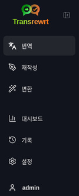
    </td>
    <td valign="top">
        
      <ul>
        <li><strong>번역</strong> - 번역 작업 공간을 엽니다.</li> 
        <li><strong>재작성</strong> - 재작성 작업 공간을 엽니다.</li> 
        <li><strong>변환</strong> - 사용자 정의 프롬프트 작업 공간을 엽니다.</li> 
        <li><strong>대시보드</strong> - 사용량 및 비용 정보를 표시합니다.</li> 
        <li><strong>설정</strong> - 설정 패널을 엽니다.</li> 
        <li><strong>기록</strong> - 입력 및 출력된 텍스트와 함께 사용 기록을 보여줍니다.</li> 
        <li><strong>사용자</strong> - 로그인한 사용자의 사용자 이름을 표시합니다 (웹 전용).</li>
      </ul>
    </td>
  </tr>
</table>

 

### 도구 모음

도구 모음의 구성은 앱 내에서 현재 위치에 따라 약간 달라집니다.

- 왼쪽에는 현재 페이지의 이름이 표시됩니다.
- 오른쪽에는 **모델 선택기**와 **인터페이스 언어** 설정이 표시됩니다.

**모델 선택기**를 사용하면 현재 작업에 사용할 AI 엔진을 선택할 수 있습니다.

  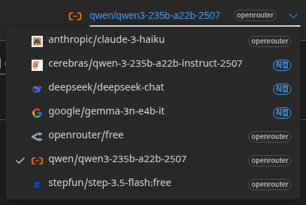

일부 무료 모델은 항상 사용 가능한 것은 아닙니다. 때때로 오프라인이거나 사용 제한이 있을 수 있습니다. 이런 경우 앱은 자동으로 사용 가능한 목록에서 해당 모델을 제거합니다. 표시되는 모델을 관리하려면 [**설정** > **모델**](#models)으로 이동하여 모델 목록을 편집하세요.  
또한 도구 모음에서 모델 이름 왼쪽에 있는 제공업체 아이콘을 클릭하여 모델 설정을 직접 열 수도 있습니다.

 

**지구본 아이콘 + 언어 코드**를 클릭하면 메뉴 및 버튼과 같은 앱 인터페이스의 언어를 변경할 수 있습니다. 이 설정은 **번역** 기능에서 사용하는 번역 언어를 변경하지는 **않습니다**.

  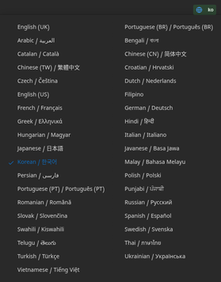

 

### 입력 및 출력 패널

대부분의 작업 공간은 왼쪽의 **입력** 패널과 오른쪽의 **출력** 패널로 구성됩니다.

각 패널은 아래 정보도 함께 표시합니다:

| **입력**                                                          | **출력**                                                                                                                  |
|--------------------------------------------------------------------|-----------------------------------------------------------------------------------------------------------------------------|
| - 문자 수  - 단어 수  - 문단 수                   | - 작업 소요 시간 - **TPS**(초당 처리된 토큰 수) - 문자, 단어, 문단 수 - 사용된 모델 |

다음 기술 용어가 궁금할 경우:

- **토큰**(Token)이란 텍스트의 작은 조각을 의미합니다. 한 단어의 일부이거나 짧은 단어로 생각할 수 있습니다.
- **TPS**(Tokens Per Second)란 모델이 1초마다 처리하는 텍스트 조각의 수를 의미합니다.

 

[**설정** > **일반 설정**](#general-settings)에서 `동작 시 비용 정보 표시` 옵션을 활성화하면 각 작업의 비용 및 총 비용을 확인할 수도 있습니다.

  

[--------------------------------------------------------------------------------------------------------------------------]: # 

## 번역

다른 언어로 텍스트를 변환하고자 할 때 **번역** 작업을 사용하세요.

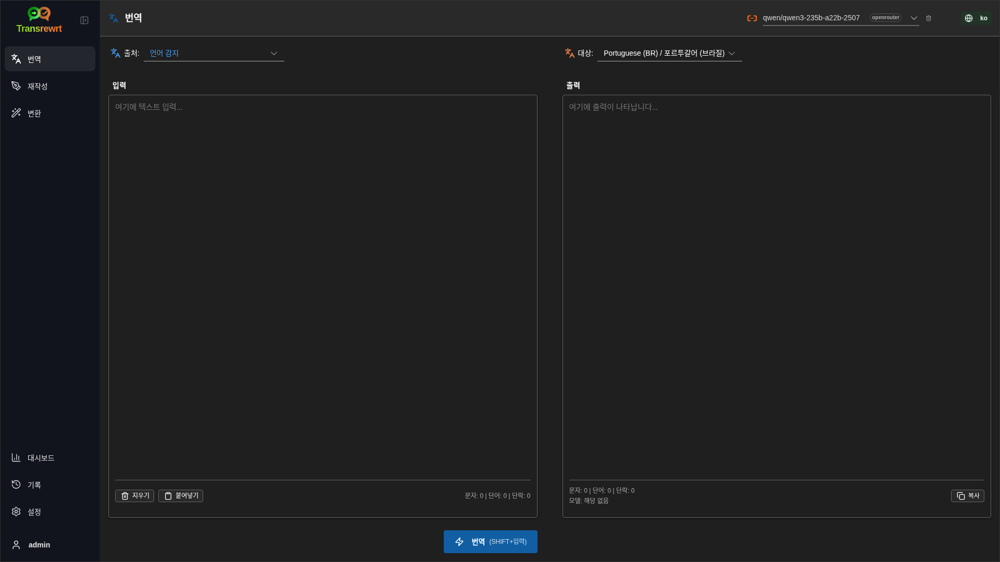

 

### 텍스트 번역하기

1. **번역**을 엽니다.
2. **원문 언어**(From)에서 언어를 선택합니다.
3. **번역 언어**(To)에서 언어를 선택합니다.
4. 도구 모음에서 모델을 선택합니다.
5. **입력** 패널에 텍스트를 입력하거나 붙여넣기합니다.
6. **번역**을 클릭합니다.
7. **출력** 패널에서 결과를 확인합니다.
8. 결과를 복사하려면 복사 버튼을 사용합니다.

 

### 언어 선택

- **원문 언어**(From)는 특정 언어이거나 **언어 감지**일 수 있습니다.
- **번역 언어**(To)는 번역 결과로 원하는 언어입니다.

사용자가 설정한 **상단 언어들**(Top languages)이 언어 목록 맨 위에 표시됩니다. 이 항목은 [**설정** > **언어**](#languages)에서 설정할 수 있습니다.

 

### 유용한 번역 설정

[**설정** > **일반 설정**](#general-settings)에서 번역 동작 방식을 변경할 수 있습니다:

- **붙여넣자마자 자동 번역**: 텍스트를 붙여넣는 즉시 번역을 실행합니다.
- **결과 자동 클립보드 복사**: 성공적으로 번역 완료 후 결과를 자동으로 클립보드에 복사합니다.
- **실시간 번역(타이핑 중)**: 입력하면서 번역을 실시간으로 실행합니다.
- **타임아웃(밀리초)**: 실시간 번역을 실행하기 전에 앱이 대기하는 시간을 설정합니다.
- **Enter 키 동작**: `Enter` 키를 눌렀을 때의 동작을 설정합니다:

  

[--------------------------------------------------------------------------------------------------------------------------]: # 

## 문장 수정

주요 의미는 유지하면서도 문장의 표현을 개선하려고 할 때 **문장 수정**을 사용하세요.

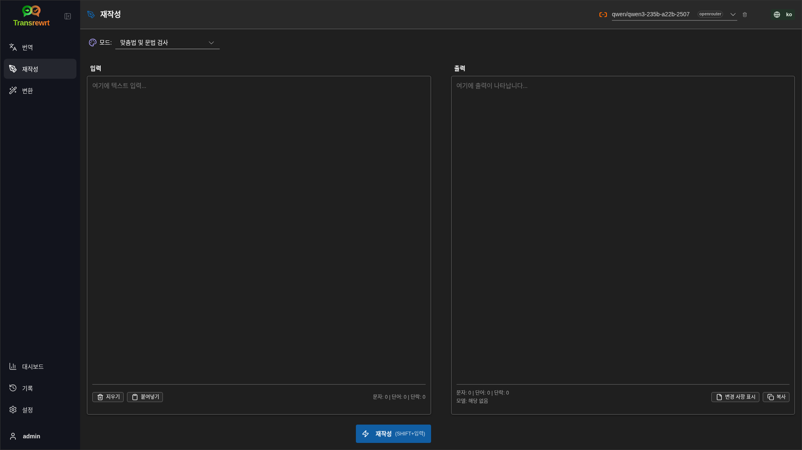

이는 다음 경우에 유용합니다:

- 맞춤법 및 문법 수정
- 텍스트를 더 명확하게 만듦
- 텍스트를 더 격식 있거나 비격식하게 만듦
- 텍스트를 줄이거나 확장함
- 텍스트를 더 전문적인 어조로 바꿈

 

> 💡 **팁** 
> "**맞춤법 및 문법 검사**" 모드를 사용할 경우 출력 패널에 `변경 사항 표시` 버튼이 나타납니다.
> 이 버튼을 클릭하여 교정된 내용의 표시 여부를 전환할 수 있으며, 텍스트에 적용된 구체적인 수정 사항을 보여주거나 숨길 수 있습니다.

  

[--------------------------------------------------------------------------------------------------------------------------]: # 

## 변환

사용자 정의 지침을 따르게 하고자 할 때 **변환** 기능을 사용하세요.

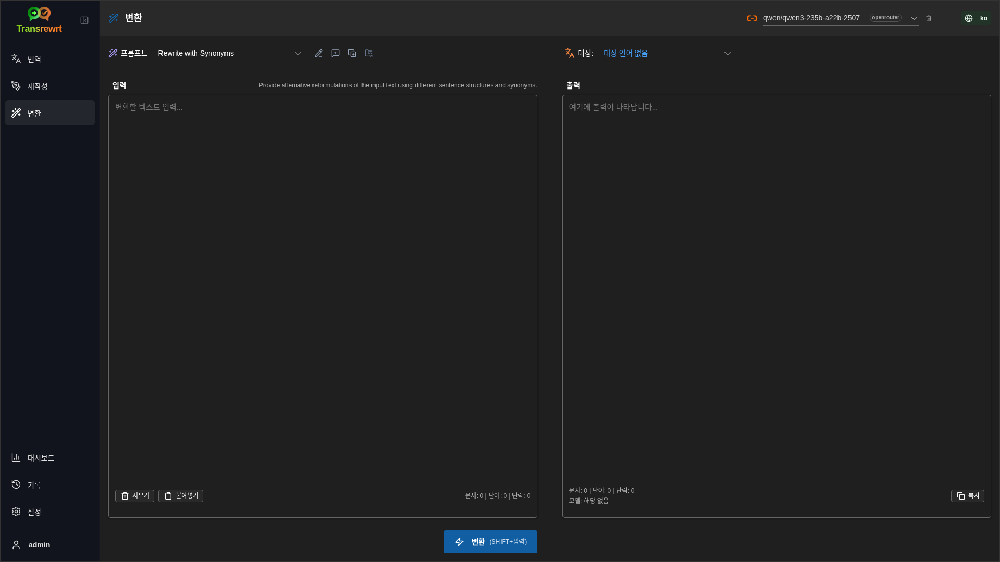

이 기능은 앱에서 가장 유연한 영역입니다. 다음과 같은 작업에 활용할 수 있습니다.

- 메모 요약
- 초안 텍스트를 다듬어 완성된 이메일로 전환
- 핵심 사항 추출
- 특정 형식으로 텍스트 변환
- 입력된 텍스트로 수행할 수 있는 모든 사용자 정의 작업

 

### 기존 프롬프트 실행

1. **변환** 기능을 엽니다.
2. 프롬프트 목록에서 원하는 프롬프트를 선택합니다.
3. **대상** 언어 필드가 나타나면 필요한 경우 언어를 선택합니다.
4. **입력** 창에 텍스트를 입력하거나 붙여넣습니다.
5. **변환** 버튼을 클릭합니다.
6. **출력** 영역에서 결과를 확인합니다.

 

### 프롬프트가 아직 없는 경우

프롬프트 목록이 비어 있다면 **샘플 프롬프트 불러오기**를 클릭하세요. 내장된 예제들이 추가되어 빠르게 시작할 수 있습니다.

 

> ℹ️ **참고** 
> 샘플 프롬프트는 영어로 제공됩니다. 불러온 후 프롬프트를 편집하고 **프롬프트 번역** 기능을 사용하여 사용자의 언어로 번역할 수 있습니다.

 

### 빠르게 프롬프트 만들기

프롬프트를 빠르게 만드는 방법은 다음과 같습니다.

1. **새 프롬프트**를 클릭합니다.
2. **프롬프트 생성**을 클릭합니다.
3. 원하는 프롬프트 기능을 설명합니다.
4. 모델을 선택합니다.
5. 앱이 초안을 작성하도록 합니다.
6. 초안을 검토한 후 **저장**을 클릭합니다.

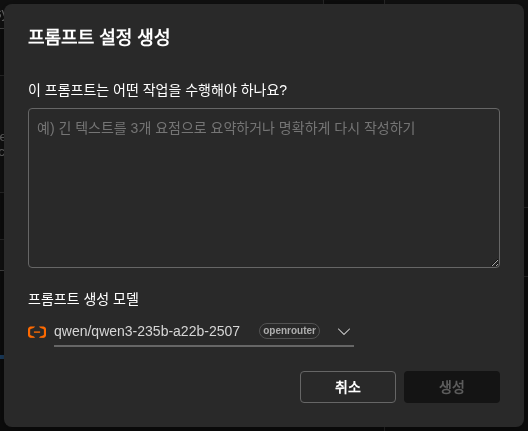

 

### 프롬프트 편집

새 프롬프트를 만들거나 기존 프롬프트를 편집할 때, 왼쪽에는 에디터가, 오른쪽에는 테스트 영역이 나타납니다.

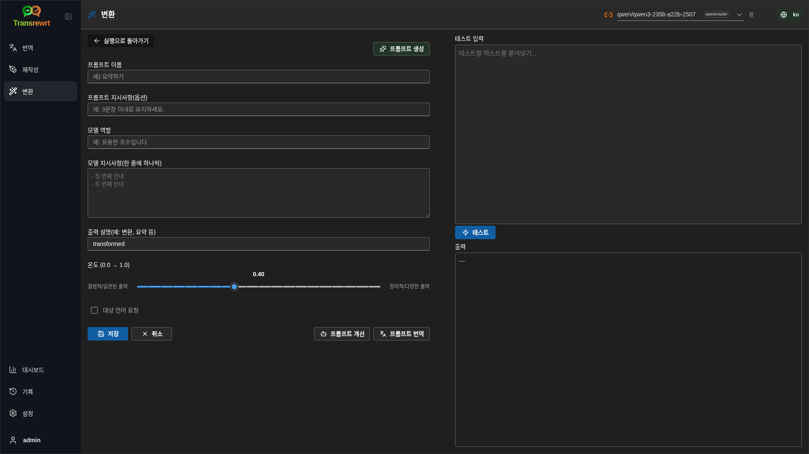

주요 필드는 아래와 같습니다.

- **프롬프트 이름**: 프롬프트 목록에 표시되는 이름입니다.
- **프롬프트 지침 (선택 사항)**: 프롬프트를 실행할 때 사용자에게 표시되는 간단한 안내문입니다.
- **모델 역할**: AI에 부여할 전반적인 역할입니다. 예: '당신은 유용한 조력자입니다.'
- **모델 지침 (줄당 하나씩)**: AI가 따라야 할 구체적인 규칙들입니다.
- **출력 설명**: 결과를 설명하는 짧은 단어입니다. 예: '요약' 또는 '재작성'.
- **Temperature (0.0 → 1.0)**: 모델의 행동 방식을 의미하며, 아래 설명을 참조하세요.
- **대상 언어 묻기**: 프롬프트 실행 시 대상 언어 선택기를 추가합니다.

기술 용어인 **Temperature**가 익숙하지 않다면 다음과 같이 이해하세요:

- **낮은** Temperature는 더 안정적이고 예측 가능한 결과를 제공합니다.
- **높은** Temperature는 더 다양하고 창의적인 결과를 제공합니다.

또한 다음 기능도 사용할 수 있습니다:

- **`프롬프트 생성`**: 간단한 설명으로 새로운 초안을 만듭니다.
- **`프롬프트 개선`**: 기존 프롬프트를 다듬어 개선합니다.
- **`프롬프트 번역`**: 프롬프트 필드들을 번역합니다.

 

> ⚠️ **경고** 
> **`저장`** 을 클릭하기 전에는 **`실행 화면으로 돌아가기`** 을 절대 클릭하지 마세요. 저장하지 않고 돌아가면 변경 사항이 모두 사라집니다.

 

### 사용 전에 프롬프트 테스트

오른쪽에 있는 테스트 패널을 통해 실제 작업에 사용하기 전에 샘플 텍스트로 프롬프트를 시험해볼 수 있습니다.

이 기능은 다음 경우에 유용합니다.

- 새로운 프롬프트를 제작 중일 때
- 프롬프트의 두 가지 버전을 비교할 때
- 톤, 길이 또는 출력 형식을 확인하고 싶을 때

 

> ℹ️ **참고** 
> 저장된 프롬프트는 [**설정** > **변환 프롬프트**](#transform-prompts)에서 내보내기 및 가져오기를 할 수 있습니다.

  

[--------------------------------------------------------------------------------------------------------------------------]: # 

## 대시보드

**대시보드**를 사용하면 앱 사용량 및 비용(유료 모델의 경우)을 확인할 수 있습니다.

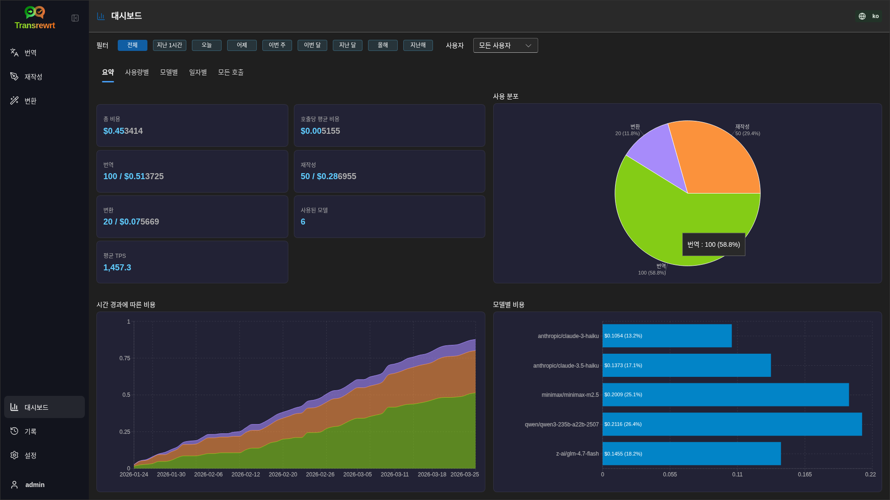

 

> ℹ️ **참고** 
> 무료 모델만 사용하면 비용과 관련된 차트는 비어 있게 표시됩니다. 

 

### 데이터 필터링

상단의 필터 버튼을 사용하여 기간 범위를 변경하세요.

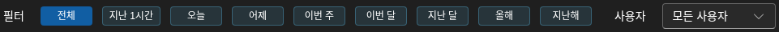

 

> ℹ️ **참고** 
> 웹 버전에서 **사용자** 필터는 관리자에게만 표시됩니다. 일반 사용자는 이 필터를 볼 수 없으며, 데스크톱 앱에서는 사용할 수 없습니다.

 

### 대시보드 탭

- **요약**: 사용량 및 비용에 대한 개요를 제공합니다.
- **사용량별**: 번역 언어, 리라이트 모드 및 변환 프롬프트별로 활동을 분류하여 보여줍니다.
- **모델별**: 사용한 모델과 해당 비용을 표시합니다.
- **일별**: 일일 합계를 표시합니다.
- **모든 호출**: 전체 호출 이력을 보여주며, 내보내기를 지원합니다.

 

### 데이터 내보내기

대시보드 테이블에서는 다음 형식으로 데이터를 내보낼 수 있습니다:

- **JSON**
- **CSV**
- **XLSX**

이 기능은 앱 외부에서 활동 내역을 검토하거나 보고서를 공유하고자 할 때 유용합니다.

 

### 모델별 저장된 기록 삭제

**모델별** 또는 **모든 호출** 탭에서 "휴지통" 아이콘을 클릭하면 특정 모델에 대한 저장된 기록을 제거할 수 있습니다.

> ⚠️ **경고** 
> 저장된 기록을 삭제하면 복구할 수 없습니다. 더 이상 해당 기록이 필요하지 않을 때만 이 기능을 사용하세요.

모든 데이터를 삭제하거나 특정 기간 이상 지난 기록을 제거하려면 [**설정** > **비용 추적**](#cost-tracking)으로 이동하세요. 여기에서 모든 저장 데이터를 삭제하거나 특정 날짜보다 오래된 데이터만 삭제하는 옵션을 제공합니다.

  

[--------------------------------------------------------------------------------------------------------------------------]: # 

## 기록

**기록**을 클릭하면 **Transrewrt** 내에서 수행한 작업 이력을 확인할 수 있으며, 각 작업의 입력 및 출력 내용도 포함됩니다.

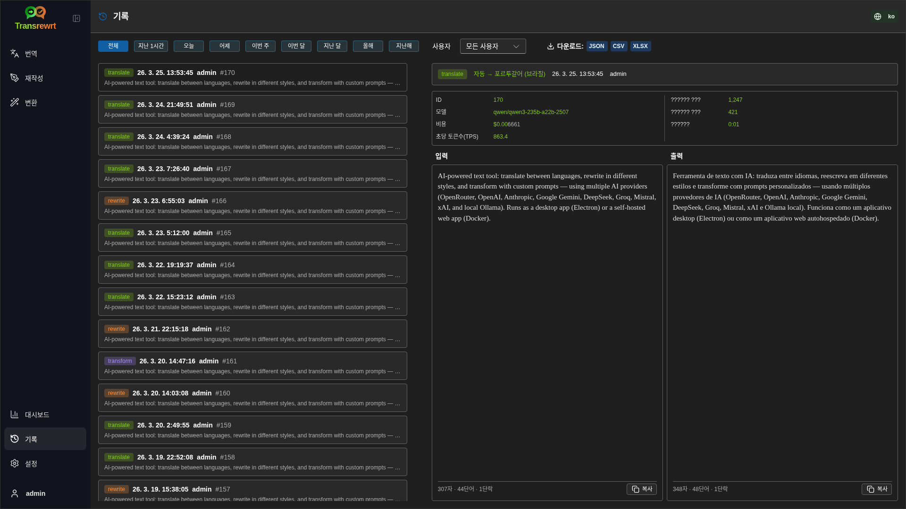

 

### 데이터 필터링

**기록**은 **대시보드** 페이지와 동일한 필터를 사용합니다. 시간 범위를 선택하는 데 사용할 수 있습니다.

 

> ℹ️ **참고** 
> **사용자** 필터는 웹 버전에서만 관리자에게 표시됩니다. 일반 사용자는 해당 필터를 볼 수 없으며, 데스크탑 앱에서는 사용할 수 없습니다.

 

### 기록 데이터 내보내기

기록 페이지에서는 선택된 필터 기준으로 데이터를 다음 형식으로 내보낼 수 있습니다:

- **JSON**
- **CSV**
- **XLSX**

이 기능은 앱 외부에서 활동을 검토하거나 보고서를 공유하고자 할 때 유용합니다.

  

[--------------------------------------------------------------------------------------------------------------------------]: # 

## 설정

사이드바에서 **설정**을 열어 앱 동작 방식을 사용자 정의하세요.

사용 가능한 탭은 사용 플랫폼과 사용자 역할에 따라 다릅니다:

  | 탭                    | 데스크탑 | 웹 (관리자) | 웹 (일반 사용자) |
  |-----------------------|:-------:|:-----------:|:----------------:|
  | 일반 설정             |   예    |     예      |        예        |
  | 모델                  |   예    |     예      |        예        |
  | 언어                  |   예    |     예      |        예        |
  | 비용 추적             |   예    |     예      |         —        |
  | 변환 프롬프트         |   예    |     예      |        예        |
  | 사용자                |    —    |     예      |         —        |
  | API 설정              |   예    |     예      |         —        |
  | 정보                  |   예    |     예      |        예        |

 

> ℹ️ **참고** 
> 웹 버전에서는 각 사용자마다 별도의 설정을 보유합니다. 선택한 모델, 언어, 일반 옵션, 변환 프롬프트 등의 설정은 사용자별로 저장되며, 본인의 변경 사항은 다른 사용자에게 영향을 주지 않습니다.

 

[--------------------------------------------------------------------------------------------------------------------------]: # 

### 일반 설정

**일반 설정**은 입력 동작, 실행 세부 정보를 **기록**에 저장할지 여부, 그리고 외형을 제어하는 데 사용됩니다.

**동작**

- **ENTER 키 동작**: `Enter` 키를 누를 때 작업 수행 여부 또는 새 줄 삽입 여부를 선택합니다.
- **붙여넣기 시 자동 번역**: 텍스트를 붙여넣는 즉시 번역이 시작됩니다.
- **결과 자동 복사**: 성공한 결과를 자동으로 클립보드에 복사합니다.
- **실시간 번역 (입력 중)**: 타이핑하는 도중에도 번역을 수행합니다.
- **타임아웃 (ms)**: 실시간 번역을 위한 대기 시간을 설정합니다.

**기록**

- **실행 기록 유지**: 사이드바의 [**기록**](#history) 보기에서 번역, 리라이트, 변환 작업 시 **입력 및 출력 텍스트**를 저장할지 여부를 결정합니다. 비활성화 시 확인 메시지가 표시되며, 확인 시 저장된 기록 텍스트가 데이터베이스에서 삭제됩니다.
- **기록 데이터 삭제**: **데이터 삭제** 기능을 사용하여 저장된 텍스트를 기간별로(예: 몇 개월 이상 된 데이터 또는 **모든 데이터**) 삭제할 수 있습니다. 이 기능은 **기록** 화면을 위한 실행 텍스트에만 영향을 미치며, 비용 또는 사용량 총계에는 **영향을 주지 않습니다**. **비용** 데이터를 삭제하거나 정리하려면 [**설정** > **비용 추적**](#cost-tracking)을 사용하세요.

**외형**

- **작업에 비용 정보 표시**: 번역, 리라이트, 변환 출력 패널에서 각 작업에 대한 비용(사용 가능한 경우) 및 총 비용의 표시 여부를 제어합니다.
- **비용 소수점 자리수**: 비용 표시 시 소수점 이하 자리수를 변경합니다.
- **웹 전용**: **앱 주변 여백 표시** - 인터페이스 주변에 여유 공간을 추가합니다.
- **글꼴 패밀리**: 텍스트 패널의 글꼴을 변경합니다.
- **크기**: 글꼴 크기를 변경합니다.

 

### 모델

**설정** > **모델**에서 툴바에 표시할 모델을 선택하세요.

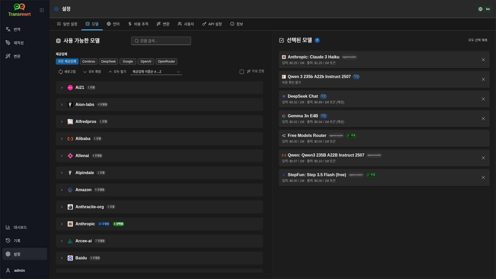

이 페이지는 다음 두 가지 목록으로 구성되어 있습니다:

- 왼쪽: **사용 가능한 모델**
- 오른쪽: **선택된 모델**

사용할 수 있는 주요 기능은 다음과 같습니다:

- **모델 검색...** 이름으로 모델 찾기
- **공급자**(Provider) 칩: 목록을 특정 엔진(OpenRouter, OpenAI, Ollama 등)으로 제한
- **무료 모델만** 항목: 무료 모델만 표시
- **새로고침**: 목록 다시 불러오기
- **모두 펼치기** 및 **모두 접기**: 공급자별로 정렬할 때 사용

모델 ID에는 공급자 접두사가 포함됩니다(예: `openrouter/…`, `openai/…`). **OpenAI (OpenRouter)** 또는 **OpenAI (직접)** 같은 배지(badge)는 트래픽이 어떻게 라우팅되는지를 보여줍니다.

> ℹ️ **참고** 
> **OpenRouter Body Builder**(`openrouter/bodybuilder`)는 일반적인 채팅 모델이 아니라 라우팅 전용 모델입니다. 이 모델의 응답은 OpenRouter API 요청 본문(request body)에 대한 JSON(예: `model` 및 `messages`를 포함한 `requests` 배열) 형식으로 반환됩니다. 따라서 이를 **번역**, **재작성**, **변환** 등의 작업에 사용하면 완성된 텍스트 대신 이 JSON이 출력 패널에 표시됩니다. 이러한 작업에는 일반 텍스트 생성 모델을 사용하세요. 자세한 내용은 OpenRouter의 [Body Builder 모델 페이지](https://openrouter.ai/openrouter/bodybuilder)를 참조하세요.

기능:

- 모델을 추가하려면 **추가** 버튼이나 목록의 항목 아무데나 클릭하세요.
- 모델을 제거하려면 **선택된 모델** 목록에서 해당 항목 옆의 **X**를 클릭하거나, **사용 가능한 모델**에서 항목의 **선택됨** 버튼을 누르세요.
- 목록 전체를 지우려면 **모두 선택 해제**를 클릭하세요. 필수인 무료 모델은 목록에 유지됩니다.

 

> ℹ️ **참고** 
> OpenRouter에 바로 크레딧을 충전하고 싶지 않다면 먼저 **무료 모델만**을 활성화하여 무료 모델을 선택하세요(신용카드 필요 없음). 또한 Ollama를 사용하면 API 키 없이도 로컬에서 모델을 실행할 수 있습니다.

 

### 언어

**설정** > **언어**를 사용해 앱에서 사용되는 언어 목록을 관리하세요.

- **상단 언어들**: **번역** 및 **변환** 기능에서 언어 목록 상단에 고정됩니다.
- **사용자 정의 언어**: 기본 제공 목록에 없는 언어를 추가할 수 있습니다.

사용자 정의 언어를 추가하면 내장된 옵션들과 함께 언어 선택기에서 표시됩니다.

 

### 비용 추적

**설정** > **비용 추적**을 사용하여 비용 정보를 관리하세요.

- **총 비용**: 누적된 총비용을 표시합니다.
- **값 복사**: 총비용을 클립보드에 복사합니다.
- **비용 초기화**: 저장된 금액을 0으로 초기화합니다.
- **API 키 사용량과 동기화**: 총비용을 OpenRouter 계정에서 보고된 사용량과 일치시킵니다.(OpenRouter 전용)
- **API 키 사용량**: 사용 가능한 경우 OpenRouter 사용 내역을 표시합니다.
- **비용 데이터 삭제**: 전체 데이터 또는 선택한 날짜보다 오래된 항목만 삭제합니다.

**비용 추적 기능**: OpenRouter 모델 사용 시 해당 서비스에서 제공하는 비용 정보를 기반으로 실제 사용량 및 지출을 표시합니다. 다른 공급자의 경우 OpenRouter에서 공개된 가격을 기반으로 비용을 추정하며, 가격 정보가 없을 경우 추정 비용이 0일 수 있습니다.

 

> ℹ️ **참고** 
> **모든 비용 수치는 참고용이며 공식 청구서가 아닙니다.**

 

> ⚠️ **경고** 
> 데이터 삭제는 되돌릴 수 없습니다. 삭제하기 전에 반드시 데이터를 백업하거나 [**기록**(History)](#history), 또는 [**대시보드** > **모든 호출**(All Calls)](#dashboard-tabs)을 통해 내보내세요. 그렇지 않으면 영구적으로 데이터가 손실됩니다. 각 API 호출 항목과 관련된 모든 입력/출력 기록도 함께 삭제됩니다.

 

### 변환 프롬프트

**설정** > **변환 프롬프트**를 통해 프롬프트를 일괄 관리할 수 있습니다.

다음 작업을 수행할 수 있습니다:

- 저장된 프롬프트 확인
- 프롬프트 삭제
- 파일에서 프롬프트 가져오기
- 백업 또는 공유를 위해 프롬프트 내보내기

 

### 사용자

웹 버전에서 **사용자**(Users)를 사용해 사용자 계정을 관리하세요. 사용자 추가, 정보 업데이트, 비밀번호 재설정, 계정 삭제를 할 수 있습니다.

 

### API 설정

지원되는 공급자: OpenRouter, OpenAI, Anthropic, Google Gemini, DeepSeek, Groq, Mistral, xAI, Cerebras, 그리고 **Ollama**(기본 URL을 통해 로컬 모델 실행). 사용할 공급자만 설정하면 됩니다.

**웹 애플리케이션: 관리자 전용**

API 키는 시스템 또는 Docker 환경 변수를 통해 설정되며, 웹 UI에서 입력하지 않습니다. 이 페이지는 어떤 공급자에게 키가 설정되어 있는지 보여주며, 각각의 **`테스트`** 버튼을 클릭하여 연결 테스트를 할 수 있습니다.

 

> ℹ️ **참고** 
> API 키를 변경하려면 시스템 또는 Docker 설정에서 환경 변수를 수정하고 서버 또는 컨테이너를 재시작하세요.

 

**데스크톱 애플리케이션**

사용하는 각 공급자의 API 키를 **API 설정**에서 저장하세요. Ollama의 경우 API 키 대신 **기본 URL**(base URL)을 입력하세요.

 

> 💡 **팁** 
> API 키 사용을 원하지 않거나 비용을 지불하고 싶지 않다면, 무료로 모델(예: `translategemma:4b`)을 로컬 머신에서 실행할 수 있도록 [Ollama 다운로드](https://ollama.com)를 설치할 수 있습니다. 또는 신용카드 없이 사용할 수 있는 무료 OpenRouter 계정을 만들거나, Cerebras, Google, Groq, Mistral AI로부터 무료 API 키를 발급받는 방법도 있습니다.

 

- 필요로 하는 공급자만 추가하세요. **설정** > **모델**에서 각 모델 ID는 공급자 접두사로 시작됩니다(예: `openrouter/openrouter/free`, `openai/gpt-4o`, `ollama/llama3`).

API 키를 추가하려면 텍스트 필드에 값을 입력하고 **`저장`**을 클릭하세요. 기존 키를 변경하려면 **`수정`**을 클릭하세요. 키가 제대로 작동하는지 확인하려면 **`테스트`**를 클릭하세요. Ollama의 기본 URL은 반드시 **`테스트`**를 클릭해 연결 상태를 확인하세요.

 

> ℹ️ **참고** 
> 현재 설정된 API 키의 값을 조회할 수는 없습니다. **`수정`** 버튼을 통해서만 키를 교체할 수 있습니다.
> API 키는 설정 파일에 암호화하여 저장됩니다.

 

### 정보

**정보** 탭에는 다음 항목이 표시됩니다:

- 앱 이름
- 버전 번호
- 빌드 날짜
- 프로젝트 저장소로 연결되는 링크

  

## 자주 발생하는 문제

예상대로 작동하지 않는 경우, 다음 항목을 먼저 확인하세요.

 

### 앱이 텍스트를 번역, 재작성 또는 변환하지 않음

다음 사항을 확인하세요:

- 도구 모음에서 모델을 선택했는지
- [**설정** > **모델**](#models)에 하나 이상의 모델이 나열되어 있는지
- API 설정이 정상적으로 동작하는지

데스크탑 앱을 사용 중인 경우:

1. [**설정** > **API 구성**](#api-config)을 엽니다.
2. 하나 이상의 API 키가 저장되었는지 확인합니다.
3. 키가 제대로 작동하는지 확인하려면 제공자 옆에 있는 **테스트**를 클릭합니다.

 

### 모델 목록이 비어 있음

[**설정** > **모델**](#models)을 열고 **새로 고침**을 클릭하세요.

필요한 경우:

- 모델을 검색
- **무료 전용** 켜기
- **선택된 모델**에 하나 이상의 모델을 추가

 

### 결과가 너무 느리거나 비쌈

다음을 시도해 보세요:

- 다른 모델 선택
- 입력 텍스트를 더 짧게 사용
- [**설정** > **일반 설정**](#general-settings)에서 **실시간 번역(입력 중)** 끄기
- 간단한 작업에는 무료 모델 사용 (다음 참조: [모델](#models))

 

### 인터페이스 언어가 잘못됨

[도구 모음](#toolbar)에 있는 지구본 아이콘을 클릭하여 원하는 **인터페이스 언어**를 선택하세요.

 

### 텍스트가 너무 작거나 읽기 어려움

[**설정** > **일반 설정**](#general-settings)을 열고 다음을 변경하세요:

- **글꼴**
- **크기**

 

### 대시보드 차트가 비어 있음

다음의 경우 차트가 비어 있는 것은 정상입니다:

- **무료 모델만** 사용하는 경우 (비용 차트는 빈 상태 유지)
- 선택한 **시간 필터**가 호출 기록이 있는 기간과 일치하지 않는 경우 — 확인을 위해 **모두**를 선택해 보세요

**모두**를 선택한 후에도 차트가 비어 있으면, [**기록**](#history) 또는 **모든 호출** 탭에서 호출 내역이 표시되는지 확인하세요.

 

### 비용 표시가 "사용 불가"이거나 잘못된 것으로 보임

**OpenRouter**를 통해 모델을 사용할 경우, 앱은 OpenRouter에서 보고한 실제 지출 금액을 표시합니다.

**기타 제공업체**(OpenAI 직접, Anthropic 직접 등)의 경우, 비용은 OpenRouter가 공개한 가격 정보를 기반으로 추정됩니다. 해당 모델에 일치하는 가격 정보를 찾지 못하면 비용은 **사용 불가**로 표시되며, 총액 계산에 포함되지 않습니다.

 

### 총 비용이 제공업체 청구서와 일치하지 않음

앱에 표시되는 모든 비용 정보는 **참고용 추정치**이며 공식 청구서가 아닙니다.

총 비용을 실제 OpenRouter 지출에 더 근접시키려면 [**설정** > **비용 추적**](#cost-tracking)을 열고 **API 키 사용량과 동기화**를 클릭하세요.

 

### 사이드바에서 기록 페이지가 사라짐

**실행 기록 유지** 설정이 꺼져 있을 수 있습니다. [**설정** > **일반 설정**](#general-settings)을 열어 이 옵션을 켜세요. 단, 이 기능을 켜도 이전에 삭제된 기록 데이터는 복원되지 않습니다.

 

### 웹 앱: 로그인 페이지로 예기치 않게 이동됨

세션이 만료되었을 수 있습니다. 다시 로그인하세요. 자주 발생한다면 서버의 세션 유효기간 설정을 확인하세요.

 

### 대시보드에 다른 사용자의 데이터가 표시되지 않음 (웹)

**관리자**만 **사용자** 필터를 통해 모든 사용자의 데이터를 볼 수 있습니다. 일반 사용자는 설계상 자신의 활동만 볼 수 있습니다.

 

### 프롬프트를 수정했으나 편집 내용을 잃어버림

프롬프트를 편집할 때 항상 **뒤로 가기**를 클릭하기 전에 **저장**을 눌러야 합니다.

  

## 빠른 팁

- 먼저 [**번역**](#translate)을 사용하여 설정이 제대로 작동하는지 확인한 후 [**재작성**](#rewrite)이나 [**변환**](#transform)을 사용하세요.
- 일상적인 어문 개선에는 [**재작성**](#rewrite)을 사용하세요.
- 특정 작업을 위한 반복 가능한 작업 흐름이 필요할 경우 [**변환**](#transform)을 사용하세요.
- 사용량과 비용을 모니터링하려면 [**대시보드**](#dashboard)를 사용하세요.
- 과거 작업 및 전체 입력/출력 텍스트를 확인하려면 [**기록**](#history)을 사용하세요.
- 보관할 프롬프트 라이브러리를 만들거나 다른 사람과 공유하려는 경우 정기적으로 프롬프트를 내보내세요 (다음 참조: [변환 프롬프트](#transform-prompts)).

  

## 면책 조항

제품 이름과 아이콘은 각각의 소유자에게 속하며, 식별 목적으로만 사용됩니다. 본 소프트웨어는 언급된 브랜드와 제휴 관계가 없으며, 해당 브랜드의 승인을 받지 않았습니다.

  

## 라이선스

저작권 © 2026 발데마르 스쿠델러 주니어.

[아파치 라이선스 2.0](LICENSE)