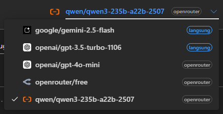

# Panduan Pengguna

 

## Pengenalan

Transrewrt membantu anda bekerja dengan teks dalam tiga cara utama:

- **Terjemah** - tukar teks dari satu bahasa ke bahasa lain.
- **Tulis semula** - ulang perkataan dengan gaya yang berbeza, seperti lebih jelas, lebih ringkas atau lebih formal.
- **Ubahsuai** - proses teks menggunakan arahan AI tersuai yang dikenali sebagai arahan (prompts).

 

Panduan ini menerangkan cara menggunakan aplikasi setelah ia dipasang dan berjalan. Untuk langkah pemasangan, rujuk **[README](README.ms.md)** utama.

 

> ℹ️ **NOTA** 
> Transrewrt tersedia sebagai aplikasi desktop untuk Windows dan Linux, serta aplikasi web yang boleh hos sendiri. Panduan ini menekankan penggunaan harian aplikasi. Jika sesuatu hanya berlaku kepada satu versi, ia akan dinyatakan dengan jelas.

<small>**Baca dalam bahasa lain:** [English (UK)](USER-GUIDE.ms.md) · [Português (BR)](USER-GUIDE.pt-BR.md) · [العربية](USER-GUIDE.ar.md) · [বাংলা](USER-GUIDE.bn.md) · [Català](USER-GUIDE.ca.md) · [简体中文](USER-GUIDE.zh-CN.md) · [繁體中文](USER-GUIDE.zh-TW.md) · [Hrvatski](USER-GUIDE.hr.md) · [Čeština](USER-GUIDE.cs.md) · [Nederlands](USER-GUIDE.nl.md) · [English (US)](USER-GUIDE.en-US.md) · [Filipino](USER-GUIDE.tl.md) · [Français](USER-GUIDE.fr.md) · [Deutsch](USER-GUIDE.de.md) · [Ελληνικά](USER-GUIDE.el.md) · [हिन्दी](USER-GUIDE.hi.md) · [Magyar](USER-GUIDE.hu.md) · [Italiano](USER-GUIDE.it.md) · [日本語](USER-GUIDE.ja.md) · [Basa Jawa](USER-GUIDE.jv.md) · [한국어](USER-GUIDE.ko.md) · [Bahasa Melayu](USER-GUIDE.ms.md) · [فارسی](USER-GUIDE.fa.md) · [Polski](USER-GUIDE.pl.md) · [Português (PT)](USER-GUIDE.pt.md) · [ਪੰਜਾਬੀ](USER-GUIDE.pa.md) · [Română](USER-GUIDE.ro.md) · [Русский](USER-GUIDE.ru.md) · [Slovenčina](USER-GUIDE.sk.md) · [Español](USER-GUIDE.es.md) · [Kiswahili](USER-GUIDE.sw.md) · [Svenska](USER-GUIDE.sv.md) · [తెలుగు](USER-GUIDE.te.md) · [ภาษาไทย](USER-GUIDE.th.md) · [Türkçe](USER-GUIDE.tr.md) · [Українська](USER-GUIDE.uk.md) · [Tiếng Việt](USER-GUIDE.vi.md)</small>

 

<!-- START doctoc generated TOC please keep comment here to allow auto update -->
<!-- DON'T EDIT THIS SECTION, INSTEAD RE-RUN doctoc TO UPDATE -->
**Jadual Kandungan** 

- [Sebelum bermula](#before-you-start)
  - [Cara mendapatkan kunci API OpenRouter percuma (aplikasi desktop)](#how-to-get-a-free-openrouter-api-key-desktop-app)
- [Memulakan](#getting-started)
- [Bahagian utama tetingkap](#main-parts-of-the-window)
  - [Bar sisi](#sidebar)
  - [Bar alat](#toolbar)
  - [Panel input dan output](#input-and-output-panels)
- [Terjemah](#translate)
  - [Terjemah teks](#translate-text)
  - [Pemilihan bahasa](#language-selection)
  - [Tetapan terjemahan yang berguna](#helpful-translation-settings)
  - [Pintasan papan kekunci](#keyboard-shortcuts)
- [Tulis semula](#rewrite)
  - [Tulis semula teks](#rewrite-text)
- [Ubahsuai](#transform)
  - [Jalankan arahan sedia ada](#run-an-existing-prompt)
  - [Jika tiada arahan lagi](#if-you-have-no-prompts-yet)
  - [Cipta arahan dengan cepat](#create-a-prompt-quickly)
  - [Edit arahan](#edit-a-prompt)
  - [Uji arahan sebelum menggunakannya](#test-a-prompt-before-using-it)
  - [Urus arahan tersimpan](#manage-saved-prompts)
- [Papan pemuka](#dashboard)
  - [Tapis data](#filter-the-data)
  - [Tab papan pemuka](#dashboard-tabs)
  - [Eksport data](#export-data)
  - [Padam rekod yang disimpan untuk model](#delete-stored-records-for-a-model)
- [Sejarah](#history)
  - [Tapis data](#filter-the-data-1)
  - [Eksport data sejarah](#export-history-data)
- [Tetapan](#settings)
  - [Tetapan am](#general-settings)
  - [Model](#models)
  - [Bahasa](#languages)
  - [Pengesanan kos](#cost-tracking)
  - [Arahan ubahsuai](#transform-prompts)
  - [Pengguna](#users)
  - [Konfigurasi API](#api-config)
  - [Tentang](#about)
- [Masalah biasa](#common-issues)
  - [Aplikasi tidak menterjemah, menulis semula atau mengubahsuai teks](#the-app-will-not-translate-rewrite-or-transform-text)
  - [Senarai model kosong](#the-model-list-is-empty)
  - [Keputusan terlalu perlahan atau terlalu mahal](#the-result-is-too-slow-or-too-expensive)
  - [Antaramuka dalam bahasa yang salah](#the-interface-is-in-the-wrong-language)
  - [Teks terlalu kecil atau sukar dibaca](#the-text-is-too-small-or-hard-to-read)
  - [Carta papan pemuka kosong](#dashboard-charts-are-empty)
  - [Kos menunjukkan "tidak tersedia" atau nampak salah](#cost-shows-not-available-or-seems-wrong)
  - [Jumlah kos tidak sepadan dengan bil penyedia perkhidmatan](#total-cost-does-not-match-my-provider-bill)
  - [Halaman Sejarah hilang dari bar sisi](#the-history-page-is-missing-from-the-sidebar)
  - [Aplikasi web: diarahkan ke halaman log masuk tanpa jangkaan](#web-app-redirected-to-the-login-page-unexpectedly)
  - [Papan pemuka tiada data untuk pengguna lain (web)](#dashboard-shows-no-data-for-other-users-web)
  - [Saya mengubah arahan dan kehilangan suntingan](#i-changed-a-prompt-and-lost-the-edits)
- [Petua pantas](#quick-tips)
- [Penafian](#disclaimer)
- [Lesen](#license)

<!-- END doctoc generated TOC please keep comment here to allow auto update -->

  

## Sebelum bermula

Untuk menggunakan Transrewrt, anda perlu akses kepada sekurang-kurangnya satu penyedia AI. Penyedia yang disokong ialah: [OpenRouter](https://openrouter.ai) (yang mengagregasi banyak model), OpenAI, Anthropic, Google Gemini, DeepSeek, Groq, Mistral, xAI, dan [Ollama](https://ollama.com) untuk model tempatan.

Anda tidak perlu memilih model berbayar untuk memulakan. Segera selepas anda menambah kunci API OpenRouter anda, aplikasi secara automatik akan mengaktifkan pilihan OpenRouter **percuma** terbina dalam. Ini membolehkan anda mula menterjemah, menulis semula, dan mengubah teks serta-merta.

Dalam bahasa yang mudah difahami:

- **Model** adalah enjin AI yang melakukan kerja. Model disenaraikan dengan awalan penyedia **(provider prefix)** (contohnya `openrouter/…`, `openai/…`, `ollama/…`).
- **Kunci API** (atau, untuk Ollama, **URL asas**) adalah cara aplikasi menghubungi penyedia tersebut.

Jika anda menggunakan **aplikasi mudah alih**, tambah kunci dalam [**Tetapan** > **Konfigurasi API**](#api-config) untuk setiap penyedia yang digunakan. Untuk penggunaan OpenRouter sahaja, rujuk [Cara mendapatkan kunci API](#how-to-get-an-api-key-desktop-app) di bawah. Jika anda tidak mahu menggunakan kunci API, anda boleh pasang Ollama (dari [ollama.com](https://ollama.com)) dan gunakan model tempatan sebagai gantinya.

Jika anda menggunakan **versi web**, pemilik pelayan akan mengkonfigurasikan penyedia menggunakan pemboleh ubah persekitaran, maka biasanya anda tidak perlu memasukkan kunci API secara manual.

 

### Cara mendapatkan kunci API OpenRouter percuma (aplikasi mudah alih)

Jika anda menggunakan aplikasi mudah alih, ikuti langkah berikut:

1. Pergi ke [OpenRouter](https://openrouter.ai) dalam pelayar web anda.
2. Cipta akaun atau log masuk.
3. Buka halaman [Keys](https://openrouter.ai/keys).
4. Klik butang untuk mencipta kunci API baharu.
5. Beri nama kepada kunci supaya anda boleh mengenal pastinya kemudian.
6. Salin kunci API baharu tersebut.
7. Kembali ke Transrewrt dan buka **Tetapan** > **Konfigurasi API**.
8. Tampal kunci ke dalam ruangan **Kunci API OpenRouter** (di bawah **Tetapan** > **Konfigurasi API**).
9. Klik **Uji kunci OpenRouter** untuk memastikan ia berfungsi.

 

> ℹ️ **NOTA** 
> Anda boleh mula dengan laluan percuma OpenRouter atau mana-mana model percuma lain yang tersedia tanpa menambah kad kredit. Dalam kebanyakan kes, ini sudah mencukupi untuk mula menggunakan Transrewrt tanpa memilih model berbayar. Sebagai alternatif, anda boleh gunakan Ollama untuk melaksanakan model secara tempatan tanpa kunci API.

  

## Memulakan

Jika ini kali pertama anda menggunakan Transrewrt, ikuti susunan berikut:

1. Buka aplikasi.
2. Pilih **bahasa antaramuka** anda daripada ikon dunia jika perlu.
3. Jika anda menggunakan **aplikasi mudah alih**, buka [**Tetapan** > **Konfigurasi API**](#api-config), tambah kunci API untuk sekurang-kurangnya satu penyedia (contohnya OpenRouter), dan klik **Uji** untuk mengesahkannya berfungsi.
4. Buka [**Tetapan** > **Model**](#models) dan tambah satu atau lebih model ke **Model Terpilih**.
5. Buka [**Tetapan** > **Bahasa**](#languages) dan pilih **Bahasa Utama** anda jika anda mahu bahasa yang sering digunakan muncul dahulu.
6. Pergi ke **Terjemah** dan jalankan terjemahan mudah untuk mengesahkan segala-galanya berfungsi.
7. Setelah berjaya, cuba **Tulis Semula** dan seterusnya **Transform**.

Susunan ini penting. Ia mengelakkan masalah biasa pertama kali guna: cuba menjalankan tugas sebelum aplikasi mempunyai sambungan API yang berfungsi atau model terpilih.

  

## Bahagian utama tetingkap

Aplikasi ini dibahagikan kepada tiga kawasan utama:

- **Bar sisi** di sebelah kiri.
- **Bar alat** di bahagian atas.
- **Kawasan kerja** di bahagian tengah.

 

### Bar Sisi

Gunakan bar sisi untuk berpindah sekitar aplikasi. Anda boleh meruntuhkan bar sisi untuk mendapatkan lebih banyak ruang dengan mengklik ikon di sebelah logo aplikasi.

 

<table>
  <tr>
    <td valign="top">
       
    </td>
    <td valign="top">
        
      <ul>
        <li><strong>Terjemah</strong> membuka ruang kerja terjemahan.</li> 
        <li><strong>Tulis Semula</strong> membuka ruang kerja penulisan semula.</li> 
        <li><strong>Transform</strong> membuka ruang kerja arahan tersuai.</li> 
        <li><strong>Dasbor</strong> menunjukkan maklumat penggunaan dan kos.</li> 
        <li><strong>Tetapan</strong> membuka panel tetapan.</li> 
        <li><strong>Sejarah</strong> menunjukkan sejarah penggunaan dengan teks input dan output.</li> 
        <li><strong>Pengguna</strong> menunjukkan nama pengguna yang sedang log masuk (versi web sahaja).</li>
      </ul>
    </td>
  </tr>
</table>

 

### Bar Alat

Bar alat berubah sedikit bergantung kepada lokasi anda dalam aplikasi.

- Di sebelah kiri, ia menunjukkan nama halaman semasa.
- Di sebelah kanan, ia menunjukkan **pemilih model** dan kawalan **Bahasa Antara Muka**.

**Pemilih model** membolehkan anda memilih enjin AI yang ingin digunakan untuk tugas semasa.

  

> ℹ️ **PERHATIAN** 
> Sesetengah model percuma mungkin tidak sentiasa tersedia—kadangkala model tersebut sedang offline atau mempunyai had penggunaan. Jika ini berlaku, aplikasi akan secara automatik mengalih keluar model tersebut daripada senarai anda. 
> Untuk mengawal model yang muncul, pergi ke [**Tetapan** > **Model**](#models) dan edit senarai model anda.  
> Anda juga boleh membuka tetapan model secara langsung dengan mengklik ikon penyedia di sebelah kiri nama model dalam bar alat.

 

**Ikon globe + kod bahasa** mengubah bahasa antara muka aplikasi, seperti menu dan butang. Ia **tidak mengubah** bahasa terjemahan yang digunakan dalam **Terjemah**.

  

 

### Panel Input dan Output

Kebanyakan ruang kerja menggunakan panel **Input** di sebelah kiri dan panel **Output** di sebelah kanan.

Panel **Input** menunjukkan:

- Jumlah aksara
- Jumlah perkataan
- Jumlah perenggan

Panel **Output** boleh menunjukkan:

- Tempoh tugas dijalankan
- Kos tugas tersebut (jika tersedia)
- Jumlah kos larian semasa
- **TPS** (token per saat)
- Kiraan aksara, perkataan, dan perenggan
- Model yang digunakan

Jika anda ingin tahu maksud istilah teknikal:

- **Token** bermaksud satu bahagian kecil teks. Anda boleh anggap ia sebagai sebahagian daripada perkataan atau perkataan pendek.
- **TPS** bermaksud berapa banyak bahagian teks yang diproses oleh model setiap saat.

  

[--------------------------------------------------------------------------------------------------------------------------]: #

## Terjemah

Gunakan **Terjemah** apabila anda ingin menukar teks daripada satu bahasa ke bahasa lain.

 

### Terjemahkan teks

1. Buka **Terjemah**.
2. Pilih bahasa di **Dari**.
3. Pilih bahasa di **Ke**.
4. Pilih model dalam bar alat.
5. Taip atau tampal teks ke dalam **Input**.
6. Klik **Terjemah**.
7. Baca hasilnya di **Output**.
8. Gunakan butang salin jika anda ingin menyalin hasilnya.

 

### Pemilihan bahasa

- **Dari** boleh menjadi bahasa tertentu atau **Kenal Pasti Bahasa**.
- **Ke** ialah bahasa yang anda mahu hasil terjemahan diterima dalamnya.

**Bahasa Utama** yang anda pilih akan muncul di bahagian atas senarai. Anda boleh menetapkannya di [**Tetapan** > **Bahasa**](#languages).

 

### Tetapan terjemahan berguna

Di [**Tetapan** > **Tetapan Umum**](#general-settings), anda boleh menukar tingkah laku terjemahan:

- **Terjemah automatik apabila tampal** akan menjalankan terjemahan sebaik sahaja anda menampal teks.
- **Salin hasil ke papan keratan secara automatik** akan menyalin hasil dengan automatik selepas berjaya dijalankan.
- **Terjemahan masa sebenar (semasa menaip)** akan menjalankan terjemahan ketika anda menaip.
- **Had masa (ms)** mengawal tempoh menunggu aplikasi sebelum menjalankan terjemahan masa sebenar.

 

### Pintasan papan kekunci

Di [**Tetapan** > **Tetapan Umum**](#general-settings), **Tingkah laku untuk ENTER** mengawal apa yang berlaku apabila anda menekan `Enter`:

- **Enter** boleh menjalankan tugas dan **Shift+Enter** boleh menambah baris baru.
- Atau aplikasi boleh melakukan sebaliknya.

Mod semasa juga dipaparkan pada butang **Terjemah**.

  

[--------------------------------------------------------------------------------------------------------------------------]: #

## Tulis Semula

Gunakan **Tulis Semula** apabila anda ingin memperbaiki penggunaan perkataan tanpa mengubah makna utama.

Ciri ini berguna untuk:

- membetulkan ejaan dan tatabahasa
- membuat teks lebih jelas
- membuat teks lebih formal atau tidak formal
- memendekkan atau mengembangkan teks
- membuat teks kedengaran lebih teknikal

 

### Tulis semula teks

1. Buka **Tulis Semula**.
2. Pilih satu **Mod**.
3. Pilih model dalam bar alat.
4. Taip atau tampal teks ke dalam **Input**.
5. Klik **Tulis Semula**.
6. Semak hasilnya dalam **Output**.

Kelakuan kekunci Enter yang diterangkan dalam [**Terjemah**](#keyboard-shortcuts) juga digunakan di sini.

 

> 💡 **PETUA** 
> Apabila anda menggunakan mod "**Periksa Ejaan & Tatabahasa**", butang `Tunjukkan perubahan` akan muncul di panel output.
> Klik butang ini untuk bertukar paparan pembetulan, sama ada menunjukkan atau menyembunyikan perubahan khusus yang dibuat pada teks anda.

  

[--------------------------------------------------------------------------------------------------------------------------]: # 

## Transformasi

Gunakan **Transformasi** apabila anda ingin AI mengikuti arahan tersuai.

Ini adalah kawasan paling fleksibel dalam aplikasi. Anda boleh menggunakannya untuk tugas-tugas seperti:

- meringkaskan nota
- menukar teks kasar kepada e-mel yang dikemas
- mengekstrak titik-titik utama
- menukar teks ke format tertentu

 

### Jalankan arahan sedia ada

1. Buka **Transformasi**.
2. Pilih arahan daripada senarai arahan.
3. Jika kotak **Bahasa Destinasi** muncul, pilih bahasa sekiranya diinginkan.
4. Taip atau tampal teks ke dalam **Input**.
5. Klik **Transformasi**.
6. Baca hasilnya dalam **Output**.

 

### Jika anda belum ada arahan

Jika senarai arahan anda kosong, klik **Muat arahan sampel**. Ini akan menambah contoh binaan untuk anda bermula dengan cepat.

 

> ℹ️ **NOTA** 
> Arahan sampel disediakan dalam Bahasa Inggeris. Selepas memuatnya, anda boleh edit arahan tersebut dan gunakan **Terjemah arahan** untuk menterjemahkannya ke bahasa anda.

 

### Cipta arahan dengan cepat

Cara terpantas untuk mencipta arahan ialah:

1. Klik **Arahan Baru**.
2. Klik **Jana arahan**.
3. Huraikan apakah yang ingin arahan itu lakukan.
4. Pilih model.
5. Biarkan aplikasi mencipta draf untuk anda.
6. Semak draf tersebut dan klik **Simpan**.

 

### Edit arahan

Apabila anda mencipta atau mengedit arahan, editor akan muncul di sebelah kiri dan kawasan ujian muncul di sebelah kanan.

Medan utama adalah:

- **Nama arahan**: nama yang dipaparkan dalam senarai arahan.
- **Arahan arahan (pilihan)**: petua ringkas yang dipaparkan kepada pengguna apabila menjalankan arahan.
- **Peranan Model**: peranan umum yang diberikan kepada AI, seperti 'Anda adalah pembantu yang membantu.'
- **Arahan Model (satu per baris)**: petunjuk khusus yang anda mahukan AI ikuti.
- **Penerangan output**: perkataan ringkas menggambarkan hasil, seperti 'ringkasan' atau 'tulis semula'.
- **Suhu (0.0 → 1.0)**: kelakuan model; sila rujuk di bawah.
- **Minta bahasa destinasi**: menambah pemilih bahasa destinasi apabila arahan dijalankan.

Jika istilah teknikal **Suhu** baru kepada anda, fahamkan seperti berikut:

- Suhu yang **lebih rendah** memberi hasil yang lebih stabil dan boleh diramal.
- Suhu yang **lebih tinggi** memberi lebih variasi dan kreativiti.

Anda juga boleh gunakan:

- **`Jana arahan`** untuk mencipta draf baharu daripada huraian ringkas
- **`Tingkatkan arahan`** untuk menyempurnakan arahan sedia ada
- **`Terjemah arahan`** untuk menterjemah medan arahan

 

> ⚠️ **AMARAN** 
> Klik **`Simpan`** sebelum klik **`Kembali ke Jalankan`**. Jika anda kembali tanpa menyimpan, perubahan anda akan hilang.

 

### Uji arahan sebelum menggunakannya

Panel ujian di sebelah kanan membolehkan anda mencuba arahan anda dengan teks sampel sebelum digunakan dalam kerja harian.

Ini berguna apabila:

- anda sedang membina arahan baharu
- anda sedang membandingkan dua versi arahan
- anda ingin menyemak nada, panjang, atau format output

 

### Urus arahan tersimpan

Untuk mengurus arahan tersimpan di satu tempat, buka [**Tetapan** > **Arahan Transformasi**](#transform-prompts).

Di sana anda boleh:

- senaraikan dan padamkan arahan anda
- eksport arahan sebagai **JSON**, **CSV**, atau **XLSX**
- import arahan daripada fail

  

[--------------------------------------------------------------------------------------------------------------------------]: # 

## Papan Pemuka

Gunakan **Papan Pemuka** untuk melihat sejauh mana anda menggunakan aplikasi ini dan berapakah kos yang terlibat (untuk model berbayar).

 

> ℹ️ **NOTA** 
> Jika anda hanya menggunakan model percuma, carta yang berkaitan dengan kos akan kosong. 

 

### Tapis data

Gunakan butang penapis di bahagian atas untuk menukar julat masa.

 

> ℹ️ **NOTA** 
> Penapis **Pengguna** hanya kelihatan kepada pentadbir dalam versi web. Pengguna biasa tidak dapat melihat penapis ini, dan ia tidak tersedia dalam aplikasi desktop.

 

### Tab papan pemuka

- **Ringkasan** memberi gambaran keseluruhan tentang penggunaan dan kos.
- **Mengikut Penggunaan** memecahkan aktiviti mengikut bahasa terjemahan, mod tulis semula, dan petua transformasi.
- **Mengikut Model** menunjukkan model yang digunakan dan kos masing-masing.
- **Mengikut Hari** menunjukkan jumlah harian.
- **Semua Panggilan** menunjukkan sejarah panggilan penuh dan membolehkan anda mengeksportnya.

 

### Eksport data

Jadual papan pemuka boleh mengeksport data dalam:

- **JSON**
- **CSV**
- **XLSX**

Ini berguna jika anda ingin menyemak aktiviti di luar aplikasi atau berkongsi laporan.

 

### Padam rekod tersimpan untuk model

Dalam **Mengikut Model** atau **Semua Panggilan**, anda boleh mengalih keluar rekod tersimpan untuk model dengan mengklik ikon "tong sampah".

> ⚠️ **AMARAN** 
> Pemadaman rekod tersimpan adalah tindakan yang tidak boleh dibatalkan. Gunakan hanya jika anda pasti bahawa sejarah tersebut tidak diperlukan lagi.

Untuk memadamkan semua data atau mengalih keluar rekod berdasarkan umurnya, pergi ke [**Tetapan** > **Penjejakan Kos**](#cost-tracking). Di sana, anda akan menjumpai pilihan untuk memadamkan semua data tersimpan atau hanya data yang lebih lama daripada tarikh tertentu.

  

[--------------------------------------------------------------------------------------------------------------------------]: # 

## Sejarah

Klik pada **Sejarah** untuk melihat rekod tindakan anda dalam **Transrewrt**, termasuk input dan output bagi setiap operasi. 

 

### Tapis sejarah

**Sejarah** menggunakan penapis yang sama seperti halaman **Papan Pemuka**. Gunakan penapis ini untuk memilih julat masa.

 

> ℹ️ **NOTA** 
> Penapis **Pengguna** hanya kelihatan kepada pentadbir dalam versi web. Pengguna biasa tidak dapat melihat penapis ini, dan ia tidak tersedia dalam aplikasi desktop.

 

### Eksport data sejarah

Halaman sejarah boleh mengeksport data yang telah ditapis ke dalam format:

- **JSON**
- **CSV**
- **XLSX**

Ini berguna jika anda ingin menyemak aktiviti di luar aplikasi atau berkongsi laporan.

  

[--------------------------------------------------------------------------------------------------------------------------]: # 

## Tetapan

Buka **Tetapan** dari bar sisi untuk menyesuaikan cara aplikasi berkelakuan.

Tab yang tersedia bergantung kepada platform dan peranan anda:

  | Tab                    | Desktop | Web (pentadbir) | Web (pengguna biasa) |
  |------------------------|:-------:|:---------------:|:--------------------:|
  | Tetapan Am             |   ya    |       ya        |          ya          |
  | Model                  |   ya    |       ya        |          ya          |
  | Bahasa                 |   ya    |       ya        |          ya          |
  | Penjejakan Kos         |   ya    |       ya        |           —          |
  | Petua Transformasi     |   ya    |       ya        |          ya          |
  | Pengguna               |    —    |       ya        |           —          |
  | Konfigurasi API        |   ya    |       ya        |           —          |
  | Perihal               |   ya    |       ya        |          ya          |

 

> ℹ️ **NOTA** 
> Dalam versi web, setiap pengguna mempunyai konfigurasi tersendiri. Tetapan seperti model terpilih, bahasa, pilihan am, dan petua transformasi disimpan mengikut pengguna. Perubahan yang anda buat tidak akan menjejaskan pengguna lain.

 

[--------------------------------------------------------------------------------------------------------------------------]: # 

### Tetapan Umum

Gunakan **Tetapan Umum** untuk mengawal tingkah laku menaip, sama ada maklumat pelaksanaan disimpan untuk **Sejarah**, dan paparan.

**Tingkah Laku**

- **Tingkah laku untuk ENTER** memilih sama ada `Enter` melaksanakan tugas atau memasukkan baris baharu.
- **Auto-terjemah semasa tampal** memulakan terjemahan sebaik sahaja anda menampal teks.
- **Salin hasil ke papan klip secara automatik** menyalin hasil yang berjaya secara automatik.
- **Terjemahan masa nyata (semasa menaip)** menterjemah sambil anda menaip.
- **Tempoh tamat (ms)** menetapkan masa tunggu untuk terjemahan masa nyata.

**Sejarah**

- **Simpan sejarah pelaksanaan** mengawal sama ada setiap terjemahan, tulis semula, dan transformasi menyimpan **teks input dan output** untuk paparan [**Sejarah**](#history) di panel sisi. Mematikan fungsi ini akan meminta pengesahan; jika anda mengesahkannya, teks sejarah yang disimpan akan dipadamkan dari pangkalan data.
- **Padam data sejarah** membolehkan anda memadam teks disimpan mengikut usia (contohnya lebih lama daripada beberapa bulan, atau **semua data (hapuskan)**) menggunakan **Padam data**. Ini hanya mempengaruhi teks pelaksanaan yang disimpan untuk paparan **Sejarah**; ia **tidak** memadam jumlah kos atau penggunaan. Untuk memadamkan atau memotong data **kos**, gunakan [**Tetapan** > **Pengesanan Kos**](#cost-tracking).

**Rupa**

- **Perpuluhan kos** mengubah cara perpuluhan kos dipaparkan.
- **Hanya Web:** **tunjukkan margin di sekeliling aplikasi** menambahkan ruang tambahan di sekitar antara muka.
- **Famili Fon** mengubah fon penulisan dalam panel teks.
- **Saiz** mengubah saiz fon.

 

### Model

Gunakan **Tetapan** > **Model** untuk memilih model mana yang muncul dalam bar alat.

Halaman ini mempunyai dua senarai:

- **Model yang Tersedia** di sebelah kiri
- **Model yang Dipilih** di sebelah kanan

Kawalan berguna termasuk:

- **Cari model...** untuk mencari model berdasarkan nama
- **Chip Penyedia** untuk mengecilkan senarai kepada enjin tertentu (OpenRouter, OpenAI, Ollama, …)
- **Hanya Percuma** untuk memaparkan hanya model percuma
- **Segarkan** untuk memuat semula senarai
- **Kembangkan Semua** dan **Runtuhkan Semua** apabila anda menyusun mengikut penyedia

ID model termasuk awalan penyedia (contohnya `openrouter/…` berbanding `openai/…`). Lencana seperti **OpenAI (OpenRouter)** berbanding **OpenAI (langsung)** menunjukkan cara lalu lintas dihantar.

Tindakan:

 - Untuk menambah model, klik **Tambah** atau mana-mana bahagian dalam entri.

 - Untuk mengalih keluar model, klik **X** di sebelahnya dalam **Model yang Dipilih** atau **Dipilih** pada entri dalam Model yang Tersedia.

 - Untuk membersihkan senarai, klik **Nyahpilih semua**. Model percuma yang diperlukan akan kekal dalam senarai.

 

> ℹ️ **NOTA** 
> Jika anda tidak mahu menambah kredit ke OpenRouter serta-merta, mulakan dengan mengaktifkan **Hanya Percuma** dan memilih model percuma (tiada kad kredit diperlukan). Anda juga boleh menggunakan Ollama untuk melaksanakan model secara tempatan tanpa sebarang kunci API.

 

### Bahasa

Gunakan **Tetapan** > **Bahasa** untuk menyusun senarai bahasa yang digunakan dalam aplikasi.

- **Bahasa utama** dipautkan di bahagian atas senarai bahasa dalam **Terjemah** dan **Transform**.
- **Bahasa tersuai** membolehkan anda menambah bahasa yang tidak terdapat dalam senarai lalai.

Jika anda menambah bahasa tersuai, ia akan muncul dalam pemilih bahasa bersama pilihan lalai.

 

### Pengesanan Kos

Gunakan **Tetapan** > **Pengesanan Kos** untuk mengurus maklumat kos.

- **Jumlah Kos** menunjukkan jumlah terkini.
- **Salin Nilai** menyalin jumlah tersebut ke papan klip.
- **Tetapkan Semula Kos** menetapkan semula jumlah disimpan kepada sifar.
- **Sejajar dengan penggunaan kunci API** menetapkan jumlah tersebut sama dengan penggunaan yang dilaporkan oleh akaun OpenRouter anda (hanya untuk OpenRouter).
- **Penggunaan Kunci API** menunjukkan butiran penggunaan OpenRouter, jika tersedia.
- **Padam data kos** memadamkan semua data, atau hanya entri yang lebih lama daripada tarikh terpilih.

**Pengesanan kos:** Apabila anda menggunakan model OpenRouter, aplikasi menunjukkan penggunaan dan perbelanjaan sebenar anda berdasarkan data daripada OpenRouter. Untuk semua penyedia lain, aplikasi menganggarkan kos menggunakan harga yang diterbitkan oleh OpenRouter; jika tiada harga tersedia, anggaran mungkin sifar.

 

> ℹ️ **NOTA** 
>  **Semua angka kos adalah anggaran untuk rujukan anda sahaja, bukan penyata bil rasmi.**

 

> ⚠️ **AMARAN** 
> Pemadaman data tidak boleh diterbalikkan. Sebelum memadam, pastikan untuk membuat sandaran data anda atau mengeksportnya melalui [**Dasbor** > **Semua Panggilan**](#dashboard-tabs), jika tidak ia akan hilang secara kekal. 
> Semua sejarah yang berkaitan dengan setiap entri panggilan API juga akan dipadamkan.

 

### Mengubah suai arahan

Gunakan **Tetapan** > **Ubah Suai Arahan** untuk menguruskan arahan secara pukal.

Anda boleh:

- mengkaji arahan yang telah disimpan
- memadam arahan
- mengimport arahan dari fail
- mengeksport arahan untuk sandaran atau perkongsian

 

### Pengguna

**Web: pentadbir sahaja**

Gunakan **Pengguna** untuk mengurus akaun pengguna dalam versi web. Anda boleh menambah pengguna, mengemas kini maklumat mereka, menetapkan semula kata laluan, dan memadam akaun.

 

### Konfigurasi API

Penyedia yang disokong ialah: OpenRouter, OpenAI, Anthropic, Google Gemini, DeepSeek, Groq, Mistral, xAI, dan **Ollama** (model tempatan melalui URL asas). Anda hanya perlu mengkonfigurasikan penyedia yang anda gunakan.

**Aplikasi web: pentadbir sahaja**

Kunci API dikonfigur melalui pemboleh ubah persekitaran sistem atau Docker — kunci ini tidak dimasukkan dalam antara muka web. Halaman ini menunjukkan penyedia mana yang mempunyai kunci yang telah dikonfigur dan membolehkan anda menguji setiap satu dengan mengklik butang **`Uji`**.

 

> ℹ️ **NOTA** 
> Untuk menukar kunci API, kemaskini pemboleh ubah persekitaran dalam konfigurasi sistem atau Docker anda dan mulakan semula pelayan atau kontena.

 

**Aplikasi desktop**

Gunakan **Konfigurasi API** untuk menyimpan kunci API bagi setiap penyedia yang anda gunakan. Untuk Ollama, masukkan **URL asas** sebagai ganti kunci API.

 

> 💡 **Petua**  
> Jika anda tidak mahu menggunakan kunci API atau membayar untuk penggunaan, anda boleh [muat turun Ollama](https://ollama.com) dan jalankan model secara tempatan pada komputer anda secara percuma. Sebagai alternatif, anda boleh buat akaun OpenRouter percuma (tiada kad kredit diperlukan) untuk menggunakan model percuma mereka.

- Tambahkan hanya penyedia yang diperlukan. Dalam **Tetapan** > **Model**, setiap ID model bermula dengan nama penyedia (contohnya `openrouter/openrouter/free`, `openai/gpt-4o`, `ollama/llama3`).

Untuk menambah kunci API, taip nilai dalam ruangan teks dan klik **`Simpan`**. Untuk menggantikan kunci sedia ada, klik **`Sunting`**. Untuk memeriksa sama ada kunci berfungsi, klik **`Uji`**.

 

> ℹ️ **NOTA** 
> Anda tidak boleh melihat nilai semasa kunci API. Anda hanya boleh menggantikannya menggunakan butang **`Sunting`**.
> Kunci API disimpan secara mengekod dalam fail konfigurasi.

 

Untuk langkah terperinci bagaimana mendapatkan kunci OpenRouter, sila rujuk [Cara mendapatkan kunci API](#how-to-get-an-api-key-desktop-app) di atas.

 

### Perihal

Tab **Perihal** menunjukkan:

- nama aplikasi
- nombor versi
- tarikh binaan
- pautan ke repositori projek

  

## Masalah lazim

Jika sesuatu perkara tidak berfungsi seperti diharapkan, semak perkara berikut terlebih dahulu.

 

### Aplikasi tidak menterjemah, menulis semula, atau mengubah suai teks

Semak perkara berikut:

- anda telah memilih model dalam bar alat
- sekurang-kurangnya satu model disenaraikan dalam [**Tetapan** > **Model**](#models)
- konfigurasi API anda berfungsi

Jika anda menggunakan aplikasi desktop:

1. Buka [**Tetapan** > **Konfigurasi API**](#api-config).
2. Periksa sama ada sekurang-kurangnya satu kunci API telah disimpan.
3. Klik **Uji** di sebelah penyedia untuk mengesahkan kunci berfungsi.

 

### Senarai model kosong

Buka [**Tetapan** > **Model**](#models) dan klik **Segarkan**.

Jika perlu:

- cari model
- dayakan **Hanya Percuma**
- tambah satu atau lebih model ke **Model Terpilih**

 

### Keputusan terlalu perlahan atau terlalu mahal

Cuba salah satu atau lebih perkara berikut:

- pilih model lain
- gunakan input yang lebih ringkas
- matikan **Terjemahan masa nyata (semasa menaip)** dalam [**Tetapan** > **Tetapan Umum**](#general-settings)
- gunakan model percuma untuk tugas-tugas ringkas (rujuk [Model](#models))

 

### Antaramuka dalam bahasa yang salah

Klik ikon globe dalam [bar alat](#toolbar) dan pilih **Bahasa Antaramuka** yang anda kehendaki.

 

### Teks terlalu kecil atau sukar dibaca

Buka [**Tetapan** > **Tetapan Umum**](#general-settings) dan ubah:

- **Famili Fon**
- **Saiz**

 

### Carta papan pemuka kosong

Ini adalah perkara biasa jika:

- anda hanya menggunakan **model percuma** (carta kos akan kosong)
- **penapis masa** yang dipilih tidak merangkumi tempoh panggilan dibuat — cuba **Semua** untuk mengesahkannya

Jika carta masih kosong selepas memilih **Semua**, pastikan panggilan kelihatan dalam [**Sejarah**](#history) atau dalam tab **Semua Panggilan**.

 

### Kos dipaparkan sebagai "tidak tersedia" atau kelihatan salah

Apabila anda menggunakan model melalui **OpenRouter**, aplikasi ini akan memaparkan perbelanjaan sebenar yang dilaporkan oleh OpenRouter.

Bagi **penyedia lain** (OpenAI secara langsung, Anthropic secara langsung, dll.), kos dikira secara anggaran berdasarkan data harga yang diterbitkan oleh OpenRouter. Jika tiada harga yang sepadan ditemui untuk model tertentu, kos akan dipaparkan sebagai **tidak tersedia** dan tidak akan ditambahkan ke jumlah perbelanjaan anda.

 

### Jumlah kos tidak sepadan dengan bil penyedia saya

Semua angka kos dalam aplikasi ini adalah **anggaran untuk rujukan sahaja**, bukan penyata rasmi bil.

Untuk menjadikan jumlah ini lebih hampir dengan perbelanjaan OpenRouter sebenar anda, buka [**Tetapan** > **Pengesanan Kos**](#cost-tracking) dan klik **Sinkroni dengan penggunaan kunci API**.

 

### Halaman Sejarah tiada dalam bar sisi

Fungsi **Simpan sejarah pelaksanaan** mungkin dimatikan. Buka [**Tetapan** > **Tetapan Umum**](#general-settings) dan dayakannya. Perhatikan bahawa menghidupkannya tidak akan memulihkan data sejarah yang telah dihapuskan sebelum ini.

 

### Aplikasi web: diarahkan semula ke halaman log masuk secara tidak dijangka

Sesi anda mungkin telah tamat tempoh. Sila log masuk semula. Jika ini berlaku kerap, semak konfigurasi pelayan untuk tetapan tempoh hayat sesi.

 

### Papan pemuka tidak memaparkan data untuk pengguna lain (web)

Hanya **pentadbir** yang boleh melihat data semua pengguna menerusi penapis **Pengguna**. Pengguna biasa hanya dapat melihat aktiviti mereka sendiri sebagaimana yang dirancang.

 

### Saya telah mengubah prompt tetapi kehilangan suntingan

Apabila menyunting prompt, sentiasa klik **Simpan** sebelum klik **Kembali ke Jalankan**.

  

## Petua Pantas

- Mulakan dengan [**Terjemah**](#translate) untuk memastikan konfigurasi anda berfungsi sebelum beralih ke [**Tulis Semula**](#rewrite) atau [**Ubahsuai**](#transform).
- Gunakan [**Tulis Semula**](#rewrite) untuk penambahbaikan perkataan harian.
- Gunakan [**Ubahsuai**](#transform) apabila anda memerlukan alur kerja yang boleh diulang untuk tugas tertentu.
- Gunakan [**Papan Pemuka**](#dashboard) jika anda ingin memantau penggunaan dan kos.
- Gunakan [**Sejarah**](#history) untuk meninjau operasi lampau dan teks input/output penuh.
- Eksport prompt secara berkala jika anda membina perpustakaan prompt yang ingin anda simpan dengan selamat (rujuk [Ubahsuai Prompt](#transform-prompts)) atau jika anda ingin kongsi dengan orang lain.

  

## Penafian

Nama produk dan ikon milik pemilik masing-masing dan digunakan semata-mata untuk tujuan pengenalan. Perisian ini tidak berafiliasi atau disokong oleh mana-mana jenama yang disebutkan.

  

## Lesen

Hak Cipta © 2026 Waldemar Scudeller Jr.

[Lesen Apache 2.0](LICENSE)