<a id="transrewrt-user-guide"></a>
# Panduan Pengguna

<br/>

<a id="introduction"></a>
## Pengenalan

Transrewrt membantu anda bekerja dengan teks dalam tiga cara utama:

- **Terjemahkan** - tukar teks dari satu bahasa ke bahasa lain.
- **Tulis semula** - ungkapkan semula teks dengan gaya yang berbeza, seperti lebih jelas, lebih ringkas, atau lebih formal.
- **Transformasikan** - proses teks menggunakan arahan AI tersuai yang dikenali sebagai prompt.

Secara lalai, aplikasi berjalan dalam mod **Mudah**: anda memilih **pratetap** (contohnya Percuma (OpenRouter), Standard, Lanjutan, atau Teknikal) dan **penyedia** dalam Tetapan, tanpa memilih ID model. Tukar ke mod **Lanjutan** di [**Tetapan** > **Tetapan Umum**](#general-settings) jika anda mahu senarai model klasik daripada [**Tetapan** > **Model**](#models).

<br/>

Panduan ini menerangkan cara menggunakan aplikasi setelah dipasang dan dijalankan. Untuk langkah pemasangan, lihat [**README**](README.ms.md) utama.

<br/>

> ℹ️ **NOTA**<br/>
> Transrewrt tersedia sebagai aplikasi desktop untuk Windows dan Linux, dan sebagai aplikasi web yang dihos sendiri. Panduan ini memberi tumpuan kepada penggunaan harian aplikasi. Di mana sesuatu hanya terpakai kepada satu versi, ia akan ditandakan dengan jelas.

<small>**Baca dalam bahasa lain:** </small>
<small id="lang-list">[English (GB)](../USER-GUIDE.md) · [Português (Brasil)](./USER-GUIDE.pt-BR.md) · [العربية](./USER-GUIDE.ar.md) · [বাংলা](./USER-GUIDE.bn.md) · [Català](./USER-GUIDE.ca.md) · [中文 (中国大陆)](./USER-GUIDE.zh-CN.md) · [中文 (台灣)](./USER-GUIDE.zh-TW.md) · [Hrvatski](./USER-GUIDE.hr.md) · [Čeština](./USER-GUIDE.cs.md) · [Nederlands](./USER-GUIDE.nl.md) · [English (US)](./USER-GUIDE.en-US.md) · [Tagalog](./USER-GUIDE.tl.md) · [Français](./USER-GUIDE.fr.md) · [Deutsch](./USER-GUIDE.de.md) · [Ελληνικά](./USER-GUIDE.el.md) · [हिन्दी](./USER-GUIDE.hi.md) · [Magyar](./USER-GUIDE.hu.md) · [Italiano](./USER-GUIDE.it.md) · [日本語](./USER-GUIDE.ja.md) · [한국어](./USER-GUIDE.ko.md) · [Bahasa Melayu](./USER-GUIDE.ms.md) · [فارسی](./USER-GUIDE.fa.md) · [Polski](./USER-GUIDE.pl.md) · [Basa Jawa](./USER-GUIDE.jv.md) · [Português](./USER-GUIDE.pt.md) · [ਪੰਜਾਬੀ](./USER-GUIDE.pa.md) · [Română](./USER-GUIDE.ro.md) · [Русский](./USER-GUIDE.ru.md) · [Slovenčina](./USER-GUIDE.sk.md) · [Español](./USER-GUIDE.es.md) · [Kiswahili](./USER-GUIDE.sw.md) · [Svenska](./USER-GUIDE.sv.md) · [తెలుగు](./USER-GUIDE.te.md) · [ไทย](./USER-GUIDE.th.md) · [Türkçe](./USER-GUIDE.tr.md) · [Українська](./USER-GUIDE.uk.md) · [Tiếng Việt](./USER-GUIDE.vi.md)</small>

<small>

> **Nota mengenai terjemahan UI dan dokumentasi:** Semua bahasa antara muka kecuali Bahasa Inggeris (UK) asal 
> diterjemahkan menggunakan model AI; perkataan mungkin tidak tepat atau mengandungi ralat.

</small>

<br/>

<!-- START doctoc generated TOC please keep comment here to allow auto update -->
<!-- DON'T EDIT THIS SECTION, INSTEAD RE-RUN doctoc TO UPDATE -->
**Jadual Kandungan**

- [Sebelum bermula](#before-you-start)
  - [Cara mendapatkan kunci API OpenRouter percuma (aplikasi desktop)](#how-to-get-a-free-openrouter-api-key-desktop-app)
- [Permulaan](#getting-started)
- [Bahagian utama tetingkap](#main-parts-of-the-window)
  - [Bar sisi](#sidebar)
  - [Bar alat](#toolbar)
  - [Panel input dan output](#input-and-output-panels)
- [Terjemahan](#translate)
  - [Terjemahkan teks](#translate-text)
  - [Pemilihan bahasa](#language-selection)
  - [Tetapan terjemahan yang berguna](#helpful-translation-settings)
- [Tulis semula](#rewrite)
- [Transformasi](#transform)
  - [Jalankan arahan sedia ada](#run-an-existing-prompt)
  - [Jika tiada arahan yet](#if-you-have-no-prompts-yet)
  - [Cipta arahan dengan cepat](#create-a-prompt-quickly)
  - [Edit arahan](#edit-a-prompt)
  - [Uji arahan sebelum menggunakannya](#test-a-prompt-before-using-it)
- [Papan pemuka](#dashboard)
  - [Tapis data](#filter-the-data)
  - [Tab papan pemuka](#dashboard-tabs)
  - [Eksport data](#export-data)
  - [Padam rekod yang disimpan untuk model](#delete-stored-records-for-a-model)
- [Sejarah](#history)
  - [Tapis sejarah](#filter-the-history)
  - [Eksport data sejarah](#export-history-data)
- [Tetapan](#settings)
  - [Tetapan umum](#general-settings)
  - [Model](#models)
  - [Bahasa](#languages)
  - [Penjejakan kos](#cost-tracking)
  - [Transformasikan (tab tetapan)](#transform-settings-tab)
  - [Pengguna](#users)
  - [Konfigurasi API](#api-config)
  - [Perihal](#about)
- [Isu biasa](#common-issues)
  - [Aplikasi tidak menterjemah, menulis semula, atau mengubah teks](#the-app-will-not-translate-rewrite-or-transform-text)
  - [Senarai model kosong](#the-model-list-is-empty)
  - [Keputusan terlalu perlahan atau terlalu mahal](#the-result-is-too-slow-or-too-expensive)
  - [Antara muka dalam bahasa yang salah](#the-interface-is-in-the-wrong-language)
  - [Teks terlalu kecil atau sukar dibaca](#the-text-is-too-small-or-hard-to-read)
  - [Ringkasan Papan Pemuka kelihatan kosong](#dashboard-summary-looks-empty)
  - [Kos menunjukkan "tidak tersedia" atau kelihatan salah](#cost-shows-not-available-or-seems-wrong)
  - [Jumlah kos tidak sepadan dengan bil penyedia saya](#total-cost-does-not-match-my-provider-bill)
  - [Halaman Sejarah tiada dalam bar sisi](#the-history-page-is-missing-from-the-sidebar)
  - [Aplikasi web: diarahkan ke halaman log masuk secara tidak dijangka](#web-app-redirected-to-the-login-page-unexpectedly)
  - [Pentadbir web: lupa atau hilang kata laluan](#web-admin-forgot-or-lost-a-password)
  - [Papan pemuka tidak menunjukkan data untuk pengguna lain (web)](#dashboard-shows-no-data-for-other-users-web)
  - [Saya mengubah arahan dan kehilangan suntingan](#i-changed-a-prompt-and-lost-the-edits)
- [Petua pantas](#quick-tips)
- [Penafian](#disclaimer)
- [Lesen](#license)

<!-- END doctoc generated TOC please keep comment here to allow auto update -->

<br/><br/>

<a id="before-you-start"></a>
## Sebelum anda mula

Untuk menggunakan Transrewrt, anda perlu akses kepada sekurang-kurangnya satu penyedia AI. Penyedia yang disokong ialah: [OpenRouter](https://openrouter.ai) (yang menggabungkan banyak model), OpenAI, Anthropic, Google Gemini, DeepSeek, Groq, Mistral, xAI, Cerebras, dan [Ollama](https://ollama.com) untuk model tempatan.

Anda tidak perlu memilih model berbayar untuk bermula. Segera selepas anda menambah kunci API OpenRouter anda, aplikasi secara automatik akan mengaktifkan pilihan OpenRouter **percuma** terbina dalam. Ini membolehkan anda mula menterjemah, menulis semula, dan mengubah teks serta-merta. Sebagai alternatif, anda juga boleh mendapatkan kunci API percuma daripada Cerebras, Google, Groq, atau Mistral AI.

Dalam bahasa yang mudah difahami:

- Dalam mod **Mudah**, **pratetap** (Percuma (OpenRouter), Standard, Lanjutan, atau Teknikal) dipetakan kepada model untuk **penyedia** yang anda pilih (OpenRouter, OpenAI, Ollama, dan lain-lain). Hanya pratetap yang mempunyai pemetaan untuk penyedia semasa akan muncul dalam bar alat. Anda memilih pratetap pada Terjemahkan, Tulis semula, dan Transformasikan.
- Dalam mod **Lanjutan**, **model** ialah enjin AI yang anda pilih secara langsung. ID model menggunakan awalan **penyedia** (contohnya `openrouter/…`, `openai/…`, `ollama/…`).
- **Kunci API** (atau, untuk Ollama, **URL asas**) ialah cara aplikasi mengakses penyedia tersebut.

Jika anda menggunakan **aplikasi desktop**, tambah kunci di [**Tetapan** > **Konfigurasi API**](#api-config) untuk setiap penyedia yang digunakan. Untuk penggunaan OpenRouter sahaja, lihat [Cara mendapatkan kunci API OpenRouter percuma](#how-to-get-a-free-openrouter-api-key-desktop-app) di bawah. Jika anda tidak mahu menggunakan kunci API, anda boleh memasang Ollama (daripada [ollama.com](https://ollama.com)) dan gunakan model tempatan sebagai ganti, seperti `translategemma:4b`.

Jika anda menggunakan **versi web**, pemilik pelayan mengkonfigurasi penyedia menggunakan pemboleh ubah persekitaran, jadi anda tidak boleh memasukkan kunci API secara langsung dalam aplikasi.

<br/>

<a id="how-to-get-a-free-openrouter-api-key-desktop-app"></a>
### Cara mendapatkan kunci API OpenRouter percuma (aplikasi desktop)

Jika anda menggunakan aplikasi desktop, ikuti langkah-langkah berikut:

1. Pergi ke [OpenRouter](https://openrouter.ai) dalam penyemak imbas web anda.
2. Buat akaun atau log masuk.
3. Buka halaman [Keys](https://openrouter.ai/keys).
4. Klik butang untuk membuat kunci API baharu.
5. Beri nama kepada kunci tersebut supaya anda boleh mengenal pastinya kemudian.
6. Salin kunci API baharu tersebut.
7. Kembali ke Transrewrt dan buka **Tetapan** > **Konfigurasi API**.
8. Tampal kunci tersebut ke dalam **Kunci API OpenRouter** (di bawah **Tetapan** > **Konfigurasi API**).
9. Klik **Uji kunci OpenRouter** untuk memastikan ia berfungsi.

<br/><br/>

<a id="getting-started"></a>
## Memulakan

Jika ini kali pertama anda menggunakan Transrewrt, ikuti susunan berikut:

1. Buka aplikasi.
2. Pilih **Bahasa antara muka** anda dari ikon globe jika perlu.
3. Jika anda menggunakan **aplikasi desktop**, buka [**Tetapan** > **Konfigurasi API**](#api-config), tambah kunci API untuk sekurang-kurangnya satu penyedia (contohnya OpenRouter), dan klik **Uji** untuk mengesahkan ia berfungsi.
4. Buka [**Tetapan** > **Tetapan Umum**](#general-settings). Dalam mod **Mudah** (lalai), pilih **Penyedia** yang mempunyai kunci yang dikonfigurasikan. Dalam mod **Lanjutan**, buka [**Tetapan** > **Model**](#models) dan tambah satu atau lebih model ke **Model Terpilih**.
5. Pada **Terjemah**, pilih **pratetap** (Mudah) atau **model** (Lanjutan) dalam bar alat.
6. Buka [**Tetapan** > **Bahasa**](#languages) dan pilih **Bahasa Utama** anda jika anda mahu bahasa yang paling kerap digunakan muncul terlebih dahulu.
7. Jalankan terjemahan ringkas untuk mengesahkan segala-galanya berfungsi, kemudian cuba **Tulis Semula** dan **Transformasikan**.

Susunan ini penting. Ia mengelakkan masalah biasa pertama kali guna: cuba menjalankan tugas sebelum aplikasi mempunyai sambungan API yang berfungsi atau pratetap/model terpilih.

<br/><br/>

<a id="main-parts-of-the-window"></a>
## Bahagian utama tetingkap

Aplikasi dibahagikan kepada tiga kawasan utama:

- **Bar sisi** di sebelah kiri.
- **Bar alat** di bahagian atas.
- **Kawasan kerja** di tengah.

<br/>

<a id="sidebar"></a>
### Sidebar

Gunakan bar sisi untuk bergerak di sekitar aplikasi. Anda boleh meruntuhkan bar sisi untuk mendapatkan lebih banyak ruang dengan mengklik ikon di sebelah logo aplikasi.

<br/>

<table>
  <tr>
    <td valign="top">
       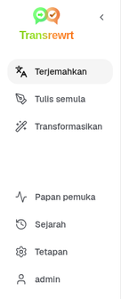
    </td>
    <td valign="top">
      <br/><br/>
      <ul>
        <li><strong>Terjemahkan</strong> membuka ruang kerja terjemahan.</li><br/>
        <li><strong>Tulis semula</strong> membuka ruang kerja penulisan semula.</li><br/>
        <li><strong>Transformasikan</strong> membuka ruang kerja arahan tersuai.</li><br/>
        <li><strong>Papan pemuka</strong> menunjukkan penggunaan dan maklumat kos.</li><br/>
        <li><strong>Tetapan</strong> membuka panel tetapan.</li><br/>
        <li><strong>Sejarah</strong> menunjukkan sejarah penggunaan dengan teks input dan output</li><br/>
        <li><strong>Pengguna</strong> menunjukkan nama pengguna yang sedang log masuk (hanya web).</li>
      </ul>
    </td>
  </tr>
</table>

<br/>

<a id="toolbar"></a>
### Bar Alat

Bar alat berubah sedikit bergantung kepada lokasi anda dalam aplikasi.

- Di sebelah kiri, ia menunjukkan nama halaman semasa.
- Di sebelah kanan, ia menunjukkan pemilih **pratetap atau model** dan kawalan **Bahasa antara muka**.

Dalam mod **Mudah**, bar alat menunjukkan pemilih **pratetap** dengan pratetap binaan **Percuma (OpenRouter)**, **Standard**, **Lanjutan**, dan **Teknikal**. Pratetap yang muncul bergantung pada **Penyedia** yang anda pilih di [**Tetapan** > **Tetapan Umum**](#general-settings)—contohnya, **Percuma (OpenRouter)** hanya disenaraikan apabila penyedia ialah OpenRouter. Jika **Penyedia** ialah **Ollama**, bar alat akan menyenaraikan model tempatan yang telah dipasang, bukannya pratetap.

Dalam mod **Lanjutan**, **pemilih model** membolehkan anda memilih enjin AI mana yang digunakan untuk tugas semasa.

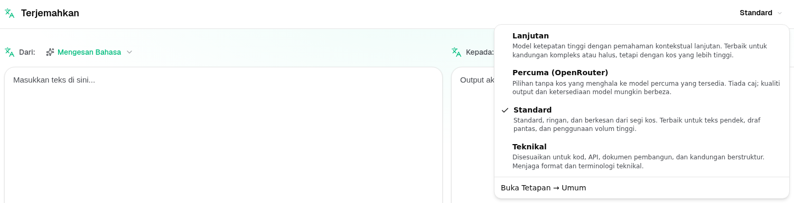

Dalam mod Lanjutan, sesetengah model percuma mungkin tidak sentiasa tersedia—ia boleh tidak dalam talian atau telah mencapai had penggunaan. Aplikasi mungkin mengalih keluar model tersebut daripada senarai anda secara automatik. Untuk mengawal model yang dipaparkan, pergi ke [**Tetapan** > **Model**](#models). Anda boleh membuka tetapan model daripada ikon penyedia di sebelah kiri nama model dalam bar alat.

<br/>

Ikon **dunia + kod bahasa** menukar bahasa antara muka aplikasi, seperti menu dan butang. Ia **tidak** menukar bahasa terjemahan yang digunakan dalam **Terjemahkan**.

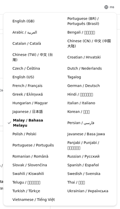

<br/>

<a id="input-and-output-panels"></a>
### Panel Input dan output

Kebanyakan ruang kerja menggunakan panel **Input** di sebelah kiri dan panel **Output** di sebelah kanan.

Setiap panel juga menunjukkan:

| **Input**                                                          | **Output**                                                                                                                  |
|--------------------------------------------------------------------|-----------------------------------------------------------------------------------------------------------------------------|
| - Kiraan aksara <br/>- Kiraan perkataan <br/>- Kiraan perenggan   <br/> | - Tempoh tugas diambil<br/>- **TPS** (token per saat)<br/>- Kiraan aksara, perkataan, dan perenggan<br/>- Model yang digunakan |

Jika anda ingin tahu tentang istilah teknikal:

- **Token** bermaksud bahagian kecil teks. Anda boleh menganggapnya sebagai sebahagian daripada perkataan atau perkataan pendek.
- **TPS** bermaksud berapa banyak bahagian teks tersebut yang diproses oleh model setiap saat.

<br/>

Anda juga boleh memantau kos bagi setiap operasi (jika tersedia) dan jumlah kos, dengan mengaktifkan pilihan `Show cost information on the actions` di [**Tetapan** > **Tetapan Umum**](#general-settings).

<br/><br/>

[--------------------------------------------------------------------------------------------------------------------------]: #

<a id="translate"></a>
## Terjemahkan

Gunakan **Terjemahkan** apabila anda ingin menukar teks daripada satu bahasa ke bahasa lain.

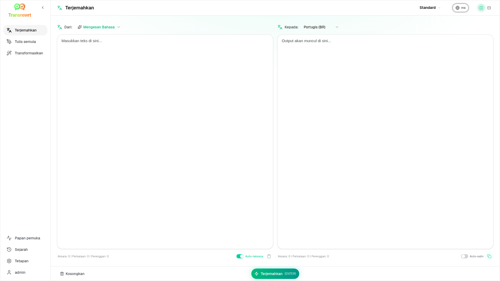

<br/>

<a id="translate-text"></a>
### Terjemahkan teks

1. Buka **Terjemah**.
2. Pilih bahasa dalam **Dari**.
3. Pilih bahasa dalam **Ke**.
4. Pilih pratetap (Mudah) atau model (Lanjutan) dalam bar alat.
5. Taip atau tampal teks ke dalam **Input**.
6. Klik **Terjemahkan**.
7. Baca hasilnya dalam **Output**.
8. Gunakan butang salin jika anda ingin menyalin hasil tersebut.

<br/>

<a id="language-selection"></a>
### Pemilihan bahasa

- **From** boleh menjadi bahasa tertentu atau **Detect Language**.
- **To** adalah bahasa yang anda mahu untuk hasil terjemahan.

Bahasa **Top languages** yang anda pilih akan muncul di bahagian atas senarai. Anda boleh tetapkan ini dalam [**Tetapan** > **Bahasa**](#languages).

<br/>

<a id="helpful-translation-settings"></a>
### Tetapan terjemahan yang berguna

Dalam [**Tetapan** > **Tetapan Umum**](#general-settings), anda boleh mengubah cara terjemahan berfungsi:

- **Auto-translate on paste** akan menjalankan terjemahan sebaik sahaja anda menampal teks.
- **Auto-copy result to clipboard** akan menyalin hasil secara automatik selepas terjemahan berjaya dilaksanakan.
- **Real-time translation (while typing)** akan menjalankan terjemahan semasa anda menaip.
- **Timeout (ms)** mengawal berapa lama aplikasi menunggu sebelum menjalankan terjemahan masa sebenar.
- **Kelakuan untuk ENTER** mengawal apa yang berlaku apabila anda menekan `Enter`:
  - **Enter** melaksanakan terjemahan atau penulisan semula (lalai).
  - **Shift + Enter** melaksanakan terjemahan atau penulisan semula; **Enter** biasa memasukkan baris baharu.

[--------------------------------------------------------------------------------------------------------------------------]: #

<a id="rewrite"></a>
## Tulis semula

Gunakan **Tulis semula** apabila anda ingin memperbaiki perkataan tanpa mengubah maksud utama.

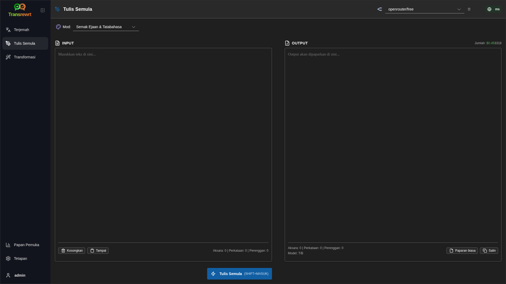

Ini berguna untuk:

- membetulkan ejaan dan tatabahasa (**Periksa Ejaan & Tatabahasa**)
- menjadikan teks lebih jelas (**Tingkatkan Kejelasan**)
- beberapa reformulasi berbeza dalam satu larian (**Versi alternatif**)
- menjadikan teks lebih formal atau tidak formal (**Jadikan Formal** / **Jadikan Tidak Formal**)
- meringkaskan atau mengembangkan teks (**Ringkaskan** / **Kembangkan**)
- menjadikan teks lebih teknikal (**Jadikan Teknikal**)

<br/>

> 💡 **TIP**<br/>
> Apabila anda menggunakan mod "**Periksa Ejaan & Tatabahasa**", suis **Tunjukkan perubahan** akan muncul di panel output (bersebelahan **Salin**).
> Hidupkan atau matikan untuk menunjukkan atau menyembunyikan pembetulan khusus yang dikenakan ke atas teks anda.

<br/><br/>

[--------------------------------------------------------------------------------------------------------------------------]: #

<a id="transform"></a>
## Transformasikan

Gunakan **Transformasikan** apabila anda mahu AI mengikuti satu set arahan tersuai.

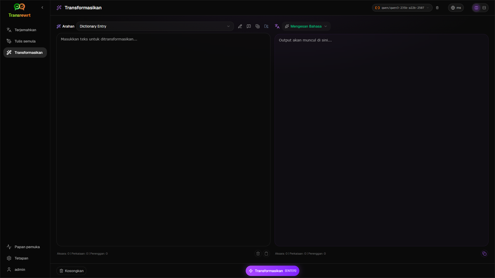

Ini adalah kawasan paling fleksibel dalam aplikasi. Anda boleh menggunakannya untuk tugas seperti:

- ringkasan nota
- menukar teks kasar kepada emel yang siap
- mengekstrak titik-titik utama
- menukar teks kepada format tertentu
- sebarang aktiviti tersuai lain dengan teks input

<br/>

<a id="run-an-existing-prompt"></a>
### Jalankan arahan sedia ada

1. Buka **Transform**.
2. Pilih arahan daripada senarai arahan.
3. Jika kotak **Sasaran** bahasa muncul, pilih bahasa jika anda mahukannya.
4. Taip atau tampal teks ke dalam **Input**.
5. Klik **Transformasikan**.
6. Baca hasilnya dalam **Output**.

<br/>

<a id="if-you-have-no-prompts-yet"></a>
### Jika anda belum mempunyai arahan

Jika senarai arahan anda kosong, klik **Muatkan petua sampel** di ruang kerja Transformasikan. Kawalan yang sama sentiasa tersedia di [**Tetapan** > **Transformasikan**](#transform-settings) pada barisan eksport/import. Kedua-duanya menambah contoh binaan supaya anda boleh mula dengan cepat.

<br/>

> ℹ️ **NOTA**<br/>
> Arahan sampel disediakan dalam bahasa Inggeris. Selepas memuatkan arahan tersebut, anda boleh mengedit arahan dan gunakan **Terjemah petua** untuk menterjemahkannya ke dalam {{your language}}.

<br/>

<a id="create-a-prompt-quickly"></a>
### Cipta arahan dengan cepat

Cara terpantas untuk mencipta arahan adalah:

1. Klik **Arahan baharu**.
2. Klik **Jana arahan**.
3. Huraikan apa yang anda mahu arahan itu lakukan.
4. Pilih pratetap (Mudah) atau model (Lanjutan).
5. Biarkan aplikasi mencipta draf untuk anda.
6. Semak draf tersebut dan klik **Simpan**.

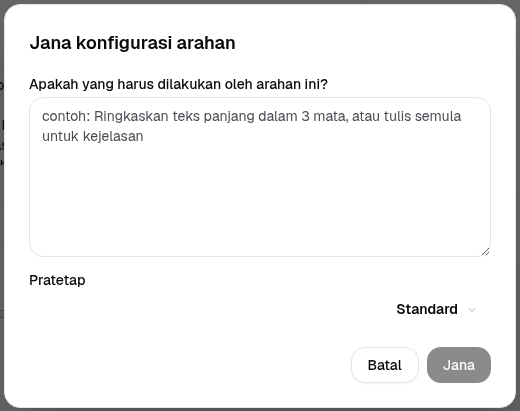

<br/>

<a id="edit-a-prompt"></a>
### Edit arahan

Apabila anda mencipta atau mengedit arahan, editor akan muncul di sebelah kiri dan kawasan ujian akan muncul di sebelah kanan.

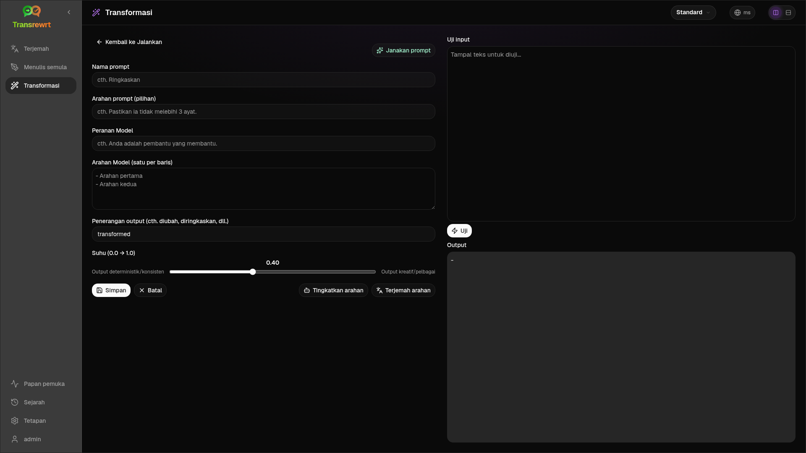

Medan utama adalah:

- **Nama arahan**: nama yang dipaparkan dalam senarai arahan.
- **Arahan arahan (pilihan)**: petua ringkas yang dipaparkan kepada pengguna apabila menjalankan arahan.
- **Peranan Model**: peranan keseluruhan yang diberikan kepada AI, seperti 'Anda adalah pembantu yang membantu.'
- **Arahan Model (satu setiap baris)**: peraturan khusus yang anda mahu AI ikuti.
- **Penerangan output**: perkataan ringkas yang menerangkan hasilnya, seperti 'ringkasan' atau 'tulis semula'.
- **Suhu (0.0 → 1.0)**: bagaimana model akan berkelakuan; lihat di bawah.
- **Minta bahasa sasaran**: menambah pemilih bahasa sasaran apabila arahan dijalankan.

Jika istilah teknikal **Suhu** adalah baru bagi anda, fahamkan seperti berikut:

- **Suhu** yang lebih rendah memberi hasil yang lebih stabil dan lebih boleh diramal.
- **Suhu** yang lebih tinggi memberi lebih banyak variasi dan kreativiti.

Anda juga boleh gunakan:

- `Generate prompt` untuk mencipta draf baharu daripada huraian ringkas
- `Improve prompt` untuk membaiki arahan sedia ada
- `Translate prompt` untuk menterjemahkan medan arahan

<br/>

> ⚠️ **AMARAN**<br/>
> Klik `Save` sebelum anda klik `Back to Run`. Jika anda kembali tanpa menyimpan, perubahan anda akan hilang.

<br/>

<a id="test-a-prompt-before-using-it"></a>
### Uji arahan sebelum menggunakannya

Panel ujian di sebelah kanan membolehkan anda mencuba arahan anda dengan teks sampel sebelum menggunakannya dalam kerja harian.

Ini berguna apabila:

- anda sedang membina arahan baharu
- anda sedang membandingkan dua versi arahan
- anda ingin menyemak nada, panjang, atau format output

<br/>

> ℹ️ **NOTA**<br/>
> Anda boleh mengeksport dan mengimport arahan yang disimpan di [**Tetapan** > **Transformasikan**](#transform-settings).

Apabila anda menggunakan **Jana arahan**, **Tingkatkan arahan**, atau **Terjemah petua** dalam editor arahan, mod **Mudah** menawarkan pemilih pratetap yang sama seperti Terjemah dan Tulis Semula; mod **Lanjutan** menggunakan senarai model.

<br/><br/>

[--------------------------------------------------------------------------------------------------------------------------]: #

<a id="dashboard"></a>
## Papan pemuka

Gunakan **Papan pemuka** untuk melihat sejauh mana anda menggunakan aplikasi ini dan kos yang terlibat (untuk model berbayar).

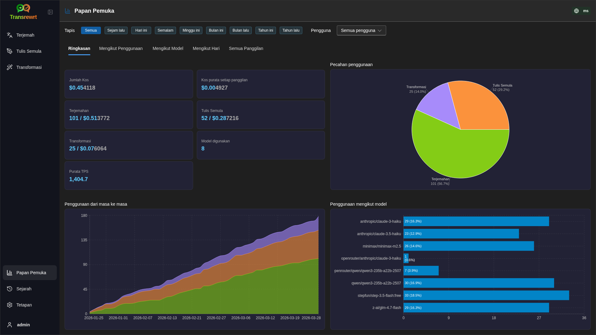

<br/>

> ℹ️ **NOTA**<br/>
> Jika anda hanya menggunakan model **percuma**, jumlah **kos** mungkin sifar dan KPI yang berfokuskan kos mungkin kelihatan kosong. Tab **Ringkasan** tetap menunjukkan bilangan panggilan untuk terjemah, tulis semula, dan transformasi apabila terdapat aktiviti dalam tempoh yang dipilih.

<br/>

<a id="filter-the-data"></a>
### Tapis data

Gunakan butang penapis di bahagian atas untuk menukar julat masa.

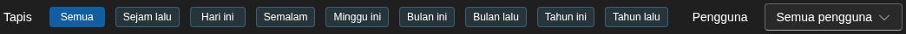

<br/>

> ℹ️ **NOTA**<br/>
> Penapis **Pengguna** hanya kelihatan kepada pentadbir dalam versi web. Pengguna biasa tidak akan melihat penapis ini, dan ia tidak tersedia dalam aplikasi desktop.

<br/>

<a id="dashboard-tabs"></a>
### Tab Papan pemuka

- **Ringkasan** menunjukkan kad KPI: jumlah kos, model yang digunakan, bilangan panggilan dan kos mengikut mod (dengan perkongsian jumlah panggilan), kos purata setiap panggilan, TPS purata, dan tiga model teratas mengikut bilangan panggilan.
- **Mengikut Model** menyenaraikan setiap model dengan jumlah panggilan, jumlah kos, dan TPS purata; kembangkan baris untuk pecahan mengikut terjemah, tulis semula, dan transformasi.
- **Semua Panggilan** menunjukkan log panggilan penuh (berpaginasi pada susun atur lebar, kad pada skrin sempit) dan membolehkan anda mengeksportnya.

<br/>

<a id="export-data"></a>
### Eksport data

Jadual papan pemuka boleh mengeksport data dalam:

- **JSON**
- **CSV**
- **XLSX**

Ini berguna jika anda ingin mengkaji aktiviti di luar aplikasi atau berkongsi laporan.

<br/>

<a id="delete-stored-records-for-a-model"></a>
### Padam rekod tersimpan untuk model

Dalam **Mengikut Model** atau **Semua Panggilan**, anda boleh mengalih keluar rekod tersimpan untuk model dengan mengklik ikon "tong sampah".

> ⚠️ **AMARAN**<br/>
> Pemadaman rekod tersimpan tidak boleh diterbalikkan. Gunakan hanya jika anda pasti tidak lagi memerlukan sejarah tersebut.

Untuk memadam semua data atau mengalih keluar rekod berdasarkan umur mereka, pergi ke [**Tetapan** > **Penjejakan Kos**](#cost-tracking). Di sana anda akan menemui pilihan untuk memadam semua data yang disimpan atau hanya data yang lebih lama daripada tarikh tertentu.

<br/><br/>

[--------------------------------------------------------------------------------------------------------------------------]: #

<a id="history"></a>
## Sejarah

Klik pada **Sejarah** untuk melihat sejarah tindakan anda di dalam **Transrewrt**, termasuk input dan output bagi setiap operasi.

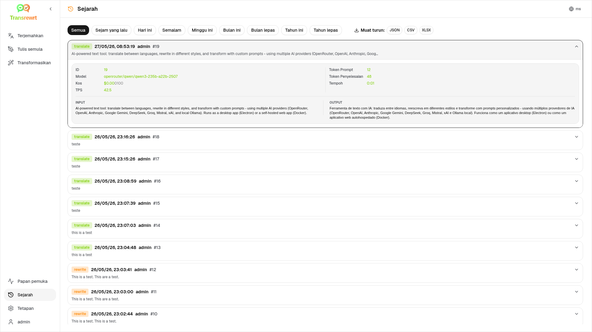

<br/>

<a id="filter-the-history"></a>
### Penapis sejarah

**Sejarah** menggunakan penapis julat masa yang sama seperti halaman **Papan pemuka**.


<br/>

> ℹ️ **NOTA**<br/>
> Dalam **aplikasi web**, semua orang (termasuk pentadbir) hanya melihat sejarah pelaksanaan mereka sendiri. Penapis **Pengguna** pada **Papan pemuka** adalah untuk pentadbir mengkaji penggunaan dan kos merentas akaun; ia tidak terpakai kepada **Sejarah**.

<br/>

<a id="export-history-data"></a>
### Eksport data sejarah

Halaman sejarah boleh mengeksport data yang ditapis dalam format:

- **JSON**
- **CSV**
- **XLSX**

Ini berguna jika anda ingin mengkaji aktiviti di luar aplikasi atau berkongsi laporan.

<br/><br/>

[--------------------------------------------------------------------------------------------------------------------------]: #

<a id="settings"></a>
## Tetapan

Buka **Tetapan** daripada bar sisi untuk menyesuaikan cara aplikasi berkelakuan.

Tab yang tersedia bergantung pada platform dan peranan anda:

| Tab              | Desktop | Web (pentadbir) | Web (pengguna biasa) | Nota                                        |
  |------------------|:-------:|:-----------:|:------------------:|----------------------------------------------|
  | Tetapan Umum |   ya   |     ya     |        ya         | Termasuk **Pengalaman AI** (Mudah / Lanjutan) |
  | Model           |   ya   |     ya     |        ya         | Hanya apabila **Pengalaman AI** adalah **Lanjutan** |
  | Bahasa        |   ya   |     ya     |        ya         |                                              |
  | Penjejakan Kos    |   ya   |     ya     |         -          |                                              |
  | Transformasikan        |   ya   |     ya     |        ya         | Import/paparan pukal arahan transformasi      |
  | Pengguna            |    -    |     ya     |         -          |                                              |
  | Konfigurasi API       |   ya   |     ya     |         -          |                                              |
  | Perihal            |   ya   |     ya     |        ya         |                                              |

Dalam mod **Mudah**, pemilihan model dilakukan melalui pratetap dalam bar alat dan **Penyedia** dalam Tetapan Umum; tab **Model** disembunyikan.

<br/>

> ℹ️ **NOTA**<br/>
> Dalam versi web, setiap pengguna mempunyai konfigurasi sendiri. Tetapan seperti pengalaman AI, penyedia, model atau pratetap terpilih, bahasa, pilihan umum, dan arahan transformasi disimpan mengikut pengguna. Perubahan yang anda buat tidak akan menjejaskan pengguna lain.

<br/>

[--------------------------------------------------------------------------------------------------------------------------]: #

<a id="general-settings"></a>
### Tetapan Umum

Gunakan **Tetapan Umum** untuk mengawal kelakuan menaip, sama ada butiran pelaksanaan disimpan untuk **Sejarah**, rupa, dan cara anda memilih AI untuk Terjemah, Tulis semula, dan Transformasikan.

**Pengalaman AI**

- **Mudah** (lalai): pilih **Penyedia** (OpenRouter, OpenAI, Anthropic, Google Gemini, DeepSeek, Groq, Mistral, xAI, Cerebras, atau Ollama). Penyedia awan menggunakan pratetap binaan dalam bar alat. **Ollama** menyenaraikan model yang dipasang pada mesin anda sebagai ganti pratetap. Dalam mod Mudah, **Katalog pratetap** menunjukkan versi katalog dan masa kemaskini terakhir; klik **Segarkan katalog pratetap** untuk memuat senarai pratetap terkini daripada repositori projek (aplikasi juga memeriksa secara berkala di latar belakang).
- **Lanjutan**: pilih model individu dalam bar alat; urus senarai tersebut di bawah [**Tetapan** > **Model**](#models).

Dalam **aplikasi web**, penyedia yang muncul bergantung kepada kunci API yang ditetapkan dalam persekitaran pelayan. Dalam **aplikasi desktop**, konfigurasikan kunci di bawah [**Konfigurasi API**](#api-config).

**Kelakuan**

- **Kelakuan untuk ENTER** memilih sama ada `Enter` melaksanakan tugas atau memasukkan baris baru.
- **Terjemah automatik semasa tampal** memulakan terjemahan sebaik sahaja anda menampal teks.
- **Salin hasil secara automatik ke papan keratan** menyalin hasil yang berjaya secara automatik.
- **Terjemahan masa sebenar (semasa menaip)** menterjemah semasa anda menaip.
- **Tempoh tamat (ms)** menetapkan masa tunggu untuk terjemahan masa sebenar.

**Sejarah**

- **Simpan sejarah pelaksanaan** mengawal sama ada setiap terjemahan, tulis semula, dan transformasi menyimpan **teks input dan output** untuk paparan [**Sejarah**](#history) di bar sisi. Mematikannya akan meminta pengesahan; jika anda mengesahkan, teks sejarah yang disimpan akan dialih keluar dari pangkalan data. Jika label menunjukkan *dilumpuhkan oleh pentadbir*, pemasangan anda mempunyai `HISTORY_DISABLED` ditetapkan dalam persekitaran (rujuk [README](README.ms.md#configuration-and-environment)); anda tidak boleh menghidupkan semula sejarah dari UI.
- **Padam data sejarah** membolehkan anda mengalih keluar teks yang disimpan berdasarkan umur (contohnya lebih lama daripada beberapa bulan, atau **semua data (kosongkan)**) menggunakan **Padam data**. Ini hanya mempengaruhi teks pelaksanaan yang disimpan untuk paparan **Sejarah**; ia **tidak** memadamkan jumlah kos atau penggunaan. Untuk mengalih keluar atau memotong data **kos**, gunakan [**Tetapan** > **Penjejakan Kos**](#cost-tracking).

**Rupa**

- **Tema** menukar antara rupa cerah, gelap, dan sistem.
- **Tunjukkan maklumat kos pada tindakan** mengawal paparan kos setiap operasi (jika tersedia) dan jumlah kos pada panel output Terjemah, Tulis Semula, dan Transformasikan.
- **Digit pecahan kos** menukar cara perpuluhan kos dipaparkan.
- **Web sahaja:** **tunjukkan jarak di sekeliling aplikasi** menambah ruang tambahan di sekeliling antara muka.
- **Famili Fon** menukar fon penulisan dalam panel teks.
- **Saiz** menukar saiz fon.

**Sandaran Konfigurasi** (hanya untuk pentadbir aplikasi desktop dan web)

- **Sertakan data penggunaan dalam sandaran** - apabila didayakan, ZIP juga mengandungi sejarah pelaksanaan dan data panggilan API.
- **Sandar konfigurasi** - mencipta satu fail ZIP (`transrewrt-config-backup-YYYY-MM-DD_HHMMSS.zip` dalam UTC secara lalai) dengan `config.json`, `state.json`, kunci penyulitan pilihan, pengguna, keutamaan, arahan tersuai, dan data penggunaan jika anda memilih untuk menyertakannya. Selepas sandaran berjaya, pengesahan akan memaparkan nama fail yang disimpan.
- **Pulih daripada sandaran** - membuka **dialog pengesahan dahulu**. Pilih fail ZIP sandaran dalam dialog tersebut (**Browse** / pemilih fail atau seret-dan-lepas jika disokong), kemudian semak semula pilihan:
  - **Pulihkan data penggunaan** - import data penggunaan/sejarah dari ZIP jika ia disandar bersama data penggunaan; tinggalkan tidak didayakan jika anda hanya mahu tetapan dan arahan.
  - **Kosongkan data penggunaan lama sebelum memulihkan** - alih keluar data penggunaan/sejarah sedia ada pada pemasangan ini sebelum memohon sandaran (pilihan; gunakan apabila anda mahu penggantian bersih).

Sandaran yang dicipta dalam versi web atau desktop boleh dipulihkan dalam versi yang lain. Apabila memulihkan sandaran desktop dalam versi web, data akan dipulihkan ke pengguna pentadbir.

<br/>

<a id="models"></a>
### Model

Tab ini hanya tersedia apabila **Pengalaman AI** ditetapkan kepada **Lanjutan** di [**Tetapan Umum**](#general-settings). Gunakan **Tetapan** > **Model** untuk memilih model yang muncul di bar alat.

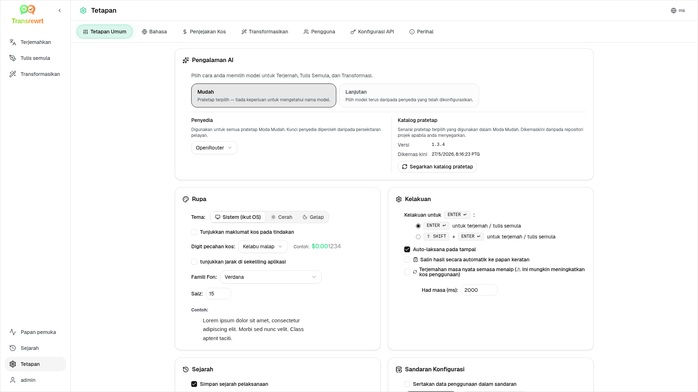

Halaman ini mempunyai dua senarai:

- **Model Tersedia** di sebelah kiri
- **Model Terpilih** di sebelah kanan

Kawalan berguna termasuk:

- **Cari model...** untuk mencari model mengikut nama
- **Cip Penyedia** untuk mengecilkan senarai kepada satu enjin (OpenRouter, OpenAI, Ollama, …)
- **Percuma Sahaja** untuk memaparkan hanya model percuma
- **Segar Semula** untuk memuat semula senarai
- **Kembangkan Semua** dan **Runtuhkan Semua** apabila anda menyusun mengikut penyedia

ID model termasuk awalan penyedia (contohnya `openrouter/…` berbanding `openai/…`). Lencana seperti **OpenAI (OpenRouter)** berbanding **OpenAI (langsung)** menunjukkan bagaimana lalu lintas dirouting.

> ℹ️ **NOTA**<br/>
> **OpenRouter Body Builder** (`openrouter/bodybuilder`) adalah model penghala, bukan model sembang umum: balasannya adalah JSON yang menerangkan badan permintaan API OpenRouter (contohnya tatasusunan `requests` dengan `model` dan `messages`). Jika anda menggunakannya untuk **Terjemahkan**, **Tulis semula**, atau **Transformasikan**, panel output akan memaparkan JSON itu dan bukannya teks siap. Pilih model teks biasa untuk tugas-tugas tersebut. Rujuk [laman model Body Builder](https://openrouter.ai/openrouter/bodybuilder) di OpenRouter.

Tindakan:

- Untuk menambah model, klik **Tambah** atau mana-mana di dalam entri.

- Untuk mengalih keluar model, klik **X** bersebelahan dengannya dalam **Model Terpilih** atau **Dipilih** pada entri dalam Model Tersedia.

- Untuk mengosongkan senarai, klik **Nyahpilih Semua**. Model percuma yang diperlukan akan kekal dalam senarai.

<br/>

> ℹ️ **NOTA**<br/>
> Jika anda tidak mahu menambah kredit ke OpenRouter serta-merta, mulakan dengan mengaktifkan **Percuma Sahaja** dan memilih model percuma (tiada kad kredit diperlukan). Anda juga boleh menggunakan Ollama untuk menjalankan model secara tempatan tanpa sebarang kunci API.

<br/>

<a id="languages"></a>
### Bahasa

Gunakan **Tetapan** > **Bahasa** untuk menyusun senarai bahasa yang digunakan dalam aplikasi.

- **Bahasa teratas** dipautkan berhampiran bahagian atas senarai bahasa dalam **Terjemahkan** dan **Transformasikan**.
- **Bahasa tersuai** membolehkan anda menambah bahasa yang tidak terdapat dalam senarai binaan.

Jika anda menambah bahasa tersuai, ia akan muncul dalam pemilih bahasa bersama pilihan binaan.

<br/>

<a id="cost-tracking"></a>
### Penjejakan kos

Gunakan **Tetapan** > **Penjejakan Kos** untuk mengurus maklumat kos.

- **Jumlah Kos** memaparkan jumlah terkini.
- **Salin Nilai** menyalin jumlah ke papan keratan.
- **Tetapkan Semula Kos** menetapkan semula jumlah disimpan kepada sifar.
- **Sinkron dengan penggunaan kunci API** menetapkan jumlah agar sepadan dengan penggunaan yang dilaporkan oleh akaun OpenRouter anda (OpenRouter sahaja).
- **Penggunaan Kunci API** memaparkan butiran penggunaan OpenRouter, jika tersedia.
- **Padam data kos** mengalih keluar semua data, atau hanya entri yang lebih lama daripada tarikh yang dipilih.

**Penjejakan kos:** Apabila anda menggunakan model OpenRouter, aplikasi memaparkan penggunaan dan perbelanjaan sebenar anda berdasarkan maklumat kos daripada OpenRouter. Untuk semua penyedia lain, aplikasi menganggarkan kos menggunakan harga yang diterbitkan oleh OpenRouter; jika harga tidak tersedia, anggaran mungkin sifar.

<br/>

> ℹ️ **NOTA**<br/>
> **Semua angka kos adalah anggaran untuk rujukan anda sahaja, bukan penyata bil rasmi.**

<br/>

> ⚠️ **AMARAN**<br/>
> Penghapusan data tidak boleh diterbalikkan. Sebelum memadam, pastikan untuk membuat sandaran data anda atau mengeksportnya melalui [**Sejarah**](#history)
> atau [**Papan pemuka** > **Semua Panggilan**](#dashboard-tabs), jika tidak data akan hilang secara kekal.
> Semua sejarah input/output berkaitan setiap entri panggilan API juga akan dipadamkan.

<br/>

<a id="transform-settings"></a>
### Transform (tab tetapan)

Gunakan **Tetapan** > **Transformasikan** untuk mengurus arahan secara pukal.

Anda boleh:

- semak arahan yang disimpan
- padam arahan
- import arahan dari fail
- eksport arahan untuk sandaran atau perkongsian
- muatkan arahan sampel ke senarai arahan

<br/>

<a id="users"></a>
### Pengguna

Gunakan **Pengguna** untuk mengurus akaun pengguna dalam versi web. Anda boleh menambah pengguna, kemaskini maklumat mereka, tetapkan semula kata laluan, dan padam akaun.

<br/>

<a id="api-config"></a>
### Konfigurasi API

Penyedia yang disokong ialah: OpenRouter, OpenAI, Anthropic, Google Gemini, DeepSeek, Groq, Mistral, xAI, Cerebras, dan **Ollama** (model tempatan melalui URL asas). Anda hanya perlu mengkonfigurasikan penyedia yang anda gunakan.

**Aplikasi web: pentadbir sahaja**

Kunci API dikonfigurasikan melalui pemboleh ubah persekitaran sistem atau Docker - ia tidak dimasukkan dalam UI web. Halaman ini menunjukkan penyedia mana yang mempunyai kunci yang dikonfigurasikan dan membolehkan anda menguji setiap satu dengan mengklik butang `Test`.

<br/>

> ℹ️ **NOTA**<br/>
> Untuk menukar kunci API, kemaskini pemboleh ubah persekitaran dalam konfigurasi sistem atau Docker anda dan mulakan semula pelayan atau bekas.

<br/>

> ℹ️ **NOTA**<br/>
> **Sandaran konfigurasi** (lihat [**Tetapan Umum** → Sandaran Konfigurasi](#general-settings)) boleh menyertakan kunci penyedia **terselesaikan** di dalam `config.json` ZIP. Memulihkan ZIP tersebut **tidak** menyalin kunci tersebut kembali ke fail konfigurasi kekal pelayan - kunci aktif masih datang daripada persekitaran dan keadaan fail sedia ada seperti yang diterangkan di sana.

<br/>

**Aplikasi desktop**

Gunakan **Konfigurasi API** untuk menyimpan kunci API bagi setiap penyedia yang anda gunakan. Untuk Ollama, masukkan **URL asas** sebagai ganti kunci API.

<br/>

> 💡 **Tip** <br/>
> Jika anda tidak mahu menggunakan kunci API atau membayar penggunaan, anda boleh [muat turun Ollama](https://ollama.com) dan jalankan model (seperti `translategemma:4b`) secara tempatan pada mesin anda secara percuma. Sebagai alternatif, anda boleh cipta akaun OpenRouter percuma (tiada kad kredit diperlukan) untuk menggunakan model percuma mereka, atau dapatkan kunci API percuma daripada Cerebras, Google, Groq, atau Mistral AI.

<br/>

- Tambah hanya penyedia yang anda perlukan. Dalam **Tetapan** > **Model**, setiap ID model bermula dengan penyedia (contohnya `openrouter/openrouter/free`, `openai/gpt-4o`, `ollama/llama3`).

Untuk menambah kunci API, masukkan nilai dalam ruang teks dan klik `Save`. Untuk menggantikan kunci sedia ada, klik `Edit`. Untuk mengesahkan kunci berfungsi, klik `Test`. Untuk URL asas Ollama, sentiasa klik `Test` untuk menyemak sambungan.

<br/>

> ℹ️ **NOTA**<br/>
> Anda tidak boleh melihat nilai semasa kunci API. Anda hanya boleh menggantikannya menggunakan butang `Edit`.
> Kunci API disimpan dalam bentuk disulitkan dalam konfigurasi.

<br/>

<a id="about"></a>
### Perihal

Tab **Perihal** menunjukkan:

- nama aplikasi dan frasa tag
- nombor versi dan tarikh binaan
- maklumat lesen dan hak cipta, dengan pautan untuk membuka **Pemberitahuan pihak ketiga**
- pautan ke repositori projek

<br/><br/>

<a id="common-issues"></a>
## Isu biasa

Jika sesuatu tidak berfungsi seperti yang dijangkakan, semak dahulu perkara berikut.

<br/>

<a id="the-app-will-not-translate-rewrite-or-transform-text"></a>
### Aplikasi tidak menterjemah, menulis semula, atau mengubah teks

Pastikan:

- anda telah memilih **pratetap** (Mudah) atau **model** (Lanjutan) dalam bar alat
- dalam mod **Mudah**, [**Tetapan** > **Tetapan Umum**](#general-settings) mempunyai **Penyedia** dengan kunci yang berfungsi (atau URL Ollama) dan sekurang-kurangnya satu pratetap untuk penyedia tersebut
- dalam mod **Lanjutan**, sekurang-kurangnya satu model disenaraikan di [**Tetapan** > **Model**](#models)
- susunan API anda berfungsi

Jika anda menggunakan aplikasi desktop:

1. Buka [**Tetapan** > **Konfigurasi API**](#api-config).
2. Pastikan sekurang-kurangnya satu kunci API telah disimpan.
3. Klik **Uji** di sebelah penyedia untuk mengesahkan kunci berfungsi.

<br/>

<a id="the-model-list-is-empty"></a>
### Senarai model kosong

Dalam mod **Mudah**, buka [**Tetapan** > **Tetapan Umum**](#general-settings), pastikan **Penyedia** telah ditetapkan, dan tambah atau uji kunci di [**Konfigurasi API**](#api-config) (desktop) atau minta pentadbir anda (web). Untuk **Ollama**, jalankan **Uji** pada URL asas dan pastikan model telah dipasang secara tempatan.

Dalam mod **Lanjutan**, buka [**Tetapan** > **Model**](#models) dan klik **Segar Semula**. Jika perlu, cari model, dayakan **Percuma Sahaja**, dan tambah model ke **Model Terpilih**.

<br/>

<a id="the-result-is-too-slow-or-too-expensive"></a>
### Keputusan terlalu perlahan atau terlalu mahal

Cuba satu atau lebih perkara berikut:

- pilih pratetap (Mudah) atau model (Lanjutan) yang berbeza
- gunakan input yang lebih pendek
- matikan **Terjemahan masa nyata (semasa menaip)** di [**Tetapan** > **Tetapan Umum**](#general-settings)
- gunakan model percuma untuk tugas-tugas ringkas (rujuk [Model](#models))

<br/>

<a id="the-interface-is-in-the-wrong-language"></a>
### Antara muka dalam bahasa yang salah

Klik ikon globe dalam [bar alat](#toolbar) dan pilih **Bahasa antara muka** yang anda kehendaki.

<br/>

<a id="the-text-is-too-small-or-hard-to-read"></a>
### Teks terlalu kecil atau sukar dibaca

Buka [**Tetapan** > **Tetapan Umum**](#general-settings) dan ubah:

- **Famili Fon**
- **Saiz**

<br/>

<a id="dashboard-summary-looks-empty"></a>
### Ringkasan Papan Pemuka kelihatan kosong

Ini adalah normal jika:

- anda hanya menggunakan **model percuma** dan sedang melihat angka **kos** (ia mungkin sifar); KPI kiraan panggilan di **Ringkasan** masih memerlukan data dari tempoh yang dipilih
- penapis **masa** yang dipilih tidak merangkumi tempoh apabila panggilan dibuat — cuba **Semua** untuk menyemak

Jika KPI masih sifar selepas memilih **Semua**, sahkan bahawa panggilan muncul di [**Sejarah**](#history) atau di tab **Semua Panggilan**.

<br/>

<a id="cost-shows-not-available-or-seems-wrong"></a>
### Kos menunjukkan "tidak tersedia" atau kelihatan salah

Apabila anda menggunakan model melalui **OpenRouter**, aplikasi akan memaparkan perbelanjaan sebenar yang dilaporkan oleh OpenRouter.

Untuk **penyedia lain** (OpenAI langsung, Anthropic langsung, dll.), kos adalah anggaran berdasarkan data harga yang diterbitkan oleh OpenRouter. Jika tiada harga yang sepadan ditemui untuk model tersebut, kos akan dipaparkan sebagai **tidak tersedia** dan tidak akan ditambah ke jumlah keseluruhan anda.

<br/>

<a id="total-cost-does-not-match-my-provider-bill"></a>
### Jumlah kos tidak sepadan dengan bil penyedia anda

Semua angka kos dalam aplikasi adalah **anggaran untuk rujukan sahaja**, bukan penyata bil rasmi.

Untuk menjadikan jumlah ini lebih hampir dengan perbelanjaan OpenRouter sebenar anda, buka [**Tetapan** > **Penjejakan Kos**](#cost-tracking) dan klik **Sinkron dengan penggunaan kunci API**.

<br/>

<a id="the-history-page-is-missing-from-the-sidebar"></a>
### Halaman Sejarah tiada dalam bar sisi

**Simpan sejarah pelaksanaan** mungkin dimatikan. Buka [**Tetapan** > **Tetapan Umum**](#general-settings) dan dayakannya kecuali sejarah *dilumpuhkan oleh pentadbir* (`HISTORY_DISABLED` dalam persekitaran — rujuk [README](README.ms.md#configuration-and-environment)). Menghidupkan sejarah tidak akan memulihkan teks yang sebelumnya telah dipadam.

<br/>

<a id="web-app-session-expired"></a>
### Aplikasi web: diarahkan semula ke halaman log masuk secara tidak dijangka

Sesi anda mungkin telah tamat masa. Log masuk semula. Jika ini berlaku kerap, semak konfigurasi pelayan untuk tetapan tempoh hayat sesi.

<br/>

<a id="web-admin-forgot-or-lost-a-password"></a>
### Pentadbir web: lupa atau hilang kata laluan

Ini merujuk kepada aplikasi web **yang dihos sendiri** (Docker), bukan aplikasi desktop (Electron).

- Jika pentadbir lain masih boleh log masuk, mereka boleh buka [**Tetapan** > **Pengguna**](#users), pilih akaun tersebut, dan tetapkan **kata laluan baharu** di sana.
- Jika anda **terkunci keluar** tetapi mempunyai **akses shell** ke mesin atau bekas, tetapkan semula kata laluan menggunakan alat bantu yang disertakan dengan imej (gantikan `transrewrt` jika anda menukar nama lalai, dan letakkan tanda petik pada kata laluan jika ia mengandungi ruang atau aksara khas):

```bash
docker exec transrewrt reset-web-password '<username>' '<new-password>'
```

Nama pengguna pentadbir lalai ialah `admin` jika anda belum pernah mencipta akaun lain. Apabila anda hanya memberi satu argumen, ia akan dianggap sebagai kata laluan baharu untuk `admin`.

Jika anda menjalankannya dari **cek keluar sumber** dan bukannya Docker, gunakan:

```bash
pnpm run reset-web-password -- <username> <new-password>
```

Skrip tersebut mengemaskini rekod pengguna dalam pangkalan data SQLite (dan boleh mencipta pengguna `admin` jika tiada). Selepas menetapkan semula, log masuk dengan kata laluan baharu.

<br/>

<a id="dashboard-shows-no-data-for-other-users"></a>
### Papan pemuka menunjukkan tiada data untuk pengguna lain (web)

Hanya **pentadbir** boleh melihat data dari semua pengguna melalui penapis **Pengguna**. Pengguna biasa hanya dapat melihat aktiviti mereka sendiri mengikut rekabentuk.

<br/>

<a id="i-changed-a-prompt-and-lost-the-edits"></a>
### Saya mengubah arahan dan kehilangan suntingan

Apabila menyunting arahan, sentiasa klik **Simpan** sebelum klik **Kembali ke Jalankan**.

<br/><br/>

<a id="quick-tips"></a>
## Petua pantas

- Mulakan dengan [**Terjemahkan**](#translate) untuk memastikan susunan anda berfungsi sebelum beralih ke [**Tulis semula**](#rewrite) atau [**Transformasikan**](#transform).
- Gunakan [**Tulis semula**](#rewrite) untuk penambahbaikan perkataan harian.
- Gunakan [**Transformasikan**](#transform) apabila anda memerlukan alur kerja yang boleh diulang untuk tugas tertentu.
- Gunakan [**Papan pemuka**](#dashboard) jika anda ingin memantau penggunaan dan kos.
- Gunakan [**Sejarah**](#history) untuk mengkaji operasi lepas dan teks input/output penuh mereka.
- Eksport arahan secara berkala jika anda membina perpustakaan arahan yang ingin anda simpan dengan selamat (rujuk [Transformasikan](#transform)) atau jika anda ingin berkongsi dengannya dengan orang lain.
- Kekal dalam mod **Mudah** sehingga anda memerlukan kawalan terperinci ke atas ID model; tukar ke **Lanjutan** apabila anda sudah tahu model mana yang anda mahu.

<br/><br/>

<a id="disclaimer"></a>
## Penafian

Nama produk dan ikon adalah milik pemilik masing-masing dan digunakan untuk tujuan pengenalan sahaja. Perisian ini tidak berkaitan dengan atau disokong oleh mana-mana jenama yang disebutkan.

<br/><br/>

<a id="license"></a>
## Lesen

Hak Cipta © 2026 Waldemar Scudeller Jr.

[Apache License 2.0](../LICENSE)
