<a id="transrewrt-user-guide"></a>
# Gebruikershandleiding

<br/>

<a id="introduction"></a>
## Inleiding

Transrewrt helpt u op drie manieren met tekstverwerking:

- **Vertalen** - tekst omzetten van de ene taal naar de andere.
- **Herschrijven** - tekst herschrijven in een andere stijl, zoals duidelijker, korter of formeler.
- **Transformeren** - tekst verwerken met aangepaste AI-instructies die prompts worden genoemd.

Standaard wordt de app uitgevoerd in **Eenvoudige** modus: u kiest een **voorkeuze** (bijvoorbeeld Gratis (OpenRouter), Standaard, Geavanceerd of Technisch) en een **leverancier** in Instellingen, zonder model-ID's te kiezen. Schakel over naar **Geavanceerd** in [**Instellingen** > **Algemene instellingen**](#general-settings) als u de klassieke modellenlijst wilt gebruiken van [**Instellingen** > **Modellen**](#models).

<br/>

Deze handleiding legt uit hoe u de app gebruikt nadat deze is geïnstalleerd en actief is. Zie de hoofd [**README**](README.nl.md) voor installatiestappen.

<br/>

> ℹ️ **OPMERKING**<br/>
> Transrewrt is beschikbaar als desktopapp voor Windows en Linux, en als zelfgehoste webapp. Deze handleiding richt zich op het dagelijks gebruik van de app. Wanneer iets alleen op één versie van toepassing is, wordt dit duidelijk aangegeven.

<small>**Lees in andere talen:** </small>
<small id="lang-list">[English (GB)](../USER-GUIDE.md) · [Português (Brasil)](./USER-GUIDE.pt-BR.md) · [العربية](./USER-GUIDE.ar.md) · [বাংলা](./USER-GUIDE.bn.md) · [Català](./USER-GUIDE.ca.md) · [中文 (中国大陆)](./USER-GUIDE.zh-CN.md) · [中文 (台灣)](./USER-GUIDE.zh-TW.md) · [Hrvatski](./USER-GUIDE.hr.md) · [Čeština](./USER-GUIDE.cs.md) · [Nederlands](./USER-GUIDE.nl.md) · [English (US)](./USER-GUIDE.en-US.md) · [Tagalog](./USER-GUIDE.tl.md) · [Français](./USER-GUIDE.fr.md) · [Deutsch](./USER-GUIDE.de.md) · [Ελληνικά](./USER-GUIDE.el.md) · [हिन्दी](./USER-GUIDE.hi.md) · [Magyar](./USER-GUIDE.hu.md) · [Italiano](./USER-GUIDE.it.md) · [日本語](./USER-GUIDE.ja.md) · [한국어](./USER-GUIDE.ko.md) · [Bahasa Melayu](./USER-GUIDE.ms.md) · [فارسی](./USER-GUIDE.fa.md) · [Polski](./USER-GUIDE.pl.md) · [Basa Jawa](./USER-GUIDE.jv.md) · [Português](./USER-GUIDE.pt.md) · [ਪੰਜਾਬੀ](./USER-GUIDE.pa.md) · [Română](./USER-GUIDE.ro.md) · [Русский](./USER-GUIDE.ru.md) · [Slovenčina](./USER-GUIDE.sk.md) · [Español](./USER-GUIDE.es.md) · [Kiswahili](./USER-GUIDE.sw.md) · [Svenska](./USER-GUIDE.sv.md) · [తెలుగు](./USER-GUIDE.te.md) · [ไทย](./USER-GUIDE.th.md) · [Türkçe](./USER-GUIDE.tr.md) · [Українська](./USER-GUIDE.uk.md) · [Tiếng Việt](./USER-GUIDE.vi.md)</small>

<small>

> **Opmerking over vertalingen van de gebruikersinterface en documentatie:** Alle interface-talen behalve het oorspronkelijke Engels (GB)
> zijn vertaald met behulp van AI-modellen; de formulering kan onnauwkeurig zijn of fouten bevatten.

</small>

<br/>

<!-- START doctoc generated TOC please keep comment here to allow auto update -->
<!-- DON'T EDIT THIS SECTION, INSTEAD RE-RUN doctoc TO UPDATE -->
**Inhoudsopgave**

- [Voordat u begint](#before-you-start)
  - [Hoe u een gratis OpenRouter API-sleutel verkrijgt (desktopapp)](#how-to-get-a-free-openrouter-api-key-desktop-app)
- [Aan de slag](#getting-started)
- [Belangrijkste onderdelen van het venster](#main-parts-of-the-window)
  - [Zijbalk](#sidebar)
  - [Werkbalk](#toolbar)
  - [Invoer- en uitvoerpanelen](#input-and-output-panels)
- [Vertalen](#translate)
  - [Tekst vertalen](#translate-text)
  - [Taalkeuze](#language-selection)
  - [Handige vertaalinstellingen](#helpful-translation-settings)
- [Herschrijven](#rewrite)
- [Transformeren](#transform)
  - [Een bestaande prompt uitvoeren](#run-an-existing-prompt)
  - [Als u nog geen prompts hebt](#if-you-have-no-prompts-yet)
  - [Snel een prompt aanmaken](#create-a-prompt-quickly)
  - [Een prompt bewerken](#edit-a-prompt)
  - [Een prompt testen voordat u deze gebruikt](#test-a-prompt-before-using-it)
- [Dashboard](#dashboard)
  - [De gegevens filteren](#filter-the-data)
  - [Dashboard-tabbladen](#dashboard-tabs)
  - [Gegevens exporteren](#export-data)
  - [Opgeslagen gegevens voor een model verwijderen](#delete-stored-records-for-a-model)
- [Geschiedenis](#history)
  - [Geschiedenis filteren](#filter-the-history)
  - [Geschiedenisgegevens exporteren](#export-history-data)
- [Instellingen](#settings)
  - [Algemene instellingen](#general-settings)
  - [Modellen](#models)
  - [Talen](#languages)
  - [Kostenregistratie](#cost-tracking)
  - [Transformeren (instellingen tab)](#transform-settings-tab)
  - [Gebruikers](#users)
  - [API-configuratie](#api-config)
  - [Over](#about)
- [Veelvoorkomende problemen](#common-issues)
  - [De app vertaalt, herschrijft of transformeert geen tekst](#the-app-will-not-translate-rewrite-or-transform-text)
  - [De modellenlijst is leeg](#the-model-list-is-empty)
  - [Het resultaat is te traag of te duur](#the-result-is-too-slow-or-too-expensive)
  - [De interface is in de verkeerde taal](#the-interface-is-in-the-wrong-language)
  - [De tekst is te klein of moeilijk te lezen](#the-text-is-too-small-or-hard-to-read)
  - [Dashboard Samenvatting lijkt leeg](#dashboard-summary-looks-empty)
  - [Kosten tonen "niet beschikbaar" of lijken verkeerd](#cost-shows-not-available-or-seems-wrong)
  - [Totale kosten komen niet overeen met mijn leveranciersfactuur](#total-cost-does-not-match-my-provider-bill)
  - [De geschiedenispagina ontbreekt in de zijbalk](#the-history-page-is-missing-from-the-sidebar)
  - [Webapp: onverwacht doorgestuurd naar de aanmeldpagina](#web-app-redirected-to-the-login-page-unexpectedly)
  - [Webbeheerder: wachtwoord vergeten of kwijtgeraakt](#web-admin-forgot-or-lost-a-password)
  - [Dashboard toont geen gegevens voor andere gebruikers (web)](#dashboard-shows-no-data-for-other-users-web)
  - [Ik heb een prompt aangepast en de bewerkingen verloren](#i-changed-a-prompt-and-lost-the-edits)
- [Snelle tips](#quick-tips)
- [Disclaimer](#disclaimer)
- [Licentie](#license)

<!-- END doctoc generated TOC please keep comment here to allow auto update -->

<br/><br/>

<a id="before-you-start"></a>
## Voordat u begint

Om Transrewrt te gebruiken, hebt u toegang nodig tot minstens één AI-leverancier. De ondersteunde leveranciers zijn: [OpenRouter](https://openrouter.ai) (die veel modellen bundelt), OpenAI, Anthropic, Google Gemini, DeepSeek, Groq, Mistral, xAI, Cerebras en [Ollama](https://ollama.com) voor lokale modellen.

U hoeft geen betaald model te selecteren om te beginnen. Zodra u uw OpenRouter API-sleutel toevoegt, schakelt de app automatisch een ingebouwde **gratis** OpenRouter-optie in. Hierdoor kunt u direct tekst vertalen, herschrijven en transformeren. U kunt ook een gratis API-sleutel verkrijgen van Cerebras, Google, Groq of Mistral AI.

In eenvoudige bewoordingen:

- In **Eenvoudige** modus wordt een **voorkeuze** (Gratis (OpenRouter), Standaard, Geavanceerd of Technisch) gekoppeld aan een model voor uw gekozen **leverancier** (OpenRouter, OpenAI, Ollama en anderen). Alleen voorkeuzes die een koppeling hebben met de huidige leverancier, worden weergegeven in de werkbalk. U selecteert de voorkeuze bij Vertalen, Herschrijven en Transformeren.
- In **Geavanceerde** modus is een **model** de AI-engine die u rechtstreeks kiest. Model-ID's gebruiken een **leveranciersvoorvoegsel** (bijvoorbeeld `openrouter/…`, `openai/…`, `ollama/…`).
- Een **API-sleutel** (of, voor Ollama, een **basis-URL**) is hoe de app die leverancier bereikt.

Als je de **desktop app** gebruikt, voeg dan sleutels toe in [**Instellingen** > **API-configuratie**](#api-config) voor elke leverancier die je gebruikt. Voor alleen OpenRouter-gebruik, zie [Hoe een gratis OpenRouter API-sleutel te krijgen](#how-to-get-a-free-openrouter-api-key-desktop-app) hieronder. Als je geen API-sleutel wilt gebruiken, kun je Ollama installeren (van [ollama.com](https://ollama.com)) en lokale modellen gebruiken, zoals `translategemma:4b`.

Als u de **webversie** gebruikt, configureert de serverbeheerder de leveranciers via omgevingsvariabelen. U kunt dan geen API-sleutels rechtstreeks in de applicatie invoeren.

<br/>

<a id="how-to-get-a-free-openrouter-api-key-desktop-app"></a>
### Hoe een gratis OpenRouter API-sleutel te krijgen (desktop app)

Als u de desktopapp gebruikt, volgt u deze stappen:

1. Ga in uw webbrowser naar [OpenRouter](https://openrouter.ai).
2. Maak een account aan of meld u aan.
3. Open de pagina [Sleutels](https://openrouter.ai/keys).
4. Klik op de knop om een nieuwe API-sleutel aan te maken.
5. Geef de sleutel een naam zodat u deze later kunt herkennen.
6. Kopieer de nieuwe API-sleutel.
7. Ga terug naar Transrewrt en open **Instellingen** > **API-configuratie**.
8. Plak de sleutel in **OpenRouter API-sleutel** (onder **Instellingen** > **API-configuratie**).
9. Klik op **Test OpenRouter-sleutel** om te controleren of deze werkt.

<br/><br/>

<a id="getting-started"></a>
## Aan de slag

Als dit de eerste keer is dat u Transrewrt gebruikt, volgt u deze volgorde:

1. Open de app.
2. Kies uw **Interface taal** vanuit het globe-icoon indien nodig.
3. Als u de **desktopapp** gebruikt, open [**Instellingen** > **API-configuratie**](#api-config), voeg een API-sleutel toe voor ten minste één leverancier (bijvoorbeeld OpenRouter) en klik op **Testen** om te controleren of het werkt.
4. Open [**Instellingen** > **Algemene instellingen**](#general-settings). In **Eenvoudige** modus (standaard), kies een **Leverancier** die een geconfigureerde sleutel heeft. In **Geavanceerde** modus, open [**Instellingen** > **Modellen**](#models) en voeg een of meer modellen toe aan **Geselecteerde modellen**.
5. Klik op **Vertalen** en kies een **voorkeuze** (Eenvoudig) of **model** (Geavanceerd) in de werkbalk.
6. Open [**Instellingen** > **Talen**](#languages) en kies uw **Top talen** als u wilt dat uw meest gebruikte talen bovenaan verschijnen.
7. Voer een eenvoudige vertaling uit om te controleren of alles werkt, en probeer daarna **Herschrijven** en **Transformeren**.

Deze volgorde is belangrijk. Het voorkomt het meest voorkomende probleem bij eerste gebruik: een taak proberen uit te voeren voordat de app een werkende API-verbinding heeft of een geselecteerde voorkeuze/model.

<br/><br/>

<a id="main-parts-of-the-window"></a>
## Belangrijkste onderdelen van het venster

De app is verdeeld in drie hoofdgebieden:

- De **zijbalk** aan de linkerkant.
- De **werkbalk** bovenaan.
- Het **werkgebied** in het midden.

<br/>

<a id="sidebar"></a>
### Sidebar

Gebruik de zijbalk om door de app te navigeren. U kunt de zijbalk inklappen om meer ruimte te krijgen door op het icoon naast het app-logo te klikken.

<br/>

<table>
  <tr>
    <td valign="top">
       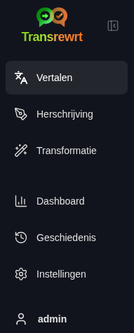
    </td>
    <td valign="top">
      <br/><br/>
      <ul>
        <li><strong>Vertalen</strong> opent de vertaalwerkruimte.</li><br/>
        <li><strong>Herschrijven</strong> opent de herschrijfwerkruimte.</li><br/>
        <li><strong>Transformeren</strong> opent de werkruimte voor aangepaste prompts.</li><br/>
        <li><strong>Dashboard</strong> toont gebruik en kosteninformatie.</li><br/>
        <li><strong>Instellingen</strong> opent het instellingenpaneel.</li><br/>
        <li><strong>Geschiedenis</strong> toont de gebruiks geschiedenis met de invoer- en uitvoertekst.</li><br/>
        <li><strong>Gebruiker</strong> toont de gebruikersnaam van de ingelogde gebruiker (alleen op het web).</li>
      </ul>
    </td>
  </tr>
</table>

<br/>

<a id="toolbar"></a>
### Werkbalk

De werkbalk verandert licht, afhankelijk van waar u zich in de app bevindt.

- Links wordt de naam van de huidige pagina weergegeven.
- Rechts ziet u de **voorkeuze- of modelselector** en de bediening voor **Interface taal**.

In **Eenvoudige** modus toont de werkbalk een **voorkeuzeselector** met de ingebouwde voorkeuzes **Gratis (OpenRouter)**, **Standaard**, **Geavanceerd** en **Technisch**. Welke voorkeuzes worden weergegeven, is afhankelijk van de **Leverancier** die u hebt gekozen in [**Instellingen** > **Algemene instellingen**](#general-settings)—bijvoorbeeld wordt **Gratis (OpenRouter)** alleen weergegeven wanneer de leverancier OpenRouter is. Als de **Leverancier** **Ollama** is, toont de werkbalk uw geïnstalleerde lokale modellen in plaats van voorkeuzes.

In **Geavanceerde** modus kunt u met de **modelselector** kiezen welke AI-engine u voor de huidige taak wilt gebruiken.

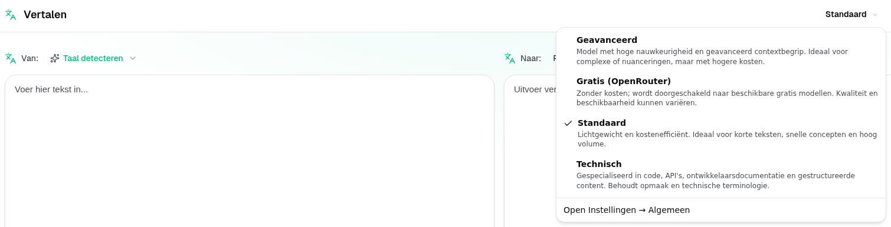

In Geavanceerde modus zijn sommige gratis modellen mogelijk niet altijd beschikbaar — ze kunnen offline zijn of een gebruikslimiet hebben bereikt. De app kan dat model automatisch uit uw lijst verwijderen. Om te bepalen welke modellen worden weergegeven, gaat u naar [**Instellingen** > **Modellen**](#models). U kunt de modelinstellingen openen via het leverancierspictogram links van de modelnaam in de werkbalk.

<br/>

Het **globe-icoon + taalcode** verandert de taal van de app-interface, zoals menu's en knoppen. Het verandert **niet** de vertaaltalen die worden gebruikt in **Vertalen**.

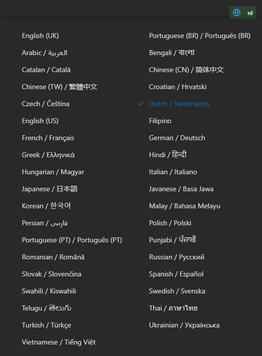

<br/>

<a id="input-and-output-panels"></a>
### Invoer- en uitvoerpanelen

De meeste werkruimten gebruiken een linker **Invoer**-paneel en een rechter **Uitvoer**-paneel.

Elk paneel toont ook:

| **Invoer**                                                          | **Uitvoer**                                                                                                                  |
|--------------------------------------------------------------------|-----------------------------------------------------------------------------------------------------------------------------|
| - Aantal tekens <br/>- Aantal woorden <br/>- Aantal alinea's   <br/> | - Hoe lang de taak duurde<br/>- **TPS** (tokens per seconde)<br/>- Aantallen tekens, woorden en alinea's<br/>- Het gebruikte model |

Als u zich afvraagt wat de technische termen betekenen:

- **Token** betekent een klein stukje tekst. U kunt dit zien als een deel van een woord of een kort woord.
- **TPS** betekent hoeveel van die tekststukjes het model per seconde verwerkt.

<br/>

U kunt ook de kosten van elke bewerking (indien beschikbaar) en de totale kosten volgen, door de optie `Show cost information on the actions` in te schakelen bij [**Instellingen** > **Algemene instellingen**](#general-settings).

<br/><br/>

[--------------------------------------------------------------------------------------------------------------------------]: #

<a id="translate"></a>
## Vertalen

Gebruik **Vertalen** wanneer u tekst van de ene taal naar de andere wilt omzetten.

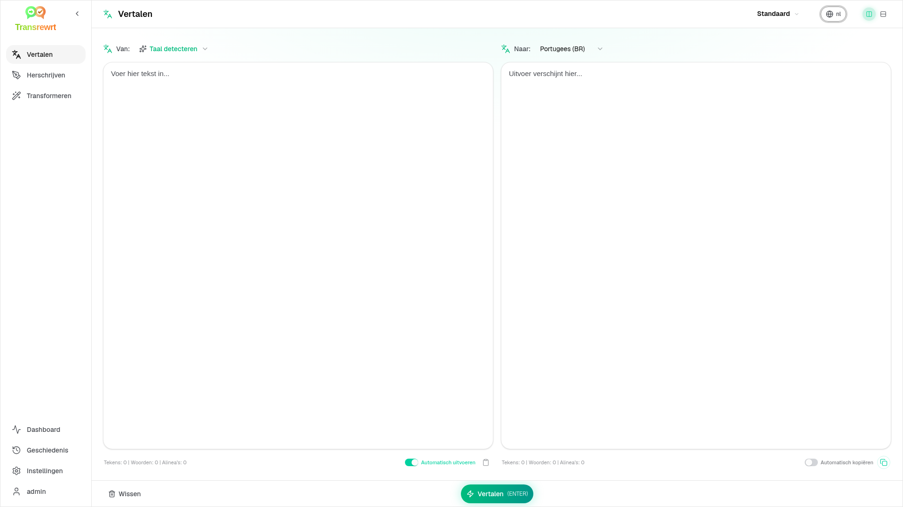

<br/>

<a id="translate-text"></a>
### Tekst vertalen

1. Open **Vertalen**.
2. Kies een taal in **Van**.
3. Kies een taal in **Naar**.
4. Kies een voorkeuze (Eenvoudig) of model (Geavanceerd) in de werkbalk.
5. Typ of plak tekst in **Invoer**.
6. Klik op **Vertalen**.
7. Lees het resultaat in **Uitvoer**.
8. Gebruik de kopieerknop als u het resultaat wilt kopiëren.

<br/>

<a id="language-selection"></a>
### Taalkeuze

- **Van** kan een specifieke taal zijn of **Taal detecteren**.
- **Naar** is de taal waarin u het resultaat wilt ontvangen.

Uw geselecteerde **Top talen** verschijnen bovenaan de lijst. U kunt deze instellen in [**Instellingen** > **Talen**](#languages).

<br/>

<a id="helpful-translation-settings"></a>
### Handige vertaalinstellingen

In [**Instellingen** > **Algemene instellingen**](#general-settings) kunt u aanpassen hoe vertalen werkt:

- **Automatisch vertalen bij plakken** voert een vertaling uit zodra u tekst plakt.
- **Resultaat automatisch kopiëren naar klembord** kopieert het resultaat automatisch na een succesvolle uitvoering.
- **Vertaling in realtime (tijdens het typen)** voert vertalingen uit terwijl u typt.
- **Time-out (ms)** bepaalt hoe lang de app wacht voordat een realtimevertaling wordt uitgevoerd.
- **Gedrag voor ENTER** bepaalt wat er gebeurt wanneer je op `Enter` drukt:
  - **Enter** voert vertalen of herschrijven uit (standaard).
  - **Shift + Enter** voert vertalen of herschrijven uit; gewone **Enter** voegt een nieuwe regel in.

[--------------------------------------------------------------------------------------------------------------------------]: #

<a id="rewrite"></a>
## Herschrijven

Gebruik **Herschrijven** wanneer u de formulering wilt verbeteren zonder de hoofdbetekenis te veranderen.

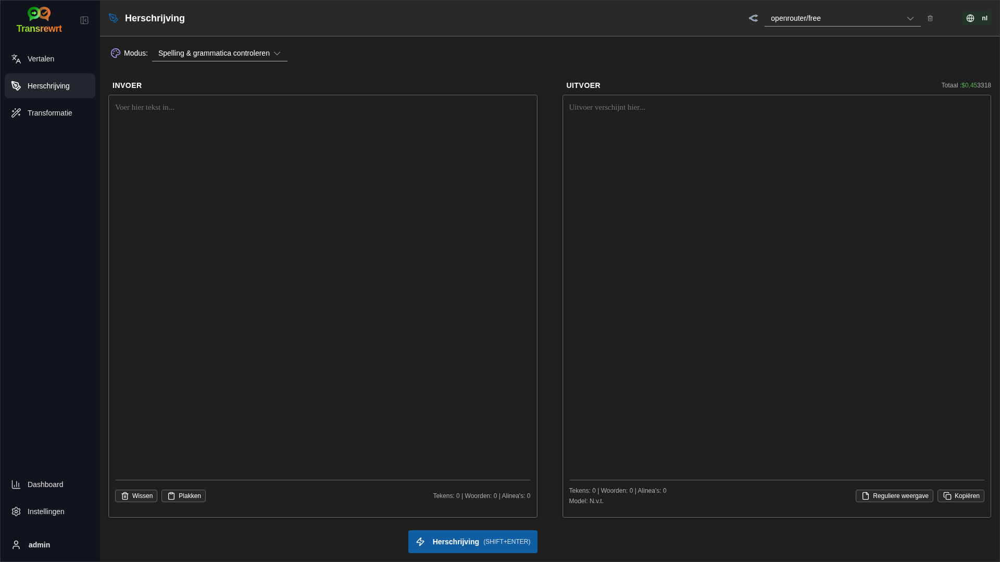

Dit is handig voor:

- spelling en grammatica corrigeren (**Controleer spelling en grammatica**)
- tekst duidelijker maken (**Duidelijkheid verbeteren**)
- verschillende distincte herformuleringen in één run (**Alternatieve versies**)
- tekst formeler of informeler maken (**Formeler maken** / **Informeler maken**)
- tekst inkorten of uitbreiden (**Verminderen** / **Uitbreiden**)
- tekst technischer maken (**Technischer maken**)

<br/>

> 💡 **TIP**<br/>
> Wanneer u de modus "**Controleer spelling en grammatica**" gebruikt, verschijnt er een schakelaar **Wijzigingen weergeven** in het uitvoerpaneel (naast **Kopiëren**).
> Schakel deze in of uit om de specifieke correcties in uw tekst te tonen of te verbergen.

<br/><br/>

[--------------------------------------------------------------------------------------------------------------------------]: #

<a id="transform"></a>
## Transformeren

Gebruik **Transformeren** wanneer u wilt dat de AI een aangepaste set instructies volgt.

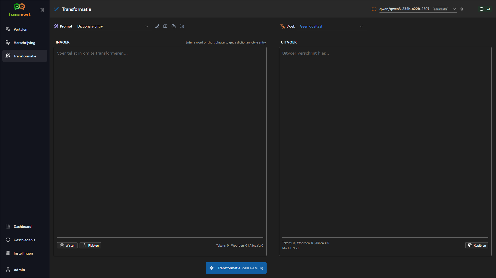

Dit is het meest flexibele gedeelte van de app. U kunt het gebruiken voor taken zoals:

- notities samenvatten
- ruwe tekst omzetten in een verzorgde e-mail
- belangrijke punten extraheren
- tekst omzetten naar een specifiek formaat
- elke andere aangepaste taak met de invoertekst

<br/>

<a id="run-an-existing-prompt"></a>
### Een bestaande prompt uitvoeren

1. Open **Transform**.
2. Kies een prompt uit de promptlijst.
3. Als er een **Doel**-taalvak verschijnt, kies dan een taal als u dat wilt.
4. Typ tekst of plak deze in **Invoer**.
5. Klik op **Transformeren**.
6. Lees het resultaat in **Uitvoer**.

<br/>

<a id="if-you-have-no-prompts-yet"></a>
### Als u nog geen prompts hebt

Als uw promptlijst leeg is, klikt u op **Voorbeeldvragen laden** in de Transformeer-werkruimte. Dezelfde optie is altijd beschikbaar in [**Instellingen** > **Transformeren**](#transform-settings) op de regel exporteren/importeren. Beide voegen ingebouwde voorbeelden toe, zodat u snel kunt beginnen.

<br/>

> ℹ️ **OPMERKING**<br/>
> Voorbeeldprompts worden in het Engels geleverd. Nadat u ze hebt geladen, kunt u een prompt bewerken en **Vraag vertalen** gebruiken om deze naar uw taal te vertalen.

<br/>

<a id="create-a-prompt-quickly"></a>
### Snel een prompt aanmaken

De snelste manier om een prompt aan te maken is:

1. Klik op **Nieuwe prompt**.
2. Klik op **Prompt genereren**.
3. Beschrijf wat u wilt dat de prompt doet.
4. Kies een voorkeuze (Eenvoudig) of model (Geavanceerd).
5. Laat de app een concept voor u maken.
6. Controleer het concept en klik op **Opslaan**.

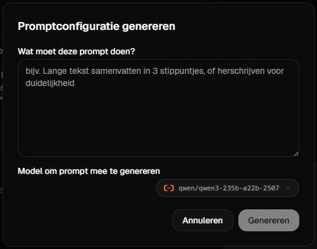

<br/>

<a id="edit-a-prompt"></a>
### Een prompt bewerken

Wanneer u een prompt aanmaakt of bewerkt, verschijnt de editor aan de linkerkant en een testgebied aan de rechterkant.

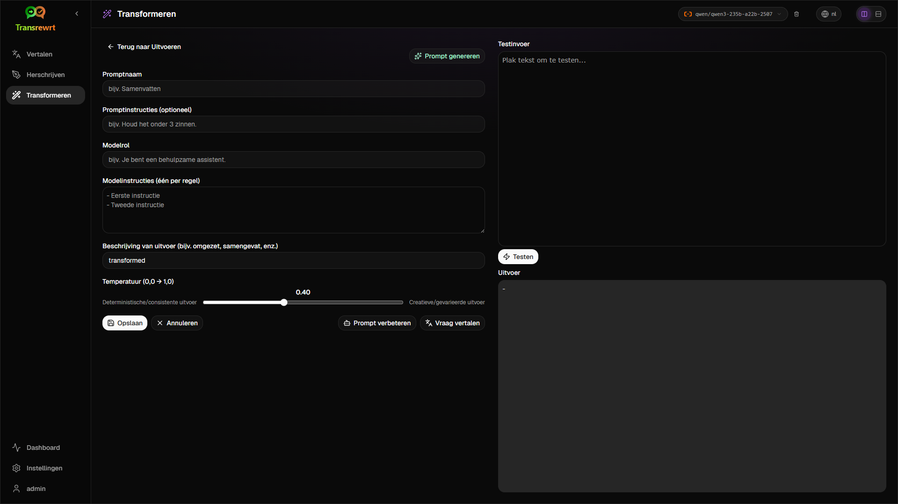

De belangrijkste velden zijn:

- **Promptnaam**: de naam die wordt weergegeven in de promptlijst.
- **Promptinstructies (optioneel)**: een korte hint die aan de gebruiker wordt getoond bij het uitvoeren van de prompt.
- **Modelrol**: de algemene rol die aan de AI wordt toegewezen, zoals 'Je bent een behulpzame assistent.'
- **Modelinstructies (één per regel)**: de specifieke regels die de AI moet volgen.
- **Uitvoerbeschrijving**: een kort woord dat het resultaat beschrijft, zoals 'samenvatting' of 'herschrijven'.
- **Temperatuur (0,0 → 1,0)**: hoe het model zich zal gedragen; zie hieronder.
- **Vraag om doeltaal**: voegt een doeltaalkeuze toe wanneer de prompt wordt uitgevoerd.

Als de technische term **Temperatuur** nieuw voor u is, kunt u er als volgt over denken:

- Een **lagere** temperatuur geeft stabielere, voorspelbaardere resultaten.
- Een **hogere** temperatuur geeft meer variatie en creativiteit.

U kunt ook gebruiken:

- `Generate prompt` om een nieuw concept te maken op basis van een eenvoudige beschrijving
- `Improve prompt` om een bestaande prompt te verbeteren
- `Translate prompt` om de velden van de prompt te vertalen

<br/>

> ⚠️ **WAARSCHUWING**<br/>
> Klik op `Save` voordat u op `Back to Run` klikt. Als u teruggaat zonder op te slaan, gaan uw wijzigingen verloren.

<br/>

<a id="test-a-prompt-before-using-it"></a>
### Een prompt testen voordat u deze gebruikt

Het testpaneel aan de rechterkant stelt u in staat om uw prompt te testen met voorbeeldtekst voordat u deze gebruikt in uw dagelijkse werk.

Dit is handig wanneer:

- u een nieuwe prompt aan het bouwen bent
- u twee versies van een prompt met elkaar vergelijkt
- u de toon, lengte of uitvoerformaat wilt controleren

<br/>

> ℹ️ **OPMERKING**<br/>
> U kunt opgeslagen prompts exporteren en importeren in [**Instellingen** > **Transformeren**](#transform-settings).

Wanneer u **Prompt genereren**, **Prompt verbeteren** of **Prompt vertalen** gebruikt in de prompt-editor, biedt **Eenvoudige** modus dezelfde voorkeuzekeuze als bij Vertalen en Herschrijven; **Geavanceerde** modus gebruikt de modellenlijst.

<br/><br/>

[--------------------------------------------------------------------------------------------------------------------------]: #

<a id="dashboard"></a>
## Dashboard

Gebruik **Dashboard** om te zien hoeveel u de app gebruikt en wat dit kost (voor betaalde modellen).

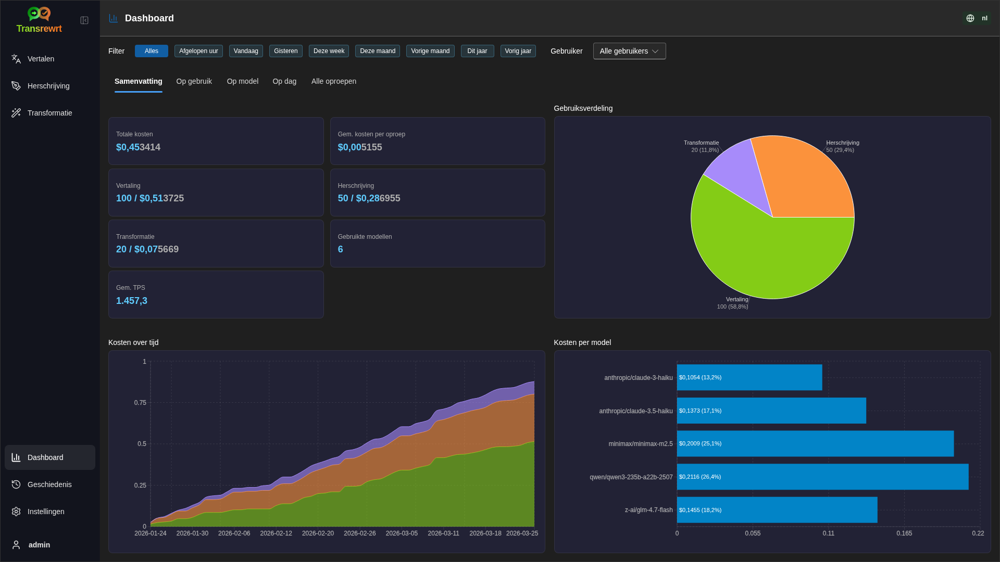

<br/>

> ℹ️ **OPMERKING**<br/>
> Als u alleen **gratis** modellen gebruikt, kunnen de **kosten** nul zijn en kunnen KPI's die gericht zijn op kosten leeg lijken. Het tabblad **Samenvatting** toont nog steeds het aantal oproepen voor vertalen, herschrijven en transformeren wanneer er activiteit is in de geselecteerde periode.

<br/>

<a id="filter-the-data"></a>
### Filter de gegevens

Gebruik de filterknoppen bovenaan om het tijdsbereik te wijzigen.

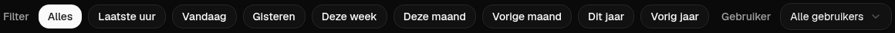

<br/>

> ℹ️ **OPMERKING**<br/>
> De filter **Gebruiker** is alleen zichtbaar voor beheerders in de webversie. Gewone gebruikers zien dit filter niet en het is niet beschikbaar in de desktopapp.

<br/>

<a id="dashboard-tabs"></a>
### Dashboard-tabbladen

- **Samenvatting** toont KPI-kaarten: totale kosten, gebruikte modellen, oproepaantallen en kosten per modus (met aandeel van totale oproepen), gemiddelde kosten per oproep, gemiddelde TPS en de drie meest gebruikte modellen op basis van oproepaantal.
- **Op model** geeft een lijst van elk model met totaal aantal oproepen, totale kosten en gemiddelde TPS; vouw een rij uit voor een detailweergave per vertalen, herschrijven en transformeren.
- **Alle oproepen** toont het volledige oproeplogboek (gepagineerd op brede lay-outs, kaarten op smalle schermen) en stelt u in staat dit te exporteren.

<br/>

<a id="export-data"></a>
### Gegevens exporteren

De dashboardtabellen kunnen gegevens exporteren in:

- **JSON**
- **CSV**
- **XLSX**

Dit is handig als u activiteiten buiten de app om wilt bekijken of een rapport wilt delen.

<br/>

<a id="delete-stored-records-for-a-model"></a>
### Verwijder opgeslagen records voor een model

In **Op model** of **Alle oproepen** kunt u opgeslagen records voor een model verwijderen door op het prullenbakpictogram te klikken.

> ⚠️ **WAARSCHUWING**<br/>
> Verwijderen van opgeslagen records kan niet ongedaan worden gemaakt. Gebruik dit alleen als u zeker weet dat u die geschiedenis niet langer nodig hebt.

Om alle gegevens te verwijderen of records te verwijderen op basis van hun leeftijd, gaat u naar [**Instellingen** > **Kostenregistratie**](#cost-tracking). Daar vindt u opties om alle opgeslagen gegevens of alleen gegevens die ouder zijn dan een bepaalde datum te verwijderen.

<br/><br/>

[--------------------------------------------------------------------------------------------------------------------------]: #

<a id="history"></a>
## Geschiedenis

Klik op **Geschiedenis** om de geschiedenis van uw acties binnen **Transrewrt** te bekijken, inclusief de invoer en uitvoer van elke bewerking.

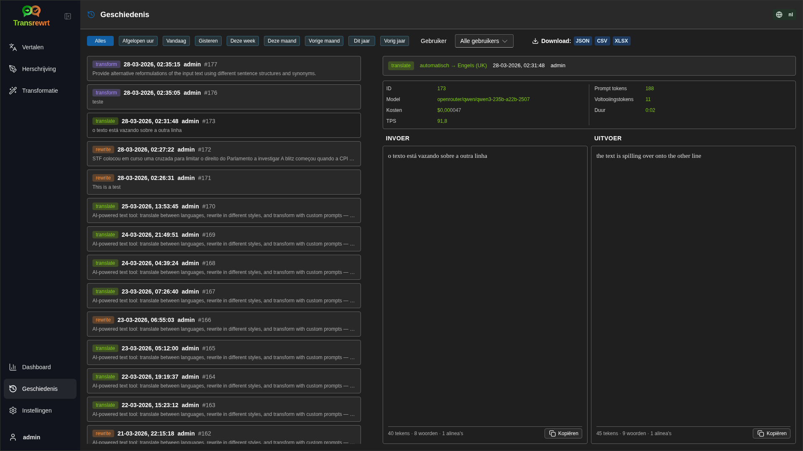

<br/>

<a id="filter-the-history"></a>
### Geschiedenis filteren

**Geschiedenis** gebruikt dezelfde tijdsbereikfilters als de pagina **Dashboard**.


<br/>

> ℹ️ **OPMERKING**<br/>
> In de **webapp** ziet iedereen (inclusief beheerders) alleen hun eigen uitvoeringsgeschiedenis. Het **Gebruiker**-filter op **Dashboard** is bedoeld voor beheerders om gebruik en kosten per account te bekijken; dit heeft geen invloed op **Geschiedenis**.

<br/>

<a id="export-history-data"></a>
###  Geschiedenisgegevens exporteren

De geschiedenispagina kan de gefilterde gegevens exporteren in:

- **JSON**
- **CSV**
- **XLSX**

Dit is handig als u activiteiten buiten de app om wilt bekijken of een rapport wilt delen.

<br/><br/>

[--------------------------------------------------------------------------------------------------------------------------]: #

<a id="settings"></a>
## Instellingen

Open **Instellingen** in de zijbalk om aan te passen hoe de app zich gedraagt.

De beschikbare tabbladen zijn afhankelijk van het platform en uw rol:

| Tab | Desktop | Web (beheerder) | Web (reguliere gebruiker) | Notities |
|------------------|:-------:|:-----------:|:------------------:|----------------------------------------------|
| Algemene instellingen | ja | ja | ja | Inclusief **AI-ervaring** (Eenvoudig / Geavanceerd) |
  | Modellen | ja | ja | ja | Alleen wanneer **AI-ervaring** **Geavanceerd** is |
  | Talen         |   ja   |     ja     |        ja         | |
  | Kostenregistratie     |   ja   |     ja     |         -          | |
  | Transformeren         |   ja   |     ja     |        ja         | Bulkimport/export van transformeerprompts |
  | Gebruikers             |    -    |     ja     |         -          | |
  | API-configuratie        |   ja   |     ja     |         -          | |
  | Over             |   ja   |     ja     |        ja         | |

In **Eenvoudige** modus gebeurt modelselectie via voorkeuzes in de werkbalk en **Leverancier** in Algemene instellingen; het tabblad **Modellen** is verborgen.

<br/>

> ℹ️ **OPMERKING**<br/>
> In de webversie heeft elke gebruiker zijn eigen configuratie. Instellingen zoals AI-ervaring, leverancier, geselecteerde modellen of voorkeuzes, talen, algemene opties en transform prompts worden per gebruiker opgeslagen. Wijzigingen die u aanbrengt, hebben geen invloed op andere gebruikers.

<br/>

[--------------------------------------------------------------------------------------------------------------------------]: #

<a id="general-settings"></a>
### Algemene instellingen

Gebruik **Algemene instellingen** om het typgedrag te beheren, of uitvoeringsdetails worden opgeslagen voor **Geschiedenis**, de weergave en hoe u de AI kiest voor Vertalen, Herschrijven en Transformeren.

**AI-ervaring**

- **Eenvoudig** (standaard): kies een **Leverancier** (OpenRouter, OpenAI, Anthropic, Google Gemini, DeepSeek, Groq, Mistral, xAI, Cerebras of Ollama). Cloudleveranciers gebruiken de ingebouwde voorkeuzes in de werkbalk. **Ollama** geeft modellen weer die op uw machine zijn geïnstalleerd, in plaats van voorkeuzes. In Eenvoudige modus toont **Catalogus met voorkeuzes** de catalogusversie en de tijd van de laatste update; klik op **Vernieuw catalogus met voorkeuzes** om de nieuwste lijst met voorkeuzes op te halen uit de opslagplaats van het project (de app controleert ook periodiek op de achtergrond). 
- **Geavanceerd**: kies afzonderlijke modellen in de werkbalk; beheer de lijst onder [**Instellingen** > **Modellen**](#models).

In de **webapp** hangt welke leveranciers worden weergegeven af van de API-sleutels die zijn ingesteld in de serveromgeving. In de **desktopapp** configureert u sleutels onder [**API-configuratie**](#api-config).

**Gedrag**

- **Gedrag voor ENTER** kiest of `Enter` de taak uitvoert of een nieuwe regel invoegt.
- **Automatisch vertalen bij plakken** start de vertaling zodra u tekst plakt.
- **Resultaat automatisch kopiëren naar klembord** kopieert succesvolle resultaten automatisch.
- **Vertaling in realtime (tijdens het typen)** vertaalt terwijl u typt.
- **Time-out (ms)** stelt de wachttijd in voor realtimevertaling.

**Geschiedenis**

- **Voeringsgeschiedenis bijhouden** bepaalt of elke vertaling, herschrijving en transformatie de **invoer- en uitvoertekst** opslaat voor de zijbalkweergave [**Geschiedenis**](#history). Uitschakelen vraagt om bevestiging; als u bevestigt, wordt de opgeslagen geschiedenistekst uit de database verwijderd. Als het label *uitgeschakeld door de beheerder* toont, is `HISTORY_DISABLED` ingesteld in de omgeving (zie de [README](README.nl.md#configuration-and-environment)); u kunt de geschiedenis dan niet opnieuw inschakelen via de gebruikersinterface.
- **Verwijder geschiedenisgegevens** stelt u in staat opgeslagen tekst te verwijderen op basis van leeftijd (bijvoorbeeld ouder dan een paar maanden, of **alle gegevens (wissen)**) met behulp van **Verwijder gegevens**. Dit heeft alleen invloed op de opgeslagen uitvoertekst voor de **Geschiedenis**-weergave; het verwijdert **niet** de kosten- of gebruikstotalen. Gebruik [**Instellingen** > **Kostenregistratie**](#cost-tracking) om **kosten**-gegevens te verwijderen of inkorten.

**Weergave**

- **Thema** schakelt tussen lichte, donkere en systeemweergave.
- **Toon kosteninformatie bij de acties** controleert de weergave van de kosten per operatie (indien beschikbaar) en de totale kosten op de uitvoerpanelen van Vertalen, Herschrijven en Transformeren.
- **Kostenfractie cijfers** verandert hoe kosten decimalen worden weergegeven.
- **Alleen web:** **toon een marge rond de app** voegt extra ruimte rond de interface toe.
- **Lettertype** verandert het schrijflettertype in de tekstpanelen.
- **Grootte** verandert de lettergrootte.

**Configuratieback-up** (alleen desktop app en webbeheerders)

- **Neem gebruiksgegevens op in de back-up** - als dit is ingeschakeld, bevat het ZIP-bestand ook uitvoeringsgeschiedenis en API-aanroepgegevens. 
- **Back-up configuratie** - maakt één ZIP-bestand (standaard `transrewrt-config-backup-YYYY-MM-DD_HHMMSS.zip` in UTC) met `config.json`, `state.json`, optionele versleutelingssleutel, gebruikers, voorkeuren, aangepaste prompts en gebruiksgegevens indien u hiervoor hebt gekozen. Na een succesvolle back-up wordt de bestandsnaam van het opgeslagen bestand weergegeven.
- **Herstel vanuit back-up** - opent eerst een **bevestigingsvenster**. Kies het back-up ZIP-bestand in het venster (**Bladeren** / bestandskiezer of slepen en neerzetten waar ondersteund), en controleer vervolgens de opties:
  - **Gebruiksgegevens herstellen** - importeert gebruik/geschiedenis uit het ZIP-bestand wanneer deze is gemaakt met inbegrip van gebruiksgegevens; laat uitgeschakeld als u alleen instellingen en prompts wilt.
  - **Verwijder de oude gebruiksgegevens voordat u herstelt** - verwijdert bestaande gebruik/geschiedenis op deze installatie voordat de back-up wordt toegepast (optioneel; gebruik wanneer u een schone vervanging wilt).

Back-ups die zijn gemaakt in de web- of desktopversie kunnen worden hersteld in de andere versie. Bij het herstellen van een desktopback-up in de webversie worden de gegevens hersteld voor de beheerdergebruiker.

<br/>

<a id="models"></a>
### Modellen

Dit tabblad is alleen beschikbaar wanneer **AI-ervaring** is ingesteld op **Geavanceerd** in [**Algemene instellingen**](#general-settings). Gebruik **Instellingen** > **Modellen** om te kiezen welke modellen in de werkbalk verschijnen.

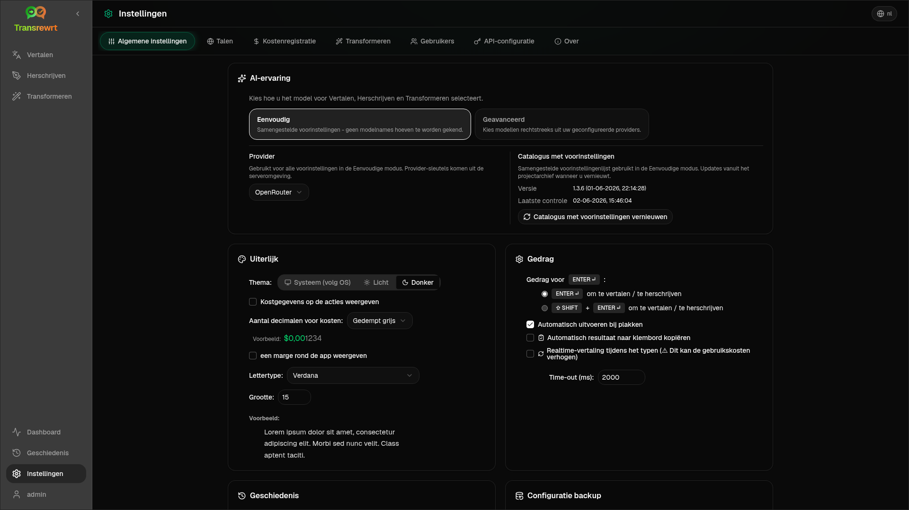

De pagina bevat twee lijsten:

- **Beschikbare modellen** aan de linkerkant
- **Geselecteerde modellen** aan de rechterkant

Handige bedieningselementen zijn:

- **Zoek modellen...** om een model te vinden op naam
- **Leverancier**-chips om de lijst te beperken tot één engine (OpenRouter, OpenAI, Ollama, …)
- **Alleen gratis** om alleen gratis modellen weer te geven
- **Vernieuwen** om de lijst opnieuw te laden
- **Alles uitvouwen** en **Alles inklappen** wanneer u sorteert op leverancier

Model-id's bevatten het leveranciersvoorvoegsel (bijvoorbeeld `openrouter/…` versus `openai/…`). Badge's zoals **OpenAI (OpenRouter)** versus **OpenAI (direct)** geven aan hoe het verkeer wordt doorgestuurd.

> ℹ️ **OPMERKING**<br/>
> **OpenRouter Body Builder** (`openrouter/bodybuilder`) is een routermodel, geen algemeen chatmodel: het antwoord is JSON die OpenRouter API-aanvraagbodies beschrijft (bijvoorbeeld een `requests`-array met `model` en `messages`). Als u dit gebruikt voor **Vertalen**, **Herschrijven** of **Transformeren**, toont het uitvoervenster deze JSON in plaats van afgewerkt tekst. Kies een normaal tekstmodel voor deze taken. Zie de [pagina van het Body Builder-model](https://openrouter.ai/openrouter/bodybuilder) op OpenRouter.

Acties:

- Klik op **Toevoegen** of ergens in de vermelding om een model toe te voegen.

- Klik op **X** ernaast in **Geselecteerde modellen** of op **Geselecteerd** in de vermelding onder Beschikbare modellen om een model te verwijderen.

- Klik op **Alles deselecteren** om de lijst te wissen. Het vereiste gratis model blijft in de lijst staan.

<br/>

> ℹ️ **OPMERKING**<br/>
> Als u geen credits aan OpenRouter wilt toevoegen, schakel dan eerst **Alleen gratis** in en kies de gratis modellen (geen creditcard vereist). U kunt ook Ollama gebruiken om modellen lokaal uit te voeren zonder API-sleutel.

<br/>

<a id="languages"></a>
### Talen

Gebruik **Instellingen** > **Talen** om de talenlijsten in de app te beheren.

- **Top talen** worden bovenaan de talenlijsten in **Vertalen** en **Transformeren** vastgemaakt.
- **Aangepaste taal** stelt u in staat een taal toe te voegen die niet in de ingebouwde lijst staat.

Als u een aangepaste taal toevoegt, verschijnt deze in de taalkeuzemenu's naast de ingebouwde opties.

<br/>

<a id="cost-tracking"></a>
### Kostenregistratie

Gebruik **Instellingen** > **Kostenregistratie** om kosteninformatie te beheren.

- **Totale kosten** toont het lopende totaal.
- **Waarde kopiëren** kopieert het totaal naar het klembord.
- **Kosten resetten** zet het opgeslagen totaal terug naar nul.
- **Synchroniseren met API-sleutelgebruik** stelt het totaal gelijk aan het gebruik dat wordt gerapporteerd door uw OpenRouter-account (alleen OpenRouter).
- **API-sleutelgebruik** toont OpenRouter-gebruiksgegevens, indien beschikbaar.
- **Verwijder kostengegevens** verwijdert alle gegevens, of alleen vermeldingen ouder dan een geselecteerde datum.

**Kostenregistratie:** Wanneer u OpenRouter-modellen gebruikt, toont de app uw werkelijke gebruik en uitgaven op basis van kosteninformatie van OpenRouter. Voor alle andere leveranciers schat de app kosten aan de hand van prijzen die door OpenRouter worden gepubliceerd; als een prijs niet beschikbaar is, kan de schatting nul zijn.

<br/>

> ℹ️ **OPMERKING**<br/>
>  **Alle kostenbedragen zijn schattingen ter informatie en geen officiële factureringsoverzichten.**

<br/>

> ⚠️ **WAARSCHUWING**<br/>
> Gegevensverwijdering kan niet ongedaan worden gemaakt. Zorg ervoor dat u uw gegevens back-upt of exporteert via [**Geschiedenis**](#history) 
> of [**Dashboard** > **Alle oproepen**](#dashboard-tabs), voordat u verwijdert, anders gaan ze permanent verloren. 
> Alle invoer-/uitvoergeschiedenis gerelateerd aan elke API-aanroepvermelding wordt ook verwijderd.

<br/>

<a id="transform-settings"></a>
### Transformeren (instellingen tabblad)

Gebruik **Instellingen** > **Transformeren** om prompts in bulk te beheren.

U kunt:

- uw opgeslagen prompts bekijken
- prompts verwijderen
- prompts importeren uit een bestand
- prompts exporteren voor back-up of delen
- voorbeeldvragen laden naar de promptlijst

<br/>

<a id="users"></a>
### Gebruikers

Gebruik **Gebruikers** om gebruikersaccounts te beheren in de webversie. U kunt gebruikers toevoegen, hun gegevens bijwerken, wachtwoorden opnieuw instellen en accounts verwijderen.

<br/>

<a id="api-config"></a>
### API-configuratie

De ondersteunde leveranciers zijn: OpenRouter, OpenAI, Anthropic, Google Gemini, DeepSeek, Groq, Mistral, xAI, Cerebras, en **Ollama** (lokale modellen via een basis-URL). U hoeft alleen de leveranciers te configureren die u gebruikt.

**Webapplicatie: alleen beheerder**

API-sleutels worden geconfigureerd via systeem- of Docker-omgevingsvariabelen – ze worden niet ingevoerd in de web-UI. Op deze pagina ziet u welke leveranciers een sleutel geconfigureerd hebben en kunt u elke leverancier testen door op de knop `Test` te klikken.

<br/>

> ℹ️ **OPMERKING**<br/>
> Om een API-sleutel te wijzigen, moet u de omgevingsvariabele in uw systeem- of Docker-configuratie bijwerken en de server of container opnieuw starten.

<br/>

> ℹ️ **OPMERKING**<br/>
> **Configuratieback-ups** (zie [**Algemene instellingen** → Configuratieback-up](#general-settings)) kunnen **gebruikte** provider-sleutels insluiten in het `config.json` van de ZIP. Bij het herstellen van die ZIP worden deze sleutels **niet** teruggekopieerd naar het persistente configuratiebestand van de server – actieve sleutels komen nog steeds uit de omgeving en de bestaande bestandsstatus zoals daar beschreven.

<br/>

**Bureaubladapplicatie**

Gebruik **API-configuratie** om API-sleutels op te slaan voor elke leverancier die u gebruikt. Voor Ollama voert u in plaats van een API-sleutel de **basis-URL** in.

<br/>

> 💡 **Tip** <br/>
> Als u geen API-sleutel wilt gebruiken of geen kosten wilt maken, kunt u [Ollama downloaden](https://ollama.com) en modellen (zoals `translategemma:4b`) gratis lokaal op uw machine uitvoeren. U kunt ook een gratis OpenRouter-account aanmaken (zonder creditcard) om hun gratis modellen te gebruiken, of een gratis API-sleutel verkrijgen van Cerebras, Google, Groq of Mistral AI.

<br/>

- Voeg alleen de leveranciers toe die u nodig hebt. In **Instellingen** > **Modellen** begint elk model-ID met de leverancier (bijvoorbeeld `openrouter/openrouter/free`, `openai/gpt-4o`, `ollama/llama3`).

Om een API-sleutel toe te voegen, voert u de waarde in het tekstvak in en klikt u op `Save`. Om een bestaande sleutel te vervangen, klikt u op `Edit`. Om te controleren of een sleutel werkt, klikt u op `Test`. Voor de Ollama-basis-URL klikt u altijd op `Test` om de verbinding te controleren.

<br/>

> ℹ️ **OPMERKING**<br/>
> U kunt de huidige waarde van een API-sleutel niet zien. U kunt deze alleen vervangen met behulp van de knop `Edit`.
> API-sleutels worden versleuteld opgeslagen in de configuratie.

<br/>

<a id="about"></a>
### Over

Het tabblad **Over** toont:

- de app naam en tagline
- het versienummer en de builddatum
- licentie- en auteursrechtinformatie, met een link om **Mededelingen van derden** te openen
- een link naar de projectopslagplaats

<br/><br/>

<a id="common-issues"></a>
## Veelvoorkomende problemen

Als iets niet werkt zoals verwacht, controleer dan eerst de volgende punten.

<br/>

<a id="the-app-will-not-translate-rewrite-or-transform-text"></a>
### De app vertaalt, herschrijft of transformeert geen tekst

Controleer het volgende:

- u hebt een **voorkeuze** (Eenvoudig) of **model** (Geavanceerd) geselecteerd in de werkbalk
- in **Eenvoudige** modus heeft [**Instellingen** > **Algemene instellingen**](#general-settings) een **Leverancier** met een werkende sleutel (of Ollama-URL) en minstens één voorkeuze voor die leverancier
- in **Geavanceerde** modus is minstens één model opgenomen in [**Instellingen** > **Modellen**](#models)
- uw API-instelling werkt

Als u de desktopapp gebruikt:

1. Open [**Instellingen** > **API-configuratie**](#api-config).
2. Controleer of minstens één API-sleutel is opgeslagen.
3. Klik op **Testen** naast de leverancier om te bevestigen dat de sleutel werkt.

<br/>

<a id="the-model-list-is-empty"></a>
### De modellenlijst is leeg

In **Eenvoudige** modus opent u [**Instellingen** > **Algemene instellingen**](#general-settings), bevestigt u dat **Leverancier** is ingesteld en voegt u sleutels toe of test u deze in [**API-configuratie**](#api-config) (desktop) of vraag u uw beheerder (web). Voor **Ollama** voert u **Testen** uit op de basis-URL en zorgt u ervoor dat modellen lokaal zijn geïnstalleerd.

In **Geavanceerde** modus opent u [**Instellingen** > **Modellen**](#models) en klikt u op **Vernieuwen**. Zoek indien nodig een model, schakel **Alleen gratis** in en voeg modellen toe aan **Geselecteerde modellen**.

<br/>

<a id="the-result-is-too-slow-or-too-expensive"></a>
### Het resultaat is te traag of te duur

Probeer een of meer van de volgende opties:

- kies een andere voorkeuze (Eenvoudig) of model (Geavanceerd)
- gebruik een kortere invoer
- schakel **Real-time vertaling (tijdens het typen)** uit in [**Instellingen** > **Algemene instellingen**](#general-settings)
- gebruik gratis modellen voor eenvoudige taken (zie [Modellen](#models))

<br/>

<a id="the-interface-is-in-the-wrong-language"></a>
### De interface is in de verkeerde taal

Klik op het wereldbolpictogram in de [werkbalk](#toolbar) en kies uw gewenste **Interface taal**.

<br/>

<a id="the-text-is-too-small-or-hard-to-read"></a>
### De tekst is te klein of moeilijk leesbaar

Open [**Instellingen** > **Algemene instellingen**](#general-settings) en wijzig:

- **Lettertypefamilie**
- **Grootte**

<br/>

<a id="dashboard-summary-looks-empty"></a>
### Dashboard Samenvatting lijkt leeg

Dit is normaal als:

- u gebruikt alleen **gratis modellen** en u bekijkt **kosten**cijfers (deze kunnen nul zijn); KPI's voor aantal oproepen op **Samenvatting** hebben nog steeds gegevens nodig uit de geselecteerde periode
- het geselecteerde **tijdfilter** dekt niet de periode waarin oproepen zijn gemaakt — probeer **Alle** om te controleren

Als KPI's nog steeds nul zijn na het selecteren van **Alle**, controleer dan of oproepen verschijnen in [**Geschiedenis**](#history) of in het tabblad **Alle oproepen**.

<br/>

<a id="cost-shows-not-available-or-seems-wrong"></a>
### Kosten tonen "niet beschikbaar" of lijken onjuist

Wanneer u modellen via **OpenRouter** gebruikt, toont de app uw daadwerkelijke uitgaven zoals gerapporteerd door OpenRouter.

Voor **andere leveranciers** (OpenAI direct, Anthropic direct, enz.), worden de kosten geschat op basis van prijsinformatie gepubliceerd door OpenRouter. Als er geen overeenkomende prijs wordt gevonden voor een model, wordt de kostenweergave **niet beschikbaar** en wordt deze niet toegevoegd aan uw lopende totaal.

<br/>

<a id="total-cost-does-not-match-my-provider-bill"></a>
### Totale kosten komen niet overeen met mijn leveranciersfactuur

Alle kostenbedragen in de app zijn **schattingen ter informatie**, geen officiële factureringsoverzichten.

Om het totaal dichter bij uw werkelijke OpenRouter-uitgaven te brengen, opent u [**Instellingen** > **Kostenregistratie**](#cost-tracking) en klikt u op **Synchroniseren met API-sleutelgebruik**.

<br/>

<a id="the-history-page-is-missing-from-the-sidebar"></a>
### De geschiedenispagina ontbreekt in de zijbalk

**Voeringsgeschiedenis bijhouden** is mogelijk uitgeschakeld. Open [**Instellingen** > **Algemene instellingen**](#general-settings) en schakel dit in, tenzij geschiedenis *uitgeschakeld is door de beheerder* (`HISTORY_DISABLED` in de omgeving — zie de [README](README.nl.md#configuration-and-environment)). Het inschakelen van geschiedenis herstelt eerder verwijderde tekst niet.

<br/>

<a id="web-app-session-expired"></a>
### Webapp: onverwacht doorgestuurd naar de aanmeldpagina

Uw sessie is mogelijk verlopen. Meld u opnieuw aan. Als dit regelmatig gebeurt, controleer dan de serverconfiguratie voor instellingen van de sessieduur.

<br/>

<a id="web-admin-forgot-or-lost-a-password"></a>
### Webbeheerder: wachtwoord vergeten of kwijt

Dit is van toepassing op de **zelfgehoste webapp** (Docker), niet op de desktopapp (Electron).

- Als een andere beheerder nog kan aanmelden, kan deze [**Instellingen** > **Gebruikers**](#users) openen, het account kiezen en daar een **nieuw wachtwoord** instellen.
- Als u **uitgesloten bent** maar **shelltoegang** hebt tot de machine of container, reset dan het wachtwoord met de helper die bij de image wordt geleverd (vervang `transrewrt` als u de standaardnaam wijzigt, en plaats aanhalingstekens rond het wachtwoord als het spaties of speciale tekens bevat):

```bash
docker exec transrewrt reset-web-password '<username>' '<new-password>'
```

De standaard beheerdersgebruikersnaam is `admin` als u nooit andere accounts hebt aangemaakt. Wanneer u slechts één argument opgeeft, wordt dit beschouwd als het nieuwe wachtwoord voor `admin`.

Als u uit een **broncodecheckout** werkt in plaats van Docker, gebruik dan:

```bash
pnpm run reset-web-password -- <username> <new-password>
```

Het script werkt het gebruikersrecord bij in de SQLite-database (en kan de `admin`-gebruiker aanmaken als deze ontbreekt). Meld u na het opnieuw instellen aan met het nieuwe wachtwoord.

<br/>

<a id="dashboard-shows-no-data-for-other-users"></a>
### Dashboard toont geen gegevens voor andere gebruikers (web)

Alleen **beheerders** kunnen gegevens van alle gebruikers bekijken via het **Gebruiker**-filter. Regelmatige gebruikers zien standaard alleen hun eigen activiteit.

<br/>

<a id="i-changed-a-prompt-and-lost-the-edits"></a>
### Ik heb een prompt aangepast en de bewerkingen zijn verloren gegaan

Klik bij het bewerken van een prompt altijd op **Opslaan** voordat u op **Terug naar Uitvoeren** klikt.

<br/><br/>

<a id="quick-tips"></a>
## Snelle tips

- Begin met [**Vertalen**](#translate) om er zeker van te zijn dat uw installatie werkt, voordat u doorgaat naar [**Herschrijven**](#rewrite) of [**Transformeren**](#transform).
- Gebruik [**Herschrijven**](#rewrite) voor alledaagse verbeteringen van formuleringen.
- Gebruik [**Transformeren**](#transform) wanneer u een herhaalbare werkstroom nodig hebt voor een specifieke taak.
- Gebruik [**Dashboard**](#dashboard) als u gebruik en kosten in de gaten wilt houden.
- Gebruik [**Geschiedenis**](#history) om eerdere bewerkingen en hun volledige invoer-/uitvoertekst te bekijken.
- Exporteer prompts regelmatig als u een promptbibliotheek aan het opbouwen bent die u veilig wilt bewaren (zie [Transformeren](#transform)) of als u deze met anderen wilt delen.
- Blijf in **Eenvoudige** modus totdat u fijnmazige controle nodig hebt over model-ID's; schakel over naar **Geavanceerd** wanneer u al weet welke modellen u wilt.

<br/><br/>

<a id="disclaimer"></a>
## Disclaimer

Productnamen en pictogrammen behoren toe aan hun respectieve eigenaren en worden alleen gebruikt ter identificatie. Deze software is niet gelieerd aan of goedgekeurd door een van de genoemde merken.

<br/><br/>

<a id="license"></a>
## Licentie

Copyright © 2026 Waldemar Scudeller Jr.

[Apache License 2.0](../LICENSE)
