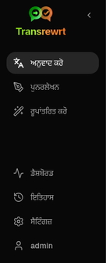
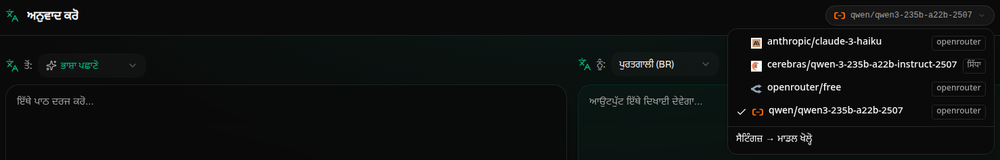
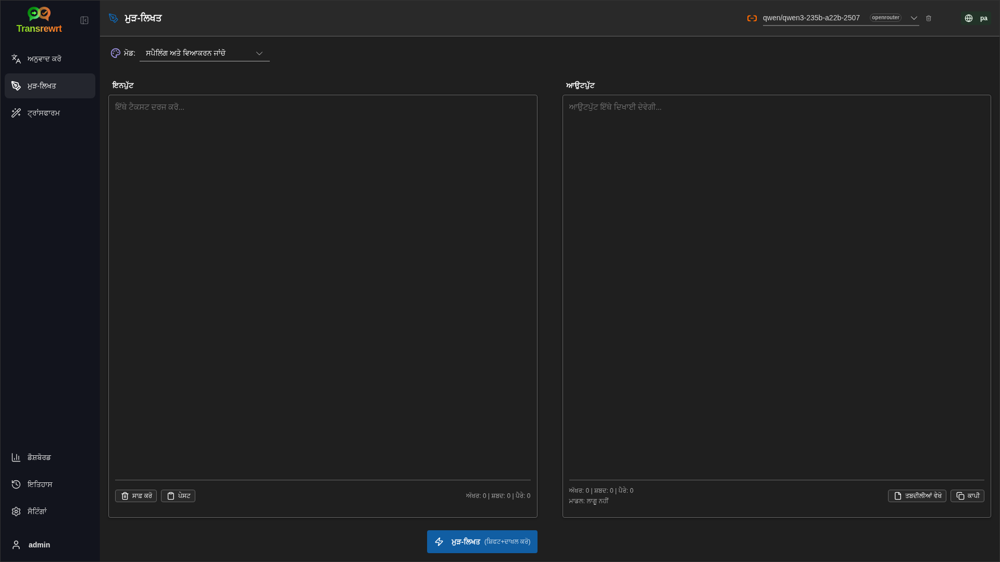
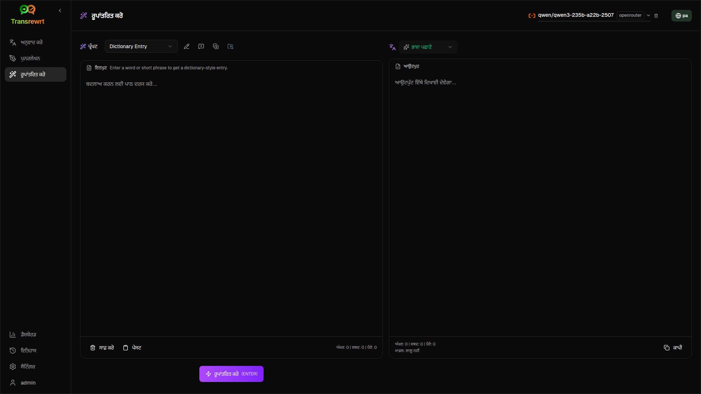
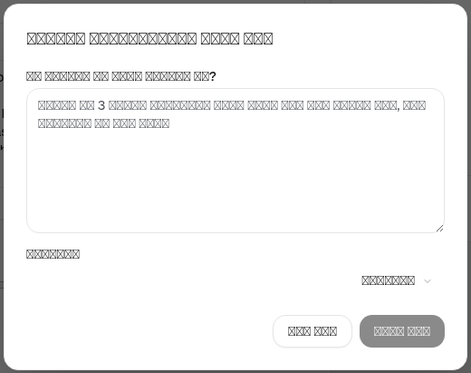

<a id="transrewrt-user-guide"></a>
# ਯੂਜ਼ਰ ਗਾਈਡ

<br/>

<a id="introduction"></a>
## ਪਰਿਚਈ

Transrewrt ਤਿੰਨ ਮੁੱਖ ਤਰੀਕਿਆਂ ਨਾਲ ਟੈਕਸਟ ਨਾਲ ਕੰਮ ਕਰਨ ਵਿੱਚ ਮਦਦ ਕਰਦਾ ਹੈ:

- ਅਨੁਵਾਦ ਕਰੋ** - ਟੈਕਸਟ ਨੂੰ ਇੱਕ ਭਾਸ਼ਾ ਤੋਂ ਦੂਜੀ ਭਾਸ਼ਾ ਵਿੱਚ ਬਦਲੋ।
- **ਪੁਨਰਲੇਖਨ** - ਟੈਕਸਟ ਨੂੰ ਵੱਖਰੀ ਸ਼ੈਲੀ ਵਿੱਚ ਮੁੜ ਲਿਖੋ, ਜਿਵੇਂ ਹੋਰ ਸਪਸ਼ਟ, ਹੋਰ ਛੋਟਾ, ਜਾਂ ਹੋਰ ਔਪਚਾਰਿਕ।
- **ਰੂਪਾਂਤਰਿਤ ਕਰੋ** - ਪ੍ਰੰਪਟ ਕਹੀਆਂ ਜਾਣ ਵਾਲੀਆਂ ਕਸਟਮ AI ਹਦਾਇਤਾਂ ਦੀ ਵਰਤੋਂ ਕਰਕੇ ਟੈਕਸਟ ਪ੍ਰੋਸੈਸ ਕਰੋ।

<br/>

ਇਹ ਗਾਈਡ ਸਥਾਪਿਤ ਅਤੇ ਚੱਲ ਰਹੇ ਐਪ ਦੀ ਵਰਤੋਂ ਕਿਵੇਂ ਕਰਨੀ ਹੈ, ਇਹ ਸਮਝਾਉਂਦੀ ਹੈ। ਸਥਾਪਨਾ ਕਦਮਾਂ ਲਈ, ਮੁੱਖ [**README**](README.pa.md) ਵੇਖੋ।

<br/>

> ℹ️ **ਨੋਟ**<br/>
> Transrewrt Windows ਅਤੇ Linux ਲਈ ਡੈਸਕਟਾਪ ਐਪ ਵਜੋਂ, ਅਤੇ ਸੈਲਫ-ਹੋਸਟਡ ਵੈਬ ਐਪ ਵਜੋਂ ਉਪਲਬਧ ਹੈ। ਇਹ ਗਾਈਡ ਐਪ ਦੀ ਰੋਜ਼ਾਨਾ ਵਰਤੋਂ 'ਤੇ ਕੇਂਦਰਤ ਹੈ। ਜਿੱਥੇ ਕੁਝ ਸਿਰਫ਼ ਇੱਕ ਵਰਜਨ ਨਾਲ ਲਾਗੂ ਹੁੰਦਾ ਹੈ, ਉੱਥੇ ਇਸਨੂੰ ਸਪੱਸ਼ਟ ਤੌਰ 'ਤੇ ਚਿੰਨ੍ਹਿਤ ਕੀਤਾ ਗਿਆ ਹੈ।

<small>**ਹੋਰ ਭਾਸ਼ਾਵਾਂ ਵਿੱਚ ਪੜ੍ਹੋ:** </small>
<small id="lang-list">[English (GB)](../USER-GUIDE.md) · [Português (Brasil)](./USER-GUIDE.pt-BR.md) · [العربية](./USER-GUIDE.ar.md) · [বাংলা](./USER-GUIDE.bn.md) · [Català](./USER-GUIDE.ca.md) · [中文 (中国大陆)](./USER-GUIDE.zh-CN.md) · [中文 (台灣)](./USER-GUIDE.zh-TW.md) · [Hrvatski](./USER-GUIDE.hr.md) · [Čeština](./USER-GUIDE.cs.md) · [Nederlands](./USER-GUIDE.nl.md) · [English (US)](./USER-GUIDE.en-US.md) · [Tagalog](./USER-GUIDE.tl.md) · [Français](./USER-GUIDE.fr.md) · [Deutsch](./USER-GUIDE.de.md) · [Ελληνικά](./USER-GUIDE.el.md) · [हिन्दी](./USER-GUIDE.hi.md) · [Magyar](./USER-GUIDE.hu.md) · [Italiano](./USER-GUIDE.it.md) · [日本語](./USER-GUIDE.ja.md) · [한국어](./USER-GUIDE.ko.md) · [Bahasa Melayu](./USER-GUIDE.ms.md) · [فارسی](./USER-GUIDE.fa.md) · [Polski](./USER-GUIDE.pl.md) · [Basa Jawa](./USER-GUIDE.jv.md) · [Português](./USER-GUIDE.pt.md) · [ਪੰਜਾਬੀ](./USER-GUIDE.pa.md) · [Română](./USER-GUIDE.ro.md) · [Русский](./USER-GUIDE.ru.md) · [Slovenčina](./USER-GUIDE.sk.md) · [Español](./USER-GUIDE.es.md) · [Kiswahili](./USER-GUIDE.sw.md) · [Svenska](./USER-GUIDE.sv.md) · [తెలుగు](./USER-GUIDE.te.md) · [ไทย](./USER-GUIDE.th.md) · [Türkçe](./USER-GUIDE.tr.md) · [Українська](./USER-GUIDE.uk.md) · [Tiếng Việt](./USER-GUIDE.vi.md)</small>

<small>

> **UI ਅਤੇ ਦਸਤਾਵੇਜ਼ੀਕਰਨ ਅਨੁਵਾਦਾਂ ਬਾਰੇ ਨੋਟ:** ਮੂਲ ਅੰਗਰੇਜ਼ੀ (UK) ਨੂੰ ਛੱਡ ਕੇ ਸਾਰੀਆਂ ਇੰਟਰਫੇਸ ਭਾਸ਼ਾਵਾਂ 
> AI ਮਾਡਲਾਂ ਦੀ ਵਰਤੋਂ ਕਰਕੇ ਅਨੁਵਾਦਿਤ ਕੀਤੀਆਂ ਗਈਆਂ ਸਨ; ਸ਼ਬਦਾਵਲੀ ਅਸ਼ੁੱਧ ਹੋ ਸਕਦੀ ਹੈ ਜਾਂ ਗਲਤੀਆਂ ਸ਼ਾਮਲ ਹੋ ਸਕਦੀਆਂ ਹਨ।

</small>

<br/>

<!-- START doctoc generated TOC please keep comment here to allow auto update -->
<!-- DON'T EDIT THIS SECTION, INSTEAD RE-RUN doctoc TO UPDATE -->
**ਵਿਸ਼ਾ-ਸੂਚੀ**

- [ਸ਼ੁਰੂ ਕਰਨ ਤੋਂ ਪਹਿਲਾਂ](#before-you-start)
  - [ਮੁਫ਼ਤ OpenRouter API ਕੁੰਜੀ ਕਿਵੇਂ ਪ੍ਰਾਪਤ ਕਰਨੀ ਹੈ (ਡੈਸਕਟਾਪ ਐਪ)](#how-to-get-a-free-openrouter-api-key-desktop-app)
- [ਸ਼ੁਰੂਆਤ](#getting-started)
- [ਵਿੰਡੋ ਦੇ ਮੁੱਖ ਹਿੱਸੇ](#main-parts-of-the-window)
  - [ਸਾਈਡਬਾਰ](#sidebar)
  - [ਟੂਲਬਾਰ](#toolbar)
  - [ਇਨਪੁਟ ਅਤੇ ਆਉਟਪੁਟ ਪੈਨਲ](#input-and-output-panels)
- [ਅਨੁਵਾਦ ਕਰੋ](#translate)
  - [ਟੈਕਸਟ ਦਾ ਅਨੁਵਾਦ ਕਰੋ](#translate-text)
  - [ਭਾਸ਼ਾ ਚੋਣ](#language-selection)
  - [ਮਦਦਗਾਰ ਅਨੁਵਾਦ ਸੈਟਿੰਗਜ਼](#helpful-translation-settings)
- [ਪੁਨਰਲੇਖਨ](#rewrite)
- [ਰੂਪਾਂਤਰਿਤ ਕਰੋ](#transform)
  - [ਮੌਜੂਦਾ ਪ੍ਰਾਮਟ ਨੂੰ ਚਲਾਓ](#run-an-existing-prompt)
  - [ਜੇਕਰ ਤੁਹਾਡੇ ਕੋਲ ਹਾਲੇ ਤੱਕ ਕੋਈ ਪ੍ਰਾਮਟ ਨਹੀਂ ਹੈ](#if-you-have-no-prompts-yet)
  - [ਜਲਦੀ ਨਾਲ ਇੱਕ ਪ੍ਰਾਮਟ ਬਣਾਓ](#create-a-prompt-quickly)
  - [ਇੱਕ ਪ੍ਰਾਮਟ ਨੂੰ ਸੋਧੋ](#edit-a-prompt)
  - [ਇਸਦੀ ਵਰਤੋਂ ਕਰਨ ਤੋਂ ਪਹਿਲਾਂ ਪ੍ਰਾਮਟ ਦੀ ਜਾਂਚ ਕਰੋ](#test-a-prompt-before-using-it)
- [ਡੈਸ਼ਬੋਰਡ](#dashboard)
  - [ਡਾਟਾ ਫਿਲਟਰ ਕਰੋ](#filter-the-data)
  - [ਡੈਸ਼ਬੋਰਡ ਟੈਬ](#dashboard-tabs)
  - [ਡਾਟਾ ਨਿਰਯਾਤ ਕਰੋ](#export-data)
  - [ਇੱਕ ਮਾਡਲ ਲਈ ਸਟੋਰ ਕੀਤੇ ਰਿਕਾਰਡ ਮਿਟਾਓ](#delete-stored-records-for-a-model)
- [ਇਤਿਹਾਸ](#history)
  - [ਇਤਿਹਾਸ ਨੂੰ ਫਿਲਟਰ ਕਰੋ](#filter-the-history)
  - [ਇਤਿਹਾਸ ਡਾਟਾ ਨਿਰਯਾਤ ਕਰੋ](#export-history-data)
- [ਸੈਟਿੰਗਜ਼](#settings)
  - [ਆਮ ਸੈਟਿੰਗਾਂ](#general-settings)
  - [ਮਾਡਲ](#models)
  - [ਭਾਸ਼ਾਵਾਂ](#languages)
  - [ਲਾਗਤ ਟਰੈਕਿੰਗ](#cost-tracking)
  - [ਪਰਿਵਰਤਨ ਪ੍ਰਾਮਟ](#transform-prompts)
  - [ਯੂਜ਼ਰ](#users)
  - [API ਕਾਨਫਿਗ](#api-config)
  - [ਬਾਰੇ](#about)
- [ਆਮ ਸਮੱਸਿਆਵਾਂ](#common-issues)
  - [ਐਪ ਟੈਕਸਟ ਦਾ ਅਨੁਵਾਦ, ਪੁਨਰਲੇਖਨ ਜਾਂ ਰੂਪਾਂਤਰਿਤ ਨਹੀਂ ਕਰਦਾ](#the-app-will-not-translate-rewrite-or-transform-text)
  - [ਮਾਡਲ ਸੂਚੀ ਖਾਲੀ ਹੈ](#the-model-list-is-empty)
  - [ਨਤੀਜਾ ਬਹੁਤ ਧੀਮਾ ਜਾਂ ਮਹਿੰਗਾ ਹੈ](#the-result-is-too-slow-or-too-expensive)
  - [ਇੰਟਰਫੇਸ ਗਲਤ ਭਾਸ਼ਾ ਵਿੱਚ ਹੈ](#the-interface-is-in-the-wrong-language)
  - [ਟੈਕਸਟ ਬਹੁਤ ਛੋਟਾ ਜਾਂ ਪੜ੍ਹਨ ਵਿੱਚ ਮੁਸ਼ਕਲ ਹੈ](#the-text-is-too-small-or-hard-to-read)
  - [ਡੈਸ਼ਬੋਰਡ ਚਾਰਟ ਖਾਲੀ ਹਨ](#dashboard-charts-are-empty)
  - [ਲਾਗਤ "ਉਪਲਬਧ ਨਹੀਂ" ਦਿਖਾਉਂਦੀ ਹੈ ਜਾਂ ਗਲਤ ਲੱਗਦੀ ਹੈ](#cost-shows-not-available-or-seems-wrong)
  - [ਕੁੱਲ ਲਾਗਤ ਮੇਰੇ ਪ੍ਰਦਾਤਾ ਦੇ ਬਿੱਲ ਨਾਲ ਮੇਲ ਨਹੀਂ ਖਾਂਦੀ](#total-cost-does-not-match-my-provider-bill)
  - [ਸਾਈਡਬਾਰ ਵਿੱਚੋਂ ਇਤਿਹਾਸ ਪੇਜ਼ ਗਾਇਬ ਹੈ](#the-history-page-is-missing-from-the-sidebar)
  - [ਵੈਬ ਐਪ: ਅਚਾਨਕ ਲਾਗਇਨ ਪੇਜ ਵੱਲ ਰੀਡਾਇਰੈਕਟ ਕੀਤਾ ਗਿਆ](#web-app-redirected-to-the-login-page-unexpectedly)
  - [ਵੈਬ ਐਡਮਿਨ: ਪਾਸਵਰਡ ਭੁੱਲ ਗਏ ਜਾਂ ਖੋ ਗਏ](#web-admin-forgot-or-lost-a-password)
  - [ਡੈਸ਼ਬੋਰਡ ਹੋਰ ਯੂਜ਼ਰਾਂ ਲਈ ਕੋਈ ਡਾਟਾ ਨਹੀਂ ਦਿਖਾਉਂਦਾ (ਵੈਬ)](#dashboard-shows-no-data-for-other-users-web)
  - [ਮੈਂ ਇੱਕ ਪ੍ਰਾਮਟ ਨੂੰ ਬਦਲਿਆ ਅਤੇ ਸੋਧਾਂ ਗੁਆ ਦਿੱਤੀਆਂ](#i-changed-a-prompt-and-lost-the-edits)
- [ਤੇਜ਼ ਸੁਝਾਅ](#quick-tips)
- [ਅਸਵੀਕਰਣ](#disclaimer)
- [ਲਾਇਸੈਂਸ](#license)

<!-- END doctoc generated TOC please keep comment here to allow auto update -->

<br/><br/>

<a id="before-you-start"></a>
## ਸ਼ੁਰੂਆਤ ਤੋਂ ਪਹਿਲਾਂ

Transrewrt ਦੀ ਵਰਤੋਂ ਕਰਨ ਲਈ, ਤੁਹਾਨੂੰ ਘੱਟੋ-ਘੱਟ ਇੱਕ AI ਪ੍ਰਦਾਤਾ ਤੱਕ ਪਹੁੰਚ ਦੀ ਲੋੜ ਹੈ। ਸਮਰਥਿਤ ਪ੍ਰਦਾਤਾ ਹਨ: [OpenRouter](https://openrouter.ai) (ਜੋ ਕਿ ਬਹੁਤ ਸਾਰੇ ਮਾਡਲਾਂ ਨੂੰ ਇਕੱਠਾ ਕਰਦਾ ਹੈ), OpenAI, Anthropic, Google Gemini, DeepSeek, Groq, Mistral, xAI, Cerebras, ਅਤੇ [Ollama](https://ollama.com) ਸਥਾਨਕ ਮਾਡਲਾਂ ਲਈ।

ਸ਼ੁਰੂਆਤ ਕਰਨ ਲਈ ਤੁਹਾਨੂੰ ਇੱਕ ਭੁਗਤਾਨ ਵਾਲਾ ਮਾਡਲ ਚੁਣਨ ਦੀ ਲੋੜ ਨਹੀਂ ਹੈ। ਜਿਵੇਂ ਹੀ ਤੁਸੀਂ ਆਪਣੀ OpenRouter API ਕੁੰਜੀ ਸ਼ਾਮਲ ਕਰਦੇ ਹੋ, ਐਪ ਆਪਣੇ-ਆਪ ਇੱਕ ਅੰਦਰੂਨੀ **ਮੁਫ਼ਤ** OpenRouter ਵਿਕਲਪ ਨੂੰ ਸਮਰਥਿਤ ਕਰਦਾ ਹੈ। ਇਸ ਨਾਲ ਤੁਸੀਂ ਤੁਰੰਤ ਟੈਕਸਟ ਦਾ ਅਨੁਵਾਦ, ਪੁਨਰਲੇਖਨ ਅਤੇ ਰੂਪਾਂਤਰਿਤ ਕਰਨਾ ਸ਼ੁਰੂ ਕਰ ਸਕਦੇ ਹੋ। ਵਿਕਲਪਕ ਤੌਰ 'ਤੇ, ਤੁਸੀਂ Cerebras, Google, Groq, ਜਾਂ Mistral AI ਤੋਂ ਮੁਫ਼ਤ API ਕੁੰਜੀ ਵੀ ਪ੍ਰਾਪਤ ਕਰ ਸਕਦੇ ਹੋ।

ਸਧਾਰਨ ਭਾਸ਼ਾ ਵਿੱਚ:

- ਇੱਕ **ਮਾਡਲ** AI ਇੰਜਣ ਹੈ ਜੋ ਕੰਮ ਕਰਦਾ ਹੈ। ਮਾਡਲਾਂ ਨੂੰ **ਪ੍ਰਦਾਤਾ ਉਪਸਰਗ** ਨਾਲ ਦਰਸਾਇਆ ਜਾਂਦਾ ਹੈ (ਉਦਾਹਰਨ ਲਈ `openrouter/…`, `openai/…`, `ollama/…`)।
- ਇੱਕ **API ਕੁੰਜੀ** (ਜਾਂ, Ollama ਲਈ, ਇੱਕ **ਬੇਸ URL**) ਉਹ ਤਰੀਕਾ ਹੈ ਜਿਸ ਰਾਹੀਂ ਐਪ ਉਸ ਪ੍ਰਦਾਤਾ ਤੱਕ ਪਹੁੰਚਦਾ ਹੈ।

ਜੇਕਰ ਤੁਸੀਂ **ਡੈਸਕਟਾਪ ਐਪ** ਦੀ ਵਰਤੋਂ ਕਰ ਰਹੇ ਹੋ, ਤਾਂ ਹਰੇਕ ਪ੍ਰਦਾਤਾ ਲਈ [**ਸੈਟਿੰਗਜ਼** > **API ਕਾਨਫਿਗ**](#api-config) ਵਿੱਚ ਕੁੰਜੀਆਂ ਸ਼ਾਮਲ ਕਰੋ। ਕੇਵਲ OpenRouter ਦੀ ਵਰਤੋਂ ਲਈ, ਹੇਠਾਂ [ਇੱਕ API ਕੁੰਜੀ ਕਿਵੇਂ ਪ੍ਰਾਪਤ ਕਰੇ](#how-to-get-an-api-key-desktop-app) ਵੇਖੋ। ਜੇਕਰ ਤੁਸੀਂ API ਕੁੰਜੀ ਦੀ ਵਰਤੋਂ ਨਹੀਂ ਕਰਨਾ ਚਾਹੁੰਦੇ, ਤਾਂ ਤੁਸੀਂ Ollama (ollama.com](https://ollama.com) ਤੋਂ) ਇੰਸਟਾਲ ਕਰ ਸਕਦੇ ਹੋ ਅਤੇ ਸਥਾਨਕ ਮਾਡਲਾਂ ਦੀ ਵਰਤੋਂ ਕਰ ਸਕਦੇ ਹੋ, ਜਿਵੇਂ ਕਿ `translategemma:4b`।

ਜੇਕਰ ਤੁਸੀਂ **ਵੈੱਬ ਵਰਜਨ** ਦੀ ਵਰਤੋਂ ਕਰ ਰਹੇ ਹੋ, ਤਾਂ ਸਰਵਰ ਮਾਲਕ ਵਾਤਾਵਰਣ ਚਲਾਂ ਰਾਹੀਂ ਪ੍ਰਦਾਤਾਵਾਂ ਨੂੰ ਕਾਨਫਿਗਰ ਕਰਦਾ ਹੈ, ਇਸ ਲਈ ਤੁਸੀਂ ਐਪਲੀਕੇਸ਼ਨ ਵਿੱਚ ਸਿੱਧੇ ਤੌਰ 'ਤੇ API ਕੁੰਜੀਆਂ ਦਰਜ ਨਹੀਂ ਕਰ ਸਕਦੇ।

<br/>

<a id="how-to-get-an-api-key-desktop-app"></a>
### ਮੁਫ਼ਤ OpenRouter API ਕੁੰਜੀ ਕਿਵੇਂ ਪ੍ਰਾਪਤ ਕਰੇ (ਡੈਸਕਟਾਪ ਐਪ)

ਜੇਕਰ ਤੁਸੀਂ ਡੈਸਕਟਾਪ ਐਪ ਦੀ ਵਰਤੋਂ ਕਰ ਰਹੇ ਹੋ, ਤਾਂ ਇਹ ਕਦਮ ਅਨੁਸਰਣ ਕਰੋ:

1. ਆਪਣੇ ਵੈੱਬ ਬਰਾਊਜ਼ਰ ਵਿੱਚ [OpenRouter](https://openrouter.ai) 'ਤੇ ਜਾਓ।
2. ਇੱਕ ਖਾਤਾ ਬਣਾਓ ਜਾਂ ਸਾਈਨ ਇਨ ਕਰੋ।
3. [Keys](https://openrouter.ai/keys) ਪੰਨੇ 'ਤੇ ਜਾਓ।
4. ਇੱਕ ਨਵੀਂ API ਕੁੰਜੀ ਬਣਾਉਣ ਲਈ ਬਟਨ 'ਤੇ ਕਲਿੱਕ ਕਰੋ।
5. ਕੁੰਜੀ ਨੂੰ ਇੱਕ ਨਾਮ ਦਿਓ ਤਾਂ ਜੋ ਤੁਸੀਂ ਇਸਨੂੰ ਬਾਅਦ ਵਿੱਚ ਪਛਾਣ ਸਕੋ।
6. ਨਵੀਂ API ਕੁੰਜੀ ਨੂੰ ਕਾਪੀ ਕਰੋ।
7. Transrewrt ਵਾਪਸ ਜਾਓ ਅਤੇ **ਸੈਟਿੰਗਜ਼** > **API ਕਾਨਫਿਗ** ਖੋਲ੍ਹੋ।
8. **OpenRouter API ਕੁੰਜੀ** ਵਿੱਚ ਕੁੰਜੀ ਪੇਸਟ ਕਰੋ (**ਸੈਟਿੰਗਜ਼** > **API ਕਾਨਫਿਗ** ਹੇਠਾਂ)।
9. ਇਹ ਯਕੀਨੀ ਬਣਾਉਣ ਲਈ ਕਿ ਇਹ ਕੰਮ ਕਰਦਾ ਹੈ, **OpenRouter ਕੁੰਜੀ ਦੀ ਜਾਂਚ ਕਰੋ** 'ਤੇ ਕਲਿੱਕ ਕਰੋ।

<br/><br/>

<a id="getting-started"></a>
## ਸ਼ੁਰੂਆਤ

ਜੇਕਰ ਇਹ ਤੁਹਾਡੀ Transrewrt ਦੀ ਪਹਿਲੀ ਵਰਤੋਂ ਹੈ, ਤਾਂ ਇਸ ਕ੍ਰਮ ਨੂੰ ਅਨੁਸਰਣ ਕਰੋ:

1. ਐਪ ਖੋਲ੍ਹੋ।
2. ਜੇ ਲੋੜ ਹੋਵੇ, ਤਾਂ ਗਲੋਬ ਆਈਕਾਨ ਤੋਂ **ਇੰਟਰਫੇਸ ਭਾਸ਼ਾ** ਚੁਣੋ।
3. ਜੇਕਰ ਤੁਸੀਂ **ਡੈਸਕਟਾਪ ਐਪ** 'ਤੇ ਹੋ, ਤਾਂ [**ਸੈਟਿੰਗਜ਼** > **API ਕਾਨਫਿਗ**](#api-config) ਖੋਲ੍ਹੋ, ਘੱਟੋ-ਘੱਟ ਇੱਕ ਪ੍ਰਦਾਤਾ (ਉਦਾਹਰਨ ਲਈ OpenRouter) ਲਈ API ਕੁੰਜੀ ਸ਼ਾਮਲ ਕਰੋ, ਅਤੇ ਇਹ ਯਕੀਨੀ ਬਣਾਉਣ ਲਈ **ਜਾਂਚ** 'ਤੇ ਕਲਿੱਕ ਕਰੋ ਕਿ ਇਹ ਕੰਮ ਕਰਦਾ ਹੈ।
4. [**ਸੈਟਿੰਗਜ਼** > **ਮਾਡਲ**](#models) ਖੋਲ੍ਹੋ ਅਤੇ **ਚੁਣੇ ਹੋਏ ਮਾਡਲ** ਵਿੱਚ ਇੱਕ ਜਾਂ ਵੱਧ ਮਾਡਲ ਸ਼ਾਮਲ ਕਰੋ।
5. [**ਸੈਟਿੰਗਜ਼** > **ਭਾਸ਼ਾਵਾਂ**](#languages) ਖੋਲ੍ਹੋ ਅਤੇ ਜੇ ਤੁਸੀਂ ਆਪਣੀਆਂ ਸਭ ਤੋਂ ਵੱਧ ਵਰਤੀਆਂ ਜਾਣ ਵਾਲੀਆਂ ਭਾਸ਼ਾਵਾਂ ਨੂੰ ਪਹਿਲਾਂ ਦਿਖਾਉਣਾ ਚਾਹੁੰਦੇ ਹੋ ਤਾਂ **ਉੱਪਰਲੀਆਂ ਭਾਸ਼ਾਵਾਂ** ਚੁਣੋ।
6. **ਅਨੁਵਾਦ** 'ਤੇ ਜਾਓ ਅਤੇ ਇਹ ਪੁਸ਼ਟੀ ਕਰਨ ਲਈ ਇੱਕ ਸਧਾਰਨ ਅਨੁਵਾਦ ਚਲਾਓ ਕਿ ਸਭ ਕੁਝ ਕੰਮ ਕਰ ਰਿਹਾ ਹੈ।
7. ਇਹ ਕੰਮ ਕਰਨ ਤੋਂ ਬਾਅਦ, **ਪੁਨਰਲੇਖਨ** ਅਤੇ ਫਿਰ **ਰੂਪਾਂਤਰਿਤ ਕਰੋ** ਦੀ ਕੋਸ਼ਿਸ਼ ਕਰੋ।

ਇਸ ਕ੍ਰਮ ਦਾ ਮਹੱਤਵ ਹੈ। ਇਹ ਸਭ ਤੋਂ ਆਮ ਪਹਿਲੀ ਵਰਤੋਂ ਦੀ ਸਮੱਸਿਆ ਨੂੰ ਰੋਕਦਾ ਹੈ: ਐਪ ਕੋਲ ਕੰਮ ਕਰ ਰਹੀ API ਕੁਨੈਕਸ਼ਨ ਜਾਂ ਚੁਣਿਆ ਹੋਇਆ ਮਾਡਲ ਹੋਣ ਤੋਂ ਪਹਿਲਾਂ ਕੋਈ ਕੰਮ ਚਲਾਉਣ ਦੀ ਕੋਸ਼ਿਸ਼ ਕਰਨਾ।

<br/><br/>

<a id="main-parts-of-the-window"></a>
## ਵਿੰਡੋ ਦੇ ਮੁੱਖ ਹਿੱਸੇ

ਐਪ ਤਿੰਨ ਮੁੱਖ ਖੇਤਰਾਂ ਵਿੱਚ ਵੰਡਿਆ ਗਿਆ ਹੈ:

- ਖੱਬੇ ਪਾਸੇ **ਸਾਈਡਬਾਰ**।
- ਉੱਪਰ **ਟੂਲਬਾਰ**।
- ਕੇਂਦਰ ਵਿੱਚ **ਕੰਮ ਕਰਨ ਵਾਲਾ ਖੇਤਰ**।

<br/>

<a id="sidebar"></a>
### ਸਾਈਡਬਾਰ

ਐਪ ਵਿੱਚ ਆਸ ਪਾਸ ਜਾਣ ਲਈ ਸਾਈਡਬਾਰ ਦੀ ਵਰਤੋਂ ਕਰੋ। ਐਪ ਲੋਗੋ ਦੇ ਅਗਲੇ ਆਈਕਨ 'ਤੇ ਕਲਿੱਕ ਕਰਕੇ ਤੁਸੀਂ ਵਧੇਰੇ ਥਾਂ ਲਈ ਸਾਈਡਬਾਰ ਨੂੰ ਸੰਕੁਚਿਤ ਕਰ ਸਕਦੇ ਹੋ।

<br/>

<table>
  <tr>
    <td valign="top">
       
    </td>
    <td valign="top">
      <br/><br/>
      <ul>
        <li><strong>ਅਨੁਵਾਦ ਕਰੋ</strong> ਅਨੁਵਾਦ ਕਾਰਜਸਥਾਨ ਖੋਲ੍ਹਦਾ ਹੈ।</li><br/>
        <li><strong>ਪੁਨਰਲੇਖਨ</strong> ਪੁਨਰਲੇਖਨ ਕਾਰਜਸਥਾਨ ਖੋਲ੍ਹਦਾ ਹੈ।</li><br/>
        <li><strong>ਰੂਪਾਂਤਰਿਤ ਕਰੋ</strong> ਕਸਟਮ ਪ੍ਰੰਪਟ ਕਾਰਜਸਥਾਨ ਖੋਲ੍ਹਦਾ ਹੈ।</li><br/>
        <li><strong>ਡੈਸ਼ਬੋਰਡ</strong> ਵਰਤੋਂ ਅਤੇ ਲਾਗਤ ਬਾਰੇ ਜਾਣਕਾਰੀ ਦਰਸਾਉਂਦਾ ਹੈ।</li><br/>
        <li><strong>ਸੈਟਿੰਗਜ਼</strong> ਸੈਟਿੰਗਜ਼ ਪੈਨਲ ਖੋਲ੍ਹਦਾ ਹੈ।</li><br/>
        <li><strong>ਇਤਿਹਾਸ</strong> ਇਨਪੁਟ ਅਤੇ ਆਉਟਪੁਟ ਟੈਕਸਟ ਨਾਲ ਵਰਤੋਂ ਇਤਿਹਾਸ ਦਿਖਾਉਂਦਾ ਹੈ</li><br/>
        <li><strong>ਯੂਜ਼ਰ</strong> ਲਾਗਇਨ ਕੀਤੇ ਯੂਜ਼ਰ ਦਾ ਯੂਜ਼ਰਨੇਮ ਦਿਖਾਉਂਦਾ ਹੈ (ਸਿਰਫ਼ ਵੈੱਬ)।</li>
      </ul>
    </td>
  </tr>
</table>

<br/>

<a id="toolbar"></a>
### ਟੂਲਬਾਰ

ਟੂਲਬਾਰ ਥੋੜ੍ਹਾ ਬਹੁਤ ਬਦਲ ਜਾਂਦਾ ਹੈ ਜਿੱਥੇ ਵੀ ਤੁਸੀਂ ਐਪ ਵਿੱਚ ਹੁੰਦੇ ਹੋ।

- ਖੱਬੇ ਪਾਸੇ, ਇਹ ਮੌਜੂਦਾ ਪੰਨੇ ਦਾ ਨਾਮ ਦਰਸਾਉਂਦਾ ਹੈ।
- ਸੱਜੇ ਪਾਸੇ, ਇਹ **ਮਾਡਲ ਚੁਣਨ ਵਾਲਾ** ਅਤੇ **ਇੰਟਰਫੇਸ ਭਾਸ਼ਾ** ਨੂੰ ਨਿਯੰਤਰਿਤ ਕਰਦਾ ਹੈ।

ਮੌਜੂਦਾ ਕੰਮ ਲਈ ਕਿਹੜੀ AI ਇੰਜਣ ਦੀ ਵਰਤੋਂ ਕਰਨੀ ਹੈ, ਇਸਨੂੰ ਚੁਣਨ ਲਈ **ਮਾਡਲ ਚੁਣਨ ਵਾਲਾ** ਤੁਹਾਨੂੰ ਸਹਾਇਤਾ ਕਰਦਾ ਹੈ।



ਕੁਝ ਮੁਫ਼ਤ ਮਾਡਲ ਹਮੇਸ਼ਾ ਉਪਲਬਧ ਨਹੀਂ ਹੁੰਦੇ - ਕਦੇ-ਕਦੇ ਉਹ ਆਫਲਾਈਨ ਹੁੰਦੇ ਹਨ ਜਾਂ ਉਹਨਾਂ ਦੀ ਵਰਤੋਂ ਦੀ ਸੀਮਾ ਹੁੰਦੀ ਹੈ। ਜੇਕਰ ਇਹ ਹੁੰਦਾ ਹੈ, ਤਾਂ ਐਪ ਆਪਣੇ-ਆਪ ਉਸ ਮਾਡਲ ਨੂੰ ਤੁਹਾਡੀ ਉਪਲਬਧ ਸੂਚੀ ਵਿੱਚੋਂ ਹਟਾ ਦੇਵੇਗਾ। ਕਿਹੜੇ ਮਾਡਲ ਦਿਖਾਈ ਦੇਣ, ਇਸ ਨੂੰ ਨਿਯੰਤਰਿਤ ਕਰਨ ਲਈ, [**ਸੈਟਿੰਗਜ਼** > **ਮਾਡਲ**](#models) ਤੇ ਜਾਓ ਅਤੇ ਆਪਣੀ ਮਾਡਲ ਸੂਚੀ ਨੂੰ ਸੋਧੋ।
 ਤੁਸੀਂ ਟੂਲਬਾਰ ਵਿੱਚ ਮਾਡਲ ਨਾਮ ਦੇ ਖੱਬੇ ਪਾਸੇ ਪ੍ਰਦਾਤਾ ਆਈਕਨ 'ਤੇ ਕਲਿੱਕ ਕਰਕੇ ਸਿੱਧੇ ਮਾਡਲ ਸੈਟਿੰਗਜ਼ ਨੂੰ ਵੀ ਖੋਲ੍ਹ ਸਕਦੇ ਹੋ।

<br/>

ਐਪ ਇੰਟਰਫੇਸ ਭਾਸ਼ਾ, ਜਿਵੇਂ ਕਿ ਮੇਨੂ ਅਤੇ ਬਟਨ, ਨੂੰ ਬਦਲਣ ਲਈ **ਗਲੋਬ ਆਈਕਨ + ਭਾਸ਼ਾ ਕੋਡ** ਹੁੰਦਾ ਹੈ। ਇਹ **ਅਨੁਵਾਦ ਕਰੋ** ਵਿੱਚ ਵਰਤੀਆ ਜਾਣ ਵਾਲਾ ਅਨੁਵਾਦ ਭਾਸ਼ਾਵਾਂ ਨੂੰ **ਬਦਲਦਾ ਨਹੀਂ** ਹੈ।


<br/>

<a id="input-and-output-panels"></a>
### ਇਨਪੁਟ ਅਤੇ ਆਉਟਪੁਟ ਪੈਨਲ

ਜ਼ਿਆਦਾਤਰ ਕਾਰਜਸਥਾਨ ਇੱਕ ਖੱਬੇ ਪਾਸੇ ਦੇ **ਇਨਪੁਟ** ਪੈਨਲ ਅਤੇ ਇੱਕ ਸੱਜੇ ਪਾਸੇ ਦੇ **ਆਉਟਪੁਟ** ਪੈਨਲ ਦੀ ਵਰਤੋਂ ਕਰਦੇ ਹਨ।

ਹਰੇਕ ਪੈਨਲ ਵੀ ਦਰਸਾਉਂਦਾ ਹੈ:

| **ਇਨਪੁਟ**                                                          | **ਆਉਟਪੁਟ**                                                                                                                  |
|--------------------------------------------------------------------|-----------------------------------------------------------------------------------------------------------------------------|
| - ਅੱਖਰ ਗਿਣਤੀ <br/>- ਸ਼ਬਦ ਗਿਣਤੀ <br/>- ਪੈਰੇ ਗਿਣਤੀ   <br/> | - ਕੰਮ ਨੂੰ ਕਰਨ ਵਿੱਚ ਕਿੰਨਾ ਸਮਾਂ ਲੱਗਾ<br/>- **TPS** (ਹਰ ਸਕਿੰਟ ਵਿੱਚ ਟੋਕਨ)<br/>- ਅੱਖਰ, ਸ਼ਬਦ, ਅਤੇ ਪੈਰੇ ਗਿਣਤੀ<br/>- ਵਰਤਿਆ ਗਿਆ ਮਾਡਲ |

ਜੇਕਰ ਤੁਸੀਂ ਤਕਨੀਕੀ ਸ਼ਬਦਾਂ ਬਾਰੇ ਸੋਚ ਰਹੇ ਹੋ:

- **ਟੋਕਨ** ਦਾ ਅਰਥ ਹੈ ਟੈਕਸਟ ਦਾ ਛੋਟਾ ਟੁਕੜਾ। ਤੁਸੀਂ ਇਸਨੂੰ ਇੱਕ ਸ਼ਬਦ ਦਾ ਹਿੱਸਾ ਜਾਂ ਇੱਕ ਛੋਟਾ ਸ਼ਬਦ ਸਮਝ ਸਕਦੇ ਹੋ।
- **TPS** ਦਾ ਅਰਥ ਹੈ ਕਿ ਮਾਡਲ ਨੇ ਹਰ ਸਕਿੰਟ ਵਿੱਚ ਇਹਨਾਂ ਟੈਕਸਟ ਟੁਕੜਿਆਂ ਵਿੱਚੋਂ ਕਿੰਨੇ ਪ੍ਰੋਸੈਸ ਕੀਤੇ।

<br/>

ਤੁਸੀਂ ਹਰੇਕ ਕਾਰਜ ਦੀ ਲਾਗਤ (ਜੇਕਰ ਉਪਲਬਧ ਹੋਵੇ) ਅਤੇ ਕੁੱਲ ਲਾਗਤ ਨੂੰ ਵੀ ਮਾਨੀਟਰ ਕਰ ਸਕਦੇ ਹੋ, [**ਸੈਟਿੰਗਜ਼** > **ਆਮ ਸੈਟਿੰਗਾਂ**](#general-settings) ਤੇ ਵਿਕਲਪ `Show cost information on the actions` ਨੂੰ ਸਮਰੱਥ ਕਰਕੇ।

<br/><br/>

[--------------------------------------------------------------------------------------------------------------------------]: #

<a id="translate"></a>
## ਅਨੁਵਾਦ ਕਰੋ

ਜਦੋਂ ਤੁਸੀਂ ਇੱਕ ਭਾਸ਼ਾ ਤੋਂ ਦੂਜੀ ਭਾਸ਼ਾ ਵਿੱਚ ਟੈਕਸਟ ਨੂੰ ਬਦਲਣਾ ਚਾਹੁੰਦੇ ਹੋ ਤਾਂ **ਅਨੁਵਾਦ ਕਰੋ** ਦੀ ਵਰਤੋਂ ਕਰੋ।


<br/>

<a id="translate-text"></a>
### ਟੈਕਸਟ ਅਨੁਵਾਦ ਕਰੋ

1. **ਅਨੁਵਾਦ ਕਰੋ** ਖੋਲ੍ਹੋ।
2. **ਤੋਂ** ਵਿੱਚ ਇੱਕ ਭਾਸ਼ਾ ਚੁਣੋ।
3. **ਨੂੰ** ਵਿੱਚ ਇੱਕ ਭਾਸ਼ਾ ਚੁਣੋ।
4. ਟੂਲਬਾਰ ਵਿੱਚ ਇੱਕ ਮਾਡਲ ਚੁਣੋ।
5. **ਇਨਪੁਟ** ਵਿੱਚ ਟੈਕਸਟ ਟਾਈਪ ਜਾਂ ਪੇਸਟ ਕਰੋ।
6. **ਅਨੁਵਾਦ ਕਰੋ** ਉੱਤੇ ਕਲਿੱਕ ਕਰੋ।
7. **ਆਉਟਪੁਟ** ਵਿੱਚ ਨਤੀਜਾ ਪੜ੍ਹੋ।
8. ਜੇਕਰ ਤੁਸੀਂ ਨਤੀਜਾ ਕਾਪੀ ਕਰਨਾ ਚਾਹੁੰਦੇ ਹੋ ਤਾਂ ਕਾਪੀ ਬਟਨ ਦੀ ਵਰਤੋਂ ਕਰੋ।

<br/>

<a id="language-selection"></a>
### ਭਾਸ਼ਾ ਚੋਣ

- **From** ਇੱਕ ਖਾਸ ਭਾਸ਼ਾ ਜਾਂ **ਭਾਸ਼ਾ ਪਛਾਣੋ** ਹੋ ਸਕਦੀ ਹੈ।
- **To** ਉਹ ਭਾਸ਼ਾ ਹੈ ਜਿਸ ਵਿੱਚ ਤੁਸੀਂ ਨਤੀਜਾ ਚਾਹੁੰਦੇ ਹੋ।

ਤੁਹਾਡੀ ਚੁਣੀ ਹੋਈ **ਸਿਖਰਲੀਆਂ ਭਾਸ਼ਾਵਾਂ** ਸੂਚੀ ਦੇ ਸਿਖਰ 'ਤੇ ਦਿਖਾਈ ਦਿੰਦੀਆਂ ਹਨ। ਤੁਸੀਂ ਇਨ੍ਹਾਂ ਨੂੰ [**ਸੈਟਿੰਗਜ਼** > **ਭਾਸ਼ਾਵਾਂ**](#languages) ਵਿੱਚ ਸੈੱਟ ਕਰ ਸਕਦੇ ਹੋ।

<br/>

<a id="helpful-translation-settings"></a>
### ਮਦਦਗਾਰ ਅਨੁਵਾਦ ਸੈਟਿੰਗਾਂ

[**ਸੈਟਿੰਗਜ਼** > **ਆਮ ਸੈਟਿੰਗਾਂ**](#general-settings) ਵਿੱਚ, ਤੁਸੀਂ ਇਹ ਬਦਲ ਸਕਦੇ ਹੋ ਕਿ ਅਨੁਵਾਦ ਕਿਵੇਂ ਵਿਵਹਾਰ ਕਰਦਾ ਹੈ:

- **ਪੇਸਟ ਕਰਨ 'ਤੇ ਆਟੋ-ਅਨੁਵਾਦ** ਤੁਸੀਂ ਟੈਕਸਟ ਪੇਸਟ ਕਰਨ ਦੇ ਨਾਲ ਹੀ ਇੱਕ ਅਨੁਵਾਦ ਚਲਾਉਂਦਾ ਹੈ।
- **ਨਤੀਜਾ ਆਟੋ-ਕਾਪੀ ਕਲਿੱਪਬੋਰਡ 'ਤੇ** ਸਫਲਤਾਪੂਰਵਕ ਚੱਲਣ ਤੋਂ ਬਾਅਦ ਨਤੀਜਾ ਆਟੋਮੈਟਿਕ ਕਾਪੀ ਕਰ ਲੈਂਦਾ ਹੈ।
- **ਰੀਅਲ-ਟਾਈਮ ਅਨੁਵਾਦ (ਟਾਈਪ ਕਰਦੇ ਸਮੇਂ)** ਤੁਸੀਂ ਟਾਈਪ ਕਰਦੇ ਸਮੇਂ ਅਨੁਵਾਦ ਚਲਾਉਂਦਾ ਹੈ।
- **ਟਾਈਮਆਊਟ (ms)** ਨਿਯੰਤਰਿਤ ਕਰਦਾ ਹੈ ਕਿ ਐਪ ਰੀਅਲ-ਟਾਈਮ ਅਨੁਵਾਦ ਚਲਾਉਣ ਤੋਂ ਪਹਿਲਾਂ ਕਿੰਨੀ ਦੇਰ ਉਡੀਕਦਾ ਹੈ।
- **Enter** ਇਹ ਨਿਯੰਤਰਿਤ ਕਰਦਾ ਹੈ ਕਿ ਜਦੋਂ ਤੁਸੀਂ `Enter` ਦਬਾਉਂਦੇ ਹੋ ਤਾਂ ਕੀ ਹੁੰਦਾ ਹੈ:

<br/><br/>

[--------------------------------------------------------------------------------------------------------------------------]: #

<a id="rewrite"></a>
## ਪੁਨਰਲੇਖਨ

ਤੁਸੀਂ ਮੁੱਖ ਅਰਥ ਨੂੰ ਬਦਲੇ ਬਿਨਾਂ ਸ਼ਬਦਾਵਲੀ ਨੂੰ ਸੁਧਾਰਨ ਲਈ **ਪੁਨਰਲੇਖਨ** ਦੀ ਵਰਤੋਂ ਕਰੋ।



ਇਹ ਇਸ ਲਈ ਵਰਤੋਂ ਵਿੱਚ ਆਉਂਦਾ ਹੈ:

- ਸਪੈਲਿੰਗ ਅਤੇ ਵਿਆਕਰਨ ਠੀਕ ਕਰਨਾ (**ਸਪੈਲਿੰਗ ਅਤੇ ਵਿਆਕਰਨ ਜਾਂਚੋ**)
- ਟੈਕਸਟ ਨੂੰ ਸਪਸ਼ਟ ਬਣਾਉਣਾ (**ਸਪਸ਼ਟਤਾ ਵਧਾਓ**)
- ਇੱਕ ਚੱਲਣ ਵਿੱਚ ਕਈ ਵੱਖ-ਵੱਖ ਪੁਨਰ-ਵਿਵਸਥਾਵਾਂ (**ਵੈਕਲਪਿਕ ਸੰਸਕਰਣ**)
- ਟੈਕਸਟ ਨੂੰ ਹੋਰ ਔਪਚਾਰਿਕ ਜਾਂ ਘੱਟ ਔਪਚਾਰਿਕ ਬਣਾਉਣਾ (**ਔਪਚਾਰਿਕ** / **ਅਨੌਪਚਾਰਿਕ**)
- ਟੈਕਸਟ ਨੂੰ ਛੋਟਾ ਜਾਂ ਵਧਾਉਣਾ (**ਛੋਟਾ ਕਰੋ** / **ਵਧਾਓ**)
- ਟੈਕਸਟ ਨੂੰ ਹੋਰ ਤਕਨੀਕੀ ਬਣਾਉਣਾ (**ਤਕਨੀਕੀ ਬਣਾਓ**)

<br/>

> 💡 **ਟਿਪ**<br/>
> ਜਦੋਂ ਤੁਸੀਂ "**ਸਪੈਲਿੰਗ ਅਤੇ ਵਿਆਕਰਨ ਜਾਂਚੋ**" ਮੋਡ ਦੀ ਵਰਤੋਂ ਕਰਦੇ ਹੋ, ਤਾਂ ਆਉਟਪੁਟ ਪੈਨਲ ਵਿੱਚ (**ਕਾਪੀ** ਦੇ ਨੇੜੇ) **ਤਬਦੀਲੀਆਂ ਦਿਖਾਓ** ਸਵਿੱਚ ਦਿਖਾਈ ਦਿੰਦਾ ਹੈ।
> ਆਪਣੇ ਟੈਕਸਟ 'ਤੇ ਲਾਗੂ ਖਾਸ ਸੁਧਾਰਾਂ ਨੂੰ ਦਿਖਾਉਣ ਜਾਂ ਲੁਕਾਉਣ ਲਈ ਇਸਨੂੰ ਚਾਲੂ ਜਾਂ ਬੰਦ ਕਰੋ।

<br/><br/>

[--------------------------------------------------------------------------------------------------------------------------]: #

<a id="transform"></a>
## ਰੂਪਾਂਤਰਿਤ ਕਰੋ

ਤੁਸੀਂ ਇੱਕ ਕਸਟਮ ਨਿਰਦੇਸ਼ਾਂ ਦੇ ਸੈੱਟ ਦੀ ਪਾਲਣਾ ਕਰਨ ਲਈ AI ਨੂੰ ਵਰਤਣ ਲਈ **ਰੂਪਾਂਤਰਿਤ ਕਰੋ** ਦੀ ਵਰਤੋਂ ਕਰੋ।



ਇਹ ਐਪ ਦਾ ਸਭ ਤੋਂ ਲਚਕਦਾਰ ਖੇਤਰ ਹੈ। ਤੁਸੀਂ ਇਸਦੀ ਵਰਤੋਂ ਅਜਿਹੇ ਕੰਮਾਂ ਲਈ ਕਰ ਸਕਦੇ ਹੋ:

- ਨੋਟਸ ਦਾ ਸਾਰ ਕੱਢਣਾ
- ਕੱਚੇ ਟੈਕਸਟ ਨੂੰ ਪੌਲਿਸ਼ ਕੀਤਾ ਈਮੇਲ ਵਿੱਚ ਬਦਲਣਾ
- ਮੁੱਖ ਬਿੰਦੂਆਂ ਨੂੰ ਕੱਢਣਾ
- ਟੈਕਸਟ ਨੂੰ ਇੱਕ ਖਾਸ ਫਾਰਮੈਟ ਵਿੱਚ ਬਦਲਣਾ
- ਇਨਪੁਟ ਟੈਕਸਟ ਨਾਲ ਕੋਈ ਵੀ ਹੋਰ ਕਸਟਮ ਗਤੀਵਿਧੀ

<br/>

<a id="run-an-existing-prompt"></a>
### ਮੌਜੂਦਾ ਪ੍ਰੰਪਟ ਚਲਾਓ

1. **ਰੂਪਾਂਤਰਿਤ ਕਰੋ** ਖੋਲ੍ਹੋ।
2. ਪ੍ਰੰਪਟ ਸੂਚੀ ਵਿੱਚੋਂ ਇੱਕ ਪ੍ਰੰਪਟ ਚੁਣੋ।
3. ਜੇਕਰ **ਟੀਚਾ** ਭਾਸ਼ਾ ਬਾਕਸ ਦਿਖਾਈ ਦਿੰਦਾ ਹੈ, ਤਾਂ ਜੇ ਤੁਸੀਂ ਚਾਹੋ ਤਾਂ ਇੱਕ ਭਾਸ਼ਾ ਚੁਣੋ।
4. **ਇਨਪੁਟ** ਵਿੱਚ ਟੈਕਸਟ ਟਾਈਪ ਜਾਂ ਪੇਸਟ ਕਰੋ।
5. **ਰੂਪਾਂਤਰਿਤ ਕਰੋ** ਉੱਤੇ ਕਲਿੱਕ ਕਰੋ।
6. **ਆਉਟਪੁੱਟ** ਵਿੱਚ ਨਤੀਜਾ ਪੜ੍ਹੋ।

<br/>

<a id="if-you-have-no-prompts-yet"></a>
### ਜੇਕਰ ਤੁਹਾਡੇ ਕੋਲ ਹਾਲੇ ਤੱਕ ਕੋਈ ਪ੍ਰੰਪਟ ਨਹੀਂ ਹੈ

ਜੇਕਰ ਤੁਹਾਡੀ ਪ੍ਰੰਪਟ ਸੂਚੀ ਖਾਲੀ ਹੈ, ਤਾਂ ਰੂਪਾਂਤਰਨ ਵਰਕਸਪੇਸ ਵਿੱਚ **ਨਮੂਨਾ ਪ੍ਰੇਰਕ ਲੋਡ ਕਰੋ** ਉੱਤੇ ਕਲਿੱਕ ਕਰੋ। ਨਿਰਯਾਤ/ਆਯਾਤ ਕਤਾਰ ਵਿੱਚ [**ਸੈਟਿੰਗਜ਼** > **ਪਰਿਵਰਤਨ ਪ੍ਰਾਮਟ**](#transform-prompts) ਉੱਤੇ ਇਹੀ ਕੰਟਰੋਲ ਹਮੇਸ਼ਾ ਉਪਲਬਧ ਹੁੰਦਾ ਹੈ। ਦੋਵੇਂ ਅੰਦਰੂਨੀ ਉਦਾਹਰਣਾਂ ਜੋੜਦੇ ਹਨ ਤਾਂ ਜੋ ਤੁਸੀਂ ਤੁਰੰਤ ਸ਼ੁਰੂ ਕਰ ਸਕੋ।

<br/>

> ℹ️ **ਨੋਟ**<br/>
> ਨਮੂਨਾ ਪ੍ਰੰਪਟ ਅੰਗਰੇਜ਼ੀ ਵਿੱਚ ਪ੍ਰਦਾਨ ਕੀਤੇ ਗਏ ਹਨ। ਉਨ੍ਹਾਂ ਨੂੰ ਲੋਡ ਕਰਨ ਤੋਂ ਬਾਅਦ, ਤੁਸੀਂ ਇੱਕ ਪ੍ਰੰਪਟ ਨੂੰ ਸੋਧ ਸਕਦੇ ਹੋ ਅਤੇ ਇਸਨੂੰ ਆਪਣੀ ਭਾਸ਼ਾ ਵਿੱਚ ਅਨੁਵਾਦ ਕਰਨ ਲਈ **ਪ੍ਰੇਰਕ ਅਨੁਵਾਦ ਕਰੋ** ਦੀ ਵਰਤੋਂ ਕਰ ਸਕਦੇ ਹੋ।

<br/>

<a id="create-a-prompt-quickly"></a>
### ਤੇਜ਼ੀ ਨਾਲ ਇੱਕ ਪ੍ਰੰਪਟ ਬਣਾਓ

ਇੱਕ ਪ੍ਰੰਪਟ ਬਣਾਉਣ ਦਾ ਸਭ ਤੋਂ ਤੇਜ਼ ਤਰੀਕਾ ਹੈ:

1. **ਨਵਾਂ ਪ੍ਰੰਪਟ** ਉੱਤੇ ਕਲਿੱਕ ਕਰੋ।
2. **ਪ੍ਰੰਪਟ ਜਨਰੇਟ ਕਰੋ** ਉੱਤੇ ਕਲਿੱਕ ਕਰੋ।
3. ਉਸ ਚੀਜ਼ ਦਾ ਵੇਰਵਾ ਦਿਓ ਜੋ ਤੁਸੀਂ ਚਾਹੁੰਦੇ ਹੋ ਕਿ ਪ੍ਰੰਪਟ ਕਰੇ।
4. ਇੱਕ ਮਾਡਲ ਚੁਣੋ।
5. ਐਪ ਨੂੰ ਤੁਹਾਡੇ ਲਈ ਇੱਕ ਡ੍ਰਾਫਟ ਬਣਾਉਣ ਦਿਓ।
6. ਡ੍ਰਾਫਟ ਦੀ ਸਮੀਖਿਆ ਕਰੋ ਅਤੇ **ਸੰਭਾਲੋ** ਉੱਤੇ ਕਲਿੱਕ ਕਰੋ।



<br/>

<a id="edit-a-prompt"></a>
### ਇੱਕ ਪ੍ਰੰਪਟ ਨੂੰ ਸੋਧੋ

ਜਦੋਂ ਤੁਸੀਂ ਇੱਕ ਪ੍ਰੰਪਟ ਬਣਾਉਂਦੇ ਜਾਂ ਸੋਧਦੇ ਹੋ, ਤਾਂ ਸੰਪਾਦਕ ਖੱਬੇ ਪਾਸੇ ਦਿਖਾਈ ਦਿੰਦਾ ਹੈ ਅਤੇ ਇੱਕ ਟੈਸਟ ਖੇਤਰ ਸੱਜੇ ਪਾਸੇ ਦਿਖਾਈ ਦਿੰਦਾ ਹੈ।


ਮੁੱਖ ਖੇਤਰ ਹਨ:

- **ਪ੍ਰੰਪਟ ਦਾ ਨਾਮ**: ਪ੍ਰੰਪਟ ਸੂਚੀ ਵਿੱਚ ਦਿਖਾਏ ਗਏ ਨਾਮ।
- **ਪ੍ਰੰਪਟ ਨਿਰਦੇਸ਼ (ਵਿਕਲਪਿਕ)**: ਪ੍ਰੰਪਟ ਨੂੰ ਚਲਾਉਂਦੇ ਸਮੇਂ ਯੂਜ਼ਰ ਨੂੰ ਦਿਖਾਏ ਜਾਣ ਵਾਲਾ ਇੱਕ ਛੋਟਾ ਸੁਝਾਅ।
- **ਮਾਡਲ ਭੂਮਿਕਾ**: ਏਆਈ ਨੂੰ ਦਿੱਤੀ ਗਈ ਸਮੁੱਚੀ ਭੂਮਿਕਾ, ਜਿਵੇਂ 'ਤੁਸੀਂ ਇੱਕ ਸਹਾਇਕ ਸਹਾਇਕ ਹੋ।'
- **ਮਾਡਲ ਨਿਰਦੇਸ਼ (ਹਰ ਇੱਕ ਲਾਈਨ 'ਤੇ)**: ਉਹ ਖਾਸ ਨਿਯਮ ਜੋ ਤੁਸੀਂ ਚਾਹੁੰਦੇ ਹੋ ਕਿ ਏਆਈ ਪਾਲਣਾ ਕਰੇ।
- **ਆਉਟਪੁੱਟ ਵਿਵਰਣ**: ਨਤੀਜੇ ਨੂੰ ਦਰਸਾਉਣ ਵਾਲਾ ਇੱਕ ਛੋਟਾ ਸ਼ਬਦ, ਜਿਵੇਂ 'ਸਾਰ' ਜਾਂ 'ਪੁਨਰਲੇਖਨ'।
- **ਤਾਪਮਾਨ (0.0 → 1.0)**: ਮਾਡਲ ਕਿਵੇਂ ਵਿਵਹਾਰ ਕਰੇਗਾ; ਹੇਠਾਂ ਦੇਖੋ।
- **ਟੀਚਾ ਭਾਸ਼ਾ ਲਈ ਪੁੱਛੋ**: ਜਦੋਂ ਪ੍ਰੰਪਟ ਚਲਾਇਆ ਜਾਂਦਾ ਹੈ ਤਾਂ ਇੱਕ ਟੀਚਾ ਭਾਸ਼ਾ ਚੁਣਨ ਵਾਲਾ ਜੋੜਦਾ ਹੈ।

ਜੇਕਰ ਤੁਹਾਡੇ ਲਈ ਤਕਨੀਕੀ ਸ਼ਬਦ **ਤਾਪਮਾਨ** ਨਵਾਂ ਹੈ, ਤਾਂ ਇਸ ਬਾਰੇ ਇਸ ਤਰ੍ਹਾਂ ਸੋਚੋ:

- ਇੱਕ **ਘੱਟ** ਤਾਪਮਾਨ ਸਥਿਰ, ਵਧੇਰੇ ਭਰੋਸੇਯੋਗ ਨਤੀਜੇ ਦਿੰਦਾ ਹੈ।
- ਇੱਕ **ਉੱਚਾ** ਤਾਪਮਾਨ ਵਧੇਰੇ ਵਿਭਿੰਨਤਾ ਅਤੇ ਰਚਨਾਤਮਕਤਾ ਦਿੰਦਾ ਹੈ।

ਤੁਸੀਂ ਇਹ ਵੀ ਵਰਤ ਸਕਦੇ ਹੋ:

- `Generate prompt` ਇੱਕ ਸਰਲ ਵੇਰਵੇ ਤੋਂ ਇੱਕ ਨਵਾਂ ਡ੍ਰਾਫਟ ਬਣਾਉਣ ਲਈ
- `Improve prompt` ਮੌਜੂਦਾ ਪ੍ਰੰਪਟ ਨੂੰ ਸੁਧਾਰਨ ਲਈ
- `Translate prompt` ਪ੍ਰੰਪਟ ਖੇਤਰਾਂ ਨੂੰ ਅਨੁਵਾਦ ਕਰਨ ਲਈ

<br/>

> ⚠️ **ਚੇਤਾਵਨੀ**<br/>
> `Back to Run` ਉੱਤੇ ਕਲਿੱਕ ਕਰਨ ਤੋਂ ਪਹਿਲਾਂ `Save` ਉੱਤੇ ਕਲਿੱਕ ਕਰੋ। ਜੇਕਰ ਤੁਸੀਂ ਬਿਨਾਂ ਸੰਭਾਲੇ ਵਾਪਸ ਜਾਂਦੇ ਹੋ, ਤਾਂ ਤੁਹਾਡੀਆਂ ਤਬਦੀਲੀਆਂ ਖ਼ਤਮ ਹੋ ਜਾਣਗੀਆਂ।

<br/>

<a id="test-a-prompt-before-using-it"></a>
### ਇਸਦੀ ਵਰਤੋਂ ਕਰਨ ਤੋਂ ਪਹਿਲਾਂ ਇੱਕ ਪ੍ਰੰਪਟ ਦੀ ਜਾਂਚ ਕਰੋ

ਸੱਜੇ ਪਾਸੇ ਟੈਸਟ ਪੈਨਲ ਤੁਹਾਨੂੰ ਰੋਜ਼ਾਨਾ ਕੰਮ ਵਿੱਚ ਵਰਤਣ ਤੋਂ ਪਹਿਲਾਂ ਨਮੂਨਾ ਪਾਠ ਨਾਲ ਆਪਣਾ ਪ੍ਰੰਪਟ ਅਜ਼ਮਾਉਣ ਦੀ ਆਗਿਆ ਦਿੰਦਾ ਹੈ।

ਇਹ ਤਦ ਉਪਯੋਗੀ ਹੁੰਦਾ ਹੈ ਜਦੋਂ:

- ਤੁਸੀਂ ਇੱਕ ਨਵਾਂ ਪ੍ਰੰਪਟ ਬਣਾ ਰਹੇ ਹੋ
- ਤੁਸੀਂ ਪ੍ਰੰਪਟ ਦੇ ਦੋ ਸੰਸਕਰਣਾਂ ਦੀ ਤੁਲਨਾ ਕਰ ਰਹੇ ਹੋ
- ਤੁਸੀਂ ਟੋਨ, ਲੰਬਾਈ ਜਾਂ ਆਉਟਪੁਟ ਫਾਰਮੈਟ ਦੀ ਜਾਂਚ ਕਰਨਾ ਚਾਹੁੰਦੇ ਹੋ

<br/>

> ℹ️ **NOTE**<br/>
> ਤੁਸੀਂ [**Settings** > **Transform Prompts**](#transform-prompts) ਵਿੱਚ ਸੰਭਾਲੇ ਗਏ ਪ੍ਰੰਪਟ ਨੂੰ ਨਿਰਯਾਤ ਅਤੇ ਆਯਾਤ ਕਰ ਸਕਦੇ ਹੋ।

<br/><br/>

[--------------------------------------------------------------------------------------------------------------------------]: #

<a id="dashboard"></a>
## ਡੈਸ਼ਬੋਰਡ

**ਡੈਸ਼ਬੋਰਡ** ਦੀ ਵਰਤੋਂ ਕਰਕੇ ਵੇਖੋ ਕਿ ਤੁਸੀਂ ਐਪ ਦੀ ਕਿੰਨੀ ਵਰਤੋਂ ਕਰ ਰਹੇ ਹੋ ਅਤੇ ਇਸਦੀ ਕੀ ਲਾਗਤ ਹੈ (ਭੁਗਤਾਨਯੋਗ ਮਾਡਲਾਂ ਲਈ)।


<br/>

> ℹ️ **NOTE**<br/>
> ਜੇਕਰ ਤੁਸੀਂ ਸਿਰਫ਼ **ਮੁਫ਼ਤ** ਮਾਡਲਾਂ ਦੀ ਵਰਤੋਂ ਕਰਦੇ ਹੋ, ਤਾਂ **ਲਾਗਤ** ਰਕਮ ਸਿਫ਼ਰ ਹੋ ਸਕਦੀ ਹੈ ਅਤੇ ਲਾਗਤ-ਕੇਂਦ੍ਰਿਤ ਸਾਰਾਂਸ਼ ਖਾਲੀ ਲੱਗ ਸਕਦੇ ਹਨ। **ਸਾਰ** ਵਿੱਚ, **ਸਮੇਂ ਦੇ ਨਾਲ ਵਰਤੋਂ** ਅਤੇ **ਮਾਡਲ ਅਨੁਸਾਰ ਵਰਤੋਂ** ਅਜੇ ਵੀ ਚੁਣੇ ਗਏ ਸਮੇਂ ਵਿੱਚ ਗਤੀਵਿਧੀ ਹੋਣ ਤੇ **ਕਾਲਾਂ ਦੀ ਗਿਣਤੀ** (ਅਨੁਵਾਦ, ਪੁਨਰਲੇਖਨ, ਅਤੇ ਰੂਪਾਂਤਰਿਤ ਕਰੋ) ਦਰਸਾਉਂਦੇ ਹਨ।

<br/>

<a id="filter-the-data"></a>
### ਡਾਟਾ ਫਿਲਟਰ ਕਰੋ

ਸਮੇਂ ਦੀ ਸੀਮਾ ਬਦਲਣ ਲਈ ਉੱਪਰ ਫਿਲਟਰ ਬਟਨਾਂ ਦੀ ਵਰਤੋਂ ਕਰੋ।


<br/>

> ℹ️ **NOTE**<br/>
> **ਯੂਜ਼ਰ** ਫਿਲਟਰ ਸਿਰਫ਼ ਵੈੱਬ ਵਰਜਨ ਵਿੱਚ ਐਡਮਿਨਾਂ ਲਈ ਦਿਖਾਈ ਦਿੰਦਾ ਹੈ। ਆਮ ਯੂਜ਼ਰਾਂ ਨੂੰ ਇਹ ਫਿਲਟਰ ਨਹੀਂ ਦਿਖੇਗਾ, ਅਤੇ ਡੈਸਕਟਾਪ ਐਪ ਵਿੱਚ ਇਹ ਉਪਲਬਧ ਨਹੀਂ ਹੈ।

<br/>

<a id="dashboard-tabs"></a>
### ਡੈਸ਼ਬੋਰਡ ਟੈਬ

- **ਸਾਰ** ਤੁਹਾਨੂੰ ਵਰਤੋਂ ਅਤੇ ਲਾਗਤ ਬਾਰੇ ਇੱਕ ਜਾਣਕਾਰੀ ਦਿੰਦਾ ਹੈ। ਇਸ ਵਿੱਚ **ਸਮੇਂ ਦੇ ਨਾਲ ਵਰਤੋਂ** (ਅਨੁਵਾਦ, ਪੁਨਰਲੇਖਨ, ਅਤੇ ਰੂਪਾਂਤਰਿਤ ਕਰੋ ਲਈ ਦਿਨ ਅਨੁਸਾਰ ਜਮਾ ਕੀਤੀਆਂ **ਕਾਲਾਂ ਦੀ ਗਿਣਤੀ**) ਅਤੇ **ਮਾਡਲ ਅਨੁਸਾਰ ਵਰਤੋਂ** (ਮਾਡਲ ਪ੍ਰਤੀ ਕੁੱਲ **ਕਾਲਾਂ**, ਰੂਪਾਂਤਰਿਤ ਸਮੇਤ) ਸ਼ਾਮਲ ਹੈ।
- **ਵਰਤੋਂ ਅਨੁਸਾਰ** ਗਤੀਵਿਧੀ ਨੂੰ ਅਨੁਵਾਦ ਭਾਸ਼ਾ, ਪੁਨਰਲੇਖਨ ਮੋਡ, ਅਤੇ ਰੂਪਾਂਤਰਿਤ ਪ੍ਰਾਮਟ ਅਨੁਸਾਰ ਵੰਡਦਾ ਹੈ।
- **ਮਾਡਲ ਅਨੁਸਾਰ** ਦਰਸਾਉਂਦਾ ਹੈ ਕਿ ਤੁਸੀਂ ਕਿਹੜੇ ਮਾਡਲ ਵਰਤੇ ਹਨ ਅਤੇ ਉਨ੍ਹਾਂ ਦੀ ਕੀ ਲਾਗਤ ਹੈ।
- **ਦਿਨ ਅਨੁਸਾਰ** ਰੋਜ਼ਾਨਾ ਕੁੱਲ ਦਿਖਾਉਂਦਾ ਹੈ।
- **ਸਾਰੇ ਕਾਲ** ਪੂਰੀ ਕਾਲ ਇਤਿਹਾਸ ਦਿਖਾਉਂਦਾ ਹੈ ਅਤੇ ਇਸ ਨੂੰ ਨਿਰਯਾਤ ਕਰਨ ਦੀ ਆਗਿਆ ਦਿੰਦਾ ਹੈ।

<br/>

<a id="export-data"></a>
### ਡਾਟਾ ਨਿਰਯਾਤ ਕਰੋ

ਡੈਸ਼ਬੋਰਡ ਟੇਬਲ ਵਿੱਚ ਡਾਟਾ ਨੂੰ ਨਿਰਯਾਤ ਕੀਤਾ ਜਾ ਸਕਦਾ ਹੈ:

- **JSON**
- **CSV**
- **XLSX**

ਜੇਕਰ ਤੁਸੀਂ ਐਪ ਤੋਂ ਬਾਹਰ ਗਤੀਵਿਧੀ ਦੀ ਸਮੀਖਿਆ ਕਰਨਾ ਚਾਹੁੰਦੇ ਹੋ ਜਾਂ ਕੋਈ ਰਿਪੋਰਟ ਸਾਂਝੀ ਕਰਨੀ ਚਾਹੁੰਦੇ ਹੋ ਤਾਂ ਇਹ ਉਪਯੋਗੀ ਹੈ।

<br/>

<a id="delete-stored-records-for-a-model"></a>
### ਇੱਕ ਮਾਡਲ ਲਈ ਸੰਭਾਲੇ ਗਏ ਰਿਕਾਰਡ ਮਿਟਾਓ

**ਮਾਡਲ ਅਨੁਸਾਰ** ਜਾਂ **ਸਾਰੇ ਕਾਲ** ਵਿੱਚ, ਤੁਸੀਂ "ਰੱਦੀ ਦੇ ਡੱਬੇ" ਆਈਕਨ ਤੇ ਕਲਿੱਕ ਕਰਕੇ ਇੱਕ ਮਾਡਲ ਲਈ ਸੰਭਾਲੇ ਗਏ ਰਿਕਾਰਡ ਹਟਾ ਸਕਦੇ ਹੋ।

> ⚠️ **WARNING**<br/>
> ਸੰਭਾਲੇ ਗਏ ਰਿਕਾਰਡ ਮਿਟਾਉਣਾ ਉਲਟਾ ਨਹੀਂ ਕੀਤਾ ਜਾ ਸਕਦਾ। ਇਸਦੀ ਵਰਤੋਂ ਸਿਰਫ਼ ਤਾਂ ਕਰੋ ਜੇਕਰ ਤੁਸੀਂ ਯਕੀਨੀ ਹੋ ਕਿ ਤੁਹਾਨੂੰ ਉਸ ਇਤਿਹਾਸ ਦੀ ਹੁਣ ਲੋੜ ਨਹੀਂ ਹੈ।

ਸਭ ਦਾਤਾ ਨੂੰ ਮਿਟਾਉਣ ਜਾਂ ਉਮਰ ਦੇ ਆਧਾਰ 'ਤੇ ਰਿਕਾਰਡਾਂ ਨੂੰ ਹਟਾਉਣ ਲਈ, [**ਸੈਟਿੰਗਜ਼** > **ਲਾਗਤ ਟਰੈਕਿੰਗ**](#cost-tracking) ਵਿੱਚ ਜਾਓ। ਉੱਥੇ ਤੁਹਾਨੂੰ ਸਟੋਰ ਕੀਤਾ ਗਿਆ ਸਭ ਦਾਤਾ ਜਾਂ ਕਿਸੇ ਨਿਸ਼ਚਿਤ ਮਿਤੀ ਤੋਂ ਪਹਿਲਾਂ ਦਾ ਕੇਵਲ ਦਾਤਾ ਮਿਟਾਉਣ ਦੇ ਵਿਕਲਪ ਮਿਲਣਗੇ।

<br/><br/>

[--------------------------------------------------------------------------------------------------------------------------]: #

<a id="history"></a>
## ਇਤਿਹਾਸ

**ਇਤਿਹਾਸ** 'ਤੇ ਕਲਿੱਕ ਕਰੋ ਤਾਂ ਜੋ ਤੁਸੀਂ **Transrewrt** ਦੇ ਅੰਦਰ ਆਪਣੀਆਂ ਕਾਰਵਾਈਆਂ ਦਾ ਇਤਿਹਾਸ ਵੇਖ ਸਕੋ, ਜਿਸ ਵਿੱਚ ਹਰੇਕ ਕਾਰਵਾਈ ਦਾ ਇਨਪੁਟ ਅਤੇ ਆਉਟਪੁਟ ਸ਼ਾਮਲ ਹੈ।


<br/>

<a id="filter-the-history"></a>
### ਇਤਿਹਾਸ ਨੂੰ ਫਿਲਟਰ ਕਰੋ

**ਇਤਿਹਾਸ** **ਡੈਸ਼ਬੋਰਡ** ਪੇਜ ਵਰਗੇ ਹੀ ਫਿਲਟਰਾਂ ਦੀ ਵਰਤੋਂ ਕਰਦਾ ਹੈ। ਸਮਾਂ ਸੀਮਾ ਚੁਣਨ ਲਈ ਉਹਨਾਂ ਦੀ ਵਰਤੋਂ ਕਰੋ।


<br/>

> ℹ️ **NOTE**<br/>
> **ਯੂਜ਼ਰ** ਫਿਲਟਰ ਸਿਰਫ਼ ਵੈੱਬ ਵਰਜਨ ਵਿੱਚ ਐਡਮਿਨਾਂ ਲਈ ਦਿਖਾਈ ਦਿੰਦਾ ਹੈ। ਆਮ ਯੂਜ਼ਰਾਂ ਨੂੰ ਇਹ ਫਿਲਟਰ ਨਹੀਂ ਦਿਖੇਗਾ, ਅਤੇ ਡੈਸਕਟਾਪ ਐਪ ਵਿੱਚ ਇਹ ਉਪਲਬਧ ਨਹੀਂ ਹੈ।

<br/>

<a id="export-history-data"></a>
### ਇਤਿਹਾਸ ਦਾ ਦਾਤਾ ਨਿਰਯਾਤ ਕਰੋ

ਇਤਿਹਾਸ ਪੇਜ ਫਿਲਟਰ ਕੀਤੇ ਗਏ ਦਾਤਾ ਨੂੰ ਨਿਰਯਾਤ ਕਰ ਸਕਦਾ ਹੈ:

- **JSON**
- **CSV**
- **XLSX**

ਜੇਕਰ ਤੁਸੀਂ ਐਪ ਤੋਂ ਬਾਹਰ ਗਤੀਵਿਧੀ ਦੀ ਸਮੀਖਿਆ ਕਰਨਾ ਚਾਹੁੰਦੇ ਹੋ ਜਾਂ ਕੋਈ ਰਿਪੋਰਟ ਸਾਂਝੀ ਕਰਨੀ ਚਾਹੁੰਦੇ ਹੋ ਤਾਂ ਇਹ ਉਪਯੋਗੀ ਹੈ।

<br/><br/>

[--------------------------------------------------------------------------------------------------------------------------]: #

<a id="settings"></a>
## ਸੈਟਿੰਗਜ਼

ਐਪ ਦੇ ਵਿਵਹਾਰ ਨੂੰ ਕਸਟਮਾਈਜ਼ ਕਰਨ ਲਈ ਸਾਈਡਬਾਰ ਤੋਂ **ਸੈਟਿੰਗਜ਼** ਖੋਲ੍ਹੋ।

ਉਪਲਬਧ ਟੈਬ ਪਲੇਟਫਾਰਮ ਅਤੇ ਤੁਹਾਡੀ ਭੂਮਿਕਾ 'ਤੇ ਨਿਰਭਰ ਕਰਦੇ ਹਨ:

| ਟੈਬ               | ਡੈਸਕਟਾਪ | ਵੈੱਬ (ਐਡਮਿਨ) | ਵੈੱਬ (ਆਮ ਯੂਜ਼ਰ) |
  |-------------------|:-------:|:-----------:|:------------------:|
  | ਆਮ ਸੈਟਿੰਗਾਂ  |   ਹਾਂ   |     ਹਾਂ     |        ਹਾਂ         |
  | ਮਾਡਲ            |   ਹਾਂ   |     ਹਾਂ     |        ਹਾਂ         |
  | ਭਾਸ਼ਾਵਾਂ         |   ਹਾਂ   |     ਹਾਂ     |        ਹਾਂ         |
  | ਲਾਗਤ ਟਰੈਕਿੰਗ     |   ਹਾਂ   |     ਹਾਂ     |         -          |
  | ਪਰਿਵਰਤਨ ਪ੍ਰਾਮਟ |   ਹਾਂ   |     ਹਾਂ     |        ਹਾਂ         |
  | ਯੂਜ਼ਰ             |    -    |     ਹਾਂ     |         -          |
  | API ਕਾਨਫਿਗ        |   ਹਾਂ   |     ਹਾਂ     |         -          |
  | ਬਾਰੇ             |   ਹਾਂ   |     ਹਾਂ     |        ਹਾਂ         |

<br/>

> ℹ️ **NOTE**<br/>
> ਵੈੱਬ ਵਰਜਨ ਵਿੱਚ, ਹਰੇਕ ਯੂਜ਼ਰ ਦੀ ਆਪਣੀ ਕਾਨਫ਼ੀਗਰੇਸ਼ਨ ਹੁੰਦੀ ਹੈ। ਚੁਣੇ ਹੋਏ ਮਾਡਲ, ਭਾਸ਼ਾਵਾਂ, ਆਮ ਵਿਕਲਪ ਅਤੇ ਪਰਿਵਰਤਨ ਪ੍ਰਾਮਟ ਵਰਗੀਆਂ ਸੈਟਿੰਗਾਂ ਹਰੇਕ ਯੂਜ਼ਰ ਲਈ ਸਟੋਰ ਕੀਤੀਆਂ ਜਾਂਦੀਆਂ ਹਨ। ਤੁਸੀਂ ਜੋ ਵੀ ਤਬਦੀਲੀਆਂ ਕਰਦੇ ਹੋ ਉਹ ਹੋਰ ਯੂਜ਼ਰਾਂ ਨੂੰ ਪ੍ਰਭਾਵਿਤ ਨਹੀਂ ਕਰਦੀਆਂ।

<br/>

[--------------------------------------------------------------------------------------------------------------------------]: #

<a id="general-settings"></a>
### ਆਮ ਸੈਟਿੰਗਾਂ

**ਆਮ ਸੈਟਿੰਗਾਂ** ਦੀ ਵਰਤੋਂ ਟਾਈਪਿੰਗ ਵਿਵਹਾਰ ਨੂੰ ਨਿਯੰਤਰਿਤ ਕਰਨ ਲਈ, **ਇਤਿਹਾਸ** ਲਈ ਕਾਰਜ ਵੇਰਵੇ ਸਟੋਰ ਕੀਤੇ ਜਾਂਦੇ ਹਨ ਜਾਂ ਨਹੀਂ, ਅਤੇ ਦਿੱਖ ਨੂੰ ਨਿਯੰਤਰਿਤ ਕਰਨ ਲਈ ਕਰੋ।

**ਵਿਵਹਾਰ**

- **ENTER ਲਈ ਵਿਵਹਾਰ** ਚੁਣਦਾ ਹੈ ਕਿ `Enter` ਕਾਰਜ ਨੂੰ ਚਲਾਉਂਦਾ ਹੈ ਜਾਂ ਨਵੀਂ ਲਾਈਨ ਸ਼ਾਮਲ ਕਰਦਾ ਹੈ।
- **ਪੇਸਟ ਕਰਨ 'ਤੇ ਆਟੋ-ਅਨੁਵਾਦ** ਤੁਸੀਂ ਟੈਕਸਟ ਪੇਸਟ ਕਰਦੇ ਹੀ ਅਨੁਵਾਦ ਸ਼ੁਰੂ ਕਰਦਾ ਹੈ।
- **ਨਤੀਜਾ ਆਟੋ-ਕਾਪੀ ਕਲਿੱਪਬੋਰਡ 'ਤੇ** ਸਫਲ ਨਤੀਜਿਆਂ ਨੂੰ ਆਟੋਮੈਟਿਕ ਕਾਪੀ ਕਰਦਾ ਹੈ।
- **ਰੀਅਲ-ਟਾਈਮ ਅਨੁਵਾਦ (ਟਾਈਪ ਕਰਦੇ ਸਮੇਂ)** ਤੁਸੀਂ ਟਾਈਪ ਕਰਦੇ ਸਮੇਂ ਅਨੁਵਾਦ ਕਰਦਾ ਹੈ।
- **ਟਾਈਮਆਊਟ (ms)** ਰੀਅਲ-ਟਾਈਮ ਅਨੁਵਾਦ ਲਈ ਉਡੀਕ ਸਮਾਂ ਸੈੱਟ ਕਰਦਾ ਹੈ।

**ਇਤਿਹਾਸ**

- **ਕਾਰਜ ਇਤਿਹਾਸ ਨੂੰ ਬਰਕਰਾਰ ਰੱਖੋ** ਨਿਯੰਤਰਿਤ ਕਰਦਾ ਹੈ ਕਿ ਹਰੇਕ ਅਨੁਵਾਦ, ਪੁਨਰਲੇਖਨ, ਅਤੇ ਪਰਿਵਰਤਨ ਸਾਈਡਬਾਰ [**ਇਤਿਹਾਸ**](#history) ਵਿਊ ਲਈ **ਇਨਪੁਟ ਅਤੇ ਆਉਟਪੁਟ ਟੈਕਸਟ** ਸਟੋਰ ਕਰਦਾ ਹੈ ਜਾਂ ਨਹੀਂ। ਇਸਨੂੰ ਬੰਦ ਕਰਨ ਨਾਲ ਪੁਸ਼ਟੀ ਲਈ ਕਿਹਾ ਜਾਂਦਾ ਹੈ; ਜੇਕਰ ਤੁਸੀਂ ਪੁਸ਼ਟੀ ਕਰਦੇ ਹੋ, ਤਾਂ ਸਟੋਰ ਕੀਤਾ ਇਤਿਹਾਸ ਟੈਕਸਟ ਡੇਟਾਬੇਸ ਤੋਂ ਹਟਾ ਦਿੱਤਾ ਜਾਂਦਾ ਹੈ।
- **ਇਤਿਹਾਸ ਡਾਟਾ ਮਿਟਾਓ** ਤੁਹਾਨੂੰ ਉਮਰ ਅਨੁਸਾਰ (ਉਦਾਹਰਣ ਲਈ ਕੁਝ ਮਹੀਨੇ ਪੁਰਾਣਾ, ਜਾਂ **ਸਭ ਡਾਟਾ (ਸਾਫ਼)**) **ਡਾਟਾ ਮਿਟਾਓ** ਦੀ ਵਰਤੋਂ ਕਰਕੇ ਸਟੋਰ ਕੀਤਾ ਟੈਕਸਟ ਹਟਾਉਣ ਦੀ ਆਗਿਆ ਦਿੰਦਾ ਹੈ। ਇਹ ਸਿਰਫ਼ **ਇਤਿਹਾਸ** ਵਿਊ ਲਈ ਸੇਵ ਕੀਤੇ ਕਾਰਜ ਟੈਕਸਟ ਨੂੰ ਪ੍ਰਭਾਵਿਤ ਕਰਦਾ ਹੈ; ਇਹ **ਲਾਗਤ** ਜਾਂ ਵਰਤੋਂ ਦੇ ਕੁੱਲ ਅੰਕੜੇ ਨਹੀਂ ਮਿਟਾਉਂਦਾ। **ਲਾਗਤ** ਡਾਟਾ ਨੂੰ ਹਟਾਉਣ ਜਾਂ ਕੱਟਣ ਲਈ, [**ਸੈਟਿੰਗਜ਼** > **ਲਾਗਤ ਟਰੈਕਿੰਗ**](#cost-tracking) ਦੀ ਵਰਤੋਂ ਕਰੋ।

**ਦਿੱਖ**

- **ਕਾਰਵਾਈਆਂ 'ਤੇ ਲਾਗਤ ਜਾਣਕਾਰੀ ਵੇਖੋ** ਕਾਰਜ ਪ੍ਰਤੀ ਲਾਗਤ (ਜੇ ਉਪਲਬਧ ਹੋਵੇ) ਅਤੇ ਅਨੁਵਾਦ, ਪੁਨਰਲੇਖਨ, ਅਤੇ ਪਰਿਵਰਤਨ ਆਉਟਪੁਟ ਪੈਨਲਾਂ 'ਤੇ ਕੁੱਲ ਲਾਗਤ ਦੇ ਪ੍ਰਦਰਸ਼ਨ ਨੂੰ ਨਿਯੰਤਰਿਤ ਕਰਦਾ ਹੈ।
- **ਲਾਗਤ ਫਰੈਕਸ਼ਨ ਅੰਕ** ਲਾਗਤ ਦਸ਼ਮਲਵਾਂ ਦੇ ਪ੍ਰਦਰਸ਼ਨ ਨੂੰ ਬਦਲਦਾ ਹੈ।
- **ਸਿਰਫ਼ ਵੈੱਬ:** **ਐਪ ਦੇ ਆਲੇ-ਦੁਆਲੇ ਮਾਰਜਿਨ ਵੇਖੋ** ਇੰਟਰਫੇਸ ਦੇ ਆਲੇ-ਦੁਆਲੇ ਵਾਧੂ ਥਾਂ ਸ਼ਾਮਲ ਕਰਦਾ ਹੈ।
- **ਫਾਂਟ ਫੈਮਿਲੀ** ਟੈਕਸਟ ਪੈਨਲਾਂ ਵਿੱਚ ਲਿਖਣ ਵਾਲੇ ਫਾਂਟ ਨੂੰ ਬਦਲਦਾ ਹੈ।
- **ਆਕਾਰ** ਫਾਂਟ ਦੇ ਆਕਾਰ ਨੂੰ ਬਦਲਦਾ ਹੈ।

**ਕਾਨਫ਼ੀਗਰੇਸ਼ਨ ਬੈਕਅੱਪ**

- **ਬੈਕਅੱਪ ਵਿੱਚ ਵਰਤੋਂ ਡਾਟਾ ਸ਼ਾਮਲ ਕਰੋ** - ਜਦੋਂ ਸਮਰੱਥ ਹੋਵੇ, ਜ਼ਿੱਪ ਵਿੱਚ ਕਾਰਜ ਇਤਿਹਾਸ ਅਤੇ ਏਪੀਆਈ ਕਾਲ ਡਾਟਾ ਵੀ ਸ਼ਾਮਲ ਹੁੰਦਾ ਹੈ।
- **ਬੈਕਅੱਪ ਕਾਨਫ਼ੀਗਰੇਸ਼ਨ** - ਇੱਕ ਏਕੀਕ੍ਰਿਤ ਜ਼ਿੱਪ (UTC ਵਿੱਚ `transrewrt-config-backup-YYYY-MM-DD_HHMMSS.zip` ਮੂਲ ਰੂਪ ਵਿੱਚ) ਬਣਾਉਂਦਾ ਹੈ ਜਿਸ ਵਿੱਚ `config.json`, `state.json`, ਵਿਕਲਪਿਕ ਐਨਕ੍ਰਿਪਸ਼ਨ ਕੁੰਜੀ, ਯੂਜ਼ਰ, ਪਸੰਦੀਦਾ, ਕਸਟਮ ਪ੍ਰਾਮਟ, ਅਤੇ ਵਰਤੋਂ ਡਾਟਾ ਸ਼ਾਮਲ ਹੁੰਦਾ ਹੈ ਜੇਕਰ ਤੁਸੀਂ ਸ਼ਾਮਲ ਹੋਣਾ ਚਾਹੁੰਦੇ ਹੋ। ਸਫਲ ਬੈਕਅੱਪ ਤੋਂ ਬਾਅਦ, ਪੁਸ਼ਟੀ ਸੇਵ ਕੀਤੇ ਫਾਈਲ ਨਾਮ ਨੂੰ ਦਰਸਾਉਂਦੀ ਹੈ।
- **ਬੈਕਅੱਪ ਤੋਂ ਰੀਸਟੋਰ** - ਪਹਿਲਾਂ **ਪੁਸ਼ਟੀ ਡਾਇਲਾਗ** ਖੋਲ੍ਹਦਾ ਹੈ। ਡਾਇਲਾਗ ਵਿੱਚ ਬੈਕਅੱਪ ਜ਼ਿੱਪ ਚੁਣੋ (**ਬਰਾਊਜ਼** / ਫਾਈਲ ਪਿਕਰ ਜਾਂ ਡਰੈਗ-ਐਂਡ-ਡਰਾਪ ਜਿੱਥੇ ਸਮਰੱਥ ਹੋ), ਫਿਰ ਵਿਕਲਪਾਂ ਦੀ ਸਮੀਖਿਆ ਕਰੋ:
  - **ਵਰਤੋਂ ਡਾਟਾ ਵਾਪਸ ਲਓ** - ਜਦੋਂ ਬੈਕਅੱਪ ਵਿੱਚ ਵਰਤੋਂ ਸ਼ਾਮਲ ਹੁੰਦੀ ਹੈ ਤਾਂ ਜ਼ਿੱਪ ਤੋਂ ਵਰਤੋਂ/ਇਤਿਹਾਸ ਨੂੰ ਆਯਾਤ ਕਰੋ; ਜੇਕਰ ਤੁਸੀਂ ਸਿਰਫ਼ ਸੈਟਿੰਗਾਂ ਅਤੇ ਪ੍ਰਾਮਟ ਚਾਹੁੰਦੇ ਹੋ ਤਾਂ ਬੰਦ ਰੱਖੋ।
  - **ਰੀਸਟੋਰ ਕਰਨ ਤੋਂ ਪਹਿਲਾਂ ਪੁਰਾਣਾ ਵਰਤੋਂ ਡਾਟਾ ਮਿਟਾਓ** - ਬੈਕਅੱਪ ਨੂੰ ਲਾਗੂ ਕਰਨ ਤੋਂ ਪਹਿਲਾਂ ਇਸ ਇੰਸਟਾਲੇਸ਼ਨ 'ਤੇ ਮੌਜੂਦਾ ਵਰਤੋਂ/ਇਤਿਹਾਸ ਨੂੰ ਹਟਾਓ (ਵਿਕਲਪਿਕ; ਜਦੋਂ ਤੁਸੀਂ ਇੱਕ ਸਾਫ਼ ਬਦਲ ਚਾਹੁੰਦੇ ਹੋ ਤਾਂ ਵਰਤੋਂ)।

ਵੈੱਬ ਜਾਂ ਡੈਸਕਟਾਪ ਵਰਜਨ ਵਿੱਚ ਬਣਾਏ ਗਏ ਬੈਕਅੱਪ ਦੂਜੇ ਵਿੱਚ ਰੀਸਟੋਰ ਕੀਤੇ ਜਾ ਸਕਦੇ ਹਨ। ਜਦੋਂ ਡੈਸਕਟਾਪ ਬੈਕਅੱਪ ਨੂੰ ਵੈੱਬ ਵਰਜਨ ਵਿੱਚ ਰੀਸਟੋਰ ਕੀਤਾ ਜਾਂਦਾ ਹੈ, ਤਾਂ ਡਾਟਾ ਐਡਮਿਨਿਸਟ੍ਰੇਟਰ ਯੂਜ਼ਰ ਨੂੰ ਰੀਸਟੋਰ ਕੀਤਾ ਜਾਵੇਗਾ।

<br/>

<a id="models"></a>
### ਮਾਡਲ

**ਸੈਟਿੰਗਜ਼** > **ਮਾਡਲ** ਦੀ ਵਰਤੋਂ ਟੂਲਬਾਰ ਵਿੱਚ ਦਿਖਾਈ ਦੇਣ ਵਾਲੇ ਮਾਡਲਾਂ ਨੂੰ ਚੁਣਨ ਲਈ ਕਰੋ।


ਪੇਜ ਵਿੱਚ ਦੋ ਸੂਚੀਆਂ ਹਨ:

- ਖੱਬੇ ਪਾਸੇ **ਉਪਲਬਧ ਮਾਡਲ**
- ਸੱਜੇ ਪਾਸੇ **ਚੁਣੇ ਹੋਏ ਮਾਡਲ**

ਵਰਤਣ ਵਾਲੇ ਨਿਯੰਤਰਣਾਂ ਵਿੱਚ ਸ਼ਾਮਲ ਹਨ:

- **ਮਾਡਲ ਖੋਜੋ...** ਨਾਮ ਨਾਲ ਮਾਡਲ ਲੱਭਣ ਲਈ
- **ਪ੍ਰਦਾਤਾ** ਚਿਪਸ ਇੱਕ ਇੰਜਣ (OpenRouter, OpenAI, Ollama, …) ਲਈ ਸੂਚੀ ਨੂੰ ਸੀਮਿਤ ਕਰਨ ਲਈ
- **ਸਿਰਫ਼ ਮੁਫ਼ਤ** ਸਿਰਫ਼ ਮੁਫ਼ਤ ਮਾਡਲ ਵੇਖਣ ਲਈ
- **ਰੀਫਰੇਸ਼** ਸੂਚੀ ਨੂੰ ਮੁੜ ਲੋਡ ਕਰਨ ਲਈ
- **ਸਭ ਵਿਸਤ੍ਰਿਤ ਕਰੋ** ਅਤੇ **ਸਭ ਸੰਖੇਪ ਕਰੋ** ਜਦੋਂ ਤੁਸੀਂ ਪ੍ਰਦਾਤਾ ਅਨੁਸਾਰ ਕ੍ਰਮਬੱਧ ਕਰ ਰਹੇ ਹੋ

ਮਾਡਲ ਆਈਡੀ ਵਿੱਚ ਪ੍ਰਦਾਤਾ ਪ੍ਰੀਫਿਕਸ ਸ਼ਾਮਲ ਹੈ (ਉਦਾਹਰਣ ਲਈ `openrouter/…` ਬਨਾਮ `openai/…`)। **OpenAI (OpenRouter)** ਬਨਾਮ **OpenAI (ਸਿੱਧਾ)** ਵਰਗੇ ਬੈਜ ਦਰਸਾਉਂਦੇ ਹਨ ਕਿ ਟ੍ਰੈਫਿਕ ਕਿਵੇਂ ਰੂਟ ਕੀਤਾ ਜਾਂਦਾ ਹੈ।

> ℹ️ **ਨੋਟ**<br/>
> **OpenRouter ਬਾਡੀ ਬਿਲਡਰ** (`openrouter/bodybuilder`) ਇੱਕ ਰਾਊਟਰ ਮਾਡਲ ਹੈ, ਆਮ ਚੈਟ ਮਾਡਲ ਨਹੀਂ: ਇਸਦਾ ਜਵਾਬ JSON ਹੈ ਜੋ OpenRouter API ਰਿਕੁਐਸਟ ਬਾਡੀ ਦਾ ਵੇਰਵਾ ਦਿੰਦਾ ਹੈ (ਉਦਾਹਰਣ ਲਈ `requests` ਐਰੇ ਵਿੱਚ `model` ਅਤੇ `messages` ਨਾਲ)। ਜੇਕਰ ਤੁਸੀਂ ਇਸਦੀ ਵਰਤੋਂ **ਅਨੁਵਾਦ ਕਰੋ**, **ਪੁਨਰਲੇਖਨ**, ਜਾਂ **ਰੂਪਾਂਤਰਿਤ ਕਰੋ** ਲਈ ਕਰਦੇ ਹੋ, ਤਾਂ ਆਉਟਪੁਟ ਪੈਨਲ ਪੂਰੀ ਟੈਕਸਟ ਦੀ ਬਜਾਏ ਉਹ JSON ਵੇਖਾਏਗਾ। ਇਹਨਾਂ ਕਾਰਜਾਂ ਲਈ ਇੱਕ ਸਾਧਾਰਣ ਟੈਕਸਟ ਮਾਡਲ ਚੁਣੋ। OpenRouter 'ਤੇ [ਬਾਡੀ ਬਿਲਡਰ ਮਾਡਲ ਪੇਜ](https://openrouter.ai/openrouter/bodybuilder) ਵੇਖੋ।

ਕਾਰਵਾਈਆਂ:

- ਇੱਕ ਮਾਡਲ ਜੋੜਨ ਲਈ, **ਜੋੜੋ** 'ਤੇ ਕਲਿੱਕ ਕਰੋ ਜਾਂ ਐਂਟਰੀ ਵਿੱਚ ਕਿਤੇ ਵੀ।

- ਇੱਕ ਮਾਡਲ ਨੂੰ ਹਟਾਉਣ ਲਈ, **ਚੁਣੇ ਹੋਏ ਮਾਡਲ** ਵਿੱਚ ਇਸਦੇ ਨਾਲ **X** 'ਤੇ ਜਾਂ ਉਪਲਬਧ ਮਾਡਲ ਵਿੱਚ ਐਂਟਰੀ 'ਤੇ **ਚੁਣਿਆ ਹੋਇਆ** ਵਿੱਚ ਕਲਿੱਕ ਕਰੋ।

- ਸੂਚੀ ਨੂੰ ਸਾਫ਼ ਕਰਨ ਲਈ, **ਸਭ ਚੁਣੋ** 'ਤੇ ਕਲਿੱਕ ਕਰੋ। ਲੋੜੀਂਦਾ ਮੁਫ਼ਤ ਮਾਡਲ ਸੂਚੀ ਵਿੱਚ ਰਹੇਗਾ।

<br/>

> ℹ️ **ਨੋਟ**<br/>
> ਜੇਕਰ ਤੁਸੀਂ OpenRouter ਨੂੰ ਤੁਰੰਤ ਕ੍ਰੈਡਿਟ ਜੋੜਨਾ ਨਹੀਂ ਚਾਹੁੰਦੇ, ਤਾਂ **ਸਿਰਫ਼ ਮੁਫ਼ਤ** ਨੂੰ ਸਮਰੱਥ ਕਰਕੇ ਅਤੇ ਮੁਫ਼ਤ ਮਾਡਲ (ਕ੍ਰੈਡਿਟ ਕਾਰਡ ਦੀ ਲੋੜ ਨਹੀਂ) ਚੁਣ ਕੇ ਸ਼ੁਰੂ ਕਰੋ। ਤੁਸੀਂ Ollama ਦੀ ਵਰਤੋਂ ਕਿਸੇ ਵੀ API ਕੁੰਜੀ ਦੀ ਲੋੜ ਦੇ ਬਿਨਾਂ ਸਥਾਨਕ ਤੌਰ 'ਤੇ ਮਾਡਲ ਚਲਾਉਣ ਲਈ ਵੀ ਕਰ ਸਕਦੇ ਹੋ।

<br/>

<a id="languages"></a>
### ਭਾਸ਼ਾਵਾਂ

ਐਪ ਵਿੱਚ ਵਰਤੀਆਂ ਜਾਣ ਵਾਲੀਆਂ ਭਾਸ਼ਾ ਸੂਚੀਆਂ ਨੂੰ ਵਿਵਸਥਿਤ ਕਰਨ ਲਈ **ਸੈਟਿੰਗਜ਼** > **ਭਾਸ਼ਾਵਾਂ** ਦੀ ਵਰਤੋਂ ਕਰੋ।

- **ਸਿਖਰਲੀਆਂ ਭਾਸ਼ਾਵਾਂ** **ਅਨੁਵਾਦ ਕਰੋ** ਅਤੇ **ਰੂਪਾਂਤਰਿਤ ਕਰੋ** ਵਿੱਚ ਭਾਸ਼ਾ ਸੂਚੀਆਂ ਦੇ ਉੱਪਰ ਪਿੰਨ ਕੀਤੀਆਂ ਜਾਂਦੀਆਂ ਹਨ।
- **ਕਸਟਮ ਭਾਸ਼ਾ** ਤੁਹਾਨੂੰ ਅੰਦਰੂਨੀ ਸੂਚੀ ਵਿੱਚ ਨਾ ਹੋਣ ਵਾਲੀ ਭਾਸ਼ਾ ਜੋੜਨ ਦੀ ਆਗਿਆ ਦਿੰਦੀ ਹੈ।

ਜੇਕਰ ਤੁਸੀਂ ਇੱਕ ਕਸਟਮ ਭਾਸ਼ਾ ਜੋੜਦੇ ਹੋ, ਤਾਂ ਇਹ ਅੰਦਰੂਨੀ ਵਿਕਲਪਾਂ ਨਾਲ ਭਾਸ਼ਾ ਚੋਣਕਰਤਾਵਾਂ ਵਿੱਚ ਦਿਖਾਈ ਦੇਵੇਗੀ।

<br/>

<a id="cost-tracking"></a>
### ਲਾਗਤ ਟਰੈਕਿੰਗ

ਲਾਗਤ ਜਾਣਕਾਰੀ ਨੂੰ ਪ੍ਰਬੰਧਿਤ ਕਰਨ ਲਈ **ਸੈਟਿੰਗਜ਼** > **ਲਾਗਤ ਟਰੈਕਿੰਗ** ਦੀ ਵਰਤੋਂ ਕਰੋ।

- **ਕੁੱਲ ਲਾਗਤ** ਚੱਲ ਰਹੀ ਕੁੱਲ ਰਕਮ ਵੇਖਾਉਂਦੀ ਹੈ।
- **ਮੁੱਲ ਕਾਪੀ ਕਰੋ** ਕੁੱਲ ਰਕਮ ਨੂੰ ਕਲਿੱਪਬੋਰਡ 'ਤੇ ਕਾਪੀ ਕਰਦਾ ਹੈ।
- **ਲਾਗਤ ਰੀਸੈੱਟ ਕਰੋ** ਸਟੋਰ ਕੀਤੀ ਕੁੱਲ ਰਕਮ ਨੂੰ ਸਿਫ਼ਰ 'ਤੇ ਰੀਸੈੱਟ ਕਰਦਾ ਹੈ।
- **API ਕੁੰਜੀ ਵਰਤੋਂ ਨਾਲ ਸਿੰਕ ਕਰੋ** ਕੁੱਲ ਰਕਮ ਨੂੰ ਤੁਹਾਡੇ OpenRouter ਖਾਤੇ ਦੁਆਰਾ ਰਿਪੋਰਟ ਕੀਤੀ ਵਰਤੋਂ ਨਾਲ ਮੇਲ ਕੇ ਸੈੱਟ ਕਰਦਾ ਹੈ (ਸਿਰਫ਼ OpenRouter)।
- **API ਕੁੰਜੀ ਵਰਤੋਂ** OpenRouter ਵਰਤੋਂ ਦੇ ਵੇਰਵੇ ਵੇਖਾਉਂਦਾ ਹੈ, ਜੇਕਰ ਉਪਲਬਧ ਹੋਵੇ।
- **ਲਾਗਤ ਡਾਟਾ ਮਿਟਾਓ** ਸਭ ਡਾਟਾ ਨੂੰ ਹਟਾ ਦਿੰਦਾ ਹੈ, ਜਾਂ ਸਿਰਫ਼ ਚੁਣੀ ਮਿਤੀ ਤੋਂ ਪਹਿਲਾਂ ਦੀਆਂ ਐਂਟਰੀਆਂ ਨੂੰ।

**ਲਾਗਤ ਟਰੈਕਿੰਗ:** ਜਦੋਂ ਤੁਸੀਂ OpenRouter ਮਾਡਲ ਦੀ ਵਰਤੋਂ ਕਰਦੇ ਹੋ, ਐਪ ਤੁਹਾਡੀ ਅਸਲ ਵਰਤੋਂ ਅਤੇ OpenRouter ਤੋਂ ਲਾਗਤ ਜਾਣਕਾਰੀ ਦੇ ਆਧਾਰ 'ਤੇ ਖਰਚ ਵੇਖਾਉਂਦਾ ਹੈ। ਸਾਰੇ ਹੋਰ ਪ੍ਰਦਾਤਾਵਾਂ ਲਈ, ਐਪ OpenRouter ਦੁਆਰਾ ਪ੍ਰਕਾਸ਼ਿਤ ਕੀਮਤਾਂ ਦੀ ਵਰਤੋਂ ਕਰਕੇ ਲਾਗਤਾਂ ਦਾ ਅੰਦਾਜ਼ਾ ਲਗਾਉਂਦਾ ਹੈ, ਜੇਕਰ ਕੋਈ ਕੀਮਤ ਉਪਲਬਧ ਨਹੀਂ ਹੈ, ਤਾਂ ਅੰਦਾਜ਼ਾ ਸਿਫ਼ਰ ਹੋ ਸਕਦਾ ਹੈ।

<br/>

> ℹ️ **ਨੋਟ**<br/>
> **ਸਾਰੇ ਲਾਗਤ ਅੰਕੜੇ ਤੁਹਾਡੇ ਹਵਾਲੇ ਲਈ ਅੰਦਾਜ਼ੇ ਹਨ, ਅਧਿਕਾਰਤ ਬਿਲਿੰਗ ਬਿਆਨ ਨਹੀਂ।**

<br/>

> ⚠️ **ਚੇਤਾਵਨੀ**<br/>
> ਡਾਟਾ ਮਿਟਾਉਣਾ ਉਲਟਾ ਨਹੀਂ ਕੀਤਾ ਜਾ ਸਕਦਾ। ਮਿਟਾਉਣ ਤੋਂ ਪਹਿਲਾਂ, [**ਇਤਿਹਾਸ**](#history) ਰਾਹੀਂ ਆਪਣਾ ਡਾਟਾ ਬੈਕਅੱਪ ਜਾਂ ਨਿਰਯਾਤ ਕਰਨਾ ਯਕੀਨੀ ਬਣਾਓ
> ਜਾਂ [**ਡੈਸ਼ਬੋਰਡ** > **ਸਾਰੇ ਕਾਲ**](#dashboard-tabs), ਨਹੀਂ ਤਾਂ ਇਹ ਸਥਾਈ ਤੌਰ 'ਤੇ ਖੋ ਜਾਵੇਗਾ।
> ਹਰੇਕ API ਕਾਲ ਐਂਟਰੀ ਨਾਲ ਸਬੰਧਤ ਸਾਰਾ ਇਨਪੁਟ/ਆਉਟਪੁਟ ਇਤਿਹਾਸ ਵੀ ਮਿਟਾ ਦਿੱਤਾ ਜਾਵੇਗਾ।

<br/>

<a id="transform-prompts"></a>
### ਪਰਿਵਰਤਨ ਪ੍ਰਾਮਟ

**ਸੈਟਿੰਗਜ਼** > **ਪਰਿਵਰਤਨ ਪ੍ਰਾਮਟ** ਦੀ ਵਰਤੋਂ ਕਰਕੇ ਤੁਸੀਂ ਇਕੱਠੇ ਪ੍ਰੇਰਕਾਂ ਨੂੰ ਪਰਬੰਧਿਤ ਕਰ ਸਕਦੇ ਹੋ।

ਤੁਸੀਂ ਕਰ ਸਕਦੇ ਹੋ:

- ਆਪਣੇ ਸੰਭਾਲੇ ਗਏ ਪ੍ਰੇਰਕਾਂ ਨੂੰ ਸਮੀਖਿਆ ਕਰੋ
- ਪ੍ਰੇਰਕ ਮਿਟਾਓ
- ਇੱਕ ਫਾਈਲ ਤੋਂ ਪ੍ਰੇਰਕ ਆਯਾਤ ਕਰੋ
- ਬੈਕਅੱਪ ਜਾਂ ਸਾਂਝ ਕਰਨ ਲਈ ਪ੍ਰੇਰਕ ਨਿਰਯਾਤ ਕਰੋ
- ਪ੍ਰੇਰਕ ਸੂਚੀ ਵਿੱਚ ਨਮੂਨਾ ਪ੍ਰੇਰਕ ਲੋਡ ਕਰੋ

<br/>

<a id="users"></a>
### ਯੂਜ਼ਰ

ਵੈੱਬ ਵਰਜਨ ਵਿੱਚ ਯੂਜ਼ਰ ਅਕਾਊਂਟਾਂ ਨੂੰ ਪਰਬੰਧਿਤ ਕਰਨ ਲਈ **ਯੂਜ਼ਰ** ਦੀ ਵਰਤੋਂ ਕਰੋ। ਤੁਸੀਂ ਯੂਜ਼ਰ ਜੋੜ ਸਕਦੇ ਹੋ, ਉਨ੍ਹਾਂ ਦੀਆਂ ਜਾਣਕਾਰੀਆਂ ਅਪਡੇਟ ਕਰ ਸਕਦੇ ਹੋ, ਪਾਸਵਰਡ ਰੀਸੈੱਟ ਕਰ ਸਕਦੇ ਹੋ, ਅਤੇ ਅਕਾਊਂਟ ਮਿਟਾ ਸਕਦੇ ਹੋ।

<br/>

<a id="api-config"></a>
### API ਕਾਨਫਿਗ

ਸਮਰਥਿਤ ਪ੍ਰਦਾਤਾ ਹਨ: OpenRouter, OpenAI, Anthropic, Google Gemini, DeepSeek, Groq, Mistral, xAI, Cerebras, ਅਤੇ **Ollama** (ਬੇਸ URL ਰਾਹੀਂ ਸਥਾਨਕ ਮਾਡਲ)। ਤੁਹਾਨੂੰ ਸਿਰਫ਼ ਉਹਨਾਂ ਪ੍ਰਦਾਤਾਵਾਂ ਨੂੰ ਕਾਨਫ਼ੀਗਰ ਕਰਨ ਦੀ ਲੋੜ ਹੈ ਜਿਨ੍ਹਾਂ ਦੀ ਤੁਸੀਂ ਵਰਤੋਂ ਕਰਦੇ ਹੋ।

**ਵੈੱਬ ਐਪਲੀਕੇਸ਼ਨ: ਸਿਰਫ਼ ਪ੍ਰਸ਼ਾਸਕ**

API ਕੁੰਜੀਆਂ ਸਿਸਟਮ ਜਾਂ ਡਾਕਰ ਵਾਤਾਵਰਣ ਚਲਣਯੋਗਾਂ ਰਾਹੀਂ ਕਾਨਫ਼ੀਗਰ ਕੀਤੀਆਂ ਜਾਂਦੀਆਂ ਹਨ - ਉਹ ਵੈੱਬ UI ਵਿੱਚ ਦਰਜ ਨਹੀਂ ਕੀਤੀਆਂ ਜਾਂਦੀਆਂ। ਇਹ ਸਫ਼ਾ ਦਰਸਾਉਂਦਾ ਹੈ ਕਿ ਕਿਹੜੇ ਪ੍ਰਦਾਤਾਵਾਂ ਲਈ ਇੱਕ ਕੁੰਜੀ ਕਾਨਫ਼ੀਗਰ ਕੀਤੀ ਗਈ ਹੈ ਅਤੇ ਤੁਹਾਨੂੰ `Test` ਬਟਨ ਤੇ ਕਲਿੱਕ ਕਰਕੇ ਹਰੇਕ ਦੀ ਜਾਂਚ ਕਰਨ ਦੀ ਆਗਿਆ ਦਿੰਦਾ ਹੈ।

<br/>

> ℹ️ **NOTE**<br/>
> API ਕੁੰਜੀ ਨੂੰ ਬਦਲਣ ਲਈ, ਆਪਣੇ ਸਿਸਟਮ ਜਾਂ ਡਾਕਰ ਕਾਨਫ਼ੀਗਰੇਸ਼ਨ ਵਿੱਚ ਵਾਤਾਵਰਣ ਚਲਣਯੋਗ ਨੂੰ ਅਪਡੇਟ ਕਰੋ ਅਤੇ ਸਰਵਰ ਜਾਂ ਕੰਟੇਨਰ ਨੂੰ ਮੁੜ ਚਾਲੂ ਕਰੋ।

<br/>

> ℹ️ **ਨੋਟ**<br/>
> **ਕਾਨਫ਼ੀਗਰੇਸ਼ਨ ਬੈਕਅੱਪ** (ਦੇਖੋ [**ਆਮ ਸੈਟਿੰਗਾਂ** → ਕਾਨਫ਼ੀਗਰੇਸ਼ਨ ਬੈਕਅੱਪ](#general-settings)) ZIP ਦੇ `config.json` ਦੇ ਅੰਦਰ **ਰਿਜ਼ੋਲਵਡ** ਪ੍ਰਦਾਤਾ ਕੁੰਜੀਆਂ ਨੂੰ ਐਂਬੈੱਡ ਕਰ ਸਕਦੇ ਹਨ। ਉਸ ZIP ਨੂੰ ਰੀਸਟੋਰ ਕਰਨ ਨਾਲ ਉਹ ਕੁੰਜੀਆਂ ਸਰਵਰ ਦੀ ਸਥਾਈ ਕਾਨਫਿਗ ਫ਼ਾਈਲ ਵਿੱਚ ਵਾਪਸ **ਨਹੀਂ** ਕਾਪੀ ਹੁੰਦੀਆਂ - ਲਾਈਵ ਕੁੰਜੀਆਂ ਅਜੇ ਵੀ ਵਾਤਾਵਰਣ ਅਤੇ ਉੱਥੇ ਦੱਸੀ ਗਈ ਮੌਜੂਦਾ ਫ਼ਾਈਲ ਸਥਿਤੀ ਤੋਂ ਹੀ ਲਈਆਂ ਜਾਂਦੀਆਂ ਹਨ।

<br/>

**ਡੈਸਕਟਾਪ ਐਪਲੀਕੇਸ਼ਨ**

ਤੁਸੀਂ ਜਿਨ੍ਹਾਂ ਪ੍ਰਦਾਤਾਵਾਂ ਦੀ ਵਰਤੋਂ ਕਰਦੇ ਹੋ, ਉਨ੍ਹਾਂ ਲਈ API ਕੁੰਜੀਆਂ ਸੰਭਾਲਣ ਲਈ **API ਕਾਨਫਿਗ** ਦੀ ਵਰਤੋਂ ਕਰੋ। Ollama ਲਈ, API ਕੁੰਜੀ ਦੀ ਬਜਾਏ **ਬੇਸ URL** ਦਰਜ ਕਰੋ।

<br/>

> 💡 **ਟਿਪ** <br/>
> ਜੇਕਰ ਤੁਸੀਂ API ਕੁੰਜੀ ਦੀ ਵਰਤੋਂ ਕਰਨਾ ਜਾਂ ਵਰਤੋਂ ਲਈ ਭੁਗਤਾਨ ਕਰਨਾ ਨਹੀਂ ਚਾਹੁੰਦੇ, ਤਾਂ ਤੁਸੀਂ [Ollama ਡਾਊਨਲੋਡ ਕਰ ਸਕਦੇ ਹੋ](https://ollama.com) ਅਤੇ ਮੁਫ਼ਤ ਵਿੱਚ ਆਪਣੇ ਮਸ਼ੀਨ ਉੱਤੇ ਮਾਡਲ (ਜਿਵੇਂ `translategemma:4b`) ਚਲਾ ਸਕਦੇ ਹੋ। ਇਸ ਦੇ ਬਦਲੇ, ਤੁਸੀਂ ਉਨ੍ਹਾਂ ਦੇ ਮੁਫ਼ਤ ਮਾਡਲਾਂ ਦੀ ਵਰਤੋਂ ਕਰਨ ਲਈ ਇੱਕ ਮੁਫ਼ਤ OpenRouter ਅਕਾਊਂਟ ਬਣਾ ਸਕਦੇ ਹੋ (ਕ੍ਰੈਡਿਟ ਕਾਰਡ ਦੀ ਲੋੜ ਨਹੀਂ), ਜਾਂ Cerebras, Google, Groq, ਜਾਂ Mistral AI ਤੋਂ ਮੁਫ਼ਤ API ਕੁੰਜੀ ਪ੍ਰਾਪਤ ਕਰ ਸਕਦੇ ਹੋ।

<br/>

- ਸਿਰਫ਼ ਉਹਨਾਂ ਪ੍ਰਦਾਤਾਵਾਂ ਨੂੰ ਜੋੜੋ ਜਿਨ੍ਹਾਂ ਦੀ ਤੁਹਾਨੂੰ ਲੋੜ ਹੈ। **ਸੈਟਿੰਗਜ਼** > **ਮਾਡਲ** ਵਿੱਚ, ਹਰੇਕ ਮਾਡਲ ID ਪ੍ਰਦਾਤਾ ਨਾਲ ਸ਼ੁਰੂ ਹੁੰਦੀ ਹੈ (ਉਦਾਹਰਣ ਵਜੋਂ `openrouter/openrouter/free`, `openai/gpt-4o`, `ollama/llama3`)।

API ਕੁੰਜੀ ਜੋੜਨ ਲਈ, ਟੈਕਸਟ ਫੀਲਡ ਵਿੱਚ ਮੁੱਲ ਦਰਜ ਕਰੋ ਅਤੇ `Save` ਤੇ ਕਲਿੱਕ ਕਰੋ। ਮੌਜੂਦਾ ਕੁੰਜੀ ਨੂੰ ਬਦਲਣ ਲਈ, `Edit` ਤੇ ਕਲਿੱਕ ਕਰੋ। ਇਹ ਜਾਂਚਣ ਲਈ ਕਿ ਕੀ ਕੁੰਜੀ ਕੰਮ ਕਰ ਰਹੀ ਹੈ, `Test` ਤੇ ਕਲਿੱਕ ਕਰੋ। Ollama ਬੇਸ URL ਲਈ, ਸੰਪਰਕ ਦੀ ਜਾਂਚ ਕਰਨ ਲਈ ਹਮੇਸ਼ਾ `Test` ਤੇ ਕਲਿੱਕ ਕਰੋ।

<br/>

> ℹ️ **NOTE**<br/>
> ਤੁਸੀਂ API ਕੁੰਜੀ ਦਾ ਮੌਜੂਦਾ ਮੁੱਲ ਨਹੀਂ ਵੇਖ ਸਕਦੇ। ਤੁਸੀਂ ਇਸਨੂੰ ਸਿਰਫ਼ `Edit` ਬਟਨ ਦੀ ਵਰਤੋਂ ਕਰਕੇ ਬਦਲ ਸਕਦੇ ਹੋ।
> API ਕੁੰਜੀਆਂ ਕਾਨਫ਼ੀਗਰੇਸ਼ਨ ਵਿੱਚ ਖੰਡਿਤ ਰੂਪ ਵਿੱਚ ਸੰਭਾਲੀਆਂ ਜਾਂਦੀਆਂ ਹਨ।

<br/>

<a id="about"></a>
### ਬਾਰੇ

**ਬਾਰੇ** ਟੈਬ ਵਿੱਚ ਦਿਖਾਇਆ ਗਿਆ ਹੈ:

- ਐਪ ਦਾ ਨਾਮ
- ਵਰਜਨ ਨੰਬਰ
- ਬਿਲਡ ਦੀ ਤਾਰੀਖ
- ਪ੍ਰੋਜੈਕਟ ਰਿਪੋਜ਼ਟਰੀ ਲਈ ਲਿੰਕ

<br/><br/>

<a id="common-issues"></a>
## ਆਮ ਸਮੱਸਿਆਵਾਂ

ਜੇਕਰ ਕੁਝ ਵੀ ਉਮੀਦ ਮੁਤਾਬਕ ਕੰਮ ਨਾ ਕਰੇ, ਤਾਂ ਪਹਿਲਾਂ ਹੇਠ ਲਿਖੇ ਬਿੰਦੂਆਂ ਨੂੰ ਜਾਂਚੋ।

<br/>

<a id="the-app-will-not-translate-rewrite-or-transform-text"></a>
### ਐਪ ਟੈਕਸਟ ਦਾ ਅਨੁਵਾਦ, ਪੁਨਰਲੇਖਨ ਜਾਂ ਰੂਪਾਂਤਰਿਤ ਨਹੀਂ ਕਰਦਾ

ਜਾਂਚ ਕਰੋ ਕਿ:

- ਤੁਸੀਂ ਟੂਲਬਾਰ ਵਿੱਚ ਇੱਕ ਮਾਡਲ ਚੁਣਿਆ ਹੈ
- [**ਸੈਟਿੰਗਜ਼** > **ਮਾਡਲ**](#models) ਵਿੱਚ ਘੱਟੋ-ਘੱਟ ਇੱਕ ਮਾਡਲ ਸੂਚੀਬੱਧ ਹੈ
- ਤੁਹਾਡੀ API ਸੈਟਅੱਪ ਕੰਮ ਕਰ ਰਹੀ ਹੈ

ਜੇਕਰ ਤੁਸੀਂ ਡੈਸਕਟਾਪ ਐਪ ਦੀ ਵਰਤੋਂ ਕਰ ਰਹੇ ਹੋ:

1. [**ਸੈਟਿੰਗਜ਼** > **API ਕਾਨਫਿਗ**](#api-config) ਖੋਲ੍ਹੋ।
2. ਜਾਂਚ ਕਰੋ ਕਿ ਘੱਟੋ-ਘੱਟ ਇੱਕ API ਕੁੰਜੀ ਸੰਭਾਲੀ ਗਈ ਹੈ।
3. ਕੁੰਜੀ ਕੰਮ ਕਰ ਰਹੀ ਹੈ ਇਹ ਪੁਸ਼ਟੀ ਕਰਨ ਲਈ ਪ੍ਰਦਾਤਾ ਦੇ ਨੇੜੇ **ਟੈਸਟ** ਤੇ ਕਲਿੱਕ ਕਰੋ।

<br/>

<a id="the-model-list-is-empty"></a>
### ਮਾਡਲ ਸੂਚੀ ਖਾਲੀ ਹੈ

[**ਸੈਟਿੰਗਜ਼** > **ਮਾਡਲ**](#models) ਖੋਲ੍ਹੋ ਅਤੇ **ਰੀਫਰੇਸ਼** ਤੇ ਕਲਿੱਕ ਕਰੋ।

ਜੇ ਲੋੜ ਹੋਵੇ:

- ਇੱਕ ਮਾਡਲ ਲਈ ਖੋਜੋ
- **ਸਿਰਫ਼ ਮੁਫ਼ਤ** ਚਾਲੂ ਕਰੋ
- **ਚੁਣੇ ਹੋਏ ਮਾਡਲ** ਵਿੱਚ ਇੱਕ ਜਾਂ ਵੱਧ ਮਾਡਲ ਸ਼ਾਮਲ ਕਰੋ

<br/>

<a id="the-result-is-too-slow-or-too-expensive"></a>
### ਨਤੀਜਾ ਬਹੁਤ ਧੀਮਾ ਜਾਂ ਮਹਿੰਗਾ ਹੈ

ਇਹਨਾਂ ਵਿੱਚੋਂ ਇੱਕ ਜਾਂ ਵੱਧ ਦੀ ਕੋਸ਼ਿਸ਼ ਕਰੋ:

- ਇੱਕ ਵੱਖਰਾ ਮਾਡਲ ਚੁਣੋ
- ਛੋਟਾ ਇਨਪੁਟ ਵਰਤੋਂ
- [**ਸੈਟਿੰਗਜ਼** > **ਆਮ ਸੈਟਿੰਗਾਂ**](#general-settings) ਵਿੱਚ **ਰੀਅਲ-ਟਾਈਮ ਅਨੁਵਾਦ (ਟਾਈਪ ਕਰਦੇ ਸਮੇਂ)** ਬੰਦ ਕਰੋ
- ਸਧਾਰਨ ਕੰਮਾਂ ਲਈ ਮੁਫ਼ਤ ਮਾਡਲ ਵਰਤੋਂ (ਵੇਖੋ [ਮਾਡਲ](#models))

<br/>

<a id="the-interface-is-in-the-wrong-language"></a>
### ਇੰਟਰਫੇਸ ਗਲਤ ਭਾਸ਼ਾ ਵਿੱਚ ਹੈ

[ਟੂਲਬਾਰ](#toolbar) ਵਿੱਚ ਗਲੋਬ ਆਈਕਨ ਤੇ ਕਲਿੱਕ ਕਰੋ ਅਤੇ ਆਪਣੀ ਪਸੰਦੀਦਾ **ਇੰਟਰਫੇਸ ਭਾਸ਼ਾ** ਚੁਣੋ।

<br/>

<a id="the-text-is-too-small-or-hard-to-read"></a>
### ਟੈਕਸਟ ਬਹੁਤ ਛੋਟਾ ਜਾਂ ਪੜ੍ਹਨ ਲਈ ਮੁਸ਼ਕਲ ਹੈ

[**ਸੈਟਿੰਗਜ਼** > **ਆਮ ਸੈਟਿੰਗਾਂ**](#general-settings) ਖੋਲ੍ਹੋ ਅਤੇ ਬਦਲੋ:

- **ਫਾਂਟ ਫੈਮਿਲੀ**
- **ਆਕਾਰ**

<br/>

<a id="dashboard-charts-are-empty"></a>
### ਡੈਸ਼ਬੋਰਡ ਚਾਰਟ ਖਾਲੀ ਹਨ

ਇਹ ਸਧਾਰਣ ਹੈ ਜੇ:

- ਤੁਸੀਂ ਸਿਰਫ਼ **ਮੁਫ਼ਤ ਮਾਡਲ** ਵਰਤਦੇ ਹੋ ਅਤੇ ਤੁਸੀਂ **ਲਾਗਤ** ਅੰਕੜਿਆਂ ਨੂੰ ਵੇਖ ਰਹੇ ਹੋ (ਉਹ ਸਿਫ਼ਰ ਹੋ ਸਕਦੇ ਹਨ); **ਸਾਰ** ਵਿੱਚ **ਵਰਤੋਂ** ਕਾਲ-ਗਿਣਤੀ ਚਾਰਟਾਂ ਨੂੰ ਚੁਣੇ ਗਏ ਸਮੇਂ ਦੀ ਮਿਆਦ ਤੋਂ ਡੇਟਾ ਦੀ ਲੋੜ ਹੁੰਦੀ ਹੈ
- ਚੁਣਿਆ ਗਿਆ **ਸਮਾਂ ਫਿਲਟਰ** ਉਸ ਮਿਆਦ ਨੂੰ ਕਵਰ ਨਹੀਂ ਕਰਦਾ ਜਦੋਂ ਕਾਲਾਂ ਕੀਤੀਆਂ ਗਈਆਂ ਸਨ - ਜਾਂਚ ਕਰਨ ਲਈ **ਸਭ** ਦੀ ਵਰਤੋਂ ਕਰੋ

ਜੇ ਚੁਣਿਆਂ **ਸਭ** ਤੋਂ ਬਾਅਦ ਵੀ ਚਾਰਟ ਖਾਲੀ ਹਨ, ਤਾਂ ਪੁਸ਼ਟੀ ਕਰੋ ਕਿ ਕਾਲਾਂ [**ਇਤਿਹਾਸ**](#history) ਵਿੱਚ ਜਾਂ **ਸਾਰੇ ਕਾਲ** ਟੈਬ ਵਿੱਚ ਦਿਖਾਈ ਦੇ ਰਹੀਆਂ ਹਨ।

<br/>

<a id="cost-shows-not-available-or-seems-wrong"></a>
### ਲਾਗਤ "ਉਪਲਬਧ ਨਹੀਂ" ਦਿਖਾਉਂਦੀ ਹੈ ਜਾਂ ਗਲਤ ਲੱਗਦੀ ਹੈ

ਜਦੋਂ ਤੁਸੀਂ **OpenRouter** ਰਾਹੀਂ ਮਾਡਲਾਂ ਦੀ ਵਰਤੋਂ ਕਰਦੇ ਹੋ, ਐਪ OpenRouter ਦੁਆਰਾ ਰਿਪੋਰਟ ਕੀਤੇ ਗਏ ਤੁਹਾਡੇ ਅਸਲ ਖਰਚ ਨੂੰ ਦਿਖਾਉਂਦਾ ਹੈ।

**ਹੋਰ ਪ੍ਰਦਾਤਾਵਾਂ** (OpenAI ਸਿੱਧੇ, Anthropic ਸਿੱਧੇ, ਆਦਿ) ਲਈ, ਲਾਗਤ OpenRouter ਦੁਆਰਾ ਪ੍ਰਕਾਸ਼ਿਤ ਕੀਤੀਆਂ ਕੀਮਤਾਂ ਦੇ ਅਧਾਰ 'ਤੇ ਅੰਦਾਜ਼ਾ ਲਗਾਈ ਜਾਂਦੀ ਹੈ। ਜੇ ਕਿਸੇ ਮਾਡਲ ਲਈ ਮੇਲ ਖਾਂਦੀ ਕੀਮਤ ਨਹੀਂ ਮਿਲਦੀ, ਤਾਂ ਲਾਗਤ **ਉਪਲਬਧ ਨਹੀਂ** ਦਿਖਾਈ ਦੇਵੇਗੀ ਅਤੇ ਤੁਹਾਡੇ ਕੁੱਲ ਜੋੜ ਵਿੱਚ ਸ਼ਾਮਲ ਨਹੀਂ ਕੀਤੀ ਜਾਵੇਗੀ।

<br/>

<a id="total-cost-does-not-match-my-provider-bill"></a>
### ਕੁੱਲ ਲਾਗਤ ਤੁਹਾਡੇ ਪ੍ਰਦਾਤਾ ਦੇ ਬਿੱਲ ਨਾਲ ਮੇਲ ਨਹੀਂ ਖਾਂਦੀ

ਐਪ ਵਿੱਚ ਸਾਰੇ ਲਾਗਤ ਅੰਕੜੇ ਸਿਰਫ਼ **ਹਵਾਲੇ ਲਈ ਅੰਦਾਜ਼ੇ** ਹਨ, ਅਧਿਕਾਰਤ ਬਿਲਿੰਗ ਬਿਆਨ ਨਹੀਂ।

ਤੁਹਾਡੇ ਅਸਲ OpenRouter ਖਰਚ ਨਾਲ ਕੁੱਲ ਨੂੰ ਹੋਰ ਨੇੜੇ ਲਿਆਉਣ ਲਈ, [**ਸੈਟਿੰਗਜ਼** > **ਲਾਗਤ ਟਰੈਕਿੰਗ**](#cost-tracking) ਖੋਲ੍ਹੋ ਅਤੇ **API ਕੁੰਜੀ ਵਰਤੋਂ ਨਾਲ ਸਿੰਕ ਕਰੋ** 'ਤੇ ਕਲਿੱਕ ਕਰੋ।

<br/>

<a id="the-history-page-is-missing-from-the-sidebar"></a>
### ਸਾਈਡਬਾਰ ਵਿੱਚ ਇਤਿਹਾਸ ਪੰਨਾ ਗਾਇਬ ਹੈ

**ਕਾਰਜ ਇਤਿਹਾਸ ਨੂੰ ਬਰਕਰਾਰ ਰੱਖੋ** ਬੰਦ ਹੋ ਸਕਦਾ ਹੈ। [**ਸੈਟਿੰਗਜ਼** > **ਆਮ ਸੈਟਿੰਗਾਂ**](#general-settings) ਖੋਲ੍ਹੋ ਅਤੇ ਇਸਨੂੰ ਚਾਲੂ ਕਰੋ। ਧਿਆਨ ਰੱਖੋ ਕਿ ਇਸਨੂੰ ਚਾਲੂ ਕਰਨ ਨਾਲ ਪਹਿਲਾਂ ਮਿਟਾਏ ਗਏ ਇਤਿਹਾਸ ਡੇਟਾ ਵਾਪਸ ਨਹੀਂ ਲਿਆਂਦਾ ਜਾਂਦਾ।

<br/>

<a id="web-app-session-expired"></a>
### ਵੈੱਬ ਐਪ: ਅਣਉਮੀਦ ਤਰੀਕੇ ਨਾਲ ਲਾਗਇਨ ਪੰਨੇ 'ਤੇ ਰੀਡਾਇਰੈਕਟ ਕੀਤਾ ਗਿਆ

ਤੁਹਾਡਾ ਸੈਸ਼ਨ ਸਮਾਂ-ਸੀਮਾ ਤੋਂ ਬਾਹਰ ਹੋ ਸਕਦਾ ਹੈ। ਮੁੜ ਲਾਗਇਨ ਕਰੋ। ਜੇ ਇਹ ਅਕਸਰ ਹੁੰਦਾ ਹੈ, ਤਾਂ ਸਰਵਰ ਕਾਨਫਿਗਰੇਸ਼ਨ ਵਿੱਚ ਸੈਸ਼ਨ ਜੀਵਨ ਸਮਾਂ ਸੈਟਿੰਗਾਂ ਦੀ ਜਾਂਚ ਕਰੋ।

<br/>

<a id="web-admin-forgot-or-lost-a-password"></a>
### ਵੈੱਬ ਐਡਮਿਨ: ਪਾਸਵਰਡ ਭੁੱਲ ਗਿਆ ਜਾਂ ਗੁਆਚ ਗਿਆ

ਇਹ **ਸਵੈ-ਹੋਸਟ ਕੀਤੇ ਵੈੱਬ ਐਪ** (Docker) ਲਈ ਲਾਗੂ ਹੁੰਦਾ ਹੈ, ਡੈਸਕਟਾਪ (Electron) ਐਪ ਲਈ ਨਹੀਂ।

- ਜੇ ਕੋਈ ਹੋਰ ਐਡਮਿਨ ਅਜੇ ਵੀ ਸਾਇਨ ਇਨ ਕਰ ਸਕਦਾ ਹੈ, ਤਾਂ ਉਹ [**ਸੈਟਿੰਗਜ਼** > **ਯੂਜ਼ਰ**](#users) ਖੋਲ੍ਹ ਸਕਦਾ ਹੈ, ਖਾਤਾ ਚੁਣ ਸਕਦਾ ਹੈ, ਅਤੇ ਉੱਥੇ **ਨਵਾਂ ਪਾਸਵਰਡ** ਸੈੱਟ ਕਰ ਸਕਦਾ ਹੈ।
- ਜੇ ਤੁਸੀਂ **ਬੰਦ ਕਰ ਦਿੱਤੇ ਗਏ ਹੋ** ਪਰ ਮਸ਼ੀਨ ਜਾਂ ਕੰਟੇਨਰ ਨੂੰ **ਸ਼ੈੱਲ ਐਕਸੈਸ** ਹੈ, ਤਾਂ ਇਮੇਜ ਨਾਲ ਆਉਣ ਵਾਲੇ ਹੈਲਪਰ ਦੀ ਵਰਤੋਂ ਕਰਕੇ ਪਾਸਵਰਡ ਰੀਸੈੱਟ ਕਰੋ (ਡਿਫਾਲਟ ਨਾਮ ਨੂੰ ਬਦਲਣ 'ਤੇ `transrewrt` ਨੂੰ ਬਦਲੋ, ਅਤੇ ਪਾਸਵਰਡ ਨੂੰ ਕੋਟ ਕਰੋ ਜੇ ਇਸ ਵਿੱਚ ਸਪੇਸ ਜਾਂ ਖਾਸ ਅੱਖਰ ਹਨ):

```bash
docker exec transrewrt reset-web-password '<username>' '<new-password>'
```

ਡਿਫਾਲਟ ਐਡਮਿਨ ਯੂਜ਼ਰਨੇਮ `admin` ਹੈ ਜੇ ਤੁਸੀਂ ਕਦੇ ਹੋਰ ਖਾਤੇ ਨਹੀਂ ਬਣਾਏ। ਜਦੋਂ ਤੁਸੀਂ ਸਿਰਫ਼ ਇੱਕ ਤਰਕ ਦਿੰਦੇ ਹੋ, ਤਾਂ ਇਸਨੂੰ `admin` ਲਈ ਨਵਾਂ ਪਾਸਵਰਡ ਮੰਨਿਆ ਜਾਂਦਾ ਹੈ।

ਜੇ ਤੁਸੀਂ Docker ਦੀ ਬਜਾਏ **ਸਰੋਤ ਚੈੱਕਆਊਟ** ਤੋਂ ਚਲਾ ਰਹੇ ਹੋ, ਤਾਂ ਵਰਤੋ:

```bash
pnpm run reset-web-password -- <username> <new-password>
```

ਸਕ੍ਰਿਪਟ SQLite ਡੇਟਾਬੇਸ ਵਿੱਚ ਯੂਜ਼ਰ ਰਿਕਾਰਡ ਨੂੰ ਅਪਡੇਟ ਕਰਦਾ ਹੈ (ਅਤੇ `admin` ਯੂਜ਼ਰ ਨੂੰ ਬਣਾ ਸਕਦਾ ਹੈ ਜੇਕਰ ਇਹ ਗਾਇਬ ਹੋਵੇ)। ਰੀਸੈੱਟ ਕਰਨ ਤੋਂ ਬਾਅਦ, ਨਵੇਂ ਪਾਸਵਰਡ ਨਾਲ ਸਾਈਨ ਇਨ ਕਰੋ।

<br/>

<a id="dashboard-shows-no-data-for-other-users"></a>
### ਡੈਸ਼ਬੋਰਡ ਹੋਰ ਯੂਜ਼ਰ ਲਈ ਕੋਈ ਡਾਟਾ ਨਹੀਂ ਦਿਖਾਉਂਦਾ (ਵੈੱਬ)

ਸਿਰਫ **ਪ੍ਰਸ਼ਾਸਕ** **ਯੂਜ਼ਰ** ਫਿਲਟਰ ਰਾਹੀਂ ਸਾਰੇ ਯੂਜ਼ਰ ਤੋਂ ਡਾਟਾ ਵੇਖ ਸਕਦੇ ਹਨ। ਨਿਯਮਤ ਯੂਜ਼ਰ ਸਿਰਫ ਆਪਣੀ ਗਤੀਵਿਧੀ ਨੂੰ ਵੇਖਦੇ ਹਨ।

<br/>

<a id="i-changed-a-prompt-and-lost-the-edits"></a>
### ਮੈਂ ਇੱਕ ਪ੍ਰੰਪਟ ਨੂੰ ਬਦਲ ਦਿੱਤਾ ਅਤੇ ਸੋਧਾਂ ਨੂੰ ਖੋ ਦਿੱਤਾ

ਪ੍ਰੰਪਟ ਨੂੰ ਸੰਪਾਦਿਤ ਕਰਦੇ ਸਮੇਂ, **ਬਚਾਓ** ਤੇ ਕਲਿੱਕ ਕਰਨ ਤੋਂ ਪਹਿਲਾਂ ਹਮੇਸ਼ਾ **ਚਲਾਉਣ ਲਈ ਵਾਪਸ** ਤੇ ਕਲਿੱਕ ਕਰੋ।

<br/><br/>

<a id="quick-tips"></a>
## ਤੇਜ਼ ਸੁਝਾਅ

- [**ਅਨੁਵਾਦ ਕਰੋ**](#translate) ਨਾਲ ਸ਼ੁਰੂ ਕਰੋ ਤਾਂ ਜੋ ਤੁਹਾਡੀ ਸੈਟਅੱਪ ਕੰਮ ਕਰਦੀ ਹੈ ਇਹ ਯਕੀਨੀ ਬਣਾਓ ਇਸ ਤੋਂ ਪਹਿਲਾਂ ਕਿ ਤੁਸੀਂ [**ਪੁਨਰਲੇਖਨ**](#rewrite) ਜਾਂ [**ਰੂਪਾਂਤਰਿਤ ਕਰੋ**](#transform) ਤੇ ਜਾਓ।
- ਰੋਜ਼ਾਨਾ ਸ਼ਬਦਾਵਲੀ ਸੁਧਾਰਾਂ ਲਈ [**ਪੁਨਰਲੇਖਨ**](#rewrite) ਦੀ ਵਰਤੋਂ ਕਰੋ।
- ਜਦੋਂ ਤੁਹਾਨੂੰ ਕਿਸੇ ਖਾਸ ਕੰਮ ਲਈ ਦੁਹਰਾਉਣ ਯੋਗ ਵਰਕਫਲੋ ਦੀ ਲੋੜ ਹੋਵੇ ਤਾਂ [**ਰੂਪਾਂਤਰਿਤ ਕਰੋ**](#transform) ਦੀ ਵਰਤੋਂ ਕਰੋ।
- ਜੇਕਰ ਤੁਸੀਂ ਵਰਤੋਂ ਅਤੇ ਲਾਗਤ 'ਤੇ ਨਜ਼ਰ ਰੱਖਣਾ ਚਾਹੁੰਦੇ ਹੋ ਤਾਂ [**ਡੈਸ਼ਬੋਰਡ**](#dashboard) ਦੀ ਵਰਤੋਂ ਕਰੋ।
- [**ਇਤਿਹਾਸ](#history) ਵਰਤੋਂ ਪਿਛਲੇ ਕਾਰਜਾਂ ਅਤੇ ਉਨ੍ਹਾਂ ਦੇ ਪੂਰੇ ਇਨਪੁਟ/ਆਉਟਪੁਟ ਟੈਕਸਟ ਦੀ ਸਮੀਖਿਆ ਕਰਨ ਲਈ।
- ਪ੍ਰੰਪਟ ਨਿਰਯਾਤ ਕਰੋ ਜੇਕਰ ਤੁਸੀਂ ਇੱਕ ਪ੍ਰੰਪਟ ਲਾਇਬ੍ਰੇਰੀ ਬਣਾ ਰਹੇ ਹੋ ਜੋ ਤੁਸੀਂ ਸੁਰੱਖਿਅਤ ਰੱਖਣਾ ਚਾਹੁੰਦੇ ਹੋ (ਦੇखੋ [ਪਰਿਵਰਤਨ ਪ੍ਰਾਮਟ](#transform-prompts)) ਜਾਂ ਜੇਕਰ ਤੁਸੀਂ ਇਸਨੂੰ ਦੂਜਿਆਂ ਨਾਲ ਸਾਂਝਾ ਕਰਨਾ ਚਾਹੁੰਦੇ ਹੋ।

<br/><br/>

<a id="disclaimer"></a>
## ਅਸਵੀਕਰਣ

ਉਤਪਾਦ ਨਾਮ ਅਤੇ ਆਈਕਨ ਆਪਣੇ ਸਬੰਧਤ ਮਾਲਕਾਂ ਦੇ ਹਨ ਅਤੇ ਸਿਰਫ਼ ਪਛਾਣ ਦੇ ਉਦੇਸ਼ਾਂ ਲਈ ਵਰਤੇ ਗਏ ਹਨ। ਇਹ ਸੌਫ਼ਟਵੇਅਰ ਕਿਸੇ ਵੀ ਦੱਸੇ ਗਏ ਬ੍ਰਾਂਡ ਨਾਲ ਸੰਬੰਧਿਤ ਜਾਂ ਪ੍ਰਮਾਣਿਤ ਨਹੀਂ ਹੈ।

<br/><br/>

<a id="license"></a>
## ਲਾਇਸੈਂਸ

ਕਾਪੀਰਾਈਟ © 2026 ਵਾਲਡੇਮਾਰ ਸਕੂਡੇਲਰ ਜੂਨੀਅਰ।

[Apache License 2.0](../LICENSE)
