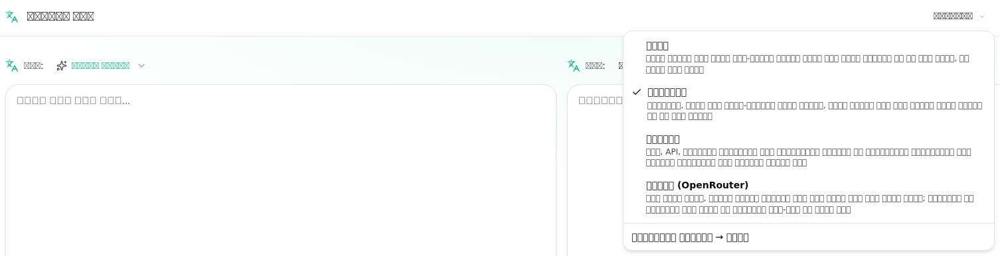
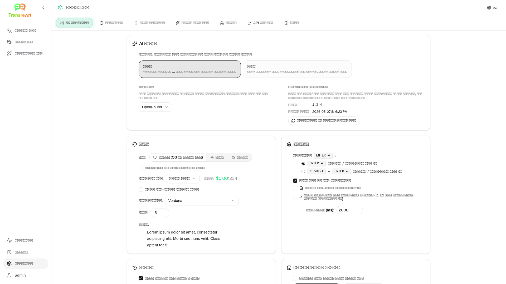

<a id="transrewrt-user-guide"></a>
# ਯੂਜ਼ਰ ਗਾਈਡ

<br/>

<a id="introduction"></a>
## ਪਰਿਚਈ

Transrewrt ਤਿੰਨ ਮੁੱਖ ਤਰੀਕਿਆਂ ਨਾਲ ਟੈਕਸਟ ਨਾਲ ਕੰਮ ਕਰਨ ਵਿੱਚ ਮਦਦ ਕਰਦਾ ਹੈ:

- **ਅਨੁਵਾਦ ਕਰੋ** - ਇੱਕ ਭਾਸ਼ਾ ਤੋਂ ਦੂਜੀ ਭਾਸ਼ਾ ਵਿੱਚ ਟੈਕਸਟ ਨੂੰ ਬਦਲੋ।
- **ਪੁਨਰਲੇਖਨ** - ਸਪਸ਼ਟ, ਛੋਟੇ ਜਾਂ ਵਧੇਰੇ ਔਪਚਾਰਿਕ ਵਰਗੀ ਵੱਖਰੀ ਸ਼ੈਲੀ ਵਿੱਚ ਟੈਕਸਟ ਨੂੰ ਮੁੜ ਲਿਖੋ।
- **ਰੂਪਾਂਤਰਿਤ ਕਰੋ** - ਟੈਕਸਟ ਨੂੰ ਪ੍ਰਾਪਤ ਕਰਨ ਲਈ ਪ੍ਰਾਉਪਟਸ ਨਾਮਕ ਕਸਟਮ ਏਆਈ ਹਦਾਇਤਾਂ ਦੀ ਵਰਤੋਂ ਕਰੋ।

ਡਿਫੌਲਟ ਰੂਪ ਵਿੱਚ ਐਪ **Easy** ਮੋਡ ਵਿੱਚ ਚੱਲਦੀ ਹੈ: ਤੁਸੀਂ ਸੈਟਿੰਗਜ਼ ਵਿੱਚ ਇੱਕ **ਪ੍ਰੀਸੈਟ** (ਉਦਾਹਰਨ ਲਈ Free (OpenRouter), Standard, Advanced, ਜਾਂ Technical) ਅਤੇ ਇੱਕ **ਪ੍ਰਦਾਤਾ** ਚੁਣਦੇ ਹੋ, ਬਿਨਾਂ ਮਾਡਲ IDs ਚੁਣੇ। ਜੇਕਰ ਤੁਸੀਂ [**ਸੈਟਿੰਗਜ਼** > **ਆਮ ਸੈਟਿੰਗਾਂ**](#general-settings) ਤੋਂ ਕਲਾਸਿਕ ਮਾਡਲ ਸੂਚੀ ਚਾਹੁੰਦੇ ਹੋ, ਤਾਂ [**ਸੈਟਿੰਗਜ਼** > **ਮਾਡਲ**](#models) ਵਿੱਚ **ਉੱਨਤ** ਮੋਡ 'ਤੇ ਸਵਿੱਚ ਕਰੋ।

<br/>

ਇਹ ਗਾਈਡ ਸਥਾਪਿਤ ਅਤੇ ਚੱਲ ਰਹੇ ਐਪ ਦੀ ਵਰਤੋਂ ਕਿਵੇਂ ਕਰਨੀ ਹੈ, ਇਹ ਸਮਝਾਉਂਦੀ ਹੈ। ਸਥਾਪਨਾ ਕਦਮਾਂ ਲਈ, ਮੁੱਖ [**README**](README.pa.md) ਵੇਖੋ।

<br/>

> ℹ️ **ਨੋਟ**<br/>
> Transrewrt Windows ਅਤੇ Linux ਲਈ ਡੈਸਕਟਾਪ ਐਪ ਵਜੋਂ, ਅਤੇ ਸੈਲਫ-ਹੋਸਟਡ ਵੈਬ ਐਪ ਵਜੋਂ ਉਪਲਬਧ ਹੈ। ਇਹ ਗਾਈਡ ਐਪ ਦੀ ਰੋਜ਼ਾਨਾ ਵਰਤੋਂ 'ਤੇ ਕੇਂਦਰਤ ਹੈ। ਜਿੱਥੇ ਕੁਝ ਸਿਰਫ਼ ਇੱਕ ਵਰਜਨ ਨਾਲ ਲਾਗੂ ਹੁੰਦਾ ਹੈ, ਉੱਥੇ ਇਸਨੂੰ ਸਪੱਸ਼ਟ ਤੌਰ 'ਤੇ ਚਿੰਨ੍ਹਿਤ ਕੀਤਾ ਗਿਆ ਹੈ।

<small>**ਹੋਰ ਭਾਸ਼ਾਵਾਂ ਵਿੱਚ ਪੜ੍ਹੋ:** </small>
<small id="lang-list">[English (GB)](../USER-GUIDE.md) · [Português (Brasil)](./USER-GUIDE.pt-BR.md) · [العربية](./USER-GUIDE.ar.md) · [বাংলা](./USER-GUIDE.bn.md) · [Català](./USER-GUIDE.ca.md) · [中文 (中国大陆)](./USER-GUIDE.zh-CN.md) · [中文 (台灣)](./USER-GUIDE.zh-TW.md) · [Hrvatski](./USER-GUIDE.hr.md) · [Čeština](./USER-GUIDE.cs.md) · [Nederlands](./USER-GUIDE.nl.md) · [English (US)](./USER-GUIDE.en-US.md) · [Tagalog](./USER-GUIDE.tl.md) · [Français](./USER-GUIDE.fr.md) · [Deutsch](./USER-GUIDE.de.md) · [Ελληνικά](./USER-GUIDE.el.md) · [हिन्दी](./USER-GUIDE.hi.md) · [Magyar](./USER-GUIDE.hu.md) · [Italiano](./USER-GUIDE.it.md) · [日本語](./USER-GUIDE.ja.md) · [한국어](./USER-GUIDE.ko.md) · [Bahasa Melayu](./USER-GUIDE.ms.md) · [فارسی](./USER-GUIDE.fa.md) · [Polski](./USER-GUIDE.pl.md) · [Basa Jawa](./USER-GUIDE.jv.md) · [Português](./USER-GUIDE.pt.md) · [ਪੰਜਾਬੀ](./USER-GUIDE.pa.md) · [Română](./USER-GUIDE.ro.md) · [Русский](./USER-GUIDE.ru.md) · [Slovenčina](./USER-GUIDE.sk.md) · [Español](./USER-GUIDE.es.md) · [Kiswahili](./USER-GUIDE.sw.md) · [Svenska](./USER-GUIDE.sv.md) · [తెలుగు](./USER-GUIDE.te.md) · [ไทย](./USER-GUIDE.th.md) · [Türkçe](./USER-GUIDE.tr.md) · [Українська](./USER-GUIDE.uk.md) · [Tiếng Việt](./USER-GUIDE.vi.md)</small>

<small>

> **UI ਅਤੇ ਦਸਤਾਵੇਜ਼ੀਕਰਨ ਅਨੁਵਾਦਾਂ ਬਾਰੇ ਨੋਟ:** ਮੂਲ ਅੰਗਰੇਜ਼ੀ (UK) ਨੂੰ ਛੱਡ ਕੇ ਸਾਰੀਆਂ ਇੰਟਰਫੇਸ ਭਾਸ਼ਾਵਾਂ 
> AI ਮਾਡਲਾਂ ਦੀ ਵਰਤੋਂ ਕਰਕੇ ਅਨੁਵਾਦਿਤ ਕੀਤੀਆਂ ਗਈਆਂ ਸਨ; ਸ਼ਬਦਾਵਲੀ ਅਸ਼ੁੱਧ ਹੋ ਸਕਦੀ ਹੈ ਜਾਂ ਗਲਤੀਆਂ ਸ਼ਾਮਲ ਹੋ ਸਕਦੀਆਂ ਹਨ।

</small>

<br/>

<!-- START doctoc generated TOC please keep comment here to allow auto update -->
<!-- DON'T EDIT THIS SECTION, INSTEAD RE-RUN doctoc TO UPDATE -->
**ਵਿਸ਼ਾ-ਸੂਚੀ**

- [ਸ਼ੁਰੂ ਕਰਨ ਤੋਂ ਪਹਿਲਾਂ](#before-you-start)
  - [ਮੁਫ਼ਤ OpenRouter API ਕੁੰਜੀ ਕਿਵੇਂ ਪ੍ਰਾਪਤ ਕਰਨੀ ਹੈ (ਡੈਸਕਟਾਪ ਐਪ)](#how-to-get-a-free-openrouter-api-key-desktop-app)
- [ਸ਼ੁਰੂਆਤ](#getting-started)
- [ਵਿੰਡੋ ਦੇ ਮੁੱਖ ਹਿੱਸੇ](#main-parts-of-the-window)
  - [ਸਾਈਡਬਾਰ](#sidebar)
  - [ਟੂਲਬਾਰ](#toolbar)
  - [ਇਨਪੁਟ ਅਤੇ ਆਉਟਪੁਟ ਪੈਨਲ](#input-and-output-panels)
- [ਅਨੁਵਾਦ ਕਰੋ](#translate)
  - [ਟੈਕਸਟ ਦਾ ਅਨੁਵਾਦ ਕਰੋ](#translate-text)
  - [ਭਾਸ਼ਾ ਚੋਣ](#language-selection)
  - [ਮਦਦਗਾਰ ਅਨੁਵਾਦ ਸੈਟਿੰਗਾਂ](#helpful-translation-settings)
  - [ਆਪਣੇ ਅਨੁਵਾਦ ਨੂੰ ਸੁਧਾਰਨਾ](#refining-your-translation)
  - [ਸ਼ਬਦ-ਕੋਸ਼ ਦੀ ਵਰਤੋਂ](#using-the-glossary)
- [Rewrite](#rewrite)
- [Transform](#transform)
  - [ਮੌਜੂਦਾ ਪ੍ਰੋਂਪਟ ਚਲਾਓ](#run-an-existing-prompt)
  - [ਜੇਕਰ ਤੁਹਾਡੇ ਕੋਲ ਅਜੇ ਕੋਈ ਪ੍ਰੋਂਪਟ ਨਹੀਂ ਹੈ](#if-you-have-no-prompts-yet)
  - [ਤੇਜ਼ੀ ਨਾਲ ਪ੍ਰੋਂਪਟ ਬਣਾਓ](#create-a-prompt-quickly)
  - [ਪ੍ਰੋਂਪਟ ਸੋਧੋ](#edit-a-prompt)
  - [ਇਸਦੀ ਵਰਤੋਂ ਕਰਨ ਤੋਂ ਪਹਿਲਾਂ ਪ੍ਰੋਂਪਟ ਦਾ ਟੈਸਟ ਕਰੋ](#test-a-prompt-before-using-it)
- [ਡੈਸ਼ਬੋਰਡ](#dashboard)
  - [ਡਾਟਾ ਫਿਲਟਰ ਕਰੋ](#filter-the-data)
  - [ਡੈਸ਼ਬੋਰਡ ਟੈਬ](#dashboard-tabs)
  - [ਡਾਟਾ ਨਿਰਯਾਤ ਕਰੋ](#export-data)
  - [ਮਾਡਲ ਲਈ ਸਟੋਰ ਕੀਤੇ ਰਿਕਾਰਡ ਮਿਟਾਓ](#delete-stored-records-for-a-model)
- [ਇਤਿਹਾਸ](#history)
  - [ਇਤਿਹਾਸ ਫਿਲਟਰ ਕਰੋ](#filter-the-history)
  - [ਇਤਿਹਾਸ ਡਾਟਾ ਨਿਰਯਾਤ ਕਰੋ](#export-history-data)
- [ਸੈਟਿੰਗਾਂ](#settings)
  - [ਆਮ ਸੈਟਿੰਗਾਂ](#general-settings)
  - [ਮਾਡਲ](#models)
  - [ਭਾਸ਼ਾਵਾਂ](#languages)
  - [ਲਾਗਤ ਟਰੈਕਿੰਗ](#cost-tracking)
  - [Transform (ਸੈਟਿੰਗ ਟੈਬ)](#transform-settings-tab)
  - [ਸ਼ਬਦ-ਕੋਸ਼ (ਸੈਟਿੰਗ ਟੈਬ)](#glossary-settings-tab)
  - [ਉਪਭੋਗਤਾ](#users)
  - [API ਕੌਂਫਿਗਰੇਸ਼ਨ](#api-config)
  - [ਬਾਰੇ](#about)
- [ਆਮ ਸਮੱਸਿਆਵਾਂ](#common-issues)
  - [ਐਪ ਟੈਕਸਟ ਦਾ ਅਨੁਵਾਦ, ਰੀਰਾਈਟ, ਜਾਂ ਟ੍ਰਾਂਸਫਾਰਮ ਨਹੀਂ ਕਰੇਗਾ](#the-app-will-not-translate-rewrite-or-transform-text)
  - [ਮਾਡਲ ਸੂਚੀ ਖਾਲੀ ਹੈ](#the-model-list-is-empty)
  - [ਨਤੀਜਾ ਬਹੁਤ ਹੌਲੀ ਜਾਂ ਬਹੁਤ ਮਹਿੰਗਾ ਹੈ](#the-result-is-too-slow-or-too-expensive)
  - [ਇੰਟਰਫੇਸ ਗਲਤ ਭਾਸ਼ਾ ਵਿੱਚ ਹੈ](#the-interface-is-in-the-wrong-language)
  - [ਟੈਕਸਟ ਬਹੁਤ ਛੋਟਾ ਜਾਂ ਪੜ੍ਹਨ ਵਿੱਚ ਮੁਸ਼ਕਲ ਹੈ](#the-text-is-too-small-or-hard-to-read)
  - [ਡੈਸ਼ਬੋਰਡ ਸਾਰਾਂਸ਼ ਖਾਲੀ ਲੱਗਦਾ ਹੈ](#dashboard-summary-looks-empty)
  - [ਲਾਗਤ "ਉਪਲਬਧ ਨਹੀਂ" ਦਿਖਾਉਂਦੀ ਹੈ ਜਾਂ ਗਲਤ ਲੱਗਦੀ ਹੈ](#cost-shows-not-available-or-seems-wrong)
  - [ਕੁੱਲ ਲਾਗਤ ਮੇਰੇ ਪ੍ਰੋਵਾਈਡਰ ਬਿੱਲ ਨਾਲ ਮੇਲ ਨਹੀਂ ਖਾਂਦੀ](#total-cost-does-not-match-my-provider-bill)
  - [ਇਤਿਹਾਸ ਪੰਨਾ ਸਾਈਡਬਾਰ ਤੋਂ ਗੁੰਮ ਹੈ](#the-history-page-is-missing-from-the-sidebar)
  - [ਵੈਬ ਐਪ: ਅਚਾਨਕ ਲੌਗਇਨ ਪੰਨੇ 'ਤੇ ਰੀਡਾਇਰੈਕਟ ਕੀਤਾ ਗਿਆ](#web-app-redirected-to-the-login-page-unexpectedly)
  - [ਵੈਬ ਪ੍ਰਸ਼ਾਸਕ: ਪਾਸਵਰਡ ਭੁੱਲ ਗਿਆ ਜਾਂ ਗੁਆ ​​ਦਿੱਤਾ](#web-admin-forgot-or-lost-a-password)
  - [ਡੈਸ਼ਬੋਰਡ ਹੋਰ ਉਪਭੋਗਤਾਵਾਂ ਲਈ ਕੋਈ ਡਾਟਾ ਨਹੀਂ ਦਿਖਾਉਂਦਾ (ਵੈਬ)](#dashboard-shows-no-data-for-other-users-web)
  - [ਮੈਂ ਇੱਕ ਪ੍ਰੋਂਪਟ ਬਦਲਿਆ ਅਤੇ ਸੰਪਾਦਨ ਗੁਆ ​​ਦਿੱਤੇ](#i-changed-a-prompt-and-lost-the-edits)
- [ਤੇਜ਼ ਸੁਝਾਅ](#quick-tips)
- [ਬੇਦਾਅਵਾ](#disclaimer)
- [ਲਾਇਸੈਂਸ](#license)

<!-- END doctoc generated TOC please keep comment here to allow auto update -->

<br/><br/>

<a id="before-you-start"></a>
## ਸ਼ੁਰੂਆਤ ਤੋਂ ਪਹਿਲਾਂ

Transrewrt ਦੀ ਵਰਤੋਂ ਕਰਨ ਲਈ, ਤੁਹਾਨੂੰ ਘੱਟੋ-ਘੱਟ ਇੱਕ AI ਪ੍ਰਦਾਤਾ ਤੱਕ ਪਹੁੰਚ ਦੀ ਲੋੜ ਹੈ। ਸਮਰਥਿਤ ਪ੍ਰਦਾਤਾ ਹਨ: [OpenRouter](https://openrouter.ai) (ਜੋ ਕਿ ਬਹੁਤ ਸਾਰੇ ਮਾਡਲਾਂ ਨੂੰ ਇਕੱਠਾ ਕਰਦਾ ਹੈ), OpenAI, Anthropic, Google Gemini, DeepSeek, Groq, Mistral, xAI, Cerebras, ਅਤੇ [Ollama](https://ollama.com) ਸਥਾਨਕ ਮਾਡਲਾਂ ਲਈ।

ਤੁਹਾਨੂੰ ਸ਼ੁਰੂ ਕਰਨ ਲਈ ਭੁਗਤਾਨ ਕੀਤੇ ਮਾਡਲ ਦੀ ਚੋਣ ਕਰਨ ਦੀ ਲੋੜ ਨਹੀਂ ਹੈ। ਜਿਵੇਂ ਹੀ ਤੁਸੀਂ ਆਪਣੀ OpenRouter API ਕੁੰਜੀ ਜੋੜਦੇ ਹੋ, ਐਪ ਆਪਣੇ ਆਪ ਇੱਕ ਬਿਲਟ-ਇਨ **ਮੁਫ਼ਤ** OpenRouter ਵਿਕਲਪ ਨੂੰ ਸਮਰੱਥ ਬਣਾਉਂਦੀ ਹੈ। ਇਹ ਤੁਹਾਨੂੰ ਤੁਰੰਤ ਟੈਕਸਟ ਦਾ ਅਨੁਵਾਦ, ਮੁੜ-ਲਿਖਣ ਅਤੇ ਰੂਪਾਂਤਰਿਤ ਕਰਨਾ ਸ਼ੁਰੂ ਕਰਨ ਦਿੰਦਾ ਹੈ। ਬਦਲਵੇਂ ਤੌਰ 'ਤੇ, ਤੁਸੀਂ Cerebras, Google, Groq, Mistral AI, ਜਾਂ [NVIDIA](https://build.nvidia.com/) (OpenAI-ਸਮਾਨ API) ਤੋਂ ਮੁਫ਼ਤ API ਕੁੰਜੀ ਵੀ ਪ੍ਰਾਪਤ ਕਰ ਸਕਦੇ ਹੋ।

ਸਧਾਰਨ ਭਾਸ਼ਾ ਵਿੱਚ:

- **Easy** ਮੋਡ ਵਿੱਚ, ਇੱਕ **ਪ੍ਰੀਸੈਟ** (Free (OpenRouter), Standard, Advanced, ਜਾਂ Technical) ਤੁਹਾਡੇ ਦੁਆਰਾ ਚੁਣੇ ਗਏ **ਪ੍ਰਦਾਤਾ** (OpenRouter, OpenAI, Ollama, ਅਤੇ ਹੋਰ) ਲਈ ਇੱਕ ਮਾਡਲ ਨਾਲ ਮੈਪ ਹੁੰਦਾ ਹੈ। ਟੂਲਬਾਰ ਵਿੱਚ ਸਿਰਫ਼ ਉਹੀ ਪ੍ਰੀਸੈਟ ਦਿਖਾਈ ਦਿੰਦੇ ਹਨ ਜਿਨ੍ਹਾਂ ਦੀ ਮੌਜੂਦਾ ਪ੍ਰਦਾਤਾ ਲਈ ਮੈਪਿੰਗ ਹੁੰਦੀ ਹੈ। ਤੁਸੀਂ Translate, Rewrite, ਅਤੇ Transform 'ਤੇ ਪ੍ਰੀਸੈਟ ਚੁਣਦੇ ਹੋ।
- **ਉੱਨਤ** ਮੋਡ ਵਿੱਚ, ਇੱਕ **ਮਾਡਲ** ਉਹ AI ਇੰਜਣ ਹੈ ਜਿਸਨੂੰ ਤੁਸੀਂ ਸਿੱਧਾ ਚੁਣਦੇ ਹੋ। ਮਾਡਲ IDs ਇੱਕ **ਪ੍ਰਦਾਤਾ ਪ੍ਰੀਫਿਕਸ** (ਉਦਾਹਰਨ ਲਈ `openrouter/…`, `openai/…`, `ollama/…`) ਦੀ ਵਰਤੋਂ ਕਰਦੇ ਹਨ।
- ਇੱਕ **API key** (ਜਾਂ, Ollama ਲਈ, ਇੱਕ **base URL**) ਉਹ ਤਰੀਕਾ ਹੈ ਜਿਸ ਰਾਹੀਂ ਐਪ ਉਸ ਪ੍ਰਦਾਤਾ ਤੱਕ ਪਹੁੰਚਦੀ ਹੈ।

ਜੇ ਤੁਸੀਂ **ਡੈਸਕਟਾਪ ਐਪ** ਦੀ ਵਰਤੋਂ ਕਰ ਰਹੇ ਹੋ, ਤਾਂ ਹਰ ਪ੍ਰਦਾਤਾ ਲਈ [**ਸੈਟਿੰਗਾਂ** > **API ਕਾਨਫਿਗ**](#api-config) ਵਿੱਚ ਕੁੰਜੀਆਂ ਜੋੜੋ। ਸਿਰਫ OpenRouter ਦੀ ਵਰਤੋਂ ਲਈ, ਹੇਠਾਂ [ਮੁਫ਼ਤ OpenRouter API ਕੁੰਜੀ ਕਿਵੇਂ ਪ੍ਰਾਪਤ ਕਰੀਏ](#how-to-get-a-free-openrouter-api-key-desktop-app) ਨੂੰ ਦੇਖੋ। ਜੇ ਤੁਸੀਂ API ਕੁੰਜੀ ਦੀ ਵਰਤੋਂ ਨਹੀਂ ਕਰਨਾ ਚਾਹੁੰਦੇ, ਤਾਂ ਤੁਸੀਂ Ollama ਇੰਸਟਾਲ ਕਰ ਸਕਦੇ ਹੋ (ਜੋ [ollama.com](https://ollama.com) ਤੋਂ ਹੈ) ਅਤੇ ਸਥਾਨਕ ਮਾਡਲਾਂ ਦੀ ਵਰਤੋਂ ਕਰ ਸਕਦੇ ਹੋ, ਜਿਵੇਂ `translategemma:4b`.

ਜੇਕਰ ਤੁਸੀਂ **ਵੈੱਬ ਵਰਜਨ** ਦੀ ਵਰਤੋਂ ਕਰ ਰਹੇ ਹੋ, ਤਾਂ ਸਰਵਰ ਮਾਲਕ ਵਾਤਾਵਰਣ ਚਲਾਂ ਰਾਹੀਂ ਪ੍ਰਦਾਤਾਵਾਂ ਨੂੰ ਕਾਨਫਿਗਰ ਕਰਦਾ ਹੈ, ਇਸ ਲਈ ਤੁਸੀਂ ਐਪਲੀਕੇਸ਼ਨ ਵਿੱਚ ਸਿੱਧੇ ਤੌਰ 'ਤੇ API ਕੁੰਜੀਆਂ ਦਰਜ ਨਹੀਂ ਕਰ ਸਕਦੇ।

<br/>

<a id="how-to-get-a-free-openrouter-api-key-desktop-app"></a>
### ਮੁਫ਼ਤ OpenRouter API ਕੁੰਜੀ ਕਿਵੇਂ ਪ੍ਰਾਪਤ ਕਰੀਏ (ਡੈਸਕਟਾਪ ਐਪ)

ਜੇਕਰ ਤੁਸੀਂ ਡੈਸਕਟਾਪ ਐਪ ਦੀ ਵਰਤੋਂ ਕਰ ਰਹੇ ਹੋ, ਤਾਂ ਇਹ ਕਦਮ ਅਨੁਸਰਣ ਕਰੋ:

1. ਆਪਣੇ ਵੈੱਬ ਬਰਾਊਜ਼ਰ ਵਿੱਚ [OpenRouter](https://openrouter.ai) 'ਤੇ ਜਾਓ।
2. ਇੱਕ ਖਾਤਾ ਬਣਾਓ ਜਾਂ ਸਾਈਨ ਇਨ ਕਰੋ।
3. [Keys](https://openrouter.ai/keys) ਪੰਨੇ 'ਤੇ ਜਾਓ।
4. ਇੱਕ ਨਵੀਂ API ਕੁੰਜੀ ਬਣਾਉਣ ਲਈ ਬਟਨ 'ਤੇ ਕਲਿੱਕ ਕਰੋ।
5. ਕੁੰਜੀ ਨੂੰ ਇੱਕ ਨਾਮ ਦਿਓ ਤਾਂ ਜੋ ਤੁਸੀਂ ਇਸਨੂੰ ਬਾਅਦ ਵਿੱਚ ਪਛਾਣ ਸਕੋ।
6. ਨਵੀਂ API ਕੁੰਜੀ ਨੂੰ ਕਾਪੀ ਕਰੋ।
7. Transrewrt ਵਾਪਸ ਜਾਓ ਅਤੇ **ਸੈਟਿੰਗਜ਼** > **API ਕਾਨਫਿਗ** ਖੋਲ੍ਹੋ।
8. **OpenRouter API ਕੁੰਜੀ** ਵਿੱਚ ਕੁੰਜੀ ਪੇਸਟ ਕਰੋ (**ਸੈਟਿੰਗਜ਼** > **API ਕਾਨਫਿਗ** ਹੇਠਾਂ)।
9. ਇਹ ਯਕੀਨੀ ਬਣਾਉਣ ਲਈ ਕਿ ਇਹ ਕੰਮ ਕਰਦਾ ਹੈ, **OpenRouter ਕੁੰਜੀ ਦੀ ਜਾਂਚ ਕਰੋ** 'ਤੇ ਕਲਿੱਕ ਕਰੋ।

<br/><br/>

<a id="getting-started"></a>
## ਸ਼ੁਰੂਆਤ

ਜੇਕਰ ਇਹ ਤੁਹਾਡੀ Transrewrt ਦੀ ਪਹਿਲੀ ਵਰਤੋਂ ਹੈ, ਤਾਂ ਇਸ ਕ੍ਰਮ ਨੂੰ ਅਨੁਸਰਣ ਕਰੋ:

1. ਐਪ ਖੋਲ੍ਹੋ।
2. ਜੇ ਲੋੜ ਹੋਵੇ ਤਾਂ ਗਲੋਬ ਆਈਕਨ ਤੋਂ ਆਪਣੀ **ਇੰਟਰਫੇਸ ਭਾਸ਼ਾ** ਚੁਣੋ।
3. ਜੇ ਤੁਸੀਂ **ਡੈਸਕਟਾਪ ਐਪ** 'ਤੇ ਹੋ, ਤਾਂ [**ਸੈਟਿੰਗਾਂ** > **API ਕਾਨਫਿਗ**](#api-config) ਖੋਲ੍ਹੋ, ਘੱਟੋ-ਘੱਟ ਇੱਕ ਪ੍ਰਦਾਤਾ (ਉਦਾਹਰਨ ਵਜੋਂ OpenRouter) ਲਈ API ਕੁੰਜੀ ਜੋੜੋ, ਅਤੇ ਇਹ ਕੰਮ ਕਰਦੀ ਹੈ ਇਹ ਪੁਸ਼ਟੀ ਕਰਨ ਲਈ **ਟੈਸਟ** 'ਤੇ ਕਲਿਕ ਕਰੋ।
4. [**ਸੈਟਿੰਗਾਂ** > **ਆਮ ਸੈਟਿੰਗਾਂ**](#general-settings) ਖੋਲ੍ਹੋ। **ਆਸਾਨ** ਮੋਡ (ਡਿਫਾਲਟ) ਵਿੱਚ, ਇੱਕ **ਪ੍ਰਦਾਤਾ** ਚੁਣੋ ਜਿਸਦੀ ਇੱਕ ਕਾਨਫਿਗ ਕੀਤੀ ਕੁੰਜੀ ਹੈ। **ਉੱਨਤ** ਮੋਡ ਵਿੱਚ, [**ਸੈਟਿੰਗਾਂ** > **ਮਾਡਲ**](#models) ਖੋਲ੍ਹੋ ਅਤੇ **ਚੁਣੇ ਹੋਏ ਮਾਡਲ** ਵਿੱਚ ਇੱਕ ਜਾਂ ਇੱਕ ਤੋਂ ਵੱਧ ਮਾਡਲ ਜੋੜੋ।
5. **ਅਨੁਵਾਦ** 'ਤੇ, ਟੂਲਬਾਰ ਵਿੱਚ ਇੱਕ **ਪ੍ਰੀਸੈਟ** (ਆਸਾਨ) ਜਾਂ **ਮਾਡਲ** (ਉੱਨਤ) ਚੁਣੋ।
6. [**ਸੈਟਿੰਗਜ਼** > **ਭਾਸ਼ਾਵਾਂ**](#languages) ਖੋਲ੍ਹੋ ਅਤੇ ਆਪਣੀਆਂ **ਸਿਖਰਲੀਆਂ ਭਾਸ਼ਾਵਾਂ** ਚੁਣੋ ਜੇ ਤੁਸੀਂ ਆਪਣੀਆਂ ਸਭ ਤੋਂ ਵੱਧ ਵਰਤੀਆਂ ਜਾਣ ਵਾਲੀਆਂ ਭਾਸ਼ਾਵਾਂ ਨੂੰ ਪਹਿਲਾਂ ਦਿਖਾਉਣਾ ਚਾਹੁੰਦੇ ਹੋ।
7. ਸਧਾਰਨ ਅਨੁਵਾਦ ਚਲਾਓ ਤਾਂ ਜੋ ਸਭ ਕੁਝ ਕੰਮ ਕਰ ਰਿਹਾ ਹੈ, ਇਸ ਤੋਂ ਬਾਅਦ **ਪੁਨਰਲੇਖਨ** ਅਤੇ **ਰੂਪਾਂਤਰਿਤ ਕਰੋ** ਦੀ ਕੋਸ਼ਿਸ਼ ਕਰੋ।

ਇਹ ਕ੍ਰਮ ਮਹੱਤਵਪੂਰਨ ਹੈ। ਇਹ ਪਹਿਲੀ ਵਾਰ ਵਰਤੋਂ ਦੌਰਾਨ ਆਉਣ ਵਾਲੀ ਸਭ ਤੋਂ ਆਮ ਸਮੱਸਿਆ ਨੂੰ ਰੋਕਦਾ ਹੈ: ਐਪ ਕੋਲ ਕਾਰਜਸ਼ੀਲ API ਕਨੈਕਸ਼ਨ ਜਾਂ ਚੁਣੇ ਹੋਏ ਪ੍ਰੀਸੈਟ/ਮਾਡਲ ਹੋਣ ਤੋਂ ਪਹਿਲਾਂ ਕਿਸੇ ਟਾਸਕ ਨੂੰ ਚਲਾਉਣ ਦੀ ਕੋਸ਼ਿਸ਼ ਕਰਨਾ।

<br/><br/>

<a id="main-parts-of-the-window"></a>
## ਵਿੰਡੋ ਦੇ ਮੁੱਖ ਹਿੱਸੇ

ਐਪ ਤਿੰਨ ਮੁੱਖ ਖੇਤਰਾਂ ਵਿੱਚ ਵੰਡਿਆ ਗਿਆ ਹੈ:

- ਖੱਬੇ ਪਾਸੇ **ਸਾਈਡਬਾਰ**।
- ਉੱਪਰ **ਟੂਲਬਾਰ**।
- ਕੇਂਦਰ ਵਿੱਚ **ਕੰਮ ਕਰਨ ਵਾਲਾ ਖੇਤਰ**।

<br/>

<a id="sidebar"></a>
### ਸਾਈਡਬਾਰ

ਐਪ ਵਿੱਚ ਆਸ ਪਾਸ ਜਾਣ ਲਈ ਸਾਈਡਬਾਰ ਦੀ ਵਰਤੋਂ ਕਰੋ। ਐਪ ਲੋਗੋ ਦੇ ਅਗਲੇ ਆਈਕਨ 'ਤੇ ਕਲਿੱਕ ਕਰਕੇ ਤੁਸੀਂ ਵਧੇਰੇ ਥਾਂ ਲਈ ਸਾਈਡਬਾਰ ਨੂੰ ਸੰਕੁਚਿਤ ਕਰ ਸਕਦੇ ਹੋ।

<br/>

<table>
  <tr>
    <td valign="top">
       
    </td>
    <td valign="top">
      <br/><br/>
      <ul>
        <li><strong>ਅਨੁਵਾਦ ਕਰੋ</strong> ਅਨੁਵਾਦ ਕਾਰਜਸਥਾਨ ਖੋਲ੍ਹਦਾ ਹੈ।</li><br/>
        <li><strong>ਪੁਨਰਲੇਖਨ</strong> ਪੁਨਰਲੇਖਨ ਕਾਰਜਸਥਾਨ ਖੋਲ੍ਹਦਾ ਹੈ।</li><br/>
        <li><strong>ਰੂਪਾਂਤਰਿਤ ਕਰੋ</strong> ਕਸਟਮ ਪ੍ਰੰਪਟ ਕਾਰਜਸਥਾਨ ਖੋਲ੍ਹਦਾ ਹੈ।</li><br/>
        <li><strong>ਡੈਸ਼ਬੋਰਡ</strong> ਵਰਤੋਂ ਅਤੇ ਲਾਗਤ ਬਾਰੇ ਜਾਣਕਾਰੀ ਦਰਸਾਉਂਦਾ ਹੈ।</li><br/>
        <li><strong>ਸੈਟਿੰਗਜ਼</strong> ਸੈਟਿੰਗਜ਼ ਪੈਨਲ ਖੋਲ੍ਹਦਾ ਹੈ।</li><br/>
        <li><strong>ਇਤਿਹਾਸ</strong> ਇਨਪੁਟ ਅਤੇ ਆਉਟਪੁਟ ਟੈਕਸਟ ਨਾਲ ਵਰਤੋਂ ਇਤਿਹਾਸ ਦਿਖਾਉਂਦਾ ਹੈ</li><br/>
        <li><strong>ਯੂਜ਼ਰ</strong> ਲਾਗਇਨ ਕੀਤੇ ਯੂਜ਼ਰ ਦਾ ਯੂਜ਼ਰਨੇਮ ਦਿਖਾਉਂਦਾ ਹੈ (ਸਿਰਫ਼ ਵੈੱਬ)।</li>
      </ul>
    </td>
  </tr>
</table>

<br/>

<a id="toolbar"></a>
### ਟੂਲਬਾਰ

ਟੂਲਬਾਰ ਥੋੜ੍ਹਾ ਬਹੁਤ ਬਦਲ ਜਾਂਦਾ ਹੈ ਜਿੱਥੇ ਵੀ ਤੁਸੀਂ ਐਪ ਵਿੱਚ ਹੁੰਦੇ ਹੋ।

- ਖੱਬੇ ਪਾਸੇ, ਇਹ ਮੌਜੂਦਾ ਪੰਨੇ ਦਾ ਨਾਮ ਦਿਖਾਉਂਦਾ ਹੈ।
- ਸੱਜੇ ਪਾਸੇ, ਇਹ **ਪ੍ਰੀਸੈਟ ਜਾਂ ਮਾਡਲ ਚੋਣਕਾਰ** ਅਤੇ **ਇੰਟਰਫੇਸ ਭਾਸ਼ਾ** ਕੰਟਰੋਲ ਦਿਖਾਉਂਦਾ ਹੈ।

**Easy** ਮੋਡ ਵਿੱਚ, ਟੂਲਬਾਰ ਬਿਲਟ-ਇਨ ਪ੍ਰੀਸੈਟਾਂ **Free (OpenRouter)**, **Standard**, **Advanced**, ਅਤੇ **Technical** ਦੇ ਨਾਲ ਇੱਕ **ਪ੍ਰੀਸੈਟ ਚੋਣਕਾਰ** ਦਿਖਾਉਂਦਾ ਹੈ। ਕਿਹੜੇ ਪ੍ਰੀਸੈਟ ਦਿਖਾਈ ਦੇਣਗੇ ਇਹ ਤੁਹਾਡੇ ਦੁਆਰਾ [**ਸੈਟਿੰਗਜ਼** > **ਆਮ ਸੈਟਿੰਗਾਂ**](#general-settings) ਵਿੱਚ ਚੁਣੇ ਗਏ **ਪ੍ਰਦਾਤਾ** 'ਤੇ ਨਿਰਭਰ ਕਰਦਾ ਹੈ—ਉਦਾਹਰਨ ਲਈ, **Free (OpenRouter)** ਸਿਰਫ਼ ਉਦੋਂ ਸੂਚੀਬੱਧ ਹੁੰਦਾ ਹੈ ਜਦੋਂ ਪ੍ਰਦਾਤਾ OpenRouter ਹੁੰਦਾ ਹੈ। ਜੇਕਰ **ਪ੍ਰਦਾਤਾ** **Ollama** ਹੈ, ਤਾਂ ਟੂਲਬਾਰ ਪ੍ਰੀਸੈਟਾਂ ਦੀ ਬਜਾਏ ਤੁਹਾਡੇ ਇੰਸਟਾਲ ਕੀਤੇ ਸਥਾਨਕ ਮਾਡਲਾਂ ਨੂੰ ਸੂਚੀਬੱਧ ਕਰਦਾ ਹੈ।

**ਉੱਨਤ** ਮੋਡ ਵਿੱਚ, **ਮਾਡਲ ਚੋਣਕਰਤਾ** ਤੁਹਾਨੂੰ ਮੌਜੂਦਾ ਕੰਮ ਲਈ ਕਿਸ AI ਇੰਜਣ ਦੀ ਵਰਤੋਂ ਕਰਨੀ ਹੈ ਇਹ ਚੁਣਨ ਦੀ ਆਗਿਆ ਦਿੰਦਾ ਹੈ।



ਉੱਨਤ ਮੋਡ ਵਿੱਚ, ਕੁਝ ਮੁਫ਼ਤ ਮਾਡਲ ਹਮੇਸ਼ਾ ਉਪਲਬਧ ਨਹੀਂ ਹੋ ਸਕਦੇ—ਇਹ ਆਫਲਾਈਨ ਹੋ ਸਕਦੇ ਹਨ ਜਾਂ ਵਰਤੋਂ ਦੀ ਸੀਮਾ ਪਹੁੰਚ ਸਕਦੇ ਹਨ। ਐਪ ਉਸ ਮਾਡਲ ਨੂੰ ਤੁਹਾਡੇ ਸੂਚੀ ਤੋਂ ਆਪਣੇ ਆਪ ਹਟਾ ਸਕਦੀ ਹੈ। ਇਹ ਨਿਸ਼ਚਿਤ ਕਰਨ ਲਈ ਕਿ ਕਿਹੜੇ ਮਾਡਲ ਦਿਖਾਈ ਦੇਣ, [**ਸੈਟਿੰਗਾਂ** > **ਮਾਡਲ**](#models) 'ਤੇ ਜਾਓ। ਤੁਸੀਂ ਟੂਲਬਾਰ ਵਿੱਚ ਮਾਡਲ ਨਾਮ ਦੇ ਖੱਬੇ ਪਾਸੇ ਪ੍ਰਦਾਤਾ ਆਈਕਨ ਤੋਂ ਮਾਡਲ ਸੈਟਿੰਗਾਂ ਖੋਲ੍ਹ ਸਕਦੇ ਹੋ।

<br/>

ਐਪ ਇੰਟਰਫੇਸ ਭਾਸ਼ਾ, ਜਿਵੇਂ ਕਿ ਮੇਨੂ ਅਤੇ ਬਟਨ, ਨੂੰ ਬਦਲਣ ਲਈ **ਗਲੋਬ ਆਈਕਨ + ਭਾਸ਼ਾ ਕੋਡ** ਹੁੰਦਾ ਹੈ। ਇਹ **ਅਨੁਵਾਦ ਕਰੋ** ਵਿੱਚ ਵਰਤੀਆ ਜਾਣ ਵਾਲਾ ਅਨੁਵਾਦ ਭਾਸ਼ਾਵਾਂ ਨੂੰ **ਬਦਲਦਾ ਨਹੀਂ** ਹੈ।


<br/>

<a id="input-and-output-panels"></a>
### ਇਨਪੁਟ ਅਤੇ ਆਉਟਪੁਟ ਪੈਨਲ

ਜ਼ਿਆਦਾਤਰ ਕਾਰਜਸਥਾਨ ਇੱਕ ਖੱਬੇ ਪਾਸੇ ਦੇ **ਇਨਪੁਟ** ਪੈਨਲ ਅਤੇ ਇੱਕ ਸੱਜੇ ਪਾਸੇ ਦੇ **ਆਉਟਪੁਟ** ਪੈਨਲ ਦੀ ਵਰਤੋਂ ਕਰਦੇ ਹਨ।

ਹਰੇਕ ਪੈਨਲ ਵੀ ਦਰਸਾਉਂਦਾ ਹੈ:

| **ਇਨਪੁਟ**                                                          | **ਆਉਟਪੁਟ**                                                                                                                  |
|--------------------------------------------------------------------|-----------------------------------------------------------------------------------------------------------------------------|
| - ਅੱਖਰ ਗਿਣਤੀ <br/>- ਸ਼ਬਦ ਗਿਣਤੀ <br/>- ਪੈਰੇ ਗਿਣਤੀ   <br/> | - ਕੰਮ ਨੂੰ ਕਰਨ ਵਿੱਚ ਕਿੰਨਾ ਸਮਾਂ ਲੱਗਾ<br/>- **TPS** (ਹਰ ਸਕਿੰਟ ਵਿੱਚ ਟੋਕਨ)<br/>- ਅੱਖਰ, ਸ਼ਬਦ, ਅਤੇ ਪੈਰੇ ਗਿਣਤੀ<br/>- ਵਰਤਿਆ ਗਿਆ ਮਾਡਲ |

ਜੇਕਰ ਤੁਸੀਂ ਤਕਨੀਕੀ ਸ਼ਬਦਾਂ ਬਾਰੇ ਸੋਚ ਰਹੇ ਹੋ:

- **ਟੋਕਨ** ਦਾ ਅਰਥ ਹੈ ਟੈਕਸਟ ਦਾ ਛੋਟਾ ਟੁਕੜਾ। ਤੁਸੀਂ ਇਸਨੂੰ ਇੱਕ ਸ਼ਬਦ ਦਾ ਹਿੱਸਾ ਜਾਂ ਇੱਕ ਛੋਟਾ ਸ਼ਬਦ ਸਮਝ ਸਕਦੇ ਹੋ।
- **TPS** ਦਾ ਅਰਥ ਹੈ ਕਿ ਮਾਡਲ ਨੇ ਹਰ ਸਕਿੰਟ ਵਿੱਚ ਇਹਨਾਂ ਟੈਕਸਟ ਟੁਕੜਿਆਂ ਵਿੱਚੋਂ ਕਿੰਨੇ ਪ੍ਰੋਸੈਸ ਕੀਤੇ।

<br/>

ਤੁਸੀਂ ਹਰੇਕ ਕਾਰਜ ਦੀ ਲਾਗਤ (ਜੇਕਰ ਉਪਲਬਧ ਹੋਵੇ) ਅਤੇ ਕੁੱਲ ਲਾਗਤ ਨੂੰ ਵੀ ਮਾਨੀਟਰ ਕਰ ਸਕਦੇ ਹੋ, [**ਸੈਟਿੰਗਜ਼** > **ਆਮ ਸੈਟਿੰਗਾਂ**](#general-settings) ਤੇ ਵਿਕਲਪ `Show cost information on the actions` ਨੂੰ ਸਮਰੱਥ ਕਰਕੇ।

<br/><br/>

[--------------------------------------------------------------------------------------------------------------------------]: #

<a id="translate"></a>
## ਅਨੁਵਾਦ ਕਰੋ

ਜਦੋਂ ਤੁਸੀਂ ਇੱਕ ਭਾਸ਼ਾ ਤੋਂ ਦੂਜੀ ਭਾਸ਼ਾ ਵਿੱਚ ਟੈਕਸਟ ਨੂੰ ਬਦਲਣਾ ਚਾਹੁੰਦੇ ਹੋ ਤਾਂ **ਅਨੁਵਾਦ ਕਰੋ** ਦੀ ਵਰਤੋਂ ਕਰੋ।


<br/>

<a id="translate-text"></a>
### ਟੈਕਸਟ ਅਨੁਵਾਦ ਕਰੋ

1. **ਅਨੁਵਾਦ** ਖੋਲ੍ਹੋ।
2. **ਤੋਂ** ਵਿੱਚ ਇੱਕ ਭਾਸ਼ਾ ਚੁਣੋ।
3. **ਨੂੰ** ਵਿੱਚ ਇੱਕ ਭਾਸ਼ਾ ਚੁਣੋ।
4. ਟੂਲਬਾਰ ਵਿੱਚ ਇੱਕ ਪ੍ਰੀਸੈਟ (ਆਸਾਨ) ਜਾਂ ਮਾਡਲ (ਉੱਨਤ) ਚੁਣੋ।
5. **ਇਨਪੁਟ** ਵਿੱਚ ਟੈਕਸਟ ਟਾਈਪ ਜਾਂ ਪੇਸਟ ਕਰੋ।
6. **ਅਨੁਵਾਦ ਕਰੋ** ਉੱਤੇ ਕਲਿੱਕ ਕਰੋ।
7. **ਆਉਟਪੁਟ** ਵਿੱਚ ਨਤੀਜਾ ਪੜ੍ਹੋ।
8. ਜੇਕਰ ਤੁਸੀਂ ਨਤੀਜਾ ਕਾਪੀ ਕਰਨਾ ਚਾਹੁੰਦੇ ਹੋ ਤਾਂ ਕਾਪੀ ਬਟਨ ਦੀ ਵਰਤੋਂ ਕਰੋ।
9. ਵਿਕਲਪਕ ਤੌਰ 'ਤੇ ਨਤੀਜੇ ਨੂੰ **Rephrase…** ਜਾਂ ਸ਼ਬਦ ਵਿਕਲਪਾਂ ਨਾਲ ਸੁਧਾਰੋ — [ਆਪਣੀ ਟਰਾਂਸਲੇਸ਼ਨ ਨੂੰ ਸੁਧਾਰਨਾ](#refining-translation) ਨੂੰ ਦੇਖੋ।

<br/>

<a id="language-selection"></a>
### ਭਾਸ਼ਾ ਚੋਣ

- **From** ਇੱਕ ਖਾਸ ਭਾਸ਼ਾ ਜਾਂ **ਭਾਸ਼ਾ ਪਛਾਣੋ** ਹੋ ਸਕਦੀ ਹੈ।
- **To** ਉਹ ਭਾਸ਼ਾ ਹੈ ਜਿਸ ਵਿੱਚ ਤੁਸੀਂ ਨਤੀਜਾ ਚਾਹੁੰਦੇ ਹੋ।

ਤੁਹਾਡੀ ਚੁਣੀ ਹੋਈ **ਸਿਖਰਲੀਆਂ ਭਾਸ਼ਾਵਾਂ** ਸੂਚੀ ਦੇ ਸਿਖਰ 'ਤੇ ਦਿਖਾਈ ਦਿੰਦੀਆਂ ਹਨ। ਤੁਸੀਂ ਇਨ੍ਹਾਂ ਨੂੰ [**ਸੈਟਿੰਗਜ਼** > **ਭਾਸ਼ਾਵਾਂ**](#languages) ਵਿੱਚ ਸੈੱਟ ਕਰ ਸਕਦੇ ਹੋ।

<br/>

<a id="helpful-translation-settings"></a>
### ਮਦਦਗਾਰ ਅਨੁਵਾਦ ਸੈਟਿੰਗਾਂ

[**ਸੈਟਿੰਗਜ਼** > **ਆਮ ਸੈਟਿੰਗਾਂ**](#general-settings) ਵਿੱਚ, ਤੁਸੀਂ ਇਹ ਬਦਲ ਸਕਦੇ ਹੋ ਕਿ ਅਨੁਵਾਦ ਕਿਵੇਂ ਵਿਵਹਾਰ ਕਰਦਾ ਹੈ:

- **ਆਟੋ-ਕਰੋ ਪੇਸਟ ਕਰਨ 'ਤੇ** ਜਦੋਂ ਤੁਸੀਂ ਟੈਕਸਟ ਪੇਸਟ ਕਰਦੇ ਹੋ ਤਾਂ ਤੁਰੰਤ ਅਨੁਵਾਦ ਚਲਾਉਂਦਾ ਹੈ।
- **ਨਤੀਜੇ ਨੂੰ ਆਟੋ-ਕਾਪੀ ਕਰੋ** ਸਫਲ ਚਲਾਉਣ ਤੋਂ ਬਾਅਦ ਨਤੀਜੇ ਨੂੰ ਆਟੋਮੈਟਿਕ ਤੌਰ 'ਤੇ ਕਾਪੀ ਕਰਦਾ ਹੈ।
- **ਟਾਈਪ ਕਰਦੇ ਸਮੇਂ ਰੀਅਲ-ਟਾਈਮ ਅਨੁਵਾਦ** (⚠️ ਇਹ ਵਰਤੋਂ ਦੇ ਖਰਚੇ ਵਧਾ ਸਕਦਾ ਹੈ) ਜਦੋਂ ਤੁਸੀਂ ਟਾਈਪ ਕਰਦੇ ਹੋ ਤਾਂ ਅਨੁਵਾਦ ਚਲਾਉਂਦਾ ਹੈ।
- **ਟਾਈਮਆਉਟ (ਮਿਲੀਸਕੰਡ)** ਨਿਯੰਤਰਿਤ ਕਰਦਾ ਹੈ ਕਿ ਐਪ ਕਿੰਨੀ ਦੇਰ ਤੱਕ ਰੀਅਲ-ਟਾਈਮ ਅਨੁਵਾਦ ਚਲਾਉਣ ਤੋਂ ਪਹਿਲਾਂ ਰੁਕਦਾ ਹੈ।
- **ENTER ਲਈ ਵਿਹਾਰ** ਚੁਣਦਾ ਹੈ ਕਿ `Enter` ਕੰਮ ਚਲਾਉਂਦਾ ਹੈ ਜਾਂ ਨਵੀਂ ਲਾਈਨ ਸ਼ਾਮਲ ਕਰਦਾ ਹੈ:
  - **Enter** ਅਨੁਵਾਦ ਜਾਂ ਦੁਬਾਰਾ ਲਿਖਣ ਨੂੰ ਚਲਾਉਂਦਾ ਹੈ (ਡਿਫਾਲਟ)।
  - **Shift + Enter** ਅਨੁਵਾਦ ਜਾਂ ਦੁਬਾਰਾ ਲਿਖਣ ਨੂੰ ਚਲਾਉਂਦਾ ਹੈ; ਸਧਾਰਣ **Enter** ਨਵੀਂ ਲਾਈਨ ਸ਼ਾਮਲ ਕਰਦਾ ਹੈ।

<br/>

<a id="refining-translation"></a>
### ਤੁਹਾਡੇ ਟਰਾਂਸਲੇਸ਼ਨ ਨੂੰ ਸੁਧਾਰਨਾ

ਇੱਕ ਸਫਲ ਟਰਾਂਸਲੇਸ਼ਨ ਦੇ ਬਾਅਦ, **Rephrase…** ਅਤੇ ਵਰਜਨ ਡ੍ਰੌਪਡਾਊਨ ਆਉਟਪੁੱਟ ਹੈਡਰ ਵਿੱਚ, **To:** ਭਾਸ਼ਾ ਚੋਣਕਰਤਾ ਦੇ ਕੋਲ ਦਿਖਾਈ ਦਿੰਦੇ ਹਨ। ਤੁਸੀਂ ਉਥੇ ਨਤੀਜੇ ਨੂੰ ਸੁਧਾਰ ਸਕਦੇ ਹੋ:

1. **Rephrase…** — ਆਉਟਪੁੱਟ ਵਿੱਚ ਕੋਈ ਪਾਠ ਚੁਣਿਆ ਨਾ ਹੋਣ 'ਤੇ, ਇੱਕ ਹੀ ਇਨਪੁੱਟ ਦਾ ਵੱਖਰਾ ਸ਼ਬਦਾਂ ਨਾਲ ਪੂਰਾ ਟਰਾਂਸਲੇਸ਼ਨ ਪ੍ਰਾਪਤ ਕਰੋ। ਮਾਡਲ ਤੁਹਾਡੇ ਕੋਲ ਪਹਿਲਾਂ ਹੀ ਮੌਜੂਦ ਹਰ ਵਰਜਨ ਨੂੰ ਪ੍ਰਾਪਤ ਕਰਦਾ ਹੈ ਤਾਂ ਜੋ ਨਵਾਂ ਸ਼ਬਦਾਂ ਦਾ ਚੋਣ ਸਾਰੇ ਤੋਂ ਵੱਖਰਾ ਹੋ ਸਕੇ। ਤੁਸੀਂ **ਪੰਜ** ਵਰਜਨਾਂ ਤੱਕ ਸਟੋਰ ਕਰ ਸਕਦੇ ਹੋ ਅਤੇ ਵਰਜਨ ਡ੍ਰੌਪਡਾਊਨ ਵਿੱਚ ਉਨ੍ਹਾਂ ਵਿਚਕਾਰ ਬਦਲ ਸਕਦੇ ਹੋ। ਜਦੋਂ ਪਾਠ ਚੁਣਿਆ ਹੋਵੇ, **Rephrase…** ਚੋਣ ਦੇ ਨੇੜੇ ਸ਼ਬਦ ਵਿਕਲਪ ਖੋਲ੍ਹਦਾ ਹੈ (ਜਿਵੇਂ ਕਿ ਸੱਜੇ-ਕਲਿੱਕ ਕਰਨ ਨਾਲ)। ਕੋਈ ਚੋਣ ਨਾ ਹੋਣ 'ਤੇ, ਜਦੋਂ ਤੁਸੀਂ ਪੰਜ ਵਰਜਨਾਂ ਤੱਕ ਪਹੁੰਚ ਜਾਂਦੇ ਹੋ, **Rephrase…** ਅਯੋਗ ਹੋ ਜਾਂਦਾ ਹੈ; ਚੋਣ ਹੋਣ 'ਤੇ, ਇਹ ਪੰਜ ਵਰਜਨਾਂ 'ਤੇ ਵੀ ਕੰਮ ਕਰਦਾ ਹੈ (ਸ਼ਬਦ ਵਿਕਲਪ ਹੀ, ਵਰਜਨ 5 ਨੂੰ ਅਪਡੇਟ ਕਰਨਾ)। ਜਦੋਂ ਪੂਰਾ ਰੀਫਰੇਜ਼ ਚੱਲ ਰਿਹਾ ਹੋਵੇ, **Stop Translate** 'ਤੇ ਕਲਿੱਕ ਕਰਕੇ ਰੱਦ ਕਰੋ; ਆਉਟਪੁੱਟ ਉਸ ਵਰਜਨ 'ਤੇ ਵਾਪਸ ਆ ਜਾਂਦਾ ਹੈ ਜੋ ਰੀਫਰੇਜ਼ ਸ਼ੁਰੂ ਹੋਣ 'ਤੇ ਸਰਗਰਮ ਸੀ।
2. **ਸ਼ਬਦ ਵਿਕਲਪ** — ਆਉਟਪੁੱਟ ਵਿੱਚ ਇੱਕ ਜਾਂ ਇੱਕ ਤੋਂ ਵੱਧ ਸ਼ਬਦ ਜਾਂ ਛੋਟਾ ਵਾਕ ਚੁਣੋ (ਜੇ ਤੁਸੀਂ ਸਿਰਫ਼ ਇੱਕ ਸ਼ਬਦ ਦਾ ਹਿੱਸਾ ਚੁਣਦੇ ਹੋ, ਤਾਂ ਐਪ ਚੋਣ ਨੂੰ ਪੂਰੇ ਸ਼ਬਦਾਂ ਤੱਕ ਵਧਾਉਂਦਾ ਹੈ), ਫਿਰ ਸੱਜੇ-ਕਲਿੱਕ ਕਰੋ ਜਾਂ **Rephrase…** 'ਤੇ ਕਲਿੱਕ ਕਰੋ। ਚੋਣ ਦੇ ਨੇੜੇ ਵਿਕਲਪਾਂ ਦੀ ਇੱਕ ਛੋਟੀ ਸੂਚੀ ਦਿਖਾਈ ਦਿੰਦੀ ਹੈ; ਇੱਕ 'ਤੇ ਕਲਿੱਕ ਕਰਕੇ ਇਸਨੂੰ ਬਦਲੋ। ਹਰ ਵਿਕਲਪ ਤੁਹਾਡੇ ਚੋਣ ਨਾਲੋਂ ਥੋੜ੍ਹਾ ਵੱਡਾ ਹਿੱਸਾ ਬਦਲ ਸਕਦਾ ਹੈ (ਉਦਾਹਰਨ ਵਜੋਂ, ਇੱਕ ਪਾਸੇ ਦਾ ਪਦ ਜਾਂ ਲੇਖ) ਤਾਂ ਜੋ ਵਾਕ ਗ੍ਰਾਮਰਿਕਲ ਰਹੇ। ਜੇ ਤੁਹਾਡੇ ਕੋਲ ਪੰਜ ਵਰਜਨਾਂ ਤੋਂ ਘੱਟ ਹਨ, ਤਾਂ ਸੋਧਿਆ ਗਿਆ ਆਉਟਪੁੱਟ ਇੱਕ ਨਵੀਂ ਵਰਜਨ ਵਜੋਂ ਸੁਰੱਖਿਅਤ ਕੀਤਾ ਜਾਂਦਾ ਹੈ; ਪੰਜ ਵਰਜਨਾਂ 'ਤੇ, ਸਿਰਫ਼ **ਵਰਜਨ 5** ਨੂੰ ਅਪਡੇਟ ਕੀਤਾ ਜਾਂਦਾ ਹੈ। ਕੋਈ ਚੋਣ ਨਾ ਹੋਣ 'ਤੇ ਸੱਜੇ-ਕਲਿੱਕ ਕਰਨ ਨਾਲ ਕੁਝ ਨਹੀਂ ਹੁੰਦਾ। ਬਦਲਾਅ ਕਰਨ ਤੋਂ ਬਿਨਾਂ ਰੱਦ ਕਰਨ ਲਈ **Esc** ਦਬਾਓ ਜਾਂ ਸੂਚੀ ਦੇ ਬਾਹਰ ਕਲਿੱਕ ਕਰੋ।
3. **ਲਾਗਤ** — ਹਰ ਪੂਰਾ **Rephrase…** (ਕੋਈ ਚੋਣ ਨਹੀਂ) ਅਤੇ ਹਰ ਸ਼ਬਦ-ਵਿਕਲਪ ਦੀ ਬੇਨਤੀ ਦੁਬਾਰਾ ਮਾਡਲ ਦੀ ਵਰਤੋਂ ਕਰਦੀ ਹੈ ਅਤੇ ਇਸ ਨਾਲ ਵਰਤੋਂ ਦੀ ਲਾਗਤ ਵਿੱਚ ਵਾਧਾ ਹੋ ਸਕਦਾ ਹੈ (ਇੱਕ ਆਮ ਟਰਾਂਸਲੇਟ ਚਲਾਉਣ ਦੇ ਸਮਾਨ)।

<br/>

<a id="using-the-glossary"></a>
### ਸ਼ਬਦ-ਕੋਸ਼ ਦੀ ਵਰਤੋਂ

ਇੱਕ **ਸ਼ਬਦ-ਕੋਸ਼** ਇੱਕ ਖਾਸ ਭਾਸ਼ਾ ਜੋੜੇ ਲਈ ਸਰੋਤ/ਨਿਸ਼ਾਨਾ ਸ਼ਬਦ ਜੋੜੀਆਂ ਦੀ ਸੂਚੀ ਹੈ। ਜਦੋਂ ਸ਼ਬਦ-ਕੋਸ਼ ਚਾਲੂ ਹੁੰਦਾ ਹੈ, ਤਾਂ Transrewrt ਤੁਹਾਡੇ ਤਰਜੀਹੀ ਸ਼ਬਦ-ਜੋੜ ਅਨੁਵਾਦਾਂ ਵਿੱਚ ਇਕਸਾਰ ਰਹਿਣ ਲਈ ਮਾਡਲ ਨੂੰ ਮੇਲ ਖਾਂਦੇ ਸ਼ਬਦ ਭੇਜਦਾ ਹੈ (ਉਦਾਹਰਨ ਲਈ ਇੱਕ ਉਤਪਾਦ ਦਾ ਨਾਮ, ਇੱਕ ਬ੍ਰਾਂਡ ਸ਼ਬਦ, ਜਾਂ ਇੱਕ ਨੌਕਰੀ ਦਾ ਸਿਰਲੇਖ ਜਿਸਦਾ ਹਮੇਸ਼ਾ ਇੱਕੋ ਤਰ੍ਹਾਂ ਅਨੁਵਾਦ ਕੀਤਾ ਜਾਣਾ ਚਾਹੀਦਾ ਹੈ)।

ਇਸਨੂੰ **ਅਨੁਵਾਦ** ਪੰਨੇ 'ਤੇ ਵਰਤਣ ਲਈ:

1. ਇਨਪੁੱਟ ਪੈਨਲ ਵਿੱਚ **ਸ਼ਬਦ-ਕੋਸ਼** ਸਵਿੱਚ ਚਾਲੂ ਕਰੋ (ਆਟੋ-ਐਗਜ਼ੀਕਿਊਟ ਅਤੇ ਆਟੋ-ਕਾਪੀ ਸਵਿੱਚਾਂ ਦੇ ਅੱਗੇ)।
2. ਆਪਣੀਆਂ **ਇਸ ਤੋਂ** ਅਤੇ **ਇਸ ਤੱਕ** ਭਾਸ਼ਾਵਾਂ ਚੁਣੋ ਅਤੇ ਆਮ ਵਾਂਗ ਅਨੁਵਾਦ ਕਰੋ। ਉਸ ਭਾਸ਼ਾ ਜੋੜੇ ਲਈ ਸੁਰੱਖਿਅਤ ਕੀਤੇ ਗਏ ਸ਼ਬਦ ਆਪਣੇ ਆਪ ਲਾਗੂ ਹੋ ਜਾਂਦੇ ਹਨ।
3. ਫਲਾਈ 'ਤੇ ਇੱਕ ਨਵੀਂ ਜੋੜੀ ਨੂੰ ਕੈਪਚਰ ਕਰਨ ਲਈ, **ਸ਼ਬਦ-ਕੋਸ਼ ਵਿੱਚ ਸ਼ਾਮਲ ਕਰੋ** 'ਤੇ ਕਲਿੱਕ ਕਰੋ (**ਇਸ ਤੋਂ:** ਭਾਸ਼ਾ ਚੋਣਕਾਰ ਦੇ ਅੱਗੇ)। ਡਾਇਲਾਗ ਤੁਹਾਡੀਆਂ ਮੌਜੂਦਾ ਭਾਸ਼ਾਵਾਂ ਨਾਲ ਪਹਿਲਾਂ ਤੋਂ ਭਰਿਆ ਹੋਇਆ ਹੈ ਤਾਂ ਜੋ ਤੁਸੀਂ ਸਿਰਫ਼ **ਸਰੋਤ ਸ਼ਬਦ** ਅਤੇ **ਨਿਸ਼ਾਨਾ ਸ਼ਬਦ** ਭਰੋ।
4. ਆਪਣੇ ਸਾਰੇ ਸ਼ਬਦਾਂ ਦੀ ਸਮੀਖਿਆ ਕਰਨ ਲਈ ਆਉਟਪੁੱਟ ਫੁੱਟਰ ਵਿੱਚ **ਸ਼ਬਦ-ਕੋਸ਼** ਲਿੰਕ (ਜਾਂ ਡਾਇਲਾਗ ਦੇ ਅੰਦਰ **ਸ਼ਬਦ-ਕੋਸ਼ ਦਾ ਪ੍ਰਬੰਧਨ ਕਰੋ** ਲਿੰਕ) ਦੀ ਵਰਤੋਂ ਕਰੋ [**ਸੈਟਿੰਗਾਂ** > **ਸ਼ਬਦ-ਕੋਸ਼**](#glossary-settings) 'ਤੇ ਜਾਣ ਲਈ।

ਤੁਸੀਂ [**ਸੈਟਿੰਗਾਂ** > **ਸ਼ਬਦ-ਕੋਸ਼**](#glossary-settings) ਟੈਬ ਵਿੱਚ ਸ਼ਬਦ ਜੋੜਦੇ, ਸੋਧਦੇ, ਆਯਾਤ ਕਰਦੇ ਅਤੇ ਨਿਰਯਾਤ ਕਰਦੇ ਹੋ — ਹੇਠਾਂ ਦੇਖੋ।

<br/>

> ℹ️ **ਨੋਟ**<br/>
> ਸ਼ਬਦ-ਕੋਸ਼ ਦੇ ਸ਼ਬਦ **ਭਾਸ਼ਾ ਜੋੜੇ** ਦੁਆਰਾ ਮੇਲ ਖਾਂਦੇ ਹਨ, ਇਸ ਲਈ ਅੰਗਰੇਜ਼ੀ → ਫਰਾਂਸੀਸੀ ਲਈ ਸੁਰੱਖਿਅਤ ਕੀਤਾ ਗਿਆ ਸ਼ਬਦ ਅੰਗਰੇਜ਼ੀ → ਜਰਮਨ ਦਾ ਅਨੁਵਾਦ ਕਰਦੇ ਸਮੇਂ ਲਾਗੂ ਨਹੀਂ ਹੁੰਦਾ। ਸ਼ਬਦ-ਕੋਸ਼ ਨੂੰ ਸਰੋਤ ਵਜੋਂ **ਭਾਸ਼ਾ ਪਛਾਣੋ** ਨਾਲ ਵਰਤਿਆ ਨਹੀਂ ਜਾ ਸਕਦਾ, ਕਿਉਂਕਿ ਸ਼ਬਦਾਂ ਦਾ ਮੇਲ ਕਰਨ ਲਈ ਇੱਕ ਖਾਸ ਸਰੋਤ ਭਾਸ਼ਾ ਦੀ ਲੋੜ ਹੁੰਦੀ ਹੈ।

[--------------------------------------------------------------------------------------------------------------------------]: #

<a id="rewrite"></a>
## ਪੁਨਰਲੇਖਨ

ਤੁਸੀਂ ਮੁੱਖ ਅਰਥ ਨੂੰ ਬਦਲੇ ਬਿਨਾਂ ਸ਼ਬਦਾਵਲੀ ਨੂੰ ਸੁਧਾਰਨ ਲਈ **ਪੁਨਰਲੇਖਨ** ਦੀ ਵਰਤੋਂ ਕਰੋ।


ਇਹ ਇਸ ਲਈ ਵਰਤੋਂ ਵਿੱਚ ਆਉਂਦਾ ਹੈ:

- ਸਪੈਲਿੰਗ ਅਤੇ ਵਿਆਕਰਨ ਨੂੰ ਠੀਕ ਕਰਨਾ (**ਸਪੈਲਿੰਗ ਅਤੇ ਵਿਆਕਰਨ ਜਾਂਚੋ**)
- ਲਿਖਤ ਨੂੰ ਸਪਸ਼ਟ ਬਣਾਉਣਾ (**ਸਪਸ਼ਟਤਾ ਵਧਾਓ**)
- ਇੱਕ ਚਲਾਉਂਦ ਵਿੱਚ ਕਈ ਵੱਖਰੇ ਪੁਨਰਲੇਖਨ (**ਵੈਕਲਪਿਕ ਸੰਸਕਰਣ**)
- ਲਿਖਤ ਨੂੰ ਹੋਰ ਔਪਚਾਰਿਕ ਜਾਂ ਹੋਰ ਅਨੌਪਚਾਰਿਕ ਬਣਾਉਣਾ (**ਔਪਚਾਰਿਕ ਬਣਾਓ** / **ਅਨੌਪਚਾਰਿਕ ਬਣਾਓ**)
- ਟੈਕਸਟ ਨੂੰ ਛੋਟਾ ਜਾਂ ਵਧਾਉਣਾ (**ਛੋਟਾ ਕਰੋ** / **ਵਧਾਓ**)
- ਟੈਕਸਟ ਨੂੰ ਹੋਰ ਤਕਨੀਕੀ ਬਣਾਉਣਾ (**ਤਕਨੀਕੀ ਬਣਾਓ**)

<br/>

> 💡 **ਟਿਪ**<br/>
> ਜਦੋਂ ਤੁਸੀਂ "**ਸਪੈਲਿੰਗ ਅਤੇ ਵਿਆਕਰਨ ਜਾਂਚੋ**" ਮੋਡ ਦੀ ਵਰਤੋਂ ਕਰਦੇ ਹੋ, ਤਾਂ ਆਉਟਪੁਟ ਪੈਨਲ ਵਿੱਚ (**ਕਾਪੀ** ਦੇ ਨੇੜੇ) **ਤਬਦੀਲੀਆਂ ਦਿਖਾਓ** ਸਵਿੱਚ ਦਿਖਾਈ ਦਿੰਦਾ ਹੈ।
> ਆਪਣੇ ਟੈਕਸਟ 'ਤੇ ਲਾਗੂ ਖਾਸ ਸੁਧਾਰਾਂ ਨੂੰ ਦਿਖਾਉਣ ਜਾਂ ਲੁਕਾਉਣ ਲਈ ਇਸਨੂੰ ਚਾਲੂ ਜਾਂ ਬੰਦ ਕਰੋ।

<br/><br/>

[--------------------------------------------------------------------------------------------------------------------------]: #

<a id="transform"></a>
## ਰੂਪਾਂਤਰਿਤ ਕਰੋ

ਤੁਸੀਂ ਇੱਕ ਕਸਟਮ ਨਿਰਦੇਸ਼ਾਂ ਦੇ ਸੈੱਟ ਦੀ ਪਾਲਣਾ ਕਰਨ ਲਈ AI ਨੂੰ ਵਰਤਣ ਲਈ **ਰੂਪਾਂਤਰਿਤ ਕਰੋ** ਦੀ ਵਰਤੋਂ ਕਰੋ।


ਇਹ ਐਪ ਦਾ ਸਭ ਤੋਂ ਲਚਕਦਾਰ ਖੇਤਰ ਹੈ। ਤੁਸੀਂ ਇਸਦੀ ਵਰਤੋਂ ਅਜਿਹੇ ਕੰਮਾਂ ਲਈ ਕਰ ਸਕਦੇ ਹੋ:

- ਨੋਟਸ ਦਾ ਸਾਰ ਕੱਢਣਾ
- ਕੱਚੇ ਟੈਕਸਟ ਨੂੰ ਪੌਲਿਸ਼ ਕੀਤਾ ਈਮੇਲ ਵਿੱਚ ਬਦਲਣਾ
- ਮੁੱਖ ਬਿੰਦੂਆਂ ਨੂੰ ਕੱਢਣਾ
- ਟੈਕਸਟ ਨੂੰ ਇੱਕ ਖਾਸ ਫਾਰਮੈਟ ਵਿੱਚ ਬਦਲਣਾ
- ਇਨਪੁਟ ਟੈਕਸਟ ਨਾਲ ਕੋਈ ਵੀ ਹੋਰ ਕਸਟਮ ਗਤੀਵਿਧੀ

<br/>

<a id="run-an-existing-prompt"></a>
### ਮੌਜੂਦਾ ਪ੍ਰੰਪਟ ਚਲਾਓ

1. **Transform** ਖੋਲ੍ਹੋ।
2. ਪ੍ਰੋਂਪਟ ਸੂਚੀ ਵਿੱਚੋਂ ਇੱਕ ਪ੍ਰੋਂਪਟ ਚੁਣੋ।
3. ਜੇਕਰ ਇੱਕ **From** ਭਾਸ਼ਾ ਬਾਕਸ ਪ੍ਰਗਟ ਹੁੰਦਾ ਹੈ, ਤਾਂ ਜੇ ਤੁਸੀਂ ਚਾਹੁੰਦੇ ਹੋ ਤਾਂ ਇੱਕ ਭਾਸ਼ਾ ਚੁਣੋ।
4. **ਇਨਪੁੱਟ** ਵਿੱਚ ਟਾਈਪ ਕਰੋ ਜਾਂ ਪੇਸਟ ਕਰੋ।
5. **ਰੂਪਾਂਤਰਿਤ ਕਰੋ** ਉੱਤੇ ਕਲਿੱਕ ਕਰੋ।
6. **ਆਉਟਪੁੱਟ** ਵਿੱਚ ਨਤੀਜਾ ਪੜ੍ਹੋ।

<br/>

<a id="if-you-have-no-prompts-yet"></a>
### ਜੇਕਰ ਤੁਹਾਡੇ ਕੋਲ ਹਾਲੇ ਤੱਕ ਕੋਈ ਪ੍ਰੰਪਟ ਨਹੀਂ ਹੈ

ਜੇ ਤੁਹਾਡੀ ਪ੍ਰੇਰਕ ਸੂਚੀ ਖਾਲੀ ਹੈ, ਤਾਂ ਰੂਪਾਂਤਰਿਤ ਕਰੋ ਕੰਮਕਾਜ ਵਿੱਚ **ਨਮੂਨਾ ਪ੍ਰੇਰਕ ਲੋਡ ਕਰੋ** 'ਤੇ ਕਲਿਕ ਕਰੋ। ਇਹੀ ਕੰਟਰੋਲ ਸਦਾ [**ਸੈਟਿੰਗਾਂ** > **ਰੂਪਾਂਤਰਿਤ ਕਰੋ**](#transform-settings) ਵਿੱਚ ਨਿਰਯਾਤ/ਆਯਾਤ ਪੰਗਤੀ 'ਤੇ ਉਪਲਬਧ ਹੈ। ਦੋਹਾਂ ਅੰਦਰੂਨੀ ਉਦਾਹਰਣਾਂ ਜੋੜਦੇ ਹਨ ਤਾਂ ਜੋ ਤੁਸੀਂ ਜਲਦੀ ਸ਼ੁਰੂ ਕਰ ਸਕੋ।

<br/>

> ℹ️ **ਨੋਟ**<br/>
> ਨਮੂਨਾ ਪ੍ਰੰਪਟ ਅੰਗਰੇਜ਼ੀ ਵਿੱਚ ਪ੍ਰਦਾਨ ਕੀਤੇ ਗਏ ਹਨ। ਉਨ੍ਹਾਂ ਨੂੰ ਲੋਡ ਕਰਨ ਤੋਂ ਬਾਅਦ, ਤੁਸੀਂ ਇੱਕ ਪ੍ਰੰਪਟ ਨੂੰ ਸੋਧ ਸਕਦੇ ਹੋ ਅਤੇ ਇਸਨੂੰ ਆਪਣੀ ਭਾਸ਼ਾ ਵਿੱਚ ਅਨੁਵਾਦ ਕਰਨ ਲਈ **ਪ੍ਰੇਰਕ ਅਨੁਵਾਦ ਕਰੋ** ਦੀ ਵਰਤੋਂ ਕਰ ਸਕਦੇ ਹੋ।

<br/>

<a id="create-a-prompt-quickly"></a>
### ਤੇਜ਼ੀ ਨਾਲ ਇੱਕ ਪ੍ਰੰਪਟ ਬਣਾਓ

ਇੱਕ ਪ੍ਰੰਪਟ ਬਣਾਉਣ ਦਾ ਸਭ ਤੋਂ ਤੇਜ਼ ਤਰੀਕਾ ਹੈ:

1. **ਨਵਾਂ ਪ੍ਰੰਪਟ** 'ਤੇ ਕਲਿੱਕ ਕਰੋ।
2. **ਪ੍ਰੰਪਟ ਜਨਰੇਟ ਕਰੋ** 'ਤੇ ਕਲਿੱਕ ਕਰੋ।
3. ਦੱਸੋ ਕਿ ਤੁਸੀਂ ਪ੍ਰੰਪਟ ਨੂੰ ਕੀ ਕਰਨਾ ਚਾਹੁੰਦੇ ਹੋ।
4. ਇੱਕ ਪ੍ਰੀਸੈਟ (ਆਸਾਨ) ਜਾਂ ਮਾਡਲ (ਉੱਨਤ) ਚੁਣੋ।
5. ਐਪ ਨੂੰ ਤੁਹਾਡੇ ਲਈ ਇੱਕ ਡ੍ਰਾਫਟ ਬਣਾਉਣ ਦਿਓ।
6. ਡ੍ਰਾਫਟ ਦੀ ਸਮੀਖਿਆ ਕਰੋ ਅਤੇ **ਸੰਭਾਲੋ** ਉੱਤੇ ਕਲਿੱਕ ਕਰੋ।


<br/>

<a id="edit-a-prompt"></a>
### ਇੱਕ ਪ੍ਰੰਪਟ ਨੂੰ ਸੋਧੋ

ਜਦੋਂ ਤੁਸੀਂ ਇੱਕ ਪ੍ਰੰਪਟ ਬਣਾਉਂਦੇ ਜਾਂ ਸੋਧਦੇ ਹੋ, ਤਾਂ ਸੰਪਾਦਕ ਖੱਬੇ ਪਾਸੇ ਦਿਖਾਈ ਦਿੰਦਾ ਹੈ ਅਤੇ ਇੱਕ ਟੈਸਟ ਖੇਤਰ ਸੱਜੇ ਪਾਸੇ ਦਿਖਾਈ ਦਿੰਦਾ ਹੈ।


ਮੁੱਖ ਖੇਤਰ ਹਨ:

- **ਪ੍ਰੰਪਟ ਦਾ ਨਾਮ**: ਪ੍ਰੰਪਟ ਸੂਚੀ ਵਿੱਚ ਦਿਖਾਏ ਗਏ ਨਾਮ।
- **ਪ੍ਰੰਪਟ ਨਿਰਦੇਸ਼ (ਵਿਕਲਪਿਕ)**: ਪ੍ਰੰਪਟ ਨੂੰ ਚਲਾਉਂਦੇ ਸਮੇਂ ਯੂਜ਼ਰ ਨੂੰ ਦਿਖਾਏ ਜਾਣ ਵਾਲਾ ਇੱਕ ਛੋਟਾ ਸੁਝਾਅ।
- **ਮਾਡਲ ਭੂਮਿਕਾ**: ਏਆਈ ਨੂੰ ਦਿੱਤੀ ਗਈ ਸਮੁੱਚੀ ਭੂਮਿਕਾ, ਜਿਵੇਂ 'ਤੁਸੀਂ ਇੱਕ ਸਹਾਇਕ ਸਹਾਇਕ ਹੋ।'
- **ਮਾਡਲ ਨਿਰਦੇਸ਼ (ਹਰ ਇੱਕ ਲਾਈਨ 'ਤੇ)**: ਉਹ ਖਾਸ ਨਿਯਮ ਜੋ ਤੁਸੀਂ ਚਾਹੁੰਦੇ ਹੋ ਕਿ ਏਆਈ ਪਾਲਣਾ ਕਰੇ।
- **ਆਉਟਪੁਟ ਵੇਰਵਾ (ਉਦਾ. ਰੂਪਾਂਤਰਿਤ, ਸੰਖੇਪ ਕੀਤਾ, ਆਦਿ)**: ਨਤੀਜੇ ਦਾ ਵਰਣਨ ਕਰਨ ਵਾਲਾ ਇੱਕ ਛੋਟਾ ਸ਼ਬਦ।
- **ਤਾਪਮਾਨ (0.0 → 1.0)**: ਮਾਡਲ ਕਿਵੇਂ ਵਿਹਾਰ ਕਰੇਗਾ; ਹੇਠਾਂ ਵੇਖੋ।
- **ਟਾਰਗਟ ਭਾਸ਼ਾ ਲਈ ਪੁੱਛੋ**: ਜਦੋਂ ਪ੍ਰੋਂਪਟ ਚਲਾਇਆ ਜਾਂਦਾ ਹੈ ਤਾਂ ਇੱਕ ਭਾਸ਼ਾ ਚੋਣਕਰਤਾ ਸ਼ਾਮਲ ਕਰਦਾ ਹੈ।
ਜੇਕਰ ਤਕਨੀਕੀ ਸ਼ਬਦ **ਤਾਪਮਾਨ** ਤੁਹਾਡੇ ਲਈ ਨਵਾਂ ਹੈ, ਤਾਂ ਇਸਨੂੰ ਇਸ ਤਰ੍ਹਾਂ ਸੋਚੋ:

- ਇੱਕ **ਘੱਟ** ਤਾਪਮਾਨ ਸਥਿਰ, ਵਧੇਰੇ ਭਰੋਸੇਯੋਗ ਨਤੀਜੇ ਦਿੰਦਾ ਹੈ।
- ਇੱਕ **ਉੱਚਾ** ਤਾਪਮਾਨ ਵਧੇਰੇ ਵਿਭਿੰਨਤਾ ਅਤੇ ਰਚਨਾਤਮਕਤਾ ਦਿੰਦਾ ਹੈ।

ਤੁਸੀਂ ਇਹ ਵੀ ਵਰਤ ਸਕਦੇ ਹੋ:

- `Generate prompt` ਇੱਕ ਸਰਲ ਵੇਰਵੇ ਤੋਂ ਇੱਕ ਨਵਾਂ ਡ੍ਰਾਫਟ ਬਣਾਉਣ ਲਈ
- `Improve prompt` ਮੌਜੂਦਾ ਪ੍ਰੰਪਟ ਨੂੰ ਸੁਧਾਰਨ ਲਈ
- `Translate prompt` ਪ੍ਰੰਪਟ ਖੇਤਰਾਂ ਨੂੰ ਅਨੁਵਾਦ ਕਰਨ ਲਈ

<br/>

> ⚠️ **ਚੇਤਾਵਨੀ**<br/>
> `Back to Run` ਉੱਤੇ ਕਲਿੱਕ ਕਰਨ ਤੋਂ ਪਹਿਲਾਂ `Save` ਉੱਤੇ ਕਲਿੱਕ ਕਰੋ। ਜੇਕਰ ਤੁਸੀਂ ਬਿਨਾਂ ਸੰਭਾਲੇ ਵਾਪਸ ਜਾਂਦੇ ਹੋ, ਤਾਂ ਤੁਹਾਡੀਆਂ ਤਬਦੀਲੀਆਂ ਖ਼ਤਮ ਹੋ ਜਾਣਗੀਆਂ।

<br/>

<a id="test-a-prompt-before-using-it"></a>
### ਇਸਦੀ ਵਰਤੋਂ ਕਰਨ ਤੋਂ ਪਹਿਲਾਂ ਇੱਕ ਪ੍ਰੰਪਟ ਦੀ ਜਾਂਚ ਕਰੋ

ਸੱਜੇ ਪਾਸੇ ਟੈਸਟ ਪੈਨਲ ਤੁਹਾਨੂੰ ਰੋਜ਼ਾਨਾ ਕੰਮ ਵਿੱਚ ਵਰਤਣ ਤੋਂ ਪਹਿਲਾਂ ਨਮੂਨਾ ਪਾਠ ਨਾਲ ਆਪਣਾ ਪ੍ਰੰਪਟ ਅਜ਼ਮਾਉਣ ਦੀ ਆਗਿਆ ਦਿੰਦਾ ਹੈ।

ਇਹ ਤਦ ਉਪਯੋਗੀ ਹੁੰਦਾ ਹੈ ਜਦੋਂ:

- ਤੁਸੀਂ ਇੱਕ ਨਵਾਂ ਪ੍ਰੰਪਟ ਬਣਾ ਰਹੇ ਹੋ
- ਤੁਸੀਂ ਪ੍ਰੰਪਟ ਦੇ ਦੋ ਸੰਸਕਰਣਾਂ ਦੀ ਤੁਲਨਾ ਕਰ ਰਹੇ ਹੋ
- ਤੁਸੀਂ ਟੋਨ, ਲੰਬਾਈ ਜਾਂ ਆਉਟਪੁਟ ਫਾਰਮੈਟ ਦੀ ਜਾਂਚ ਕਰਨਾ ਚਾਹੁੰਦੇ ਹੋ

<br/>

> ℹ️ **ਨੋਟ**<br/>
> ਤੁਸੀਂ [**ਸੈਟਿੰਗਾਂ** > **ਰੂਪਾਂਤਰਿਤ ਕਰੋ**](#transform-settings) ਵਿੱਚ ਸੇਵ ਕੀਤੀਆਂ ਪ੍ਰੇਰਕਾਂ ਨੂੰ ਨਿਰਯਾਤ ਅਤੇ ਆਯਾਤ ਕਰ ਸਕਦੇ ਹੋ।

ਜਦੋਂ ਤੁਸੀਂ ਪ੍ਰੰਪਟ ਐਡੀਟਰ ਵਿੱਚ **ਪ੍ਰੰਪਟ ਜਨਰੇਟ ਕਰੋ**, **ਪ੍ਰੰਪਟ ਸੁਧਾਰੋ**, ਜਾਂ **ਪ੍ਰੰਪਟ ਅਨੁਵਾਦ ਕਰੋ** ਦੀ ਵਰਤੋਂ ਕਰਦੇ ਹੋ, ਤਾਂ **ਆਸਾਨ** ਮੋਡ ਅਨੁਵਾਦ ਅਤੇ ਪੁਨਰਲੇਖਨ ਵਾਂਗ ਹੀ ਪ੍ਰੀਸੈਟ ਚੁਣਨ ਵਾਲਾ ਪ੍ਰਦਾਨ ਕਰਦਾ ਹੈ; **ਉੱਨਤ** ਮੋਡ ਮਾਡਲ ਸੂਚੀ ਦੀ ਵਰਤੋਂ ਕਰਦਾ ਹੈ।

<br/><br/>

[--------------------------------------------------------------------------------------------------------------------------]: #

<a id="dashboard"></a>
## ਡੈਸ਼ਬੋਰਡ

**ਡੈਸ਼ਬੋਰਡ** ਦੀ ਵਰਤੋਂ ਕਰਕੇ ਵੇਖੋ ਕਿ ਤੁਸੀਂ ਐਪ ਦੀ ਕਿੰਨੀ ਵਰਤੋਂ ਕਰ ਰਹੇ ਹੋ ਅਤੇ ਇਸਦੀ ਕੀ ਲਾਗਤ ਹੈ (ਭੁਗਤਾਨਯੋਗ ਮਾਡਲਾਂ ਲਈ)।


<br/>

> ℹ️ **ਨੋਟ**<br/>
> ਜੇ ਤੁਸੀਂ ਸਿਰਫ **ਮੁਫ਼ਤ** ਮਾਡਲਾਂ ਦੀ ਵਰਤੋਂ ਕਰਦੇ ਹੋ, ਤਾਂ **ਲਾਗਤ** ਦੀਆਂ ਰਕਮਾਂ ਜ਼ੀਰੋ ਹੋ ਸਕਦੀਆਂ ਹਨ ਅਤੇ ਲਾਗਤ-ਕੇਂਦਰਿਤ KPI ਖਾਲੀ ਦਿਖਾਈ ਦੇ ਸਕਦੇ ਹਨ। **ਸਾਰ** ਟੈਬ ਅਜੇ ਵੀ ਚੁਣੇ ਹੋਏ ਸਮੇਂ ਵਿੱਚ ਅਨੁਵਾਦ, ਪੁਨਰਲੇਖਨ, ਅਤੇ ਪਰਿਵਰਤਨ ਲਈ ਕਾਲ ਗਿਣਤੀਆਂ ਦਿਖਾਉਂਦਾ ਹੈ।

<br/>

<a id="filter-the-data"></a>
### ਡਾਟਾ ਫਿਲਟਰ ਕਰੋ

ਸਮੇਂ ਦੀ ਸੀਮਾ ਬਦਲਣ ਲਈ ਉੱਪਰ ਫਿਲਟਰ ਬਟਨਾਂ ਦੀ ਵਰਤੋਂ ਕਰੋ।


<br/>

> ℹ️ **NOTE**<br/>
> **ਯੂਜ਼ਰ** ਫਿਲਟਰ ਸਿਰਫ਼ ਵੈੱਬ ਵਰਜਨ ਵਿੱਚ ਐਡਮਿਨਾਂ ਲਈ ਦਿਖਾਈ ਦਿੰਦਾ ਹੈ। ਆਮ ਯੂਜ਼ਰਾਂ ਨੂੰ ਇਹ ਫਿਲਟਰ ਨਹੀਂ ਦਿਖੇਗਾ, ਅਤੇ ਡੈਸਕਟਾਪ ਐਪ ਵਿੱਚ ਇਹ ਉਪਲਬਧ ਨਹੀਂ ਹੈ।

<br/>

<a id="dashboard-tabs"></a>
### ਡੈਸ਼ਬੋਰਡ ਟੈਬ

- **ਸਾਰ** KPI ਕਾਰਡ ਦਿਖਾਉਂਦਾ ਹੈ: ਕੁੱਲ ਲਾਗਤ, ਵਰਤੇ ਗਏ ਮਾਡਲ, ਪ੍ਰਤੀ-ਮੋਡ ਕਾਲ ਗਿਣਤੀਆਂ ਅਤੇ ਲਾਗਤ (ਕੁੱਲ ਕਾਲਾਂ ਦੇ ਹਿੱਸੇ ਨਾਲ), ਪ੍ਰਤੀ ਕਾਲ ਔਸਤ ਲਾਗਤ, ਔਸਤ TPS, ਅਤੇ ਕਾਲ ਗਿਣਤੀ ਦੁਆਰਾ ਸਿਖਰ ਦੇ ਤਿੰਨ ਮਾਡਲ।
- **ਮਾਡਲ ਅਨੁਸਾਰ** ਹਰ ਮਾਡਲ ਨੂੰ ਕੁੱਲ ਕਾਲਾਂ, ਕੁੱਲ ਲਾਗਤ, ਅਤੇ ਔਸਤ TPS ਨਾਲ ਸੂਚੀਬੱਧ ਕਰਦਾ ਹੈ; ਅਨੁਵਾਦ, ਪੁਨਰਲੇਖਨ, ਅਤੇ ਪਰਿਵਰਤਨ ਦੁਆਰਾ ਵਿਸਥਾਰ ਲਈ ਇੱਕ ਪੰਗਤੀ ਨੂੰ ਵਧਾਓ।
- **ਸਾਰੇ ਕਾਲ** ਪੂਰੀ ਕਾਲ ਲਾਗ ਨੂੰ ਦਿਖਾਉਂਦਾ ਹੈ (ਵੱਡੇ ਲੇਆਉਟਾਂ 'ਤੇ ਪੇਜੀਨੇਟ ਕੀਤਾ ਗਿਆ, ਨਰਮ ਸਕ੍ਰੀਨ 'ਤੇ ਕਾਰਡ) ਅਤੇ ਤੁਹਾਨੂੰ ਇਸਨੂੰ ਨਿਰਯਾਤ ਕਰਨ ਦੀ ਆਗਿਆ ਦਿੰਦਾ ਹੈ।

<br/>

<a id="export-data"></a>
### ਡਾਟਾ ਨਿਰਯਾਤ ਕਰੋ

ਡੈਸ਼ਬੋਰਡ ਟੇਬਲ ਵਿੱਚ ਡਾਟਾ ਨੂੰ ਨਿਰਯਾਤ ਕੀਤਾ ਜਾ ਸਕਦਾ ਹੈ:

- **JSON**
- **CSV**
- **XLSX**

ਜੇਕਰ ਤੁਸੀਂ ਐਪ ਤੋਂ ਬਾਹਰ ਗਤੀਵਿਧੀ ਦੀ ਸਮੀਖਿਆ ਕਰਨਾ ਚਾਹੁੰਦੇ ਹੋ ਜਾਂ ਕੋਈ ਰਿਪੋਰਟ ਸਾਂਝੀ ਕਰਨੀ ਚਾਹੁੰਦੇ ਹੋ ਤਾਂ ਇਹ ਉਪਯੋਗੀ ਹੈ।

<br/>

<a id="delete-stored-records-for-a-model"></a>
### ਇੱਕ ਮਾਡਲ ਲਈ ਸੰਭਾਲੇ ਗਏ ਰਿਕਾਰਡ ਮਿਟਾਓ

**ਮਾਡਲ ਅਨੁਸਾਰ** ਜਾਂ **ਸਾਰੇ ਕਾਲ** ਵਿੱਚ, ਤੁਸੀਂ "ਰੱਦੀ ਦੇ ਡੱਬੇ" ਆਈਕਨ ਤੇ ਕਲਿੱਕ ਕਰਕੇ ਇੱਕ ਮਾਡਲ ਲਈ ਸੰਭਾਲੇ ਗਏ ਰਿਕਾਰਡ ਹਟਾ ਸਕਦੇ ਹੋ।

> ⚠️ **WARNING**<br/>
> ਸੰਭਾਲੇ ਗਏ ਰਿਕਾਰਡ ਮਿਟਾਉਣਾ ਉਲਟਾ ਨਹੀਂ ਕੀਤਾ ਜਾ ਸਕਦਾ। ਇਸਦੀ ਵਰਤੋਂ ਸਿਰਫ਼ ਤਾਂ ਕਰੋ ਜੇਕਰ ਤੁਸੀਂ ਯਕੀਨੀ ਹੋ ਕਿ ਤੁਹਾਨੂੰ ਉਸ ਇਤਿਹਾਸ ਦੀ ਹੁਣ ਲੋੜ ਨਹੀਂ ਹੈ।

ਸਭ ਦਾਤਾ ਨੂੰ ਮਿਟਾਉਣ ਜਾਂ ਉਮਰ ਦੇ ਆਧਾਰ 'ਤੇ ਰਿਕਾਰਡਾਂ ਨੂੰ ਹਟਾਉਣ ਲਈ, [**ਸੈਟਿੰਗਜ਼** > **ਲਾਗਤ ਟਰੈਕਿੰਗ**](#cost-tracking) ਵਿੱਚ ਜਾਓ। ਉੱਥੇ ਤੁਹਾਨੂੰ ਸਟੋਰ ਕੀਤਾ ਗਿਆ ਸਭ ਦਾਤਾ ਜਾਂ ਕਿਸੇ ਨਿਸ਼ਚਿਤ ਮਿਤੀ ਤੋਂ ਪਹਿਲਾਂ ਦਾ ਕੇਵਲ ਦਾਤਾ ਮਿਟਾਉਣ ਦੇ ਵਿਕਲਪ ਮਿਲਣਗੇ।

<br/><br/>

[--------------------------------------------------------------------------------------------------------------------------]: #

<a id="history"></a>
## ਇਤਿਹਾਸ

**ਇਤਿਹਾਸ** 'ਤੇ ਕਲਿੱਕ ਕਰੋ ਤਾਂ ਜੋ ਤੁਸੀਂ **Transrewrt** ਦੇ ਅੰਦਰ ਆਪਣੀਆਂ ਕਾਰਵਾਈਆਂ ਦਾ ਇਤਿਹਾਸ ਵੇਖ ਸਕੋ, ਜਿਸ ਵਿੱਚ ਹਰੇਕ ਕਾਰਵਾਈ ਦਾ ਇਨਪੁਟ ਅਤੇ ਆਉਟਪੁਟ ਸ਼ਾਮਲ ਹੈ।


<br/>

<a id="filter-the-history"></a>
### ਇਤਿਹਾਸ ਨੂੰ ਫਿਲਟਰ ਕਰੋ

**ਇਤਿਹਾਸ** **ਡੈਸ਼ਬੋਰਡ** ਪੰਨੇ ਦੇ ਸਮਾਨ ਸਮੇਂ-ਰੇਂਜ ਫਿਲਟਰਾਂ ਦੀ ਵਰਤੋਂ ਕਰਦਾ ਹੈ।


<br/>

> ℹ️ **ਨੋਟ**<br/>
> **ਵੈੱਬ ਐਪ** ਵਿੱਚ, ਹਰ ਕੋਈ (ਐਡਮਿਨਿਸਟਰੇਟਰਾਂ ਸਮੇਤ) ਸਿਰਫ ਆਪਣਾ ਹੀ ਕਾਰਜ ਇਤਿਹਾਸ ਦੇਖਦਾ ਹੈ। **ਡੈਸ਼ਬੋਰਡ** 'ਤੇ **ਯੂਜ਼ਰ** ਫਿਲਟਰ ਐਡਮਿਨਾਂ ਨੂੰ ਖਾਤਿਆਂ ਵਿੱਚ ਵਰਤੋਂ ਅਤੇ ਲਾਗਤ ਦੀ ਸਮੀਖਿਆ ਕਰਨ ਲਈ ਹੈ; ਇਹ **ਇਤਿਹਾਸ** 'ਤੇ ਲਾਗੂ ਨਹੀਂ ਹੁੰਦਾ।

<br/>

<a id="export-history-data"></a>
### ਇਤਿਹਾਸ ਦਾ ਦਾਤਾ ਨਿਰਯਾਤ ਕਰੋ

ਇਤਿਹਾਸ ਪੇਜ ਫਿਲਟਰ ਕੀਤੇ ਗਏ ਦਾਤਾ ਨੂੰ ਨਿਰਯਾਤ ਕਰ ਸਕਦਾ ਹੈ:

- **JSON**
- **CSV**
- **XLSX**

ਜੇਕਰ ਤੁਸੀਂ ਐਪ ਤੋਂ ਬਾਹਰ ਗਤੀਵਿਧੀ ਦੀ ਸਮੀਖਿਆ ਕਰਨਾ ਚਾਹੁੰਦੇ ਹੋ ਜਾਂ ਕੋਈ ਰਿਪੋਰਟ ਸਾਂਝੀ ਕਰਨੀ ਚਾਹੁੰਦੇ ਹੋ ਤਾਂ ਇਹ ਉਪਯੋਗੀ ਹੈ।

<br/><br/>

[--------------------------------------------------------------------------------------------------------------------------]: #

<a id="settings"></a>
## ਸੈਟਿੰਗਜ਼

ਐਪ ਦੇ ਵਿਵਹਾਰ ਨੂੰ ਕਸਟਮਾਈਜ਼ ਕਰਨ ਲਈ ਸਾਈਡਬਾਰ ਤੋਂ **ਸੈਟਿੰਗਜ਼** ਖੋਲ੍ਹੋ।

ਉਪਲਬਧ ਟੈਬ ਪਲੇਟਫਾਰਮ ਅਤੇ ਤੁਹਾਡੀ ਭੂਮਿਕਾ 'ਤੇ ਨਿਰਭਰ ਕਰਦੇ ਹਨ:

| ਟੈਬ               | ਡੈਸਕਟਾਪ | ਵੈੱਬ (ਐਡਮਿਨ) | ਵੈੱਬ (ਨਿਯਮਤ ਯੂਜ਼ਰ) | ਨੋਟਸ                                        |
  |------------------|:-------:|:-----------:|:------------------:|----------------------------------------------|
  | ਆਮ ਸੈਟਿੰਗਾਂ     |   ਹਾਂ    |     ਹਾਂ      |        ਹਾਂ         | **AI ਅਨੁਭਵ** (ਆਸਾਨ / ਉੱਨਤ) ਸ਼ਾਮਲ ਹੈ      |
  | ਮਾਡਲ            |   ਹਾਂ    |     ਹਾਂ      |        ਹਾਂ         | ਸਿਰਫ ਜਦੋਂ **AI ਅਨੁਭਵ** **ਉੱਨਤ** ਹੈ        |
  | ਭਾਸ਼ਾਵਾਂ        |   ਹਾਂ    |     ਹਾਂ      |        ਹਾਂ         |                                              |
  | ਲਾਗਤ ਟਰੈਕਿੰਗ   |   ਹਾਂ    |     ਹਾਂ      |         -          |                                              |
  | ਪਰਿਵਰਤਨ        |   ਹਾਂ    |     ਹਾਂ      |        ਹਾਂ         | ਪਰਿਵਰਤਨ ਪ੍ਰੰਪਟਾਂ ਦਾ ਬਲਕ ਨਿਰਯਾਤ/ਨਿਰਯਾਤ    |
  | ਸ਼ਬਦ-ਕੋਸ਼         |   ਹਾਂ   |     ਹਾਂ     |        ਹਾਂ         | ਅਨੁਵਾਦ ਦੌਰਾਨ ਲਾਗੂ ਕੀਤੇ ਗਏ ਸ਼ਬਦ ਜੋੜੇ        |
  | ਯੂਜ਼ਰ           |    -    |     ਹਾਂ      |         -          |                                              |
  | API ਕਾਨਫਿਗ     |   ਹਾਂ    |     ਹਾਂ      |         -          |                                              |
  | ਬਾਰੇ            |   ਹਾਂ    |     ਹਾਂ      |        ਹਾਂ         |                                              |

**Easy** ਮੋਡ ਵਿੱਚ, ਮਾਡਲ ਦੀ ਚੋਣ ਟੂਲਬਾਰ ਵਿੱਚ ਪ੍ਰੀਸੈਟਾਂ ਅਤੇ ਆਮ ਸੈਟਿੰਗਾਂ ਵਿੱਚ **ਪ੍ਰਦਾਤਾ** ਰਾਹੀਂ ਹੁੰਦੀ ਹੈ; **ਮਾਡਲ** ਟੈਬ ਲੁਕੀ ਹੁੰਦੀ ਹੈ।

<br/>

> ℹ️ **ਨੋਟ**<br/>
> ਵੈੱਬ ਵਰਜਨ ਵਿੱਚ, ਹਰੇਕ ਯੂਜ਼ਰ ਦੀ ਆਪਣੀ ਕੌਂਫਿਗਰੇਸ਼ਨ ਹੁੰਦੀ ਹੈ। AI ਅਨੁਭਵ, ਪ੍ਰਦਾਤਾ, ਚੁਣੇ ਹੋਏ ਮਾਡਲ ਜਾਂ ਪ੍ਰੀਸੈਟ, ਭਾਸ਼ਾਵਾਂ, ਆਮ ਵਿਕਲਪ, ਅਤੇ ਪਰਿਵਰਤਨ ਪ੍ਰਾਮਟ ਵਰਗੀਆਂ ਸੈਟਿੰਗਜ਼ ਪ੍ਰਤੀ ਯੂਜ਼ਰ ਸਟੋਰ ਕੀਤੀਆਂ ਜਾਂਦੀਆਂ ਹਨ। ਤੁਹਾਡੇ ਦੁਆਰਾ ਕੀਤੀਆਂ ਗਈਆਂ ਤਬਦੀਲੀਆਂ ਦੂਜੇ ਯੂਜ਼ਰਾਂ ਨੂੰ ਪ੍ਰਭਾਵਿਤ ਨਹੀਂ ਕਰਦੀਆਂ।

<br/>

[--------------------------------------------------------------------------------------------------------------------------]: #

<a id="general-settings"></a>
### ਆਮ ਸੈਟਿੰਗਾਂ

**ਆਮ ਸੈਟਿੰਗਾਂ** ਦੀ ਵਰਤੋਂ ਕਰੋ ਤਾਂ ਜੋ ਟਾਈਪਿੰਗ ਵਿਵਹਾਰ, ਚਾਹੇ ਕਾਰਜ ਵੇਰਵੇ **ਇਤਿਹਾਸ** ਲਈ ਸਟੋਰ ਕੀਤੇ ਜਾਣ, ਦਿੱਖ, ਅਤੇ ਤੁਸੀਂ ਅਨੁਵਾਦ, ਪੁਨਰਲੇਖਨ, ਅਤੇ ਪਰਿਵਰਤਨ ਲਈ AI ਕਿਵੇਂ ਚੁਣਦੇ ਹੋ, ਨੂੰ ਨਿਯੰਤ੍ਰਿਤ ਕੀਤਾ ਜਾ ਸਕੇ।

**AI ਅਨੁਭਵ**

- **Easy** (ਡਿਫੌਲਟ): ਇੱਕ **ਪ੍ਰਦਾਤਾ** ਚੁਣੋ (OpenRouter, OpenAI, Anthropic, Google Gemini, DeepSeek, Groq, Mistral, xAI, Cerebras, ਜਾਂ Ollama)। ਕਲਾਉਡ ਪ੍ਰਦਾਤਾ ਟੂਲਬਾਰ ਵਿੱਚ ਬਿਲਟ-ਇਨ ਪ੍ਰੀਸੈਟਾਂ ਦੀ ਵਰਤੋਂ ਕਰਦੇ ਹਨ। **Ollama** ਪ੍ਰੀਸੈਟਾਂ ਦੀ ਬਜਾਏ ਤੁਹਾਡੀ ਮਸ਼ੀਨ 'ਤੇ ਇੰਸਟਾਲ ਕੀਤੇ ਮਾਡਲਾਂ ਨੂੰ ਸੂਚੀਬੱਧ ਕਰਦਾ ਹੈ। Easy ਮੋਡ ਵਿੱਚ, **ਪ੍ਰੀਸੈਟਾਂ ਦਾ ਕੈਟਲਾਗ** ਕੈਟਲਾਗ ਵਰਜਨ ਅਤੇ ਆਖਰੀ ਅਪਡੇਟ ਦਾ ਸਮਾਂ ਦਿਖਾਉਂਦਾ ਹੈ; ਪ੍ਰੋਜੈਕਟ ਰਿਪੋਜ਼ਟਰੀ ਤੋਂ ਨਵੀਨਤਮ ਪ੍ਰੀਸੈਟ ਸੂਚੀ ਪ੍ਰਾਪਤ ਕਰਨ ਲਈ **ਪ੍ਰੀਸੈਟਾਂ ਦਾ ਕੈਟਲਾਗ ਤਾਜ਼ਾ ਕਰੋ** 'ਤੇ ਕਲਿੱਕ ਕਰੋ (ਐਪ ਬੈਕਗ੍ਰਾਊਂਡ ਵਿੱਚ ਸਮੇਂ-ਸਮੇਂ 'ਤੇ ਵੀ ਜਾਂਚ ਕਰਦੀ ਹੈ)।
- **ਉੱਨਤ**: ਟੂਲਬਾਰ ਵਿੱਚ ਵਿਅਕਤੀਗਤ ਮਾਡਲ ਚੁਣੋ; [**ਸੈਟਿੰਗਜ਼** > **ਮਾਡਲ**](#models) ਦੇ ਅਧੀਨ ਸੂਚੀ ਦਾ ਪ੍ਰਬੰਧਨ ਕਰੋ।

**ਦਿੱਖ**

- **ਥੀਮ** ਹਲਕੇ, ਹਨੇਰੇ, ਅਤੇ ਸਿਸਟਮ ਦਿੱਖ ਵਿਚ ਬਦਲਦੀ ਹੈ।
- **ਕਾਰਵਾਈਆਂ 'ਤੇ ਲਾਗਤ ਜਾਣਕਾਰੀ ਵੇਖੋ** ਕਾਰਵਾਈ ਪ੍ਰਤੀ ਲਾਗਤ (ਜੇ ਉਪਲਬਧ ਹੋਵੇ) ਅਤੇ ਅਨੁਵਾਦ, ਪੁਨਰਲੇਖਨ, ਅਤੇ ਰੂਪਾਂਤਰਿਤ ਕਰਨ ਦੇ ਨਤੀਜੇ ਪੈਨਲਾਂ 'ਤੇ ਕੁੱਲ ਲਾਗਤ ਦੇ ਪ੍ਰਦਰਸ਼ਨ ਨੂੰ ਨਿਯੰਤਰਿਤ ਕਰਦੀ ਹੈ।
- **ਲਾਗਤ ਭਾਗ ਅੰਕ** ਲਾਗਤ ਦਸ਼ਮਲਵਾਂ ਨੂੰ ਦਿਖਾਉਣ ਦੇ ਤਰੀਕੇ ਨੂੰ ਬਦਲਦਾ ਹੈ।
- **ਵੈਬ ਸਿਰਫ:** **ਐਪ ਦੇ ਆਲੇ-ਦੁਆਲੇ ਮਾਰਜਿਨ ਵੇਖੋ** ਇੰਟਰਫੇਸ ਦੇ ਆਲੇ-ਦੁਆਲੇ ਵਾਧੂ ਸਪੇਸ ਸ਼ਾਮਲ ਕਰਦਾ ਹੈ.
- **ਫੋਂਟ ਪਰਿਵਾਰ** ਲਿਖਤ ਪੈਨਲਾਂ ਵਿੱਚ ਲਿਖਣ ਵਾਲੇ ਫੋਂਟ ਨੂੰ ਬਦਲਦਾ ਹੈ।
- **ਆਕਾਰ** ਫੋਂਟ ਦੇ ਆਕਾਰ ਨੂੰ ਬਦਲਦਾ ਹੈ।

**ਵਿਵਹਾਰ**

- **ENTER ਲਈ ਵਿਹਾਰ** ਚੁਣਦਾ ਹੈ ਕਿ `Enter` ਕੰਮ ਚਲਾਉਂਦਾ ਹੈ ਜਾਂ ਨਵੀਂ ਲਾਈਨ ਸ਼ਾਮਲ ਕਰਦਾ ਹੈ।
- **ਆਟੋ-ਕਰੋ ਪੇਸਟ ਕਰਨ 'ਤੇ** ਜਦੋਂ ਤੁਸੀਂ ਟੈਕਸਟ ਪੇਸਟ ਕਰਦੇ ਹੋ ਤਾਂ ਅਨੁਵਾਦ ਸ਼ੁਰੂ ਕਰਦਾ ਹੈ।
- **ਨਤੀਜੇ ਨੂੰ ਆਟੋ-ਕਾਪੀ ਕਰੋ** ਸਫਲ ਨਤੀਜਿਆਂ ਨੂੰ ਆਟੋਮੈਟਿਕ ਤੌਰ 'ਤੇ ਕਾਪੀ ਕਰਦਾ ਹੈ।
- **ਟਾਈਪ ਕਰਦੇ ਸਮੇਂ ਰੀਅਲ-ਟਾਈਮ ਅਨੁਵਾਦ** (⚠️ ਇਹ ਵਰਤੋਂ ਦੇ ਖਰਚੇ ਵਧਾ ਸਕਦਾ ਹੈ) ਜਦੋਂ ਤੁਸੀਂ ਟਾਈਪ ਕਰਦੇ ਹੋ ਤਾਂ ਅਨੁਵਾਦ ਕਰਦਾ ਹੈ।
- **ਟਾਈਮਆਊਟ (ms)** ਰੀਅਲ-ਟਾਈਮ ਅਨੁਵਾਦ ਲਈ ਉਡੀਕ ਸਮਾਂ ਸੈੱਟ ਕਰਦਾ ਹੈ।

**ਇਤਿਹਾਸ**

- **ਕਾਰਜ ਇਤਿਹਾਸ ਨੂੰ ਬਰਕਰਾਰ ਰੱਖੋ** ਨਿਯੰਤਰਿਤ ਕਰਦਾ ਹੈ ਕਿ ਹਰ ਅਨੁਵਾਦ, ਪੁਨਰਲੇਖਨ, ਅਤੇ ਰੂਪਾਂਤਰਿਤ ਕਰੋ **ਇਨਪੁਟ ਅਤੇ ਆਉਟਪੁਟ ਟੈਕਸਟ** ਨੂੰ ਸਾਈਡਬਾਰ [**ਇਤਿਹਾਸ**](#history) ਦੇ ਦ੍ਰਿਸ਼ ਵਿੱਚ ਸਟੋਰ ਕਰਦਾ ਹੈ। ਇਸਨੂੰ ਬੰਦ ਕਰਨ 'ਤੇ ਪੁਸ਼ਟੀ ਲਈ ਪੁੱਛਿਆ ਜਾਂਦਾ ਹੈ; ਜੇ ਤੁਸੀਂ ਪੁਸ਼ਟੀ ਕਰਦੇ ਹੋ, ਤਾਂ ਸਟੋਰ ਕੀਤਾ ਗਿਆ ਇਤਿਹਾਸ ਟੈਕਸਟ ਡੇਟਾਬੇਸ ਤੋਂ ਹਟਾਇਆ ਜਾਂਦਾ ਹੈ। ਜੇ ਲੇਬਲ *ਪਰਸ਼ਾਸਕ ਦੁਆਰਾ ਅਯੋਗ* ਦਿਖਾਈ ਦਿੰਦਾ ਹੈ, ਤਾਂ ਤੁਹਾਡੀ ਇੰਸਟਾਲੇਸ਼ਨ ਵਿੱਚ `HISTORY_DISABLED` ਵਾਤਾਵਰਣ ਵਿੱਚ ਸੈਟ ਕੀਤਾ ਗਿਆ ਹੈ (ਦੇਖੋ [README](README.pa.md#configuration-and-environment)); ਤੁਸੀਂ UI ਤੋਂ ਇਤਿਹਾਸ ਨੂੰ ਮੁੜ ਚਾਲੂ ਨਹੀਂ ਕਰ ਸਕਦੇ।
- **ਇਤਿਹਾਸ ਡਾਟਾ ਮਿਟਾਓ** ਤੁਹਾਨੂੰ ਉਮਰ ਦੁਆਰਾ ਸਟੋਰ ਕੀਤਾ ਗਿਆ ਟੈਕਸਟ ਹਟਾਉਣ ਦੀ ਆਗਿਆ ਦਿੰਦਾ ਹੈ (ਉਦਾਹਰਨ ਵਜੋਂ ਕੁਝ ਮਹੀਨਿਆਂ ਤੋਂ ਪੁਰਾਣਾ, ਜਾਂ **ਸਭ ਡਾਟਾ (ਸਾਫ਼)**) **ਡਾਟਾ ਮਿਟਾਓ** ਦੀ ਵਰਤੋਂ ਕਰਕੇ। ਇਹ ਸਿਰਫ **ਇਤਿਹਾਸ** ਦ੍ਰਿਸ਼ ਲਈ ਸੇਵ ਕੀਤੇ ਗਏ ਕਾਰਜ ਟੈਕਸਟ ਨੂੰ ਪ੍ਰਭਾਵਿਤ ਕਰਦਾ ਹੈ; ਇਹ ਲਾਗਤ ਜਾਂ ਵਰਤੋਂ ਦੇ ਕੁੱਲ ਨੂੰ **ਮਿਟਾਉਂਦਾ ਨਹੀਂ**। **ਲਾਗਤ** ਡਾਟਾ ਨੂੰ ਹਟਾਉਣ ਜਾਂ ਛੋਟਾ ਕਰਨ ਲਈ, [**ਸੈਟਿੰਗਜ਼** > **ਲਾਗਤ ਟਰੈਕਿੰਗ**](#cost-tracking) ਦੀ ਵਰਤੋਂ ਕਰੋ।

**ਸੰਰਚਨਾ ਬੈਕਅਪ** (ਡੈਸਕਟਾਪ ਐਪ ਅਤੇ ਵੈਬ ਪ੍ਰਬੰਧਕਾਂ ਲਈ ਹੀ)
- **ਬੈਕਅਪ ਵਿੱਚ ਵਰਤੋਂ ਡਾਟਾ ਸ਼ਾਮਲ ਕਰੋ** - ਜਦੋਂ ਯੋਗ ਕੀਤਾ ਜਾਂਦਾ ਹੈ, ZIP ਵਿੱਚ ਕਾਰਵਾਈ ਇਤਿਹਾਸ ਅਤੇ API ਕਾਲ ਡਾਟਾ ਵੀ ਸ਼ਾਮਲ ਹੁੰਦਾ ਹੈ।
- **ਸੰਰਚਨਾ ਬੈਕਅਪ ਕਰੋ** - ਇੱਕ ਇਕੱਲਾ ZIP ਬਣਾਉਂਦਾ ਹੈ (`transrewrt-config-backup-YYYY-MM-DD_HHMMSS.zip` ਸਥਾਨਕ ਸਮੇਂ ਵਿੱਚ) ਜਿਸ ਵਿੱਚ `config.json`, `state.json`, ਵਿਕਲਪੀ ਇਨਕ੍ਰਿਪਸ਼ਨ ਕੁੰਜੀ, ਉਪਭੋਗਤਾ, ਪਸੰਦਾਂ, ਕਸਟਮ ਪ੍ਰੋਂਪਟ, ਅਤੇ ਵਰਤੋਂ ਡਾਟਾ ਸ਼ਾਮਲ ਹੁੰਦਾ ਹੈ ਜੇ ਤੁਸੀਂ ਚੁਣਿਆ ਹੈ। ਸਫਲ ਬੈਕਅਪ ਤੋਂ ਬਾਅਦ, ਪੁਸ਼ਟੀ ਸੁਰੱਖਿਅਤ ਫਾਈਲ ਨਾਮ ਦਿਖਾਉਂਦੀ ਹੈ।
- **ਬੈਕਅਪ ਤੋਂ ਬਹਾਲ ਕਰੋ** - ਪਹਿਲਾਂ ਇੱਕ **ਪੁਸ਼ਟੀ ਡਾਇਲਾਗ ਖੋਲ੍ਹਦਾ ਹੈ**। ਡਾਇਲਾਗ ਵਿੱਚ ਬੈਕਅਪ ZIP ਚੁਣੋ (**Browse** / ਫਾਈਲ ਚੁਣਨ ਵਾਲਾ ਜਾਂ ਜਿੱਥੇ ਸਮਰਥਿਤ ਹੋਵੇ ਉਥੇ ਖਿੱਚੋ-ਛੱਡੋ), ਫਿਰ ਵਿਕਲਪਾਂ ਦੀ ਸਮੀਖਿਆ ਕਰੋ:
  - **ਵਰਤੋਂ ਡਾਟਾ ਬਹਾਲ ਕਰੋ** - ਜਦੋਂ ਇਹ ਵਰਤੋਂ ਸ਼ਾਮਲ ਕਰਕੇ ਬੈਕਅਪ ਕੀਤਾ ਗਿਆ ਸੀ, ਤਾਂ ZIP ਤੋਂ ਵਰਤੋਂ/ਇਤਿਹਾਸ ਨੂੰ ਆਯਾਤ ਕਰੋ; ਜੇ ਤੁਸੀਂ ਸਿਰਫ ਸੈਟਿੰਗਾਂ ਅਤੇ ਪ੍ਰੋਂਪਟ ਚਾਹੁੰਦੇ ਹੋ ਤਾਂ ਛੱਡ ਦਿਓ।
  - **ਬਹਾਲ ਕਰਨ ਤੋਂ ਪਹਿਲਾਂ ਪੁਰਾਣੇ ਵਰਤੋਂ ਡਾਟਾ ਨੂੰ ਸਾਫ਼ ਕਰੋ** - ਬੈਕਅਪ ਲਾਗੂ ਕਰਨ ਤੋਂ ਪਹਿਲਾਂ ਇਸ ਇੰਸਟਾਲ 'ਤੇ ਮੌਜੂਦਾ ਵਰਤੋਂ/ਇਤਿਹਾਸ ਨੂੰ ਹਟਾਓ (ਵਿਕਲਪੀ; ਜਦੋਂ ਤੁਸੀਂ ਸਾਫ਼ ਬਦਲਣਾ ਚਾਹੁੰਦੇ ਹੋ ਤਾਂ ਵਰਤੋਂ ਕਰੋ)।
ਡੈਸਕਟਾਪ ਜਾਂ ਵੈਬ ਵਰਜਨ ਵਿੱਚ ਬਣਾਏ ਗਏ ਬੈਕਅਪ ਨੂੰ ਦੂਜੇ ਵਿੱਚ ਬਹਾਲ ਕੀਤਾ ਜਾ ਸਕਦਾ ਹੈ। ਜਦੋਂ ਵੈਬ ਵਰਜਨ ਵਿੱਚ ਡੈਸਕਟਾਪ ਬੈਕਅਪ ਨੂੰ ਬਹਾਲ ਕੀਤਾ ਜਾਂਦਾ ਹੈ, ਤਾਂ ਡਾਟਾ ਪ੍ਰਬੰਧਕ ਉਪਭੋਗਤਾ ਨੂੰ ਬਹਾਲ ਕੀਤਾ ਜਾਵੇਗਾ।

<br/>

<a id="models"></a>
### ਮਾਡਲ

ਇਹ ਟੈਬ ਸਿਰਫ਼ ਉਦੋਂ ਉਪਲਬਧ ਹੁੰਦੀ ਹੈ ਜਦੋਂ **AI ਅਨੁਭਵ** ਨੂੰ [**ਆਮ ਸੈਟਿੰਗਾਂ**](#general-settings) ਵਿੱਚ **ਉ **ਉੱਨਤ** 'ਤੇ ਸੈੱਟ ਕੀਤਾ ਜਾਂਦਾ ਹੈ। **ਸੈਟਿੰਗਜ਼** > **ਮਾਡਲ** ਦੀ ਵਰਤੋਂ ਕਰੋ ਟੂਲਬਾਰ ਵਿੱਚ ਦਿਖਾਈ ਦੇਣ ਦੇਣ ਵਾਲੇ ਮਾਡਲਾਂ ਨੂੰ ਚੁਣਨ ਲਈ।



ਪੇਜ ਵਿੱਚ ਦੋ ਸੂਚੀਆਂ ਹਨ:

- ਖੱਬੇ ਪਾਸੇ **ਉਪਲਬਧ ਮਾਡਲ**
- ਸੱਜੇ ਪਾਸੇ **ਚੁਣੇ ਹੋਏ ਮਾਡਲ**

ਵਰਤਣ ਵਾਲੇ ਨਿਯੰਤਰਣਾਂ ਵਿੱਚ ਸ਼ਾਮਲ ਹਨ:

- **ਮਾਡਲ ਖੋਜੋ...** ਨਾਮ ਨਾਲ ਮਾਡਲ ਲੱਭਣ ਲਈ
- **ਪ੍ਰਦਾਤਾ** ਚਿਪਸ ਇੱਕ ਇੰਜਣ (OpenRouter, OpenAI, Ollama, …) ਲਈ ਸੂਚੀ ਨੂੰ ਸੀਮਿਤ ਕਰਨ ਲਈ
- **ਸਿਰਫ਼ ਮੁਫ਼ਤ** ਸਿਰਫ਼ ਮੁਫ਼ਤ ਮਾਡਲ ਵੇਖਣ ਲਈ
- **ਰੀਫਰੇਸ਼** ਸੂਚੀ ਨੂੰ ਮੁੜ ਲੋਡ ਕਰਨ ਲਈ
- **ਸਭ ਵਿਸਤ੍ਰਿਤ ਕਰੋ** ਅਤੇ **ਸਭ ਸੰਖੇਪ ਕਰੋ** ਜਦੋਂ ਤੁਸੀਂ ਪ੍ਰਦਾਤਾ ਅਨੁਸਾਰ ਕ੍ਰਮਬੱਧ ਕਰ ਰਹੇ ਹੋ

ਮਾਡਲ ਆਈਡੀ ਵਿੱਚ ਪ੍ਰਦਾਤਾ ਪ੍ਰੀਫਿਕਸ ਸ਼ਾਮਲ ਹੈ (ਉਦਾਹਰਣ ਲਈ `openrouter/…` ਬਨਾਮ `openai/…`)। **OpenAI (OpenRouter)** ਬਨਾਮ **OpenAI (ਸਿੱਧਾ)** ਵਰਗੇ ਬੈਜ ਦਰਸਾਉਂਦੇ ਹਨ ਕਿ ਟ੍ਰੈਫਿਕ ਕਿਵੇਂ ਰੂਟ ਕੀਤਾ ਜਾਂਦਾ ਹੈ।

> ℹ️ **ਨੋਟ**<br/>
> **OpenRouter ਬਾਡੀ ਬਿਲਡਰ** (`openrouter/bodybuilder`) ਇੱਕ ਰਾਊਟਰ ਮਾਡਲ ਹੈ, ਆਮ ਚੈਟ ਮਾਡਲ ਨਹੀਂ: ਇਸਦਾ ਜਵਾਬ JSON ਹੈ ਜੋ OpenRouter API ਰਿਕੁਐਸਟ ਬਾਡੀ ਦਾ ਵੇਰਵਾ ਦਿੰਦਾ ਹੈ (ਉਦਾਹਰਣ ਲਈ `requests` ਐਰੇ ਵਿੱਚ `model` ਅਤੇ `messages` ਨਾਲ)। ਜੇਕਰ ਤੁਸੀਂ ਇਸਦੀ ਵਰਤੋਂ **ਅਨੁਵਾਦ ਕਰੋ**, **ਪੁਨਰਲੇਖਨ**, ਜਾਂ **ਰੂਪਾਂਤਰਿਤ ਕਰੋ** ਲਈ ਕਰਦੇ ਹੋ, ਤਾਂ ਆਉਟਪੁਟ ਪੈਨਲ ਪੂਰੀ ਟੈਕਸਟ ਦੀ ਬਜਾਏ ਉਹ JSON ਵੇਖਾਏਗਾ। ਇਹਨਾਂ ਕਾਰਜਾਂ ਲਈ ਇੱਕ ਸਾਧਾਰਣ ਟੈਕਸਟ ਮਾਡਲ ਚੁਣੋ। OpenRouter 'ਤੇ [ਬਾਡੀ ਬਿਲਡਰ ਮਾਡਲ ਪੇਜ](https://openrouter.ai/openrouter/bodybuilder) ਵੇਖੋ।

ਕਾਰਵਾਈਆਂ:

- ਇੱਕ ਮਾਡਲ ਜੋੜਨ ਲਈ, **ਜੋੜੋ** 'ਤੇ ਕਲਿੱਕ ਕਰੋ ਜਾਂ ਐਂਟਰੀ ਵਿੱਚ ਕਿਤੇ ਵੀ।

- ਇੱਕ ਮਾਡਲ ਨੂੰ ਹਟਾਉਣ ਲਈ, **ਚੁਣੇ ਹੋਏ ਮਾਡਲ** ਵਿੱਚ ਇਸਦੇ ਨਾਲ **X** 'ਤੇ ਜਾਂ ਉਪਲਬਧ ਮਾਡਲ ਵਿੱਚ ਐਂਟਰੀ 'ਤੇ **ਚੁਣਿਆ ਹੋਇਆ** ਵਿੱਚ ਕਲਿੱਕ ਕਰੋ।

- ਸੂਚੀ ਨੂੰ ਸਾਫ਼ ਕਰਨ ਲਈ, **ਸਭ ਚੁਣੋ** 'ਤੇ ਕਲਿੱਕ ਕਰੋ। ਲੋੜੀਂਦਾ ਮੁਫ਼ਤ ਮਾਡਲ ਸੂਚੀ ਵਿੱਚ ਰਹੇਗਾ।

<br/>

> ℹ️ **ਨੋਟ**<br/>
> ਜੇਕਰ ਤੁਸੀਂ OpenRouter ਨੂੰ ਤੁਰੰਤ ਕ੍ਰੈਡਿਟ ਜੋੜਨਾ ਨਹੀਂ ਚਾਹੁੰਦੇ, ਤਾਂ **ਸਿਰਫ਼ ਮੁਫ਼ਤ** ਨੂੰ ਸਮਰੱਥ ਕਰਕੇ ਅਤੇ ਮੁਫ਼ਤ ਮਾਡਲ (ਕ੍ਰੈਡਿਟ ਕਾਰਡ ਦੀ ਲੋੜ ਨਹੀਂ) ਚੁਣ ਕੇ ਸ਼ੁਰੂ ਕਰੋ। ਤੁਸੀਂ Ollama ਦੀ ਵਰਤੋਂ ਕਿਸੇ ਵੀ API ਕੁੰਜੀ ਦੀ ਲੋੜ ਦੇ ਬਿਨਾਂ ਸਥਾਨਕ ਤੌਰ 'ਤੇ ਮਾਡਲ ਚਲਾਉਣ ਲਈ ਵੀ ਕਰ ਸਕਦੇ ਹੋ।

<br/>

<a id="languages"></a>
### ਭਾਸ਼ਾਵਾਂ

ਐਪ ਵਿੱਚ ਵਰਤੀਆਂ ਜਾਣ ਵਾਲੀਆਂ ਭਾਸ਼ਾ ਸੂਚੀਆਂ ਨੂੰ ਵਿਵਸਥਿਤ ਕਰਨ ਲਈ **ਸੈਟਿੰਗਜ਼** > **ਭਾਸ਼ਾਵਾਂ** ਦੀ ਵਰਤੋਂ ਕਰੋ।

- **ਸਿਖਰਲੀਆਂ ਭਾਸ਼ਾਵਾਂ** **ਅਨੁਵਾਦ ਕਰੋ** ਅਤੇ **ਰੂਪਾਂਤਰਿਤ ਕਰੋ** ਵਿੱਚ ਭਾਸ਼ਾ ਸੂਚੀਆਂ ਦੇ ਉੱਪਰ ਪਿੰਨ ਕੀਤੀਆਂ ਜਾਂਦੀਆਂ ਹਨ।
- **ਕਸਟਮ ਭਾਸ਼ਾ** ਤੁਹਾਨੂੰ ਅੰਦਰੂਨੀ ਸੂਚੀ ਵਿੱਚ ਨਾ ਹੋਣ ਵਾਲੀ ਭਾਸ਼ਾ ਜੋੜਨ ਦੀ ਆਗਿਆ ਦਿੰਦੀ ਹੈ।

ਜੇਕਰ ਤੁਸੀਂ ਇੱਕ ਕਸਟਮ ਭਾਸ਼ਾ ਜੋੜਦੇ ਹੋ, ਤਾਂ ਇਹ ਅੰਦਰੂਨੀ ਵਿਕਲਪਾਂ ਨਾਲ ਭਾਸ਼ਾ ਚੋਣਕਰਤਾਵਾਂ ਵਿੱਚ ਦਿਖਾਈ ਦੇਵੇਗੀ।

<br/>

<a id="cost-tracking"></a>
### ਲਾਗਤ ਟਰੈਕਿੰਗ

ਲਾਗਤ ਜਾਣਕਾਰੀ ਨੂੰ ਪ੍ਰਬੰਧਿਤ ਕਰਨ ਲਈ **ਸੈਟਿੰਗਜ਼** > **ਲਾਗਤ ਟਰੈਕਿੰਗ** ਦੀ ਵਰਤੋਂ ਕਰੋ।

- **ਕੁੱਲ ਲਾਗਤ** ਚੱਲ ਰਹੀ ਕੁੱਲ ਰਕਮ ਵੇਖਾਉਂਦੀ ਹੈ।
- **ਮੁੱਲ ਕਾਪੀ ਕਰੋ** ਕੁੱਲ ਰਕਮ ਨੂੰ ਕਲਿੱਪਬੋਰਡ 'ਤੇ ਕਾਪੀ ਕਰਦਾ ਹੈ।
- **ਲਾਗਤ ਰੀਸੈੱਟ ਕਰੋ** ਸਟੋਰ ਕੀਤੀ ਕੁੱਲ ਰਕਮ ਨੂੰ ਸਿਫ਼ਰ 'ਤੇ ਰੀਸੈੱਟ ਕਰਦਾ ਹੈ।
- **API ਕੁੰਜੀ ਵਰਤੋਂ ਨਾਲ ਸਿੰਕ ਕਰੋ** ਕੁੱਲ ਰਕਮ ਨੂੰ ਤੁਹਾਡੇ OpenRouter ਖਾਤੇ ਦੁਆਰਾ ਰਿਪੋਰਟ ਕੀਤੀ ਵਰਤੋਂ ਨਾਲ ਮੇਲ ਕੇ ਸੈੱਟ ਕਰਦਾ ਹੈ (ਸਿਰਫ਼ OpenRouter)।
- **API ਕੁੰਜੀ ਵਰਤੋਂ** OpenRouter ਵਰਤੋਂ ਦੇ ਵੇਰਵੇ ਵੇਖਾਉਂਦਾ ਹੈ, ਜੇਕਰ ਉਪਲਬਧ ਹੋਵੇ।
- **ਲਾਗਤ ਡਾਟਾ ਮਿਟਾਓ** ਸਭ ਡਾਟਾ ਨੂੰ ਹਟਾ ਦਿੰਦਾ ਹੈ, ਜਾਂ ਸਿਰਫ਼ ਚੁਣੀ ਮਿਤੀ ਤੋਂ ਪਹਿਲਾਂ ਦੀਆਂ ਐਂਟਰੀਆਂ ਨੂੰ।

**ਲਾਗਤ ਟਰੈਕਿੰਗ:** ਜਦੋਂ ਤੁਸੀਂ OpenRouter ਮਾਡਲ ਦੀ ਵਰਤੋਂ ਕਰਦੇ ਹੋ, ਐਪ ਤੁਹਾਡੀ ਅਸਲ ਵਰਤੋਂ ਅਤੇ OpenRouter ਤੋਂ ਲਾਗਤ ਜਾਣਕਾਰੀ ਦੇ ਆਧਾਰ 'ਤੇ ਖਰਚ ਵੇਖਾਉਂਦਾ ਹੈ। ਸਾਰੇ ਹੋਰ ਪ੍ਰਦਾਤਾਵਾਂ ਲਈ, ਐਪ OpenRouter ਦੁਆਰਾ ਪ੍ਰਕਾਸ਼ਿਤ ਕੀਮਤਾਂ ਦੀ ਵਰਤੋਂ ਕਰਕੇ ਲਾਗਤਾਂ ਦਾ ਅੰਦਾਜ਼ਾ ਲਗਾਉਂਦਾ ਹੈ, ਜੇਕਰ ਕੋਈ ਕੀਮਤ ਉਪਲਬਧ ਨਹੀਂ ਹੈ, ਤਾਂ ਅੰਦਾਜ਼ਾ ਸਿਫ਼ਰ ਹੋ ਸਕਦਾ ਹੈ।

<br/>

> ℹ️ **ਨੋਟ**<br/>
> **ਸਾਰੇ ਲਾਗਤ ਅੰਕੜੇ ਤੁਹਾਡੇ ਹਵਾਲੇ ਲਈ ਅੰਦਾਜ਼ੇ ਹਨ, ਅਧਿਕਾਰਤ ਬਿਲਿੰਗ ਬਿਆਨ ਨਹੀਂ।**

<br/>

> ⚠️ **ਚੇਤਾਵਨੀ**<br/>
> ਡਾਟਾ ਮਿਟਾਉਣਾ ਉਲਟਾ ਨਹੀਂ ਕੀਤਾ ਜਾ ਸਕਦਾ। ਮਿਟਾਉਣ ਤੋਂ ਪਹਿਲਾਂ, [**ਇਤਿਹਾਸ**](#history) ਰਾਹੀਂ ਆਪਣਾ ਡਾਟਾ ਬੈਕਅੱਪ ਜਾਂ ਨਿਰਯਾਤ ਕਰਨਾ ਯਕੀਨੀ ਬਣਾਓ
> ਜਾਂ [**ਡੈਸ਼ਬੋਰਡ** > **ਸਾਰੇ ਕਾਲ**](#dashboard-tabs), ਨਹੀਂ ਤਾਂ ਇਹ ਸਥਾਈ ਤੌਰ 'ਤੇ ਖੋ ਜਾਵੇਗਾ।
> ਹਰੇਕ API ਕਾਲ ਐਂਟਰੀ ਨਾਲ ਸਬੰਧਤ ਸਾਰਾ ਇਨਪੁਟ/ਆਉਟਪੁਟ ਇਤਿਹਾਸ ਵੀ ਮਿਟਾ ਦਿੱਤਾ ਜਾਵੇਗਾ।

<br/>

<a id="transform-settings"></a>
### ਰੂਪਾਂਤਰਿਤ ਕਰੋ (ਸੈਟਿੰਗਾਂ ਟੈਬ)

**ਸੈਟਿੰਗਜ਼** > **ਰੂਪਾਂਤਰਿਤ ਕਰੋ** ਦੀ ਵਰਤੋਂ ਕਰੋ ਤਾਂ ਜੋ ਪ੍ਰੰਪਟਾਂ ਨੂੰ ਬਲਕ ਵਿੱਚ ਪ੍ਰਬੰਧਿਤ ਕੀਤਾ ਜਾ ਸਕੇ।

ਤੁਸੀਂ ਕਰ ਸਕਦੇ ਹੋ:

- ਆਪਣੇ ਸੰਭਾਲੇ ਗਏ ਪ੍ਰੇਰਕਾਂ ਨੂੰ ਸਮੀਖਿਆ ਕਰੋ
- ਪ੍ਰੇਰਕ ਮਿਟਾਓ
- ਇੱਕ ਫਾਈਲ ਤੋਂ ਪ੍ਰੇਰਕ ਆਯਾਤ ਕਰੋ
- ਬੈਕਅੱਪ ਜਾਂ ਸਾਂਝ ਕਰਨ ਲਈ ਪ੍ਰੇਰਕ ਨਿਰਯਾਤ ਕਰੋ
- ਪ੍ਰੇਰਕ ਸੂਚੀ ਵਿੱਚ ਨਮੂਨਾ ਪ੍ਰੇਰਕ ਲੋਡ ਕਰੋ

<br/>

<a id="glossary-settings"></a>
### ਸ਼ਬਦ-ਕੋਸ਼ (ਸੈਟਿੰਗ ਟੈਬ)

ਅਨੁਵਾਦ ਦੌਰਾਨ ਲਾਗੂ ਕੀਤੇ ਗਏ ਸ਼ਬਦ-ਜੋੜਾਂ ਦਾ ਪ੍ਰਬੰਧਨ ਕਰਨ ਲਈ **ਸੈਟਿੰਗਾਂ** > **ਸ਼ਬਦ-ਕੋਸ਼** ਦੀ ਵਰਤੋਂ ਕਰੋ ( [ਸ਼ਬਦ-ਕੋਸ਼ ਦੀ ਵਰਤੋਂ](#using-the-glossary) ਦੇਖੋ)। ਹਰੇਕ ਸ਼ਬਦ ਦਾ ਇੱਕ **ਸਰੋਤ ਭਾਸ਼ਾ**, **ਨਿਸ਼ਾਨਾ ਭਾਸ਼ਾ**, **ਸਰੋਤ ਸ਼ਬਦ**, ਅਤੇ **ਨਿਸ਼ਾਨਾ ਸ਼ਬਦ** ਹੁੰਦਾ ਹੈ।

ਤੁਸੀਂ ਕਰ ਸਕਦੇ ਹੋ:

- **ਇੱਕ ਸ਼ਬਦ ਜੋੜੋ** — ਟੇਬਲ ਦੇ ਹੇਠਾਂ ਵਾਲੀ ਕਤਾਰ ਭਰੋ (ਭਾਸ਼ਾਵਾਂ ਚੁਣੋ, ਸਰੋਤ ਅਤੇ ਨਿਸ਼ਾਨਾ ਸ਼ਬਦ ਟਾਈਪ ਕਰੋ) ਅਤੇ **+** ਬਟਨ 'ਤੇ ਕਲਿੱਕ ਕਰੋ।
- **ਸ਼ਬਦ ਲੱਭੋ** — ਸੂਚੀ ਨੂੰ **ਸਰੋਤ ਭਾਸ਼ਾ**, **ਨਿਸ਼ਾਨਾ ਭਾਸ਼ਾ**, ਜਾਂ ਮੁਫ਼ਤ **ਟੈਕਸਟ** ਦੁਆਰਾ ਫਿਲਟਰ ਕਰੋ; ਰੀਸੈਟ ਕਰਨ ਲਈ **ਫਿਲਟਰ ਸਾਫ਼ ਕਰੋ** 'ਤੇ ਕਲਿੱਕ ਕਰੋ।
- **ਇੱਕ ਸ਼ਬਦ ਮਿਟਾਓ** — ਉਸਦੀ ਕਤਾਰ 'ਤੇ ਟਰੈਸ਼-ਬਿਨ ਆਈਕਨ 'ਤੇ ਕਲਿੱਕ ਕਰੋ।
- **ਆਯਾਤ ਕਰੋ** — `.csv`, `.xlsx`, ਜਾਂ `.xls` ਫਾਈਲ ਤੋਂ ਸ਼ਬਦ ਲੋਡ ਕਰੋ। ਫਾਈਲ ਵਿੱਚ `source_language`, `target_language`, `source_text`, ਅਤੇ `target_text` ਕਾਲਮ ਹੋਣੇ ਚਾਹੀਦੇ ਹਨ।
- **CSV ਨਿਰਯਾਤ ਕਰੋ** / **XLSX ਨਿਰਯਾਤ ਕਰੋ** — ਬੈਕਅੱਪ ਜਾਂ ਸ਼ੇਅਰਿੰਗ ਲਈ ਆਪਣੇ ਸਾਰੇ ਸ਼ਬਦ ਡਾਊਨਲੋਡ ਕਰੋ।
- **CSV ਟੈਂਪਲੇਟ** / **XLSX ਟੈਂਪਲੇਟ** — ਭਰਨ ਅਤੇ ਆਯਾਤ ਕਰਨ ਲਈ ਸਹੀ ਕਾਲਮ ਹੈਡਰ ਵਾਲੀ ਇੱਕ ਖਾਲੀ ਫਾਈਲ ਡਾਊਨਲੋਡ ਕਰੋ।

<br/>

> ℹ️ **ਨੋਟ**<br/>
> **ਡੈਸਕਟਾਪ ਐਪ** ਵਿੱਚ, ਸ਼ਬਦ-ਕੋਸ਼ ਸਥਾਨਕ ਤੌਰ 'ਤੇ ਸਟੋਰ ਕੀਤਾ ਜਾਂਦਾ ਹੈ। **ਵੈੱਬ ਸੰਸਕਰਣ** ਵਿੱਚ, ਹਰੇਕ ਉਪਭੋਗਤਾ ਦਾ ਆਪਣਾ ਸ਼ਬਦ-ਕੋਸ਼ ਹੁੰਦਾ ਹੈ, ਇਸ ਲਈ ਤੁਹਾਡੇ ਸ਼ਬਦ ਦੂਜੇ ਉਪਭੋਗਤਾਵਾਂ ਨੂੰ ਪ੍ਰਭਾਵਿਤ ਨਹੀਂ ਕਰਦੇ।

<br/>

<a id="users"></a>
### ਯੂਜ਼ਰ

ਵੈੱਬ ਵਰਜਨ ਵਿੱਚ ਯੂਜ਼ਰ ਅਕਾਊਂਟਾਂ ਨੂੰ ਪਰਬੰਧਿਤ ਕਰਨ ਲਈ **ਯੂਜ਼ਰ** ਦੀ ਵਰਤੋਂ ਕਰੋ। ਤੁਸੀਂ ਯੂਜ਼ਰ ਜੋੜ ਸਕਦੇ ਹੋ, ਉਨ੍ਹਾਂ ਦੀਆਂ ਜਾਣਕਾਰੀਆਂ ਅਪਡੇਟ ਕਰ ਸਕਦੇ ਹੋ, ਪਾਸਵਰਡ ਰੀਸੈੱਟ ਕਰ ਸਕਦੇ ਹੋ, ਅਤੇ ਅਕਾਊਂਟ ਮਿਟਾ ਸਕਦੇ ਹੋ।

<br/>

<a id="api-config"></a>
### API ਕਾਨਫਿਗ

ਸਮਰਥਿਤ ਪ੍ਰੋਵਾਈਡਰ ਹਨ: OpenRouter, OpenAI, Anthropic, Google Gemini, DeepSeek, Groq, Mistral, xAI, Cerebras, **Ollama** (ਬੇਸ URL ਰਾਹੀਂ ਸਥਾਨਕ ਮਾਡਲ), ਅਤੇ ਇੱਕ ਵਿਕਲਪਿਕ **ਕਸਟਮ OpenAI-ਸਮਾਨ ਪ੍ਰੋਵਾਈਡਰ** (ਨਾਮ, URL, ਅਤੇ API ਕੁੰਜੀ — ਸਿਰਫ਼ ਤਕਨੀਕੀ ਮੋਡ)। ਤੁਹਾਨੂੰ ਸਿਰਫ਼ ਉਹਨਾਂ ਪ੍ਰੋਵਾਈਡਰਾਂ ਨੂੰ ਕੌਂਫਿਗਰ ਕਰਨ ਦੀ ਲੋੜ ਹੈ ਜੋ ਤੁਸੀਂ ਵਰਤਦੇ ਹੋ।

**ਵੈੱਬ ਐਪਲੀਕੇਸ਼ਨ: ਸਿਰਫ਼ ਪ੍ਰਸ਼ਾਸਕ**

API ਕੁੰਜੀਆਂ ਸਿਸਟਮ ਜਾਂ Docker ਵਾਤਾਵਰਣ ਵੇਰੀਏਬਲ ਰਾਹੀਂ ਕੌਂਫਿਗਰ ਕੀਤੀਆਂ ਜਾਂਦੀਆਂ ਹਨ - ਉਹ ਵੈੱਬ UI ਵਿੱਚ ਦਾਖਲ ਨਹੀਂ ਕੀਤੀਆਂ ਜਾਂਦੀਆਂ। ਕਸਟਮ ਪ੍ਰੋਵਾਈਡਰ ਲਈ, `CUSTOM_PROVIDER_NAME`, `CUSTOM_PROVIDER_URL`, ਅਤੇ `CUSTOM_PROVIDER_API_KEY` (ਤਿੰਨੋਂ ਜ਼ਰੂਰੀ) ਸੈੱਟ ਕਰੋ। ਇਹ ਪੰਨਾ ਦਿਖਾਉਂਦਾ ਹੈ ਕਿ ਕਿਹੜੇ ਪ੍ਰੋਵਾਈਡਰਾਂ ਕੋਲ ਕੁੰਜੀ ਕੌਂਫਿਗਰ ਕੀਤੀ ਗਈ ਹੈ ਅਤੇ ਤੁਹਾਨੂੰ `Test` ਬਟਨ 'ਤੇ ਕਲਿੱਕ ਕਰਕੇ ਹਰੇਕ ਨੂੰ ਟੈਸਟ ਕਰਨ ਦਿੰਦਾ ਹੈ।

<br/>

> ℹ️ **NOTE**<br/>
> API ਕੁੰਜੀ ਨੂੰ ਬਦਲਣ ਲਈ, ਆਪਣੇ ਸਿਸਟਮ ਜਾਂ ਡਾਕਰ ਕਾਨਫ਼ੀਗਰੇਸ਼ਨ ਵਿੱਚ ਵਾਤਾਵਰਣ ਚਲਣਯੋਗ ਨੂੰ ਅਪਡੇਟ ਕਰੋ ਅਤੇ ਸਰਵਰ ਜਾਂ ਕੰਟੇਨਰ ਨੂੰ ਮੁੜ ਚਾਲੂ ਕਰੋ।

<br/>

> ℹ️ **ਨੋਟ**<br/>
> **ਕਾਨਫ਼ੀਗਰੇਸ਼ਨ ਬੈਕਅੱਪ** (ਦੇਖੋ [**ਆਮ ਸੈਟਿੰਗਾਂ** → ਕਾਨਫ਼ੀਗਰੇਸ਼ਨ ਬੈਕਅੱਪ](#general-settings)) ZIP ਦੇ `config.json` ਦੇ ਅੰਦਰ **ਰਿਜ਼ੋਲਵਡ** ਪ੍ਰਦਾਤਾ ਕੁੰਜੀਆਂ ਨੂੰ ਐਂਬੈੱਡ ਕਰ ਸਕਦੇ ਹਨ। ਉਸ ZIP ਨੂੰ ਰੀਸਟੋਰ ਕਰਨ ਨਾਲ ਉਹ ਕੁੰਜੀਆਂ ਸਰਵਰ ਦੀ ਸਥਾਈ ਕਾਨਫਿਗ ਫ਼ਾਈਲ ਵਿੱਚ ਵਾਪਸ **ਨਹੀਂ** ਕਾਪੀ ਹੁੰਦੀਆਂ - ਲਾਈਵ ਕੁੰਜੀਆਂ ਅਜੇ ਵੀ ਵਾਤਾਵਰਣ ਅਤੇ ਉੱਥੇ ਦੱਸੀ ਗਈ ਮੌਜੂਦਾ ਫ਼ਾਈਲ ਸਥਿਤੀ ਤੋਂ ਹੀ ਲਈਆਂ ਜਾਂਦੀਆਂ ਹਨ।

<br/>

**ਡੈਸਕਟਾਪ ਐਪਲੀਕੇਸ਼ਨ**

ਤੁਹਾਡੇ ਦੁਆਰਾ ਵਰਤੇ ਜਾਣ ਵਾਲੇ ਹਰੇਕ ਪ੍ਰੋਵਾਈਡਰ ਲਈ API ਕੁੰਜੀਆਂ ਨੂੰ ਸਟੋਰ ਕਰਨ ਲਈ **API ਕੌਂਫਿਗਰੇਸ਼ਨ** ਦੀ ਵਰਤੋਂ ਕਰੋ। Ollama ਲਈ, API ਕੁੰਜੀ ਦੀ ਬਜਾਏ **ਬੇਸ URL** ਦਾਖਲ ਕਰੋ। ਇੱਕ ਕਸਟਮ OpenAI-ਸਮਾਨ ਪ੍ਰੋਵਾਈਡਰ (ਉਦਾਹਰਨ ਲਈ [NVIDIA NIM](https://build.nvidia.com/)) ਲਈ, ਇੱਕ **ਪ੍ਰੋਵਾਈਡਰ ਨਾਮ**, **ਬੇਸ URL** (ਜਿਵੇਂ `https://integrate.api.nvidia.com/v1`), ਅਤੇ **API ਕੁੰਜੀ** ਦਾਖਲ ਕਰੋ; ਤਿੰਨੋਂ ਜ਼ਰੂਰੀ ਹਨ। URL ਅਤੇ ਨਾਮ ਇਨਲਾਈਨ ਸੋਧੇ ਜਾਂਦੇ ਹਨ; API ਕੁੰਜੀ ਨੂੰ ਬਦਲਣ ਲਈ **ਸੋਧੋ** ਦੀ ਵਰਤੋਂ ਕਰੋ। ਕਸਟਮ ਪ੍ਰੋਵਾਈਡਰ ਮਾਡਲ ਸਿਰਫ਼ **ਤਕਨੀਕੀ** ਮੋਡ ਵਿੱਚ ਦਿਖਾਈ ਦਿੰਦੇ ਹਨ (ਸੈਟਿੰਗਾਂ → ਮਾਡਲ)।

<br/>

> 💡 **ਸੁਝਾਅ** <br/>
> ਜੇਕਰ ਤੁਸੀਂ API ਕੁੰਜੀ ਦੀ ਵਰਤੋਂ ਨਹੀਂ ਕਰਨਾ ਚਾਹੁੰਦੇ ਜਾਂ ਵਰਤੋਂ ਲਈ ਭੁਗਤਾਨ ਨਹੀਂ ਕਰਨਾ ਚਾਹੁੰਦੇ, ਤਾਂ ਤੁਸੀਂ ਆਪਣੇ ਮਸ਼ੀਨ 'ਤੇ ਮੁਫ਼ਤ ਵਿੱਚ ਮਾਡਲ (ਜਿਵੇਂ `translategemma:4b`) ਚਲਾਉਣ ਲਈ [Ollama ਡਾਊਨਲੋਡ](https://ollama.com) ਕਰ ਸਕਦੇ ਹੋ। ਬਦਲਵੇਂ ਤੌਰ 'ਤੇ, ਤੁਸੀਂ ਉਹਨਾਂ ਦੇ ਮੁਫ਼ਤ ਮਾਡਲਾਂ ਦੀ ਵਰਤੋਂ ਕਰਨ ਲਈ ਇੱਕ ਮੁਫ਼ਤ OpenRouter ਖਾਤਾ (ਕ੍ਰੈਡਿਟ ਕਾਰਡ ਦੀ ਲੋੜ ਨਹੀਂ) ਬਣਾ ਸਕਦੇ ਹੋ, ਜਾਂ Cerebras, Google, Groq, Mistral AI, ਜਾਂ [NVIDIA](https://build.nvidia.com/) ਤੋਂ ਮੁਫ਼ਤ API ਕੁੰਜੀ ਪ੍ਰਾਪਤ ਕਰ ਸਕਦੇ ਹੋ।

<br/>

- ਸਿਰਫ਼ ਉਹਨਾਂ ਪ੍ਰੋਵਾਈਡਰਾਂ ਨੂੰ ਜੋੜੋ ਜਿਨ੍ਹਾਂ ਦੀ ਤੁਹਾਨੂੰ ਲੋੜ ਹੈ। **ਸੈਟਿੰਗਾਂ** > **ਮਾਡਲ** ਵਿੱਚ, ਹਰ ਮਾਡਲ ID ਪ੍ਰੋਵਾਈਡਰ ਨਾਲ ਸ਼ੁਰੂ ਹੁੰਦੀ ਹੈ (ਉਦਾਹਰਨ ਲਈ `openrouter/openrouter/free`, `openai/gpt-4o`, `ollama/llama3`, `NVIDIA/nvidia/nemotron-nano-3-30b-a3b` ਇੱਕ ਕਸਟਮ ਐਂਡਪੁਆਇੰਟ ਲਈ ਜਿਸਦਾ ਨਾਮ NVIDIA ਹੈ)।

API ਕੁੰਜੀ ਜੋੜਨ ਲਈ, ਟੈਕਸਟ ਫੀਲਡ ਵਿੱਚ ਮੁੱਲ ਦਰਜ ਕਰੋ ਅਤੇ `Save` ਤੇ ਕਲਿੱਕ ਕਰੋ। ਮੌਜੂਦਾ ਕੁੰਜੀ ਨੂੰ ਬਦਲਣ ਲਈ, `Edit` ਤੇ ਕਲਿੱਕ ਕਰੋ। ਇਹ ਜਾਂਚਣ ਲਈ ਕਿ ਕੀ ਕੁੰਜੀ ਕੰਮ ਕਰ ਰਹੀ ਹੈ, `Test` ਤੇ ਕਲਿੱਕ ਕਰੋ। Ollama ਬੇਸ URL ਲਈ, ਸੰਪਰਕ ਦੀ ਜਾਂਚ ਕਰਨ ਲਈ ਹਮੇਸ਼ਾ `Test` ਤੇ ਕਲਿੱਕ ਕਰੋ।

<br/>

> ℹ️ **NOTE**<br/>
> ਤੁਸੀਂ API ਕੁੰਜੀ ਦਾ ਮੌਜੂਦਾ ਮੁੱਲ ਨਹੀਂ ਵੇਖ ਸਕਦੇ। ਤੁਸੀਂ ਇਸਨੂੰ ਸਿਰਫ਼ `Edit` ਬਟਨ ਦੀ ਵਰਤੋਂ ਕਰਕੇ ਬਦਲ ਸਕਦੇ ਹੋ।
> API ਕੁੰਜੀਆਂ ਕਾਨਫ਼ੀਗਰੇਸ਼ਨ ਵਿੱਚ ਖੰਡਿਤ ਰੂਪ ਵਿੱਚ ਸੰਭਾਲੀਆਂ ਜਾਂਦੀਆਂ ਹਨ।

<br/>

<a id="about"></a>
### ਬਾਰੇ

**ਬਾਰੇ** ਟੈਬ ਵਿੱਚ ਦਿਖਾਇਆ ਗਿਆ ਹੈ:

- ਐਪ ਦਾ ਨਾਮ ਅਤੇ ਟੈਗਲਾਈਨ
- ਵਰਜਨ ਨੰਬਰ ਅਤੇ ਬਿਲਡ ਮਿਤੀ
- ਲਾਇਸੈਂਸ ਅਤੇ ਕਾਪੀਰਾਈਟ ਜਾਣਕਾਰੀ, **ਤੀਜੀ-ਪਾਰਟੀ ਨੋਟਿਸ** ਖੋਲ੍ਹਣ ਲਈ ਲਿੰਕ ਨਾਲ
- ਪ੍ਰੋਜੈਕਟ ਰਿਪੋਜ਼ਟਰੀ ਲਈ ਲਿੰਕ

<br/><br/>

<a id="common-issues"></a>
## ਆਮ ਸਮੱਸਿਆਵਾਂ

ਜੇਕਰ ਕੁਝ ਵੀ ਉਮੀਦ ਮੁਤਾਬਕ ਕੰਮ ਨਾ ਕਰੇ, ਤਾਂ ਪਹਿਲਾਂ ਹੇਠ ਲਿਖੇ ਬਿੰਦੂਆਂ ਨੂੰ ਜਾਂਚੋ।

<br/>

<a id="the-app-will-not-translate-rewrite-or-transform-text"></a>
### ਐਪ ਟੈਕਸਟ ਦਾ ਅਨੁਵਾਦ, ਪੁਨਰਲੇਖਨ ਜਾਂ ਰੂਪਾਂਤਰਿਤ ਨਹੀਂ ਕਰਦਾ

ਜਾਂਚ ਕਰੋ ਕਿ:

- ਤੁਸੀਂ ਟੂਲਬਾਰ ਵਿੱਚ ਇੱਕ **ਪ੍ਰੀਸੈਟ** (ਆਸਾਨ) ਜਾਂ **ਮਾਡਲ** (ਉੱਨਤ) ਚੁਣਿਆ ਹੈ
- **ਆਸਾਨ** ਮੋਡ ਵਿੱਚ, [**ਸੈਟਿੰਗਜ਼** > **ਆਮ ਸੈਟਿੰਗਜ਼**](#general-settings) ਵਿੱਚ ਇੱਕ **ਪ੍ਰਦਾਤਾ** ਹੈ ਜਿਸਦੀ ਕੰਮ ਕਰ ਰਹੀ ਕੁੰਜੀ (ਜਾਂ Ollama URL) ਹੈ ਅਤੇ ਉਸ ਪ੍ਰਦਾਤਾ ਲਈ ਘੱਟੋ ਘੱਟ ਇੱਕ ਪ੍ਰੀਸੈਟ ਹੈ
- **ਉੱਨਤ** ਮੋਡ ਵਿੱਚ, ਘੱਟੋ ਘੱਟ ਇੱਕ ਮਾਡਲ [**ਸੈਟਿੰਗਜ਼** > **ਮਾਡਲ**](#models) ਵਿੱਚ ਸੂਚੀਬੱਧ ਹੈ
- ਤੁਹਾਡੀ API ਸੈਟਅੱਪ ਕੰਮ ਕਰ ਰਹੀ ਹੈ

ਜੇਕਰ ਤੁਸੀਂ ਡੈਸਕਟਾਪ ਐਪ ਦੀ ਵਰਤੋਂ ਕਰ ਰਹੇ ਹੋ:

1. [**ਸੈਟਿੰਗਜ਼** > **API ਕਾਨਫਿਗ**](#api-config) ਖੋਲ੍ਹੋ।
2. ਜਾਂਚ ਕਰੋ ਕਿ ਘੱਟੋ-ਘੱਟ ਇੱਕ API ਕੁੰਜੀ ਸੰਭਾਲੀ ਗਈ ਹੈ।
3. ਕੁੰਜੀ ਕੰਮ ਕਰ ਰਹੀ ਹੈ ਇਹ ਪੁਸ਼ਟੀ ਕਰਨ ਲਈ ਪ੍ਰਦਾਤਾ ਦੇ ਨੇੜੇ **ਟੈਸਟ** ਤੇ ਕਲਿੱਕ ਕਰੋ।

<br/>

<a id="the-model-list-is-empty"></a>
### ਮਾਡਲ ਸੂਚੀ ਖਾਲੀ ਹੈ

**ਆਸਾਨ** ਮੋਡ ਵਿੱਚ, [**ਸੈਟਿੰਗਜ਼** > **ਆਮ ਸੈਟਿੰਗਾਂ**](#general-settings) ਖੋਲ੍ਹੋ, ਪੁਸ਼ਟੀ ਕਰੋ ਕਿ **ਪ੍ਰਦਾਤਾ** ਸੈਟ ਹੈ, ਅਤੇ [**API ਕਾਨਫਿਗ**](#api-config) ਵਿੱਚ ਕੁੰਜੀਆਂ ਜੋੜੋ ਜਾਂ ਟੈਸਟ ਕਰੋ (ਡੈਸਕਟਾਪ) ਜਾਂ ਆਪਣੇ ਪਰਸ਼ਾਸਕ ਨੂੰ ਪੁੱਛੋ (ਵੈਬ)। **Ollama** ਲਈ, ਬੇਸ URL 'ਤੇ **ਟੈਸਟ** ਚਲਾਓ ਅਤੇ ਯਕੀਨੀ ਬਣਾਓ ਕਿ ਮਾਡਲ ਸਥਾਨਕ ਤੌਰ 'ਤੇ ਇੰਸਟਾਲ ਕੀਤੇ ਗਏ ਹਨ।

**ਉੱਨਤ** ਮੋਡ ਵਿੱਚ, [**ਸੈਟਿੰਗਜ਼** > **ਮਾਡਲ**](#models) ਖੋਲ੍ਹੋ ਅਤੇ **ਰੀਫਰੇਸ਼** 'ਤੇ ਕਲਿਕ ਕਰੋ। ਜੇ ਲੋੜ ਹੋਵੇ, ਤਾਂ ਮਾਡਲ ਲਈ ਖੋਜ ਕਰੋ, **ਸਿਰਫ਼ ਮੁਫ਼ਤ** ਚਾਲੂ ਕਰੋ, ਅਤੇ ਮਾਡਲਾਂ ਨੂੰ **ਚੁਣੇ ਹੋਏ ਮਾਡਲ** ਵਿੱਚ ਜੋੜੋ।

<br/>

<a id="the-result-is-too-slow-or-too-expensive"></a>
### ਨਤੀਜਾ ਬਹੁਤ ਧੀਮਾ ਜਾਂ ਮਹਿੰਗਾ ਹੈ

ਇਹਨਾਂ ਵਿੱਚੋਂ ਇੱਕ ਜਾਂ ਵੱਧ ਦੀ ਕੋਸ਼ਿਸ਼ ਕਰੋ:

- ਇੱਕ ਵੱਖਰਾ ਪੂਰਵ-ਨਿਰਧਾਰਤ (ਸੌਖਾ) ਜਾਂ ਮਾਡਲ (ਤਕਨੀਕੀ) ਚੁਣੋ
- ਛੋਟਾ ਇਨਪੁਟ ਵਰਤੋਂ
- [**ਸੈਟਿੰਗਾਂ** > **ਆਮ ਸੈਟਿੰਗਾਂ**](#general-settings) ਵਿੱਚ **ਟਾਈਪ ਕਰਦੇ ਸਮੇਂ ਰੀਅਲ-ਟਾਈਮ ਅਨੁਵਾਦ** ਨੂੰ ਬੰਦ ਕਰੋ
- ਸਧਾਰਣ ਕੰਮਾਂ ਲਈ ਮੁਫ਼ਤ ਮਾਡਲਾਂ ਦੀ ਵਰਤੋਂ ਕਰੋ (ਦੇਖੋ [ਮਾਡਲ](#models))
<br/>

<a id="the-interface-is-in-the-wrong-language"></a>
### ਇੰਟਰਫੇਸ ਗਲਤ ਭਾਸ਼ਾ ਵਿੱਚ ਹੈ

[ਟੂਲਬਾਰ](#toolbar) ਵਿੱਚ ਗਲੋਬ ਆਈਕਨ ਤੇ ਕਲਿੱਕ ਕਰੋ ਅਤੇ ਆਪਣੀ ਪਸੰਦੀਦਾ **ਇੰਟਰਫੇਸ ਭਾਸ਼ਾ** ਚੁਣੋ।

<br/>

<a id="the-text-is-too-small-or-hard-to-read"></a>
### ਟੈਕਸਟ ਬਹੁਤ ਛੋਟਾ ਜਾਂ ਪੜ੍ਹਨ ਲਈ ਮੁਸ਼ਕਲ ਹੈ

[**ਸੈਟਿੰਗਜ਼** > **ਆਮ ਸੈਟਿੰਗਾਂ**](#general-settings) ਖੋਲ੍ਹੋ ਅਤੇ ਬਦਲੋ:

- **ਫਾਂਟ ਫੈਮਿਲੀ**
- **ਆਕਾਰ**

<br/>

<a id="dashboard-summary-looks-empty"></a>
### ਡੈਸ਼ਬੋਰਡ ਸਾਰ ਖਾਲੀ ਦਿਖਾਈ ਦਿੰਦਾ ਹੈ

ਇਹ ਸਧਾਰਣ ਹੈ ਜੇ:

- ਤੁਸੀਂ ਸਿਰਫ **ਮੁਫ਼ਤ ਮਾਡਲ** ਵਰਤ ਰਹੇ ਹੋ ਅਤੇ ਤੁਸੀਂ **ਲਾਗਤ** ਅੰਕੜੇ ਦੇਖ ਰਹੇ ਹੋ (ਇਹ ਸ਼ਾਇਦ ਜ਼ੀਰੋ ਹੋ ਸਕਦੇ ਹਨ); **ਸਾਰ** 'ਤੇ ਕਾਲ-ਗਿਣਤੀ KPI ਨੂੰ ਚੁਣੇ ਗਏ ਸਮੇਂ ਦੀ ਡਾਟਾ ਦੀ ਲੋੜ ਹੈ
- ਚੁਣਿਆ ਗਿਆ **ਸਮਾਂ ਫਿਲਟਰ** ਉਸ ਸਮੇਂ ਦੀ ਪੈਰੀਅਡ ਨੂੰ ਕਵਰ ਨਹੀਂ ਕਰਦਾ ਜਦੋਂ ਕਾਲਾਂ ਕੀਤੀਆਂ ਗਈਆਂ — ਜਾਂਚ ਕਰਨ ਲਈ **ਸਭ** ਦੀ ਕੋਸ਼ਿਸ਼ ਕਰੋ

ਜੇ KPI ਚੁਣਨ ਤੋਂ ਬਾਅਦ ਵੀ ਜ਼ੀਰੋ ਹਨ **ਸਭ**, ਤਾਂ ਪੁਸ਼ਟੀ ਕਰੋ ਕਿ ਕਾਲਾਂ [**ਇਤਿਹਾਸ**](#history) ਵਿੱਚ ਜਾਂ **ਸਾਰੇ ਕਾਲ** ਟੈਬ ਵਿੱਚ ਦਿਖਾਈ ਦਿੰਦੀਆਂ ਹਨ।

<br/>

<a id="cost-shows-not-available-or-seems-wrong"></a>
### ਲਾਗਤ "ਉਪਲਬਧ ਨਹੀਂ" ਦਿਖਾਉਂਦੀ ਹੈ ਜਾਂ ਗਲਤ ਲੱਗਦੀ ਹੈ

ਜਦੋਂ ਤੁਸੀਂ **OpenRouter** ਰਾਹੀਂ ਮਾਡਲਾਂ ਦੀ ਵਰਤੋਂ ਕਰਦੇ ਹੋ, ਐਪ OpenRouter ਦੁਆਰਾ ਰਿਪੋਰਟ ਕੀਤੇ ਗਏ ਤੁਹਾਡੇ ਅਸਲ ਖਰਚ ਨੂੰ ਦਿਖਾਉਂਦਾ ਹੈ।

**ਹੋਰ ਪ੍ਰਦਾਤਾਵਾਂ** (OpenAI ਸਿੱਧੇ, Anthropic ਸਿੱਧੇ, ਆਦਿ) ਲਈ, ਲਾਗਤ OpenRouter ਦੁਆਰਾ ਪ੍ਰਕਾਸ਼ਿਤ ਕੀਤੀਆਂ ਕੀਮਤਾਂ ਦੇ ਅਧਾਰ 'ਤੇ ਅੰਦਾਜ਼ਾ ਲਗਾਈ ਜਾਂਦੀ ਹੈ। ਜੇ ਕਿਸੇ ਮਾਡਲ ਲਈ ਮੇਲ ਖਾਂਦੀ ਕੀਮਤ ਨਹੀਂ ਮਿਲਦੀ, ਤਾਂ ਲਾਗਤ **ਉਪਲਬਧ ਨਹੀਂ** ਦਿਖਾਈ ਦੇਵੇਗੀ ਅਤੇ ਤੁਹਾਡੇ ਕੁੱਲ ਜੋੜ ਵਿੱਚ ਸ਼ਾਮਲ ਨਹੀਂ ਕੀਤੀ ਜਾਵੇਗੀ।

<br/>

<a id="total-cost-does-not-match-my-provider-bill"></a>
### ਕੁੱਲ ਲਾਗਤ ਤੁਹਾਡੇ ਪ੍ਰਦਾਤਾ ਦੇ ਬਿੱਲ ਨਾਲ ਮੇਲ ਨਹੀਂ ਖਾਂਦੀ

ਐਪ ਵਿੱਚ ਸਾਰੇ ਲਾਗਤ ਅੰਕੜੇ ਸਿਰਫ਼ **ਹਵਾਲੇ ਲਈ ਅੰਦਾਜ਼ੇ** ਹਨ, ਅਧਿਕਾਰਤ ਬਿਲਿੰਗ ਬਿਆਨ ਨਹੀਂ।

ਤੁਹਾਡੇ ਅਸਲ OpenRouter ਖਰਚ ਨਾਲ ਕੁੱਲ ਨੂੰ ਹੋਰ ਨੇੜੇ ਲਿਆਉਣ ਲਈ, [**ਸੈਟਿੰਗਜ਼** > **ਲਾਗਤ ਟਰੈਕਿੰਗ**](#cost-tracking) ਖੋਲ੍ਹੋ ਅਤੇ **API ਕੁੰਜੀ ਵਰਤੋਂ ਨਾਲ ਸਿੰਕ ਕਰੋ** 'ਤੇ ਕਲਿੱਕ ਕਰੋ।

<br/>

<a id="the-history-page-is-missing-from-the-sidebar"></a>
### ਸਾਈਡਬਾਰ ਵਿੱਚ ਇਤਿਹਾਸ ਪੰਨਾ ਗਾਇਬ ਹੈ

**ਕਾਰਜ ਇਤਿਹਾਸ ਨੂੰ ਬਰਕਰਾਰ ਰੱਖੋ** ਬੰਦ ਕੀਤਾ ਜਾ ਸਕਦਾ ਹੈ। [**ਸੈਟਿੰਗਜ਼** > **ਆਮ ਸੈਟਿੰਗਾਂ**](#general-settings) ਖੋਲ੍ਹੋ ਅਤੇ ਇਸਨੂੰ ਚਾਲੂ ਕਰੋ ਜੇ ਤੱਕ ਇਤਿਹਾਸ *ਪਰਸ਼ਾਸਕ ਦੁਆਰਾ ਅਯੋਗ* ਨਹੀਂ ਹੈ (`HISTORY_DISABLED` ਵਾਤਾਵਰਣ ਵਿੱਚ — ਦੇਖੋ [README](README.pa.md#configuration-and-environment)). ਇਤਿਹਾਸ ਨੂੰ ਚਾਲੂ ਕਰਨ ਨਾਲ ਪਹਿਲਾਂ ਮਿਟਾਏ ਗਏ ਟੈਕਸਟ ਨੂੰ ਮੁੜ ਪ੍ਰਾਪਤ ਨਹੀਂ ਕੀਤਾ ਜਾ ਸਕਦਾ।

<br/>

<a id="web-app-session-expired"></a>
### ਵੈੱਬ ਐਪ: ਅਣਉਮੀਦ ਤਰੀਕੇ ਨਾਲ ਲਾਗਇਨ ਪੰਨੇ 'ਤੇ ਰੀਡਾਇਰੈਕਟ ਕੀਤਾ ਗਿਆ

ਤੁਹਾਡਾ ਸੈਸ਼ਨ ਸਮਾਂ-ਸੀਮਾ ਤੋਂ ਬਾਹਰ ਹੋ ਸਕਦਾ ਹੈ। ਮੁੜ ਲਾਗਇਨ ਕਰੋ। ਜੇ ਇਹ ਅਕਸਰ ਹੁੰਦਾ ਹੈ, ਤਾਂ ਸਰਵਰ ਕਾਨਫਿਗਰੇਸ਼ਨ ਵਿੱਚ ਸੈਸ਼ਨ ਜੀਵਨ ਸਮਾਂ ਸੈਟਿੰਗਾਂ ਦੀ ਜਾਂਚ ਕਰੋ।

<br/>

<a id="web-admin-forgot-or-lost-a-password"></a>
### ਵੈੱਬ ਐਡਮਿਨ: ਪਾਸਵਰਡ ਭੁੱਲ ਗਿਆ ਜਾਂ ਗੁਆਚ ਗਿਆ

ਇਹ **ਸਵੈ-ਹੋਸਟ ਕੀਤੇ ਵੈੱਬ ਐਪ** (Docker) ਲਈ ਲਾਗੂ ਹੁੰਦਾ ਹੈ, ਡੈਸਕਟਾਪ (Electron) ਐਪ ਲਈ ਨਹੀਂ।

- ਜੇ ਕੋਈ ਹੋਰ ਐਡਮਿਨ ਅਜੇ ਵੀ ਸਾਇਨ ਇਨ ਕਰ ਸਕਦਾ ਹੈ, ਤਾਂ ਉਹ [**ਸੈਟਿੰਗਜ਼** > **ਯੂਜ਼ਰ**](#users) ਖੋਲ੍ਹ ਸਕਦਾ ਹੈ, ਖਾਤਾ ਚੁਣ ਸਕਦਾ ਹੈ, ਅਤੇ ਉੱਥੇ **ਨਵਾਂ ਪਾਸਵਰਡ** ਸੈੱਟ ਕਰ ਸਕਦਾ ਹੈ।
- ਜੇ ਤੁਸੀਂ **ਬੰਦ ਕਰ ਦਿੱਤੇ ਗਏ ਹੋ** ਪਰ ਮਸ਼ੀਨ ਜਾਂ ਕੰਟੇਨਰ ਨੂੰ **ਸ਼ੈੱਲ ਐਕਸੈਸ** ਹੈ, ਤਾਂ ਇਮੇਜ ਨਾਲ ਆਉਣ ਵਾਲੇ ਹੈਲਪਰ ਦੀ ਵਰਤੋਂ ਕਰਕੇ ਪਾਸਵਰਡ ਰੀਸੈੱਟ ਕਰੋ (ਡਿਫਾਲਟ ਨਾਮ ਨੂੰ ਬਦਲਣ 'ਤੇ `transrewrt` ਨੂੰ ਬਦਲੋ, ਅਤੇ ਪਾਸਵਰਡ ਨੂੰ ਕੋਟ ਕਰੋ ਜੇ ਇਸ ਵਿੱਚ ਸਪੇਸ ਜਾਂ ਖਾਸ ਅੱਖਰ ਹਨ):

```bash
docker exec transrewrt reset-web-password '<username>' '<new-password>'
```

ਡਿਫਾਲਟ ਐਡਮਿਨ ਯੂਜ਼ਰਨੇਮ `admin` ਹੈ ਜੇ ਤੁਸੀਂ ਕਦੇ ਹੋਰ ਖਾਤੇ ਨਹੀਂ ਬਣਾਏ। ਜਦੋਂ ਤੁਸੀਂ ਸਿਰਫ਼ ਇੱਕ ਤਰਕ ਦਿੰਦੇ ਹੋ, ਤਾਂ ਇਸਨੂੰ `admin` ਲਈ ਨਵਾਂ ਪਾਸਵਰਡ ਮੰਨਿਆ ਜਾਂਦਾ ਹੈ।

ਜੇ ਤੁਸੀਂ Docker ਦੀ ਬਜਾਏ **ਸਰੋਤ ਚੈੱਕਆਊਟ** ਤੋਂ ਚਲਾ ਰਹੇ ਹੋ, ਤਾਂ ਵਰਤੋ:

```bash
pnpm run reset-web-password -- <username> <new-password>
```

ਸਕ੍ਰਿਪਟ SQLite ਡੇਟਾਬੇਸ ਵਿੱਚ ਯੂਜ਼ਰ ਰਿਕਾਰਡ ਨੂੰ ਅਪਡੇਟ ਕਰਦਾ ਹੈ (ਅਤੇ `admin` ਯੂਜ਼ਰ ਨੂੰ ਬਣਾ ਸਕਦਾ ਹੈ ਜੇਕਰ ਇਹ ਗਾਇਬ ਹੋਵੇ)। ਰੀਸੈੱਟ ਕਰਨ ਤੋਂ ਬਾਅਦ, ਨਵੇਂ ਪਾਸਵਰਡ ਨਾਲ ਸਾਈਨ ਇਨ ਕਰੋ।

<br/>

<a id="dashboard-shows-no-data-for-other-users"></a>
### ਡੈਸ਼ਬੋਰਡ ਹੋਰ ਯੂਜ਼ਰ ਲਈ ਕੋਈ ਡਾਟਾ ਨਹੀਂ ਦਿਖਾਉਂਦਾ (ਵੈੱਬ)

ਸਿਰਫ **ਪ੍ਰਸ਼ਾਸਕ** **ਯੂਜ਼ਰ** ਫਿਲਟਰ ਰਾਹੀਂ ਸਾਰੇ ਯੂਜ਼ਰ ਤੋਂ ਡਾਟਾ ਵੇਖ ਸਕਦੇ ਹਨ। ਨਿਯਮਤ ਯੂਜ਼ਰ ਸਿਰਫ ਆਪਣੀ ਗਤੀਵਿਧੀ ਨੂੰ ਵੇਖਦੇ ਹਨ।

<br/>

<a id="i-changed-a-prompt-and-lost-the-edits"></a>
### ਮੈਂ ਇੱਕ ਪ੍ਰੰਪਟ ਨੂੰ ਬਦਲ ਦਿੱਤਾ ਅਤੇ ਸੋਧਾਂ ਨੂੰ ਖੋ ਦਿੱਤਾ

ਪ੍ਰੰਪਟ ਨੂੰ ਸੰਪਾਦਿਤ ਕਰਦੇ ਸਮੇਂ, **ਬਚਾਓ** ਤੇ ਕਲਿੱਕ ਕਰਨ ਤੋਂ ਪਹਿਲਾਂ ਹਮੇਸ਼ਾ **ਚਲਾਉਣ ਲਈ ਵਾਪਸ** ਤੇ ਕਲਿੱਕ ਕਰੋ।

<br/><br/>

<a id="quick-tips"></a>
## ਤੇਜ਼ ਸੁਝਾਅ

- [**ਅਨੁਵਾਦ ਕਰੋ**](#translate) ਨਾਲ ਸ਼ੁਰੂ ਕਰੋ ਤਾਂ ਜੋ ਤੁਹਾਡੀ ਸੈਟਅੱਪ ਕੰਮ ਕਰਦੀ ਹੈ ਇਹ ਯਕੀਨੀ ਬਣਾਓ ਇਸ ਤੋਂ ਪਹਿਲਾਂ ਕਿ ਤੁਸੀਂ [**ਪੁਨਰਲੇਖਨ**](#rewrite) ਜਾਂ [**ਰੂਪਾਂਤਰਿਤ ਕਰੋ**](#transform) ਤੇ ਜਾਓ।
- ਰੋਜ਼ਾਨਾ ਸ਼ਬਦਾਵਲੀ ਸੁਧਾਰਾਂ ਲਈ [**ਪੁਨਰਲੇਖਨ**](#rewrite) ਦੀ ਵਰਤੋਂ ਕਰੋ।
- ਜਦੋਂ ਤੁਹਾਨੂੰ ਕਿਸੇ ਖਾਸ ਕੰਮ ਲਈ ਦੁਹਰਾਉਣ ਯੋਗ ਵਰਕਫਲੋ ਦੀ ਲੋੜ ਹੋਵੇ ਤਾਂ [**ਰੂਪਾਂਤਰਿਤ ਕਰੋ**](#transform) ਦੀ ਵਰਤੋਂ ਕਰੋ।
- ਜੇਕਰ ਤੁਸੀਂ ਵਰਤੋਂ ਅਤੇ ਲਾਗਤ 'ਤੇ ਨਜ਼ਰ ਰੱਖਣਾ ਚਾਹੁੰਦੇ ਹੋ ਤਾਂ [**ਡੈਸ਼ਬੋਰਡ**](#dashboard) ਦੀ ਵਰਤੋਂ ਕਰੋ।
- ਪਿਛਲੇ ਕਾਰਜਾਂ ਅਤੇ ਉਨ੍ਹਾਂ ਦੇ ਪੂਰੇ ਇਨਪੁਟ/ਆਉਟਪੁਟ ਟੈਕਸਟ ਦੀ ਸਮੀਖਿਆ ਕਰਨ ਲਈ [**ਇਤਿਹਾਸ**](#history) ਦੀ ਵਰਤੋਂ ਕਰੋ।
- ਜੇ ਤੁਸੀਂ ਇੱਕ ਪ੍ਰੰਪਟ ਲਾਇਬ੍ਰੇਰੀ ਬਣਾਉਂਦੇ ਹੋ ਜਿਸਨੂੰ ਤੁਸੀਂ ਸੁਰੱਖਿਅਤ ਰੱਖਣਾ ਚਾਹੁੰਦੇ ਹੋ (ਦੇਖੋ [ਰੂਪਾਂਤਰਿਤ ਕਰੋ](#transform)) ਜਾਂ ਜੇ ਤੁਸੀਂ ਇਸਨੂੰ ਹੋਰਾਂ ਨਾਲ ਸਾਂਝਾ ਕਰਨਾ ਚਾਹੁੰਦੇ ਹੋ ਤਾਂ ਪ੍ਰੰਪਟਾਂ ਨੂੰ ਨਿਯਮਤ ਤੌਰ 'ਤੇ ਨਿਰਯਾਤ ਕਰੋ।
- **ਆਸਾਨ** ਮੋਡ 'ਤੇ ਰਹੋ ਜਦੋਂ ਤੱਕ ਤੁਹਾਨੂੰ ਮਾਡਲ ID 'ਤੇ ਬਹੁਤ ਸੂਖਮ ਨਿਯੰਤਰਣ ਦੀ ਲੋੜ ਨਹੀਂ ਹੈ; ਜਦੋਂ ਤੁਸੀਂ ਪਹਿਲਾਂ ਹੀ ਜਾਣਦੇ ਹੋ ਕਿ ਤੁਸੀਂ ਕਿਹੜੇ ਮਾਡਲ ਚਾਹੁੰਦੇ ਹੋ ਤਾਂ **ਉੱਨਤ** 'ਤੇ ਬਦਲੋ।

<br/><br/>

<a id="disclaimer"></a>
## ਅਸਵੀਕਰਣ

ਉਤਪਾਦ ਨਾਮ ਅਤੇ ਆਈਕਨ ਆਪਣੇ ਸਬੰਧਤ ਮਾਲਕਾਂ ਦੇ ਹਨ ਅਤੇ ਸਿਰਫ਼ ਪਛਾਣ ਦੇ ਉਦੇਸ਼ਾਂ ਲਈ ਵਰਤੇ ਗਏ ਹਨ। ਇਹ ਸੌਫ਼ਟਵੇਅਰ ਕਿਸੇ ਵੀ ਦੱਸੇ ਗਏ ਬ੍ਰਾਂਡ ਨਾਲ ਸੰਬੰਧਿਤ ਜਾਂ ਪ੍ਰਮਾਣਿਤ ਨਹੀਂ ਹੈ।

<br/><br/>

<a id="license"></a>
## ਲਾਇਸੈਂਸ

ਕਾਪੀਰਾਈਟ © 2026 ਵਾਲਡੇਮਾਰ ਸਕੂਡੇਲਰ ਜੂਨੀਅਰ।

[Apache License 2.0](../LICENSE)
