<a id="transrewrt-user-guide"></a>
# Przewodnik użytkownika

<br/>

<a id="introduction"></a>
## Wprowadzenie

Transrewrt pomaga w pracy z tekstem na trzy główne sposoby:

- **Tłumacz** – przekonwertuj tekst z jednego języka na inny.
- **Przepisz** – przeformułuj tekst w innym stylu, na przykład bardziej klarowny, krótszy lub bardziej formalny.
- **Przekształć** – przetwórz tekst za pomocą niestandardowych instrukcji AI zwanych promptami.

Domyślnie aplikacja działa w trybie **Łatwy**: wybierasz **ustawienie wstępne** (na przykład Darmowe (OpenRouter), Standardowe, Zaawansowane lub Techniczne) i **dostawcę** w Ustawieniach, bez wybierania identyfikatorów modeli. Przełącz się na **Zaawansowany** w [**Ustawienia** > **Ustawienia ogólne**](#general-settings), jeśli chcesz uzyskać klasyczną listę modeli z [**Ustawienia** > **Modele**](#models).

<br/>

Ten przewodnik wyjaśnia, jak korzystać z aplikacji po jej zainstalowaniu i uruchomieniu. Aby uzyskać instrukcje instalacji, zobacz główny plik [**README**](README.pl.md).

<br/>

> ℹ️ **UWAGA**<br/>
> Transrewrt jest dostępny jako aplikacja desktopowa dla systemów Windows i Linux oraz jako samodzielnie hostowana aplikacja internetowa. Niniejszy przewodnik koncentruje się na codziennym użytkowaniu aplikacji. Gdy dana funkcja dotyczy wyłącznie jednej wersji, jest to wyraźnie zaznaczone.

<small>**Przeczytaj w innych językach:** </small>
<small id="lang-list">[English (GB)](../USER-GUIDE.md) · [Português (Brasil)](./USER-GUIDE.pt-BR.md) · [العربية](./USER-GUIDE.ar.md) · [বাংলা](./USER-GUIDE.bn.md) · [Català](./USER-GUIDE.ca.md) · [中文 (中国大陆)](./USER-GUIDE.zh-CN.md) · [中文 (台灣)](./USER-GUIDE.zh-TW.md) · [Hrvatski](./USER-GUIDE.hr.md) · [Čeština](./USER-GUIDE.cs.md) · [Nederlands](./USER-GUIDE.nl.md) · [English (US)](./USER-GUIDE.en-US.md) · [Tagalog](./USER-GUIDE.tl.md) · [Français](./USER-GUIDE.fr.md) · [Deutsch](./USER-GUIDE.de.md) · [Ελληνικά](./USER-GUIDE.el.md) · [हिन्दी](./USER-GUIDE.hi.md) · [Magyar](./USER-GUIDE.hu.md) · [Italiano](./USER-GUIDE.it.md) · [日本語](./USER-GUIDE.ja.md) · [한국어](./USER-GUIDE.ko.md) · [Bahasa Melayu](./USER-GUIDE.ms.md) · [فارسی](./USER-GUIDE.fa.md) · [Polski](./USER-GUIDE.pl.md) · [Basa Jawa](./USER-GUIDE.jv.md) · [Português](./USER-GUIDE.pt.md) · [ਪੰਜਾਬੀ](./USER-GUIDE.pa.md) · [Română](./USER-GUIDE.ro.md) · [Русский](./USER-GUIDE.ru.md) · [Slovenčina](./USER-GUIDE.sk.md) · [Español](./USER-GUIDE.es.md) · [Kiswahili](./USER-GUIDE.sw.md) · [Svenska](./USER-GUIDE.sv.md) · [తెలుగు](./USER-GUIDE.te.md) · [ไทย](./USER-GUIDE.th.md) · [Türkçe](./USER-GUIDE.tr.md) · [Українська](./USER-GUIDE.uk.md) · [Tiếng Việt](./USER-GUIDE.vi.md)</small>

<small>

> **Uwaga dotycząca tłumaczeń interfejsu i dokumentacji:** Wszystkie języki interfejsu oprócz oryginalnego angielskiego (Wielka Brytania) 
> zostały przetłumaczone przy użyciu modeli AI; sformułowania mogą być niedokładne lub zawierać błędy.

</small>

<br/>

<!-- START doctoc generated TOC please keep comment here to allow auto update -->
<!-- DON'T EDIT THIS SECTION, INSTEAD RE-RUN doctoc TO UPDATE -->
**Spis treści**

- [Przed rozpoczęciem](#before-you-start)
  - [Jak uzyskać darmowy klucz API OpenRouter (aplikacja desktopowa)](#how-to-get-a-free-openrouter-api-key-desktop-app)
- [Rozpoczęcie pracy](#getting-started)
- [Główne elementy okna](#main-parts-of-the-window)
  - [Pasek boczny](#sidebar)
  - [Pasek narzędzi](#toolbar)
  - [Panele wejścia i wyjścia](#input-and-output-panels)
- [Tłumaczenie](#translate)
  - [Tłumaczenie tekstu](#translate-text)
  - [Wybór języka](#language-selection)
  - [Przydatne ustawienia tłumaczenia](#helpful-translation-settings)
- [Przepisanie](#rewrite)
- [Przekształcanie](#transform)
  - [Uruchom istniejącą podpowiedź](#run-an-existing-prompt)
  - [Jeśli nie masz jeszcze żadnych podpowiedzi](#if-you-have-no-prompts-yet)
  - [Szybkie utworzenie podpowiedzi](#create-a-prompt-quickly)
  - [Edycja podpowiedzi](#edit-a-prompt)
  - [Przetestuj podpowiedź przed użyciem](#test-a-prompt-before-using-it)
- [Panel główny](#dashboard)
  - [Filtrowanie danych](#filter-the-data)
  - [Karty panelu głównego](#dashboard-tabs)
  - [Eksport danych](#export-data)
  - [Usuń zapisane rekordy dla modelu](#delete-stored-records-for-a-model)
- [Historia](#history)
  - [Filtrowanie historii](#filter-the-history)
  - [Eksport danych historii](#export-history-data)
- [Ustawienia](#settings)
  - [Ustawienia ogólne](#general-settings)
  - [Modele](#models)
  - [Języki](#languages)
  - [Śledzenie kosztów](#cost-tracking)
  - [Przekształć (karta ustawień)](#transform-settings-tab)
  - [Użytkownicy](#users)
  - [Konfiguracja API](#api-config)
  - [O programie](#about)
- [Typowe problemy](#common-issues)
  - [Aplikacja nie tłumaczy, nie przepisuje ani nie przekształca tekstu](#the-app-will-not-translate-rewrite-or-transform-text)
  - [Lista modeli jest pusta](#the-model-list-is-empty)
  - [Wynik jest zbyt powolny lub zbyt kosztowny](#the-result-is-too-slow-or-too-expensive)
  - [Interfejs jest w niewłaściwym języku](#the-interface-is-in-the-wrong-language)
  - [Tekst jest zbyt mały lub trudny do odczytania](#the-text-is-too-small-or-hard-to-read)
  - [Podsumowanie na panelu głównym wygląda na puste](#dashboard-summary-looks-empty)
  - [Koszt pokazuje „nie dostępny” lub wydaje się nieprawidłowy](#cost-shows-not-available-or-seems-wrong)
  - [Całkowity koszt nie zgadza się z rachunkiem dostawcy](#total-cost-does-not-match-my-provider-bill)
  - [Strona Historia brakuje w pasku bocznym](#the-history-page-is-missing-from-the-sidebar)
  - [Aplikacja internetowa: niespodziewane przekierowanie do strony logowania](#web-app-redirected-to-the-login-page-unexpectedly)
  - [Administrator internetowy: zapomniałem lub zgubiłem hasło](#web-admin-forgot-or-lost-a-password)
  - [Panel główny nie pokazuje danych innych użytkowników (wersja internetowa)](#dashboard-shows-no-data-for-other-users-web)
  - [Zmieniłem podpowiedź i straciłem edycje](#i-changed-a-prompt-and-lost-the-edits)
- [Szybkie wskazówki](#quick-tips)
- [Zrzeczenie odpowiedzialności](#disclaimer)
- [Licencja](#license)

<!-- END doctoc generated TOC please keep comment here to allow auto update -->

<br/><br/>

<a id="before-you-start"></a>
## Zanim zaczniesz

Aby korzystać z Transrewrt, musisz mieć dostęp do co najmniej jednego dostawcy AI. Obsługiwani dostawcy to: [OpenRouter](https://openrouter.ai) (agregujący wiele modeli), OpenAI, Anthropic, Google Gemini, DeepSeek, Groq, Mistral, xAI, Cerebras oraz [Ollama](https://ollama.com) dla lokalnych modeli.

Nie musisz wybierać płatnego modelu, aby rozpocząć. Gdy tylko dodasz swój klucz API OpenRouter, aplikacja automatycznie aktywuje wbudowaną **darmową** opcję OpenRouter. Dzięki temu możesz od razu rozpocząć tłumaczenie, przepisywanie i przekształcanie tekstu. Alternatywnie możesz również uzyskać darmowy klucz API od Cerebras, Google, Groq lub Mistral AI.

Prościej mówiąc:

- W trybie **Łatwy** każde **ustawienie wstępne** (Darmowe (OpenRouter), Standardowe, Zaawansowane lub Techniczne) mapuje się na model wybranego **dostawcy** (OpenRouter, OpenAI, Ollama i inne). W pasku narzędzi wyświetlane są tylko ustawienia wstępne, które mają przypisanie dla bieżącego dostawcy. Ustawienie wstępne wybiera się w opcjach Tłumacz, Przepisz i Przekształć.
- W trybie **Zaawansowany** **model** to silnik AI, który wybierasz bezpośrednio. Identyfikatory modeli używają **przedrostka dostawcy** (na przykład `openrouter/…`, `openai/…`, `ollama/…`).
- **Klucz API** (lub dla Ollama — **podstawowy adres URL**) umożliwia aplikacji połączenie z dostawcą.

Jeśli korzystasz z **aplikacji komputerowej**, dodaj klucze w sekcji [**Ustawienia** > **Konfiguracja API**](#api-config) dla każdego używanego dostawcy. W przypadku korzystania wyłącznie z OpenRouter zobacz poniżej sekcję [Jak uzyskać darmowy klucz API OpenRouter](#how-to-get-a-free-openrouter-api-key-desktop-app). Jeśli nie chcesz używać klucza API, możesz zainstalować Ollama (ze strony [ollama.com](https://ollama.com)) i korzystać z lokalnych modeli, takich jak `translategemma:4b`.

Jeśli korzystasz z **wersji internetowej**, administrator serwera konfiguruje dostawców za pomocą zmiennych środowiskowych, więc nie możesz bezpośrednio wprowadzać kluczy API w aplikacji.

<br/>

<a id="how-to-get-a-free-openrouter-api-key-desktop-app"></a>
### Jak uzyskać darmowy klucz API OpenRouter (aplikacja komputerowa)

Jeśli korzystasz z aplikacji komputerowej, wykonaj następujące kroki:

1. Przejdź do [OpenRouter](https://openrouter.ai) w przeglądarce internetowej.
2. Utwórz konto lub zaloguj się.
3. Otwórz stronę [Keys](https://openrouter.ai/keys).
4. Kliknij przycisk, aby utworzyć nowy klucz API.
5. Nadaj kluczowi nazwę, dzięki której będziesz mógł go później rozpoznać.
6. Skopiuj nowy klucz API.
7. Wróć do Transrewrt i otwórz **Ustawienia** > **Konfiguracja API**.
8. Wklej klucz do pola **Klucz API OpenRouter** (w sekcji **Ustawienia** > **Konfiguracja API**).
9. Kliknij **Testuj klucz OpenRouter**, aby upewnić się, że działa poprawnie.

<br/><br/>

<a id="getting-started"></a>
## Pierwsze kroki

Jeśli po raz pierwszy korzystasz z Transrewrt, postępuj zgodnie z poniższą kolejnością:

1. Otwórz aplikację.
2. W razie potrzeby wybierz swój **Język interfejsu** z ikony globusa.
3. Jeśli korzystasz z **aplikacji komputerowej**, otwórz [**Ustawienia** > **Konfiguracja API**](#api-config), dodaj klucz API dla co najmniej jednego dostawcy (na przykład OpenRouter) i kliknij **Test**, aby sprawdzić, czy działa.
4. Otwórz [**Ustawienia** > **Ustawienia ogólne**](#general-settings). W trybie **Łatwy** (domyślnym) wybierz **Dostawcę**, który ma skonfigurowany klucz. W trybie **Zaawansowany** otwórz [**Ustawienia** > **Modele**](#models) i dodaj jeden lub więcej modeli do **Wybranych modeli**.
5. W opcji **Tłumacz**, wybierz **ustawienie wstępne** (Łatwy) lub **model** (Zaawansowany) w pasku narzędzi.
6. Otwórz [**Ustawienia** > **Języki**](#languages) i wybierz swoje **Najważniejsze języki**, jeśli chcesz, aby najczęściej używane języki pojawiały się na początku.
7. Wykonaj proste tłumaczenie, aby potwierdzić, że wszystko działa, a następnie wypróbuj opcje **Przepisz** i **Przekształć**.

Kolejność ta ma znaczenie. Zapobiega najczęstszemu problemowi podczas pierwszego użycia: próbie uruchomienia zadania przed nawiązaniem działającego połączenia API lub wybraniem ustawienia wstępnego/modelu.

<br/><br/>

<a id="main-parts-of-the-window"></a>
## Główne części okna

Aplikacja składa się z trzech głównych obszarów:

- **Pasek boczny** po lewej stronie.
- **Pasek narzędzi** u góry.
- **Obszar roboczy** w środku.

<br/>

<a id="sidebar"></a>
### Pasek boczny

Użyj paska bocznego, aby poruszać się po aplikacji. Możesz zwinąć pasek boczny, aby uzyskać więcej miejsca, klikając ikonę obok logo aplikacji.

<br/>

<table>
  <tr>
    <td valign="top">
       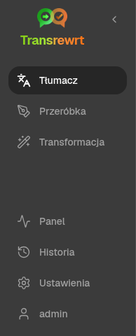
    </td>
    <td valign="top">
      <br/><br/>
      <ul>
        <li><strong>Tłumacz</strong> otwiera obszar roboczy tłumaczenia.</li><br/>
        <li><strong>Przepisz</strong> otwiera obszar roboczy przepisywania.</li><br/>
        <li><strong>Przekształć</strong> otwiera obszar roboczy niestandardowej zachęty.</li><br/>
        <li><strong>Panel główny</strong> pokazuje informacje o użytkowaniu i kosztach.</li><br/>
        <li><strong>Ustawienia</strong> otwiera panel ustawień.</li><br/>
        <li><strong>Historia</strong> pokazuje historię użycia z tekstem wejściowym i wyjściowym</li><br/>
        <li><strong>Użytkownik</strong> pokazuje nazwę zalogowanego użytkownika (tylko w wersji internetowej).</li>
      </ul>
    </td>
  </tr>
</table>

<br/>

<a id="toolbar"></a>
### Pasek narzędzi

Pasek narzędzi nieznacznie się zmienia w zależności od tego, gdzie znajdujesz się w aplikacji.

- Po lewej stronie znajduje się nazwa bieżącej strony.
- Po prawej stronie znajduje się selektor **ustawienia wstępnego lub modelu** oraz kontrolka **Język interfejsu**.

W trybie **Łatwy** pasek narzędzi zawiera selektor **ustawień wstępnych** z wbudowanymi opcjami **Darmowe (OpenRouter)**, **Standardowe**, **Zaawansowane** i **Techniczne**. Dostępne ustawienia wstępne zależą od wybranego **Dostawcy** w [**Ustawienia** > **Ustawienia ogólne**](#general-settings) — na przykład opcja **Darmowe (OpenRouter)** pojawia się tylko wtedy, gdy dostawcą jest OpenRouter. Jeśli **Dostawcą** jest **Ollama**, w pasku narzędzi wyświetlane są zamiast ustawień wstępnych zainstalowane lokalne modele.

W trybie **Zaawansowany** selektor **modelu** pozwala wybrać, którego silnika AI użyć do bieżącego zadania.

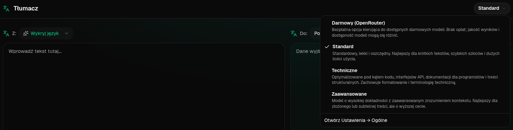

W trybie zaawansowanym niektóre darmowe modele mogą nie być zawsze dostępne — mogą być wyłączone lub osiągnąć limit użycia. Aplikacja może automatycznie usunąć taki model z listy. Aby kontrolować, które modele się pojawiają, przejdź do [**Ustawienia** > **Modele**](#models). Możesz otworzyć ustawienia modelu, klikając ikonę dostawcy po lewej stronie nazwy modelu na pasku narzędzi.

<br/>

Ikona **globusa i kod języka** zmienia język interfejsu aplikacji, np. menu i przyciski. **Nie** zmienia to języków tłumaczenia używanych w funkcji **Tłumacz**.

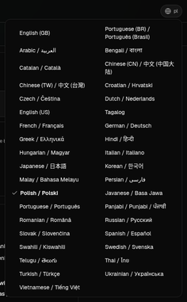

<br/>

<a id="input-and-output-panels"></a>
### Panele wejścia i wyjścia

Większość obszarów roboczych używa lewego panelu **Wejście** i prawego panelu **Wyjście**.

Każdy panel pokazuje również:

| **Wejście**                                                          | **Wyjście**                                                                                                                  |
|--------------------------------------------------------------------|-----------------------------------------------------------------------------------------------------------------------------|
| - Liczba znaków <br/>- Liczba słów <br/>- Liczba akapitów   <br/> | - Czas trwania zadania<br/>- **TPS** (tokeny na sekundę)<br/>- Liczba znaków, słów i akapitów<br/>- Użyty model |

Jeśli zastanawiasz się nad terminologią techniczną:

- **Token** oznacza mały fragment tekstu. Można o nim myśleć jako o części słowa lub krótkim słowie.
- **TPS** oznacza, ile takich fragmentów tekstu model przetwarzał na sekundę.

<br/>

Możesz również monitorować koszt każdej operacji (jeśli dostępny) oraz całkowity koszt, włączając opcję `Show cost information on the actions` w [**Ustawienia** > **Ustawienia ogólne**](#general-settings).

<br/><br/>

[--------------------------------------------------------------------------------------------------------------------------]: #

<a id="translate"></a>
## Tłumaczenie

Użyj opcji **Tłumacz**, gdy chcesz przetłumaczyć tekst z jednego języka na inny.

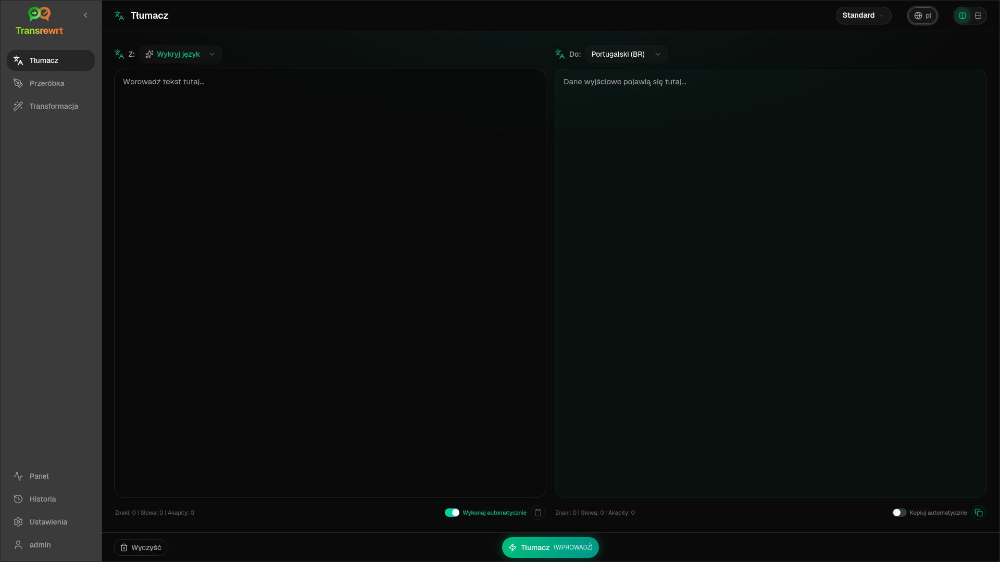

<br/>

<a id="translate-text"></a>
### Tłumaczenie tekstu

1. Otwórz **Tłumacz**.
2. Wybierz język w polu **Z**.
3. Wybierz język w polu **Na**.
4. Wybierz ustawienie wstępne (Łatwy) lub model (Zaawansowany) w pasku narzędzi.
5. Wpisz lub wklej tekst w polu **Wejście**.
6. Kliknij przycisk **Tłumacz**.
7. Przeczytaj wynik w polu **Wyjście**.
8. Skorzystaj z przycisku kopiowania, jeśli chcesz skopiować wynik.

<br/>

<a id="language-selection"></a>
### Wybór języka

- **Z** może być konkretnym językiem lub opcją **Wykryj język**.
- **Na** to język, w którym chcesz uzyskać wynik.

Wybrane przez Ciebie **Najważniejsze języki** pojawiają się u góry listy. Możesz je ustawić w sekcji [**Ustawienia** > **Języki**](#languages).

<br/>

<a id="helpful-translation-settings"></a>
### Przydatne ustawienia tłumaczenia

W sekcji [**Ustawienia** > **Ustawienia ogólne**](#general-settings) możesz zmienić sposób działania tłumaczenia:

- **Automatyczne tłumaczenie przy wklejaniu** — tłumaczenie jest uruchamiane automatycznie po wklejeniu tekstu.
- **Automatyczne kopiowanie wyniku do schowka** — wynik jest automatycznie kopiowany do schowka po pomyślnym tłumaczeniu.
- **Tłumaczenie w czasie rzeczywistym (podczas pisania)** — tłumaczenie uruchamiane jest w trakcie wpisywania tekstu.
- **Limit czasu (ms)** — określa, jak długo aplikacja czeka przed uruchomieniem tłumaczenia w czasie rzeczywistym.
- **Zachowanie dla ENTER** kontroluje działanie po naciśnięciu `Enter`:
  - **Enter** uruchamia tłumaczenie lub przepisanie (domyślne).
  - **Shift + Enter** uruchamia tłumaczenie lub przepisanie; zwykły **Enter** wstawia nową linię.

[--------------------------------------------------------------------------------------------------------------------------]: #

<a id="rewrite"></a>
## Przepisz

Skorzystaj z opcji **Przepisz**, gdy chcesz poprawić sformułowanie bez zmiany głównej treści.

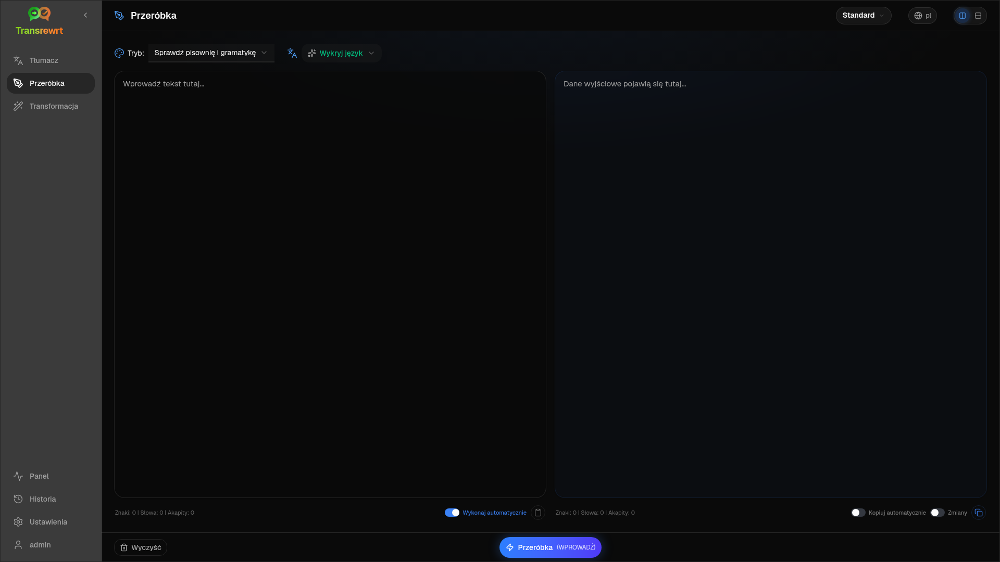

To przydatne w przypadku:

- poprawianie pisowni i gramatyki (**Sprawdzanie pisowni i gramatyki**)
- poprawianie czytelności tekstu (**Popraw czytelność**)
- generowanie kilku różnych wersji w jednym przebiegu (**Wersje alternatywne**)
- nadawanie tonu bardziej formalnego lub nieformalnego (**Uczyń formalnym** / **Uczyń nieformalnym**)
- skracania lub rozszerzania tekstu (**Skróć** / **Rozwiń**)
- nadawania tekstowi charakteru bardziej technicznego (**Uczyń technicznym**)

<br/>

> 💡 **WSKAZÓWKA**<br/>
> Gdy korzystasz z trybu "**Sprawdzanie pisowni i gramatyki**", w panelu wyników (obok przycisku **Kopiuj**) pojawia się przełącznik **Pokaż zmiany**.
> Włącz lub wyłącz go, aby pokazać lub ukryć konkretne poprawki wprowadzone w tekście.

<br/><br/>

[--------------------------------------------------------------------------------------------------------------------------]: #

<a id="transform"></a>
## Przekształć

Skorzystaj z opcji **Przekształć**, gdy chcesz, by AI wykonało zadanie zgodnie z niestandardowym zestawem instrukcji.

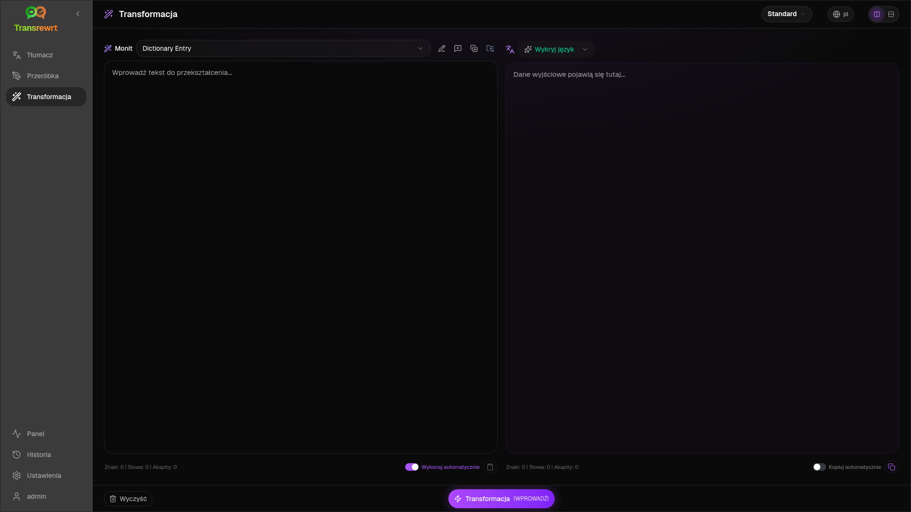

To najbardziej elastyczna część aplikacji. Można jej używać do zadań takich jak:

- podsumowywanie notatek
- zamiana surowego tekstu na dopracowaną wiadomość e-mail
- wyciąganie kluczowych punktów
- konwertowanie tekstu do określonego formatu
- lub inne niestandardowe działania na tekście wejściowym

<br/>

<a id="run-an-existing-prompt"></a>
### Uruchom istniejącą zachętę

1. Otwórz **Przekształć**.
2. Wybierz zachętę z listy zachęt.
3. Jeśli pojawi się pole **Cel**, wybierz język, jeśli chcesz.
4. Wpisz lub wklej tekst do pola **Wejście**.
5. Kliknij **Przekształć**.
6. Przeczytaj wynik w polu **Wyjście**.

<br/>

<a id="if-you-have-no-prompts-yet"></a>
### Jeśli nie masz jeszcze żadnych zachęt

Jeśli lista zachęt jest pusta, kliknij **Załaduj przykładowe zachęty** w obszarze roboczym Przekształć. Ta sama opcja jest zawsze dostępna w [**Ustawienia** > **Przekształć**](#transform-settings) w wierszu eksportu/importu. Oba sposoby dodają wbudowane przykłady, dzięki czemu możesz szybko rozpocząć.

<br/>

> ℹ️ **UWAGA**<br/>
> Przykładowe zachęty są dostępne po angielsku. Po ich załadowaniu możesz edytować zachętę i użyć opcji **Tłumacz zachętę**, aby przetłumaczyć ją na {{Twój język}}.

<br/>

<a id="create-a-prompt-quickly"></a>
### Szybkie tworzenie zachęty

Najszybszy sposób na utworzenie zachęty to:

1. Kliknij **Nowa zachęta**.
2. Kliknij **Wygeneruj zachętę**.
3. Opisz, co ma robić zachęta.
4. Wybierz ustawienie wstępne (Łatwy) lub model (Zaawansowany).
5. Pozwól aplikacji utworzyć wersję roboczą.
6. Przejrzyj wersję roboczą i kliknij **Zapisz**.

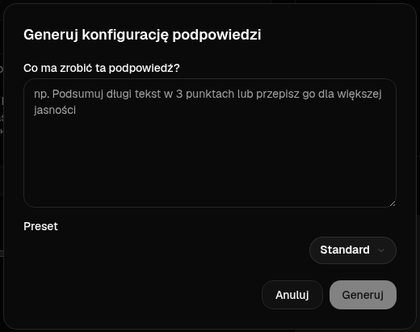

<br/>

<a id="edit-a-prompt"></a>
### Edytowanie zachęty

Gdy tworzysz lub edytujesz zachętę, edytor pojawia się po lewej stronie, a po prawej pojawia się obszar testowy.

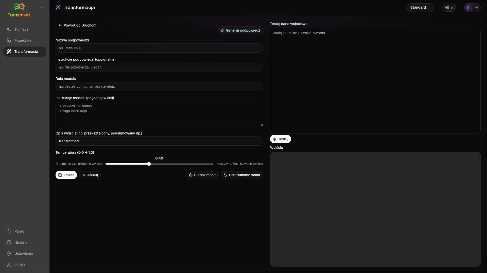

Główne pola to:

- **Nazwa zachęty**: nazwa wyświetlana na liście zachęt.
- **Instrukcje zachęty (opcjonalne)**: krótki opis wyświetlany użytkownikowi podczas uruchamiania zachęty.
- **Rola modelu**: ogólna rola przypisana AI, np. „Jesteś pomocnym asystentem”.
- **Instrukcje modelu (jedna na linię)**: konkretne zasady, których ma przestrzegać AI.
- **Opis wyniku**: krótkie słowo opisujące wynik, np. „podsumowanie” lub „przepisz”.
- **Temperatura (0,0 → 1,0)**: sposób działania modelu; zobacz poniżej.
- **Poproś o język docelowy**: dodaje selektor języka docelowego podczas uruchamiania zachęty.

Jeśli termin techniczny **Temperatura** jest dla Ciebie nowy, pomyśl o tym w ten sposób:

- **Niższa** temperatura daje bardziej stabilne i przewidywalne wyniki.
- **Wyższa** temperatura daje większą różnorodność i kreatywność.

Możesz również użyć:

- `Generate prompt`, aby utworzyć nową wersję roboczą na podstawie prostego opisu
- `Improve prompt`, aby dopracować istniejącą zachętę
- `Translate prompt`, aby przetłumaczyć pola zachęty

<br/>

> ⚠️ **OSTRZEŻENIE**<br/>
> Kliknij `Save`, zanim klikniesz `Back to Run`. Jeśli cofniesz się bez zapisywania, Twoje zmiany zostaną utracone.

<br/>

<a id="test-a-prompt-before-using-it"></a>
### Przetestuj zachętę przed jej użyciem

Panel testowy po prawej stronie pozwala wypróbować zachętę przy użyciu przykładowego tekstu przed jej wykorzystaniem w codziennej pracy.

To przydatne, gdy:

- tworzysz nową zachętę
- porównujesz dwie wersje zachęty
- chcesz sprawdzić ton, długość lub format wyjścia

<br/>

> ℹ️ **UWAGA**<br/>
> Możesz eksportować i importować zapisane zachęty w [**Ustawienia** > **Przekształć**](#transform-settings).

Gdy korzystasz z opcji **Wygeneruj zachętę**, **Ulepsz zachętę** lub **Tłumacz zachętę** w edytorze zachęt, tryb **Łatwy** oferuje ten sam selektor ustawień wstępnych, co Tłumacz i Przepisz; tryb **Zaawansowany** używa listy modeli.

<br/><br/>

[--------------------------------------------------------------------------------------------------------------------------]: #

<a id="dashboard"></a>
## Panel główny

Użyj **Panelu głównego**, aby zobaczyć, w jakim stopniu korzystasz z aplikacji i ile to kosztuje (dla modeli płatnych).

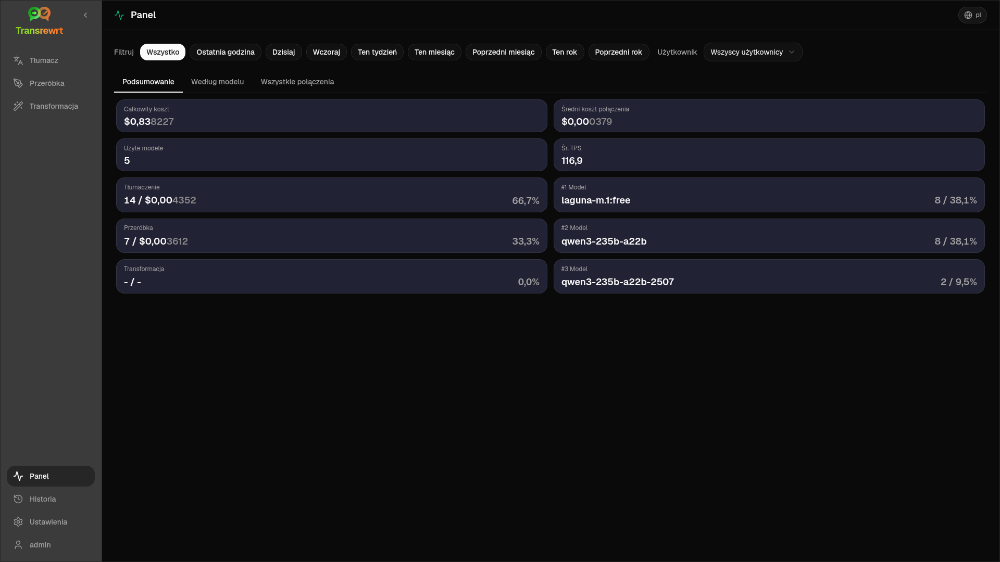

<br/>

> ℹ️ **UWAGA**<br/>
> Jeśli używasz wyłącznie **darmowych** modeli, wartości **kosztu** mogą wynosić zero, a KPI skupione na kosztach mogą wyglądać pusto. Karta **Podsumowanie** nadal pokazuje liczbę wywołań dla tłumaczenia, przepisywania i przekształcania, jeśli miało miejsce działanie w wybranym okresie.

<br/>

<a id="filter-the-data"></a>
### Filtruj dane

Użyj przycisków filtrów u góry, aby zmienić zakres czasu.

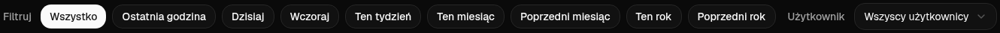

<br/>

> ℹ️ **UWAGA**<br/>
> Filtr **Użytkownik** jest widoczny tylko administratorom w wersji internetowej. Zwykli użytkownicy nie widzą tego filtra, a nie jest on dostępny w aplikacji komputerowej.

<br/>

<a id="dashboard-tabs"></a>
### Karty panelu głównego

- **Podsumowanie** wyświetla karty KPI: całkowity koszt, używane modele, liczba wywołań i koszt według trybu (wraz z udziałem w całkowitej liczbie wywołań), średni koszt na wywołanie, średni TPS oraz trzy modele z największą liczbą wywołań.
- **Według modelu** zawiera listę poszczególnych modeli z całkowitą liczbą wywołań, całkowitym kosztem i średnią wartością TPS; rozwiń wiersz, aby uzyskać szczegółowy podział według tłumaczenia, przepisywania i przekształcania.
- **Wszystkie wywołania** pokazuje pełny dziennik wywołań (stronicowany w szerokich układach, karty na wąskich ekranach) i pozwala go wyeksportować.

<br/>

<a id="export-data"></a>
### Eksport danych

Tabele z panelu głównego pozwalają eksportować dane w formatach:

- **JSON**
- **CSV**
- **XLSX**

Jest to przydatne, jeśli chcesz przeanalizować aktywność poza aplikacją lub udostępnić raport.

<br/>

<a id="delete-stored-records-for-a-model"></a>
### Usuń zapisane rekordy dla modelu

W sekcjach **Według modelu** lub **Wszystkie wywołania** możesz usunąć zapisane rekordy dla modelu, klikając ikonę „kosza”.

> ⚠️ **OSTRZEŻENIE**<br/>
> Usunięcie zapisanych rekordów jest nieodwracalne. Używaj tej opcji tylko wtedy, gdy jesteś pewien, że nie potrzebujesz już tej historii.

Aby usunąć wszystkie dane lub rekordy na podstawie ich wieku, przejdź do [**Ustawienia** > **Śledzenie kosztów**](#cost-tracking). Tam znajdziesz opcje usuwania wszystkich przechowywanych danych lub tylko tych starszych niż określona data.

<br/><br/>

[--------------------------------------------------------------------------------------------------------------------------]: #

<a id="history"></a>
## Historia

Kliknij **Historia**, aby zobaczyć historię Twoich działań w aplikacji **Transrewrt**, w tym wejście i wyjście każdej operacji.

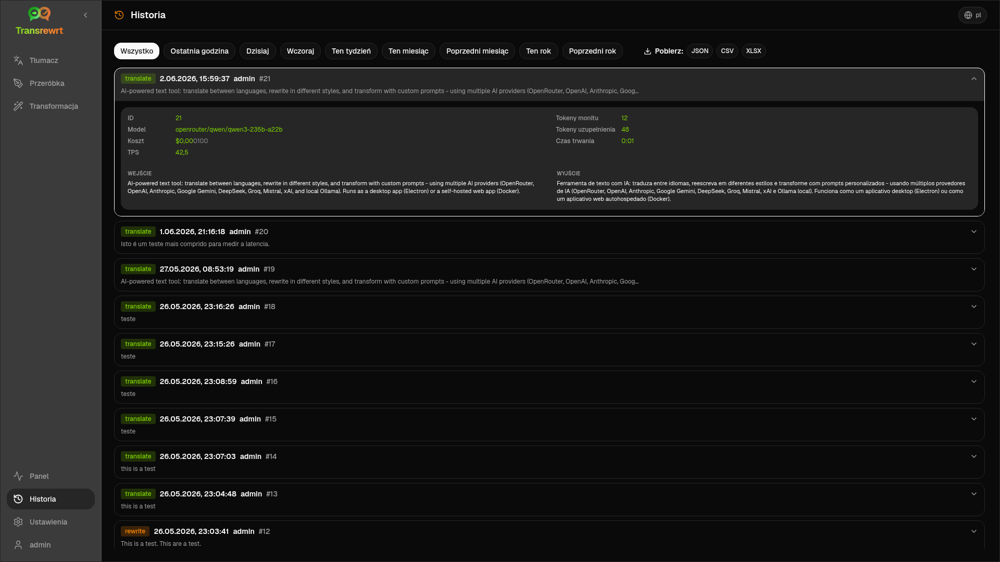

<br/>

<a id="filter-the-history"></a>
### Filtruj historię

**Historia** używa tych samych filtrów zakresu czasu co strona **Panel główny**.


<br/>

> ℹ️ **UWAGA**<br/>
> W **aplikacji internetowej** każdy (w tym administratorzy) widzi wyłącznie swoją własną historię wykonań. Filtr **Użytkownik** na **Panelu głównym** służy administratorom do przeglądania użycia i kosztów w ramach kont; nie ma on zastosowania do **Historii**.

<br/>

<a id="export-history-data"></a>
### Eksport danych historii

Strona historii może eksportować przefiltrowane dane w formatach:

- **JSON**
- **CSV**
- **XLSX**

Jest to przydatne, jeśli chcesz przeanalizować aktywność poza aplikacją lub udostępnić raport.

<br/><br/>

[--------------------------------------------------------------------------------------------------------------------------]: #

<a id="settings"></a>
## Ustawienia

Otwórz **Ustawienia** z paska bocznego, aby dostosować zachowanie aplikacji.

Dostępne karty zależą od platformy i Twojej roli:

| Karta              | Komputer | Internetowa (administrator) | Internetowa (zwykły użytkownik) | Uwagi                                        |
  |------------------|:-------:|:-----------:|:------------------:|----------------------------------------------|
  | Ustawienia ogólne |   tak   |     tak     |        tak         | Obejmuje **Doświadczenie AI** (Łatwy / Zaawansowany) |
  | Modele           |   tak   |     tak     |        tak         | Tylko gdy **Doświadczenie AI** jest ustawione na **Zaawansowany** |
  | Języki           |   tak   |     tak     |        tak         |                                              |
  | Śledzenie kosztów    |   tak   |     tak     |         -          |                                              |
  | Przekształć        |   tak   |     tak     |        tak         | Masowy import/eksport zachęt przekształceń      |
  | Użytkownicy            |    -    |     tak     |         -          |                                              |
  | Konfiguracja API       |   tak   |     tak     |         -          |                                              |
  | O programie            |   tak   |     tak     |        tak         |                                              |

W trybie **Łatwy** wybór modelu odbywa się za pomocą ustawień wstępnych w pasku narzędzi i **Dostawcy** w Ustawieniach ogólnych; karta **Modele** jest ukryta.

<br/>

> ℹ️ **UWAGA**<br/>
> W wersji internetowej każdy użytkownik ma własną konfigurację. Ustawienia takie jak doświadczenie AI, dostawca, wybrane modele lub ustawienia wstępne, języki, opcje ogólne i przekształcenia podpowiedzi są przechowywane osobno dla każdego użytkownika. Wprowadzone przez Ciebie zmiany nie wpływają na innych użytkowników.

<br/>

[--------------------------------------------------------------------------------------------------------------------------]: #

<a id="general-settings"></a>
### Ustawienia ogólne

Użyj **Ustawień ogólnych**, aby kontrolować zachowanie podczas pisania, czy szczegóły wykonań są zapisywane w **Historii**, wygląd oraz sposób wyboru AI do Tłumaczenia, Przepisywania i Przekształcania.

**Doświadczenie AI**

- **Łatwy** (domyślny): wybierasz **Dostawcę** (OpenRouter, OpenAI, Anthropic, Google Gemini, DeepSeek, Groq, Mistral, xAI, Cerebras lub Ollama). Dostawcy w chmurze używają wbudowanych ustawień wstępnych w pasku narzędzi. **Ollama** wyświetla modele zainstalowane na Twoim komputerze zamiast ustawień wstępnych. W trybie Łatwy, **Katalog ustawień wstępnych** pokazuje wersję katalogu i czas ostatniej aktualizacji; kliknij **Odśwież katalog ustawień wstępnych**, aby pobrać najnowszą listę ustawień wstępnych z repozytorium projektu (aplikacja sprawdza to również okresowo w tle).
- **Zaawansowany**: wybierasz poszczególne modele w pasku narzędzi; zarządzasz listą w [**Ustawienia** > **Modele**](#models).

W **aplikacji internetowej** dostępność dostawców zależy od kluczy API ustawionych w środowisku serwera. W **aplikacji komputerowej** skonfiguruj klucze w sekcji [**Konfiguracja API**](#api-config).

**Zachowanie**

- **Zachowanie dla ENTER** określa, czy `Enter` uruchamia zadanie, czy wstawia nową linię.
- **Automatyczne tłumaczenie przy wklejaniu** uruchamia tłumaczenie zaraz po wklejeniu tekstu.
- **Automatyczne kopiowanie wyniku do schowka** automatycznie kopiuje pomyślne wyniki.
- **Tłumaczenie w czasie rzeczywistym (podczas pisania)** tłumaczy tekst podczas pisania.
- **Limit czasu (ms)** ustawia czas oczekiwania dla tłumaczenia w czasie rzeczywistym.

**Historia**

- **Zachowaj historię wykonania** kontroluje, czy każde tłumaczenie, przepisywanie i przekształcanie przechowuje **tekst wejściowy i wyjściowy** do widoku bocznego panelu [**Historia**](#history). Wyłączenie tej opcji spowoduje wyświetlenie potwierdzenia; po potwierdzeniu przechowywany tekst historii zostanie usunięty z bazy danych. Jeśli etykieta pokazuje *wyłączone przez administratora*, Twoja instalacja ma ustawione `HISTORY_DISABLED` w środowisku (zobacz [README](README.pl.md#configuration-and-environment)); nie możesz włączyć historii ponownie z poziomu interfejsu użytkownika.
- **Usuń dane historii** pozwala usunąć przechowywany tekst według wieku (na przykład starszy niż kilka miesięcy lub **wszystkie dane (wyczyść)**) za pomocą opcji **Usuń dane**. Dotyczy to wyłącznie zapisanego tekstu wykonania dla widoku **Historia**; **nie** powoduje usunięcia danych dotyczących kosztów ani łącznego zużycia. Aby usunąć lub skrócić dane dotyczące **kosztów**, skorzystaj z [**Ustawienia** > **Śledzenie kosztów**](#cost-tracking).

**Wygląd**

- **Motyw** przełącza między jasnym, ciemnym i systemowym wyglądem.
- **Pokaż informacje o kosztach w akcjach** kontroluje wyświetlanie kosztu operacji (jeśli dostępne) oraz całkowitego kosztu na panelach wyjściowych Tłumacz, Przepisz i Przekształć.
- **Liczba cyfr po przecinku w koszcie** zmienia sposób wyświetlania miejsc dziesiętnych kosztu.
- **Tylko w wersji internetowej:** **pokaż margines wokół aplikacji** dodaje dodatkową przestrzeń wokół interfejsu.
- **Rodzina czcionek** zmienia czcionkę w panelach tekstowych.
- **Rozmiar** zmienia rozmiar czcionki.

**Kopia zapasowa konfiguracji** (tylko dla administratorów aplikacji komputerowej i internetowej)

- **Uwzględnij dane użycia w kopii zapasowej** — gdy włączone, plik ZIP zawiera również historię wykonywania i dane wywołań API.
- **Wykonaj kopię zapasową konfiguracji** — tworzy pojedynczy plik ZIP (domyślnie z nazwą `transrewrt-config-backup-YYYY-MM-DD_HHMMSS.zip` w czasie UTC), zawierający `config.json`, `state.json`, opcjonalny klucz szyfrowania, użytkowników, preferencje, niestandardowe podpowiedzi oraz dane użycia, jeśli zostały wybrane. Po pomyślnej kopii zapasowej potwierdzenie pokazuje nazwę zapisanego pliku.
- **Przywróć z kopii zapasowej** — otwiera najpierw **okno potwierdzenia**. Wybierz plik kopii zapasowej ZIP w oknie (**Przeglądaj** / selektor plików lub przeciągnij i upuść, tam gdzie to możliwe), a następnie przejrzyj opcje:
  - **Przywróć dane użycia** — importuje dane użycia/historii z pliku ZIP, jeśli podczas tworzenia kopii zapasowej dane użycia zostały uwzględnione; pozostaw wyłączone, jeśli chcesz tylko przywrócić ustawienia i podpowiedzi.
  - **Wyczyść stare dane użycia przed przywróceniem** — usuwa istniejące dane użycia/historię w tej instalacji przed zastosowaniem kopii zapasowej (opcjonalne; użyj, gdy chcesz wykonać czyste zastąpienie).

Kopie zapasowe utworzone w wersji internetowej lub desktopowej można przywrócić w drugiej wersji. Podczas przywracania kopii zapasowej desktopowej w wersji internetowej dane zostaną przywrócone do użytkownika administratora.

<br/>

<a id="models"></a>
### Modele

Ta karta jest dostępna tylko wtedy, gdy w [**Ustawienia ogólne**](#general-settings) ustawiono opcję **Doświadczenie AI** na **Zaawansowany**. Skorzystaj z opcji **Ustawienia** > **Modele**, aby wybrać, które modele będą wyświetlane na pasku narzędzi.

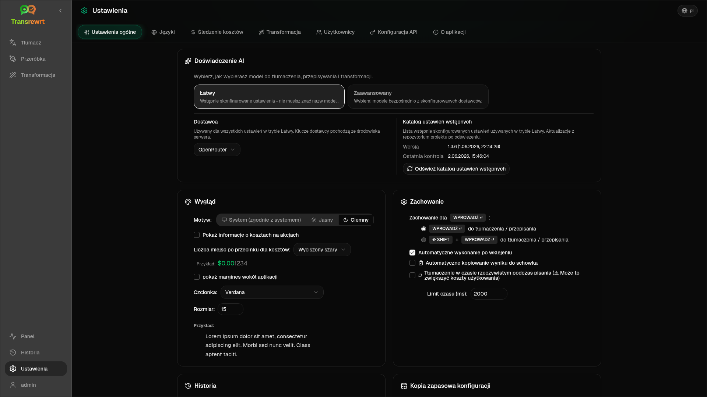

Strona zawiera dwie listy:

- **Dostępne modele** po lewej stronie
- **Wybrane modele** po prawej stronie

Przydatne kontrolki obejmują:

- **Wyszukaj modele...**, aby znaleźć model po nazwie
- Kafelki **Dostawca**, aby zawęzić listę do jednego silnika (OpenRouter, OpenAI, Ollama, …)
- **Tylko darmowe**, aby wyświetlić wyłącznie darmowe modele
- **Odśwież**, aby ponownie załadować listę
- **Rozwiń wszystko** i **Zwiń wszystko**, gdy sortujesz według dostawcy

Identyfikatory modeli zawierają prefiks dostawcy (na przykład `openrouter/…` vs `openai/…`). Odznaki takie jak **OpenAI (OpenRouter)** vs **OpenAI (bezpośredni)** pokazują, jak kierowany jest ruch.

> ℹ️ **UWAGA**<br/>
> **OpenRouter Body Builder** (`openrouter/bodybuilder`) to model routera, a nie ogólny model czatu: jego odpowiedź to JSON opisujący ciała żądań API OpenRouter (na przykład tablica `requests` z `model` i `messages`). Jeśli użyjesz go do **Tłumaczenia**, **Przepisania** lub **Przekształcenia**, panel wyjściowy pokaże ten JSON zamiast gotowego tekstu. Wybierz normalny tekstowy model na te zadania. Zobacz [stronę modelu Body Builder](https://openrouter.ai/openrouter/bodybuilder) na OpenRouter.

Działania:

- Aby dodać model, kliknij **Dodaj** lub w dowolne miejsce wpisu.

- Aby usunąć model, kliknij **X** obok niego w sekcji **Wybrane modele** lub **Wybrane** w wpisie Dostępne modele.

- Aby wyczyścić listę, kliknij **Odznacz wszystkie**. Wymagany darmowy model pozostanie na liście.

<br/>

> ℹ️ **UWAGA**<br/>
> Jeśli nie chcesz od razu doładowywać kredytów na OpenRouter, zacznij od włączenia opcji **Tylko darmowe** i wybierz darmowe modele (nie wymaga karty kredytowej). Możesz również używać Ollama, aby uruchamiać modele lokalnie bez klucza API.

<br/>

<a id="languages"></a>
### Języki

Użyj **Ustawienia** > **Języki**, aby zarządzać listami języków używanymi w aplikacji.

- **Najważniejsze języki** są przypięte u góry list języków w funkcjach **Tłumacz** i **Przekształć**.
- **Język niestandardowy** pozwala dodać język, którego nie ma na wbudowanej liście.

Jeśli dodasz język niestandardowy, pojawi się on w selektorach języków obok wbudowanych opcji.

<br/>

<a id="cost-tracking"></a>
### Śledzenie kosztów

Użyj **Ustawienia** > **Śledzenie kosztów**, aby zarządzać informacjami o kosztach.

- **Całkowity koszt** pokazuje bieżącą sumę.
- **Kopiuj wartość** kopiuje sumę do schowka.
- **Zresetuj koszt** ustawia zapisaną sumę na zero.
- **Synchronizuj z użyciem klucza API** ustawia sumę zgodnie z użyciem zgłoszonym przez Twoje konto OpenRouter (tylko OpenRouter).
- **Użycie klucza API** pokazuje szczegółowe informacje o użyciu OpenRouter, jeśli są dostępne.
- **Usuń dane o kosztach** usuwa wszystkie dane lub tylko wpisy starsze niż wybrana data.

**Śledzenie kosztów:** Gdy korzystasz z modeli OpenRouter, aplikacja pokazuje rzeczywiste zużycie i wydatki na podstawie danych kosztów z OpenRouter. Dla wszystkich innych dostawców aplikacja szacuje koszty, korzystając z cen opublikowanych przez OpenRouter; jeśli cena jest niedostępna, szacunek może wynosić zero.

<br/>

> ℹ️ **UWAGA**<br/>
> **Wszystkie dane dotyczące kosztów są szacunkowe i podane wyłącznie w celach informacyjnych, nie stanowią oficjalnych rachunków.**

<br/>

> ⚠️ **OSTRZEŻENIE**<br/>
> Usunięcie danych jest nieodwracalne. Przed usunięciem upewnij się, że zapiszesz swoje dane lub wyeksportujesz je przez [**Historia**](#history)
> lub [**Panel główny** > **Wszystkie wywołania**](#dashboard-tabs), w przeciwnym razie zostaną trwale utracone.
> Cała historia wejść/wyjść związana z każdym wpisem wywołania API również zostanie usunięta.

<br/>

<a id="transform-settings"></a>
### Przekształć (karta ustawień)

Skorzystaj z opcji **Ustawienia** > **Przekształć**, aby zarządzać zachętami (promptami) zbiorowo.

Możesz:

- przeglądać zapisane podpowiedzi
- usuwać podpowiedzi
- importować podpowiedzi z pliku
- eksportować podpowiedzi w celu tworzenia kopii zapasowych lub udostępniania
- załadować przykładowe zachęty do listy podpowiedzi

<br/>

<a id="users"></a>
### Użytkownicy

Użyj opcji **Użytkownicy**, aby zarządzać kontami użytkowników w wersji internetowej. Możesz dodawać użytkowników, aktualizować ich dane, resetować hasła oraz usuwać konta.

<br/>

<a id="api-config"></a>
### Konfiguracja API

Obsługiwani dostawcy to: OpenRouter, OpenAI, Anthropic, Google Gemini, DeepSeek, Groq, Mistral, xAI, Cerebras oraz **Ollama** (modele lokalne za pośrednictwem podstawowego adresu URL). Należy skonfigurować tylko tych dostawców, których używasz.

**Aplikacja internetowa: tylko administrator**

Klucze API są konfigurowane za pomocą zmiennych środowiskowych systemu lub Dockera — nie są wprowadzane w interfejsie webowym. Na tej stronie pokazano, dla których dostawców skonfigurowano klucz, oraz umożliwia przetestowanie każdego z nich, klikając przycisk `Test`.

<br/>

> ℹ️ **UWAGA**<br/>
> Aby zmienić klucz API, zaktualizuj zmienną środowiskową w konfiguracji systemu lub Dockera i uruchom ponownie serwer lub kontener.

<br/>

> ℹ️ **UWAGA**<br/>
> **Kopie zapasowe konfiguracji** (zobacz [**Ustawienia ogólne** → Kopia zapasowa konfiguracji](#general-settings)) mogą osadzać **rozwiązane** klucze dostawcy wewnątrz pliku `config.json` w archiwum ZIP. Przywrócenie tego archiwum ZIP **nie** kopiuje tych kluczy z powrotem do pliku konfiguracyjnego serwera — aktywne klucze nadal pochodzą ze środowiska i istniejącego stanu plików, jak opisano powyżej.

<br/>

**Aplikacja komputerowa**

Użyj opcji **Konfiguracja API**, aby przechowywać klucze API dla każdego używanego dostawcy. W przypadku Ollama wprowadź **podstawowy adres URL** zamiast klucza API.

<br/>

> 💡 **Wskazówka** <br/>
> Jeśli nie chcesz używać klucza API ani płacić za korzystanie, możesz [pobrać Ollama](https://ollama.com) i uruchamiać modele (takie jak `translategemma:4b`) lokalnie na swoim komputerze za darmo. Alternatywnie możesz utworzyć darmowe konto OpenRouter (bez podawania danych karty kredytowej), aby korzystać z ich darmowych modeli, lub uzyskać darmowy klucz API od Cerebras, Google, Groq lub Mistral AI.

<br/>

- Dodawaj tylko tych dostawców, których potrzebujesz. W sekcji **Ustawienia** > **Modele**, każdy identyfikator modelu zaczyna się od nazwy dostawcy (na przykład `openrouter/openrouter/free`, `openai/gpt-4o`, `ollama/llama3`).

Aby dodać klucz API, wprowadź wartość w polu tekstowym i kliknij `Save`. Aby zastąpić istniejący klucz, kliknij `Edit`. Aby sprawdzić, czy klucz działa, kliknij `Test`. W przypadku podstawowego adresu URL Ollama zawsze kliknij `Test`, aby sprawdzić połączenie.

<br/>

> ℹ️ **UWAGA**<br/>
> Nie możesz zobaczyć aktualnej wartości klucza API. Możesz go tylko zastąpić, używając przycisku `Edit`.
> Klucze API są przechowywane w postaci zaszyfrowanej w konfiguracji.

<br/>

<a id="about"></a>
### O programie

Karta **O programie** pokazuje:

- nazwa aplikacji i slogan
- numer wersji i data kompilacji
- informacje o licencji i prawach autorskich wraz z linkiem do otwarcia **Powiadomień stron trzecich**
- link do repozytorium projektu

<br/><br/>

<a id="common-issues"></a>
## Typowe problemy

Jeśli coś nie działa zgodnie z oczekiwaniami, najpierw sprawdź następujące punkty.

<br/>

<a id="the-app-will-not-translate-rewrite-or-transform-text"></a>
### Aplikacja nie tłumaczy, nie przepisuje ani nie przekształca tekstu

Sprawdź, czy:

- wybrałeś **ustawienie wstępne** (Łatwy) lub **model** (Zaawansowany) w pasku narzędzi
- w trybie **Łatwy**, w [**Ustawienia** > **Ustawienia ogólne**](#general-settings) wybrany jest **Dostawca** z działającym kluczem (lub adresem URL Ollama) oraz co najmniej jedno ustawienie wstępne dla tego dostawcy
- w trybie **Zaawansowany**, co najmniej jeden model znajduje się na liście w [**Ustawienia** > **Modele**](#models)
- Twoja konfiguracja API działa poprawnie

Jeśli korzystasz z aplikacji komputerowej:

1. Otwórz [**Ustawienia** > **Konfiguracja API**](#api-config).
2. Sprawdź, czy co najmniej jeden klucz API został zapisany.
3. Kliknij przycisk **Test** obok dostawcy, aby potwierdzić działanie klucza.

<br/>

<a id="the-model-list-is-empty"></a>
### Lista modeli jest pusta

W trybie **Łatwy** otwórz [**Ustawienia** > **Ustawienia ogólne**](#general-settings), potwierdź, że ustawiono **Dostawcę**, a następnie dodaj lub przetestuj klucze w sekcji [**Konfiguracja API**](#api-config) (wersja komputerowa) albo skontaktuj się z administratorem (wersja internetowa). W przypadku **Ollama** uruchom **Test** dla podstawowego adresu URL i upewnij się, że modele są zainstalowane lokalnie.

W trybie **Zaawansowany** otwórz [**Ustawienia** > **Modele**](#models) i kliknij **Odśwież**. W razie potrzeby wyszukaj model, włącz opcję **Tylko darmowe** i dodaj modele do **Wybranych modeli**.

<br/>

<a id="the-result-is-too-slow-or-too-expensive"></a>
### Wynik jest zbyt powolny lub zbyt kosztowny

Wypróbuj jedną lub więcej z poniższych opcji:

- wybierz inne ustawienie wstępne (Łatwy) lub model (Zaawansowany)
- użyj krótszego wejścia
- wyłącz opcję **Tłumaczenie w czasie rzeczywistym (podczas pisania)** w [**Ustawienia** > **Ustawienia ogólne**](#general-settings)
- używaj darmowych modeli do prostych zadań (zobacz [Modele](#models))

<br/>

<a id="the-interface-is-in-the-wrong-language"></a>
### Interfejs jest w niewłaściwym języku

Kliknij ikonę globusa na [pasku narzędziowym](#toolbar) i wybierz preferowany **Język interfejsu**.

<br/>

<a id="the-text-is-too-small-or-hard-to-read"></a>
### Tekst jest zbyt mały lub trudny do odczytania

Otwórz [**Ustawienia** > **Ustawienia ogólne**](#general-settings) i zmień:

- **Rodzina czcionek**
- **Rozmiar**

<br/>

<a id="dashboard-summary-looks-empty"></a>
### Podsumowanie panelu głównego wygląda na puste

To jest normalne, jeśli:

- korzystasz wyłącznie z **darmowych modeli** i przeglądasz dane dotyczące **kosztów** (mogą one wynosić zero); wskaźniki liczby wywołań na karcie **Podsumowanie** nadal wymagają danych z wybranego okresu
- wybrany **filtr czasowy** nie obejmuje okresu, w którym miały miejsce wywołania — spróbuj opcji **Wszystkie**, aby sprawdzić

Jeśli wskaźniki nadal wynoszą zero po wybraniu opcji **Wszystkie**, sprawdź, czy wywołania pojawiają się w [**Historii**](#history) lub na karcie **Wszystkie wywołania**.

<br/>

<a id="cost-shows-not-available-or-seems-wrong"></a>
### Koszt pokazuje „nie dostępny” lub wydaje się nieprawidłowy

Gdy korzystasz z modeli przez **OpenRouter**, aplikacja pokazuje rzeczywiste wydatki raportowane przez OpenRouter.

W przypadku **innych dostawców** (OpenAI bezpośredni, Anthropic bezpośredni itp.) koszt jest szacowany na podstawie danych cenowych opublikowanych przez OpenRouter. Jeśli nie znaleziono dopasowanej ceny dla modelu, koszt będzie wyświetlany jako **nie dostępny** i nie zostanie dodany do całkowitego sumowania.

<br/>

<a id="total-cost-does-not-match-my-provider-bill"></a>
### Całkowity koszt nie zgadza się z rachunkiem dostawcy

Wszystkie dane dotyczące kosztów w aplikacji są **szacunkowe i podane wyłącznie w celach informacyjnych**, nie stanowią oficjalnych faktur rozliczeniowych.

Aby całkowity koszt był bliższy rzeczywistym wydatkom w OpenRouter, otwórz [**Ustawienia** > **Śledzenie kosztów**](#cost-tracking) i kliknij **Synchronizuj z użyciem klucza API**.

<br/>

<a id="the-history-page-is-missing-from-the-sidebar"></a>
### Strona Historia brakuje w pasku bocznym

Opcja **Zachowaj historię wykonania** może być wyłączona. Otwórz [**Ustawienia** > **Ustawienia ogólne**](#general-settings) i włącz ją, chyba że historia jest *wyłączona przez administratora* (`HISTORY_DISABLED` w środowisku — zobacz [README](README.pl.md#configuration-and-environment)). Włączenie historii nie przywraca wcześniej usuniętego tekstu.

<br/>

<a id="web-app-session-expired"></a>
### Aplikacja internetowa: nieoczekiwanie przekierowana na stronę logowania

Twoja sesja mogła wygasnąć. Zaloguj się ponownie. Jeśli problem występuje często, sprawdź konfigurację serwera pod kątem ustawień czasu trwania sesji.

<br/>

<a id="web-admin-forgot-or-lost-a-password"></a>
### Administrator internetowy: zapomniałeś lub zgubiłeś hasło

Dotyczy to **samodzielnie hostowanej aplikacji internetowej** (Docker), a nie aplikacji desktopowej (Electron).

- Jeśli inny administrator może się nadal zalogować, może otworzyć [**Ustawienia** > **Użytkownicy**](#users), wybrać konto i ustawić tam **nowe hasło**.
- Jeśli jesteś **zablokowany**, ale masz dostęp **shell** do maszyny lub kontenera, zresetuj hasło za pomocą narzędzia dostarczanego razem z obrazem (zamień `transrewrt`, jeśli zmieniłeś domyślną nazwę, i ujmij hasło w cudzysłów, jeśli zawiera spacje lub znaki specjalne):

```bash
docker exec transrewrt reset-web-password '<username>' '<new-password>'
```

Domyślna nazwa użytkownika administratora to `admin`, jeśli nigdy nie utworzyłeś innych kont. Gdy podasz tylko jeden argument, jest on traktowany jako nowe hasło dla `admin`.

Jeśli uruchamiasz aplikację z **kodu źródłowego** zamiast z Docker, użyj:

```bash
pnpm run reset-web-password -- <username> <new-password>
```

Skrypt aktualizuje rekord użytkownika w bazie danych SQLite (i może utworzyć użytkownika `admin`, jeśli brakuje go). Po zresetowaniu zaloguj się przy użyciu nowego hasła.

<br/>

<a id="dashboard-shows-no-data-for-other-users"></a>
### Panel główny nie wyświetla danych innych użytkowników (web)

Tylko **administratorzy** mogą przeglądać dane wszystkich użytkowników za pomocą filtra **Użytkownik**. Zwykli użytkownicy widzą wyłącznie swoją własną aktywność — tak jest zaprojektowane.

<br/>

<a id="i-changed-a-prompt-and-lost-the-edits"></a>
### Zmieniłem podpowiedź i utraciłem edycje

Podczas edytowania podpowiedzi zawsze kliknij **Zapisz**, zanim przejdziesz do **Powrót do uruchomienia**.

<br/><br/>

<a id="quick-tips"></a>
## Szybkie wskazówki

- Zacznij od [**Tłumacz**](#translate), aby upewnić się, że Twoja konfiguracja działa, zanim przejdziesz do [**Przepisz**](#rewrite) lub [**Przekształć**](#transform).
- Używaj [**Przepisz**](#rewrite) do codziennych poprawek sformułowań.
- Używaj [**Przekształć**](#transform), gdy potrzebujesz powtarzalnego przepływu pracy dla konkretnego zadania.
- Skorzystaj z [**Panel główny**](#dashboard), jeśli chcesz śledzić zużycie i koszty.
- Skorzystaj z [**Historia**](#history), aby przeglądać poprzednie operacje wraz z pełnym tekstem wejściowym i wyjściowym.
- Regularnie eksportuj zachęty (prompty), jeśli tworzysz bibliotekę zachęt, którą chcesz bezpiecznie przechowywać (zobacz [Przekształć](#transform)) lub chcesz ją udostępnić innym.
- Pozostawaj w trybie **Łatwy**, dopóki nie potrzebujesz szczegółowej kontroli nad identyfikatorami modeli; przełącz się na tryb **Zaawansowany**, gdy już wiesz, które modele chcesz używać.

<br/><br/>

<a id="disclaimer"></a>
## Zrzeczenie odpowiedzialności

Nazwy produktów i ikony należą do ich właścicieli i są używane wyłącznie w celach identyfikacyjnych. To oprogramowanie nie jest powiązane z wymienionymi markami ani przez nie wspierane.

<br/><br/>

<a id="license"></a>
## Licencja

Prawa autorskie © 2026 Waldemar Scudeller Jr.

[Apache License 2.0](../LICENSE)
