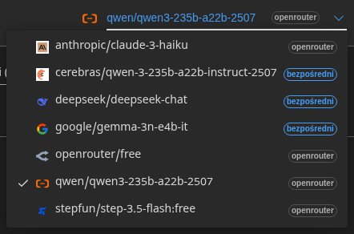

<a id="transrewrt-user-guide"></a>
# Przewodnik użytkownika

<br/>

<a id="introduction"></a>
## Wprowadzenie

Transrewrt pomaga w pracy z tekstem na trzy główne sposoby:

- **Przetłumacz** – przekonwertuj tekst z jednego języka na inny.
- **Przeformułowanie** – przeformułuj tekst w innym stylu, na przykład jaśniej, krócej lub bardziej formalnie.
- **Transformacja** – przetwarzaj tekst za pomocą niestandardowych instrukcji AI zwanych promptami.

<br/>

Ten przewodnik wyjaśnia, jak korzystać z aplikacji po jej zainstalowaniu i uruchomieniu. Aby uzyskać instrukcje instalacji, zobacz główny plik **[README](README.pl.md)**.

<br/>

> ℹ️ **UWAGA**<br/>
> Transrewrt jest dostępny jako aplikacja desktopowa dla systemów Windows i Linux oraz jako samodzielnie hostowana aplikacja internetowa. Ten przewodnik koncentruje się na codziennym użytkowaniu aplikacji. Gdy dana funkcja dotyczy tylko jednej wersji, jest to wyraźnie zaznaczone.

<small>**Przeczytaj w innych językach:** </small>
<small id="lang-list">[English (GB)](../USER-GUIDE.md) · [Português (Brasil)](./USER-GUIDE.pt-BR.md) · [العربية](./USER-GUIDE.ar.md) · [বাংলা](./USER-GUIDE.bn.md) · [Català](./USER-GUIDE.ca.md) · [中文 (中国大陆)](./USER-GUIDE.zh-CN.md) · [中文 (台灣)](./USER-GUIDE.zh-TW.md) · [Hrvatski](./USER-GUIDE.hr.md) · [Čeština](./USER-GUIDE.cs.md) · [Nederlands](./USER-GUIDE.nl.md) · [English (US)](./USER-GUIDE.en-US.md) · [Tagalog](./USER-GUIDE.tl.md) · [Français](./USER-GUIDE.fr.md) · [Deutsch](./USER-GUIDE.de.md) · [Ελληνικά](./USER-GUIDE.el.md) · [हिन्दी](./USER-GUIDE.hi.md) · [Magyar](./USER-GUIDE.hu.md) · [Italiano](./USER-GUIDE.it.md) · [日本語](./USER-GUIDE.ja.md) · [한국어](./USER-GUIDE.ko.md) · [Bahasa Melayu](./USER-GUIDE.ms.md) · [فارسی](./USER-GUIDE.fa.md) · [Polski](./USER-GUIDE.pl.md) · [Basa Jawa](./USER-GUIDE.jv.md) · [Português](./USER-GUIDE.pt.md) · [ਪੰਜਾਬੀ](./USER-GUIDE.pa.md) · [Română](./USER-GUIDE.ro.md) · [Русский](./USER-GUIDE.ru.md) · [Slovenčina](./USER-GUIDE.sk.md) · [Español](./USER-GUIDE.es.md) · [Kiswahili](./USER-GUIDE.sw.md) · [Svenska](./USER-GUIDE.sv.md) · [తెలుగు](./USER-GUIDE.te.md) · [ไทย](./USER-GUIDE.th.md) · [Türkçe](./USER-GUIDE.tr.md) · [Українська](./USER-GUIDE.uk.md) · [Tiếng Việt](./USER-GUIDE.vi.md)</small>

<small>

> **Uwaga dotycząca tłumaczeń interfejsu i dokumentacji:** Wszystkie języki interfejsu oprócz oryginalnego angielskiego (Wielka Brytania) 
> zostały przetłumaczone przy użyciu modeli AI; sformułowania mogą być niedokładne lub zawierać błędy.

</small>

<br/>

<!-- START doctoc generated TOC please keep comment here to allow auto update -->
<!-- DON'T EDIT THIS SECTION, INSTEAD RE-RUN doctoc TO UPDATE -->
**Spis treści**

- [Zanim zaczniesz](#before-you-start)
  - [Jak uzyskać bezpłatny klucz API OpenRouter (aplikacja desktopowa)](#how-to-get-a-free-openrouter-api-key-desktop-app)
- [Rozpoczęcie pracy](#getting-started)
- [Główne części okna](#main-parts-of-the-window)
  - [Pasek boczny](#sidebar)
  - [Pasek narzędzi](#toolbar)
  - [Panele wejścia i wyjścia](#input-and-output-panels)
- [Tłumacz](#translate)
  - [Tłumacz tekst](#translate-text)
  - [Wybór języka](#language-selection)
  - [Przydatne ustawienia tłumaczenia](#helpful-translation-settings)
- [Przepisz](#rewrite)
- [Przekształć](#transform)
  - [Uruchom istniejący prompt](#run-an-existing-prompt)
  - [Jeśli nie masz jeszcze żadnych promptów](#if-you-have-no-prompts-yet)
  - [Szybkie utworzenie promptu](#create-a-prompt-quickly)
  - [Edytuj prompt](#edit-a-prompt)
  - [Przetestuj prompt przed użyciem](#test-a-prompt-before-using-it)
- [Panel](#dashboard)
  - [Filtruj dane](#filter-the-data)
  - [Karty panelu](#dashboard-tabs)
  - [Eksportuj dane](#export-data)
  - [Usuń zapisane rekordy dla modelu](#delete-stored-records-for-a-model)
- [Historia](#history)
  - [Filtruj dane](#filter-the-data-1)
  - [Eksportuj dane historii](#export-history-data)
- [Ustawienia](#settings)
  - [Ustawienia ogólne](#general-settings)
  - [Modele](#models)
  - [Języki](#languages)
  - [Śledzenie kosztów](#cost-tracking)
  - [Prompty przekształceń](#transform-prompts)
  - [Użytkownicy](#users)
  - [Konfiguracja API](#api-config)
  - [O programie](#about)
- [Typowe problemy](#common-issues)
  - [Aplikacja nie tłumaczy, nie przepisuje ani nie przekształca tekstu](#the-app-will-not-translate-rewrite-or-transform-text)
  - [Lista modeli jest pusta](#the-model-list-is-empty)
  - [Wynik jest zbyt powolny lub zbyt kosztowny](#the-result-is-too-slow-or-too-expensive)
  - [Interfejs jest w niewłaściwym języku](#the-interface-is-in-the-wrong-language)
  - [Tekst jest zbyt mały lub trudny do odczytania](#the-text-is-too-small-or-hard-to-read)
  - [Wykresy na panelu są puste](#dashboard-charts-are-empty)
  - [Koszt pokazuje „nie dostępny” lub wydaje się błędny](#cost-shows-not-available-or-seems-wrong)
  - [Całkowity koszt nie zgadza się z rachunkiem dostawcy](#total-cost-does-not-match-my-provider-bill)
  - [Strona Historia brakuje na pasku bocznym](#the-history-page-is-missing-from-the-sidebar)
  - [Aplikacja internetowa: niespodziewane przekierowanie do strony logowania](#web-app-redirected-to-the-login-page-unexpectedly)
  - [Administrator internetowy: zapomniałem lub zgubiłem hasło](#web-admin-forgot-or-lost-a-password)
  - [Panel nie pokazuje danych innych użytkowników (wersja internetowa)](#dashboard-shows-no-data-for-other-users-web)
  - [Zmieniłem prompt i straciłem edycje](#i-changed-a-prompt-and-lost-the-edits)
- [Szybkie wskazówki](#quick-tips)
- [Zrzeczenie odpowiedzialności](#disclaimer)
- [Licencja](#license)

<!-- END doctoc generated TOC please keep comment here to allow auto update -->

<br/><br/>

<a id="before-you-start"></a>
## Przed rozpoczęciem

Aby korzystać z Transrewrt, potrzebujesz dostępu do co najmniej jednego dostawcy AI. Obsługiwani dostawcy to: [OpenRouter](https://openrouter.ai) (który agreguje wiele modeli), OpenAI, Anthropic, Google Gemini, DeepSeek, Groq, Mistral, xAI, Cerebras oraz [Ollama](https://ollama.com) dla modeli lokalnych.

Nie musisz wybierać modelu płatnego, aby rozpocząć. Gdy tylko dodasz swój klucz API OpenRouter, aplikacja automatycznie włącza wbudowaną **bezpłatną** opcję OpenRouter. Dzięki temu możesz od razu rozpocząć tłumaczenie, przeformułowywanie i transformację tekstu. Alternatywnie możesz również uzyskać bezpłatny klucz API od Cerebras, Google, Groq lub Mistral AI.

Prościej mówiąc:

- **Model** to silnik AI, który wykonuje pracę. Modele są wyświetlane z **przedrostkiem dostawcy** (na przykład `openrouter/…`, `openai/…`, `ollama/…`).
- **Klucz API** (lub dla Ollama – **podstawowy adres URL**) to sposób, w jaki aplikacja łączy się z danym dostawcą.

Jeśli korzystasz z **aplikacji desktopowej**, dodaj klucze w sekcji [**Ustawienia** > **Konfiguracja API**](#api-config) dla każdego dostawcy, którego używasz. W przypadku korzystania wyłącznie z OpenRouter, zobacz [Jak uzyskać klucz API](#how-to-get-an-api-key-desktop-app) poniżej. Jeśli nie chcesz używać klucza API, możesz zainstalować Ollama (ze strony [ollama.com](https://ollama.com)) i korzystać z modeli lokalnych, takich jak `translategemma:4b`.

Jeśli korzystasz z **wersji internetowej**, właściciel serwera konfiguruje dostawców za pomocą zmiennych środowiskowych, więc nie możesz bezpośrednio wprowadzać kluczy API w aplikacji.

<br/>

<a id="how-to-get-an-api-key-desktop-app"></a>
### Jak uzyskać bezpłatny klucz API OpenRouter (aplikacja desktopowa)

Jeśli korzystasz z aplikacji desktopowej, wykonaj następujące kroki:

1. Otwórz [OpenRouter](https://openrouter.ai) w przeglądarce internetowej.
2. Utwórz konto lub zaloguj się.
3. Otwórz stronę [Klucze](https://openrouter.ai/keys).
4. Kliknij przycisk, aby utworzyć nowy klucz API.
5. Nadaj kluczowi nazwę, dzięki której będziesz mógł go później rozpoznać.
6. Skopiuj nowy klucz API.
7. Wróć do Transrewrt i otwórz **Ustawienia** > **Konfiguracja API**.
8. Wklej klucz do pola **Klucz API OpenRouter** (w sekcji **Ustawienia** > **Konfiguracja API**).
9. Kliknij **Przetestuj klucz OpenRouter**, aby upewnić się, że działa poprawnie.

<br/><br/>

<a id="getting-started"></a>
## Pierwsze kroki

Jeśli po raz pierwszy korzystasz z Transrewrt, postępuj zgodnie z poniższą kolejnością:

1. Otwórz aplikację.
2. Wybierz swój **język interfejsu** z ikony kuli ziemskiej, jeśli to konieczne.
3. Jeśli korzystasz z **aplikacji desktopowej**, otwórz [**Ustawienia** > **Konfiguracja API**](#api-config), dodaj klucz API dla co najmniej jednego dostawcy (na przykład OpenRouter) i kliknij **Test**, aby zweryfikować jego działanie.
4. Otwórz [**Ustawienia** > **Modele**](#models) i dodaj jeden lub więcej modeli do sekcji **Wybrane modele**.
5. Otwórz [**Ustawienia** > **Języki**](#languages) i wybierz swoje **Najważniejsze języki**, jeśli chcesz, by najczęściej używane języki pojawiały się na górze.
6. Przejdź do **Tłumacza** i wykonaj proste tłumaczenie, aby potwierdzić, że wszystko działa poprawnie.
7. Gdy to zadziała, wypróbuj **Przepisz**, a następnie **Przekształć**.

Kolejność ma znaczenie. Zapobiega to najczęstszemu problemowi podczas pierwszego użycia: próbie uruchomienia zadania przed ustanowieniem działającego połączenia API lub wybraniem modelu.

<br/><br/>

<a id="main-parts-of-the-window"></a>
## Główne części okna

Aplikacja jest podzielona na trzy główne obszary:

- **Pasek boczny** po lewej stronie.
- **Pasek narzędzi** u góry.
- **Obszar roboczy** w środku.

<br/>

<a id="sidebar"></a>
### Pasek boczny

Użyj paska bocznego, aby poruszać się po aplikacji. Możesz zwinąć pasek boczny, aby uzyskać więcej miejsca, klikając ikonę obok logo aplikacji.

<br/>

<table>
  <tr>
    <td valign="top">
       
    </td>
    <td valign="top">
      <br/><br/>
      <ul>
        <li><strong>Przetłumacz</strong> otwiera obszar roboczy do tłumaczenia.</li><br/>
        <li><strong>Przeformułowanie</strong> otwiera obszar roboczy do przeformułowania tekstu.</li><br/>
        <li><strong>Transformacja</strong> otwiera obszar roboczy z niestandardowym promptem.</li><br/>
        <li><strong>Panel główny</strong> pokazuje informacje o zużyciu i kosztach.</li><br/>
        <li><strong>Ustawienia</strong> otwiera panel ustawień.</li><br/>
        <li><strong>Historia</strong> pokazuje historię użycia wraz z tekstem wejściowym i wynikowym</li><br/>
        <li><strong>Użytkownik</strong> pokazuje nazwę zalogowanego użytkownika (tylko w wersji internetowej).</li>
      </ul>
    </td>
  </tr>
</table>

<br/>

<a id="toolbar"></a>
### Pasek narzędzi

Pasek narzędzi nieznacznie się zmienia w zależności od tego, gdzie się znajdujesz w aplikacji.

- Po lewej stronie pokazuje nazwę bieżącej strony.
- Po prawej stronie znajduje się **selektor modelu** i kontrolka **Język interfejsu**.

**Selektor modelu** pozwala wybrać, który silnik AI ma być używany do bieżącego zadania.



Niektóre bezpłatne modele mogą nie być zawsze dostępne – czasem są wyłączone lub mają ograniczenie użytkowania. Jeśli do tego dojdzie, aplikacja automatycznie usunie ten model z listy dostępnych. Aby kontrolować, które modele się pojawiają, przejdź do [**Ustawienia** > **Modele**](#models) i edytuj swoją listę modeli. 
Możesz również otworzyć ustawienia modelu bezpośrednio, klikając ikonę dostawcy po lewej stronie nazwy modelu na pasku narzędzi.

<br/>

Ikona **globusa + kod języka** zmienia język interfejsu aplikacji, taki jak menu i przyciski. **Nie** zmienia to języków tłumaczenia używanych w **Tłumaczeniu**.


<br/>

<a id="input-and-output-panels"></a>  
### Panele wejścia i wyjścia

Większość przestrzeni roboczych używa panelu **Wejście** po lewej stronie i panelu **Wyjście** po prawej stronie.

Każdy panel pokazuje również:

| **Wejście**                                                          | **Wyjście**                                                                                                                  |
|--------------------------------------------------------------------|-----------------------------------------------------------------------------------------------------------------------------|
| - Liczba znaków <br/>- Liczba słów <br/>- Liczba akapitów   <br/> | - Jak długo trwało zadanie<br/>- **TPS** (tokeny na sekundę)<br/>- Liczby znaków, słów i akapitów<br/>- Użyty model |

Jeśli zastanawiasz się nad terminami technicznymi:

- **Token** oznacza mały fragment tekstu. Możesz myśleć o tym jako o części słowa lub krótkim słowie.  
- **TPS** oznacza, ile z tych fragmentów tekstu model przetworzył w każdą sekundę.

<br/>

Możesz również monitorować koszt każdej operacji (jeśli dostępny) oraz całkowity koszt, co umożliwia opcję `Show cost information on the actions` w [**Ustawienia** > **Ustawienia ogólne**](#general-settings).

<br/><br/>

[--------------------------------------------------------------------------------------------------------------------------]: #

<a id="translate"></a>  
## Tłumaczenie

Użyj **Tłumaczenia**, gdy chcesz przetłumaczyć tekst z jednego języka na inny.


<br/>

<a id="translate-text"></a>  
### Tłumaczenie tekstu

1. Otwórz **Tłumacz**.
2. Wybierz język w polu **Z**.
3. Wybierz język w polu **Na**.
4. Wybierz model na pasku narzędzi.
5. Wpisz lub wklej tekst do pola **Wejście**.
6. Kliknij **Tłumacz**.
7. Przeczytaj wynik w polu **Wyjście**.
8. Skorzystaj z przycisku kopiowania, jeśli chcesz skopiować wynik.

<br/>

<a id="language-selection"></a>  
### Wybór języka

- **Z** może być konkretnym językiem lub **Wykryj język**.  
- **Na** to język, w którym chcesz otrzymać wynik.

Twoje zaznaczone **Najważniejsze języki** pojawiają się na górze listy. Możesz je ustawić w [**Ustawienia** > **Języki**](#languages).

<br/>

<a id="helpful-translation-settings"></a>  
### Przydatne ustawienia tłumaczenia

W [**Ustawienia** > **Ustawienia ogólne**](#general-settings) możesz zmienić sposób działania tłumaczenia:

- **Automatyczne tłumaczenie podczas wklejania** uruchamia tłumaczenie zaraz po wklejeniu tekstu.
- **Automatyczne kopiowanie wyniku do schowka** kopiuje wynik automatycznie po pomyślnym wykonaniu.
- **Tłumaczenie w czasie rzeczywistym (podczas pisania)** uruchamia tłumaczenia, gdy piszesz.
- **Limit czasu (ms)** określa, jak długo aplikacja czeka przed uruchomieniem tłumaczenia w czasie rzeczywistym.
- **Enter** kontroluje, co dzieje się po naciśnięciu `Enter`:

<br/><br/>

[--------------------------------------------------------------------------------------------------------------------------]: #

<a id="rewrite"></a>  
## Przeformułowanie

Użyj **Przeformułowania**, gdy chcesz poprawić sformułowanie bez zmiany głównego znaczenia.


To przydatne do:

- poprawianie pisowni i gramatyki (**Sprawdź pisownię i gramatykę**)
- poprawianie jasności tekstu (**Popraw jasność**)
- kilka różnych wersji w jednym przebiegu (**Wersje alternatywne**)
- nadawanie tekstowi charakteru bardziej formalnego lub mniej formalnego (**Formalny** / **Nieformalny**)
- skracanie lub rozszerzanie tekstu (**Skróć** / **Rozwiń**)
- nadawanie tekstowi charakteru bardziej technicznego (**Uczyń technicznym**)

<br/>

> 💡 **PORADA**<br/>
> Gdy używasz trybu „**Sprawdź pisownię i gramatykę**”, w panelu wyników pojawia się przełącznik **Pokaż zmiany** (obok **Kopiuj**).
> Włącz lub wyłącz go, aby pokazać lub ukryć konkretne poprawki wprowadzone w tekście.

<br/><br/>

[--------------------------------------------------------------------------------------------------------------------------]: #

<a id="transform"></a>
## Transformacja

Użyj opcji **Transformacja**, gdy chcesz, by AI wykonał zestaw niestandardowych instrukcji.


To najbardziej elastyczna część aplikacji. Można jej używać do zadań takich jak:

- podsumowywanie notatek
- przekształcanie szkiców w dopracowaną wiadomość e-mail
- wyciąganie kluczowych punktów
- konwertowanie tekstu do określonego formatu
- każda inna niestandardowa czynność wykonywana na tekście wejściowym

<br/>

<a id="run-an-existing-prompt"></a>
### Uruchom istniejący prompt

1. Otwórz **Przekształć**.
2. Wybierz monit z listy monitów.
3. Jeśli pojawi się pole **Język docelowy**, wybierz język, jeśli chcesz.
4. Wpisz lub wklej tekst w polu **Wejście**.
5. Kliknij **Przekształć**.
6. Przeczytaj wynik w polu **Wyjście**.

<br/>

<a id="if-you-have-no-prompts-yet"></a>
### Jeśli nie masz jeszcze żadnych promptów

Jeśli lista promptów jest pusta, kliknij **Załaduj przykładowe prompty** w obszarze roboczym Transformacja. To samo narzędzie jest zawsze dostępne w sekcji [**Ustawienia** > **Prompty transformacji**](#transform-prompts) w wierszu eksportu/importu. Oba dodają wbudowane przykłady, dzięki czemu możesz szybko rozpocząć pracę.

<br/>

> ℹ️ **UWAGA**<br/>
> Przykładowe prompty są dostępne w języku angielskim. Po ich załadowaniu możesz edytować prompt i użyć opcji **Przetłumacz zachętę**, aby przetłumaczyć go na swój język.

<br/>

<a id="create-a-prompt-quickly"></a>
### Szybkie utworzenie promptu

Najszybszy sposób na utworzenie promptu to:

1. Kliknij **Nowy monit**.
2. Kliknij **Wygeneruj monit**.
3. Opisz, co ma robić monit.
4. Wybierz model.
5. Pozwól aplikacji utworzyć wersję roboczą.
6. Przejrzyj wersję roboczą i kliknij **Zapisz**.


<br/>

<a id="edit-a-prompt"></a>
### Edytuj prompt

Gdy tworzysz lub edytujesz prompt, edytor pojawia się po lewej stronie, a obszar testowy po prawej.


Główne pola to:

- **Nazwa promtu**: nazwa wyświetlana na liście promptów.
- **Instrukcje promtu (opcjonalne)**: krótki komunikat wyświetlany użytkownikowi podczas uruchamiania promptu.
- **Rola modelu**: ogólna rola przypisana AI, np. „Jesteś pomocnym asystentem”.
- **Instrukcje modelu (jedna na linię)**: konkretne zasady, których ma przestrzegać AI.
- **Opis wyniku**: krótkie słowo opisujące wynik, np. „podsumowanie” lub „przepisanie”.
- **Temperatura (0,0 → 1,0)**: sposób działania modelu; zobacz poniżej.
- **Zapytaj o język docelowy**: dodaje selektor języka docelowego podczas uruchamiania promptu.

Jeśli termin techniczny **Temperatura** jest dla Ciebie nowy, pomyśl o tym w ten sposób:

- **Niższa** temperatura daje bardziej stabilne i przewidywalne wyniki.
- **Wyższa** temperatura daje większą różnorodność i kreatywność.

Możesz również użyć:

- **`Generate prompt`**, aby utworzyć nowy szkic na podstawie prostego opisu
- **`Improve prompt`**, aby dopracować istniejący prompt
- **`Translate prompt`**, aby przetłumaczyć pola promptu

<br/>

> ⚠️ **OSTRZEŻENIE**<br/>
> Kliknij **`Save`**, zanim klikniesz **`Back to Run`**. Jeśli cofniesz się bez zapisania, Twoje zmiany zostaną utracone.

<br/>

<a id="test-a-prompt-before-using-it"></a>
### Przetestuj prompt przed jego użyciem

Panel testowy po prawej stronie pozwala wypróbować swój prompt na przykładowym tekście, zanim zaczniesz go używać w codziennej pracy.

To przydatne, gdy:

- tworzysz nowy prompt
- porównujesz dwie wersje promptu
- chcesz sprawdzić ton, długość lub format wyniku

<br/>

> ℹ️ **UWAGA**<br/>
> Możesz eksportować i importować zapisane prompty w sekcji [**Ustawienia** > **Prompty transformacji**](#transform-prompts).

<br/><br/>

[--------------------------------------------------------------------------------------------------------------------------]: #

<a id="dashboard"></a>
## Panel

Użyj **Panelu**, aby zobaczyć, w jakim stopniu korzystasz z aplikacji i jakie to ponosi koszty (dla płatnych modeli).


<br/>

> ℹ️ **UWAGA**<br/>
> Jeśli używasz wyłącznie **bezpłatnych** modeli, kwoty **kosztów** mogą wynosić zero, a podsumowania skupione na kosztach mogą wyglądać pusto. Na karcie **Podsumowanie** sekcje **Wykorzystanie w czasie** i **Wykorzystanie według modelu** nadal pokazują **liczbę wywołań** (tłumaczenie, przeformułowanie i transformacja), jeśli miało miejsce działanie w wybranym okresie.

<br/>

<a id="filter-the-data"></a>
### Filtruj dane

Użyj przycisków filtrów u góry, aby zmienić zakres czasu.


<br/>

> ℹ️ **UWAGA**<br/>
> Filtr **Użytkownik** jest widoczny tylko dla administratorów w wersji internetowej. Zwykli użytkownicy nie widzą tego filtra, a w aplikacji desktopowej filtr ten nie jest dostępny.

<br/>

<a id="dashboard-tabs"></a>
### Karty panelu

- **Podsumowanie** zawiera przegląd zużycia i kosztów. Obejmuje **Zużycie w czasie** (skumulowane **liczby wywołań** dziennie dla tłumaczenia, przepisywania i przekształcania) oraz **Zużycie według modelu** (łącznie **wywołania według modelu**, w tym przekształcania).
- **Według zużycia** dzieli aktywność według języka tłumaczenia, trybu przepisywania i promptu przekształcania.
- **Według modelu** pokazuje, których modeli użyto i ile kosztowały.
- **Według dnia** pokazuje dzienne sumy.
- **Wszystkie wywołania** pokazuje pełną historię wywołań i pozwala ją wyeksportować.

<br/>

<a id="export-data"></a>
### Eksport danych

Tabele z panelu mogą eksportować dane w formatach:

- **JSON**
- **CSV**
- **XLSX**

Jest to przydatne, jeśli chcesz przejrzeć aktywność poza aplikacją lub udostępnić raport.

<br/>

<a id="delete-stored-records-for-a-model"></a>
### Usuń zapisane rekordy dla modelu

W widoku **Wg modelu** lub **Wszystkie wywołania** możesz usunąć zapisane rekordy dla modelu, klikając ikonę „kosza”.

> ⚠️ **OSTRZEŻENIE**<br/>
> Usunięcie zapisanych rekordów jest nieodwracalne. Używaj tej opcji tylko wtedy, gdy jesteś pewien, że nie potrzebujesz już tej historii.

Aby usunąć wszystkie dane lub usunąć rekordy na podstawie ich wieku, przejdź do [**Ustawienia** > **Śledzenie kosztów**](#cost-tracking). Tam znajdziesz opcje usunięcia wszystkich zapisanych danych lub tylko danych starszych niż określona data.

<br/><br/>

[--------------------------------------------------------------------------------------------------------------------------]: #

<a id="history"></a>
## Historia

Kliknij **Historia**, aby zobaczyć historię swoich działań w aplikacji **Transrewrt**, w tym wejście i wynik każdej operacji.


<br/>

<a id="filter-the-history"></a>
### Filtruj dane

**Historia** używa tych samych filtrów co strona **Panel**. Użyj ich, aby wybrać zakres czasu.


<br/>

> ℹ️ **UWAGA**<br/>
> Filtr **Użytkownik** jest widoczny tylko dla administratorów w wersji internetowej. Zwykli użytkownicy nie widzą tego filtra, a w aplikacji desktopowej filtr ten nie jest dostępny.

<br/>

<a id="export-history-data"></a>
### Eksportuj dane historii

Strona historii może eksportować przefiltrowane dane w formatach:

- **JSON**
- **CSV**
- **XLSX**

Jest to przydatne, jeśli chcesz przejrzeć aktywność poza aplikacją lub udostępnić raport.

<br/><br/>

[--------------------------------------------------------------------------------------------------------------------------]: #

<a id="settings"></a>
## Ustawienia

Otwórz **Ustawienia** z paska bocznego, aby dostosować sposób działania aplikacji.

Dostępne karty zależą od platformy i Twojej roli:

| Karta               | Komputer | Internet (administrator) | Internet (zwykły użytkownik) |
  |-------------------|:-------:|:-----------:|:------------------:|
  | Ustawienia ogólne  |   tak   |     tak     |        tak         |
  | Modele            |   tak   |     tak     |        tak         |
  | Języki         |   tak   |     tak     |        tak         |
  | Śledzenie kosztów     |   tak   |     tak     |         -          |
  | Prompty przekształcania |   tak   |     tak     |        tak         |
  | Użytkownicy             |    -    |     tak     |         -          |
  | Konfiguracja API   |   tak   |     tak     |         -          |
  | Informacje         |   tak   |     tak     |        tak         |

<br/>

> ℹ️ **UWAGA**<br/>
> W wersji internetowej każdy użytkownik ma własną konfigurację. Ustawienia takie jak wybrane modele, języki, opcje ogólne i prompty transformacji są przechowywane osobno dla każdego użytkownika. Wprowadzone przez Ciebie zmiany nie wpływają na innych użytkowników.

<br/>

[--------------------------------------------------------------------------------------------------------------------------]: #

<a id="general-settings"></a>
### Ustawienia ogólne

Użyj **Ustawienia ogólne**, aby kontrolować zachowanie podczas pisania, czy szczegóły wykonania są przechowywane w **Historia**, oraz wygląd.

**Zachowanie**

- **Zachowanie klawisza ENTER** określa, czy `Enter` uruchamia zadanie, czy wstawia nową linię.
- **Automatyczne tłumaczenie podczas wklejania** uruchamia tłumaczenie natychmiast po wklejeniu tekstu.
- **Automatyczne kopiowanie wyniku do schowka** automatycznie kopiuje pomyślne wyniki.
- **Tłumaczenie w czasie rzeczywistym (podczas pisania)** tłumaczy tekst podczas pisania.
- **Limit czasu (ms)** ustawia czas oczekiwania dla tłumaczenia w czasie rzeczywistym.

**Historia**

- **Zachowaj historię wykonania** kontroluje, czy każde tłumaczenie, przeformułowanie i transformacja przechowuje **tekst wejściowy i wyjściowy** dla widoku [**Historia**](#history) w pasku bocznym. Wyłączenie tego ustawienia wyświetla prośbę o potwierdzenie; jeśli potwierdzisz, przechowywany tekst historii jest usuwany z bazy danych.
- **Usuń dane historii** pozwala usunąć przechowywany tekst według wieku (np. starszy niż kilka miesięcy lub **wszystkie dane (wyczyść)**) za pomocą **Usuń dane**. Dotyczy to tylko zapisanego tekstu wykonania dla widoku **Historia**; **nie** usuwa sum kosztów ani danych użycia. Aby usunąć lub przyciąć dane **kosztów**, użyj [**Ustawienia** > **Śledzenie kosztów**](#cost-tracking).

**Wygląd**

- **Wyświetlanie informacji o kosztach w akcjach** kontroluje wyświetlanie kosztu operacji (jeśli dostępny) oraz całkowitego kosztu na panelach wyników Tłumacz, Przepisz i Przekształć.
- **Liczba cyfr po przecinku w kosztach** zmienia sposób wyświetlania miejsc dziesiętnych kosztów.
- **Tylko w przeglądarce:** **pokaż margines wokół aplikacji** dodaje dodatkową przestrzeń wokół interfejsu.
- **Rodzina czcionek** zmienia czcionkę w panelach tekstowych.
- **Rozmiar** zmienia rozmiar czcionki.

**Kopia zapasowa konfiguracji**

- **Uwzględnij dane użycia w kopii zapasowej** — po włączeniu, plik ZIP zawiera również historię wykonań i dane wywołań API. 
- **Utwórz kopię zapasową** — tworzy pojedynczy plik ZIP (domyślnie `transrewrt-config-backup-YYYY-MM-DD_HHMMSS.zip` w strefie UTC) zawierający `config.json`, `state.json`, opcjonalny klucz szyfrowania, użytkowników, preferencje, niestandardowe prompty oraz dane użycia, jeśli została wydana zgoda. Po pomyślnej kopii zapasowej potwierdzenie pokazuje nazwę zapisanego pliku.
- **Przywróć z kopii zapasowej** — otwiera najpierw **okno potwierdzenia**. Wybierz plik kopii zapasowej ZIP w oknie (**Przeglądaj** / selektor plików lub przeciągnij i upuść, tam gdzie obsługiwane), a następnie przejrzyj opcje:
  - **Przywróć dane użycia** — importuje użycie/historię z pliku ZIP, jeśli została ona uwzględniona podczas tworzenia kopii; pozostaw wyłączone, jeśli chcesz tylko ustawienia i prompty.
  - **Wyczyść stare dane użycia przed przywróceniem** — usuwa istniejące użycie/historię w tej instalacji przed zastosowaniem kopii zapasowej (opcjonalne; użyj, gdy chcesz pełnego zastąpienia).

Kopie zapasowe utworzone w wersji web lub desktopowej mogą być przywracane w drugiej. Przy przywracaniu kopii zapasowej z desktopa w wersji web dane zostaną przywrócone do użytkownika administratora.

<br/>

<a id="models"></a>
### Modele

Użyj **Ustawienia** > **Modele**, aby wybrać, które modele pojawiają się na pasku narzędzi.


Strona ma dwie listy:

- **Dostępne modele** po lewej
- **Wybrane modele** po prawej

Przydatne kontrolki obejmują:

- **Wyszukaj modele...** aby znaleźć model po nazwie
- **Kafelki dostawcy** aby zawęzić listę do jednego silnika (OpenRouter, OpenAI, Ollama, …)
- **Tylko darmowe** aby wyświetlić tylko darmowe modele
- **Odśwież** aby ponownie załadować listę
- **Rozwiń wszystkie** i **Zwiń wszystkie**, gdy sortujesz według dostawcy

Identyfikatory modeli zawierają prefiks dostawcy (np. `openrouter/…` vs `openai/…`). Odznaki takie jak **OpenAI (OpenRouter)** vs **OpenAI (bezpośredni)** pokazują, jak ruch jest kierowany.

> ℹ️ **UWAGA**<br/>
> **OpenRouter Body Builder** (`openrouter/bodybuilder`) jest modelem routera, a nie ogólnym modelem czatu: jego odpowiedź to JSON opisujący ciała żądań API OpenRouter (np. tablica `requests` z `model` i `messages`). Jeśli użyjesz go do **Przetłumacz**, **Przeformułowanie** lub **Transformacja**, panel wyjściowy pokaże ten JSON zamiast gotowego tekstu. Wybierz normalny model tekstowy do tych zadań. Zobacz [stronę modelu Body Builder](https://openrouter.ai/openrouter/bodybuilder) na OpenRouter.

Działania:

- Aby dodać model, kliknij **Dodaj** lub gdziekolwiek w pozycji.

- Aby usunąć model, kliknij **X** obok niego w **Wybrane modele** lub **Zaznaczone** na pozycji w Dostępnych modelach.

- Aby wyczyścić listę, kliknij **Odznacz wszystko**. Wymagany model bezpłatny pozostanie na liście.

<br/>

> ℹ️ **UWAGA**<br/>
> Jeśli nie chcesz od razu dodawać kredytów do OpenRouter, zacznij od włączenia **Tylko darmowe** i wybierz modele bezpłatne (nie jest wymagana karta kredytowa). Możesz również użyć Ollama do uruchamiania modeli lokalnie bez klucza API.

<br/>

<a id="languages"></a>
### Języki

Użyj **Ustawienia** > **Języki**, aby zorganizować listy języków używanych w aplikacji.

- **Najpopularniejsze języki** są przypięte na górze list językowych w **Przetłumacz** i **Transformacja**.
- **Język niestandardowy** pozwala dodać język, który nie znajduje się na wbudowanej liście.

Jeśli dodasz język niestandardowy, pojawi się on w selektorach języków obok opcji wbudowanych.

<br/>

<a id="cost-tracking"></a>
### Śledzenie kosztów

Użyj **Ustawienia** > **Śledzenie kosztów**, aby zarządzać informacjami o kosztach.

- **Całkowity koszt** pokazuje bieżące podsumowanie.
- **Kopiuj wartość** kopiuje całkowitą kwotę do schowka.
- **Zresetuj koszt** ustawia zapisaną sumę na zero.
- **Synchronizuj z użyciem klucza API** ustawia sumę zgodnie z użyciem zgłoszonym przez Twoje konto OpenRouter (tylko OpenRouter).
- **Użycie klucza API** pokazuje szczegółowe informacje o użyciu OpenRouter, jeśli dostępne.
- **Usuń dane kosztów** usuwa wszystkie dane lub tylko wpisy starsze niż wybrana data.

**Śledzenie kosztów:** Kiedy używasz modeli OpenRouter, aplikacja pokazuje Twoje rzeczywiste użycie i wydatki na podstawie informacji o kosztach z OpenRouter. Dla wszystkich innych dostawców aplikacja szacuje koszty na podstawie cen opublikowanych przez OpenRouter; jeśli cena jest niedostępna, szacunek może wynosić zero.

<br/>

> ℹ️ **UWAGA**<br/>
>  **Wszystkie kwoty kosztów są szacunkowe i służą tylko do Twojej informacji, nie są oficjalnymi zestawieniami rachunków.**

<br/>

> ⚠️ **OSTRZEŻENIE**<br/>
> Usunięcia danych nie można cofnąć. Przed usunięciem upewnij się, że wykonałeś kopię zapasową swoich danych lub wyeksportowałeś je przez [**Historię**](#history) 
> lub [**Panel** > **Wszystkie wywołania**](#dashboard-tabs), w przeciwnym razie zostaną one trwale utracone. 
> Cała historia wejścia/wyjścia związana z każdym wpisem wywołania API również zostanie usunięta.

<br/>

<a id="transform-prompts"></a>
### Prompty transformacji

Użyj **Ustawienia** > **Prompty transformacji**, aby zarządzać promptami zbiorczo.

Możesz:

- przeglądaj zapisane prompty
- usuwaj prompty
- importuj prompty z pliku
- eksportuj prompty w celu tworzenia kopii zapasowej lub udostępniania
- załaduj przykładowe prompty do listy promptów

<br/>

<a id="users"></a>
### Użytkownicy

Użyj **Użytkownicy**, aby zarządzać kontami użytkowników w wersji internetowej. Możesz dodawać użytkowników, aktualizować ich dane, resetować hasła i usuwać konta.

<br/>

<a id="api-config"></a>
### Konfiguracja API

Obsługiwani dostawcy to: OpenRouter, OpenAI, Anthropic, Google Gemini, DeepSeek, Groq, Mistral, xAI, Cerebras i **Ollama** (modele lokalne przez podstawowy URL). Musisz skonfigurować tylko tych dostawców, z których korzystasz.

**Aplikacja internetowa: tylko dla administratorów**

Klucze API są konfigurowane za pomocą zmiennych środowiskowych systemu lub Dockera - nie są wprowadzane w interfejsie użytkownika. Ta strona pokazuje, które dostawcy mają skonfigurowany klucz i pozwala przetestować każdy z nich, klikając przycisk **`Test`**.

<br/>

> ℹ️ **UWAGA**<br/>
> Aby zmienić klucz API, zaktualizuj zmienną środowiskową w swojej konfiguracji systemu lub Dockera i uruchom ponownie serwer lub kontener.

> ℹ️ **UWAGA**<br/>
> **Kopie zapasowe konfiguracji** (zobacz [**Ustawienia ogólne** → Kopia zapasowa konfiguracji](#general-settings)) mogą zawierać **rozwiązane** klucze dostawcy wewnątrz ZIP-a `config.json`. Przywracanie tego ZIP-a **nie** kopiuje tych kluczy z powrotem do trwałego pliku konfiguracyjnego serwera - aktywne klucze nadal pochodzą ze środowiska i istniejącego stanu pliku, jak opisano tam.

<br/>

**Aplikacja desktopowa**

Użyj **Konfiguracji API**, aby przechowywać klucze API dla każdego dostawcy, którego używasz. Dla Ollama wprowadź **podstawowy adres URL** zamiast klucza API.

<br/>

> 💡 **Wskazówka** <br/>
> Jeśli nie chcesz używać klucza API ani płacić za korzystanie, możesz [pobrać Ollama](https://ollama.com) i uruchomić modele (takie jak `translategemma:4b`) lokalnie na swoim komputerze za darmo. Alternatywnie możesz utworzyć darmowe konto OpenRouter (nie jest wymagana karta kredytowa), aby korzystać z ich darmowych modeli lub uzyskać darmowy klucz API od Cerebras, Google, Groq lub Mistral AI.

<br/>

- Dodaj tylko tych dostawców, których potrzebujesz. W **Ustawieniach** > **Modelach**, każdy identyfikator modelu zaczyna się od dostawcy (na przykład `openrouter/openrouter/free`, `openai/gpt-4o`, `ollama/llama3`).

Aby dodać klucz API, wprowadź wartość w polu tekstowym i kliknij **`Save`**. Aby zastąpić istniejący klucz, kliknij **`Edit`**. Aby zweryfikować, że klucz działa, kliknij **`Test`**. Dla podstawowego adresu URL Ollama zawsze klikaj **`Test`**, aby sprawdzić połączenie.

<br/>

> ℹ️ **UWAGA**<br/>
> Nie możesz zobaczyć bieżącej wartości klucza API. Możesz go tylko zastąpić, używając przycisku **`Edit`**.
> Klucze API są przechowywane w zaszyfrowanej formie w konfiguracji.

<br/>

<a id="about"></a>
### O programie

Zakładka **O programie** pokazuje:

- nazwę aplikacji
- numer wersji
- datę kompilacji
- link do repozytorium projektu

<br/><br/>

<a id="common-issues"></a>
## Typowe problemy

Jeśli coś nie działa zgodnie z oczekiwaniami, najpierw sprawdź następujące punkty.

<br/>

<a id="the-app-will-not-translate-rewrite-or-transform-text"></a>
### Aplikacja nie tłumaczy, nie przeformułowuje ani nie transformuje tekstu

Sprawdź, czy:

- wybrałeś model na pasku narzędzi
- przynajmniej jeden model jest wymieniony w [**Ustawieniach** > **Modelach**](#models)
- twoja konfiguracja API działa

Jeśli używasz aplikacji desktopowej:

1. Otwórz [**Ustawienia** > **Konfiguracja API**](#api-config).
2. Sprawdź, czy przynajmniej jeden klucz API jest zapisany.
3. Kliknij **Testuj** obok dostawcy, aby potwierdzić, że klucz działa.

<br/>

<a id="the-model-list-is-empty"></a>
### Lista modeli jest pusta

Otwórz [**Ustawienia** > **Modele**](#models) i kliknij **Odśwież**.

Jeśli to konieczne:

- wyszukaj model
- włącz **Tylko darmowe**
- dodaj jeden lub więcej modeli do **Wybrane modele**

<br/>

<a id="the-result-is-too-slow-or-too-expensive"></a>
### Wynik jest zbyt wolny lub zbyt drogi

Spróbuj jednego lub więcej z tych:

- wybierz inny model
- użyj krótszego wejścia
- wyłącz **Tłumaczenie w czasie rzeczywistym (podczas pisania)** w [**Ustawienia** > **Ustawienia ogólne**](#general-settings)
- użyj darmowych modeli do prostych zadań (zobacz [Modele](#models))

<br/>

<a id="the-interface-is-in-the-wrong-language"></a>
### Interfejs jest w niewłaściwym języku

Kliknij ikonę globu na [pasku narzędzi](#toolbar) i wybierz preferowany **Język interfejsu**.

<br/>

<a id="the-text-is-too-small-or-hard-to-read"></a>
### Tekst jest zbyt mały lub trudny do przeczytania

Otwórz [**Ustawienia** > **Ustawienia ogólne**](#general-settings) i zmień:

- **Rodzina czcionek**
- **Rozmiar**

<br/>

<a id="dashboard-charts-are-empty"></a>
### Wykresy na panelu są puste

To jest normalne, jeśli:

- używasz tylko **darmowych modeli** i patrzysz na dane dotyczące **kosztów** (mogą być zerowe); wykresy dotyczące **użycia** w **Podsumowaniu** nadal potrzebują danych z wybranego okresu
- wybrany **filtr czasowy** nie obejmuje okresu, w którym dokonano wywołań - spróbuj **Wszystko**, aby sprawdzić

Jeśli wykresy są nadal puste po wybraniu **Wszystko**, potwierdź, że wywołania pojawiają się w [**Historii**](#history) lub w zakładce **Wszystkie wywołania**.

<br/>

<a id="cost-shows-not-available-or-seems-wrong"></a>
### Koszt pokazuje "niedostępny" lub wydaje się błędny

Gdy korzystasz z modeli przez **OpenRouter**, aplikacja pokazuje twoje rzeczywiste wydatki raportowane przez OpenRouter.

Dla **innych dostawców** (OpenAI bezpośrednio, Anthropic bezpośrednio itd.), koszt jest szacowany na podstawie danych cenowych opublikowanych przez OpenRouter. Jeśli nie znaleziono odpowiadającej ceny dla modelu, koszt pojawi się jako **niedostępny** i nie zostanie dodany do twojego łącznego wydatku.

<br/>

<a id="total-cost-does-not-match-my-provider-bill"></a>
### Całkowity koszt nie zgadza się z moim rachunkiem od dostawcy

Wszystkie dane dotyczące kosztów w aplikacji są **szacunkowe i podane wyłącznie w celach informacyjnych**, nie stanowią oficjalnych rachunków.

Aby przybliżyć łączną kwotę do rzeczywistych wydatków w OpenRouter, otwórz [**Ustawienia** > **Śledzenie kosztów**](#cost-tracking) i kliknij **Synchronizuj z użyciem klucza API**.

<br/>

<a id="the-history-page-is-missing-from-the-sidebar"></a>
### Strona Historia brakuje w pasku bocznym

Opcja **Zachowaj historię wykonania** może być wyłączona. Otwórz [**Ustawienia** > **Ustawienia ogólne**](#general-settings) i ją włącz. Pamiętaj, że włączenie tej opcji nie przywraca wcześniej usuniętych danych historii.

<br/>

<a id="web-app-session-expired"></a>
### Aplikacja internetowa: nieoczekiwanie przekierowana do strony logowania

Twoja sesja mogła wygasnąć. Zaloguj się ponownie. Jeśli problem występuje często, sprawdź konfigurację serwera dotyczącą ustawień czasu trwania sesji.

<br/>

<a id="web-admin-forgot-or-lost-a-password"></a>
### Administrator wersji internetowej: zapomniał lub zgubił hasło

Dotyczy to **samodzielnie hostowanej aplikacji internetowej** (Docker), a nie aplikacji desktopowej (Electron).

- Jeśli inny administrator może się nadal zalogować, może otworzyć [**Ustawienia** > **Użytkownicy**](#users), wybrać konto i ustawić tam **nowe hasło**.
- Jeśli jesteś **zablokowany**, ale masz **dostęp do powłoki** maszyny lub kontenera, zresetuj hasło za pomocą narzędzia dostarczanego razem z obrazem (zamień `transrewrt`, jeśli zmieniłeś domyślną nazwę, i umieść hasło w cudzysłowie, jeśli zawiera spacje lub znaki specjalne):

```bash
docker exec transrewrt reset-web-password '<username>' '<new-password>'
```

Domyślna nazwa użytkownika administratora to `admin`, jeśli nigdy nie utworzyłeś innych kont. Gdy podasz tylko jeden argument, jest on traktowany jako nowe hasło dla `admin`.

Jeśli uruchamiasz aplikację z **kodu źródłowego** zamiast z Docker, użyj:

```bash
pnpm run reset-web-password -- <username> <new-password>
```

Skrypt aktualizuje rekord użytkownika w bazie danych SQLite (i może utworzyć użytkownika `admin`, jeśli go nie ma). Po zresetowaniu zaloguj się przy użyciu nowego hasła.

<br/>

<a id="dashboard-shows-no-data-for-other-users"></a>
### Panel pokazuje brak danych dla innych użytkowników (wersja internetowa)

Tylko **administratorzy** mogą przeglądać dane wszystkich użytkowników za pomocą filtra **Użytkownik**. Zwykli użytkownicy widzą wyłącznie swoją własną aktywność — tak jest zaprojektowane.

<br/>

<a id="i-changed-a-prompt-and-lost-the-edits"></a>
### Zmieniłem prompt i straciłem edycje

Podczas edytowania promptu zawsze kliknij **Zapisz**, zanim klikniesz **Powrót do uruchomienia**.

<br/><br/>

<a id="quick-tips"></a>
## Szybkie wskazówki

- Zacznij od [**Tłumaczenia**](#translate), aby upewnić się, że konfiguracja działa, zanim przejdziesz do [**Przepisywania**](#rewrite) lub [**Przekształcania**](#transform).
- Użyj [**Przepisywania**](#rewrite) do codziennych poprawek sformułowań.
- Użyj [**Przekształcania**](#transform), gdy potrzebujesz powtarzalnego przepływu pracy dla konkretnego zadania.
- Użyj [**Pulpitu nawigacyjnego**](#dashboard), jeśli chcesz śledzić użycie i koszty.
- Użyj [**Historii**](#history), aby przejrzeć poprzednie operacje i pełne teksty wejściowe/wyjściowe.
- Regularnie eksportuj prompty, jeśli tworzysz bibliotekę promptów, którą chcesz bezpiecznie zachować (zobacz [Przekształcanie promptów](#transform-prompts)) lub chcesz ją udostępnić innym.

<br/><br/>

<a id="disclaimer"></a>
## Zrzeczenie odpowiedzialności

Nazwy produktów i ikony należą do ich właścicieli i są używane wyłącznie w celach identyfikacyjnych. To oprogramowanie nie jest powiązane z wymienionymi markami ani przez nie wspierane.

<br/><br/>

<a id="license"></a>
## Licencja

Prawa autorskie © 2026 Waldemar Scudeller Jr.

[Apache License 2.0](../LICENSE)
