<a id="transrewrt-user-guide"></a>
# Guia do Usuário

<br/>

<a id="introduction"></a>
## Introdução

O Transrewrt ajuda você a trabalhar com texto de três maneiras principais:

- **Traduzir** - converter texto de um idioma para outro.
- **Reescrever** - reformular texto em um estilo diferente, como mais claro, mais curto ou mais formal.
- **Transformar** - processar texto usando instruções personalizadas de IA chamadas prompts.

Por padrão, o aplicativo executa no modo **Fácil**: você escolhe um **predefinido** (por exemplo, Grátis (OpenRouter), Padrão, Avançado ou Técnico) e um **provedor** em Configurações, sem precisar selecionar IDs de modelo. Alterne para o modo **Avançado** em [**Configurações** > **Configurações gerais**](#general-settings) se desejar a lista clássica de modelos em [**Configurações** > **Modelos**](#models).

<br/>

Este guia explica como usar o aplicativo após instalado e em execução. Para as etapas de instalação, consulte o [**README**](README.pt-BR.md) principal.

<br/>

> ℹ️ **OBSERVAÇÃO**<br/>
> O Transrewrt está disponível como aplicativo desktop para Windows e Linux, e como aplicativo web autohospedado. Este guia foca no uso diário do aplicativo. Quando algo se aplica apenas a uma versão, isso é claramente indicado.

<small>**Leia em outros idiomas:** </small>
<small id="lang-list">[English (GB)](../USER-GUIDE.md) · [Português (Brasil)](./USER-GUIDE.pt-BR.md) · [العربية](./USER-GUIDE.ar.md) · [বাংলা](./USER-GUIDE.bn.md) · [Català](./USER-GUIDE.ca.md) · [中文 (中国大陆)](./USER-GUIDE.zh-CN.md) · [中文 (台灣)](./USER-GUIDE.zh-TW.md) · [Hrvatski](./USER-GUIDE.hr.md) · [Čeština](./USER-GUIDE.cs.md) · [Nederlands](./USER-GUIDE.nl.md) · [English (US)](./USER-GUIDE.en-US.md) · [Tagalog](./USER-GUIDE.tl.md) · [Français](./USER-GUIDE.fr.md) · [Deutsch](./USER-GUIDE.de.md) · [Ελληνικά](./USER-GUIDE.el.md) · [हिन्दी](./USER-GUIDE.hi.md) · [Magyar](./USER-GUIDE.hu.md) · [Italiano](./USER-GUIDE.it.md) · [日本語](./USER-GUIDE.ja.md) · [한국어](./USER-GUIDE.ko.md) · [Bahasa Melayu](./USER-GUIDE.ms.md) · [فارسی](./USER-GUIDE.fa.md) · [Polski](./USER-GUIDE.pl.md) · [Basa Jawa](./USER-GUIDE.jv.md) · [Português](./USER-GUIDE.pt.md) · [ਪੰਜਾਬੀ](./USER-GUIDE.pa.md) · [Română](./USER-GUIDE.ro.md) · [Русский](./USER-GUIDE.ru.md) · [Slovenčina](./USER-GUIDE.sk.md) · [Español](./USER-GUIDE.es.md) · [Kiswahili](./USER-GUIDE.sw.md) · [Svenska](./USER-GUIDE.sv.md) · [తెలుగు](./USER-GUIDE.te.md) · [ไทย](./USER-GUIDE.th.md) · [Türkçe](./USER-GUIDE.tr.md) · [Українська](./USER-GUIDE.uk.md) · [Tiếng Việt](./USER-GUIDE.vi.md)</small>

<small>

> **Observação sobre traduções da interface e documentação:** Todos os idiomas da interface, exceto o inglês (UK) original, 
> foram traduzidos usando modelos de IA; a redação pode ser imprecisa ou conter erros.

</small>

<br/>

<!-- START doctoc generated TOC please keep comment here to allow auto update -->
<!-- DON'T EDIT THIS SECTION, INSTEAD RE-RUN doctoc TO UPDATE -->
**Sumário**

- [Antes de começar](#before-you-start)
  - [Como obter uma chave de API gratuita do OpenRouter (aplicativo desktop)](#how-to-get-a-free-openrouter-api-key-desktop-app)
- [Primeiros passos](#getting-started)
- [Partes principais da janela](#main-parts-of-the-window)
  - [Barra lateral](#sidebar)
  - [Barra de ferramentas](#toolbar)
  - [Painéis de entrada e saída](#input-and-output-panels)
- [Traduzir](#translate)
  - [Traduzir texto](#translate-text)
  - [Seleção de idioma](#language-selection)
  - [Configurações de tradução úteis](#helpful-translation-settings)
  - [Aprimorando sua tradução](#refining-translation)
- [Reescrita](#rewrite)
- [Transformar](#transform)
  - [Executar um prompt existente](#run-an-existing-prompt)
  - [Se você ainda não tiver prompts](#if-you-have-no-prompts-yet)
  - [Criar um prompt rapidamente](#create-a-prompt-quickly)
  - [Editar um prompt](#edit-a-prompt)
  - [Testar um prompt antes de usá-lo](#test-a-prompt-before-using-it)
- [Painel](#dashboard)
  - [Filtrar os dados](#filter-the-data)
  - [Guias do painel](#dashboard-tabs)
  - [Exportar dados](#export-data)
  - [Excluir registros armazenados para um modelo](#delete-stored-records-for-a-model)
- [Histórico](#history)
  - [Filtrar o histórico](#filter-the-history)
  - [Exportar dados do histórico](#export-history-data)
- [Configurações](#settings)
  - [Configurações gerais](#general-settings)
  - [Modelos](#models)
  - [Idiomas](#languages)
  - [Rastreamento de custos](#cost-tracking)
  - [Transformar (guia de configurações)](#transform-settings-tab)
  - [Usuários](#users)
  - [Configuração da API](#api-config)
  - [Sobre](#about)
- [Problemas comuns](#common-issues)
  - [O aplicativo não traduz, reescreve ou transforma texto](#the-app-will-not-translate-rewrite-or-transform-text)
  - [A lista de modelos está vazia](#the-model-list-is-empty)
  - [O resultado é muito lento ou muito caro](#the-result-is-too-slow-or-too-expensive)
  - [A interface está no idioma errado](#the-interface-is-in-the-wrong-language)
  - [O texto é muito pequeno ou difícil de ler](#the-text-is-too-small-or-hard-to-read)
  - [O resumo do painel parece vazio](#dashboard-summary-looks-empty)
  - [O custo mostra "não disponível" ou parece errado](#cost-shows-not-available-or-seems-wrong)
  - [O custo total não corresponde à fatura do meu provedor](#total-cost-does-not-match-my-provider-bill)
  - [A página de histórico está faltando na barra lateral](#the-history-page-is-missing-from-the-sidebar)
  - [Aplicativo web: redirecionado para a página de login inesperadamente](#web-app-redirected-to-the-login-page-unexpectedly)
  - [Admin web: esqueci ou perdi uma senha](#web-admin-forgot-or-lost-a-password)
  - [O painel não mostra dados para outros usuários (web)](#dashboard-shows-no-data-for-other-users-web)
  - [Eu mudei um prompt e perdi as edições](#i-changed-a-prompt-and-lost-the-edits)
- [Dicas rápidas](#quick-tips)
- [Isenção de responsabilidade](#disclaimer)
- [Licença](#license)

<!-- END doctoc generated TOC please keep comment here to allow auto update -->

<br/><br/>

<a id="before-you-start"></a>
## Antes de começar

Para usar o Transrewrt, você precisa ter acesso a pelo menos um provedor de IA. Os provedores compatíveis são: [OpenRouter](https://openrouter.ai) (que reúne muitos modelos), OpenAI, Anthropic, Google Gemini, DeepSeek, Groq, Mistral, xAI, Cerebras e [Ollama](https://ollama.com) para modelos locais.

Você não precisa selecionar um modelo pago para começar. Assim que adicionar sua chave de API do OpenRouter, o aplicativo ativa automaticamente uma opção **grátis** integrada do OpenRouter. Isso permite que você comece a traduzir, reescrever e transformar texto imediatamente. Alternativamente, você também pode obter uma chave de API grátis da Cerebras, Google, Groq ou Mistral AI.

Em termos simples:

- No modo **Fácil**, um **predefinido** (Grátis (OpenRouter), Padrão, Avançado ou Técnico) corresponde a um modelo do **provedor** escolhido (OpenRouter, OpenAI, Ollama e outros). Apenas os predefinidos com mapeamento para o provedor atual aparecem na barra de ferramentas. Você seleciona o predefinido ao Traduzir, Reescrever ou Transformar.
- No modo **Avançado**, um **modelo** é o mecanismo de IA que você escolhe diretamente. Os IDs dos modelos usam um **prefixo do provedor** (por exemplo `openrouter/…`, `openai/…`, `ollama/…`).
- Uma **chave de API** (ou, no caso do Ollama, uma **URL base**) é como o aplicativo se conecta ao provedor.

Se você estiver usando o **aplicativo desktop**, adicione chaves em [**Configurações** > **Configuração de API**](#api-config) para cada provedor que usar. Para uso exclusivo do OpenRouter, veja [Como obter uma chave de API gratuita do OpenRouter](#how-to-get-a-free-openrouter-api-key-desktop-app) abaixo. Se não quiser usar uma chave de API, você pode instalar o Ollama (em [ollama.com](https://ollama.com)) e usar modelos locais, como `translategemma:4b`.

Se você estiver usando a **versão web**, o proprietário do servidor configura os provedores com variáveis de ambiente, portanto você não pode inserir chaves de API diretamente no aplicativo.

<br/>

<a id="how-to-get-a-free-openrouter-api-key-desktop-app"></a>
### Como obter uma chave de API gratuita do OpenRouter (aplicativo desktop)

Se você estiver usando o aplicativo desktop, siga estes passos:

1. Acesse [OpenRouter](https://openrouter.ai) no seu navegador.
2. Crie uma conta ou faça login.
3. Abra a página [Keys](https://openrouter.ai/keys).
4. Clique no botão para criar uma nova chave de API.
5. Dê um nome à chave para que você possa reconhecê-la posteriormente.
6. Copie a nova chave de API.
7. Volte ao Transrewrt e abra **Configurações** > **Configuração de API**.
8. Cole a chave em **Chave de API do OpenRouter** (em **Configurações** > **Configuração de API**).
9. Clique em **Testar chave do OpenRouter** para verificar se está funcionando.

<br/><br/>

<a id="getting-started"></a>
## Primeiros passos

Se esta é a sua primeira vez usando o Transrewrt, siga esta ordem:

1. Abra o aplicativo.
2. Escolha seu **Idioma da interface** no ícone do globo, se necessário.
3. Se estiver no **aplicativo desktop**, abra [**Configurações** > **Configuração de API**](#api-config), adicione uma chave de API para pelo menos um provedor (por exemplo, OpenRouter) e clique em **Testar** para verificar se está funcionando.
4. Abra [**Configurações** > **Configurações gerais**](#general-settings). No modo **Fácil** (padrão), escolha um **Provedor** que tenha uma chave configurada. No modo **Avançado**, abra [**Configurações** > **Modelos**](#models) e adicione um ou mais modelos aos **Modelos Selecionados**.
5. Em **Traduzir**, escolha um **predefinido** (Fácil) ou **modelo** (Avançado) na barra de ferramentas.
6. Abra [**Configurações** > **Idiomas**](#languages) e escolha seus **Idiomas principais** se quiser que os idiomas mais usados apareçam primeiro.
7. Execute uma tradução simples para confirmar que tudo está funcionando, depois experimente **Reescrever** e **Transformar**.

Essa ordem é importante. Ela evita o problema mais comum no primeiro uso: tentar executar uma tarefa antes que o aplicativo tenha uma conexão de API funcionando ou um predefinido/modelo selecionado.

<br/><br/>

<a id="main-parts-of-the-window"></a>
## Partes principais da janela

O aplicativo é dividido em três áreas principais:

- A **barra lateral** à esquerda.
- A **barra de ferramentas** na parte superior.
- A **área de trabalho** no centro.

<br/>

<a id="sidebar"></a>
### Barra lateral

Use a barra lateral para navegar pelo aplicativo. Você pode recolher a barra lateral para ganhar mais espaço, clicando no ícone ao lado do logotipo do aplicativo.

<br/>

<table>
  <tr>
    <td valign="top">
       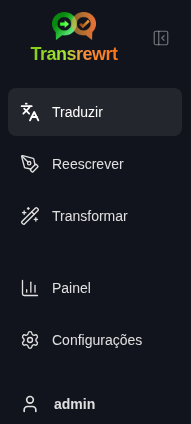
    </td>
    <td valign="top">
      <br/><br/>
      <ul>
        <li><strong>Traduzir</strong> abre o ambiente de trabalho de tradução.</li><br/>
        <li><strong>Reescrever</strong> abre o ambiente de trabalho de reescrita.</li><br/>
        <li><strong>Transformar</strong> abre o ambiente de trabalho de prompt personalizado.</li><br/>
        <li><strong>Painel</strong> mostra informações de uso e custo.</li><br/>
        <li><strong>Configurações</strong> abre o painel de configurações.</li><br/>
        <li><strong>Histórico</strong> mostra o histórico de uso com o texto de entrada e saída.</li><br/>
        <li><strong>Usuário</strong> mostra o nome de usuário do usuário logado (somente na web).</li>
      </ul>
    </td>
  </tr>
</table>

<br/>

<a id="toolbar"></a>
### Barra de ferramentas

A barra de ferramentas muda ligeiramente dependendo de onde você está no aplicativo.

- À esquerda, mostra o nome da página atual.
- À direita, mostra o seletor de **predefinido ou modelo** e o controle de **Idioma da interface**.

No modo **Fácil**, a barra de ferramentas exibe um **seletor de predefinidos** com os predefinidos internos **Grátis (OpenRouter)**, **Padrão**, **Avançado** e **Técnico**. Quais predefinidos aparecem depende do **Provedor** escolhido em [**Configurações** > **Configurações gerais**](#general-settings) — por exemplo, **Grátis (OpenRouter)** só é listado quando o provedor é OpenRouter. Se o **Provedor** for **Ollama**, a barra de ferramentas lista seus modelos locais instalados em vez de predefinidos.

No modo **Avançado**, o **seletor de modelo** permite escolher qual mecanismo de IA usar para a tarefa atual.

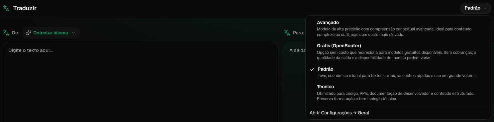

No modo Avançado, alguns modelos gratuitos podem não estar sempre disponíveis — eles podem estar offline ou atingir um limite de uso. O aplicativo pode remover automaticamente esse modelo da sua lista. Para controlar quais modelos aparecem, acesse [**Configurações** > **Modelos**](#models). Você pode abrir as configurações do modelo a partir do ícone do provedor à esquerda do nome do modelo na barra de ferramentas.

<br/>

O **ícone de globo + código de idioma** altera o idioma da interface do aplicativo, como menus e botões. Ele **não** altera os idiomas de tradução usados em **Traduzir**.

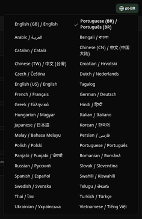

<br/>

<a id="input-and-output-panels"></a>
### Painéis de entrada e saída

A maioria dos ambientes de trabalho usa um painel de **Entrada** à esquerda e um painel de **Saída** à direita.

Cada painel também mostra:

| **Entrada**                                                          | **Saída**                                                                                                                  |
|--------------------------------------------------------------------|-----------------------------------------------------------------------------------------------------------------------------|
| - Contagem de caracteres <br/>- Contagem de palavras <br/>- Contagem de parágrafos   <br/> | - Tempo que a tarefa levou<br/>- **TPS** (tokens por segundo)<br/>- Contagens de caracteres, palavras e parágrafos<br/>- O modelo usado |

Se você tiver dúvidas sobre os termos técnicos:

- **Token** significa um pequeno trecho de texto. Você pode pensar nele como parte de uma palavra ou uma palavra curta.
- **TPS** indica quantos desses trechos de texto o modelo processou a cada segundo.

<br/>

Você também pode monitorar o custo de cada operação (se disponível) e o custo total, habilitando a opção `Show cost information on the actions` em [**Configurações** > **Configurações gerais**](#general-settings).

<br/><br/>

[--------------------------------------------------------------------------------------------------------------------------]: #

<a id="translate"></a>
## Traduzir

Use **Traduzir** quando quiser converter um texto de um idioma para outro.

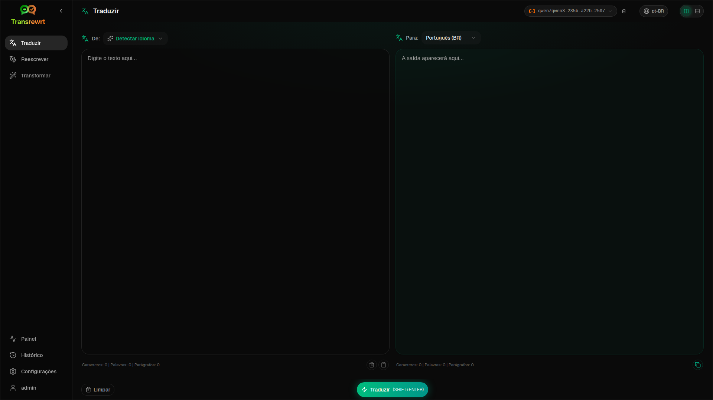

<br/>

<a id="translate-text"></a>
### Traduzir texto

1. Abra **Traduzir**.
2. Escolha um idioma em **De**.
3. Escolha um idioma em **Para**.
4. Escolha um predefinido (Fácil) ou modelo (Avançado) na barra de ferramentas.
5. Digite ou cole o texto na **Entrada**.
6. Clique em **Traduzir**.
7. Leia o resultado na **Saída**.
8. Use o botão de copiar se desejar copiar o resultado.

<br/>

<a id="language-selection"></a>
### Seleção de idioma

- **De** pode ser um idioma específico ou **Detectar idioma**.
- **Para** é o idioma em que você deseja o resultado.

Os **Idiomas principais** selecionados aparecem no topo da lista. Você pode definir esses idiomas em [**Configurações** > **Idiomas**](#languages).

<br/>

<a id="helpful-translation-settings"></a>
### Configurações úteis de tradução

Em [**Configurações** > **Configurações gerais**](#general-settings), você pode alterar o comportamento da tradução:

- **Executar automaticamente ao colar** executa uma tradução assim que você cola o texto.
- **Copiar automaticamente o resultado para a área de transferência** copia o resultado automaticamente após uma execução bem-sucedida.
- **Tradução em tempo real enquanto digita** (⚠️ Isso pode aumentar os custos de uso) executa traduções enquanto você digita.
- **Timeout (ms)** controla quanto tempo o aplicativo espera antes de executar uma tradução em tempo real.
- **Comportamento para ENTER** escolhe se `Enter` executa a tarefa ou insere uma nova linha:
  - **Enter** executa traduzir ou reescrever (padrão).
  - **Shift + Enter** executa traduzir ou reescrever; **Enter** simples insere uma nova linha.

<br/>

<a id="refining-translation"></a>
### Aprimorando sua tradução

Após uma tradução bem-sucedida, você pode aprimorar o resultado no painel de saída:

1. **Reformular…** — sem texto selecionado na saída, obtenha outra tradução completa da mesma entrada com palavras diferentes. Você pode armazenar até **cinco** versões e alternar entre elas no menu suspenso de versões. Com texto selecionado, **Reformular…** abre alternativas de palavras próximas à seleção (igual ao clique com o botão direito). Sem uma seleção, **Reformular…** é desativado uma vez que você atinge cinco versões; com uma seleção, ainda funciona com cinco versões (apenas alternativas de palavras, atualizando a versão 5).
2. **Alternativas de palavras** — selecione uma ou mais palavras na saída (se você selecionar apenas parte de uma palavra, o aplicativo expande a seleção para palavras completas), em seguida, clique com o botão direito ou clique em **Reformular…**. Uma lista curta de alternativas aparece próxima à seleção; clique em uma para substituí-la. Se você tiver menos de cinco versões, a saída editada é salva como uma nova versão; com cinco versões, apenas **versão 5** é atualizada. Clique com o botão direito sem seleção não faz nada. Pressione **Esc** ou clique fora da lista para cancelar sem alterar a saída.
3. **Custos** — cada **Reformular…** completo (sem seleção) e cada solicitação de alternativa de palavra utiliza o modelo novamente e pode aumentar o custo de uso (igual a uma execução normal de tradução).

[--------------------------------------------------------------------------------------------------------------------------]: #

<a id="rewrite"></a>
## Reescrever

Use **Reescrever** quando desejar melhorar a redação sem alterar o significado principal.

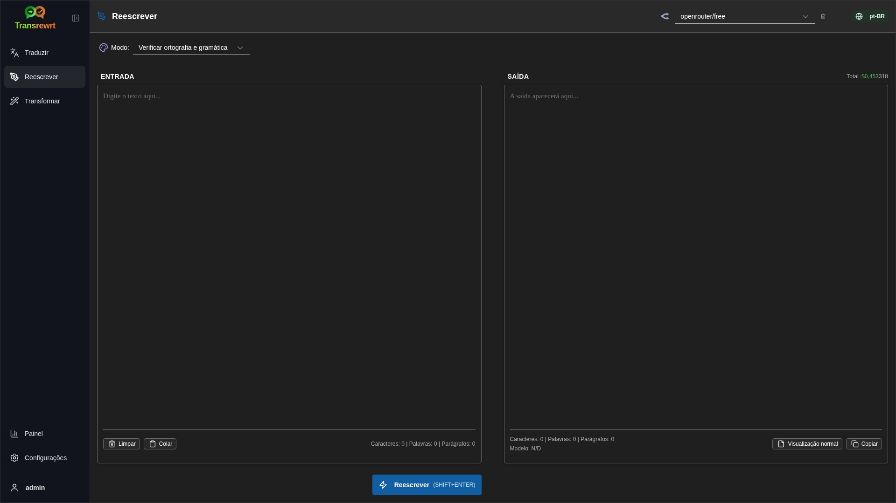

Isso é útil para:

- corrigir ortografia e gramática (**Verificar ortografia e gramática**)
- tornar o texto mais claro (**Melhorar Clareza**)
- várias reformulações distintas em uma única execução (**Versões alternativas**)
- tornar o texto mais formal ou mais informal (**Tornar Formal** / **Tornar Informal**)
- encurtar ou expandir o texto (**Encurtar** / **Expandir**)
- tornar o texto mais técnico (**Tornar Técnico**)

<br/>

> 💡 **DICA**<br/>
> Quando você usa o modo "**Verificar ortografia e gramática**", um interruptor **Mostrar alterações** aparece no painel de saída (ao lado de **Copiar**).
> Ative ou desative para mostrar ou ocultar as correções específicas aplicadas ao seu texto.

<br/><br/>

[--------------------------------------------------------------------------------------------------------------------------]: #

<a id="transform"></a>
## Transformar

Use **Transformar** quando desejar que a IA siga um conjunto personalizado de instruções.

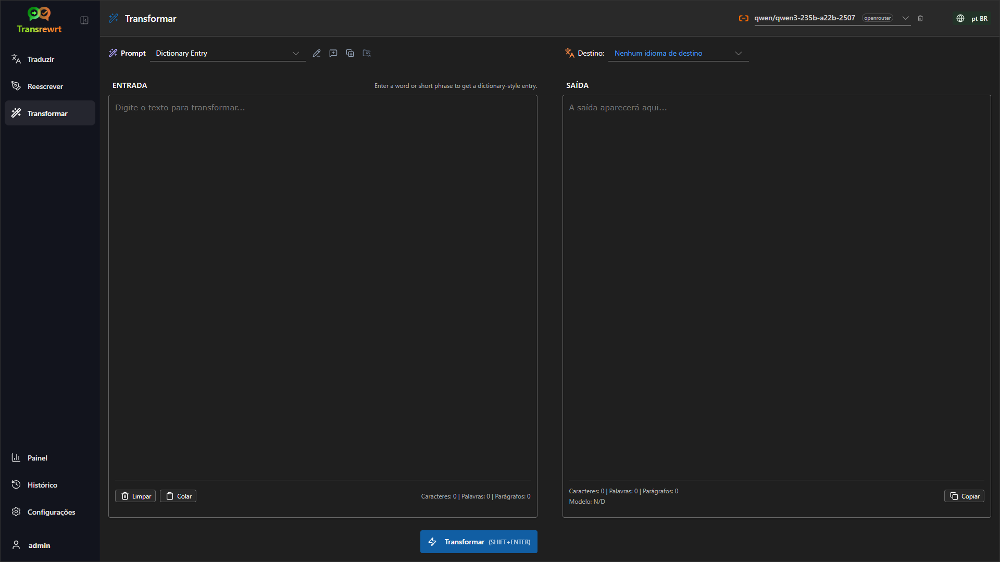

Esta é a área mais flexível do aplicativo. Você pode usá-la para tarefas como:

- resumir anotações
- transformar um texto informal em um e-mail polido
- extrair pontos principais
- converter texto em um formato específico
- qualquer outra atividade personalizada com o texto de entrada

<br/>

<a id="run-an-existing-prompt"></a>
### Executar um prompt existente

1. Abra **Transformar**.
2. Escolha um prompt da lista de prompts.
3. Se uma caixa de idioma **De** aparecer, escolha um idioma se desejar.
4. Digite ou cole o texto em **Entrada**.
5. Clique em **Transformar**.
6. Leia o resultado em **Saída**.

<br/>

<a id="if-you-have-no-prompts-yet"></a>
### Se você ainda não tem prompts

Se sua lista de prompts estiver vazia, clique em **Carregar prompts de exemplo** no espaço de trabalho Transformar. O mesmo controle está sempre disponível em [**Configurações** > **Transformar**](#transform-settings) na linha de exportação/importação. Ambos adicionam exemplos integrados para que você possa começar rapidamente.

<br/>

> ℹ️ **OBSERVAÇÃO**<br/>
> Os prompts de exemplo são fornecidos em inglês. Após carregá-los, você pode editar um prompt e usar **Traduzir prompt** para traduzi-lo para sua língua.

<br/>

<a id="create-a-prompt-quickly"></a>
### Criar um prompt rapidamente

A maneira mais rápida de criar um prompt é:

1. Clique em **Novo prompt**.
2. Clique em **Gerar prompt**.
3. Descreva o que deseja que o prompt faça.
4. Escolha um predefinido (Fácil) ou modelo (Avançado).
5. Deixe o aplicativo criar um rascunho para você.
6. Revise o rascunho e clique em **Salvar**.

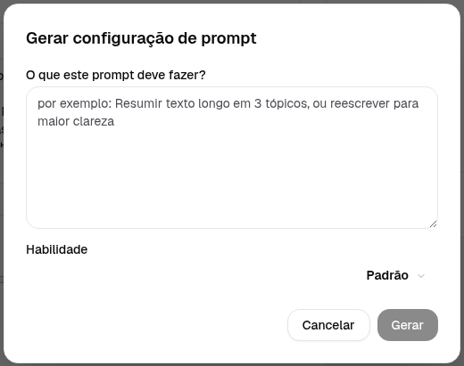

<br/>

<a id="edit-a-prompt"></a>
### Editar um prompt

Quando você cria ou edita um prompt, o editor aparece à esquerda e uma área de teste aparece à direita.

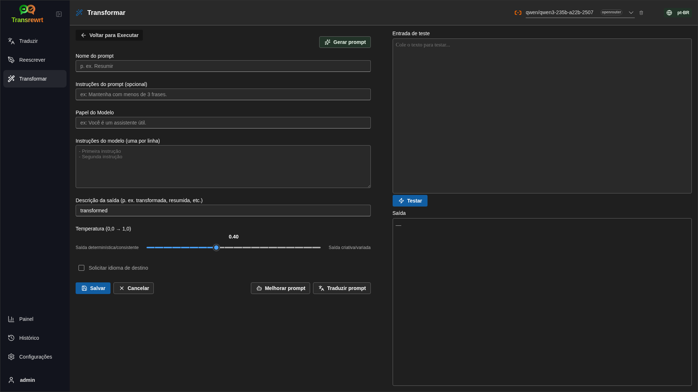

Os campos principais são:

- **Nome do prompt**: o nome exibido na lista de prompts.
- **Instruções do prompt (opcional)**: uma dica curta exibida ao usuário ao executar o prompt.
- **Função do modelo**: a função geral atribuída à IA, como 'Você é um assistente útil.'
- **Instruções do modelo (uma por linha)**: as regras específicas que você deseja que a IA siga.
- **Descrição da saída (ex.: transformada, resumida, etc.)**: uma palavra curta descrevendo o resultado.
- **Temperatura (0,0 → 1,0)**: como o modelo se comportará; veja abaixo.
- **Pedir idioma de destino**: adiciona um seletor de idioma quando o prompt é executado.
Se o termo técnico **Temperatura** é novo para você, pense assim:

- Uma temperatura **mais baixa** oferece resultados mais estáveis e previsíveis.
- Uma temperatura **mais alta** oferece mais variedade e criatividade.

Você também pode usar:

- `Generate prompt` para criar um novo rascunho a partir de uma descrição simples
- `Improve prompt` para aprimorar um prompt existente
- `Translate prompt` para traduzir os campos do prompt

<br/>

> ⚠️ **ATENÇÃO**<br/>
> Clique em `Save` antes de clicar em `Back to Run`. Se você voltar sem salvar, suas alterações serão perdidas.

<br/>

<a id="test-a-prompt-before-using-it"></a>
### Testar um prompt antes de usá-lo

O painel de testes à direita permite que você experimente seu prompt com texto de exemplo antes de usá-lo no trabalho diário.

Isso é útil quando:

- você está criando um novo prompt
- você está comparando duas versões de um prompt
- você deseja verificar o tom, comprimento ou formato da saída

<br/>

> ℹ️ **OBSERVAÇÃO**<br/>
> Você pode exportar e importar prompts salvos em [**Configurações** > **Transformar**](#transform-settings).

Quando você usa **Gerar prompt**, **Melhorar prompt** ou **Traduzir prompt** no editor de prompts, o modo **Fácil** oferece o mesmo seletor de predefinidos usado em Traduzir e Reescrever; o modo **Avançado** utiliza a lista de modelos.

<br/><br/>

[--------------------------------------------------------------------------------------------------------------------------]: #

<a id="dashboard"></a>
## Painel

Use o **Painel** para ver o quanto você está usando o aplicativo e quanto isso está custando (para modelos pagos).

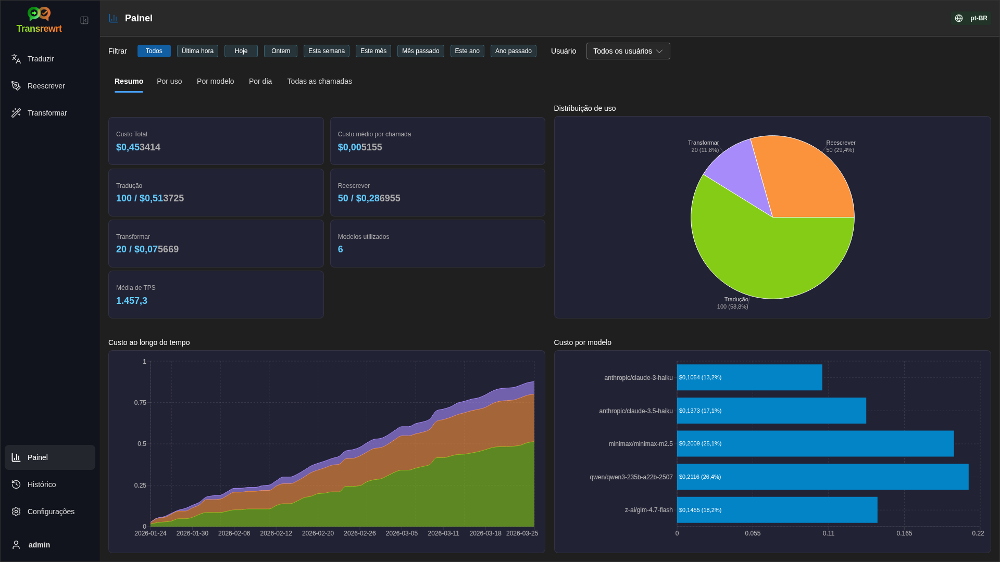

<br/>

> ℹ️ **NOTA**<br/>
> Se você usar apenas modelos **grátis**, os valores de **custo** podem ser zero e os KPIs focados em custo podem parecer vazios. A aba **Resumo** ainda exibe a contagem de chamadas para tradução, reescrita e transformação quando houver atividade no período selecionado.

<br/>

<a id="filter-the-data"></a>
### Filtrar os dados

Use os botões de filtro na parte superior para alterar o intervalo de tempo.

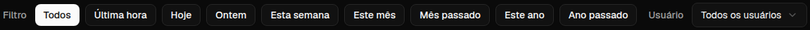

<br/>

> ℹ️ **OBSERVAÇÃO**<br/>
> O filtro **Usuário** só é visível para administradores na versão web. Usuários comuns não verão esse filtro, e ele não está disponível no aplicativo desktop.

<br/>

<a id="dashboard-tabs"></a>
### Abas do Painel

- **Resumo** mostra cartões de KPI: custo total, modelos utilizados, contagem e custo de chamadas por modo (com participação nas chamadas totais), custo médio por chamada, TPS médio e os três principais modelos por número de chamadas.
- **Por Modelo** lista cada modelo com chamadas totais, custo total e TPS médio; expanda uma linha para obter detalhes por tradução, reescrita e transformação.
- **Todas as chamadas** mostra o log completo de chamadas (paginado em telas largas, em formato de cartões em telas estreitas) e permite exportá-lo.

<br/>

<a id="export-data"></a>
### Exportar dados

As tabelas do painel podem exportar dados nos formatos:

- **JSON**
- **CSV**
- **XLSX**

Isso é útil se você quiser analisar as atividades fora do aplicativo ou compartilhar um relatório.

<br/>

<a id="delete-stored-records-for-a-model"></a>
### Excluir registros armazenados de um modelo

Em **Por Modelo** ou **Todas as chamadas**, você pode remover registros armazenados de um modelo clicando no ícone da "lixeira".

> ⚠️ **AVISO**<br/>
> A exclusão de registros armazenados não pode ser desfeita. Use isso apenas se tiver certeza de que não precisa mais desse histórico.

Para excluir todos os dados ou remover registros com base na idade deles, acesse [**Configurações** > **Rastreamento de Custo**](#cost-tracking). Lá você encontrará opções para excluir todos os dados armazenados ou apenas dados mais antigos que uma determinada data.

<br/><br/>

[--------------------------------------------------------------------------------------------------------------------------]: #

<a id="history"></a>
## Histórico

Clique em **Histórico** para ver o histórico das suas ações dentro do **Transrewrt**, incluindo a entrada e saída de cada operação.

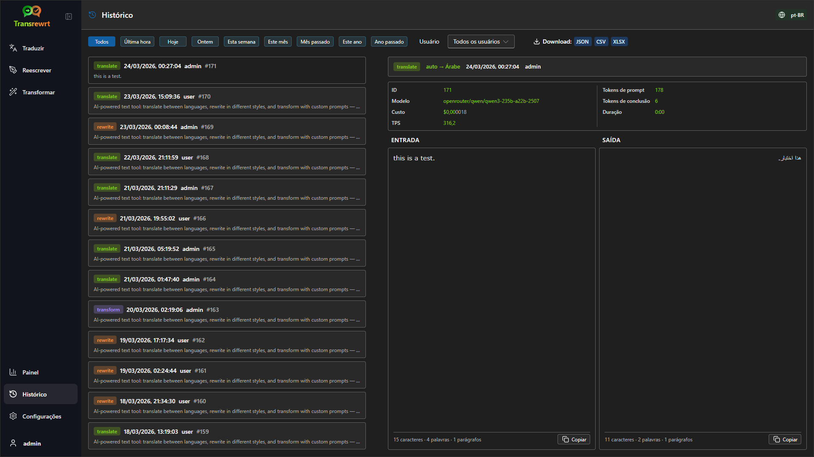

<br/>

<a id="filter-the-history"></a>
### Filtrar o histórico

**Histórico** usa os mesmos filtros de intervalo de tempo da página **Painel**.


<br/>

> ℹ️ **NOTA**<br/>
> No **aplicativo web**, todos (incluindo administradores) veem apenas seu próprio histórico de execuções. O filtro **Usuário** no **Painel** serve para administradores analisarem o uso e custos entre contas; ele não se aplica ao **Histórico**.

<br/>

<a id="export-history-data"></a>
### Exportar dados do histórico

A página de histórico pode exportar os dados filtrados nos formatos:

- **JSON**
- **CSV**
- **XLSX**

Isso é útil se você quiser analisar as atividades fora do aplicativo ou compartilhar um relatório.

<br/><br/>

[--------------------------------------------------------------------------------------------------------------------------]: #

<a id="settings"></a>
## Configurações

Abra **Configurações** na barra lateral para personalizar o comportamento do aplicativo.

As guias disponíveis dependem da plataforma e da sua função:

| Tab              | Desktop | Web (admin) | Web (usuário comum) | Observações                                        |
  |------------------|:-------:|:-----------:|:------------------:|----------------------------------------------------|
  | Configurações gerais |   sim   |     sim     |        sim         | Inclui **experiência com IA** (Fácil / Avançado) |
  | Modelos           |   sim   |     sim     |        sim         | Apenas quando a **experiência com IA** estiver como **Avançado** |
  | Idiomas         |   sim   |     sim     |        sim         | |
  | Rastreamento de Custo     |   sim   |     sim     |         -          | |
  | Transformar         |   sim   |     sim     |        sim         | Importação/exportação em massa de prompts de transformação |
  | Usuários             |    -    |     sim     |         -          | |
  | Configuração de API        |   sim   |     sim     |         -          | |
  | Sobre             |   sim   |     sim     |        sim         | |

No modo **Fácil**, a seleção de modelo é feita por meio de predefinidos na barra de ferramentas e do **Provedor** em Configurações gerais; a aba **Modelos** fica oculta.

<br/>

> ℹ️ **OBSERVAÇÃO**<br/>
> Na versão web, cada usuário possui sua própria configuração. Configurações como experiência com IA, provedor, modelos ou predefinidos selecionados, idiomas, opções gerais e prompts de transformação são armazenadas por usuário. As alterações que você fizer não afetam outros usuários.

<br/>

[--------------------------------------------------------------------------------------------------------------------------]: #

<a id="general-settings"></a>
### Configurações gerais

Use **Configurações gerais** para controlar o comportamento de digitação, se os detalhes de execução são armazenados no **Histórico**, aparência e como você escolhe a IA para Traduzir, Reescrever e Transformar.

**Experiência com IA**

- **Fácil** (padrão): escolha um **Provedor** (OpenRouter, OpenAI, Anthropic, Google Gemini, DeepSeek, Groq, Mistral, xAI, Cerebras ou Ollama). Provedores em nuvem usam os predefinidos internos na barra de ferramentas. O **Ollama** lista os modelos instalados na sua máquina em vez de predefinidos. No modo Fácil, o **Catálogo de predefinidos** mostra a versão do catálogo e a hora da última atualização; clique em **Atualizar catálogo de predefinidos** para buscar a lista mais recente no repositório do projeto (o aplicativo também verifica periodicamente em segundo plano).
- **Avançado**: escolha modelos individuais na barra de ferramentas; gerencie a lista em [**Configurações** > **Modelos**](#models).

**Aparência**

- **Tema** alterna entre aparência clara, escura e do sistema.
- **Mostrar informações de custo nas ações** controla a exibição do custo por operação (se disponível) e do custo total nos painéis de saída de Traduzir, Reescrever e Transformar.
- **Casas decimais do custo** altera como as casas decimais do custo são exibidas.
- **Apenas web:** **mostrar uma margem ao redor do aplicativo** adiciona espaço extra ao redor da interface.
- **Família da fonte** altera a fonte de escrita nos painéis de texto.
- **Tamanho** altera o tamanho da fonte.

**Comportamento**

- **Comportamento para ENTER** escolhe se `Enter` executa a tarefa ou insere uma nova linha.
- **Executar automaticamente ao colar** inicia a tradução assim que você cola o texto.
- **Copiar automaticamente o resultado para a área de transferência** copia resultados bem-sucedidos automaticamente.
- **Tradução em tempo real enquanto digita** (⚠️ Isso pode aumentar os custos de uso) traduz enquanto você digita.
- **Tempo limite (ms)** define o tempo de espera para a tradução em tempo real.

**Histórico**

- **Manter histórico de execuções** controla se cada tradução, reescrita e transformação armazena o **texto de entrada e saída** para a visualização do [**Histórico**](#history) na barra lateral. Desativar isso solicita confirmação; se confirmado, o texto do histórico armazenado é removido do banco de dados. Se o rótulo mostrar *desativado pelo administrador*, sua instalação tem `HISTORY_DISABLED` definido no ambiente (veja o [README](README.pt-BR.md#configuration-and-environment)); você não pode reativar o histórico pela interface.
- **Excluir dados do histórico** permite remover textos armazenados por idade (por exemplo, mais antigos que alguns meses, ou **todos os dados (limpar)**) usando **Excluir dados**. Isso afeta apenas o texto de execuções salvas para a visualização do **Histórico**; **não** exclui totais de custo ou uso. Para remover ou reduzir dados de **custo**, use [**Configurações** > **Rastreamento de Custo**](#cost-tracking).

**Backup de Configuração** (apenas para administradores de aplicativos desktop e web)
- **Incluir dados de uso no backup** - quando ativado, o ZIP também contém histórico de execução e dados de chamadas de API.
- **Fazer backup da configuração** - cria um único ZIP (`transrewrt-config-backup-YYYY-MM-DD_HHMMSS.zip` no horário local) com `config.json`, `state.json`, chave de criptografia opcional, usuários, preferências, prompts personalizados e dados de uso se você optou por isso. Após um backup bem-sucedido, a confirmação mostra o nome do arquivo salvo.
- **Restaurar do backup** - abre primeiro um **diálogo de confirmação**. Escolha o ZIP de backup dentro do diálogo (**Procurar** / seletor de arquivos ou arrastar e soltar onde suportado), depois revise as opções:
  - **Restaurar os dados de uso** - importar uso/histórico do ZIP quando foi feito backup com uso incluído; deixe desmarcado se você quiser apenas configurações e prompts.
  - **Limpar os dados de uso antigos antes de restaurar** - remover uso/histórico existente nesta instalação antes de aplicar o backup (opcional; use quando você quiser uma substituição limpa).
Backups criados na versão web ou desktop podem ser restaurados na outra. Ao restaurar um backup de desktop na versão web, os dados serão restaurados para o usuário administrador.

<br/>

<a id="models"></a>
### Modelos

Esta aba está disponível apenas quando a **experiência com IA** estiver definida como **Avançado** em [**Configurações gerais**](#general-settings). Use **Configurações** > **Modelos** para escolher quais modelos aparecem na barra de ferramentas.

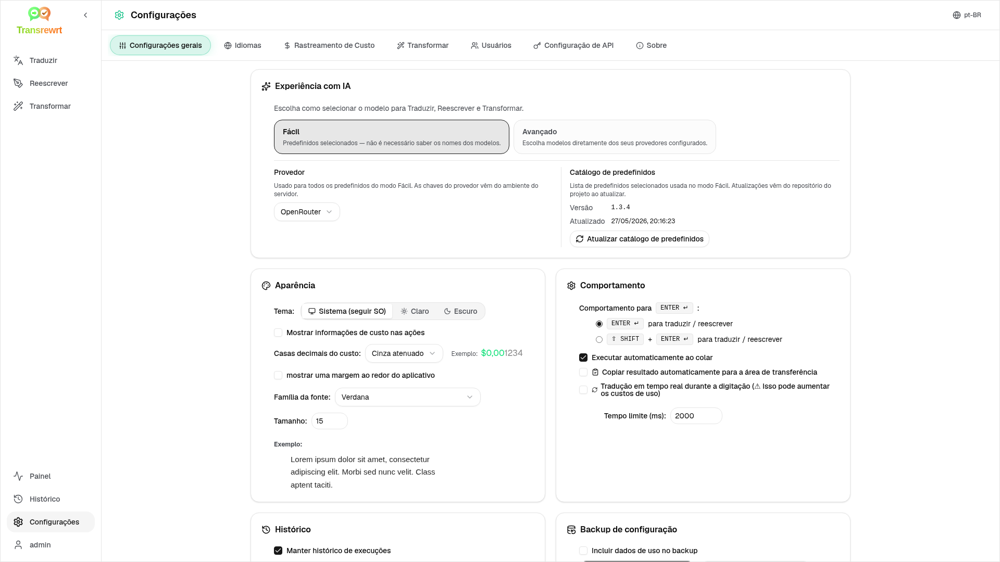

A página possui duas listas:

- **Modelos Disponíveis** à esquerda
- **Modelos Selecionados** à direita

Controles úteis incluem:

- **Buscar modelos...** para encontrar um modelo pelo nome
- **Provedor** para restringir a lista a um mecanismo (OpenRouter, OpenAI, Ollama, …)
- **Apenas Gratuitos** para mostrar somente modelos gratuitos
- **Atualizar** para recarregar a lista
- **Expandir Todos** e **Recolher Todos** ao ordenar por provedor

IDs de modelos incluem o prefixo do provedor (por exemplo `openrouter/…` vs `openai/…`). Emblemas como **OpenAI (OpenRouter)** vs **OpenAI (direto)** mostram como o tráfego é roteado.

> ℹ️ **NOTA**<br/>
> **OpenRouter Body Builder** (`openrouter/bodybuilder`) é um modelo roteador, não um modelo de chat geral: sua resposta é JSON que descreve corpos de requisição da API OpenRouter (por exemplo, um array `requests` com `model` e `messages`). Se você usá-lo para **Traduzir**, **Reescrever** ou **Transformar**, o painel de saída mostrará esse JSON em vez do texto finalizado. Escolha um modelo de texto normal para essas tarefas. Veja a [página do modelo Body Builder](https://openrouter.ai/openrouter/bodybuilder) no OpenRouter.

Ações:

- Para adicionar um modelo, clique em **Adicionar** ou em qualquer lugar da entrada.

- Para remover um modelo, clique em **X** ao lado dele em **Modelos Selecionados** ou em **Selecionado** na entrada em Modelos Disponíveis.

- Para limpar a lista, clique em **Desmarcar Todos**. O modelo gratuito obrigatório permanecerá na lista.

<br/>

> ℹ️ **NOTA**<br/>
> Se você não quiser adicionar créditos ao OpenRouter imediatamente, comece habilitando **Apenas Gratuitos** e escolhendo os modelos gratuitos (sem cartão de crédito necessário). Você também pode usar o Ollama para executar modelos localmente sem nenhuma chave de API.

<br/>

<a id="languages"></a>
### Idiomas

Use **Configurações** > **Idiomas** para organizar as listas de idiomas usadas no aplicativo.

- **Idiomas principais** são fixados próximo ao topo das listas de idiomas em **Traduzir** e **Transformar**.
- **Idioma Personalizado** permite adicionar um idioma que não está na lista embutida.

Se você adicionar um idioma personalizado, ele aparecerá nos seletores de idioma ao lado das opções embutidas.

<br/>

<a id="cost-tracking"></a>
### Rastreamento de Custo

Use **Configurações** > **Rastreamento de Custo** para gerenciar as informações de custo.

- **Custo total** mostra o total acumulado.
- **Copiar Valor** copia o total para a área de transferência.
- **Redefinir custo** redefine o total armazenado para zero.
- **Sincronizar com o uso da chave de API** define o total de acordo com o uso relatado pela sua conta OpenRouter (somente OpenRouter).
- **Uso da Chave de API** mostra detalhes de uso do OpenRouter, se disponíveis.
- **Excluir dados de custo** remove todos os dados ou apenas entradas anteriores a uma data selecionada.

**Rastreamento de custo:** Quando você usa modelos OpenRouter, o aplicativo mostra seu uso real e gastos com base nas informações de custo do OpenRouter. Para todos os outros provedores, o aplicativo estima os custos usando preços publicados pelo OpenRouter; se um preço não estiver disponível, a estimativa pode ser zero.

<br/>

> ℹ️ **NOTA**<br/>
>  **Todos os valores de custo são estimativas apenas para sua referência, não são extratos oficiais de cobrança.**

<br/>

> ⚠️ **ATENÇÃO**<br/>
> A exclusão de dados não pode ser desfeita. Antes de excluir, certifique-se de fazer backup dos seus dados ou exportá-los via [**Histórico**](#history) 
> ou [**Painel** > **Todas as chamadas**](#dashboard-tabs), caso contrário eles serão perdidos permanentemente. 
> Todo o histórico de entrada/saída relacionado a cada entrada de chamada de API também será excluído.

<br/>

<a id="transform-settings"></a>
### Transformar (aba de configurações)

Use **Configurações** > **Transformar** para gerenciar prompts em massa.

Você pode:

- revisar seus prompts salvos
- excluir prompts
- importar prompts de um arquivo
- exportar prompts para backup ou compartilhamento
- carregar prompts de exemplo para a lista de prompts

<br/>

<a id="users"></a>
### Usuários

Use **Usuários** para gerenciar contas de usuário na versão web. Você pode adicionar usuários, atualizar seus dados, redefinir senhas e excluir contas.

<br/>

<a id="api-config"></a>
### Configuração de API

Os provedores suportados são: OpenRouter, OpenAI, Anthropic, Google Gemini, DeepSeek, Groq, Mistral, xAI, Cerebras e **Ollama** (modelos locais por meio de uma URL base). Você só precisa configurar os provedores que utilizar.

**Aplicativo web: somente administrador**

As chaves de API são configuradas por meio de variáveis de ambiente do sistema ou do Docker – elas não são inseridas na interface web. Esta página mostra quais provedores têm uma chave configurada e permite testar cada um clicando no botão `Test`.

<br/>

> ℹ️ **OBSERVAÇÃO**<br/>
> Para alterar uma chave de API, atualize a variável de ambiente na sua configuração de sistema ou Docker e reinicie o servidor ou contêiner.

<br/>

> ℹ️ **OBSERVAÇÃO**<br/>
> Os **backups de configuração** (veja [**Configurações gerais** → Backup de configuração](#general-settings)) podem incorporar chaves de provedor **resolvidas** dentro do `config.json` do arquivo ZIP. Restaurar esse ZIP **não** copia essas chaves de volta para o arquivo de configuração persistido do servidor – as chaves ativas ainda vêm do ambiente e do estado do arquivo existente, conforme descrito ali.

<br/>

**Aplicativo desktop**

Use **Configuração de API** para armazenar chaves de API para cada provedor que você utiliza. Para o Ollama, insira a **URL base** em vez de uma chave de API.

<br/>

> 💡 **Dica** <br/>
> Se você não deseja usar uma chave de API ou pagar por uso, pode [baixar o Ollama](https://ollama.com) e executar modelos (como `translategemma:4b`) localmente na sua máquina gratuitamente. Alternativamente, você pode criar uma conta gratuita no OpenRouter (sem cartão de crédito necessário) para usar seus modelos gratuitos ou obter uma chave de API gratuita da Cerebras, Google, Groq ou Mistral AI.

<br/>

- Adicione apenas os provedores que precisar. Em **Configurações** > **Modelos**, cada ID de modelo começa com o nome do provedor (por exemplo, `openrouter/openrouter/free`, `openai/gpt-4o`, `ollama/llama3`).

Para adicionar uma chave de API, insira o valor no campo de texto e clique em `Save`. Para substituir uma chave existente, clique em `Edit`. Para verificar se uma chave está funcionando, clique em `Test`. Para a URL base do Ollama, clique sempre em `Test` para verificar a conexão.

<br/>

> ℹ️ **OBSERVAÇÃO**<br/>
> Você não pode ver o valor atual de uma chave de API. Só é possível substituí-la usando o botão `Edit`.
> As chaves de API são armazenadas criptografadas na configuração.

<br/>

<a id="about"></a>
### Sobre

A aba **Sobre** mostra:

- o nome do aplicativo e a frase de efeito
- o número da versão e a data da compilação
- informações de licença e direitos autorais, com um link para abrir **Avisos de terceiros**
- um link para o repositório do projeto

<br/><br/>

<a id="common-issues"></a>
## Problemas comuns

Se algo não estiver funcionando como esperado, verifique primeiro os seguintes pontos.

<br/>

<a id="the-app-will-not-translate-rewrite-or-transform-text"></a>
### O aplicativo não traduz, reescreve ou transforma o texto

Verifique se:

- você selecionou um **predefinido** (Fácil) ou **modelo** (Avançado) na barra de ferramentas
- no modo **Fácil**, [**Configurações** > **Configurações gerais**](#general-settings) possui um **Provedor** com uma chave válida (ou URL do Ollama) e pelo menos um predefinido para esse provedor
- no modo **Avançado**, pelo menos um modelo está listado em [**Configurações** > **Modelos**](#models)
- sua configuração de API está funcionando

Se você estiver usando o aplicativo desktop:

1. Abra [**Configurações** > **Configuração de API**](#api-config).
2. Verifique se pelo menos uma chave de API foi salva.
3. Clique em **Testar** ao lado do provedor para confirmar que a chave está funcionando.

<br/>

<a id="the-model-list-is-empty"></a>
### A lista de modelos está vazia

No modo **Fácil**, abra [**Configurações** > **Configurações gerais**](#general-settings), confirme se o **Provedor** está definido e adicione ou teste chaves em [**Configuração de API**](#api-config) (área de trabalho) ou solicite ao seu administrador (web). Para **Ollama**, execute o **Teste** na URL base e certifique-se de que os modelos estão instalados localmente.

No modo **Avançado**, abra [**Configurações** > **Modelos**](#models) e clique em **Atualizar**. Se necessário, pesquise um modelo, ative **Apenas Gratuitos** e adicione modelos aos **Modelos Selecionados**.

<br/>

<a id="the-result-is-too-slow-or-too-expensive"></a>
### O resultado é muito lento ou muito caro

Tente uma ou mais destas opções:

- escolha uma predefinição diferente (Fácil) ou modelo (Avançado)
- use uma entrada mais curta
- desative **Tradução em tempo real enquanto digita** em [**Configurações** > **Configurações Gerais**](#general-settings)
- use modelos grátis para tarefas simples (veja [Modelos](#models))
<br/>

<a id="the-interface-is-in-the-wrong-language"></a>
### A interface está no idioma errado

Clique no ícone de globo na [barra de ferramentas](#toolbar) e escolha seu **Idioma da interface** preferido.

<br/>

<a id="the-text-is-too-small-or-hard-to-read"></a>
### O texto é muito pequeno ou difícil de ler

Abra [**Configurações** > **Configurações gerais**](#general-settings) e altere:

- **Família da fonte**
- **Tamanho**

<br/>

<a id="dashboard-summary-looks-empty"></a>
### O resumo do Painel parece vazio

Isso é normal se:

- você está usando apenas **modelos gratuitos** e está visualizando os valores de **custo** (eles podem ser zero); os indicadores de quantidade de chamadas na aba **Resumo** ainda precisam de dados do período selecionado
- o **filtro de tempo** selecionado não abrange o período em que as chamadas foram feitas — tente **Todos** para verificar

Se os indicadores ainda forem zero após selecionar **Todos**, confirme se as chamadas aparecem em [**Histórico**](#history) ou na aba **Todas as chamadas**.

<br/>

<a id="cost-shows-not-available-or-seems-wrong"></a>
### O custo mostra "não disponível" ou parece incorreto

Quando você usa modelos por meio do **OpenRouter**, o aplicativo exibe o valor real gasto informado pelo OpenRouter.

Para **outros provedores** (OpenAI direto, Anthropic direto, etc.), o custo é estimado a partir dos dados de preços publicados pelo OpenRouter. Se nenhum preço correspondente for encontrado para um modelo, o custo aparecerá como **não disponível** e não será adicionado ao seu total acumulado.

<br/>

<a id="total-cost-does-not-match-my-provider-bill"></a>
### O custo total não corresponde à minha fatura do provedor

Todos os valores de custo no aplicativo são **estimativas para referência apenas**, não são demonstrativos oficiais de cobrança.

Para aproximar o total do seu gasto real no OpenRouter, abra [**Configurações** > **Rastreamento de Custo**](#cost-tracking) e clique em **Sincronizar com o uso da chave de API**.

<br/>

<a id="the-history-page-is-missing-from-the-sidebar"></a>
### A página Histórico está ausente na barra lateral

**Manter histórico de execuções** pode estar desativado. Abra [**Configurações** > **Configurações gerais**](#general-settings) e ative-o, a menos que o histórico esteja *desativado pelo administrador* (`HISTORY_DISABLED` no ambiente — consulte o [README](README.pt-BR.md#configuration-and-environment)). Ativar o histórico não restaura textos previamente excluídos.

<br/>

<a id="web-app-session-expired"></a>
### Aplicativo web: redirecionado para a página de login inesperadamente

Sua sessão pode ter expirado. Faça login novamente. Se isso acontecer com frequência, verifique a configuração do servidor quanto às definições de tempo de vida da sessão.

<br/>

<a id="web-admin-forgot-or-lost-a-password"></a>
### Administração web: esqueci ou perdi a senha

Isso se aplica ao **aplicativo web autohospedado** (Docker), não ao aplicativo desktop (Electron).

- Se outro administrador ainda puder fazer login, ele pode abrir [**Configurações** > **Usuários**](#users), escolher a conta e definir uma **nova senha** lá.
- Se você estiver **bloqueado**, mas tiver **acesso ao shell** da máquina ou contêiner, redefina a senha com o utilitário fornecido na imagem (substitua `transrewrt` se você alterou o nome padrão, e coloque a senha entre aspas se contiver espaços ou caracteres especiais):

```bash
docker exec transrewrt reset-web-password '<username>' '<new-password>'
```

O nome de usuário padrão do administrador é `admin` se você nunca criou outras contas. Quando você passa apenas um argumento, ele é tratado como a nova senha para `admin`.

Se você executar a partir de um **checkout de código-fonte** em vez do Docker, use:

```bash
pnpm run reset-web-password -- <username> <new-password>
```

O script atualiza o registro do usuário no banco de dados SQLite (e pode criar o `admin` usuário se ele estiver ausente). Após a redefinição, faça login com a nova senha.

<br/>

<a id="dashboard-shows-no-data-for-other-users"></a>
### O painel não mostra dados de outros usuários (web)

Apenas **administradores** podem visualizar dados de todos os usuários por meio do filtro **Usuário**. Usuários regulares veem apenas suas próprias atividades por design.

<br/>

<a id="i-changed-a-prompt-and-lost-the-edits"></a>
### Eu alterei um prompt e perdi as edições

Ao editar um prompt, clique sempre em **Salvar** antes de clicar em **Voltar para Executar**.

<br/><br/>

<a id="quick-tips"></a>
## Dicas rápidas

- Comece com [**Traduzir**](#translate) para garantir que sua configuração está funcionando antes de passar para [**Reescrever**](#rewrite) ou [**Transformar**](#transform).
- Use [**Reescrever**](#rewrite) para melhorias cotidianas no texto.
- Use [**Transformar**](#transform) quando precisar de um fluxo de trabalho repetível para uma tarefa específica.
- Use [**Painel**](#dashboard) se quiser acompanhar o uso e o custo.
- Use [**Histórico**](#history) para revisar operações anteriores e seus textos completos de entrada/saída.
- Exporte prompts regularmente se estiver criando uma biblioteca de prompts que deseja manter segura (consulte [Transformar](#transform)) ou se desejar compartilhá-la com outras pessoas.
- Permaneça no modo **Fácil** até precisar de controle granular sobre IDs de modelos; mude para **Avançado** quando já souber exatamente quais modelos deseja usar.

<br/><br/>

<a id="disclaimer"></a>
## Isenção de responsabilidade

Nomes e ícones de produtos pertencem aos seus respectivos proprietários e são usados apenas para fins de identificação. Este software não é afiliado nem endossado por nenhuma das marcas mencionadas.

<br/><br/>

<a id="license"></a>
## Licença

Direitos autorais © 2026 Waldemar Scudeller Jr.

[Apache License 2.0](../LICENSE)
