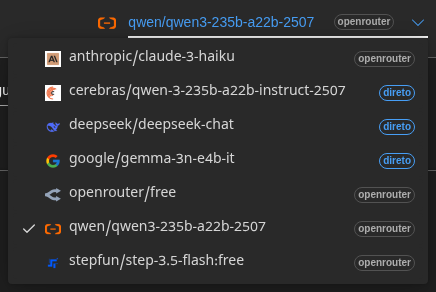
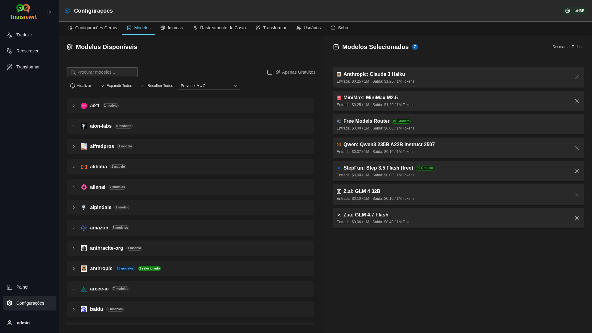

# Guia do Usuário do Transrewrt

 

## Introdução

O Transrewrt ajuda você a trabalhar com texto de três formas principais:

- **Traduzir** - converter texto de um idioma para outro.
- **Reescrever** - reformular texto em um estilo diferente, como mais claro, mais curto ou mais formal.
- **Transformar** - processar texto usando instruções personalizadas de IA chamadas prompts.

 

Este guia explica como usar o aplicativo depois que ele estiver instalado e em execução. Para as etapas de instalação, consulte o [README](../README.md) principal.

 

> ℹ️ **OBSERVAÇÃO** 
> O Transrewrt está disponível como um aplicativo desktop para Windows e Linux e como um aplicativo web auto-hospedado. Este guia se concentra no uso diário do aplicativo. Quando algo se aplica apenas a uma versão, é claramente indicado.

<small>**Ler em outros idiomas:** [Inglês (UK)](../USER-GUIDE.md) · [Português (BR)](USER-GUIDE.pt-BR.md) · [Árabe](USER-GUIDE.ar.md) · [Bengali](USER-GUIDE.bn.md) · [Catalão](USER-GUIDE.ca.md) · [Simplified Chinese](USER-GUIDE.zh-CN.md) · [Traditional Chinese](USER-GUIDE.zh-TW.md) · [Croata](USER-GUIDE.hr.md) · [Tcheco](USER-GUIDE.cs.md) · [Holandês](USER-GUIDE.nl.md) · [Inglês (US)](USER-GUIDE.en-US.md) · [Filipino](USER-GUIDE.tl.md) · [Francês](USER-GUIDE.fr.md) · [Alemão](USER-GUIDE.de.md) · [Grego](USER-GUIDE.el.md) · [Hindi](USER-GUIDE.hi.md) · [Húngaro](USER-GUIDE.hu.md) · [Italiano](USER-GUIDE.it.md) · [Japonês](USER-GUIDE.ja.md) · [Javanese](USER-GUIDE.jv.md) · [Coreano](USER-GUIDE.ko.md) · [Malaio](USER-GUIDE.ms.md) · [Persa](USER-GUIDE.fa.md) · [Polonês](USER-GUIDE.pl.md) · [Português (PT)](USER-GUIDE.pt.md) · [Punjabi](USER-GUIDE.pa.md) · [Romeno](USER-GUIDE.ro.md) · [Russo](USER-GUIDE.ru.md) · [Eslovaco](USER-GUIDE.sk.md) · [Espanhol](USER-GUIDE.es.md) · [Suaíli](USER-GUIDE.sw.md) · [Sueco](USER-GUIDE.sv.md) · [Telugu](USER-GUIDE.te.md) · [Tailandês](USER-GUIDE.th.md) · [Turco](USER-GUIDE.tr.md) · [Ucraniano](USER-GUIDE.uk.md) · [Vietnamita](USER-GUIDE.vi.md)</small>

 

<!-- START doctoc generated TOC please keep comment here to allow auto update -->
<!-- DON'T EDIT THIS SECTION, INSTEAD RE-RUN doctoc TO UPDATE -->
**Sumário**

- [Antes de começar](#antes-de-começar)
  - [Como obter uma chave de API (aplicativo desktop)](#como-obter-uma-chave-de-api-aplicativo-desktop)
- [Primeiros passos](#primeiros-passos)
- [Partes principais da janela](#partes-principais-da-janela)
  - [Barra lateral](#barra-lateral)
  - [Barra de ferramentas](#barra-de-ferramentas)
  - [Painéis de entrada e saída](#pain%C3%A9is-de-entrada-e-sa%C3%ADda)
- [Traduzir](#traduzir)
  - [Traduzir texto](#traduzir-texto)
  - [Seleção de idioma](#sele%C3%A7%C3%A3o-de-idioma)
  - [Configurações de tradução úteis](#configura%C3%A7%C3%B5es-de-tradu%C3%A7%C3%A3o-%C3%BAtteis)
  - [Atalhos de teclado](#atalhos-de-teclado)
- [Reescrever](#reescrever)
  - [Reescrever texto](#reescrever-texto)
- [Transformar](#transformar)
  - [Executar um prompt existente](#executar-um-prompt-existente)
  - [Se você ainda não tem prompts](#se-voc%C3%AA-ainda-n%C3%A3o-tem-prompts)
  - [Criar um prompt rapidamente](#criar-um-prompt-rapidamente)
  - [Editar um prompt](#editar-um-prompt)
  - [Testar um prompt antes de usá-lo](#testar-um-prompt-antes-de-us%C3%A1-lo)
  - [Gerenciar prompts salvos](#gerenciar-prompts-salvos)
- [Painel](#painel)
  - [Filtrar os dados](#filtrar-os-dados)
  - [Aba do Painel](#aba-do-painel)
  - [Exportar dados](#exportar-dados)
  - [Excluir registros armazenados para um modelo](#excluir-registros-armazenados-para-um-modelo)
- [Configurações](#configura%C3%A7%C3%B5es)
  - [Configurações gerais](#configura%C3%A7%C3%B5es-gerais)
  - [Modelos](#modelos)
  - [Idiomas](#idiomas)
  - [Rastreamento de custo](#rastreamento-de-custo)
  - [Prompts de transformação](#prompts-de-transforma%C3%A7%C3%A3o)
  - [Usuários](#usu%C3%A1rios)
  - [Configuração da API](#configura%C3%A7%C3%A3o-da-api)
  - [Sobre](#sobre)
- [Problemas comuns](#problemas-comuns)
  - [O aplicativo não traduz, reescreve ou transforma texto](#o-aplicativo-n%C3%A3o-traduz-reescreve-ou-transforma-texto)
  - [A lista de modelos está vazia](#a-lista-de-modelos-est%C3%A1-vazia)
  - [O resultado é muito lento ou muito caro](#o-resultado-%C3%A9-muito-lento-ou-muito-caro)
  - [A interface está no idioma errado](#a-interface-est%C3%A1-no-idioma-errado)
  - [O texto é muito pequeno ou difícil de ler](#o-texto-%C3%A9-muito-pequeno-ou-dif%C3%ADcil-de-ler)
  - [Eu alterei um prompt e perdi as edições](#eu-alterei-um-prompt-e-perdi-as-edies)
- [Dicas rápidas](#dicas-r%C3%A1pidas)

<!-- END doctoc generated TOC please keep comment here to allow auto update -->

  

## Antes de começar

Para usar o Transrewrt, você precisa ter acesso ao serviço de IA via OpenRouter.

Não é necessário escolher um modelo pago antes de começar. O aplicativo sempre inclui um modelo **gratuito** integrado, então, para uso normal, isso já é suficiente para começar a traduzir, reescrever e transformar textos.

Em linguagem simples:

- Um **modelo** é o motor de IA que realiza o trabalho.
- Uma **chave de API** é sua credencial de acesso pessoal para esse serviço.

Se estiver usando o **aplicativo desktop**, você precisará de uma chave de API. Para etapas detalhadas, consulte [Como obter uma chave de API](#como-obter-uma-chave-de-api-aplicativo-desktop) abaixo. Em resumo: crie uma conta em [OpenRouter](https://openrouter.ai), acesse a página [Chaves](https://openrouter.ai/keys), crie uma nova chave e cole-a em [**Configurações** > **Configuração de API**](#configuracao-de-api) no Transrewrt.

Se estiver usando a **versão web**, o proprietário do servidor geralmente faz essa configuração para você, então normalmente não será necessário inserir uma chave de API por conta própria.

 

### Como obter uma chave de API (aplicativo desktop)

Se estiver usando o aplicativo desktop, siga estas etapas:

1. Acesse [OpenRouter](https://openrouter.ai) no seu navegador da web.
2. Crie uma conta ou faça login.
3. Acesse a página [Chaves](https://openrouter.ai/keys).
4. Clique no botão para criar uma nova chave de API.
5. Dê um nome à chave para que você possa reconhecê-la mais tarde.
6. Copie a nova chave de API.
7. Retorne ao Transrewrt e abra **Configurações** > **Configuração de API**.
8. Cole a chave em **Chave de API do OpenRouter**.
9. Clique em **Testar Configuração de API** para garantir que funcione.

> ℹ️ **NOTA** 
> Você pode começar com a rota gratuita do OpenRouter ou com qualquer um dos outros modelos gratuitos disponíveis. Em muitos casos, isso é suficiente para começar a usar o Transrewrt sem escolher um modelo pago.

  

## Começando

Se esta é sua primeira vez usando o Transrewrt, siga esta ordem:

1. Abra o aplicativo.
2. Escolha seu **Idioma da interface** no ícone de globo, se necessário.
3. Se estiver no **aplicativo desktop**, abra [**Configurações** > **Configuração de API**](#configuracao-de-api), cole sua chave de API do OpenRouter e clique em **Testar Configuração de API**.
4. Abra [**Configurações** > **Modelos**](#modelos) e adicione um ou mais modelos em **Modelos Selecionados**.
5. Abra [**Configurações** > **Idiomas**](#idiomas) e escolha seus **Idiomas principais** se quiser que seus idiomas mais usados apareçam primeiro.
6. Vá para **Traduzir** e execute uma tradução simples para confirmar se tudo está funcionando.
7. Uma vez que funcione, experimente **Reescrever** e depois **Transformar**.

Esta ordem é importante. Ela evita o problema mais comum no primeiro uso: tentar executar uma tarefa antes que o aplicativo tenha uma conexão de API funcional ou um modelo selecionado.

  

## Partes principais da janela

O aplicativo é dividido em três áreas principais:

- A **barra lateral** à esquerda.
- A **barra de ferramentas** no topo.
- A **área de trabalho** no centro.

 

### Barra lateral

Use a barra lateral para navegar pelo aplicativo:

 

<table>
  <tr>
    <td valign="top">
       
    </td>
    <td valign="top">
       
      <ul>
        <li><strong>Traduzir</strong> abre o espaço de trabalho de tradução.</li>
        <li><strong>Reescrever</strong> abre o espaço de trabalho de reescrita.</li>
        <li><strong>Transformar</strong> abre o espaço de trabalho de prompt personalizado.</li>
        <li><strong>Painel</strong> mostra informações de uso e custo.</li>
        <li><strong>Configurações</strong> abre o painel de configurações.</li>
        <li><strong>Usuário</strong> mostra o nome de usuário do usuário logado (somente web).</li>
      </ul>
       
      
Você também pode recolher a barra lateral para ter mais espaço clicando no ícone ao lado do logotipo do aplicativo.

    </td>
  </tr>
</table>

 

### Barra de ferramentas

A barra de ferramentas muda levemente dependendo de onde você está no aplicativo.

- À esquerda, mostra o nome da página atual.
- À direita, mostra o **seletor de modelos** e o controle de **Idioma da interface**.

O **seletor de modelos** permite escolher qual motor de IA usar para a tarefa atual.

  

> ℹ️ **NOTA** 
> Alguns modelos gratuitos podem parar de funcionar temporariamente se estiverem indisponíveis ou tiverem atingido um limite de uso. Se isso acontecer, o aplicativo removerá automaticamente esse modelo de sua lista.

O **ícone de globo + código do idioma** altera o idioma da interface do aplicativo, como menus e botões. Ele **não** altera os idiomas de tradução usados em **Traduzir**.

  

 

### Painéis de entrada e saída

A maioria dos espaços de trabalho usa um painel de **Entrada** à esquerda e um painel de **Saída** à direita.

O painel de **Entrada** mostra:

- Contagem de caracteres
- Contagem de palavras
- Contagem de parágrafos

O painel de **Saída** pode mostrar:

- Quanto tempo a tarefa levou
- O custo dessa tarefa
- Seu custo total acumulado
- **TPS** (tokens por segundo), que é uma medida simples de velocidade
- Contagens de caracteres, palavras e parágrafos
- O modelo utilizado

Se você está se perguntando sobre os termos técnicos:

- **Token** significa um pequeno fragmento de texto. Você pode pensar nisso como parte de uma palavra ou uma palavra curta.
- **TPS** significa quantos desses fragmentos de texto o modelo processou por segundo.

  

## Traduzir

Use **Traduzir** quando quiser converter texto de um idioma para outro.

 

### Traduzir texto

1. Abra **Traduzir**.
2. Escolha um idioma em **De**.
3. Escolha um idioma em **Para**.
4. Escolha um modelo na barra de ferramentas.
5. Digite ou cole texto na **Entrada**.
6. Clique em **Traduzir**.
7. Leia o resultado na **Saída**.
8. Use o botão de copiar se quiser copiar o resultado.

 

### Seleção de idiomas

- **De** pode ser um idioma específico ou **Detectar Idioma**.
- **Para** é o idioma no qual você quer o resultado.

Seus **Idiomas principais** selecionados aparecem no topo da lista. Você pode defini-los em [**Configurações** > **Idiomas**](#languages).

 

### Configurações de tradução úteis

Em [**Configurações** > **Configurações Gerais**](#general-settings), você pode alterar o comportamento da tradução:

- **Tradução automática ao colar** executa uma tradução assim que você cola o texto.
- **Copiar resultado automaticamente para a área de transferência** copia o resultado automaticamente após uma execução bem-sucedida.
- **Tradução em tempo real (enquanto digita)** executa traduções enquanto você digita.
- **Timeout (ms)** controla quanto tempo o aplicativo espera antes de executar uma tradução em tempo real.

 

### Atalhos de teclado

Em [**Configurações** > **Configurações Gerais**](#general-settings), **Comportamento da tecla ENTER** controla o que acontece quando você pressiona Enter:

- **Enter** pode executar a tarefa e **Shift+Enter** pode adicionar uma nova linha.
- Ou o aplicativo pode fazer o inverso.

O atalho atual também é mostrado no botão **Traduzir**.

  

## Reescrever

Use **Reescrever** quando quiser melhorar a redação sem alterar o significado principal.

Isso é útil para:

- corrigir ortografia e gramática
- tornar o texto mais claro
- tornar o texto mais formal ou mais informal
- encurtar ou expandir o texto
- fazer o texto soar mais técnico

 

### Reescrever texto

1. Abra **Reescrever**.
2. Escolha um **Modo**.
3. Escolha um modelo na barra de ferramentas.
4. Digite ou cole texto na **Entrada**.
5. Clique em **Reescrever**.
6. Revise o resultado na **Saída**.

O mesmo comportamento da tecla Enter descrito em [**Traduzir**](#keyboard-shortcuts) também se aplica aqui.

  

## Transformar

Use **Transformar** quando quiser que a IA siga um conjunto personalizado de instruções.

Esta é a área mais flexível do aplicativo. Você pode usá-la para tarefas como:

- resumir anotações
- transformar texto bruto em um e-mail polido
- extrair pontos principais
- converter texto em um formato específico

 

### Executar uma instrução existente

1. Abra **Transformar**.
2. Escolha uma instrução da lista de instruções.
3. Se uma caixa de idioma **Destino** aparecer, escolha um idioma, se desejar.
4. Digite ou cole texto na **Entrada**.
5. Clique em **Transformar**.
6. Leia o resultado na **Saída**.

 

### Se você ainda não tem instruções

Se sua lista de instruções estiver vazia, clique em **Carregar instruções de exemplo**. Isso adiciona exemplos internos para que você possa começar rapidamente.

> ℹ️ **OBSERVAÇÃO** 
> As instruções de exemplo são fornecidas em inglês. Após carregá-las, você pode editar uma instrução e usar **Traduzir instrução** se quiser adaptar o texto da instrução para outro idioma.

 

### Crie um prompt rapidamente

A maneira mais rápida de criar um prompt é:

1. Clique em **Novo prompt**.
2. Clique em **Gerar prompt**.
3. Descreva o que você quer que o prompt faça.
4. Escolha um modelo.
5. Deixe o aplicativo criar um rascunho para você.
6. Revise o rascunho e clique em **Salvar**.

 

### Editar um prompt

Quando você cria ou edita um prompt, o editor aparece à esquerda e uma área de teste aparece à direita.

Os campos principais são:

- **Nome do prompt**: o nome exibido na lista de prompts.
- **Instruções do prompt (opcional)**: uma dica curta exibida ao usuário ao executar o prompt.
- **Função do Modelo**: a função geral atribuída à IA, como 'Você é um assistente útil.'
- **Instruções do Modelo (uma por linha)**: as regras específicas que você quer que a IA siga.
- **Descrição da saída**: uma palavra curta descrevendo o resultado, como 'resumo' ou 'reescrita'.
- **Temperatura (0.0 → 1.0)**: um controle deslizante de criatividade.
- **Solicitar idioma de destino**: adiciona um seletor de idioma de destino ao executar o prompt.

Se o termo técnico **Temperatura** é novo para você, pense assim:

- Uma **temperatura mais baixa** fornece resultados mais estáveis e previsíveis.
- Uma **temperatura mais alta** fornece mais variedade e criatividade.

Você também pode usar:

- **`Generate prompt`** para criar um novo rascunho a partir de uma descrição simples
- **`Improve prompt`** para refinar um prompt existente
- **`Translate prompt`** para traduzir os campos do prompt

> ⚠️ **AVISO** 
> Clique em **`Save`** antes de clicar em **`Back to Run`**. Se você voltar sem salvar, suas alterações serão perdidas.

 

### Teste um prompt antes de usá-lo

O painel de teste à direita permite que você experimente seu prompt com texto de exemplo antes de usá-lo no trabalho diário.

Isso é útil quando:

- você está criando um novo prompt
- você está comparando duas versões de um prompt
- você quer verificar o tom, o comprimento ou o formato de saída

 

### Gerenciar prompts salvos

Para gerenciar prompts salvos em um só lugar, abra [**Configurações** > **Transform Prompts**](#transform-prompts).

Lá você pode:

- listar e excluir seus prompts
- exportar prompts como **JSON**, **CSV**, ou **XLSX**
- importar prompts de um arquivo

  

## Painel

Use o **Painel** para ver quanto você está usando o aplicativo e o que está custando.

 

### Filtrar os dados

Use os botões de filtro na parte superior para alterar o intervalo de tempo.

> ℹ️ **NOTA** 
> Na versão web, os administradores também podem ver um filtro **Usuário**. Isso permite alternar entre **Todos os usuários** e um usuário individual.

 

### Abas do Painel

- **Resumo** fornece uma visão geral do uso e do custo.
- **Por Uso** divide a atividade por idioma de tradução, modo de reescrita e prompt do Transform.
- **Por Modelo** mostra quais modelos você usou e quanto custaram.
- **Por Dia** mostra totais diários.
- **Todas as Chamadas** mostra o histórico completo de chamadas e permite exportá-lo.

 

### Exportar dados

As tabelas do painel podem exportar dados em:

- **JSON**
- **CSV**
- **XLSX**

Isso é útil se você quiser revisar a atividade fora do aplicativo ou compartilhar um relatório.

 

### Excluir registros armazenados para um modelo

Em **Por Modelo** ou **Todas as Chamadas**, você pode remover registros armazenados para um modelo.

> ⚠️ **AVISO** 
> Excluir registros armazenados não pode ser desfeito. Use isso apenas se tiver certeza de que não precisa mais desse histórico.

Para excluir todos os dados ou remover registros com base na idade, vá para [**Configurações** > **Rastreamento de Custos**](#cost-tracking). Lá você encontrará opções para excluir todos os dados armazenados ou apenas dados mais antigos que uma certa data.

  

## Configurações

Abra **Configurações** na barra lateral para personalizar como o aplicativo se comporta.

As abas disponíveis podem variar:

- **Configuração da API** está disponível apenas no aplicativo desktop.
- **Usuários** está disponível apenas no aplicativo web e apenas para administradores.

 

### Configurações gerais

### Configurações gerais

Use **Configurações Gerais** para controlar o comportamento de digitação e a aparência.

**Comportamento**

- **Comportamento para ENTER** escolhe se Enter executa a tarefa ou insere uma nova linha.
- **Tradução automática ao colar** inicia a tradução assim que você colar o texto.
- **Copiar resultado automaticamente para a área de transferência** copia os resultados bem-sucedidos automaticamente.
- **Tradução em tempo real (durante a digitação)** traduz enquanto você digita.
- **Tempo limite (ms)** define o tempo de espera para a tradução em tempo real.

**Aparência**

- **Digitos de custo fracionário** altera como os decimais de custo são exibidos.
- **Família da Fonte** altera a fonte de escrita nos painéis de texto.
- **Tamanho** altera o tamanho da fonte.
- **Apenas para web:** **mostrar uma margem ao redor do app** adiciona espaço extra ao redor da interface.

 

### Modelos

Use **Configurações** > **Modelos** para escolher quais modelos aparecem na barra de ferramentas.

A página tem duas listas:

- **Modelos Disponíveis** à esquerda
- **Modelos Selecionados** à direita

Controles úteis incluem:

- **Buscar modelos...** para encontrar um modelo pelo nome
- **Apenas Gratuitos** para mostrar apenas modelos gratuitos
- **Atualizar** para recarregar a lista
- **Expandir Tudo** e **Recolher Tudo** quando você estiver ordenando por provedor

Para adicionar um modelo, clique em **Adicionar**.

Para remover um modelo, clique no **X** ao lado dele em **Modelos Selecionados**.

Para limpar a lista, clique em **Desmarcar todos**. O modelo gratuito obrigatório permanecerá na lista.

> ℹ️ **NOTA** 
> Se você não quiser adicionar créditos ao OpenRouter imediatamente, comece habilitando **Apenas Gratuitos** e escolhendo os modelos gratuitos.

 

### Idiomas

Use **Configurações** > **Idiomas** para organizar as listas de idiomas usadas no aplicativo.

- **Idiomas principais** são fixados perto do topo das listas de idiomas em **Traduzir** e **Transformar**.
- **Idioma personalizado** permite adicionar um idioma que não está na lista interna.

Se você adicionar um idioma personalizado, ele aparecerá nos seletores de idioma junto com as opções internas.

 

### Rastreamento de custos

Use **Configurações** > **Rastreamento de Custos** para gerenciar as informações de custo.

- **Custo Total** mostra o total acumulado.
- **Copiar Valor** copia o total para a área de transferência.
- **Redefinir Custo** redefine o total armazenado para zero.
- **Sincronizar com uso da chave API** define o total para corresponder ao uso relatado pelo OpenRouter.
- **Uso da Chave API** mostra detalhes de uso, se disponível.
- **Excluir dados de custo** remove todos os dados, ou apenas entradas anteriores a uma data selecionada.

> ⚠️ **AVISO** 
> A exclusão de dados não pode ser desfeita. Antes de excluir, certifique-se de fazer backup dos seus dados ou exportá-los via [**Painel** > **Todas as Chamadas**](#dashboard-tabs), caso contrário eles serão perdidos permanentemente.

 

### Prompts de transformação

Use **Configurações** > **Prompts de Transformação** para gerenciar prompts em massa.

Você pode:

- revisar seus prompts salvos
- excluir prompts
- importar prompts de um arquivo
- exportar prompts para backup ou compartilhamento

 

### Usuários

**Apenas para web - apenas administrador**

Use **Usuários** para gerenciar contas de usuário na versão web. Você pode adicionar usuários, atualizar seus detalhes, redefinir senhas e excluir contas.

 

### Configuração da API

**Apenas para desktop**

Use **Configuração da API** para conectar o aplicativo desktop ao OpenRouter ou a um proxy Transrewrt.

- **Chave API do OpenRouter** é onde você cola sua chave.
- **URL da API** é o endereço do serviço. Deixe no padrão, a menos que tenha recebido um diferente.
- **Usar Proxy Transrewrt** roteia as solicitações através de um serviço de proxy em vez de diretamente para o OpenRouter.
- **Semente da Chave** aparece quando a opção de proxy está habilitada.
- **Testar Configuração da API** verifica se a configuração atual está funcionando.

Para etapas detalhadas sobre como obter sua chave API, consulte [Como obter uma chave API](#como-obter-uma-chave-api-app-desktop) acima.

> ℹ️ **NOTA** 
> Se você não tiver certeza do significado de **URL da API**, **Usar Proxy Transrewrt** ou **Semente da Chave**, deixe-os inalterados e use a configuração padrão do OpenRouter. Mais informações sobre o proxy estão disponíveis no [repositório do Transrewrt Proxy](https://github.com/wsj-br/transrewrt-proxy).

 

### Sobre

A guia **Sobre** mostra:

- o nome do aplicativo
- o número da versão
- a data de compilação
- um link para o repositório do projeto

  

## Problemas comuns

Se algo não funcionar como esperado, verifique os seguintes pontos primeiro.

 

### O aplicativo não irá traduzir, reescrever ou transformar texto

Verifique se:

- você selecionou um modelo na barra de ferramentas
- pelo menos um modelo está listado em [**Configurações** > **Modelos**](#models)
- sua configuração de API está funcionando

Se você estiver usando o aplicativo desktop:

1. Abra [**Configurações** > **Configuração da API**](#api-config).
2. Verifique se sua chave de API está salva.
3. Clique em **Testar Configuração da API**.

 

### A lista de modelos está vazia

Abra [**Configurações** > **Modelos**](#models) e clique em **Atualizar**.

Se necessário:

- procure um modelo
- ative **Apenas Gratuitos**
- adicione um ou mais modelos a **Modelos Selecionados**

 

### O resultado é muito lento ou muito caro

Tente um ou mais destes:

- escolha um modelo diferente
- use uma entrada mais curta
- desative **Tradução em tempo real (enquanto digita)** em [**Configurações** > **Configurações Gerais**](#general-settings)
- use modelos gratuitos para tarefas simples (veja [Modelos](#models))

 

### A interface está no idioma errado

Clique no ícone de globo na [barra de ferramentas](#toolbar) e escolha seu **Idioma da interface** preferido.

 

### O texto está muito pequeno ou difícil de ler

Abra [**Configurações** > **Configurações Gerais**](#general-settings) e altere:

- **Família da Fonte**
- **Tamanho**

 

### Eu mudei um prompt e perdi as edições

Ao editar um prompt, sempre clique em **Salvar** antes de clicar em **Voltar para Executar**.

  

## Dicas rápidas

- Comece com [**Traduzir**](#translate) para garantir que sua configuração funcione antes de prosseguir para [**Reescrever**](#rewrite) ou [**Transformar**](#transform).
- Use [**Reescrever**](#rewrite) para melhorias de redação do dia a dia.
- Use [**Transformar**](#transform) quando precisar de um fluxo de trabalho repetível para uma tarefa específica.
- Use [**Painel**](#dashboard) se quiser ficar de olho no uso e no custo.
- Exporte prompts regularmente se você construir uma biblioteca de prompts que deseja manter segura (veja [Prompts de Transformação](#transform-prompts)).

  

## Aviso legal

Nomes de produtos e ícones pertencem aos seus respectivos proprietários e são usados apenas para fins de identificação. Este software não é afiliado ou endossado por nenhuma das marcas mencionadas.

  

## Licença

Copyright © 2026 Waldemar Scudeller Jr.

[Apache License 2.0](LICENSE)