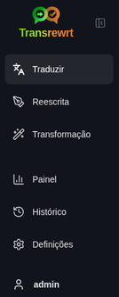
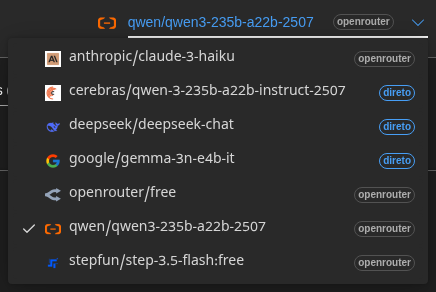
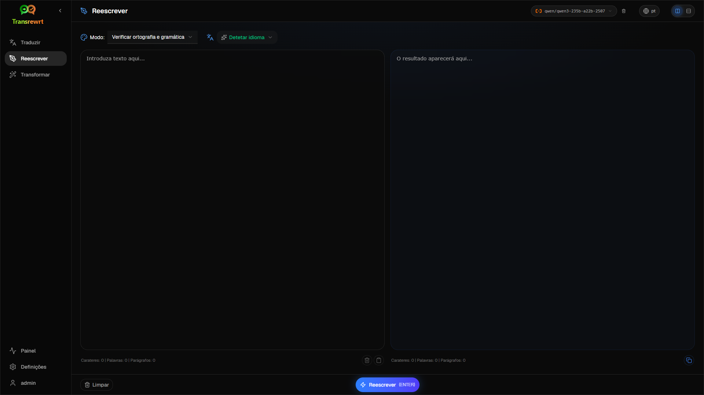
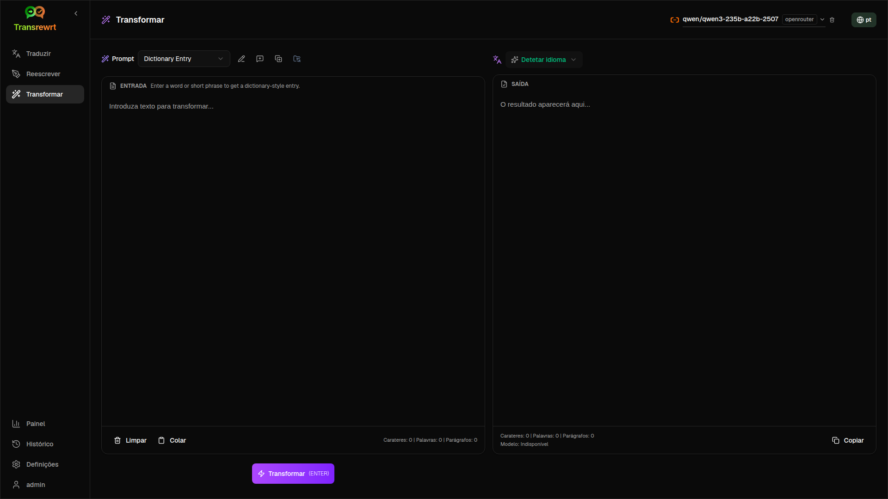
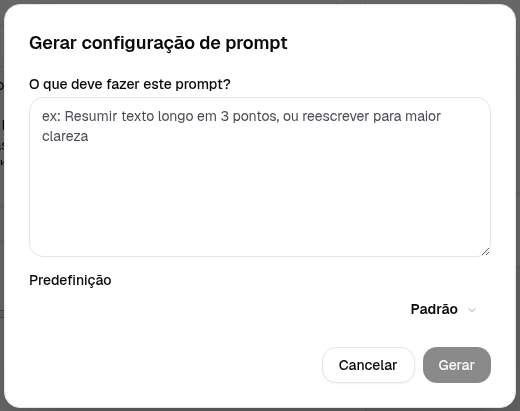
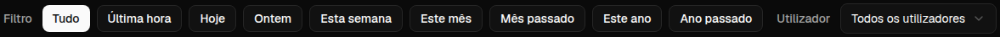

<a id="transrewrt-user-guide"></a>
# Guia do Utilizador

<br/>

<a id="introduction"></a>
## Introdução

O Transrewrt ajuda-o a trabalhar com texto de três formas principais:

- **Traduzir** - converter texto de um idioma para outro.
- **Reescrever** - reformular texto em um estilo diferente, como mais claro, mais curto ou mais formal.
- **Transformar** - processar texto usando instruções personalizadas de IA chamadas de prompts.

Por padrão, o aplicativo executa no modo **Fácil**: você escolhe uma **habilidade** (por exemplo, Grátis, Rápido ou Técnico) e um **fornecedor** em Definições, sem precisar escolher IDs de modelos. Mude para **Avançado** em [**Definições** > **Configurações Gerais**](#general-settings) se desejar a lista clássica de modelos em [**Definições** > **Modelos**](#models).

<br/>

Este guia explica como utilizar a aplicação depois de instalada e em execução. Para os passos de instalação, consulte o ficheiro [**README**](README.pt.md) principal.

<br/>

> ℹ️ **NOTA**<br/>
> O Transrewrt está disponível como aplicação de ambiente de trabalho para Windows e Linux, e como aplicação web auto-hospedada. Este guia centra-se na utilização diária da aplicação. Sempre que algo se aplica apenas a uma versão, isso é claramente indicado.

<small>**Leia em outros idiomas:** </small>
<small id="lang-list">[English (GB)](../USER-GUIDE.md) · [Português (Brasil)](./USER-GUIDE.pt-BR.md) · [العربية](./USER-GUIDE.ar.md) · [বাংলা](./USER-GUIDE.bn.md) · [Català](./USER-GUIDE.ca.md) · [中文 (中国大陆)](./USER-GUIDE.zh-CN.md) · [中文 (台灣)](./USER-GUIDE.zh-TW.md) · [Hrvatski](./USER-GUIDE.hr.md) · [Čeština](./USER-GUIDE.cs.md) · [Nederlands](./USER-GUIDE.nl.md) · [English (US)](./USER-GUIDE.en-US.md) · [Tagalog](./USER-GUIDE.tl.md) · [Français](./USER-GUIDE.fr.md) · [Deutsch](./USER-GUIDE.de.md) · [Ελληνικά](./USER-GUIDE.el.md) · [हिन्दी](./USER-GUIDE.hi.md) · [Magyar](./USER-GUIDE.hu.md) · [Italiano](./USER-GUIDE.it.md) · [日本語](./USER-GUIDE.ja.md) · [한국어](./USER-GUIDE.ko.md) · [Bahasa Melayu](./USER-GUIDE.ms.md) · [فارسی](./USER-GUIDE.fa.md) · [Polski](./USER-GUIDE.pl.md) · [Basa Jawa](./USER-GUIDE.jv.md) · [Português](./USER-GUIDE.pt.md) · [ਪੰਜਾਬੀ](./USER-GUIDE.pa.md) · [Română](./USER-GUIDE.ro.md) · [Русский](./USER-GUIDE.ru.md) · [Slovenčina](./USER-GUIDE.sk.md) · [Español](./USER-GUIDE.es.md) · [Kiswahili](./USER-GUIDE.sw.md) · [Svenska](./USER-GUIDE.sv.md) · [తెలుగు](./USER-GUIDE.te.md) · [ไทย](./USER-GUIDE.th.md) · [Türkçe](./USER-GUIDE.tr.md) · [Українська](./USER-GUIDE.uk.md) · [Tiếng Việt](./USER-GUIDE.vi.md)</small>

<small>

> **Observação sobre traduções da interface e documentação:** Todos os idiomas da interface, exceto o inglês (UK) original, 
> foram traduzidos usando modelos de IA; a redação pode ser imprecisa ou conter erros.

</small>

<br/>

<!-- START doctoc generated TOC please keep comment here to allow auto update -->
<!-- DON'T EDIT THIS SECTION, INSTEAD RE-RUN doctoc TO UPDATE -->
**Índice**

- [Antes de começar](#before-you-start)
  - [Como obter uma chave API gratuita da OpenRouter (aplicação de ambiente de trabalho)](#how-to-get-a-free-openrouter-api-key-desktop-app)
- [Primeiros passos](#getting-started)
- [Partes principais da janela](#main-parts-of-the-window)
  - [Barra lateral](#sidebar)
  - [Barra de ferramentas](#toolbar)
  - [Painéis de entrada e saída](#input-and-output-panels)
- [Traduzir](#translate)
  - [Traduzir texto](#translate-text)
  - [Seleção de idioma](#language-selection)
  - [Definições úteis de tradução](#helpful-translation-settings)
- [Reescrever](#rewrite)
- [Transformar](#transform)
  - [Executar um prompt existente](#run-an-existing-prompt)
  - [Se ainda não tiver prompts](#if-you-have-no-prompts-yet)
  - [Criar um prompt rapidamente](#create-a-prompt-quickly)
  - [Editar um prompt](#edit-a-prompt)
  - [Testar um prompt antes de o usar](#test-a-prompt-before-using-it)
- [Painel](#dashboard)
  - [Filtrar os dados](#filter-the-data)
  - [Separadores do painel](#dashboard-tabs)
  - [Exportar dados](#export-data)
  - [Eliminar registos armazenados para um modelo](#delete-stored-records-for-a-model)
- [Histórico](#history)
  - [Filtrar o histórico](#filter-the-history)
  - [Exportar dados do histórico](#export-history-data)
- [Definições](#settings)
  - [Configurações gerais](#general-settings)
  - [Modelos](#models)
  - [Idiomas](#languages)
  - [Rastreamento de Custo](#cost-tracking)
  - [Transformar (aba de definições)](#transform-settings)
  - [Utilizadores](#users)
  - [Configuração da API](#api-config)
  - [Sobre](#about)
- [Problemas comuns](#common-issues)
  - [A aplicação não traduz, reescreve ou transforma texto](#the-app-will-not-translate-rewrite-or-transform-text)
  - [A lista de modelos está vazia](#the-model-list-is-empty)
  - [O resultado é demasiado lento ou caro](#the-result-is-too-slow-or-too-expensive)
  - [A interface está num idioma errado](#the-interface-is-in-the-wrong-language)
  - [O texto é muito pequeno ou difícil de ler](#the-text-is-too-small-or-hard-to-read)
  - [O Resumo do Painel parece vazio](#dashboard-summary-looks-empty)
  - [O custo mostra "não disponível" ou parece incorreto](#cost-shows-not-available-or-seems-wrong)
  - [O custo total não corresponde à minha fatura do fornecedor](#total-cost-does-not-match-my-provider-bill)
  - [A página Histórico está em falta na barra lateral](#the-history-page-is-missing-from-the-sidebar)
  - [Aplicação web: redirecionado inesperadamente para a página de início de sessão](#web-app-redirected-to-the-login-page-unexpectedly)
  - [Administrador web: esqueceu-se ou perdeu a palavra-passe](#web-admin-forgot-or-lost-a-password)
  - [O painel não mostra dados de outros utilizadores (web)](#dashboard-shows-no-data-for-other-users-web)
  - [Alterei um prompt e perdi as edições](#i-changed-a-prompt-and-lost-the-edits)
- [Dicas rápidas](#quick-tips)
- [Aviso legal](#disclaimer)
- [Licença](#license)

<!-- END doctoc generated TOC please keep comment here to allow auto update -->

<br/><br/>

<a id="before-you-start"></a>
## Antes de começar

Para usar o Transrewrt, você precisa ter acesso a pelo menos um fornecedor de IA. Os fornecedores suportados são: [OpenRouter](https://openrouter.ai) (que agrega muitos modelos), OpenAI, Anthropic, Google Gemini, DeepSeek, Groq, Mistral, xAI, Cerebras e [Ollama](https://ollama.com) para modelos locais.

Você não precisa selecionar um modelo pago para começar. Assim que adicionar sua chave de API do OpenRouter, o aplicativo ativa automaticamente uma opção **grátis** integrada do OpenRouter. Isso permite que você comece a traduzir, reescrever e transformar texto imediatamente. Alternativamente, você também pode obter uma chave de API grátis da Cerebras, Google, Groq ou Mistral AI.

Em termos simples:

- No modo **Fácil**, uma **habilidade** é um conjunto pré-definido (Grátis, Rápido, Avançado, Técnico, Jurídico) que corresponde a um modelo do **fornecedor** escolhido (OpenRouter, OpenAI, Ollama e outros). Você seleciona a habilidade na barra de ferramentas em Traduzir, Reescrever e Transformar.
- No modo **Avançado**, um **modelo** é o mecanismo de IA que você escolhe diretamente. Os IDs dos modelos usam um **prefixo do fornecedor** (por exemplo `openrouter/…`, `openai/…`, `ollama/…`).
- Uma **chave de API** (ou, para Ollama, uma **URL base**) é como o aplicativo se conecta ao fornecedor.

Se estiver usando o **aplicativo desktop**, adicione chaves em [**Definições** > **Configuração da API**](#api-config) para cada fornecedor que usar. Para uso exclusivo do OpenRouter, veja [Como obter uma chave de API OpenRouter gratuita](#how-to-get-an-api-key-desktop-app) abaixo. Se não quiser usar uma chave de API, pode instalar o Ollama (em [ollama.com](https://ollama.com)) e usar modelos locais, como `translategemma:4b`.

Se estiver usando a **versão web**, o proprietário do servidor configura os fornecedores com variáveis de ambiente, portanto você não pode inserir chaves de API diretamente no aplicativo.

<br/>

<a id="how-to-get-an-api-key-desktop-app"></a>
### Como obter uma chave de API gratuita do OpenRouter (aplicativo desktop)

Se estiver usando o aplicativo desktop, siga estes passos:

1. Acesse [OpenRouter](https://openrouter.ai) no seu navegador.
2. Crie uma conta ou faça login.
3. Abra a página [Keys](https://openrouter.ai/keys).
4. Clique no botão para criar uma nova chave de API.
5. Dê um nome à chave para poder reconhecê-la posteriormente.
6. Copie a nova chave de API.
7. Volte ao Transrewrt e abra **Definições** > **Configuração da API**.
8. Cole a chave em **Chave de API do OpenRouter** (em **Definições** > **Configuração da API**).
9. Clique em **Testar chave do OpenRouter** para verificar se está funcionando.

<br/><br/>

<a id="getting-started"></a>
## Primeiros passos

Se esta é a sua primeira vez usando o Transrewrt, siga esta ordem:

1. Abra o aplicativo.
2. Escolha seu **Idioma da interface** no ícone do globo, se necessário.
3. Se estiver no **aplicativo desktop**, abra [**Definições** > **Configuração da API**](#api-config), adicione uma chave de API para pelo menos um fornecedor (por exemplo, OpenRouter) e clique em **Testar** para verificar se está funcionando.
4. Abra [**Definições** > **Configurações Gerais**](#general-settings). No modo **Fácil** (padrão), escolha um **Fornecedor** que tenha uma chave configurada. No modo **Avançado**, abra [**Definições** > **Modelos**](#models) e adicione um ou mais modelos a **Modelos Selecionados**.
5. Em **Traduzir**, escolha uma **habilidade** (Fácil) ou **modelo** (Avançado) na barra de ferramentas.
6. Abra [**Definições** > **Idiomas**](#languages) e escolha seus **Idiomas principais**, se quiser que os idiomas mais usados apareçam primeiro.
7. Execute uma tradução simples para confirmar que tudo está funcionando, depois experimente **Reescrever** e **Transformar**.

Essa ordem é importante. Ela evita o problema mais comum no primeiro uso: tentar executar uma tarefa antes que o aplicativo tenha uma conexão de API funcionando ou uma habilidade/modelo selecionado.

<br/><br/>

<a id="main-parts-of-the-window"></a>
## Partes principais da janela

O aplicativo é dividido em três áreas principais:

- A **barra lateral** à esquerda.
- A **barra de ferramentas** na parte superior.
- A **área de trabalho** no centro.

<br/>

<a id="sidebar"></a>
### Barra lateral

Utilize a barra lateral para navegar na aplicação. Pode recolher a barra lateral para ganhar mais espaço, clicando no ícone ao lado do logótipo da aplicação.

<br/>

<table>
  <tr>
    <td valign="top">
       
    </td>
    <td valign="top">
      <br/><br/>
      <ul>
        <li><strong>Traduzir</strong> abre a área de trabalho de tradução.</li><br/>
        <li><strong>Reescrever</strong> abre a área de trabalho de reescrita.</li><br/>
        <li><strong>Transformar</strong> abre a área de trabalho de prompt personalizado.</li><br/>
        <li><strong>Painel</strong> mostra informações de utilização e custo.</li><br/>
        <li><strong>Definições</strong> abre o painel de definições.</li><br/>
        <li><strong>Histórico</strong> mostra o histórico de utilização com o texto de entrada e saída</li><br/>
        <li><strong>Utilizador</strong> mostra o nome de utilizador da conta com sessão iniciada (apenas na web).</li>
      </ul>
    </td>
  </tr>
</table>

<br/>

<a id="toolbar"></a>
### Barra de ferramentas

A barra de ferramentas altera ligeiramente consoante a localização na aplicação.

- À esquerda, mostra o nome da página atual.
- À direita, mostra o **seletor de habilidade ou modelo** e o controle do **Idioma da interface**.

No modo **Fácil**, a barra de ferramentas mostra um **seletor de habilidade** (Grátis, Rápido, Avançado, Técnico, Jurídico e outros conjuntos semelhantes). As habilidades dependem do **Fornecedor** escolhido em [**Definições** > **Configurações Gerais**](#general-settings). Se o **Fornecedor** for **Ollama**, a barra de ferramentas listará seus modelos locais instalados em vez de habilidades.

No modo **Avançado**, o **seletor de modelo** permite escolher qual mecanismo de IA usar para a tarefa atual.



No modo Avançado, alguns modelos gratuitos podem não estar sempre disponíveis — podem estar offline ou atingir um limite de uso. O aplicativo pode remover automaticamente esse modelo da sua lista. Para controlar quais modelos aparecem, vá para [**Definições** > **Modelos**](#models). Você pode abrir as configurações do modelo a partir do ícone do fornecedor à esquerda do nome do modelo na barra de ferramentas.

<br/>

O **ícone de globo + código de idioma** altera o idioma da interface da aplicação, como menus e botões. **Não** altera os idiomas de tradução utilizados na funcionalidade **Traduzir**.


<br/>

<a id="input-and-output-panels"></a>
### Painéis de entrada e saída

A maioria das áreas de trabalho utiliza um painel de **Entrada** à esquerda e um painel de **Saída** à direita.

Cada painel também mostra:

| **Entrada**                                                          | **Saída**                                                                                                                  |
|--------------------------------------------------------------------|-----------------------------------------------------------------------------------------------------------------------------|
| - Contagem de caracteres <br/>- Contagem de palavras <br/>- Contagem de parágrafos   <br/> | - Tempo que a tarefa demorou<br/>- **TPS** (tokens por segundo)<br/>- Contagens de caracteres, palavras e parágrafos<br/>- O modelo utilizado |

Se tiver dúvidas sobre os termos técnicos:

- **Token** significa um pequeno fragmento de texto. Pode pensar nele como parte de uma palavra ou uma palavra curta.
- **TPS** significa quantos desses fragmentos de texto o modelo processou por segundo.

<br/>

Também pode monitorizar o custo de cada operação (se disponível) e o custo total, ativando a opção `Show cost information on the actions` em [**Definições** > **Configurações Gerais**](#general-settings).

<br/><br/>

[--------------------------------------------------------------------------------------------------------------------------]: #

<a id="translate"></a>
## Traduzir

Utilize **Traduzir** quando quiser converter texto de um idioma para outro.


<br/>

<a id="translate-text"></a>
### Traduzir texto

1. Abra **Traduzir**.
2. Escolha um idioma em **De**.
3. Escolha um idioma em **Para**.
4. Escolha uma habilidade (Fácil) ou modelo (Avançado) na barra de ferramentas.
5. Escreva ou cole o texto na **Entrada**.
6. Clique em **Traduzir**.
7. Leia o resultado na **Saída**.
8. Use o botão de copiar se quiser copiar o resultado.

<br/>

<a id="language-selection"></a>
### Seleção de idioma

- **De** pode ser um idioma específico ou **Detetar idioma**.
- **Para** é o idioma que deseja para o resultado.

Os seus **Idiomas principais** selecionados aparecem no topo da lista. Pode definir estes em [**Definições** > **Idiomas**](#languages).

<br/>

<a id="helpful-translation-settings"></a>
### Definições úteis de tradução

Em [**Definições** > **Configurações Gerais**](#general-settings), pode alterar o comportamento da tradução:

- **Tradução automática ao colar** executa uma tradução assim que cola o texto.
- **Copiar automaticamente o resultado para a área de transferência** copia o resultado automaticamente após uma execução bem-sucedida.
- **Tradução em tempo real (enquanto escreve)** executa traduções enquanto escreve.
- **Tempo limite (ms)** controla quanto tempo a aplicação espera antes de executar uma tradução em tempo real.
- **Enter** controla o que acontece quando pressiona `Enter`:

<br/><br/>

[--------------------------------------------------------------------------------------------------------------------------]: #

<a id="rewrite"></a>
## Reescrever

Use **Reescrever** quando quiser melhorar a redação sem alterar o significado principal.



Isto é útil para:

- corrigir ortografia e gramática (**Verificar ortografia e gramática**)
- tornar o texto mais claro (**Melhorar Clareza**)
- obter várias reformulações distintas numa única execução (**Versões alternativas**)
- tornar o texto mais formal ou menos formal (**Formal** / **Informal**)
- encurtar ou expandir o texto (**Encurtar** / **Expandir**)
- tornar o texto mais técnico (**Tornar Técnico**)

<br/>

> 💡 **DICA**<br/>
> Quando utiliza o modo "**Verificar ortografia e gramática**", aparece um interruptor **Mostrar alterações** no painel de saída (ao lado de **Copiar**).
> Ative ou desative para mostrar ou ocultar as correções específicas aplicadas ao seu texto.

<br/><br/>

[--------------------------------------------------------------------------------------------------------------------------]: #

<a id="transform"></a>
## Transformar

Use **Transformar** quando quiser que a IA siga um conjunto personalizado de instruções.



Esta é a área mais flexível da aplicação. Pode utilizá-la para tarefas como:

- resumir notas
- transformar texto bruto numa mensagem de correio eletrónico polida
- extrair pontos principais
- converter texto num formato específico
- qualquer outra atividade personalizada com o texto de entrada

<br/>

<a id="run-an-existing-prompt"></a>
### Executar um prompt existente

1. Abra **Transformar**.
2. Escolha um prompt da lista de prompts.
3. Se aparecer uma caixa de idioma **Destino**, escolha um idioma, se desejar.
4. Digite ou cole texto em **Entrada**.
5. Clique em **Transformar**.
6. Leia o resultado em **Saída**.

<br/>

<a id="if-you-have-no-prompts-yet"></a>
### Se ainda não tiver prompts

Se sua lista de prompts estiver vazia, clique em **Carregar prompts de exemplo** no espaço de trabalho Transformar. O mesmo controle está sempre disponível em [**Definições** > **Transformar**](#transform-settings) na linha de exportação/importação. Ambos adicionam exemplos integrados para que você possa começar rapidamente.

<br/>

> ℹ️ **NOTA**<br/>
> Os prompts de exemplo são fornecidos em inglês. Após carregá-los, pode editar um prompt e usar **Traduzir prompt** para o traduzir para o seu idioma.

<br/>

<a id="create-a-prompt-quickly"></a>
### Criar um prompt rapidamente

A forma mais rápida de criar um prompt é:

1. Clique em **Novo prompt**.
2. Clique em **Gerar prompt**.
3. Descreva o que deseja que o prompt faça.
4. Escolha um modelo.
5. Deixe a aplicação criar um rascunho para si.
6. Revise o rascunho e clique em **Salvar**.



<br/>

<a id="edit-a-prompt"></a>
### Editar um prompt

Quando criar ou editar um prompt, o editor aparece à esquerda e uma área de teste aparece à direita.


Os campos principais são:

- **Nome do prompt**: o nome exibido na lista de prompts.
- **Instruções do prompt (opcional)**: uma dica curta exibida ao utilizador ao executar o prompt.
- **Função do modelo**: a função geral atribuída à IA, como 'Você é um assistente útil.'
- **Instruções do modelo (uma por linha)**: as regras específicas que deseja que a IA siga.
- **Descrição da saída**: uma palavra curta que descreve o resultado, como 'resumo' ou 'reescrever'.
- **Temperatura (0,0 → 1,0)**: como o modelo se comportará; veja abaixo.
- **Pedir idioma de destino**: adiciona um seletor de idioma de destino ao executar o prompt.

Se o termo técnico **Temperatura** for novo para si, pense da seguinte forma:

- Uma temperatura **mais baixa** produz resultados mais estáveis e previsíveis.
- Uma temperatura **mais alta** produz mais variedade e criatividade.

Você também pode usar:

- `Generate prompt` para criar um novo rascunho a partir de uma descrição simples
- `Improve prompt` para aperfeiçoar um prompt existente
- `Translate prompt` para traduzir os campos do prompt

<br/>

> ⚠️ **AVISO**<br/>
> Clique em `Save` antes de clicar em `Back to Run`. Se voltar sem salvar, as alterações serão perdidas.

<br/>

<a id="test-a-prompt-before-using-it"></a>
### Testar um prompt antes de usá-lo

O painel de teste à direita permite experimentar o seu prompt com texto de exemplo antes de o utilizar no trabalho diário.

Isto é útil quando:

- está a criar um novo prompt
- está a comparar duas versões de um prompt
- pretende verificar o tom, comprimento ou formato da saída

<br/>

> ℹ️ **NOTA**<br/>
> Você pode exportar e importar prompts salvos em [**Definições** > **Transformar**](#transform-settings).

Quando utiliza **Gerar prompt**, **Melhorar prompt** ou **Traduzir prompt** no editor de prompts, o modo **Fácil** oferece o mesmo seletor de habilidades que Traduzir e Reescrever; o modo **Avançado** utiliza a lista de modelos.

<br/><br/>

[--------------------------------------------------------------------------------------------------------------------------]: #

<a id="dashboard"></a>
## Painel

Utilize **Painel** para ver o quanto está a utilizar a aplicação e qual o custo (para modelos pagos).


<br/>

> ℹ️ **NOTA**<br/>
> Se utilizar apenas modelos **grátis**, os valores de **custo** podem ser zero e os KPIs centrados no custo podem parecer vazios. O separador **Resumo** ainda mostra a contagem de chamadas para traduzir, reescrever e transformar quando houver atividade no período selecionado.

<br/>

<a id="filter-the-data"></a>
### Filtrar os dados

Utilize os botões de filtro no topo para alterar o intervalo de tempo.



<br/>

> ℹ️ **NOTA**<br/>
> O filtro **Utilizador** só é visível para administradores na versão web. Utilizadores regulares não verão este filtro, e este não está disponível na aplicação de desktop.

<br/>

<a id="dashboard-tabs"></a>
### Separadores do Painel

- **Resumo** mostra cartões de KPI: custo total, modelos utilizados, contagem e custo de chamadas por modo (com percentagem do total de chamadas), custo médio por chamada, TPS médio e os três principais modelos por número de chamadas.
- **Por Modelo** lista cada modelo com chamadas totais, custo total e TPS médio; expanda uma linha para obter uma análise detalhada por traduzir, reescrever e transformar.
- **Todas as chamadas** mostra o registo completo de chamadas (paginado em ecrãs largos, em cartões em ecrãs estreitos) e permite exportá-lo.

<br/>

<a id="export-data"></a>
### Exportar dados

As tabelas do painel podem exportar dados em:

- **JSON**
- **CSV**
- **XLSX**

Isto é útil se desejar rever a atividade fora da aplicação ou partilhar um relatório.

<br/>

<a id="delete-stored-records-for-a-model"></a>
### Eliminar registos armazenados de um modelo

Em **Por Modelo** ou **Todas as chamadas**, pode remover registos armazenados de um modelo clicando no ícone do "caixote do lixo".

> ⚠️ **AVISO**<br/>
> A eliminação de registos armazenados não pode ser desfeita. Utilize apenas se tiver a certeza de que já não precisa desse histórico.

Para eliminar todos os dados ou remover registos com base na sua idade, aceda a [**Definições** > **Rastreamento de Custo**](#cost-tracking). Lá encontrará opções para eliminar todos os dados armazenados ou apenas dados mais antigos do que uma determinada data.

<br/><br/>

[--------------------------------------------------------------------------------------------------------------------------]: #

<a id="history"></a>
## Histórico

Clique em **Histórico** para ver o histórico das suas ações dentro do **Transrewrt**, incluindo a entrada e saída de cada operação.


<br/>

<a id="filter-the-history"></a>
### Filtrar o histórico

**Histórico** utiliza os mesmos filtros de intervalo de tempo da página **Painel**.


<br/>

> ℹ️ **NOTA**<br/>
> Na **aplicação web**, todos (incluindo administradores) veem apenas o seu próprio histórico de execução. O filtro **Utilizador** no **Painel** serve para administradores analisarem o uso e custos entre contas; não se aplica ao **Histórico**.

<br/>

<a id="export-history-data"></a>
### Exportar dados do histórico

A página de histórico pode exportar os dados filtrados nos seguintes formatos:

- **JSON**
- **CSV**
- **XLSX**

Isto é útil se desejar rever a atividade fora da aplicação ou partilhar um relatório.

<br/><br/>

[--------------------------------------------------------------------------------------------------------------------------]: #

<a id="settings"></a>
## Definições

Abra **Definições** na barra lateral para personalizar o comportamento da aplicação.

Os separadores disponíveis dependem da plataforma e da sua função:

| Separador        | Ambiente de trabalho | Web (administrador) | Web (utilizador normal) | Notas                                        |
  |------------------|:-------:|:-----------:|:------------------:|----------------------------------------------|
  | Configurações Gerais |   sim   |     sim     |        sim         | Inclui **Experiência com IA** (Fácil / Avançado) |
  | Modelos           |   sim   |     sim     |        sim         | Apenas quando a **Experiência com IA** for **Avançado** |
  | Idiomas        |   sim   |     sim     |        sim         |                                              |
  | Rastreamento de Custo    |   sim   |     sim     |         -          |                                              |
  | Transformar        |   sim   |     sim     |        sim         | Importação/exportação em massa de prompts de transformação      |
  | Utilizadores            |    -    |     sim     |         -          |                                              |
  | Configuração da API       |   sim   |     sim     |         -          |                                              |
  | Sobre            |   sim   |     sim     |        sim         |                                              |

No modo **Fácil**, a seleção de modelos ocorre através das habilidades na barra de ferramentas e do **Fornecedor** em Configurações Gerais; o separador **Modelos** fica oculto.

<br/>

> ℹ️ **NOTA**<br/>
> Na versão web, cada utilizador tem a sua própria configuração. Definições como experiência com IA, fornecedor, modelos ou habilidades selecionados, idiomas, opções gerais e prompts de transformação são armazenadas por utilizador. As alterações que efetuar não afetam outros utilizadores.

<br/>

[--------------------------------------------------------------------------------------------------------------------------]: #

<a id="general-settings"></a>
### Configurações Gerais

Utilize **Configurações Gerais** para controlar o comportamento de digitação, se os detalhes de execução são armazenados no **Histórico**, aparência e como escolhe a IA para Traduzir, Reescrever e Transformar.

**Experiência com IA**

- **Fácil** (padrão): escolha um **Fornecedor** (OpenRouter, OpenAI, Anthropic, Google Gemini, DeepSeek, Groq, Mistral, xAI, Cerebras ou Ollama). Os fornecedores em nuvem utilizam os predefinidos de habilidades integrados na barra de ferramentas. O **Ollama** lista os modelos instalados na sua máquina em vez de habilidades.
- **Avançado**: escolha modelos individuais na barra de ferramentas; gere a lista em [**Definições** > **Modelos**](#models).

Na **aplicação web**, os fornecedores disponíveis dependem das chaves API definidas no ambiente do servidor. Na **aplicação para ambiente de trabalho**, configure as chaves em [**Configuração da API**](#api-config).

**Comportamento**

- **Comportamento para ENTER** escolhe se `Enter` executa a tarefa ou insere uma nova linha.
- **Tradução automática ao colar** inicia a tradução assim que colar texto.
- **Copiar automaticamente o resultado para a área de transferência** copia automaticamente os resultados bem-sucedidos.
- **Tradução em tempo real (enquanto escreve)** traduz enquanto escreve.
- **Tempo limite (ms)** define o tempo de espera para a tradução em tempo real.

**Histórico**

- **Manter histórico de execução** controla se cada operação de tradução, reescrita e transformação armazena o **texto de entrada e saída** para a visualização do painel lateral [**Histórico**](#history). Desativar esta opção solicita confirmação; se confirmar, o texto armazenado será removido da base de dados. Se a etiqueta mostrar *desativado pelo administrador*, a sua instalação tem `HISTORY_DISABLED` definido no ambiente (veja o [README](README.pt.md#configuration-and-environment)); não poderá reativar o histórico a partir da interface.
- **Eliminar dados do histórico** permite remover texto armazenado por idade (por exemplo, mais antigo que alguns meses, ou **todos os dados (limpar)**) usando **Eliminar dados**. Isto afeta apenas o texto de execução guardado para a visualização **Histórico**; **não** elimina os totais de custo ou utilização. Para remover ou reduzir dados de **custo**, utilize [**Definições** > **Rastreamento de Custo**](#cost-tracking).

**Aparência**

- **Mostrar informações de custo nas ações** controla a exibição do custo por operação (se disponível) e do custo total nos painéis de saída de Traduzir, Reescrever e Transformar.
- **Dígitos fracionários do custo** altera a forma como os decimais do custo são exibidos.
- **Apenas web:** **mostrar uma margem à volta da aplicação** adiciona espaço extra à volta da interface.
- **Família de fontes** altera a fonte de escrita nos painéis de texto.
- **Tamanho** altera o tamanho da fonte.

**Cópia de Segurança da Configuração**

- **Incluir dados de uso na cópia de segurança** - quando ativado, o ZIP também contém histórico de execução e dados de chamadas à API.
- **Fazer cópia de segurança da configuração** - cria um único ZIP (`transrewrt-config-backup-YYYY-MM-DD_HHMMSS.zip` em UTC por defeito) com `config.json`, `state.json`, chave de encriptação opcional, utilizadores, preferências, prompts personalizados e dados de uso se tiver optado por isso. Após uma cópia de segurança bem-sucedida, a confirmação mostra o nome do ficheiro guardado.
- **Restaurar a partir da cópia de segurança** - abre primeiro uma **janela de confirmação**. Escolha o ficheiro ZIP da cópia de segurança na janela (**Procurar** / seletor de ficheiros ou arrastar e largar, onde suportado), depois reveja as opções:
  - **Restaurar os dados de uso** - importa o uso/histórico do ZIP quando foi feita a cópia de segurança com os dados de uso incluídos; desative se quiser apenas as definições e prompts.
  - **Limpar os dados antigos de uso antes de restaurar** - remove o uso/histórico existente nesta instalação antes de aplicar a cópia de segurança (opcional; use quando quiser uma substituição limpa).

As cópias de segurança criadas na versão web ou desktop podem ser restauradas na outra versão. Ao restaurar uma cópia de segurança do desktop na versão web, os dados serão restaurados para o utilizador administrador.

<br/>

<a id="models"></a>
### Modelos

Este separador está disponível apenas quando a **experiência com IA** está definida como **Avançado** em [**Configurações Gerais**](#general-settings). Use **Definições** > **Modelos** para escolher quais os modelos que aparecem na barra de ferramentas.


A página tem duas listas:

- **Modelos Disponíveis** à esquerda
- **Modelos Selecionados** à direita

Controlos úteis incluem:

- **Pesquisar modelos...** para encontrar um modelo pelo nome
- **Fornecedor** para reduzir a lista a um motor (OpenRouter, OpenAI, Ollama, …)
- **Apenas Gratuitos** para mostrar apenas modelos gratuitos
- **Atualizar** para recarregar a lista
- **Expandir Tudo** e **Recolher Tudo** quando estiver a ordenar por fornecedor

Os IDs dos modelos incluem o prefixo do fornecedor (por exemplo `openrouter/…` vs `openai/…`). Emblemas como **OpenAI (OpenRouter)** vs **OpenAI (direto)** mostram como o tráfego é encaminhado.

> ℹ️ **NOTA**<br/>
> **OpenRouter Body Builder** (`openrouter/bodybuilder`) é um modelo de encaminhamento, não um modelo de chat geral: a sua resposta é JSON que descreve corpos de pedidos da API OpenRouter (por exemplo, um array `requests` com `model` e `messages`). Se o utilizar para **Traduzir**, **Reescrever** ou **Transformar**, o painel de saída mostrará esse JSON em vez do texto finalizado. Escolha um modelo de texto normal para essas tarefas. Veja a [página do modelo Body Builder](https://openrouter.ai/openrouter/bodybuilder) na OpenRouter.

Ações:

- Para adicionar um modelo, clique em **Adicionar** ou em qualquer lugar da entrada.

- Para remover um modelo, clique em **X** ao lado dele em **Modelos Selecionados** ou em **Selecionado** na entrada em Modelos Disponíveis.

- Para limpar a lista, clique em **Desmarcar Todos**. O modelo gratuito obrigatório permanecerá na lista.

<br/>

> ℹ️ **NOTA**<br/>
> Se não quiser adicionar créditos à OpenRouter imediatamente, comece por ativar **Apenas Gratuitos** e escolher os modelos gratuitos (sem necessidade de cartão de crédito). Também pode usar o Ollama para executar modelos localmente sem qualquer chave de API.

<br/>

<a id="languages"></a>
### Idiomas

Utilize **Definições** > **Idiomas** para organizar as listas de idiomas usadas na aplicação.

- **Idiomas principais** são fixados perto do topo das listas de idiomas em **Traduzir** e **Transformar**.
- **Idioma Personalizado** permite-lhe adicionar um idioma que não está na lista integrada.

Se adicionar um idioma personalizado, este aparecerá nos seletores de idioma juntamente com as opções integradas.

<br/>

<a id="cost-tracking"></a>
### Rastreamento de custo

Utilize **Definições** > **Rastreamento de Custo** para gerir as informações de custo.

- **Custo total** mostra o total acumulado.
- **Copiar Valor** copia o total para a área de transferência.
- **Redefinir custo** redefine o total armazenado para zero.
- **Sincronizar com o uso da chave de API** define o total de acordo com o uso indicado pela sua conta OpenRouter (apenas OpenRouter).
- **Uso da Chave de API** mostra os detalhes de uso da OpenRouter, se disponíveis.
- **Eliminar dados de custo** remove todos os dados ou apenas as entradas com data anterior à selecionada.

**Rastreamento de custo:** Quando utiliza modelos OpenRouter, a aplicação mostra o seu uso real e despesas com base nas informações de custo da OpenRouter. Para todos os outros fornecedores, a aplicação estima os custos com base nos preços publicados pela OpenRouter; se um preço não estiver disponível, a estimativa poderá ser zero.

<br/>

> ℹ️ **NOTA**<br/>
> **Todos os valores são estimativas apenas para sua referência, não são faturas oficiais.**

<br/>

> ⚠️ **AVISO**<br/>
> A eliminação de dados não pode ser desfeita. Antes de eliminar, certifique-se de fazer backup dos seus dados ou exportá-los através de [**Histórico**](#history)
> ou [**Painel** > **Todas as chamadas**](#dashboard-tabs), caso contrário serão perdidos permanentemente.
> Todo o histórico de entrada/saída relacionado com cada entrada de chamada de API também será eliminado.

<br/>

<a id="transform-settings"></a>
### Transformar (separador de definições)

Use **Definições** > **Transformar** para gerir prompts em massa.

Pode:

- rever os seus prompts guardados
- eliminar prompts
- importar prompts a partir de um ficheiro
- exportar prompts para cópia de segurança ou partilha
- carregar prompts de exemplo para a lista de prompts

<br/>

<a id="users"></a>
### Utilizadores

Utilize **Utilizadores** para gerir contas de utilizador na versão web. Pode adicionar utilizadores, atualizar os seus detalhes, repor palavras-passe e eliminar contas.

<br/>

<a id="api-config"></a>
### Configuração da API

Os fornecedores suportados são: OpenRouter, OpenAI, Anthropic, Google Gemini, DeepSeek, Groq, Mistral, xAI, Cerebras e **Ollama** (modelos locais através de uma URL base). Só precisa de configurar os fornecedores que utilizar.

**Aplicação web: apenas administrador**

As chaves da API são configuradas através de variáveis de ambiente do sistema ou do Docker – não são introduzidas na interface web. Esta página mostra quais os fornecedores que têm uma chave configurada e permite testar cada um clicando no botão `Test`.

<br/>

> ℹ️ **NOTA**<br/>
> Para alterar uma chave de API, atualize a variável de ambiente na sua configuração do sistema ou do Docker e reinicie o servidor ou contentor.

<br/>

> ℹ️ **NOTA**<br/>
> As **cópias de segurança da configuração** (consulte [**Configurações Gerais** → Cópia de Segurança da Configuração](#general-settings)) podem incorporar chaves de fornecedor **resolvidas** dentro do `config.json` do ZIP. A restauração desse ZIP **não** copia essas chaves de volta para o ficheiro de configuração persistente do servidor – as chaves ativas continuam a vir do ambiente e do estado do ficheiro existente, conforme descrito ali.

<br/>

**Aplicação desktop**

Utilize **Configuração da API** para armazenar chaves de API para cada fornecedor que utilizar. Para o Ollama, introduza a **URL base** em vez de uma chave de API.

<br/>

> 💡 **Dica** <br/>
> Se não quiser utilizar uma chave de API nem pagar pelo uso, pode [descarregar o Ollama](https://ollama.com) e executar modelos (como `translategemma:4b`) localmente na sua máquina gratuitamente. Alternativamente, pode criar uma conta gratuita no OpenRouter (sem necessidade de cartão de crédito) para utilizar os seus modelos gratuitos, ou obter uma chave de API gratuita da Cerebras, Google, Groq ou Mistral AI.

<br/>

- Adicione apenas os fornecedores de que necessita. Em **Definições** > **Modelos**, cada ID de modelo começa com o fornecedor (por exemplo `openrouter/openrouter/free`, `openai/gpt-4o`, `ollama/llama3`).

Para adicionar uma chave de API, introduza o valor no campo de texto e clique em `Save`. Para substituir uma chave existente, clique em `Edit`. Para verificar se uma chave está a funcionar, clique em `Test`. Para a URL base do Ollama, clique sempre em `Test` para verificar a ligação.

<br/>

> ℹ️ **NOTA**<br/>
> Não pode ver o valor atual de uma chave de API. Só pode substituí-la utilizando o botão `Edit`.
> As chaves de API são armazenadas encriptadas na configuração.

<br/>

<a id="about"></a>
### Sobre

O separador **Sobre** mostra:

- o nome da aplicação
- o número da versão
- a data de compilação
- uma ligação ao repositório do projeto

<br/><br/>

<a id="common-issues"></a>
## Problemas comuns

Se algo não funcionar como esperado, verifique primeiro os seguintes pontos.

<br/>

<a id="the-app-will-not-translate-rewrite-or-transform-text"></a>
### A aplicação não traduz, reescreve ou transforma texto

Verifique que:

- selecionou uma **habilidade** (Fácil) ou um **modelo** (Avançado) na barra de ferramentas
- no modo **Fácil**, [**Definições** > **Configurações Gerais**](#general-settings) tem um **Fornecedor** com uma chave válida (ou URL do Ollama) e pelo menos uma habilidade para esse fornecedor
- no modo **Avançado**, pelo menos um modelo está listado em [**Definições** > **Modelos**](#models)
- a sua configuração da API está funcionando

Se estiver a usar a aplicação de ambiente de trabalho:

1. Abra [**Definições** > **Configuração da API**](#api-config).
2. Verifique se pelo menos uma chave API está guardada.
3. Clique em **Testar** junto ao fornecedor para confirmar que a chave está a funcionar.

<br/>

<a id="the-model-list-is-empty"></a>
### A lista de modelos está vazia

No modo **Fácil**, abra [**Definições** > **Configurações Gerais**](#general-settings), confirme que o **Fornecedor** está definido e adicione ou teste chaves em [**Configuração da API**](#api-config) (no ambiente de área de trabalho) ou peça ao seu administrador (na versão web). Para **Ollama**, execute **Testar** na URL base e certifique-se de que os modelos estão instalados localmente.

No modo **Avançado**, abra [**Definições** > **Modelos**](#models) e clique em **Atualizar**. Se necessário, procure um modelo, ative **Apenas Gratuitos** e adicione modelos aos **Modelos Selecionados**.

<br/>

<a id="the-result-is-too-slow-or-too-expensive"></a>
### O resultado é demasiado lento ou demasiado caro

Experimente uma ou mais das seguintes opções:

- escolha um modelo diferente
- use uma entrada mais curta
- desative **Tradução em tempo real (enquanto escreve)** em [**Definições** > **Configurações Gerais**](#general-settings)
- use modelos gratuitos para tarefas simples (consulte [Modelos](#models))

<br/>

<a id="the-interface-is-in-the-wrong-language"></a>
### A interface está no idioma errado

Clique no ícone do globo na [barra de ferramentas](#toolbar) e escolha o seu **Idioma da interface** preferido.

<br/>

<a id="the-text-is-too-small-or-hard-to-read"></a>
### O texto é demasiado pequeno ou difícil de ler

Abra [**Definições** > **Configurações Gerais**](#general-settings) e altere:

- **Família de fontes**
- **Tamanho**

<br/>

<a id="dashboard-summary-looks-empty"></a>
### O Resumo do Painel parece vazio

Isto é normal se:

- está a usar apenas **modelos gratuitos** e está a visualizar dados de **custo** (podem ser zero); os KPIs de contagem de chamadas no **Resumo** ainda precisam de dados do período selecionado
- o **filtro de tempo** selecionado não abrange o período em que foram feitas chamadas — experimente **Tudo** para verificar

Se os KPIs continuarem a zero após selecionar **Tudo**, confirme se as chamadas aparecem em [**Histórico**](#history) ou no separador **Todas as chamadas**.

<br/>

<a id="cost-shows-not-available-or-seems-wrong"></a>
### O custo mostra "não disponível" ou parece incorreto

Quando utiliza modelos através do **OpenRouter**, a aplicação mostra o seu gasto real reportado pelo OpenRouter.

Para **outros fornecedores** (OpenAI direto, Anthropic direto, etc.), o custo é estimado a partir dos dados de preços publicados pelo OpenRouter. Se não for encontrado um preço correspondente para um modelo, o custo aparecerá como **não disponível** e não será adicionado ao seu total acumulado.

<br/>

<a id="total-cost-does-not-match-my-provider-bill"></a>
### O custo total não corresponde à fatura do meu fornecedor

Todos os valores de custo na aplicação são **estimativas apenas para referência**, não sendo faturas oficiais.

Para aproximar o total do seu gasto real no OpenRouter, abra [**Definições** > **Rastreamento de Custo**](#cost-tracking) e clique em **Sincronizar com o uso da chave de API**.

<br/>

<a id="the-history-page-is-missing-from-the-sidebar"></a>
### A página Histórico está em falta na barra lateral

**Manter histórico de execução** pode estar desativado. Abra [**Definições** > **Configurações Gerais**](#general-settings) e ative-o, a menos que o histórico esteja *desativado pelo administrador* (`HISTORY_DISABLED` definido no ambiente — veja o [README](README.pt.md#configuration-and-environment)). Ativar o histórico não restaura texto previamente eliminado.

<br/>

<a id="web-app-session-expired"></a>
### Aplicação web: redirecionado inesperadamente para a página de início de sessão

A sua sessão pode ter expirado. Inicie sessão novamente. Se isto acontecer com frequência, verifique a configuração do servidor relativamente aos tempos de vida da sessão.

<br/>

<a id="web-admin-forgot-or-lost-a-password"></a>
### Administração web: esqueceu ou perdeu a palavra-passe

Isto aplica-se à aplicação web **auto-hospedada** (Docker), não à aplicação desktop (Electron).

- Se outro administrador ainda conseguir iniciar sessão, pode abrir [**Definições** > **Utilizadores**](#users), escolher a conta e definir uma **nova palavra-passe** ali.
- Se estiver **bloqueado**, mas tiver **acesso shell** à máquina ou ao contentor, redefina a palavra-passe com a ferramenta fornecida com a imagem (substitua `transrewrt` se alterou o nome padrão, e coloque entre aspas a palavra-passe se contiver espaços ou caracteres especiais):

```bash
docker exec transrewrt reset-web-password '<username>' '<new-password>'
```

O nome de utilizador padrão do administrador é `admin` se nunca criou outras contas. Quando fornece apenas um argumento, este é tratado como a nova palavra-passe para `admin`.

Se estiver a executar a partir de um **checkout de código-fonte** em vez do Docker, utilize:

```bash
pnpm run reset-web-password -- <username> <new-password>
```

O script atualiza o registo do utilizador na base de dados SQLite (e pode criar o `admin` utilizador se estiver em falta). Após a reposição, inicie sessão com a nova palavra-passe.

<br/>

<a id="dashboard-shows-no-data-for-other-users"></a>
### O painel não mostra dados de outros utilizadores (web)

Apenas **administradores** podem ver dados de todos os utilizadores através do filtro **Utilizador**. Por conceção, os utilizadores regulares apenas veem a sua própria atividade.

<br/>

<a id="i-changed-a-prompt-and-lost-the-edits"></a>
### Alterei um prompt e perdi as edições

Ao editar um prompt, clique sempre em **Salvar** antes de clicar em **Voltar a Executar**.

<br/><br/>

<a id="quick-tips"></a>
## Dicas rápidas

- Comece com [**Traduzir**](#translate) para garantir que a sua configuração funciona antes de avançar para [**Reescrever**](#rewrite) ou [**Transformar**](#transform).
- Use [**Reescrever**](#rewrite) para melhorias diárias no texto.
- Use [**Transformar**](#transform) quando precisar de um fluxo de trabalho repetível para uma tarefa específica.
- Use [**Painel**](#dashboard) se quiser acompanhar o uso e o custo.
- Use [**Histórico**](#history) para rever operações anteriores e os respetivos textos completos de entrada/saída.
- Exporte os prompts regularmente se estiver a criar uma biblioteca de prompts que deseja manter segura (veja [Transformar](#transform)) ou se desejar partilhá-la com outros.
- Mantenha-se no modo **Fácil** até precisar de controle detalhado sobre IDs de modelos; mude para **Avançado** quando já souber exatamente quais os modelos que pretende.

<br/><br/>

<a id="disclaimer"></a>
## Aviso legal

Os nomes e ícones dos produtos pertencem aos respetivos proprietários e são utilizados apenas para fins de identificação. Este software não é afiliado nem endossado por nenhuma das marcas mencionadas.

<br/><br/>

<a id="license"></a>
## Licença

Direitos autorais © 2026 Waldemar Scudeller Jr.

[Apache License 2.0](../LICENSE)
