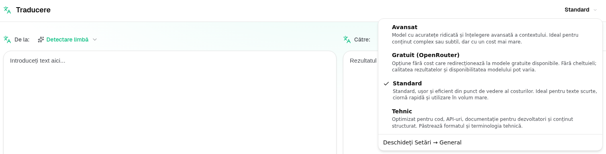
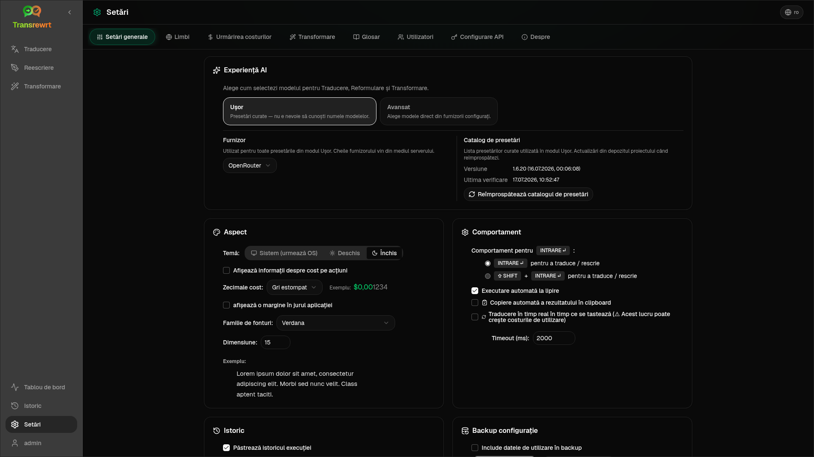

<a id="transrewrt-user-guide"></a>
# Ghid pentru utilizatori

<br/>

<a id="introduction"></a>
## Introducere

Transrewrt vă ajută să lucrați cu textul în trei moduri principale:

- **Traducere** - convertiți textul dintr-o limbă în alta.
- **Rescriere** - reformulați textul într-un alt stil, cum ar fi mai clar, mai scurt sau mai formal.
- **Transformare** - procesați textul utilizând instrucțiuni personalizate de inteligență artificială numite prompturi.

În mod implicit, aplicația rulează în modul **Ușor**: alegeți un **preset** (de exemplu Gratuit (OpenRouter), Standard, Avansat sau Tehnic) și un **furnizor** în Setări, fără a alege ID-uri de model. Comutați la **Avansat** în [**Setări** > **Setări generale**](#general-settings) dacă doriți lista clasică de modele din [**Setări** > **Modele**](#models).

<br/>

Acest ghid explică cum să utilizați aplicația după ce aceasta a fost instalată și este în funcțiune. Pentru pașii de instalare, consultați fișierul principal [**README**](README.ro.md).

<br/>

> ℹ️ **NOTĂ**<br/>
> Transrewrt este disponibil ca aplicație desktop pentru Windows și Linux și ca aplicație web auto-găzduită. Acest ghid se concentrează pe utilizarea zilnică a aplicației. Atunci când ceva se aplică doar unei singure versiuni, acest lucru este marcat clar.

<small>**Citește în alte limbi:** </small>
<small id="lang-list">[English (UK)](../USER-GUIDE.md) · [Português (Brasil)](./USER-GUIDE.pt-BR.md) · [العربية](./USER-GUIDE.ar.md) · [বাংলা](./USER-GUIDE.bn.md) · [Català](./USER-GUIDE.ca.md) · [简体中文](./USER-GUIDE.zh-Hans.md) · [繁體中文](./USER-GUIDE.zh-Hant.md) · [Hrvatski](./USER-GUIDE.hr.md) · [Čeština](./USER-GUIDE.cs.md) · [Nederlands](./USER-GUIDE.nl.md) · [English (US)](./USER-GUIDE.en-US.md) · [Tagalog](./USER-GUIDE.tl.md) · [Français](./USER-GUIDE.fr.md) · [Deutsch](./USER-GUIDE.de.md) · [Ελληνικά](./USER-GUIDE.el.md) · [Hindi (Roman)](./USER-GUIDE.hi-Latn.md) · [Magyar](./USER-GUIDE.hu.md) · [Italiano](./USER-GUIDE.it.md) · [日本語](./USER-GUIDE.ja.md) · [한국어](./USER-GUIDE.ko.md) · [Bahasa Melayu](./USER-GUIDE.ms.md) · [فارسی](./USER-GUIDE.fa.md) · [Polski](./USER-GUIDE.pl.md) · [Basa Jawa](./USER-GUIDE.jv.md) · [Português](./USER-GUIDE.pt.md) · [پنجابی](./USER-GUIDE.pa-PK.md) · [Română](./USER-GUIDE.ro.md) · [Русский](./USER-GUIDE.ru.md) · [Slovenčina](./USER-GUIDE.sk.md) · [Español](./USER-GUIDE.es.md) · [Kiswahili](./USER-GUIDE.sw.md) · [Svenska](./USER-GUIDE.sv.md) · [తెలుగు](./USER-GUIDE.te.md) · [ไทย](./USER-GUIDE.th.md) · [Türkçe](./USER-GUIDE.tr.md) · [Українська](./USER-GUIDE.uk.md) · [Tiếng Việt](./USER-GUIDE.vi.md)</small>

<small>

> **Notă privind traducerile interfeței și documentației:** Toate limbile de interfață, cu excepția limbii engleze originale (UK),
> au fost traduse folosind modele AI; formularea poate fi imprecisă sau conține erori.

</small>

<br/>

<!-- START doctoc generated TOC please keep comment here to allow auto update -->
<!-- DON'T EDIT THIS SECTION, INSTEAD RE-RUN doctoc TO UPDATE -->
**Cuprins**

- [Înainte de a începe](#before-you-start)
  - [Cum obțineți o cheie API OpenRouter gratuită (aplicație desktop)](#how-to-get-a-free-openrouter-api-key-desktop-app)
- [Primii pași](#getting-started)
- [Părțile principale ale ferestrei](#main-parts-of-the-window)
  - [Bara laterală](#sidebar)
  - [Bara de instrumente](#toolbar)
  - [Panourile de intrare și ieșire](#input-and-output-panels)
- [Traducere](#translate)
  - [Traducere text](#translate-text)
  - [Selecție limbă](#language-selection)
  - [Setări utile pentru traducere](#helpful-translation-settings)
  - [Rafinarea traducerii dvs.](#refining-your-translation)
  - [Utilizarea glosarului](#using-the-glossary)
- [Reescriere](#rewrite)
  - [Reescrierea textului](#rewrite-text)
  - [Rafinarea reescrierii](#refining-your-rewrite)
- [Transformare](#transform)
  - [Rularea unui prompt existent](#run-an-existing-prompt)
  - [Dacă nu aveți încă prompturi](#if-you-have-no-prompts-yet)
  - [Crearea rapidă a unui prompt](#create-a-prompt-quickly)
  - [Editarea unui prompt](#edit-a-prompt)
  - [Testarea unui prompt înainte de utilizare](#test-a-prompt-before-using-it)
- [Tablou de bord](#dashboard)
  - [Filtrarea datelor](#filter-the-data)
  - [Filele tabloului de bord](#dashboard-tabs)
  - [Exportarea datelor](#export-data)
  - [Ștergerea înregistrărilor stocate pentru un model](#delete-stored-records-for-a-model)
- [Istoric](#history)
  - [Filtrarea istoricului](#filter-the-history)
  - [Exportarea datelor istoricului](#export-history-data)
- [Setări](#settings)
  - [Setări generale](#general-settings)
  - [Modele](#models)
  - [Limbi](#languages)
  - [Urmărirea costurilor](#cost-tracking)
  - [Transformare (fila setări)](#transform-settings-tab)
  - [Glosar (fila setări)](#glossary-settings-tab)
  - [Utilizatori](#users)
  - [Configurare API](#api-config)
  - [Despre](#about)
- [Probleme comune](#common-issues)
  - [Aplicația nu traduce, reescrie sau transformă textul](#the-app-will-not-translate-rewrite-or-transform-text)
  - [Lista de modele este goală](#the-model-list-is-empty)
  - [Rezultatul este prea lent sau prea scump](#the-result-is-too-slow-or-too-expensive)
  - [Interfața este în limba greșită](#the-interface-is-in-the-wrong-language)
  - [Textul este prea mic sau greu de citit](#the-text-is-too-small-or-hard-to-read)
  - [Sumarul tabloului de bord pare gol](#dashboard-summary-looks-empty)
  - [Costul afișează „indisponibil” sau pare incorect](#cost-shows-not-available-or-seems-wrong)
  - [Costul total nu corespunde facturii furnizorului meu](#total-cost-does-not-match-my-provider-bill)
  - [Pagina Istoric lipsește din bara laterală](#the-history-page-is-missing-from-the-sidebar)
  - [Aplicație web: redirecționat neașteptat către pagina de conectare](#web-app-redirected-to-the-login-page-unexpectedly)
  - [Administrator web: parolă uitată sau pierdută](#web-admin-forgot-or-lost-a-password)
  - [Tabloul de bord nu afișează date pentru alți utilizatori (web)](#dashboard-shows-no-data-for-other-users-web)
  - [Am schimbat un prompt și am pierdut modificările](#i-changed-a-prompt-and-lost-the-edits)
- [Sfaturi rapide](#quick-tips)
- [Declinarea răspunderii](#disclaimer)
- [Licență](#license)

<!-- END doctoc generated TOC please keep comment here to allow auto update -->

<br/><br/>

<a id="before-you-start"></a>
## Înainte de a începe

Pentru a utiliza Transrewrt, aveți nevoie de acces la cel puțin un furnizor AI. Furnizorii suportați sunt: [OpenRouter](https://openrouter.ai) (care agregă multe modele), OpenAI, Anthropic, Google Gemini, DeepSeek, Groq, Mistral, xAI, Cerebras, NVIDIA, Alibaba Cloud, apikey.fun, orice furnizor compatibil cu OpenAI și [Ollama](https://ollama.com) pentru modele locale.

Nu trebuie să selectați un model plătit pentru a începe. Imediat ce adăugați cheia API OpenRouter, aplicația activează automat o opțiune **gratuită** integrată OpenRouter. Aceasta vă permite să începeți să traduceți, să rescrieți și să transformați textul imediat. Alternativ, puteți obține o cheie API gratuită de la Cerebras, Google, Groq, Mistral AI sau [NVIDIA](https://build.nvidia.com/) (API compatibil cu OpenAI).

În termeni simpli:

- În modul **Ușor**, un **preset** (Gratuit (OpenRouter), Standard, Avansat sau Tehnic) corespunde unui model pentru **furnizorul** ales (OpenRouter, OpenAI, Ollama și alții). Doar presetele care au o asociere pentru furnizorul curent apar în bara de instrumente. Alegeți presetul pentru Traducere, Rescriere și Transformare.
- În modul **Avansat**, un **model** este motorul AI pe care îl selectați direct. ID-urile modelelor folosesc un **prefix furnizor** (de exemplu `openrouter/…`, `openai/…`, `ollama/…`).
- O **cheie API** (sau, pentru Ollama, o **URL de bază**) este modul în care aplicația accesează acel furnizor.

Dacă utilizați **aplicația desktop**, adăugați cheile în [**Setări** > **Configurare API**](#api-config) pentru fiecare furnizor pe care îl folosiți. Pentru utilizare exclusivă OpenRouter, consultați mai jos [Cum obțineți o cheie API gratuită OpenRouter](#how-to-get-a-free-openrouter-api-key-desktop-app). Dacă nu doriți să folosiți o cheie API, puteți instala Ollama (de la [ollama.com](https://ollama.com)) și utiliza modele locale în schimb, cum ar fi `translategemma:4b`.

Dacă utilizați **versiunea web**, administratorul serverului configurează furnizorii prin variabile de mediu, astfel că nu puteți introduce chei API direct în aplicație.

<br/>

<a id="how-to-get-a-free-openrouter-api-key-desktop-app"></a>
### Cum obțineți o cheie API gratuită OpenRouter (aplicație desktop)

Dacă utilizați aplicația desktop, urmați acești pași:

1. Accesați [OpenRouter](https://openrouter.ai) în browserul dvs. web.
2. Creați un cont sau autentificați-vă.
3. Deschideți pagina [Chei](https://openrouter.ai/keys).
4. Faceți clic pe butonul pentru a crea o nouă cheie API.
5. Dați un nume cheii pentru a o putea recunoaște ulterior.
6. Copiați noua cheie API.
7. Întoarceți-vă la Transrewrt și deschideți **Setări** > **Configurare API**.
8. Lipiți cheia în câmpul **Cheie API OpenRouter** (sub **Setări** > **Configurare API**).
9. Faceți clic pe **Testează cheia OpenRouter** pentru a vă asigura că funcționează.

<br/><br/>

<a id="getting-started"></a>
## Începere

Dacă este prima dată când utilizați Transrewrt, urmați această ordine:

1. Deschideți aplicația.
2. Alegeți **limba interfeței** din pictograma globului dacă este necesar.
3. Dacă utilizați **aplicația desktop**, deschideți [**Setări** > **Configurare API**](#api-config), adăugați o cheie API pentru cel puțin un furnizor (de exemplu OpenRouter) și faceți clic pe **Test** pentru a verifica dacă funcționează.
4. Deschideți [**Setări** > **Setări generale**](#general-settings). În modul **Ușor** (implicit), alegeți un **Furnizor** care are o cheie configurată. În modul **Avansat**, deschideți [**Setări** > **Modele**](#models) și adăugați unul sau mai multe modele la **Modele selectate**.
5. La **Traducere**, alegeți un **preset** (Ușor) sau un **model** (Avansat) în bara de instrumente.
6. Deschideți [**Setări** > **Limbi**](#languages) și alegeți **Limbi principale** dacă doriți ca limbile dvs. preferate să apară primele.
7. Rulați o traducere simplă pentru a confirma că totul funcționează, apoi încercați **Rescriere** și **Transformare**.

Această ordine este importantă. Previne cea mai frecventă problemă la prima utilizare: încercarea de a executa o sarcină înainte ca aplicația să aibă o conexiune API funcțională sau un preset/model selectat.

<br/><br/>

<a id="main-parts-of-the-window"></a>
## Părțile principale ale ferestrei

Aplicația este împărțită în trei zone principale:

- **Bara laterală** din stânga.
- **Bara de instrumente** de sus.
- **Zona de lucru** din centru.

<br/>

<a id="sidebar"></a>
### Bară laterală

Utilizați bara laterală pentru a vă deplasa în aplicație. Puteți restrânge bara laterală pentru a obține mai mult spațiu, făcând clic pe pictograma din dreptul logoului aplicației.

<br/>

<table>
  <tr>
    <td valign="top">
       
    </td>
    <td valign="top">
      <br/><br/>
      <ul>
        <li><strong>Traducere</strong> deschide spațiul de lucru pentru traducere.</li><br/>
        <li><strong>Rescriere</strong> deschide spațiul de lucru pentru rescriere.</li><br/>
        <li><strong>Transformare</strong> deschide spațiul de lucru pentru prompt personalizat.</li><br/>
        <li><strong>Panou de control</strong> afișează informații despre utilizare și cost.</li><br/>
        <li><strong>Setări</strong> deschide panoul de setări.</li><br/>
        <li><strong>Istoric</strong> afișează istoricul utilizării, cu textul de intrare și cel de ieșire.</li><br/>
        <li><strong>Utilizator</strong> afișează numele utilizatorului autentificat (doar pe web).</li>
      </ul>
    </td>
  </tr>
</table>

<br/>

<a id="toolbar"></a>
### Bară de instrumente

Bara de instrumente se modifică ușor în funcție de locul în care vă aflați în aplicație.

- În stânga, este afișat numele paginii curente.
- În dreapta, este afișat selectorul de **preset sau model** și controlul pentru **Limba interfeței**.

În modul **Ușor**, bara de instrumente afișează un **selector de preset** cu presetele încorporate **Gratuit (OpenRouter)**, **Standard**, **Avansat** și **Tehnic**. Presetele afișate depind de **Furnizorul** ales în [**Setări** > **Setări generale**](#general-settings)—de exemplu, **Gratuit (OpenRouter)** este afișat doar când furnizorul este OpenRouter. Dacă **Furnizorul** este **Ollama**, bara de instrumente listează modelele locale instalate în loc de presete.

În modul **Avansat**, **selectorul de model** vă permite să alegeți ce motor AI să utilizați pentru sarcina curentă.



În modul Avansat, unele modele gratuite pot să nu fie întotdeauna disponibile — pot fi offline sau pot atinge un limită de utilizare. Aplicația poate elimina automat acel model din lista dvs. Pentru a controla care modele apar, accesați [**Setări** > **Modele**](#models). Puteți deschide setările modelului din pictograma furnizorului din stânga numelui modelului în bara de instrumente.

<br/>

Pictograma cu **glob + codul limbii** schimbă limba interfeței aplicației, cum ar fi meniurile și butoanele. Aceasta **nu** schimbă limbile de traducere utilizate în **Traducere**.


<br/>

<a id="input-and-output-panels"></a>
### Panouri de intrare și ieșire

Majoritatea spațiilor de lucru utilizează un panou de **Intrare** în stânga și un panou de **Ieșire** în dreapta.

Fiecare panou afișează, de asemenea:

| **Intrare**                                                          | **Ieșire**                                                                                                                  |
|--------------------------------------------------------------------|-----------------------------------------------------------------------------------------------------------------------------|
| - Număr de caractere <br/>- Număr de cuvinte <br/>- Număr de paragrafe   <br/> | - Durata sarcinii<br/>- **TPS** (tokeni pe secundă)<br/>- Număr de caractere, cuvinte și paragrafe<br/>- Modelul utilizat |

Dacă vă întrebați despre termenii tehnici:

- **Token** înseamnă o bucată mică de text. Îl puteți considera o parte dintr-un cuvânt sau un cuvânt scurt.
- **TPS** înseamnă câte dintre aceste bucăți de text a procesat modelul în fiecare secundă.

<br/>

De asemenea, puteți monitoriza costul fiecărei operațiuni (dacă este disponibil) și costul total, activând opțiunea `Show cost information on the actions` la [**Setări** > **Setări generale**](#general-settings).

<br/><br/>

[--------------------------------------------------------------------------------------------------------------------------]: #

<a id="translate"></a>
## Traducere

Utilizați **Traducere** atunci când doriți să convertiți text dintr-o limbă în alta.


<br/>

<a id="translate-text"></a>
### Traducerea textului

1. Deschideți **Traducere**.
2. Alegeți o limbă în **De la**.
3. Alegeți o limbă în **La**.
4. Alegeți un preset (Ușor) sau un model (Avansat) în bara de instrumente.
5. Tastați sau lipiți text în **Intrare**.
6. Faceți clic pe **Traducere**.
7. Citiți rezultatul în **Ieșire**.
8. Utilizați butonul de copiere dacă doriți să copiați rezultatul.
9. Opțional, rafinează rezultatul cu **Reformulare…** sau alternative de cuvinte — vezi [Rafinarea traducerii tale](#refining-translation).

<br/>

<a id="language-selection"></a>
### Selectarea limbii

- **De la** poate fi o limbă specifică sau **Detectare limbă**.
- **Către** este limba în care doriți rezultatul.

Limbi **preferate** selectate apar în partea de sus a listei. Le puteți seta în [**Setări** > **Limbi**](#languages).

<br/>

<a id="helpful-translation-settings"></a>
### Setări utile pentru traducere

În [**Setări** > **Setări generale**](#general-settings), puteți modifica modul în care funcționează traducerea:

- **Executare automată la lipire** rulează o traducere imediat ce lipsești text.
- **Copiere automată a rezultatului în clipboard** copiază rezultatul automat după o execuție reușită.
- **Traducere în timp real în timp ce scrii** (⚠️ Acest lucru poate crește costurile de utilizare) rulează traduceri în timp ce scrii.
- **Timeout (ms)** controlează cât timp așteaptă aplicația înainte de a rula o traducere în timp real.
- **Comportament pentru ENTER** alege dacă `Enter` rulează sarcina sau inserează un nou rând:
  - **Enter** rulează traduce sau reescriere (implicit).
  - **Shift + Enter** rulează traduce sau reescriere; **Enter** simplu inserează un nou rând.

<br/>

<a id="refining-translation"></a>
### Îmbunătățirea traducerii

După o traducere reușită, **Reformulare…** și dropdown-ul versiunii apar în antetul ieșirii, lângă selectorul de limbă **Către:**. Poți rafina rezultatul acolo:

1. **Reformulează…** — fără text selectat în ieșire, obțineți o altă traducere completă a aceleiași intrări cu o formulare diferită. Modelul primește fiecare versiune pe care o aveți deja, astfel încât noua formulare să poată diferi de toate celelalte. Puteți stoca până la **cinci** versiuni și puteți comuta între ele în meniul derulant al versiunilor. Cu text selectat, **Reformulează…** deschide alternative de cuvinte lângă selecție (la fel ca un clic dreapta). Fără o selecție, **Reformulează…** este dezactivat odată ce ați atins cinci versiuni; cu o selecție, funcționează în continuare la cinci versiuni (doar alternative de cuvinte, actualizând versiunea 5). În timp ce o reformulare completă este în curs de desfășurare, faceți clic pe **Oprește traducerea** pentru a anula; ieșirea revine la versiunea care era activă la începutul reformulării.
2. **Alternative de cuvinte** — selectați unul sau mai multe cuvinte sau o frază scurtă în ieșire (dacă selectați doar o parte dintr-un cuvânt, aplicația extinde selecția la cuvinte complete), apoi faceți clic dreapta sau faceți clic pe **Reformulează…**. O listă scurtă de alternative apare lângă selecție; faceți clic pe una pentru a o înlocui. Fiecare opțiune poate înlocui o porțiune ușor mai largă decât selecția dvs. (de exemplu, o prepoziție sau un articol adiacent), astfel încât propoziția să rămână gramaticală. Dacă aveți mai puțin de cinci versiuni, ieșirea editată este salvată ca o nouă versiune; la cinci versiuni, doar **versiunea 5** este actualizată. Faceți clic dreapta fără selecție pentru a selecta cuvântul de sub cursor (sau nu face nimic dacă nu există niciun cuvânt acolo). Apăsați **Esc** sau faceți clic în afara listei pentru a anula fără a modifica ieșirea.
3. **Costuri** — fiecare **Reformulează…** complet (fără selecție) și fiecare solicitare de alternativă de cuvinte utilizează din nou modelul și poate contribui la costul de utilizare (la fel ca o rulare normală de traducere).

<br/>

<a id="using-the-glossary"></a>
### Utilizarea glosarului

Un **glosar** este o listă de perechi de termeni sursă/țintă pentru o anumită pereche de limbi. Când glosarul este activat, Transrewrt trimite termenii corespunzători către model, astfel încât formularea dvs. preferată să rămână consecventă în traduceri (de exemplu, un nume de produs, un termen de marcă sau un titlu de post care ar trebui întotdeauna tradus la fel).

Pentru a-l utiliza pe pagina **Traducere**:

1. Activați comutatorul **Glosar** în panoul de intrare (lângă comutatoarele de execuție automată și copiere automată).
2. Alegeți limbile **De la** și **La** și traduceți ca de obicei. Termenii salvați pentru acea pereche de limbi sunt aplicați automat.
3. Pentru a captura o pereche nouă din mers, faceți clic pe **Adaugă în glosar** (lângă selectorul de limbă **De la:**). Dialogul este precompletat cu limbile dvs. curente, astfel încât doar să completați **termenul sursă** și **termenul țintă**.
4. Utilizați linkul **Glosar** din subsolul ieșirii (sau linkul **Gestionare glosar** din interiorul dialogului) pentru a sări la [**Setări** > **Glosar**](#glossary-settings) și a revizui toți termenii dvs.

Adăugați, editați, importați și exportați termeni în tab-ul [**Setări** > **Glosar**](#glossary-settings) — vedeți mai jos.

<br/>

> ℹ️ **NOTĂ**<br/>
> Termenii din glosar sunt potriviți **pe pereche de limbi**, deci un termen salvat pentru Engleză → Franceză nu este aplicat la traducerea din Engleză → Germană. Glosarul nu poate fi utilizat cu **Detectare limbă** ca sursă, deoarece este necesară o limbă sursă specifică pentru a potrivi termenii.

[--------------------------------------------------------------------------------------------------------------------------]: #

<a id="rewrite"></a>
## Rescriere

Utilizați **Reescriere** atunci când doriți să îmbunătățiți formularea fără a schimba sensul principal. Textul rămâne în aceeași limbă (nu este tradus).


Aceasta este utilă pentru:

- corectarea ortografiei și gramaticii (**Verificare ortografie și gramatică**)
- clarificarea textului (**Îmbunătățește claritatea**)
- mai multe reformulări distincte într-o singură execuție (**Versiuni alternative**)
- formalizarea sau informalizarea textului (**Fă formal** / **Fă informal**)
- scurtarea sau extinderea textului (**Scurtează** / **Extinde**)
- făcerea textului să sune mai tehnic (**Fă tehnic**)

<br/>

<a id="rewrite-text"></a>
### Reescrierea textului

1. Deschideți **Reescriere**.
2. Alegeți un **Mod** (de exemplu, **Îmbunătățește claritatea** sau **Fă formal**).
3. Opțional, setați **De la** la limba textului dvs. (sau lăsați **Detectare limbă**).
4. Tastați sau lipiți text în **Intrare**.
5. Faceți clic pe **Reescriere**.
6. Citiți rezultatul în **Ieșire**.
7. Opțional, rafinați rezultatul cu **Reformulează...** sau alternative de cuvinte — consultați [Rafinarea reescrierii](#refining-rewrite).

<br/>

> 💡 **SFAT**<br/>
> Când utilizați modul „**Verificare ortografie și gramatică**”, un comutator **Afișează modificările** apare în panoul de ieșire (lângă **Copiere**).
> Activați-l sau dezactivați-l pentru a afișa sau ascunde corecțiile specifice aplicate textului dvs.

<br/>

> ℹ️ **NOTĂ**<br/>
> Modul de reescriere **Versiuni alternative** returnează mai multe reformulări într-o **singură** rulare, separate prin `----` în ieșire. Acest lucru este diferit de **Reformulează...**, care construiește un istoric al versiunilor în timp (o nouă variantă per clic). Consultați [Rafinarea reescrierii](#refining-rewrite).

<br/>

<a id="refining-rewrite"></a>
### Rafinarea reescrierii

După o reescriere reușită, **Reformulează...** și meniul derulant al versiunilor apar în partea de ieșire a spațiului de lucru (în aspectul divizat, în bara de instrumente de sus deasupra coloanei de ieșire, lângă metricile de rulare; în aspectul suprapus, deasupra panoului de ieșire, lângă **De la:**). Puteți rafina rezultatul acolo — aceeași idee ca [Rafinarea traducerii](#refining-translation), dar textul rămâne în aceeași limbă și păstrează **Modul** de reescriere curent:

1. **Reformulează...** — fără text selectat în ieșire, obțineți o altă reescriere completă a aceleiași intrări cu o formulare diferită, aplicând în continuare modul selectat (de exemplu, mai clar, mai scurt sau mai formal). Modelul primește fiecare versiune pe care o aveți deja, astfel încât noua formulare poate diferi de toate. Puteți stoca până la **cinci** versiuni și puteți comuta între ele în meniul derulant al versiunilor. Cu text selectat, **Reformulează...** deschide alternative de cuvinte lângă selecție (la fel ca un clic dreapta). Fără o selecție, **Reformulează...** este dezactivat odată ce ați atins cinci versiuni; cu o selecție, funcționează în continuare la cinci versiuni (doar alternative de cuvinte, actualizând versiunea 5). În timp ce o reformulare completă este în curs de desfășurare, faceți clic pe **Oprește reescrierea** pentru a anula; ieșirea revine la versiunea care era activă când a început reformularea.
2. **Alternative cuvinte** — selectați unul sau mai multe cuvinte sau o frază scurtă în ieșire (dacă selectați doar o parte dintr-un cuvânt, aplicația extinde selecția la cuvinte complete), apoi faceți clic dreapta sau faceți clic pe **Reformulează...**. O listă scurtă de alternative apare lângă selecție; faceți clic pe una pentru a o înlocui. Fiecare opțiune poate înlocui o porțiune ușor mai largă decât selecția dvs., astfel încât propoziția să rămână gramaticală. Dacă aveți mai puțin de cinci versiuni, ieșirea editată este salvată ca o nouă versiune; la cinci versiuni, doar **versiunea 5** este actualizată. Faceți clic dreapta fără selecție pentru a selecta cuvântul de sub cursor (sau nu face nimic dacă nu există niciun cuvânt acolo). Apăsați **Esc** sau faceți clic în afara listei pentru a anula fără a modifica ieșirea.
3. **Costuri** — fiecare **Reformulează...** complet (fără selecție) și fiecare solicitare de alternativă de cuvânt utilizează din nou modelul și poate adăuga la costul de utilizare (la fel ca o rulare normală de reescriere).

<br/><br/>

[--------------------------------------------------------------------------------------------------------------------------]: #

<a id="transform"></a>
## Transformare

Utilizați **Transformare** atunci când doriți ca IA să urmeze un set personalizat de instrucțiuni.


Aceasta este zona cea mai flexibilă a aplicației. O puteți utiliza pentru sarcini precum:

- rezumarea notelor
- transformarea unui text brut într-un e-mail finisat
- extragerea punctelor cheie
- convertirea textului într-un format specific
- orice altă activitate personalizată cu textul de intrare

<br/>

<a id="run-an-existing-prompt"></a>
### Executarea unui prompt existent

1. Deschide **Transformare**.
2. Alege un prompt din lista de prompturi.
3. Dacă apare un câmp de limbă **Din**, alege o limbă dacă dorești una.
4. Scrie sau lipește text în **Intrare**.
5. Faceți clic pe **Transformare**.
6. Citiți rezultatul în **Ieșire**.

<br/>

<a id="if-you-have-no-prompts-yet"></a>
### Dacă nu aveți încă prompturi

Dacă lista dvs. de prompturi este goală, faceți clic pe **Încărcați exemple de prompturi** în spațiul de lucru Transformare. Același control este întotdeauna disponibil în [**Setări** > **Transformare**](#transform-settings) pe rândul de export/import. Ambele adaugă exemple încorporate pentru a putea începe rapid.

<br/>

> ℹ️ **NOTĂ**<br/>
> Exemplele de prompturi sunt furnizate în limba engleză. După încărcarea acestora, puteți edita un prompt și utilizați **Traduceți promptul** pentru a-l traduce în limba dvs.

<br/>

<a id="create-a-prompt-quickly"></a>
### Creați rapid un prompt

Cea mai rapidă cale pentru a crea un prompt este:

1. Faceți clic pe **Prompt nou**.
2. Faceți clic pe **Generează prompt**.
3. Descrieți ce doriți să facă promptul.
4. Alegeți un preset (Ușor) sau un model (Avansat).
5. Lăsați aplicația să creeze un draft pentru dvs.
6. Revizuiți draftul și faceți clic pe **Salvare**.


<br/>

<a id="edit-a-prompt"></a>
### Editarea unui prompt

Când creați sau editați un prompt, editorul apare în stânga, iar o zonă de testare apare în dreapta.


Câmpurile principale sunt:

- **Numele promptului**: numele afișat în lista de prompturi.
- **Instrucțiuni prompt (opțional)**: o scurtă indicație afișată utilizatorului atunci când rulează promptul.
- **Rolul modelului**: rolul general atribuit IA, cum ar fi 'Ești un asistent util.'
- **Instrucțiuni model (una pe linie)**: regulile specifice pe care doriți ca IA să le urmeze.
- **Descriere ieșire (de ex. transformat, rezumat etc.)**: un cuvânt scurt care descrie rezultatul.
- **Temperatură (0,0 → 1,0)**: cum se va comporta modelul; vezi mai jos.
- **Cere limbă țintă**: adaugă un selector de limbă atunci când promptul este rulat.
Dacă termenul tehnic **Temperatură** este nou pentru tine, gândește-te la el astfel:

- O temperatură **mai scăzută** oferă rezultate mai stabile și mai previzibile.
- O temperatură **mai ridicată** oferă mai multă varietate și creativitate.

Puteți utiliza, de asemenea:

- `Generate prompt` pentru a crea un nou draft dintr-o descriere simplă
- `Improve prompt` pentru a rafina un prompt existent
- `Translate prompt` pentru a traduce câmpurile promptului

<br/>

> ⚠️ **ATENȚIE**<br/>
> Faceți clic pe `Save` înainte de a face clic pe `Back to Run`. Dacă reveniți înapoi fără a salva, modificările dvs. se vor pierde.

<br/>

<a id="test-a-prompt-before-using-it"></a>
### Testați un prompt înainte de a-l utiliza

Panoul de test din dreapta vă permite să încercați promptul cu un text eșantion înainte de a-l folosi în activitatea zilnică.

Acest lucru este util atunci când:

- creați un prompt nou
- comparați două versiuni ale unui prompt
- doriți să verificați tonul, lungimea sau formatul ieșirii

<br/>

> ℹ️ **NOTĂ**<br/>
> Puteți exporta și importa prompturile salvate în [**Setări** > **Transformare**](#transform-settings).

Când utilizați **Generează prompt**, **Îmbunătățește promptul** sau **Traduceți promptul** în editorul de prompt, modul **Ușor** oferă același selector de preset ca la Traducere și Rescriere; modul **Avansat** utilizează lista de modele.

<br/><br/>

[--------------------------------------------------------------------------------------------------------------------------]: #

<a id="dashboard"></a>
## Panou de control

Utilizați **Panou de control** pentru a vedea cât de mult utilizați aplicația și cât vă costă aceasta (pentru modelele plătite).


<br/>

> ℹ️ **NOTĂ**<br/>
> Dacă utilizați doar modele **gratuite**, valorile **costului** pot fi zero, iar indicatorii cheie (KPI) bazate pe cost pot apărea goale. Tabul **Rezumat** afișează totuși numărul de apeluri pentru traducere, rescriere și transformare atunci când există activitate în perioada selectată.

<br/>

<a id="filter-the-data"></a>
### Filtrați datele

Utilizați butoanele de filtrare de sus pentru a schimba intervalul de timp.


<br/>

> ℹ️ **NOTĂ**<br/>
> Filtrul **Utilizator** este vizibil doar administratorilor în versiunea web. Utilizatorii obișnuiți nu vor vedea acest filtru, iar acesta nu este disponibil în aplicația desktop.

<br/>

<a id="dashboard-tabs"></a>
### File panou de control

- **Rezumat** afișează carduri KPI: cost total, modele utilizate, numărul de apeluri și costul pe mod (cu ponderea în totalul apelurilor), cost mediu pe apel, TPS mediu și primele trei modele după numărul de apeluri.
- **După model** listează fiecare model cu apeluri totale, cost total și TPS mediu; extindeți un rând pentru a vedea detaliile pe traducere, rescriere și transformare.
- **Toate apelurile** afișează jurnalul complet de apeluri (paginat pe ecranele largi, în format carduri pe ecranele înguste) și vă permite exportul acestuia.

<br/>

<a id="export-data"></a>
### Exportați datele

Tabelele din panoul de control pot exporta datele în:

- **JSON**
- **CSV**
- **XLSX**

Aceasta este utilă dacă doriți să revizuiți activitatea în afara aplicației sau să partajați un raport.

<br/>

<a id="delete-stored-records-for-a-model"></a>
### Ștergeți înregistrările stocate pentru un model

În **După model** sau **Toate apelurile**, puteți elimina înregistrările stocate pentru un model făcând clic pe pictograma „coș de gunoi”.

> ⚠️ **ATENȚIE**<br/>
> Ștergerea înregistrărilor stocate nu poate fi anulată. Utilizați această opțiune doar dacă sunteți sigur că nu mai aveți nevoie de acel istoric.

Pentru a șterge toate datele sau pentru a elimina înregistrările în funcție de vechimea lor, accesați [**Setări** > **Urmărire costuri**](#cost-tracking). Acolo veți găsi opțiuni pentru a șterge toate datele stocate sau doar datele mai vechi decât o anumită dată.

<br/><br/>

[--------------------------------------------------------------------------------------------------------------------------]: #

<a id="history"></a>
## Istoric

Faceți clic pe **Istoric** pentru a vedea istoricul acțiunilor dvs. din **Transrewrt**, inclusiv intrarea și ieșirea fiecărei operațiuni.


<br/>

<a id="filter-the-history"></a>
### Filtrarea istoricului

**Istoric** utilizează aceleași filtre de interval de timp ca și pagina **Panou de control**.


<br/>

> ℹ️ **NOTĂ**<br/>
> În **aplicația web**, toți utilizatorii (inclusiv administratorii) văd doar istoricul propriilor execuții. Filtrul **Utilizator** de pe **Panou de control** este destinat administratorilor pentru a analiza utilizarea și costurile pe conturi; acesta nu se aplică la **Istoric**.

<br/>

<a id="export-history-data"></a>
### Exportarea datelor din istoric

Pagina de istoric poate exporta datele filtrate în:

- **JSON**
- **CSV**
- **XLSX**

Aceasta este utilă dacă doriți să revizuiți activitatea în afara aplicației sau să partajați un raport.

<br/><br/>

[--------------------------------------------------------------------------------------------------------------------------]: #

<a id="settings"></a>
## Setări

Deschideți **Setări** din bara laterală pentru a personaliza modul în care funcționează aplicația.

Filele disponibile depind de platformă și de rolul dvs.:

| Tab              | Desktop | Web (admin) | Web (utilizator obișnuit) | Note                                        |
  |------------------|:-------:|:-----------:|:------------------------:|----------------------------------------------|
  | Setări generale  |   da    |     da      |           da             | Include **Experiență AI** (Ușor / Avansat) |
  | Modele           |   da    |     da      |           da             | Doar când **Experiență AI** este **Avansat** |
  | Limbi            |   da    |     da      |           da             |                                              |
  | Urmărire costuri |   da    |     da      |           -              |                                              |
  | Transformare     |   da    |     da      |           da             | Import/export în bloc al solicitărilor de transformare      |
  | Glosar           |   da   |     da      |        da          | Perechi de termeni aplicate în timpul traducerii |
  | Utilizatori      |   -     |     da      |           -              |                                              |
  | Configurare API  |   da    |     da      |           -              |                                              |
  | Despre           |   da    |     da      |           da             |                                              |

În modul **Ușor**, selecția modelului se face prin presete în bara de instrumente și **Furnizor** în Setări generale; fila **Modele** este ascunsă.

<br/>

> ℹ️ **NOTĂ**<br/>
> În versiunea web, fiecare utilizator are propria configurație. Setările precum experiența AI, furnizorul, modelele sau presetele selectate, limbile, opțiunile generale și solicitările de transformare sunt stocate pe utilizator. Modificările pe care le faceți nu afectează alți utilizatori.

<br/>

[--------------------------------------------------------------------------------------------------------------------------]: #

<a id="general-settings"></a>
### Setări generale

Utilizați **Setări generale** pentru a controla comportamentul la tastare, dacă detaliile de execuție sunt stocate în **Istoric**, aspectul aplicației și modul în care alegeți IA pentru Traducere, Rescriere și Transformare.

**Experiență AI**

- **Ușor** (implicit): alegeți un **Furnizor** (OpenRouter, OpenAI, Anthropic, Google Gemini, DeepSeek, Groq, Mistral, xAI, Cerebras sau Ollama). Furnizorii cloud folosesc presetele încorporate din bara de instrumente. **Ollama** listează modelele instalate pe mașina dumneavoastră în loc de presete. În modul Ușor, **Catalog de presete** afișează versiunea catalogului și data ultimei actualizări; faceți clic pe **Reîmprospătați catalogul de presete** pentru a prelua cea mai recentă listă de presete din depozitul proiectului (aplicația verifică și periodic în fundal).
- **Avansat**: alegeți modele individuale în bara de instrumente; gestionați lista în [**Setări** > **Modele**](#models).

**Aspect**

- **Temă** comută între aspect deschis, întunecat și sistem.
- **Afișează informații despre cost pe acțiuni** controlează afișarea costului per operațiune (dacă este disponibil) și a costului total pe panourile de ieșire pentru Traducere, Rescriere și Transformare.
- **Cifre fracționare cost** modifică modul în care se afișează zecimalele costului.
- **Doar web:** **afișează o margine în jurul aplicației** adaugă spațiu suplimentar în jurul interfeței.
- **Familie font** modifică fontul de scriere în panourile de text.
- **Dimensiune** modifică dimensiunea fontului.

**Comportament**

- **Comportament pentru ENTER** alege dacă `Enter` rulează sarcina sau inserează un nou rând.
- **Executare automată la lipire** începe traducerea imediat ce lipești text.
- **Copiere automată a rezultatului în clipboard** copiază rezultatele reușite automat.
- **Traducere în timp real în timp ce scrii** (⚠️ Acest lucru poate crește costurile de utilizare) traduce în timp ce scrii.
- **Timeout (ms)** setează timpul de așteptare pentru traducerea în timp real.

**Istoric**

- **Păstrează istoricul execuției** controlează dacă fiecare operațiune de traducere, rescriere și transformare stochează **textul de intrare și cel de ieșire** pentru vizualizarea din bara laterală [**Istoric**](#history). Dezactivarea acestei opțiuni va solicita confirmare; dacă confirmați, textul stocat în istoric va fi eliminat din baza de date. Dacă eticheta afișează *dezactivat de administrator*, instalarea dumneavoastră are setat `HISTORY_DISABLED` în mediul de execuție (consultați [README](README.ro.md#configuration-and-environment)); nu puteți activa din nou istoricul din interfața utilizatorului.
- **Șterge datele istoricului** vă permite să eliminați textul stocat în funcție de vechime (de exemplu, mai vechi de câteva luni sau **toate datele (ștergere)**) utilizând opțiunea **Șterge datele**. Aceasta afectează doar textul salvat pentru vizualizarea **Istoric**; **nu** șterge datele privind costurile sau utilizarea totală. Pentru a elimina sau reduce datele privind **costul**, utilizați [**Setări** > **Urmărire costuri**](#cost-tracking).

**Backup configurație** (doar pentru administratori de aplicații desktop și web)
- **Include datele de utilizare în backup** - când este activat, ZIP-ul conține de asemenea istoricul execuțiilor și datele apelurilor API.
- **Backup configurație** - creează un singur ZIP (`transrewrt-config-backup-YYYY-MM-DD_HHMMSS.zip` în ora locală) cu `config.json`, `state.json`, cheia de criptare opțională, utilizatori, preferințe, prompturi personalizate și date de utilizare dacă ai optat pentru aceasta. După un backup reușit, confirmarea arată numele fișierului salvat.
- **Restaurare din backup** - deschide mai întâi un **dialog de confirmare**. Alege ZIP-ul de backup din dialog (**Răsfoire** / selector de fișiere sau drag-and-drop unde este suportat), apoi revizuiește opțiunile:
  - **Restaurează datele de utilizare** - importă utilizarea/istoricul din ZIP când a fost realizat backup-ul cu utilizarea inclusă; lasă dezactivat dacă vrei doar setările și prompturile.
  - **Șterge vechile date de utilizare înainte de a restaura** - elimină utilizarea/istoricul existent pe această instalare înainte de a aplica backup-ul (opțional; folosește când vrei o înlocuire curată).
Backup-urile create fie în versiunea web, fie în versiunea desktop pot fi restaurate în cealaltă. Când restaurezi un backup desktop în versiunea web, datele vor fi restaurate pentru utilizatorul administrator.

<br/>

<a id="models"></a>
### Modele

Această filă este disponibilă doar atunci când **Experiența AI** este setată la **Avansat** în [**Setări generale**](#general-settings). Utilizați **Setări** > **Modele** pentru a alege care modele apar în bara de instrumente.



Pagina are două liste:

- **Modele disponibile** în stânga
- **Modele selectate** în dreapta

Controale utile includ:

- **Caută modele...** pentru a găsi un model după nume
- **Furnizor** pentru a restrânge lista la un singur motor (OpenRouter, OpenAI, Ollama, …)
- **Doar gratuite** pentru a afișa doar modelele gratuite
- **Reîmprospătare** pentru a reîncărca lista
- **Extinde toate** și **Restrânge toate** atunci când sortați după furnizor

ID-urile modelelor includ prefixul furnizorului (de exemplu `openrouter/…` vs `openai/…`). Insigne precum **OpenAI (OpenRouter)** vs **OpenAI (direct)** arată cum este rutat traficul.

> ℹ️ **NOTĂ**<br/>
> **OpenRouter Body Builder** (`openrouter/bodybuilder`) este un model router, nu un model general de chat: răspunsul său este JSON care descrie corpuri de cereri API OpenRouter (de exemplu un array `requests` cu `model` și `messages`). Dacă îl utilizați pentru **Traducere**, **Rescriere** sau **Transformare**, panoul de ieșire va afișa acest JSON în loc de text finalizat. Alegeți un model text normal pentru aceste sarcini. Consultați [pagina modelului Body Builder](https://openrouter.ai/openrouter/bodybuilder) pe OpenRouter.

Acțiuni:

- Pentru a adăuga un model, faceți clic pe **Adaugă** sau oriunde în intrare.

- Pentru a elimina un model, faceți clic pe **X** lângă acesta în **Modele selectate** sau pe **Selectat** în intrarea din Modele disponibile.

- Pentru a goli lista, faceți clic pe **Deselectează tot**. Modelul gratuit obligatoriu va rămâne în listă.

<br/>

> ℹ️ **NOTĂ**<br/>
> Dacă nu doriți să adăugați credite la OpenRouter imediat, începeți prin activarea opțiunii **Doar gratuite** și alegerea modelelor gratuite (fără card de credit necesar). De asemenea, puteți utiliza Ollama pentru a rula modele local, fără nicio cheie API.

<br/>

<a id="languages"></a>
### Limbi

Utilizați **Setări** > **Limbi** pentru a organiza listele de limbi utilizate în aplicație.

- **Limbi principale** sunt fixate în partea superioară a listelor de limbi în **Traducere** și **Transformare**.
- **Limbă personalizată** vă permite să adăugați o limbă care nu se află în lista integrată.

Dacă adăugați o limbă personalizată, aceasta va apărea în selectorii de limbă alături de opțiunile integrate.

<br/>

<a id="cost-tracking"></a>
### Urmărire costuri

Utilizați **Setări** > **Urmărire costuri** pentru a gestiona informațiile privind costurile.

- **Cost total** afișează totalul cumulat.
- **Copiază valoarea** copiază totalul în clipboard.
- **Resetați costul** resetează totalul stocat la zero.
- **Sincronizează cu utilizarea cheii API** setează totalul să corespundă utilizării raportate de contul dvs. OpenRouter (doar OpenRouter).
- **Utilizarea cheii API** afișează detalii despre utilizarea OpenRouter, dacă sunt disponibile.
- **Șterge datele de cost** elimină toate datele sau doar intrările mai vechi decât o dată selectată.

**Urmărirea costurilor:** Când utilizați modele OpenRouter, aplicația vă afișează utilizarea reală și cheltuielile pe baza informațiilor de cost de la OpenRouter. Pentru toți ceilalți furnizori, aplicația estimează costurile utilizând prețurile publicate de OpenRouter; dacă un preț nu este disponibil, estimarea poate fi zero.

<br/>

> ℹ️ **NOTĂ**<br/>
> **Toate valorile de cost sunt estimări doar pentru referința dvs., nu reprezintă facturi oficiale.**

<br/>

> ⚠️ **ATENȚIONARE**<br/>
> Ștergerea datelor nu poate fi anulată. Înainte de ștergere, asigurați-vă că salvați datele sau le exportați prin [**Istoric**](#history)
> sau [**Panou de control** > **Toate apelurile**](#dashboard-tabs), altfel vor fi pierdute definitiv.
> Tot istoricul de intrare/ieșire asociat fiecărei intrări de apel API va fi, de asemenea, șters.

<br/>

<a id="transform-settings"></a>
### Transformare (filă setări)

Utilizați **Setări** > **Transformare** pentru a gestiona prompturile în masă.

Puteți:

- examina prompturile salvate
- șterge prompturi
- importa prompturi dintr-un fișier
- exporta prompturi pentru backup sau partajare
- încărcați exemple de prompturi în lista de prompturi

<br/>

<a id="glossary-settings"></a>
### Glosar (tab setări)

Utilizați **Setări** > **Glosar** pentru a gestiona perechile de termeni aplicate în timpul traducerii (consultați [Utilizarea glosarului](#using-the-glossary)). Fiecare termen are o **limbă sursă**, o **limbă țintă**, un **termen sursă** și un **termen țintă**.

Puteți:

- **Adăugare termen** — completați rândul din partea de jos a tabelului (alegeți limbile, introduceți termenii sursă și țintă) și faceți clic pe butonul **+**.
- **Găsire termeni** — filtrați lista după **Limba sursă**, **Limba țintă** sau **text** liber; faceți clic pe **Șterge filtrele** pentru a reseta.
- **Ștergere termen** — faceți clic pe pictograma coșului de gunoi de pe rândul acestuia.
- **Import** — încărcați termeni dintr-un fișier `.csv`, `.xlsx` sau `.xls`. Fișierul ar trebui să aibă coloanele `source_language`, `target_language`, `source_text` și `target_text`.
- **Export CSV** / **Export XLSX** — descărcați toți termenii dvs. pentru backup sau partajare.
- **Șablon CSV** / **Șablon XLSX** — descărcați un fișier gol cu antetele corecte ale coloanelor pentru a le completa și a le importa.

<br/>

> ℹ️ **NOTĂ**<br/>
> În **aplicația desktop**, glosarul este stocat local. În **versiunea web**, fiecare utilizator are propriul glosar, astfel încât termenii dvs. nu afectează alți utilizatori.

<br/>

<a id="users"></a>
### Utilizatori

Utilizați **Utilizatori** pentru a gestiona conturile de utilizator în versiunea web. Puteți adăuga utilizatori, actualiza detaliile acestora, reseta parolele și șterge conturi.

<br/>

<a id="api-config"></a>
### Configurare API

Furnizorii suportați sunt: OpenRouter, OpenAI, Anthropic, Google Gemini, DeepSeek, Groq, Mistral, xAI, Cerebras, NVIDIA, Alibaba Cloud, apikey.fun, **Ollama** (modele locale printr-un URL de bază) și un **furnizor personalizat compatibil cu OpenAI** opțional (nume, URL și cheie API — doar în modul Avansat). Trebuie să configurați doar furnizorii pe care îi utilizați.

**Aplicație web: doar administrator**

Cheile API sunt configurate prin variabile de mediu de sistem sau Docker - nu sunt introduse în interfața web. Pentru furnizorul personalizat, setați `CUSTOM_PROVIDER_NAME`, `CUSTOM_PROVIDER_URL` și `CUSTOM_PROVIDER_API_KEY` (toate trei necesare). Această pagină arată ce furnizori au o cheie configurată și vă permite să testați fiecare dintre ei făcând clic pe butonul `Test`.

<br/>

> ℹ️ **NOTĂ**<br/>
> Pentru a schimba o cheie API, actualizați variabila de mediu în configurația sistemului sau Docker și reporniți serverul sau containerul.

<br/>

> ℹ️ **NOTĂ**<br/>
> **Backup-urile de configurație** (vezi [**Setări generale** → Backup configurație](#general-settings)) pot încorpora cheile furnizorilor **rezolvate** în interiorul fișierului `config.json` ZIP. Restaurarea acelui fișier ZIP **nu** copiază acele chei înapoi în fișierul de configurație persistent al serverului - cheile active provin în continuare din mediu și starea fișierului existente, așa cum este descris acolo.

<br/>

**Aplicație desktop**

Utilizați **Configurare API** pentru a stoca cheile API pentru fiecare furnizor pe care îl utilizați. Pentru Ollama, introduceți **URL-ul de bază** în loc de o cheie API. Pentru un furnizor personalizat compatibil cu OpenAI (orice endpoint care nu se află în lista încorporată, cum ar fi un server auto-găzduit sau un gateway), introduceți un **nume de furnizor**, un **URL de bază** (cum ar fi `https://my-llm.example.com/v1`) și o **cheie API**; toate trei sunt necesare. URL-ul și numele sunt editate inline; utilizați **Editare** pentru a înlocui cheia API. Modelele furnizorilor personalizați apar doar în modul **Avansat** (Setări → Modele).

<br/>

> 💡 **Sfat** <br/>
> Dacă nu doriți să utilizați o cheie API sau să plătiți pentru utilizare, puteți [descărca Ollama](https://ollama.com) și rula modele (cum ar fi `translategemma:4b`) local pe mașina dvs. gratuit. Alternativ, puteți crea un cont gratuit OpenRouter (nu este necesar cardul de credit) pentru a utiliza modelele lor gratuite sau puteți obține o cheie API gratuită de la Cerebras, Google, Groq, Mistral AI sau [NVIDIA](https://build.nvidia.com/).

<br/>

- Adăugați doar furnizorii de care aveți nevoie. În **Setări** > **Modele**, fiecare ID de model începe cu furnizorul (de exemplu `openrouter/openrouter/free`, `openai/gpt-4o`, `nvidia/nvidia/nemotron-nano-3-30b-a3b`, `ollama/llama3`, `MyProvider/…` pentru un endpoint personalizat numit `MyProvider`).

Pentru a adăuga o cheie API, introduceți valoarea în câmpul de text și apăsați `Save`. Pentru a înlocui o cheie existentă, apăsați `Edit`. Pentru a verifica dacă o cheie funcționează, apăsați `Test`. Pentru URL-ul de bază Ollama, apăsați întotdeauna `Test` pentru a verifica conexiunea.

<br/>

> ℹ️ **NOTĂ**<br/>
> Nu puteți vedea valoarea curentă a unei chei API. Puteți doar să o înlocuiți utilizând butonul `Edit`.
> Cheile API sunt stocate criptat în configurație.

<br/>

<a id="about"></a>
### Despre

Tab-ul **Despre** afișează:

- numele aplicației și sloganul
- numărul de versiune și data build-ului
- informații despre licență și drepturi de autor, cu un link pentru deschiderea **Notificărilor terțe părți**
- un link către depozitul proiectului

<br/><br/>

<a id="common-issues"></a>
## Probleme comune

Dacă ceva nu funcționează așa cum este de așteptat, verificați mai întâi următoarele puncte.

<br/>

<a id="the-app-will-not-translate-rewrite-or-transform-text"></a>
### Aplicația nu traduce, rescrie sau transformă textul

Verificați dacă:

- ați selectat un **preset** (Ușor) sau un **model** (Avansat) în bara de instrumente
- în modul **Ușor**, [**Setări** > **Setări generale**](#general-settings) are un **Furnizor** cu o cheie funcțională (sau URL Ollama) și cel puțin un preset pentru acel furnizor
- în modul **Avansat**, cel puțin un model este listat în [**Setări** > **Modele**](#models)
- configurarea API-ului dvs. funcționează

Dacă utilizați aplicația desktop:

1. Deschideți [**Setări** > **Configurare API**](#api-config).
2. Verificați dacă cel puțin o cheie API este salvată.
3. Faceți clic pe **Test** lângă furnizor pentru a confirma că cheia funcționează.

<br/>

<a id="the-model-list-is-empty"></a>
### Lista de modele este goală

În modul **Ușor**, deschideți [**Setări** > **Setări generale**](#general-settings), confirmați că **Furnizorul** este setat și adăugați sau testați cheile în [**Configurare API**](#api-config) (pe desktop) sau solicitați administratorului (pe web). Pentru **Ollama**, rulați **Test** pe URL-ul de bază și asigurați-vă că modelele sunt instalate local.

În modul **Avansat**, deschideți [**Setări** > **Modele**](#models) și faceți clic pe **Reîmprospătare**. Dacă este necesar, căutați un model, activați **Doar gratuite**, și adăugați modele la **Modele selectate**.

<br/>

<a id="the-result-is-too-slow-or-too-expensive"></a>
### Rezultatul este prea lent sau prea scump

Încercați una sau mai multe dintre următoarele opțiuni:

- alege un preset diferit (Ușor) sau model (Avansat)
- folosește o intrare mai scurtă
- dezactivează **Traducerea în timp real în timp ce scrii** în [**Setări** > **Setări generale**](#general-settings)
- folosește modele gratuite pentru sarcini simple (vezi [Modele](#models))
<br/>

<a id="the-interface-is-in-the-wrong-language"></a>
### Interfața este în limba greșită

Faceți clic pe pictograma globului în [bara de instrumente](#toolbar) și alegeți **Limba interfeței** preferată.

<br/>

<a id="the-text-is-too-small-or-hard-to-read"></a>
### Textul este prea mic sau greu de citit

Deschideți [**Setări** > **Setări generale**](#general-settings) și modificați:

- **Familie de fonturi**
- **Dimensiune**

<br/>

<a id="dashboard-summary-looks-empty"></a>
### Panoul de control Rezumat pare gol

Acest lucru este normal dacă:

- utilizați doar **modele gratuite** și vă uitați la datele privind **costul** (acestea pot fi zero); indicatorii KPI pentru numărul de apeluri din **Rezumat** necesită totuși date din perioada selectată
- filtrul de **timp** selectat nu acoperă perioada în care au fost efectuate apeluri — încercați **Toate** pentru a verifica

Dacă indicatorii KPI sunt încă zero după selectarea opțiunii **Toate**, verificați dacă apelurile apar în [**Istoric**](#history) sau în fila **Toate apelurile**.

<br/>

<a id="cost-shows-not-available-or-seems-wrong"></a>
### Costul afișează „nu este disponibil” sau pare incorect

Când utilizați modele prin **OpenRouter**, aplicația vă arată cheltuielile reale raportate de OpenRouter.

Pentru **alți furnizori** (OpenAI direct, Anthropic direct etc.), costul este estimat pe baza datelor de preț publicate de OpenRouter. Dacă nu se găsește un preț corespunzător pentru un model, costul va apărea ca **nu este disponibil** și nu va fi adăugat la totalul dvs. curent.

<br/>

<a id="total-cost-does-not-match-my-provider-bill"></a>
### Costul total nu se potrivește cu factura furnizorului meu

Toate cifrele de cost din aplicație sunt **estimări doar pentru referință**, nu reprezintă facturi oficiale.

Pentru a aduce totalul mai aproape de cheltuielile reale OpenRouter, deschideți [**Setări** > **Urmărire costuri**](#cost-tracking) și faceți clic pe **Sincronizează cu utilizarea cheii API**.

<br/>

<a id="the-history-page-is-missing-from-the-sidebar"></a>
### Pagina Istoric lipsește din bara laterală

**Păstrează istoricul execuției** poate fi dezactivat. Deschideți [**Setări** > **Setări generale**](#general-settings) și activați-o, dacă nu este marcată ca *dezactivată de administrator* (`HISTORY_DISABLED` în mediul de execuție — consultați [README](README.ro.md#configuration-and-environment)). Activarea istoricului nu restaurează textul șters anterior.

<br/>

<a id="web-app-session-expired"></a>
### Aplicația web: redirecționat neașteptat la pagina de autentificare

Sesiunea dvs. s-a putut încheia din cauza inactivității. Autentificați-vă din nou. Dacă acest lucru se întâmplă frecvent, verificați configurația serverului pentru setările duratei sesiunii.

<br/>

<a id="web-admin-forgot-or-lost-a-password"></a>
### Administrator web: ați uitat sau ați pierdut o parolă

Aceasta se aplică **aplicației web auto-găzduite** (Docker), nu aplicației desktop (Electron).

- Dacă un alt administrator se poate autentifica încă, acesta poate deschide [**Setări** > **Utilizatori**](#users), alege contul și seta o **parolă nouă** acolo.
- Dacă sunteți **blocat** dar aveți **acces shell** la mașină sau container, resetați parola cu ajutorul utilitarului livrat cu imaginea (înlocuiți `transrewrt` dacă schimbați numele implicit și puneți între ghilimele parola dacă conține spații sau caractere speciale):

```bash
docker exec transrewrt reset-web-password '<username>' '<new-password>'
```

Numele implicit de utilizator administrator este `admin` dacă nu ați creat niciodată alte conturi. Când transmiteți doar un argument, acesta este tratat ca parolă nouă pentru `admin`.

Dacă rulați dintr-un **checkout sursă** în loc de Docker, utilizați:

```bash
pnpm run reset-web-password -- <username> <new-password>
```

Scriptul actualizează înregistrarea utilizatorului în baza de date SQLite (și poate crea utilizatorul `admin` dacă lipsește). După resetare, autentificați-vă cu noua parolă.

<br/>

<a id="dashboard-shows-no-data-for-other-users"></a>
### Panoul de control nu afișează date pentru alți utilizatori (web)

Numai **administratorii** pot vizualiza datele tuturor utilizatorilor prin filtrul **Utilizator**. Utilizatorii obișnuiți văd doar activitatea proprie, conform proiectării.

<br/>

<a id="i-changed-a-prompt-and-lost-the-edits"></a>
### Am modificat un prompt și am pierdut modificările

Când editați un prompt, faceți întotdeauna clic pe **Salvare** înainte de a face clic pe **Înapoi la Executare**.

<br/><br/>

<a id="quick-tips"></a>
## Sfaturi rapide

- Începeți cu [**Traducere**](#translate) pentru a vă asigura că setarea funcționează înainte de a trece la [**Rescriere**](#rewrite) sau [**Transformare**](#transform).
- Utilizați [**Rescriere**](#rewrite) pentru îmbunătățiri obișnuite ale formulării.
- Utilizați [**Transformare**](#transform) atunci când aveți nevoie de un flux de lucru reproductibil pentru o sarcină specifică.
- Utilizați [**Panou de control**](#dashboard) dacă doriți să urmăriți utilizarea și costurile.
- Utilizați [**Istoric**](#history) pentru a revizui operațiunile anterioare și textul complet de intrare/ieșire.
- Exportați prompturile periodic dacă construiți o bibliotecă de prompturi pe care doriți să o păstrați în siguranță (consultați [Transformare](#transform)) sau dacă doriți să o partajați cu alții.
- Rămâneți în modul **Ușor** până când aveți nevoie de un control detaliat asupra ID-urilor modelelor; treceți la **Avansat** atunci când știți deja ce modele doriți.

<br/><br/>

<a id="disclaimer"></a>
## Declinare de răspundere

Numele produselor și pictogramele aparțin proprietarilor respectivi și sunt utilizate doar în scopuri de identificare. Acest software nu este afiliat cu și nu este susținut de niciunul dintre brandurile menționate.

<br/><br/>

<a id="license"></a>
## Licență

Drepturi de autor © 2026 Waldemar Scudeller Jr.

[Apache License 2.0](../LICENSE)
