<a id="transrewrt-user-guide"></a>
# Ghid pentru utilizatori

<br/>

<a id="introduction"></a>
## Introducere

Transrewrt vă ajută să lucrați cu textul în trei moduri principale:

- **Traducere** - convertirea textului dintr-o limbă în alta.
- **Rescriere** - reformularea textului într-un stil diferit, cum ar fi mai clar, mai scurt sau mai formal.
- **Transformare** - procesarea textului folosind instrucțiuni personalizate de inteligență artificială numite prompturi.

<br/>

Acest ghid explică cum să utilizați aplicația după ce a fost instalată și este în funcțiune. Pentru pașii de instalare, consultați fișierul principal **[README](README.ro.md)**.

<br/>

> ℹ️ **NOTĂ**<br/>
> Transrewrt este disponibil ca aplicație desktop pentru Windows și Linux, precum și ca aplicație web auto-găzduită. Acest ghid se concentrează pe utilizarea zilnică a aplicației. Atunci când ceva se aplică doar unei singure versiuni, acest lucru este marcat clar.

<small>**Citește în alte limbi:** </small>

<small id="lang-list">[English](../USER-GUIDE.md) · [Português (BR)](./USER-GUIDE.pt-BR.md) · [العربية](./USER-GUIDE.ar.md) · [বাংলা](./USER-GUIDE.bn.md) · [Català](./USER-GUIDE.ca.md) · [中文 (中国大陆)](./USER-GUIDE.zh-CN.md) · [中文 (台灣)](./USER-GUIDE.zh-TW.md) · [Hrvatski](./USER-GUIDE.hr.md) · [Čeština](./USER-GUIDE.cs.md) · [Nederlands](./USER-GUIDE.nl.md) · [English](./USER-GUIDE.en-US.md) · [Tagalog](./USER-GUIDE.tl.md) · [Français](./USER-GUIDE.fr.md) · [Deutsch](./USER-GUIDE.de.md) · [Ελληνικά](./USER-GUIDE.el.md) · [हिन्दी](./USER-GUIDE.hi.md) · [Magyar](./USER-GUIDE.hu.md) · [Italiano](./USER-GUIDE.it.md) · [日本語](./USER-GUIDE.ja.md) · [한국어](./USER-GUIDE.ko.md) · [Bahasa Melayu](./USER-GUIDE.ms.md) · [فارسی](./USER-GUIDE.fa.md) · [Polski](./USER-GUIDE.pl.md) · [Basa Jawa](./USER-GUIDE.jv.md) · [Português](./USER-GUIDE.pt.md) · [ਪੰਜਾਬੀ](./USER-GUIDE.pa.md) · [Română](./USER-GUIDE.ro.md) · [Русский](./USER-GUIDE.ru.md) · [Slovenčina](./USER-GUIDE.sk.md) · [Español](./USER-GUIDE.es.md) · [Kiswahili](./USER-GUIDE.sw.md) · [Svenska](./USER-GUIDE.sv.md) · [తెలుగు](./USER-GUIDE.te.md) · [ไทย](./USER-GUIDE.th.md) · [Türkçe](./USER-GUIDE.tr.md) · [Українська](./USER-GUIDE.uk.md) · [Tiếng Việt](./USER-GUIDE.vi.md)</small>

<small>

> **Notă privind traducerile interfeței și documentației:** Toate limbile de interfață, cu excepția limbii engleze originale (UK),
> au fost traduse folosind modele AI; formularea poate fi imprecisă sau conține erori.

</small>

<br/>

<!-- START doctoc generated TOC please keep comment here to allow auto update -->
<!-- DON'T EDIT THIS SECTION, INSTEAD RE-RUN doctoc TO UPDATE -->
**Cuprins**

- [Înainte de a începe](#before-you-start)
  - [Cum obțineți o cheie API OpenRouter gratuită (aplicație desktop)](#how-to-get-a-free-openrouter-api-key-desktop-app)
- [Primii pași](#getting-started)
- [Părțile principale ale ferestrei](#main-parts-of-the-window)
  - [Bara laterală](#sidebar)
  - [Bara de instrumente](#toolbar)
  - [Panourile de intrare și ieșire](#input-and-output-panels)
- [Traducere](#translate)
  - [Traduceți text](#translate-text)
  - [Selectarea limbii](#language-selection)
  - [Setări utile pentru traducere](#helpful-translation-settings)
- [Rescriere](#rewrite)
- [Transformare](#transform)
  - [Rulați un prompt existent](#run-an-existing-prompt)
  - [Dacă nu aveți încă prompturi](#if-you-have-no-prompts-yet)
  - [Creați rapid un prompt](#create-a-prompt-quickly)
  - [Editați un prompt](#edit-a-prompt)
  - [Testați un prompt înainte de a-l folosi](#test-a-prompt-before-using-it)
- [Panou de control](#dashboard)
  - [Filtrarea datelor](#filter-the-data)
  - [Filele panoului de control](#dashboard-tabs)
  - [Exportați datele](#export-data)
  - [Ștergeți înregistrările stocate pentru un model](#delete-stored-records-for-a-model)
- [Istoric](#history)
  - [Filtrarea datelor](#filter-the-data-1)
  - [Exportați datele din istoric](#export-history-data)
- [Setări](#settings)
  - [Setări generale](#general-settings)
  - [Modele](#models)
  - [Limbi](#languages)
  - [Urmărirea costurilor](#cost-tracking)
  - [Prompturi de transformare](#transform-prompts)
  - [Utilizatori](#users)
  - [Configurare API](#api-config)
  - [Despre](#about)
- [Probleme frecvente](#common-issues)
  - [Aplicația nu traduce, nu rescrie și nu transformă textul](#the-app-will-not-translate-rewrite-or-transform-text)
  - [Lista de modele este goală](#the-model-list-is-empty)
  - [Rezultatul este prea lent sau prea scump](#the-result-is-too-slow-or-too-expensive)
  - [Interfața este în limba greșită](#the-interface-is-in-the-wrong-language)
  - [Textul este prea mic sau greu de citit](#the-text-is-too-small-or-hard-to-read)
  - [Graficele din panoul de control sunt goale](#dashboard-charts-are-empty)
  - [Costul afișează „neaccesibil” sau pare incorect](#cost-shows-not-available-or-seems-wrong)
  - [Costul total nu corespunde facturii furnizorului](#total-cost-does-not-match-my-provider-bill)
  - [Pagina Istoric lipsește din bara laterală](#the-history-page-is-missing-from-the-sidebar)
  - [Aplicație web: redirecționat neașteptat la pagina de autentificare](#web-app-redirected-to-the-login-page-unexpectedly)
  - [Administrator web: ați uitat sau ați pierdut parola](#web-admin-forgot-or-lost-a-password)
  - [Panoul de control nu afișează date pentru alți utilizatori (web)](#dashboard-shows-no-data-for-other-users-web)
  - [Am modificat un prompt și am pierdut modificările](#i-changed-a-prompt-and-lost-the-edits)
- [Sfaturi rapide](#quick-tips)
- [Declinarea răspunderii](#disclaimer)
- [Licență](#license)

<!-- END doctoc generated TOC please keep comment here to allow auto update -->

<br/><br/>

<a id="before-you-start"></a>
## Înainte de a începe

Pentru a utiliza Transrewrt, aveți nevoie de acces la cel puțin un furnizor de inteligență artificială. Furnizorii susținuți sunt: [OpenRouter](https://openrouter.ai) (care agregă multe modele), OpenAI, Anthropic, Google Gemini, DeepSeek, Groq, Mistral, xAI, Cerebras și [Ollama](https://ollama.com) pentru modele locale.

Nu este necesar să selectați un model plătit pentru a începe. Immediat ce adăugați cheia dvs. API OpenRouter, aplicația activează automat o opțiune **gratuită** integrată OpenRouter. Acest lucru vă permite să începeți imediat să traduceți, rescrieți și transformați textul. Alternativ, puteți obține o cheie API gratuită și de la Cerebras, Google, Groq sau Mistral AI.

În termeni simpli:

- Un **model** este motorul de IA care efectuează lucrarea. Modelele sunt listate cu un **prefix furnizor** (de exemplu `openrouter/…`, `openai/…`, `ollama/…`).
- O **cheie API** (sau, pentru Ollama, o **URL de bază**) este modul în care aplicația accesează acel furnizor.

Dacă utilizați **aplicația desktop**, adăugați chei în [**Setări** > **Configurare API**](#api-config) pentru fiecare furnizor pe care îl folosiți. Pentru utilizarea doar cu OpenRouter, consultați [Cum obțineți o cheie API](#how-to-get-an-api-key-desktop-app) mai jos. Dacă nu doriți să utilizați o cheie API, puteți instala Ollama (de la [ollama.com](https://ollama.com)) și utiliza modele locale în schimb, cum ar fi `translategemma:4b`.

Dacă utilizați **versiunea web**, administratorul serverului configurează furnizorii prin variabile de mediu, astfel că nu puteți introduce chei API direct în aplicație.

<br/>

<a id="how-to-get-an-api-key-desktop-app"></a>
### Cum obțineți o cheie API gratuită OpenRouter (aplicație desktop)

Dacă utilizați aplicația desktop, urmați acești pași:

1. Accesați [OpenRouter](https://openrouter.ai) în navigatorul dvs. web.
2. Creați un cont sau autentificați-vă.
3. Deschideți pagina [Chei](https://openrouter.ai/keys).
4. Faceți clic pe butonul pentru a crea o cheie API nouă.
5. Dați cheii un nume pentru a o putea recunoaște ulterior.
6. Copiați noua cheie API.
7. Întoarceți-vă la Transrewrt și deschideți **Setări** > **Configurare API**.
8. Lipiți cheia în **Cheie API OpenRouter** (sub **Setări** > **Configurare API**).
9. Faceți clic pe **Testați cheia OpenRouter** pentru a vă asigura că funcționează.

<br/><br/>

<a id="getting-started"></a>
## Începere

Dacă este prima dată când utilizați Transrewrt, urmați această ordine:

1. Deschideți aplicația.
2. Alegeți **limba interfeței** din pictograma globului, dacă este necesar.
3. Dacă utilizați **aplicația desktop**, deschideți [**Setări** > **Configurare API**](#api-config), adăugați o cheie API pentru cel puțin un furnizor (de exemplu OpenRouter) și faceți clic pe **Test** pentru a verifica dacă funcționează.
4. Deschideți [**Setări** > **Modele**](#models) și adăugați unul sau mai multe modele în **Modele selectate**.
5. Deschideți [**Setări** > **Limbi**](#languages) și alegeți **Limbi principale**, dacă doriți ca limbile dvs. cele mai utilizate să apară primele.
6. Accesați **Traducere** și executați o traducere simplă pentru a confirma că totul funcționează.
7. Odată ce funcționează, încercați **Rescriere**, apoi **Transformare**.

Această ordine este importantă. Previne problema cea mai frecventă la prima utilizare: încercarea de a executa o sarcină înainte ca aplicația să aibă o conexiune API funcțională sau un model selectat.

<br/><br/>

<a id="main-parts-of-the-window"></a>
## Părțile principale ale ferestrei

Aplicația este împărțită în trei zone principale:

- **Bara laterală** din stânga.
- **Bara de instrumente** de sus.
- **Zona de lucru** din centru.

<br/>

<a id="sidebar"></a>
### Bara laterală

Utilizați bara laterală pentru a naviga în aplicație. Puteți restrânge bara laterală pentru a avea mai mult spațiu, făcând clic pe pictograma din dreptul logoului aplicației.

<br/>

<table>
  <tr>
    <td valign="top">
       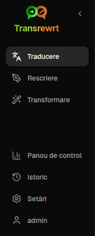
    </td>
    <td valign="top">
      <br/><br/>
      <ul>
        <li><strong>Traducere</strong> deschide spațiul de lucru pentru traducere.</li><br/>
        <li><strong>Rescriere</strong> deschide spațiul de lucru pentru rescriere.</li><br/>
        <li><strong>Transformare</strong> deschide spațiul de lucru pentru prompt personalizat.</li><br/>
        <li><strong>Panou de control</strong> afișează informații despre utilizare și costuri.</li><br/>
        <li><strong>Setări</strong> deschide panoul de setări.</li><br/>
        <li><strong>Istoric</strong> afișează istoricul utilizării cu textul de intrare și cel de ieșire.</li><br/>
        <li><strong>Utilizator</strong> afișează numele utilizatorului autentificat (doar în versiunea web).</li>
      </ul>
    </td>
  </tr>
</table>

<br/>

<a id="toolbar"></a>
### Bara de instrumente

Bara de instrumente se modifică ușor în funcție de locul în care vă aflați în aplicație.

- În stânga, afișează numele paginii curente.
- În dreapta, afișează **selectorul de model** și controlul pentru **Limba interfeței**.

**Selectorul de model** vă permite să alegeți ce motor AI să utilizați pentru sarcina curentă.

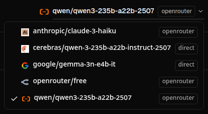

Unele modele gratuite pot să nu fie întotdeauna disponibile – uneori sunt offline sau au un limită de utilizare. Dacă se întâmplă acest lucru, aplicația va elimina automat acel model din lista dvs. disponibilă. Pentru a controla care modele apar, accesați [**Setări** > **Modele**](#models) și editați lista de modele. 
De asemenea, puteți deschide setările modelului direct apăsând pe pictograma furnizorului din stânga numelui modelului din bara de instrumente.

<br/>

Icoana **globe + codul limbii** schimbă limba interfeței aplicației, cum ar fi meniurile și butoanele. Aceasta **nu** schimbă limbile de traducere utilizate în **Traduce**.

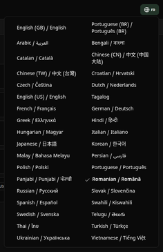

<br/>

<a id="input-and-output-panels"></a>
### Panouri de intrare și ieșire

Majoritatea spațiilor de lucru folosesc un panou **Intrare** în stânga și un panou **Rezultat** în dreapta.

Fiecare panou afișează, de asemenea:

| **Intrare**                                                          | **Rezultat**                                                                                                                  |
|--------------------------------------------------------------------|-----------------------------------------------------------------------------------------------------------------------------|
| - Numărul de caractere <br/>- Numărul de cuvinte <br/>- Numărul de paragrafe   <br/> | - Durata sarcinii<br/>- **TPS** (žetoane pe secundă)<br/>- Numărul de caractere, cuvinte și paragrafe<br/>- Modelul utilizat |

Dacă te întrebi despre termenii tehnici:

- **Žeton** înseamnă o bucată mică de text. Poți să-l consideri o parte dintr-un cuvânt sau un cuvânt scurt.
- **TPS** înseamnă câte dintre aceste bucăți de text a procesat modelul în fiecare secundă.

<br/>

Poți monitoriza, de asemenea, costul fiecărei operații (dacă este disponibil) și costul total, activând opțiunea `Show cost information on the actions` la [**Setări** > **Setări generale**](#general-settings).

<br/><br/>

[--------------------------------------------------------------------------------------------------------------------------]: #

<a id="translate"></a>
## Traduce

Folosește **Traduce** atunci când dorești să convertești text dintr-o limbă în alta.

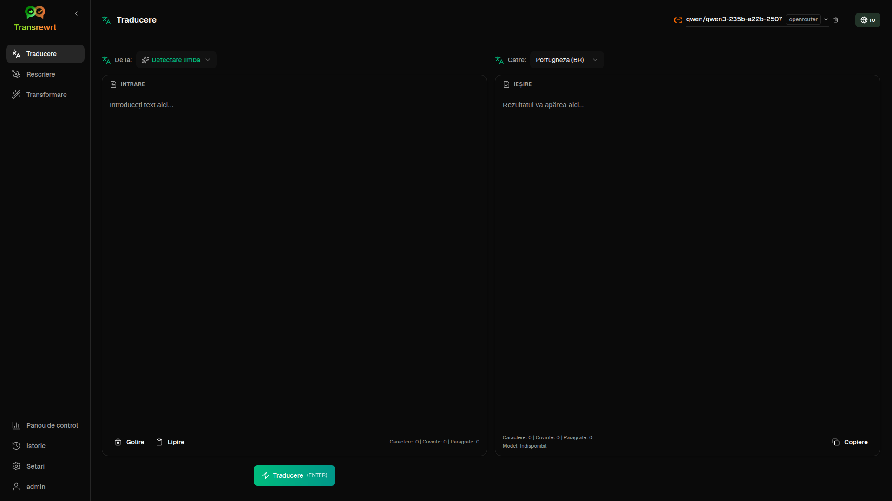

<br/>

<a id="translate-text"></a>
### Traducerea textului

1. Deschideți **Traducere**.
2. Alegeți o limbă în **Din**.
3. Alegeți o limbă în **În**.
4. Alegeți un model în bara de instrumente.
5. Tastați sau lipiți text în **Intrare**.
6. Faceți clic pe **Traducere**.
7. Citiți rezultatul în **Ieșire**.
8. Utilizați butonul de copiere dacă doriți să copiați rezultatul.

<br/>

<a id="language-selection"></a>
### Selectarea limbilor

- **De la** poate fi o limbă specifică sau **Detectează limba**.
- **La** este limba în care dorești să fie rezultatul.

Limbile tale **preferate** selectate apar în partea de sus a listei. Le poți seta în [**Setări** > **Limbi**](#languages).

<br/>

<a id="helpful-translation-settings"></a>
### Setări utile pentru traducere

În [**Setări** > **Setări generale**](#general-settings), poți modifica modul în care funcționează traducerea:

- **Auto-traducere la lipire** efectuează o traducere imediat ce lipiți un text.
- **Copiere automată a rezultatului în clipboard** copiază automat rezultatul după o execuție reușită.
- **Traducere în timp real (în timp ce scrii)** efectuează traduceri în timp ce tastezi.
- **Timeout (ms)** controlează cât timp așteaptă aplicația înainte de a executa o traducere în timp real.
- **Enter** controlează ce se întâmplă când apăsați `Enter`:

<br/><br/>

[--------------------------------------------------------------------------------------------------------------------------]: #

<a id="rewrite"></a>
## Rescriere

Folosește **Rescriere** atunci când dorești să îmbunătățești formularea fără a schimba sensul principal.

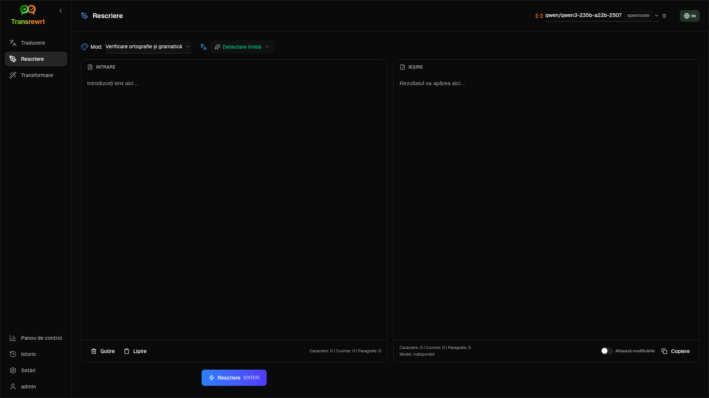

Acest lucru este util pentru:

- corectarea ortografiei și gramaticii (**Verificare ortografie și gramatică**)
- îmbunătățirea clarității textului (**Îmbunătățire claritate**)
- mai multe reformulări distincte într-o singură execuție (**Versiuni alternative**)
- transformarea textului într-un stil mai formal sau mai informal (**Formal** / **Informal**)
- scurtarea sau extinderea textului (**Scurtare** / **Extindere**)
- transformarea textului într-un stil mai tehnic (**Fă-te tehnic**)

<br/>

> 💡 **SFAT**<br/>
> Când folosești modul „**Verifică ortografia și gramatica**”, apare un comutator **Arată schimbările** în panoul de ieșire (lângă **Copiază**).
> Activează-l sau dezactivează-l pentru a afișa sau ascunde corecțiile specifice aplicate textului tău.

<br/><br/>

[--------------------------------------------------------------------------------------------------------------------------]: #

<a id="transform"></a>
## Transformare

Folosește **Transformare** atunci când dorești ca IA să urmeze un set personalizat de instrucțiuni.

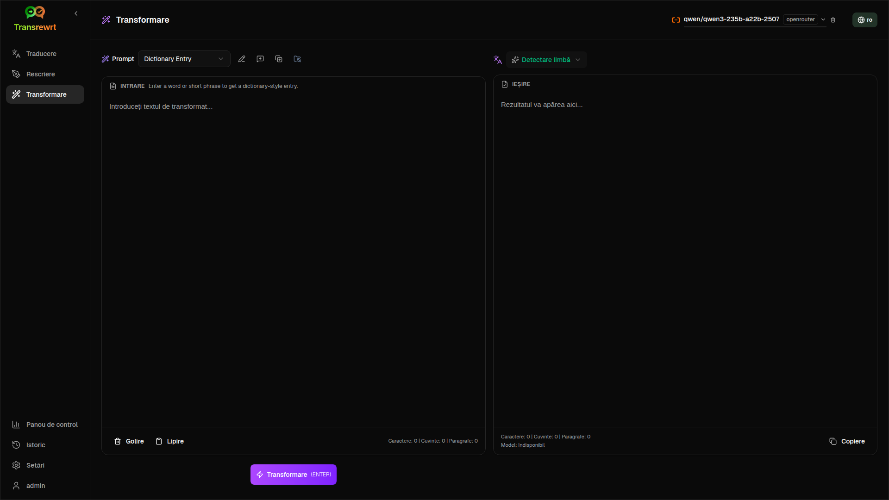

Aceasta este zona cea mai flexibilă a aplicației. Poți folosi această funcție pentru sarcini precum:

- rezumarea notelor
- transformarea unui text brut într-un e-mail finalizat
- extragerea punctelor cheie
- conversia textului într-un anumit format
- orice altă activitate personalizată cu textul de intrare

<br/>

<a id="run-an-existing-prompt"></a>
### Rulează un prompt existent

1. Deschideți **Transformare**.
2. Alegeți un prompt din lista de prompturi.
3. Dacă apare o casetă **Limba țintă**, alegeți o limbă dacă doriți.
4. Tastați sau lipiți text în **Intrare**.
5. Faceți clic pe **Transformare**.
6. Citiți rezultatul în **Ieșire**.

<br/>

<a id="if-you-have-no-prompts-yet"></a>
### Dacă nu ai prompturi încă

Dacă lista ta de prompturi este goală, apasă **Încarcă prompturi exemplu** în spațiul de lucru Transformare. Același control este mereu disponibil în [**Setări** > **Prompturi de transformare**](#transform-prompts) pe rândul de export/import. Ambele adaugă exemple încorporate, astfel încât să poți începe rapid.

<br/>

> ℹ️ **NOTĂ**<br/>
> Prompturile exemplu sunt furnizate în limba engleză. După ce le-ai încărcat, poți edita un prompt și folosi **Tradu cererea** pentru a-l traduce în limba ta.

<br/>

<a id="create-a-prompt-quickly"></a>
### Creează un prompt rapid

Cea mai rapidă cale de a crea un prompt este:

1. Faceți clic pe **Prompt nou**.
2. Faceți clic pe **Generare prompt**.
3. Descrieți ce doriți să facă promptul.
4. Alegeți un model.
5. Lăsați aplicația să creeze un draft pentru dumneavoastră.
6. Verificați draftul și faceți clic pe **Salvare**.

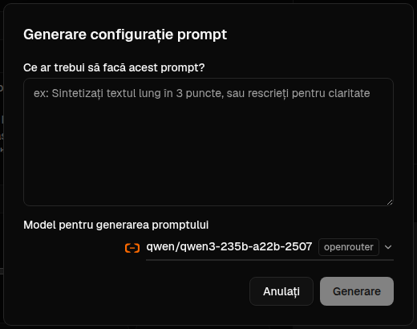

<br/>

<a id="edit-a-prompt"></a>
### Editează un prompt

Când creezi sau editezi un prompt, editorul apare în stânga, iar o zonă de testare apare în dreapta.

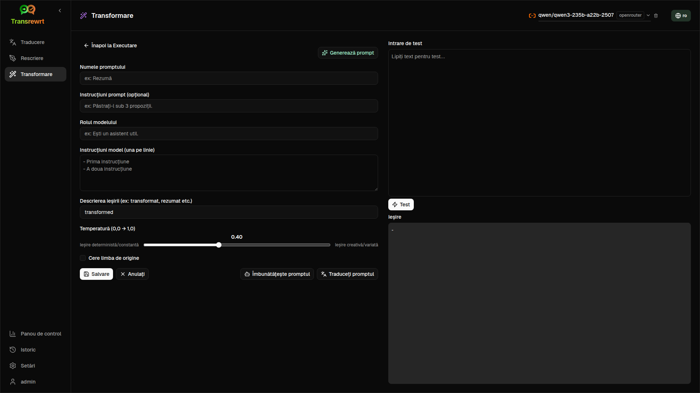

Câmpurile principale sunt:

- **Nume prompt**: numele afișat în lista de prompturi.
- **Instrucțiuni prompt (opțional)**: o scurtă indicație afișată utilizatorului la rularea promptului.
- **Rol model**: rolul general atribuit IA, cum ar fi „Ești un asistent util.”
- **Instrucțiuni model (câte una pe linie)**: regulile specifice pe care doriți ca IA să le urmeze.
- **Descriere ieșire**: un cuvânt scurt care descrie rezultatul, cum ar fi „rezumat” sau „rescriere”.
- **Temperatură (0,0 → 1,0)**: modul în care se va comporta modelul; consultați mai jos.
- **Cerere limbă țintă**: adaugă un selector de limbă țintă atunci când se rulează promptul.

Dacă termenul tehnic **Temperatură** este nou pentru tine, gândește-te așa:

- O **temperatură mai scăzută** oferă rezultate mai stabile și mai previzibile.
- O **temperatură mai ridicată** oferă mai multă varietate și creativitate.

Puteți utiliza și:

- **`Generate prompt`** pentru a crea un nou draft pornind de la o descriere simplă
- **`Improve prompt`** pentru a îmbunătăți un prompt existent
- **`Translate prompt`** pentru a traduce câmpurile promptului

<br/>

> ⚠️ **ATENȚIE**<br/>
> Faceți clic pe **`Save`** înainte de a face clic pe **`Back to Run`**. Dacă reveniți înapoi fără a salva, modificările vor fi pierdute.

<br/>

<a id="test-a-prompt-before-using-it"></a>
### Testați un prompt înainte de a-l utiliza

Panoul de testare din dreapta vă permite să încercați promptul cu un text eșantion înainte de a-l folosi în activitatea zilnică.

Aceasta este utilă atunci când:

- creați un prompt nou
- comparați două versiuni ale unui prompt
- doriți să verificați tonul, lungimea sau formatul rezultatului

<br/>

> ℹ️ **NOTĂ**<br/>
> Puteți exporta și importa prompturi salvate în [**Setări** > **Prompturi de transformare**](#transform-prompts).

<br/><br/>

[--------------------------------------------------------------------------------------------------------------------------]: #

<a id="dashboard"></a>
## Panou de control

Utilizați **Panou de control** pentru a vedea cât de mult utilizați aplicația și care este costul acesteia (pentru modelele plătite).

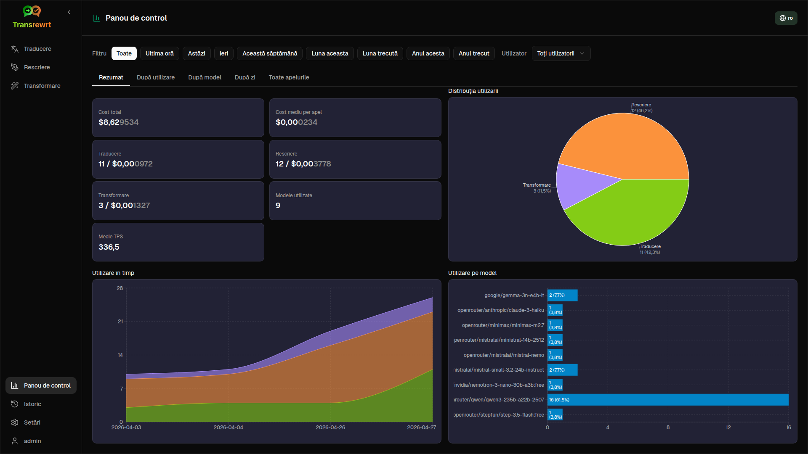

<br/>

> ℹ️ **NOTĂ**<br/>
> Dacă utilizați doar modele **gratuite**, sumele pentru **cost** pot fi zero, iar rezumatele bazate pe cost pot părea goale. În **Rezumat**, **Utilizare în timp** și **Utilizare pe model** afișează totuși **numărul de apeluri** (traducere, rescriere și transformare) atunci când există activitate în perioada selectată.

<br/>

<a id="filter-the-data"></a>
### Filtrați datele

Utilizați butoanele de filtrare de sus pentru a schimba intervalul de timp.

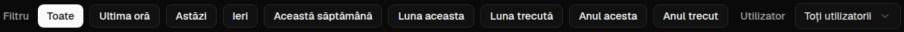

<br/>

> ℹ️ **NOTĂ**<br/>
> Filtrul **Utilizator** este vizibil doar administratorilor în versiunea web. Utilizatorii obișnuiți nu vor vedea acest filtru, iar acesta nu este disponibil în aplicația desktop.

<br/>

<a id="dashboard-tabs"></a>
### Filele panoului de control

- **Rezumat** vă oferă o imagine de ansamblu asupra utilizării și costurilor. Include o secțiune **Utilizare în timp** (număr cumulativ stivuit de **apeluri pe zi** pentru traducere, rescriere și transformare) și **Utilizare pe model** (totalul **apelurilor pe model**, inclusiv transformarea).
- **După utilizare** detaliază activitatea pe limbă de traducere, mod de rescriere și prompt de transformare.
- **După model** arată ce modele ați utilizat și cât au costat.
- **După zi** afișează totalurile zilnice.
- **Toate apelurile** afișează istoricul complet al apelurilor și vă permite să-l exportați.

<br/>

<a id="export-data"></a>
### Exportați datele

Tabelele din panoul de control pot exporta datele în:

- **JSON**
- **CSV**
- **XLSX**

Aceasta este utilă dacă doriți să verificați activitatea în afara aplicației sau să partajați un raport.

<br/>

<a id="delete-stored-records-for-a-model"></a>
### Șterge înregistrările stocate pentru un model

În **După model** sau **Toate apelurile**, puteți elimina înregistrările stocate pentru un model făcând clic pe pictograma „coș de gunoi”.

> ⚠️ **ATENȚIE**<br/>
> Ștergerea înregistrărilor stocate nu poate fi anulată. Utilizați această opțiune doar dacă sunteți sigur că nu mai aveți nevoie de acel istoric.

Pentru a șterge toate datele sau pentru a elimina înregistrări în funcție de vechimea lor, accesați [**Setări** > **Urmărire Costuri**](#cost-tracking). Acolo veți găsi opțiuni pentru a șterge toate datele stocate sau doar datele mai vechi de o anumită dată.

<br/><br/>

[--------------------------------------------------------------------------------------------------------------------------]: #

<a id="history"></a>
## Istoric

Faceți clic pe **Istoric** pentru a vedea istoricul acțiunilor dvs. din **Transrewrt**, inclusiv intrarea și rezultatul fiecărei operațiuni.

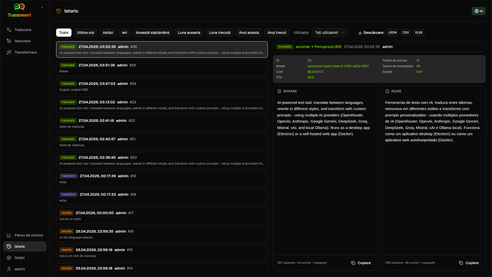

<br/>

<a id="filter-the-history"></a>
### Filtrarea datelor

**Istoric** utilizează aceleași filtre ca și pagina **Panou de control**. Folosiți-le pentru a selecta intervalul de timp.


<br/>

> ℹ️ **NOTĂ**<br/>
> Filtrul **Utilizator** este vizibil doar administratorilor în versiunea web. Utilizatorii obișnuiți nu vor vedea acest filtru, iar acesta nu este disponibil în aplicația desktop.

<br/>

<a id="export-history-data"></a>
### Exportarea datelor din istoric

Pagina de istoric poate exporta datele filtrate în:

- **JSON**
- **CSV**
- **XLSX**

Aceasta este utilă dacă doriți să verificați activitatea în afara aplicației sau să partajați un raport.

<br/><br/>

[--------------------------------------------------------------------------------------------------------------------------]: #

<a id="settings"></a>
## Setări

Deschideți **Setări** din bara laterală pentru a personaliza modul în care funcționează aplicația.

Filele disponibile depind de platformă și de rolul dvs.:

| Tab               | Desktop | Web (admin) | Web (utilizator obișnuit) |
  |-------------------|:-------:|:-----------:|:------------------------:|
  | Setări generale   |   da    |     da      |           da             |
  | Modele            |   da    |     da      |           da             |
  | Limbi             |   da    |     da      |           da             |
  | Urmărire costuri  |   da    |     da      |           -              |
  | Prompturi transformare |   da    |     da      |           da             |
  | Utilizatori       |    -    |     da      |           -              |
  | Configurare API   |   da    |     da      |         -          |
  | Despre            |   da    |     da      |        da          |

<br/>

> ℹ️ **NOTĂ**<br/>
> În versiunea web, fiecare utilizator are propria sa configurație. Setările precum modelele selectate, limbile, opțiunile generale și prompturile de transformare sunt stocate pe utilizator. Modificările pe care le faceți nu afectează alți utilizatori.

<br/>

[--------------------------------------------------------------------------------------------------------------------------]: #

<a id="general-settings"></a>
### Setări generale

Utilizați **Setări generale** pentru a controla comportamentul la tastare, dacă detaliile de execuție sunt stocate pentru **Istoric** și aspectul aplicației.

**Comportament**

- **Comportamentul pentru ENTER** alege dacă `Enter` execută sarcina sau inserează o linie nouă.
- **Auto-traducere la lipire** pornește traducerea imediat ce lipiți text.
- **Copiază automat rezultatul în clipboard** copiază rezultatele cu succes automat.
- **Traducere în timp real (în timp ce scrii)** traduce în timp ce scrii.
- **Timeout (ms)** setează timpul de așteptare pentru traducerea în timp real.

**Istoric**

- **Păstrează istoricul execuției** controlează dacă fiecare traducere, rescriere și transformare stochează **textul de intrare și de ieșire** pentru vizualizarea din bara laterală [**Istoric**](#history). Dezactivarea acestei opțiuni cere confirmare; dacă confirmați, textul istoricului stocat este eliminat din baza de date.
- **Șterge datele istoricului** vă permite să eliminați textul stocat în funcție de vechime (de exemplu mai vechi de câteva luni sau **toate datele (golește)**) utilizând **Șterge datele**. Aceasta afectează doar textul execuției salvat pentru vizualizarea **Istoric**; **nu** șterge totalurile de cost sau utilizare. Pentru a elimina sau tăia datele de **cost**, utilizați [**Setări** > **Urmărire Costuri**](#cost-tracking).

**Aspect**

- **Afișează informațiile despre cost pe acțiuni** controlează afișarea costului pe operațiune (dacă este disponibil) și a costului total pe panourile de ieșire pentru Traducere, Rescriere și Transformare.
- **Cifre zecimale pentru cost** modifică modul în care sunt afișate zecimalele costului.
- **Doar web:** **afișează o margine în jurul aplicației** adaugă spațiu suplimentar în jurul interfeței.
- **Familia de fonturi** schimbă fontul utilizat în panourile de text.
- **Dimensiune** schimbă dimensiunea fontului.

**Backup configurație**

- **Include datele de utilizare în backup** – dacă este activată, ZIP-ul conține și istoricul execuțiilor și datele apelurilor API. 
- **Configurare backup** – creează un singur fișier ZIP (`transrewrt-config-backup-YYYY-MM-DD_HHMMSS.zip` în UTC implicit) care include `config.json`, `state.json`, cheia opțională de criptare, utilizatori, preferințe, prompturi personalizate și date de utilizare dacă ați optat pentru aceasta. După un backup reușit, confirmarea afișează numele fișierului salvat.
- **Restaurare din backup** – deschide mai întâi un **dialog de confirmare**. Alegeți fișierul ZIP de backup în dialog (**Răsfoiește** / selector de fișiere sau trage și plasează acolo unde este suportat), apoi revizuiți opțiunile:
  - **Restaurează datele de utilizare** – importă utilizarea/istoricul din ZIP dacă a fost salvat cu datele de utilizare incluse; lăsați dezactivat dacă doriți doar setările și prompturile.
  - **Șterge datele vechi de utilizare înainte de restaurare** – elimină utilizarea/istoricul existent pe această instanță înainte de aplicarea backup-ului (opțional; folosiți atunci când doriți o înlocuire curată).

Backup-urile create fie în versiunea web, fie în cea desktop pot fi restaurate în cealaltă. Când restaurați un backup desktop în versiunea web, datele vor fi restaurate pentru utilizatorul administrator.

<br/>

<a id="models"></a>
### Modele

Utilizați **Setări** > **Modele** pentru a alege care modele apar în bara de instrumente.

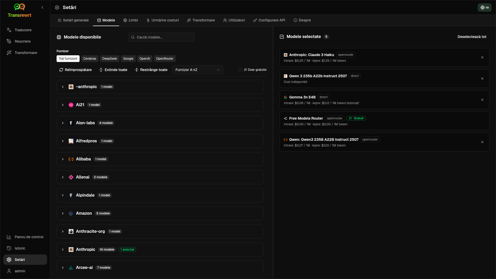

Pagina are două liste:

- **Modele Disponibile** în stânga
- **Modele selectate** în dreapta

Controale utile includ:

- **Caută modele...** pentru a găsi un model după nume
- **Chip-uri furnizor** pentru a restrânge lista la un singur motor (OpenRouter, OpenAI, Ollama, …)
- **Doar gratuite** pentru a afișa doar modele gratuite
- **Reîmprospătare** pentru a reîncărca lista
- **Extinde toate** și **Restrânge toate** când sortați după furnizor

ID-urile modelelor includ prefixul furnizorului (de exemplu `openrouter/…` vs `openai/…`). Insigile precum **OpenAI (OpenRouter)** vs **OpenAI (direct)** arată cum este rutat traficul.

> ℹ️ **NOTĂ**<br/>
> **OpenRouter Body Builder** (`openrouter/bodybuilder`) este un model router, nu un model general de chat: răspunsul său este JSON care descrie corpuri de cereri API OpenRouter (de exemplu un array `requests` cu `model` și `messages`). Dacă îl utilizați pentru **Traducere**, **Rescriere** sau **Transformare**, panoul de ieșire va afișa acel JSON în loc de text finalizat. Alegeți un model text normal pentru aceste sarcini. Consultați [pagina modelului Body Builder](https://openrouter.ai/openrouter/bodybuilder) pe OpenRouter.

Acțiuni:

- Pentru a adăuga un model, faceți clic pe **Adaugă** sau oriunde în intrare.

- Pentru a elimina un model, faceți clic pe **X** lângă acesta în **Modele selectate** sau pe **Selectat** în intrarea din Modele Disponibile.

- Pentru a șterge lista, faceți clic pe **Deselectează tot**. Modelul gratuit necesar va rămâne în listă.

<br/>

> ℹ️ **NOTĂ**<br/>
> Dacă nu doriți să adăugați credite la OpenRouter imediat, începeți prin activarea opțiunii **Doar Gratuite** și alegerea modelelor gratuite (nu este necesară o carte de credit). De asemenea, puteți utiliza Ollama pentru a rula modele local, fără nicio cheie API.

<br/>

<a id="languages"></a>
### Limbi

Utilizați **Setări** > **Limbi** pentru a organiza listele de limbi utilizate în aplicație.

- **Limbi principale** sunt fixate în partea superioară a listelor de limbi din **Traduce** și **Transformare**.
- **Limbă personalizată** vă permite să adăugați o limbă care nu se află în lista integrată.

Dacă adăugați o limbă personalizată, aceasta va apărea în selectorii de limbă alături de opțiunile integrate.

<br/>

<a id="cost-tracking"></a>
### Urmărire Costuri

Utilizați **Setări** > **Urmărire Costuri** pentru a gestiona informațiile privind costurile.

- **Cost total** afișează totalul curent.
- **Copiază valoarea** copiază totalul în clipboard.
- **Resetează costul** resetează totalul stocat la zero.
- **Sincronizează cu utilizarea cheii API** setează totalul să corespundă utilizării raportate de contul dvs. OpenRouter (doar OpenRouter).
- **Utilizarea cheii API** afișează detaliile de utilizare OpenRouter, dacă sunt disponibile.
- **Șterge datele de cost** elimină toate datele sau doar înregistrările mai vechi de o dată selectată.

**Urmărire costuri:** Când utilizați modele OpenRouter, aplicația vă arată utilizarea și cheltuielile reale pe baza informațiilor de cost de la OpenRouter. Pentru toți ceilalți furnizori, aplicația estimează costurile utilizând prețurile publicate de OpenRouter; dacă un preț nu este disponibil, estimarea poate fi zero.

<br/>

> ℹ️ **NOTĂ**<br/>
>  **Toate cifrele de cost sunt estimate doar pentru referința dvs., nu sunt facturi oficiale.**

<br/>

> ⚠️ **ATENȚIE**<br/>
> Ștergerea datelor nu poate fi anulată. Înainte de ștergere, asigurați-vă că vă salvați datele sau le exportați prin [**Istoric**](#history) 
> sau [**Panou de control** > **Toate apelurile**](#dashboard-tabs), altfel vor fi pierdute definitiv. 
> Tot istoricul de intrare/ieșire legat de fiecare intrare de apel API va fi, de asemenea, șters.

<br/>

<a id="transform-prompts"></a>
### Prompturi de transformare

Utilizați **Setări** > **Prompturi de transformare** pentru a gestiona prompturile în masă.

Puteți:

- revizuiți prompturile salvate
- ștergeți prompturi
- importați prompturi dintr-un fișier
- exportați prompturi pentru backup sau partajare
- încărcați prompturi eșantion în lista de prompturi

<br/>

<a id="users"></a>
### Utilizatori

Utilizați **Utilizatori** pentru a gestiona conturile de utilizator în versiunea web. Puteți adăuga utilizatori, actualiza detaliile lor, reseta parolele și șterge conturi.

<br/>

<a id="api-config"></a>
### Configurare API

Furnizorii susținuți sunt: OpenRouter, OpenAI, Anthropic, Google Gemini, DeepSeek, Groq, Mistral, xAI, Cerebras și **Ollama** (modele locale printr-o adresă URL de bază). Trebuie să configurați doar furnizorii pe care îi utilizați.

**Aplicație web: doar administrator**

Cheile API sunt configurate prin variabile de mediu ale sistemului sau Docker - nu sunt introduse în interfața web. Această pagină arată pentru care furnizori este configurată o cheie și vă permite să testați fiecare apăsând butonul **`Test`**.

<br/>

> ℹ️ **NOTĂ**<br/>
> Pentru a schimba o cheie API, actualizați variabila de mediu în configurația sistemului sau Docker și reporniți serverul sau containerul.

> ℹ️ **NOTĂ**<br/>
> **Backup-urile de configurație** (vezi [**Setări generale** → Backup configurație](#general-settings)) pot încorpora cheile furnizorilor **rezolvate** în interiorul fișierului `config.json` din arhiva ZIP. Restaurarea acestei arhive ZIP **nu** copiază acele chei înapoi în fișierul de configurație persistat al serverului - cheile active provin în continuare din mediul de execuție și starea fișierului existent, așa cum este descris acolo.

<br/>

**Aplicație desktop**

Utilizați **Configurare API** pentru a stoca cheile API pentru fiecare furnizor pe care îl utilizați. Pentru Ollama, introduceți **URL-ul de bază** în loc de o cheie API.

<br/>

> 💡 **Sfat** <br/>
> Dacă nu doriți să utilizați o cheie API sau să plătiți pentru utilizare, puteți [descărca Ollama](https://ollama.com) și rula modele (cum ar fi `translategemma:4b`) local pe calculatorul dumneavoastră gratuit. Alternativ, puteți crea un cont gratuit OpenRouter (fără card de credit) pentru a utiliza modelele lor gratuite, sau obțineți o cheie API gratuită de la Cerebras, Google, Groq sau Mistral AI.

<br/>

- Adăugați doar furnizorii de care aveți nevoie. În **Setări** > **Modele**, fiecare ID de model începe cu furnizorul (de exemplu `openrouter/openrouter/free`, `openai/gpt-4o`, `ollama/llama3`).

Pentru a adăuga o cheie API, introduceți valoarea în câmpul de text și apăsați **`Save`**. Pentru a înlocui o cheie existentă, apăsați **`Edit`**. Pentru a verifica dacă o cheie funcționează, apăsați **`Test`**. Pentru URL-ul de bază Ollama, apăsați întotdeauna **`Test`** pentru a verifica conexiunea.

<br/>

> ℹ️ **NOTĂ**<br/>
> Nu puteți vedea valoarea curentă a unei chei API. Puteți doar să o înlocuiți utilizând butonul **`Edit`**.
> Cheile API sunt stocate criptat în configurație.

<br/>

<a id="about"></a>
### Despre

Tabul **Despre** afișează:

- numele aplicației
- numărul versiunii
- data build-ului
- un link către depozitul proiectului

<br/><br/>

<a id="common-issues"></a>
## Probleme comune

Dacă ceva nu funcționează așa cum vă așteptați, verificați mai întâi următoarele puncte.

<br/>

<a id="the-app-will-not-translate-rewrite-or-transform-text"></a>
### Aplicația nu traduce, rescrie sau transformă textul

Verificați dacă:

- ați selectat un model în bara de instrumente
- cel puțin un model este listat în [**Setări** > **Modele**](#models)
- configurația API funcționează

Dacă utilizați aplicația desktop:

1. Deschideți [**Setări** > **Configurare API**](#api-config).
2. Verificați dacă cel puțin o cheie API este salvată.
3. Apăsați **Testează** lângă furnizor pentru a confirma că cheia funcționează.

<br/>

<a id="the-model-list-is-empty"></a>
### Lista modelului este goală

Deschide [**Setări** > **Modele**](#models) și apasă **Reîmprospătează**.

Dacă este necesar:

- caută un model
- activează **Doar Gratuite**
- adaugă unul sau mai multe modele la **Modele selectate**

<br/>

<a id="the-result-is-too-slow-or-too-expensive"></a>
### Rezultatul este prea lent sau prea scump

Încearcă unul sau mai multe dintre acestea:

- alege un model diferit
- folosește o intrare mai scurtă
- dezactivează **Traducere în timp real (în timp ce tastezi)** în [**Setări** > **Setări generale**](#general-settings)
- folosește modele gratuite pentru sarcini simple (vezi [Modele](#models))

<br/>

<a id="the-interface-is-in-the-wrong-language"></a>
### Interfața este în limba greșită

Apasă pe pictograma glob în [bara de instrumente](#toolbar) și alege limba ta preferată **Limba interfeței**.

<br/>

<a id="the-text-is-too-small-or-hard-to-read"></a>
### Textul este prea mic sau greu de citit

Deschide [**Setări** > **Setări generale**](#general-settings) și schimbă:

- **Familia de fonturi**
- **Dimensiune**

<br/>

<a id="dashboard-charts-are-empty"></a>
### Graficele din Panoul de control sunt goale

Acest lucru este normal dacă:

- folosești doar **modele gratuite** și te uiți la cifrele de **cost** (acestea pot fi zero); graficele de număr de apeluri de **utilizare** din **Rezumat** au nevoie în continuare de date din perioada selectată
- filtrul de **timp selectat** nu acoperă perioada în care au fost efectuate apelurile - încearcă **Toate** pentru a verifica

Dacă graficele sunt încă goale după ce ai selectat **Toate**, confirmă că apelurile apar în [**Istoric**](#history) sau în tab-ul **Toate apelurile**.

<br/>

<a id="cost-shows-not-available-or-seems-wrong"></a>
### Costul arată "nu este disponibil" sau pare greșit

Când folosești modele prin **OpenRouter**, aplicația îți arată cheltuielile reale raportate de OpenRouter.

Pentru **alte furnizori** (OpenAI direct, Anthropic direct, etc.), costul este estimat din datele de preț publicate de OpenRouter. Dacă nu se găsește un preț corespunzător pentru un model, costul va apărea ca **nu este disponibil** și nu va fi adăugat la totalul tău curent.

<br/>

<a id="total-cost-does-not-match-my-provider-bill"></a>
### Costul total nu se potrivește cu factura furnizorului meu

Toate valorile de cost din aplicație sunt **estimări doar pentru referință**, nu reprezintă facturi oficiale.

Pentru a aduce totalul mai aproape de cheltuielile reale OpenRouter, deschideți [**Setări** > **Urmărire Costuri**](#cost-tracking) și faceți clic pe **Sincronizează cu utilizarea cheii API**.

<br/>

<a id="the-history-page-is-missing-from-the-sidebar"></a>
### Pagina Istoric lipsește din bara laterală

Opțiunea **Păstrează istoricul execuției** ar putea fi dezactivată. Deschideți [**Setări** > **Setări generale**](#general-settings) și activați-o. Rețineți că activarea acesteia nu restaurează datele istoricului șterse anterior.

<br/>

<a id="web-app-session-expired"></a>
### Aplicația web: redirecționat neașteptat la pagina de autentificare

Sesiunea dumneavoastră s-ar putea să fi expirat. Autentificați-vă din nou. Dacă acest lucru se întâmplă frecvent, verificați configurația serverului pentru setările duratei sesiunii.

<br/>

<a id="web-admin-forgot-or-lost-a-password"></a>
### Administrator web: a uitat sau a pierdut parola

Aceasta se aplică **aplicației web auto-găzduite** (Docker), nu aplicației desktop (Electron).

- Dacă un alt administrator se poate autentifica încă, acesta poate deschide [**Setări** > **Utilizatori**](#users), alege contul și seta o **parolă nouă** acolo.
- Dacă sunteți **blocat afară**, dar aveți **acces shell** la mașină sau container, resetați parola cu ajutorul utilitarului furnizat cu imaginea (înlocuiți `transrewrt` dacă schimbați numele implicit, și puneți între ghilimele parola dacă conține spații sau caractere speciale):

```bash
docker exec transrewrt reset-web-password '<username>' '<new-password>'
```

Numele implicit de utilizator administrator este `admin` dacă nu ați creat niciodată alte conturi. Când transmiteți doar un argument, acesta este tratat ca parolă nouă pentru `admin`.

Dacă rulați dintr-un **checkout sursă** în loc de Docker, utilizați:

```bash
pnpm run reset-web-password -- <username> <new-password>
```

Scriptul actualizează înregistrarea utilizatorului în baza de date SQLite (și poate crea utilizatorul `admin` dacă lipsește). După resetare, autentificați-vă cu noua parolă.

<br/>

<a id="dashboard-shows-no-data-for-other-users"></a>
### Panoul de control nu afișează date pentru alți utilizatori (web)

Doar **administratorii** pot vizualiza datele tuturor utilizatorilor prin filtrul **Utilizator**. Utilizatorii obișnuiți văd doar activitatea lor proprie, conform designului.

<br/>

<a id="i-changed-a-prompt-and-lost-the-edits"></a>
### Am modificat un prompt și am pierdut modificările

Când editați un prompt, faceți întotdeauna clic pe **Salvează** înainte de a face clic pe **Înapoi la Execuție**.

<br/><br/>

<a id="quick-tips"></a>
## Sfaturi rapide

- Începeți cu [**Traducere**](#translate) pentru a vă asigura că setările funcționează înainte să treceți la [**Rescriere**](#rewrite) sau [**Transformare**](#transform).
- Utilizați [**Rescriere**](#rewrite) pentru îmbunătățiri zilnice ale formulării.
- Utilizați [**Transformare**](#transform) atunci când aveți nevoie de un flux de lucru reproductibil pentru o sarcină specifică.
- Utilizați [**Panou de control**](#dashboard) dacă doriți să urmăriți utilizarea și costurile.
- Utilizați [**Istoric**](#history) pentru a revizui operațiunile anterioare și textul complet de intrare/ieșire.
- Exportați prompturile periodic dacă construiți o bibliotecă de prompturi pe care doriți să o păstrați în siguranță (vezi [Transformă prompturi](#transform-prompts)) sau dacă doriți să le partajați cu alții.

<br/><br/>

<a id="disclaimer"></a>
## Declinare de răspundere

Numele produselor și pictogramele aparțin proprietarilor respectivi și sunt utilizate doar în scopuri de identificare. Acest software nu este afiliat cu și nu este susținut de niciunul dintre brandurile menționate.

<br/><br/>

<a id="license"></a>
## Licență

Drepturi de autor © 2026 Waldemar Scudeller Jr.

[Apache License 2.0](../LICENSE)
