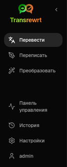
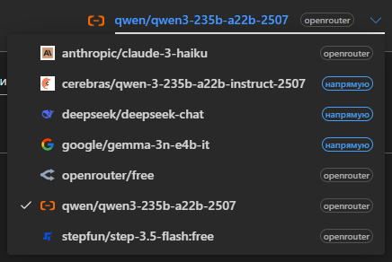
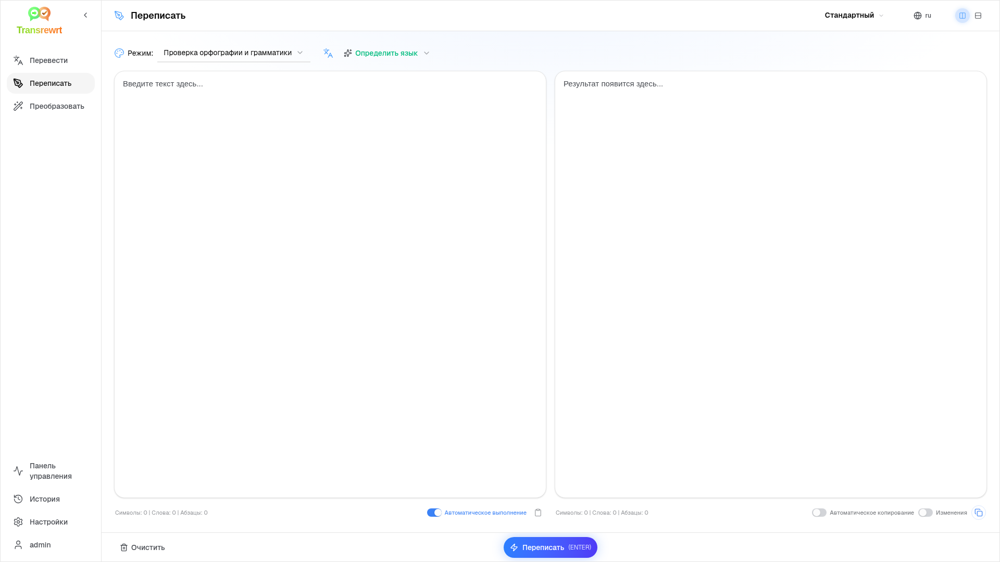
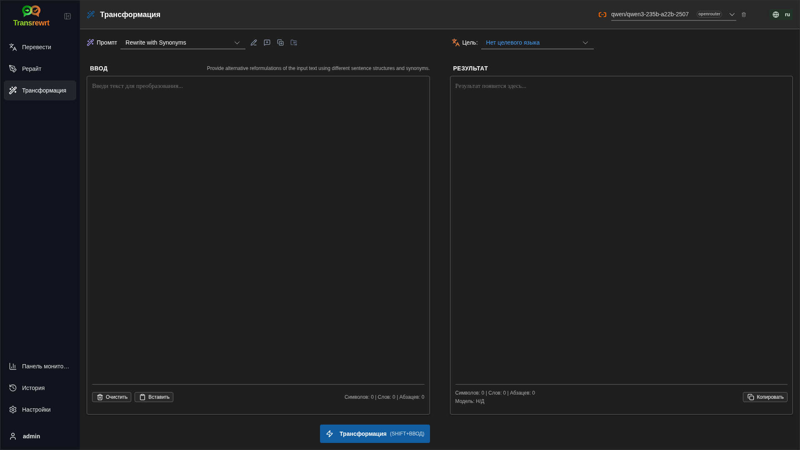
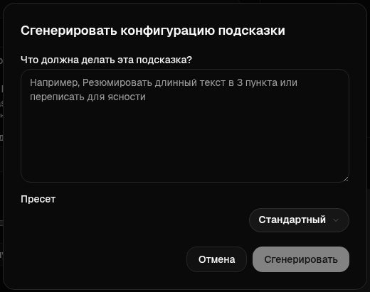
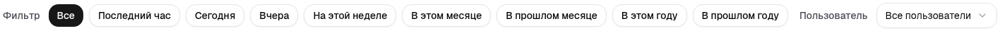
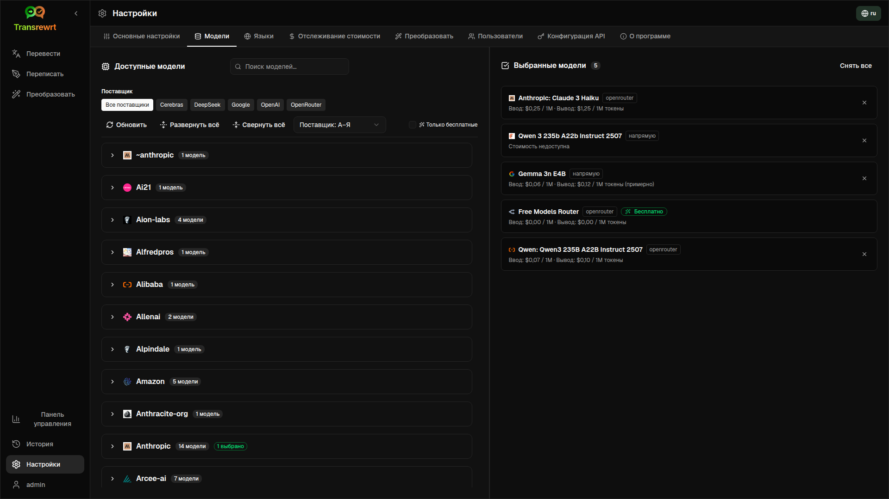

<a id="transrewrt-user-guide"></a>
# Руководство для пользователя

<br/>

<a id="introduction"></a>
## Введение

Transrewrt помогает работать с текстом тремя основными способами:

- **Перевести** - преобразовать текст с одного языка на другой.
- **Рерайт** - переформулировать текст в другом стиле, например, более ясно, короче или формально.
- **Трансформация** - обработка текста с помощью пользовательских инструкций ИИ, называемых промптами.

<br/>

В этом руководстве объясняется, как использовать приложение после его установки и запуска. Пошаговую инструкцию по установке см. в основном файле **[README](README.ru.md)**.

<br/>

> ℹ️ **ПРИМЕЧАНИЕ**<br/>
> Transrewrt доступен как настольное приложение для Windows и Linux, а также как веб-приложение для самостоятельного размещения. В этом руководстве основное внимание уделено повседневному использованию приложения. Если какая-то функция доступна только в одной версии, это четко указано.

<small>**Читать на других языках:** </small>
<small id="lang-list">[English (UK)](../USER-GUIDE.md) · [Português (BR)](USER-GUIDE.pt-BR.md) · [العربية](USER-GUIDE.ar.md) · [বাংলা](USER-GUIDE.bn.md) · [Català](USER-GUIDE.ca.md) · [简体中文](USER-GUIDE.zh-CN.md) · [繁體中文](USER-GUIDE.zh-TW.md) · [Hrvatski](USER-GUIDE.hr.md) · [Čeština](USER-GUIDE.cs.md) · [Nederlands](USER-GUIDE.nl.md) · [English (US)](USER-GUIDE.en-US.md) · [Filipino](USER-GUIDE.tl.md) · [Français](USER-GUIDE.fr.md) · [Deutsch](USER-GUIDE.de.md) · [Ελληνικά](USER-GUIDE.el.md) · [हिन्दी](USER-GUIDE.hi.md) · [Magyar](USER-GUIDE.hu.md) · [Italiano](USER-GUIDE.it.md) · [日本語](USER-GUIDE.ja.md) · [Basa Jawa](USER-GUIDE.jv.md) · [한국어](USER-GUIDE.ko.md) · [Bahasa Melayu](USER-GUIDE.ms.md) · [فارسی](USER-GUIDE.fa.md) · [Polski](USER-GUIDE.pl.md) · [Português (PT)](USER-GUIDE.pt.md) · [ਪੰਜਾਬੀ](USER-GUIDE.pa.md) · [Română](USER-GUIDE.ro.md) · [Русский](USER-GUIDE.ru.md) · [Slovenčina](USER-GUIDE.sk.md) · [Español](USER-GUIDE.es.md) · [Kiswahili](USER-GUIDE.sw.md) · [Svenska](USER-GUIDE.sv.md) · [తెలుగు](USER-GUIDE.te.md) · [ภาษาไทย](USER-GUIDE.th.md) · [Türkçe](USER-GUIDE.tr.md) · [Українська](USER-GUIDE.uk.md) · [Tiếng Việt](USER-GUIDE.vi.md)</small>

<small>

> **Примечание о переводах интерфейса и документации:** Все языки интерфейса, кроме оригинального английского (Великобритания),
> были переведены с помощью моделей ИИ; формулировки могут быть неточными или содержать ошибки.

</small>

<br/>

<!-- START doctoc generated TOC please keep comment here to allow auto update -->
<!-- DON'T EDIT THIS SECTION, INSTEAD RE-RUN doctoc TO UPDATE -->
**Оглавление**

- [Перед началом](#before-you-start)
  - [Как получить бесплатный API-ключ OpenRouter (настольное приложение)](#how-to-get-a-free-openrouter-api-key-desktop-app)
- [Начало работы](#getting-started)
- [Основные части окна](#main-parts-of-the-window)
  - [Боковая панель](#sidebar)
  - [Панель инструментов](#toolbar)
  - [Панели ввода и вывода](#input-and-output-panels)
- [Перевод](#translate)
  - [Перевести текст](#translate-text)
  - [Выбор языка](#language-selection)
  - [Полезные настройки перевода](#helpful-translation-settings)
- [Рерайт](#rewrite)
- [Трансформация](#transform)
  - [Запуск существующего промпта](#run-an-existing-prompt)
  - [Если у вас ещё нет промптов](#if-you-have-no-prompts-yet)
  - [Быстрое создание промпта](#create-a-prompt-quickly)
  - [Редактирование промпта](#edit-a-prompt)
  - [Тестирование промпта перед использованием](#test-a-prompt-before-using-it)
- [Панель мониторинга](#dashboard)
  - [Фильтрация данных](#filter-the-data)
  - [Вкладки панели мониторинга](#dashboard-tabs)
  - [Экспорт данных](#export-data)
  - [Удаление сохранённых записей для модели](#delete-stored-records-for-a-model)
- [История](#history)
  - [Фильтрация данных](#filter-the-data-1)
  - [Экспорт данных истории](#export-history-data)
- [Настройки](#settings)
  - [Общие настройки](#general-settings)
  - [Модели](#models)
  - [Языки](#languages)
  - [Отслеживание расходов](#cost-tracking)
  - [Промпты трансформации](#transform-prompts)
  - [Пользователи](#users)
  - [Конфигурация API](#api-config)
  - [О программе](#about)
- [Распространённые проблемы](#common-issues)
  - [Приложение не переводит, не переписывает и не трансформирует текст](#the-app-will-not-translate-rewrite-or-transform-text)
  - [Список моделей пуст](#the-model-list-is-empty)
  - [Результат слишком медленный или слишком дорогой](#the-result-is-too-slow-or-too-expensive)
  - [Интерфейс на неправильном языке](#the-interface-is-in-the-wrong-language)
  - [Текст слишком мелкий или плохо читается](#the-text-is-too-small-or-hard-to-read)
  - [Графики на панели мониторинга пусты](#dashboard-charts-are-empty)
  - [Стоимость показывает «недоступно» или выглядит неправильной](#cost-shows-not-available-or-seems-wrong)
  - [Общая стоимость не совпадает со счётом провайдера](#total-cost-does-not-match-my-provider-bill)
  - [Страница История отсутствует в боковой панели](#the-history-page-is-missing-from-the-sidebar)
  - [Веб-приложение: неожиданное перенаправление на страницу входа](#web-app-redirected-to-the-login-page-unexpectedly)
  - [Веб-администратор: забыт или утерян пароль](#web-admin-forgot-or-lost-a-password)
  - [На панели мониторинга нет данных по другим пользователям (веб)](#dashboard-shows-no-data-for-other-users-web)
  - [Я изменил промпт и потерял правки](#i-changed-a-prompt-and-lost-the-edits)
- [Быстрые советы](#quick-tips)
- [Отказ от ответственности](#disclaimer)
- [Лицензия](#license)

<!-- END doctoc generated TOC please keep comment here to allow auto update -->

<br/><br/>

<a id="before-you-start"></a>
## Перед началом работы

Чтобы использовать Transrewrt, вам нужен доступ хотя бы к одному провайдеру ИИ. Поддерживаемые провайдеры: [OpenRouter](https://openrouter.ai) (агрегирует множество моделей), OpenAI, Anthropic, Google Gemini, DeepSeek, Groq, Mistral, xAI, Cerebras и [Ollama](https://ollama.com) для локальных моделей.

Для начала не обязательно выбирать платную модель. Как только вы добавите свой API-ключ OpenRouter, приложение автоматически активирует встроенную **бесплатную** опцию OpenRouter. Это позволяет сразу начать переводить, переписывать и трансформировать текст. Кроме того, вы можете получить бесплатный API-ключ от Cerebras, Google, Groq или Mistral AI.

Простыми словами:

- **Модель** - это движок ИИ, который выполняет работу. Модели перечисляются с **префиксом провайдера** (например, `openrouter/…`, `openai/…`, `ollama/…`).
- **API-ключ** (или для Ollama - **базовый URL**) - это способ, с помощью которого приложение подключается к провайдеру.

Если вы используете **десктопное приложение**, добавьте ключи в разделе [**Настройки** > **Конфигурация API**](#api-config) для каждого используемого провайдера. Если вы используете только OpenRouter, см. ниже раздел [Как получить API-ключ](#how-to-get-an-api-key-desktop-app). Если вы не хотите использовать API-ключ, вы можете установить Ollama (с сайта [ollama.com](https://ollama.com)) и использовать локальные модели, например `translategemma:4b`.

Если вы используете **веб-версию**, владелец сервера настраивает провайдеров через переменные окружения, поэтому вы не можете вводить API-ключи напрямую в приложении.

<br/>

<a id="how-to-get-an-api-key-desktop-app"></a>
### Как получить бесплатный API-ключ OpenRouter (десктопное приложение)

Если вы используете десктопное приложение, выполните следующие шаги:

1. Перейдите на сайт [OpenRouter](https://openrouter.ai) в вашем веб-браузере.
2. Создайте аккаунт или войдите в него.
3. Откройте страницу [Keys](https://openrouter.ai/keys).
4. Нажмите кнопку для создания нового API-ключа.
5. Присвойте ключу имя, чтобы вы могли распознать его позже.
6. Скопируйте новый API-ключ.
7. Вернитесь в Transrewrt и откройте **Настройки** > **Конфигурация API**.
8. Вставьте ключ в поле **OpenRouter API key** (в разделе **Настройки** > **Конфигурация API**).
9. Нажмите **Test OpenRouter key**, чтобы убедиться, что он работает.

<br/><br/>

<a id="getting-started"></a>
## Начало работы

Если вы впервые используете Transrewrt, следуйте этому порядку:

1. Запустите приложение.
2. При необходимости выберите **язык интерфейса** через значок глобуса.
3. Если вы используете **десктопное приложение**, откройте [**Настройки** > **Конфигурация API**](#api-config), добавьте API-ключ хотя бы одного провайдера (например, OpenRouter) и нажмите **Тест**, чтобы проверить его работу.
4. Откройте [**Настройки** > **Модели**](#models) и добавьте одну или несколько моделей в раздел **Выбранные модели**.
5. Откройте [**Настройки** > **Языки**](#languages) и выберите **Основные языки**, если хотите, чтобы часто используемые языки отображались первыми.
6. Перейдите в **Перевод** и выполните простой перевод, чтобы убедиться, что всё работает.
7. После этого попробуйте **Рерайт**, а затем **Трансформацию**.

Этот порядок важен. Он предотвращает наиболее распространённую проблему при первом использовании: попытку выполнить задачу до того, как приложение установило рабочее соединение с API или выбрана модель.

<br/><br/>

<a id="main-parts-of-the-window"></a>
## Основные части окна

Приложение разделено на три основные области:

- **Боковая панель** слева.
- **Панель инструментов** сверху.
- **Рабочая область** в центре.

<br/>

<a id="sidebar"></a>
### Боковая панель

Используйте боковую панель для навигации по приложению. Вы можете свернуть боковую панель, чтобы освободить место, нажав на значок рядом с логотипом приложения.

<br/>

<table>
  <tr>
    <td valign="top">
       
    </td>
    <td valign="top">
      <br/><br/>
      <ul>
        <li><strong>Перевести</strong> открывает рабочую область перевода.</li><br/>
        <li><strong>Рерайт</strong> открывает рабочую область переписывания.</li><br/>
        <li><strong>Трансформация</strong> открывает рабочую область с пользовательским промптом.</li><br/>
        <li><strong>Панель управления</strong> показывает информацию об использовании и стоимости.</li><br/>
        <li><strong>Настройки</strong> открывает панель настроек.</li><br/>
        <li><strong>История</strong> показывает историю использования с вводимым и выводимым текстом</li><br/>
        <li><strong>Пользователь</strong> показывает имя вошедшего пользователя (только в веб-версии).</li>
      </ul>
    </td>
  </tr>
</table>

<br/>

<a id="toolbar"></a>
### Панель инструментов

Панель инструментов немного меняется в зависимости от того, где вы находитесь в приложении.

- Слева отображается название текущей страницы.
- Справа находятся **выбор модели** и элемент управления **Язык интерфейса**.

С помощью **выбора модели** можно выбрать, какой ИИ-движок использовать для текущей задачи.



Некоторые бесплатные модели могут быть недоступны - иногда они отключены или имеют ограничение по использованию. В таком случае приложение автоматически удалит эту модель из вашего списка доступных. Чтобы управлять отображаемыми моделями, перейдите в раздел [**Настройки** > **Модели**](#models) и отредактируйте свой список моделей. 
Вы также можете открыть настройки модели напрямую, нажав на значок провайдера слева от названия модели на панели инструментов.

<br/>

**Значок глобуса + код языка** изменяет язык интерфейса приложения, например, меню и кнопки. Он **не** изменяет языки перевода, используемые в разделе **Перевести**.


<br/>

<a id="input-and-output-panels"></a>
### Панели ввода и вывода

Большинство рабочих пространств используют левую панель **Ввод** и правую панель **Результат**.

Каждая панель также отображает:

| **Ввод**                                                          | **Результат**                                                                                                                  |
|--------------------------------------------------------------------|-----------------------------------------------------------------------------------------------------------------------------|
| - Количество символов <br/>- Количество слов <br/>- Количество абзацев   <br/> | - Время выполнения задачи<br/>- **TPS** (токенов в секунду)<br/>- Количество символов, слов и абзацев<br/>- Используемая модель |

Если вы не знакомы с техническими терминами:

- **Токен** означает небольшой фрагмент текста. Его можно представить как часть слова или короткое слово.
- **TPS** означает, сколько таких фрагментов текста модель обрабатывает за секунду.

<br/>

Вы также можете отслеживать стоимость каждой операции (если доступно) и общую стоимость, включив опцию `Показывать информацию о стоимости операций` в разделе [**Настройки** > **Общие настройки**](#general-settings).

<br/><br/>

[--------------------------------------------------------------------------------------------------------------------------]: #

<a id="translate"></a>
## Перевести

Используйте **Перевести**, когда хотите преобразовать текст с одного языка на другой.


<br/>

<a id="translate-text"></a>
### Перевод текста

1. Откройте **Перевести**.
2. Выберите язык в поле **С**.
3. Выберите язык в поле **На**.
4. Выберите модель на панели инструментов.
5. Введите или вставьте текст в поле **Ввод**.
6. Нажмите **Перевести**.
7. Прочитайте результат в поле **Результат**.
8. Используйте кнопку копирования, если хотите скопировать результат.

<br/>

<a id="language-selection"></a>
### Выбор языка

- **С** может быть конкретным языком или **Определить язык**.
- **На** - это язык, на который вы хотите перевести результат.

Ваши выбранные **Основные языки** отображаются в верхней части списка. Вы можете задать их в разделе [**Настройки** > **Языки**](#languages).

<br/>

<a id="helpful-translation-settings"></a>
### Полезные настройки перевода

В разделе [**Настройки** > **Общие настройки**](#general-settings) можно изменить поведение перевода:

- **Автоперевод при вставке** - запускает перевод сразу после вставки текста.
- **Автокопирование результата в буфер обмена** - автоматически копирует результат после успешного выполнения.
- **Перевод в реальном времени (при вводе)** - запускает перевод по мере ввода текста.
- **Таймаут (мс)** - определяет, сколько времени приложение ждёт перед запуском перевода в реальном времени.
- **Enter** - определяет действие при нажатии клавиши `Enter`:

<br/><br/>

[--------------------------------------------------------------------------------------------------------------------------]: #

<a id="rewrite"></a>
## Рерайт

Используйте **Рерайт**, когда хотите улучшить формулировку, не меняя основного смысла.



Это полезно для:

- исправления орфографии и грамматики (**Проверка орфографии и грамматики**)
- повышения ясности текста (**Улучшить ясность**)
- получения нескольких различных вариантов переформулировки за один запуск (**Альтернативные версии**)
- придания тексту более формального или неформального стиля (**Формальный** / **Неформальный**)
- сокращения или расширения текста (**Сократить** / **Расширить**)
- придания тексту более технического характера (**Сделать техническим**)

<br/>

> 💡 **СОВЕТ**<br/>
> При использовании режима "**Проверка орфографии и грамматики**" в панели результата (рядом с **Копировать**) появляется переключатель **Показать изменения**.
> Включите или отключите его, чтобы показать или скрыть конкретные исправления, применённые к вашему тексту.

<br/><br/>

[--------------------------------------------------------------------------------------------------------------------------]: #

<a id="transform"></a>
## Трансформация

Используйте **Трансформацию**, когда хотите, чтобы ИИ следовал вашему собственному набору инструкций.



Это самая гибкая часть приложения. Вы можете использовать её для таких задач, как:

- суммирование заметок
- превращение чернового текста в отполированный email
- выделение ключевых моментов
- преобразование текста в определённый формат
- любые другие пользовательские действия с входным текстом

<br/>

<a id="run-an-existing-prompt"></a>
### Запуск существующего промпта

1. Откройте **Трансформацию**.
2. Выберите промпт из списка промптов.
3. Если появится поле **Цель**, выберите нужный язык.
4. Введите или вставьте текст в поле **Ввод**.
5. Нажмите **Трансформировать**.
6. Прочитайте результат в поле **Результат**.

<br/>

<a id="if-you-have-no-prompts-yet"></a>
### Если у вас ещё нет промптов

Если список промптов пуст, нажмите **Загрузить примеры промптов** в рабочей области Трансформации. Та же кнопка всегда доступна в разделе [**Настройки** > **Промпты трансформации**](#transform-prompts) в строке экспорта/импорта. Оба способа добавляют встроенные примеры, чтобы вы могли начать быстро.

<br/>

> ℹ️ **ПРИМЕЧАНИЕ**<br/>
> Примеры промптов предоставляются на английском языке. После загрузки вы можете отредактировать любой промпт и использовать **Перевести запрос**, чтобы перевести его на ваш язык.

<br/>

<a id="create-a-prompt-quickly"></a>
### Быстрое создание промпта

Самый быстрый способ создать промпт:

1. Нажмите **Новый промпт**.
2. Нажмите **Создать запрос**.
3. Опишите, что вы хотите, чтобы делал промпт.
4. Выберите модель.
5. Дайте приложению создать черновик.
6. Проверьте черновик и нажмите **Сохранить**.



<br/>

<a id="edit-a-prompt"></a>
### Редактировать промпт

При создании или редактировании промпта редактор отображается слева, а область тестирования - справа.


Основные поля:

- **Название промпта**: имя, отображаемое в списке промптов.
- **Инструкции промпта (необязательно)**: краткая подсказка, отображаемая пользователю при запуске промпта.
- **Роль модели**: общая роль, назначенная ИИ, например: «Вы - полезный помощник».
- **Инструкции модели (по одной на строку)**: конкретные правила, которым должен следовать ИИ.
- **Описание вывода**: краткое слово, описывающее результат, например «сводка» или «рерайт».
- **Температура (0.0 → 1.0)**: характер поведения модели; см. ниже.
- **Запрашивать целевой язык**: добавляет выбор целевого языка при запуске промпта.

Если термин **Температура** для вас новый, представьте это следующим образом:

- **Низкая** температура даёт более стабильные и предсказуемые результаты.
- **Высокая** температура даёт больше разнообразия и креативности.

Вы также можете использовать:

- **`Создать промпт`**, чтобы создать черновик на основе простого описания
- **`Улучшить промпт`**, чтобы усовершенствовать существующий промпт
- **`Перевести промпт`**, чтобы перевести поля промпта

<br/>

> ⚠️ **ВНИМАНИЕ**<br/>
> Нажмите **`Сохранить`**, прежде чем нажимать **`Назад к запуску`**. Если вы вернётесь назад без сохранения, все изменения будут потеряны.

<br/>

<a id="test-a-prompt-before-using-it"></a>
### Протестируйте промпт перед использованием

Панель тестирования справа позволяет опробовать промпт с примером текста до его применения в повседневной работе.

Это полезно, когда:

- вы создаёте новый промпт
- вы сравниваете две версии промпта
- вы хотите проверить тон, длину или формат вывода

<br/>

> ℹ️ **ПРИМЕЧАНИЕ**<br/>
> Вы можете экспортировать и импортировать сохранённые промпты в разделе [**Настройки** > **Промпты трансформации**](#transform-prompts).

<br/><br/>

[--------------------------------------------------------------------------------------------------------------------------]: #

<a id="dashboard"></a>
## Панель мониторинга

Используйте **Панель мониторинга**, чтобы увидеть, насколько активно вы используете приложение, и сколько это стоит (для платных моделей).


<br/>

> ℹ️ **ПРИМЕЧАНИЕ**<br/>
> Если вы используете только **бесплатные** модели, суммы **стоимости** могут быть нулевыми, а сводки, ориентированные на стоимость, могут выглядеть пустыми. На вкладках **Сводка**, **Использование с течением времени** и **Использование по моделям** по-прежнему отображаются **числа вызовов** (перевод, рерайт и трансформация), если у вас была активность в выбранный период.

<br/>

<a id="filter-the-data"></a>
### Фильтрация данных

Используйте кнопки фильтрации вверху, чтобы изменить временной диапазон.



<br/>

> ℹ️ **ПРИМЕЧАНИЕ**<br/>
> Фильтр **Пользователь** виден только администраторам в веб-версии. Обычные пользователи не видят этот фильтр, и он недоступен в настольном приложении.

<br/>

<a id="dashboard-tabs"></a>
### Вкладки панели мониторинга

- **Сводка** даёт общий обзор использования и расходов. Включает раздел **Использование с течением времени** (стековая накопительная диаграмма **количества вызовов** по дням для функций «Перевести», «Рерайт» и «Трансформация») и раздел **Использование по моделям** (общее **количество вызовов по моделям**, включая трансформацию).
- **По использованию** разбивает активность по языку перевода, режиму перезаписи и промпту трансформации.
- **По модели** показывает, какие модели вы использовали и сколько они стоили.
- **По дням** отображает итоги по дням.
- **Все вызовы** показывает полную историю вызовов и позволяет экспортировать её.

<br/>

<a id="export-data"></a>
### Экспорт данных

Из таблиц на панели мониторинга можно экспортировать данные в следующие форматы:

- **JSON**
- **CSV**
- **XLSX**

Это удобно, если вы хотите проанализировать активность за пределами приложения или поделиться отчётом.

<br/>

<a id="delete-stored-records-for-a-model"></a>
### Удаление сохранённых записей для модели

В разделах **По модели** или **Все вызовы** вы можете удалить сохранённые записи для модели, нажав на значок «корзины».

> ⚠️ **ВНИМАНИЕ**<br/>
> Удаление сохранённых записей нельзя отменить. Используйте эту функцию, только если вы уверены, что история вам больше не нужна.

Чтобы удалить все данные или удалить записи на основе их возраста, перейдите в раздел [**Настройки** > **Отслеживание расходов**](#cost-tracking). Там вы найдёте опции для удаления всех сохранённых данных или только данных, старше определённой даты.

<br/><br/>

[--------------------------------------------------------------------------------------------------------------------------]: #

<a id="history"></a>
## История

Нажмите **История**, чтобы увидеть историю ваших действий в **Transrewrt**, включая ввод и результат каждой операции.


<br/>

<a id="filter-the-history"></a>
### Фильтрация данных

**История** использует те же фильтры, что и страница **Панель мониторинга**. Используйте их для выбора временного диапазона.


<br/>

> ℹ️ **ПРИМЕЧАНИЕ**<br/>
> Фильтр **Пользователь** виден только администраторам в веб-версии. Обычные пользователи не видят этот фильтр, и он недоступен в настольном приложении.

<br/>

<a id="export-history-data"></a>
### Экспорт данных истории

На странице истории можно экспортировать отфильтрованные данные в следующие форматы:

- **JSON**
- **CSV**
- **XLSX**

Это удобно, если вы хотите проанализировать активность за пределами приложения или поделиться отчётом.

<br/><br/>

[--------------------------------------------------------------------------------------------------------------------------]: #

<a id="settings"></a>
## Настройки

Откройте **Настройки** в боковой панели, чтобы настроить поведение приложения.

Доступные вкладки зависят от платформы и вашей роли:

| Вкладка               | Desktop | Web (администратор) | Web (обычный пользователь) |
  |-------------------|:-------:|:-----------:|:------------------:|
  | Общие настройки  |   Да   |     Да     |        Да         |
  | Модели            |   Да   |     Да     |        Да         |
  | Языки         |   Да   |     Да     |        Да         |
  | Отслеживание расходов     |   Да   |     Да     |         -          |
  | Промпты трансформации |   Да   |     Да     |        Да         |
  | Пользователи             |    -    |     Да     |         -          |
  | Конфигурация API        |   Да   |     Да     |         -          |
  | О программе             |   Да   |     Да     |        Да         |

<br/>

> ℹ️ **ПРИМЕЧАНИЕ**<br/>
> В веб-версии у каждого пользователя есть собственная конфигурация. Такие настройки, как выбранные модели, языки, общие параметры и промпты трансформации, хранятся для каждого пользователя отдельно. Внесённые вами изменения не влияют на других пользователей.

<br/>

[--------------------------------------------------------------------------------------------------------------------------]: #

<a id="general-settings"></a>
### Общие настройки

Используйте **Общие настройки**, чтобы управлять поведением при вводе текста, сохранением данных выполнения для раздела **История** и внешним видом приложения.

**Поведение**

- **Поведение для клавиши ENTER** определяет, будет ли клавиша `Enter` запускать задачу или вставлять новую строку.
- **Автоперевод при вставке** запускает перевод сразу после вставки текста.
- **Автокопирование результата в буфер обмена** автоматически копирует успешные результаты.
- **Перевод в реальном времени (при вводе)** выполняет перевод по мере ввода текста.
- **Таймаут (мс)** задаёт время ожидания для перевода в реальном времени.

**История**

- **Сохранять историю выполнения** определяет, будут ли сохраняться **входной и выходной текст** для каждого перевода, рерайта и трансформации в разделе [**История**](#history) на боковой панели. При отключении этой опции появится запрос подтверждения; при подтверждении сохранённый текст истории будет удалён из базы данных.
- **Удалить данные истории** позволяет удалять сохранённый текст по возрасту (например, старше нескольких месяцев или **все данные (очистить)**) с помощью кнопки **Удалить данные**. Это влияет только на сохранённый текст выполнения в разделе **История**; **не удаляет** данные о стоимости или общем использовании. Чтобы удалить или очистить данные о **стоимости**, используйте [**Настройки** > **Отслеживание расходов**](#cost-tracking).

**Внешний вид**

- **Показывать информацию о стоимости в действиях** управляет отображением стоимости каждой операции (если доступно) и общей стоимости на панелях вывода **Перевести**, **Рерайт** и **Трансформация**.
- **Количество знаков после запятой в стоимости** изменяет отображение десятичных разрядов стоимости.
- **Только для веб:** **показывать отступы вокруг приложения** добавляет дополнительное пространство вокруг интерфейса.
- **Семейство шрифтов** изменяет шрифт в текстовых панелях.
- **Размер** изменяет размер шрифта.

**Резервное копирование конфигурации**

- **Включить данные об использовании в резервную копию** - при включении ZIP-файл также содержит историю выполнения и данные вызовов API.
- **Создать резервную копию конфигурации** - создаёт один ZIP-файл (`transrewrt-config-backup-YYYY-MM-DD_HHMMSS.zip` по умолчанию в UTC), содержащий `config.json`, `state.json`, опциональный ключ шифрования, пользователей, настройки, пользовательские промпты и данные об использовании, если вы выбрали эту опцию. После успешного создания резервной копии подтверждение покажет имя сохранённого файла.
- **Восстановить из резервной копии** - сначала открывает **диалог подтверждения**. Выберите ZIP-файл резервной копии в диалоге (**Обзор** / выбор файла или перетаскивание, где поддерживается), затем проверьте параметры:
  - **Восстановить данные об использовании** - импортировать данные об использовании/истории из ZIP-файла, если они были включены при создании резервной копии; отключите, если нужны только настройки и промпты.
  - **Очистить старые данные об использовании перед восстановлением** - удалить существующие данные об использовании/истории в текущей установке перед применением резервной копии (опционально; используйте, если требуется полная замена).

Резервные копии, созданные в веб- или десктоп-версии, можно восстановить в другой версии. При восстановлении резервной копии десктоп-версии в веб-версии данные будут восстановлены для пользователя-администратора.

<br/>

<a id="models"></a>
### Модели

Используйте **Настройки** > **Модели**, чтобы выбрать, какие модели отображаются на панели инструментов.



Страница содержит два списка:

- **Доступные модели** слева
- **Выбранные модели** справа

Полезные элементы управления включают:

- **Поиск моделей...** для поиска модели по названию
- Фильтры **Провайдер** для сужения списка до одного движка (OpenRouter, OpenAI, Ollama, …)
- **Только бесплатные** для отображения только бесплатных моделей
- **Обновить** для перезагрузки списка
- **Развернуть все** и **Свернуть всё** при сортировке по провайдеру

Идентификаторы моделей включают префикс провайдера (например, `openrouter/…` против `openai/…`). Значки, такие как **OpenAI (OpenRouter)** и **OpenAI (напрямую)**, показывают, как направляется трафик.

> ℹ️ **ПРИМЕЧАНИЕ**<br/>
> **OpenRouter Body Builder** (`openrouter/bodybuilder`) - это маршрутизируемая модель, а не общая чат-модель: её ответ - это JSON, описывающий тела запросов к API OpenRouter (например, массив `requests` с полями `model` и `messages`). Если вы используете её для **Перевести**, **Рерайт** или **Трансформация**, в панели результата будет отображаться этот JSON, а не готовый текст. Для этих задач выбирайте обычную текстовую модель. Подробнее см. на [странице модели Body Builder](https://openrouter.ai/openrouter/bodybuilder) на OpenRouter.

Действия:

- Чтобы добавить модель, нажмите **Добавить** или в любом месте записи.

- Чтобы удалить модель, нажмите **X** рядом с ней в разделе **Выбранные модели** или **Выбрано** в записи Доступные модели.

- Чтобы очистить список, нажмите **Снять выделение**. Обязательная бесплатная модель останется в списке.

<br/>

> ℹ️ **ПРИМЕЧАНИЕ**<br/>
> Если вы не хотите сразу пополнять баланс на OpenRouter, начните с включения опции **Только бесплатные** и выберите бесплатные модели (без указания кредитной карты). Вы также можете использовать Ollama для запуска моделей локально без API-ключа.

<br/>

<a id="languages"></a>
### Языки

Используйте **Настройки** > **Языки**, чтобы управлять списками языков, используемых в приложении.

- **Основные языки** закрепляются в верхней части списков языков в функциях **Перевести** и **Трансформация**.
- **Пользовательский язык** позволяет добавить язык, отсутствующий в стандартном списке.

Если вы добавите пользовательский язык, он появится в селекторах языков вместе с встроенными вариантами.

<br/>

<a id="cost-tracking"></a>
### Отслеживание расходов

Используйте **Настройки** > **Отслеживание расходов**, чтобы управлять информацией о затратах.

- **Общая стоимость** показывает накопленную сумму.
- **Копировать значение** копирует общую сумму в буфер обмена.
- **Сбросить стоимость** сбрасывает сохранённую сумму до нуля.
- **Синхронизировать с использованием API-ключа** устанавливает сумму в соответствии с данными использования, предоставленными вашей учетной записью OpenRouter (только OpenRouter).
- **Использование API-ключа** показывает подробности использования OpenRouter, если доступно.
- **Удалить данные о расходах** удаляет все данные или только записи, старше выбранной даты.

**Отслеживание расходов:** При использовании моделей OpenRouter приложение отображает фактическое использование и расходы на основе данных о стоимости от OpenRouter. Для всех остальных провайдеров приложение оценивает расходы, используя цены, опубликованные OpenRouter; если цена недоступна, оценка может быть нулевой.

<br/>

> ℹ️ **ПРИМЕЧАНИЕ**<br/>
> Все суммы являются оценочными и приведены исключительно для справки, а не являются официальными счетами.

<br/>

> ⚠️ **ВНИМАНИЕ**<br/>
> Удаление данных необратимо. Перед удалением обязательно сделайте резервную копию или экспортируйте данные через [**История**](#history)
> или [**Панель мониторинга** > **Все вызовы**](#dashboard-tabs), иначе данные будут безвозвратно утеряны.
> Также будут удалены все данные истории ввода/вывода, связанные с каждой записью вызова API.

<br/>

<a id="transform-prompts"></a>
### Промпты трансформации

Используйте **Настройки** > **Промпты трансформации**, чтобы управлять промптами массово.

Вы можете:

- просмотр сохранённых промптов
- удаление промптов
- импорт промптов из файла
- экспорт промптов для резервного копирования или обмена
- загрузка примеров промптов в список промптов

<br/>

<a id="users"></a>
### Пользователи

Используйте раздел **Пользователи**, чтобы управлять учётными записями в веб-версии. Вы можете добавлять пользователей, обновлять их данные, сбрасывать пароли и удалять учётные записи.

<br/>

<a id="api-config"></a>
### Конфигурация API

Поддерживаемые провайдеры: OpenRouter, OpenAI, Anthropic, Google Gemini, DeepSeek, Groq, Mistral, xAI, Cerebras и **Ollama** (локальные модели через базовый URL). Настройте только тех провайдеров, которых вы используете.

**Веб-приложение: только для администратора**

Ключи API настраиваются через системные или Docker переменные окружения - они не вводятся в веб-интерфейсе. На этой странице отображается, для каких провайдеров ключи настроены, и вы можете протестировать каждый из них, нажав кнопку **`Тест`**.

<br/>

> ℹ️ **ПРИМЕЧАНИЕ**<br/>
> Чтобы изменить ключ API, обновите переменную окружения в вашей системе или конфигурации Docker и перезапустите сервер или контейнер.

> ℹ️ **ПРИМЕЧАНИЕ**<br/>
> **Резервные копии конфигурации** (см. [**Общие настройки** → Резервное копирование конфигурации](#general-settings)) могут включать **раскрытые** ключи провайдеров внутрь `config.json` в архиве ZIP. Восстановление этого архива **не** переносит эти ключи обратно в файл конфигурации сервера - активные ключи по-прежнему берутся из окружения и существующего состояния файлов, как описано там.

<br/>

**Десктопное приложение**

Используйте **Конфигурацию API**, чтобы сохранить ключи API для каждого используемого провайдера. Для Ollama введите **базовый URL** вместо ключа API.

<br/>

> 💡 **Совет** <br/>
> Если вы не хотите использовать ключ API или платить за использование, вы можете [скачать Ollama](https://ollama.com) и запускать модели (например, `translategemma:4b`) локально на своём компьютере бесплатно. Также вы можете создать бесплатную учётную запись OpenRouter (без указания кредитной карты), чтобы использовать их бесплатные модели, или получить бесплатный ключ API от Cerebras, Google, Groq или Mistral AI.

<br/>

- Добавляйте только тех провайдеров, которые вам нужны. В разделе **Настройки** > **Модели** каждый идентификатор модели начинается с названия провайдера (например, `openrouter/openrouter/free`, `openai/gpt-4o`, `ollama/llama3`).

Чтобы добавить ключ API, введите значение в текстовое поле и нажмите **`Сохранить`**. Чтобы заменить существующий ключ, нажмите **`Редактировать`**. Чтобы проверить, работает ли ключ, нажмите **`Тест`**. Для базового URL Ollama всегда нажимайте **`Тест`**, чтобы проверить соединение.

<br/>

> ℹ️ **ПРИМЕЧАНИЕ**<br/>
> Вы не можете увидеть текущее значение ключа API. Вы можете только заменить его с помощью кнопки **`Редактировать`**.
> Ключи API хранятся в зашифрованном виде в конфигурации.

<br/>

<a id="about"></a>
### О программе

Вкладка **О программе** отображает:

- название приложения
- номер версии
- дату сборки
- ссылку на репозиторий проекта

<br/><br/>

<a id="common-issues"></a>
## Распространённые проблемы

Если что-то работает не так, как ожидается, сначала проверьте следующие пункты.

<br/>

<a id="the-app-will-not-translate-rewrite-or-transform-text"></a>
### Приложение не будет переводить, переписывать или трансформировать текст

Проверьте следующее:

- вы выбрали модель на панели инструментов
- по крайней мере одна модель указана в разделе [**Настройки** > **Модели**](#models)
- ваша настройка API работает корректно

Если вы используете настольное приложение:

1. Откройте [**Настройки** > **Конфигурация API**](#api-config).
2. Убедитесь, что хотя бы один API-ключ сохранён.
3. Нажмите **Тест** рядом с провайдером, чтобы подтвердить работоспособность ключа.

<br/>

<a id="the-model-list-is-empty"></a>
### Список моделей пуст

Откройте [**Настройки** > **Модели**](#models) и нажмите **Обновить**.

При необходимости:

- выполните поиск модели
- включите опцию **Только бесплатные**
- добавьте одну или несколько моделей в **Выбранные модели**

<br/>

<a id="the-result-is-too-slow-or-too-expensive"></a>
### Результат слишком медленный или слишком дорогой

Попробуйте один или несколько из следующих способов:

- выберите другую модель
- используйте более короткий ввод
- отключите **Перевод в реальном времени (при вводе)** в разделе [**Настройки** > **Общие настройки**](#general-settings)
- используйте бесплатные модели для простых задач (см. [Модели](#models))

<br/>

<a id="the-interface-is-in-the-wrong-language"></a>
### Интерфейс на неправильном языке

Нажмите на значок глобуса на [панели инструментов](#toolbar) и выберите нужный **Язык интерфейса**.

<br/>

<a id="the-text-is-too-small-or-hard-to-read"></a>
### Текст слишком мелкий или его трудно читать

Откройте [**Настройки** > **Общие настройки**](#general-settings) и измените:

- **Семейство шрифтов**
- **Размер**

<br/>

<a id="dashboard-charts-are-empty"></a>
### Диаграммы на панели мониторинга пустые

Это нормально, если:

- вы используете только **бесплатные модели**, а смотрите показатели **стоимости** (они могут быть нулевыми); диаграммы количества вызовов на вкладке **Сводка** всё ещё требуют данных за выбранный период
- выбранный **фильтр времени** не охватывает период, когда были совершены вызовы - попробуйте **Все**, чтобы проверить

Если диаграммы остаются пустыми после выбора **Все**, убедитесь, что вызовы отображаются на вкладке [**История**](#history) или в разделе **Все вызовы**.

<br/>

<a id="cost-shows-not-available-or-seems-wrong"></a>
### Стоимость отображается как «недоступна» или кажется неправильной

При использовании моделей через **OpenRouter** приложение показывает фактические расходы, сообщаемые OpenRouter.

Для **других провайдеров** (OpenAI напрямую, Anthropic напрямую и т.д.) стоимость рассчитывается приблизительно на основе ценовых данных, опубликованных OpenRouter. Если для модели не найдена соответствующая цена, стоимость будет отображаться как **недоступна** и не будет включаться в общую сумму.

<br/>

<a id="total-cost-does-not-match-my-provider-bill"></a>
### Общая стоимость не совпадает с выставленным провайдером счётом

Все суммы расходов в приложении являются **примерными и приведены только для справки**, а не являются официальными счетами.

Чтобы общая сумма была ближе к реальным расходам в OpenRouter, откройте [**Настройки** > **Отслеживание расходов**](#cost-tracking) и нажмите **Синхронизировать с использованием API-ключа**.

<br/>

<a id="the-history-page-is-missing-from-the-sidebar"></a>
### Страница История отсутствует в боковой панели

Возможно, отключена опция **Сохранять историю выполнения**. Откройте [**Настройки** > **Общие настройки**](#general-settings) и включите её. Обратите внимание, что включение этой опции не восстанавливает ранее удалённые данные истории.

<br/>

<a id="web-app-session-expired"></a>
### Веб-приложение: неожиданно перенаправляется на страницу входа

Ваша сессия могла истечь. Войдите снова. Если это происходит часто, проверьте конфигурацию сервера настройки времени жизни сессии.

<br/>

<a id="web-admin-forgot-or-lost-a-password"></a>
### Веб-админ: забыл или потерял пароль

Это относится к **самостоятельно развернутому веб-приложению** (Docker), а не к настольному приложению (Electron).

- Если другой администратор может войти, он может открыть [**Настройки** > **Пользователи**](#users), выбрать учётную запись и задать там **новый пароль**.
- Если вы **заблокированы**, но имеете **доступ к оболочке** машины или контейнера, сбросьте пароль с помощью встроенного помощника (замените `transrewrt`, если изменили имя по умолчанию, и заключите пароль в кавычки, если он содержит пробелы или специальные символы):

```bash
docker exec transrewrt reset-web-password '<username>' '<new-password>'
```

Имя пользователя по умолчанию - `admin`, если вы не создавали других учётных записей. Если передать только один аргумент, он будет воспринят как новый пароль для `admin`.

Если вы запускаете приложение из **исходного кода**, а не из Docker, используйте:

```bash
pnpm run reset-web-password -- <username> <new-password>
```

Скрипт обновляет запись пользователя в базе данных SQLite (и может создать пользователя `admin`, если его нет). После сброса войдите с новым паролем.

<br/>

<a id="dashboard-shows-no-data-for-other-users"></a>
### На панели мониторинга нет данных по другим пользователям (веб)

Только **администраторы** могут просматривать данные всех пользователей с помощью фильтра **Пользователь**. Обычные пользователи по замыслу видят только свою активность.

<br/>

<a id="i-changed-a-prompt-and-lost-the-edits"></a>
### Я изменил промпт и потерял правки

При редактировании промпта всегда нажимайте **Сохранить**, прежде чем нажимать **Назад к запуску**.

<br/><br/>

<a id="quick-tips"></a>
## Быстрые советы

- Начните с [**Перевести**](#translate), чтобы убедиться, что ваша настройка работает, прежде чем переходить к [**Рерайт**](#rewrite) или [**Трансформация**](#transform).
- Используйте [**Рерайт**](#rewrite) для повседневного улучшения формулировок.
- Используйте [**Трансформация**](#transform), когда вам нужен воспроизводимый рабочий процесс для конкретной задачи.
- Используйте [**Панель мониторинга**](#dashboard), если вы хотите следить за использованием и стоимостью.
- Используйте [**История**](#history), чтобы просматривать прошлые операции и полный ввод/вывод текста.
- Регулярно экспортируйте промпты, если вы создаете библиотеку промптов, которую хотите сохранить (см. [Промпты трансформации](#transform-prompts)), или если вы хотите поделиться ею с другими.

<br/><br/>

<a id="disclaimer"></a>
## Отказ от ответственности

Названия продуктов и значки принадлежат их соответствующим владельцам и используются исключительно в целях идентификации. Данное программное обеспечение не связано ни с одним из упомянутых брендов и не одобрено ими.

<br/><br/>

<a id="license"></a>
## Лицензия

Авторское право © 2026 Уолдемар Скуделлер мл.

[Apache License 2.0](../LICENSE)
