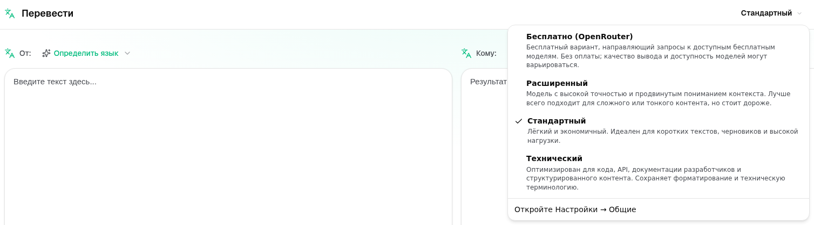

<a id="transrewrt-user-guide"></a>
# Руководство пользователя

<br/>

<a id="introduction"></a>
## Введение

Transrewrt помогает работать с текстом тремя основными способами:

- **Перевести** — преобразовать текст с одного языка на другой.
- **Переписать** — переформулировать текст в другом стиле, например, более ясно, кратко или формально.
- **Преобразовать** — обработать текст с помощью пользовательских инструкций ИИ, называемых запросами.

По умолчанию приложение работает в режиме **Простой**: вы выбираете **пресет** (например, Бесплатно (OpenRouter), Стандартный, Расширенный или Технический) и **поставщика** в разделе Настройки, не указывая идентификаторы моделей. Переключитесь на **Расширенный** режим в разделе [**Настройки** > **Основные настройки**](#general-settings), если хотите использовать классический список моделей из раздела [**Настройки** > **Модели**](#models).

<br/>

В этом руководстве объясняется, как использовать приложение после его установки и запуска. Пошаговую инструкцию по установке см. в основном файле [**README**](README.ru.md).

<br/>

> ℹ️ **ПРИМЕЧАНИЕ**<br/>
> Transrewrt доступен как настольное приложение для Windows и Linux, а также как веб-приложение для самостоятельного размещения. В этом руководстве основное внимание уделяется повседневному использованию приложения. Если какая-то функция относится только к одной версии, это четко указано.

<small>**Читать на других языках:** </small>
<small id="lang-list">[English (UK)](../USER-GUIDE.md) · [Português (Brasil)](./USER-GUIDE.pt-BR.md) · [العربية](./USER-GUIDE.ar.md) · [বাংলা](./USER-GUIDE.bn.md) · [Català](./USER-GUIDE.ca.md) · [简体中文](./USER-GUIDE.zh-Hans.md) · [繁體中文](./USER-GUIDE.zh-Hant.md) · [Hrvatski](./USER-GUIDE.hr.md) · [Čeština](./USER-GUIDE.cs.md) · [Nederlands](./USER-GUIDE.nl.md) · [English (US)](./USER-GUIDE.en-US.md) · [Tagalog](./USER-GUIDE.tl.md) · [Français](./USER-GUIDE.fr.md) · [Deutsch](./USER-GUIDE.de.md) · [Ελληνικά](./USER-GUIDE.el.md) · [Hindi (Roman)](./USER-GUIDE.hi-Latn.md) · [Magyar](./USER-GUIDE.hu.md) · [Italiano](./USER-GUIDE.it.md) · [日本語](./USER-GUIDE.ja.md) · [한국어](./USER-GUIDE.ko.md) · [Bahasa Melayu](./USER-GUIDE.ms.md) · [فارسی](./USER-GUIDE.fa.md) · [Polski](./USER-GUIDE.pl.md) · [Basa Jawa](./USER-GUIDE.jv.md) · [Português](./USER-GUIDE.pt.md) · [پنجابی](./USER-GUIDE.pa-PK.md) · [Română](./USER-GUIDE.ro.md) · [Русский](./USER-GUIDE.ru.md) · [Slovenčina](./USER-GUIDE.sk.md) · [Español](./USER-GUIDE.es.md) · [Kiswahili](./USER-GUIDE.sw.md) · [Svenska](./USER-GUIDE.sv.md) · [తెలుగు](./USER-GUIDE.te.md) · [ไทย](./USER-GUIDE.th.md) · [Türkçe](./USER-GUIDE.tr.md) · [Українська](./USER-GUIDE.uk.md) · [Tiếng Việt](./USER-GUIDE.vi.md)</small>

<small>

> **Примечание о переводах интерфейса и документации:** Все языки интерфейса, кроме оригинального английского (Великобритания),
> были переведены с помощью моделей ИИ; формулировки могут быть неточными или содержать ошибки.

</small>

<br/>

<!-- START doctoc generated TOC please keep comment here to allow auto update -->
<!-- DON'T EDIT THIS SECTION, INSTEAD RE-RUN doctoc TO UPDATE -->
**Содержание**

- [Перед началом](#before-you-start)
  - [Как получить бесплатный API-ключ OpenRouter (настольное приложение)](#how-to-get-a-free-openrouter-api-key-desktop-app)
- [Начало работы](#getting-started)
- [Основные элементы окна](#main-parts-of-the-window)
  - [Боковая панель](#sidebar)
  - [Панель инструментов](#toolbar)
  - [Панели ввода и вывода](#input-and-output-panels)
- [Перевести](#translate)
  - [Перевести текст](#translate-text)
  - [Выбор языка](#language-selection)
  - [Полезные настройки перевода](#helpful-translation-settings)
  - [Уточнение перевода](#refining-your-translation)
  - [Использование глоссария](#using-the-glossary)
- [Перезапись](#rewrite)
  - [Перезапись текста](#rewrite-text)
  - [Уточнение перезаписи](#refining-your-rewrite)
- [Преобразование](#transform)
  - [Запуск существующего запроса](#run-an-existing-prompt)
  - [Если у вас еще нет запросов](#if-you-have-no-prompts-yet)
  - [Быстрое создание запроса](#create-a-prompt-quickly)
  - [Изменение запроса](#edit-a-prompt)
  - [Тестирование запроса перед использованием](#test-a-prompt-before-using-it)
- [Панель управления](#dashboard)
  - [Фильтрация данных](#filter-the-data)
  - [Вкладки панели управления](#dashboard-tabs)
  - [Экспорт данных](#export-data)
  - [Удаление сохраненных записей для модели](#delete-stored-records-for-a-model)
- [История](#history)
  - [Фильтрация истории](#filter-the-history)
  - [Экспорт данных истории](#export-history-data)
- [Настройки](#settings)
  - [Общие настройки](#general-settings)
  - [Модели](#models)
  - [Языки](#languages)
  - [Отслеживание затрат](#cost-tracking)
  - [Преобразование (вкладка настроек)](#transform-settings-tab)
  - [Глоссарий (вкладка настроек)](#glossary-settings-tab)
  - [Пользователи](#users)
  - [Конфигурация API](#api-config)
  - [О программе](#about)
- [Распространенные проблемы](#common-issues)
  - [Приложение не переводит, не переписывает и не преобразует текст](#the-app-will-not-translate-rewrite-or-transform-text)
  - [Список моделей пуст](#the-model-list-is-empty)
  - [Результат слишком медленный или слишком дорогой](#the-result-is-too-slow-or-too-expensive)
  - [Интерфейс на неправильном языке](#the-interface-is-in-the-wrong-language)
  - [Текст слишком мелкий или трудночитаемый](#the-text-is-too-small-or-hard-to-read)
  - [Сводка панели управления выглядит пустой](#dashboard-summary-looks-empty)
  - [Стоимость отображается как «недоступно» или кажется неверной](#cost-shows-not-available-or-seems-wrong)
  - [Общая стоимость не соответствует счету моего провайдера](#total-cost-does-not-match-my-provider-bill)
  - [Страница «История» отсутствует на боковой панели](#the-history-page-is-missing-from-the-sidebar)
  - [Веб-приложение: неожиданно перенаправлено на страницу входа](#web-app-redirected-to-the-login-page-unexpectedly)
  - [Веб-администратор: забыл или потерял пароль](#web-admin-forgot-or-lost-a-password)
  - [Панель управления не показывает данные для других пользователей (веб)](#dashboard-shows-no-data-for-other-users-web)
  - [Я изменил запрос и потерял изменения](#i-changed-a-prompt-and-lost-the-edits)
- [Краткие советы](#quick-tips)
- [Отказ от ответственности](#disclaimer)
- [Лицензия](#license)

<!-- END doctoc generated TOC please keep comment here to allow auto update -->

<br/><br/>

<a id="before-you-start"></a>
## Перед началом

Для использования Transrewrt вам нужен доступ хотя бы к одному ИИ-провайдеру. Поддерживаемые провайдеры: [OpenRouter](https://openrouter.ai) (который агрегирует множество моделей), OpenAI, Anthropic, Google Gemini, DeepSeek, Groq, Mistral, xAI, Cerebras, NVIDIA, Alibaba Cloud, apikey.fun, любой OpenAI-совместимый провайдер и [Ollama](https://ollama.com) для локальных моделей.

Вам не нужно выбирать платную модель для начала работы. Как только вы добавите свой ключ API OpenRouter, приложение автоматически включит встроенный **бесплатный** вариант OpenRouter. Это позволит вам сразу же начать переводить, переписывать и преобразовывать текст. В качестве альтернативы вы также можете получить бесплатный ключ API от Cerebras, Google, Groq, Mistral AI или [NVIDIA](https://build.nvidia.com/) (API, совместимый с OpenAI).

Простыми словами:

- В режиме **Простой** **пресет** (Бесплатно (OpenRouter), Стандартный, Расширенный или Технический) сопоставляется с моделью выбранного вами **поставщика** (OpenRouter, OpenAI, Ollama и другие). В панели инструментов отображаются только те пресеты, для которых есть сопоставление с текущим поставщиком. Вы выбираете пресет при выполнении действий Перевести, Переписать и Преобразовать.
- В режиме **Расширенный** **модель** — это ИИ-движок, который вы выбираете напрямую. Идентификаторы моделей используют **префикс поставщика** (например, `openrouter/…`, `openai/…`, `ollama/…`).
- **Ключ API** (или для Ollama — **базовый URL**) используется приложением для подключения к поставщику.

Если вы используете **настольное приложение**, добавьте ключи в разделе [**Настройки** > **Конфигурация API**](#api-config) для каждого используемого поставщика. Если вы используете только OpenRouter, см. ниже раздел [Как получить бесплатный ключ API OpenRouter](#how-to-get-a-free-openrouter-api-key-desktop-app). Если вы не хотите использовать ключ API, вы можете установить Ollama (с сайта [ollama.com](https://ollama.com)) и использовать локальные модели, например `translategemma:4b`.

Если вы используете **веб-версию**, поставщики настраиваются владельцем сервера через переменные окружения, поэтому вы не можете напрямую ввести API-ключи в приложении.

<br/>

<a id="how-to-get-a-free-openrouter-api-key-desktop-app"></a>
### Как получить бесплатный ключ API OpenRouter (настольное приложение)

Если вы используете настольное приложение, выполните следующие шаги:

1. Перейдите на сайт [OpenRouter](https://openrouter.ai) в веб-браузере.
2. Создайте учётную запись или войдите в неё.
3. Откройте страницу [Keys](https://openrouter.ai/keys).
4. Нажмите кнопку для создания нового API-ключа.
5. Присвойте ключу имя, чтобы вы могли распознать его позже.
6. Скопируйте новый API-ключ.
7. Вернитесь в Transrewrt и откройте **Настройки** > **Конфигурация API**.
8. Вставьте ключ в поле **OpenRouter API key** (в разделе **Настройки** > **Конфигурация API**).
9. Нажмите **Тест ключа OpenRouter**, чтобы убедиться, что он работает.

<br/><br/>

<a id="getting-started"></a>
## Начало работы

Если вы впервые используете Transrewrt, следуйте этому порядку:

1. Откройте приложение.
2. При необходимости выберите **Язык интерфейса** с помощью значка глобуса.
3. Если вы используете **настольное приложение**, откройте [**Настройки** > **Конфигурация API**](#api-config), добавьте ключ API хотя бы для одного поставщика (например, OpenRouter) и нажмите **Тест**, чтобы проверить его работу.
4. Откройте [**Настройки** > **Основные настройки**](#general-settings). В режиме **Простой** (по умолчанию) выберите **Поставщика**, для которого настроен ключ. В режиме **Расширенный** откройте [**Настройки** > **Модели**](#models) и добавьте одну или несколько моделей в раздел **Выбранные модели**.
5. При нажатии на **Перевести** выберите **пресет** (Простой) или **модель** (Расширенный) на панели инструментов.
6. Откройте [**Настройки** > **Языки**](#languages) и выберите **Основные языки**, чтобы часто используемые языки отображались в начале списка.
7. Выполните простой перевод, чтобы убедиться, что всё работает, затем попробуйте **Переписать** и **Преобразовать**.

Этот порядок важен. Он предотвращает наиболее распространённую проблему при первом использовании: попытку выполнить задачу до того, как приложение установит рабочее подключение к API или выберет пресет/модель.

<br/><br/>

<a id="main-parts-of-the-window"></a>
## Основные части окна

Приложение разделено на три основные области:

- **Боковая панель** слева.
- **Панель инструментов** сверху.
- **Рабочая область** в центре.

<br/>

<a id="sidebar"></a>
### Боковая панель

Используйте боковую панель для навигации по приложению. Вы можете свернуть боковую панель, чтобы освободить место, нажав на значок рядом с логотипом приложения.

<br/>

<table>
  <tr>
    <td valign="top">
       
    </td>
    <td valign="top">
      <br/><br/>
      <ul>
        <li><strong>Перевести</strong> открывает рабочую область перевода.</li><br/>
        <li><strong>Переписать</strong> открывает рабочую область переписывания.</li><br/>
        <li><strong>Преобразовать</strong> открывает рабочую область с пользовательским запросом.</li><br/>
        <li><strong>Панель управления</strong> отображает информацию об использовании и стоимости.</li><br/>
        <li><strong>Настройки</strong> открывает панель настроек.</li><br/>
        <li><strong>История</strong> отображает историю использования с текстом ввода и вывода</li><br/>
        <li><strong>Пользователь</strong> отображает имя вошедшего в систему пользователя (только в веб-версии).</li>
      </ul>
    </td>
  </tr>
</table>

<br/>

<a id="toolbar"></a>
### Панель инструментов

Панель инструментов немного изменяется в зависимости от того, где вы находитесь в приложении.

- Слева отображается имя текущей страницы.
- Справа находятся **выбор пресета или модели** и элемент управления **Язык интерфейса**.

В режиме **Простой** на панели инструментов отображается **выбор пресета** с встроенными пресетами **Бесплатно (OpenRouter)**, **Стандартный**, **Расширенный** и **Технический**. Набор доступных пресетов зависит от выбранного **поставщика** в разделе [**Настройки** > **Основные настройки**](#general-settings): например, **Бесплатно (OpenRouter)** отображается только при выборе поставщика OpenRouter. Если выбран **поставщик** **Ollama**, на панели инструментов отображаются установленные локальные модели вместо пресетов.

В режиме **Расширенный** **выбор модели** позволяет выбрать, какой движок ИИ использовать для текущей задачи.



В режиме Расширенный некоторые бесплатные модели могут быть недоступны — они могут быть отключены или достигнут лимит использования. Приложение может автоматически удалить такую модель из вашего списка. Чтобы управлять отображаемыми моделями, перейдите в раздел [**Настройки** > **Модели**](#models). Вы можете открыть настройки модели, нажав на значок поставщика слева от названия модели на панели инструментов.

<br/>

Значок **глобуса и код языка** изменяют язык интерфейса приложения, например, меню и кнопки. Они **не** влияют на языки перевода, используемые в функции **Перевести**.


<br/>

<a id="input-and-output-panels"></a>
### Панели ввода и вывода

Большинство рабочих областей используют левую панель **Ввод** и правую панель **Вывод**.

Каждая панель также отображает:

| **Ввод**                                                          | **Вывод**                                                                                                                  |
|--------------------------------------------------------------------|-----------------------------------------------------------------------------------------------------------------------------|
| - Количество символов <br/>- Количество слов <br/>- Количество абзацев   <br/> | - Время выполнения задачи<br/>- **TPS** (токенов в секунду)<br/>- Количество символов, слов и абзацев<br/>- Используемая модель |

Если вы не знакомы с техническими терминами:

- **Токен** означает небольшой фрагмент текста. Его можно представить как часть слова или короткое слово.
- **TPS** означает, сколько таких фрагментов текста модель обрабатывает за секунду.

<br/>

Вы также можете отслеживать стоимость каждой операции (если доступно) и общую стоимость, включив опцию `Show cost information on the actions` в разделе [**Настройки** > **Основные настройки**](#general-settings).

<br/><br/>

[--------------------------------------------------------------------------------------------------------------------------]: #

<a id="translate"></a>
## Перевести

Используйте **Перевести**, когда нужно преобразовать текст с одного языка на другой.


<br/>

<a id="translate-text"></a>
### Перевести текст

1. Откройте **Перевести**.
2. Выберите язык в поле **С**.
3. Выберите язык в поле **На**.
4. Выберите пресет (Простой) или модель (Расширенный) на панели инструментов.
5. Введите или вставьте текст во **Ввод**.
6. Нажмите **Перевести**.
7. Прочитайте результат во **Выводе**.
8. Используйте кнопку копирования, если хотите скопировать результат.
9. При желании уточните результат с помощью **Перефразировать…** или альтернатив слов — смотрите [Уточнение вашего перевода](#refining-translation).

<br/>

<a id="language-selection"></a>
### Выбор языка

- **От** может быть конкретным языком или **Определить язык**.
- **До** — это язык, на который вы хотите перевести результат.

Ваши выбранные **Основные языки** отображаются в верхней части списка. Вы можете задать их в разделе [**Настройки** > **Языки**](#languages).

<br/>

<a id="helpful-translation-settings"></a>
### Полезные настройки перевода

В разделе [**Настройки** > **Основные настройки**](#general-settings) можно изменить поведение перевода:

- **Автоматическое выполнение при вставке** запускает перевод, как только вы вставляете текст.
- **Автоматическое копирование результата в буфер обмена** автоматически копирует результат после успешного выполнения.
- **Перевод в реальном времени во время ввода** (⚠️ Это может увеличить затраты на использование) выполняет переводы, пока вы вводите текст.
- **Таймаут (мс)** контролирует, как долго приложение ждет перед выполнением перевода в реальном времени.
- **Поведение для ENTER** выбирает, будет ли `Enter` выполнять задачу или вставлять новую строку:
  - **Enter** выполняет перевод или перезапись (по умолчанию).
  - **Shift + Enter** выполняет перевод или перезапись; обычный **Enter** вставляет новую строку.

<br/>

<a id="refining-translation"></a>
### Уточнение вашего перевода

После успешного перевода **Перефразировать…** и выпадающее меню версий появляются в заголовке вывода, рядом с селектором языка **Куда:**. Вы можете уточнить результат там:

1. **Перефразировать…** — если в выводе не выбран текст, получите еще один полный перевод того же ввода с другой формулировкой. Модель получает все уже имеющиеся у вас версии, поэтому новая формулировка может отличаться от всех из них. Вы можете хранить до **пяти** версий и переключаться между ними в раскрывающемся списке версий. При выбранном тексте **Перефразировать…** открывает варианты слов рядом с выделением (то же самое, что и правый щелчок). Без выделения **Перефразировать…** отключается после достижения пяти версий; с выделением оно все еще работает при пяти версиях (только варианты слов, обновляя версию 5). Пока выполняется полное перефразирование, нажмите **Остановить перевод**, чтобы отменить; вывод возвращается к версии, которая была активна при запуске перефразирования.
2. **Варианты слов** — выберите одно или несколько слов или короткую фразу в выводе (если вы выберете только часть слова, приложение расширит выделение до полных слов), затем щелкните правой кнопкой мыши или нажмите **Перефразировать…**. Рядом с выделением появится короткий список вариантов; щелкните один, чтобы заменить его. Каждый вариант может заменить немного более широкий диапазон, чем ваше выделение (например, соседний предлог или артикль), чтобы предложение оставалось грамматически правильным. Если у вас меньше пяти версий, отредактированный вывод сохраняется как новая версия; при пяти версиях обновляется только **версия 5**. Щелчок правой кнопкой мыши без выделения выбирает слово под курсором (или ничего не делает, если там нет слова). Нажмите **Esc** или щелкните за пределами списка, чтобы отменить без изменения вывода.
3. **Затраты** — каждое полное **Перефразировать…** (без выделения) и каждый запрос варианта слова снова используют модель и могут увеличить стоимость использования (так же, как обычный запуск перевода).

<br/>

<a id="using-the-glossary"></a>
### Использование глоссария

**Глоссарий** — это список пар исходных/целевых терминов для конкретной языковой пары. Когда глоссарий включен, Transrewrt отправляет соответствующие термины в модель, чтобы ваши предпочтительные формулировки оставались последовательными в переводах (например, название продукта, фирменный термин или должность, которые всегда должны переводиться одинаково).

Чтобы использовать его на странице **Перевести**:

1. Включите переключатель **Глоссарий** в панели ввода (рядом с переключателями автовыполнения и автокопирования).
2. Выберите языки **Откуда** и **Куда** и переводите как обычно. Термины, сохраненные для этой языковой пары, применяются автоматически.
3. Чтобы добавить новую пару на лету, нажмите **Добавить в глоссарий** (рядом с селектором языка **Откуда:**). Диалоговое окно будет предварительно заполнено вашими текущими языками, поэтому вам останется только ввести **исходный термин** и **целевой термин**.
4. Используйте ссылку **Глоссарий** в нижнем колонтитуле вывода (или ссылку **Управление глоссарием** в диалоговом окне), чтобы перейти к [**Настройки** > **Глоссарий**](#glossary-settings) и просмотреть все свои термины.

Вы добавляете, изменяете, импортируете и экспортируете термины на вкладке [**Настройки** > **Глоссарий**](#glossary-settings) — см. ниже.

<br/>

> ℹ️ **ПРИМЕЧАНИЕ**<br/>
> Термины глоссария сопоставляются по **языковой паре**, поэтому термин, сохраненный для английского → французского, не применяется при переводе с английского → немецкого. Глоссарий не может использоваться с функцией **Определить язык** в качестве источника, поскольку для сопоставления терминов требуется конкретный исходный язык.

[--------------------------------------------------------------------------------------------------------------------------]: #

<a id="rewrite"></a>
## Переписать

Используйте **Перезапись**, когда вы хотите улучшить формулировку, не меняя основного значения. Текст остается на том же языке (он не переводится).


Это полезно для:

- исправление орфографии и грамматики (**Проверка орфографии и грамматики**)
- повышение ясности текста (**Повысить ясность**)
- несколько различных вариантов переформулировки за один запуск (**Альтернативные варианты**)
- придать тексту более формальный или неформальный стиль (**Сделать формальным** / **Сделать неформальным**)
- сокращения или расширения текста (**Сократить** / **Расширить**)
- придания тексту более технического стиля (**Сделать техническим**)

<br/>

<a id="rewrite-text"></a>
### Перезапись текста

1. Откройте **Перезапись**.
2. Выберите **Режим** (например, **Улучшить ясность** или **Сделать формальным**).
3. При необходимости установите **Откуда** на язык вашего текста (или оставьте **Определить язык**).
4. Введите или вставьте текст в **Ввод**.
5. Нажмите **Перезапись**.
6. Прочитайте результат в **Вывод**.
7. При необходимости уточните результат с помощью **Перефразировать…** или вариантов слов — см. [Уточнение перезаписи](#refining-rewrite).

<br/>

> 💡 **СОВЕТ**<br/>
> При использовании режима "**Проверка орфографии и грамматики**" во вкладке вывода появляется переключатель **Показать изменения** (рядом с **Копировать**).
> Включите или выключите его, чтобы показать или скрыть конкретные исправления, применённые к вашему тексту.

<br/>

> ℹ️ **ПРИМЕЧАНИЕ**<br/>
> Режим перезаписи **Альтернативные версии** возвращает несколько переформулировок за **один** запуск, разделенных `----` в выводе. Это отличается от **Перефразировать…**, который со временем создает историю версий (один новый вариант за клик). См. [Уточнение перезаписи](#refining-rewrite).

<br/>

<a id="refining-rewrite"></a>
### Уточнение перезаписи

После успешной перезаписи **Перефразировать…** и выпадающий список версий появляются на стороне вывода рабочей области (в разделенном макете, на верхней панели инструментов над столбцом вывода, рядом с метриками выполнения; в стековом макете, над панелью вывода рядом с **Откуда:**). Вы можете уточнить результат там — та же идея, что и [Уточнение перевода](#refining-translation), но текст остается на том же языке и сохраняет текущий **Режим** перезаписи:

1. **Перефразировать…** — если в выводе не выбран текст, получите еще одну полную перезапись того же ввода с другой формулировкой, по-прежнему применяя выбранный режим (например, более ясный, короткий или более формальный). Модель получает каждую уже имеющуюся у вас версию, поэтому новая формулировка может отличаться от всех из них. Вы можете сохранить до **пяти** версий и переключаться между ними в выпадающем списке версий. Если текст выбран, **Перефразировать…** открывает варианты слов рядом с выделением (то же, что и правый клик). Без выделения **Перефразировать…** отключается, как только вы достигаете пяти версий; с выделением он по-прежнему работает при пяти версиях (только варианты слов, обновляя версию 5). Пока выполняется полное перефразирование, нажмите **Остановить перезапись**, чтобы отменить; вывод вернется к версии, которая была активна при запуске перефразирования.
2. **Варианты слов** — выберите одно или несколько слов или короткую фразу в выводе (если вы выберете только часть слова, приложение расширит выделение до полных слов), затем щелкните правой кнопкой мыши или нажмите **Перефразировать…**. Рядом с выделением появится короткий список вариантов; нажмите на один из них, чтобы заменить. Каждый вариант может заменить немного более широкий диапазон, чем ваше выделение, чтобы предложение оставалось грамматически правильным. Если у вас меньше пяти версий, отредактированный вывод сохраняется как новая версия; при пяти версиях обновляется только **версия 5**. Щелчок правой кнопкой мыши без выделения выбирает слово под курсором (или ничего не делает, если там нет слова). Нажмите **Esc** или щелкните за пределами списка, чтобы отменить без изменения вывода.
3. **Стоимость** — каждое полное **Перефразировать…** (без выделения) и каждый запрос на вариант слова снова используют модель и могут увеличить стоимость использования (так же, как обычный запуск перезаписи).

<br/><br/>

[--------------------------------------------------------------------------------------------------------------------------]: #

<a id="transform"></a>
## Преобразовать

Используйте **Преобразовать**, когда хотите, чтобы ИИ следовал вашим собственным инструкциям.


Это наиболее гибкая часть приложения. Вы можете использовать её для задач, таких как:

- краткое изложение заметок
- превращение чернового текста в готовое письмо
- выделение ключевых моментов
- преобразование текста в определённый формат
- любые другие пользовательские действия с входным текстом

<br/>

<a id="run-an-existing-prompt"></a>
### Выполнить существующий запрос

1. Откройте **Преобразование**.
2. Выберите подсказку из списка подсказок.
3. Если появляется поле языка **Из**, выберите язык, если он вам нужен.
4. Введите или вставьте текст в **Ввод**.
5. Нажмите **Преобразовать**.
6. Прочитайте результат в поле **Вывод**.

<br/>

<a id="if-you-have-no-prompts-yet"></a>
### Если у вас ещё нет запросов

Если ваш список запросов пуст, нажмите **Загрузить примеры запросов** в рабочей области Преобразовать. Эта же кнопка всегда доступна в разделе [**Настройки** > **Преобразовать**](#transform-settings) в строке экспорта/импорта. Оба действия добавляют встроенные примеры, чтобы вы могли начать быстрее.

<br/>

> ℹ️ **ПРИМЕЧАНИЕ**<br/>
> Примеры запросов предоставляются на английском языке. После загрузки вы можете отредактировать запрос и использовать **Перевести запрос**, чтобы перевести его на {{your language}}.

<br/>

<a id="create-a-prompt-quickly"></a>
### Быстро создать запрос

Самый быстрый способ создать запрос:

1. Нажмите **Новый запрос**.
2. Нажмите **Создать запрос**.
3. Опишите, что вы хотите, чтобы делал запрос.
4. Выберите пресет (Простой) или модель (Расширенный).
5. Дайте приложению создать черновик.
6. Проверьте черновик и нажмите **Сохранить**.


<br/>

<a id="edit-a-prompt"></a>
### Изменить запрос

Когда вы создаёте или редактируете запрос, редактор отображается слева, а область тестирования — справа.


Основные поля:

- **Название запроса**: имя, отображаемое в списке запросов.
- **Инструкции к запросу (необязательно)**: краткая подсказка, отображаемая пользователю при выполнении запроса.
- **Роль модели**: общая роль, назначенная ИИ, например: «Вы — полезный помощник».
- **Инструкции для модели (по одной на строку)**: конкретные правила, которым должен следовать ИИ.
- **Описание вывода (например, преобразованный, резюмированный и т.д.)**: короткое слово, описывающее результат.
- **Температура (0.0 → 1.0)**: как будет вести себя модель; смотрите ниже.
- **Запросить целевой язык**: добавляет селектор языка при выполнении подсказки.
Если технический термин **Температура** вам нов, подумайте об этом так:

- **Низкое** значение температуры даёт более стабильные и предсказуемые результаты.
- **Высокое** значение температуры даёт больше разнообразия и креативности.

Вы также можете использовать:

- `Generate prompt` — чтобы создать новый черновик на основе простого описания
- `Improve prompt` — чтобы улучшить существующий запрос
- `Translate prompt` — чтобы перевести поля запроса

<br/>

> ⚠️ **ВНИМАНИЕ**<br/>
> Нажимайте `Save` перед тем, как нажать `Back to Run`. Если вы вернётесь назад без сохранения, все изменения будут потеряны.

<br/>

<a id="test-a-prompt-before-using-it"></a>
### Протестировать запрос перед использованием

Панель тестирования справа позволяет попробовать ваш запрос с примером текста, прежде чем использовать его в повседневной работе.

Это полезно, когда:

- вы создаете новый запрос
- вы сравниваете две версии запроса
- вы хотите проверить тон, длину или формат вывода

<br/>

> ℹ️ **ПРИМЕЧАНИЕ**<br/>
> Вы можете экспортировать и импортировать сохранённые запросы в разделе [**Настройки** > **Преобразовать**](#transform-settings).

При использовании функций **Создать запрос**, **Улучшить запрос** или **Перевести запрос** в редакторе запросов режим **Простой** предлагает тот же выбор пресетов, что и в функциях Перевести и Переписать; режим **Расширенный** использует список моделей.

<br/><br/>

[--------------------------------------------------------------------------------------------------------------------------]: #

<a id="dashboard"></a>
## Панель управления

Используйте **Панель управления**, чтобы увидеть, насколько активно вы используете приложение, и сколько это стоит (для платных моделей).


<br/>

> ℹ️ **ПРИМЕЧАНИЕ**<br/>
> Если вы используете только **бесплатные** модели, суммы **стоимости** могут быть нулевыми, а показатели, ориентированные на стоимость, могут выглядеть пустыми. На вкладке **Сводка** всё равно отображаются количество вызовов для функций перевода, переписывания и преобразования при наличии активности за выбранный период.

<br/>

<a id="filter-the-data"></a>
### Фильтрация данных

Используйте кнопки фильтрации в верхней части, чтобы изменить временной диапазон.


<br/>

> ℹ️ **ПРИМЕЧАНИЕ**<br/>
> Фильтр **Пользователь** отображается только администраторам в веб-версии. Обычные пользователи не видят этот фильтр, и он недоступен в настольном приложении.

<br/>

<a id="dashboard-tabs"></a>
### Вкладки панели управления

- **Сводка** отображает карточки ключевых показателей эффективности: общая стоимость, используемые модели, количество вызовов и стоимость по режимам (с долей от общего количества вызовов), средняя стоимость вызова, средний TPS и три модели с наибольшим количеством вызовов.
- **По модели** перечисляет каждую модель с общим количеством вызовов, общей стоимостью и средним TPS; разверните строку, чтобы увидеть детализацию по функциям перевода, переписывания и преобразования.
- **Все вызовы** отображает полный журнал вызовов (в виде таблицы на широких экранах, карточек — на узких) и позволяет экспортировать его.

<br/>

<a id="export-data"></a>
### Экспорт данных

Таблицы панели управления позволяют экспортировать данные в форматах:

- **JSON**
- **CSV**
- **XLSX**

Это полезно, если вы хотите просмотреть активность вне приложения или поделиться отчётом.

<br/>

<a id="delete-stored-records-for-a-model"></a>
### Удаление сохранённых записей для модели

В разделах **По модели** или **Все вызовы** вы можете удалить сохранённые записи для модели, нажав на значок «корзины».

> ⚠️ **ВНИМАНИЕ**<br/>
> Удаление сохранённых записей необратимо. Используйте эту функцию, только если вы уверены, что больше не нуждаетесь в этой истории.

Чтобы удалить все данные или записи на основе их возраста, перейдите в раздел [**Настройки** > **Отслеживание стоимости**](#cost-tracking). Там вы найдёте опции для удаления всех сохранённых данных или только данных, старше определённой даты.

<br/><br/>

[--------------------------------------------------------------------------------------------------------------------------]: #

<a id="history"></a>
## История

Нажмите на **История**, чтобы просмотреть историю ваших действий в **Transrewrt**, включая ввод и вывод каждой операции.


<br/>

<a id="filter-the-history"></a>
### Фильтрация истории

**История** использует те же фильтры по диапазону времени, что и страница **Панель управления**.


<br/>

> ℹ️ **ПРИМЕЧАНИЕ**<br/>
> В **веб-приложении** все пользователи (включая администраторов) видят только свою собственную историю выполнения. Фильтр **Пользователь** на странице **Панель управления** предназначен для того, чтобы администраторы могли просматривать использование и стоимость по разным аккаунтам; он не применяется к вкладке **История**.

<br/>

<a id="export-history-data"></a>
### Экспорт данных истории

На странице истории можно экспортировать отфильтрованные данные в формате:

- **JSON**
- **CSV**
- **XLSX**

Это полезно, если вы хотите просмотреть активность вне приложения или поделиться отчётом.

<br/><br/>

[--------------------------------------------------------------------------------------------------------------------------]: #

<a id="settings"></a>
## Настройки

Откройте **Настройки** в боковом меню, чтобы настроить поведение приложения.

Доступные вкладки зависят от платформы и вашей роли:

| Вкладка              | Настольная версия | Веб (администратор) | Веб (обычный пользователь) | Примечания                                        |
  |------------------|:-------:|:-----------:|:------------------:|----------------------------------------------|
  | Основные настройки |   да   |     да     |        да         | Включает **Опыт с ИИ** (Простой / Расширенный) |
  | Модели           |   да   |     да     |        да         | Доступно только при **Расширенном** **Опыте с ИИ** |
  | Языки        |   да   |     да     |        да         |                                              |
  | Отслеживание стоимости    |   да   |     да     |         -          |                                              |
  | Преобразовать        |   да   |     да     |        да         | Пакетный импорт/экспорт запросов преобразования      |
  | Глоссарий        |   да   |     да      |        да         | Пары терминов, примененные во время перевода |
  | Пользователи            |    -    |     да     |         -          |                                              |
  | Конфигурация API       |   да   |     да     |         -          |                                              |
  | О программе            |   да   |     да     |        да         |                                              |

В режиме **Простой** выбор модели осуществляется через пресеты на панели инструментов и **поставщика** в разделе Основные настройки; вкладка **Модели** скрыта.

<br/>

> ℹ️ **ПРИМЕЧАНИЕ**<br/>
> В веб-версии каждый пользователь имеет собственную конфигурацию. Настройки, такие как опыт с ИИ, поставщик, выбранные модели или пресеты, языки, общие параметры и запросы для преобразования, хранятся для каждого пользователя отдельно. Внесённые вами изменения не влияют на других пользователей.

<br/>

[--------------------------------------------------------------------------------------------------------------------------]: #

<a id="general-settings"></a>
### Основные настройки

Используйте **Основные настройки**, чтобы управлять поведением при вводе текста, сохранением деталей выполнения для **Истории**, внешним видом и выбором ИИ для функций Перевести, Переписать и Преобразовать.

**Опыт с ИИ**

- **Простой** (по умолчанию): выберите **поставщика** (OpenRouter, OpenAI, Anthropic, Google Gemini, DeepSeek, Groq, Mistral, xAI, Cerebras или Ollama). Для облачных поставщиков используются встроенные пресеты на панели инструментов. **Ollama** отображает модели, установленные на вашем компьютере, вместо пресетов. В режиме Простой **Каталог пресетов** показывает версию каталога и время последнего обновления; нажмите **Обновить каталог пресетов**, чтобы получить актуальный список пресетов из репозитория проекта (приложение также периодически проверяет обновления в фоновом режиме).
- **Расширенный**: выбирайте отдельные модели на панели инструментов; управляйте списком в разделе [**Настройки** > **Модели**](#models).

**Внешний вид**

- **Тема** позволяет переключаться между светлой, тёмной и системной темой оформления.
- **Показывать информацию о стоимости в действиях** включает отображение стоимости операции (если доступно) и общей стоимости на панелях вывода Перевести, Переписать и Преобразовать.
- **Количество знаков после запятой в стоимости** изменяет отображение десятичных разрядов стоимости.
- **Только для веб-версии:** **показывать отступ вокруг приложения** добавляет дополнительное пространство вокруг интерфейса.
- **Семейство шрифтов** изменяет шрифт в текстовых полях.
- **Размер** изменяет размер шрифта.

**Поведение**

- **Поведение для ENTER** выбирает, будет ли `Enter` выполнять задачу или вставлять новую строку.
- **Автоматическое выполнение при вставке** начинает перевод, как только вы вставляете текст.
- **Автоматическое копирование результата в буфер обмена** автоматически копирует успешные результаты.
- **Перевод в реальном времени во время ввода** (⚠️ Это может увеличить затраты на использование) переводит, пока вы вводите текст.
- **Тайм-аут (мс)** задаёт время ожидания для перевода в реальном времени.

**История**

- **Сохранять историю выполнения** управляет тем, сохраняются ли для каждого перевода, переписывания и преобразования **входной и выходной текст** для просмотра в боковой панели [**История**](#history). При отключении появляется запрос на подтверждение; при подтверждении сохранённый текст истории удаляется из базы данных. Если отображается надпись *отключено администратором*, в вашей установке установлено значение `HISTORY_DISABLED` в переменных окружения (см. [README](README.ru.md#configuration-and-environment)); вы не можете снова включить историю через пользовательский интерфейс.
- **Удалить данные истории** позволяет удалять сохранённый текст по возрасту (например, старше нескольких месяцев или **все данные (очистить)**) с помощью **Удалить данные**. Это влияет только на сохранённый текст выполнения для просмотра **Истории**; при этом **не** удаляются данные о стоимости или объёме использования. Чтобы удалить или очистить данные о **стоимости**, используйте [**Настройки** > **Отслеживание стоимости**](#cost-tracking).

**Резервное копирование конфигурации** (только для администраторов настольного приложения и веб-приложения)
- **Включить данные об использовании в резервную копию** - при включении ZIP также содержит историю выполнения и данные вызовов API.
- **Создать резервную копию конфигурации** - создает один ZIP (`transrewrt-config-backup-YYYY-MM-DD_HHMMSS.zip` по местному времени) с `config.json`, `state.json`, необязательным ключом шифрования, пользователями, предпочтениями, пользовательскими подсказками и данными об использовании, если вы согласились. После успешного резервного копирования подтверждение показывает имя сохраненного файла.
- **Восстановить из резервной копии** - сначала открывает **диалог подтверждения**. Выберите ZIP резервной копии внутри диалога (**Обзор** / выбор файла или перетаскивание, где поддерживается), затем просмотрите параметры:
  - **Восстановить данные об использовании** - импортировать данные об использовании/истории из ZIP, когда он был создан с включенными данными об использовании; оставьте выключенным, если вы хотите только настройки и подсказки.
  - **Очистить старые данные об использовании перед восстановлением** - удалить существующие данные об использовании/истории на этой установке перед применением резервной копии (необязательно; используйте, когда хотите сделать чистую замену).
Резервные копии, созданные в веб-версии или настольной версии, могут быть восстановлены в другой. При восстановлении резервной копии настольного приложения в веб-версии данные будут восстановлены для администратора.

<br/>

<a id="models"></a>
### Модели

Эта вкладка доступна только при установке параметра **Опыт с ИИ** в значение **Расширенный** в разделе [**Основные настройки**](#general-settings). Используйте **Настройки** > **Модели**, чтобы выбрать, какие модели отображаются в панели инструментов.


На странице представлены два списка:

- **Доступные модели** слева
- **Выбранные модели** справа

Полезные элементы управления включают:

- **Поиск моделей...**, чтобы найти модель по имени
- Фильтры **Поставщик**, чтобы сузить список до одного движка (OpenRouter, OpenAI, Ollama и т.д.)
- **Только бесплатные**, чтобы показать только бесплатные модели
- **Обновить**, чтобы перезагрузить список
- **Развернуть всё** и **Свернуть всё**, когда вы сортируете по поставщику

Идентификаторы моделей включают префикс поставщика (например, `openrouter/…` против `openai/…`). Значки, такие как **OpenAI (OpenRouter)** и **OpenAI (напрямую)**, показывают, как направляется трафик.

> ℹ️ **ПРИМЕЧАНИЕ**<br/>
> **OpenRouter Body Builder** (`openrouter/bodybuilder`) — это маршрутизирующая модель, а не общая модель чата: её ответ — это JSON, описывающий тело запроса к API OpenRouter (например, массив `requests` с `model` и `messages`). Если вы используете её для **Перевести**, **Переписать** или **Преобразовать**, на панели вывода будет показан этот JSON, а не готовый текст. Для этих задач выбирайте обычную текстовую модель. Подробнее на [странице модели Body Builder](https://openrouter.ai/openrouter/bodybuilder) на OpenRouter.

Действия:

- Чтобы добавить модель, нажмите **Добавить** или в любом месте записи.

- Чтобы удалить модель, нажмите **X** рядом с ней в разделе **Выбранные модели** или **Выбрано** в записи в списке Доступные модели.

- Чтобы очистить список, нажмите **Снять все**. Обязательная бесплатная модель останется в списке.

<br/>

> ℹ️ **ПРИМЕЧАНИЕ**<br/>
> Если вы не хотите сразу пополнять баланс на OpenRouter, начните с включения **Только бесплатные** и выберите бесплатные модели (без указания кредитной карты). Вы также можете использовать Ollama для запуска моделей локально без API-ключа.

<br/>

<a id="languages"></a>
### Языки

Используйте **Настройки** > **Языки**, чтобы управлять списками языков, используемых в приложении.

- **Основные языки** закреплены в верхней части списков языков в функциях **Перевести** и **Преобразовать**.
- **Пользовательский язык** позволяет добавить язык, отсутствующий в стандартном списке.

Если вы добавите пользовательский язык, он появится в селекторах языков вместе с встроенными вариантами.

<br/>

<a id="cost-tracking"></a>
### Отслеживание стоимости

Используйте **Настройки** > **Отслеживание стоимости**, чтобы управлять информацией о расходах.

- **Общая стоимость** показывает накопленную сумму.
- **Копировать значение** копирует общую сумму в буфер обмена.
- **Сбросить стоимость** сбрасывает накопленную сумму до нуля.
- **Синхронизировать с использованием API-ключа** устанавливает сумму в соответствии с данными использования, предоставленными вашей учетной записью OpenRouter (только для OpenRouter).
- **Использование API-ключа** показывает подробности использования OpenRouter, если доступно.
- **Удалить данные о стоимости** удаляет все данные или только записи, старше выбранной даты.

**Отслеживание стоимости:** При использовании моделей OpenRouter приложение отображает фактическое использование и расходы на основе данных о стоимости от OpenRouter. Для всех остальных поставщиков приложение оценивает расходы, используя цены, опубликованные OpenRouter; если цена недоступна, оценка может быть нулевой.

<br/>

> ℹ️ **ПРИМЕЧАНИЕ**<br/>
> **Все суммы являются оценочными и приведены только для справки, а не являются официальными счетами.**

<br/>

> ⚠️ **ВНИМАНИЕ**<br/>
> Удаление данных необратимо. Перед удалением обязательно сделайте резервную копию или экспортируйте данные через [**История**](#history)
> или [**Панель управления** > **Все вызовы**](#dashboard-tabs), иначе они будут безвозвратно утеряны.
> Вся история ввода/вывода, связанная с каждой записью вызова API, также будет удалена.

<br/>

<a id="transform-settings"></a>
### Преобразовать (вкладка настроек)

Используйте **Настройки** > **Преобразовать**, чтобы управлять запросами в массовом порядке.

Вы можете:

- просматривать сохранённые запросы
- удалять запросы
- импортировать запросы из файла
- экспортировать запросы для резервного копирования или обмена
- загружать примеры запросов в список запросов

<br/>

<a id="glossary-settings"></a>
### Глоссарий (вкладка настроек)

Используйте **Настройки** > **Глоссарий** для управления парами терминов, применяемыми при переводе (см. [Использование глоссария](#using-the-glossary)). Каждый термин имеет **исходный язык**, **целевой язык**, **исходный термин** и **целевой термин**.

Вы можете:

- **Добавить термин** — заполните строку внизу таблицы (выберите языки, введите исходный и целевой термины) и нажмите кнопку **+**.
- **Найти термины** — отфильтруйте список по **исходному языку**, **целевому языку** или по **тексту**; нажмите **Сбросить фильтры** для сброса.
- **Удалить термин** — нажмите значок корзины в его строке.
- **Импорт** — загрузите термины из файла `.csv`, `.xlsx` или `.xls`. Файл должен содержать столбцы `source_language`, `target_language`, `source_text` и `target_text`.
- **Экспорт CSV** / **Экспорт XLSX** — скачайте все ваши термины для резервного копирования или обмена.
- **Шаблон CSV** / **Шаблон XLSX** — скачайте пустой файл с правильными заголовками столбцов для заполнения и импорта.

<br/>

> ℹ️ **ПРИМЕЧАНИЕ**<br/>
> В **настольном приложении** глоссарий хранится локально. В **веб-версии** у каждого пользователя есть свой глоссарий, поэтому ваши термины не влияют на других пользователей.

<br/>

<a id="users"></a>
### Пользователи

Используйте раздел **Пользователи**, чтобы управлять учётными записями в веб-версии. Вы можете добавлять пользователей, редактировать их данные, сбрасывать пароли и удалять учётные записи.

<br/>

<a id="api-config"></a>
### Конфигурация API

Поддерживаемые провайдеры: OpenRouter, OpenAI, Anthropic, Google Gemini, DeepSeek, Groq, Mistral, xAI, Cerebras, NVIDIA, Alibaba Cloud, apikey.fun, **Ollama** (локальные модели через базовый URL) и необязательный **пользовательский OpenAI-совместимый провайдер** (имя, URL и API-ключ — только в расширенном режиме). Вам нужно настроить только те провайдеры, которые вы используете.

**Веб-приложение: только администратор**

Ключи API настраиваются через системные переменные среды или переменные среды Docker — они не вводятся в веб-интерфейсе. Для пользовательского провайдера установите `CUSTOM_PROVIDER_NAME`, `CUSTOM_PROVIDER_URL` и `CUSTOM_PROVIDER_API_KEY` (все три обязательны). На этой странице показано, для каких провайдеров настроен ключ, и вы можете протестировать каждый из них, нажав кнопку `Test`.

<br/>

> ℹ️ **ПРИМЕЧАНИЕ**<br/>
> Чтобы изменить ключ API, обновите переменную окружения в вашей системе или конфигурации Docker и перезапустите сервер или контейнер.

<br/>

> ℹ️ **ПРИМЕЧАНИЕ**<br/>
> **Резервные копии конфигурации** (см. [**Основные настройки** → Резервное копирование конфигурации](#general-settings)) могут включать **раскрытые** ключи поставщиков внутрь файла `config.json`. Восстановление этого архива **не** копирует эти ключи обратно в файл конфигурации сервера — действующие ключи по-прежнему берутся из переменных окружения и текущего состояния файла, как описано выше.

<br/>

**Приложение для ПК**

Используйте **Конфигурация API** для хранения API-ключей для каждого используемого вами провайдера. Для Ollama вместо API-ключа введите **базовый URL**. Для пользовательского OpenAI-совместимого провайдера (любой конечной точки, не входящей в встроенный список, например, собственный сервер или шлюз) введите **имя провайдера**, **базовый URL** (например, `https://my-llm.example.com/v1`) и **API-ключ**; все три поля обязательны. URL и имя редактируются в строке; используйте **Изменить** для замены API-ключа. Модели пользовательского провайдера отображаются только в **Расширенном** режиме (Настройки → Модели).

<br/>

> 💡 **Совет** <br/>
> Если вы не хотите использовать ключ API или платить за использование, вы можете [скачать Ollama](https://ollama.com) и бесплатно запускать модели (например, `translategemma:4b`) локально на своем компьютере. В качестве альтернативы вы можете создать бесплатную учетную запись OpenRouter (кредитная карта не требуется) для использования их бесплатных моделей или получить бесплатный ключ API от Cerebras, Google, Groq, Mistral AI или [NVIDIA](https://build.nvidia.com/).

<br/>

- Добавляйте только те провайдеры, которые вам нужны. В **Настройки** > **Модели** идентификатор каждой модели начинается с имени провайдера (например, `openrouter/openrouter/free`, `openai/gpt-4o`, `nvidia/nvidia/nemotron-nano-3-30b-a3b`, `ollama/llama3`, `MyProvider/…` для пользовательской конечной точки с именем `MyProvider`).

Чтобы добавить ключ API, введите значение в текстовое поле и нажмите `Save`. Чтобы заменить существующий ключ, нажмите `Edit`. Чтобы проверить работоспособность ключа, нажмите `Test`. Для базового URL Ollama всегда нажимайте `Test`, чтобы проверить подключение.

<br/>

> ℹ️ **ПРИМЕЧАНИЕ**<br/>
> Вы не можете увидеть текущее значение ключа API. Вы можете только заменить его с помощью кнопки `Edit`.
> Ключи API хранятся в зашифрованном виде в конфигурации.

<br/>

<a id="about"></a>
### О программе

На вкладке **О программе** отображаются:

- название приложения и слоган
- номер версии и дата сборки
- информация о лицензии и авторских правах, с ссылкой на открытие **Уведомлений сторонних производителей**
- ссылка на репозиторий проекта

<br/><br/>

<a id="common-issues"></a>
## Распространённые проблемы

Если что-то работает не так, как ожидается, сначала проверьте следующие пункты.

<br/>

<a id="the-app-will-not-translate-rewrite-or-transform-text"></a>
### Приложение не выполняет перевод, переписывание или преобразование текста

Проверьте, что:

- вы выбрали **пресет** (Простой) или **модель** (Расширенный) на панели инструментов
- в режиме **Простой** в разделе [**Настройки** > **Основные настройки**](#general-settings) выбран **поставщик** с рабочим ключом (или URL Ollama) и хотя бы один пресет для этого поставщика
- в режиме **Расширенный** хотя бы одна модель указана в разделе [**Настройки** > **Модели**](#models)
- ваша настройка API работает корректно

Если вы используете настольное приложение:

1. Откройте [**Настройки** > **Конфигурация API**](#api-config).
2. Убедитесь, что сохранён хотя бы один API-ключ.
3. Нажмите **Тест** рядом с поставщиком, чтобы проверить работоспособность ключа.

<br/>

<a id="the-model-list-is-empty"></a>
### Список моделей пуст

В **Простом** режиме откройте [**Настройки** > **Основные настройки**](#general-settings), убедитесь, что выбран **Поставщик**, и добавьте или проверьте ключи в [**Конфигурация API**](#api-config) (настольная версия) или обратитесь к администратору (веб-версия). Для **Ollama** выполните **Тест** по базовому URL и убедитесь, что модели установлены локально.

В **Расширенном** режиме откройте [**Настройки** > **Модели**](#models) и нажмите **Обновить**. При необходимости найдите модель, включите **Только бесплатные** и добавьте модели в **Выбранные модели**.

<br/>

<a id="the-result-is-too-slow-or-too-expensive"></a>
### Результат слишком медленный или слишком дорогой

Попробуйте один или несколько следующих способов:

- выберите другой пресет (Простой) или модель (Расширенный)
- используйте более короткий ввод
- отключите **Перевод в реальном времени во время ввода** в [**Настройки** > **Общие настройки**](#general-settings)
- используйте бесплатные модели для простых задач (см. [Модели](#models))
<br/>

<a id="the-interface-is-in-the-wrong-language"></a>
### Интерфейс отображается на неправильном языке

Нажмите на значок глобуса на [панели инструментов](#toolbar) и выберите нужный **Язык интерфейса**.

<br/>

<a id="the-text-is-too-small-or-hard-to-read"></a>
### Текст слишком мелкий или плохо читается

Откройте [**Настройки** > **Основные настройки**](#general-settings) и измените:

- **Семейство шрифтов**
- **Размер**

<br/>

<a id="dashboard-summary-looks-empty"></a>
### Сводка на панели управления выглядит пустой

Это нормально, если:

- вы используете только **бесплатные модели** и просматриваете показатели **стоимости** (они могут быть нулевыми); для показателей количества вызовов на вкладке **Сводка** по-прежнему требуются данные за выбранный период
- выбранный **фильтр времени** не охватывает период, когда были совершены вызовы — попробуйте **Все**, чтобы проверить

Если показатели по-прежнему равны нулю после выбора **Все**, убедитесь, что вызовы отображаются в [**Истории**](#history) или на вкладке **Все вызовы**.

<br/>

<a id="cost-shows-not-available-or-seems-wrong"></a>
### Стоимость отображается как «недоступно» или выглядит неправильно

При использовании моделей через **OpenRouter** приложение показывает фактические расходы, сообщаемые OpenRouter.

Для **других поставщиков** (OpenAI напрямую, Anthropic напрямую и т.д.) стоимость рассчитывается на основе ценовой информации, опубликованной OpenRouter. Если для модели не найдена соответствующая цена, стоимость будет отображаться как **недоступно** и не будет включаться в общую сумму.

<br/>

<a id="total-cost-does-not-match-my-provider-bill"></a>
### Общая стоимость не совпадает с выставленным счётом поставщика

Все показатели стоимости в приложении являются **примерными и приведены только для справки**, а не являются официальными счетами.

Чтобы общая сумма была ближе к вашим реальным расходам в OpenRouter, откройте [**Настройки** > **Отслеживание стоимости**](#cost-tracking) и нажмите **Синхронизировать с использованием API-ключа**.

<br/>

<a id="the-history-page-is-missing-from-the-sidebar"></a>
### Страница История отсутствует в боковой панели

**Сохранять историю выполнения** может быть отключено. Откройте [**Настройки** > **Основные настройки**](#general-settings) и включите эту опцию, если только история не *отключена администратором* (`HISTORY_DISABLED` в переменных окружения — см. [README](README.ru.md#configuration-and-environment)). Включение истории не восстанавливает ранее удалённый текст.

<br/>

<a id="web-app-session-expired"></a>
### Веб-приложение: неожиданно перенаправляется на страницу входа

Ваша сессия могла истечь. Войдите снова. Если это происходит часто, проверьте настройки времени сессии в конфигурации сервера.

<br/>

<a id="web-admin-forgot-or-lost-a-password"></a>
### Веб-администратор: забыт или утерян пароль

Это относится к **самостоятельно развернутому веб-приложению** (Docker), а не к настольному приложению (Electron).

- Если другой администратор может войти, он может открыть [**Настройки** > **Пользователи**](#users), выбрать учётную запись и задать там **новый пароль**.
- Если вы **заблокированы**, но имеете **доступ к оболочке** машины или контейнера, сбросьте пароль с помощью встроенного помощника (замените `transrewrt`, если изменили имя по умолчанию, и заключите пароль в кавычки, если он содержит пробелы или специальные символы):

```bash
docker exec transrewrt reset-web-password '<username>' '<new-password>'
```

Имя пользователя по умолчанию — `admin`, если вы никогда не создавали другие учётные записи. При передаче только одного аргумента он интерпретируется как новый пароль для `admin`.

Если вы запускаете приложение из **исходного кода**, а не из Docker, используйте:

```bash
pnpm run reset-web-password -- <username> <new-password>
```

Скрипт обновляет запись пользователя в базе данных SQLite (и может создать пользователя `admin`, если он отсутствует). После сброса войдите в систему с новым паролем.

<br/>

<a id="dashboard-shows-no-data-for-other-users"></a>
### Панель управления не отображает данные других пользователей (веб)

Только **администраторы** могут просматривать данные всех пользователей с помощью фильтра **Пользователь**. Обычные пользователи по замыслу видят только свою собственную активность.

<br/>

<a id="i-changed-a-prompt-and-lost-the-edits"></a>
### Я изменил запрос и потерял правки

При редактировании запроса всегда нажимайте **Сохранить**, прежде чем нажимать **Назад к запуску**.

<br/><br/>

<a id="quick-tips"></a>
## Быстрые советы

- Начните с [**Перевести**](#translate), чтобы убедиться, что ваша настройка работает, прежде чем переходить к [**Переписать**](#rewrite) или [**Преобразовать**](#transform).
- Используйте [**Переписать**](#rewrite) для повседневного улучшения формулировок.
- Используйте [**Преобразовать**](#transform), когда вам нужен повторяемый рабочий процесс для конкретной задачи.
- Используйте [**Панель управления**](#dashboard), если вы хотите следить за использованием и стоимостью.
- Используйте [**История**](#history), чтобы просматривать прошлые операции и полный входной/выходной текст.
- Регулярно экспортируйте запросы, если вы создаете библиотеку запросов, которую хотите сохранить в безопасности (см. [Преобразовать](#transform)), или если хотите поделиться ею с другими.
- Оставайтесь в **Простом** режиме, пока вам не понадобится детальный контроль над идентификаторами моделей; переключайтесь на **Расширенный**, когда уже знаете, какие модели вам нужны.

<br/><br/>

<a id="disclaimer"></a>
## Отказ от ответственности

Названия продуктов и значки принадлежат их соответствующим владельцам и используются исключительно в целях идентификации. Данное программное обеспечение не связано ни с одним из упомянутых брендов и не одобрено ими.

<br/><br/>

<a id="license"></a>
## Лицензия

Авторское право © 2026 Уолдемар Скуделлер мл.

[Apache License 2.0](../LICENSE)
