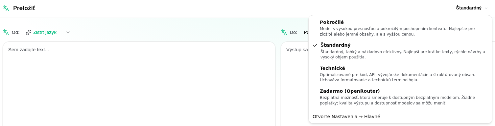
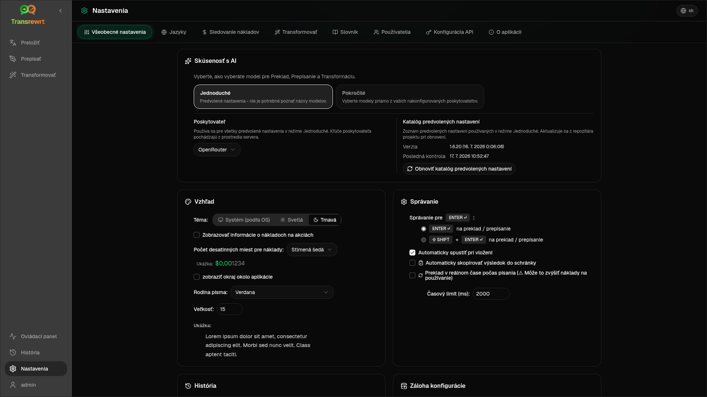

<a id="transrewrt-user-guide"></a>
# Užívateľská príručka

<br/>

<a id="introduction"></a>
## Úvod

Transrewrt vám pomáha pracovať s textom tromi hlavnými spôsobmi:

- **Preložiť** - previesť text z jedného jazyka do druhého.
- **Prepísať** - preformulovať text v inom štýle, ako je jasnejší, kratší alebo formálnejší.
- **Transformovať** - spracovať text pomocou vlastných pokynov AI nazývaných výzvy.

Aplikácia beží štandardne v režime **Jednoduchý**: v časti [**Nastavenia** > **Všeobecné nastavenia**](#general-settings) vyberiete **predvoľbu** (napríklad Zdarma (OpenRouter), Štandardný, Pokročilý alebo Technický) a **poskytovateľa**, bez výberu konkrétnych ID modelov. Prepnite na režim **Pokročilý**, ak chcete používať klasický zoznam modelov v časti [**Nastavenia** > **Modely**](#models).

<br/>

Táto príručka vysvetľuje, ako používať aplikáciu po jej nainštalovaní a spustení. Pre kroky inštalácie si pozrite hlavnú [**README**](README.sk.md).

<br/>

> ℹ️ **POZNÁMKA**<br/>
> Transrewrt je dostupný ako desktopová aplikácia pre Windows a Linux, a ako samostatne hostovaná webová aplikácia. Táto príručka sa zameriava na každodenné používanie aplikácie. Kde sa niečo vzťahuje iba na jednu verziu, je to jasne označené.

<small>**Prečítajte si v iných jazykoch:** </small>
<small id="lang-list">[English (GB)](../USER-GUIDE.md) · [Português (Brasil)](./USER-GUIDE.pt-BR.md) · [العربية](./USER-GUIDE.ar.md) · [বাংলা](./USER-GUIDE.bn.md) · [Català](./USER-GUIDE.ca.md) · [中文 (中国大陆)](./USER-GUIDE.zh-CN.md) · [中文 (台灣)](./USER-GUIDE.zh-TW.md) · [Hrvatski](./USER-GUIDE.hr.md) · [Čeština](./USER-GUIDE.cs.md) · [Nederlands](./USER-GUIDE.nl.md) · [English (US)](./USER-GUIDE.en-US.md) · [Tagalog](./USER-GUIDE.tl.md) · [Français](./USER-GUIDE.fr.md) · [Deutsch](./USER-GUIDE.de.md) · [Ελληνικά](./USER-GUIDE.el.md) · [हिन्दी](./USER-GUIDE.hi.md) · [Magyar](./USER-GUIDE.hu.md) · [Italiano](./USER-GUIDE.it.md) · [日本語](./USER-GUIDE.ja.md) · [한국어](./USER-GUIDE.ko.md) · [Bahasa Melayu](./USER-GUIDE.ms.md) · [فارسی](./USER-GUIDE.fa.md) · [Polski](./USER-GUIDE.pl.md) · [Basa Jawa](./USER-GUIDE.jv.md) · [Português](./USER-GUIDE.pt.md) · [ਪੰਜਾਬੀ](./USER-GUIDE.pa.md) · [Română](./USER-GUIDE.ro.md) · [Русский](./USER-GUIDE.ru.md) · [Slovenčina](./USER-GUIDE.sk.md) · [Español](./USER-GUIDE.es.md) · [Kiswahili](./USER-GUIDE.sw.md) · [Svenska](./USER-GUIDE.sv.md) · [తెలుగు](./USER-GUIDE.te.md) · [ไทย](./USER-GUIDE.th.md) · [Türkçe](./USER-GUIDE.tr.md) · [Українська](./USER-GUIDE.uk.md) · [Tiếng Việt](./USER-GUIDE.vi.md)</small>

<small>

> **Poznámka k prekladom rozhrania a dokumentácie:** Všetky jazyky rozhrania okrem pôvodného anglického (VB) 
> boli preložené pomocou modelov umelej inteligencie; preklad môže byť nepresný alebo obsahovať chyby.

</small>

<br/>

<!-- START doctoc generated TOC please keep comment here to allow auto update -->
<!-- DON'T EDIT THIS SECTION, INSTEAD RE-RUN doctoc TO UPDATE -->
**Obsah**

- [Predtým, než začnete](#before-you-start)
  - [Ako získať bezplatný OpenRouter API kľúč (desktopová aplikácia)](#how-to-get-a-free-openrouter-api-key-desktop-app)
- [Začiatok](#getting-started)
- [Hlavné časti okna](#main-parts-of-the-window)
  - [Postranný panel](#sidebar)
  - [Nástrojový panel](#toolbar)
  - [Panely vstupu a výstupu](#input-and-output-panels)
- [Preložiť](#translate)
  - [Preložiť text](#translate-text)
  - [Výber jazyka](#language-selection)
  - [Užitočné nastavenia prekladu](#helpful-translation-settings)
  - [Vylepšenie vášho prekladu](#refining-translation)
- [Prepísať](#rewrite)
- [Transformovať](#transform)
  - [Spustiť existujúcu výzvu](#run-an-existing-prompt)
  - [Ak zatiaľ nemáte žiadne výzvy](#if-you-have-no-prompts-yet)
  - [Rýchlo vytvoriť výzvu](#create-a-prompt-quickly)
  - [Upraviť výzvu](#edit-a-prompt)
  - [Testovať výzvu pred jej použitím](#test-a-prompt-before-using-it)
- [Ovládací panel](#dashboard)
  - [Filtrovať dáta](#filter-the-data)
  - [Záložky ovládacieho panela](#dashboard-tabs)
  - [Exportovať dáta](#export-data)
  - [Odstrániť uložené záznamy pre model](#delete-stored-records-for-a-model)
- [História](#history)
  - [Filtrovať históriu](#filter-the-history)
  - [Exportovať historické dáta](#export-history-data)
- [Nastavenia](#settings)
  - [Všeobecné nastavenia](#general-settings)
  - [Modely](#models)
  - [Jazyky](#languages)
  - [Sledovanie nákladov](#cost-tracking)
  - [Transformovať (záložka nastavení)](#transform-settings-tab)
  - [Používatelia](#users)
  - [Konfigurácia API](#api-config)
  - [O aplikácii](#about)
- [Bežné problémy](#common-issues)
  - [Aplikácia neprekladá, neprepíše ani netransformuje text](#the-app-will-not-translate-rewrite-or-transform-text)
  - [Zoznam modelov je prázdny](#the-model-list-is-empty)
  - [Výsledok je príliš pomalý alebo príliš drahý](#the-result-is-too-slow-or-too-expensive)
  - [Rozhranie je v nesprávnom jazyku](#the-interface-is-in-the-wrong-language)
  - [Text je príliš malý alebo ťažko čitateľný](#the-text-is-too-small-or-hard-to-read)
  - [Súhrn ovládacieho panela vyzerá prázdny](#dashboard-summary-looks-empty)
  - [Náklady sa zobrazujú ako "nedostupné" alebo sa zdajú byť nesprávne](#cost-shows-not-available-or-seems-wrong)
  - [Celkové náklady sa nezhodujú s faktúrou môjho poskytovateľa](#total-cost-does-not-match-my-provider-bill)
  - [Stránka História chýba v bočnom paneli](#the-history-page-is-missing-from-the-sidebar)
  - [Webová aplikácia: neočakávane presmerovaná na prihlasovaciu stránku](#web-app-redirected-to-the-login-page-unexpectedly)
  - [Webový administrátor: zabudol alebo stratil heslo](#web-admin-forgot-or-lost-a-password)
  - [Ovládací panel nezobrazuje žiadne dáta pre iných používateľov (web)](#dashboard-shows-no-data-for-other-users-web)
  - [Zmenil som výzvu a stratil úpravy](#i-changed-a-prompt-and-lost-the-edits)
- [Rýchle tipy](#quick-tips)
- [Zrieknutie sa zodpovednosti](#disclaimer)
- [Licencia](#license)

<!-- END doctoc generated TOC please keep comment here to allow auto update -->

<br/><br/>

<a id="before-you-start"></a>
## Predtým, než začnete

Na používanie Transrewrt potrebujete prístup k aspoň jednému poskytovateľovi AI. Podporovaní poskytovatelia sú: [OpenRouter](https://openrouter.ai) (ktorý agreguje mnoho modelov), OpenAI, Anthropic, Google Gemini, DeepSeek, Groq, Mistral, xAI, Cerebras a [Ollama](https://ollama.com) pre lokálne modely.

Nemusíte si vybrať platený model, aby ste mohli začať. Hneď ako pridáte svoj OpenRouter API kľúč, aplikácia automaticky povolí vstavanú **zdarma** možnosť OpenRouter. To vám umožní okamžite začať prekladať, prepísať a transformovať text. Alternatívne si môžete tiež získať bezplatný API kľúč od Cerebras, Google, Groq alebo Mistral AI.

Jednoducho povedané:

- V režime **Jednoduchý** sa každá **predvoľba** (Zdarma (OpenRouter), Štandardný, Pokročilý alebo Technický) mapuje na model vybraného **poskytovateľa** (OpenRouter, OpenAI, Ollama a ďalší). V paneli nástrojov sa zobrazia len tie predvoľby, ktoré majú pre aktuálneho poskytovateľa priradený model. Predvoľbu vyberiete pri akciách Preložiť, Prepísať a Transformovať.
- V režime **Pokročilý** je **model** umelá inteligencia, ktorú si priamo vyberiete. Identifikátory modelov používajú **predponu poskytovateľa** (napríklad `openrouter/…`, `openai/…`, `ollama/…`).
- **API kľúč** (alebo v prípade Ollama **základná URL**) umožňuje aplikácii komunikovať s poskytovateľom.

Ak používate **desktopovú aplikáciu**, pridajte kľúče v časti [**Nastavenia** > **Nastavenie API**](#api-config) pre každého poskytovateľa, ktorého používate. Ak používate len OpenRouter, pozrite si nižšie časť [Ako získať bezplatný API kľúč OpenRouter](#how-to-get-a-free-openrouter-api-key-desktop-app). Ak nechcete používať API kľúč, môžete nainštalovať Ollama (z [ollama.com](https://ollama.com)) a namiesto toho používať lokálne modely, napríklad `translategemma:4b`.

Ak používate **webovú verziu**, vlastník servera konfiguruje poskytovateľov pomocou premenných prostredia, takže nemôžete zadať API kľúče priamo v aplikácii.

<br/>

<a id="how-to-get-a-free-openrouter-api-key-desktop-app"></a>
### Ako získať bezplatný API kľúč OpenRouter (desktopová aplikácia)

Ak používate desktopovú aplikáciu, postupujte podľa týchto krokov:

1. Prejdite na [OpenRouter](https://openrouter.ai) vo svojom webovom prehliadači.
2. Vytvorte účet alebo sa prihláste.
3. Otvorte stránku [Kľúče](https://openrouter.ai/keys).
4. Kliknite na tlačidlo na vytvorenie nového API kľúča.
5. Dajte kľúču názov, aby ste ho mohli neskôr rozpoznať.
6. Skopírujte nový API kľúč.
7. Vráťte sa do Transrewrt a otvorte **Nastavenia** > **Nastavenie API**.
8. Vložte kľúč do **OpenRouter API kľúč** (pod **Nastavenia** > **Nastavenie API**).
9. Kliknite na **Test OpenRouter kľúč** a uistite sa, že funguje.

<br/><br/>

<a id="getting-started"></a>
## Začiatok

Ak je to váš prvýkrát, čo používate Transrewrt, postupujte v tomto poradí:

1. Otvorte aplikáciu.
2. Ak je potrebné, vyberte si **Jazyk rozhrania** z ikony gule.
3. Ak používate **desktopovú aplikáciu**, otvorte [**Nastavenia** > **Nastavenie API**](#api-config), pridajte API kľúč aspoň pre jedného poskytovateľa (napríklad OpenRouter) a kliknite na **Test**, aby ste overili, či funguje.
4. Otvorte [**Nastavenia** > **Všeobecné nastavenia**](#general-settings). V režime **Jednoduchý** (predvolený) vyberte **Poskytovateľa**, ktorý má nakonfigurovaný kľúč. V režime **Pokročilý** otvorte [**Nastavenia** > **Modely**](#models) a pridajte jeden alebo viac modelov do časti **Vybrané modely**.
5. Pri **Preložiť** si v paneli nástrojov vyberte **predvoľbu** (Jednoduchý) alebo **model** (Pokročilý).
6. Otvorte [**Nastavenia** > **Jazyky**](#languages) a vyberte si **Najvyššie jazyky**, ak chcete, aby sa vaše najčastejšie používané jazyky zobrazovali ako prvé.
7. Spustite jednoduchý preklad, aby ste potvrdili, že všetko funguje, a potom vyskúšajte **Prepísať** a **Transformovať**.

Toto poradie je dôležité. Zabraňuje najčastejšiemu problému pri prvom použití: spusteniu úlohy predtým, ako má aplikácia funkčné API pripojenie alebo vybranú predvoľbu/model.

<br/><br/>

<a id="main-parts-of-the-window"></a>
## Hlavné časti okna

Aplikácia je rozdelená do troch hlavných oblastí:

- **bočný panel** naľavo.
- **nástrojový panel** na vrchu.
- **pracovná plocha** v strede.

<br/>

<a id="sidebar"></a>
### Bočný panel

Použite bočný panel na navigáciu v aplikácii. Môžete zložiť bočný panel pre viac miesta kliknutím na ikonu vedľa loga aplikácie.

<br/>

<table>
  <tr>
    <td valign="top">
       
    </td>
    <td valign="top">
      <br/><br/>
      <ul>
        <li><strong>Preložiť</strong> otvorí pracovný priestor na preklad.</li><br/>
        <li><strong>Prepísať</strong> otvorí pracovný priestor na prepísanie.</li><br/>
        <li><strong>Transformovať</strong> otvorí pracovný priestor na vlastnú výzvu.</li><br/>
        <li><strong>Nástenka</strong> zobrazuje informácie o používaní a nákladoch.</li><br/>
        <li><strong>Nastavenia</strong> otvorí panel nastavení.</li><br/>
        <li><strong>História</strong> zobrazuje históriu používania s vstupným a výstupným textom</li><br/>
        <li><strong>Používateľ</strong> zobrazuje používateľské meno prihláseného používateľa (iba web).</li>
      </ul>
    </td>
  </tr>
</table>

<br/>

<a id="toolbar"></a>
### Nástrojová lišta

Nástrojová lišta sa mierne mení v závislosti od toho, kde sa nachádzate v aplikácii.

- Vľavo sa zobrazuje názov aktuálnej stránky.
- Vpravo sa nachádza **výber predvoľby alebo modelu** a ovládanie **jazyka rozhrania**.

V režime **Jednoduchý** zobrazuje panel nástrojov **výber predvoľby** s preddefinovanými možnosťami **Zdarma (OpenRouter)**, **Štandardný**, **Pokročilý** a **Technický**. Ktoré predvoľby sa zobrazia, závisí od **poskytovateľa**, ktorého ste vybrali v časti [**Nastavenia** > **Všeobecné nastavenia**](#general-settings) – napríklad možnosť **Zdarma (OpenRouter)** sa zobrazí len vtedy, keď je poskytovateľom OpenRouter. Ak je **poskytovateľom** **Ollama**, panel nástrojov zobrazí namiesto predvoľieb modely nainštalované lokálne na vašom počítači.

V režime **Pokročilý** vám **výber modelu** umožňuje zvoliť, ktorý model umelého inteligencie použiť pre aktuálnu úlohu.



V pokročilom režime niektoré bezplatné modely nemusia byť vždy dostupné – môžu byť offline alebo dosiahnuť limit používania. Aplikácia môže tento model automaticky odstrániť zo zoznamu. Ak chcete ovládať, ktoré modely sa zobrazujú, prejdite na [**Nastavenia** > **Modely**](#models). Nastavenia modelu môžete otvoriť z ikony poskytovateľa vľavo od názvu modelu na paneli nástrojov.

<br/>

Ikona **glóbus + jazykový kód** mení jazyk rozhrania aplikácie, ako sú ponuky a tlačidlá. **Nemení** však jazyky prekladu používané v **Preložiť**.


<br/>

<a id="input-and-output-panels"></a>
### Panely vstupu a výstupu

Väčšina pracovných priestorov používa panel **Vstup** na ľavej strane a panel **Výstup** na pravej strane.

Každý panel tiež zobrazuje:

| **Vstup**                                                          | **Výstup**                                                                                                                  |
|--------------------------------------------------------------------|-----------------------------------------------------------------------------------------------------------------------------|
| - Počet znakov <br/>- Počet slov <br/>- Počet odsekov   <br/> | - Ako dlho úloha trvala<br/>- **TPS** (tokeny za sekundu)<br/>- Počty znakov, slov a odsekov<br/>- Použitý model |

Ak sa pýtate na technické pojmy:

- **Token** znamená malý útržok textu. Môžete si to predstaviť ako časť slova alebo krátke slovo.
- **TPS** znamená, koľko z týchto útržkov textu model spracoval za každú sekundu.

<br/>

Môžete tiež sledovať náklady na každú operáciu (ak sú dostupné) a celkové náklady, čo umožňuje možnosť `Show cost information on the actions` v [**Nastavenia** > **Všeobecné nastavenia**](#general-settings).

<br/><br/>

[--------------------------------------------------------------------------------------------------------------------------]: #

<a id="translate"></a>
## Preložiť

Použite **Preložiť**, keď chcete previesť text z jedného jazyka do druhého.


<br/>

<a id="translate-text"></a>
### Preložiť text

1. Otvorte **Preložiť**.
2. Vyberte jazyk vo **Z**.
3. Vyberte jazyk do **Na**.
4. Vyberte predvoľbu (Jednoduchý) alebo model (Pokročilý) v paneli nástrojov.
5. Zadajte alebo vložte text do **Vstup**.
6. Kliknite na **Preložiť**.
7. Prečítajte si výsledok v **Výstup**.
8. Použite tlačidlo na kopírovanie, ak chcete skopírovať výsledok.

<br/>

<a id="language-selection"></a>
### Výber jazyka

- **Z** môže byť konkrétny jazyk alebo **Zistiť jazyk**.
- **Do** je jazyk, v ktorom chcete výsledok.

Vaše vybrané **Hlavné jazyky** sa zobrazujú na vrchu zoznamu. Môžete ich nastaviť v [**Nastavenia** > **Jazyky**](#languages).

<br/>

<a id="helpful-translation-settings"></a>
### Užitočné nastavenia prekladu

V [**Nastavenia** > **Všeobecné nastavenia**](#general-settings) môžete zmeniť, ako sa správa preklad:

- **Automaticky spustiť pri vložení** spustí preklad hneď, ako vložíte text.
- **Automaticky skopírovať výsledok do schránky** automaticky skopíruje výsledok po úspešnom spustení.
- **Preklad v reálnom čase pri písaní** (⚠️ To môže zvýšiť náklady na používanie) spúšťa preklady, zatiaľ čo píšete.
- **Časový limit (ms)** ovláda, ako dlho aplikácia čaká pred spustením prekladu v reálnom čase.
- **Správanie pre ENTER** vyberá, či `Enter` spustí úlohu alebo vloží nový riadok:
  - **Enter** spustí preklad alebo prepísanie (predvolené).
  - **Shift + Enter** spustí preklad alebo prepísanie; obyčajný **Enter** vloží nový riadok.

<br/>

<a id="refining-translation"></a>
### Vylepšenie vášho prekladu

Po úspešnom preklade môžete vylepšiť výsledok v paneli výstupu:

1. **Preformulovať…** — ak nie je v výstupe vybraný žiadny text, získate ďalší úplný preklad toho istého vstupu s iným znením. Môžete si uložiť až **päť** verzií a prepínať medzi nimi v rozbaľovacom zozname verzií. Ak je vybraný text, **Preformulovať…** otvorí zoznam alternatív slov v blízkosti výberu (rovnako ako kliknutie pravým tlačidlom myši). Bez výberu je možnosť **Preformulovať…** po dosiahnutí piatich verzií zakázaná; s výberom funguje aj pri piatich verziách (iba alternatívy slov, aktualizuje verziu 5).
2. **Alternatívy slov** — vyberte jedno alebo viac slov vo výstupe (ak vyberiete iba časť slova, aplikácia rozšíri výber na celé slová), potom kliknite pravým tlačidlom myši alebo na **Preformulovať…**. V blízkosti výberu sa zobrazí krátky zoznam alternatív; kliknutím na jednu z nich ju nahradíte. Ak máte menej ako päť verzií, upravený výstup sa uloží ako nová verzia; pri piatich verziách sa aktualizuje iba **verzia 5**. Kliknutie pravým tlačidlom bez výberu nemá žiadny účinok. Stlačením klávesy **Esc** alebo kliknutím mimo zoznamu zrušíte zmenu bez úprav vo výstupe.
3. **Náklady** — každý úplný príkaz **Preformulovať…** (bez výberu) a každá požiadavka na alternatívu slov znova použije model a môže zvýšiť náklady na používanie (rovnako ako pri bežnom preklade).

[--------------------------------------------------------------------------------------------------------------------------]: #

<a id="rewrite"></a>
## Prepísať

Použite **Prepísať**, keď chcete vylepšiť formuláciu bez zmeny hlavného významu.


Toto je užitočné na:

- oprava pravopisu a gramatiky (**Skontrolovať pravopis a gramatiku**)
- zlepšenie zrozumiteľnosti textu (**Zlepšiť zrozumiteľnosť**)
- viacero odlišných prepísaní v jednom spustení (**Alternatívne verzie**)
- formalizácia alebo neformálnosť textu (**Urobiť formálne** / **Urobiť neformálne**)
- skrátenie alebo rozšírenie textu (**Skrátiť** / **Rozšíriť**)
- zmenu textu na technickejší (**Urobiť technické**)

<br/>

> 💡 **TIP**<br/>
> Keď používate režim "**Skontrolovať pravopis a gramatiku**", prepínač **Zobraziť zmeny** sa objaví v paneli výstupu (vedľa **Kopírovať**).
> Zapnite ho alebo vypnite, aby ste zobrazili alebo skryli konkrétne opravy aplikované na váš text.

<br/><br/>

[--------------------------------------------------------------------------------------------------------------------------]: #

<a id="transform"></a>
## Transformovať

Použite **Transformovať**, keď chcete, aby AI dodržiavala vlastnú sadu inštrukcií.


Toto je najflexibilnejšia oblasť aplikácie. Môžete ju použiť na úlohy ako:

- zhrnutie poznámok
- premena hrubého textu na upravený e-mail
- extrakcia kľúčových bodov
- konverzia textu do konkrétneho formátu
- akúkoľvek inú vlastnú činnosť s vstupným textom

<br/>

<a id="run-an-existing-prompt"></a>
### Spustiť existujúcu výzvu

1. Otvorte **Transformovať**.
2. Vyberte výzvu zo zoznamu výziev.
3. Ak sa objaví pole **Z** jazyk, vyberte jazyk, ak ho chcete.
4. Zadajte alebo vložte text do **Vstupu**.
5. Kliknite na **Transformovať**.
6. Prečítajte si výsledok v časti **Výstup**.

<br/>

<a id="if-you-have-no-prompts-yet"></a>
### Ak nemáte žiadne výzvy

Ak je váš zoznam výziev prázdny, kliknite na **Načítať ukážkové výzvy** v pracovnom priestore Transformovať. Toto nastavenie je vždy k dispozícii v [**Nastavenia** > **Transformovať**](#transform-settings) v riadku export/import. Obe možnosti pridajú zabudované príklady, aby ste mohli rýchlo začať.

<br/>

> ℹ️ **Poznámka**<br/>
> Ukážkové výzvy sú poskytované v angličtine. Po ich načítaní môžete výzvu upraviť a použiť **Preložiť výzvu**, aby ste ju preložili do {{your language}}.

<br/>

<a id="create-a-prompt-quickly"></a>
### Rýchlo vytvorte výzvu

Najrýchlejší spôsob, ako vytvoriť výzvu, je:

1. Kliknite na **Nová výzva**.
2. Kliknite na **Vygenerovať výzvu**.
3. Popíšte, čo má výzva robiť.
4. Vyberte predvoľbu (Jednoduchý) alebo model (Pokročilý).
5. Nechajte aplikáciu vytvoriť koncept pre vás.
6. Skontrolujte koncept a kliknite na **Uložiť**.


<br/>

<a id="edit-a-prompt"></a>
### Upraviť výzvu

Keď vytvárate alebo upravujete výzvu, editor sa zobrazí vľavo a testovacia oblasť vpravo.


Hlavné polia sú:

- **Názov výzvy**: názov zobrazený v zozname výziev.
- **Inštrukcie k výzve (voliteľné)**: krátky tip zobrazený používateľovi pri spustení výzvy.
- **Úloha modelu**: celková úloha pridelená umelému inteligencii, napríklad 'Ste užitočným asistentom.'
- **Inštrukcie modelu (jedna na riadok)**: konkrétne pravidlá, ktoré má umelá inteligencia dodržiavať.
- **Popis výstupu (napr. transformovaný, zhrnutý atď.)**: krátke slovo popisujúce výsledok.
- **Teplota (0,0 → 1,0)**: ako sa model bude správať; pozrite sa nižšie.
- **Požiadať o cieľový jazyk**: pridáva výber jazyka, keď sa výzva spustí.
Ak je technický termín **Teplota** pre vás nový, myslite na to takto:

- **Nižšia** teplota dáva stabilnejšie a predvídateľnejšie výsledky.
- **Vyššia** teplota dáva väčšiu rozmanitosť a kreativitu.

Môžete tiež použiť:

- `Generate prompt` na vytvorenie nového konceptu z jednoduchého popisu
- `Improve prompt` na vylepšenie existujúcej výzvy
- `Translate prompt` na preklad polí výzvy

<br/>

> ⚠️ **Upozornenie**<br/>
> Kliknite na `Save` predtým, ako kliknete na `Back to Run`. Ak sa vrátite späť bez uloženia, vaše zmeny budú stratené.

<br/>

<a id="test-a-prompt-before-using-it"></a>
### Otestujte výzvu pred použitím

Testovací panel vpravo vám umožňuje vyskúšať svoju výzvu s ukážkovým textom, skôr ako ju začnete používať v každodennom pracovnom procese.

To je užitočné v prípadoch, keď:

- vytvárate novú výzvu
- porovnávate dve verzie výzvy
- chcete skontrolovať tón, dĺžku alebo formát výstupu

<br/>

> ℹ️ **Poznámka**<br/>
> Uložené výzvy môžete exportovať a importovať v [**Nastavenia** > **Transformovať**](#transform-settings).

Keď použijete **Vygenerovať výzvu**, **Vylepšiť výzvu** alebo **Preložiť výzvu** v editore výziev, režim **Jednoduchý** ponúka rovnaký výber predvoľieb ako Preložiť a Prepísať; režim **Pokročilý** používa zoznam modelov.

<br/><br/>

[--------------------------------------------------------------------------------------------------------------------------]: #

<a id="dashboard"></a>
## Nástenka

Použite **Nástenku** na zobrazenie informácií o využívaní aplikácie a o jej nákladoch (pre modely za poplatok).


<br/>

> ℹ️ **Poznámka**<br/>
> Ak používate iba **zdarma** modely, hodnoty **nákladov** môžu byť nulové a ukazovatele zamerané na náklady môžu vyzerať prázdne. Záložka **Zhrnutie** stále zobrazuje počty volaní pre preklad, prepísanie a transformáciu, ak máte aktivitu v zvolenom období.

<br/>

<a id="filter-the-data"></a>
### Filtrovanie údajov

Použite filtračné tlačidlá v hornej časti na zmenu časového rozsahu.


<br/>

> ℹ️ **Poznámka**<br/>
> Filter **Používateľ** je vo webovej verzii viditeľný len pre správcov. Bežní používatelia tento filter nevidia a v desktopovej aplikácii nie je k dispozícii.

<br/>

<a id="dashboard-tabs"></a>
### Karty nástenky

- **Zhrnutie** zobrazuje karty s kľúčovými ukazovateľmi výkonu: celkové náklady, použité modely, počty volaní a náklady podľa režimu (vrátane podielu na celkovom počte volaní), priemerné náklady na volanie, priemerné TPS a tri najpoužívanejšie modely podľa počtu volaní.
- **Podľa modelu** uvádza každý model s celkovým počtom volaní, celkovými nákladmi a priemerným TPS; rozbaľte riadok pre podrobnosti podľa prekladu, prepísania a transformácie.
- **Všetky volania** zobrazuje kompletný záznam volaní (stránkovaný v širokých rozloženiach, karty na úzkych obrazovkách) a umožňuje jeho export.

<br/>

<a id="export-data"></a>
### Export údajov

Údaje z tabuliek na nástenke je možné exportovať vo formátoch:

- **JSON**
- **CSV**
- **XLSX**

To je užitočné, ak chcete prehodnotiť aktivitu mimo aplikácie alebo zdieľať správu.

<br/>

<a id="delete-stored-records-for-a-model"></a>
### Odstránenie uložených záznamov pre model

Na kartách **Podľa modelu** alebo **Všetky volania** môžete odstrániť uložené záznamy pre model kliknutím na ikonu „koša“.

> ⚠️ **Upozornenie**<br/>
> Odstránenie uložených záznamov nie je možné vrátiť späť. Použite to iba vtedy, ak ste si istí, že túto históriu už nepotrebujete.

Ak chcete odstrániť všetky údaje alebo záznamy na základe ich veku, prejdite do časti [**Nastavenia** > **Sledovanie nákladov**](#cost-tracking). Tu nájdete možnosti na odstránenie všetkých uložených údajov alebo len údajov starších ako určitý dátum.

<br/><br/>

[--------------------------------------------------------------------------------------------------------------------------]: #

<a id="history"></a>
## História

Kliknutím na položku **História** zobrazíte históriu vašich akcií v rámci **Transrewrt**, vrátane vstupu a výstupu každej operácie.


<br/>

<a id="filter-the-history"></a>
### Filtrovanie histórie

**História** používa rovnaké filtre časového obdobia ako stránka **Nástenka**.


<br/>

> ℹ️ **Poznámka**<br/>
> Vo **webovej aplikácii** vidí každý (vrátane správcov) iba vlastnú históriu vykonaní. Filter **Používateľ** na **Nástenke** slúži správcom na prehľad využitia a nákladov naprieč účtami; nevzťahuje sa na **Históriu**.

<br/>

<a id="export-history-data"></a>
### Export dát z histórie

Stránka histórie môže exportovať filtrované údaje vo formátoch:

- **JSON**
- **CSV**
- **XLSX**

To je užitočné, ak chcete prehodnotiť aktivitu mimo aplikácie alebo zdieľať správu.

<br/><br/>

[--------------------------------------------------------------------------------------------------------------------------]: #

<a id="settings"></a>
## Nastavenia

Otvorte **Nastavenia** na bočnom paneli, aby ste prispôsobili správanie aplikácie.

Dostupné karty závisia od platformy a vašej úlohy:

| Záložka              | Desktop | Web (správca) | Web (bežný používateľ) | Poznámky                                        |
  |------------------|:-------:|:-----------:|:------------------:|----------------------------------------------|
  | Všeobecné nastavenia |   áno   |     áno     |        áno         | Obsahuje **AI skúsenosti** (Jednoduchý / Pokročilý) |
  | Modely           |   áno   |     áno     |        áno         | Iba keď je **AI skúsenosti** nastavené na **Pokročilý** |
  | Jazyky        |   áno   |     áno     |        áno         |                                              |
  | Sledovanie nákladov    |   áno   |     áno     |         -          |                                              |
  | Transformovať        |   áno   |     áno     |        áno         | Hromadný import/export transformačných výziev      |
  | Používatelia            |    -    |     áno     |         -          |                                              |
  | Nastavenie API       |   áno   |     áno     |         -          |                                              |
  | O aplikácii            |   áno   |     áno     |        áno         |                                              |

V režime **Jednoduchý** sa výber modelu vykonáva prostredníctvom predvoľieb v paneli nástrojov a **poskytovateľa** vo všeobecných nastaveniach; záložka **Modely** je skrytá.

<br/>

> ℹ️ **Poznámka**<br/>
> Vo webovej verzii má každý používateľ vlastnú konfiguráciu. Nastavenia ako AI skúsenosti, poskytovateľ, vybrané modely alebo predvoľby, jazyky, všeobecné možnosti a transformačné výzvy sú uložené pre každého používateľa osobitne. Zmeny, ktoré vykonáte, neovplyvnia ostatných používateľov.

<br/>

[--------------------------------------------------------------------------------------------------------------------------]: #

<a id="general-settings"></a>
### Všeobecné nastavenia

Použite **Všeobecné nastavenia** na nastavenie správania pri písaní, či sa ukladajú podrobnosti vykonania pre **Históriu**, vzhľad a spôsob výberu AI pre Preložiť, Prepísať a Transformovať.

**AI skúsenosti**

- **Jednoduchý** (predvolené): vyberte **poskytovateľa** (OpenRouter, OpenAI, Anthropic, Google Gemini, DeepSeek, Groq, Mistral, xAI, Cerebras alebo Ollama). Cloudoví poskytovatelia používajú preddefinované predvoľby v paneli nástrojov. **Ollama** namiesto predvoľieb zobrazí modely nainštalované na vašom počítači. V režime Jednoduchý zobrazuje **Katalóg predvoľieb** verziu katalógu a čas poslednej aktualizácie; kliknutím na **Obnoviť katalóg predvoľieb** načítate najnovší zoznam predvoľieb z repozitára projektu (aplikácia tiež pravidelne kontroluje aktualizácie na pozadí).
- **Pokročilý**: vyberajte jednotlivé modely v paneli nástrojov; zoznam spravujte v časti [**Nastavenia** > **Modely**](#models).

**Vzhľad**

- **Téma** prepína medzi svetlým, tmavým a systémovým vzhľadom.
- **Zobraziť informácie o nákladoch pri akciách** ovláda zobrazenie nákladov za operáciu (ak sú k dispozícii) a celkových nákladov na paneloch výstupu Preložiť, Prepísať a Transformovať.
- **Desatinné miesta pre náklady** mení spôsob zobrazenia desatinných miest nákladov.
- **Iba pre web:** **zobraziť okraj okolo aplikácie** pridáva dodatočný priestor okolo rozhrania.
- **Rodina písma** mení písmo v textových paneloch.
- **Veľkosť** mení veľkosť písma.

**Správanie**

- **Správanie pre ENTER** vyberá, či `Enter` spustí úlohu alebo vloží nový riadok.
- **Automaticky spustiť pri vložení** spúšťa preklad hneď, ako vložíte text.
- **Automaticky skopírovať výsledok do schránky** automaticky kopíruje úspešné výsledky.
- **Preklad v reálnom čase pri písaní** (⚠️ To môže zvýšiť náklady na používanie) prekladá, zatiaľ čo píšete.
- **Časový limit (ms)** nastavuje dobu čakania pre preklad v reálnom čase.

**História**

- **Zachovať históriu vykonaní** určuje, či sa pri každom preklade, prepísaní a transformácii ukladajú **vstupný a výstupný text** pre zobrazenie v bočnom paneli [**História**](#history). Ak túto možnosť vypnete, zobrazí sa výzva na potvrdenie; po potvrdení sa uložený text histórie odstráni z databázy. Ak je označenie *zakázané správcom*, vo vašej inštalácii je vo vývojovom prostredí nastavená hodnota `HISTORY_DISABLED` (pozri [README](README.sk.md#configuration-and-environment)); v užívateľskom rozhraní nemôžete históriu znova zapnúť.
- **Odstrániť dáta histórie** vám umožňuje odstrániť uložený text podľa veku (napríklad staršie ako niekoľko mesiacov alebo **všetky údaje (vymazať)**) pomocou možnosti **Odstrániť dáta**. Toto ovplyvňuje iba uložený text vykonaní pre zobrazenie **História**; **nezmaže** to údaje o nákladoch alebo celkovom využití. Ak chcete odstrániť alebo skrátiť údaje o **nákladoch**, použite [**Nastavenia** > **Sledovanie nákladov**](#cost-tracking).

**Záloha konfigurácie** (iba pre administrátorov desktopovej aplikácie a webu)
- **Zahrnúť údaje o používaní do zálohy** - keď je povolené, ZIP obsahuje aj históriu vykonávania a údaje o volaniach API.
- **Zálohovať konfiguráciu** - vytvorí jeden ZIP (`transrewrt-config-backup-YYYY-MM-DD_HHMMSS.zip` v miestnom čase) s `config.json`, `state.json`, voliteľným šifrovacím kľúčom, používateľmi, preferenciami, vlastnými výzvami a údajmi o používaní, ak ste sa prihlásili. Po úspešnej zálohe sa potvrdzujúca správa zobrazí s názvom uloženého súboru.
- **Obnoviť zo zálohy** - najprv otvorí **potvrdzujúci dialóg**. Vyberte záložný ZIP v dialógu (**Prehľadávať** / výber súboru alebo pretiahnite a pusťte, kde je to podporované), potom si prejdite možnosti:
  - **Obnoviť údaje o používaní** - importovať údaje o používaní/histórii zo ZIP, keď bola záloha vytvorená s údajmi o používaní; nechajte vypnuté, ak chcete iba nastavenia a výzvy.
  - **Pred obnovením vymazať staré údaje o používaní** - odstrániť existujúce údaje o používaní/histórii na tejto inštalácii pred aplikovaním zálohy (voliteľné; použite, keď chcete čistú náhradu).
Zálohy vytvorené v webovej alebo desktopovej verzii môžu byť obnovené v druhej. Pri obnove desktopovej zálohy vo webovej verzii budú údaje obnovené na administrátorského používateľa.

<br/>

<a id="models"></a>
### Modely

Táto karta je dostupná iba vtedy, keď je v časti [**Všeobecné nastavenia**](#general-settings) nastavená možnosť **AI skúsenosti** na **Pokročilý**. Pomocou **Nastavenia** > **Modely** si môžete zvoliť, ktoré modely sa zobrazia na paneli nástrojov.



Stránka obsahuje dva zoznamy:

- **Dostupné modely** vľavo
- **Vybrané modely** vpravo

Medzi užitočné ovládacie prvky patrí:

- **Hľadať modely...** a vyhľadajte model podľa názvu
- **Poskytovateľ** filtre na zúženie zoznamu na jeden engine (OpenRouter, OpenAI, Ollama, …)
- **Iba zadarmo** na zobrazenie len bezplatných modelov
- **Obnoviť** na opätovné načítanie zoznamu
- **Rozbaliť všetko** a **Zbaliť všetko**, keď triedite podľa poskytovateľa

Identifikátory modelov obsahujú predponu poskytovateľa (napríklad `openrouter/…` oproti `openai/…`). Označenia ako **OpenAI (OpenRouter)** oproti **OpenAI (priamo)** zobrazujú, ako je prevádzka smerovaná.

> ℹ️ **Poznámka**<br/>
> **OpenRouter Body Builder** (`openrouter/bodybuilder`) je smerovací model, nie všeobecný chatovací model: jeho odpoveď je JSON, ktorý popisuje telo požiadavky OpenRouter API (napríklad pole `requests` s `model` a `messages`). Ak ho použijete na **Preložiť**, **Prepísať** alebo **Transformovať**, panel výstupu zobrazí tento JSON namiesto hotového textu. Na tieto úlohy si vyberte normálny textový model. Viac informácií na [stránke modelu Body Builder](https://openrouter.ai/openrouter/bodybuilder) na OpenRouter.

Akcie:

- Na pridanie modelu kliknite na **Pridať** alebo kdekoľvek do položky.

- Na odstránenie modelu kliknite na **X** vedľa neho v sekcii **Vybrané modely** alebo na **Vybrať** v položke v sekcii Dostupné modely.

- Na vymazanie zoznamu kliknite na **Zrušiť výber všetkých**. Požadovaný bezplatný model zostane v zozname.

<br/>

> ℹ️ **Poznámka**<br/>
> Ak nechcete okamžite pridávať kredit na OpenRouter, začnite zapnutím možnosti **Iba zadarmo** a výberom bezplatných modelov (bez potreby kreditnej karty). Môžete tiež použiť Ollama na spustenie modelov lokálne bez akéhokoľvek API kľúča.

<br/>

<a id="languages"></a>
### Jazyky

Použite **Nastavenia** > **Jazyky** na organizáciu zoznamov jazykov používaných v aplikácii.

- **Najčastejšie používané jazyky** sú pripnuté na vrchu zoznamov jazykov v **Preložiť** a **Transformovať**.
- **Vlastný jazyk** vám umožňuje pridať jazyk, ktorý nie je v preddefinovanom zozname.

Ak pridáte vlastný jazyk, objaví sa výberači jazykov spolu s preddefinovanými možnosťami.

<br/>

<a id="cost-tracking"></a>
### Sledovanie nákladov

Použite **Nastavenia** > **Sledovanie nákladov** na správu informácií o nákladoch.

- **Celkové náklady** zobrazujú bežiaci súčet.
- **Kopírovať hodnotu** skopíruje celkovú sumu do schránky.
- **Obnoviť náklady** nastaví uložený súčet na nulu.
- **Synchronizovať s využitím API kľúča** nastaví súčet podľa využitia nahláseného vo vašom účte OpenRouter (iba OpenRouter).
- **Využitie API kľúča** zobrazuje podrobnosti o využití OpenRouter, ak sú k dispozícii.
- **Odstrániť dáta o nákladoch** odstráni všetky dáta alebo len záznamy staršie ako vybraný dátum.

**Sledovanie nákladov:** Keď používate modely OpenRouter, aplikácia zobrazuje vaše skutočné využitie a výdavky na základe informácií o nákladoch od OpenRouter. Pre všetkých ostatných poskytovateľov aplikácia odhaduje náklady pomocou cien zverejnených OpenRouter; ak nie je cena k dispozícii, odhad môže byť nulový.

<br/>

> ℹ️ **Poznámka**<br/>
> **Všetky údaje o nákladoch sú len odhady na vaše informácie, nie oficiálne fakturačné vyhlásenia.**

<br/>

> ⚠️ **Upozornenie**<br/>
> Odstránenie dát nemôže byť vrátené späť. Pred odstránením sa uistite, že ste si dáta zazálohované alebo exportovali cez [**História**](#history)
> alebo [**Nástenka** > **Všetky volania**](#dashboard-tabs), inak budú natrvalo stratené.
> Odstránia sa tiež všetky záznamy vstupu/výstupu súvisiace s každým záznamom volania API.

<br/>

<a id="transform-settings"></a>
### Transformovať (karta nastavení)

Pomocou **Nastavenia** > **Transformovať** môžete hromadne spravovať výzvy.

Môžete:

- prezerať uložené výzvy
- odstraňovať výzvy
- importovať výzvy zo súboru
- exportovať výzvy na zálohovanie alebo zdieľanie
- načítať ukážkové výzvy do zoznamu výziev

<br/>

<a id="users"></a>
### Používatelia

Použite **Používatelia** na správu používateľských účtov vo webovej verzii. Môžete pridávať používateľov, aktualizovať ich údaje, resetovať heslá a odstraňovať účty.

<br/>

<a id="api-config"></a>
### Nastavenie API

Podporovaní poskytovatelia sú: OpenRouter, OpenAI, Anthropic, Google Gemini, DeepSeek, Groq, Mistral, xAI, Cerebras a **Ollama** (lokálne modely cez základnú URL). Stačí nakonfigurovať len poskytovateľov, ktorých používate.

**Webová aplikácia: len pre správcu**

API kľúče sa konfigurujú prostredníctvom systémových alebo Docker premenných prostredia – nezadávajú sa vo webovom rozhraní. Táto stránka zobrazuje, pre ktorých poskytovateľov je kľúč nakonfigurovaný, a umožňuje otestovať každého kliknutím na tlačidlo `Test`.

<br/>

> ℹ️ **Poznámka**<br/>
> Ak chcete zmeniť API kľúč, aktualizujte premennú prostredia vo vašom systéme alebo v konfigurácii Docker a reštartujte server alebo kontajner.

<br/>

> ℹ️ **Poznámka**<br/>
> **Zálohovanie konfigurácie** (pozri [**Všeobecné nastavenia** → Zálohovanie konfigurácie](#general-settings)) môže vložiť **rozlúštené** kľúče poskytovateľov do súboru `config.json` vo formáte ZIP. Obnovenie tohto ZIP súboru **nekopíruje** tieto kľúče späť do konfiguračného súboru servera – aktívne kľúče stále pochádzajú z prostredia a existujúceho stavu súboru, ako je uvedené vyššie.

<br/>

**Desktopová aplikácia**

Použite **Nastavenie API** na uloženie API kľúčov pre každého poskytovateľa, ktorého používate. Pre Ollama zadajte namiesto API kľúča **základnú URL**.

<br/>

> 💡 **Tip** <br/>
> Ak nechcete používať API kľúč ani platiť za využitie, môžete [stiahnuť Ollama](https://ollama.com) a spustiť modely (napr. `translategemma:4b`) lokálne na vašom počítači zdarma. Prípadne si môžete vytvoriť bezplatný účet na OpenRouter (bez kreditnej karty) a používať ich bezplatné modely, alebo získať bezplatný API kľúč od Cerebras, Google, Groq alebo Mistral AI.

<br/>

- Pridajte len poskytovateľov, ktorých potrebujete. V časti **Nastavenia** > **Modely** každé ID modelu začína menom poskytovateľa (napr. `openrouter/openrouter/free`, `openai/gpt-4o`, `ollama/llama3`).

Ak chcete pridať API kľúč, zadajte hodnotu do textového poľa a kliknite na `Save`. Ak chcete nahradiť existujúci kľúč, kliknite na `Edit`. Ak chcete overiť, či kľúč funguje, kliknite na `Test`. Pre základnú URL Ollama vždy kliknite na `Test` na overenie pripojenia.

<br/>

> ℹ️ **Poznámka**<br/>
> Aktuálnu hodnotu API kľúča nemôžete vidieť. Môžete ho len nahradiť pomocou tlačidla `Edit`.
> API kľúče sú uložené šifrovane v konfigurácii.

<br/>

<a id="about"></a>
### O aplikácii

Karta **O aplikácii** zobrazuje:

- názov aplikácie a slogan
- číslo verzie a dátum zostavenia
- informácie o licencii a autorských právach, s odkazom na otvorenie **Oznámení tretích strán**
- odkaz na repozitár projektu

<br/><br/>

<a id="common-issues"></a>
## Bežné problémy

Ak niečo nefunguje podľa očakávaní, skontrolujte najprv nasledujúce body.

<br/>

<a id="the-app-will-not-translate-rewrite-or-transform-text"></a>
### Aplikácia neprekladá, prepisuje alebo transformuje text

Skontrolujte, či:

- v paneli nástrojov ste si vybrali **predvoľbu** (Jednoduchý) alebo **model** (Pokročilý)
- v režime **Jednoduchý** má [**Nastavenia** > **Všeobecné nastavenia**](#general-settings) **poskytovateľa** s funkčným kľúčom (alebo URL Ollamy) a aspoň jednu predvoľbu pre tohto poskytovateľa
- v režime **Pokročilý** je v časti [**Nastavenia** > **Modely**](#models) uvedený aspoň jeden model
- vaše nastavenie API funguje

Ak používate desktopovú aplikáciu:

1. Otvorte [**Nastavenia** > **Nastavenie API**](#api-config).
2. Skontrolujte, či je uložený aspoň jeden kľúč API.
3. Kliknite na **Test** vedľa poskytovateľa, aby ste potvrdili, že kľúč funguje.

<br/>

<a id="the-model-list-is-empty"></a>
### Zoznam modelov je prázdny

V režime **Jednoduchý** otvorte [**Nastavenia** > **Všeobecné nastavenia**](#general-settings), skontrolujte, či je nastavený **Poskytovateľ**, a pridajte alebo otestujte kľúče v časti [**Nastavenie API**](#api-config) (na desktopovej verzii) alebo požiadajte správcu (webová verzia). Pre **Ollama** spustite funkciu **Test** na základnej URL a uistite sa, že sú modely nainštalované lokálne.

V režime **Pokročilý** otvorte [**Nastavenia** > **Modely**](#models) a kliknite na **Obnoviť**. Ak je to potrebné, vyhľadajte model, zapnite možnosť **Iba zadarmo** a pridajte modely do časti **Vybrané modely**.

<br/>

<a id="the-result-is-too-slow-or-too-expensive"></a>
### Výsledok je príliš pomalý alebo príliš drahý

Vyskúšajte jednu alebo viac z týchto možností:

- vyberte inú predvoľbu (Jednoduché) alebo model (Pokročilé)
- použite kratší vstup
- vypnite **Preklad v reálnom čase pri písaní** v [**Nastaveniach** > **Všeobecné nastavenia**](#general-settings)
- použite bezplatné modely na jednoduché úlohy (pozrite sa na [Modely](#models))
<br/>

<a id="the-interface-is-in-the-wrong-language"></a>
### Rozhranie je v nesprávnom jazyku

Kliknite na ikonu gule na [paneli nástrojov](#toolbar) a vyberte si požadovaný **Jazyk rozhrania**.

<br/>

<a id="the-text-is-too-small-or-hard-to-read"></a>
### Text je príliš malý alebo ťažko čitateľný

Otvorte [**Nastavenia** > **Všeobecné nastavenia**](#general-settings) a zmeňte:

- **Rodina písma**
- **Veľkosť**

<br/>

<a id="dashboard-summary-looks-empty"></a>
### Nástenka Zhrnutie vyzerá prázdne

To je normálne, ak:

- používate iba **modely zadarmo** a pozriete sa na údaje o **nákladoch** (môžu byť nulové); ukazovatele počtu volaní na karte **Zhrnutie** stále potrebujú údaje z vybraného obdobia
- vybraný **časový filter** nezahŕňa obdobie, keď boli volania vykonané – skúste **Všetko**, aby ste to skontrolovali

Ak sú ukazovatele stále nulové aj po výbere **Všetko**, skontrolujte, či sa volania zobrazujú v časti [**História**](#history) alebo na karte **Všetky volania**.

<br/>

<a id="cost-shows-not-available-or-seems-wrong"></a>
### Náklady zobrazujú „nedostupné“ alebo sa zdajú byť nesprávne

Ak používate modely prostredníctvom **OpenRouter**, aplikácia zobrazuje skutočné výdavky nahlásené OpenRouterom.

Pre **ostatných poskytovateľov** (OpenAI priamo, Anthropic priamo atď.) sú náklady odhadované na základe cenových údajov zverejnených OpenRouterom. Ak sa pre model nenájde zodpovedajúca cena, náklady sa zobrazia ako **nedostupné** a nebudú pripočítané k vášmu bežiacemu súčtu.

<br/>

<a id="total-cost-does-not-match-my-provider-bill"></a>
### Celkové náklady nezodpovedajú mojmu účtu od poskytovateľa

Všetky údaje o nákladoch v aplikácii sú **iba orientačné odhady**, nie oficiálne fakturačné vyúčtovania.

Ak chcete, aby celková suma lepšie zodpovedala vašim skutočným výdavkom na OpenRouter, otvorte [**Nastavenia** > **Sledovanie nákladov**](#cost-tracking) a kliknite na **Synchronizovať s využitím API kľúča**.

<br/>

<a id="the-history-page-is-missing-from-the-sidebar"></a>
### Stránka História chýba v bočnom paneli

Možno je vypnutá možnosť **Zachovať históriu vykonaní**. Otvorte [**Nastavenia** > **Všeobecné nastavenia**](#general-settings) a zapnite ju, pokiaľ nie je história *zakázaná správcom* (`HISTORY_DISABLED` vo vývojovom prostredí – pozri [README](README.sk.md#configuration-and-environment)). Zapnutie histórie neobnoví predtým odstránený text.

<br/>

<a id="web-app-session-expired"></a>
### Webová aplikácia: neočakávane presmerovaná na prihlasovaciu stránku

Vaša relácia mohla vypršať. Prihláste sa znova. Ak sa to stáva často, skontrolujte nastavenia konfigurácie servera týkajúce sa doby trvania relácie.

<br/>

<a id="web-admin-forgot-or-lost-a-password"></a>
### Webový správca: zabudnuté alebo stratené heslo

Toto sa vzťahuje na **lokálne hostovanú webovú aplikáciu** (Docker), nie na desktopovú aplikáciu (Electron).

- Ak sa môže iný správca stále prihlásiť, môže otvoriť [**Nastavenia** > **Používatelia**](#users), vybrať účet a nastaviť tam **nové heslo**.
- Ak ste **uzamknutí**, ale máte **prístup k príkazovému riadku** stroja alebo kontajnera, obnovte heslo pomocou nástroja, ktorý je súčasťou image (nahraďte `transrewrt`, ak ste zmenili predvolený názov, a heslo uzavrite do úvodzoviek, ak obsahuje medzery alebo špeciálne znaky):

```bash
docker exec transrewrt reset-web-password '<username>' '<new-password>'
```

Predvolené používateľské meno správcu je `admin`, ak ste nikdy nevytvorili iné účty. Keď zadáte iba jeden argument, považuje sa za nové heslo pre `admin`.

Ak spúšťate aplikáciu z **zdrojového kódu** namiesto Dockeru, použite:

```bash
pnpm run reset-web-password -- <username> <new-password>
```

Skript aktualizuje záznam používateľa v databáze SQLite (a môže vytvoriť používateľa `admin`, ak chýba). Po obnovení sa prihláste pomocou nového hesla.

<br/>

<a id="dashboard-shows-no-data-for-other-users"></a>
### Nástenka nezobrazuje údaje pre ostatných používateľov (web)

Iba **správcovia** môžu prostredníctvom filtra **Používateľ** zobraziť údaje všetkých používateľov. Bežní používatelia z dôvodu návrhu vidia len svoju vlastnú aktivitu.

<br/>

<a id="i-changed-a-prompt-and-lost-the-edits"></a>
### Zmenil som výzvu a stratil som úpravy

Pri úprave výzvy vždy kliknite na **Uložiť**, predtým ako kliknete na **Späť na Spustiť**.

<br/><br/>

<a id="quick-tips"></a>
## Rýchle tipy

- Začnite s [**Preložiť**](#translate), aby ste sa uistili, že vaša inštalácia funguje, než prejdete na [**Prepísať**](#rewrite) alebo [**Transformovať**](#transform).
- Použite [**Prepísať**](#rewrite) na každodenné vylepšovanie formulácií.
- Použite [**Transformovať**](#transform), keď potrebujete opakovateľný pracovný postup pre konkrétnu úlohu.
- Použite [**Nástenku**](#dashboard), ak chcete sledovať využitie a náklady.
- Pomocou [**História**](#history) si môžete prezerať minulé operácie a ich úplný vstupný/výstupný text.
- Pravidelne exportujte výzvy, ak si vytvárate knižnicu výziev, ktorú chcete bezpečne uložiť (pozri [Transformovať](#transform)), alebo ak ju chcete zdieľať s inými.
- Zostaňte v režime **Jednoduchý**, kým nepotrebujete podrobnú kontrolu nad identifikátormi modelov; prepnite na **Pokročilý**, keď už viete, ktoré modely chcete používať.

<br/><br/>

<a id="disclaimer"></a>
## Zrieknutie sa zodpovednosti

Názvy produktov a ikony patria ich príslušným vlastníkom a používajú sa výlučne na identifikačné účely. Tento softvér nie je spojený ani odporúčaný žiadnou z uvedených značiek.

<br/><br/>

<a id="license"></a>
## Licencia

Autorské práva © 2026 Waldemar Scudeller Jr.

[Apache License 2.0](../LICENSE)
