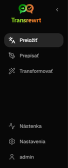
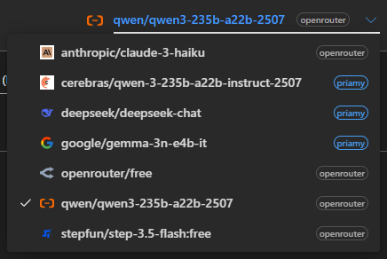
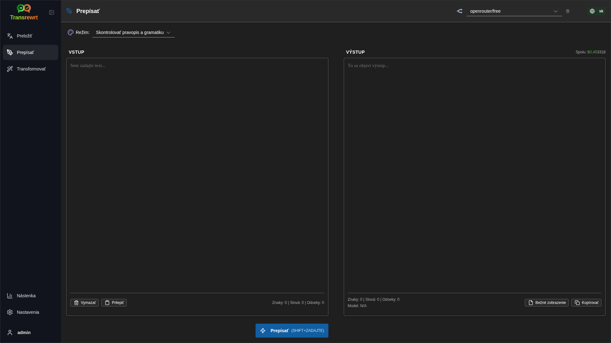
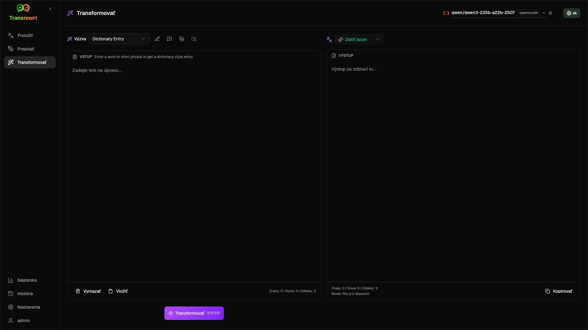
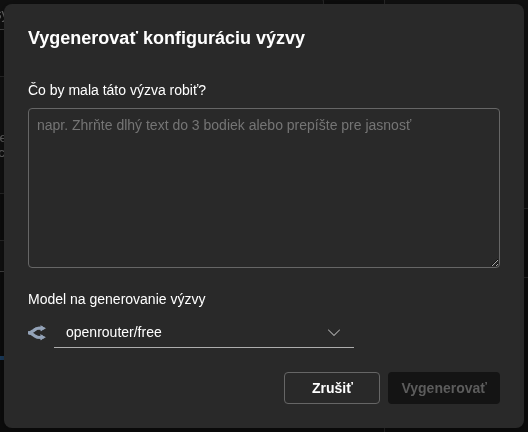
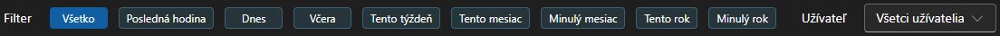

<a id="transrewrt-user-guide"></a>
# Používateľská príručka

<br/>

<a id="introduction"></a>
## Úvod

Transrewrt vám pomáha pracovať s textom tromi hlavnými spôsobmi:

- **Preložiť** - premeniť text z jedného jazyka do druhého.
- **Prepísať** - prepísať text v inom štýle, napríklad zrozumiteľnejšie, stručnejšie alebo formálnejšie.
- **Transformovať** - spracovať text pomocou vlastných pokynov pre umelú inteligenciu, ktoré sa nazývajú výzvy.

<br/>

Táto príručka vysvetľuje, ako aplikáciu používať po jej inštalácii a spustení. Pokyny k inštalácii nájdete v hlavnom súbore **[README](README.sk.md)**.

<br/>

> ℹ️ **POZNÁMKA**<br/>
> Transrewrt je dostupný ako desktopová aplikácia pre Windows a Linux, a ako samostatne hostovaná webová aplikácia. Tento sprievodca sa zameriava na každodenné používanie aplikácie. Kde sa niečo vzťahuje iba na jednu verziu, je to jasne označené.

<small>**Prečítajte si v iných jazykoch:** </small>

<small id="lang-list">[English](../USER-GUIDE.md) · [Português (BR)](./USER-GUIDE.pt-BR.md) · [العربية](./USER-GUIDE.ar.md) · [বাংলা](./USER-GUIDE.bn.md) · [Català](./USER-GUIDE.ca.md) · [中文 (中国大陆)](./USER-GUIDE.zh-CN.md) · [中文 (台灣)](./USER-GUIDE.zh-TW.md) · [Hrvatski](./USER-GUIDE.hr.md) · [Čeština](./USER-GUIDE.cs.md) · [Nederlands](./USER-GUIDE.nl.md) · [English](./USER-GUIDE.en-US.md) · [Tagalog](./USER-GUIDE.tl.md) · [Français](./USER-GUIDE.fr.md) · [Deutsch](./USER-GUIDE.de.md) · [Ελληνικά](./USER-GUIDE.el.md) · [हिन्दी](./USER-GUIDE.hi.md) · [Magyar](./USER-GUIDE.hu.md) · [Italiano](./USER-GUIDE.it.md) · [日本語](./USER-GUIDE.ja.md) · [jv](./USER-GUIDE.jv.md) · [한국어](./USER-GUIDE.ko.md) · [Bahasa Melayu](./USER-GUIDE.ms.md) · [فارسی](./USER-GUIDE.fa.md) · [Polski](./USER-GUIDE.pl.md) · [Português](./USER-GUIDE.pt.md) · [ਪੰਜਾਬੀ](./USER-GUIDE.pa.md) · [Română](./USER-GUIDE.ro.md) · [Русский](./USER-GUIDE.ru.md) · [Slovenčina](./USER-GUIDE.sk.md) · [Español](./USER-GUIDE.es.md) · [Kiswahili](./USER-GUIDE.sw.md) · [Svenska](./USER-GUIDE.sv.md) · [తెలుగు](./USER-GUIDE.te.md) · [ไทย](./USER-GUIDE.th.md) · [Türkçe](./USER-GUIDE.tr.md) · [Українська](./USER-GUIDE.uk.md) · [Tiếng Việt](./USER-GUIDE.vi.md)</small>

<small>

> **Poznámka k prekladom rozhrania a dokumentácie:** Všetky jazyky rozhrania okrem pôvodného anglického (VB) 
> boli preložené pomocou modelov umelej inteligencie; preklad môže byť nepresný alebo obsahovať chyby.

</small>

<br/>

<!-- START doctoc generated TOC please keep comment here to allow auto update -->
<!-- NEMENIŤ TÚTO ČASŤ, NAMIESTO TOHO ZNOVU SPUSTITE doctoc NA AKTUALIZÁCIU -->
**Obsah**

- [Predtým, ako začnete](#before-you-start)
  - [Ako získať bezplatný OpenRouter API kľúč (desktopová aplikácia)](#how-to-get-a-free-openrouter-api-key-desktop-app)
- [Začiatok](#getting-started)
- [Hlavné časti okna](#main-parts-of-the-window)
  - [Postranný panel](#sidebar)
  - [Nástroje](#toolbar)
  - [Panely vstupu a výstupu](#input-and-output-panels)
- [Preložiť](#translate)
  - [Preložiť text](#translate-text)
  - [Výber jazyka](#language-selection)
  - [Užitočné nastavenia prekladu](#helpful-translation-settings)
- [Prepísať](#rewrite)
- [Transformovať](#transform)
  - [Spustiť existujúcu výzvu](#run-an-existing-prompt)
  - [Ak ešte nemáte žiadne výzvy](#if-you-have-no-prompts-yet)
  - [Rýchlo vytvoriť výzvu](#create-a-prompt-quickly)
  - [Upraviť výzvu](#edit-a-prompt)
  - [Otestovať výzvu pred použitím](#test-a-prompt-before-using-it)
- [Nástenka](#dashboard)
  - [Filtrovať dáta](#filter-the-data)
  - [Karty nástenky](#dashboard-tabs)
  - [Exportovať dáta](#export-data)
  - [Odstrániť uložené záznamy pre model](#delete-stored-records-for-a-model)
- [História](#history)
  - [Filtrovať dáta](#filter-the-data-1)
  - [Exportovať historické dáta](#export-history-data)
- [Nastavenia](#settings)
  - [Hlavné nastavenia](#general-settings)
  - [Modely](#models)
  - [Jazyky](#languages)
  - [Sledovanie nákladov](#cost-tracking)
  - [Výzvy transformácie](#transform-prompts)
  - [Používatelia](#users)
  - [Konfigurácia API](#api-config)
  - [O aplikácii](#about)
- [Bežné problémy](#common-issues)
  - [Aplikácia neprekladá, neprepíše ani netransformuje text](#the-app-will-not-translate-rewrite-or-transform-text)
  - [Zoznam modelov je prázdny](#the-model-list-is-empty)
  - [Výsledok je príliš pomalý alebo príliš drahý](#the-result-is-too-slow-or-too-expensive)
  - [Rozhranie je v nesprávnom jazyku](#the-interface-is-in-the-wrong-language)
  - [Text je príliš malý alebo ťažko čitateľný](#the-text-is-too-small-or-hard-to-read)
  - [Grafy na nástenke sú prázdne](#dashboard-charts-are-empty)
  - [Náklady ukazujú "nie sú k dispozícii" alebo sa zdajú nesprávne](#cost-shows-not-available-or-seems-wrong)
  - [Celkové náklady sa nezhodujú s faktúrou môjho poskytovateľa](#total-cost-does-not-match-my-provider-bill)
  - [Stránka História chýba v postrannom paneli](#the-history-page-is-missing-from-the-sidebar)
  - [Webová aplikácia: nečakane presmerovaná na prihlasovaciu stránku](#web-app-redirected-to-the-login-page-unexpectedly)
  - [Webový správca: zabudol alebo stratil heslo](#web-admin-forgot-or-lost-a-password)
  - [Nástenka nezobrazuje žiadne dáta pre iných používateľov (web)](#dashboard-shows-no-data-for-other-users-web)
  - [Zmenil som výzvu a stratil úpravy](#i-changed-a-prompt-and-lost-the-edits)
- [Rýchle tipy](#quick-tips)
- [Zrieknutie sa zodpovednosti](#disclaimer)
- [Licencia](#license)

<!-- END doctoc generated TOC please keep comment here to allow auto update -->

<br/><br/>

<a id="before-you-start"></a>
## Predtým, ako začnete

Na používanie Transrewrt potrebujete prístup k aspoň jednému poskytovateľovi AI. Podporovaní poskytovatelia sú: [OpenRouter](https://openrouter.ai) (ktorý agreguje mnoho modelov), OpenAI, Anthropic, Google Gemini, DeepSeek, Groq, Mistral, xAI, Cerebras a [Ollama](https://ollama.com) pre lokálne modely.

Na začiatok nemusíte vyberať platený model. Hneď ako pridáte svoj OpenRouter API kľúč, aplikácia automaticky aktivuje vstavanú **bezplatnú** možnosť OpenRouter. To vám umožní okamžite začať s prekladmi, prepisovaním a transformáciou textu. Prípadne si môžete získať bezplatný API kľúč od Cerebras, Google, Groq alebo Mistral AI.

Jednoducho povedané:

- **Model** je AI motor, ktorý vykonáva prácu. Modely sú uvedené s **predponou poskytovateľa** (napríklad `openrouter/…`, `openai/…`, `ollama/…`).
- **API kľúč** (alebo pre Ollama **základná URL**) je spôsob, ako aplikácia dosiahne k danému poskytovateľovi.

Ak používate **desktopovú aplikáciu**, pridajte kľúče v časti [**Nastavenia** > **Konfigurácia API**](#api-config) pre každého poskytovateľa, ktorého používate. Ak používate iba OpenRouter, pozrite si nižšie [Ako získať API kľúč](#how-to-get-an-api-key-desktop-app). Ak nechcete používať API kľúč, môžete nainštalovať Ollama (z [ollama.com](https://ollama.com)) a používať namiesto toho lokálne modely, napríklad `translategemma:4b`.

Ak používate **webovú verziu**, správca servera nakonfiguruje poskytovateľov pomocou premenných prostredia, takže nemôžete priamo v aplikácii zadať API kľúče.

<br/>

<a id="how-to-get-an-api-key-desktop-app"></a>
### Ako získať bezplatný kľúč OpenRouter API (desktopová aplikácia)

Ak používate desktopovú aplikáciu, postupujte podľa týchto krokov:

1. Prejdite na [OpenRouter](https://openrouter.ai) vo svojom webovom prehliadači.
2. Vytvorte si účet alebo sa prihláste.
3. Otvorte stránku [Kľúče](https://openrouter.ai/keys).
4. Kliknite na tlačidlo na vytvorenie nového kľúča API.
5. Zadajte kľúču názov, aby ste ho mohli neskôr rozpoznať.
6. Skopírujte nový kľúč API.
7. Vráťte sa do aplikácie Transrewrt a otvorte **Nastavenia** > **Konfigurácia API**.
8. Prilepte kľúč do poľa **Kľúč OpenRouter API** (v časti **Nastavenia** > **Konfigurácia API**).
9. Kliknite na **Testovať kľúč OpenRouter**, aby ste sa uistili, že funguje.

<br/><br/>

<a id="getting-started"></a>
## Začíname

Ak používate Transrewrt po prvýkrát, postupujte v tomto poradí:

1. Otvorte aplikáciu.
2. Ak je to potrebné, vyberte si svoj **jazyk rozhrania** z ikony zemegule.
3. Ak používate **desktopovú aplikáciu**, otvorte [**Nastavenia** > **Konfigurácia API**](#api-config), pridajte kľúč API aspoň pre jedného poskytovateľa (napríklad OpenRouter) a kliknite na **Testovať**, aby ste overili, či to funguje.
4. Otvorte [**Nastavenia** > **Modely**](#models) a pridajte jeden alebo viac modelov do **Vybraných modelov**.
5. Otvorte [**Nastavenia** > **Jazyky**](#languages) a vyberte si svoje **Najvyššie jazyky**, ak chcete, aby sa vaše najčastejšie používané jazyky zobrazovali ako prvé.
6. Prejdite na **Preklad** a spustite jednoduchý preklad, aby ste potvrdili, že všetko funguje.
7. Keď to bude fungovať, vyskúšajte **Prepísať** a potom **Transformovať**.

Toto poradie je dôležité. Zabraňuje najčastejšiemu problému pri prvom použití: pokusu o spustenie úlohy predtým, ako má aplikácia funkčné pripojenie API alebo vybraný model.

<br/><br/>

<a id="main-parts-of-the-window"></a>
## Hlavné časti okna

Aplikácia je rozdelená do troch hlavných oblastí:

- **Bočný panel** vľavo.
- **Panel nástrojov** hore.
- **Pracovná oblasť** v strede.

<br/>

<a id="sidebar"></a>
### Bočný panel

Použite bočný panel na pohyb v rámci aplikácie. Bočný panel môžete zobraziť alebo skryť pre viac miesta kliknutím na ikonu vedľa loga aplikácie.

<br/>

<table>
  <tr>
    <td valign="top">
       
    </td>
    <td valign="top">
      <br/><br/>
      <ul>
        <li><strong>Preklad</strong> otvorí pracovnú plochu pre preklad.</li><br/>
        <li><strong>Prepísať</strong> otvorí pracovnú plochu na prepisovanie textu.</li><br/>
        <li><strong>Transformovať</strong> otvorí pracovnú plochu s vlastnou výzvou.</li><br/>
        <li><strong>Dashboard</strong> zobrazuje informácie o využití a nákladoch.</li><br/>
        <li><strong>Nastavenia</strong> otvorí panel nastavení.</li><br/>
        <li><strong>História</strong> zobrazuje históriu používania vrátane vstupného a výstupného textu.</li><br/>
        <li><strong>Užívateľ</strong> zobrazuje užívateľské meno prihláseného užívateľa (iba na webe).</li>
      </ul>
    </td>
  </tr>
</table>

<br/>

<a id="toolbar"></a>
### Panel nástrojov

Panel nástrojov sa mierne mení v závislosti od toho, kde sa v aplikácii nachádzate.

- Vľavo sa zobrazuje názov aktuálnej stránky.
- Vpravo sa zobrazuje **výber modelu** a ovládanie **Jazyk rozhrania**.

**Výber modelu** vám umožňuje zvoliť, ktorý AI engine použiť pre aktuálnu úlohu.



Niektoré bezplatné modely nemusia byť vždy dostupné – niekedy sú offline alebo majú obmedzenie používania. Ak sa tak stane, aplikácia tento model automaticky odstráni zo zoznamu dostupných. Ak chcete ovládať, ktoré modely sa zobrazujú, prejdite do [**Nastavenia** > **Modely**](#models) a upravte si zoznam modelov. 
Nastavenia modelu môžete otvoriť aj priamo kliknutím na ikonu poskytovateľa vľavo od názvu modelu na paneli nástrojov.

<br/>

**Ikona gule + kód jazyka** zmení jazyk rozhrania aplikácie, napríklad ponúk a tlačidiel. **Nezmení** jazyky prekladu používané v **Preklade**.


<br/>

<a id="input-and-output-panels"></a>
### Vstupné a výstupné panely

Väčšina pracovných priestorov používa ľavý panel **Vstup** a pravý panel **Výstup**.

Každý panel tiež zobrazuje:

| **Vstup**                                                          | **Výstup**                                                                                                                  |
|--------------------------------------------------------------------|-----------------------------------------------------------------------------------------------------------------------------|
| - Počet znakov <br/>- Počet slov <br/>- Počet odsekov   <br/> | - Ako dlho trvala úloha<br/>- **TPS** (tokeny za sekundu)<br/>- Počty znakov, slov a odsekov<br/>- Použitý model |

Ak sa pýtate na technické termíny:

- **Token** znamená malý úsek textu. Môžete o tom uvažovať ako o časti slova alebo krátkom slove.
- **TPS** znamená, koľko takýchto textových úsekov model spracoval každú sekundu.

<br/>

Môžete tiež sledovať náklady na každú operáciu (ak sú k dispozícii) a celkové náklady, ak povolíte možnosť `Show cost information on the actions` v časti [**Nastavenia** > **Hlavné nastavenia**](#general-settings).

<br/><br/>

[--------------------------------------------------------------------------------------------------------------------------]: #

<a id="translate"></a>
## Preložiť

Použite možnosť **Preložiť**, keď chcete preložiť text z jedného jazyka do druhého.


<br/>

<a id="translate-text"></a>
### Preklad textu

1. Otvorte **Preložiť**.
2. Vyberte jazyk v poli **Z**.
3. Vyberte jazyk v poli **Do**.
4. Vyberte model na paneli nástrojov.
5. Do poľa **Vstup** zadajte alebo prilepte text.
6. Kliknite na **Preložiť**.
7. Výsledok si prečítajte v sekcii **Výstup**.
8. Ak chcete výsledok skopírovať, použite tlačidlo kopírovania.

<br/>

<a id="language-selection"></a>
### Výber jazyka

- **Z** môže byť konkrétny jazyk alebo **Detekovať jazyk**.
- **Do** je jazyk, do ktorého chcete výsledok preložiť.

Vaše vybrané **najvyššie jazyky** sa zobrazia na vrchu zoznamu. Môžete ich nastaviť v časti [**Nastavenia** > **Jazyky**](#languages).

<br/>

<a id="helpful-translation-settings"></a>
### Užitočné nastavenia prekladu

V časti [**Nastavenia** > **Hlavné nastavenia**](#general-settings) môžete zmeniť správanie prekladu:

- **Automatický preklad pri vkladaní** spustí preklad ihneď po vložení textu.
- **Automatické kopírovanie výsledku do schránky** automaticky skopíruje výsledok po úspešnom spustení.
- **Preklad v reálnom čase (počas písania)** spúšťa preklady počas písania.
- **Časový limit (ms)** určuje, ako dlho aplikácia čaká pred spustením prekladu v reálnom čase.
- **Enter** ovláda, čo sa stane po stlačení `Enter`:

<br/><br/>

[--------------------------------------------------------------------------------------------------------------------------]: #

<a id="rewrite"></a>
## Prepísať

Použite **Prepísať**, keď chcete vylepšiť slovné znenie bez zmeny hlavného významu.



Toto je užitočné pre:

- opravu pravopisu a gramatiky (**Skontrolovať pravopis a gramatiku**)
- zlepšenie zrozumiteľnosti textu (**Zlepšiť zrozumiteľnosť**)
- niekoľko odlišných prepísaní v jednom spustení (**Alternatívne verzie**)
- urobenie textu formálnejšieho alebo menej formálneho (**Formálny** / **Neformálny**)
- skrátenie alebo rozšírenie textu (**Skratiť** / **Rozšíriť**)
- urobenie textu technickejším (**Urobiť technické**)

<br/>

> 💡 **TIP**<br/>
> Keď použijete režim „**Skontrolovať pravopis a gramatiku**“, v paneli výstupu sa zobrazí prepínač **Zobraziť zmeny** (vedľa **Kopírovať**).
> Zapnite alebo vypnite, aby ste zobrazili alebo skryli konkrétne opravy aplikované na váš text.

<br/><br/>

[--------------------------------------------------------------------------------------------------------------------------]: #

<a id="transform"></a>
## Transformovať

Použite **Transformovať**, keď chcete, aby AI postupovala podľa vlastného súboru pokynov.



Toto je najpružnejšia oblasť aplikácie. Môžete ju použiť na úlohy, ako napríklad:

- zhrnutie poznámok
- premena hrubého textu na vyčistený e-mail
- extrahovanie kľúčových bodov
- konverzia textu do konkrétneho formátu
- akákoľvek iná vlastná aktivita so vstupným textom

<br/>

<a id="run-an-existing-prompt"></a>
### Spustiť existujúcu výzvu

1. Otvorte **Transformovať**.
2. Vyberte výzvu zo zoznamu výziev.
3. Ak sa zobrazí pole **Cieľ**, vyberte jazyk, ak ho chcete.
4. Do poľa **Vstup** napíšte alebo vložte text.
5. Kliknite na **Transformovať**.
6. Výsledok si prečítajte v sekcii **Výstup**.

<br/>

<a id="if-you-have-no-prompts-yet"></a>
### Ak nemáte žiadne výzvy

Ak je váš zoznam výziev prázdny, kliknite na **Načítať ukážkové výzvy** v pracovnom priestore Transform. Toto ovládanie je vždy dostupné v časti [**Nastavenia** > **Výzvy transformácie**](#transform-prompts) na riadku export/import. Obe možnosti pridajú zabudované príklady, aby ste mohli rýchlo začať.

<br/>

> ℹ️ **Poznámka**<br/>
> Ukážkové výzvy sú poskytované v angličtine. Po ich načítaní môžete výzvu upraviť a použiť možnosť **Preložiť výzvu**, aby ste ju preložili do vášho jazyka.

<br/>

<a id="create-a-prompt-quickly"></a>
### Vytvoriť výzvu rýchlo

Najrýchlejší spôsob, ako vytvoriť výzvu, je:

1. Kliknite na **Nová výzva**.
2. Kliknite na **Vygenerovať výzvu**.
3. Popíšte, čo má výzva robiť.
4. Vyberte model.
5. Nechajte aplikáciu vytvoriť pre vás koncept.
6. Skontrolujte koncept a kliknite na **Uložiť**.



<br/>

<a id="edit-a-prompt"></a>
### Upraviť výzvu

Keď vytvárate alebo upravujete výzvu, editor sa zobrazí vľavo a vpravo sa zobrazí testovacia oblasť.


Hlavné polia sú:

- **Názov výzvy**: názov zobrazený v zozname výziev.
- **Inštrukcie k výzve (voliteľné)**: krátky tip zobrazený užívateľovi pri spustení výzvy.
- **Úloha modelu**: celková úloha pridelená umelému inteligencii, napríklad „Si užitočný asistent.“
- **Inštrukcie modelu (jedna na riadok)**: konkrétne pravidlá, ktoré má umelá inteligencia dodržiavať.
- **Popis výstupu**: krátky výraz opisujúci výsledok, napríklad „zhrnutie“ alebo „prepísať“.
- **Teplota (0,0 → 1,0)**: správanie modelu; pozri nižšie.
- **Pýtať sa cielového jazyka**: pridá voľbu cielového jazyka pri spustení výzvy.

Ak je pre vás technický termín **Teplota** nový, predstavte si to takto:

- **Nižšia** teplota dáva stabilnejšie a predvídateľnejšie výsledky.
- **Vyššia** teplota dáva väčšiu rozmanitosť a kreativitu.

Môžete tiež použiť:

- **`Generate prompt`** na vytvorenie nového konceptu z jednoduchého popisu
- **`Improve prompt`** na vylepšenie existujúcej výzvy
- **`Translate prompt`** na preloženie polí výzvy

<br/>

> ⚠️ **UPOZORNENIE**<br/>
> Kliknite na **`Save`**, predtým ako kliknete na **`Back to Run`**. Ak sa vrátite späť bez uloženia, vaše zmeny budú stratené.

<br/>

<a id="test-a-prompt-before-using-it"></a>
### Testovať výzvu pred jej použitím

Testovací panel vpravo vám umožňuje vyskúšať svoju výzvu s ukážkovým textom, než ju použijete v každodennom pracovnom procese.

To je užitočné v prípadoch, keď:

- vytvárate novú výzvu
- porovnávate dve verzie výzvy
- chcete skontrolovať tón, dĺžku alebo formát výstupu

<br/>

> ℹ️ **POZNÁMKA**<br/>
> Môžete exportovať a importovať uložené výzvy v časti [**Nastavenia** > **Výzvy transformácie**](#transform-prompts).

<br/><br/>

[--------------------------------------------------------------------------------------------------------------------------]: #

<a id="dashboard"></a>
## Nástenka

Použite **Nástenku**, aby ste videli, ako veľmi používate aplikáciu a aké sú jej náklady (pre modely za poplatok).


<br/>

> ℹ️ **POZNÁMKA**<br/>
> Ak používate iba **zadarmo** modely, sumy **nákladov** môžu byť nulové a zhrnutia zamerané na náklady môžu vyzerať prázdne. Na karte **Zhrnutie** časti **Použitie v čase** a **Použitie podľa modelu** sa stále zobrazujú **počty volaní** (preložiť, prepísať a transformovať), ak ste v zvolenom období niečo vykonali.

<br/>

<a id="filter-the-data"></a>
### Filtrovať údaje

Pomocou tlačidiel filtra v hornej časti zmeňte časový rozsah.



<br/>

> ℹ️ **Poznámka**<br/>
> Filter **Užívateľ** je viditeľný len pre správcov vo webovej verzii. Bežní používatelia tento filter neuvidia a nie je dostupný v desktopovej aplikácii.

<br/>

<a id="dashboard-tabs"></a>
### Karty nástenky

- **Zhrnutie** poskytuje prehľad o používaní a nákladoch. Obsahuje **Použitie v čase** (nasledujúce kumulatívne **počty volaní** podľa dní pre preklad, prepísanie a transformáciu) a **Použitie podľa modelu** (celkové **volania podľa modelu**, vrátane transformácie).
- **Podľa používania** rozdeľuje aktivitu podľa jazyka prekladu, režimu prepisovania a výzvy na transformáciu.
- **Podľa modelu** zobrazuje, ktoré modely ste použili a aké mali náklady.
- **Podľa dňa** zobrazuje denné celky.
- **Všetky volania** zobrazuje kompletnú históriu volaní a umožňuje ju exportovať.

<br/>

<a id="export-data"></a>
### Export dát

Tabuľky na nástenke môžu exportovať dáta vo formáte:

- **JSON**
- **CSV**
- **XLSX**

To je užitočné, ak chcete prebrať aktivitu mimo aplikácie alebo zdieľať správu.

<br/>

<a id="delete-stored-records-for-a-model"></a>
### Odstrániť uložené záznamy pre model

V zobrazení **Podľa modelu** alebo **Všetky volania** môžete odstrániť uložené záznamy pre model kliknutím na ikonu „koša“.

> ⚠️ **UPOZORNENIE**<br/>
> Odstránenie uložených záznamov nie je možné vrátiť späť. Použite to len vtedy, ak ste si istí, že túto históriu už nepotrebujete.

Ak chcete odstrániť všetky údaje alebo záznamy na základe ich veku, prejdite do časti [**Nastavenia** > **Sledovanie nákladov**](#cost-tracking). Tam nájdete možnosti na odstránenie všetkých uložených údajov alebo len údajov starších ako určitý dátum.

<br/><br/>

[--------------------------------------------------------------------------------------------------------------------------]: #

<a id="history"></a>
## História

Kliknutím na položku **História** zobrazíte históriu svojich akcií v rámci **Transrewrt**, vrátane vstupu a výstupu každej operácie.


<br/>

<a id="filter-the-history"></a>
### Filterovať údaje

**História** používa rovnaké filtre ako stránka **Nástenka**. Použite ich na výber časového rozsahu.


<br/>

> ℹ️ **Poznámka**<br/>
> Filter **Užívateľ** je viditeľný len pre správcov vo webovej verzii. Bežní používatelia tento filter neuvidia a nie je dostupný v desktopovej aplikácii.

<br/>

<a id="export-history-data"></a>
###  Exportovať údaje histórie

Stránka histórie môže exportovať filtrované údaje do:

- **JSON**
- **CSV**
- **XLSX**

To je užitočné, ak chcete prebrať aktivitu mimo aplikácie alebo zdieľať správu.

<br/><br/>

[--------------------------------------------------------------------------------------------------------------------------]: #

<a id="settings"></a>
## Nastavenia

Otvorte **Nastavenia** na bočnom paneli, aby ste mohli prispôsobiť správanie aplikácie.

Dostupné karty závisia od platformy a vašej role:

| Záložka               | Desktop | Web (správca) | Web (bežný užívateľ) |
  |-------------------|:-------:|:-----------:|:------------------:|
  | Hlavné nastavenia  |   áno   |     áno     |        áno         |
  | Modely            |   áno   |     áno     |        áno         |
  | Jazyky         |   áno   |     áno     |        áno         |
  | Sledovanie nákladov     |   áno   |     áno     |         -          |
  | Výzvy transformácie |   áno   |     áno     |        áno         |
  | Používatelia             |    -    |     áno     |         -          |
  | Konfigurácia API        |   áno   |     áno     |         -          |
  | O aplikácii             |   áno   |     áno     |        áno         |

<br/>

> ℹ️ **Poznámka**<br/>
> Vo webovej verzii má každý používateľ vlastnú konfiguráciu. Nastavenia ako vybrané modely, jazyky, všeobecné možnosti a výzvy transformácie sú uložené pre každého používateľa. Zmeny, ktoré vykonáte, neovplyvňujú iných používateľov.

<br/>

[--------------------------------------------------------------------------------------------------------------------------]: #

<a id="general-settings"></a>
### Hlavné nastavenia

Použite **Hlavné nastavenia** na nastavenie správania pri písaní, či sa údaje o vykonaní ukladajú do **Histórie** a vzhľadu.

**Správanie**

- **Správanie pre ENTER** vyberá, či `Enter` spustí úlohu alebo vloží nový riadok.  
- **Automatický preklad pri vkladaní** začína preklad hneď, ako vložíte text.  
- **Automatické kopírovanie výsledku do schránky** automaticky kopíruje úspešné výsledky.  
- **Preklad v reálnom čase (počas písania)** prekladá, zatiaľ čo píšete.  
- **Časový limit (ms)** nastavuje čas čakania na preklad v reálnom čase.

**História**

- **Udržovať históriu spustenia** ovláda, či každý preklad, prepísanie a transformácia ukladajú **vstupný a výstupný text** pre bočný panel [**História**](#history). Vypnutie tejto funkcie vyžaduje potvrdenie; ak potvrdíte, uložený text histórie sa odstráni z databázy.  
- **Odstrániť dáta histórie** vám umožňuje odstrániť uložený text podľa veku (napríklad starší ako niekoľko mesiacov, alebo **všetky údaje (vyčistiť)**) pomocou **Vymazať údaje**. To ovplyvňuje iba uložený text spustenia pre zobrazenie **História**; **neodstráni** náklady alebo celkové používanie. Ak chcete odstrániť alebo zredukovať údaje o **nákladoch**, použite [**Nastavenia** > **Sledovanie nákladov**](#cost-tracking).

**Vzhľad**

- **Zobraziť informácie o nákladoch pri akciách** ovláda zobrazenie nákladov na operáciu (ak sú k dispozícii) a celkové náklady na výstupné panely Preložiť, Prepísať a Transformovať.  
- **Desatinné miesta nákladov** mení spôsob zobrazenia desatinných miest nákladov.  
- **Iba web:** **zobraziť okraj okolo aplikácie** pridáva extra priestor okolo rozhrania.  
- **Rodina písma** mení písmo v textových paneloch.  
- **Veľkosť** mení veľkosť písma.

**Zálohovanie konfigurácie**

- **Zahrnúť dáta o používaní do zálohy** – ak je povolené, ZIP obsahuje aj históriu spustení a dáta volaní API. 
- **Zálohovať konfiguráciu** – vytvorí jeden súbor ZIP (`transrewrt-config-backup-YYYY-MM-DD_HHMMSS.zip` v UTC ako predvolené) s `config.json`, `state.json`, voliteľným šifrovacím kľúčom, používateľmi, predvoľbami, vlastnými výzvami a dátami o používaní, ak ste to zvolili. Po úspešnej zálohe potvrdenie zobrazí názov uloženého súboru.
- **Obnoviť zo zálohy** – najskôr sa otvorí **potvrdzovacie dialógové okno**. Vyberte zálohový súbor ZIP vo vnútri dialógu (**Prehliadať** / výber súboru alebo presunutie a vloženie, kde je to podporované), potom skontrolujte možnosti:
  - **Obnoviť dáta o používaní** – importovať používanie/históriu zo súboru ZIP, ak bola záloha vytvorená s zahrnutím používania; nezaškrtnite, ak chcete iba nastavenia a výzvy.
  - **Vymazať staré dáta o používaní pred obnovením** – odstrániť existujúce dáta o používaní/históriu v tejto inštalácii pred aplikovaním zálohy (voliteľné; použite, keď chcete čisté nahradenie).

Zálohy vytvorené buď vo webovej alebo desktopovej verzii je možné obnoviť v druhej verzii. Pri obnove desktopovej zálohy vo webovej verzii budú dáta obnovené pre administrátorského používateľa.

<br/>

<a id="models"></a>
### Modely

Použite **Nastavenia** > **Modely**, aby ste si vybrali, ktoré modely sa zobrazia na paneli nástrojov.


Stránka obsahuje dva zoznamy:

- **Dostupné modely** vľavo
- **Vybrané modely** vpravo

Užitočné ovládacie prvky zahŕňajú:

- **Vyhľadať modely...** na nájdenie modelu podľa názvu
- **Poskytovateľ** čipy na zúženie zoznamu na jeden engine (OpenRouter, OpenAI, Ollama, …)
- **Iba zadarmo** na zobrazenie len bezplatných modelov
- **Obnoviť** na opätovné načítanie zoznamu
- **Rozbaliť všetko** a **Zbaliť všetko**, keď triedite podľa poskytovateľa

Identifikátory modelov obsahujú predponu poskytovateľa (napríklad `openrouter/…` oproti `openai/…`). Označenia ako **OpenAI (OpenRouter)** oproti **OpenAI (priamy)** ukazujú, ako je prevádzka smerovaná.

> ℹ️ **Poznámka**<br/>
> **OpenRouter Body Builder** (`openrouter/bodybuilder`) je smerovací model, nie všeobecný rozhovorový model: jeho odpoveď je JSON, ktorý popisuje telá požiadaviek OpenRouter API (napríklad poľe `requests` s `model` a `messages`). Ak ho použijete na **Preložiť**, **Prepísať** alebo **Transformovať**, panel výstupu zobrazí tento JSON namiesto hotového textu. Na tieto úlohy si vyberte normálny textový model. Viac informácií na [stránke modelu Body Builder](https://openrouter.ai/openrouter/bodybuilder) na OpenRouter.

Akcie:

- Ak chcete pridať model, kliknite na **Pridať** alebo kamkoľvek do položky.

- Ak chcete odstrániť model, kliknite na **X** vedľa neho v časti **Vybrané modely** alebo na **Vybrané** v položke Dostupné modely.

- Ak chcete vymazať zoznam, kliknite na **Zrušiť výber všetkých**. Požadovaný bezplatný model zostane v zozname.

<br/>

> ℹ️ **Poznámka**<br/>
> Ak nechcete hneď pridať kredity do OpenRouter, začnite tým, že povolíte možnosť **Iba zadarmo** a vyberiete si bezplatné modely (nie je potrebná kreditná karta). Môžete tiež použiť Ollama na spustenie modelov lokálne bez akéhokoľvek kľúča API.

<br/>

<a id="languages"></a>
### Jazyky

Použite **Nastavenia** > **Jazyky** na usporiadanie zoznamov jazykov používaných v aplikácii.

- **Najvyššie jazyky** sú prichytené v blízkosti hornej časti zoznamov jazykov v **Preložiť** a **Transformovať**.
- **Vlastný jazyk** vám umožňuje pridať jazyk, ktorý nie je v zozname zabudovaných jazykov.

Ak pridáte vlastný jazyk, zobrazí sa výberom jazykov spolu s vopred definovanými možnosťami.

<br/>

<a id="cost-tracking"></a>
### Sledovanie nákladov

Použite **Nastavenia** > **Sledovanie nákladov** na správu informácií o nákladoch.

- **Celkové náklady** zobrazujú bežiaci súčet.
- **Kopírovať hodnotu** skopíruje celkovú sumu do schránky.
- **Obnoviť náklady** obnoví uložený súčet na nulu.
- **Synchronizovať so využitím API kľúča** nastaví súčet tak, aby zodpovedal využitiu uvedenému vo vašom účte OpenRouter (iba OpenRouter).
- **Využitie API kľúča** zobrazí podrobnosti o využití OpenRouter, ak sú k dispozícii.
- **Odstrániť nákladové údaje** odstráni všetky údaje alebo len záznamy staršie ako vybraný dátum.

**Sledovanie nákladov:** Keď používate modely OpenRouter, aplikácia zobrazuje vaše skutočné využitie a výdavky na základe informácií o nákladoch od OpenRouter. Pre všetkých ostatných poskytovateľov aplikácia odhaduje náklady pomocou cien zverejnených OpenRouter; ak nie je cena k dispozícii, odhad môže byť nulový.

<br/>

> ℹ️ **POZNÁMKA**<br/>
>  **Všetky údaje o nákladoch sú len odhady na vašu informáciu, nie sú to oficiálne fakturačné vyhlásenia.**

<br/>

> ⚠️ **UPOZORNENIE**<br/>
> Odstránenie údajov nie je možné vrátiť späť. Pred odstránením sa uistite, že si svoje údaje zálohujete alebo exportujete cez [**História**](#history) 
> alebo [**Nástenka** > **Všetky volania**](#dashboard-tabs), inak budú natrvalo stratené. 
> Odstránia sa tiež všetky histórie vstupov/výstupov súvisiace s každým záznamom volania API.

<br/>

<a id="transform-prompts"></a>
### Výzvy transformácie

Použite **Nastavenia** > **Výzvy transformácie** na hromadné spravovanie výziev.

Môžete:

- prehliadať uložené výzvy
- odstrániť výzvy
- importovať výzvy zo súboru
- exportovať výzvy na zálohovanie alebo zdieľanie
- načítať ukážkové výzvy do zoznamu výziev

<br/>

<a id="users"></a>
### Používatelia

Použite **Používatelia** na správu užívateľských účtov vo webovej verzii. Môžete pridávať používateľov, aktualizovať ich údaje, obnoviť heslá a odstraňovať účty.

<br/>

<a id="api-config"></a>
### Konfigurácia API

Podporovaní poskytovatelia sú: OpenRouter, OpenAI, Anthropic, Google Gemini, DeepSeek, Groq, Mistral, xAI, Cerebras a **Ollama** (lokálne modely cez základnú URL). Stačí nakonfigurovať len tých poskytovateľov, ktorých používate.

**Webová aplikácia: iba pre správcu**

API kľúče sa konfigurujú prostredníctvom systémových alebo Docker premenných prostredia – nezadávajú sa vo webovom rozhraní. Táto stránka zobrazuje, pre ktorých poskytovateľov je kľúč nakonfigurovaný, a umožňuje vám každého otestovať kliknutím na tlačidlo **`Test`**.

<br/>

> ℹ️ **Poznámka**<br/>
> Ak chcete zmeniť kľúč API, aktualizujte premennú prostredia vo svojom systéme alebo v konfigurácii Docker a reštartujte server alebo kontajner.

> ℹ️ **Poznámka**<br/>
> **Zálohovanie konfigurácie** (pozri [**Hlavné nastavenia** → Zálohovanie konfigurácie](#general-settings)) môže vnútri súboru `config.json` vo formáte ZIP obsahovať **rozlúštené** kľúče poskytovateľov. Obnovenie tohto súboru ZIP **neprevezme** tieto kľúče späť do konfiguračného súboru uloženého na serveri – aktívne kľúče stále pochádzajú z prostredia a existujúceho stavu súboru, ako je uvedené vyššie.

<br/>

**Desktopová aplikácia**

Použite **Konfiguráciu API** na uloženie kľúčov API pre každého poskytovateľa, ktorého využívate. Pre Ollama zadajte **základnú URL** namiesto kľúča API.

<br/>

> 💡 **Tip** <br/>
> Ak nechcete používať kľúč API alebo platiť za využívanie, môžete [stiahnuť Ollama](https://ollama.com) a spustiť modely (napr. `translategemma:4b`) lokálne na svojom počítači zadarmo. Prípadne môžete vytvoriť bezplatný účet OpenRouter (bez potreby kreditnej karty) a využívať ich bezplatné modely, alebo získať bezplatný kľúč API od Cerebras, Google, Groq alebo Mistral AI.

<br/>

- Pridajte len poskytovateľov, ktorých potrebujete. V časti **Nastavenia** > **Modely** začína každé ID modelu názvom poskytovateľa (napríklad `openrouter/openrouter/free`, `openai/gpt-4o`, `ollama/llama3`).

Ak chcete pridať API kľúč, zadajte hodnotu do textového poľa a kliknite na **`Save`**. Ak chcete nahradiť existujúci kľúč, kliknite na **`Edit`**. Ak chcete overiť, či kľúč funguje, kliknite na **`Test`**. Pre základné URL Ollamy vždy kliknite na **`Test`**, aby ste skontrolovali pripojenie.

<br/>

> ℹ️ **Poznámka**<br/>
> Aktuálnu hodnotu API kľúča nemôžete vidieť. Môžete ho len nahradiť pomocou tlačidla **`Edit`**.
> API kľúče sú uložené zašifrované v konfigurácii.

<br/>

<a id="about"></a>
### O aplikácii

Na záložke **O aplikácii** sa zobrazuje:

- názov aplikácie
- číslo verzie
- dátum zostavenia
- odkaz na repozitár projektu

<br/><br/>

<a id="common-issues"></a>
## Bežné problémy

Ak niečo nefunguje podľa očakávania, skontrolujte najskôr nasledujúce body.

<br/>

<a id="the-app-will-not-translate-rewrite-or-transform-text"></a>
### Aplikácia neprekladá, neprepisuje alebo netransformuje text

Skontrolujte, či:

- vybrali ste model na paneli nástrojov
- aspoň jeden model je uvedený v časti [**Nastavenia** > **Modely**](#models)
- vaše nastavenie API funguje

Ak používate desktopovú aplikáciu:

1. Otvorte [**Nastavenia** > **Konfigurácia API**](#api-config).
2. Skontrolujte, či je uložený aspoň jeden API kľúč.
3. Kliknite na **Testovať** vedľa poskytovateľa, aby ste potvrdili, že kľúč funguje.

<br/>

<a id="the-model-list-is-empty"></a>
### Zoznam modelov je prázdny

Otvorte [**Nastavenia** > **Modely**](#models) a kliknite na **Obnoviť**.

Ak je to potrebné:

- vyhľadajte model
- zapnite **Iba zadarmo**
- pridajte jeden alebo viac modelov do **Vybrané modely**

<br/>

<a id="the-result-is-too-slow-or-too-expensive"></a>
### Výsledok je príliš pomalý alebo príliš drahý

Vyskúšajte jednu alebo viacero z týchto možností:

- vyberte iný model
- použite kratší vstup
- vypnite **Preklad v reálnom čase (počas písania)** v časti [**Nastavenia** > **Hlavné nastavenia**](#general-settings)
- použite zadarmo modely na jednoduché úlohy (pozri [Modely](#models))

<br/>

<a id="the-interface-is-in-the-wrong-language"></a>
### Rozhranie je v nesprávnom jazyku

Kliknite na ikonu gule v [paneli nástrojov](#toolbar) a vyberte si svoj preferovaný **Jazyk rozhrania**.

<br/>

<a id="the-text-is-too-small-or-hard-to-read"></a>
### Text je príliš malý alebo ťažko čitateľný

Otvorte [**Nastavenia** > **Hlavné nastavenia**](#general-settings) a zmeňte:

- **Rodina písma**
- **Veľkosť**

<br/>

<a id="dashboard-charts-are-empty"></a>
### Grafy na nástenke sú prázdne

To je normálne, ak:

- používate iba **bezplatné modely** a pozriete sa na údaje o **nákladoch** (môžu byť nulové); grafy počtu volaní o **využití** na karte **Zhrnutie** stále potrebujú dáta z vybraného obdobia
- vybraný **časový filter** nezachytáva obdobie, keď boli volania vykonané – skúste **Všetko**, aby ste to skontrolovali

Ak sú grafy stále prázdne po výbere **Všetko**, skontrolujte, či sa volania zobrazujú v časti [**História**](#history) alebo na karte **Všetky volania**.

<br/>

<a id="cost-shows-not-available-or-seems-wrong"></a>
### Náklady zobrazujú „nedostupné“ alebo sa zdajú byť nesprávne

Ak používate modely prostredníctvom **OpenRouter**, aplikácia zobrazí vaše skutočné výdavky nahlásené spoločnosťou OpenRouter.

Pre **ostatných poskytovateľov** (priamy OpenAI, priamy Anthropic atď.) sú náklady odhadované na základe cenových údajov zverejnených spoločnosťou OpenRouter. Ak sa pre model nenájde zodpovedajúca cena, náklady sa zobrazia ako **nedostupné** a nebudú pripočítané k vášmu bežiacemu súčtu.

<br/>

<a id="total-cost-does-not-match-my-provider-bill"></a>
### Celkové náklady sa nezhodujú s účtom od poskytovateľa

Všetky údaje o nákladoch v aplikácii sú **odhadované iba na informačné účely**, nie sú to oficiálne fakturačné vyhlásenia.

Ak chcete, aby sa celková suma viac priblížila vašim skutočným výdavkom na OpenRouter, otvorte [**Nastavenia** > **Sledovanie nákladov**](#cost-tracking) a kliknite na **Synchronizovať so využitím API kľúča**.

<br/>

<a id="the-history-page-is-missing-from-the-sidebar"></a>
### Stránka História chýba na bočnom paneli

Možno je vypnutá možnosť **Udržovať históriu spustenia**. Otvorte [**Nastavenia** > **Hlavné nastavenia**](#general-settings) a zapnite ju. Upozorňujeme, že zapnutím sa neobnovia predtým odstránené údaje histórie.

<br/>

<a id="web-app-session-expired"></a>
### Webová aplikácia: neočakávane presmerovaná na prihlasovaciu stránku

Vaša relácia mohla vypršať. Prihláste sa znova. Ak sa to stáva často, skontrolujte nastavenia konfigurácie servera pre dobu trvania relácie.

<br/>

<a id="web-admin-forgot-or-lost-a-password"></a>
### Webový správca: zabudnuté alebo stratené heslo

Toto sa vzťahuje na **webovú aplikáciu hostovanú vlastnou** (Docker), nie na desktopovú aplikáciu (Electron).

- Ak sa môže iný správca stále prihlásiť, môže otvoriť [**Nastavenia** > **Používatelia**](#users), vybrať účet a nastaviť tam **nové heslo**.
- Ak ste **zablokovaní**, ale máte **prístup k príkazovému riadku** stroja alebo kontajnera, obnovte heslo pomocou nástroja, ktorý je súčasťou obrazu (nahraďte `transrewrt`, ak ste zmenili predvolený názov, a uzátvorkujte heslo, ak obsahuje medzery alebo špeciálne znaky):

```bash
docker exec transrewrt reset-web-password '<username>' '<new-password>'
```

Predvolené užívateľské meno správcu je `admin`, ak ste nikdy nevytvorili iné účty. Keď zadáte len jeden argument, považuje sa za nové heslo pre `admin`.

Ak spúšťate aplikáciu z **zdrojového kódu** namiesto Dockeru, použite:

```bash
pnpm run reset-web-password -- <username> <new-password>
```

Skript aktualizuje záznam používateľa v databáze SQLite (a môže vytvoriť používateľa `admin`, ak chýba). Po obnovení sa prihláste s novým heslom.

<br/>

<a id="dashboard-shows-no-data-for-other-users"></a>
### Nástenka zobrazuje žiadne dáta pre ostatných používateľov (web)

Iba **administrátori** môžu prostredníctvom filtra **Užívateľ** zobraziť dáta všetkých používateľov. Bežní používatelia z dôvodu návrhu vidia len svoju vlastnú aktivitu.

<br/>

<a id="i-changed-a-prompt-and-lost-the-edits"></a>
### Zmenil som výzvu a stratil som úpravy

Pri úprave výzvy vždy kliknite na **Uložiť**, predtým ako kliknete na **Späť na Spustiť**.

<br/><br/>

<a id="quick-tips"></a>
## Rýchle tipy

- Začnite s možnosťou [**Preložiť**](#translate), aby ste sa uistili, že je všetko správne nastavené, predtým, než prejdete na [**Prepísať**](#rewrite) alebo [**Transformovať**](#transform).
- Použite [**Prepísať**](#rewrite) na každodenné zlepšovanie formulácií.
- Použite [**Transformovať**](#transform), keď potrebujete opakovateľný pracovný postup pre konkrétnu úlohu.
- Použite [**Nástenku**](#dashboard), ak chcete sledovať využitie a náklady.
- Použite [**Históriu**](#history) na prehliadnutie minulých operácií vrátane celého vstupného a výstupného textu.
- Pravidelne exportujte výzvy, ak budujete knižnicu výziev, ktorú chcete mať v bezpečí (pozri [Výzvy transformácie](#transform-prompts)), alebo ak ju chcete zdieľať s inými.

<br/><br/>

<a id="disclaimer"></a>
## Zrieknutie sa zodpovednosti

Názvy produktov a ikony patria ich príslušným vlastníkom a používajú sa výlučne na identifikačné účely. Tento softvér nie je spojený ani odporúčaný žiadnou z uvedených značiek.

<br/><br/>

<a id="license"></a>
## Licencia

Autorské práva © 2026 Waldemar Scudeller Jr.

[Apache License 2.0](../LICENSE)
