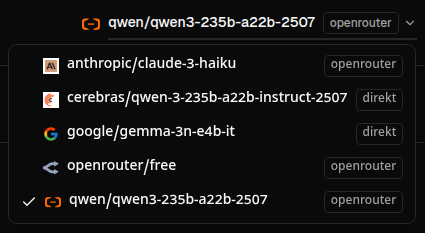
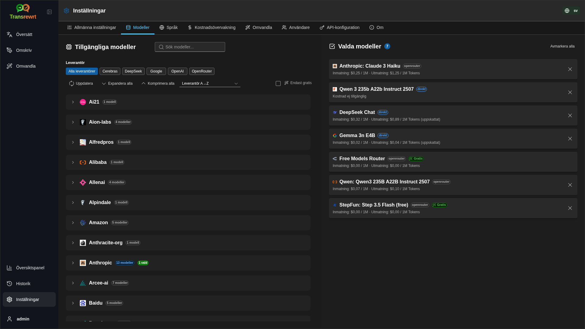

<a id="transrewrt-user-guide"></a>
# Användarhandbok

<br/>

<a id="introduction"></a>
## Introduktion

Transrewrt hjälper dig att arbeta med text på tre sätt:

- **Översätt** - konvertera text från ett språk till ett annat.
- **Omskriv** - formulera om text i en annan stil, till exempel tydligare, kortare eller mer formell.
- **Omvandla** - bearbeta text med anpassade AI-instruktioner som kallas prompts.

<br/>

Den här guiden förklarar hur du använder appen när den är installerad och igång. För installationssteg, se huvud- **[README](README.sv.md)**.

<br/>

> ℹ️ **OBS**<br/>
> Transrewrt finns tillgängligt som en skrivbordsapp för Windows och Linux, och som en självvärdd webbapp. Den här guiden fokuserar på vardagligt bruk av appen. När något endast gäller en version är det tydligt markerat.

<small>**Läs på andra språk:** </small>
<small id="lang-list">[English (GB)](../USER-GUIDE.md) · [Português (Brasil)](./USER-GUIDE.pt-BR.md) · [العربية](./USER-GUIDE.ar.md) · [বাংলা](./USER-GUIDE.bn.md) · [Català](./USER-GUIDE.ca.md) · [中文 (中国大陆)](./USER-GUIDE.zh-CN.md) · [中文 (台灣)](./USER-GUIDE.zh-TW.md) · [Hrvatski](./USER-GUIDE.hr.md) · [Čeština](./USER-GUIDE.cs.md) · [Nederlands](./USER-GUIDE.nl.md) · [English (US)](./USER-GUIDE.en-US.md) · [Tagalog](./USER-GUIDE.tl.md) · [Français](./USER-GUIDE.fr.md) · [Deutsch](./USER-GUIDE.de.md) · [Ελληνικά](./USER-GUIDE.el.md) · [हिन्दी](./USER-GUIDE.hi.md) · [Magyar](./USER-GUIDE.hu.md) · [Italiano](./USER-GUIDE.it.md) · [日本語](./USER-GUIDE.ja.md) · [한국어](./USER-GUIDE.ko.md) · [Bahasa Melayu](./USER-GUIDE.ms.md) · [فارسی](./USER-GUIDE.fa.md) · [Polski](./USER-GUIDE.pl.md) · [Basa Jawa](./USER-GUIDE.jv.md) · [Português](./USER-GUIDE.pt.md) · [ਪੰਜਾਬੀ](./USER-GUIDE.pa.md) · [Română](./USER-GUIDE.ro.md) · [Русский](./USER-GUIDE.ru.md) · [Slovenčina](./USER-GUIDE.sk.md) · [Español](./USER-GUIDE.es.md) · [Kiswahili](./USER-GUIDE.sw.md) · [Svenska](./USER-GUIDE.sv.md) · [తెలుగు](./USER-GUIDE.te.md) · [ไทย](./USER-GUIDE.th.md) · [Türkçe](./USER-GUIDE.tr.md) · [Українська](./USER-GUIDE.uk.md) · [Tiếng Việt](./USER-GUIDE.vi.md)</small>

<small>

> **Obs om översättningar av gränssnitt och dokumentation:** Alla gränssnittsspråk utom det ursprungliga engelska (UK) 
> har översatts med AI-modeller; formuleringarna kan vara otydliga eller innehålla fel.

</small>

<br/>

<!-- START doctoc generated TOC please keep comment here to allow auto update -->
<!-- DON'T EDIT THIS SECTION, INSTEAD RE-RUN doctoc TO UPDATE -->
**Innehållsförteckning**

- [Innan du börjar](#before-you-start)
  - [Så här får du en gratis OpenRouter API-nyckel (skrivbordsapp)](#how-to-get-a-free-openrouter-api-key-desktop-app)
- [Komma igång](#getting-started)
- [Huvuddelar i fönstret](#main-parts-of-the-window)
  - [Sidofält](#sidebar)
  - [Verktygsfält](#toolbar)
  - [Inmatnings- och utmatningsfönster](#input-and-output-panels)
- [Översätt](#translate)
  - [Översätt text](#translate-text)
  - [Språkval](#language-selection)
  - [Användbara översättningsinställningar](#helpful-translation-settings)
- [Omskriv](#rewrite)
- [Transformera](#transform)
  - [Kör en befintlig prompt](#run-an-existing-prompt)
  - [Om du inte har några prompts än](#if-you-have-no-prompts-yet)
  - [Skapa en prompt snabbt](#create-a-prompt-quickly)
  - [Redigera en prompt](#edit-a-prompt)
  - [Testa en prompt innan du använder den](#test-a-prompt-before-using-it)
- [Instrumentpanel](#dashboard)
  - [Filtrera data](#filter-the-data)
  - [Flikar i instrumentpanelen](#dashboard-tabs)
  - [Exportera data](#export-data)
  - [Ta bort lagrade poster för en modell](#delete-stored-records-for-a-model)
- [Historik](#history)
  - [Filtrera data](#filter-the-data-1)
  - [Exportera historikdata](#export-history-data)
- [Inställningar](#settings)
  - [Allmänna inställningar](#general-settings)
  - [Modeller](#models)
  - [Språk](#languages)
  - [Kostnadsöversikt](#cost-tracking)
  - [Transformera prompts](#transform-prompts)
  - [Användare](#users)
  - [API-konfiguration](#api-config)
  - [Om](#about)
- [Vanliga problem](#common-issues)
  - [Appen översätter, omskriver eller transformerar inte text](#the-app-will-not-translate-rewrite-or-transform-text)
  - [Modellistan är tom](#the-model-list-is-empty)
  - [Resultatet är för långsamt eller för dyrt](#the-result-is-too-slow-or-too-expensive)
  - [Gränssnittet är på fel språk](#the-interface-is-in-the-wrong-language)
  - [Texten är för liten eller svår att läsa](#the-text-is-too-small-or-hard-to-read)
  - [Diagrammen i instrumentpanelen är tomma](#dashboard-charts-are-empty)
  - [Kostnaden visar "inte tillgänglig" eller verkar felaktig](#cost-shows-not-available-or-seems-wrong)
  - [Total kostnad stämmer inte med leverantörens faktura](#total-cost-does-not-match-my-provider-bill)
  - [Historiksida saknas i sidofältet](#the-history-page-is-missing-from-the-sidebar)
  - [Webbapp: omdirigeras till inloggningssidan oväntat](#web-app-redirected-to-the-login-page-unexpectedly)
  - [Webbadmin: glömt eller förlorat lösenord](#web-admin-forgot-or-lost-a-password)
  - [Instrumentpanelen visar ingen data för andra användare (webb)](#dashboard-shows-no-data-for-other-users-web)
  - [Jag ändrade en prompt och förlorade redigeringen](#i-changed-a-prompt-and-lost-the-edits)
- [Snabbtips](#quick-tips)
- [Ansvarsfriskrivning](#disclaimer)
- [Licens](#license)

<!-- END doctoc generated TOC please keep comment here to allow auto update -->

<br/><br/>

<a id="before-you-start"></a>
## Innan du börjar

För att använda Transrewrt behöver du tillgång till minst en AI-leverantör. De stödda leverantörerna är: [OpenRouter](https://openrouter.ai) (som samlar många modeller), OpenAI, Anthropic, Google Gemini, DeepSeek, Groq, Mistral, xAI, Cerebras, och [Ollama](https://ollama.com) för lokala modeller.

Du behöver inte välja en betald modell för att komma igång. Så snart du lägger till din OpenRouter-API-nyckel aktiverar appen automatiskt ett inbyggt **gratis** OpenRouter-alternativ. Detta gör att du kan börja översätta, skriva om och omvandla text direkt. Alternativt kan du också skaffa en gratis API-nyckel från Cerebras, Google, Groq eller Mistral AI.

Med andra ord:

- En **modell** är den AI-motor som utför arbetet. Modeller visas med ett **leverantörs-prefix** (till exempel `openrouter/…`, `openai/…`, `ollama/…`).
- En **API-nyckel** (eller, för Ollama, en **bas-URL**) är hur appen når den leverantören.

Om du använder **skrivbordsappen**, lägg till nycklar i [**Inställningar** > **API-konfiguration**](#api-config) för varje leverantör du använder. För endast OpenRouter-användning, se [Så här får du en API-nyckel](#how-to-get-an-api-key-desktop-app) nedan. Om du inte vill använda en API-nyckel kan du installera Ollama (från [ollama.com](https://ollama.com)) och använda lokala modeller istället, till exempel `translategemma:4b`.

Om du använder **webbversionen** konfigurerar serverägaren leverantörer med miljövariabler, så du kan inte ange API-nycklar direkt i applikationen.

<br/>

<a id="how-to-get-an-api-key-desktop-app"></a>
### Så här får du en gratis OpenRouter API-nyckel (skrivbordsapp)

Om du använder skrivbordsappen, följ dessa steg:

1. Gå till [OpenRouter](https://openrouter.ai) i din webbläsare.
2. Skapa ett konto eller logga in.
3. Öppna sidan [Nycklar](https://openrouter.ai/keys).
4. Klicka på knappen för att skapa en ny API-nyckel.
5. Ge nyckeln ett namn så att du kan identifiera den senare.
6. Kopiera den nya API-nyckeln.
7. Återgå till Transrewrt och öppna **Inställningar** > **API-konfiguration**.
8. Klistra in nyckeln i **OpenRouter API-nyckel** (under **Inställningar** > **API-konfiguration**).
9. Klicka på **Testa OpenRouter-nyckel** för att säkerställa att den fungerar.

<br/><br/>

<a id="getting-started"></a>
## Komma igång

Om detta är första gången du använder Transrewrt, följ denna ordning:

1. Öppna appen.
2. Välj ditt **gränssnittsspråk** från globikonen om det behövs.
3. Om du använder **skrivbordsappen**, öppna [**Inställningar** > **API-konfiguration**](#api-config), lägg till en API-nyckel för minst en leverantör (till exempel OpenRouter) och klicka på **Testa** för att verifiera att den fungerar.
4. Öppna [**Inställningar** > **Modeller**](#models) och lägg till en eller flera modeller i **Valda modeller**.
5. Öppna [**Inställningar** > **Språk**](#languages) och välj dina **Topp-språk** om du vill att dina mest använda språk ska visas först.
6. Gå till **Översätt** och kör en enkel översättning för att bekräfta att allt fungerar.
7. När det fungerar kan du prova **Omskriv** och sedan **Transformera**.

Den här ordningen är viktig. Den förhindrar det vanligaste problemet vid första användningen: att försöka köra en uppgift innan appen har en fungerande API-anslutning eller en vald modell.

<br/><br/>

<a id="main-parts-of-the-window"></a>
## Huvuddelar i fönstret

Appen är uppdelad i tre huvudområden:

- Den vänstra **sidofältet**.
- Den **verktygsraden** högst upp.
- **Arbetsområdet** i mitten.

<br/>

<a id="sidebar"></a>
### Sidofält

Använd sidofältet för att navigera i appen. Du kan dölja sidofältet för att få mer utrymme genom att klicka på ikonen bredvid applogotypen.

<br/>

<table>
  <tr>
    <td valign="top">
       
    </td>
    <td valign="top">
      <br/><br/>
      <ul>
        <li><strong>Översätt</strong> öppnar arbetsytan för översättning.</li><br/>
        <li><strong>Skriv om</strong> öppnar arbetsytan för omskrivning.</li><br/>
        <li><strong>Transformera</strong> öppnar arbetsytan för anpassade frågor.</li><br/>
        <li><strong>Instrumentpanel</strong> visar användning och kostnadsinformation.</li><br/>
        <li><strong>Inställningar</strong> öppnar inställningspanelen.</li><br/>
        <li><strong>Historik</strong> visar användningshistoriken med inmatning och utmatning</li><br/>
        <li><strong>Användare</strong> visar användarnamnet för den inloggade användaren (endast webb).</li>
      </ul>
    </td>
  </tr>
</table>

<br/>

<a id="toolbar"></a>
### Verktygsfält

Verktygsfältet ändras något beroende på var du befinner dig i appen.

- Till vänster visas namnet på den aktuella sidan.
- Till höger visas **modellväljaren** och kontrollen för **Gränssnittsspråk**.

Med **modellväljaren** kan du välja vilken AI-motor som ska användas för den aktuella uppgiften.



Vissa gratismodeller kanske inte alltid är tillgängliga – ibland är de offline eller har en användningsgräns. Om detta inträffar kommer appen automatiskt att ta bort den modellen från din tillgängliga lista. För att styra vilka modeller som visas, gå till [**Inställningar** > **Modeller**](#models) och redigera din modelllista.
Du kan också öppna modellinställningarna direkt genom att klicka på leverantörens ikon till vänster om modellnamnet i verktygsfältet.

<br/>

**Globikonen + språkkod** ändrar appens gränssnittsspråk, till exempel menyer och knappar. Det ändrar **inte** översättningsspråken som används i **Översätt**.


<br/>

<a id="input-and-output-panels"></a>
### Inmatnings- och utmatningsfönster

De flesta arbetsytor använder en vänster **Inmatning**-panel och en höger **Utmatning**-panel.

Varje panel visar också:

| **Inmatning**                                                          | **Utmatning**                                                                                                                  |
|--------------------------------------------------------------------|-----------------------------------------------------------------------------------------------------------------------------|
| - Teckenantal <br/>- Antal ord <br/>- Styckenantal   <br/> | - Hur lång tid uppgiften tog<br/>- **Svar per sekund (TPS)** (tokens per second)<br/>- Antal tecken, ord och stycken<br/>- Den använda modellen |

Om du undrar över de tekniska termerna:

- **Token** betyder en liten textbit. Du kan tänka på det som en del av ett ord eller ett kort ord.
- **Svar per sekund (TPS)** betyder hur många sådana textbitar modellen bearbetade varje sekund.

<br/>

Du kan också övervaka kostnaden för varje åtgärd (om tillgängligt) och den totala kostnaden genom att aktivera alternativet `Show cost information on the actions` under [**Inställningar** > **Allmänna inställningar**](#general-settings).

<br/><br/>

[--------------------------------------------------------------------------------------------------------------------------]: #

<a id="translate"></a>
## Översätt

Använd **Översätt** när du vill konvertera text från ett språk till ett annat.


<br/>

<a id="translate-text"></a>
### Översätt text

1. Öppna **Översätt**.
2. Välj ett språk i **Från**.
3. Välj ett språk i **Till**.
4. Välj en modell i verktygsfältet.
5. Skriv eller klistra in text i **Inmatning**.
6. Klicka på **Översätt**.
7. Läs resultatet i **Utmatning**.
8. Använd kopieringsknappen om du vill kopiera resultatet.

<br/>

<a id="language-selection"></a>
### Språkval

- **Från** kan vara ett specifikt språk eller **Identifiera språk**.
- **Till** är det språk du vill ha resultatet på.

Dina valda **toppspråk** visas överst i listan. Du kan ställa in dessa i [**Inställningar** > **Språk**](#languages).

<br/>

<a id="helpful-translation-settings"></a>
### Användbara översättningsinställningar

I [**Inställningar** > **Allmänna inställningar**](#general-settings) kan du ändra hur översättning fungerar:

- **Automatisk översättning vid klistra in** kör en översättning så fort du klistrar in text.
- **Kopiera resultat till urklipp automatiskt** kopierar resultatet automatiskt efter en lyckad körning.
- **Översättning i realtid (medan du skriver)** kör översättningar medan du skriver.
- **Tidsgräns (ms)** styr hur länge appen väntar innan den kör en översättning i realtid.
- **Retur** styr vad som händer när du trycker på `Enter`:

<br/><br/>

[--------------------------------------------------------------------------------------------------------------------------]: #

<a id="rewrite"></a>
## Omskriv

Använd **Omskriv** när du vill förbättra formuleringen utan att ändra huvudbetydelsen.


Detta är användbart för:

- rätta stavning och grammatik (**Kontrollera stavning och grammatik**)
- göra texten tydligare (**Förbättra tydlighet**)
- flera olika omskrivningar i en körning (**Alternativa versioner**)
- göra texten mer formell eller mindre formell (**Formell** / **Informell**)
- förkorta eller utöka text (**Förkorta** / **Utöka**)
- göra texten mer teknisk (**Gör teknisk**)

<br/>

> 💡 **TIP**<br/>
> När du använder läget "**Kontrollera stavning och grammatik**" visas en växel **Visa ändringar** i utdatapanelen (bredvid **Kopiera**).
> Slå på eller av den för att visa eller dölja de specifika korrigeringar som tillämpats på din text.

<br/><br/>

[--------------------------------------------------------------------------------------------------------------------------]: #

<a id="transform"></a>
## Omvandla

Använd **Omvandla** när du vill att AI:n ska följa en anpassad uppsättning instruktioner.


Detta är den mest flexibla delen av appen. Du kan använda den för uppgifter såsom:

- sammanfatta anteckningar
- omvandla rå text till ett polerat e-postmeddelande
- extrahera nyckelpunkter
- konvertera text till ett specifikt format
- någon annan anpassad aktivitet med inmatad text

<br/>

<a id="run-an-existing-prompt"></a>
### Kör en befintlig fråga

1. Öppna **Omvandla**.
2. Välj en prompt från promptlistan.
3. Om en ruta för **Målspråk** visas, välj ett språk om du vill.
4. Skriv eller klistra in text i **Inmatning**.
5. Klicka på **Omvandla**.
6. Läs resultatet i **Utmatning**.

<br/>

<a id="if-you-have-no-prompts-yet"></a>
### Om du inte har några frågor ännu

Om din frågelista är tom, klicka på **Ladda exempelprompts** i omvandlingsarbetsytan. Samma kontroll finns alltid i [**Inställningar** > **Omvandlingspåminnelser**](#transform-prompts) på export/import-rad. Båda lägger till inbyggda exempel så att du kan komma igång snabbt.

<br/>

> ℹ️ **OBS**<br/>
> Exempelprompts tillhandahålls på engelska. Efter att du har laddat dem kan du redigera en fråga och använda **Översättningsförfrågan** för att översätta den till ditt språk.

<br/>

<a id="create-a-prompt-quickly"></a>
### Skapa en fråga snabbt

Det snabbaste sättet att skapa en fråga är:

1. Klicka på **Ny prompt**.
2. Klicka på **Generera prompt**.
3. Beskriv vad du vill att prompten ska göra.
4. Välj en modell.
5. Låt appen skapa ett utkast åt dig.
6. Granska utkastet och klicka på **Spara**.


<br/>

<a id="edit-a-prompt"></a>
### Redigera en fråga

När du skapar eller redigerar en fråga visas redigeraren till vänster och ett testområde visas till höger.


De viktigaste fälten är:

- **Promptnamn**: namnet som visas i promptlistan.
- **Promptinstruktioner (valfritt)**: en kort ledtext som visas för användaren när prompten körs.
- **Modellroll**: den övergripande roll som tilldelas AI, till exempel 'Du är en hjälpsam assistent.'
- **Modellinstruktioner (en per rad)**: de specifika regler du vill att AI ska följa.
- **Utmatningsbeskrivning**: ett kort ord som beskriver resultatet, till exempel 'sammanfattning' eller 'omskrivning'.
- **Temperatur (0,0 → 1,0)**: hur modellen kommer att bete sig; se nedan.
- **Fråga efter målspråk**: lägger till en väljare för målspråk när prompten körs.

Om det tekniska begreppet **Temperatur** är nytt för dig, tänk så här:

- En **lägre** temperatur ger mer stabila, förutsägbara resultat.
- En **högre** temperatur ger mer variation och kreativitet.

Du kan också använda:

- **`Generate prompt`** för att skapa ett nytt utkast från en enkel beskrivning
- **`Improve prompt`** för att förbättra en befintlig fråga
- **`Translate prompt`** för att översätta frågornas fält

<br/>

> ⚠️ **VARNING**<br/>
> Klicka på **`Save`** innan du klickar på **`Back to Run`**. Om du går tillbaka utan att spara kommer dina ändringar att gå förlorade.

<br/>

<a id="test-a-prompt-before-using-it"></a>
### Testa en fråga innan du använder den

Testpanelen till höger låter dig prova din fråga med exempeltext innan du använder den i det dagliga arbetet.

Detta är användbart när:

- du skapar en ny fråga
- du jämför två versioner av en fråga
- du vill kontrollera ton, längd eller utmatningsformat

<br/>

> ℹ️ **OBS**<br/>
> Du kan exportera och importera sparade frågor i [**Inställningar** > **Omvandlingspåminnelser**](#transform-prompts).

<br/><br/>

[--------------------------------------------------------------------------------------------------------------------------]: #

<a id="dashboard"></a>
## Översiktspanel

Använd **Översiktspanel** för att se hur mycket du använder appen och vad det kostar (för betalda modeller).


<br/>

> ℹ️ **OBS**<br/>
> Om du endast använder **gratis** modeller kan **kostnads**belopp vara noll och sammanfattningar med fokus på kostnad kan se tomma ut. På **Sammanfattning** visar **Användning över tid** och **Användning per modell** fortfarande **antal anrop** (översätt, omskriv och omvandla) när det finns aktivitet under den valda perioden.

<br/>

<a id="filter-the-data"></a>
### Filtrera data

Använd filterknapparna högst upp för att ändra tidsintervallet.


<br/>

> ℹ️ **OBS**<br/>
> **Användare**-filtret är endast synligt för administratörer i webbversionen. Regelbundna användare kommer inte att se detta filter, och det är inte tillgängligt i skrivbordsappen.

<br/>

<a id="dashboard-tabs"></a>
### Flikar i översiktspaneln

- **Sammanfattning** ger dig en översikt över användning och kostnad. Inkluderar **Användning över tid** (stackad kumulativ **antal anrop** per dag för översättning, omskrivning och omvandling) och **Användning per modell** (totalt **antal anrop per modell**, inklusive omvandling).
- **Per användning** delar upp aktiviteten per översättningsspråk, omskrivningsläge och omvandlingsprompt.
- **Per modell** visar vilka modeller du använt och hur mycket de kostat.
- **Per dag** visar dagliga totaler.
- **Alla anrop** visar hela anropsloggen och låter dig exportera den.

<br/>

<a id="export-data"></a>
### Exportera data

Tabeller i översiktspaneln kan exportera data i:

- **JSON**
- **CSV**
- **XLSX**

Detta är användbart om du vill granska aktivitet utanför appen eller dela en rapport.

<br/>

<a id="delete-stored-records-for-a-model"></a>
### Ta bort lagrade poster för en modell

I **Efter modell** eller **Alla samtal** kan du ta bort lagrade poster för en modell genom att klicka på ikonen för "papperskorgen".

> ⚠️ **VARNING**<br/>
> Att ta bort lagrade poster kan inte ångras. Använd detta endast om du är säker på att du inte längre behöver den historiken.

Om du vill ta bort alla data eller ta bort poster baserat på deras ålder, gå till [**Inställningar** > **Kostnadsövervakning**](#cost-tracking). Där hittar du alternativ för att ta bort alla lagrade data eller endast data som är äldre än ett visst datum.

<br/><br/>

[--------------------------------------------------------------------------------------------------------------------------]: #

<a id="history"></a>
## Historik

Klicka på **Historik** för att se historiken över dina åtgärder i **Transrewrt**, inklusive inmatning och utmatning för varje åtgärd.


<br/>

<a id="filter-the-history"></a>
### Filtrera data

**Historik** använder samma filter som sidan **Översiktspanel**. Använd dem för att välja tidsintervall.


<br/>

> ℹ️ **OBS**<br/>
> **Användare**-filtret är endast synligt för administratörer i webbversionen. Regelbundna användare kommer inte att se detta filter, och det är inte tillgängligt i skrivbordsappen.

<br/>

<a id="export-history-data"></a>
### Exportera historikdata

Historiksidan kan exportera den filtrerade datan i:

- **JSON**
- **CSV**
- **XLSX**

Detta är användbart om du vill granska aktivitet utanför appen eller dela en rapport.

<br/><br/>

[--------------------------------------------------------------------------------------------------------------------------]: #

<a id="settings"></a>
## Inställningar

Öppna **Inställningar** från sidofältet för att anpassa hur appen fungerar.

De tillgängliga flikarna beror på plattformen och din roll:

| Flik               | Skrivbord | Webb (admin) | Webb (vanlig användare) |
  |-------------------|:-------:|:-----------:|:------------------:|
  | Allmänna inställningar  |   ja   |     ja     |        ja         |
  | Modeller            |   ja   |     ja     |        ja         |
  | Språk         |   ja   |     ja     |        ja         |
  | Kostnadsövervakning     |   ja   |     ja     |         -          |
  | Omvandlingsprompts |   ja   |     ja     |        ja         |
  | Användare             |    -    |     ja     |         -          |
  | API-konfiguration |   ja   |     ja     |         -          |
  | Om             |   ja   |     ja     |        ja         |

<br/>

> ℹ️ **OBS**<br/>
> I webbversionen har varje användare sin egen konfiguration. Inställningar som valda modeller, språk, allmänna alternativ och omvandlingspåminnelser lagras per användare. Ändringar du gör påverkar inte andra användare.

<br/>

[--------------------------------------------------------------------------------------------------------------------------]: #

<a id="general-settings"></a>
### Allmänna inställningar

Använd **Allmänna inställningar** för att styra beteendet vid skrivning, om körningsdetaljer lagras för **Historik** och utseendet.

**Beteende**

- **Beteende för RETUR** väljer om `Enter` kör uppgiften eller infogar en ny rad.
- **Automatisk översättning vid klistra in** startar översättning så fort du klistrar in text.
- **Kopiera resultat automatiskt till urklipp** kopierar lyckade resultat automatiskt.
- **Översättning i realtid (medan du skriver)** översätter medan du skriver.
- **Timeout (ms)** anger väntetiden för översättning i realtid.

**Historik**

- **Spara körningshistorik** kontrollerar om varje översättning, omskrivning och omvandling lagrar **inmatning och utmatningsmängd** för sidofältet [**Historik**](#history) vy. Att stänga av det ber om bekräftelse; om du bekräftar tas den lagrade historiktexten bort från databasen.  
- **Ta bort historikdata** låter dig ta bort lagrad text efter ålder (till exempel äldre än några månader, eller **alla data (rensa)**) med hjälp av **Ta bort data**. Det påverkar endast sparad körningstext för **Historik** vyn; det tar **inte** bort kostnads- eller användningstotaler. För att ta bort eller trimma **kostnads** data, använd [**Inställningar** > **Kostnadsövervakning**](#cost-tracking).

**Utseende**

- **Visa kostnadsinformation på åtgärder** styr visningen av kostnad per åtgärd (om tillgängligt) och total kostnad på panelerna Översätt, Skriv om och Omvandla.
- **Antal decimaler för kostnad** ändrar hur många decimaler som visas för kostnader.
- **Endast webb:** **visa en marginal runt appen** lägger till extra utrymme runt gränssnittet.
- **Teckensnitt** ändrar skrivteckensnittet i textpanelerna.
- **Storlek** ändrar teckenstorleken.

**Säkerhetskopiering av konfiguration**

- **Inkludera användningsdata i säkerhetskopian** – när aktiverat innehåller ZIP-filen även körningshistorik och API-anropsdata. 
- **Säkerhetskopiera konfiguration** – skapar en enskild ZIP-fil (`transrewrt-config-backup-YYYY-MM-DD_HHMMSS.zip` i UTC som standard) med `config.json`, `state.json`, valfri krypteringsnyckel, användare, inställningar, anpassade prompts och användningsdata om du har valt detta. Efter en lyckad säkerhetskopiering visas bekräftelse med det sparade filnamnet.
- **Återställ från säkerhetskopia** – öppnar först en **bekräftelsedialog**. Välj säkerhetskopierings-ZIP-filen i dialogen (**Bläddra**/filväljare eller dra och släpp där det stöds), granska sedan alternativen:
  - **Återställ användningsdata** – importera användning/historik från ZIP-filen om den säkerhetskopierades med användningsdata; avmarkera om du endast vill ha inställningar och prompts.
  - **Rensa befintlig användningsdata före återställning** – tar bort befintlig användning/historik på denna installation innan säkerhetskopian tillämpas (valfritt; använd när du vill göra en ren ersättning).

Säkerhetskopior som skapats i antingen webb- eller skrivbordsversionen kan återställas i den andra. När du återställer en skrivbords-säkerhetskopia i webbversionen kommer data att återställas till administratörsanvändaren.

<br/>

<a id="models"></a>
### Modeller

Använd **Inställningar** > **Modeller** för att välja vilka modeller som ska visas i verktygsfältet.



Sidan har två listor:

- **Tillgängliga modeller** till vänster
- **Valda modeller** till höger

Användbara kontroller inkluderar:

- **Sök modeller...** för att hitta en modell efter namn
- **Leverantörsflikar** för att begränsa listan till en motor (OpenRouter, OpenAI, Ollama, …)
- **Endast gratis** för att visa endast kostnadsfria modeller
- **Uppdatera** för att ladda om listan
- **Expandera alla** och **Komprimera alla** när du sorterar efter leverantör

Modell-ID:n inkluderar leverantörens prefix (till exempel `openrouter/…` jämfört med `openai/…`). Badges som **OpenAI (OpenRouter)** jämfört med **OpenAI (direkt)** visar hur trafiken dirigeras.

> ℹ️ **OBS**<br/>
> **OpenRouter Body Builder** (`openrouter/bodybuilder`) är en routermodell, inte en allmän chattmodell: dess svar är JSON som beskriver OpenRouter API-förfrågningskroppar (till exempel en `requests`-array med `model` och `messages`). Om du använder den för **Översätt**, **Omskriv**, eller **Omvandla**, kommer utmatningspanelen att visa den JSON-koden istället för färdig text. Välj en vanlig textmodell för dessa uppgifter. Se [Body Builder-modellsidan](https://openrouter.ai/openrouter/bodybuilder) på OpenRouter.

Åtgärder:

- För att lägga till en modell klickar du på **Lägg till** eller var som helst i posten.

- För att ta bort en modell klickar du på **X** bredvid den i **Valda modeller** eller **Vald** i posten i Tillgängliga modeller.

- För att rensa listan klickar du på **Avmarkera alla**. Den obligatoriska gratismodellen kommer att förbli i listan.

<br/>

> ℹ️ **OBS**<br/>
> Om du inte vill lägga till krediter till OpenRouter direkt börjar du med att aktivera **Endast gratis** och väljer de kostnadsfria modellerna (inget kreditkort krävs). Du kan också använda Ollama för att köra modeller lokalt utan API-nyckel.

<br/>

<a id="languages"></a>
### Språk

Använd **Inställningar** > **Språk** för att organisera språklistorna som används i appen.

- **Topp-språk** fixeras nära toppen av språklistorna i **Översätt** och **Omvandla**.
- **Anpassat språk** låter dig lägga till ett språk som inte finns i den inbyggda listan.

Om du lägger till ett anpassat språk visas det i språkväljarna tillsammans med de inbyggda alternativen.

<br/>

<a id="cost-tracking"></a>
### Kostnadsövervakning

Använd **Inställningar** > **Kostnadsövervakning** för att hantera kostnadsinformation.

- **Total kostnad** visar den löpande summan.
- **Kopiera värde** kopierar totalen till urklipp.
- **Återställ kostnad** nollställer den sparade totalen.
- **Synkronisera med API-nyckels användning** ställer in totalen enligt användningen rapporterad av ditt OpenRouter-konto (endast OpenRouter).
- **API-nyckels användning** visar detaljer om OpenRouter-användning, om tillgängligt.
- **Ta bort kostnadsdata** tar bort alla data, eller endast poster äldre än ett valt datum.

**Kostnadsövervakning:** När du använder OpenRouter-modeller visar appen din faktiska användning och utgifter baserat på kostnadsinformation från OpenRouter. För alla andra leverantörer uppskattar appen kostnader med priser som publicerats av OpenRouter. Om ett pris inte är tillgängligt kan uppskattningen vara noll.

<br/>

> ℹ️ **OBS**<br/>
>  **Alla kostnadssiffror är uppskattningar endast för din information, inte officiella fakturor.**

<br/>

> ⚠️ **VARNING**<br/>
> Borttagning av data kan inte ångras. Innan du tar bort data, se till att säkerhetskopiera eller exportera den via [**Historik**](#history) 
> eller [**Översiktspanel** > **Alla samtal**](#dashboard-tabs), annars kommer den att förloras permanent. 
> All inmatnings-/utmatningshistorik kopplad till varje API-anrop kommer också att tas bort.

<br/>

<a id="transform-prompts"></a>
### Omvandlingspåminnelser

Använd **Inställningar** > **Omvandla frågor** för att hantera frågor i större skala.

Du kan:

- granska dina sparade prompts
- ta bort prompts
- importera prompts från en fil
- exportera prompts för säkerhetskopiering eller delning
- ladda exempelprompts till promptlistan

<br/>

<a id="users"></a>
### Användare

Använd **Användare** för att hantera användarkonton i webbversionen. Du kan lägga till användare, uppdatera deras uppgifter, återställa lösenord och ta bort konton.

<br/>

<a id="api-config"></a>
### API-konfiguration

De supportade leverantörerna är: OpenRouter, OpenAI, Anthropic, Google Gemini, DeepSeek, Groq, Mistral, xAI, Cerebras och **Ollama** (lokala modeller via en bas-URL). Du behöver bara konfigurera de leverantörer du använder.

**Webbapplikation: endast administratör**

API-nycklar konfigureras via system- eller Docker-miljövariabler – de matas inte in i webbgränssnittet. På denna sida visas vilka leverantörer som har en nyckel konfigurerad och låter dig testa varje leverantör genom att klicka på knappen **`Test`**.

<br/>

> ℹ️ **OBS**<br/>
> För att ändra en API-nyckel måste du uppdatera miljövariabeln i ditt system eller Docker-konfiguration och starta om servern eller containern.

> ℹ️ **OBS**<br/>
> **Säkerhetskopiering av konfiguration** (se [**Allmänna inställningar** → Säkerhetskopiering av konfiguration](#general-settings)) kan bädda in **matchade** leverantörsnycklar i `config.json` i ZIP-filen. Att återställa den ZIP-filen kopierar **inte** tillbaka dessa nycklar till serverns sparade konfigurationsfil – aktiva nycklar hämtas fortfarande från miljön och befintligt filtillstånd enligt beskrivningen där.

<br/>

**Skrivbordsprogram**

Använd **API-konfiguration** för att lagra API-nycklar för varje leverantör du använder. För Ollama anger du **bas-URL:en** istället för en API-nyckel.

<br/>

> 💡 **Tips** <br/>
> Om du inte vill använda en API-nyckel eller betala för användning kan du [ladda ner Ollama](https://ollama.com) och köra modeller (till exempel `translategemma:4b`) lokalt på din dator utan kostnad. Alternativt kan du skapa ett gratis OpenRouter-konto (inget kreditkort krävs) för att använda deras gratismodeller, eller skaffa en gratis API-nyckel från Cerebras, Google, Groq eller Mistral AI.

<br/>

- Lägg endast till de leverantörer du behöver. I **Inställningar** > **Modeller** börjar varje modell-id med leverantören (till exempel `openrouter/openrouter/free`, `openai/gpt-4o`, `ollama/llama3`).

För att lägga till en API-nyckel anger du värdet i textfältet och klickar på **`Save`**. För att ersätta en befintlig nyckel klickar du på **`Edit`**. För att verifiera att en nyckel fungerar klickar du på **`Test`**. För Ollama bas-URL klickar du alltid på **`Test`** för att kontrollera anslutningen.

<br/>

> ℹ️ **OBS**<br/>
> Du kan inte se det aktuella värdet för en API-nyckel. Du kan endast ersätta den med hjälp av knappen **`Edit`**.
> API-nycklar lagras krypterade i konfigurationen.

<br/>

<a id="about"></a>
### Om

Fliken **Om** visar:

- appens namn
- versionsnumret
- versionsdatum
- en länk till projektets databas

<br/><br/>

<a id="common-issues"></a>
## Vanliga problem

Om något inte fungerar som förväntat, kontrollera först följande punkter.

<br/>

<a id="the-app-will-not-translate-rewrite-or-transform-text"></a>
### Appen översätter, omskriver eller omvandlar inte text

Kontrollera att:

- du har valt en modell i verktygsfältet
- minst en modell finns listad i [**Inställningar** > **Modeller**](#models)
- din API-konfiguration fungerar

Om du använder skrivbordsappen:

1. Öppna [**Inställningar** > **API-konfiguration**](#api-config).
2. Kontrollera att minst en API-nyckel är sparad.
3. Klicka på **Testa** bredvid leverantören för att bekräfta att nyckeln fungerar.

<br/>

<a id="the-model-list-is-empty"></a>
### Modellistan är tom

Öppna [**Inställningar** > **Modeller**](#models) och klicka på **Uppdatera**.

Om det behövs:

- sök efter en modell
- aktivera **Endast gratis**
- lägg till en eller flera modeller till **Valda modeller**

<br/>

<a id="the-result-is-too-slow-or-too-expensive"></a>
### Resultatet är för långsamt eller för dyrt

Prova en eller flera av följande:

- välj en annan modell
- använd en kortare inmatning
- stäng av **Översättning i realtid (medan du skriver)** i [**Inställningar** > **Allmänna inställningar**](#general-settings)
- använd gratismodeller för enkla uppgifter (se [Modeller](#models))

<br/>

<a id="the-interface-is-in-the-wrong-language"></a>
### Gränssnittet är på fel språk

Klicka på globikonen i [verktygsfältet](#toolbar) och välj önskat **Gränssnittsspråk**.

<br/>

<a id="the-text-is-too-small-or-hard-to-read"></a>
### Texten är för liten eller svår att läsa

Öppna [**Inställningar** > **Allmänna inställningar**](#general-settings) och ändra:

- **Teckensnitt**
- **Storlek**

<br/>

<a id="dashboard-charts-are-empty"></a>
### Översiktspanelns diagram är tomma

Detta är normalt om:

- du endast använder **gratis modeller** och tittar på **kostnads**uppgifter (de kan vara noll); diagram över **användning** och antal anrop på **Sammanfattning** kräver fortfarande data från den valda perioden
- det valda **tidsfiltret** inte täcker den period då anrop gjordes – prova **Alla** för att kontrollera

Om diagrammen fortfarande är tomma efter att ha valt **Alla**, bekräfta att anrop visas i [**Historik**](#history) eller på fliken **Alla samtal**.

<br/>

<a id="cost-shows-not-available-or-seems-wrong"></a>
### Kostnad visar "inte tillgänglig" eller verkar felaktig

När du använder modeller via **OpenRouter** visar appen din faktiska utgift som rapporterats av OpenRouter.

För **andra leverantörer** (OpenAI direkt, Anthropic direkt, etc.) uppskattas kostnaden utifrån prissättning från OpenRouter. Om ingen matchande prisuppgift hittas för en modell visas kostnaden som **inte tillgänglig** och läggs inte till i ditt löpande totalbelopp.

<br/>

<a id="total-cost-does-not-match-my-provider-bill"></a>
### Total kostnad stämmer inte med fakturan från leverantören

Alla kostnadsuppgifter i appen är **uppskattningar endast för referens**, inte officiella fakturor.

För att göra totalen mer i linje med din faktiska OpenRouter-utgift, öppna [**Inställningar** > **Kostnadsövervakning**](#cost-tracking) och klicka på **Synkronisera med API-nyckelns användning**.

<br/>

<a id="the-history-page-is-missing-from-the-sidebar"></a>
### Historiksidan saknas i sidofältet

**Spara körningshistorik** kan vara inaktiverat. Öppna [**Inställningar** > **Allmänna inställningar**](#general-settings) och aktivera det. Observera att om du aktiverar det återställs inte tidigare borttagna historikdata.

<br/>

<a id="web-app-session-expired"></a>
### Webbapp: omdirigerad till inloggningssidan oväntat

Din session kan ha gått ut. Logga in igen. Om det händer ofta, kontrollera serverkonfigurationen för inställningar om sessionens livslängd.

<br/>

<a id="web-admin-forgot-or-lost-a-password"></a>
### Webbadministratör: glömt eller förlorat ett lösenord

Detta gäller för **självvärdbaserad webbapp** (Docker), inte för skrivbordsappen (Electron).

- Om en annan administratör fortfarande kan logga in kan de öppna [**Inställningar** > **Användare**](#users), välja kontot och ange ett **nytt lösenord** där.
- Om du är **låst ute** men har **shell-åtkomst** till maskinen eller containern kan du återställa lösenordet med hjälpverktyget som följer med avbildningen (ersätt `transrewrt` om du ändrar standardnamnet, och omge lösenordet med citattecken om det innehåller mellanslag eller specialtecken):

```bash
docker exec transrewrt reset-web-password '<username>' '<new-password>'
```

Standardanvändarnamnet för administratör är `admin` om du aldrig har skapat andra konton. När du anger endast ett argument behandlas det som det nya lösenordet för `admin`.

Om du kör från en **källkodskopia** istället för Docker, använd:

```bash
pnpm run reset-web-password -- <username> <new-password>
```

Skriptet uppdaterar användarposten i SQLite-databasen (och kan skapa `admin`-användaren om den saknas). Efter återställning loggar du in med det nya lösenordet.

<br/>

<a id="dashboard-shows-no-data-for-other-users"></a>
### Översiktspanel visar inga data för andra användare (webb)

Endast **administratörer** kan visa data från alla användare via **Användare**-filtret. Regelbundna användare ser endast sin egen aktivitet enligt design.

<br/>

<a id="i-changed-a-prompt-and-lost-the-edits"></a>
### Jag ändrade en fråga och förlorade ändringarna

När du redigerar en fråga måste du alltid klicka på **Spara** innan du klickar på **Tillbaka till Kör**.

<br/><br/>

<a id="quick-tips"></a>
## Snabbtips

- Börja med [**Översätt**](#translate) för att säkerställa att din konfiguration fungerar innan du går vidare till [**Skriv om**](#rewrite) eller [**Omvandla**](#transform).
- Använd [**Skriv om**](#rewrite) för vardagliga formuleringar.
- Använd [**Omvandla**](#transform) när du behöver en återupprepad arbetsflöde för en specifik uppgift.
- Använd [**Instrumentpanel**](#dashboard) om du vill hålla koll på användning och kostnad.
- Använd [**Historik**](#history) för att granska tidigare åtgärder och deras fullständiga in- och utdata.
- Exportera prompts regelbundet om du bygger ett promptbibliotek som du vill spara (se [Transformera prompts](#transform-prompts)) eller om du vill dela det med andra.

<br/><br/>

<a id="disclaimer"></a>
## Ansvarsfriskrivning

Produktnamn och ikoner tillhör sina respektive ägare och används endast för identifiering.

<br/><br/>

<a id="license"></a>
## Licens

Copyright © 2026 Waldemar Scudeller Jr.

[Apache License 2.0](../LICENSE)
