<a id="transrewrt-user-guide"></a>
# Användarhandbok

<br/>

<a id="introduction"></a>
## Introduktion

Transrewrt hjälper dig att arbeta med text på tre sätt:

- **Översätt** - konvertera text från ett språk till ett annat.
- **Omskriv** - formulera om text i en annan stil, till exempel tydligare, kortare eller mer formell.
- **Transformera** - bearbeta text med anpassade AI-instruktioner som kallas prompts.

Som standard körs appen i **Enkel**-läge: du väljer en **förinställning** (till exempel Gratis (OpenRouter), Lätt eller Teknisk) och en **leverantör** i Inställningar, utan att välja modell-ID. Växla till **Avancerad** i [**Inställningar** > **Allmänna inställningar**](#general-settings) om du vill ha den klassiska modelllistan från [**Inställningar** > **Modeller**](#models).

<br/>

Den här guiden förklarar hur du använder appen när den är installerad och igång. För installationssteg, se huvud- [**README**](README.sv.md).

<br/>

> ℹ️ **OBS**<br/>
> Transrewrt finns tillgängligt som skrivbordsapp för Windows och Linux, och som en självvärd webbapp. Den här guiden fokuserar på daglig användning av appen. När något endast gäller en version är det tydligt markerat.

<small>**Läs på andra språk:** </small>
<small id="lang-list">[English (GB)](../USER-GUIDE.md) · [Português (Brasil)](./USER-GUIDE.pt-BR.md) · [العربية](./USER-GUIDE.ar.md) · [বাংলা](./USER-GUIDE.bn.md) · [Català](./USER-GUIDE.ca.md) · [中文 (中国大陆)](./USER-GUIDE.zh-CN.md) · [中文 (台灣)](./USER-GUIDE.zh-TW.md) · [Hrvatski](./USER-GUIDE.hr.md) · [Čeština](./USER-GUIDE.cs.md) · [Nederlands](./USER-GUIDE.nl.md) · [English (US)](./USER-GUIDE.en-US.md) · [Tagalog](./USER-GUIDE.tl.md) · [Français](./USER-GUIDE.fr.md) · [Deutsch](./USER-GUIDE.de.md) · [Ελληνικά](./USER-GUIDE.el.md) · [हिन्दी](./USER-GUIDE.hi.md) · [Magyar](./USER-GUIDE.hu.md) · [Italiano](./USER-GUIDE.it.md) · [日本語](./USER-GUIDE.ja.md) · [한국어](./USER-GUIDE.ko.md) · [Bahasa Melayu](./USER-GUIDE.ms.md) · [فارسی](./USER-GUIDE.fa.md) · [Polski](./USER-GUIDE.pl.md) · [Basa Jawa](./USER-GUIDE.jv.md) · [Português](./USER-GUIDE.pt.md) · [ਪੰਜਾਬੀ](./USER-GUIDE.pa.md) · [Română](./USER-GUIDE.ro.md) · [Русский](./USER-GUIDE.ru.md) · [Slovenčina](./USER-GUIDE.sk.md) · [Español](./USER-GUIDE.es.md) · [Kiswahili](./USER-GUIDE.sw.md) · [Svenska](./USER-GUIDE.sv.md) · [తెలుగు](./USER-GUIDE.te.md) · [ไทย](./USER-GUIDE.th.md) · [Türkçe](./USER-GUIDE.tr.md) · [Українська](./USER-GUIDE.uk.md) · [Tiếng Việt](./USER-GUIDE.vi.md)</small>

<small>

> **Obs om översättningar av gränssnitt och dokumentation:** Alla gränssnittsspråk utom det ursprungliga engelska (UK) 
> har översatts med AI-modeller; formuleringarna kan vara otydliga eller innehålla fel.

</small>

<br/>

<!-- START doctoc generated TOC please keep comment here to allow auto update -->
<!-- DON'T EDIT THIS SECTION, INSTEAD RE-RUN doctoc TO UPDATE -->
**Innehållsförteckning**

- [Innan du börjar](#before-you-start)
  - [Så här får du en gratis OpenRouter API-nyckel (skrivbordsapp)](#how-to-get-a-free-openrouter-api-key-desktop-app)
- [Kom igång](#getting-started)
- [Huvuddelar i fönstret](#main-parts-of-the-window)
  - [Sidofält](#sidebar)
  - [Verktygsfält](#toolbar)
  - [Inmatnings- och utmatningsfält](#input-and-output-panels)
- [Översätt](#translate)
  - [Översätt text](#translate-text)
  - [Språkval](#language-selection)
  - [Användbara översättningsinställningar](#helpful-translation-settings)
- [Omskriv](#rewrite)
- [Transformera](#transform)
  - [Kör en befintlig prompt](#run-an-existing-prompt)
  - [Om du inte har några prompts än](#if-you-have-no-prompts-yet)
  - [Skapa en prompt snabbt](#create-a-prompt-quickly)
  - [Redigera en prompt](#edit-a-prompt)
  - [Testa en prompt innan du använder den](#test-a-prompt-before-using-it)
- [Översiktspanel](#dashboard)
  - [Filtrera data](#filter-the-data)
  - [Flikar i översiktspaneln](#dashboard-tabs)
  - [Exportera data](#export-data)
  - [Ta bort lagrade poster för en modell](#delete-stored-records-for-a-model)
- [Historik](#history)
  - [Filtrera historiken](#filter-the-history)
  - [Exportera historikdata](#export-history-data)
- [Inställningar](#settings)
  - [Allmänna inställningar](#general-settings)
  - [Modeller](#models)
  - [Språk](#languages)
  - [Kostnadsöversikt](#cost-tracking)
  - [Transformera (inställningsflik)](#transform-settings-tab)
  - [Användare](#users)
  - [API-konfiguration](#api-config)
  - [Om](#about)
- [Vanliga problem](#common-issues)
  - [Appen översätter, omskriver eller transformerar inte text](#the-app-will-not-translate-rewrite-or-transform-text)
  - [Modellistan är tom](#the-model-list-is-empty)
  - [Resultatet är för långsamt eller för dyrt](#the-result-is-too-slow-or-too-expensive)
  - [Gränssnittet är på fel språk](#the-interface-is-in-the-wrong-language)
  - [Texten är för liten eller svår att läsa](#the-text-is-too-small-or-hard-to-read)
  - [Översiktspanelens sammanfattning ser tom ut](#dashboard-summary-looks-empty)
  - [Kostnad visar "inte tillgänglig" eller verkar felaktig](#cost-shows-not-available-or-seems-wrong)
  - [Total kostnad stämmer inte med min leverantörsräkning](#total-cost-does-not-match-my-provider-bill)
  - [Historiksida saknas i sidofältet](#the-history-page-is-missing-from-the-sidebar)
  - [Webbapp: omdirigerad till inloggningssidan oväntat](#web-app-redirected-to-the-login-page-unexpectedly)
  - [Webbadmin: glömt eller förlorat ett lösenord](#web-admin-forgot-or-lost-a-password)
  - [Översiktspaneln visar ingen data för andra användare (webb)](#dashboard-shows-no-data-for-other-users-web)
  - [Jag ändrade en prompt och förlorade redigeringarna](#i-changed-a-prompt-and-lost-the-edits)
- [Snabba tips](#quick-tips)
- [Ansvarsfriskrivning](#disclaimer)
- [Licens](#license)

<!-- END doctoc generated TOC please keep comment here to allow auto update -->

<br/><br/>

<a id="before-you-start"></a>
## Innan du börjar

För att använda Transrewrt behöver du åtkomst till minst en AI-leverantör. De leverantörer som stöds är: [OpenRouter](https://openrouter.ai) (som samlar många modeller), OpenAI, Anthropic, Google Gemini, DeepSeek, Groq, Mistral, xAI, Cerebras och [Ollama](https://ollama.com) för lokala modeller.

Du behöver inte välja en betald modell för att komma igång. Så fort du lägger till din OpenRouter-API-nyckel aktiverar appen automatiskt ett inbyggt **gratis** OpenRouter-alternativ. Det gör att du direkt kan börja översätta, omskriva och transformera text. Alternativt kan du också skaffa en gratis API-nyckel från Cerebras, Google, Groq eller Mistral AI.

Med enkla ord:

- I **Enkel**-läge är en **förinställning** en förinställning (Gratis (OpenRouter), Lätt, Avancerad eller Teknisk) som mappas till en modell för din valda **leverantör** (OpenRouter, OpenAI, Ollama och andra). Endast färdigheter som har en mappning för den aktuella leverantören visas i verktygsfältet. Du väljer färdigheten vid Översätt, Omskriv och Transformera.
- I **Avancerad**-läge är en **modell** den AI-motor du väljer direkt. Modell-ID:n använder ett **leverantörs-prefix** (till exempel `openrouter/…`, `openai/…`, `ollama/…`).
- En **API-nyckel** (eller, för Ollama, en **bas-URL**) är hur appen når leverantören.

Om du använder **skrivbordsappen**, lägg till nycklar i [**Inställningar** > **API-konfiguration**](#api-config) för varje leverantör du använder. För endast OpenRouter-användning, se [Så här får du en gratis OpenRouter API-nyckel](#how-to-get-a-free-openrouter-api-key-desktop-app) nedan. Om du inte vill använda en API-nyckel kan du installera Ollama (från [ollama.com](https://ollama.com)) och använda lokala modeller istället, till exempel `translategemma:4b`.

Om du använder **webbversionen** konfigurerar serverägaren leverantörerna med miljövariabler, så du kan inte ange API-nycklar direkt i appen.

<br/>

<a id="how-to-get-a-free-openrouter-api-key-desktop-app"></a>
### Så här får du en gratis OpenRouter API-nyckel (skrivbordsapp)

Om du använder skrivbordsappen, följ dessa steg:

1. Gå till [OpenRouter](https://openrouter.ai) i din webbläsare.
2. Skapa ett konto eller logga in.
3. Öppna sidan [Keys](https://openrouter.ai/keys).
4. Klicka på knappen för att skapa en ny API-nyckel.
5. Ge nyckeln ett namn så att du kan identifiera den senare.
6. Kopiera den nya API-nyckeln.
7. Gå tillbaka till Transrewrt och öppna **Inställningar** > **API-konfiguration**.
8. Klistra in nyckeln i fältet **OpenRouter API-nyckel** (under **Inställningar** > **API-konfiguration**).
9. Klicka på **Testa OpenRouter-nyckel** för att säkerställa att den fungerar.

<br/><br/>

<a id="getting-started"></a>
## Komma igång

Om det här är första gången du använder Transrewrt, följ den här ordningen:

1. Öppna appen.
2. Välj ditt **Gränssnittsspråk** från globikonen om det behövs.
3. Om du använder **skrivbordsappen**, öppna [**Inställningar** > **API-konfiguration**](#api-config), lägg till en API-nyckel för minst en leverantör (till exempel OpenRouter) och klicka på **Testa** för att verifiera att den fungerar.
4. Öppna [**Inställningar** > **Allmänna inställningar**](#general-settings). I **Enkel** läge (standard), välj en **Leverantör** som har en konfigurerad nyckel. I **Avancerad** läge, öppna [**Inställningar** > **Modeller**](#models) och lägg till en eller flera modeller till **Valda modeller**.
5. Vid **Översätt** väljer du en **förinställning** (Enkel) eller **modell** (Avancerad) i verktygsfältet.
6. Öppna [**Inställningar** > **Språk**](#languages) och välj dina **Topp-språk** om du vill att dina mest använda språk ska visas först.
7. Kör en enkel översättning för att bekräfta att allt fungerar, prova sedan **Omskriv** och **Transformera**.

Denna ordning är viktig. Den förhindrar det vanligaste problemet vid första användningen: att försöka köra en uppgift innan appen har en fungerande API-anslutning eller en vald kompetens/modell.

<br/><br/>

<a id="main-parts-of-the-window"></a>
## Huvuddelar i fönstret

Appen är uppdelad i tre huvudområden:

- **Sidofältet** till vänster.
- **Verktygsfältet** längst upp.
- **Arbetsområdet** i mitten.

<br/>

<a id="sidebar"></a>
### Sidofält

Använd sidofältet för att navigera i appen. Du kan dölja sidofältet för att få mer utrymme genom att klicka på ikonen bredvid applogotypen.

<br/>

<table>
  <tr>
    <td valign="top">
       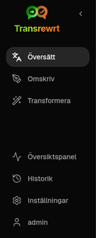
    </td>
    <td valign="top">
      <br/><br/>
      <ul>
        <li><strong>Översätt</strong> öppnar översättningsarbetsytan.</li><br/>
        <li><strong>Omskriv</strong> öppnar omskrivningsarbetsytan.</li><br/>
        <li><strong>Transformera</strong> öppnar arbetsytan för anpassade prompts.</li><br/>
        <li><strong>Översiktspanel</strong> visar användning och kostnadsinformation.</li><br/>
        <li><strong>Inställningar</strong> öppnar inställningspanelen.</li><br/>
        <li><strong>Historik</strong> visar användningshistorik med inmatning och utdata</li><br/>
        <li><strong>Användare</strong> visar användarnamnet för den inloggade användaren (endast webb).</li>
      </ul>
    </td>
  </tr>
</table>

<br/>

<a id="toolbar"></a>
### Verktygsfält

Verktygsfältet ändras något beroende på var du befinner dig i appen.

- Till vänster visas namnet på den aktuella sidan.
- Till höger visas **väljaren för kompetens eller modell** och kontrollen för **Gränssnittsspråk**.

I **Enkel**-läge visar verktygsfältet en **förinställningsväljare** med de inbyggda förinställningarna **Gratis (OpenRouter)**, **Lätt**, **Avancerad** och **Teknisk**. Vilka förinställningar som visas beror på den **Leverantör** du valt i [**Inställningar** > **Allmänna inställningar**](#general-settings) – till exempel visas **Gratis (OpenRouter)** endast när leverantören är OpenRouter. Om **Leverantör** är **Ollama** listar verktygsfältet dina installerade lokala modeller istället för förinställningar.

I **Avancerad** läge låter **modellväljaren** dig välja vilken AI-motor som ska användas för den aktuella uppgiften.

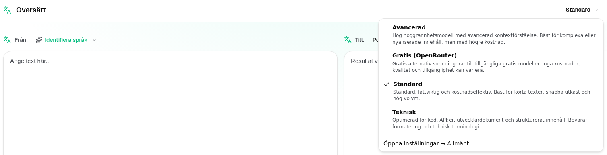

I Avancerat läge kanske vissa kostnadsfria modeller inte alltid är tillgängliga – de kan vara offline eller ha nått en användningsgräns. Appen kan automatiskt ta bort modellen från din lista. För att styra vilka modeller som visas, gå till [**Inställningar** > **Modeller**](#models). Du kan öppna modellinställningar från leverantörsikonen till vänster om modellnamnet i verktygsfältet.

<br/>

Med **globikonen + språkkod** kan du ändra gränssnittsspråket i appen, till exempel menyer och knappar. Det ändrar **inte** översättningsspråken som används i **Översätt**.

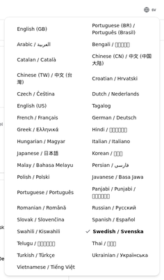

<br/>

<a id="input-and-output-panels"></a>
### In- och utmatningspaneler

De flesta arbetsytor använder en vänster **Inmatning**-panel och en höger **Utmatning**-panel.

Varje panel visar också:

| **Inmatning**                                                          | **Utmatning**                                                                                                                  |
|--------------------------------------------------------------------|-----------------------------------------------------------------------------------------------------------------------------|
| - Teckenantal <br/>- Antal ord <br/>- Styckenantal   <br/> | - Hur lång tid uppgiften tog<br/>- **TPS** (token per sekund)<br/>- Antal tecken, ord och stycken<br/>- Den använda modellen |

Om du undrar över de tekniska termerna:

- **Token** betyder en liten textenhet. Du kan tänka på det som en del av ett ord eller ett kort ord.
- **TPS** betyder hur många sådana textenheter modellen bearbetade per sekund.

<br/>

Du kan också övervaka kostnaden för varje åtgärd (om tillgängligt) och den totala kostnaden genom att aktivera alternativet `Show cost information on the actions` under [**Inställningar** > **Allmänna inställningar**](#general-settings).

<br/><br/>

[--------------------------------------------------------------------------------------------------------------------------]: #

<a id="translate"></a>
## Översätt

Använd **Översätt** när du vill konvertera text från ett språk till ett annat.

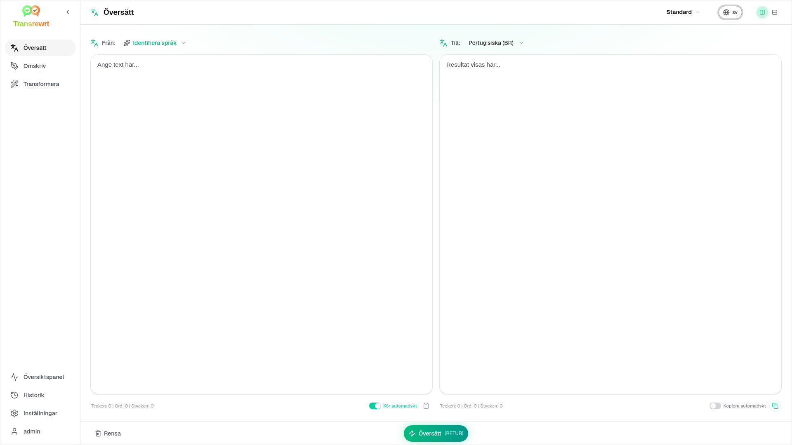

<br/>

<a id="translate-text"></a>
### Översätt text

1. Öppna **Översätt**.
2. Välj ett språk i **Från**.
3. Välj ett språk i **Till**.
4. Välj en förinställning (Enkel) eller modell (Avancerad) i verktygsfältet.
5. Skriv eller klistra in text i **Inmatning**.
6. Klicka på **Översätt**.
7. Läs resultatet i **Utmatning**.
8. Använd kopieringsknappen om du vill kopiera resultatet.

<br/>

<a id="language-selection"></a>
### Språkval

- **Från** kan vara ett specifikt språk eller **Identifiera språk**.
- **Till** är det språk du vill ha resultatet på.

Dina valda **Toppspråk** visas överst i listan. Du kan ange dessa i [**Inställningar** > **Språk**](#languages).

<br/>

<a id="helpful-translation-settings"></a>
### Användbara översättningsinställningar

I [**Inställningar** > **Allmänna inställningar**](#general-settings) kan du ändra hur översättning fungerar:

- **Automatisk översättning vid klistra in** utför en översättning så fort du klistrar in text.
- **Kopiera resultat automatiskt till urklipp** kopierar resultatet automatiskt efter en lyckad körning.
- **Översättning i realtid (medan du skriver)** utför översättningar medan du skriver.
- **Tidsgräns (ms)** styr hur länge appen väntar innan en översättning i realtid startar.
- **Beteende för ENTER** styr vad som händer när du trycker på `Enter`:
  - **Enter** kör översättning eller omskrivning (standard).
  - **Shift + Enter** kör översättning eller omskrivning; enkel **Enter** infogar en ny rad.

[--------------------------------------------------------------------------------------------------------------------------]: #

<a id="rewrite"></a>
## Omskriv

Använd **Omskriv** när du vill förbättra formuleringen utan att ändra huvudsakliga meningen.

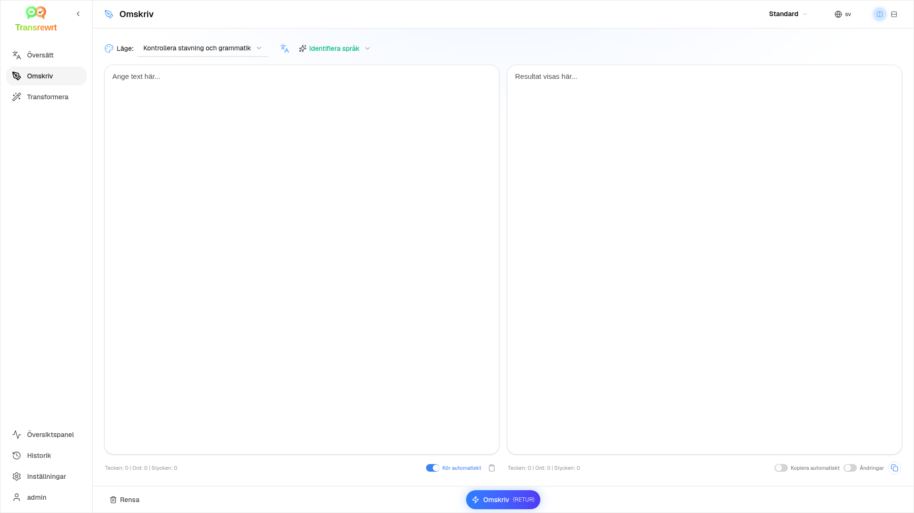

Detta är användbart för:

- rätta stavning och grammatik (**Kontrollera stavning och grammatik**)
- göra texten tydligare (**Förbättra tydligheten**)
- flera distinkta omskrivningar i en körning (**Alternativa versioner**)
- göra texten mer formell eller mindre formell (**Gör formell** / **Gör informell**)
- att förkorta eller utöka text (**Förkorta** / **Utöka**)
- att göra texten mer teknisk (**Gör teknisk**)

<br/>

> 💡 **TIP**<br/>
> När du använder läget "**Kontrollera stavning och grammatik**" visas en växel **Visa ändringar** i utmatningsfönstret (bredvid **Kopiera**).
> Slå på eller av den för att visa eller dölja de specifika korrigeringar som tillämpats på din text.

<br/><br/>

[--------------------------------------------------------------------------------------------------------------------------]: #

<a id="transform"></a>
## Transformera

Använd **Transformera** när du vill att AI:n ska följa en anpassad uppsättning instruktioner.

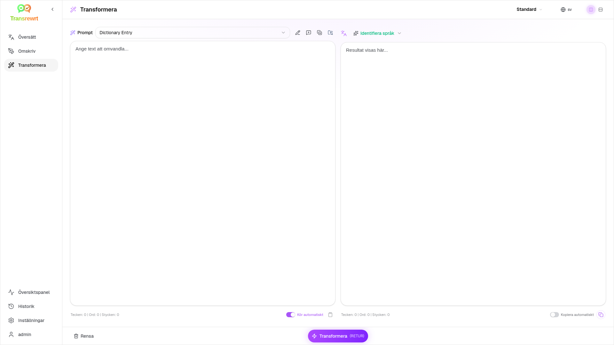

Detta är den mest flexibla delen av appen. Du kan använda den för uppgifter som:

- sammanfatta anteckningar
- omvandla rå text till ett polerat e-postmeddelande
- extrahera nyckelpunkter
- konvertera text till ett specifikt format
- alla andra anpassade aktiviteter med indatatexten

<br/>

<a id="run-an-existing-prompt"></a>
### Kör en befintlig prompt

1. Öppna **Transformera**.
2. Välj en prompt från promptlistan.
3. Om en ruta för **Mål**språk visas, välj ett språk om du vill ha det.
4. Skriv eller klistra in text i **Inmatning**.
5. Klicka på **Transformera**.
6. Läs resultatet i **Utmatning**.

<br/>

<a id="if-you-have-no-prompts-yet"></a>
### Om du inte har några prompts ännu

Om din promptlista är tom, klicka på **Läs in exempelfrågor** i Transform-arbetsytan. Samma kontroll finns alltid tillgänglig i [**Inställningar** > **Transformera**](#transform-settings) på export/import-rad. Båda lägger till inbyggda exempel så att du kan komma igång snabbt.

<br/>

> ℹ️ **OBS**<br/>
> Exempelprompts tillhandahålls på engelska. Efter att du har läst in dem kan du redigera en prompt och använda **Översätt fråga** för att översätta den till {{ditt språk}}.

<br/>

<a id="create-a-prompt-quickly"></a>
### Skapa en prompt snabbt

Det snabbaste sättet att skapa en prompt är:

1. Klicka på **Ny prompt**.
2. Klicka på **Generera prompt**.
3. Beskriv vad du vill att prompten ska göra.
4. Välj en förinställning (Enkel) eller modell (Avancerad).
5. Låt appen skapa ett utkast åt dig.
6. Granska utkastet och klicka på **Spara**.

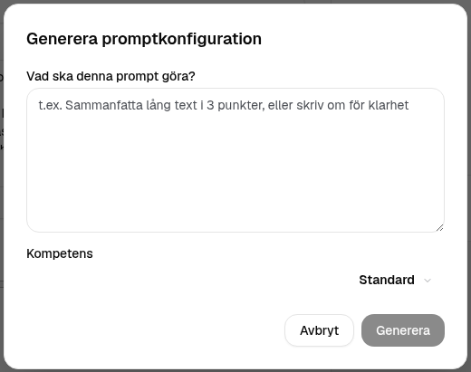

<br/>

<a id="edit-a-prompt"></a>
### Redigera en prompt

När du skapar eller redigerar en prompt visas redigeraren till vänster och ett testområde till höger.

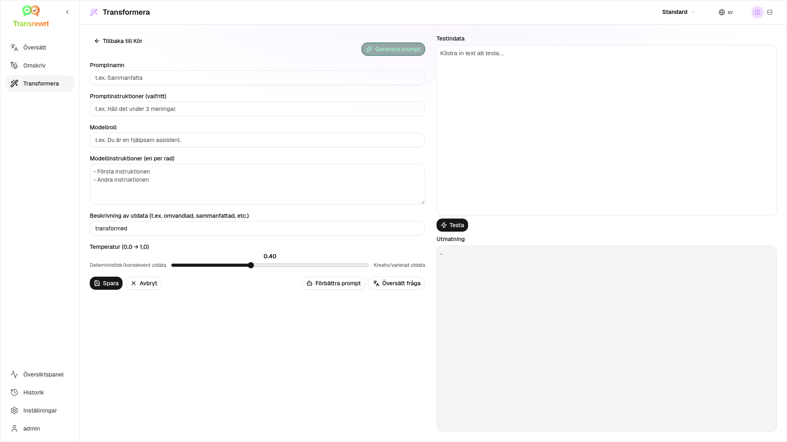

De viktigaste fälten är:

- **Promptnamn**: namnet som visas i promptlistan.
- **Promptinstruktioner (valfritt)**: en kort handledning som visas för användaren när prompten körs.
- **Modellroll**: den övergripande roll som tilldelas AI, till exempel 'Du är en hjälpsam assistent.'
- **Modellinstruktioner (en per rad)**: de specifika regler du vill att AI ska följa.
- **Beskrivning av utdata**: ett kort ord som beskriver resultatet, till exempel 'sammanfattning' eller 'omskriv'.
- **Temperatur (0,0 → 1,0)**: hur modellen kommer att bete sig; se nedan.
- **Fråga efter målspråk**: lägger till en målspråksväljare när prompten körs.

Om det tekniska begreppet **Temperatur** är nytt för dig, tänk så här:

- En **lägre** temperatur ger mer stabila, förutsägbara resultat.
- En **högre** temperatur ger mer variation och kreativitet.

Du kan också använda:

- `Generate prompt` för att skapa ett nytt utkast från en enkel beskrivning
- `Improve prompt` för att förbättra en befintlig prompt
- `Translate prompt` för att översätta promptfälten

<br/>

> ⚠️ **VARNING**<br/>
> Klicka på `Save` innan du klickar på `Back to Run`. Om du går tillbaka utan att spara kommer dina ändringar att gå förlorade.

<br/>

<a id="test-a-prompt-before-using-it"></a>
### Testa en prompt innan du använder den

Testpanelen till höger låter dig prova din prompt med exempeltext innan du använder den i det dagliga arbetet.

Detta är användbart när:

- du skapar en ny prompt
- du jämför två versioner av en prompt
- du vill kontrollera ton, längd eller utmatningsformat

<br/>

> ℹ️ **OBS**<br/>
> Du kan exportera och importera sparade prompts i [**Inställningar** > **Transformera**](#transform-settings).

När du använder **Generera prompt**, **Förbättra prompt** eller **Översätt fråga** i promptredigeraren erbjuder **Enkel**-läge samma förinställningsväljare som vid Översätt och Omskriv; **Avancerad**-läge använder modelllistan.

<br/><br/>

[--------------------------------------------------------------------------------------------------------------------------]: #

<a id="dashboard"></a>
## Översiktspanel

Använd **Översiktspanel** för att se hur mycket du använder appen och vad det kostar (för betalda modeller).

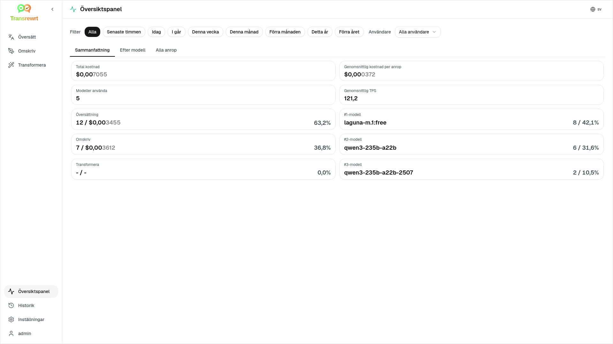

<br/>

> ℹ️ **OBS**<br/>
> Om du endast använder **gratis** modeller kan **kostnads**belopp vara noll och kostnadsfokuserade KPI:er kan se tomma ut. Fliken **Sammanfattning** visar fortfarande antal anrop för översätt, omskriv och transformera när det finns aktivitet under den valda perioden.

<br/>

<a id="filter-the-data"></a>
### Filtrera data

Använd filterknapparna längst upp för att ändra tidsintervallet.

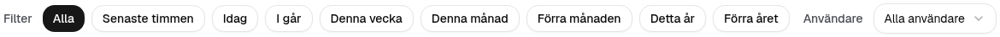

<br/>

> ℹ️ **OBS**<br/>
> **Användar**-filtret är endast synligt för administratörer i webbversionen. Regelbundna användare kommer inte att se detta filter, och det är inte tillgängligt i skrivbordsappen.

<br/>

<a id="dashboard-tabs"></a>
### Flikar i översiktspaneln

- **Sammanfattning** visar KPI-kort: total kostnad, modeller använda, antal anrop per läge och kostnad (med andel av totalt antal anrop), genomsnittlig kostnad per anrop, genomsnittlig TPS samt de tre främsta modellerna efter antal anrop.
- **Efter modell** listar varje modell med totalt antal anrop, total kostnad och genomsnittlig TPS; expandera en rad för en uppdelning per översätt, omskriv och transformera.
- **Alla anrop** visar hela anropsloggen (sidindelad vid breda layouter, kort vid smala skärmar) och låter dig exportera den.

<br/>

<a id="export-data"></a>
### Exportera data

Datatabeller i översiktspaneln kan exportera data i:

- **JSON**
- **CSV**
- **XLSX**

Detta är användbart om du vill granska aktiviteter utanför appen eller dela en rapport.

<br/>

<a id="delete-stored-records-for-a-model"></a>
### Ta bort lagrade poster för en modell

I **Efter modell** eller **Alla anrop** kan du ta bort lagrade poster för en modell genom att klicka på papperskorgsikonen.

> ⚠️ **VARNING**<br/>
> Borttagning av lagrade poster kan inte ångras. Använd detta endast om du är säker på att du inte längre behöver den historiken.

Om du vill ta bort alla data eller ta bort poster baserat på deras ålder går du till [**Inställningar** > **Kostnadsöversikt**](#cost-tracking). Där hittar du alternativ för att ta bort alla lagrade data eller endast data som är äldre än ett visst datum.

<br/><br/>

[--------------------------------------------------------------------------------------------------------------------------]: #

<a id="history"></a>
## Historik

Klicka på **Historik** för att se historiken över dina åtgärder i **Transrewrt**, inklusive inmatning och utmatning för varje åtgärd.

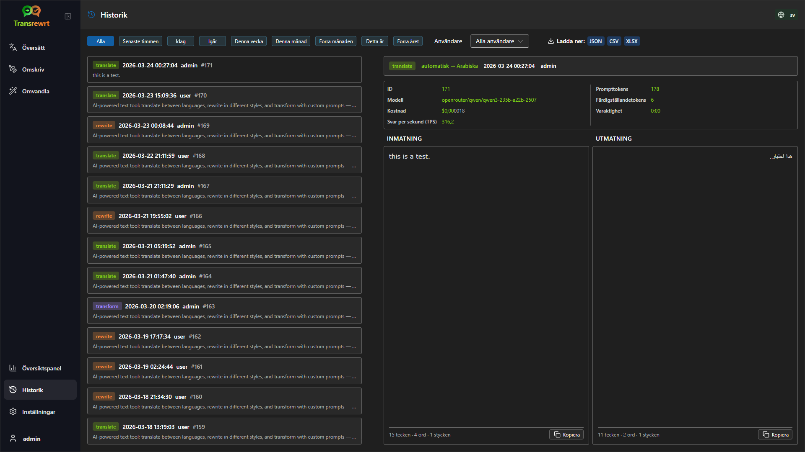

<br/>

<a id="filter-the-history"></a>
### Filtrera historiken

**Historik** använder samma tidsintervallfilter som sidan **Översiktspanel**.


<br/>

> ℹ️ **OBS**<br/>
> I **webbappen** ser alla (inklusive administratörer) endast sin egen körningshistorik. **Användar**-filtret på **Översiktspanel** är för administratörer att granska användning och kostnader över konton; det gäller inte **Historik**.

<br/>

<a id="export-history-data"></a>
### Exportera historikdata

Historiksidan kan exportera filtrerade data i:

- **JSON**
- **CSV**
- **XLSX**

Detta är användbart om du vill granska aktiviteter utanför appen eller dela en rapport.

<br/><br/>

[--------------------------------------------------------------------------------------------------------------------------]: #

<a id="settings"></a>
## Inställningar

Öppna **Inställningar** från sidofältet för att anpassa hur appen fungerar.

De tillgängliga flikarna beror på plattformen och din roll:

| Flik              | Skrivbord | Webb (admin) | Webb (vanlig användare) | Anteckningar                                        |
  |------------------|:-------:|:-----------:|:------------------:|----------------------------------------------|
  | Allmänna inställningar |   ja   |     ja     |        ja         | Inkluderar **AI-upplevelse** (Enkel / Avancerad) |
  | Modeller           |   ja   |     ja     |        ja         | Endast när **AI-upplevelse** är **Avancerad** |
  | Språk        |   ja   |     ja     |        ja         |                                              |
  | Kostnadsöversikt    |   ja   |     ja     |         -          |                                              |
  | Transformera        |   ja   |     ja     |        ja         | Massimport/export av omvandlingsprompts      |
  | Användare            |    -    |     ja     |         -          |                                              |
  | API-konfiguration       |   ja   |     ja     |         -          |                                              |
  | Om            |   ja   |     ja     |        ja         |                                              |

I **Enkel**-läge sker modellval via kompetenser i verktygsfältet och **Leverantör** i Allmänna inställningar; fliken **Modeller** är dold.

<br/>

> ℹ️ **OBS**<br/>
> I webbversionen har varje användare sin egen konfiguration. Inställningar som AI-upplevelse, leverantör, valda modeller eller kompetenser, språk, allmänna alternativ och omvandlingsprompts lagras per användare. Ändringar du gör påverkar inte andra användare.

<br/>

[--------------------------------------------------------------------------------------------------------------------------]: #

<a id="general-settings"></a>
### Allmänna inställningar

Använd **Allmänna inställningar** för att styra beteendet vid skrivning, om körningsdetaljer sparas för **Historik**, utseende och hur du väljer AI för Översätt, Omskriv och Transformera.

**AI-upplevelse**

- **Enkel** (standard): välj en **Leverantör** (OpenRouter, OpenAI, Anthropic, Google Gemini, DeepSeek, Groq, Mistral, xAI, Cerebras eller Ollama). Molnleverantörer använder de inbyggda förinställningarna i verktygsfältet. **Ollama** listar modeller installerade på din dator istället för förinställningar. I Enkel-läge visar **Förinställningskatalog** katalogversionen och senaste uppdateringstid; klicka på **Uppdatera förinställningskatalog** för att hämta den senaste färdighetslistan från projektets förråd (appen kontrollerar också regelbundet i bakgrunden).
- **Avancerad**: välj enskilda modeller i verktygsfältet; hantera listan under [**Inställningar** > **Modeller**](#models).

I **webbappen** beror vilka leverantörer som visas på API-nycklar som är inställda i servermiljön. I **skrivbordsappen** konfigurerar du nycklar under [**API-konfiguration**](#api-config).

**Beteende**

- **Beteende för ENTER** väljer om `Enter` kör uppgiften eller infogar en ny rad.
- **Automatisk översättning vid klistra in** startar översättning så fort du klistrar in text.
- **Kopiera resultat automatiskt till urklipp** kopierar lyckade resultat automatiskt.
- **Översättning i realtid (medan du skriver)** översätter medan du skriver.
- **Timeout (ms)** anger väntetiden för översättning i realtid.

**Historik**

- **Spara körningshistorik** styr om varje översättning, omskrivning och transformering lagrar **inmatning och utdata** för sidofältets vy [**Historik**](#history). Om du stänger av det efterfrågas bekräftelse; om du bekräftar tas lagrad historiktext bort från databasen. Om etiketten visar *inaktiverad av administratören* har din installation `HISTORY_DISABLED` aktiverat i miljön (se [README](README.sv.md#configuration-and-environment)); du kan då inte aktivera historiken igen via användargränssnittet.
- **Radera historikdata** låter dig ta bort lagrad text baserat på ålder (till exempel äldre än några månader, eller **alla data (rensa)**) med hjälp av **Radera data**. Det påverkar endast sparad körningstext för vyn **Historik**; det tar **inte bort** kostnads- eller användningssammanfattningar. För att ta bort eller trimma **kostnads**data, använd [**Inställningar** > **Kostnadsöversikt**](#cost-tracking).

**Utseende**

- **Tema** växlar mellan ljust, mörkt och systemutseende.
- **Visa kostnadsinformation på åtgärderna** styr visningen av kostnad per åtgärd (om tillgängligt) och total kostnad på utmatningspanelerna för Översätt, Omskriv och Transformera.
- **Antal decimaler för kostnad** ändrar hur kostnadsdecimaler visas.
- **Endast webb:** **visa en marginal runt appen** lägger till extra utrymme runt gränssnittet.
- **Teckensnitt** ändrar skrivteckensnittet i textpanelerna.
- **Storlek** ändrar teckenstorleken.

**Säkerhetskopiering av konfiguration** (endast skrivbordsapp och webbadministratörer)

- **Inkludera användningsdata i säkerhetskopian** – när aktiverat innehåller ZIP-filen även körningshistorik och API-anropsdata.
- **Säkerhetskopiera konfiguration** – skapar en enskild ZIP-fil (`transrewrt-config-backup-YYYY-MM-DD_HHMMSS.zip` i UTC som standard) med `config.json`, `state.json`, valfri krypteringsnyckel, användare, inställningar, anpassade prompts och användningsdata om du valt detta. Efter en lyckad säkerhetskopiering visas bekräftelse med det sparade filnamnet.
- **Återställ från säkerhetskopia** – öppnar först en **bekräftelsedialog**. Välj säkerhetskopia ZIP i dialogrutan (**Bläddra** / filväljare eller dra och släpp där det stöds), och granska sedan alternativen:
  - **Återställ användningsdata** – importera användning/historik från ZIP:en om den säkerhetskopierades med användningsdata inkluderade; lämna avmarkerat om du endast vill ha inställningar och prompts.
  - **Rensa gamla användningsdata innan återställning** – ta bort befintlig användning/historik i den här installationen innan säkerhetskopian tillämpas (valfritt; använd när du vill ha en ren ersättning).

Säkerhetskopior skapade i antingen webb- eller skrivbordsversionen kan återställas i den andra. När en skrivbords-säkerhetskopia återställs i webbversionen återställs data till administratörsanvändaren.

<br/>

<a id="models"></a>
### Modeller

Den här fliken är endast tillgänglig när **AI-upplevelse** är inställd på **Avancerad** i [**Allmänna inställningar**](#general-settings). Använd **Inställningar** > **Modeller** för att välja vilka modeller som ska visas i verktygsfältet.

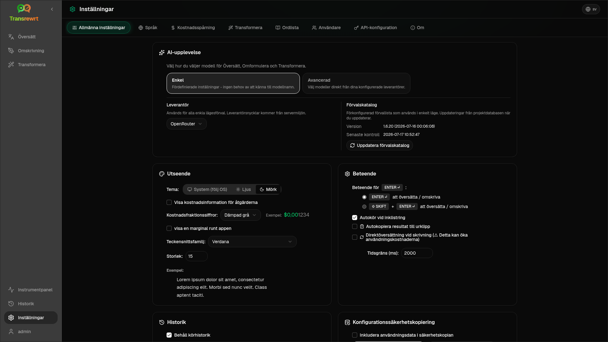

Sidan har två listor:

- **Tillgängliga modeller** till vänster
- **Valda modeller** till höger

Användbara kontroller inkluderar:

- **Sök modeller...** för att hitta en modell efter namn
- **Leverantör**-flikar för att begränsa listan till en motor (OpenRouter, OpenAI, Ollama, …)
- **Endast gratis** för att visa endast kostnadsfria modeller
- **Uppdatera** för att ladda om listan
- **Expandera alla** och **Komprimera alla** när du sorterar efter leverantör

Modell-ID:n inkluderar leverantörens prefix (till exempel `openrouter/…` kontra `openai/…`). Badges som **OpenAI (OpenRouter)** kontra **OpenAI (direkt)** visar hur trafiken dirigeras.

> ℹ️ **OBS**<br/>
> **OpenRouter Body Builder** (`openrouter/bodybuilder`) är en routermodell, inte en allmän chattmodell: dess svar är JSON som beskriver OpenRouter API-förfrågningskroppar (till exempel en `requests`-array med `model` och `messages`). Om du använder den för **Översätt**, **Omskriv** eller **Transformera**, kommer utmatningspanelen att visa den JSON-koden istället för färdig text. Välj en vanlig textmodell för dessa uppgifter. Se [Body Builder-modellsidan](https://openrouter.ai/openrouter/bodybuilder) på OpenRouter.

Åtgärder:

- För att lägga till en modell, klicka på **Lägg till** eller var som helst i posten.

- För att ta bort en modell, klicka på **X** bredvid den i **Valda modeller** eller **Vald** i listan över tillgängliga modeller.

- För att rensa listan, klicka på **Avmarkera alla**. Den obligatoriska kostnadsfria modellen kommer att kvarstå i listan.

<br/>

> ℹ️ **OBS**<br/>
> Om du inte vill lägga till krediter på OpenRouter direkt, börja med att aktivera **Endast gratis** och välj de kostnadsfria modellerna (inget kreditkort krävs). Du kan också använda Ollama för att köra modeller lokalt utan någon API-nyckel.

<br/>

<a id="languages"></a>
### Språk

Använd **Inställningar** > **Språk** för att organisera språklistorna som används i appen.

- **Topp-språk** är fästa nära toppen av språklistorna i **Översätt** och **Transformera**.
- **Anpassat språk** låter dig lägga till ett språk som inte finns i den inbyggda listan.

Om du lägger till ett anpassat språk visas det i språkvalen tillsammans med de inbyggda alternativen.

<br/>

<a id="cost-tracking"></a>
### Kostnadsöversikt

Använd **Inställningar** > **Kostnadsöversikt** för att hantera kostnadsinformation.

- **Total kostnad** visar den löpande summan.
- **Kopiera värde** kopierar summan till urklipp.
- **Återställ kostnad** återställer den lagrade summan till noll.
- **Synkronisera med API-nyckelsanvändning** ställer in summan så att den matchar användningen som rapporteras av ditt OpenRouter-konto (endast OpenRouter).
- **API-nyckelsanvändning** visar OpenRouter-användningsdetaljer, om tillgängligt.
- **Radera kostnadsdata** tar bort alla data eller endast poster äldre än ett valt datum.

**Kostnadsöversikt:** När du använder OpenRouter-modeller visar appen din faktiska användning och utgifter baserat på kostnadsinformation från OpenRouter. För alla andra leverantörer uppskattar appen kostnader med priser som publicerats av OpenRouter. Om ett pris inte är tillgängligt kan uppskattningen vara noll.

<br/>

> ℹ️ **OBS**<br/>
> **Alla kostnadssiffror är uppskattningar endast för din information, inte officiella fakturor.**

<br/>

> ⚠️ **VARNING**<br/>
> Data borttagning kan inte ångras. Innan du tar bort data, se till att säkerhetskopiera eller exportera den via [**Historik**](#history)
> eller [**Översiktspanel** > **Alla anrop**](#dashboard-tabs), annars kommer den att förloras permanent.
> All inmatnings-/utmatningshistorik kopplad till varje API-anropspost kommer också att raderas.

<br/>

<a id="transform-settings"></a>
### Transformera (inställningsflik)

Använd **Inställningar** > **Transformera** för att hantera prompts i större skala.

Du kan:

- granska dina sparade prompts
- ta bort prompts
- importera prompts från en fil
- exportera prompts för säkerhetskopiering eller delning
- läsa in exempelfrågor till promptlistan

<br/>

<a id="users"></a>
### Användare

Använd **Användare** för att hantera användarkonton i webbversionen. Du kan lägga till användare, uppdatera deras uppgifter, återställa lösenord och ta bort konton.

<br/>

<a id="api-config"></a>
### API-konfiguration

De leverantörer som stöds är: OpenRouter, OpenAI, Anthropic, Google Gemini, DeepSeek, Groq, Mistral, xAI, Cerebras och **Ollama** (lokala modeller via en bas-URL). Du behöver bara konfigurera de leverantörer du använder.

**Webbapplikation: endast administratör**

API-nycklar konfigureras via system- eller Docker-miljövariabler – de matas inte in i webbgränssnittet. På den här sidan visas vilka leverantörer som har en nyckel konfigurerad och låter dig testa varje leverantör genom att klicka på knappen `Test`.

<br/>

> ℹ️ **OBS**<br/>
> För att ändra en API-nyckel måste du uppdatera miljövariabeln i din system- eller Docker-konfiguration och starta om servern eller containern.

<br/>

> ℹ️ **OBS**<br/>
> **Säkerhetskopiering av konfiguration** (se [**Allmänna inställningar** → Säkerhetskopiering av konfiguration](#general-settings)) kan bädda in **matchade** leverantörsnycklar i `config.json` i ZIP-filen. Återställning av ZIP-filen kopierar **inte** tillbaka dessa nycklar till serverns sparade konfigurationsfil – aktiva nycklar kommer fortfarande från miljön och befintlig filstatus enligt beskrivningen där.

<br/>

**Skrivbordsapplikation**

Använd **API-konfiguration** för att lagra API-nycklar för varje leverantör du använder. För Ollama anger du **bas-URL:en** istället för en API-nyckel.

<br/>

> 💡 **Tips** <br/>
> Om du inte vill använda en API-nyckel eller betala för användning kan du [ladda ner Ollama](https://ollama.com) och köra modeller (till exempel `translategemma:4b`) lokalt på din dator helt gratis. Alternativt kan du skapa ett gratis OpenRouter-konto (inget kreditkort krävs) för att använda deras fria modeller, eller skaffa en gratis API-nyckel från Cerebras, Google, Groq eller Mistral AI.

<br/>

- Lägg endast till de leverantörer du behöver. I **Inställningar** > **Modeller** börjar varje modell-ID med leverantören (till exempel `openrouter/openrouter/free`, `openai/gpt-4o`, `ollama/llama3`).

För att lägga till en API-nyckel anger du värdet i textfältet och klickar på `Save`. För att ersätta en befintlig nyckel klickar du på `Edit`. För att verifiera att en nyckel fungerar klickar du på `Test`. För Ollama bas-URL klickar du alltid på `Test` för att kontrollera anslutningen.

<br/>

> ℹ️ **OBS**<br/>
> Du kan inte se det aktuella värdet på en API-nyckel. Du kan endast ersätta den med hjälp av knappen `Edit`.
> API-nycklar lagras krypterade i konfigurationen.

<br/>

<a id="about"></a>
### Om

**Om**-fliken visar:

- appens namn och slogan
- versionsnumret och byggdatum
- licens- och upphovsrättsinformation, med länk till att öppna **Meddelanden från tredje part**
- en länk till projektets förråd

<br/><br/>

<a id="common-issues"></a>
## Vanliga problem

Om något inte fungerar som förväntat, kontrollera följande punkter först.

<br/>

<a id="the-app-will-not-translate-rewrite-or-transform-text"></a>
### Appen översätter, omskriver eller transformerar inte text

Kontrollera att:

- du har valt en **förinställning** (Enkel) eller **modell** (Avancerad) i verktygsfältet
- i **Enkel**-läge har [**Inställningar** > **Allmänna inställningar**](#general-settings) en **Leverantör** med en fungerande nyckel (eller Ollama-URL) och minst en förinställning för den leverantören
- i **Avancerad**-läge finns minst en modell listad i [**Inställningar** > **Modeller**](#models)
- din API-konfiguration fungerar

Om du använder skrivbordsappen:

1. Öppna [**Inställningar** > **API-konfiguration**](#api-config).
2. Kontrollera att minst en API-nyckel är sparad.
3. Klicka på **Testa** bredvid leverantören för att bekräfta att nyckeln fungerar.

<br/>

<a id="the-model-list-is-empty"></a>
### Modellistan är tom

I **Enkel**-läge, öppna [**Inställningar** > **Allmänna inställningar**](#general-settings), bekräfta att **Leverantör** är inställd och lägg till eller testa nycklar i [**API-konfiguration**](#api-config) (skrivbord) eller be din administratör (webb). För **Ollama**, kör **Testa** på bas-URL:en och se till att modeller är installerade lokalt.

I **Avancerad**-läge, öppna [**Inställningar** > **Modeller**](#models) och klicka på **Uppdatera**. Om det behövs, sök efter en modell, aktivera **Endast gratis**, och lägg till modeller i **Valda modeller**.

<br/>

<a id="the-result-is-too-slow-or-too-expensive"></a>
### Resultatet är för långsamt eller för dyrt

Prova en eller flera av följande åtgärder:

- välj en annan förinställning (Enkel) eller modell (Avancerad)
- använd en kortare inmatning
- stäng av **Översättning i realtid (medan du skriver)** i [**Inställningar** > **Allmänna inställningar**](#general-settings)
- använd gratismodeller för enkla uppgifter (se [Modeller](#models))

<br/>

<a id="the-interface-is-in-the-wrong-language"></a>
### Gränssnittet är på fel språk

Klicka på globikonen i [verktygsfältet](#toolbar) och välj önskat **Gränssnittsspråk**.

<br/>

<a id="the-text-is-too-small-or-hard-to-read"></a>
### Texten är för liten eller svår att läsa

Öppna [**Inställningar** > **Allmänna inställningar**](#general-settings) och ändra:

- **Teckensnittsfamilj**
- **Storlek**

<br/>

<a id="dashboard-summary-looks-empty"></a>
### Översiktspanelens sammanfattning ser tom ut

Detta är normalt om:

- du använder endast **gratis modeller** och tittar på **kostnads**siffror (de kan vara noll); KPI:er för antal anrop i **Sammanfattning** kräver fortfarande data från den valda perioden
- det valda **tidsfiltret** täcker inte den period då anrop gjordes – prova **Alla** för att kontrollera

Om KPI:er fortfarande är noll efter att ha valt **Alla**, bekräfta att anrop visas i [**Historik**](#history) eller i fliken **Alla anrop**.

<br/>

<a id="cost-shows-not-available-or-seems-wrong"></a>
### Kostnad visar "inte tillgänglig" eller verkar felaktig

När du använder modeller via **OpenRouter** visar appen din faktiska utgift rapporterad av OpenRouter.

För **andra leverantörer** (OpenAI direkt, Anthropic direkt, etc.) uppskattas kostnaden utifrån prisdata som publicerats av OpenRouter. Om inget matchande pris hittas för en modell visas kostnaden som **inte tillgänglig** och läggs inte till i din totala summa.

<br/>

<a id="total-cost-does-not-match-my-provider-bill"></a>
### Totalkostnaden matchar inte min leverantörsfaktura

Alla kostnadssiffror i appen är **uppskattningar endast för referens**, inte officiella fakturor.

För att göra totalsumman mer i linje med din faktiska OpenRouter-utgift, öppna [**Inställningar** > **Kostnadsöversikt**](#cost-tracking) och klicka på **Synkronisera med API-nyckelsanvändning**.

<br/>

<a id="the-history-page-is-missing-from-the-sidebar"></a>
### Historiksida saknas i sidofältet

**Spara körningshistorik** kan vara inaktiverat. Öppna [**Inställningar** > **Allmänna inställningar**](#general-settings) och aktivera det om inte historiken är *inaktiverad av administratören* (`HISTORY_DISABLED` i miljön – se [README](README.sv.md#configuration-and-environment)). Att aktivera historik återställer inte tidigare borttagna texter.

<br/>

<a id="web-app-session-expired"></a>
### Webbapp: omdirigeras till inloggningssidan oväntat

Din session kan ha gått ut. Logga in igen. Om det händer ofta, kontrollera serverkonfigurationen för inställningar om sessionens livslängd.

<br/>

<a id="web-admin-forgot-or-lost-a-password"></a>
### Webbadmin: glömt eller förlorat ett lösenord

Detta gäller för den **självvärdbaserade webbappen** (Docker), inte skrivbordsappen (Electron).

- Om en annan administratör fortfarande kan logga in kan de öppna [**Inställningar** > **Användare**](#users), välja kontot och ange ett **nytt lösenord** där.
- Om du är **låst ute** men har **shell-åtkomst** till maskinen eller containern kan du återställa lösenordet med hjälpverktyget som följer med avbilden (ersätt `transrewrt` om du ändrar standardnamnet, och sätt citationstecken runt lösenordet om det innehåller mellanslag eller specialtecken):

```bash
docker exec transrewrt reset-web-password '<username>' '<new-password>'
```

Standardanvändarnamnet för admin är `admin` om du aldrig skapat andra konton. När du anger endast ett argument behandlas det som det nya lösenordet för `admin`.

Om du kör från en **källkodskopia** istället för Docker, använd:

```bash
pnpm run reset-web-password -- <username> <new-password>
```

Skriptet uppdaterar användarposten i SQLite-databasen (och kan skapa `admin`-användaren om den saknas). Efter återställning loggar du in med det nya lösenordet.

<br/>

<a id="dashboard-shows-no-data-for-other-users"></a>
### Översiktspanel visar ingen data för andra användare (webb)

Endast **administratörer** kan visa data från alla användare via **Användare**-filtret. Regelbundna användare ser endast sin egen aktivitet enligt design.

<br/>

<a id="i-changed-a-prompt-and-lost-the-edits"></a>
### Jag ändrade en prompt och förlorade ändringarna

När du redigerar en prompt måste du alltid klicka på **Spara** innan du klickar på **Tillbaka till Kör**.

<br/><br/>

<a id="quick-tips"></a>
## Snabbtips

- Börja med [**Översätt**](#translate) för att säkerställa att din konfiguration fungerar innan du går vidare till [**Omskriv**](#rewrite) eller [**Transformera**](#transform).
- Använd [**Omskriv**](#rewrite) för dagliga formuleringsoptimeringar.
- Använd [**Transformera**](#transform) när du behöver en återupprepad arbetsflödeslösning för en specifik uppgift.
- Använd [**Översiktspanel**](#dashboard) om du vill hålla koll på användning och kostnad.
- Använd [**Historik**](#history) för att granska tidigare operationer och deras fullständiga in- och utdata.
- Exportera prompts regelbundet om du bygger ett promptbibliotek som du vill spara säkert (se [Transformera](#transform)) eller om du vill dela det med andra.
- Stanna i **Enkel**-läge tills du behöver detaljerad kontroll över modell-ID:n; byt till **Avancerad** när du redan vet vilka modeller du vill använda.

<br/><br/>

<a id="disclaimer"></a>
## Ansvarsfriskrivning

Produktnamn och ikoner tillhör sina respektive ägare och används endast för identifiering.

<br/><br/>

<a id="license"></a>
## Licens

Copyright © 2026 Waldemar Scudeller Jr.

[Apache License 2.0](../LICENSE)
