<a id="transrewrt-user-guide"></a>
# Mwongozo wa Mtumiaji

<br/>

<a id="introduction"></a>
## Utangulizi

Transrewrt unasaidia kufanya kazi na maandishi katika njia tatu kuu:

- **Tafsiri** - badilisha maandishi kutoka kwa lugha moja hadi nyingine.
- **Andika upya** - andika upya maandishi kwa mtindo tofauti, kama vile wazi, fupi, au rasmi zaidi.
- **Badilisha** - shughulikia maandishi kwa kutumia maelekezo maalum ya AI yanayoitwa mandhari.

<br/>

Mwongozo huu unaeleza jinsi ya kutumia programu baada ya kupakia na kuinua. Kwa hatua za kusakinisha, tazama **[README](README.sw.md)** kuu.

<br/>

> ℹ️ **KODI**<br/>
> Transrewrt inapatikana kama programu ya kompyuta kwa Windows na Linux, pia kama programu ya wavuti inayohifadhiwa na mtu mwenyewe. Mwongozo huu unazingatia matumizi ya kila siku ya programu. Ambapo kitu kinafanana tu na toleo moja, kinatajwa kwa wazi.

<small>**Soma kwa lugha nyingine:**</small>
<small id="lang-list"> [English (UK)](../USER-GUIDE.md) · [Português (BR)](USER-GUIDE.pt-BR.md) · [العربية](USER-GUIDE.ar.md) · [বাংলা](USER-GUIDE.bn.md) · [Català](USER-GUIDE.ca.md) · [简体中文](USER-GUIDE.zh-CN.md) · [繁體中文](USER-GUIDE.zh-TW.md) · [Hrvatski](USER-GUIDE.hr.md) · [Čeština](USER-GUIDE.cs.md) · [Nederlands](USER-GUIDE.nl.md) · [English (US)](USER-GUIDE.en-US.md) · [Filipino](USER-GUIDE.tl.md) · [Français](USER-GUIDE.fr.md) · [Deutsch](USER-GUIDE.de.md) · [Ελληνικά](USER-GUIDE.el.md) · [हिन्दी](USER-GUIDE.hi.md) · [Magyar](USER-GUIDE.hu.md) · [Italiano](USER-GUIDE.it.md) · [日本語](USER-GUIDE.ja.md) · [Basa Jawa](USER-GUIDE.jv.md) · [한국어](USER-GUIDE.ko.md) · [Bahasa Melayu](USER-GUIDE.ms.md) · [فارسی](USER-GUIDE.fa.md) · [Polski](USER-GUIDE.pl.md) · [Português (PT)](USER-GUIDE.pt.md) · [ਪੰਜਾਬੀ](USER-GUIDE.pa.md) · [Română](USER-GUIDE.ro.md) · [Русский](USER-GUIDE.ru.md) · [Slovenčina](USER-GUIDE.sk.md) · [Español](USER-GUIDE.es.md) · [Kiswahili](USER-GUIDE.sw.md) · [Svenska](USER-GUIDE.sv.md) · [తెలుగు](USER-GUIDE.te.md) · [ภาษาไทย](USER-GUIDE.th.md) · [Türkçe](USER-GUIDE.tr.md) · [Українська](USER-GUIDE.uk.md) · [Tiếng Việt](USER-GUIDE.vi.md)</small>

<small>

> **Kumbusho juu ya tafsiri za UI na ukweli:** Lugha zote za kipindi cha mtumiaji isipokuwa Kiingereza (Ukingereza) 
> zimeketwa kwa kutumia mifano ya AI; maandishi yanaweza kuwa si sahihi au kuwa na makosa.

</small>

<br/>

<!-- START doctoc generated TOC please keep comment here to allow auto update -->
<!-- DON'T EDIT THIS SECTION, INSTEAD RE-RUN doctoc TO UPDATE -->
**Jedwali la Maudhui**

- [Kabla ya kuanza](#before-you-start)
  - [Jinsi ya kupata ufunguo wa API wa OpenRouter bila malipo (programu ya kompyuta)](#how-to-get-a-free-openrouter-api-key-desktop-app)
- [Anza kazi](#getting-started)
- [Sehemu kuu za dirisha](#main-parts-of-the-window)
  - [Orodha ya upande](#sidebar)
  - [Barua pepe](#toolbar)
  - [Sehemu za pembejeo na pato](#input-and-output-panels)
- [Tafsiri](#translate)
  - [Tafsiri maandishi](#translate-text)
  - [Uchaguzi wa lugha](#language-selection)
  - [Mipangilio muhimu ya tafsiri](#helpful-translation-settings)
- [Andika upya](#rewrite)
- [Badilisha](#transform)
  - [Imba kifaa kilichopo](#run-an-existing-prompt)
  - [Ikiwa bado hakuna mandhari](#if-you-have-no-prompts-yet)
  - [Tengeneza kifaa haraka](#create-a-prompt-quickly)
  - [Hariri kifaa](#edit-a-prompt)
  - [Jaribu kifaa kabla ya kutumia](#test-a-prompt-before-using-it)
- [Ubao](#dashboard)
  - [Chuja data](#filter-the-data)
  - [Vidole vya ubao](#dashboard-tabs)
  - [Toa data](#export-data)
  - [Futa rekodi zilizohifadhiwa kwa kifaa](#delete-stored-records-for-a-model)
- [Historia](#history)
  - [Chuja data](#filter-the-data-1)
  - [Toa data ya historia](#export-history-data)
- [Mipangilio](#settings)
  - [Mipangilio ya ujumla](#general-settings)
  - [Mifano](#models)
  - [Lugha](#languages)
  - [Ufuatiliaji wa gharama](#cost-tracking)
  - [Mandhari ya ubadilishaji](#transform-prompts)
  - [Watumiaji](#users)
  - [Mipangilio ya API](#api-config)
  - [Kuhusu](#about)
- [Matatizo ya kawaida](#common-issues)
  - [Programu haiwezi kutafsiri, kuandika upya, au kubadilisha maandishi](#the-app-will-not-translate-rewrite-or-transform-text)
  - [Orodha ya mifano ni tupu](#the-model-list-is-empty)
  - [Matokeo ni ya polepole au ghali sana](#the-result-is-too-slow-or-too-expensive)
  - [Kielelezo kinaonekana kwa lugha mbaya](#the-interface-is-in-the-wrong-language)
  - [Maandishi ni madogo mno au vigumu kusoma](#the-text-is-too-small-or-hard-to-read)
  - [Grafu za ubao ni tupu](#dashboard-charts-are-empty)
  - [Gharama inaonyesha "haijapatikana" au inaonekana si sahihi](#cost-shows-not-available-or-seems-wrong)
  - [Gharama jumla haifanani na bili yangu ya mtoa huduma](#total-cost-does-not-match-my-provider-bill)
  - [Ukurasa wa Historia umepotea kwenye orodha ya upande](#the-history-page-is-missing-from-the-sidebar)
  - [Programu ya wavuti: unarudiwa kwenye ukurasa wa kuingia kwa makosa](#web-app-redirected-to-the-login-page-unexpectedly)
  - [Msimamizi wa wavuti: umesahau au umepoteza nenosiri](#web-admin-forgot-or-lost-a-password)
  - [Ubao hautaonyesha data ya watumiaji wengine (wavuti)](#dashboard-shows-no-data-for-other-users-web)
  - [Nimebadilisha kifaa na kusahau mabadiliko](#i-changed-a-prompt-and-lost-the-edits)
- [Vidokezo vya haraka](#quick-tips)
- [Kuondoa hatia](#disclaimer)
- [Leseni](#license)

<!-- END doctoc generated TOC please keep comment here to allow auto update -->

<br/><br/>

<a id="before-you-start"></a>
## Kabla ya kuanza

Ili kutumia Transrewrt, unahitaji ufikiaji kwa mtoa huduma yoyote moja ya AI. Watoa huduma wanaoidhinishwa ni: [OpenRouter](https://openrouter.ai) (ambao unachanganya mifano mingi), OpenAI, Anthropic, Google Gemini, DeepSeek, Groq, Mistral, xAI, Cerebras, na [Ollama](https://ollama.com) kwa mifano ya kijitihima.

Hauhitaji kuchagua kifaa kinacholipwa ili kuanza. Mara tu unapoweka ufunguo wako wa OpenRouter API, programu inawezesha kiotomatiki kipengele cha **bure** cha OpenRouter kinachopatikana. Hii inaruhusu kuanza kufanya tafsiri, kuandika upya, na kubadilisha maandishi mara moja. Kama mbadala, unaweza pia kupata ufunguo wa API bila malipo kutoka Cerebras, Google, Groq, au Mistral AI.

Kwa lugha rahisi:

- **Kifaa** ni injini ya AI inayofanya kazi. Mifano inaorodheshwa pamoja na **kiambishi cha mtoa huduma** (kwa mfano `openrouter/…`, `openai/…`, `ollama/…`).
- **Ufunguo wa API** (au, kwa Ollama, **URL ya msingi**) ni njia ambayo programu inapata mtoa huduma huyo.

Ikiwa unatumia **programu ya kompyuta**, ongeza ufunguo katika [**Mipangilio** > **Mipangilio ya API**](#api-config) kwa kila mtoa huduma unayotumia. Kwa matumizi ya OpenRouter pekee, tazama [Jinsi ya kupata ufunguo wa API](#how-to-get-an-api-key-desktop-app) chini. Ikiwa hutaki kutumia ufunguo wa API, unaweza kusakinisha Ollama (kutoka [ollama.com](https://ollama.com)) na kutumia mifano ya kijitihima badala yake, kama vile `translategemma:4b`.

Ikiwa unatumia **toleo la wavuti**, mwenye meneja wa seva anaweka watoa huduma kwa kutumia vigezo vya mazingira, kwa hivyo huwezi kuingiza ufunguo wa API moja kwa moja katika programu.

<br/>

<a id="how-to-get-an-api-key-desktop-app"></a>
### Jinsi ya kupata ufunguo wa API wa OpenRouter bila malipo (programu ya kompyuta)

Ikiwa unatumia programu ya kompyuta, fuata hatua hizi:

1. Nenda kwa [OpenRouter](https://openrouter.ai) kwenye kivinjari chako cha wavuti.
2. Unda akaunti au ingia.
3. Fungua ukurasa wa [Ufunguo](https://openrouter.ai/keys).
4. Bonyeza kitufe cha kuunda ufunguo mpya wa API.
5. Toa jina kwa ufunguo ili uweze kumtambua baadaye.
6. Nakili ufunguo mpya wa API.
7. Rudi kwenye Transrewrt na fungua **Mipangilio** > **Mipangilio ya API**.
8. Bindisha ufunguo kwenye **Ufunguo wa OpenRouter API** (chini ya **Mipangilio** > **Mipangilio ya API**).
9. Bonyeza **Jaribu ufunguo wa OpenRouter** ili uhakikishe linafanya kazi.

<br/><br/>

<a id="getting-started"></a>
## Anza kazi

Ikiwa hii ni mara ya kwanza unayotumia Transrewrt, fuata mpangilio huu:

1. Fungua programu.
2. Chagua **Lugha ya kuingiza** kutoka kwenye alama ya dunia ikiwa inahitajika.
3. Ikiwa umekaa kwenye **programu ya kompyuta**, fungua [**Mipangilio** > **Mipangilio ya API**](#api-config), ongeza ufunguo wa API kwa mtoa huduma yoyote moja (kwa mfano OpenRouter), na bonyeza **Jaribu** ili uhakikishe inafanya kazi.
4. Fungua [**Mipangilio** > **Mifano**](#models) na ongeza kifaa kimoja au zaidi kwenye **Vifaa Vilivyotumika**.
5. Fungua [**Mipangilio** > **Lugha**](#languages) na chagua **Lugha zako kuu** ikiwa unataka lugha zako zilizotumika mara kwa mara ziwe kwanza.
6. Nenda kwenye **Tafsiri** na uendeshe tafsiri rahisi ili uhakikishe kila kitu kinafanya kazi.
7. Mara tu inapoendelea, jaribu **Andika upya** halafu **Badilisha**.

Mpangilio huu una maana. Unaokoa tatizo la kawaida la kwanza: kujaribu kufanya kazi kabla ya programu kuna muunganisho wa API unaofanya kazi au kifaa kilichochaguliwa.

<br/><br/>

<a id="main-parts-of-the-window"></a>
## Sehemu kuu za dirisha

Programu imegawanywa katika sehemu tatu kuu:

- **Upau wa upande** wa kushoto.
- **Upau wa juu** wa juu.
- **Eneo la kazi** katikati.

<br/>

<a id="sidebar"></a>
### Upau wa upande

Tumia upau wa upande ili kuhamia programu. Unaweza kuficha upau wa upande ili kupata nafasi zaidi kwa kubonyeza kielelezo karibu na alama ya programu.

<br/>

<table>
  <tr>
    <td valign="top">
       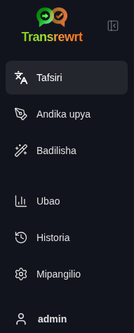
    </td>
    <td valign="top">
      <br/><br/>
      <ul>
        <li><strong>Tafsiri</strong> inafungua eneo la kazi la tafsiri.</li><br/>
        <li><strong>Andika upya</strong> inafungua eneo la kazi la kuandika upya.</li><br/>
        <li><strong>Badilisha</strong> inafungua eneo la kazi la mandhari maalum.</li><br/>
        <li><strong>Dashibodi</strong> inaonyesha taarifa za matumizi na gharama.</li><br/>
        <li><strong>Mipangilio</strong> inafungua ubao wa mipangilio.</li><br/>
        <li><strong>Historia</strong> inaonyesha historia ya matumizi pamoja na maandishi ya pembejeo na pato</li><br/>
        <li><strong>Mtumiaji</strong> inaonyesha jina la mtumiaji aliyewasilishwa (kwa wavuti tu).</li>
      </ul>
    </td>
  </tr>
</table>

<br/>

<a id="toolbar"></a>
### Barua ya Zana

Barua ya zana inabadilika kidogo kulingana na unako katika programu.

- Upande wa kushoto, inaonyesha jina la ukurasa wa sasa.
- Upande wa kulia, inaonyesha **kichagua kifaa** na kitendaji cha **Lugha ya kuingiza**.

**Kichagua kifaa** kinaonesha kuchagua injini gani ya AI itumike kwa kazi ya sasa.

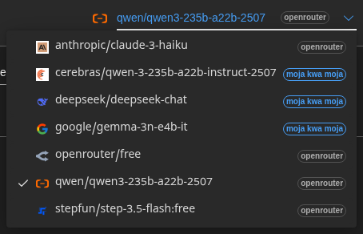

Baadhi ya mifano ya bure isingeweza kuwa yapatikana kila wakati—wakati mwingine yanaweza kuwa mbali au kuna kikomo cha matumizi. Ikiwa hivyo kitatokea, programu itawasilisha kifaa hicho kutoka kwenye orodha yako ya yanayopatikana. Kudhibiti mifano inayotazamia, nenda kwenye [**Mipangilio** > **Mifano**](#models) na hariri orodha yako ya mifano.
Unaweza pia kufungua mipangilio ya kifaa moja kwa moja kwa kubonyeza kipawe cha mtoa huduma upande wa kushoto wa jina la kifaa katika barua ya zana.

<br/>

**Picha ya dunia + msimbo wa lugha** inabadilisha lugha ya kuingiza ya programu, kama vile menyu na vitufe. Hai**badilishi** lugha za tafsiri zinazotumika katika **Tafsiri**.

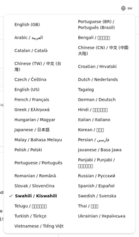

<br/>

<a id="input-and-output-panels"></a>
### Sehemu za pembejeo na pato

Sehemu zote zinatumia sehemu ya kushoto ya **Pembejeo** na sehemu ya kulia ya **Pato**.

Kila sehemu pia inaonesha:

| **Pembejeo**                                                          | **Pato**                                                                                                                  |
|--------------------------------------------------------------------|-----------------------------------------------------------------------------------------------------------------------------|
| - Idadi ya herufi <br/>- Idadi ya maneno <br/>- Idadi ya mifungu   <br/> | - Muda ulichotumika kufanya kazi<br/>- **TPS** (alama kwa sekunde)<br/>- Idadi za herufi, maneno, na mifungu<br/>- Kifaa kilichotumika |

Ikiwa unawaza kuhusu istilahi za kiufundi:

- **Alama** inamaanisha kipande kidogo cha maandishi. Unaweza kufikiria kama sehemu ya neno au neno fupi.
- **TPS** inamaanisha idadi ya vipande vya maandishi ambavyo kifaa kimechakata kwa kila sekunde.

<br/>

Unaweza pia kufuatilia gharama ya kila kitendo (ikiwa ipatikana) na gharama jumla, kuzima chaguo cha `Onyesha taarifa za gharama kwenye vitendo` kwenye [**Mipangilio** > **Mipangilio ya Ujumla**](#general-settings).

<br/><br/>

[--------------------------------------------------------------------------------------------------------------------------]: #

<a id="translate"></a>
## Tafsiri

Tumia **Tafsiri** unapohitaji kubadilisha maandishi kutoka lugha moja hadi nyingine.

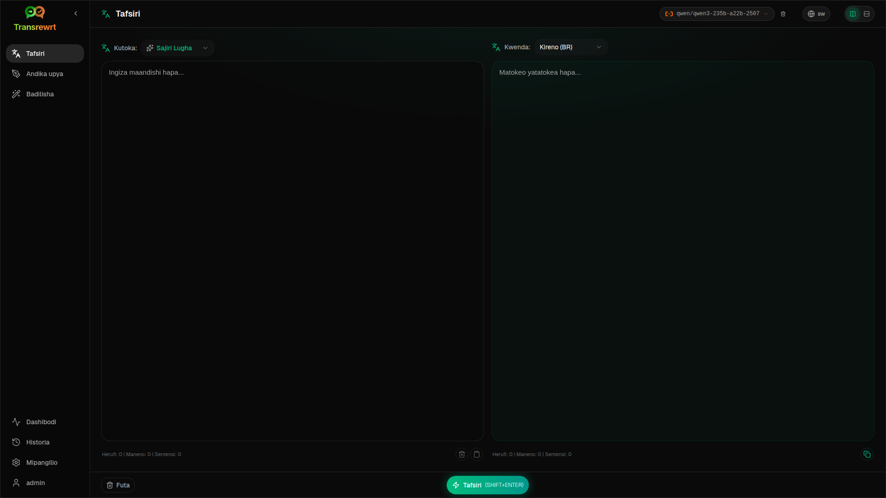

<br/>

<a id="translate-text"></a>
### Tafsiri maandishi

1. Fungua **Tafsiri**.
2. Chagua lugha katika **Kutoka**.
3. Chagua lugha katika **Kwenda**.
4. Chagua kifaa katika barua ya zana.
5. Andika au bindisha maandishi kwenye **Pembejeo**.
6. Bonyeza **Tafsiri**.
7. Soma matokeo katika **Pato**.
8. Tumia kitufe cha nakili ikiwa unataka kunakili matokeo.

<br/>

<a id="language-selection"></a>
### Uchaguzi wa lugha

- **Kutoka** inaweza kuwa lugha fulani au **Sajili Lugha**.
- **Kwenda** ni lugha unayotaka matokeo yakuwe kwenye.

Lugha zako zilizotumia **Za juu** zinatamkia juu ya orodha. Unaweza kuweka hizi kwenye [**Mipangilio** > **Lugha**](#languages).

<br/>

<a id="helpful-translation-settings"></a>
### Mipangilio muhimu ya tafsiri

Katika [**Mipangilio** > **Mipangilio ya Ujumla**](#general-settings), unaweza badilisha jinsi tafsiri inavyofanya kazi:

- **Tafsiri otomatiki kwa kubatika** inatumia tafsiri mara moja unapotia maandishi.
- **Nakili otomatiki matokeo kwenye ubao wa kunakili** inanakili matokeo otomatiki baada ya kufanikika kutekeleza.
- **Tafsiri ya wakati halisi (wakati unapoweka)** inatumia tafsiri wakati unapoweka maandishi.
- **Muda ulioharibika (ms)** unadhibiti muda ambao programu inasubiri kabla ya kutekeleza tafsiri ya wakati halisi.
- **Enter** inadhibiti kinachotokea unapobonyeza `Enter`:

<br/><br/>

[--------------------------------------------------------------------------------------------------------------------------]: #

<a id="rewrite"></a>
## Andika upya

Tumia **Andika upya** unapotaka kuboresha maneno bila kubadilisha maana kuu.

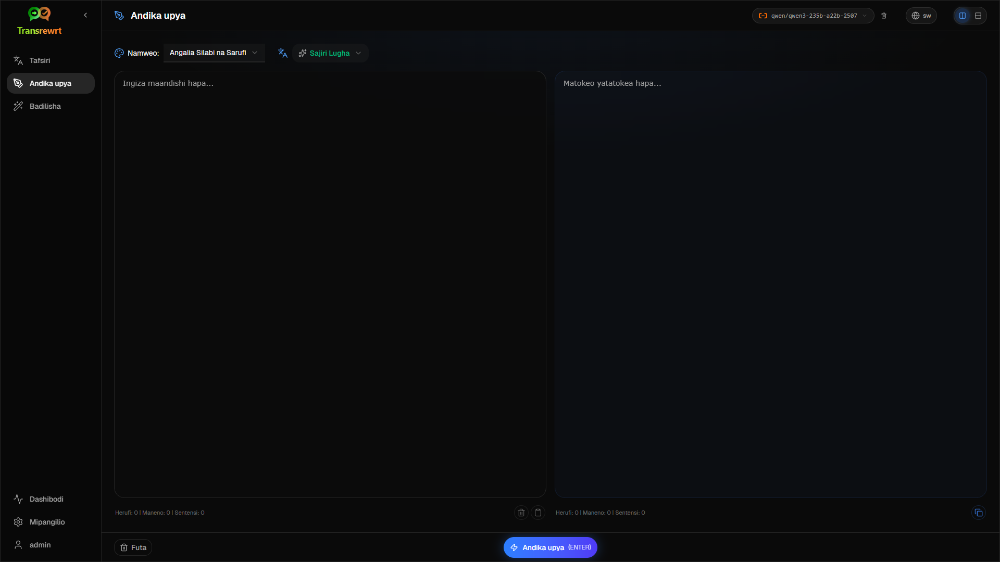

Hii ni muhimu kwa:

- kurekebisha silabi na sarufi (**Angalia Silabi na Sarufi**)
- kufanya maandishi iwe wazi zaidi (**Boresha Uwazi**)
- mabadiliko mbalimbali mengine kwa run moja (**Toleo mbadala**)
- kufanya maandishi iwe rasmi zaidi au si rasmi (**Rasmi** / **Si rasmi**)
- kufupisha au kupanua maandishi (**Fupisha** / **Panua**)
- kufanya maandishi iseme kama kiufundi zaidi (**Fanya Kiufundi**)

<br/>

> 💡 **SUGIO**<br/>
> Unapotumia kipindi cha "**Angalia Silabi na Sarufi**", kivinjari cha **Onyesha mabadiliko** kinaonekana kwenye ubao wa pato (karibu na **Nakili**).
> Washa au zima ili kuonesha au kuficha makosa halisi yaliyorekebishwa kwenye maandishi yako.

<br/><br/>

[--------------------------------------------------------------------------------------------------------------------------]: #

<a id="transform"></a>
## Badilisha

Tumia **Badilisha** unapotaka AI kufuata orodha maalum ya maelekezo.

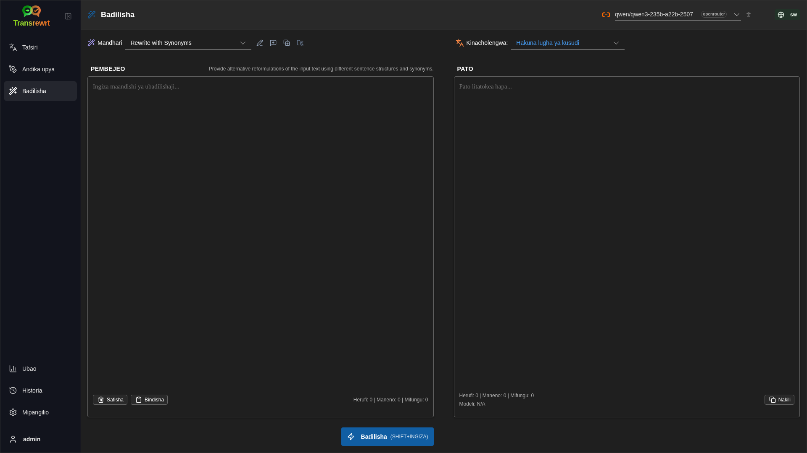

Hii ni sehemu yenye uwezo mkubwa zaidi ya programu. Unaweza kutumia kwa kazi kama vile:

- kufupisha maelezo
- kubadili maandishi ya kuchora kuwa barua pepe iliyosafishwa
- kutoa pointi muhimu
- kubadilisha maandishi kwenye muundo maalum
- shughuli zozote nyingine maalum na maandishi ya pembejeo

<br/>

<a id="run-an-existing-prompt"></a>
### Tekeleza mandhari iliyopo

1. Fungua **Badilisha**.
2. Chagua mandhari kutoka kwenye orodha ya mandhari.
3. Ikiwa kisanduku cha **Lengo** la lugha kinaonekana, chagua lugha ikiwa unataka.
4. Andika au batisha maandishi kwenye **Pembejeo**.
5. Bonyeza **Badilisha**.
6. Soma matokeo katika **Pato**.

<br/>

<a id="if-you-have-no-prompts-yet"></a>
### Ikiwa bado huna mandhari

Ikiwa orodha yako ya mandhari ni tupu, bonyeza **Pakia mchuzi mfano** kwenye eneo la kazi la Badilisha. Kitendakazi hicho kiko pale pale katika [**Mipangilio** > **Maagizo ya ubadilishaji**](#transform-prompts) kwenye safu ya toa/nakili. Vyote viwili vinaweka mifano ili uanze haraka.

<br/>

> ℹ️ **KUMBUKA**<br/>
> Mandhari ya mfano hutolewa kwa Kiingereza. Baada ya kupakia, unaweza kuhariri mandhari moja na kutumia **Tafsiri maagizo** kuihamisha kwenye lugha yako.

<br/>

<a id="create-a-prompt-quickly"></a>
### Tengeneza mandhari haraka

Njia ya haraka zaidi ya kutengeneza mandhari ni:

1. Bonyeza **Mandhari mpya**.
2. Bonyeza **Zalisha ombi**.
3. Eleza unachotaka mandhari kufanya.
4. Chagua kifaa.
5. Ruhusu programu kuunda rasimu kwako.
6. Soma rasimu na bonyeza **Hifadhi**.

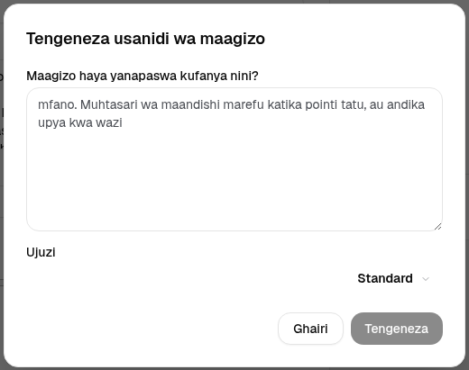

<br/>

<a id="edit-a-prompt"></a>
### Hariri mandhari

Unapotengeneza au kuhariri mandhari, kipengele cha kuhariri kinaonekana upande wa kushoto na eneo la jaribio linaonekana upande wa kulia.

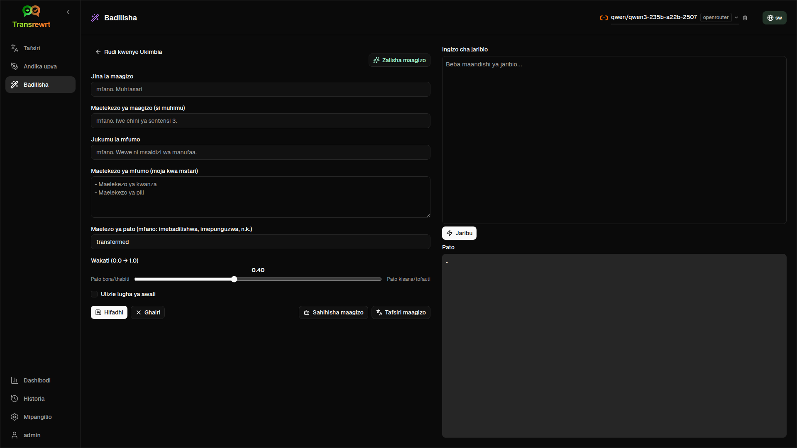

Sehemu kuu ni:

- **Jina la mandhari**: jina ambalo linawasilishwa katika orodha ya mandhari.
- **Maelekezo ya mandhari (si lazima)**: maelekezo machache yanayowasilishwa kwa mtumiaji wakati wa kuendesha mandhari.
- **Wajibu wa mfumo**: wajibu wa jumla unaozawadiwa kwa AI, kama vile 'Wewe ni msaidizi mwema.'
- **Maelekezo ya mfumo (moja kwa mstari)**: kanuni maalum ambazo unataka AI kuzifuate.
- **Maelezo ya pato**: neno fupi kinachoelezea matokeo, kama vile 'muhtasari' au 'andika upya'.
- **Joto (0.0 → 1.0)**: namna ambavyo kifaa kitachokaa; angalia chini.
- **Ulizie lugha ya mpangilio**: inaongeza kichagua cha lugha ya mpangilio wakati mandhari inapoendeshwa.

Ikiwa istilahi ya kiufundi **Joto** ni mpya kwako, fikiria kama ifuatavyo:

- **Joto** kidogo husababisha matokeo ya thabiti zaidi, yanayoweza kutabiriwa.
- **Joto** kikubwa husababisha ubunifu na tofauti zaidi.

Unaweza pia kutumia:

- **`Tengeneza mandhari`** kutengeneza rasimu mpya kutoka kwa maelezo rahisi
- **`Sahihisha mandhari`** kusahihisha mandhari iliyopo
- **`Tafsiri mandhari`** kutafsiri sehemu za mandhari

<br/>

> ⚠️ **ONDOA**<br/>
> Bonyeza **`Hifadhi`** kabla ya kubonyeza **`Rudi kuelekea`**. Ikiwa utarudi bila kuhifadhi, mabadiliko yako yatapotea.

<br/>

<a id="test-a-prompt-before-using-it"></a>
### Jaribu mandhari kabla ya kuiutilia

Paneli ya jaribio upande wa kulia inaruhusu kujaribu mandhari yako kwa maandishi ya kujaribu kabla ya kuiutilia kazi ya kila siku.

Hii ni muhimu wakati:

- unapotengeneza mandhari mpya
- unapolinganisha toleo mbili za mandhari
- unataka kuchagua sauti, urefu, au muundo wa pato

<br/>

> ℹ️ **MUHIMBI**<br/>
> Unaweza toa na kuleta mandhari uliyohifadhi kwenye [**Mipangilio** > **Maagizo ya ubadilishaji**](#transform-prompts).

<br/><br/>

[--------------------------------------------------------------------------------------------------------------------------]: #

<a id="dashboard"></a>
## Ubao

Tumia **Ubao** kuona kiasi cha kutumia programu na gharama (kwa mifano ya malipo).

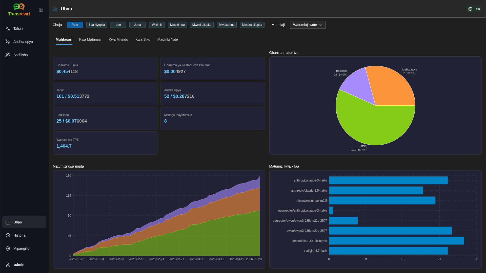

<br/>

> ℹ️ **MUHIMBI**<br/>
> Ikiwa hutumii tu mifano **bure**, kiasi cha **gharama** kikaweza kuwa sifuri na muhtasari unaotazamia gharama unaweza kuonekana tupu. Kwenye **Muhtasari**, **Matumizi kwa muda** na **Matumizi kwa kifaa** bado inaonyesha **idadi ya maombi** (tafsiri, andika upya, na badilisha) wakati una shughuli katika kipindi kilichochaguliwa.

<br/>

<a id="filter-the-data"></a>
### Chuja data

Tumia vitufe vya kuchuja juu ili kubadilisha kipindi cha wakati.

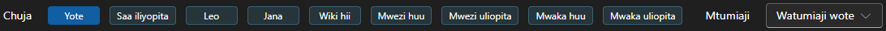

<br/>

> ℹ️ **KODI**<br/>
> Kichujio cha **Mtumiaji** kinaonekana tu kwa wasimamizi katika toleo la wavuti. Watumiaji wa kawaida hawataiona kichujio hiki, na hakipatikani katika programu ya kompyuta.

<br/>

<a id="dashboard-tabs"></a>
### Vichupo vya ubao

- **Muhtasari** unapewa maelezo ya jumla ya matumizi na gharama. Inajumuisha **matumizi kwa muda** (idadi ya **maombi yanayojumlisha** kwa siku kwa tafsiri, kuandika upya, na ubadilishaji) na **matumizi kwa kifaa** (jumla ya **maombi kwa kila kifaa**, ikiwa ni pamoja na ubadilishaji).
- **Kwa matumizi** inaweka shughuli kwa lugha ya tafsiri, hali ya kuandika upya, na maombi ya ubadilishaji.
- **Kwa kifaa** inaonyesha vifaa ulivyonatumia na gharama zao.
- **Kwa siku** inaonyesha jumla kwa kila siku.
- **Maombi yote** inaonyesha historia kamili ya maombi na kukupa uwezo wa kuichukua.

<br/>

<a id="export-data"></a>
### Toa data

Meza za ubao zinaweza kutoa data katika:

- **JSON**
- **CSV**
- **XLSX**

Hii ni muhimu ikiwa unataka kuchunguza shughuli nje ya programu au kushiriki ripoti.

<br/>

<a id="delete-stored-records-for-a-model"></a>
### Futa rekodi zilizohifadhiwa kwa kifaa

Katika **Kwa kifaa** au **Maombi yote**, unaweza kutoa rekodi zilizohifadhiwa kwa kifaa kwa kubonyeza kwenye ikoni ya "kisanduku cha taka".

> ⚠️ **ONYO**<br/>
> Kufuta rekodi zilizohifadhiwa haipaswi kurudishwa. Tumia hii tu ikiwa una uhakika kwamba hakuna hitaji tena kwa historia hiyo.

Ili kufuta data yote au kutoa rekodi kulingana na umri wao, nenda kwenye [**Mipangilio** > **Ufuatiliaji wa Gharama**](#cost-tracking). Pale utapata chaguo la kufuta data yote iliyohifadhiwa au tu data iliyopita tarehe fulani.

<br/><br/>

[--------------------------------------------------------------------------------------------------------------------------]: #

<a id="history"></a>
## Historia

Bonyeza kwenye **Historia** ili kuona historia ya vitendo vyako ndani ya **Transrewrt**, ikiwa ni pamoja na pembejeo na pato la kila kitendo.

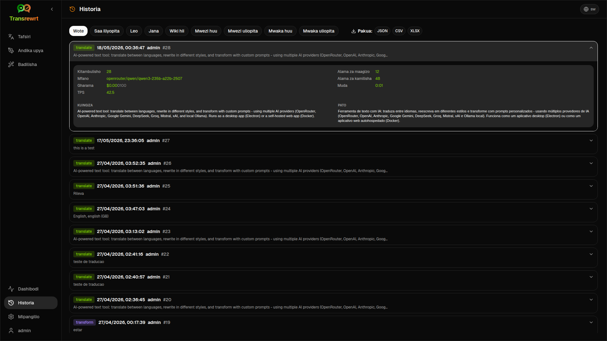

<br/>

<a id="filter-the-history"></a>
### Chuja data

**Historia** hutumia vichujio vilevile vilivyopo kwenye ukurasa wa **Ubao**. Tumia kuchagua kipindi cha muda.


<br/>

> ℹ️ **KODI**<br/>
> Kichujio cha **Mtumiaji** kinaonekana tu kwa wasimamizi katika toleo la wavuti. Watumiaji wa kawaida hawataiona kichujio hiki, na hakipatikani katika programu ya kompyuta.

<br/>

<a id="export-history-data"></a>
### Toa data ya historia

Ukurasa wa historia unaweza kutoa data iliyochujwa katika:

- **JSON**
- **CSV**
- **XLSX**

Hii ni muhimu ikiwa unataka kuchunguza shughuli nje ya programu au kushiriki ripoti.

<br/><br/>

[--------------------------------------------------------------------------------------------------------------------------]: #

<a id="settings"></a>
## Mipangilio

Fungua **Mipangilio** kutoka kwenye upau wa upande ili kufanya mpangilio wa jinsi programu inavyotendelea.

Vidodi vya upatikanaji vinategemea jukwaa na wajibu wako:

| Vidodi               | Desktop | Web (msimamizi) | Web (mtumiaji wa kawaida) |
  |-------------------|:-------:|:-----------:|:------------------:|
  | Mipangilio ya Ujumla  |   ndio   |     ndio     |        ndio         |
  | Vifaa            |   ndio   |     ndio     |        ndio         |
  | Lugha         |   ndio   |     ndio     |        ndio         |
  | Ufuatiliaji wa Gharama     |   ndio   |     ndio     |         —          |
  | Maagizo ya ubadilishaji |   ndio   |     ndio     |        ndio         |
  | Watumiaji             |    —    |     ndio     |         —          |
  | Mipangilio ya API        |   ndio   |     ndio     |         —          |
  | Kuhusu             |   ndio   |     ndio     |        ndio         |

<br/>

> ℹ️ **KODI**<br/>
> Katika toleo la wavuti, kila mtumiaji ana mpangilio wake mwenyewe. Mipangilio kama vile vifaa vilivyochaguliwa, lugha, chaguzi za ujumla, na maagizo ya ubadilishaji hutengenezwa kwa kila mtumiaji. Mabadiliko unayoyafanya hayasababishi mabadiliko kwa watumiaji wengine.

<br/>

[--------------------------------------------------------------------------------------------------------------------------]: #

<a id="general-settings"></a>
### Mipangilio ya ujumla

Tumia **Mipangilio ya Ujumla** kupima tabia ya kuandika, kama taarifa za utekelezaji zinahifadhiwa kwa ajili ya **Historia**, na muonekano.

**Tabia**

- **Tabia kwa ENTER** inachagua kama `Enter` inatumia kazi au inaweka mstari mpya.
- **Tafsiri otomatiki kwa kubatika** inanizua tafsiri mara tu unapobatika maandishi.
- **Nakili otomatiki matokeo kwenye ubao wa kunakili** inanakili matokeo yanayofaulu otomatiki.
- **Tafsiri ya wakati halisi (wakati unapoweka)** inatafsiri wakati unapoweka maandishi.
- **Muda ulioharibika (ms)** inaweka muda wa kusubiri kwa tafsiri ya wakati halisi.

**Historia**

- **Hifadhi kumbukumbu za utekelezaji** inaendelea kama kila tafsiri, andika upya, na ubadilishaji unahifadhi **maandishi ya pembejeo na pato** kwa ajili ya kumbukumbu la upau wa upande [**Historia**](#history). Kuzima hii inauliza kuthibitisha; ikiwa unakubali, maandishi ya kumbukumbu yataondolewa kutoka kwenye hifadhi. 
- **Futa data ya kumbukumbu** inaruhusu kufuta maandishi yaliyohifadhiwa kulingana na umri (kwa mfano, ya miezi michache iliyopita, au **data yote (wazi)**) kwa kutumia **Futa data**. Hii inaathiri tu maandishi ya utekelezaji yaliyohifadhiwa kwa ajili ya kumbukumbu la **Historia**; **haifanyi** kufuta jumla la gharama au matumizi. Ili kufuta au kupunguza data ya **gharama**, tumia [**Mipangilio** > **Ufuatiliaji wa Gharama**](#cost-tracking).

**Muonekano**

- **Onyesha taarifa za gharama kwenye vitendo** inaendelea kuonyesha gharama kwa kila kitendo (ikiwa ipatikana) na gharama jumla kwenye paneli za pato za **Tafsiri**, **Andika upya**, na **Badilisha**.
- **Tarakimu za sehemu za gharama** zinabadilisha jinsi tarakimu za desimali za gharama zinavyoonekana.
- **Kwa wavuti tu:** **onyesha eneo la kipimo karibu na programu** inaongeza nafasi ya ziada karibu na kiolesura.
- **Familia ya fonti** inabadilisha fonti ya kuandika kwenye paneli za maandishi.
- **Ukubwa** unabadilisha ukubwa wa fonti.

**Usimbaji wa Usanidi**

- **Jumuisha data ya matumizi kwenye usimwaji** — ikiwa imeamilishwa, ZIP pia ina data ya kumbukumbu za utekelezaji na maombi ya API. 
- **Sanidi Usimbaji** — inatengeneza ZIP moja (`transrewrt-config-backup-YYYY-MM-DD_HHMMSS.zip` katika UTC kwa chaguo-msingi) yenye `config.json`, `state.json`, ufunguo wa usimwaji (kama umechagua), watumiaji, mapendeleo, maagizo ya ziada, na data ya matumizi ikiwa umekubali. Baada ya usimwaji wa mafanikio, uthibitisho unaweka jina la faili iliyohifadhiwa.
- **Rudi kutoka kwenye usimwaji** — inafungua **kichwa cha kuthibitisha kwanza**. Chagua faili ya ZIP ya usimwaji ndani ya kichwa (**Chagua** / kichaguzi cha faili au buruta-na-angusha ambapo inasaidiwa), kisha angalia chaguzi:
  - **Rejesha data ya matumizi** — ingiza data ya matumizi/kumbukumbu kutoka kwenye ZIP ikiwa ilisimwa pamoja na matumizi; usiwezeshe ikiwa unataka tu mipangilio na maagizo.
  - **Futa data ya zamani kabla ya kurejesha** — ondoa data ya matumizi/kumbukumbu kwenye mfumo huu kabla ya kutumia usimwaji (haiwezi; tumia ikiwa unataka kubadilisha kikamilifu).

Usimwaji uliotengenezwa kwenye toleo la wavuti au desktop unaweza kurudishwa kwenye toleo lingine. Wakati wa kurudisha usimwaji wa desktop kwenye toleo la wavuti, data itarudishwa kwa mtumiaji wa msimamizi.

<br/>

<a id="models"></a>
### Vifaa

Tumia **Mipangilio** > **Vifaa** kuchagua vifaa ambavyo vinaonekana kwenye upau wa zana.

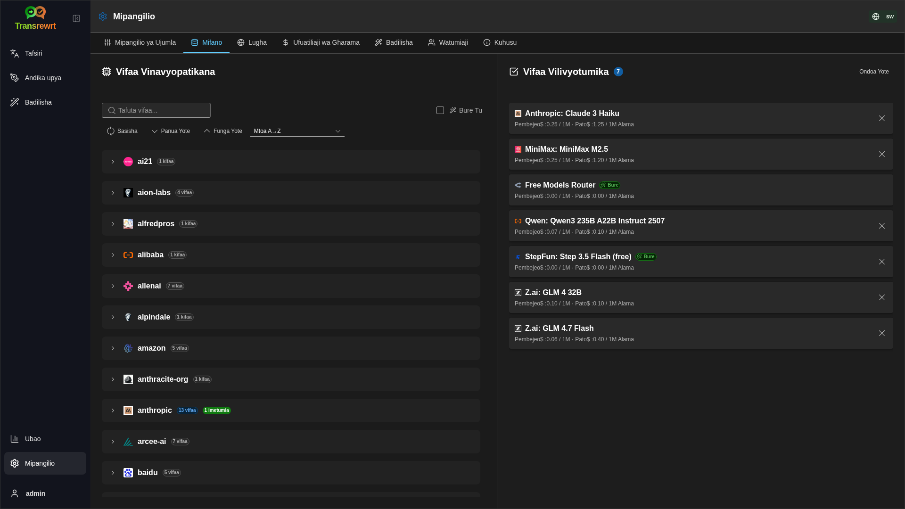

Ukurasa una orodha mbili:

- **Vifaa Vinavyopatikana** upande wa kushoto
- **Vifaa Vilivyotumika** upande wa kulia

Vitawala vinavyofaa vina jumuishwa:

- **Tafuta vifaa...** kupata kifaa kwa jina
- Vichipu vya **Mtoa huduma** kupunguza orodha kwa injini moja (OpenRouter, OpenAI, Ollama, …)
- **Bure Tu** kuonyesha tu vifaa vya bure
- **Sasisha** kupakia upya orodha
- **Panua Yote** na **Funga Yote** unapopanga kwa mtoa huduma

Vitambulisho vya kifaa vina jina la mtoa huduma (kama vile `openrouter/…` vs `openai/…`). Alama kama vile **OpenAI (OpenRouter)** vs **OpenAI (moja kwa moja)** zinaonesha jinsi barakoa inavyotumika.

> ℹ️ **KUWAZA**<br/>
> **OpenRouter Body Builder** (`openrouter/bodybuilder`) ni kifaa cha miongozo, si kifaa cha mazungumzo: majibu yake ni JSON yenye maelezo ya OpenRouter API (kama vile `requests` array yenye `model` na `messages`). Ikiwa utatumia kwa **Tafsiri**, **Andika upya**, au **Badilisha**, ubao wa pato utaonyesha JSON badala ya maandishi yaliyokamilika. Chagua kifaa cha maandishi kwa kazi hizo. Angalia [ukurasa wa kifaa cha Body Builder](https://openrouter.ai/openrouter/bodybuilder) kwenye OpenRouter.

Vitendo:

- Ili ongeza kifaa, bofya **Ongeza** au mahali popote kwenye kuingia.

- Ili oondoa kifaa, bofya **X** karibu nao kwenye **Vifaa Vilivyotumika** au **Imetumia** kwenye kuingia kwenye Vifaa Vinavyopatikana.

- Ili usafishe orodha, bofya **Ondoa Yote**. Kifaa cha bure kinachotakiwa kitabaki katika orodha.

<br/>

> ℹ️ **KUWAZA**<br/>
> Ikiwa hutaki kuongeza mikopo kwenye OpenRouter mara moja, anza kuzipa **Bure Tu** na kuchagua vifaa vya bure (bosi la kadi isiyo muhimu). Pia unaweza kutumia Ollama kubeba vifaa vya kijiji bila ufunguo wowote wa API.

<br/>

<a id="languages"></a>
### Lugha

Tumia **Mipangilio** > **Lugha** kusaidia orodha ya lugha zilizotumika katika programu.

- **Lugha za juu** zinawekwa karibu juu ya orodha ya lugha kwenye **Tafsiri** na **Badilisha**.
- **Lugha ya desturi** inaruhusu kuongeza lugha ambayo haipo kwenye orodha iliyotengenezwa awali.

Ikiwa ungeongeza lugha ya desturi, itaonekana kwenye kichagua cha lugha pamoja na chaguo zilizotengenezwa awali.

<br/>

<a id="cost-tracking"></a>
### Ufuatiliaji wa gharama

Tumia **Mipangilio** > **Ufuatiliaji wa Gharama** kudhibiti taarifa za gharama.

- **Gharama Jumla** inaonesha jumla ya sasa.
- **Nakili Thamani** inanakili jumla kwenye ubao wa kunakili.
- **Weka upya Gharama** inaweka upya jumla iliyohifadhiwa kuwa sifuri.
- **Fumeni na matumizi ya ufunguo wa API** inaweka jumla kuwa sawa na matumizi yanayoripotiwa na akaunti yako ya OpenRouter (OpenRouter tu).
- **Matumizi ya Ufunguo wa API** inaonesha maelezo ya matumizi ya OpenRouter, ikiwa yanapatikana.
- **Futa data ya gharama** inafuta data yote, au tu maingizo yaliyopita tarehe iliyochaguliwa.

**Ufuatiliaji wa gharama:** Unapotumia vifaa vya OpenRouter, programu inaonesha matumizi yako halisi na matumizi yako kulingana na taarifa za gharama kutoka OpenRouter. Kwa watoa wengine wote, programu inahesabu gharama kwa kutumia bei zilizotolewa na OpenRouter, ikiwa bei haipo, hesabu linaweza kuwa sifuri.

<br/>

> ℹ️ **KUWAZA**<br/>
>  **Nambari zote za gharama ni mawazo tu kwa ajili yako ya kurejelea, si katika kibali rasmi cha malipo.**

<br/>

> ⚠️ **ONDOA**<br/>
> Futa data haiwezi kurejeshwa. Kabla ya kufuta, hakikisha umehifadhi data yako au umuitoa kupitia [**Historia**](#history)
> au [**Ubao** > **Maombi Yote**](#dashboard-tabs), kama hayo yatapotea milele.
> Historia yote ya pembejeo/pato inayohusiana na kila kuingia cha maombi ya API pia itafutwa.

<br/>

<a id="transform-prompts"></a>
### Maagizo ya ubadilishaji

Tumia **Mipangilio** > **Maagizo ya ubadilishaji** kudhibiti maagizo kwa wingi.

Unaweza:

- ukaguzi wa mandhari uliyoiokoa
- futa mandhari
- ingiza mandhari kutoka kwenye faili
- toa mandhari kwa ajili ya usimamizi au kushiriki
- pakia mchuzi mfano kwenye orodha ya mandhari

<br/>

<a id="users"></a>
### Watumiaji

Tumia **Watumiaji** kudumisha akaunti za watumiaji toleo la wavuti. Unaweza kuongeza watumiaji, kusasisha maelezo yao, kurudisha nywila, na kufuta akaunti.

<br/>

<a id="api-config"></a>
### Mipangilio ya API

Watoa huduma waliomzungukwa ni: OpenRouter, OpenAI, Anthropic, Google Gemini, DeepSeek, Groq, Mistral, xAI, Cerebras, na **Ollama** (mifano ya kijitihima kupitia URL ya msingi). Unahitaji tu kumweka mtoa huduma ambaye unatumia.

**Programu ya wavuti: kwa msimamizi tu**

Vifungu vya API vinawekwa kupitia vigezo vya mazingira ya mfumo au Docker — havijawekwa kwenye UI ya wavuti. Ukurasa huu unawasilisha watoa ambao kina fungu kilichowekwa na kukupa uwezo wa kujaribu kila moja kwa kubonyeza kitufe cha **`Jaribu`**.

<br/>

> ℹ️ **KODI**<br/>
> Ili kubadilisha fungu la API, wasilisha kivinjari cha mazingira kwenye mfumo wako au mipangilio ya Docker na uzirejeshee kizimamoto au kizingiti.

> ℹ️ **KODI**<br/>
> **Usimbaji wa usanidi** (tazama [**Mipangilio ya ujumla** → Usimbaji wa usanidi](#general-settings)) unaweza kujumuisha vifungu vilivyosuluhishwa vya mtoa huduma ndani ya `config.json` ya ZIP. Kurudisha ZIP hiyo **hakurudishi** vifungu hivyo nyuma kwenye faili ya usanidi iliyotolewa na kizimamoto — vifungu vilivyonavyotumika bado vinatoka kwenye mazingira na hali ya faili iliyopo kama ilivyoelezwa pale.

<br/>

**Programu ya kompyuta**

Tumia **Mipangilio ya API** kuhifadhi vifungu vya API kwa kila mtoa huduma unayotumia. Kwa Ollama, weka **URL ya msingi** badala ya fungu la API.

<br/>

> 💡 **Shauri** <br/>
> Ikiwa hutaki kutumia fungu la API au kulipa matumizi, unaweza [pata Ollama](https://ollama.com) na kizindua mifano (kama vile `translategemma:4b`) kijitihima kwenye kompyuta yako bila malipo. Pia, unaweza kuunda akaunti ya bure ya OpenRouter (bila kadi ya mkopo) kutumia mifano yao ya bure, au kupata fungu la API bure kutoka Cerebras, Google, Groq, au Mistral AI.

<br/>

- Ongeza watoa huduma ambao unawajalishi tu. Katika **Mipangilio** > **Mifano**, kitambulisho cha kila kifaa kinaanza na mtoa huduma (kama vile `openrouter/openrouter/free`, `openai/gpt-4o`, `ollama/llama3`).

Ili kuongeza fungu la API, weka thamani katika kisanduku cha maandishi na bofya **`Hifadhi`**. Ili kubadilisha fungu linalopo, bofya **`Hariri`**. Ili kuthibitisha kwamba fungu linafanya kazi, bofya **`Jaribu`**. Kwa URL ya msingi ya Ollama, daima bofya **`Jaribu`** kuchunguza muunganisho.

<br/>

> ℹ️ **KODI**<br/>
> Huwezi kuona thamani ya sasa ya fungu la API. Unaweza tu kubadilisha kwa kutumia kitufe cha **`Hariri`**.
> Vifungu vya API vinahifadhiwa kama siri katika usanidi.

<br/>

<a id="about"></a>
### Kuhusu

Lipu ya **Kuhusu** inaonyesha:

- jina la programu
- nambari ya toleo
- tarehe ya uundaji
- kiungo kwenye hifadhi ya mradi

<br/><br/>

<a id="common-issues"></a>
## Matatizo ya kawaida

Ikiwa kitu hakifanyi kazi kama inavyotarajiwa, angalia vigezo vifuatavyo kwanza.

<br/>

<a id="the-app-will-not-translate-rewrite-or-transform-text"></a>
### Programu hutaweza kufanya tafsiri, andika upya, au kubadilisha maandishi

Hakikisha kwamba:

- umechagua kifaa kwenye bwenye la vifaa
- kifaa kimoja au zaidi kimeorodheshwa katika [**Mipangilio** > **Mifano**](#models)
- usanidi wako wa API unafanya kazi

Kama unatumia programu ya dawati:

1. Fungua [**Mipangilio** > **Mipangilio ya API**](#api-config).
2. Hakikisha kwamba kifungo cha API kimoja au zaidi kimehifadhiwa.
3. Bofya **Jaribu** karibu na mtoa huduma kuthibitisha kifungo kinavyofanya kazi.

<br/>

<a id="the-model-list-is-empty"></a>
### Orodha ya mifano tupu

Fungua [**Mipangilio** > **Mifano**](#models) na bofya **Sasisha**.

Kama inahitajika:

- tafuta kifaa
- washa **Bure Tu**
- ongeza kifaa kimoja au zaidi kwenye **Vifaa Vilivyotumika**

<br/>

<a id="the-result-is-too-slow-or-too-expensive"></a>
### Matokeo ni polepole sana au ghali sana

Jaribu moja au zaidi ya hizi:

- chagua kifaa tofauti
- tumia pembejeo mfupi
- zima **Tafsiri ya wakati halisi (wakati unapoweka)** katika [**Mipangilio** > **Mipangilio ya Ujumla**](#general-settings)
- tumia mifano ya bure kwa kazi rahisi (angalia [Mifano](#models))

<br/>

<a id="the-interface-is-in-the-wrong-language"></a>
### Kiolesura kiko katika lugha isiyo sahihi

Bofya ikoni ya dunia katika [bwenye la vifaa](#toolbar) na uchague **Lugha ya kuingiza** unayopendelea.

<br/>

<a id="the-text-is-too-small-or-hard-to-read"></a>
### Maandishi ni ndogo sana au ngumu kusoma

Fungua [**Mipangilio** > **Mipangilio ya Ujumla**](#general-settings) na badilisha:

- **Familia ya Fonti**
- **Ukubwa**

<br/>

<a id="dashboard-charts-are-empty"></a>
### Chati za Ubao tupu

Hii ni kawaida kama:

- unatumia mifano ya bure tu na unatazama takwimu za gharama (zinaweza kuwa sifuri); chati za hesabu ya matumizi za **Muhtasari** bado zinahitaji data kwa kipindi kilichochaguliwa
- **chujio la wakati** kilichochaguliwa halifuniki kipindi ambacho maombi yalifanywa — jaribu **Yote** kukagua

Ikiwa grafu bado ni tupu baada ya kuchagua **Yote**, thibitisha kuwa maombi yanavyotokea katika [**Historia**](#history) au katika kichupo cha **Maombi Yote**.

<br/>

<a id="cost-shows-not-available-or-seems-wrong"></a>
### Gharama inaonyesha "haipo" au inaonekana si sahihi

Unapotumia mifano kupitia **OpenRouter**, programu inaonyesha matumizi yako halisi yanayotolewa na OpenRouter.

Kwa **watoa huduma wengine** (OpenAI moja kwa moja, Anthropic moja kwa moja, n.k.), gharama inazamiwa kutokana na data ya bei iliyotolewa na OpenRouter. Ikiwa bei inayofanana haijapatikana kwa kifaa, gharama itaonekana kama **haipo** na hautajumuishwa katika jumla yako.

<br/>

<a id="total-cost-does-not-match-my-provider-bill"></a>
### Gharama jumla haifanani na bili yangu ya mtoa huduma

Nambari zote za gharama katika programu ni **mizani kwa ajili ya marejeleo tu**, si katika kibali rasmi.

Ili kufanya jumla iwe karibu zaidi na matumizi yako halisi ya OpenRouter, fungua [**Mipangilio** > **Ufuatiliaji wa Gharama**](#cost-tracking) na bofya **Fumeni na matumizi ya ufunguo wa API**.

<br/>

<a id="the-history-page-is-missing-from-the-sidebar"></a>
### Ukurasa wa Historia umepotea kutoka kwenye upande

**Hifadhi kumbukumbu za utekelezaji** inaweza kuwa imezimwa. Fungua [**Mipangilio** > **Mipangilio ya Ujumla**](#general-settings) na wezesha. Angalia kuwa kuwasha hukurudisha data ya historia iliyofutwa awali.

<br/>

<a id="web-app-session-expired"></a>
### Programu ya wavuti: umerejelewa kwenye ukurasa wa kuingia kwa makosa

Kikao chako kikikauka. Ingia tena. Ikiwa hutokea mara kwa mara, angalia mpangilio wa seva kwa vituo vya muda wa kikao.

<br/>

<a id="web-admin-forgot-or-lost-a-password"></a>
### Msimamizi wa wavuti: umesahau au umepoteza nenosiri

Hii inahusisha programu ya **wavuti inayotunzwa binafsi** (Docker), si programu ya kompyuta (Electron).

- Ikiwa msimamizi mwingine bado anaweza kuingia, anaweza kufungua [**Mipangilio** > **Watumiaji**](#users), kuchagua akaunti, na kuweka **nenosiri jipya** pale.
- Ikiwa umekuwa **umefungwa nje** lakini una **ufikiaji wa shell** kwenye kifaa au chombo, rudisha nenosiri kwa kusaidia ambao unachopokea pamoja na picha (badilisha `transrewrt` ikiwa umebadilisha jina la msingi, na weka maandishi nenosiri ikiwa ina nafasi au herufi maalum):

```bash
docker exec transrewrt reset-web-password '<username>' '<new-password>'
```

Jina la msimamizi wa msingi ni `admin` ikiwa hujawatengeneza watumiaji wengine. Unapotuma hoja moja tu, inachukuliwa kuwa ni nenosiri jipya kwa `admin`.

Ikiwa unatumia kutoka kwenye **kikundi cha chanzo** badala ya Docker, tumia:

```bash
pnpm run reset-web-password -- <username> <new-password>
```

Skripti inasasisha rekodi ya mtumiaji kwenye hifadhidata ya SQLite (na inaweza kutengeneza mtumiaji wa `admin` ikiwa umepotea). Baada ya kurudisha, ingia kwa nenosiri jipya.

<br/>

<a id="dashboard-shows-no-data-for-other-users"></a>
### Ubao unaonyesha hakuna data kwa watumiaji wengine (wavuti)

Tu **wamsimamizi** tu ambao wanaweza kuangalia data kutoka kwa watumiaji wote kupitia kichujio cha **Mtumiaji**. Watumiaji wa kawaida wanaweza kuona tu shughuli zao wenyewe kama ilivyowekwa.

<br/>

<a id="i-changed-a-prompt-and-lost-the-edits"></a>
### Nimabadilisha mandhari na kusahau mabadiliko

Unapofanya mabadiliko ya mandhari, bonyeza **Hifadhi** kabla ya kubonyeza **Rudi kwenye Run**.

<br/><br/>

<a id="quick-tips"></a>
## Vidokezo vya haraka

- Anza kwa [**Tafsiri**](#translate) kuhakikisha usanidi wako unafanya kazi kabla ya kuendelea kwa [**Andika upya**](#rewrite) au [**Badilisha**](#transform).
- Tumia [**Andika upya**](#rewrite) kwa maendeleo ya kila siku ya matumizi ya maneno.
- Tumia [**Badilisha**](#transform) unapohitaji mtiririko wa kazi unaorejea kwa kazi maalum.
- Tumia [**Ubao**](#dashboard) kama unataka kufuatilia matumizi na gharama.
- Tumia [**Historia**](#history) kukagua operesheni zilizopita na maandishi yote ya pembejeo/patto.
- Toa mandhari mara kwa mara kama unajenga maktaba ya mandhari unayotaka kulinda (angalia [Maagizo ya ubadilishaji](#transform-prompts)) au kama unataka kuyagawanya na wengine.

<br/><br/>

<a id="disclaimer"></a>
## Deni

Majina ya bidhaa na ishara husidhimana na wamiliki wake na hutumika kwa kutambua tu. Programu hii haifananishi na chakula kimepokelewa na lolote la vipengele vilivyoleta.

<br/><br/>

<a id="license"></a>
## Leseni

Haki za kuleta © 2026 Waldemar Scudeller Jr.

[Apache License 2.0](LICENSE)
