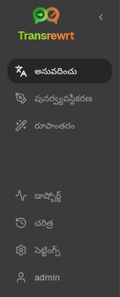
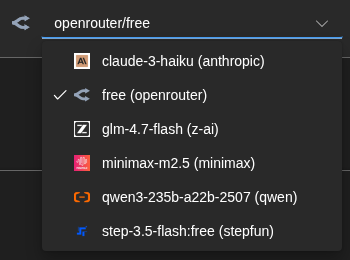
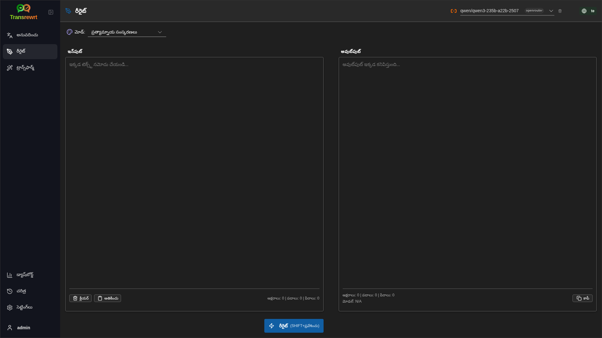
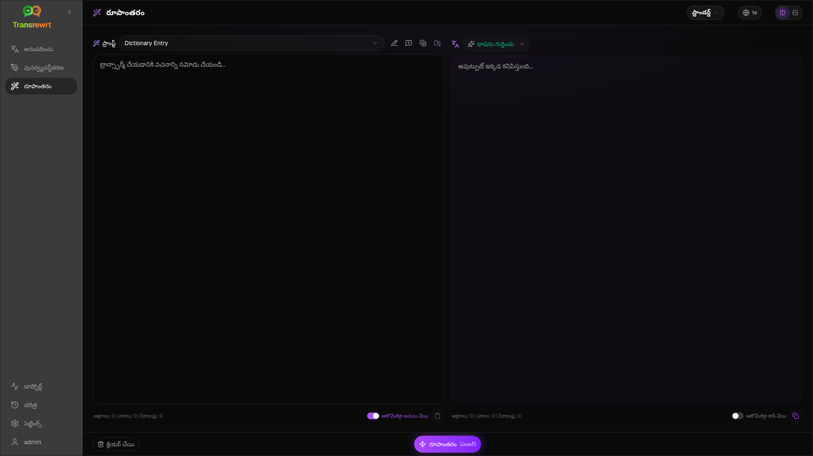
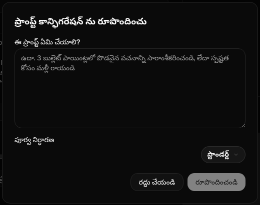
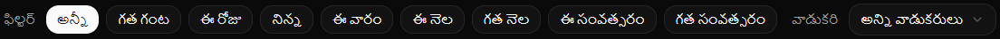

<a id="transrewrt-user-guide"></a>
# వాడుకరి మార్గదర్శకం

<br/>

<a id="introduction"></a>
## పరిచయం

Transrewrt మూడు ప్రధాన మార్గాల్లో మీరు పాఠ్యంతో పనిచేయడానికి సహాయపడుతుంది:

- **అనువదించు** - ఒక భాష నుండి మరొక భాషకు పాఠ్యాన్ని మార్చడం.
- **రీరైట్** - స్పష్టంగా, సంక్షిప్తంగా లేదా మరింత ఔపచారికంగా వంటి వేరే శైలిలో పాఠ్యాన్ని పునరావృతం చేయడం.
- **ట్రాన్స్‌ఫార్మ్** - ప్రామ్ప్ట్‌లు అని పిలవబడే కస్టమ్ AI సూచనలను ఉపయోగించి పాఠ్యాన్ని ప్రాసెస్ చేయడం.

<br/>

ఇన్స్టాల్ చేసి నడుస్తున్న తర్వాత యాప్‌ను ఉపయోగించడం ఎలాగో ఈ మార్గదర్శకం వివరిస్తుంది. ఇన్స్టాలేషన్ దశల కోసం, ప్రధాన **[README](README.te.md)** చూడండి.

<br/>

> ℹ️ **గమనిక**<br/>
> Transrewrt విండోస్ మరియు లైనక్స్ కోసం డెస్క్‌టాప్ అప్లికేషన్‌గా, మరియు స్వంతంగా హోస్ట్ చేసుకునే వెబ్ అప్లికేషన్‌గా అందుబాటులో ఉంది. ఈ మార్గదర్శకం అప్లికేషన్ యొక్క రోజువారీ ఉపయోగంపై దృష్టి పెడుతుంది. ఒక ప్రత్యేక వెర్షన్‌కు మాత్రమే వర్తించే విషయాలు స్పష్టంగా గుర్తించబడతాయి.

<small>**ఇతర భాషలలో చదవండి:** </small>
<small id="lang-list">[English (GB)](../USER-GUIDE.md) · [Português (Brasil)](./USER-GUIDE.pt-BR.md) · [العربية](./USER-GUIDE.ar.md) · [বাংলা](./USER-GUIDE.bn.md) · [Català](./USER-GUIDE.ca.md) · [中文 (中国大陆)](./USER-GUIDE.zh-CN.md) · [中文 (台灣)](./USER-GUIDE.zh-TW.md) · [Hrvatski](./USER-GUIDE.hr.md) · [Čeština](./USER-GUIDE.cs.md) · [Nederlands](./USER-GUIDE.nl.md) · [English (US)](./USER-GUIDE.en-US.md) · [Tagalog](./USER-GUIDE.tl.md) · [Français](./USER-GUIDE.fr.md) · [Deutsch](./USER-GUIDE.de.md) · [Ελληνικά](./USER-GUIDE.el.md) · [हिन्दी](./USER-GUIDE.hi.md) · [Magyar](./USER-GUIDE.hu.md) · [Italiano](./USER-GUIDE.it.md) · [日本語](./USER-GUIDE.ja.md) · [한국어](./USER-GUIDE.ko.md) · [Bahasa Melayu](./USER-GUIDE.ms.md) · [فارسی](./USER-GUIDE.fa.md) · [Polski](./USER-GUIDE.pl.md) · [Basa Jawa](./USER-GUIDE.jv.md) · [Português](./USER-GUIDE.pt.md) · [ਪੰਜਾਬੀ](./USER-GUIDE.pa.md) · [Română](./USER-GUIDE.ro.md) · [Русский](./USER-GUIDE.ru.md) · [Slovenčina](./USER-GUIDE.sk.md) · [Español](./USER-GUIDE.es.md) · [Kiswahili](./USER-GUIDE.sw.md) · [Svenska](./USER-GUIDE.sv.md) · [తెలుగు](./USER-GUIDE.te.md) · [ไทย](./USER-GUIDE.th.md) · [Türkçe](./USER-GUIDE.tr.md) · [Українська](./USER-GUIDE.uk.md) · [Tiếng Việt](./USER-GUIDE.vi.md)</small>

<small>

> **UI మరియు పత్రాల అనువాదాల గురించి గమనిక:** మూల ఇంగ్లీష్ (UK) తప్ప మిగిలిన అన్ని ఇంటర్ఫేస్ భాషలు 
> ఎఐ మోడల్స్ ఉపయోగించి అనువదించబడ్డాయి; పదబంధం స్పష్టంగా లేకపోవచ్చు లేదా పొరుదులు ఉండవచ్చు.

</small>

<br/>

<!-- START doctoc generated TOC please keep comment here to allow auto update -->
<!-- DON'T EDIT THIS SECTION, INSTEAD RE-RUN doctoc TO UPDATE -->
**విషయసూచిక**

- [మీరు ప్రారంభించే ముందు](#before-you-start)
  - [ఉచిత OpenRouter API కీని ఎలా పొందాలి (డెస్క్‌టాప్ అప్లికేషన్)](#how-to-get-a-free-openrouter-api-key-desktop-app)
- [ప్రారంభించడం](#getting-started)
- [విండో యొక్క ప్రధాన భాగాలు](#main-parts-of-the-window)
  - [సైడ్‌బార్](#sidebar)
  - [టూల్‌బార్](#toolbar)
  - [ఇన్‌పుట్ మరియు అవుట్‌పుట్ ప్యానెల్స్](#input-and-output-panels)
- [అనువదించు](#translate)
  - [టెక్స్ట్‌ను అనువదించండి](#translate-text)
  - [భాష ఎంపిక](#language-selection)
  - [ఉపయోగకరమైన అనువాద సెట్టింగ్స్](#helpful-translation-settings)
- [తిరిగి వ్రాయండి](#rewrite)
- [పరివర్తన](#transform)
  - [ఉన్న ప్రాంప్ట్‌ను అమలు చేయండి](#run-an-existing-prompt)
  - [మీకు ఇంకా ప్రాంప్ట్స్ లేకపోతే](#if-you-have-no-prompts-yet)
  - [త్వరగా ప్రాంప్ట్‌ను సృష్టించండి](#create-a-prompt-quickly)
  - [ప్రాంప్ట్‌ను సవరించండి](#edit-a-prompt)
  - [ఉపయోగించే ముందు ప్రాంప్ట్‌ను పరీక్షించండి](#test-a-prompt-before-using-it)
- [డాష్‌బోర్డ్](#dashboard)
  - [డేటాను ఫిల్టర్ చేయండి](#filter-the-data)
  - [డాష్‌బోర్డ్ ట్యాబ్స్](#dashboard-tabs)
  - [డేటాను ఎగుమతి చేయండి](#export-data)
  - [మోడల్ కోసం నిల్వ చేసిన రికార్డ్స్‌ను తొలగించండి](#delete-stored-records-for-a-model)
- [చరిత్ర](#history)
  - [డేటాను ఫిల్టర్ చేయండి](#filter-the-data-1)
  - [చరిత్ర డేటాను ఎగుమతి చేయండి](#export-history-data)
- [సెట్టింగ్స్](#settings)
  - [సాధారణ సెట్టింగ్స్](#general-settings)
  - [మోడల్స్](#models)
  - [భాషలు](#languages)
  - [ఖర్చు ట్రాకింగ్](#cost-tracking)
  - [పరివర్తన ప్రాంప్ట్స్](#transform-prompts)
  - [వాడుకరులు](#users)
  - [API కాన్ఫిగరేషన్](#api-config)
  - [గురించి](#about)
- [సాధారణ సమస్యలు](#common-issues)
  - [అప్లికేషన్ టెక్స్ట్‌ను అనువదించదు, తిరిగి వ్రాయదు లేదా పరివర్తించదు](#the-app-will-not-translate-rewrite-or-transform-text)
  - [మోడల్ జాబితా ఖాళీగా ఉంది](#the-model-list-is-empty)
  - [ఫలితం చాలా నెమ్మదిగా లేదా ఖరీదైనదిగా ఉంది](#the-result-is-too-slow-or-too-expensive)
  - [ఇంటర్‌ఫేస్ తప్పు భాషలో ఉంది](#the-interface-is-in-the-wrong-language)
  - [టెక్స్ట్ చాలా చిన్నదిగా లేదా చదవడానికి కష్టంగా ఉంది](#the-text-is-too-small-or-hard-to-read)
  - [డాష్‌బోర్డ్ చార్ట్స్ ఖాళీగా ఉన్నాయి](#dashboard-charts-are-empty)
  - [ఖర్చు "అందుబాటులో లేదు" లేదా తప్పుగా కనిపిస్తుంది](#cost-shows-not-available-or-seems-wrong)
  - [మొత్తం ఖర్చు మీ ప్రొవైడర్ బిల్‌తో సరిపోలడం లేదు](#total-cost-does-not-match-my-provider-bill)
  - [సైడ్‌బార్ నుండి చరిత్ర పేజీ లేదు](#the-history-page-is-missing-from-the-sidebar)
  - [వెబ్ అప్లికేషన్: అనుకోకుండా లాగిన్ పేజీకి మళ్లించబడింది](#web-app-redirected-to-the-login-page-unexpectedly)
  - [వెబ్ అడ్మిన్: పాస్‌వర్డ్ మరచిపోయారు లేదా పోయింది](#web-admin-forgot-or-lost-a-password)
  - [డాష్‌బోర్డ్ ఇతర వాడుకరుల కోసం డేటాను చూపించడం లేదు (వెబ్)](#dashboard-shows-no-data-for-other-users-web)
  - [నేను ప్రాంప్ట్‌ను మార్చాను మరియు సవరణలు పోయాయి](#i-changed-a-prompt-and-lost-the-edits)
- [త్వరిత సూచనలు](#quick-tips)
- [అస్వీకరణ](#disclaimer)
- [లైసెన్స్](#license)

<!-- END doctoc generated TOC please keep comment here to allow auto update -->

<br/><br/>

<a id="before-you-start"></a>
## మీరు ప్రారంభించే ముందు

Transrewrt ఉపయోగించడానికి, మీరు కనీసం ఒక AI ప్రదాతకు ప్రాప్యత కలిగి ఉండాలి. మద్దతు ఇచ్చే ప్రదాతలు: [OpenRouter](https://openrouter.ai) (చాలా మోడల్‌లను సమాహారం చేస్తుంది), OpenAI, యాంథ్రోపిక్, గూగుల్ జెమిని, డీప్సీక్, గ్రోక్, మిస్ట్రల్, ఎక్స్ఏఐ, Cerebras, మరియు స్థానిక మోడల్‌ల కోసం [Ollama](https://ollama.com).

ప్రారంభించడానికి మీరు చెల్లించిన మోడల్‌ను ఎంచుకోవాల్సిన అవసరం లేదు. మీరు మీ OpenRouter API కీని జోడించిన వెంటనే, అప్లికేషన్ అంతర్నిర్మిత **ఉచితం** OpenRouter ఎంపికను స్వయంచాలకంగా ప్రారంభిస్తుంది. ఇది మీరు వెంటనే టెక్స్ట్‌ను అనువదించడానికి, తిరిగి వ్రాయడానికి మరియు మార్చడానికి అనుమతిస్తుంది. ప్రత్యామ్నాయంగా, మీరు Cerebras, Google, Groq లేదా Mistral AI నుండి ఉచిత API కీని పొందవచ్చు.

సాధారణ భాషలో:

- ఒక **మోడల్** పని చేసే AI ఇంజిన్. మోడల్‌లను **ప్రదాత ప్రిఫిక్స్**తో పట్టికలో చూపించారు (ఉదాహరణకు `openrouter/…`, `openai/…`, `ollama/…`).
- ఒక **API కీ** (లేదా Ollama కోసం, ఒక **బేస్ URL**) అప్లికేషన్ ఆ ప్రదాతను చేరుకునే విధానం.

మీరు **డెస్క్‌టాప్ అప్లికేషన్** ఉపయోగిస్తుంటే, మీరు ఉపయోగించే ప్రతి ప్రదాత కోసం [**సెట్టింగ్‌లు** > **API కాన్ఫిగ్**](#api-config)లో కీలను జోడించండి. కేవలం OpenRouter ఉపయోగించడానికి, క్రింద [API కీ పొందడం ఎలా](#how-to-get-an-api-key-desktop-app) చూడండి. మీరు API కీని ఉపయోగించకూడదనుకుంటే, మీరు Ollamaని ఇన్‌స్టాల్ చేయవచ్చు ([ollama.com](https://ollama.com) నుండి) మరియు `translategemma:4b` వంటి స్థానిక మోడల్‌లను ఉపయోగించవచ్చు.

మీరు **వెబ్ వెర్షన్** ఉపయోగిస్తుంటే, సర్వర్ యజమాని పర్యావరణ వేరియబుల్స్ ద్వారా ప్రదాతలను కాన్ఫిగర్ చేస్తాడు, కాబట్టి మీరు అప్లికేషన్‌లో నేరుగా API కీలను నమోదు చేయలేరు.

<br/>

<a id="how-to-get-an-api-key-desktop-app"></a>
### ఉచిత ఓపెన్రౌటర్ API కీని ఎలా పొందాలి (డెస్క్‌టాప్ అప్లికేషన్)

మీరు డెస్క్‌టాప్ అప్లికేషన్ ఉపయోగిస్తున్నట్లయితే, ఈ దశలను అనుసరించండి:

1. మీ వెబ్ బ్రౌజర్‌లో [OpenRouter](https://openrouter.ai)కి వెళ్లండి.
2. ఖాతాను సృష్టించండి లేదా సైన్ ఇన్ అవ్వండి.
3. [Keys](https://openrouter.ai/keys) పేజీని తెరవండి.
4. కొత్త API కీని సృష్టించడానికి బటన్‌పై క్లిక్ చేయండి.
5. మీరు తర్వాత దానిని గుర్తించగలిగేలా కీకి పేరు ఇవ్వండి.
6. కొత్త API కీని కాపీ చేసుకోండి.
7. Transrewrtకి తిరిగి వెళ్లి **సెట్టింగ్స్** > **API కాన్ఫిగ్** తెరవండి.
8. **OpenRouter API కీ**లోకి కీని పేస్ట్ చేయండి (**సెట్టింగ్స్** > **API కాన్ఫిగ్** కింద).
9. అది పనిచేస్తుందో లేదో పరీక్షించడానికి **OpenRouter కీని పరీక్షించండి**పై క్లిక్ చేయండి.

<br/><br/>

<a id="getting-started"></a>
## ప్రారంభించడం

మీరు మొదటిసారిగా Transrewrt ఉపయోగిస్తున్నట్లయితే, ఈ క్రమాన్ని అనుసరించండి:

1. అప్లికేషన్‌ను తెరవండి.
2. అవసరమైతే గ్లోబ్ ఐకాన్ నుండి మీ **ఇంటర్‌ఫేస్ భాష**ను ఎంచుకోండి.
3. మీరు **డెస్క్‌టాప్ అప్లికేషన్** లో ఉంటే, [**సెట్టింగ్స్** > **API కాన్ఫిగ్**](#api-config) తెరవండి, కనీసం ఒక ప్రొవైడర్ కోసం API కీని జోడించండి (ఉదాహరణకు OpenRouter) మరియు అది పనిచేస్తుందో లేదో ధృవీకరించడానికి **పరీక్షించు**పై క్లిక్ చేయండి.
4. [**సెట్టింగ్స్** > **మోడల్స్**](#models) తెరవండి మరియు **ఎంచుకున్న మోడల్స్**కు ఒకటి లేదా అంతకంటే ఎక్కువ మోడల్స్‌ను జోడించండి.
5. [**సెట్టింగ్స్** > **భాషలు**](#languages) తెరవండి మరియు మీకు ఎక్కువగా ఉపయోగించే భాషలు మొదట కనిపించాలనుకుంటే **ప్రధాన భాషలు** ఎంచుకోండి.
6. **అనువదించు**కి వెళ్లి ప్రతిదీ పనిచేస్తుందో నిర్ధారించడానికి సరళమైన అనువాదాన్ని అమలు చేయండి.
7. అది పనిచేసిన తర్వాత, **తిరిగి వ్రాయండి** మరియు తర్వాత **పరివర్తన**ను ప్రయత్నించండి.

ఈ క్రమం ముఖ్యమైనది. ఇది అత్యంత సాధారణమైన మొదటి ఉపయోగ సమస్యను నివారిస్తుంది: యాప్ కు పనిచేసే API కనెక్షన్ లేకుండా లేదా ఎంపిక చేసిన మోడల్ లేకుండా పనిని నడపడానికి ప్రయత్నించడం.

<br/><br/>

<a id="main-parts-of-the-window"></a>
## విండో యొక్క ప్రధాన భాగాలు

యాప్ మూడు ప్రధాన ప్రాంతాలుగా విభజించబడింది:

- ఎడమ వైపు ఉన్న **సైడ్‌బార్**.
- పైన ఉన్న **టూల్‌బార్**.
- మధ్యలో ఉన్న **పని ప్రాంతం**.

<br/>

<a id="sidebar"></a>
### సైడ్‌బార్

యాప్‌లో చుట్టూ తిరగడానికి సైడ్‌బార్‌ను ఉపయోగించండి. యాప్ లోగోకు సమీపంలో ఉన్న చిహ్నాన్ని క్లిక్ చేయడం ద్వారా మరింత స్థలం కోసం సైడ్‌బార్‌ను సంకుచింపజేయవచ్చు.

<br/>

<table>
  <tr>
    <td valign="top">
       
    </td>
    <td valign="top">
      <br/><br/>
      <ul>
        <li><strong>అనువాదం</strong> అనువాద వర్క్‌స్పేస్‌ను తెరుస్తుంది.</li><br/>
        <li><strong>తిరిగి వ్రాయండి</strong> తిరిగి వ్రాత వర్క్‌స్పేస్‌ను తెరుస్తుంది.</li><br/>
        <li><strong>మార్చండి</strong> కస్టమ్ ప్రాంప్ట్ వర్క్‌స్పేస్‌ను తెరుస్తుంది.</li><br/>
        <li><strong>డాష్‌బోర్డ్</strong> ఉపయోగం మరియు ఖర్చు సమాచారాన్ని చూపిస్తుంది.</li><br/>
        <li><strong>సెట్టింగ్‌లు</strong> సెట్టింగ్స్ ప్యానెల్‌ను తెరుస్తుంది.</li><br/>
        <li><strong>చరిత్ర</strong> ఇన్‌పుట్ మరియు అవుట్‌పుట్ టెక్స్ట్‌తో ఉపయోగం చరిత్రను చూపిస్తుంది</li><br/>
        <li><strong>వాడుకరి</strong> లాగ్ ఇన్ అయిన వాడుకరి యొక్క వాడుకరి పేరును చూపిస్తుంది (వెబ్ మాత్రమే).</li>
      </ul>
    </td>
  </tr>
</table>

<br/>

<a id="toolbar"></a>
### టూల్‌బార్

మీరు యాప్‌లో ఎక్కడ ఉన్నారో దాని ఆధారంగా టూల్‌బార్ కొంచెం మారుతుంది.

- ఎడమవైపు, ప్రస్తుత పేజీ పేరును చూపిస్తుంది.
- కుడివైపు, ప్రస్తుత పని కోసం ఏయే ఐ ఇంజిన్‌ను ఉపయోగించాలో ఎంచుకోవడానికి సహాయపడే **మోడల్ సెలక్టర్** మరియు **ఇంటర్‌ఫేస్ భాష** నియంత్రణను చూపిస్తుంది.

**మోడల్ సెలక్టర్** ప్రస్తుత పని కోసం ఏయే ఐ ఇంజిన్‌ను ఉపయోగించాలో ఎంచుకోవడానికి సహాయపడుతుంది.



కొన్ని ఉచిత మోడల్‌లు ఎల్లప్పుడూ అందుబాటులో ఉండవు - కొన్నిసార్లు అవి ఆఫ్‌లైన్‌లో ఉంటాయి లేదా ఉపయోగం పరిమితి ఉంటుంది. ఇలా జరిగితే, అనువర్తనం మీ అందుబాటులో ఉన్న జాబితా నుండి ఆ మోడల్‌ను స్వయంచాలకంగా తొలగిస్తుంది. ఏయే మోడల్‌లు కనిపించాలో నియంత్రించడానికి, [**సెట్టింగ్‌లు** > **మోడల్‌లు**](#models)కి వెళ్లి మీ మోడల్ జాబితాను సవరించండి.
టూల్‌బార్‌లో మోడల్ పేరుకు ఎడమవైపు ఉన్న ప్రదాత ఐకాన్‌పై క్లిక్ చేయడం ద్వారా మీరు మోడల్ సెట్టింగ్‌లను నేరుగా తెరవవచ్చు.

<br/>

**గ్లోబ్ ఐకాన్ + భాషా కోడ్** మెనూలు మరియు బటన్ల వంటి అనువర్తన ఇంటర్‌ఫేస్ భాషను మారుస్తుంది. ఇది **అనువాదం**లో ఉపయోగించే అనువాద భాషలను **మార్చదు**.


<br/>

<a id="input-and-output-panels"></a>
### ఇన్‌పుట్ మరియు అవుట్‌పుట్ ప్యానెల్‌లు

చాలా వర్క్‌స్పేస్‌లు ఎడమవైపు **ఇన్‌పుట్** ప్యానెల్‌ను, కుడివైపు **అవుట్‌పుట్** ప్యానెల్‌ను ఉపయోగిస్తాయి.

ప్రతి ప్యానెల్ కూడా చూపిస్తుంది:

| **ఇన్‌పుట్**                                                          | **అవుట్‌పుట్**                                                                                                                  |
|--------------------------------------------------------------------|-----------------------------------------------------------------------------------------------------------------------------|
| - అక్షరాల సంఖ్య <br/>- పదాల సంఖ్య <br/>- పేరాల సంఖ్య   <br/> | - పని ఎంత సమయం పడుతుందో<br/>- **TPS** (సెకనుకు టోకెన్‌లు)<br/>- అక్షరాలు, పదాలు మరియు పేరాల లెక్కలు<br/>- ఉపయోగించిన మోడల్ |

మీరు సాంకేతిక పదాల గురించి ఆలోచిస్తున్నట్లయితే:

- **టోకెన్** అంటే పాఠ్యంలో చిన్న భాగం. దీన్ని పదంలోని భాగం లేదా చిన్న పదంగా భావించవచ్చు.
- **TPS** అంటే మోడల్ ప్రతి సెకనుకు ప్రాసెస్ చేసిన ఆ పాఠ్య భాగాల సంఖ్య.

<br/>

ప్రతి ఆపరేషన్ యొక్క ఖర్చు (అందుబాటులో ఉంటే) మరియు మొత్తం ఖర్చును [**సెట్టింగ్‌లు** > **సాధారణ సెట్టింగ్‌లు**](#general-settings) వద్ద `Show cost information on the actions` ఎంపికను సక్రియం చేయడం ద్వారా మీరు పర్యవేక్షించవచ్చు.

<br/><br/>

[--------------------------------------------------------------------------------------------------------------------------]: #

<a id="translate"></a>
## అనువదించు

మీరు ఒక భాష నుండి మరొక భాషకు పాఠ్యాన్ని మార్చాలనుకున్నప్పుడు **అనువదించు** ఉపయోగించండి.


<br/>

<a id="translate-text"></a>
### పాఠ్యాన్ని అనువదించు

1. **అనువదించు**ని తెరవండి.
2. **నుండి**లో భాషను ఎంచుకోండి.
3. **కు**లో భాషను ఎంచుకోండి.
4. టూల్‌బార్‌లో మోడల్‌ను ఎంచుకోండి.
5. **ఇన్‌పుట్**లోకి టెక్స్ట్‌ను టైప్ చేయండి లేదా పేస్ట్ చేయండి.
6. **అనువదించు**పై క్లిక్ చేయండి.
7. **అవుట్‌పుట్**లో ఫలితాన్ని చదవండి.
8. ఫలితాన్ని కాపీ చేయాలనుకుంటే కాపీ బటన్‌ను ఉపయోగించండి.

<br/>

<a id="language-selection"></a>
### భాష ఎంపిక

- **From** ఒక ప్రత్యేక భాష లేదా **భాషను గుర్తించు** కావచ్చు.
- **To** ఫలితాన్ని కోరుకునే భాష.

మీరు ఎంచుకున్న **పై భాషలు** జాబితా పైభాగంలో కనిపిస్తాయి. మీరు వీటిని [**సెట్టింగ్‌లు** > **భాషలు**](#languages)లో సెట్ చేసుకోవచ్చు.

<br/>

<a id="helpful-translation-settings"></a>
### ఉపయోగకరమైన అనువాద సెట్టింగ్‌లు

[**సెట్టింగ్‌లు** > **సాధారణ సెట్టింగ్‌లు**](#general-settings)లో, అనువాదం ఎలా పనిచేస్తుందో మీరు మార్చవచ్చు:

- **పేస్ట్ చేసినప్పుడు స్వయంచాలకంగా అనువాదం** మీరు పాఠ్యాన్ని పేస్ట్ చేసిన వెంటనే అనువాదాన్ని ప్రారంభిస్తుంది.
- **ఫలితాన్ని క్లిప్‌బోర్డులోకి స్వయంచాలకంగా కాపీ చేయి** విజయవంతమైన అమలు తర్వాత ఫలితాన్ని స్వయంచాలకంగా కాపీ చేస్తుంది.
- **నిజ సమయ అనువాదం (టైప్ చేసేటప్పుడు)** మీరు టైప్ చేసేటప్పుడు అనువాదాలను ప్రారంభిస్తుంది.
- **సమయం ముగిసింది (ms)** నిజ సమయ అనువాదాన్ని ప్రారంభించే ముందు అప్లికేషన్ ఎంతకాలం వేచి ఉంటుందో నియంత్రిస్తుంది.
- **Enter** మీరు `Enter` నొక్కినప్పుడు ఏమి జరుగుతుందో నియంత్రిస్తుంది:

<br/><br/>

[--------------------------------------------------------------------------------------------------------------------------]: #

<a id="rewrite"></a>
## రీరైట్

ప్రధాన అర్థాన్ని మార్చకుండా పదబంధాలను మెరుగుపరచాలనుకున్నప్పుడు **రీరైట్** ఉపయోగించండి.



ఇది కింది వాటికి ఉపయోగకరం:

- సంధి మరియు వ్యాకరణాన్ని సరిచేయడం (**స్పెల్లింగ్ & వ్యాకరణాన్ని తనిఖీ చేయండి**)
- పాఠ్యాన్ని స్పష్టంగా చేయడం (**స్పష్టతను మెరుగుపరచండి**)
- ఒకే అమలులో పలు విభిన్న పునరాలోచనలు (**ప్రత్యామ్నాయ సంస్కరణలు**)
- పాఠ్యాన్ని మరింత ఔపచారికంగా లేదా అనౌపచారికంగా మార్చడం (**ఔపచారికం** / **అనౌపచారికం**)
- పాఠ్యాన్ని సంక్షిప్తీకరించడం లేదా విస్తరించడం (**సంక్షిప్తం చేయండి** / **విస్తరించండి**)
- పాఠ్యాన్ని మరింత సాంకేతికంగా చేయడం (**సాంకేతికంగా చేయండి**)

<br/>

> 💡 **టిప్**<br/>
> మీరు "**స్పెల్లింగ్ & గ్రామర్ తనిఖీ**" మోడ్‌ను ఉపయోగించినప్పుడు, అవుట్‌పుట్ ప్యానెల్‌లో (**కాపీ** పక్కన) **మరపలన పణ** స్విచ్ కనిపిస్తుంది.
> మీ టెక్స్ట్‌కు వర్తించిన ప్రత్యేక సవరణలను చూపించడానికి లేదా దాచడానికి దానిని ఆన్ లేదా ఆఫ్ చేయండి.

<br/><br/>

[--------------------------------------------------------------------------------------------------------------------------]: #

<a id="transform"></a>
## ట్రాన్స్‌ఫార్మ్

మీరు AI కస్టమ్ సూచనల సమితిని అనుసరించాలనుకున్నప్పుడు **ట్రాన్స్‌ఫార్మ్** ఉపయోగించండి.



ఇది అప్లికేషన్‌లో అత్యంత సౌలభ్యమైన ప్రాంతం. మీరు కింది వాటి వంటి పనులకు దీనిని ఉపయోగించవచ్చు:

- గమనికలను సంగ్రహించడం
- సున్నితమైన పాఠ్యాన్ని పాలిష్ చేసిన ఇమెయిల్‌గా మార్చడం
- కీలక పాయింట్లను ఉపసంహరించుకోవడం
- పాఠ్యాన్ని ప్రత్యేక ఫార్మాట్‌లోకి మార్చడం
- ఇన్‌పుట్ పాఠ్యంతో ఏదైనా ఇతర కస్టమ్ కార్యకలాపం

<br/>

<a id="run-an-existing-prompt"></a>
### ఉన్న ప్రాంప్ట్‌ను రన్ చేయండి

1. **ట్రాన్స్‌ఫార్మ్** ని తెరవండి.
2. ప్రాంప్ట్ జాబితా నుండి ఒక ప్రాంప్ట్ ని ఎంచుకోండి.
3. **లక్ష్య** భాష బాక్స్ కనిపిస్తే, మీరు కోరుకున్నట్లయితే ఒక భాషను ఎంచుకోండి.
4. **ఇన్‌పుట్** లోకి పాఠ్యాన్ని టైప్ చేయండి లేదా పేస్ట్ చేయండి.
5. **ట్రాన్స్‌ఫార్మ్** పై క్లిక్ చేయండి.
6. **అవుట్‌పుట్** లో ఫలితాన్ని చదవండి.

<br/>

<a id="if-you-have-no-prompts-yet"></a>
### మీకు ఇంకా ప్రాంప్ట్‌లు లేకపోతే

మీ ప్రాంప్ట్ జాబితా ఖాళీగా ఉంటే, ట్రాన్స్‌ఫార్మ్ వర్క్‌స్పేస్‌లో **నమూనా ప్రాంప్ట్‌లు లోడ్ చేయి**పై క్లిక్ చేయండి. ఎగుమతి/దిగుమతి వరుసలో [**సెట్టింగ్‌లు** > **ట్రాన్స్‌ఫార్మ్ ప్రాంప్ట్‌లు**](#transform-prompts) లో ఎల్లప్పుడూ అందుబాటులో ఉండే అదే నియంత్రణ. రెండూ అంతర్నిర్మిత ఉదాహరణలను జోడిస్తాయి, తద్వారా మీరు త్వరగా ప్రారంభించవచ్చు.

<br/>

> ℹ️ **గమనిక**<br/>
> నమూనా ప్రాంప్ట్‌లు ఆంగ్లంలో అందించబడతాయి. వాటిని లోడ్ చేసిన తర్వాత, మీరు ప్రాంప్ట్‌ను సవరించవచ్చు మరియు దానిని మీ భాషలోకి అనువదించడానికి **అనువాదం ప్రాంప్ట్**ను ఉపయోగించవచ్చు.

<br/>

<a id="create-a-prompt-quickly"></a>
### కొత్త ప్రాంప్ట్ త్వరగా సృష్టించండి

ప్రాంప్ట్‌ని సృష్టించడానికి అతి వేగవంతమైన మార్గం:

1. **కొత్త ప్రాంప్ట్** పై క్లిక్ చేయండి.
2. **ప్రాంప్ట్ సృష్టించండి** పై క్లిక్ చేయండి.
3. ప్రాంప్ట్ ఏమి చేయాలో వివరించండి.
4. ఒక మోడల్ ని ఎంచుకోండి.
5. అప్లికేషన్ మీ కోసం డ్రాఫ్ట్ ని సృష్టించనివ్వండి.
6. డ్రాఫ్ట్ ని సమీక్షించి **సేవ్** పై క్లిక్ చేయండి.



<br/>

<a id="edit-a-prompt"></a>
### ప్రాంప్ట్‌ని సవరించు

మీరు ప్రాంప్ట్‌ని సృష్టించినప్పుడు లేదా సవరించినప్పుడు, ఎడమ వైపు ఎడిటర్ కనిపిస్తుంది మరియు కుడి వైపు టెస్ట్ ప్రాంతం కనిపిస్తుంది.


ప్రధాన ఫీల్డ్‌లు:

- **ప్రాంప్ట్ పేరు**: ప్రాంప్ట్ జాబితాలో చూపబడే పేరు.
- **ప్రాంప్ట్ సూచనలు (ఐచ్ఛికం)**: ప్రాంప్ట్ ని అమలు చేసేటప్పుడు వినియోగదారుడికి చూపబడే స్వల్ప సూచన.
- **మోడల్ పాత్ర**: AI కి కేటాయించిన సమగ్ర పాత్ర, ఉదాహరణకు 'మీరు ఒక సహాయకుడిలా ఉండండి.'
- **మోడల్ సూచనలు (ఒక్కొక్కటి ఒక పంక్తిలో)**: AI అనుసరించాలనుకునే ప్రత్యేక నియమాలు.
- **అవుట్‌పుట్ వివరణ**: 'సారాంశం' లేదా 'పునర్రచన' వంటి ఫలితాన్ని వివరించే స్వల్ప పదం.
- **ఉష్ణోగ్రత (0.0 → 1.0)**: మోడల్ ఎలా ప్రవర్తిస్తుందో; క్రింద చూడండి.
- **లక్ష్య భాష కోసం అడగండి**: ప్రాంప్ట్ ని అమలు చేసేటప్పుడు లక్ష్య భాష ఎంపికను జోడిస్తుంది.

మీకు **టెంపరేచర్** అనే సాంకేతిక పదం కొత్తదైతే, దీనిని ఇలా ఆలోచించండి:

- **తక్కువ** ఉష్ణోగ్రత స్థిరమైన, మరింత ఊహించదగిన ఫలితాలను ఇస్తుంది.
- **ఎక్కువ** ఉష్ణోగ్రత మరింత వైవిధ్యం మరియు సృజనాత్మకతను ఇస్తుంది.

మీరు ఇవి కూడా ఉపయోగించవచ్చు:

- **`Generate prompt`** సరళ వివరణ నుండి కొత్త డ్రాఫ్ట్‌ను సృష్టించడానికి
- **`Improve prompt`** ఇప్పటికే ఉన్న ప్రాంప్ట్‌ను మెరుగుపరచడానికి
- **`Translate prompt`** ప్రాంప్ట్ ఫీల్డ్‌లను అనువదించడానికి

<br/>

> ⚠️ **హెచ్చరిక**<br/>
> **`Back to Run`** పై క్లిక్ చేయడానికి ముందు **`Save`** పై క్లిక్ చేయండి. మీరు సేవ్ చేయకుండా వెనుకకు వెళితే, మీ మార్పులు కోల్పోతాయి.

<br/>

<a id="test-a-prompt-before-using-it"></a>
### ఉపయోగించే ముందు ప్రాంప్ట్‌ను పరీక్షించండి

రోజువారీ పనిలో ఉపయోగించే ముందు మీ ప్రాంప్ట్‌ను నమూనా పాఠంతో ప్రయత్నించడానికి కుడివైపు ఉన్న పరీక్ష ప్యానెల్ మిమ్మల్ని అనుమతిస్తుంది.

ఇది ఈ సందర్భాలలో ఉపయోగకరం:

- మీరు కొత్త ప్రాంప్ట్‌ను రూపొందిస్తున్నారు
- మీరు ప్రాంప్ట్ యొక్క రెండు వెర్షన్లను పోల్చుతున్నారు
- మీరు టోన్, పొడవు లేదా అవుట్‌పుట్ ఫార్మాట్‌ను తనిఖీ చేయాలనుకుంటున్నారు

<br/>

> ℹ️ **గమనిక**<br/>
> మీరు [**సెట్టింగ్‌లు** > **ట్రాన్స్‌ఫార్మ్ ప్రాంప్ట్‌లు**](#transform-prompts)లో సేవ్ చేసిన ప్రాంప్ట్‌లను ఎగుమతి చేసి, దిగుమతి చేసుకోవచ్చు.

<br/><br/>

[--------------------------------------------------------------------------------------------------------------------------]: #

<a id="dashboard"></a>
## డ్యాష్‌బోర్డ్

మీరు యాప్‌ను ఎంత ఉపయోగిస్తున్నారో మరియు అది ఏమి ఖర్చు చేస్తుందో (చెల్లింపు మోడల్‌ల కోసం) చూడటానికి **డ్యాష్‌బోర్డ్** ఉపయోగించండి.


<br/>

> ℹ️ **గమనిక**<br/>
> మీరు **ఉచితం** మోడల్‌లను మాత్రమే ఉపయోగిస్తే, **ఖర్చు** మొత్తాలు సున్నాగా ఉండవచ్చు మరియు ఖర్చు-దృష్టి సారాంశాలు ఖాళీగా కనిపించవచ్చు. **సారాంశం**లో, **కాలక్రమేణా ఉపయోగం** మరియు **మోడల్ ద్వారా ఉపయోగం** ఎంపిక చేయబడిన కాలంలో మీరు కార్యాచరణ కలిగి ఉన్నప్పుడు **కాల్స్ సంఖ్యలను** (అనువదించు, రీరైట్ మరియు ట్రాన్స్‌ఫార్మ్) చూపిస్తాయి.

<br/>

<a id="filter-the-data"></a>
### డేటాను ఫిల్టర్ చేయండి

సమయ పరిధిని మార్చడానికి పైన ఉన్న ఫిల్టర్ బటన్లను ఉపయోగించండి.



<br/>

> ℹ️ **గమనిక**<br/>
> **వాడుకరి** ఫిల్టర్ వెబ్ వెర్షన్‌లో నిర్వాహకులకు మాత్రమే కనిపిస్తుంది. సాధారణ వినియోగదారులు ఈ ఫిల్టర్‌ను చూడరు, మరియు డెస్క్‌టాప్ అనువర్తనంలో ఇది అందుబాటులో ఉండదు.

<br/>

<a id="dashboard-tabs"></a>
### డ్యాష్‌బోర్డ్ ట్యాబ్‌లు

- **సారాంశం** ఉపయోగం మరియు ఖర్చు గురించి సమీక్షను అందిస్తుంది. ఇది **సమయంతో పాటు ఉపయోగం** (అనువాదం, పునర్రచన మరియు పరివర్తనకు రోజుకు సంచిత **కాల్ కౌంట్లు**) మరియు **మోడల్ ద్వారా ఉపయోగం** (పరివర్తనతో సహా **మోడల్ ప్రకారం మొత్తం కాల్స్**) లను కలిగి ఉంటుంది.
- **ఉపయోగం ద్వారా** అనువాద భాష, పునర్రచన మోడ్ మరియు పరివర్తన ప్రాంప్ట్ ద్వారా కార్యాచరణను విభజిస్తుంది.
- **మోడల్ ద్వారా** మీరు ఏయే మోడల్స్ ఉపయోగించారు మరియు వాటి ఖర్చు ఎంత అని చూపిస్తుంది.
- **రోజు ద్వారా** రోజువారీ మొత్తాలను చూపిస్తుంది.
- **అన్ని కాల్స్** పూర్తి కాల్ చరిత్రను చూపిస్తుంది మరియు దాన్ని ఎగుమతి చేయడానికి అనుమతిస్తుంది.

<br/>

<a id="export-data"></a>
### ఎగుమతి డేటా

డ్యాష్‌బోర్డ్ పట్టికలు క్రింది వాటిలో డేటాను ఎగుమతి చేసుకోవచ్చు:

- **జెసన్**
- **సిఎస్వి**
- **ఎక్స్‌ఎల్‌ఎస్‌ఎక్స్**

మీరు యాప్ బయట కార్యాచరణను సమీక్షించాలనుకున్నప్పుడు లేదా నివేదికను పంచుకోవాలనుకున్నప్పుడు ఇది ఉపయోగకరంగా ఉంటుంది.

<br/>

<a id="delete-stored-records-for-a-model"></a>
### మోడల్ కోసం నిల్వ చేసిన రికార్డులను తొలగించు

**మోడల్ వారీగా** లేదా **అన్ని కాల్స్**లో, మీరు "చెత్తబుట్ట" ఐకాన్‌పై క్లిక్ చేయడం ద్వారా ఒక మోడల్ కోసం నిల్వ చేసిన రికార్డులను తొలగించవచ్చు.

> ⚠️ **హెచ్చరిక**<br/>
> నిల్వ చేసిన రికార్డులను తొలగించడం రద్దు చేయబడదు. మీకు ఆ చరిత్ర ఇక అవసరం లేదని ఖచ్చితంగా తెలిసినప్పుడు మాత్రమే దీన్ని ఉపయోగించండి.

అన్ని డేటాను తొలగించడానికి లేదా వాటి వయస్సు ఆధారంగా రికార్డులను తొలగించడానికి, [**సెట్టింగ్‌లు** > **ఖర్చు ట్రాకింగ్**](#cost-tracking)కి వెళ్లండి. అక్కడ మీరు నిల్వ చేసిన అన్ని డేటాను లేదా కొంత తేదీకి ముందు డేటా మాత్రమే తొలగించడానికి ఎంపికలను కనుగొంటారు.

<br/><br/>

[--------------------------------------------------------------------------------------------------------------------------]: #

<a id="history"></a>
## చరిత్ర

ప్రతి ఆపరేషన్ యొక్క ఇన్‌పుట్ మరియు అవుట్‌పుట్ సహా **Transrewrt** లోపల మీ చర్యల చరిత్రను చూడటానికి **చరిత్ర** పై క్లిక్ చేయండి.


<br/>

<a id="filter-the-history"></a>
### డేటాను ఫిల్టర్ చేయండి

**చరిత్ర** **డ్యాష్‌బోర్డ్** పేజీతో సమానమైన ఫిల్టర్‌లను ఉపయోగిస్తుంది. సమయ పరిధిని ఎంచుకోవడానికి వాటిని ఉపయోగించండి.


<br/>

> ℹ️ **గమనిక**<br/>
> **వాడుకరి** ఫిల్టర్ వెబ్ వెర్షన్‌లో నిర్వాహకులకు మాత్రమే కనిపిస్తుంది. సాధారణ వినియోగదారులు ఈ ఫిల్టర్‌ను చూడరు, మరియు డెస్క్‌టాప్ అనువర్తనంలో ఇది అందుబాటులో ఉండదు.

<br/>

<a id="export-history-data"></a>
###  చరిత్ర డేటాను ఎగుమతి చేయండి

చరిత్ర పేజీ ఫిల్టర్ చేసిన డేటాను ఎగుమతి చేయగలదు:

- **జెసన్**
- **సిఎస్వి**
- **ఎక్స్‌ఎల్‌ఎస్‌ఎక్స్**

మీరు యాప్ బయట కార్యాచరణను సమీక్షించాలనుకున్నప్పుడు లేదా నివేదికను పంచుకోవాలనుకున్నప్పుడు ఇది ఉపయోగకరంగా ఉంటుంది.

<br/><br/>

[--------------------------------------------------------------------------------------------------------------------------]: #

<a id="settings"></a>
## సెట్టింగ్‌లు

యాప్ పనిచేసే విధానాన్ని అనుకూలీకరించడానికి పక్కప్యానెల్ నుండి **సెట్టింగ్‌లు** తెరవండి.

అందుబాటులో ఉన్న ట్యాబ్‌లు ప్లాట్‌ఫారమ్ మరియు మీ పాత్రపై ఆధారపడి ఉంటాయి:

| టాబ్               | డెస్క్‌టాప్ | వెబ్ (నిర్వాహకుడు) | వెబ్ (సాధారణ వినియోగదారు) |
  |-------------------|:-------:|:-----------:|:------------------:|
  | సాధారణ సెట్టింగ్స్  |   అవును   |     అవును     |        అవును         |
  | మోడల్స్            |   అవును   |     అవును     |        అవును         |
  | భాషలు         |   అవును   |     అవును     |        అవును         |
  | ఖర్చు ట్రాకింగ్     |   అవును   |     అవును     |         -          |
  | పరివర్తన ప్రాంప్ట్స్ |   అవును   |     అవును     |        అవును         |
  | వినియోగదారులు             |    -    |     అవును     |         -          |
  | API కాన్ఫిగరేషన్        |   అవును   |     అవును     |         -          |
  | గురించి             |   అవును   |     అవును     |        అవును         |

<br/>

> ℹ️ **గమనిక**<br/>
> వెబ్ వెర్షన్‌లో, ప్రతి వాడుకరికి వారి స్వంత కాన్ఫిగరేషన్ ఉంటుంది. ఎంపిక చేసిన మోడల్‌లు, భాషలు, సాధారణ ఎంపికలు, మరియు ట్రాన్స్‌ఫార్మ్ ప్రాంప్ట్‌ల వంటి సెట్టింగ్‌లు ప్రతి వాడుకరి కోసం నిల్వ చేయబడతాయి. మీరు చేసిన మార్పులు ఇతర వాడుకరులను ప్రభావితం చేయవు.

<br/>

[--------------------------------------------------------------------------------------------------------------------------]: #

<a id="general-settings"></a>
### సాధారణ సెట్టింగ్‌లు

**సాధారణ సెట్టింగ్‌లు** ఉపయోగించి టైపింగ్ వర్తనాన్ని నియంత్రించండి, **చరిత్ర** కోసం అమలు వివరాలు నిల్వ చేయబడతాయా, మరియు రూపాన్ని నియంత్రించండి.

**వర్తనం**

- **ENTER కోసం ప్రవర్తన** `Enter` పనిని నిర్వహిస్తుందా లేదా కొత్త పంక్తిని చొప్పిస్తుందా అని నిర్ణయిస్తుంది.
- **పేస్ట్ చేసినప్పుడు స్వయంచాలకంగా అనువాదం** మీరు పాఠ్యాన్ని పేస్ట్ చేసిన వెంటనే అనువాదాన్ని ప్రారంభిస్తుంది.
- **క్లిప్‌బోర్డుకు ఫలితాన్ని స్వయంచాలకంగా కాపీ చేయి** విజయవంతమైన ఫలితాలను స్వయంచాలకంగా కాపీ చేస్తుంది.
- **స్పందన సమయంలో అనువాదం (టైప్ చేసేటప్పుడు)** మీరు టైప్ చేసేటప్పుడు అనువాదం చేస్తుంది.
- **సమయం ముగిసింది (ms)** స్పందన సమయంలో అనువాదానికి వేచి ఉండే సమయాన్ని సెట్ చేస్తుంది.

**చరిత్ర**

- **అమలు చరిత్రన ఉంచండి** ప్రతి అనువాదం, రీరైట్ మరియు ట్రాన్స్‌ఫార్మ్ సైడ్‌బార్ [**చరిత్ర**](#history) వీక్షణ కోసం **ఇన్‌పుట్ మరియు అవుట్‌పుట్ టెక్స్ట్** ని నిల్వ చేస్తుందో లేదో నియంత్రిస్తుంది. దీన్ని ఆఫ్ చేయడం ధృవీకరణను అడుగుతుంది; మీరు ధృవీకరిస్తే, నిల్వ చేసిన చరిత్ర పాఠ్యం డేటాబేస్ నుండి తొలగించబడుతుంది.
- **చరిత్ర డేటన తలజించండి** వయస్సు ప్రకారం (ఉదాహరణకు కొన్ని నెలల కంటే పాతది లేదా **మొత్తం డేటా (క్లియర్)**) ద్వారా నిల్వ చేసిన పాఠ్యాన్ని **డేటాను తొలగించు** ఉపయోగించి తొలగించడానికి మిమ్మల్ని అనుమతిస్తుంది. ఇది **చరిత్ర** వీక్షణ కోసం సేవ్ చేసిన అమలు పాఠ్యాన్ని మాత్రమే ప్రభావితం చేస్తుంది; ఇది **ఖర్చు** లేదా ఉపయోగ మొత్తాలను తొలగించదు. **ఖర్చు** డేటాను తొలగించడానికి లేదా తగ్గించడానికి, [**సెట్టింగ్‌లు** > **ఖర్చు ట్రాకింగ్**](#cost-tracking) ఉపయోగించండి.

**రూపం**

- **చర్యలపై ఖర్చు సమాచారాన్ని చూపించు** ఆపరేషన్ ప్రతి ఖర్చు (అందుబాటులో ఉంటే) మరియు అనువాదం, పునఃరాయడం మరియు పరివర్తన అవుట్‌పుట్ ప్యానెల్స్ మొత్తం ఖర్చు ప్రదర్శనను నియంత్రిస్తుంది.
- **ఖర్చు భిన్నం అంకెలు** ఖర్చు దశాంశాలను ఎలా ప్రదర్శించాలో మారుస్తుంది.
- **వెబ్ మాత్రమే:** **యాప్ చుట్టూ మార్జిన్ చూపించు** ఇంటర్‌ఫేస్ చుట్టూ అదనపు స్థలాన్ని జోడిస్తుంది.
- **ఫాంట్ కుటుంబం** పాఠ్య ప్యానెల్స్ లో రాయడానికి ఉపయోగించే ఫాంట్ ని మారుస్తుంది.
- **పరిమాణం** ఫాంట్ పరిమాణాన్ని మారుస్తుంది.

**కాన్ఫిగరేషన్ బ్యాకప్**

- **బ్యాకప్‌లో ఉపయోగం డేటాను చేర్చండి** - ప్రారంభించినప్పుడు, ZIP కూడా నిర్వహణ చరిత్ర మరియు API కాల్ డేటాను కలిగి ఉంటుంది. 
- **బ్యాకప్ కాన్ఫిగరేషన్** - `config.json`, `state.json`, ఐచ్ఛిక ఎన్‌క్రిప్షన్ కీ, వాడుకరులు, ప్రాధాన్యతలు, కస్టమ్ ప్రాంప్ట్లు మరియు మీరు ఎంచుకున్నట్లయితే ఉపయోగం డేటాతో కూడిన ఒకే ఒక ZIP (UTC లో `transrewrt-config-backup-YYYY-MM-DD_HHMMSS.zip` ప్రాథమికంగా) సృష్టిస్తుంది. విజయవంతమైన బ్యాకప్ తర్వాత, నిల్వ చేసిన ఫైల్ పేరును ధృవీకరణ చూపిస్తుంది.
- **బ్యాకప్ నుండి పునరుద్ధరించు** - ముందుగా **ధృవీకరణ డైలాగ్** తెరుస్తుంది. డైలాగ్ లోపల బ్యాకప్ ZIP ని ఎంచుకోండి (**బ్రౌజ్** / ఫైల్ పికర్ లేదా మద్దతు ఉన్న చోట డ్రాగ్-అండ్-డ్రాప్), తర్వాత ఎంపికలను సమీక్షించండి:
  - **ఉపయోగం డేటాను పునరుద్ధరించు** - ఉపయోగం/చరిత్రను బ్యాకప్ తో చేర్చినప్పుడు ZIP నుండి దిగుమతి చేసుకోండి; మీరు సెట్టింగ్స్ మరియు ప్రాంప్ట్లు మాత్రమే కావాలనుకుంటే దీన్ని ఆపివేయండి.
  - **పునరుద్ధరించే ముందు పాత ఉపయోగం డేటాను తొలగించు** - బ్యాకప్ ను వర్తింపజేసే ముందు ఈ ఇన్‌స్టాల్ లో ఉన్న ప్రస్తుత ఉపయోగం/చరిత్రను తొలగించండి (ఐచ్ఛికం; మీరు స్వచ్ఛమైన భర్తీ కోసం ఉపయోగించండి).

వెబ్ లేదా డెస్క్‌టాప్ వెర్షన్ లో సృష్టించిన బ్యాకప్‌లను మరొక దానిలో పునరుద్ధరించవచ్చు. వెబ్ వెర్షన్ లో డెస్క్‌టాప్ బ్యాకప్ ను పునరుద్ధరించినప్పుడు, డేటా నిర్వాహక వాడుకరికి పునరుద్ధరించబడుతుంది.

<br/>

<a id="models"></a>
### మోడల్‌లు

టూల్‌బార్‌లో కనిపించే మోడల్‌లను ఎంచుకోవడానికి **సెట్టింగ్‌లు** > **మోడల్‌లు** ఉపయోగించండి.


ఈ పేజీకి రెండు జాబితాలు ఉన్నాయి:

- ఎడమ వైపు **అందుబాటులో ఉన్న మోడల్‌లు**
- కుడి వైపు **ఎంపిక చేసిన మోడల్‌లు**

ఉపయోగకరమైన నియంత్రణలలో ఇవి ఉన్నాయి:

- **నమూనాలను వెతకండి...** పేరు ద్వారా నమూనాను కనుగొనడానికి
- **ప్రొవైడర్** చిప్స్ జాబితాను ఒక ఇంజిన్‌కు (OpenRouter, OpenAI, Ollama, …) పరిమితం చేయడానికి
- **ఉచితం మాత్రమే** ఉచిత నమూనాలను మాత్రమే చూపించడానికి
- **రీఫ్రెష్** జాబితాను తిరిగి లోడ్ చేయడానికి
- మీరు ప్రొవైడర్ ద్వారా జాబితాను క్రమబద్ధీకరిస్తున్నప్పుడు **అన్నింటినీ విస్తరించు** మరియు **అన్నింటినీ సంకోచించు**

మోడల్ ఐడీలలో ప్రదాత ప్రిఫిక్స్ ఉంటుంది (ఉదాహరణకు `openrouter/…` బన్ని `openai/…`). **OpenAI (OpenRouter)** బన్ని **OpenAI (direct)** వంటి బ్యాడ్జెస్ ట్రాఫిక్ ఎలా మార్గం మార్చబడుతుందో చూపుతాయి.

> ℹ️ **గమనిక**<br/>
> **OpenRouter Body Builder** (`openrouter/bodybuilder`) ఒక రౌటర్ మోడల్, సాధారణ చాట్ మోడల్ కాదు: దాని స్పందన ఓపెన్రౌటర్ API రిక్వెస్ట్ బాడీలను వివరించే జెసన్ (ఉదాహరణకు `requests` శ్రేణి `model` మరియు `messages`తో). మీరు దీన్ని **అనువదించు**, **రీరైట్**, లేదా **ట్రాన్స్‌ఫార్మ్** కోసం ఉపయోగిస్తే, పూర్తి చేసిన పాఠానికి బదులుగా ఆ జెసన్ అవుట్‌పుట్ ప్యానెల్‌లో కనిపిస్తుంది. ఆ పనుల కోసం సాధారణ పాఠ మోడల్‌ను ఎంచుకోండి. ఓపెన్రౌటర్ లో [బాడీ బిల్డర్ మోడల్ పేజీ](https://openrouter.ai/openrouter/bodybuilder) చూడండి.

చర్యలు:

- మోడల్‌ను జోడించడానికి, **జోడించు** పై లేదా ఎంట్రీలో ఎక్కడైనా క్లిక్ చేయండి.

- మోడల్‌ను తొలగించడానికి, **ఎంపిక చేసిన మోడల్‌లు** లో దాని పక్కన ఉన్న **X** పై లేదా అందుబాటులో ఉన్న మోడల్‌లు లో ఎంట్రీ పై **ఎంపిక చేయబడింది** పై క్లిక్ చేయండి.

- జాబితాను క్లియర్ చేయడానికి, **అన్నీ ఎంపిక తొలగించు** పై క్లిక్ చేయండి. అవసరమైన ఉచిత మోడల్ జాబితాలో ఉంటుంది.

<br/>

> ℹ️ **గమనిక**<br/>
> ఓపెన్రౌటర్‌కు వెంటనే క్రెడిట్లు జోడించకూడదనుకుంటే, మొదట **ఉచితవి మాత్రమే** పై క్లిక్ చేసి ఉచిత మోడల్‌లను ఎంచుకోండి (క్రెడిట్ కార్డ్ అవసరం లేదు). ఏదైనా API కీ అవసరం లేకుండా మోడల్‌లను స్థానికంగా నడపడానికి మీరు ఓలామాను కూడా ఉపయోగించవచ్చు.

<br/>

<a id="languages"></a>
### భాషలు

**సెట్టింగ్‌లు** > **భాషలు** ఉపయోగించి యాప్‌లో ఉపయోగించే భాషల జాబితాలను సంఘటితం చేయండి.

- **పై భాషలు** **అనువదించు** మరియు **ట్రాన్స్‌ఫార్మ్**లో భాషల జాబితాల పైభాగంలో పిన్ చేయబడతాయి.
- **కస్టమ్ భాష** అంతర్నిర్మిత జాబితాలో లేని భాషను జోడించడానికి మీకు అనుమతిస్తుంది.

మీరు కస్టమ్ భాషను జోడిస్తే, అంతర్నిర్మిత ఎంపికలతో పాటు భాషా ఎంపికదారులలో అది కనిపిస్తుంది.

<br/>

<a id="cost-tracking"></a>
### ఖర్చు ట్రాకింగ్

**సెట్టింగ్‌లు** > **ఖర్చు ట్రాకింగ్** ఉపయోగించి ఖర్చు సమాచారాన్ని నిర్వహించండి.

- **మొత్తం ఖర్చు** ప్రస్తుత మొత్తాన్ని చూపిస్తుంది.
- **విలువను కాపీ చేయి** మొత్తాన్ని క్లిప్‌బోర్డుకు కాపీ చేస్తుంది.
- **ఖర్చును రీసెట్ చేయి** నిల్వ చేసిన మొత్తాన్ని సున్నాకు రీసెట్ చేస్తుంది.
- **API కీ ఉపయోగంతో సమన్వయం చేయి** మొత్తాన్ని మీ OpenRouter ఖాతా నివేదించిన ఉపయోగంతో సరిపోల్చడానికి సెట్ చేస్తుంది (OpenRouter మాత్రమే).
- **API కీ ఉపయోగం** అందుబాటులో ఉంటే OpenRouter ఉపయోగం వివరాలను చూపిస్తుంది.
- **ఖర్చు డేటాను తొలగించు** అన్ని డేటాను లేదా ఎంచుకున్న తేదీకి ముందు ఉన్న మాత్రమే ఎంట్రీలను తొలగిస్తుంది.

**ఖర్చు ట్రాకింగ్:** మీరు ఓపెన్రౌటర్ మోడల్‌లను ఉపయోగించినప్పుడు, ఓపెన్రౌటర్ నుండి ఖర్చు సమాచారాన్ని ఆధారంగా చేసుకుని మీ వాస్తవ వినియోగం మరియు ఖర్చును అప్లికేషన్ చూపిస్తుంది. ఇతర అన్ని ప్రొవైడర్ల కోసం, ఓపెన్రౌటర్ ప్రచురించిన ధరలను ఉపయోగించి అప్లికేషన్ ఖర్చులను అంచనా వేస్తుంది, ధర అందుబాటులో లేకపోతే, అంచనా సున్నా కావచ్చు.

<br/>

> ℹ️ **గమనిక**<br/>
>  **అన్ని ఖర్చు సంఖ్యలు మీ సౌకర్యం కోసం మాత్రమే అంచనాలు, అధికారిక బిల్లింగ్ స్టేట్మెంట్లు కావు.**

<br/>

> ⚠️ **హెచ్చరిక**<br/>
> డేటా తొలగింపును రద్దు చేయలేరు. తొలగించే ముందు, మీ డేటాను బ్యాకప్ చేసుకోండి లేదా [**చరిత్ర**](#history) ద్వారా లేదా [**డ్యాష్‌బోర్డ్** > **అన్ని కాల్స్**](#dashboard-tabs) ద్వారా ఎగుమతి చేసుకోండి, లేకపోతే ఇది శాశ్వతంగా కోల్పోబడుతుంది. 
> ప్రతి API కాల్ ఎంట్రీకి సంబంధించిన ఇన్‌పుట్/అవుట్‌పుట్ చరిత్ర కూడా తొలగించబడుతుంది.

<br/>

<a id="transform-prompts"></a>
### ట్రాన్స్‌ఫార్మ్ ప్రాంప్ట్‌లు

**సెట్టింగ్‌లు** > **ట్రాన్స్‌ఫార్మ్ ప్రాంప్ట్‌లు** ఉపయోగించి ప్రాంప్ట్‌లను బల్క్‌గా నిర్వహించండి.

మీరు:

- మీరు సేవ్ చేసిన ప్రాంప్ట్లను సమీక్షించండి
- ప్రాంప్ట్లను తొలగించండి
- ఫైల్ నుండి ప్రాంప్ట్లను దిగుమతి చేసుకోండి
- బ్యాకప్ లేదా పంపిణీ కోసం ప్రాంప్ట్లను ఎగుమతి చేసుకోండి
- ప్రాంప్ట్ జాబితాకు నమూనా ప్రాంప్ట్లను లోడ్ చేయండి

<br/>

<a id="users"></a>
### వినియోగదారులు

వెబ్ వెర్షన్‌లో వాడుకరి ఖాతాలను నిర్వహించడానికి **వినియోగదారులు** ఉపయోగించండి. మీరు వాడుకరులను జోడించవచ్చు, వారి వివరాలను నవీకరించవచ్చు, పాస్‌వర్డ్‌లను రీసెట్ చేయవచ్చు మరియు ఖాతాలను తొలగించవచ్చు.

<br/>

<a id="api-config"></a>
### API కాన్ఫిగ్

మద్దతు ఇచ్చే ప్రొవైడర్లు: ఓపెన్రౌటర్, ఓపెన్ఏఐ, యాంథ్రోపిక్, గూగుల్ జెమిని, డీప్సీక్, గ్రోక్, మిస్ట్రల్, ఎక్స్ఏఐ, Cerebras మరియు **ఓలామా** (బేస్ URL ద్వారా స్థానిక మోడల్‌లు). మీరు ఉపయోగించే ప్రొవైడర్లను మాత్రమే కాన్ఫిగర్ చేయాలి.

**వెబ్ అప్లికేషన్: కేవలం నిర్వాహకుడు మాత్రమే**

API కీలను సిస్టమ్ లేదా డాకర్ పర్యావరణ వేరియబుల్స్ ద్వారా కాన్ఫిగర్ చేస్తారు - వాటిని వెబ్ UIలో నమోదు చేయరు. ఈ పేజీ ఏ ప్రొవైడర్లకు కీ కాన్ఫిగర్ చేయబడిందో చూపిస్తుంది మరియు మీరు ప్రతి ఒక్కదానిని **`Test`** బటన్ క్లిక్ చేయడం ద్వారా పరీక్షించడానికి అనుమతిస్తుంది.

<br/>

> ℹ️ **గమనిక**<br/>
> API కీని మార్చడానికి, మీ సిస్టమ్ లేదా డాకర్ కాన్ఫిగరేషన్‌లో పర్యావరణ వేరియబుల్‌ను నవీకరించి, సర్వర్ లేదా కంటైనర్‌ను రీస్టార్ట్ చేయండి.

> ℹ️ **గమనిక**<br/>
> **కాన్ఫిగరేషన్ బ్యాకప్‌లు** (చూడండి [**సాధారణ సెట్టింగ్‌లు** → కాన్ఫిగరేషన్ బ్యాకప్](#general-settings)) ZIP యొక్క `config.json`లో **రిజాల్వ్ చేసిన** ప్రదాత కీలను ఎంబెడ్ చేయవచ్చు. ఆ ZIP ని రీస్టోర్ చేయడం సర్వర్ యొక్క పర్సిస్టెడ్ కాన్ఫిగ్ ఫైల్‌లోకి ఆ కీలను **కాపీ** చేయదు - ఇక్కడ వివరించినట్లు ప్రస్తుత కీలు పర్యావరణం మరియు ఉన్న ఫైల్ స్థితి నుండి వస్తాయి.

<br/>

**డెస్క్‌టాప్ అప్లికేషన్**

మీరు ఉపయోగించే ప్రతి ప్రదాత కోసం API కీలను నిల్వ చేయడానికి **API కాన్ఫిగ్** ఉపయోగించండి. ఓలామా కోసం, API కీ కు బదులుగా **బేస్ URL** ని నమోదు చేయండి.

<br/>

> 💡 **సూచన** <br/>
> మీరు API కీని ఉపయోగించకూడదనుకుంటే లేదా ఉపయోగం కోసం చెల్లించకూడదనుకుంటే, మీరు [ఓలామాను డౌన్‌లోడ్ చేసుకోవచ్చు](https://ollama.com) మరియు మీ యంత్రంలో ఉచితంగా (ఉదా: `translategemma:4b`) మోడల్‌లను నడుపుతారు. ప్రత్యామ్నాయంగా, వారి ఉచిత మోడల్‌లను ఉపయోగించడానికి ఉచిత ఓపెన్రౌటర్ ఖాతాను సృష్టించవచ్చు (క్రెడిట్ కార్డ్ అవసరం లేదు), లేదా Cerebras, Google, Groq, లేదా Mistral AI నుండి ఉచిత API కీని పొందవచ్చు.

<br/>

- మీకు అవసరమైన ప్రదాతలను మాత్రమే జోడించండి. **సెట్టింగ్‌లు** > **మోడల్‌లు**లో, ప్రతి మోడల్ ID ప్రదాతతో ప్రారంభమవుతుంది (ఉదాహరణకు `openrouter/openrouter/free`, `openai/gpt-4o`, `ollama/llama3`).

API కీని జోడించడానికి, టెక్స్ట్ ఫీల్డ్‌లో విలువను నమోదు చేసి **`Save`** క్లిక్ చేయండి. ఉన్న కీని భర్తీ చేయడానికి, **`Edit`** క్లిక్ చేయండి. కీ పనిచేస్తుందో లేదో తనిఖీ చేయడానికి, **`Test`** క్లిక్ చేయండి. ఓలామా బేస్ URL కోసం, కనెక్షన్‌ను తనిఖీ చేయడానికి ఎల్లప్పుడూ **`Test`** క్లిక్ చేయండి.

<br/>

> ℹ️ **గమనిక**<br/>
> API కీ యొక్క ప్రస్తుత విలువను మీరు చూడలేరు. దానిని **`Edit`** బటన్ ఉపయోగించి మాత్రమే భర్తీ చేయవచ్చు.
> API కీలు కాన్ఫిగరేషన్‌లో ఎన్‌క్రిప్ట్ చేయబడి నిల్వ చేయబడతాయి.

<br/>

<a id="about"></a>
### గురించి

**గురించి** ట్యాబ్ చూపిస్తుంది:

- యాప్ పేరు
- వెర్షన్ సంఖ్య
- బిల్డ్ తేదీ
- ప్రాజెక్ట్ రిపోజిటరీకి లింక్

<br/><br/>

<a id="common-issues"></a>
## సాధారణ సమస్యలు

ఏదైనా అంచనా వేసినట్లు పని చేయకపోతే, ముందుగా కింది పాయింట్లను తనిఖీ చేయండి.

<br/>

<a id="the-app-will-not-translate-rewrite-or-transform-text"></a>
### యాప్ టెక్స్ట్‌ను అనువదించదు, రీరైట్ చేయదు లేదా ట్రాన్స్‌ఫార్మ్ చేయదు

ఇవి తనిఖీ చేయండి:

- మీరు టూల్‌బార్‌లో ఒక మోడల్‌ని ఎంపిక చేసుకున్నారు
- [**సెట్టింగ్‌లు** > **మోడల్‌లు**](#models)లో కనీసం ఒక మోడల్ జాబితాలో ఉంది
- మీ API సెటప్ పనిచేస్తోంది

డెస్క్‌టాప్ అప్లికేషన్ ఉపయోగిస్తున్నట్లయితే:

1. [**సెట్టింగ్‌లు** > **API కాన్ఫిగ్**](#api-config) తెరవండి.
2. కనీసం ఒక API కీ సేవ్ చేయబడిందో లేదో తనిఖీ చేయండి.
3. కీ పనిచేస్తుందో లేదో నిర్ధారించడానికి ప్రదాత పక్కన ఉన్న **పరీక్ష** పై క్లిక్ చేయండి.

<br/>

<a id="the-model-list-is-empty"></a>
### మోడల్ జాబితా ఖాళీగా ఉంది

[**సెట్టింగ్‌లు** > **మోడల్‌లు**](#models) తెరిచి **రిఫ్రెష్**పై క్లిక్ చేయండి.

అవసరమైతే:

- మోడల్ కోసం వెతకండి
- **ఉచితవి మాత్రమే** పై ఆన్ చేయండి
- **ఎంపిక చేసిన మోడల్‌లు**కి ఒకటి లేదా అంతకంటే ఎక్కువ మోడల్‌లను జోడించండి

<br/>

<a id="the-result-is-too-slow-or-too-expensive"></a>
### ఫలితం చాలా నెమ్మదిగా లేదా ఖరీదైనదిగా ఉంది

ఈ క్రింది వాటిలో ఒకటి లేదా అంతకంటే ఎక్కువ ప్రయత్నించండి:

- వేరొక మోడల్‌ను ఎంచుకోండి
- చిన్న ఇన్‌పుట్‌ను ఉపయోగించండి
- [**సెట్టింగ్‌లు** > **సాధారణ సెట్టింగ్‌లు**](#general-settings)లో **రియల్-టైమ్ అనువాదం (టైప్ చేస్తున్నప్పుడు)** ని ఆఫ్ చేయండి
- సరళమైన పనుల కోసం ఉచిత మోడల్‌లను ఉపయోగించండి (చూడండి [మోడల్‌లు](#models))

<br/>

<a id="the-interface-is-in-the-wrong-language"></a>
### ఇంటర్‌ఫేస్ తప్పు భాషలో ఉంది

[టూల్‌బార్](#toolbar)లోని గ్లోబ్ ఐకాన్‌పై క్లిక్ చేసి మీకు ఇష్టమైన **ఇంటర్‌ఫేస్ భాష** ను ఎంచుకోండి.

<br/>

<a id="the-text-is-too-small-or-hard-to-read"></a>
### పాఠ్యం చాలా చిన్నదిగా లేదా చదవడానికి కష్టంగా ఉంది

[**సెట్టింగ్‌లు** > **సాధారణ సెట్టింగ్‌లు**](#general-settings) తెరవండి మరియు మార్చండి:

- **ఫాంట్ కుటుంబం**
- **పరిమాణం**

<br/>

<a id="dashboard-charts-are-empty"></a>
### డ్యాష్‌బోర్డ్ చార్ట్‌లు ఖాళీగా ఉన్నాయి

ఇది సాధారణం అవుతుంది కింది సందర్భాలలో:

- మీరు **ఉచిత మోడల్‌లు** మాత్రమే ఉపయోగిస్తున్నారు మరియు **ఖర్చు** గురించిన సమాచారాన్ని చూస్తున్నారు (అవి సున్నా కావచ్చు); **సారాంశం** లోని **వాడకం** కాల్-కౌంట్ చార్ట్‌లకు ఎంపిక చేసిన కాలం నుండి డేటా అవసరం
- ఎంపిక చేసిన **సమయం ఫిల్టర్**, కాల్స్ చేసిన కాలాన్ని కవర్ చేయడం లేదు - తనిఖీ చేయడానికి **అన్నీ** ప్రయత్నించండి

**అన్నీ** ఎంపిక చేసిన తర్వాత కూడా చార్ట్‌లు ఖాళీగా ఉంటే, [**చరిత్ర**](#history) లేదా **అన్ని కాల్స్** ట్యాబ్ లో కాల్స్ కనిపిస్తున్నాయో లేదో నిర్ధారించుకోండి.

<br/>

<a id="cost-shows-not-available-or-seems-wrong"></a>
### ఖర్చు "అందుబాటులో లేదు" లేదా తప్పుగా కనిపిస్తుంది

మీరు **ఓపెన్రౌటర్** ద్వారా మోడల్‌లను ఉపయోగించినప్పుడు, ఓపెన్రౌటర్ నివేదించిన మీ వాస్తవ ఖర్చును అప్లికేషన్ చూపిస్తుంది.

**ఇతర ప్రదాతల** (ఓపెన్ఏఐ నేరుగా, యాంథ్రోపిక్ నేరుగా, మొదలైనవి) కోసం, ఓపెన్రౌటర్ ప్రచురించిన ధరల సమాచారం నుండి ఖర్చు అంచనా వేయబడుతుంది. ఒక మోడల్ కోసం సరిపోయే ధర కనుగొనబడకపోతే, ఖర్చు **అందుబాటులో లేదు**గా కనిపిస్తుంది మరియు మీ మొత్తం మొత్తంలో చేర్చబడదు.

<br/>

<a id="total-cost-does-not-match-my-provider-bill"></a>
### మొత్తం ఖర్చు మీ ప్రదాత బిల్లుతో సరిపోదు

అప్లికేషన్‌లోని అన్ని ఖర్చు సంఖ్యలు **సూచన కోసం మాత్రమే అంచనాలు**, అధికారిక బిల్లింగ్ ప్రకటనలు కావు.

మొత్తాన్ని మీ నిజమైన ఓపెన్రౌటర్ ఖర్చుకు దగ్గరగా తీసుకురావడానికి, [**సెట్టింగ్‌లు** > **ఖర్చు ట్రాకింగ్**](#cost-tracking) తెరవండి మరియు **API కీ వినియోగంతో సింక్ చేయి**పై క్లిక్ చేయండి.

<br/>

<a id="the-history-page-is-missing-from-the-sidebar"></a>
### సైడ్‌బార్ నుండి చరిత్ర పేజీ కోల్పోయింది

**అమలు చరిత్రన ఉంచండి** ఆఫ్ చేయబడి ఉండవచ్చు. [**సెట్టింగ్‌లు** > **సాధారణ సెట్టింగ్‌లు**](#general-settings) తెరిచి దానిని ప్రారంభించండి. ఆన్ చేయడం ముందు తొలగించబడిన చరిత్ర డేటాను పునరుద్ధరించదని గమనించండి.

<br/>

<a id="web-app-session-expired"></a>
### వెబ్ అప్లికేషన్: లాగిన్ పేజీకి అనుకోకుండా మళ్లించబడింది

మీ సెషన్ సమయం ముగిసి ఉండవచ్చు. మళ్లీ లాగిన్ అవ్వండి. ఇది తరచుగా జరిగితే, సెషన్ జీవితకాల సెట్టింగుల కోసం సర్వర్ కాన్ఫిగరేషన్ తనిఖీ చేయండి.

<br/>

<a id="web-admin-forgot-or-lost-a-password"></a>
### వెబ్ కార్యదర్శి: పాస్‌వర్డ్ మరచిపోయారు లేదా పోయింది

ఇది **స్వంతంగా హోస్ట్ చేసిన వెబ్ అప్లికేషన్** (Docker)కి వర్తిస్తుంది, డెస్క్‌టాప్ (Electron) అప్లికేషన్‌కి కాదు.

- మరొక కార్యదర్శి ఇప్పటికీ సైన్ ఇన్ చేయగలిగితే, వారు [**సెట్టింగ్‌లు** > **వినియోగదారులు**](#users) తెరిచి, ఖాతాను ఎంచుకొని అక్కడ **కొత్త పాస్‌వర్డ్** ని సెట్ చేయవచ్చు.
- మీరు **లాక్ అవుట్** అయినా, మెషీన్ లేదా కంటైనర్‌కు **షెల్ యాక్సెస్** ఉంటే, ఇమేజ్‌తో పంపిన సహాయకితో పాస్‌వర్డ్ ని రీసెట్ చేయండి (డిఫాల్ట్ పేరు మారితే `transrewrt` ని మార్చండి, పాస్‌వర్డ్ లో స్పేస్‌లు లేదా ప్రత్యేక అక్షరాలు ఉంటే దాన్ని ఉదాహరణలో ఉంచండి):

```bash
docker exec transrewrt reset-web-password '<username>' '<new-password>'
```

మీరు ఇతర ఖాతాలు సృష్టించకపోతే డిఫాల్ట్ కార్యదర్శి వాడుకరి పేరు `admin`. మీరు ఒక్క వాద్యార్థాన్ని మాత్రమే ఇస్తే, అది `admin` కు కొత్త పాస్‌వర్డ్ గా పరిగణించబడుతుంది.

Docker కాకుండా **మూలం చెక్‌అవుట్** నుండి నడుస్తుంటే, ఉపయోగించండి:

```bash
pnpm run reset-web-password -- <username> <new-password>
```

స్క్రిప్ట్ SQLite డేటాబేస్ లోని వాడుకరి రికార్డ్ ని నవీకరిస్తుంది (మరియు `admin` వాడుకరి లేకపోతే దాన్ని సృష్టించవచ్చు). రీసెట్ చేసిన తర్వాత, కొత్త పాస్‌వర్డ్ తో సైన్ ఇన్ అవ్వండి.

<br/>

<a id="dashboard-shows-no-data-for-other-users"></a>
### డ్యాష్‌బోర్డ్ ఇతర వాడుకరుల కోసం డేటా చూపించడం లేదు (వెబ్)

**అడ్మినిస్ట్రేటర్లు** మాత్రమే **వాడుకరి** ఫిల్టర్ ద్వారా అన్ని వాడుకరుల నుండి డేటాను చూడగలరు. సాధారణ వాడుకరులు వారి సొంత కార్యాచరణ మాత్రమే చూస్తారు.

<br/>

<a id="i-changed-a-prompt-and-lost-the-edits"></a>
### నేను ప్రాంప్ట్‌ను మార్చాను మరియు సవరణలు కోల్పోయాను

ప్రాంప్ట్‌ను సవరించినప్పుడు, **రన్‌కు తిరిగి వెళ్ళు**పై క్లిక్ చేయడానికి ముందు ఎల్లప్పుడూ **సేవ్ చేయి**పై క్లిక్ చేయండి.

<br/><br/>

<a id="quick-tips"></a>
## త్వరిత చిట్కాలు

- [**అనువాదం**](#translate)తో ప్రారంభించండి, మీ సెటప్ పనిచేస్తుందని నిర్ధారించుకోండి, తర్వాత [**పునఃరాయి**](#rewrite) లేదా [**పరివర్తన**](#transform)కి వెళ్లే ముందు.
- ప్రతిరోజు పదబంధాల మెరుగుదలల కోసం [**పునఃరాయి**](#rewrite) ఉపయోగించండి.
- ప్రత్యేక పని కోసం పునరావృత పని ప్రవాహం అవసరమైనప్పుడు [**పరివర్తన**](#transform) ఉపయోగించండి.
- మీరు ఉపయోగం మరియు ఖర్చుపై దృష్టి పెట్టాలనుకుంటే [**డాష్‌బోర్డ్**](#dashboard) ఉపయోగించండి.
- గత ఆపరేషన్లను మరియు వాటి పూర్తి ఇన్‌పుట్/అవుట్‌పుట్ పాఠ్యాన్ని సమీక్షించడానికి [**చరిత్ర**](#history) ఉపయోగించండి.
- మీరు సురక్షితంగా ఉంచాలనుకుంటున్న ప్రాంప్ట్ లైబ్రరీని నిర్మాణం చేస్తున్నట్లయితే (చూడండి [పరివర్తన ప్రాంప్ట్లు](#transform-prompts)) లేదా మీరు దానిని ఇతరులతో పంచుకోవాలనుకుంటే ప్రాంప్ట్లను క్రమం తప్పకుండా ఎగుమతి చేసుకోండి.

<br/><br/>

<a id="disclaimer"></a>
## అస్వీకరణ

ఉత్పత్తి పేర్లు మరియు చిహ్నాలు వాటి సంబంధిత యజమానులకు చెందినవి మరియు గుర్తింపు ప్రయోజనాల కోసం మాత్రమే ఉపయోగించబడతాయి. ఈ సాఫ్ట్‌వేర్ పేర్కొన్న బ్రాండ్‌లలో దేనితోనూ అనుబంధించబడలేదు లేదా ఆమోదించబడలేదు.

<br/><br/>

<a id="license"></a>
## లైసెన్స్

కాపీరైట్ © 2026 వాల్డెమార్ స్కుడెల్లర్ జూనియర్.

[Apache License 2.0](../LICENSE)
