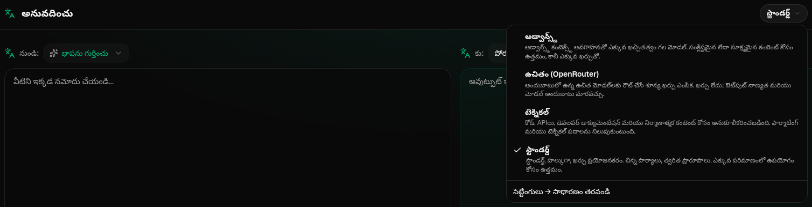
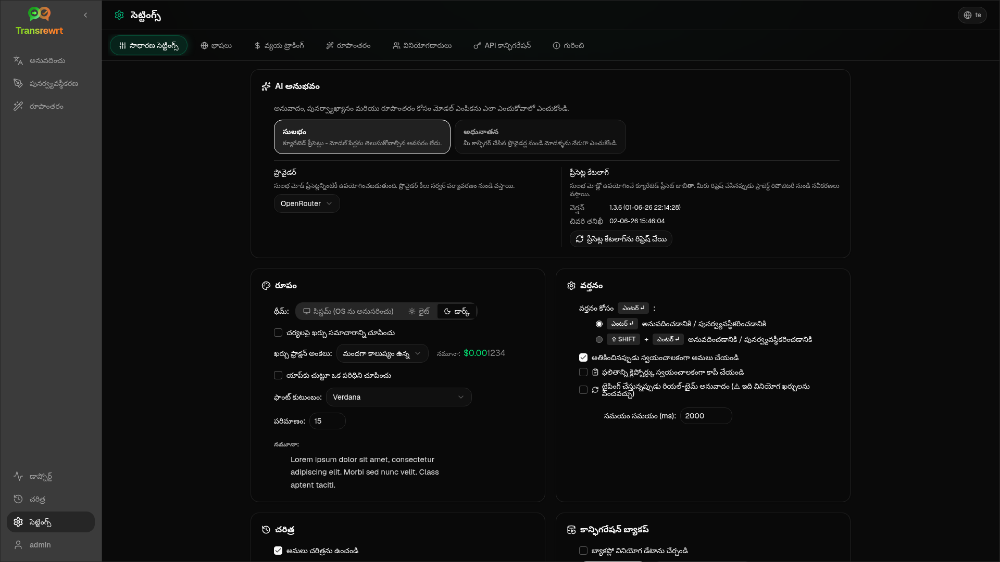

<a id="transrewrt-user-guide"></a>
# వాడుకరి మార్గదర్శకం

<br/>

<a id="introduction"></a>
## పరిచయం

మూడు ప్రధాన మార్గాల్లో టెక్స్ట్‌తో పనిచేయడానికి Transrewrt సహాయపడుతుంది:

- **అనువాదం** - ఒక భాషలోని పాఠాన్ని మరొక భాషలోకి మార్చడం.
- **పునర్రచన** - స్పష్టంగా, సంక్షిప్తంగా లేదా అధికారికంగా వంటి వేరొక శైలిలో పాఠాన్ని మళ్లీ రాయడం.
- **మార్చు** - ప్రాంప్ట్‌లు అని పిలువబడే కస్టమ్ AI సూచనలను ఉపయోగించి పాఠాన్ని ప్రాసెస్ చేయడం.

డిఫాల్ట్‌గా యాప్ **సులభం** మోడ్‌లో పనిచేస్తుంది: మీరు **ప్రిసెట్** (ఉదాహరణకు ఉచితం (ఓపెన్‌రౌటర్), స్టాండర్డ్, అడ్వాన్స్డ్, లేదా టెక్నికల్) మరియు సెట్టింగ్స్‌లో **ప్రొవైడర్** ను ఎంచుకుంటారు, మోడల్ ఐడీలను ఎంచుకోకుండా. మీరు [**సెట్టింగ్స్** > **సాధారణ సెట్టింగ్లు**](#general-settings)లో క్లాసిక్ మోడల్ జాబితాను పొందాలంటే **అడ్వాన్స్డ్** మోడ్‌కు స్విచ్ చేయండి [**సెట్టింగ్స్** > **మోడల్‌లు**](#models).

<br/>

ఇది ఇన్‌స్టాల్ చేసి నడుస్తున్నప్పుడు యాప్ ఉపయోగించడం ఎలాగో ఈ మార్గదర్శకం వివరిస్తుంది. ఇన్‌స్టాలేషన్ దశల కోసం, ప్రధాన [**README**](README.te.md) చూడండి.

<br/>

> ℹ️ **గమనిక**<br/>
> Transrewrt విండోస్ మరియు లినక్స్ కోసం డెస్క్‌టాప్ యాప్ గా, మరియు స్వంతంగా హోస్ట్ చేయబడిన వెబ్ యాప్ గా అందుబాటులో ఉంది. ఈ మార్గదర్శకం యాప్ యొక్క రోజువారీ ఉపయోగాన్ని ప్రధానంగా చూస్తుంది. ఏదైనా ఒక వెర్షన్‌కు మాత్రమే వర్తించే పరిస్థితిలో, అది స్పష్టంగా గుర్తించబడుతుంది.

<small>**ఇతర భాషలలో చదవండి:** </small>
<small id="lang-list">[English (GB)](../USER-GUIDE.md) · [Português (Brasil)](./USER-GUIDE.pt-BR.md) · [العربية](./USER-GUIDE.ar.md) · [বাংলা](./USER-GUIDE.bn.md) · [Català](./USER-GUIDE.ca.md) · [中文 (中国大陆)](./USER-GUIDE.zh-CN.md) · [中文 (台灣)](./USER-GUIDE.zh-TW.md) · [Hrvatski](./USER-GUIDE.hr.md) · [Čeština](./USER-GUIDE.cs.md) · [Nederlands](./USER-GUIDE.nl.md) · [English (US)](./USER-GUIDE.en-US.md) · [Tagalog](./USER-GUIDE.tl.md) · [Français](./USER-GUIDE.fr.md) · [Deutsch](./USER-GUIDE.de.md) · [Ελληνικά](./USER-GUIDE.el.md) · [हिन्दी](./USER-GUIDE.hi.md) · [Magyar](./USER-GUIDE.hu.md) · [Italiano](./USER-GUIDE.it.md) · [日本語](./USER-GUIDE.ja.md) · [한국어](./USER-GUIDE.ko.md) · [Bahasa Melayu](./USER-GUIDE.ms.md) · [فارسی](./USER-GUIDE.fa.md) · [Polski](./USER-GUIDE.pl.md) · [Basa Jawa](./USER-GUIDE.jv.md) · [Português](./USER-GUIDE.pt.md) · [ਪੰਜਾਬੀ](./USER-GUIDE.pa.md) · [Română](./USER-GUIDE.ro.md) · [Русский](./USER-GUIDE.ru.md) · [Slovenčina](./USER-GUIDE.sk.md) · [Español](./USER-GUIDE.es.md) · [Kiswahili](./USER-GUIDE.sw.md) · [Svenska](./USER-GUIDE.sv.md) · [తెలుగు](./USER-GUIDE.te.md) · [ไทย](./USER-GUIDE.th.md) · [Türkçe](./USER-GUIDE.tr.md) · [Українська](./USER-GUIDE.uk.md) · [Tiếng Việt](./USER-GUIDE.vi.md)</small>

<small>

> **UI మరియు పత్రాల అనువాదాల గురించి గమనిక:** మూల ఇంగ్లీష్ (UK) తప్ప మిగిలిన అన్ని ఇంటర్ఫేస్ భాషలు 
> ఎఐ మోడల్స్ ఉపయోగించి అనువదించబడ్డాయి; పదబంధం స్పష్టంగా లేకపోవచ్చు లేదా పొరుదులు ఉండవచ్చు.

</small>

<br/>

<!-- START doctoc generated TOC please keep comment here to allow auto update -->
<!-- DON'T EDIT THIS SECTION, INSTEAD RE-RUN doctoc TO UPDATE -->
**విషయసూచిక**

- [మీరు ప్రారంభించడానికి ముందు](#before-you-start)
  - [ఉచిత OpenRouter API కీని ఎలా పొందాలి (డెస్క్‌టాప్ యాప్)](#how-to-get-a-free-openrouter-api-key-desktop-app)
- [ప్రారంభించడం](#getting-started)
- [విండో యొక్క ప్రధాన భాగాలు](#main-parts-of-the-window)
  - [సైడ్‌బార్](#sidebar)
  - [టూల్‌బార్](#toolbar)
  - [ఇన్‌పుట్ మరియు అవుట్‌పుట్ ప్యానెల్స్](#input-and-output-panels)
- [అనువాదం](#translate)
  - [టెక్స్ట్‌ను అనువదించండి](#translate-text)
  - [భాష ఎంపిక](#language-selection)
  - [ఉపయోగకరమైన అనువాద సెట్టింగ్లు](#helpful-translation-settings)
- [పునర్రచన](#rewrite)
- [మార్చు](#transform)
  - [ఉన్న ప్రాంప్ట్‌ను అమలు చేయండి](#run-an-existing-prompt)
  - [మీ దగ్గర ఇంకా ప్రాంప్ట్స్ లేకపోతే](#if-you-have-no-prompts-yet)
  - [త్వరగా ప్రాంప్ట్‌ను సృష్టించండి](#create-a-prompt-quickly)
  - [ప్రాంప్ట్‌ను సవరించండి](#edit-a-prompt)
  - [ఉపయోగించే ముందు ప్రాంప్ట్‌ను పరీక్షించండి](#test-a-prompt-before-using-it)
- [డాష్‌బోర్డ్](#dashboard)
  - [డేటాను ఫిల్టర్ చేయండి](#filter-the-data)
  - [డాష్‌బోర్డ్ ట్యాబ్‌లు](#dashboard-tabs)
  - [డేటాను ఎగుమతి చేయండి](#export-data)
  - [మోడల్ కోసం నిల్వ చేసిన రికార్డులను తొలగించండి](#delete-stored-records-for-a-model)
- [చరిత్ర](#history)
  - [చరిత్రను ఫిల్టర్ చేయండి](#filter-the-history)
  - [చరిత్ర డేటాను ఎగుమతి చేయండి](#export-history-data)
- [సెట్టింగ్స్](#settings)
  - [సాధారణ సెట్టింగ్లు](#general-settings)
  - [మోడల్‌లు](#models)
  - [భాషలు](#languages)
  - [ఖర్చు ట్రాకింగ్](#cost-tracking)
  - [మార్చు (సెట్టింగ్స్ ట్యాబ్)](#transform-settings-tab)
  - [వాడుకరులు](#users)
  - [API కాన్ఫిగ్](#api-config)
  - [గురించి](#about)
- [సాధారణ సమస్యలు](#common-issues)
  - [యాప్ టెక్స్ట్‌ను అనువదించడం, పునర్రచన చేయడం లేదా మార్చడం చేయదు](#the-app-will-not-translate-rewrite-or-transform-text)
  - [మోడల్ జాబితా ఖాళీగా ఉంది](#the-model-list-is-empty)
  - [ఫలితం చాలా నెమ్మదిగా లేదా చాలా ఖరీదైనదిగా ఉంది](#the-result-is-too-slow-or-too-expensive)
  - [ఇంటర్‌ఫేస్ తప్పు భాషలో ఉంది](#the-interface-is-in-the-wrong-language)
  - [పాఠ్యం చాలా చిన్నది లేదా చదవడానికి కష్టం](#the-text-is-too-small-or-hard-to-read)
  - [డాష్‌బోర్డ్ సారాంశం ఖాళీగా కనిపిస్తుంది](#dashboard-summary-looks-empty)
  - [ఖర్చు "అందుబాటులో లేదు" అని చూపిస్తుంది లేదా తప్పుగా కనిపిస్తుంది](#cost-shows-not-available-or-seems-wrong)
  - [మొత్తం ఖర్చు నా ప్రొవైడర్ బిల్‌కు సరిపోదు](#total-cost-does-not-match-my-provider-bill)
  - [సైడ్‌బార్ నుండి చరిత్ర పేజీ లేదు](#the-history-page-is-missing-from-the-sidebar)
  - [వెబ్ యాప్: అనుకోకుండా లాగిన్ పేజీకి మళ్లించబడింది](#web-app-redirected-to-the-login-page-unexpectedly)
  - [వెబ్ నిర్వాహకుడు: పాస్‌వర్డ్ మర్చిపోయారు లేదా పోయింది](#web-admin-forgot-or-lost-a-password)
  - [డాష్‌బోర్డ్ ఇతర వాడుకరుల కోసం డేటా చూపించడం లేదు (వెబ్)](#dashboard-shows-no-data-for-other-users-web)
  - [నేను ప్రాంప్ట్‌ను మార్చాను మరియు సవరణలు కోల్పోయాను](#i-changed-a-prompt-and-lost-the-edits)
- [త్వరిత సూచనలు](#quick-tips)
- [అస్వీకరణ](#disclaimer)
- [లైసెన్స్](#license)

<!-- END doctoc generated TOC please keep comment here to allow auto update -->

<br/><br/>

<a id="before-you-start"></a>
## ప్రారంభించేక ముందు

Transrewrt ఉపయోగించడానికి, మీరు కనీసం ఒక ఏఐ ప్రొవైడర్‌కు ప్రాప్యత కలిగి ఉండాలి. మద్దతు ఇచ్చే ప్రొవైడర్లు: [OpenRouter](https://openrouter.ai) (ఇది చాలా మోడల్‌లను సమాహారపరుస్తుంది), OpenAI, యాంథ్రోపిక్, Google Gemini, డీప్‌సీక్, గ్రోక్, మిస్ట్రల్, ఎక్స్ఏఐ, సెరెబ్రస్ మరియు స్థానిక మోడల్‌ల కోసం [Ollama](https://ollama.com).

ప్రారంభించడానికి మీరు చెల్లింపు మోడల్‌ను ఎంచుకోవలసిన అవసరం లేదు. మీరు మీ OpenRouter API కీని జోడించిన వెంటనే, అప్లికేషన్ అంతర్నిర్మిత **ఉచిత** OpenRouter ఎంపికను స్వయంచాలకంగా ప్రారంభిస్తుంది. ఇది మీరు వెంటనే అనువాదం, పునర్రచన మరియు పాఠ్యాన్ని మార్చడం ప్రారంభించడానికి అనుమతిస్తుంది. ప్రత్యామ్నాయంగా, మీరు సెరెబ్రస్, గూగుల్, గ్రోక్ లేదా మిస్ట్రల్ ఏఐ నుండి ఉచిత API కీని పొందవచ్చు.

సాధారణ భాషలో:

- **సులభం** మోడ్‌లో, ఒక **ప్రిసెట్** (ఉచితం (ఓపెన్‌రౌటర్), స్టాండర్డ్, అడ్వాన్స్డ్, లేదా టెక్నికల్) మీ ఎంచుకున్న **ప్రొవైడర్** (ఓపెన్‌రౌటర్, ఓపెన్‌ఏఐ, ఓలామా, మరియు ఇతరులు) కోసం ఒక మోడల్‌కు మ్యాప్ అవుతుంది. ప్రస్తుత ప్రొవైడర్‌కు మ్యాపింగ్ ఉన్న ప్రిసెట్‌లు మాత్రమే టూల్‌బార్‌లో కనిపిస్తాయి. మీరు అనువాదం, పునర్రచన, మరియు మార్చడం పై ప్రిసెట్‌ను ఎంచుకుంటారు.
- **అడ్వాన్స్డ్** మోడ్‌లో, ఒక **మోడల్** మీరు నేరుగా ఎంచుకునే AI ఇంజిన్. మోడల్ ఐడీలు **ప్రొవైడర్ ప్రిఫిక్స్** ఉపయోగిస్తాయి (ఉదాహరణకు `openrouter/…`, `openai/…`, `ollama/…`).
- ఒక **API కీ** (లేదా, ఓలామా కోసం, ఒక **బేస్ URL**) యాప్ ఆ ప్రొవైడర్‌ను చేరుకోవడానికి ఎలా ఉంది.

మీరు **డెస్క్‌టాప్ యాప్** ఉపయోగిస్తుంటే, మీరు ఉపయోగించే ప్రతి ప్రొవైడర్ కోసం [**సెట్టింగ్స్** > **API కాన్ఫిగ్**](#api-config)లో కీలను జోడించండి. కేవలం ఓపెన్‌రౌటర్ (OpenRouter) వినియోగం కోసం, క్రింద ఉన్న [ఉచిత ఓపెన్‌రౌటర్ API కీని ఎలా పొందాలి](#how-to-get-a-free-openrouter-api-key-desktop-app) చూడండి. మీరు API కీని ఉపయోగించకూడదనుకుంటే, మీరు ఓలామా ([ollama.com](https://ollama.com) నుండి) ఇన్‌స్టాల్ చేసుకోవచ్చు మరియు దానికి బదులుగా `translategemma:4b` వంటి స్థానిక మోడల్‌లను ఉపయోగించవచ్చు.

మీరు **వెబ్ వెర్షన్** ఉపయోగిస్తుంటే, సర్వర్ యజమాని పర్యావరణ వేరియబుల్స్ ద్వారా ప్రొవైడర్లను కాన్ఫిగర్ చేస్తారు, కాబట్టి మీరు అప్లికేషన్‌లో నేరుగా API కీలను నమోదు చేయలేరు.

<br/>

<a id="how-to-get-a-free-openrouter-api-key-desktop-app"></a>
### ఉచిత OpenRouter API కీని పొందడం ఎలా (డెస్క్‌టాప్ యాప్)

మీరు డెస్క్‌టాప్ అప్లికేషన్ ఉపయోగిస్తుంటే, ఈ దశలను అనుసరించండి:

1. మీ వెబ్ బ్రౌజర్‌లో [OpenRouter](https://openrouter.ai)కి వెళ్లండి.
2. ఖాతాను సృష్టించండి లేదా సైన్ ఇన్ అవ్వండి.
3. [Keys](https://openrouter.ai/keys) పేజీని తెరవండి.
4. కొత్త API కీని సృష్టించడానికి బటన్‌పై క్లిక్ చేయండి.
5. మీరు తర్వాత దాన్ని గుర్తించగలిగేలా కీకి పేరు ఇవ్వండి.
6. కొత్త API కీని కాపీ చేయండి.
7. Transrewrtకి తిరిగి వెళ్లి **సెట్టింగ్స్** > **API కాన్ఫిగ్** తెరవండి.
8. కీని **OpenRouter API కీ**లోకి పేస్ట్ చేయండి (**సెట్టింగ్స్** > **API కాన్ఫిగ్** కింద).
9. అది పనిచేస్తుందో లేదో నిర్ధారించడానికి **OpenRouter కీని పరీక్షించండి**పై క్లిక్ చేయండి.

<br/><br/>

<a id="getting-started"></a>
## ప్రారంభించడం

మీరు Transrewrt ఉపయోగించడం మొట్టమొదటిసారి అయితే, ఈ క్రమాన్ని అనుసరించండి:

1. యాప్‌ను ఓపెన్ చేయండి.
2. అవసరమైతే, గ్లోబ్ ఐకాన్ నుండి మీ **ఇంటర్ఫేస్ భాష**ను ఎంచుకోండి.
3. మీరు **డెస్క్‌టాప్ యాప్**లో ఉంటే, [**సెట్టింగ్స్** > **API కాన్ఫిగ్**](#api-config)ను ఓపెన్ చేయండి, కనీసం ఒక ప్రొవైడర్ (ఉదాహరణకు ఓపెన్‌రౌటర్) కోసం API కీని జోడించండి, మరియు ఇది పనిచేస్తుందో లేదో నిర్ధారించడానికి **పరీక్ష**పై క్లిక్ చేయండి.
4. [**సెట్టింగ్స్** > **సాధారణ సెట్టింగ్లు**](#general-settings)ను ఓపెన్ చేయండి. **సులభం** మోడ్‌లో (డిఫాల్ట్), కీని కాన్ఫిగర్ చేసిన **ప్రొవైడర్**ను ఎంచుకోండి. **అడ్వాన్స్డ్** మోడ్‌లో, [**సెట్టింగ్స్** > **మోడల్‌లు**](#models)ను ఓపెన్ చేయండి మరియు **ఎంచుకున్న మోడల్‌లు**కి ఒకటి లేదా ఎక్కువ మోడల్‌లను జోడించండి.
5. **అనువాదం**పై, టూల్‌బార్‌లో ఒక **ప్రిసెట్** (సులభం) లేదా **మోడల్** (అడ్వాన్స్డ్) ఎంచుకోండి.
6. [**సెట్టింగ్స్** > **భాషలు**](#languages) ఓపెన్ చేసి, మీరు ఎక్కువగా ఉపయోగించే భాషలు మొదట కనిపించాలనుకుంటే మీ **టాప్ లాంగ్వేజెస్**ను ఎంచుకోండి.
7. అంతా సరిగ్గా పనిచేస్తుందో లేదో నిర్ధారించుకోవడానికి ఒక సాధారణ అనువాదాన్ని రన్ చేయండి, ఆపై **పునర్రచన** మరియు **మార్చు** ఫీచర్లను ప్రయత్నించండి.

ఈ క్రమం ముఖ్యమైనది. ఇది అత్యంత సాధారణ మొదటి-ఉపయోగ సమస్యను నివారిస్తుంది: యాప్ పని చేసే API కనెక్షన్ లేదా ఎంచుకున్న ప్రిసెట్/మోడల్ ఉన్నంత వరకు ఒక పని నిర్వహించడానికి ప్రయత్నించడం.

<br/><br/>

<a id="main-parts-of-the-window"></a>
## విండో యొక్క ప్రధాన భాగాలు

అప్లికేషన్ మూడు ప్రధాన ప్రాంతాలుగా విభజించబడింది:

- ఎడమ వైపు ఉన్న **సైడ్‌బార్**.
- పైన ఉన్న **టూల్‌బార్**.
- మధ్యలో ఉన్న **పని ప్రాంతం**.

<br/>

<a id="sidebar"></a>
### సైడ్‌బార్

యాప్ లోపల కదిలేందుకు సైడ్‌బార్ ని ఉపయోగించండి. యాప్ లోగోకి పక్కన ఉన్న ఐకాన్ పై క్లిక్ చేయడం ద్వారా మరింత స్థలం కోసం సైడ్‌బార్ ని కుదించవచ్చు.

<br/>

<table>
  <tr>
    <td valign="top">
       
    </td>
    <td valign="top">
      <br/><br/>
      <ul>
        <li><strong>అనువాదం</strong> అనువాద వర్క్‌స్పేస్ ని తెరుస్తుంది.</li><br/>
        <li><strong>పునర్రచన</strong> పునర్రచన వర్క్‌స్పేస్ ని తెరుస్తుంది.</li><br/>
        <li><strong>మార్చు</strong> కస్టమ్ ప్రాంప్ట్ వర్క్‌స్పేస్ ని తెరుస్తుంది.</li><br/>
        <li><strong>డాష్‌బోర్డ్</strong> ఉపయోగం మరియు ఖర్చు సమాచారాన్ని చూపిస్తుంది.</li><br/>
        <li><strong>సెట్టింగ్స్</strong> సెట్టింగ్స్ ప్యానెల్ ని తెరుస్తుంది.</li><br/>
        <li><strong>చరిత్ర</strong> ఇన్‌పుట్ మరియు అవుట్‌పుట్ టెక్స్ట్ తో ఉపయోగించిన చరిత్రను చూపిస్తుంది.</li><br/>
        <li><strong>వాడుకరి</strong> లాగ్ ఇన్ అయిన వాడుకరి పేరును చూపిస్తుంది (వెబ్ మాత్రమే).</li>
      </ul>
    </td>
  </tr>
</table>

<br/>

<a id="toolbar"></a>
### టూల్‌బార్

మీరు యాప్ లో ఎక్కడ ఉన్నారో బట్టి టూల్‌బార్ కొంచెం మారుతుంది.

- ఎడమవైపు, ఇది ప్రస్తుత పేజీ పేరు చూపిస్తుంది.
- కుడివైపు, ఇది **ప్రిసెట్ లేదా మోడల్ ఎంపిక** మరియు **ఇంటర్ఫేస్ భాష** నియంత్రణను చూపిస్తుంది.

**సులభం** మోడ్‌లో, టూల్‌బార్‌లో **ప్రిసెట్ ఎంపిక** ఉంది, అందులో బిల్ట్-ఇన్ ప్రిసెట్‌లు **ఉచితం (ఓపెన్‌రౌటర్)**, **స్టాండర్డ్**, **అడ్వాన్స్డ్**, మరియు **టెక్నికల్** ఉన్నాయి. ఏ ప్రిసెట్‌లు కనిపిస్తాయో అది మీరు [**సెట్టింగ్స్** > **సాధారణ సెట్టింగ్లు**](#general-settings)లో ఎంచుకున్న **ప్రొవైడర్** పై ఆధారపడి ఉంటుంది—ఉదాహరణకు, **ఉచితం (ఓపెన్‌రౌటర్)** ప్రొవైడర్ ఓపెన్‌రౌటర్ అయితే మాత్రమే జాబితాలో ఉంటుంది. **ప్రొవైడర్** **ఓలామా** అయితే, టూల్‌బార్ మీ ఇన్‌స్టాల్ చేసిన స్థానిక మోడల్‌లను ప్రిసెట్‌ల బదులు జాబితా చేస్తుంది.

 **అడ్వాన్స్డ్** మోడ్‌లో, **మోడల్ ఎంపిక** ప్రస్తుత పనికి ఉపయోగించాల్సిన AI ఇంజిన్‌ను ఎంచుకోవడానికి మీకు అనుమతిస్తుంది.



అడ్వాన్స్డ్ మోడ్‌లో, కొన్ని ఉచిత మోడల్‌లు ఎప్పుడూ అందుబాటులో ఉండకపోవచ్చు—అవి ఆఫ్‌లైన్‌లో ఉండవచ్చు లేదా వినియోగ పరిమితిని చేరవచ్చు. యాప్ ఆ మోడల్‌ను మీ జాబితా నుండి ఆటోమేటిక్‌గా తొలగించవచ్చు. ఏ మోడల్‌లు కనిపించాలో నియంత్రించడానికి, [**సెట్టింగ్స్** > **మోడల్‌లు**](#models)కి వెళ్లండి. మీరు టూల్‌బార్‌లో మోడల్ పేరుకు ఎడమవైపు ప్రొవైడర్ ఐకాన్ నుండి మోడల్ సెట్టింగ్స్‌ను ఓపెన్ చేయవచ్చు.

<br/>

**గ్లోబ్ ఐకాన్ + భాషా కోడ్** మెనులు మరియు బటన్ల వంటి యాప్ ఇంటర్ఫేస్ భాషను మారుస్తుంది. ఇది **అనువాదం** లో ఉపయోగించే అనువాద భాషలను **మార్చదు**.


<br/>

<a id="input-and-output-panels"></a>
### ఇన్‌పుట్ మరియు అవుట్‌పుట్ ప్యానెల్స్

చాలా వర్క్‌స్పేస్ లు ఎడమ వైపున ఉన్న **ఇన్‌పుట్** ప్యానెల్ మరియు కుడి వైపున ఉన్న **అవుట్‌పుట్** ప్యానెల్ ని ఉపయోగిస్తాయి.

ప్రతి ప్యానెల్ కూడా చూపిస్తుంది:

| **ఇన్‌పుట్**                                                          | **అవుట్‌పుట్**                                                                                                                  |
|--------------------------------------------------------------------|-----------------------------------------------------------------------------------------------------------------------------|
| - అక్షరాల సంఖ్య <br/>- పదాల సంఖ్య <br/>- పేరాల సంఖ్య   <br/> | - పని ఎంత సమయం పడింది<br/>- **TPS** (సెకనుకు టోకెన్లు)<br/>- అక్షరాలు, పదాలు మరియు పేరాల సంఖ్య<br/>- ఉపయోగించిన మోడల్ |

మీరు సాంకేతిక పదాల గురించి ఆలోచిస్తున్నట్లయితే:

- **టోకెన్** అంటే చిన్న పాఠ్య ముక్క. దీన్ని పదంలో ఒక భాగం లేదా చిన్న పదంగా భావించవచ్చు.
- **TPS** అంటే ఆ పాఠ్య ముక్కలలో మోడల్ సెకనుకు ఎన్ని ప్రాసెస్ చేసింది.

<br/>

ప్రతి కార్యాచరణ యొక్క ఖర్చు (అందుబాటులో ఉంటే) మరియు మొత్తం ఖర్చును [**సెట్టింగ్స్** > **సాధారణ సెట్టింగ్లు**](#general-settings) లో `Show cost information on the actions` ఎంపికను సక్రియం చేయడం ద్వారా మీరు పర్యవేక్షించవచ్చు.

<br/><br/>

[--------------------------------------------------------------------------------------------------------------------------]: #

<a id="translate"></a>
## అనువాదం

మీరు ఒక భాష నుండి మరొక భాషకు పాఠ్యాన్ని మార్చాలనుకున్నప్పుడు **అనువాదం** ఉపయోగించండి.


<br/>

<a id="translate-text"></a>
### పాఠ్యాన్ని అనువదించు

1. **అనువాదం** ఓపెన్ చేయండి.
2. **నుండి**లో ఒక భాషను ఎంచుకోండి.
3. **కు**లో ఒక భాషను ఎంచుకోండి.
4. టూల్‌బార్‌లో ఒక ప్రిసెట్ (సులభం) లేదా మోడల్ (అడ్వాన్స్డ్) ఎంచుకోండి.
5. **ఇన్‌పుట్**లోకి టెక్స్ట్ ను టైప్ చేయండి లేదా పేస్ట్ చేయండి.
6. **అనువాదం**పై క్లిక్ చేయండి.
7. **అవుట్‌పుట్**లో ఫలితాన్ని చదవండి.
8. ఫలితాన్ని కాపీ చేయాలనుకుంటే కాపీ బటన్ ఉపయోగించండి.

<br/>

<a id="language-selection"></a>
### భాష ఎంపిక

- **నుండి** ప్రత్యేక భాష లేదా **భాషను గుర్తించండి** కావచ్చు.
- **కు** అనేది ఫలితాన్ని పొందాలనుకుంటున్న భాష.

మీరు ఎంచుకున్న **పై భాషలు** జాబితా పైభాగంలో కనిపిస్తాయి. మీరు వీటిని [**సెట్టింగ్స్** > **భాషలు**](#languages)లో సెట్ చేసుకోవచ్చు.

<br/>

<a id="helpful-translation-settings"></a>
### ఉపయోగకరమైన అనువాద సెట్టింగ్లు

[**సెట్టింగ్స్** > **సాధారణ సెట్టింగ్లు**](#general-settings)లో, అనువాదం ఎలా పనిచేస్తుందో మీరు మార్చవచ్చు:

- **పేస్ట్ చేసినప్పుడు స్వయంచాలకంగా అనువాదం** మీరు టెక్స్ట్ పేస్ట్ చేసిన వెంటనే అనువాదాన్ని ప్రారంభిస్తుంది.
- **ఫలితాన్ని క్లిప్‌బోర్డుకు స్వయంచాలకంగా కాపీ చేయి** విజయవంతమైన అనువాదం తర్వాత ఫలితాన్ని స్వయంచాలకంగా కాపీ చేస్తుంది.
- **రియల్-టైమ్ అనువాదం (టైప్ చేసేటప్పుడు)** మీరు టైప్ చేసేటప్పుడు అనువాదాలను నడుపుతుంది.
- **టైమౌట్ (ms)** రియల్-టైమ్ అనువాదాన్ని ప్రారంభించే ముందు అప్లికేషన్ ఎంతకాలం వేచి ఉంటుందో నియంత్రిస్తుంది.
- **Behaviour for ENTER** మీరు `Enter` నొక్కినప్పుడు ఏమి జరగాలో నియంత్రిస్తుంది:
  - **Enter** అనువాదం లేదా పునర్రచనను రన్ చేస్తుంది (డిఫాల్ట్).
  - **Shift + Enter** అనువాదం లేదా పునర్రచనను రన్ చేస్తుంది; కేవలం **Enter** కొత్త లైన్‌ను ఇన్సర్ట్ చేస్తుంది.

[--------------------------------------------------------------------------------------------------------------------------]: #

<a id="rewrite"></a>
## పునర్రచన

ప్రధాన అర్థాన్ని మార్చకుండా పదబంధాలను మెరుగుపరచాలనుకున్నప్పుడు **పునర్రచన** ఉపయోగించండి.


ఇది కింది వాటికి ఉపయోగకరం:

- సంధి మరియు వ్యాకరణాన్ని సరిచేయడం (**Check Spelling & Grammar**)
- వచనాన్ని మరింత స్పష్టంగా మార్చడం (**Improve Clarity**)
- ఒకేసారి అనేక విభిన్న రూపాల్లో మార్చడం (**Alternative versions**)
- వచనాన్ని మరింత ఔపచారికంగా లేదా అనౌపచారికంగా మార్చడం (**Make Formal** / **Make Informal**)
- టెక్స్ట్ ను సంక్షిప్తం చేయడం లేదా విస్తరించడం (**సంక్షిప్తం చేయండి** / **విస్తరించండి**)
- టెక్స్ట్ సాంకేతికంగా కనిపించేలా చేయడం (**సాంకేతికంగా మార్చండి**)

<br/>

> 💡 **టిప్**<br/>
> "**సంధి మరియు వ్యాకరణాన్ని సరిచూసుకోండి**" మోడ్ ఉపయోగించినప్పుడు, అవుట్‌పుట్ ప్యానెల్ లో (**కాపీ** పక్కన) **మార్పులను చూపించు** స్విచ్ కనిపిస్తుంది.
> మీ టెక్స్ట్‌కు వర్తించిన నిర్దిష్ట సర్దుబాట్లను చూపడానికి లేదా దాచడానికి దీన్ని ఆన్ లేదా ఆఫ్ చేయండి.

<br/><br/>

[--------------------------------------------------------------------------------------------------------------------------]: #

<a id="transform"></a>
## మార్చు

మీరు AI కి కస్టమ్ సూచనల సమితిని అనుసరించమని కోరుకున్నప్పుడు **మార్చు** ఉపయోగించండి.


ఇది అప్లికేషన్ లోని అత్యంత సౌలభ్యమైన ప్రాంతం. మీరు దీన్ని కింది వంటి పనులకు ఉపయోగించవచ్చు:

- నోట్స్ సారాంశం చేయడం
- సున్నితమైన టెక్స్ట్ ను పరిపక్వమైన ఇమెయిల్ గా మార్చడం
- కీలక పాయింట్లను ఉపసంహరించడం
- టెక్స్ట్ ను ప్రత్యేక ఫార్మాట్ లోకి మార్చడం
- ఇన్‌పుట్ టెక్స్ట్ తో మరే ఇతర కస్టమ్ కార్యకలాపాలు

<br/>

<a id="run-an-existing-prompt"></a>
### ఉన్న ప్రాంప్ట్ ను రన్ చేయండి

1. **మార్చు** ను తెరవండి.
2. ప్రాంప్ట్ జాబితా నుండి ఒక ప్రాంప్ట్ ను ఎంచుకోండి.
3. **లక్ష్యం** భాష బాక్స్ కనిపిస్తే, కావలసినట్లయితే ఒక భాషను ఎంచుకోండి.
4. **ఇన్‌పుట్** లోకి పాఠ్యాన్ని టైప్ చేయండి లేదా పేస్ట్ చేయండి.
5. **మార్చు** పై క్లిక్ చేయండి.
6. **అవుట్‌పుట్** లో ఫలితాన్ని చదవండి.

<br/>

<a id="if-you-have-no-prompts-yet"></a>
### మీకు ఇంకా ప్రాంప్ట్లు లేకపోతే

మీ ప్రాంప్ట్ జాబితా ఖాళీగా ఉంటే, **మామూలు ప్రాంప్ట్‌లను లోడ్ చేయండి**ని క్లిక్ చేయండి. అదే నియంత్రణ ఎప్పుడూ [**సెట్టింగ్స్** > **మార్చు**](#transform-settings)లో ఎగుమతి/ఆయన రోలో అందుబాటులో ఉంటుంది. రెండూ నిర్మిత ఉదాహరణలను జోడిస్తాయి, కాబట్టి మీరు త్వరగా ప్రారంభించవచ్చు.

<br/>

> ℹ️ **గమనిక**<br/>
> నమూనా ప్రాంప్ట్లు ఇంగ్లీష్‌లో అందించబడతాయి. వాటిని లోడ్ చేసిన తర్వాత, మీరు ప్రాంప్ట్ ను సవరించి, దాన్ని మీ భాషలోకి అనువదించడానికి **ప్రాంప్ట్ అనువాదం** ఉపయోగించవచ్చు.

<br/>

<a id="create-a-prompt-quickly"></a>
### త్వరగా ఒక ప్రాంప్ట్ సృష్టించండి

ఒక ప్రాంప్ట్ ను సృష్టించడానికి అతి వేగవంతమైన మార్గం:

1. **కొత్త ప్రాంప్ట్** క్లిక్ చేయండి.
2. **ప్రాంప్ట్ జనరేట్ చేయండి** క్లిక్ చేయండి.
3. ప్రాంప్ట్ ఏమి చేయాలో వివరించండి.
4. ఒక ప్రిసెట్ (సులభం) లేదా మోడల్ (అడ్వాన్స్డ్) ఎంచుకోండి.
5. యాప్ మీ కోసం ఒక డ్రాఫ్ట్ ను సృష్టించనివ్వండి.
6. డ్రాఫ్ట్ ను సమీక్షించి **సేవ్ చేయండి** పై క్లిక్ చేయండి.


<br/>

<a id="edit-a-prompt"></a>
### ప్రాంప్ట్ ను సవరించండి

మీరు ప్రాంప్ట్ ను సృష్టించినప్పుడు లేదా సవరించినప్పుడు, ఎడమ వైపు ఎడిటర్ కనిపిస్తుంది మరియు కుడి వైపు పరీక్షా ప్రాంతం కనిపిస్తుంది.


ప్రధాన ఫీల్డ్స్ ఇలా ఉన్నాయి:

- **ప్రాంప్ట్ పేరు**: ప్రాంప్ట్ జాబితాలో చూపబడే పేరు.
- **ప్రాంప్ట్ సూచనలు (ఐచ్ఛికం)**: ప్రాంప్ట్ ని అమలు చేసినప్పుడు వాడుకరికి చూపబడే స్వల్ప సూచన.
- **మోడల్ పాత్ర**: 'మీరు ఒక సహాయకుడిలా ఉండండి.' వంటి AI కి కేటాయించిన మొత్తం పాత్ర.
- **మోడల్ సూచనలు (ఒక్కొక్కటి ఒక పంక్తిలో)**: AI అనుసరించాలనుకునే ప్రత్యేక నియమాలు.
- **అవుట్‌పుట్ వివరణ**: 'సారాంశం' లేదా 'పునర్రచన' వంటి ఫలితాన్ని వివరించే స్వల్ప పదం.
- **ఉష్ణోగ్రత (0.0 → 1.0)**: మోడల్ ఎలా ప్రవర్తిస్తుందో; క్రింద చూడండి.
- **లక్ష్య భాష కోసం అడగండి**: ప్రాంప్ట్ ని అమలు చేసినప్పుడు లక్ష్య భాష ఎంపికను జోడిస్తుంది.

మీకు **ఉష్ణోగ్రత** అనే సాంకేతిక పదం కొత్తది అయితే, దీనిని ఇలా ఆలోచించండి:

- **తక్కువ** ఉష్ణోగ్రత స్థిరమైన, మరింత ఊహించదగిన ఫలితాలను ఇస్తుంది.
- **ఎక్కువ** ఉష్ణోగ్రత మరింత వైవిధ్యం మరియు సృజనాత్మకతను ఇస్తుంది.

మీరు కూడా ఉపయోగించవచ్చు:

- `Generate prompt` సరళమైన వివరణ నుండి కొత్త డ్రాఫ్ట్ ను సృష్టించడానికి
- `Improve prompt` ఇప్పటికే ఉన్న ప్రాంప్ట్ ను మెరుగుపరచడానికి
- `Translate prompt` ప్రాంప్ట్ ఫీల్డ్స్ ను అనువదించడానికి

<br/>

> ⚠️ **హెచ్చరిక**<br/>
> `Back to Run` పై క్లిక్ చేయడానికి ముందు `Save` పై క్లిక్ చేయండి. సేవ్ చేయకుండా వెనక్కి వెళితే, మీ మార్పులు కోల్పోతాయి.

<br/>

<a id="test-a-prompt-before-using-it"></a>
### ఉపయోగించే ముందు ప్రాంప్ట్ ను పరీక్షించండి

కుడి వైపు ఉన్న పరీక్షా ప్యానెల్ మీరు రోజువారీ పనిలో ఉపయోగించే ముందు మీ ప్రాంప్ట్‌ను నమూనా పాఠంతో ప్రయత్నించడానికి అనుమతిస్తుంది.

ఇది కింది సందర్భాలలో ఉపయోగకరంగా ఉంటుంది:

- మీరు కొత్త ప్రాంప్ట్ నిర్మాణం చేస్తున్నప్పుడు
- మీరు ప్రాంప్ట్ యొక్క రెండు వెర్షన్‌లను పోల్చుతున్నప్పుడు
- మీరు టోన్, పొడవు లేదా అవుట్‌పుట్ ఫార్మాట్‌ను తనిఖీ చేయాలనుకున్నప్పుడు

<br/>

> ℹ️ **గమనిక**<br/>
> మీరు [**సెట్టింగ్స్** > **మార్చు**](#transform-settings)లో సేవ్ చేసిన ప్రాంప్ట్‌లను ఎగుమతి మరియు దిగుమతి చేసుకోవచ్చు.

మీరు ప్రాంప్ట్ ఎడిటర్‌లో **ప్రాంప్ట్ జనరేట్ చేయండి**, **ప్రాంప్ట్‌ను మెరుగుపరచండి**, లేదా **ప్రాంప్ట్ అనువాదం** ఉపయోగించినప్పుడు, **సులభం** మోడ్ అనువాదం మరియు పునర్రచనలో ఉన్నటువంటి ప్రిసెట్ సెలెక్టర్‌నే అందిస్తుంది; **అడ్వాన్స్డ్** మోడ్ మోడల్ జాబితాను ఉపయోగిస్తుంది.

<br/><br/>

[--------------------------------------------------------------------------------------------------------------------------]: #

<a id="dashboard"></a>
## డాష్‌బోర్డ్

**డాష్‌బోర్డ్** ఉపయోగించి మీరు యాప్‌ను ఎంత ఉపయోగిస్తున్నారో మరియు అది ఎంత ఖర్చు అవుతుందో (చెల్లింపు మోడల్‌ల కోసం) చూడవచ్చు.


<br/>

> ℹ️ **గమనిక**<br/>
> మీరు కేవలం **ఉచితం** మోడల్‌లను మాత్రమే ఉపయోగించినట్లయితే, **ఖర్చు** మొత్తం శూన్యం కావచ్చు మరియు ఖర్చు-కేంద్రీకృత KPIs ఖాళీగా కనిపించవచ్చు. మీరు ఎంపిక చేసిన కాలంలో కార్యకలాపం ఉన్నప్పుడు **సారాంశం** ట్యాబ్ అనువాదం, పునర్రచన మరియు మార్చడం కోసం కాల్ సంఖ్యలను చూపిస్తుంది.

<br/>

<a id="filter-the-data"></a>
### డేటాను ఫిల్టర్ చేయండి

సమయ పరిధిని మార్చడానికి పైభాగంలో ఉన్న ఫిల్టర్ బటన్లను ఉపయోగించండి.


<br/>

> ℹ️ **గమనిక**<br/>
> **వాడుకరి** ఫిల్టర్ వెబ్ వెర్షన్‌లో మాత్రమే నిర్వాహకులకు కనిపిస్తుంది. సాధారణ వాడుకరులు ఈ ఫిల్టర్‌ను చూడరు, డెస్క్‌టాప్ అప్లికేషన్‌లో ఇది అందుబాటులో ఉండదు.

<br/>

<a id="dashboard-tabs"></a>
### డాష్‌బోర్డ్ ట్యాబ్‌లు

- **సారాంశం** KPI కార్డులను చూపిస్తుంది: మొత్తం ఖర్చు, ఉపయోగించిన మోడల్స్, మోడ్ ప్రకారం కాల్ సంఖ్యలు మరియు ఖర్చు (మొత్తం కాల్స్‌లో భాగంతో), ప్రతి కాల్‌కు సగటు ఖర్చు, సగటు TPS, మరియు కాల్ సంఖ్య ప్రకారం టాప్ మూడు మోడల్స్.
- **మోడల్ ద్వారా** ప్రతి మోడల్‌ను మొత్తం కాల్స్, మొత్తం ఖర్చు, మరియు సగటు TPSతో జాబితా చేస్తుంది; అనువాదం, పునర్రచన, మరియు మార్చడం ద్వారా విరామం కోసం ఒక వరుసను విస్తరించండి.
- **అన్ని కాల్స్** పూర్తి కాల్ లాగ్‌ను చూపిస్తుంది (విస్తృత లేఅవుట్‌లలో పేజీబద్ధంగా, కఠిన స్క్రీన్లలో కార్డులుగా) మరియు మీరు దీన్ని ఎగుమతి చేయడానికి అనుమతిస్తుంది.

<br/>

<a id="export-data"></a>
### డేటాను ఎగుమతి చేయండి

డాష్‌బోర్డ్ పట్టికలు కింది ఫార్మాట్‌లలో డేటాను ఎగుమతి చేయగలవు:

- **జెసన్**
- **సిఎస్వి**
- **ఎక్స్‌ఎల్ఎస్ఎక్స్**

మీరు అప్లికేషన్ బయట కార్యాచరణను సమీక్షించాలనుకుంటే లేదా నివేదికను పంచుకోవాలనుకుంటే ఇది ఉపయోగకరంగా ఉంటుంది.

<br/>

<a id="delete-stored-records-for-a-model"></a>
### మోడల్ కోసం నిల్వ చేసిన రికార్డులను తొలగించండి

**మోడల్ ద్వారా** లేదా **అన్ని కాల్స్**లో, మీరు "చెత్తబుట్ట" ఐకాన్‌పై క్లిక్ చేయడం ద్వారా మోడల్ కోసం నిల్వ చేసిన రికార్డులను తొలగించవచ్చు.

> ⚠️ **హెచ్చరిక**<br/>
> నిల్వ చేసిన రికార్డులను తొలగించడం రద్దు చేయబడదు. మీరు ఆ చరిత్ర ఇక అవసరం లేదని ఖచ్చితంగా ఉన్నప్పుడు మాత్రమే దీన్ని ఉపయోగించండి.

అన్ని డేటాను తొలగించడానికి లేదా వాటి వయస్సు ఆధారంగా రికార్డులను తొలగించడానికి, [**సెట్టింగ్స్** > **ఖర్చు ట్రాకింగ్**](#cost-tracking)కి వెళ్లండి. అక్కడ మీరు నిల్వ చేసిన అన్ని డేటాను లేదా ఒక నిర్దిష్ట తేదీకి ముందు ఉన్న డేటాను మాత్రమే తొలగించడానికి ఎంపికలను కనుగొంటారు.

<br/><br/>

[--------------------------------------------------------------------------------------------------------------------------]: #

<a id="history"></a>
## చరిత్ర

**Transrewrt** లోపల మీ చర్యల చరిత్రను చూడటానికి **చరిత్ర**పై క్లిక్ చేయండి, ప్రతి కార్యాచరణ యొక్క ఇన్‌పుట్ మరియు అవుట్‌పుట్‌లతో సహా.


<br/>

<a id="filter-the-history"></a>
### చరిత్రను ఫిల్టర్ చేయండి

**చరిత్ర** **డాష్‌బోర్డ్** పేజీకి సమానమైన కాల-పరిమాణ ఫిల్టర్లను ఉపయోగిస్తుంది.


<br/>

> ℹ️ **గమనిక**<br/>
> **వెబ్ యాప్**లో, ప్రతి ఒక్కరు (నిర్వాహకులను కూడా) వారి స్వంత అమలు చరిత్రను మాత్రమే చూస్తారు. **డాష్‌బోర్డ్**లో **వాడుకరి** ఫిల్టర్ ఖాతాల మధ్య ఉపయోగం మరియు ఖర్చును సమీక్షించడానికి నిర్వాహకులకు ఉంది; ఇది **చరిత్ర**కి వర్తించదు.

<br/>

<a id="export-history-data"></a>
### చరిత్ర డేటాను ఎగుమతి చేయండి

చరిత్ర పేజీ ఫిల్టర్ చేసిన డేటాను ఈ క్రింది ఫార్మాట్‌లలో ఎగుమతి చేయగలదు:

- **జెసన్**
- **సిఎస్వి**
- **ఎక్స్‌ఎల్ఎస్ఎక్స్**

మీరు అప్లికేషన్ బయట కార్యాచరణను సమీక్షించాలనుకుంటే లేదా నివేదికను పంచుకోవాలనుకుంటే ఇది ఉపయోగకరంగా ఉంటుంది.

<br/><br/>

[--------------------------------------------------------------------------------------------------------------------------]: #

<a id="settings"></a>
## సెట్టింగ్స్

అప్లికేషన్ పనిచేసే విధానాన్ని అనుకూలీకరించడానికి సైడ్‌బార్ నుండి **సెట్టింగ్స్**ని తెరవండి.

అందుబాటులో ఉన్న ట్యాబ్‌లు ప్లాట్‌ఫారమ్ మరియు మీ పాత్రపై ఆధారపడి ఉంటాయి:

| ట్యాబ్              | డెస్క్‌టాప్ | వెబ్ (నిర్వాహకుడు) | వెబ్ (సాధారణ వాడుకరి) | గమనికలు                                        |
  |------------------|:-------:|:-----------:|:------------------:|----------------------------------------------|
  | సాధారణ సెట్టింగ్లు |   అవును   |     అవును     |        అవును         | **AI అనుభవం** (సులభం / అడ్వాన్స్డ్) కలిగి ఉంది |
  | మోడల్స్           |   అవును   |     అవును     |        అవును         | కేవలం **AI అనుభవం** **అడ్వాన్స్డ్** అయితే మాత్రమే |
  | భాషలు            |   అవును   |     అవును     |        అవును         |                                              |
  | ఖర్చు ట్రాకింగ్    |   అవును   |     అవును     |         -          |                                              |
  | మార్చు            |   అవును   |     అవును     |        అవును         | మార్చు ప్రాంప్ట్‌ల యొక్క బల్క్ ఇంపోర్ట్/ఎగుమతి      |
  | వాడుకరులు        |    -    |     అవును     |         -          |                                              |
  | API కాన్ఫిగ్       |   అవును   |     అవును     |         -          |                                              |
  | గురించి          |   అవును   |     అవును     |        అవును         |                                              |

**సులభం** మోడ్‌లో, మోడల్ ఎంపిక టూల్‌బార్‌లో ప్రిసెట్‌ల ద్వారా మరియు సాధారణ సెట్టింగ్స్‌లో **ప్రొవైడర్** ద్వారా జరుగుతుంది; **మోడల్‌లు** ట్యాబ్ దాచబడింది.

<br/>

> ℹ️ **గమనిక**<br/>
> వెబ్ వెర్షన్‌లో, ప్రతి వాడుకరికి వారి స్వంత కాన్ఫిగరేషన్ ఉంటుంది. AI అనుభవం, ప్రొవైడర్, ఎంచుకున్న మోడల్‌లు లేదా ప్రిసెట్‌లు, భాషలు, సాధారణ ఎంపికలు, మరియు మార్పు సూచనలు వంటి సెట్టింగ్స్ ప్రతి వాడుకరి కోసం నిల్వ చేయబడతాయి. మీరు చేసిన మార్పులు ఇతర వాడుకరులను ప్రభావితం చేయవు.

<br/>

[--------------------------------------------------------------------------------------------------------------------------]: #

<a id="general-settings"></a>
### సాధారణ సెట్టింగ్లు

**సాధారణ సెట్టింగ్లు** ఉపయోగించి టైపింగ్ ప్రవర్తనను నియంత్రించండి, **చరిత్ర** కోసం అమలు వివరాలు నిల్వ చేయబడుతున్నాయా, రూపాపార్శ్వం, మరియు మీరు అనువాదం, పునర్రచన, మరియు మార్చడానికి AIని ఎలా ఎంచుకుంటారు.

**AI అనుభవం**

- **సులభం** (డిఫాల్ట్): ఒక **ప్రొవైడర్** (ఓపెన్‌రౌటర్, ఓపెన్‌ఏఐ, యాంథ్రోపిక్, గూగుల్ జెమిని, డీప్‌సీక్, గ్రోక్, మిస్ట్రల్, ఎక్స్ఏఐ, సెరెబ్రస్, లేదా ఓలామా) ఎంచుకోండి. క్లౌడ్ ప్రొవైడర్లు టూల్‌బార్‌లో బిల్ట్-ఇన్ ప్రిసెట్‌లను ఉపయోగిస్తారు. **ఓలామా** ప్రిసెట్‌ల బదులు మీ యంత్రంలో ఇన్‌స్టాల్ చేసిన మోడల్‌లను జాబితా చేస్తుంది. సులభం మోడ్‌లో, **ప్రిసెట్ల క్యాటలాగ్** కాటలాగ్ వెర్షన్ మరియు చివరి నవీకరణ సమయాన్ని చూపిస్తుంది; ప్రాజెక్ట్ రిపోజిటరీ నుండి తాజా ప్రిసెట్ జాబితాను పొందడానికి **ప్రిసెట్ల క్యాటలాగ్‌ను రిఫ్రెష్ చేయండి** పై క్లిక్ చేయండి (యాప్ కూడా పునఃసమీక్షణలో పునరావృతంగా చెక్ చేస్తుంది).
- **అడ్వాన్స్డ్**: టూల్‌బార్‌లో వ్యక్తిగత మోడల్‌లను ఎంచుకోండి; [**సెట్టింగ్స్** > **మోడల్‌లు**](#models) క్రింద జాబితాను నిర్వహించండి.

**వెబ్ యాప్**లో, ఏ ప్రొవైడర్లు కనిపిస్తాయో అనేది సర్వర్ వాతావరణంలో సెట్ చేసిన API కీ లపై ఆధారపడి ఉంటుంది. **డెస్క్‌టాప్ యాప్**లో, [**API కాన్ఫిగ్**](#api-config) కింద కీ లను కాన్ఫిగర్ చేయండి.

**ప్రవర్తన**

- **ENTER కోసం ప్రవర్తన** `Enter` పనిని నిర్వహిస్తుందో లేదా కొత్త పంక్తిని చొప్పిస్తుందో ఎంచుకోండి.
- **పేస్ట్ చేసినప్పుడు స్వయంచాలకంగా అనువాదం** మీరు పాఠ్యాన్ని పేస్ట్ చేసిన వెంటనే అనువాదాన్ని ప్రారంభిస్తుంది.
- **ఫలితాన్ని క్లిప్‌బోర్డుకు స్వయంచాలకంగా కాపీ చేయి** విజయవంతమైన ఫలితాలను స్వయంచాలకంగా కాపీ చేస్తుంది.
- **రియల్-టైమ్ అనువాదం (టైప్ చేసేటప్పుడు)** మీరు టైప్ చేసేటప్పుడు అనువాదం చేస్తుంది.
- **టైమౌట్ (ms)** రియల్-టైమ్ అనువాదానికి వేచి ఉండే సమయాన్ని సెట్ చేస్తుంది.

**చరిత్ర**

- **చరిత్ర నిర్వహణను కొనసాగించు** ప్రతి అనువాదం, పునర్రచన, మరియు మార్పు **ఇన్‌పుట్** మరియు **అవుట్‌పుట్ టెక్స్ట్** ను పక్కన ఉన్న [**చరిత్ర**](#history) వీక్షణ కోసం నిల్వ చేస్తుందా అన్నది నియంత్రిస్తుంది. దీన్ని ఆఫ్ చేయడం ధృవీకరణను కోరుతుంది; మీరు ధృవీకరించినట్లయితే, నిల్వ చేసిన చరిత్ర టెక్స్ట్ డేటాబేస్ నుండి తొలగించబడుతుంది. లేబుల్ *నిర్వాహకుడు నిష్క్రియాత్మకం చేశారు* అని చూపిస్తే, మీ ఇన్‌స్టాల్ `HISTORY_DISABLED` ని వాతావరణంలో సెట్ చేసింది (చూడండి [README](README.te.md#configuration-and-environment)); మీరు UI నుండి చరిత్రను తిరిగి ఆన్ చేయలేరు.
- **చరిత్ర డేటాను తొలగించు** మీకు నిల్వ చేసిన టెక్స్ట్‌ను వయస్సు ద్వారా తొలగించడానికి అనుమతిస్తుంది (ఉదాహరణకు కొన్ని నెలల కంటే పాత, లేదా **అన్ని డేటా (స్పష్టం)**) **డేటాను తొలగించు** ఉపయోగించి. ఇది **చరిత్ర** వీక్షణకు సేవ్ చేయబడిన అనుసరణ టెక్స్ట్‌ను మాత్రమే ప్రభావితం చేస్తుంది; ఇది ఖర్చు లేదా వినియోగ మొత్తం తొలగించదు. **ఖర్చు** డేటాను తొలగించడానికి లేదా కుదించడానికి, [**సెట్టింగ్స్** > **ఖర్చు ట్రాకింగ్**](#cost-tracking) ఉపయోగించండి.

**రూపాపార్శ్వం**

- **Theme** తేలికపాటు, చీకటి మరియు సిస్టమ్ రూపాపార్శ్వం మధ్య మారుస్తుంది.
- **చర్యలపై ఖర్చు సమాచారాన్ని చూపించు** అనేది ప్రతి ఆపరేషన్ ఖర్చును (అందుబాటులో ఉంటే) మరియు Translate, Rewrite, మరియు Transform అవుట్‌పుట్ ప్యానెల్‌లపై మొత్తం ఖర్చును ప్రదర్శించడాన్ని నియంత్రిస్తుంది.
- **Cost fraction digits** ఖర్చు డెసిమల్స్ ఎలా ప్రదర్శించబడాలో మారుస్తుంది.
- **వెబ్ మాత్రమే:** **యాప్ చుట్టూ మార్జిన్ చూపించు** ఇంటర్‌ఫేస్ చుట్టూ అదనపు ఖాళీని జోడిస్తుంది.
- **Font Family** టెక్స్ట్ ప్యానెల్‌లలోని రైటింగ్ ఫాంట్‌ను మారుస్తుంది.
- **Size** ఫాంట్ పరిమాణాన్ని మారుస్తుంది.

**కాన్ఫిగరేషన్ బ్యాకప్** (డెస్క్‌టాప్ యాప్ మరియు వెబ్ అడ్మినిస్ట్రేటర్లు మాత్రమే)

- **బ్యాకప్‌లో ఉపయోగం డేటాను చేర్చు** - ప్రారంభించినప్పుడు, ZIP కూడా నిర్వహణ చరిత్ర మరియు API కాల్ డేటాను కలిగి ఉంటుంది.
- **కాన్ఫిగరేషన్ బ్యాకప్** - `config.json`, `state.json`, ఐచ్ఛిక ఎన్‌క్రిప్షన్ కీ, వాడుకరులు, ప్రాధాన్యతలు, కస్టమ్ సూచనలు మరియు మీరు ఎంచుకున్నట్లయితే ఉపయోగ డేటాతో కూడిన ఒకే ఒక ZIP (UTC లో `transrewrt-config-backup-YYYY-MM-DD_HHMMSS.zip` ప్రాథమికంగా) సృష్టిస్తుంది. విజయవంతమైన బ్యాకప్ తర్వాత, ధృవీకరణ సేవ్ చేసిన ఫైల్ పేరును చూపిస్తుంది.
- **బ్యాకప్ నుండి పునరుద్ధరించు** - ముందుగా **ధృవీకరణ సంభాషణను** తెరుస్తుంది. సంభాషణలో బ్యాకప్ ZIP ని ఎంచుకోండి (**బ్రౌజ్** / ఫైల్ పికర్ లేదా మద్దతు ఉన్న చోట డ్రాగ్-అండ్-డ్రాప్), తర్వాత ఎంపికలను సమీక్షించండి:
  - **ఉపయోగ డేటాను పునరుద్ధరించండి** - ఉపయోగంతో సహా బ్యాకప్ చేసినప్పుడు ZIP నుండి ఉపయోగం/చరిత్రను దిగుమతి చేసుకోండి; మీరు సెట్టింగ్లు మరియు సూచనలు మాత్రమే కావాలనుకుంటే ఆపివేయండి.
  - **పునరుద్ధరించే ముందు పాత ఉపయోగ డేటాను క్లియర్ చేయండి** - బ్యాకప్ ను వర్తించే ముందు ఈ ఇన్‌స్టాల్ లో ఉన్న ప్రస్తుత ఉపయోగం/చరిత్రను తొలగించండి (ఐచ్ఛికం; మీరు స్వచ్ఛమైన భర్తీ కోసం ఉపయోగించండి).

వెబ్ లేదా డెస్క్‌టాప్ వెర్షన్ లో సృష్టించిన బ్యాకప్ లు రెండింటిలోనూ పునరుద్ధరించవచ్చు. వెబ్ వెర్షన్ లో డెస్క్‌టాప్ బ్యాకప్ ను పునరుద్ధరించినప్పుడు, డేటా నిర్వాహక వాడుకరికి పునరుద్ధరించబడుతుంది.

<br/>

<a id="models"></a>
### మోడల్‌లు

ఈ ట్యాబ్ **AI అనుభవం** [**సాధారణ సెట్టింగ్లు**](#general-settings) లో **అడ్వాన్స్డ్** గా సెట్ చేయబడినప్పుడు మాత్రమే అందుబాటులో ఉంది. టూల్‌బార్‌లో ఏ మోడల్‌లు కనిపించాలో ఎంచుకోవడానికి **సెట్టింగ్స్** > **మోడల్‌లు** ఉపయోగించండి.



పేజీలో రెండు జాబితాలు ఉన్నాయి:

- ఎడమ వైపు **అందుబాటులో ఉన్న మోడళ్లు**
- కుడి వైపు **ఎంచుకున్న మోడళ్లు**

ఉపయోగకరమైన నియంత్రణలలో ఉంటాయి:

- **మోడళ్లలో వెతకండి...** పేరు ద్వారా మోడల్‌ను కనుగొనడానికి
- జాబితాను ఒక ఇంజిన్‌కు (ఓపెన్‌రౌటర్, ఓపెన్‌ఏఐ, ఓలామా, …) పరిమితం చేయడానికి **ప్రొవైడర్** చిప్స్
- ఉచిత మోడళ్లను మాత్రమే చూపించడానికి **మాత్రమే ఉచితం**
- జాబితాను పునఃలోడ్ చేయడానికి **రీఫ్రెష్**
- మీరు ప్రొవైడర్ ద్వారా క్రమబద్ధీకరిస్తున్నప్పుడు **అన్నింటినీ విస్తరించండి** మరియు **అన్నింటినీ సంకోచించండి**

మోడల్ ఐడీలు ప్రొవైడర్ ప్రిఫిక్స్‌ను కలిగి ఉంటాయి (ఉదాహరణకు `openrouter/…` బన్ని `openai/…`). **OpenAI (OpenRouter)** బన్ని **OpenAI (direct)** వంటి బ్యాడ్జెస్ ట్రాఫిక్ ఎలా మార్గం చేయబడుతుందో చూపిస్తాయి.

> ℹ️ **గమనిక**<br/>
> **OpenRouter Body Builder** (`openrouter/bodybuilder`) ఒక రౌటర్ మోడల్, సాధారణ చాట్ మోడల్ కాదు: దాని స్పందన ఓపెన్‌రౌటర్ API రిక్వెస్ట్ బాడీలను వివరించే జెసన్ (ఉదాహరణకు `requests` శ్రేణి `model` మరియు `messages`తో). మీరు దీన్ని **అనువాదం**, **పునర్రచన**, లేదా **మార్చు** కోసం ఉపయోగిస్తే, ఫలిత పానెల్ పూర్తి చేసిన టెక్స్ట్ బదులుగా ఆ జెసన్ ని చూపిస్తుంది. ఆ పనుల కోసం సాధారణ టెక్స్ట్ మోడల్‌ను ఎంచుకోండి. ఓపెన్‌రౌటర్ లో [బాడీ బిల్డర్ మోడల్ పేజీ](https://openrouter.ai/openrouter/bodybuilder) చూడండి.

చర్యలు:

- మోడల్‌ను జోడించడానికి, **జోడించు** పై క్లిక్ చేయండి లేదా ఎంట్రీలో ఎక్కడైనా క్లిక్ చేయండి.

- మోడల్‌ను తొలగించడానికి, **ఎంచుకున్న మోడళ్లు** లేదా అందుబాటులో ఉన్న మోడళ్లలో ఎంట్రీలో **ఎంచుకున్నవి** పక్కన ఉన్న **X** పై క్లిక్ చేయండి.

- జాబితాను స్పష్టం చేయడానికి, **అన్నింటినీ ఎంపిక తీసివేయండి** పై క్లిక్ చేయండి. అవసరమైన ఉచిత మోడల్ జాబితాలో ఉంటుంది.

<br/>

> ℹ️ **గమనిక**<br/>
> మీరు ఓపెన్‌రౌటర్‌కు వెంటనే క్రెడిట్లు జోడించకూడదనుకుంటే, **మాత్రమే ఉచితం** ని ప్రారంభించి ఉచిత మోడళ్లను ఎంచుకోండి (క్రెడిట్ కార్డ్ అవసరం లేదు). ఏదైనా API కీ లేకుండా మోడళ్లను స్థానికంగా నడపడానికి మీరు ఓలామాను కూడా ఉపయోగించవచ్చు.

<br/>

<a id="languages"></a>
### భాషలు

యాప్ లో ఉపయోగించే భాషా జాబితాలను సంఘటించడానికి **సెట్టింగ్స్** > **భాషలు** ఉపయోగించండి.

- **పై భాషలు** **అనువాదం** మరియు **మార్చు** లో భాషా జాబితాల పైన పిన్ చేయబడతాయి.
- **కస్టమ్ భాష** అంతర్నిర్మిత జాబితాలో లేని భాషను జోడించడానికి మిమ్మల్ని అనుమతిస్తుంది.

మీరు కస్టమ్ భాషను జోడిస్తే, అంతర్నిర్మిత ఎంపికలతో పాటు భాషా ఎంపికదారులలో అది కనిపిస్తుంది.

<br/>

<a id="cost-tracking"></a>
### ఖర్చు ట్రాకింగ్

ఖర్చు సమాచారాన్ని నిర్వహించడానికి **సెట్టింగ్స్** > **ఖర్చు ట్రాకింగ్** ఉపయోగించండి.

- **మొత్తం ఖర్చు** ప్రస్తుత మొత్తాన్ని చూపిస్తుంది.
- **విలువను కాపీ చేయండి** మొత్తాన్ని క్లిప్‌బోర్డ్‌కు కాపీ చేస్తుంది.
- **ఖర్చును రీసెట్ చేయి** నిల్వ చేసిన మొత్తాన్ని సున్నాకు రీసెట్ చేస్తుంది.
- **API కీ ఉపయోగంతో సమన్వయం చేయండి** మీ ఓపెన్‌రౌటర్ ఖాతా నివేదించిన ఉపయోగంతో మొత్తాన్ని సరిపోల్చడానికి సెట్ చేస్తుంది (ఓపెన్‌రౌటర్ మాత్రమే).
- **API కీ ఉపయోగం** అందుబాటులో ఉంటే ఓపెన్‌రౌటర్ ఉపయోగ వివరాలను చూపిస్తుంది.
- **ఖర్చు డేటాను తొలగించు** అన్ని డేటాను లేదా ఎంచుకున్న తేదీ కంటే పాతది మాత్రమే తొలగిస్తుంది.

**ఖర్చు ట్రాకింగ్:** మీరు ఓపెన్‌రౌటర్ మోడళ్లను ఉపయోగించినప్పుడు, ఓపెన్‌రౌటర్ నుండి ఖర్చు సమాచారం ఆధారంగా మీ వాస్తవ ఉపయోగం మరియు ఖర్చును యాప్ చూపిస్తుంది. ఇతర అన్ని ప్రొవైడర్ల కోసం, యాప్ ఓపెన్‌రౌటర్ ప్రచురించిన ధరలను ఉపయోగించి ఖర్చులను అంచనా వేస్తుంది, ధర అందుబాటులో లేకపోతే, అంచనా సున్నా కావచ్చు.

<br/>

> ℹ️ **గమనిక**<br/>
> **అన్ని ఖర్చు సంఖ్యలు మీ సౌకర్యం కోసం మాత్రమే అంచనాలు, అధికారిక బిల్లింగ్ ప్రకటనలు కావు.**

<br/>

> ⚠️ **హెచ్చరిక**<br/>
> డేటా తొలగింపును తిరిగి చేయలేరు. తొలగించే ముందు, మీ డేటాను బ్యాకప్ చేసుకోండి లేదా [**చరిత్ర**](#history) ద్వారా లేదా [**డాష్‌బోర్డ్** > **అన్ని కాల్స్**](#dashboard-tabs) ద్వారా ఎగుమతి చేసుకోండి, లేకుంటే అది శాశ్వతంగా కోల్పోబడుతుంది.
> ప్రతి API కాల్ ఎంట్రీకి సంబంధించిన ఇన్‌పుట్/అవుట్‌పుట్ చరిత్ర కూడా తొలగించబడుతుంది.

<br/>

<a id="transform-settings"></a>
### మార్చు (సెట్టింగ్స్ ట్యాబ్)

**సెట్టింగ్స్** > **మార్చు** ఉపయోగించి ప్రాంప్ట్‌లను బల్క్‌లో నిర్వహించండి.

మీరు:

- మీరు సేవ్ చేసిన ప్రాంప్ట్లను సమీక్షించవచ్చు
- ప్రాంప్ట్లను తొలగించవచ్చు
- ఫైల్ నుండి ప్రాంప్ట్లను ఇంపోర్ట్ చేసుకోవచ్చు
- బ్యాకప్ లేదా షేరింగ్ కోసం ప్రాంప్ట్లను ఎగుమతి చేయవచ్చు
- ప్రాంప్ట్ జాబితాకు నమూనా ప్రాంప్ట్లను లోడ్ చేయండి

<br/>

<a id="users"></a>
### వాడుకరులు

వెబ్ వెర్షన్‌లో వాడుకరి ఖాతాలను నిర్వహించడానికి **వాడుకరులు** ఉపయోగించండి. మీరు వాడుకరులను జోడించవచ్చు, వారి వివరాలను నవీకరించవచ్చు, పాస్‌వర్డ్‌లను రీసెట్ చేయవచ్చు మరియు ఖాతాలను తొలగించవచ్చు.

<br/>

<a id="api-config"></a>
### API కాన్ఫిగ్

మద్దతు ఇచ్చే ప్రొవైడర్లు: ఓపెన్‌రౌటర్, ఓపెన్‌ఏఐ, యాంథ్రోపిక్, గూగుల్ జెమిని, డీప్‌సీక్, గ్రోక్, మిస్ట్రల్, ఎక్స్ఏఐ, సెరెబ్రస్ మరియు **ఓలామా** (బేస్ URL ద్వారా స్థానిక మోడల్‌లు). మీరు ఉపయోగించే ప్రొవైడర్లను మాత్రమే కాన్ఫిగర్ చేయాల్సి ఉంటుంది.

**వెబ్ అప్లికేషన్: కేవలం నిర్వాహకుడు మాత్రమే**

API కీలను సిస్టమ్ లేదా డాకర్ పరిసర వేరియబుల్స్ ద్వారా కాన్ఫిగర్ చేస్తారు - వాటిని వెబ్ UIలో నమోదు చేయరు. ఈ పేజీ ఏ ప్రొవైడర్లకు కీ కాన్ఫిగర్ చేయబడిందో చూపిస్తుంది మరియు `Test` బటన్‌పై క్లిక్ చేయడం ద్వారా ప్రతి ఒక్కదాన్ని పరీక్షించడానికి అనుమతిస్తుంది.

<br/>

> ℹ️ **గమనిక**<br/>
> API కీని మార్చడానికి, మీ సిస్టమ్ లేదా డాకర్ కాన్ఫిగరేషన్‌లో పరిసర వేరియబుల్‌ని నవీకరించి, సర్వర్ లేదా కంటైనర్‌ని రీస్టార్ట్ చేయండి.

<br/>

> ℹ️ **గమనిక**<br/>
> **కాన్ఫిగరేషన్ బ్యాకప్‌లు** ([**సాధారణ సెట్టింగ్లు** → కాన్ఫిగరేషన్ బ్యాకప్](#general-settings)) ZIP యొక్క `config.json` లో **రిజాల్వ్ చేసిన** ప్రొవైడర్ కీలను ఎంబెడ్ చేయగలవు. ఆ ZIP ని పునరుద్ధరించడం వల్ల ఆ కీలు సర్వర్ యొక్క పర్సిస్టెడ్ కాన్ఫిగ్ ఫైల్‌లోకి **కాపీ చేయబడవు** - లైవ్ కీలు ఇప్పటికీ అక్కడ వివరించిన విధంగా ఎన్విరాన్‌మెంట్ మరియు ప్రస్తుత ఫైల్ స్థితి నుండే వస్తాయి.

<br/>

**డెస్క్‌టాప్ అప్లికేషన్**

మీరు ఉపయోగించే ప్రతి ప్రొవైడర్ కోసం API కీలను నిల్వ చేయడానికి **API కాన్ఫిగ్** ఉపయోగించండి. ఓలామా కోసం, API కీ బదులుగా **బేస్ URL** ని నమోదు చేయండి.

<br/>

> 💡 **సూచన** <br/>
> మీరు API కీని ఉపయోగించకూడదనుకుంటే లేదా ఉపయోగం కోసం చెల్లించకూడదనుకుంటే, మీరు [ఓలామాను డౌన్‌లోడ్ చేసుకోవచ్చు](https://ollama.com) మరియు మీ యంత్రంలో ఉచితంగా మోడల్‌లను (ఉదాహరణకు `translategemma:4b`) స్థానికంగా నడుపుతారు. ప్రత్యామ్నాయంగా, వారి ఉచిత మోడల్‌లను ఉపయోగించడానికి ఉచిత ఓపెన్‌రౌటర్ ఖాతాను సృష్టించవచ్చు (క్రెడిట్ కార్డ్ అవసరం లేదు), లేదా సెరెబ్రస్, గూగుల్, గ్రోక్ లేదా మిస్ట్రల్ AI నుండి ఉచిత API కీని పొందవచ్చు.

<br/>

- మీకు అవసరమైన ప్రొవైడర్లను మాత్రమే జోడించండి. **సెట్టింగ్స్** > **మోడల్‌లు**లో, ప్రతి మోడల్ ఐడి ప్రొవైడర్‌తో ప్రారంభమవుతుంది (ఉదాహరణకు `openrouter/openrouter/free`, `openai/gpt-4o`, `ollama/llama3`).

API కీని జోడించడానికి, పాఠ్య రంగంలో విలువను నమోదు చేసి `Save`పై క్లిక్ చేయండి. ఇప్పటికే ఉన్న కీని భర్తీ చేయడానికి, `Edit`పై క్లిక్ చేయండి. కీ పనిచేస్తుందో లేదో ధృవీకరించడానికి, `Test`పై క్లిక్ చేయండి. ఓలామా బేస్ URL కోసం, కనెక్షన్‌ని తనిఖీ చేయడానికి ఎల్లప్పుడూ `Test`పై క్లిక్ చేయండి.

<br/>

> ℹ️ **గమనిక**<br/>
> మీరు API కీ యొక్క ప్రస్తుత విలువను చూడలేరు. మీరు దానిని `Edit` బటన్ ఉపయోగించి మాత్రమే భర్తీ చేయవచ్చు.
> API కీలు కాన్ఫిగరేషన్‌లో ఎన్‌క్రిప్ట్ చేయబడి నిల్వ చేయబడతాయి.

<br/>

<a id="about"></a>
### గురించి

**గురించి** ట్యాబ్ చూపిస్తుంది:

- యాప్ పేరు మరియు ట్యాగ్‌లైన్
- వెర్షన్ నంబర్ మరియు బిల్డ్ తేదీ
- లైసెన్స్ మరియు కాపీరైట్ సమాచారం, **మూడవ పార్టీ నోటీసులు** తెరవడానికి లింక్‌తో సహా
- ప్రాజెక్ట్ రిపోజిటరీకి లింక్

<br/><br/>

<a id="common-issues"></a>
## సాధారణ సమస్యలు

ఏదైనా పని అంచనా ప్రకారం పని చేయకపోతే, ముందుగా కింది వాటిని సరిచూసుకోండి.

<br/>

<a id="the-app-will-not-translate-rewrite-or-transform-text"></a>
### యాప్ టెక్స్ట్‌ను అనువాదం చేయడం, పునర్రచన చేయడం లేదా మార్చడం చేయదు

ఇవి సరిచూసుకోండి:

- మీరు టూల్‌బార్‌లో ఒక **ప్రిసెట్** (సులభం) లేదా **మోడల్** (అడ్వాన్స్డ్) ఎంచుకున్నారు
- **సులభం** మోడ్‌లో, [**సెట్టింగ్స్** > **సాధారణ సెట్టింగ్లు**](#general-settings)లో పనిచేసే కీ (లేదా Ollama URL) ఉన్న ఒక **ప్రొవైడర్** మరియు ఆ ప్రొవైడర్ కోసం కనీసం ఒక ప్రిసెట్ ఉంది
- **అడ్వాన్స్డ్** మోడ్‌లో, [**సెట్టింగ్స్** > **మోడల్‌లు**](#models)లో కనీసం ఒక మోడల్ జాబితా చేయబడింది
- మీ API సెటప్ పనిచేస్తోంది

డెస్క్‌టాప్ యాప్ ఉపయోగిస్తున్నట్లయితే:

1. [**సెట్టింగ్స్** > **API కాన్ఫిగ్**](#api-config) తెరవండి.
2. కనీసం ఒక API కీ సేవ్ అయిందో లేదో సరిచూసుకోండి.
3. కీ పని చేస్తుందో లేదో నిర్ధారించడానికి ప్రొవైడర్ పక్కన ఉన్న **పరీక్ష**పై క్లిక్ చేయండి.

<br/>

<a id="the-model-list-is-empty"></a>
### మోడల్ జాబితా ఖాళీగా ఉంది

**సులభం** మోడ్‌లో, [**సెట్టింగ్స్** > **సాధారణ సెట్టింగ్లు**](#general-settings) ను తెరవండి, **ప్రొవైడర్** సెట్ చేయబడిందని నిర్ధారించండి, మరియు [**API కాన్ఫిగ్**](#api-config) (డెస్క్‌టాప్) లో కీలు జోడించండి లేదా పరీక్షించండి లేదా మీ నిర్వాహకుడిని అడగండి (వెబ్). **ఓలామా** కోసం, ప్రాథమిక URL పై **పరీక్ష** నిర్వహించండి మరియు మోడల్‌లు స్థానికంగా ఇన్‌స్టాల్ చేయబడ్డాయా అని నిర్ధారించండి.

**అడ్వాన్స్డ్** మోడ్‌లో, [**సెట్టింగ్స్** > **మోడల్‌లు**](#models) ను తెరవండి మరియు **రీఫ్రెష్** పై క్లిక్ చేయండి. అవసరమైతే, ఒక మోడల్ కోసం శోధించండి, **మాత్రమే ఉచితం** ఆన్ చేయండి, మరియు **ఎంచుకున్న మోడళ్లు** కు మోడల్‌లు జోడించండి.

<br/>

<a id="the-result-is-too-slow-or-too-expensive"></a>
### ఫలితం చాలా నెమ్మదిగా లేదా ఖరీదైనదిగా ఉంది

వీటిలో ఒకటి లేదా అంతకంటే ఎక్కువ ప్రయత్నించండి:

- వేరే ప్రిసెట్ (సులభం) లేదా మోడల్ (అడ్వాన్స్డ్) ఎంచుకోండి
- తక్కువ నిడివి గల ఇన్‌పుట్‌ను ఉపయోగించండి
- [**సెట్టింగ్స్** > **సాధారణ సెట్టింగ్లు**](#general-settings)లో **Real-time translation (while typing)** ఆఫ్ చేయండి
- సాధారణ పనుల కోసం ఉచిత మోడల్‌లను ఉపయోగించండి ([మోడల్‌లు](#models) చూడండి)

<br/>

<a id="the-interface-is-in-the-wrong-language"></a>
### ఇంటర్ఫేస్ తప్పు భాషలో ఉంది

[టూల్‌బార్](#toolbar)లో గ్లోబ్ ఐకాన్‌పై క్లిక్ చేసి, మీ ఇష్టమైన **ఇంటర్ఫేస్ భాష**ను ఎంచుకోండి.

<br/>

<a id="the-text-is-too-small-or-hard-to-read"></a>
### టెక్స్ట్ చాలా చిన్నదిగా లేదా చదవడానికి కష్టంగా ఉంది

[**సెట్టింగ్స్** > **సాధారణ సెట్టింగ్లు**](#general-settings) తెరిచి, మార్చండి:

- **ఫాంట్ కుటుంబం**
- **పరిమాణం**

<br/>

<a id="dashboard-summary-looks-empty"></a>
### డాష్‌బోర్డ్ సారాంశం ఖాళీగా కనిపిస్తోంది

ఇది సాధారణం కింది సందర్భాలలో:

- మీరు **ఉచిత మోడల్‌లు** మాత్రమే ఉపయోగిస్తున్నారని మరియు మీరు **ఖర్చు** అంకెలను చూస్తున్నారని (వీటి విలువలు సున్నా కావచ్చు); **సారాంశం** పై కాల్-కౌంట్ KPI లకు ఎంచుకున్న కాలానికి డేటా అవసరం
- ఎంచుకున్న **సమయ ఫిల్టర్** కాల్‌లు చేసిన కాలాన్ని కవర్ చేయడం లేదు — తనిఖీ చేయడానికి **అన్నీ** ప్రయత్నించండి

మీరు **అన్నీ** ఎంచుకున్న తర్వాత KPI లు ఇంకా సున్నా ఉంటే, కాల్‌లు [**చరిత్ర**](#history) లో లేదా **అన్ని కాల్స్** ట్యాబ్‌లో కనిపిస్తున్నాయా అని నిర్ధారించండి.

<br/>

<a id="cost-shows-not-available-or-seems-wrong"></a>
### ఖర్చు "అందుబాటులో లేదు" అని చూపిస్తుంది లేదా తప్పుగా కనిపిస్తుంది

**ఓపెన్‌రౌటర్** ద్వారా మీరు మోడల్‌లను ఉపయోగించినప్పుడు, అప్లికేషన్ ఓపెన్‌రౌటర్ నివేదించిన మీ వాస్తవ ఖర్చును చూపిస్తుంది.

**ఇతర ప్రొవైడర్ల** (ఓపెన్‌ఏఐ ప్రత్యక్షం, యాంథ్రోపిక్ ప్రత్యక్షం మొదలైనవి) కోసం, ఓపెన్‌రౌటర్ ప్రచురించిన ధరల డేటా నుండి ఖర్చు అంచనా వేయబడుతుంది. ఒక మోడల్ కోసం సరిపోయే ధర కనుగొనబడకపోతే, ఖర్చు **అందుబాటులో లేదు** అని కనిపిస్తుంది మరియు మీ మొత్తం మొత్తంలో కలపబడదు.

<br/>

<a id="total-cost-does-not-match-my-provider-bill"></a>
### మొత్తం ఖర్చు మీ ప్రొవైడర్ బిల్లుతో సరిపోవడం లేదు

అప్లికేషన్‌లోని అన్ని ఖర్చు సంఖ్యలు **సూచన కోసం మాత్రమే అంచనాలు**, అధికారిక బిల్లింగ్ ప్రకటనలు కావు.

మొత్తాన్ని మీ నిజమైన ఓపెన్‌రౌటర్ ఖర్చుకు దగ్గరగా తీసుకురావడానికి, [**సెట్టింగ్స్** > **ఖర్చు ట్రాకింగ్**](#cost-tracking) తెరిచి **API కీ ఉపయోగంతో సమన్వయం చేయండి**పై క్లిక్ చేయండి.

<br/>

<a id="the-history-page-is-missing-from-the-sidebar"></a>
### సైడ్‌బార్ నుండి చరిత్ర పేజీ కోల్పోయింది

**చరిత్ర నిర్వహణను కొనసాగించు** ఆఫ్ చేయబడవచ్చు. [**సెట్టింగ్స్** > **సాధారణ సెట్టింగ్లు**](#general-settings) ను తెరవండి మరియు దీన్ని ఆన్ చేయండి, లేకపోతే చరిత్ర *నిర్వాహకుడు నిష్క్రియాత్మకం చేశారు* (`HISTORY_DISABLED` వాతావరణంలో — [README](README.te.md#configuration-and-environment) చూడండి). చరిత్రను ఆన్ చేయడం గతంలో తొలగించిన టెక్స్ట్‌ను పునరుద్ధరించదు.

<br/>

<a id="web-app-session-expired"></a>
### వెబ్ అప్లికేషన్: అనుకోకుండా లాగిన్ పేజీకి మళ్లించబడింది

మీ సెషన్ సమయం ముగిసి ఉండవచ్చు. మళ్లీ లాగిన్ అవ్వండి. ఇది తరచుగా జరిగితే, సెషన్ జీవితకాల సెట్టింగ్ల కోసం సర్వర్ కాన్ఫిగరేషన్ తనిఖీ చేయండి.

<br/>

<a id="web-admin-forgot-or-lost-a-password"></a>
### వెబ్ నిర్వాహకుడు: పాస్వర్డ్ మరచిపోయారు లేదా పోయింది

ఇది **స్వంతంగా హోస్ట్ చేసిన వెబ్ అప్లికేషన్** (డాకర్) కు వర్తిస్తుంది, డెస్క్‌టాప్ (ఎలక్ట్రాన్) అప్లికేషన్ కాదు.

- మరొక నిర్వాహకుడు ఇప్పటికీ సైన్ ఇన్ చేయగలిగితే, వారు [**సెట్టింగ్స్** > **వాడుకరులు**](#users) తెరిచి, ఖాతాను ఎంచుకుని, అక్కడ **కొత్త పాస్వర్డ్** సెట్ చేయవచ్చు.
- మీరు **లాక్ అవుట్** అయినా **షెల్ యాక్సెస్** మెషీన్ లేదా కంటైనర్‌కు ఉంటే, ఇమేజ్‌తో వచ్చే సహాయకి ఉపయోగించి పాస్వర్డ్ రీసెట్ చేయండి (డిఫాల్ట్ పేరు మారితే `transrewrt` మార్చండి, మరియు పాస్వర్డ్ లో స్పేస్‌లు లేదా ప్రత్యేక అక్షరాలు ఉంటే దాన్ని ఉదహరించండి):

```bash
docker exec transrewrt reset-web-password '<username>' '<new-password>'
```

మీరు ఇతర ఖాతాలు ఎప్పుడూ సృష్టించకపోతే డిఫాల్ట్ నిర్వాహకుడు వాడుకరి పేరు `admin`. మీరు ఒకే ఒక ఆర్గ్యుమెంట్ పాస్ చేసినప్పుడు, అది `admin` కు కొత్త పాస్వర్డ్ గా పరిగణించబడుతుంది.

మీరు డాకర్ కాకుండా **సోర్స్ చెక్‌అవుట్** నుండి నడుస్తున్నట్లయితే, ఉపయోగించండి:

```bash
pnpm run reset-web-password -- <username> <new-password>
```

స్క్రిప్ట్ SQLite డేటాబేస్‌లోని వాడుకరి రికార్డ్‌ను నవీకరిస్తుంది (మరియు `admin` వాడుకరి లేకపోతే దానిని సృష్టించవచ్చు). రీసెట్ చేసిన తర్వాత, కొత్త పాస్వర్డ్‌తో సైన్ ఇన్ అవ్వండి.

<br/>

<a id="dashboard-shows-no-data-for-other-users"></a>
### ఇతర వాడుకరుల కోసం డాష్‌బోర్డ్ డేటా చూపించడం లేదు (వెబ్)

**నిర్వాహకులు** మాత్రమే **వాడుకరి** ఫిల్టర్ ద్వారా అన్ని వాడుకరుల నుండి డేటాను చూడగలరు. సాధారణ వాడుకరులు వారి స్వంత కార్యాచరణ మాత్రమే చూస్తారు.

<br/>

<a id="i-changed-a-prompt-and-lost-the-edits"></a>
### నేను ప్రాంప్ట్ ని మార్చాను మరియు సవరణలు కోల్పోయాను

ప్రాంప్ట్ ని సవరించినప్పుడు, **రన్‌కు తిరిగి వెళ్లు** పై క్లిక్ చేయడానికి ముందు ఎల్లప్పుడూ **సేవ్ చేయండి** పై క్లిక్ చేయండి.

<br/><br/>

<a id="quick-tips"></a>
## త్వరిత సూచనలు

- [**అనువాదం**](#translate)తో ప్రారంభించండి, తర్వాత [**పునర్రచన**](#rewrite) లేదా [**మార్చు**](#transform) కి వెళ్లే ముందు మీ సెటప్ పనిచేస్తుందని నిర్ధారించుకోండి.
- ప్రతిరోజు పదబంధాల మెరుగుదలల కోసం [**పునర్రచన**](#rewrite) ఉపయోగించండి.
- పునరావృత పని ప్రవాహం అవసరమైనప్పుడు [**మార్చు**](#transform) ఉపయోగించండి.
- ఉపయోగం మరియు ఖర్చు పై దృష్టి పెట్టాలనుకుంటే [**డాష్‌బోర్డ్**](#dashboard) ఉపయోగించండి.
- గత కార్యకలాపాలను మరియు వాటి పూర్తి ఇన్‌పుట్/అవుట్‌పుట్ టెక్స్ట్‌ను సమీక్షించడానికి [**చరిత్ర**](#history) ఉపయోగించండి.
- మీరు భద్రంగా ఉంచాలనుకుంటున్న ప్రాంప్ట్ లైబ్రరీని నిర్మిస్తున్నట్లయితే లేదా ఇతరులతో పంచుకోవాలనుకుంటే ప్రాంప్ట్‌లను తరచుగా ఎగుమతి చేయండి (చూడండి [మార్చు](#transform)).
- మీరు మోడల్ ID లపై సున్నితమైన నియంత్రణ అవసరం వరకు **సులభం** మోడ్‌లో ఉండండి; మీరు ఏ మోడల్‌లు కావాలో ఇప్పటికే తెలుసుకుంటే **అడ్వాన్స్డ్** కు మారండి.

<br/><br/>

<a id="disclaimer"></a>
## అస్వీకరణ

ఉత్పత్తి పేర్లు మరియు చిహ్నాలు వాటి సంబంధిత యజమానులకు చెందినవి మరియు గుర్తింపు ప్రయోజనాల కోసం మాత్రమే ఉపయోగించబడతాయి. ఈ సాఫ్ట్‌వేర్ పేర్కొన్న బ్రాండ్‌లలో దేనితోనూ అనుబంధించబడలేదు లేదా ఆమోదించబడలేదు.

<br/><br/>

<a id="license"></a>
## లైసెన్స్

కాపీరైట్ © 2026 వాల్డెమార్ స్కుడెల్లర్ జూనియర్.

[Apache License 2.0](../LICENSE)
