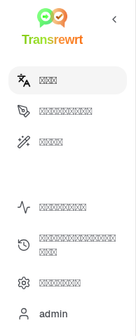
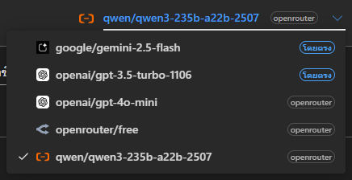
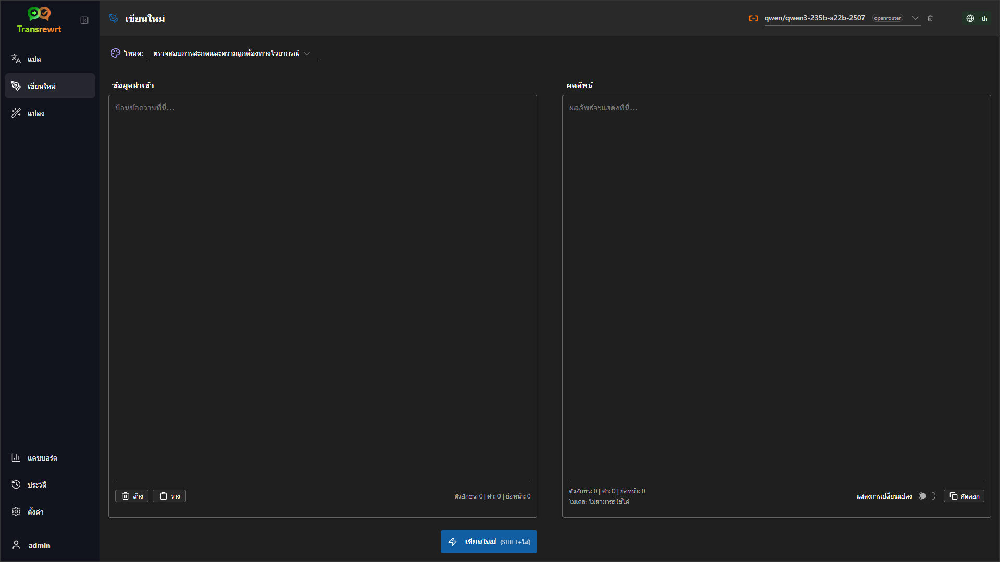
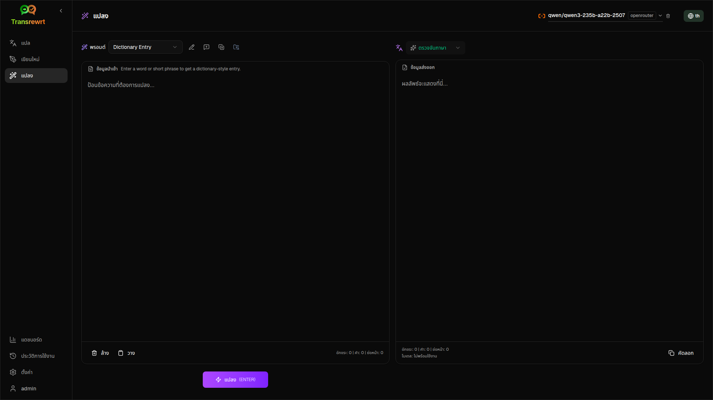
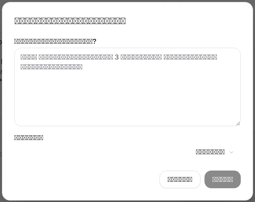

<a id="transrewrt-user-guide"></a>
# คู่มือผู้ใช้

<br/>

<a id="introduction"></a>
## บทนำ

Transrewrt ช่วยให้คุณทำงานกับข้อความได้สามวิธีหลัก ได้แก่

- **แปล** - แปลงข้อความจากภาษาหนึ่งไปยังอีกภาษาหนึ่ง
- **เขียนใหม่** - เขียนข้อความใหม่ในรูปแบบที่ต่างออกไป เช่น ให้ชัดเจนขึ้น สั้นลง หรือเป็นทางการมากขึ้น
- **แปลง** - ประมวลผลข้อความโดยใช้คำแนะนำปัญญาประดิษฐ์แบบกำหนดเองที่เรียกว่าพรอมต์

<br/>

คู่มือนี้อธิบายวิธีการใช้งานแอปหลังจากติดตั้งและเริ่มทำงานแล้ว สำหรับขั้นตอนการติดตั้ง โปรดดูที่ **[README](README.th.md)** หลัก

<br/>

> ℹ️ **หมายเหตุ**<br/>
> Transrewrt มีให้ใช้งานเป็นแอปเดสก์ท็อปสำหรับ Windows และ Linux และยังมีเป็นแอปเว็บที่สามารถติดตั้งใช้งานเองได้ คู่มือนี้มุ่งเน้นการใช้งานแอปในชีวิตประจำวัน หากมีเนื้อหาใดที่ใช้ได้เฉพาะกับเวอร์ชันใดเวอร์ชันหนึ่ง จะมีการระบุไว้อย่างชัดเจน

<small>**อ่านเป็นภาษาอื่น:** </small>
<small id="lang-list">[English (GB)](../USER-GUIDE.md) · [Português (Brasil)](./USER-GUIDE.pt-BR.md) · [العربية](./USER-GUIDE.ar.md) · [বাংলা](./USER-GUIDE.bn.md) · [Català](./USER-GUIDE.ca.md) · [中文 (中国大陆)](./USER-GUIDE.zh-CN.md) · [中文 (台灣)](./USER-GUIDE.zh-TW.md) · [Hrvatski](./USER-GUIDE.hr.md) · [Čeština](./USER-GUIDE.cs.md) · [Nederlands](./USER-GUIDE.nl.md) · [English (US)](./USER-GUIDE.en-US.md) · [Tagalog](./USER-GUIDE.tl.md) · [Français](./USER-GUIDE.fr.md) · [Deutsch](./USER-GUIDE.de.md) · [Ελληνικά](./USER-GUIDE.el.md) · [हिन्दी](./USER-GUIDE.hi.md) · [Magyar](./USER-GUIDE.hu.md) · [Italiano](./USER-GUIDE.it.md) · [日本語](./USER-GUIDE.ja.md) · [한국어](./USER-GUIDE.ko.md) · [Bahasa Melayu](./USER-GUIDE.ms.md) · [فارسی](./USER-GUIDE.fa.md) · [Polski](./USER-GUIDE.pl.md) · [Basa Jawa](./USER-GUIDE.jv.md) · [Português](./USER-GUIDE.pt.md) · [ਪੰਜਾਬੀ](./USER-GUIDE.pa.md) · [Română](./USER-GUIDE.ro.md) · [Русский](./USER-GUIDE.ru.md) · [Slovenčina](./USER-GUIDE.sk.md) · [Español](./USER-GUIDE.es.md) · [Kiswahili](./USER-GUIDE.sw.md) · [Svenska](./USER-GUIDE.sv.md) · [తెలుగు](./USER-GUIDE.te.md) · [ไทย](./USER-GUIDE.th.md) · [Türkçe](./USER-GUIDE.tr.md) · [Українська](./USER-GUIDE.uk.md) · [Tiếng Việt](./USER-GUIDE.vi.md)</small>

<small>

> **หมายเหตุเกี่ยวกับการแปลอินเตอร์เฟซและเอกสาร:** ภาษาอินเตอร์เฟซทั้งหมดยกเว้นภาษาอังกฤษ (สหราชอาณาจักร) ต้นฉบับ 
> ได้รับการแปลโดยใช้โมเดลปัญญาประดิษฐ์; คำแปลอาจไม่แม่นยำหรือมีข้อผิดพลาด

</small>

<br/>

<!-- START doctoc generated TOC please keep comment here to allow auto update -->
<!-- DON'T EDIT THIS SECTION, INSTEAD RE-RUN doctoc TO UPDATE -->
**สารบัญ**

- [ก่อนที่คุณจะเริ่มต้น](#before-you-start)
  - [วิธีรับคีย์ API OpenRouter ฟรี (แอปเดสก์ท็อป)](#how-to-get-a-free-openrouter-api-key-desktop-app)
- [เริ่มต้นใช้งาน](#getting-started)
- [ส่วนหลักของหน้าต่าง](#main-parts-of-the-window)
  - [แถบด้านข้าง](#sidebar)
  - [แถบเครื่องมือ](#toolbar)
  - [แผงป้อนข้อมูลและแสดงผลลัพธ์](#input-and-output-panels)
- [แปล](#translate)
  - [แปลข้อความ](#translate-text)
  - [การเลือกภาษา](#language-selection)
  - [การตั้งค่าการแปลที่เป็นประโยชน์](#helpful-translation-settings)
- [เขียนใหม่](#rewrite)
- [แปลง](#transform)
  - [เรียกใช้พรอมต์ที่มีอยู่แล้ว](#run-an-existing-prompt)
  - [หากคุณยังไม่มีพรอมต์](#if-you-have-no-prompts-yet)
  - [สร้างพรอมต์อย่างรวดเร็ว](#create-a-prompt-quickly)
  - [แก้ไขพรอมต์](#edit-a-prompt)
  - [ทดสอบพรอมต์ก่อนใช้งาน](#test-a-prompt-before-using-it)
- [แดชบอร์ด](#dashboard)
  - [กรองข้อมูล](#filter-the-data)
  - [แท็บแดชบอร์ด](#dashboard-tabs)
  - [ส่งออกข้อมูล](#export-data)
  - [ลบบันทึกที่จัดเก็บไว้สำหรับโมเดล](#delete-stored-records-for-a-model)
- [ประวัติ](#history)
  - [กรองข้อมูล](#filter-the-data-1)
  - [ส่งออกข้อมูลประวัติ](#export-history-data)
- [การตั้งค่า](#settings)
  - [การตั้งค่าทั่วไป](#general-settings)
  - [โมเดล](#models)
  - [ภาษา](#languages)
  - [การติดตามต้นทุน](#cost-tracking)
  - [พรอมต์แปลง](#transform-prompts)
  - [ผู้ใช้](#users)
  - [การตั้งค่า API](#api-config)
  - [เกี่ยวกับ](#about)
- [ปัญหาทั่วไป](#common-issues)
  - [แอปไม่สามารถแปล เขียนใหม่ หรือแปลงข้อความได้](#the-app-will-not-translate-rewrite-or-transform-text)
  - [รายการโมเดลว่างเปล่า](#the-model-list-is-empty)
  - [ผลลัพธ์ช้าเกินไปหรือมีค่าใช้จ่ายสูงเกินไป](#the-result-is-too-slow-or-too-expensive)
  - [อินเทอร์เฟซแสดงภาษาที่ผิด](#the-interface-is-in-the-wrong-language)
  - [ข้อความมีขนาดเล็กเกินไปหรืออ่านยาก](#the-text-is-too-small-or-hard-to-read)
  - [แผนภูมิในแดชบอร์ดว่างเปล่า](#dashboard-charts-are-empty)
  - [ต้นทุนแสดงว่า "ไม่พร้อมใช้งาน" หรือดูผิดปกติ](#cost-shows-not-available-or-seems-wrong)
  - [ต้นทุนรวมไม่ตรงกับใบแจ้งหนี้จากผู้ให้บริการ](#total-cost-does-not-match-my-provider-bill)
  - [หน้าประวัติหายไปจากแถบด้านข้าง](#the-history-page-is-missing-from-the-sidebar)
  - [เว็บแอป: ถูกเปลี่ยนเส้นทางไปยังหน้าล็อกอินโดยไม่คาดคิด](#web-app-redirected-to-the-login-page-unexpectedly)
  - [ผู้ดูแลเว็บ: ลืมหรือสูญเสียรหัสผ่าน](#web-admin-forgot-or-lost-a-password)
  - [แดชบอร์ดไม่แสดงข้อมูลของผู้ใช้รายอื่น (เว็บ)](#dashboard-shows-no-data-for-other-users-web)
  - [ฉันแก้ไขพรอมต์แล้วแต่สูญเสียการแก้ไข](#i-changed-a-prompt-and-lost-the-edits)
- [เคล็ดลับด่วน](#quick-tips)
- [ข้อจำกัดความรับผิดชอบ](#disclaimer)
- [ใบอนุญาต](#license)

<!-- END doctoc generated TOC please keep comment here to allow auto update -->

<br/><br/>

<a id="before-you-start"></a>
## ก่อนเริ่มต้น

ในการใช้งาน Transrewrt คุณต้องมีการเข้าถึงผู้ให้บริการ AI อย่างน้อยหนึ่งราย ผู้ให้บริการที่รองรับ ได้แก่ [OpenRouter](https://openrouter.ai) (ซึ่งรวมโมเดลหลายตัวเข้าด้วยกัน), OpenAI, Anthropic, Google Gemini, DeepSeek, Groq, Mistral, xAI, Cerebras และ [Ollama](https://ollama.com) สำหรับโมเดลท้องถิ่น

คุณไม่จำเป็นต้องเลือกโมเดลแบบเสียเงินเพื่อเริ่มต้น เมื่อคุณเพิ่มคีย์ API ของ OpenRouter แล้ว แอปจะเปิดใช้งานตัวเลือก OpenRouter **ฟรี** ในตัวโดยอัตโนมัติ ซึ่งช่วยให้คุณเริ่มแปล เขียนใหม่ และเปลี่ยนข้อความได้ทันที หรืออีกทางหนึ่ง คุณยังสามารถขอรับคีย์ API ฟรีจาก Cerebras, Google, Groq หรือ Mistral AI ได้อีกด้วย

สรุปง่ายๆ คือ:

- **โมเดล** คือ เครื่องยนต์ปัญญาประดิษฐ์ที่ทำหน้าที่ทำงาน โมเดลจะแสดงพร้อมคำนำหน้าของ **ผู้ให้บริการ** (ตัวอย่างเช่น `openrouter/…`, `openai/…`, `ollama/…`)
- **คีย์ API** (หรือสำหรับ Ollama คือ **URL พื้นฐาน**) คือ วิธีที่แอปใช้ติดต่อกับผู้ให้บริการนั้น

หากคุณใช้ **แอปเดสก์ท็อป** ให้เพิ่มคีย์ใน [**ตั้งค่า** > **การตั้งค่า API**](#api-config) สำหรับผู้ให้บริการแต่ละรายที่คุณใช้ สำหรับการใช้งานเฉพาะ OpenRouter ดูที่ [วิธีรับคีย์ API](#how-to-get-an-api-key-desktop-app) ด้านล่าง หากคุณไม่ต้องการใช้คีย์ API คุณสามารถติดตั้ง Ollama (จาก [ollama.com](https://ollama.com)) และใช้โมเดลท้องถิ่นแทน เช่น `translategemma:4b`

หากคุณใช้ **เวอร์ชันเว็บ** ผู้ดูแลระบบเซิร์ฟเวอร์จะตั้งค่าผู้ให้บริการผ่านตัวแปรสภาพแวดล้อม ดังนั้นคุณจึงไม่สามารถป้อนคีย์ API โดยตรงในแอปพลิเคชันได้

<br/>

<a id="how-to-get-an-api-key-desktop-app"></a>
### วิธีรับคีย์ API ของ OpenRouter ฟรี (แอปเดสก์ท็อป)

หากคุณกำลังใช้แอปเดสก์ท็อป ให้ทำตามขั้นตอนเหล่านี้:

1. ไปที่ [OpenRouter](https://openrouter.ai) ในเว็บเบราว์เซอร์ของคุณ
2. สร้างบัญชีหรือลงชื่อเข้าใช้
3. เปิดหน้า [Keys](https://openrouter.ai/keys)
4. คลิกปุ่มเพื่อสร้างคีย์ API ใหม่
5. ตั้งชื่อคีย์เพื่อให้คุณสามารถระบุได้ในภายหลัง
6. คัดลอกคีย์ API ใหม่
7. กลับไปที่ Transrewrt และเปิด **การตั้งค่า** > **การตั้งค่า API**
8. วางคีย์ลงในช่อง **OpenRouter API key** (ภายใต้ **การตั้งค่า** > **การตั้งค่า API**)
9. คลิก **Test OpenRouter key** เพื่อให้แน่ใจว่าใช้งานได้

<br/><br/>

<a id="getting-started"></a>
## เริ่มต้นใช้งาน

หากนี่เป็นครั้งแรกที่คุณใช้ Transrewrt ให้ทำตามลำดับนี้:

1. เปิดแอป
2. เลือก **ภาษาอินเทอร์เฟซ** จากไอคอนรูปโลกหากจำเป็น
3. หากคุณใช้ **แอปเดสก์ท็อป** ให้เปิด [**การตั้งค่า** > **การตั้งค่า API**](#api-config) เพิ่มคีย์ API สำหรับผู้ให้บริการอย่างน้อยหนึ่งราย (เช่น OpenRouter) แล้วคลิก **ทดสอบ** เพื่อยืนยันว่าใช้งานได้
4. เปิด [**การตั้งค่า** > **โมเดล**](#models) และเพิ่มโมเดลหนึ่งตัวขึ้นไปไปยัง **โมเดลที่เลือก**
5. เปิด [**การตั้งค่า** > **ภาษา**](#languages) และเลือก **ภาษาที่ใช้บ่อยที่สุด** หากคุณต้องการให้ภาษาที่คุณใช้บ่อยที่สุดแสดงขึ้นก่อน
6. ไปที่ **แปล** และดำเนินการแปลง่ายๆ เพื่อยืนยันว่าทุกอย่างทำงานได้ถูกต้อง
7. เมื่อทำได้แล้ว ให้ลองใช้ **เขียนใหม่** แล้วตามด้วย **แปลง**

ลำดับนี้มีความสำคัญ มันช่วยป้องกันปัญหาที่พบบ่อยที่สุดสำหรับผู้ใช้ครั้งแรก คือ การพยายามดำเนินการงานก่อนที่แอปจะมีการเชื่อมต่อ API ที่ใช้งานได้หรือก่อนที่จะมีการเลือกโมเดล

<br/><br/>

<a id="main-parts-of-the-window"></a>
## ส่วนหลักของหน้าต่าง

แอปพลิเคชันแบ่งออกเป็นสามส่วนหลัก:

- **แถบด้านข้าง** ทางด้านซ้าย
- **แถบเครื่องมือ** ด้านบน
- **พื้นที่ทำงาน** ตรงกลาง

<br/>

<a id="sidebar"></a>
### แถบด้านข้าง

ใช้แถบด้านข้างเพื่อเคลื่อนที่ไปมาในแอปพลิเคชัน คุณสามารถยุบแถบด้านข้างเพื่อเพิ่มพื้นที่ได้โดยการคลิกที่ไอคอนถัดจากโลโก้แอป

<br/>

<table>
  <tr>
    <td valign="top">
       
    </td>
    <td valign="top">
      <br/><br/>
      <ul>
        <li><strong>การแปล</strong> เปิดพื้นที่ทำงานการแปล</li><br/>
        <li><strong>เขียนใหม่</strong> เปิดพื้นที่ทำงานการเขียนใหม่</li><br/>
        <li><strong>แปลงรูปแบบ</strong> เปิดพื้นที่ทำงานคำสั่งที่กำหนดเอง</li><br/>
        <li><strong>แดชบอร์ด</strong> แสดงข้อมูลการใช้งานและค่าใช้จ่าย</li><br/>
        <li><strong>ตั้งค่า</strong> เปิดแผงตั้งค่า</li><br/>
        <li><strong>ประวัติ</strong> แสดงประวัติการใช้งานพร้อมข้อความข้อมูลนำเข้าและผลลัพธ์</li><br/>
        <li><strong>ผู้ใช้</strong> แสดงชื่อผู้ใช้ของผู้ใช้ที่เข้าสู่ระบบ (เฉพาะเว็บ)</li>
      </ul>
    </td>
  </tr>
</table>

<br/>

<a id="toolbar"></a>
### เครื่องมือ

แถบเครื่องมือจะเปลี่ยนแปลงเล็กน้อยขึ้นอยู่กับตำแหน่งที่คุณอยู่ในแอปพลิเคชัน

- ด้านซ้ายจะแสดงชื่อหน้าปัจจุบัน
- ด้านขวาจะแสดงตัวเลือก **โมเดล** และการควบคุม **ภาษาอินเทอร์เฟซ**

ตัวเลือก **โมเดล** ช่วยให้คุณเลือกได้ว่าจะใช้เครื่องมือปัญญาประดิษฐ์ใดสำหรับงานปัจจุบัน



โมเดลฟรีบางตัวอาจไม่สามารถใช้งานได้ตลอดเวลา — บางครั้งอาจออฟไลน์หรือมีขีดจำกัดการใช้งาน หากเกิดเหตุการณ์นี้ แอปจะลบโมเดลนั้นออกจากรายการที่ใช้งานได้ของคุณโดยอัตโนมัติ เพื่อควบคุมว่าโมเดลใดจะปรากฏ ให้ไปที่ [**ตั้งค่า** > **โมเดล**](#models) และแก้ไขรายการโมเดลของคุณ 
คุณยังสามารถเปิดการตั้งค่าโมเดลโดยตรงได้โดยคลิกที่ไอคอนผู้ให้บริการที่อยู่ด้านซ้ายของชื่อโมเดลในแถบเครื่องมือ

<br/>

**ไอคอนโลก + รหัสภาษา** เปลี่ยนภาษาอินเทอร์เฟซของแอป เช่น เมนูและปุ่ม แต่จะ **ไม่** เปลี่ยนภาษาที่ใช้ในการ **แปล**


<br/>

<a id="input-and-output-panels"></a>
### แผงข้อมูลนำเข้าและผลลัพธ์

ส่วนใหญ่เวิร์กสเปซจะใช้แผง **ข้อมูลนำเข้า** ด้านซ้าย และแผง **ผลลัพธ์** ด้านขวา

แต่ละแผงยังแสดงสิ่งต่อไปนี้:

| **ข้อมูลนำเข้า**                                                          | **ผลลัพธ์**                                                                                                                  |
|--------------------------------------------------------------------|-----------------------------------------------------------------------------------------------------------------------------|
| - จำนวนตัวอักษร <br/>- จำนวนคำ <br/>- จำนวนย่อหน้า   <br/> | - ใช้เวลานานเท่าใดในการทำงาน<br/>- **TPS** (โทเค็นต่อวินาที)<br/>- จำนวนตัวอักษร คำ และย่อหน้า<br/>- โมเดลที่ใช้ |

หากคุณสงสัยเกี่ยวกับศัพท์เทคนิค:

- **โทเค็น** หมายถึง ชิ้นส่วนข้อความขนาดเล็ก คุณสามารถคิดว่าเป็นส่วนหนึ่งของคำ หรือคำสั้น ๆ
- **TPS** หมายถึง จำนวนชิ้นส่วนข้อความเหล่านั้นที่โมเดลประมวลผลได้ในแต่ละวินาที

<br/>

คุณยังสามารถตรวจสอบค่าใช้จ่ายของแต่ละการดำเนินการ (ถ้ามี) และต้นทุนรวม โดยเปิดใช้งานตัวเลือก `Show cost information on the actions` ที่ [**ตั้งค่า** > **การตั้งค่าทั่วไป**](#general-settings)

<br/><br/>

[--------------------------------------------------------------------------------------------------------------------------]: #

<a id="translate"></a>
## แปล

ใช้ **แปล** เมื่อคุณต้องการแปลงข้อความจากภาษาหนึ่งไปยังอีกภาษาหนึ่ง


<br/>

<a id="translate-text"></a>
### แปลข้อความ

1. เปิด **แปล**
2. เลือกภาษาในช่อง **จาก**
3. เลือกภาษาในช่อง **ถึง**
4. เลือกโมเดลในแถบเครื่องมือ
5. พิมพ์หรือวางข้อความลงในช่อง **ป้อนข้อมูล**
6. คลิก **แปล**
7. อ่านผลลัพธ์ในช่อง **แสดงผลลัพธ์**
8. ใช้ปุ่มคัดลอกหากคุณต้องการคัดลอกผลลัพธ์

<br/>

<a id="language-selection"></a>
### การเลือกภาษา

- **จาก** สามารถเป็นภาษาเฉพาะหรือ **ตรวจจับภาษา**
- **ถึง** คือภาษาที่คุณต้องการให้ผลลัพธ์ออกมาเป็น

**ภาษาชั้นต้น** ที่คุณเลือกจะแสดงอยู่ด้านบนสุดของรายการ คุณสามารถตั้งค่าเหล่านี้ได้ที่ [**ตั้งค่า** > **ภาษา**](#languages)

<br/>

<a id="helpful-translation-settings"></a>
### การตั้งค่าการแปลที่เป็นประโยชน์

ใน [**ตั้งค่า** > **การตั้งค่าทั่วไป**](#general-settings) คุณสามารถเปลี่ยนวิธีการทำงานของการแปลได้:

- **แปลอัตโนมัติเมื่อวาง** จะดำเนินการแปลทันทีที่คุณวางข้อความ
- **คัดลอกผลลัพธ์ไปยังคลิปบอร์ดอัตโนมัติ** จะคัดลอกผลลัพธ์ไปยังคลิปบอร์ดโดยอัตโนมัติหลังจากดำเนินการสำเร็จ
- **การแปลแบบเรียลไทม์ (ขณะพิมพ์)** จะดำเนินการแปลขณะที่คุณพิมพ์
- **หมดเวลา (มิลลิวินาที)** ควบคุมระยะเวลาที่แอปรอ ก่อนจะดำเนินการแปลแบบเรียลไทม์
- **Enter** ควบคุมสิ่งที่เกิดขึ้นเมื่อคุณกด `Enter`:

<br/><br/>

[--------------------------------------------------------------------------------------------------------------------------]: #

<a id="rewrite"></a>
## เขียนใหม่

ใช้ **เขียนใหม่** เมื่อคุณต้องการปรับปรุงการใช้ถ้อยคำ โดยไม่เปลี่ยนความหมายหลัก



คุณสมบัตินี้มีประโยชน์สำหรับ:

- แก้ไขการสะกดคำและไวยากรณ์ (**ตรวจสอบการสะกดคำและไวยากรณ์**)
- ทำให้ข้อความชัดเจนยิ่งขึ้น (**ปรับให้ชัดเจน**)
- สร้างรูปแบบการถ้อยคำใหม่ที่แตกต่างกันหลายแบบในการรันหนึ่งครั้ง (**รูปแบบทางเลือก**)
- ทำให้ข้อความเป็นทางการหรือไม่เป็นทางการมากขึ้น (**ทางการ** / **ไม่เป็นทางการ**)
- ย่อหรือขยายข้อความ (**ย่อ** / **ขยาย**)
- ทำให้ข้อความฟังดูมีความเป็นทางเทคนิคมากขึ้น (**ทำให้เป็นทางเทคนิค**)

<br/>

> 💡 **เคล็ดลับ**<br/>
> เมื่อคุณใช้โหมด "**ตรวจสอบการสะกดและความถูกต้องทางไวยากรณ์**" จะมีสวิตช์ **แสดงการเปลี่ยนแปลง** ปรากฏในแผงผลลัพธ์ (อยู่ข้างๆ **คัดลอก**)
> เปิดหรือปิดเพื่อแสดงหรือซ่อนการแก้ไขเฉพาะที่ถูกนำไปใช้กับข้อความของคุณ

<br/><br/>

[--------------------------------------------------------------------------------------------------------------------------]: #

<a id="transform"></a>
## แปลง

ใช้ **แปลง** เมื่อคุณต้องการให้ AI ปฏิบัติตามชุดคำแนะนำที่กำหนดเอง



นี่คือพื้นที่ที่ยืดหยุ่นที่สุดของแอป คุณสามารถใช้มันสำหรับงานต่างๆ เช่น:

- สรุปโน้ต
- แปลงข้อความดิบให้กลายเป็นอีเมลที่เรียบร้อย
- ดึงประเด็นสำคัญออกมา
- แปลงข้อความให้อยู่ในรูปแบบเฉพาะ
- กิจกรรมที่กำหนดเองอื่น ๆ กับข้อความนำเข้า

<br/>

<a id="run-an-existing-prompt"></a>
### รันคำสั่งที่มีอยู่แล้ว

1. เปิด **แปลง**
2. เลือกพรอมต์จากรายการพรอมต์
3. หากปรากฏกล่อง **ภาษาเป้าหมาย** ให้เลือกภาษาที่ต้องการ
4. พิมพ์หรือวางข้อความลงในช่อง **ป้อนข้อมูล**
5. คลิก **แปลง**
6. อ่านผลลัพธ์ในช่อง **ผลลัพธ์**

<br/>

<a id="if-you-have-no-prompts-yet"></a>
### หากคุณยังไม่มีคำสั่ง

หากรายการคำสั่งของคุณว่างเปล่า ให้คลิก **โหลดพรอมต์ตัวอย่าง** ในพื้นที่ทำงานคำสั่งแปลง การควบคุมเดียวกันนี้จะมีให้ใช้งานเสมอใน [**ตั้งค่า** > **คำสั่งแปลง**](#transform-prompts) ที่แถวส่งออก/นำเข้า ทั้งสองตัวเลือกจะเพิ่มตัวอย่างในตัวเพื่อให้คุณเริ่มต้นได้อย่างรวดเร็ว

<br/>

> ℹ️ **หมายเหตุ**<br/>
> พรอมต์ตัวอย่างจะจัดเตรียมไว้เป็นภาษาอังกฤษ หลังจากโหลดแล้ว คุณสามารถแก้ไขคำสั่งและใช้ **แปลคำสั่ง** เพื่อแปลเป็นภาษาของคุณ

<br/>

<a id="create-a-prompt-quickly"></a>
### สร้างคำสั่งอย่างรวดเร็ว

วิธีที่เร็วที่สุดในการสร้างคำสั่งคือ:

1. คลิก **พรอมต์ใหม่**
2. คลิก **สร้างพรอมต์**
3. อธิบายสิ่งที่คุณต้องการให้พรอมต์ทำ
4. เลือกโมเดล
5. ปล่อยให้แอปสร้างร่างให้คุณ
6. ตรวจสอบร่างและคลิก **บันทึก**



<br/>

<a id="edit-a-prompt"></a>
### แก้ไขคำสั่ง

เมื่อคุณสร้างหรือแก้ไขคำสั่ง เครื่องมือแก้ไขจะปรากฏทางด้านซ้าย และพื้นที่ทดสอบจะปรากฏทางด้านขวา


ฟิลด์หลักมีดังนี้:

- **ชื่อพรอมต์**: ชื่อที่แสดงในรายการพรอมต์
- **คำแนะนำพรอมต์ (ไม่บังคับ)**: คำใบ้สั้น ๆ ที่แสดงให้ผู้ใช้เห็นเมื่อรันพรอมต์
- **บทบาทโมเดล**: บทบาทโดยรวมที่กำหนดให้กับ AI เช่น 'คุณคือผู้ช่วยที่มีประโยชน์'
- **คำแนะนำโมเดล (หนึ่งบรรทัดต่อหนึ่งข้อ)**: กฎเฉพาะที่คุณต้องการให้ AI ปฏิบัติตาม
- **คำอธิบายผลลัพธ์**: คำสั้น ๆ ที่อธิบายผลลัพธ์ เช่น 'สรุป' หรือ 'เขียนใหม่'
- **อุณหภูมิ (0.0 → 1.0)**: พฤติกรรมของโมเดล ดูเพิ่มเติมด้านล่าง
- **ขอภาษาเป้าหมาย**: เพิ่มตัวเลือกภาษาเป้าหมายเมื่อรันพรอมต์

หากคุณยังไม่คุ้นกับศัพท์เทคนิค **{{Temperature}}** ให้คิดง่าย ๆ ดังนี้:

- อุณหภูมิ**ต่ำ**จะให้ผลลัพธ์ที่มั่นคงและคาดเดาได้มากขึ้น
- อุณหภูมิ**สูง**จะให้ผลลัพธ์ที่หลากหลายและสร้างสรรค์มากขึ้น

คุณยังสามารถใช้:

- **`Generate prompt`** เพื่อสร้างร่างใหม่จากคำอธิบายง่ายๆ  
- **`Improve prompt`** เพื่อปรับปรุงคำสั่งที่มีอยู่  
- **`Translate prompt`** เพื่อแปลช่องคำสั่ง

<br/>

> ⚠️ **คำเตือน**<br/>  
> คลิก **`Save`** ก่อนที่คุณจะคลิก **`Back to Run`** หากคุณย้อนกลับโดยไม่บันทึก การเปลี่ยนแปลงของคุณจะสูญหาย

<br/>

<a id="test-a-prompt-before-using-it"></a>  
### ทดสอบคำสั่งก่อนใช้งาน

แผงทดสอบทางด้านขวาช่วยให้คุณลองใช้คำสั่งของคุณกับข้อความตัวอย่างก่อนที่จะนำไปใช้ในงานประจำวัน

สิ่งนี้มีประโยชน์เมื่อ:

- คุณกำลังสร้างคำสั่งใหม่
- คุณกำลังเปรียบเทียบสองเวอร์ชันของคำสั่ง
- คุณต้องการตรวจสอบน้ำเสียง ความยาว หรือรูปแบบผลลัพธ์

<br/>

> ℹ️ **หมายเหตุ**<br/>
> คุณสามารถส่งออกและนำเข้าคำสั่งที่บันทึกไว้ได้ที่ [**ตั้งค่า** > **คำสั่งแปลง**](#transform-prompts)

<br/><br/>

[--------------------------------------------------------------------------------------------------------------------------]: #

<a id="dashboard"></a>
## แดชบอร์ด

ใช้ **แดชบอร์ด** เพื่อดูว่าคุณใช้งานแอปมากน้อยเพียงใด และมีค่าใช้จ่ายเท่าใด (สำหรับโมเดลที่มีค่าใช้จ่าย)


<br/>

> ℹ️ **หมายเหตุ**<br/>
> หากคุณใช้เฉพาะโมเดล **ฟรี** ยอด **ค่าใช้จ่าย** อาจเป็นศูนย์ และสรุปที่เน้นค่าใช้จ่ายอาจดูว่างเปล่า บนหน้า **สรุป** รายการ **การใช้งานตามลำดับเวลา** และ **การใช้งานตามโมเดล** ยังคงแสดง **จำนวนการเรียกใช้งาน** (แปล เขียนใหม่ และแปลง) เมื่อมีกิจกรรมในช่วงเวลาที่เลือก

<br/>

<a id="filter-the-data"></a>
### ตัวกรองข้อมูล

ใช้ปุ่มตัวกรองที่ด้านบนเพื่อเปลี่ยนช่วงเวลา


<br/>

> ℹ️ **หมายเหตุ**<br/>
> ตัวกรอง **ผู้ใช้** จะมองเห็นได้เฉพาะผู้ดูแลระบบในเวอร์ชันเว็บเท่านั้น ผู้ใช้ทั่วไปจะไม่เห็นตัวกรองนี้ และตัวกรองนี้ไม่สามารถใช้งานได้ในแอปเดสก์ท็อป

<br/>

<a id="dashboard-tabs"></a>
### แท็บแดชบอร์ด

- **สรุป** ให้ภาพรวมการใช้งานและค่าใช้จ่าย รวมถึง **การใช้งานตามเวลา** (จำนวน **การเรียกใช้สะสมแบบซ้อนทับ** รายวัน สำหรับการแปล เขียนใหม่ และแปลง) และ **การใช้งานตามโมเดล** (จำนวน **การเรียกใช้ต่อโมเดล** รวมถึงการแปลง)
- **ตามการใช้งาน** แยกกิจกรรมออกตามภาษาการแปล โหมดการเขียนใหม่ และพรอมต์การแปลง
- **ตามโมเดล** แสดงว่าคุณใช้โมเดลใดและมีค่าใช้จ่ายเท่าใด
- **ตามวัน** แสดงยอดรวมรายวัน
- **การเรียกใช้ทั้งหมด** แสดงประวัติการเรียกใช้ทั้งหมด และให้คุณส่งออกข้อมูลได้

<br/>

<a id="export-data"></a>
### ส่งออกข้อมูล

ตารางในแดชบอร์ดสามารถส่งออกข้อมูลในรูปแบบ:

- **JSON**
- **CSV**
- **XLSX**

สิ่งนี้มีประโยชน์หากคุณต้องการตรวจสอบกิจกรรมภายนอกแอปหรือแชร์รายงาน

<br/>

<a id="delete-stored-records-for-a-model"></a>
### ลบบันทึกที่จัดเก็บสำหรับโมเดล

ใน **ตามโมเดล** หรือ **การโทรทั้งหมด** คุณสามารถลบบันทึกที่จัดเก็บไว้สำหรับโมเดลได้โดยคลิกที่ไอคอน "ถังขยะ"

> ⚠️ **คำเตือน**<br/>
> การลบบันทึกที่จัดเก็บไว้จะไม่สามารถทำกลับได้ โปรดใช้ตัวเลือกนี้เฉพาะเมื่อคุณแน่ใจว่าไม่ต้องการประวัติดังกล่าวอีกต่อไป

ในการลบข้อมูลทั้งหมดหรือลบบันทึกตามอายุของบันทึก ให้ไปที่ [**ตั้งค่า** > **การติดตามต้นทุน**](#cost-tracking) ที่นั่นคุณจะพบตัวเลือกในการลบข้อมูลที่จัดเก็บไว้ทั้งหมด หรือเฉพาะข้อมูลที่เก่ากว่าวันที่กำหนด

<br/><br/>

[--------------------------------------------------------------------------------------------------------------------------]: #

<a id="history"></a>
## ประวัติ

คลิกที่ **ประวัติ** เพื่อดูประวัติของการกระทำของคุณภายใน **Transrewrt** ซึ่งรวมถึงข้อมูลนำเข้าและผลลัพธ์ของการดำเนินการแต่ละครั้ง


<br/>

<a id="filter-the-history"></a>
### ตัวกรองข้อมูล

**ประวัติ** ใช้ตัวกรองเดียวกันกับหน้า **แดชบอร์ด** ใช้ตัวกรองเหล่านี้เพื่อเลือกช่วงเวลา


<br/>

> ℹ️ **หมายเหตุ**<br/>
> ตัวกรอง **ผู้ใช้** จะมองเห็นได้เฉพาะผู้ดูแลระบบในเวอร์ชันเว็บเท่านั้น ผู้ใช้ทั่วไปจะไม่เห็นตัวกรองนี้ และตัวกรองนี้ไม่สามารถใช้งานได้ในแอปเดสก์ท็อป

<br/>

<a id="export-history-data"></a>
### ส่งออกข้อมูลประวัติ

หน้าประวัติสามารถส่งออกข้อมูลที่กรองแล้วในรูปแบบ:

- **JSON**
- **CSV**
- **XLSX**

สิ่งนี้มีประโยชน์หากคุณต้องการตรวจสอบกิจกรรมภายนอกแอปหรือแชร์รายงาน

<br/><br/>

[--------------------------------------------------------------------------------------------------------------------------]: #

<a id="settings"></a>
## ตั้งค่า

เปิด **ตั้งค่า** จากแถบด้านข้างเพื่อปรับแต่งวิธีการทำงานของแอป

แท็บที่มีให้ใช้งานขึ้นอยู่กับแพลตฟอร์มและบทบาทของคุณ:

| แท็บ | เดสก์ท็อป | เว็บ (ผู้ดูแลระบบ) | เว็บ (ผู้ใช้ทั่วไป) |
|-------------------|:-------:|:-----------:|:------------------:|
| การตั้งค่าทั่วไป | ใช่ | ใช่ | ใช่ |
  | โมเดล | ใช่ | ใช่ | ใช่ |
  | ภาษา | ใช่ | ใช่ | ใช่ |
  | การติดตามค่าใช้จ่าย | ใช่ | ใช่ | - |
  | พรอมต์การแปลง | ใช่ | ใช่ | ใช่ |
  | ผู้ใช้ | - | ใช่ | - |
  | การตั้งค่า API        |   ใช่   |     ใช่     |         -          |
  | เกี่ยวกับ             |   ใช่   |     ใช่     |        ใช่         |

<br/>

> ℹ️ **หมายเหตุ**<br/>
> ในรุ่นเว็บ ผู้ใช้แต่ละคนจะมีการตั้งค่าของตนเอง การตั้งค่า เช่น โมเดลที่เลือก ภาษา ตัวเลือกทั่วไป และคำสั่งแปลง จะถูกจัดเก็บแยกตามผู้ใช้ การเปลี่ยนแปลงที่คุณทำจะไม่ส่งผลต่อผู้ใช้คนอื่น

<br/>

[--------------------------------------------------------------------------------------------------------------------------]: #

<a id="general-settings"></a>
### การตั้งค่าทั่วไป

ใช้ **การตั้งค่าทั่วไป** เพื่อควบคุมพฤติกรรมการพิมพ์ ว่ารายละเอียดการดำเนินการจะถูกจัดเก็บใน **ประวัติ** หรือไม่ และรูปลักษณ์

**พฤติกรรม**

- **พฤติกรรมสำหรับ ENTER** เลือกว่า `Enter` จะทำงานหรือแทรกบรรทัดใหม่.
- **แปลอัตโนมัติเมื่อวาง** เริ่มการแปลทันทีที่คุณวางข้อความ.
- **คัดลอกผลลัพธ์ไปยังคลิปบอร์ดอัตโนมัติ** คัดลอกผลลัพธ์ที่สำเร็จโดยอัตโนมัติ.
- **การแปลแบบเรียลไทม์ (ขณะพิมพ์)** แปลขณะที่คุณพิมพ์.
- **เวลาหมดอายุ (มิลลิวินาที)** ตั้งเวลารอสำหรับการแปลแบบเรียลไทม์.

**ประวัติ**

- **เก็บประวัติการรัน** ควบคุมว่าแต่ละการแปล เขียนใหม่ และแปลง จะจัดเก็บ **ข้อความนำเข้าและข้อความนำออก** สำหรับมุมมอง [**ประวัติ**](#history) ด้านข้างหรือไม่ การปิดฟีเจอร์นี้จะขอคำยืนยัน; หากคุณยืนยัน ข้อความประวัติที่จัดเก็บจะถูกลบออกจากฐานข้อมูล
- **ลบข้อมูลประวัติ** ช่วยให้คุณลบข้อความที่จัดเก็บตามอายุ (เช่น เก่ากว่าไม่กี่เดือน หรือ **ข้อมูลทั้งหมด (ล้าง)**) โดยใช้ **ลบข้อมูล** สิ่งนี้จะมีผลเฉพาะกับข้อความการรันที่บันทึกไว้สำหรับมุมมอง **ประวัติ** เท่านั้น; ไม่ได้ลบข้อมูลรวมด้าน **ค่าใช้จ่าย** หรือการใช้งาน หากต้องการลบหรือลดข้อมูลด้าน **ค่าใช้จ่าย** ให้ใช้ [**ตั้งค่า** > **การติดตามต้นทุน**](#cost-tracking)

**รูปลักษณ์**

- **แสดงข้อมูลค่าใช้จ่ายในกิจกรรม** ควบคุมการแสดงค่าใช้จ่ายต่อการดำเนินการ (ถ้ามี) และค่าใช้จ่ายรวมในแผงผลลัพธ์การแปล, เขียนใหม่, และแปลง.
- **จำนวนหลักทศนิยมของค่าใช้จ่าย** เปลี่ยนวิธีการแสดงทศนิยมของค่าใช้จ่าย.
- **เฉพาะเว็บ:** **แสดงขอบรอบแอป** เพิ่มพื้นที่รอบๆ อินเทอร์เฟซ.
- **ประเภทตัวอักษร** เปลี่ยนฟอนต์การเขียนในแผงข้อความ.
- **ขนาด** เปลี่ยนขนาดฟอนต์.

**การสำรองข้อมูลการตั้งค่า**

- **รวมข้อมูลการใช้งานในสำรองข้อมูล** - เมื่อเปิดใช้งาน, ZIP จะมีประวัติการดำเนินการและข้อมูลการเรียก API ด้วย.
- **การตั้งค่าการสำรองข้อมูล** - สร้าง ZIP เดียว (`transrewrt-config-backup-YYYY-MM-DD_HHMMSS.zip` ตาม UTC โดยค่าเริ่มต้น) พร้อม `config.json`, `state.json`, คีย์การเข้ารหัสที่เลือกได้, ผู้ใช้, การตั้งค่า, ข้อความที่กำหนดเอง, และข้อมูลการใช้งานหากคุณเลือกเข้าร่วม. หลังจากการสำรองข้อมูลที่สำเร็จ, การยืนยันจะแสดงชื่อไฟล์ที่บันทึก.
- **กู้คืนจากการสำรองข้อมูล** - เปิด **กล่องโต้ตอบยืนยันก่อน**. เลือก ZIP สำรองข้อมูลภายในกล่องโต้ตอบ (**เรียกดู** / ตัวเลือกไฟล์หรือการลากและวางที่รองรับ), จากนั้นตรวจสอบตัวเลือก:
  - **กู้คืนข้อมูลการใช้งาน** - นำเข้าการใช้งาน/ประวัติจาก ZIP เมื่อมันถูกสำรองข้อมูลพร้อมข้อมูลการใช้งาน; ปิดหากคุณต้องการเพียงการตั้งค่าและข้อความ.
  - **ลบข้อมูลการใช้งานเก่าก่อนการกู้คืน** - ลบการใช้งาน/ประวัติที่มีอยู่ในการติดตั้งนี้ก่อนที่จะใช้การสำรองข้อมูล (เลือกได้; ใช้เมื่อคุณต้องการการแทนที่ที่สะอาด).

สามารถกู้คืนข้อมูลสำรองที่สร้างจากทั้งเวอร์ชันเว็บและเดสก์ท็อปข้ามกันได้ เมื่อกู้คืนข้อมูลสำรองจากเดสก์ท็อปในเวอร์ชันเว็บ ข้อมูลจะถูกกู้คืนไปยังผู้ใช้ผู้ดูแลระบบ

<br/>

<a id="models"></a>  
### โมเดล

ใช้ **ตั้งค่า** > **โมเดล** เพื่อเลือกว่าโมเดลใดจะแสดงในแถบเครื่องมือ


หน้านี้มีสองรายการ:

- **โมเดลที่มีอยู่** อยู่ด้านซ้าย  
- **โมเดลที่เลือก** อยู่ด้านขวา

การควบคุมที่มีประโยชน์ ได้แก่:

- **ค้นหารูปแบบ...** เพื่อค้นหารูปแบบตามชื่อ
- **ผู้ให้บริการ** ชิปเพื่อลดรายการให้เหลือเพียงเครื่องยนต์เดียว (OpenRouter, OpenAI, Ollama, …)
- **เฉพาะฟรี** เพื่อแสดงเฉพาะรูปแบบฟรี
- **รีเฟรช** เพื่อโหลดรายการใหม่
- **ขยายทั้งหมด** และ **ยุบทั้งหมด** เมื่อคุณกำลังจัดเรียงตามผู้ให้บริการ

รหัสโมเดลจะรวมคำนำหน้าของผู้ให้บริการ (ตัวอย่างเช่น `openrouter/…` เทียบกับ `openai/…`) ป้ายต่าง ๆ เช่น **OpenAI (OpenRouter)** เทียบกับ **OpenAI (โดยตรง)** แสดงวิธีการส่งข้อมูล

> ℹ️ **หมายเหตุ**<br/>  
> **OpenRouter Body Builder** (`openrouter/bodybuilder`) เป็นโมเดลสำหรับการกำหนดเส้นทาง ไม่ใช่โมเดลแชททั่วไป: คำตอบของมันจะเป็น JSON ที่อธิบายข้อมูลคำขอ API ของ OpenRouter (ตัวอย่างเช่น อาร์เรย์ `requests` ที่มี `model` และ `messages`) หากคุณใช้มันสำหรับ **แปล**, **เขียนใหม่**, หรือ **แปลง**, แผงผลลัพธ์จะแสดง JSON นั้นแทนข้อความที่สำเร็จแล้ว ให้เลือกใช้โมเดลข้อความทั่วไปสำหรับงานเหล่านี้ ดูหน้า [โมเดล Body Builder](https://openrouter.ai/openrouter/bodybuilder) บน OpenRouter

การกระทำ:

- ในการเพิ่มโมเดล ให้คลิก **เพิ่ม** หรือคลิกที่ใดก็ได้ในรายการ

- ในการลบโมเดล ให้คลิก **X** ถัดจากมันใน **โมเดลที่เลือก** หรือ **เลือกแล้ว** บนรายการในโมเดลที่มีอยู่

- เพื่อล้างรายการ ให้คลิก **ยกเลิกการเลือกทั้งหมด** โมเดลฟรีที่จำเป็นจะยังคงอยู่ในรายการ

<br/>

> ℹ️ **หมายเหตุ**<br/>
> หากคุณไม่ต้องการเพิ่มเครดิตให้กับ OpenRouter ทันที ให้เริ่มต้นด้วยการเปิดใช้งาน **เฉพาะฟรี** และเลือกโมเดลฟรี (ไม่ต้องใช้บัตรเครดิต) คุณยังสามารถใช้ Ollama เพื่อรันโมเดลแบบท้องถิ่นโดยไม่ต้องใช้คีย์ API ใดๆ

<br/>

<a id="languages"></a>
### ภาษา

ใช้ **ตั้งค่า** > **ภาษา** เพื่อจัดระเบียบรายการภาษาที่ใช้ในแอป

- **ภาษาที่ใช้บ่อย** จะถูกปักหมุดไว้ใกล้ด้านบนของรายการภาษาใน **แปล** และ **แปลง**
- **ภาษาที่กำหนดเอง** ช่วยให้คุณเพิ่มภาษาที่ไม่มีอยู่ในรายการเริ่มต้นได้

หากคุณเพิ่มภาษาที่กำหนดเอง ภาษาดังกล่าวจะปรากฏในตัวเลือกภาษาพร้อมกับตัวเลือกเริ่มต้น

<br/>

<a id="cost-tracking"></a>
### การติดตามต้นทุน

ใช้ **ตั้งค่า** > **การติดตามต้นทุน** เพื่อจัดการข้อมูลต้นทุน

- **ค่าใช้จ่ายรวม** แสดงยอดรวมที่กำลังดำเนินการ.
- **คัดลอกค่า** คัดลอกยอดรวมไปยังคลิปบอร์ด.
- **รีเซ็ตค่าใช้จ่าย** รีเซ็ตยอดรวมที่เก็บไว้เป็นศูนย์.
- **ซิงค์กับการใช้งานคีย์ API** ตั้งยอดรวมให้ตรงกับการใช้งานที่รายงานโดยบัญชี OpenRouter ของคุณ (เฉพาะ OpenRouter).
- **การใช้งานคีย์ API** แสดงรายละเอียดการใช้งาน OpenRouter, ถ้ามี.
- **ลบข้อมูลค่าใช้จ่าย** ลบข้อมูลทั้งหมด, หรือเฉพาะรายการที่เก่ากว่าที่เลือก.

**การติดตามต้นทุน:** เมื่อคุณใช้โมเดล OpenRouter แอปจะแสดงการใช้งานและการใช้จ่ายจริงของคุณตามข้อมูลต้นทุนจาก OpenRouter สำหรับผู้ให้บริการรายอื่น แอปจะประมาณค่าใช้จ่ายโดยใช้ราคาที่เผยแพร่โดย OpenRouter หากไม่มีราคา ราคาประมาณอาจเป็นศูนย์

<br/>

> ℹ️ **หมายเหตุ**<br/>
>  **ตัวเลขต้นทุนทั้งหมดเป็นการประมาณการเพื่อการอ้างอิงเท่านั้น ไม่ใช่ใบแจ้งหนี้อย่างเป็นทางการ**

<br/>

> ⚠️ **คำเตือน**<br/>
> การลบข้อมูลไม่สามารถย้อนกลับได้ ก่อนที่จะลบ ให้แน่ใจว่าคุณได้สำรองข้อมูลของคุณหรือส่งออกผ่าน [**ประวัติ**](#history) 
> หรือ [**แดชบอร์ด** > **การโทรทั้งหมด**](#dashboard-tabs) มิฉะนั้นข้อมูลจะสูญหายถาวร 
> ประวัติการนำเข้า/ส่งออกทั้งหมดที่เกี่ยวข้องกับแต่ละรายการการโทร API จะถูกลบด้วย

<br/>

<a id="transform-prompts"></a>
### คำสั่งแปลง

ใช้ **ตั้งค่า** > **คำสั่งแปลง** เพื่อจัดการคำสั่งจำนวนมากพร้อมกัน

คุณสามารถ:

- ตรวจสอบข้อความที่บันทึกไว้ของคุณ
- ลบข้อความ
- นำเข้าข้อความจากไฟล์
- ส่งออกข้อความเพื่อสำรองข้อมูลหรือแชร์
- โหลดข้อความตัวอย่างไปยังรายการข้อความ

<br/>

<a id="users"></a>
### ผู้ใช้

ใช้ **ผู้ใช้** เพื่อจัดการบัญชีผู้ใช้ในเวอร์ชันเว็บ คุณสามารถเพิ่มผู้ใช้ อัปเดตรายละเอียด รีเซ็ตรหัสผ่าน และลบบัญชีได้

<br/>

<a id="api-config"></a>
### การตั้งค่า API

ผู้ให้บริการที่รองรับ ได้แก่ OpenRouter, OpenAI, Anthropic, Google Gemini, DeepSeek, Groq, Mistral, xAI, Cerebras และ **Ollama** (โมเดลท้องถิ่นผ่าน URL พื้นฐาน) คุณจำเป็นต้องตั้งค่าเฉพาะผู้ให้บริการที่คุณใช้งานเท่านั้น

**แอปพลิเคชันเว็บ: สำหรับผู้ดูแลระบบเท่านั้น**

กุญแจ API ถูกตั้งค่าผ่านตัวแปรสภาพแวดล้อมของระบบหรือ Docker - ไม่ได้ป้อนผ่านหน้าเว็บ UI หน้านี้แสดงว่าผู้ให้บริการใดมีการตั้งค่ากุญแจแล้ว และให้คุณสามารถทดสอบแต่ละตัวได้โดยคลิกปุ่ม **`Test`**

<br/>

> ℹ️ **หมายเหตุ**<br/>
> เพื่อเปลี่ยนกุญแจ API ให้อัปเดตตัวแปรสภาพแวดล้อมในระบบหรือการตั้งค่า Docker ของคุณ แล้วรีสตาร์ทเซิร์ฟเวอร์หรือคอนเทนเนอร์

> ℹ️ **หมายเหตุ**<br/>
> **การสำรองข้อมูลการตั้งค่า** (ดูที่ [**การตั้งค่าทั่วไป** → การสำรองข้อมูลการตั้งค่า](#general-settings)) สามารถฝังกุญแจผู้ให้บริการที่ **แก้ไขแล้ว** ไว้ภายใน `config.json` ของไฟล์ ZIP การกู้คืนไฟล์ ZIP นั้นจะ **ไม่** คัดลอกกุญแจเหล่านั้นกลับไปยังไฟล์การตั้งค่าที่เซิร์ฟเวอร์จัดเก็บไว้ - กุญแจที่ใช้งานยังคงมาจากสภาพแวดล้อมและสถานะไฟล์ที่มีอยู่ตามที่อธิบายไว้

<br/>

**แอปพลิเคชันเดสก์ท็อป**

ใช้ **การตั้งค่า API** เพื่อจัดเก็บกุญแจ API สำหรับผู้ให้บริการแต่ละรายที่คุณใช้ สำหรับ Ollama ให้ป้อน **URL พื้นฐาน** แทนกุญแจ API

<br/>

> 💡 **เคล็ดลับ** <br/>
> หากคุณไม่ต้องการใช้กุญแจ API หรือไม่ต้องการจ่ายค่าบริการ คุณสามารถ [ดาวน์โหลด Ollama](https://ollama.com) และรันโมเดล (เช่น `translategemma:4b`) บนเครื่องของคุณได้ฟรี อีกทางเลือกหนึ่ง คุณสามารถสร้างบัญชี OpenRouter ฟรี (ไม่ต้องใช้บัตรเครดิต) เพื่อใช้โมเดลฟรีของพวกเขา หรือรับกุญแจ API ฟรีจาก Cerebras, Google, Groq หรือ Mistral AI

<br/>

- เพิ่มเฉพาะผู้ให้บริการที่คุณต้องการเท่านั้น ใน **ตั้งค่า** > **โมเดล** รหัสโมเดลแต่ละตัวจะเริ่มต้นด้วยชื่อผู้ให้บริการ (ตัวอย่างเช่น `openrouter/openrouter/free`, `openai/gpt-4o`, `ollama/llama3`)

ในการเพิ่มคีย์ API ให้ป้อนค่าลงในช่องข้อความแล้วคลิก **`Save`** เพื่อเปลี่ยนคีย์ที่มีอยู่แล้ว ให้คลิก **`Edit`** เพื่อตรวจสอบว่าคีย์ทำงานได้หรือไม่ ให้คลิก **`Test`** สำหรับ URL พื้นฐานของ Ollama ให้คลิก **`Test`** เพื่อตรวจสอบการเชื่อมต่อเสมอ

<br/>

> ℹ️ **หมายเหตุ**<br/>
> คุณไม่สามารถดูค่าปัจจุบันของคีย์ API ได้ คุณสามารถเปลี่ยนคีย์ได้เฉพาะโดยใช้ปุ่ม **`Edit`** เท่านั้น
> คีย์ API จะถูกจัดเก็บในรูปแบบเข้ารหัสไว้ในการตั้งค่า

<br/>

<a id="about"></a>
### เกี่ยวกับ

แท็บ **เกี่ยวกับ** จะแสดงข้อมูลดังต่อไปนี้:

- ชื่อแอป
- หมายเลขเวอร์ชัน
- วันที่ build
- ลิงก์ไปยังที่เก็บโครงการ

<br/><br/>

<a id="common-issues"></a>
## ปัญหาทั่วไป

หากมีสิ่งใดไม่ทำงานตามที่คาดไว้ ให้ตรวจสอบจุดต่อไปนี้ก่อน

<br/>

<a id="the-app-will-not-translate-rewrite-or-transform-text"></a>
### แอปไม่สามารถแปล หรือเขียนใหม่ หรือแปลงข้อความ

ตรวจสอบว่า:

- คุณได้เลือกโมเดลในแถบเครื่องมือแล้ว
- มีโมเดลอย่างน้อยหนึ่งโมเดลที่แสดงใน [**ตั้งค่า** > **โมเดล**](#models)
- การตั้งค่า API ของคุณทำงานได้

หากคุณใช้แอปเดสก์ท็อป:

1. เปิด [**ตั้งค่า** > **การตั้งค่า API**](#api-config)
2. ตรวจสอบว่ามีการบันทึกคีย์ API อย่างน้อยหนึ่งคีย์
3. คลิก **ทดสอบ** ถัดจากผู้ให้บริการเพื่อยืนยันว่าคีย์ทำงานได้

<br/>

<a id="the-model-list-is-empty"></a>
### รายการโมเดลว่างเปล่า

เปิด [**ตั้งค่า** > **โมเดล**](#models) แล้วคลิก **รีเฟรช**

หากจำเป็น:

- ค้นหาโมเดล
- เปิดใช้งาน **เฉพาะฟรี**
- เพิ่มโมเดลหนึ่งหรือหลายตัวลงใน **โมเดลที่เลือก**

<br/>

<a id="the-result-is-too-slow-or-too-expensive"></a>
### ผลลัพธ์ช้าเกินไปหรือมีค่าใช้จ่ายสูงเกินไป

ลองทำอย่างใดอย่างหนึ่งหรือหลายอย่างต่อไปนี้:

- เลือกโมเดลตัวอื่น
- ใช้ข้อมูลนำเข้าที่สั้นลง
- ปิดการใช้งาน **การแปลแบบเรียลไทม์ (ขณะพิมพ์)** ใน [**ตั้งค่า** > **การตั้งค่าทั่วไป**](#general-settings)
- ใช้โมเดลฟรีสำหรับงานง่าย ๆ (ดู [โมเดล](#models))

<br/>

<a id="the-interface-is-in-the-wrong-language"></a>
### อินเทอร์เฟซใช้ภาษาผิด

คลิกไอคอนรูปโลกบน [แถบเครื่องมือ](#toolbar) แล้วเลือก **ภาษาอินเทอร์เฟซ** ที่คุณต้องการ

<br/>

<a id="the-text-is-too-small-or-hard-to-read"></a>
### ข้อความมีขนาดเล็กเกินไปหรืออ่านยาก

เปิด [**ตั้งค่า** > **การตั้งค่าทั่วไป**](#general-settings) แล้วเปลี่ยนแปลง:

- **ตระกูลแบบอักษร**
- **ขนาด**

<br/>

<a id="dashboard-charts-are-empty"></a>
### แดชบอร์ดแสดงแผนภูมิว่างเปล่า

สิ่งนี้ถือว่าปกติหาก:

- คุณใช้เฉพาะ **โมเดลฟรี** และคุณกำลังดูตัวเลข **ค่าใช้จ่าย** (อาจเป็นศูนย์ได้); แผนภูมิจำนวน **การเรียกใช้งาน** ในส่วน **สรุป** ยังคงต้องการข้อมูลจากระยะเวลาที่เลือก
- **ตัวกรองเวลา** ที่เลือกไม่ครอบคลุมช่วงเวลาที่มีการเรียกใช้งาน - ลองใช้ **ทั้งหมด** เพื่อตรวจสอบ

หากแผนภูมิยังคงว่างเปล่าหลังจากเลือก **ทั้งหมด** ให้ยืนยันว่ามีการเรียกใช้งานปรากฏใน [**ประวัติ**](#history) หรือในแท็บ **การโทรทั้งหมด**

<br/>

<a id="cost-shows-not-available-or-seems-wrong"></a>
### ค่าใช้จ่ายแสดงว่า "ไม่สามารถใช้งานได้" หรือดูเหมือนผิดพลาด

เมื่อคุณใช้โมเดลผ่าน **OpenRouter** แอปจะแสดงค่าใช้จ่ายจริงที่ OpenRouter รายงาน

สำหรับ **ผู้ให้บริการอื่นๆ** (OpenAI โดยตรง, Anthropic โดยตรง ฯลฯ) ค่าใช้จ่ายจะถูกประมาณการจากข้อมูลราคาที่ OpenRouter ประกาศไว้ หากไม่พบราคาที่ตรงกับโมเดล ค่าใช้จ่ายจะแสดงเป็น **ไม่พร้อมใช้งาน** และจะไม่ถูกเพิ่มเข้าไปในยอดรวมของคุณ

<br/>

<a id="total-cost-does-not-match-my-provider-bill"></a>
### ต้นทุนรวมไม่ตรงกับใบแจ้งหนี้จากผู้ให้บริการของฉัน

ตัวเลขค่าใช้จ่ายทั้งหมดในแอปเป็น **การประมาณการเพื่อการอ้างอิงเท่านั้น** ไม่ใช่ใบแจ้งหนี้ทางการ

เพื่อให้ยอดรวมใกล้เคียงกับค่าใช้จ่าย OpenRouter ที่แท้จริงของคุณมากขึ้น ให้เปิด [**ตั้งค่า** > **การติดตามต้นทุน**](#cost-tracking) แล้วคลิก **ซิงค์กับการใช้งานคีย์ API**

<br/>

<a id="the-history-page-is-missing-from-the-sidebar"></a>
### หน้าประวัติหายไปจากแถบด้านข้าง

**เก็บประวัติการรัน** อาจถูกปิดอยู่ ให้เปิด [**ตั้งค่า** > **การตั้งค่าทั่วไป**](#general-settings) แล้วเปิดใช้งาน โปรดทราบว่าการเปิดใช้งานจะไม่กู้คืนข้อมูลประวัติที่ถูกลบไปก่อนหน้านี้

<br/>

<a id="web-app-session-expired"></a>
### เว็บแอป: ถูกเปลี่ยนเส้นทางไปยังหน้าเข้าสู่ระบบโดยไม่คาดคิด

เซสชันของคุณอาจหมดอายุ โปรดเข้าสู่ระบบอีกครั้ง หากเกิดขึ้นบ่อยครั้ง ให้ตรวจสอบการตั้งค่าอายุการใช้งานเซสชันในคอนฟิกเซิร์ฟเวอร์

<br/>

<a id="web-admin-forgot-or-lost-a-password"></a>
### ผู้ดูแลระบบเว็บ: ลืมหรือสูญหายรหัสผ่าน

สิ่งนี้ใช้กับ **แอปเว็บแบบโฮสต์ด้วยตนเอง** (Docker) ไม่ใช่แอปเดสก์ท็อป (Electron)

- ถ้าผู้ดูแลระบบคนอื่นยังสามารถเข้าสู่ระบบได้ พวกเขาสามารถเปิด [**ตั้งค่า** > **ผู้ใช้**](#users) เลือกบัญชีผู้ใช้ และตั้ง **รหัสผ่านใหม่** ได้ที่นั่น  
- ถ้าคุณถูก **ล็อกออก** แต่มี **การเข้าถึง shell** ไปยังเครื่องหรือคอนเทนเนอร์ ให้รีเซ็ตรหัสผ่านโดยใช้เครื่องมือช่วยที่มากับอิมเมจ (เปลี่ยน `transrewrt` หากคุณเปลี่ยนชื่อค่าเริ่มต้น และใส่เครื่องหมายคำพูดล้อมรหัสผ่านหากมีช่องว่างหรืออักขระพิเศษ):

```bash
docker exec transrewrt reset-web-password '<username>' '<new-password>'
```

ชื่อผู้ใช้ผู้ดูแลระบบเริ่มต้นคือ `admin` หากคุณไม่เคยสร้างบัญชีอื่น เมื่อคุณส่งอาร์กิวเมนต์เพียงหนึ่งค่า มันจะถูก treated เป็นรหัสผ่านใหม่สำหรับ `admin`

หากคุณรันจาก **การเช็คเอาต์ซอร์ส** แทนที่จะใช้ Docker ให้ใช้:

```bash
pnpm run reset-web-password -- <username> <new-password>
```

สคริปต์นี้จะอัปเดตข้อมูลผู้ใช้ในฐานข้อมูล SQLite (และสามารถสร้างผู้ใช้ `admin` ได้หากไม่มี) หลังจากรีเซ็ตแล้ว ให้เข้าสู่ระบบด้วยรหัสผ่านใหม่

<br/>

<a id="dashboard-shows-no-data-for-other-users"></a>
### แดชบอร์ดแสดงไม่มีข้อมูลสำหรับผู้ใช้อื่น (เว็บ)

มีเพียง **ผู้ดูแลระบบ** เท่านั้นที่สามารถดูข้อมูลจากผู้ใช้ทั้งหมดผ่านตัวกรอง **ผู้ใช้** ผู้ใช้ทั่วไปจะเห็นเฉพาะกิจกรรมของตนเองตามการออกแบบ

<br/>

<a id="i-changed-a-prompt-and-lost-the-edits"></a>
### ฉันเปลี่ยนคำสั่งแล้วแต่การแก้ไขหายไป

เมื่อแก้ไขคำสั่ง ให้คลิก **บันทึก** เสมอก่อนคลิก **กลับไปยังการดำเนินการ**

<br/><br/>

<a id="quick-tips"></a>
## เคล็ดลับด่วน

- เริ่มต้นด้วย [**แปล**](#translate) เพื่อให้แน่ใจว่าการตั้งค่าของคุณทำงานก่อนที่คุณจะไปที่ [**เขียนใหม่**](#rewrite) หรือ [**แปลง**](#transform).
- ใช้ [**เขียนใหม่**](#rewrite) สำหรับการปรับปรุงการใช้คำในชีวิตประจำวัน.
- ใช้ [**แปลง**](#transform) เมื่อคุณต้องการกระบวนการที่สามารถทำซ้ำได้สำหรับงานเฉพาะ.
- ใช้ [**แดชบอร์ด**](#dashboard) หากคุณต้องการติดตามการใช้งานและค่าใช้จ่าย.
- ใช้ [**ประวัติ**](#history) เพื่อตรวจสอบการดำเนินการที่ผ่านมาและข้อความทั้งหมดที่ป้อน/ส่งออก.
- ส่งออกข้อความเป็นประจำหากคุณกำลังสร้างห้องสมุดข้อความที่คุณต้องการเก็บให้ปลอดภัย (ดู [แปลงข้อความ](#transform-prompts)) หรือหากคุณต้องการแชร์กับผู้อื่น.

<br/><br/>

<a id="disclaimer"></a>
## ข้อจำกัดความรับผิดชอบ

ชื่อผลิตภัณฑ์และไอคอนเป็นของเจ้าของที่เกี่ยวข้อง และใช้เพื่อวัตถุประสงค์ในการระบุเท่านั้น ซอฟต์แวร์นี้ไม่เกี่ยวข้องหรือได้รับการรับรองจากแบรนด์ที่ระบุใด ๆ

<br/><br/>

<a id="license"></a>
## ใบอนุญาต

ลิขสิทธิ์ © 2026 วัลเดอมาร์ สกูเดลเลอร์ จูเนียร์

[Apache License 2.0](../LICENSE)
