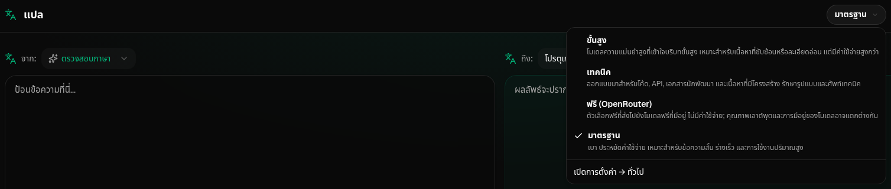
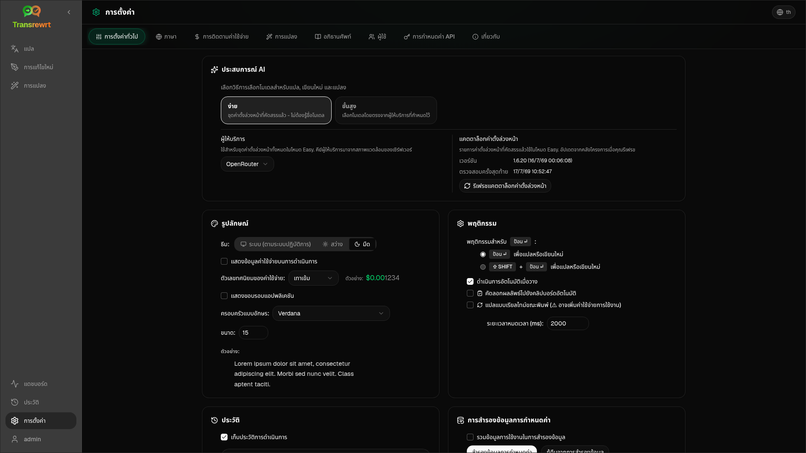

<a id="transrewrt-user-guide"></a>
# คู่มือผู้ใช้

<br/>

<a id="introduction"></a>
## บทนำ

Transrewrt ช่วยให้คุณทำงานกับข้อความได้สามวิธีหลัก:

- **แปล** - แปลงข้อความจากภาษาหนึ่งไปยังอีกภาษาหนึ่ง
- **เขียนใหม่** - เขียนข้อความใหม่ในรูปแบบที่ต่างออกไป เช่น ให้ชัดเจนขึ้น สั้นลง หรือเป็นทางการมากขึ้น
- **แปลง** - ประมวลผลข้อความโดยใช้คำแนะนำปัญญาประดิษฐ์แบบกำหนดเองที่เรียกว่าพรอมต์

โดยค่าเริ่มต้น แอปจะทำงานในโหมด **ง่าย**: คุณเลือก **พรีเซ็ต** (เช่น ฟรี (OpenRouter), มาตรฐาน, ขั้นสูง หรือ เทคนิค) และ **ผู้ให้บริการ** ในส่วนตั้งค่า โดยไม่ต้องเลือก ID ของโมเดล ให้เปลี่ยนไปใช้โหมด **ขั้นสูง** ใน [**ตั้งค่า** > **การตั้งค่าทั่วไป**](#general-settings) หากคุณต้องการรายการโมเดลแบบดั้งเดิมจาก [**ตั้งค่า** > **โมเดล**](#models)

<br/>

คู่มือนี้อธิบายวิธีการใช้งานแอปหลังจากติดตั้งและเริ่มทำงานแล้ว สำหรับขั้นตอนการติดตั้ง โปรดดูที่ [**README**](README.th.md)

<br/>

> ℹ️ **หมายเหตุ**<br/>
> Transrewrt มีให้ใช้งานเป็นแอปเดสก์ท็อปสำหรับ Windows และ Linux และเป็นแอปเว็บที่สามารถโฮสต์เองได้ คู่มือนี้เน้นการใช้งานทั่วไปของแอป หากมีข้อมูลใดที่ใช้ได้กับเฉพาะเวอร์ชันใดเวอร์ชันหนึ่ง จะระบุไว้อย่างชัดเจน

<small>**อ่านเป็นภาษาอื่น:** </small>
<small id="lang-list">[English (GB)](../USER-GUIDE.md) · [Português (Brasil)](./USER-GUIDE.pt-BR.md) · [العربية](./USER-GUIDE.ar.md) · [বাংলা](./USER-GUIDE.bn.md) · [Català](./USER-GUIDE.ca.md) · [中文 (中国大陆)](./USER-GUIDE.zh-CN.md) · [中文 (台灣)](./USER-GUIDE.zh-TW.md) · [Hrvatski](./USER-GUIDE.hr.md) · [Čeština](./USER-GUIDE.cs.md) · [Nederlands](./USER-GUIDE.nl.md) · [English (US)](./USER-GUIDE.en-US.md) · [Tagalog](./USER-GUIDE.tl.md) · [Français](./USER-GUIDE.fr.md) · [Deutsch](./USER-GUIDE.de.md) · [Ελληνικά](./USER-GUIDE.el.md) · [हिन्दी](./USER-GUIDE.hi.md) · [Magyar](./USER-GUIDE.hu.md) · [Italiano](./USER-GUIDE.it.md) · [日本語](./USER-GUIDE.ja.md) · [한국어](./USER-GUIDE.ko.md) · [Bahasa Melayu](./USER-GUIDE.ms.md) · [فارسی](./USER-GUIDE.fa.md) · [Polski](./USER-GUIDE.pl.md) · [Basa Jawa](./USER-GUIDE.jv.md) · [Português](./USER-GUIDE.pt.md) · [ਪੰਜਾਬੀ](./USER-GUIDE.pa.md) · [Română](./USER-GUIDE.ro.md) · [Русский](./USER-GUIDE.ru.md) · [Slovenčina](./USER-GUIDE.sk.md) · [Español](./USER-GUIDE.es.md) · [Kiswahili](./USER-GUIDE.sw.md) · [Svenska](./USER-GUIDE.sv.md) · [తెలుగు](./USER-GUIDE.te.md) · [ไทย](./USER-GUIDE.th.md) · [Türkçe](./USER-GUIDE.tr.md) · [Українська](./USER-GUIDE.uk.md) · [Tiếng Việt](./USER-GUIDE.vi.md)</small>

<small>

> **หมายเหตุเกี่ยวกับการแปลอินเตอร์เฟซและเอกสาร:** ภาษาอินเตอร์เฟซทั้งหมดยกเว้นภาษาอังกฤษ (สหราชอาณาจักร) ต้นฉบับ 
> ได้รับการแปลโดยใช้โมเดลปัญญาประดิษฐ์; คำแปลอาจไม่แม่นยำหรือมีข้อผิดพลาด

</small>

<br/>

<!-- START doctoc generated TOC please keep comment here to allow auto update -->
<!-- DON'T EDIT THIS SECTION, INSTEAD RE-RUN doctoc TO UPDATE -->
**สารบัญ**

- [ก่อนเริ่มต้น](#before-you-start)
  - [วิธีรับคีย์ API ฟรีจาก OpenRouter (แอปเดสก์ท็อป)](#how-to-get-a-free-openrouter-api-key-desktop-app)
- [เริ่มต้นใช้งาน](#getting-started)
- [ส่วนประกอบหลักของหน้าต่าง](#main-parts-of-the-window)
  - [แถบด้านข้าง](#sidebar)
  - [แถบเครื่องมือ](#toolbar)
  - [แผงข้อมูลนำเข้าและส่งออก](#input-and-output-panels)
- [แปล](#translate)
  - [แปลข้อความ](#translate-text)
  - [การเลือกภาษา](#language-selection)
  - [การตั้งค่าการแปลที่เป็นประโยชน์](#helpful-translation-settings)
  - [การปรับปรุงการแปลของคุณ](#refining-translation)
- [การแก้ไขใหม่](#rewrite)
- [การแปลง](#transform)
  - [เรียกใช้คำแนะนำที่มีอยู่](#run-an-existing-prompt)
  - [ถ้าคุณยังไม่มีคำแนะนำ](#if-you-have-no-prompts-yet)
  - [สร้างคำแนะนำอย่างรวดเร็ว](#create-a-prompt-quickly)
  - [แก้ไขคำแนะนำ](#edit-a-prompt)
  - [ทดสอบคำแนะนำก่อนใช้งาน](#test-a-prompt-before-using-it)
- [แดชบอร์ด](#dashboard)
  - [ตัวกรองข้อมูล](#filter-the-data)
  - [แท็บแดชบอร์ด](#dashboard-tabs)
  - [ส่งออกข้อมูล](#export-data)
  - [ลบบันทึกที่เก็บสำหรับโมเดล](#delete-stored-records-for-a-model)
- [ประวัติ](#history)
  - [ตัวกรองประวัติ](#filter-the-history)
  - [ส่งออกข้อมูลประวัติ](#export-history-data)
- [การตั้งค่า](#settings)
  - [การตั้งค่าทั่วไป](#general-settings)
  - [โมเดล](#models)
  - [ภาษา](#languages)
  - [การติดตามค่าใช้จ่าย](#cost-tracking)
  - [การแปลง (แท็บการตั้งค่า)](#transform-settings-tab)
  - [ผู้ใช้](#users)
  - [การกำหนดค่า API](#api-config)
  - [เกี่ยวกับ](#about)
- [ปัญหาทั่วไป](#common-issues)
  - [แอปจะไม่แปล, แก้ไขใหม่, หรือแปลงข้อความ](#the-app-will-not-translate-rewrite-or-transform-text)
  - [รายการโมเดลว่างเปล่า](#the-model-list-is-empty)
  - [ผลลัพธ์ช้าเกินไปหรือมีค่าใช้จ่ายสูงเกินไป](#the-result-is-too-slow-or-too-expensive)
  - [อินเทอร์เฟซอยู่ในภาษาที่ไม่ถูกต้อง](#the-interface-is-in-the-wrong-language)
  - [ข้อความเล็กเกินไปหรืออ่านยาก](#the-text-is-too-small-or-hard-to-read)
  - [สรุปแดชบอร์ดดูว่างเปล่า](#dashboard-summary-looks-empty)
  - [ค่าใช้จ่ายแสดง "ไม่มี" หรือดูผิด](#cost-shows-not-available-or-seems-wrong)
  - [ค่าใช้จ่ายรวมไม่ตรงกับบิลของผู้ให้บริการ](#total-cost-does-not-match-my-provider-bill)
  - [หน้าประวัติหายไปจากแถบด้านข้าง](#the-history-page-is-missing-from-the-sidebar)
  - [เว็บแอป: ถูกเปลี่ยนเส้นทางไปยังหน้าล็อกอินโดยไม่คาดคิด](#web-app-redirected-to-the-login-page-unexpectedly)
  - [ผู้ดูแลระบบเว็บ: ลืมหรือทำรหัสผ่านหาย](#web-admin-forgot-or-lost-a-password)
  - [แดชบอร์ดแสดงไม่มีข้อมูลสำหรับผู้ใช้อื่น (เว็บ)](#dashboard-shows-no-data-for-other-users-web)
  - [ฉันเปลี่ยนคำแนะนำและทำให้การแก้ไขหายไป](#i-changed-a-prompt-and-lost-the-edits)
- [เคล็ดลับด่วน](#quick-tips)
- [ข้อจำกัดความรับผิดชอบ](#disclaimer)
- [ใบอนุญาต](#license)

<!-- END doctoc generated TOC please keep comment here to allow auto update -->

<br/><br/>

<a id="before-you-start"></a>
## ก่อนที่คุณจะเริ่มต้น

ในการใช้งาน Transrewrt คุณต้องมีการเข้าถึงผู้ให้บริการ AI อย่างน้อยหนึ่งราย ผู้ให้บริการที่รองรับ ได้แก่ [OpenRouter](https://openrouter.ai) (ซึ่งรวมโมเดลหลายตัวเข้าด้วยกัน), OpenAI, Anthropic, Google Gemini, DeepSeek, Groq, Mistral, xAI, Cerebras และ [Ollama](https://ollama.com) สำหรับโมเดลในเครื่อง

คุณไม่จำเป็นต้องเลือกโมเดลแบบเสียเงินเพื่อเริ่มต้น เมื่อคุณเพิ่มคีย์ API ของ OpenRouter แล้ว แอปจะเปิดใช้งานตัวเลือก OpenRouter **ฟรี** ในตัวโดยอัตโนมัติ ซึ่งช่วยให้คุณสามารถเริ่มแปล เขียนใหม่ และแปลงข้อความได้ทันที หรืออีกทางหนึ่ง คุณสามารถขอรับคีย์ API ฟรีจาก Cerebras, Google, Groq หรือ Mistral AI ได้เช่นกัน

กล่าวอย่างง่าย ๆ:

- ในโหมด **ง่าย** แต่ละ **พรีเซ็ต** (ฟรี (OpenRouter), มาตรฐาน, ขั้นสูง หรือ เทคนิค) จะถูกแมปไปยังโมเดลของ **ผู้ให้บริการ** ที่คุณเลือก (OpenRouter, OpenAI, Ollama และอื่นๆ) เฉพาะพรีเซ็ตที่มีการแมปกับผู้ให้บริการปัจจุบันจะแสดงในแถบเครื่องมือ คุณเลือกพรีเซ็ตได้ที่ แปล, เขียนใหม่ และแปลง
- ในโหมด **ขั้นสูง** **โมเดล** คือ เครื่องยนต์ AI ที่คุณเลือกโดยตรง โดยใช้ **คำนำหน้าผู้ให้บริการ** สำหรับ ID โมเดล (ตัวอย่างเช่น `openrouter/…`, `openai/…`, `ollama/…`)
- **คีย์ API** (หรือสำหรับ Ollama คือ **URL พื้นฐาน**) คือ วิธีที่แอปใช้ติดต่อกับผู้ให้บริการนั้น

หากคุณใช้ **แอปเดสก์ท็อป** ให้เพิ่มคีย์ในส่วน [**ตั้งค่า** > **การตั้งค่า API**](#api-config) สำหรับแต่ละผู้ให้บริการที่คุณใช้ หากใช้เฉพาะ OpenRouter ดูวิธีการรับคีย์ API ฟรีของ OpenRouter ด้านล่างที่ [วิธีรับคีย์ API ฟรีจาก OpenRouter](#how-to-get-a-free-openrouter-api-key-desktop-app) หากคุณไม่ต้องการใช้คีย์ API คุณสามารถติดตั้ง Ollama (จาก [ollama.com](https://ollama.com)) และใช้โมเดลในเครื่องแทน เช่น `translategemma:4b`

หากคุณใช้ **เวอร์ชันเว็บ** ผู้ดูแลระบบเซิร์ฟเวอร์จะเป็นผู้ตั้งค่าผู้ให้บริการผ่านตัวแปรสภาพแวดล้อม ดังนั้นคุณจึงไม่สามารถป้อนคีย์ API โดยตรงในแอปพลิเคชันได้

<br/>

<a id="how-to-get-a-free-openrouter-api-key-desktop-app"></a>
### วิธีรับคีย์ API ฟรีจาก OpenRouter (แอปเดสก์ท็อป)

หากคุณใช้แอปเดสก์ท็อป ให้ทำตามขั้นตอนต่อไปนี้:

1. เข้าเว็บไซต์ [OpenRouter](https://openrouter.ai) ผ่านเว็บเบราว์เซอร์ของคุณ
2. สร้างบัญชีหรือลงชื่อเข้าใช้
3. เข้าสู่หน้า [Keys](https://openrouter.ai/keys)
4. คลิกปุ่มเพื่อสร้างคีย์ API ใหม่
5. ตั้งชื่อคีย์เพื่อให้คุณสามารถระบุได้ในภายหลัง
6. คัดลอกคีย์ API ใหม่
7. กลับไปที่ Transrewrt และเปิด **ตั้งค่า** > **การตั้งค่า API**
8. วางคีย์ลงในช่อง **OpenRouter API key** (ภายใต้ **ตั้งค่า** > **การตั้งค่า API**)
9. คลิก **Test OpenRouter key** เพื่อตรวจสอบว่าใช้งานได้

<br/><br/>

<a id="getting-started"></a>
## เริ่มต้นใช้งาน

หากนี่เป็นครั้งแรกที่คุณใช้ Transrewrt ให้ทำตามลำดับต่อไปนี้:

1. เปิดแอป
2. เลือก **ภาษาอินเตอร์เฟซ** จากไอคอนรูปโลกหากต้องการ
3. หากคุณใช้ **แอปเดสก์ท็อป** ให้เปิด [**ตั้งค่า** > **การตั้งค่า API**](#api-config) เพิ่มคีย์ API สำหรับผู้ให้บริการอย่างน้อยหนึ่งราย (ตัวอย่างเช่น OpenRouter) แล้วคลิก **ทดสอบ** เพื่อยืนยันว่าใช้งานได้
4. เปิด [**ตั้งค่า** > **การตั้งค่าทั่วไป**](#general-settings) ในโหมด **ง่าย** (ค่าเริ่มต้น) เลือก **ผู้ให้บริการ** ที่มีการตั้งค่าคีย์ไว้แล้ว ในโหมด **ขั้นสูง** ให้เปิด [**ตั้งค่า** > **โมเดล**](#models) และเพิ่มโมเดลหนึ่งรายการขึ้นไปไปยัง **โมเดลที่เลือก**
5. ที่ปุ่ม **แปล** เลือก **พรีเซ็ต** (โหมดง่าย) หรือ **โมเดล** (โหมดขั้นสูง) ในแถบเครื่องมือ
6. เปิด [**ตั้งค่า** > **ภาษา**](#languages) และเลือก **ภาษาที่ใช้บ่อยที่สุด** หากคุณต้องการให้ภาษาที่คุณใช้บ่อยที่สุดแสดงขึ้นก่อน
7. ลองแปลข้อความง่ายๆ เพื่อยืนยันว่าทุกอย่างทำงานได้ถูกต้อง จากนั้นลองใช้ **เขียนใหม่** และ **แปลง**

ลำดับนี้มีความสำคัญ มันช่วยป้องกันปัญหาทั่วไปที่พบเมื่อใช้ครั้งแรก คือ การพยายามรันงานก่อนที่แอปจะมีการเชื่อมต่อ API ที่ใช้งานได้ หรือยังไม่ได้เลือกพรีเซ็ต/โมเดล

<br/><br/>

<a id="main-parts-of-the-window"></a>
## ส่วนหลักของหน้าต่าง

แอปแบ่งออกเป็นสามส่วนหลัก:

- **แถบด้านข้าง** ทางด้านซ้าย
- **แถบเครื่องมือ** ด้านบน
- **พื้นที่ทำงาน** ตรงกลาง

<br/>

<a id="sidebar"></a>
### แถบด้านข้าง

ใช้แถบด้านข้างเพื่อเคลื่อนที่ไปมาในแอปพลิเคชัน คุณสามารถยุบแถบด้านข้างเพื่อเพิ่มพื้นที่ได้โดยการคลิกที่ไอคอนถัดจากโลโก้แอป

<br/>

<table>
  <tr>
    <td valign="top">
       
    </td>
    <td valign="top">
      <br/><br/>
      <ul>
        <li><strong>แปล</strong> เปิดพื้นที่ทำงานการแปล</li><br/>
        <li><strong>เขียนใหม่</strong> เปิดพื้นที่ทำงานการเขียนใหม่</li><br/>
        <li><strong>แปลง</strong> เปิดพื้นที่ทำงานพรอมต์แบบกำหนดเอง</li><br/>
        <li><strong>แดชบอร์ด</strong> แสดงข้อมูลการใช้งานและค่าใช้จ่าย</li><br/>
        <li><strong>ตั้งค่า</strong> เปิดแผงการตั้งค่า</li><br/>
        <li><strong>ประวัติการใช้งาน</strong> แสดงประวัติการใช้งานพร้อมข้อความนำเข้าและข้อความส่งออก</li><br/>
        <li><strong>ผู้ใช้</strong> แสดงชื่อผู้ใช้ของผู้ที่เข้าสู่ระบบ (เฉพาะเว็บเท่านั้น)</li>
      </ul>
    </td>
  </tr>
</table>

<br/>

<a id="toolbar"></a>
### แถบเครื่องมือ

แถบเครื่องมือจะเปลี่ยนแปลงเล็กน้อยขึ้นอยู่กับตำแหน่งที่คุณอยู่ในแอป

- ด้านซ้ายจะแสดงชื่อหน้าปัจจุบัน
- ด้านขวาจะแสดงตัวเลือก **พรีเซ็ตหรือโมเดล** และตัวควบคุม **ภาษาอินเตอร์เฟซ**

ในโหมด **ง่าย** แถบเครื่องมือจะแสดงตัวเลือก **พรีเซ็ต** ที่มีพรีเซ็ตในตัว ได้แก่ **ฟรี (OpenRouter)**, **มาตรฐาน**, **ขั้นสูง**, และ **เทคนิค** พรีเซ็ตที่ปรากฏขึ้นขึ้นอยู่กับ **ผู้ให้บริการ** ที่คุณเลือกใน [**ตั้งค่า** > **การตั้งค่าทั่วไป**](#general-settings) — ตัวอย่างเช่น **ฟรี (OpenRouter)** จะแสดงเฉพาะเมื่อผู้ให้บริการคือ OpenRouter หาก **ผู้ให้บริการ** เป็น **Ollama** แถบเครื่องมือจะแสดงโมเดลในเครื่องที่ติดตั้งไว้แทนพรีเซ็ต

ในโหมด **ขั้นสูง** ตัวเลือก **โมเดล** ช่วยให้คุณเลือกเครื่องมือปัญญาประดิษฐ์ที่ต้องการใช้สำหรับงานปัจจุบัน



ในโหมดขั้นสูง โมเดลฟรีบางตัวอาจไม่สามารถใช้งานได้ตลอดเวลา—อาจออฟไลน์หรือถึงขีดจำกัดการใช้งาน แอปอาจลบโมเดลนั้นออกจากรายการของคุณโดยอัตโนมัติ หากต้องการควบคุมว่าโมเดลใดจะแสดง ให้ไปที่ [**ตั้งค่า** > **โมเดล**](#models) คุณสามารถเปิดการตั้งค่าโมเดลได้จากไอคอนผู้ให้บริการที่อยู่ทางด้านซ้ายของชื่อโมเดลในแถบเครื่องมือ

<br/>

ไอคอน **รูปโลก + รหัสภาษา** เปลี่ยนภาษาอินเตอร์เฟซของแอป เช่น เมนูและปุ่ม แต่จะ **ไม่** เปลี่ยนภาษาที่ใช้ในการแปลในฟีเจอร์ **แปล**


<br/>

<a id="input-and-output-panels"></a>
### แผงข้อมูลนำเข้าและส่งออก

พื้นที่ทำงานส่วนใหญ่ใช้แผง **ข้อมูลนำเข้า** ด้านซ้าย และแผง **ข้อมูลส่งออก** ด้านขวา

แต่ละแผงยังแสดง:

| **ข้อมูลนำเข้า**                                                          | **ข้อมูลส่งออก**                                                                                                                  |
|--------------------------------------------------------------------|-----------------------------------------------------------------------------------------------------------------------------|
| - จำนวนตัวอักษร <br/>- จำนวนคำ <br/>- จำนวนย่อหน้า   <br/> | - เวลาที่ใช้ในการทำงาน<br/>- **TPS** (โทเค็นต่อวินาที)<br/>- จำนวนตัวอักษร คำ และย่อหน้า<br/>- โมเดลที่ใช้ |

หากคุณสงสัยเกี่ยวกับศัพท์เทคนิค:

- **โทเค็น** หมายถึงชิ้นส่วนข้อความขนาดเล็ก คุณสามารถคิดว่าเป็นส่วนหนึ่งของคำ หรือคำสั้น ๆ
- **TPS** หมายถึงจำนวนชิ้นส่วนข้อความที่โมเดลประมวลผลต่อวินาที

<br/>

คุณยังสามารถติดตามค่าใช้จ่ายของการดำเนินการแต่ละครั้ง (ถ้ามี) และต้นทุนรวมได้ โดยเปิดใช้งานตัวเลือก `Show cost information on the actions` ที่ [**ตั้งค่า** > **การตั้งค่าทั่วไป**](#general-settings)

<br/><br/>

[--------------------------------------------------------------------------------------------------------------------------]: #

<a id="translate"></a>
## แปล

ใช้ **แปล** เมื่อคุณต้องการแปลงข้อความจากภาษาหนึ่งไปยังอีกภาษาหนึ่ง


<br/>

<a id="translate-text"></a>
### แปลข้อความ

1. เปิด **แปล**
2. เลือกภาษาในช่อง **จาก**
3. เลือกภาษาในช่อง **ถึง**
4. เลือกพรีเซ็ต (โหมดง่าย) หรือโมเดล (โหมดขั้นสูง) ในแถบเครื่องมือ
5. พิมพ์หรือวางข้อความลงใน **ข้อมูลนำเข้า**
6. คลิก **แปล**
7. อ่านผลลัพธ์ใน **ข้อมูลส่งออก**
8. ใช้ปุ่มคัดลอกหากคุณต้องการคัดลอกผลลัพธ์
9. สามารถปรับปรุงผลลัพธ์ได้โดยเลือก **Rephrase…** หรือคำทางเลือก — ดูที่ [Refining your translation](#refining-translation).

<br/>

<a id="language-selection"></a>
### การเลือกภาษา

- **จาก** อาจเป็นภาษาเฉพาะหรือ **ตรวจจับภาษา**
- **ถึง** คือภาษาที่คุณต้องการให้ผลลัพธ์ออกมาเป็น

**ภาษาที่เลือก** ของคุณจะแสดงอยู่ด้านบนสุดของรายการ คุณสามารถตั้งค่าเหล่านี้ได้ที่ [**ตั้งค่า** > **ภาษา**](#languages)

<br/>

<a id="helpful-translation-settings"></a>
### การตั้งค่าการแปลที่เป็นประโยชน์

ใน [**ตั้งค่า** > **การตั้งค่าทั่วไป**](#general-settings) คุณสามารถเปลี่ยนวิธีการทำงานของการแปลได้:

- **ทำงานอัตโนมัติเมื่อวาง** จะทำการแปลทันทีที่คุณวางข้อความ.
- **คัดลอกผลลัพธ์ไปยังคลิปบอร์ดอัตโนมัติ** จะคัดลอกผลลัพธ์โดยอัตโนมัติหลังจากการทำงานสำเร็จ.
- **การแปลแบบเรียลไทม์ขณะพิมพ์** (⚠️ อาจทำให้ค่าใช้จ่ายในการใช้งานเพิ่มขึ้น) จะทำการแปลขณะคุณพิมพ์.
- **เวลาหมดอายุ (มิลลิวินาที)** ควบคุมระยะเวลาที่แอปจะรอ ก่อนที่จะทำการแปลแบบเรียลไทม์.
- **พฤติกรรมสำหรับ ENTER** จะเลือกว่าคุณ `Enter` จะทำงานหรือแทรกบรรทัดใหม่:
  - **Enter** จะทำการแปลหรือการแก้ไขใหม่ (ค่าเริ่มต้น).
  - **Shift + Enter** จะทำการแปลหรือการแก้ไขใหม่; **Enter** ธรรมดาจะแทรกบรรทัดใหม่.

<br/>

<a id="refining-translation"></a>
### การปรับปรุงการแปลของคุณ

หลังจากการแปลสำเร็จแล้ว, **Rephrase…** และเมนูดรอปดาวน์เวอร์ชันจะปรากฏในหัวข้อข้อมูลส่งออก, ถัดจากตัวเลือกภาษา **To:** คุณสามารถปรับปรุงผลลัพธ์ที่นั่น:

1. **Rephrase…** — เมื่อไม่มีข้อความที่เลือกในข้อมูลส่งออก, จะได้รับการแปลเต็มรูปแบบอีกครั้งของข้อมูลนำเข้าที่เหมือนกันด้วยคำที่แตกต่างกัน โมเดลจะได้รับทุกเวอร์ชันที่คุณมีอยู่แล้วดังนั้นคำใหม่สามารถแตกต่างจากทั้งหมดได้ คุณสามารถเก็บได้สูงสุด **ห้า** เวอร์ชันและสลับระหว่างพวกมันในเมนูดรอปดาวน์เวอร์ชัน เมื่อมีข้อความที่เลือก, **Rephrase…** จะเปิดคำทางเลือกใกล้กับการเลือก (เหมือนกับการคลิกขวา) หากไม่มีการเลือก, **Rephrase…** จะถูกปิดใช้งานเมื่อคุณถึงห้าเวอร์ชัน; หากมีการเลือก, มันยังทำงานที่ห้าเวอร์ชัน (คำทางเลือกเท่านั้น, อัปเดตเวอร์ชัน 5) ขณะที่การปรับปรุงเต็มรูปแบบกำลังดำเนินการ, คลิก **Stop Translate** เพื่อยกเลิก; ข้อมูลส่งออกจะกลับไปยังเวอร์ชันที่ใช้งานอยู่เมื่อการปรับปรุงเริ่มต้น.
2. **คำทางเลือก** — เลือกคำหนึ่งคำหรือมากกว่าหรือวลีสั้น ๆ ในข้อมูลส่งออก (หากคุณเลือกเพียงบางส่วนของคำ, แอปจะขยายการเลือกเป็นคำเต็ม), จากนั้นคลิกขวาหรือคลิก **Rephrase…** รายการทางเลือกสั้น ๆ จะปรากฏใกล้กับการเลือก; คลิกหนึ่งเพื่อแทนที่มัน แต่ละตัวเลือกอาจแทนที่ช่วงที่กว้างขึ้นเล็กน้อยกว่าการเลือกของคุณ (เช่น บุพบทหรือบทความที่อยู่ติดกัน) เพื่อให้ประโยคยังคงถูกต้องตามหลักไวยากรณ์ หากคุณมีน้อยกว่าห้าเวอร์ชัน, ข้อมูลส่งออกที่แก้ไขจะถูกบันทึกเป็นเวอร์ชันใหม่; ที่ห้าเวอร์ชัน, จะมีการอัปเดตเฉพาะ **เวอร์ชัน 5** เท่านั้น การคลิกขวาโดยไม่มีการเลือกจะไม่มีอะไรเกิดขึ้น กด **Esc** หรือคลิกนอกรายการเพื่อยกเลิกโดยไม่เปลี่ยนแปลงข้อมูลส่งออก.
3. **ค่าใช้จ่าย** — การใช้ **Rephrase…** เต็มรูปแบบแต่ละครั้ง (ไม่มีการเลือก) และการขอคำทางเลือกแต่ละครั้งจะใช้โมเดลอีกครั้งและอาจเพิ่มค่าใช้จ่ายการใช้งาน (เช่นเดียวกับการแปลปกติ).

[--------------------------------------------------------------------------------------------------------------------------]: #

<a id="rewrite"></a>
## เขียนใหม่

ใช้ **เขียนใหม่** เมื่อคุณต้องการปรับปรุงถ้อยคำโดยไม่เปลี่ยนความหมายหลัก


คุณสมบัตินี้มีประโยชน์สำหรับ:

- การแก้ไขการสะกดและการใช้ไวยากรณ์ (**ตรวจสอบการสะกดและการไวยากรณ์**)
- การทำให้ข้อความชัดเจนขึ้น (**ปรับให้ชัดเจนขึ้น**)
- การสร้างรูปแบบใหม่หลายแบบในครั้งเดียว (**เวอร์ชันทางเลือก**)
- การทำให้ข้อความเป็นทางการหรือไม่เป็นทางการมากขึ้น (**ทำให้เป็นทางการ** / **ทำให้ไม่เป็นทางการ**)
- ย่อข้อความให้สั้นลงหรือขยายให้ยาวขึ้น (**ย่อให้สั้นลง** / **ขยายให้ยาวขึ้น**)
- ทำให้ข้อความฟังดูเชิงเทคนิคมากขึ้น (**ทำให้เชิงเทคนิค**)

<br/>

> 💡 **เคล็ดลับ**<br/>
> เมื่อคุณใช้โหมด "**ตรวจสอบการสะกดและการไวยากรณ์**" จะมีสวิตช์ **แสดงการเปลี่ยนแปลง** ปรากฏในแผงผลลัพธ์ (อยู่ข้างๆ **คัดลอก**)
> เปิดหรือปิดเพื่อแสดงหรือซ่อนการแก้ไขเฉพาะที่ถูกนำไปใช้กับข้อความของคุณ

<br/><br/>

[--------------------------------------------------------------------------------------------------------------------------]: #

<a id="transform"></a>
## แปลง

ใช้ **แปลง** เมื่อคุณต้องการให้ AI ทำตามชุดคำแนะนำที่กำหนดเอง


นี่คือส่วนที่ยืดหยุ่นที่สุดของแอป คุณสามารถใช้มันเพื่องานต่างๆ เช่น:

- สรุปบันทึก
- แปลงข้อความร่างให้เป็นอีเมลที่สมบูรณ์แบบ
- ดึงประเด็นสำคัญออกมา
- แปลงข้อความให้อยู่ในรูปแบบเฉพาะ
- กิจกรรมที่กำหนดเองอื่นๆ กับข้อความนำเข้า

<br/>

<a id="run-an-existing-prompt"></a>
### รันพรอมต์ที่มีอยู่แล้ว

1. เปิด **การแปลง**.
2. เลือกคำแนะนำจากรายการคำแนะนำ.
3. หากมีช่องภาษา **From** ปรากฏขึ้น ให้เลือกภาษา หากคุณต้องการ.
4. พิมพ์หรือวางข้อความลงใน **ข้อมูลนำเข้า**.
5. คลิก **แปลง**
6. อ่านผลลัพธ์ใน **ข้อมูลส่งออก**

<br/>

<a id="if-you-have-no-prompts-yet"></a>
### หากคุณยังไม่มีพรอมต์

หากรายการพรอมต์ของคุณว่างเปล่า ให้คลิก **โหลดตัวอย่างพรอมต์** ในพื้นที่ทำงานแปลง ตัวควบคุมนี้มีให้ใช้ตลอดเวลาใน [**ตั้งค่า** > **แปลง**](#transform-settings) ที่แถวส่งออก/นำเข้า ทั้งสองวิธีจะเพิ่มตัวอย่างที่มีอยู่ในตัว เพื่อให้คุณเริ่มต้นได้อย่างรวดเร็ว

<br/>

> ℹ️ **หมายเหตุ**<br/>
> ตัวอย่างพรอมต์มีให้เป็นภาษาอังกฤษ หลังจากโหลดแล้ว คุณสามารถแก้ไขพรอมต์และใช้ **แปลพรอมต์** เพื่อแปลเป็นภาษาของคุณ

<br/>

<a id="create-a-prompt-quickly"></a>
### สร้างพรอมต์อย่างรวดเร็ว

วิธีที่เร็วที่สุดในการสร้างพรอมต์คือ:

1. คลิก **พรอมต์ใหม่**
2. คลิก **สร้างพรอมต์**
3. อธิบายสิ่งที่คุณต้องการให้พรอมต์นี้ทำ
4. เลือกพรีเซ็ต (โหมดง่าย) หรือโมเดล (โหมดขั้นสูง)
5. ปล่อยให้แอปสร้างร่างให้คุณ  
6. ตรวจสอบร่างและคลิก **บันทึก**


<br/>

<a id="edit-a-prompt"></a>
### แก้ไขพรอมต์

เมื่อคุณสร้างหรือแก้ไขพรอมต์ ตัวแก้ไขจะปรากฏทางด้านซ้าย และพื้นที่ทดสอบจะปรากฏทางด้านขวา


ช่องหลักมีดังนี้:

- **ชื่อพรอมต์**: ชื่อที่แสดงในรายการพรอมต์  
- **คำแนะนำพรอมต์ (ไม่บังคับ)**: คำแนะนำสั้น ๆ ที่แสดงให้ผู้ใช้เห็นเมื่อรันพรอมต์  
- **บทบาทโมเดล**: บทบาทโดยรวมที่กำหนดให้กับปัญญาประดิษฐ์ เช่น 'คุณเป็นผู้ช่วยที่มีประโยชน์'  
- **คำแนะนำโมเดล (หนึ่งคำแนะนำต่อหนึ่งบรรทัด)**: กฎเฉพาะที่คุณต้องการให้ปัญญาประดิษฐ์ปฏิบัติตาม
- **คำอธิบายผลลัพธ์ (เช่น ปรับเปลี่ยน, สรุป ฯลฯ)**: คำสั้น ๆ ที่อธิบายผลลัพธ์.
- **อุณหภูมิ (0.0 → 1.0)**: วิธีที่โมเดลจะทำงาน; ดูด้านล่าง.
- **ขอภาษาเป้าหมาย**: จะเพิ่มตัวเลือกภาษาเมื่อคำแนะนำทำงาน.
หากคำศัพท์ทางเทคนิค **อุณหภูมิ** เป็นสิ่งใหม่สำหรับคุณ ให้คิดว่าเป็นแบบนี้:

- อุณหภูมิที่ **ต่ำกว่า** จะให้ผลลัพธ์ที่มั่นคงและคาดเดาได้มากกว่า
- อุณหภูมิที่ **สูงกว่า** จะให้ความหลากหลายและความคิดสร้างสรรค์มากขึ้น

คุณยังสามารถใช้:

- `Generate prompt` เพื่อสร้างร่างใหม่จากคำอธิบายง่าย ๆ
- `Improve prompt` เพื่อปรับปรุงพรอมต์ที่มีอยู่
- `Translate prompt` เพื่อแปลช่องข้อมูลของพรอมต์

<br/>

> ⚠️ **คำเตือน**<br/>
> คลิก `Save` ก่อนที่จะคลิก `Back to Run` หากคุณย้อนกลับโดยไม่บันทึก การเปลี่ยนแปลงของคุณจะสูญหาย

<br/>

<a id="test-a-prompt-before-using-it"></a>
### ทดสอบพรอมต์ก่อนใช้งาน

แผงทดสอบทางด้านขวาช่วยให้คุณสามารถลองใช้พรอมต์กับข้อความตัวอย่างก่อนที่จะนำไปใช้ในงานประจำวัน

สิ่งนี้มีประโยชน์เมื่อ:

- คุณกำลังสร้างพรอมต์ใหม่
- คุณกำลังเปรียบเทียบสองเวอร์ชันของพรอมต์
- คุณต้องการตรวจสอบน้ำเสียง ความยาว หรือรูปแบบข้อมูลส่งออก

<br/>

> ℹ️ **หมายเหตุ**<br/>
> คุณสามารถส่งออกและนำเข้าพรอมต์ที่บันทึกไว้ได้ที่ [**ตั้งค่า** > **แปลง**](#transform-settings)

เมื่อคุณใช้ **สร้างพรอมต์**, **ปรับปรุงพรอมต์** หรือ **แปลพรอมต์** ในตัวแก้ไขพรอมต์ โหมด **ง่าย** จะแสดงตัวเลือกพรีเซ็ตเหมือนกับที่ใช้ในแปลและเขียนใหม้ ส่วนโหมด **ขั้นสูง** จะใช้รายการโมเดล

<br/><br/>

[--------------------------------------------------------------------------------------------------------------------------]: #

<a id="dashboard"></a>
## แดชบอร์ด

ใช้ **แดชบอร์ด** เพื่อดูว่าคุณใช้งานแอปมากเพียงใด และค่าใช้จ่ายเป็นเท่าไร (สำหรับโมเดลที่มีค่าใช้จ่าย)


<br/>

> ℹ️ **หมายเหตุ**<br/>
> หากคุณใช้เฉพาะโมเดล **ฟรี** ค่า **ค่าใช้จ่าย** อาจเป็นศูนย์ และ KPI ที่เน้นค่าใช้จ่ายอาจดูว่างเปล่า แท็บ **สรุป** ยังคงแสดงจำนวนการเรียกใช้สำหรับการแปล เขียนใหม่ และแปลงเมื่อมีกิจกรรมในช่วงเวลาที่เลือก

<br/>

<a id="filter-the-data"></a>
### ตัวกรองข้อมูล

ใช้ปุ่มตัวกรองที่ด้านบนเพื่อเปลี่ยนช่วงเวลา


<br/>

> ℹ️ **หมายเหตุ**<br/>
> ตัวกรอง **ผู้ใช้** จะแสดงให้เห็นเฉพาะผู้ดูแลระบบในรุ่นเว็บเท่านั้น ผู้ใช้ทั่วไปจะไม่เห็นตัวกรองนี้ และไม่สามารถใช้งานได้ในแอปเดสก์ท็อป

<br/>

<a id="dashboard-tabs"></a>
### แท็บแดชบอร์ด

- **สรุป** แสดงการ์ด KPI: ค่าใช้จ่ายรวม โมเดลที่ใช้ จำนวนการเรียกใช้และค่าใช้จ่ายต่อโหมด (พร้อมสัดส่วนของการเรียกใช้ทั้งหมด) ค่าใช้จ่ายเฉลี่ยต่อการเรียกใช้ TPS เฉลี่ย และสามโมเดลที่มีจำนวนการเรียกใช้สูงสุด
- **ตามโมเดล** แสดงรายการแต่ละโมเดลพร้อมจำนวนการเรียกใช้ทั้งหมด ค่าใช้จ่ายรวม และ TPS เฉลี่ย; ขยายแถวเพื่อดูรายละเอียดแยกตามการแปล เขียนใหม่ และแปลง
- **การเรียกใช้ API ทั้งหมด** แสดงบันทึกการเรียกใช้ทั้งหมด (แสดงแบบแบ่งหน้าในเค้าโครงกว้าง และแบบการ์ดในหน้าจอบาง) และอนุญาตให้คุณส่งออกได้

<br/>

<a id="export-data"></a>
### ส่งออกข้อมูล

ตารางในแดชบอร์ดสามารถส่งออกข้อมูลในรูปแบบ:

- **JSON**
- **CSV**
- **XLSX**

สิ่งนี้มีประโยชน์หากคุณต้องการตรวจสอบกิจกรรมภายนอกแอปหรือแบ่งปันรายงาน

<br/>

<a id="delete-stored-records-for-a-model"></a>
### ลบบันทึกที่จัดเก็บสำหรับโมเดล

ในส่วน **ตามโมเดล** หรือ **การเรียกใช้ API ทั้งหมด** คุณสามารถลบบันทึกที่จัดเก็บสำหรับโมเดลได้โดยคลิกที่ไอคอน "ถังขยะ"

> ⚠️ **คำเตือน**<br/>
> การลบบันทึกที่จัดเก็บแล้วไม่สามารถทำกลับได้ โปรดใช้ฟังก์ชันนี้เฉพาะเมื่อคุณแน่ใจว่าไม่ต้องการประวัติดังกล่าวอีกต่อไป

หากต้องการลบข้อมูลทั้งหมดหรือลบระเบียนตามอายุของข้อมูล ให้ไปที่ [**ตั้งค่า** > **การติดตามค่าใช้จ่าย**](#cost-tracking) ที่นั่นคุณจะพบตัวเลือกในการลบข้อมูลที่จัดเก็บทั้งหมด หรือเฉพาะข้อมูลที่เก่ากว่าวันที่ที่กำหนด

<br/><br/>

[--------------------------------------------------------------------------------------------------------------------------]: #

<a id="history"></a>
## ประวัติการใช้งาน

คลิกที่ **ประวัติการใช้งาน** เพื่อดูประวัติการดำเนินการของคุณภายใน **Transrewrt** รวมถึงข้อมูลนำเข้าและข้อมูลส่งออกของการดำเนินการแต่ละครั้ง


<br/>

<a id="filter-the-history"></a>
### ตัวกรองประวัติการใช้งาน

**ประวัติการใช้งาน** ใช้ตัวกรองช่วงเวลาเดียวกันกับหน้า **แดชบอร์ด**


<br/>

> ℹ️ **หมายเหตุ**<br/>
> ใน **เว็บแอป** ทุกคน (รวมถึงผู้ดูแลระบบ) จะเห็นเฉพาะประวัติการดำเนินการของตนเองเท่านั้น ตัวกรอง **ผู้ใช้** บน **แดชบอร์ด** ใช้โดยผู้ดูแลระบบเพื่อตรวจสอบการใช้งานและค่าใช้จ่ายข้ามบัญชี; มันไม่ส่งผลกับ **ประวัติการใช้งาน**

<br/>

<a id="export-history-data"></a>
### ส่งออกข้อมูลประวัติการใช้งาน

หน้าประวัติการใช้งานสามารถส่งออกข้อมูลที่กรองแล้วในรูปแบบ:

- **JSON**
- **CSV**
- **XLSX**

สิ่งนี้มีประโยชน์หากคุณต้องการตรวจสอบกิจกรรมภายนอกแอปหรือแบ่งปันรายงาน

<br/><br/>

[--------------------------------------------------------------------------------------------------------------------------]: #

<a id="settings"></a>
## ตั้งค่า

เปิด **ตั้งค่า** จากแถบด้านข้างเพื่อปรับแต่งพฤติกรรมของแอป

แท็บที่มีให้ใช้งานขึ้นอยู่กับแพลตฟอร์มและบทบาทของคุณ:

| แท็บ | เดสก์ท็อป | เว็บ (ผู้ดูแลระบบ) | เว็บ (ผู้ใช้ทั่วไป) | หมายเหตุ |
|------------------|:-------:|:-----------:|:------------------:|----------------------------------------------|
| การตั้งค่าทั่วไป | ใช่ | ใช่ | ใช่ | รวมถึง **ประสบการณ์ AI** (Easy / Advanced) |
| โมเดล | ใช่ | ใช่ | ใช่ | แสดงเฉพาะเมื่อ **ประสบการณ์ AI** เป็น **ขั้นสูง** |
| ภาษา | ใช่ | ใช่ | ใช่ | |
| การติดตามค่าใช้จ่าย | ใช่ | ใช่ | - | |
| แปลง | ใช่ | ใช่ | ใช่ | นำเข้า/ส่งออกพรอมต์แปลงแบบกลุ่ม |
| ผู้ใช้ | - | ใช่ | - | |
| การตั้งค่า API | ใช่ | ใช่ | - | |
| เกี่ยวกับ | ใช่ | ใช่ | ใช่ | |

ในโหมด **ง่าย** การเลือกโมเดลจะทำผ่านพรีเซ็ตในแถบเครื่องมือ และ **ผู้ให้บริการ** ในส่วนการตั้งค่าทั่วไป; ส่วนแท็บ **โมเดล** จะถูกซ่อนไว้

<br/>

> ℹ️ **หมายเหตุ**<br/>
> ในเวอร์ชันเว็บ ผู้ใช้แต่ละคนจะมีการตั้งค่าของตนเอง การตั้งค่าต่างๆ เช่น ประสบการณ์ AI, ผู้ให้บริการ, โมเดลหรือพรีเซ็ตที่เลือก, ภาษา, ตัวเลือกทั่วไป และพรอมต์แปลง จะถูกจัดเก็บแยกตามผู้ใช้ การเปลี่ยนแปลงที่คุณทำจะไม่ส่งผลต่อผู้ใช้คนอื่น

<br/>

[--------------------------------------------------------------------------------------------------------------------------]: #

<a id="general-settings"></a>
### การตั้งค่าทั่วไป

ใช้ **การตั้งค่าทั่วไป** เพื่อควบคุมพฤติกรรมการพิมพ์ ว่าจะเก็บรายละเอียดการดำเนินการสำหรับ **ประวัติการใช้งาน** หรือไม่ รูปลักษณ์ และวิธีที่คุณเลือก AI สำหรับการแปล เขียนใหม่ และแปลง

**ประสบการณ์ AI**

- **ง่าย** (ค่าเริ่มต้น): เลือก **ผู้ให้บริการ** (OpenRouter, OpenAI, Anthropic, Google Gemini, DeepSeek, Groq, Mistral, xAI, Cerebras หรือ Ollama) ผู้ให้บริการบนคลาวด์จะใช้พรีเซ็ตในตัวในแถบเครื่องมือ **Ollama** จะแสดงรายการโมเดลที่ติดตั้งไว้ในเครื่องของคุณแทนพรีเซ็ต ในโหมดง่าย ส่วน **แคตตาล็อกพรีเซ็ต** จะแสดงเวอร์ชันของแคตตาล็อกและเวลาอัปเดตล่าสุด; คลิก **รีเฟรชแคตตาล็อกพรีเซ็ต** เพื่อดึงรายการพรีเซ็ตล่าสุดจากที่เก็บข้อมูลโครงการ (แอปจะตรวจสอบอัตโนมัติเป็นระยะในพื้นหลัง)
- **ขั้นสูง**: เลือกโมเดลแต่ละตัวในแถบเครื่องมือ; จัดการรายการได้ที่ [**ตั้งค่า** > **โมเดล**](#models)

**รูปลักษณ์**

- **ธีม** เปลี่ยนระหว่างรูปลักษณ์โหมดสว่าง โหมดมืด และระบบ
- **แสดงข้อมูลต้นทุนบนการกระทำ** ควบคุมการแสดงต้นทุนต่อการดำเนินการ (ถ้ามี) และต้นทุนรวมบนแผงผลลัพธ์ของการแปล เขียนใหม่ และแปลง
- **จำนวนหลักทศนิยมของต้นทุน** เปลี่ยนการแสดงตัวเลขทศนิยมของต้นทุน
- **เฉพาะเว็บ:** **แสดงพื้นที่ว่างรอบแอป** เพิ่มพื้นที่ว่างเพิ่มเติมรอบอินเทอร์เฟซ
- **ตระกูลแบบอักษร** เปลี่ยนแบบอักษรที่ใช้ในแผงข้อความ
- **ขนาด** เปลี่ยนขนาดตัวอักษร

**พฤติกรรม**

- **พฤติกรรมสำหรับ ENTER** จะเลือกว่าคุณ `Enter` จะทำงานหรือแทรกบรรทัดใหม่.
- **ทำงานอัตโนมัติเมื่อวาง** จะเริ่มการแปลทันทีที่คุณวางข้อความ.
- **คัดลอกผลลัพธ์ไปยังคลิปบอร์ดอัตโนมัติ** จะคัดลอกผลลัพธ์ที่สำเร็จโดยอัตโนมัติ.
- **การแปลแบบเรียลไทม์ขณะพิมพ์** (⚠️ อาจทำให้ค่าใช้จ่ายในการใช้งานเพิ่มขึ้น) จะทำการแปลขณะคุณพิมพ์.
- **หมดเวลา (มิลลิวินาที)** ตั้งค่าเวลาที่รอสำหรับการแปลแบบเรียลไทม์

**ประวัติ**

- **เก็บประวัติการดำเนินการ** ควบคุมว่าแต่ละการดำเนินการแปล เขียนใหม่ และแปลง จะจัดเก็บ **ข้อมูลนำเข้าและข้อมูลส่งออก** สำหรับมุมมอง [**ประวัติการใช้งาน**](#history) หรือไม่ การปิดใช้งานจะมีการขอคำยืนยัน; หากคุณยืนยัน ข้อความประวัติที่จัดเก็บไว้จะถูกลบออกจากฐานข้อมูล หากป้ายแสดงว่า *ปิดใช้งานโดยผู้ดูแลระบบ* หมายความว่าการติดตั้งของคุณมีการตั้งค่า `HISTORY_DISABLED` ในสภาพแวดล้อม (ดูที่ [README](README.th.md#configuration-and-environment)); คุณจะไม่สามารถเปิดการใช้งานประวัติการใช้งานใหม่จาก UI ได้
- **ลบข้อมูลประวัติ** ช่วยให้คุณลบข้อความที่จัดเก็บไว้ตามอายุ (เช่น ข้อมูลที่เก่ากว่าไม่กี่เดือน หรือ **ข้อมูลทั้งหมด (ล้าง)**) โดยใช้ **ลบข้อมูล** การดำเนินการนี้จะมีผลเฉพาะกับข้อความการดำเนินการที่บันทึกไว้สำหรับมุมมอง **ประวัติการใช้งาน** เท่านั้น แต่จะ **ไม่** ลบข้อมูลค่าใช้จ่ายหรือยอดการใช้งานรวม หากต้องการลบหรือตัดข้อมูล **ค่าใช้จ่าย** ให้ใช้ [**ตั้งค่า** > **การติดตามค่าใช้จ่าย**](#cost-tracking)

**การสำรองข้อมูลการกำหนดค่า** (เฉพาะผู้ดูแลระบบแอปเดสก์ท็อปและเว็บ)
- **รวมข้อมูลการใช้งานในการสำรองข้อมูล** - เมื่อเปิดใช้งาน ZIP จะมีประวัติการทำงานและข้อมูลการเรียก API.
- **สำรองข้อมูลการกำหนดค่า** - จะสร้าง ZIP เดียว (`transrewrt-config-backup-YYYY-MM-DD_HHMMSS.zip` ตามเวลาท้องถิ่น) พร้อมด้วย `config.json`, `state.json`, คีย์การเข้ารหัสที่เลือกได้, ผู้ใช้, การตั้งค่า, คำแนะนำที่กำหนดเอง, และข้อมูลการใช้งานหากคุณเลือกเข้าร่วม. หลังจากการสำรองข้อมูลสำเร็จ การยืนยันจะแสดงชื่อไฟล์ที่บันทึก.
- **กู้คืนจากการสำรองข้อมูล** - จะเปิด **กล่องโต้ตอบยืนยันก่อน**. เลือก ZIP สำรองข้อมูลภายในกล่องโต้ตอบ (**เรียกดู** / ตัวเลือกไฟล์หรือการลากและวางเมื่อรองรับ), จากนั้นตรวจสอบตัวเลือก:
  - **กู้คืนข้อมูลการใช้งาน** - นำเข้าข้อมูลการใช้งาน/ประวัติจาก ZIP เมื่อมันถูกสำรองข้อมูลพร้อมข้อมูลการใช้งาน; ปล่อยไว้หากคุณต้องการเพียงการตั้งค่าและคำแนะนำ.
  - **ล้างข้อมูลการใช้งานเก่าก่อนกู้คืน** - ลบข้อมูลการใช้งาน/ประวัติที่มีอยู่ในการติดตั้งนี้ก่อนที่จะนำการสำรองข้อมูลมาใช้ (เลือกได้; ใช้เมื่อคุณต้องการการแทนที่ที่สะอาด).
การสำรองข้อมูลที่สร้างในเวอร์ชันเว็บหรือเดสก์ท็อปสามารถกู้คืนในอีกเวอร์ชันหนึ่งได้. เมื่อกู้คืนการสำรองข้อมูลเดสก์ท็อปในเวอร์ชันเว็บ ข้อมูลจะถูกกู้คืนไปยังผู้ใช้ผู้ดูแลระบบ.

<br/>

<a id="models"></a>
### โมเดล

แท็บนี้จะใช้งานได้เฉพาะเมื่อ **ประสบการณ์ AI** ถูกตั้งค่าเป็น **ขั้นสูง** ใน [**การตั้งค่าทั่วไป**](#general-settings) ใช้ **ตั้งค่า** > **โมเดล** เพื่อเลือกว่าโมเดลใดจะแสดงในแถบเครื่องมือ



หน้านี้มีสองรายการ:

- **โมเดลที่มีอยู่** ทางด้านซ้าย
- **โมเดลที่เลือก** ทางด้านขวา

การควบคุมที่เป็นประโยชน์ ได้แก่:

- **ค้นหาโมเดล...** เพื่อค้นหาโมเดลตามชื่อ
- ชิป **ผู้ให้บริการ** เพื่อจำกัดรายการให้เหลือเฉพาะเอนจินเดียว (OpenRouter, OpenAI, Ollama, …)
- **เฉพาะแบบฟรี** เพื่อแสดงเฉพาะโมเดลที่ไม่เสียค่าใช้จ่าย
- **รีเฟรช** เพื่อโหลดรายการใหม่
- **ขยายทั้งหมด** และ **ยุบทั้งหมด** เมื่อคุณจัดเรียงตามผู้ให้บริการ

รหัสโมเดลจะรวมคำนำหน้าของผู้ให้บริการ (ตัวอย่างเช่น `openrouter/…` เทียบกับ `openai/…`) ป้ายกำกับ เช่น **OpenAI (OpenRouter)** เทียบกับ **OpenAI (โดยตรง)** แสดงวิธีการส่งข้อมูลผ่านระบบ

> ℹ️ **หมายเหตุ**<br/>
> **OpenRouter Body Builder** (`openrouter/bodybuilder`) เป็นโมเดลตัวควบคุมเส้นทาง ไม่ใช่โมเดลแชททั่วไป: คำตอบที่ได้จะอยู่ในรูปแบบ JSON ที่อธิบายโครงสร้างคำขอ API ของ OpenRouter (ตัวอย่างเช่น อาร์เรย์ `requests` ที่มี `model` และ `messages`) หากคุณใช้มันสำหรับ **แปล**, **เขียนใหม่**, หรือ **แปลง**, แผงผลลัพธ์จะแสดง JSON ดังกล่าวแทนข้อความที่สำเร็จแล้ว โปรดเลือกโมเดลข้อความทั่วไปสำหรับงานเหล่านี้ ดูหน้า [โมเดล Body Builder](https://openrouter.ai/openrouter/bodybuilder) บน OpenRouter

การดำเนินการ:

- ในการเพิ่มโมเดล ให้คลิก **เพิ่ม** หรือคลิกที่ใดก็ได้ในรายการ

- ในการลบโมเดล ให้คลิก **X** ถัดจากโมเดลในรายการ **โมเดลที่เลือก** หรือคลิก **ที่เลือก** ในรายการโมเดลที่มีอยู่

- ในการล้างรายการ ให้คลิก **ยกเลิกการเลือกทั้งหมด** โมเดลฟรีที่จำเป็นจะยังคงอยู่ในรายการ

<br/>

> ℹ️ **หมายเหตุ**<br/>
> หากคุณไม่ต้องการเติมเครดิตให้กับ OpenRouter ทันที ให้เริ่มต้นด้วยการเปิดใช้งาน **เฉพาะแบบฟรี** และเลือกโมเดลฟรี (ไม่ต้องใช้บัตรเครดิต) คุณยังสามารถใช้ Ollama เพื่อรันโมเดลในเครื่องโดยไม่ต้องใช้คีย์ API

<br/>

<a id="languages"></a>
### ภาษา

ใช้ **ตั้งค่า** > **ภาษา** เพื่อจัดการรายการภาษาที่ใช้ในแอป

- **ภาษาที่ใช้บ่อย** จะถูกตรึงไว้ด้านบนของรายการภาษาใน **แปล**, และ **แปลง**
- **ภาษาที่กำหนดเอง** ช่วยให้คุณเพิ่มภาษาที่ไม่มีอยู่ในรายการเริ่มต้น

หากคุณเพิ่มภาษาที่กำหนดเอง ภาษาดังกล่าวจะปรากฏในตัวเลือกภาษาพร้อมกับตัวเลือกเริ่มต้น

<br/>

<a id="cost-tracking"></a>
### การติดตามค่าใช้จ่าย

ใช้ **ตั้งค่า** > **การติดตามค่าใช้จ่าย** เพื่อจัดการข้อมูลค่าใช้จ่าย

- **ต้นทุนรวม** แสดงยอดรวมสะสม
- **คัดลอกค่า** คัดลอกยอดรวมไปยังคลิปบอร์ด
- **รีเซ็ตค่าใช้จ่าย** ตั้งค่ายอดรวมเป็นศูนย์
- **ซิงค์กับการใช้คีย์ API** ตั้งค่ายอดรวมให้ตรงกับการใช้งานที่รายงานโดยบัญชี OpenRouter ของคุณ (เฉพาะ OpenRouter)
- **การใช้คีย์ API** แสดงรายละเอียดการใช้งาน OpenRouter หากมีข้อมูล
- **ลบข้อมูลต้นทุน** ลบข้อมูลทั้งหมด หรือเฉพาะรายการที่เก่ากว่าวันที่ที่เลือก

**การติดตามค่าใช้จ่าย:** เมื่อคุณใช้โมเดล OpenRouter แอปจะแสดงการใช้งานและค่าใช้จ่ายจริงตามข้อมูลต้นทุนจาก OpenRouter สำหรับผู้ให้บริการอื่น ๆ แอปจะประมาณการค่าใช้จ่ายโดยใช้ราคาที่เผยแพร่โดย OpenRouter หากไม่มีราคา ค่าประมาณอาจเป็นศูนย์

<br/>

> ℹ️ **หมายเหตุ**<br/>
> **ตัวเลขค่าใช้จ่ายทั้งหมดเป็นเพียงการประมาณสำหรับการอ้างอิงของคุณเท่านั้น ไม่ใช่ใบแจ้งหนี้อย่างเป็นทางการ**

<br/>

> ⚠️ **คำเตือน**<br/>
> การลบข้อมูลไม่สามารถย้อนกลับได้ ก่อนลบข้อมูล โปรดสำรองข้อมูลหรือส่งออกผ่าน [**ประวัติการใช้งาน**](#history)
> หรือ [**แดชบอร์ด** > **การเรียกใช้ API ทั้งหมด**](#dashboard-tabs) มิฉะนั้นข้อมูลจะสูญหายอย่างถาวร
> ประวัติการรับ/ส่งข้อมูลที่เกี่ยวข้องกับแต่ละรายการการเรียก API จะถูกลบด้วย

<br/>

<a id="transform-settings"></a>
### แปลง (แท็บการตั้งค่า)

ใช้ **ตั้งค่า** > **แปลง** เพื่อจัดการพรอมต์จำนวนมากพร้อมกัน

คุณสามารถ:

- ตรวจสอบพรอมต์ที่บันทึกไว้
- ลบพรอมต์
- นำเข้าพรอมต์จากไฟล์
- ส่งออกพรอมต์เพื่อสำรองข้อมูลหรือแบ่งปัน
- โหลดตัวอย่างพรอมต์ลงในรายการพรอมต์

<br/>

<a id="users"></a>
### ผู้ใช้

ใช้ **ผู้ใช้** เพื่อจัดการบัญชีผู้ใช้ในเวอร์ชันเว็บ คุณสามารถเพิ่มผู้ใช้ อัปเดตรายละเอียด รีเซ็ตรหัสผ่าน และลบบัญชีได้

<br/>

<a id="api-config"></a>
### การตั้งค่า API

ผู้ให้บริการที่รองรับ ได้แก่ OpenRouter, OpenAI, Anthropic, Google Gemini, DeepSeek, Groq, Mistral, xAI, Cerebras และ **Ollama** (โมเดลในเครื่องผ่าน URL พื้นฐาน) คุณจำเป็นต้องตั้งค่าเฉพาะผู้ให้บริการที่คุณใช้งานเท่านั้น

**แอปพลิเคชันเว็บ: ผู้ดูแลระบบเท่านั้น**

คีย์ API ถูกตั้งค่าผ่านตัวแปรสภาพแวดล้อมของระบบหรือ Docker - ไม่ได้ป้อนผ่านเว็บ UI หน้านี้แสดงว่าผู้ให้บริการใดมีการตั้งค่าคีย์แล้ว และให้คุณทดสอบแต่ละตัวได้โดยคลิกปุ่ม `Test`

<br/>

> ℹ️ **หมายเหตุ**<br/>
> เพื่อเปลี่ยนคีย์ API ให้อัปเดตตัวแปรสภาพแวดล้อมในระบบหรือการตั้งค่า Docker ของคุณ แล้วรีสตาร์ทเซิร์ฟเวอร์หรือคอนเทนเนอร์

<br/>

> ℹ️ **หมายเหตุ**<br/>
> **การสำรองข้อมูลการตั้งค่า** (ดูที่ [**การตั้งค่าทั่วไป** → การสำรองข้อมูลการตั้งค่า](#general-settings)) สามารถฝังคีย์ผู้ให้บริการที่ **แก้ไขแล้ว** ไว้ภายในไฟล์ `config.json` ของ ZIP การกู้คืนไฟล์ ZIP นั้นจะ **ไม่** คัดลอกคีย์เหล่านั้นกลับไปยังไฟล์การตั้งค่าของเซิร์ฟเวอร์ - คีย์ที่ใช้งานยังคงมาจากสภาพแวดล้อมและสถานะไฟล์ที่มีอยู่ตามที่อธิบายไว้

<br/>

**แอปพลิเคชันเดสก์ท็อป**

ใช้ **การตั้งค่า API** เพื่อจัดเก็บคีย์ API สำหรับแต่ละผู้ให้บริการที่คุณใช้ สำหรับ Ollama ให้ป้อน **URL พื้นฐาน** แทนคีย์ API

<br/>

> 💡 **เคล็ดลับ** <br/>
> หากคุณไม่ต้องการใช้คีย์ API หรือจ่ายค่าบริการ คุณสามารถ [ดาวน์โหลด Ollama](https://ollama.com) และรันโมเดล (เช่น `translategemma:4b`) บนเครื่องของคุณเองได้ฟรี หรืออีกทางเลือกหนึ่ง คุณสามารถสร้างบัญชี OpenRouter ฟรี (ไม่ต้องใช้บัตรเครดิต) เพื่อใช้โมเดลฟรีของพวกเขา หรือขอรับคีย์ API ฟรีจาก Cerebras, Google, Groq หรือ Mistral AI

<br/>

- เพิ่มเฉพาะผู้ให้บริการที่คุณต้องการใช้งานเท่านั้น ใน **ตั้งค่า** > **โมเดล** รหัสโมเดลแต่ละตัวจะขึ้นต้นด้วยชื่อผู้ให้บริการ (ตัวอย่างเช่น `openrouter/openrouter/free`, `openai/gpt-4o`, `ollama/llama3`)

ในการเพิ่มคีย์ API ให้ป้อนค่าลงในช่องข้อความแล้วคลิก `Save` เพื่อเปลี่ยนคีย์ที่มีอยู่ ให้คลิก `Edit` เพื่อยืนยันว่าคีย์ทำงานได้ ให้คลิก `Test` สำหรับ URL พื้นฐานของ Ollama ให้คลิก `Test` เพื่อตรวจสอบการเชื่อมต่อเสมอ

<br/>

> ℹ️ **หมายเหตุ**<br/>
> คุณไม่สามารถดูค่าคีย์ API ปัจจุบันได้ คุณสามารถเปลี่ยนคีย์เท่านั้นโดยใช้ปุ่ม `Edit`
> คีย์ API จะถูกจัดเก็บในรูปแบบเข้ารหัสภายในไฟล์การตั้งค่า

<br/>

<a id="about"></a>
### เกี่ยวกับ

แท็บ **เกี่ยวกับ** แสดง:

- ชื่อแอปและคำขวัญ
- หมายเลขเวอร์ชันและวันที่สร้างรุ่น
- ข้อมูลลิขสิทธิ์และใบอนุญาต พร้อมลิงก์เปิด **ประกาศเกี่ยวกับบุคคลที่สาม**
- ลิงก์ไปยังที่เก็บข้อมูลโครงการ

<br/><br/>

<a id="common-issues"></a>
## ปัญหาทั่วไป

หากมีสิ่งใดไม่ทำงานตามที่คาดไว้ ให้ตรวจสอบประเด็นต่อไปนี้ก่อน

<br/>

<a id="the-app-will-not-translate-rewrite-or-transform-text"></a>
### แอปไม่สามารถแปล เขียนใหม่ หรือแปลงข้อความได้

ตรวจสอบว่า:

- คุณได้เลือก **พรีเซ็ต** (โหมดง่าย) หรือ **โมเดล** (โหมดขั้นสูง) ในแถบเครื่องมือแล้ว
- ในโหมด **ง่าย** หน้า [**ตั้งค่า** > **การตั้งค่าทั่วไป**](#general-settings) มี **ผู้ให้บริการ** ที่มีคีย์ที่ใช้งานได้ (หรือ URL ของ Ollama) และมีพรีเซ็ตอย่างน้อยหนึ่งรายการสำหรับผู้ให้บริการนั้น
- ในโหมด **ขั้นสูง** มีโมเดลอย่างน้อยหนึ่งโมเดลที่แสดงใน [**ตั้งค่า** > **โมเดล**](#models)
- การตั้งค่า API ของคุณทำงานได้ถูกต้อง

หากคุณใช้แอปเดสก์ท็อป:

1. เปิด [**ตั้งค่า** > **การตั้งค่า API**](#api-config)
2. ตรวจสอบว่ามีการบันทึกคีย์ API อย่างน้อยหนึ่งคีย์แล้ว
3. คลิก **ทดสอบ** ถัดจากผู้ให้บริการเพื่อยืนยันว่าคีย์ทำงานได้

<br/>

<a id="the-model-list-is-empty"></a>
### รายการโมเดลว่างเปล่า

ในโหมด **ง่าย** ให้เปิด [**ตั้งค่า** > **การตั้งค่าทั่วไป**](#general-settings) ยืนยันว่าได้ตั้งค่า **ผู้ให้บริการ** ไว้แล้ว และเพิ่มหรือทดสอบคีย์ใน [**การตั้งค่า API**](#api-config) (สำหรับเดสก์ท็อป) หรือขอความช่วยเหลือจากผู้ดูแลระบบ (สำหรับเว็บ) สำหรับ **Ollama** ให้ดำเนินการ **ทดสอบ** กับ URL พื้นฐาน และตรวจสอบให้แน่ใจว่าได้ติดตั้งโมเดลไว้ในเครื่องแล้ว

ในโหมด **ขั้นสูง** ให้เปิด [**ตั้งค่า** > **โมเดล**](#models) และคลิก **รีเฟรช** หากจำเป็น ให้ค้นหาโมเดล เลือกเปิดใช้งาน **เฉพาะแบบฟรี** และเพิ่มโมเดลลงใน **โมเดลที่เลือก**

<br/>

<a id="the-result-is-too-slow-or-too-expensive"></a>
### ผลลัพธ์ช้าเกินไปหรือมีค่าใช้จ่ายสูงเกินไป

ลองทำอย่างใดอย่างหนึ่งหรือมากกว่าต่อไปนี้:

- เลือกค่าตั้งล่วงหน้าที่แตกต่างกัน (ง่าย) หรือโมเดล (ขั้นสูง)
- ใช้ข้อมูลนำเข้าที่สั้นลง
- ปิด **การแปลแบบเรียลไทม์ขณะพิมพ์** ใน [**การตั้งค่า** > **การตั้งค่าทั่วไป**](#general-settings)
- ใช้โมเดลฟรีสำหรับงานง่าย (ดู [โมเดล](#models))
<br/>

<a id="the-interface-is-in-the-wrong-language"></a>
### อินเตอร์เฟซแสดงภาษาผิด

คลิกไอคอนโลกใน [แถบเครื่องมือ](#toolbar) แล้วเลือก **ภาษาอินเตอร์เฟซ** ที่คุณต้องการ

<br/>

<a id="the-text-is-too-small-or-hard-to-read"></a>
### ข้อความมีขนาดเล็กเกินไปหรืออ่านยาก

เปิด [**ตั้งค่า** > **การตั้งค่าทั่วไป**](#general-settings) แล้วเปลี่ยน:

- **ตระกูลแบบอักษร**
- **ขนาด**

<br/>

<a id="dashboard-summary-looks-empty"></a>
### แดชบอร์ดสรุปดูว่างเปล่า

สิ่งนี้เป็นเรื่องปกติหาก:

- คุณใช้เฉพาะ **โมเดลฟรี** และกำลังดูตัวเลข **ค่าใช้จ่าย** (อาจเป็นศูนย์); ตัวชี้วัดจำนวนการเรียกใช้งานบน **สรุป** ยังต้องการข้อมูลจากระยะเวลาที่เลือก
- **ตัวกรองเวลา** ที่เลือกไม่ครอบคลุมช่วงเวลาที่มีการเรียกใช้งาน — ลองใช้ **ทั้งหมด** เพื่อตรวจสอบ

หากตัวชี้วัดยังคงเป็นศูนย์หลังจากเลือก **ทั้งหมด** ให้ยืนยันว่ามีการเรียกใช้งานปรากฏใน [**ประวัติการใช้งาน**](#history) หรือในแท็บ **การเรียกใช้ API ทั้งหมด**

<br/>

<a id="cost-shows-not-available-or-seems-wrong"></a>
### ค่าใช้จ่ายแสดงว่า "ไม่มีอยู่" หรือดูผิดปกติ

เมื่อคุณใช้โมเดลผ่าน **OpenRouter** แอปจะแสดงค่าใช้จ่ายจริงที่ OpenRouter รายงาน

สำหรับ **ผู้ให้บริการอื่นๆ** (OpenAI โดยตรง, Anthropic โดยตรง ฯลฯ) ค่าใช้จ่ายจะถูกประมาณการจากข้อมูลราคาที่ OpenRouter ประกาศไว้ หากไม่พบราคาที่ตรงกับโมเดล ค่าใช้จ่ายจะแสดงเป็น **ไม่มีอยู่** และจะไม่ถูกเพิ่มเข้าไปในยอดรวมของคุณ

<br/>

<a id="total-cost-does-not-match-my-provider-bill"></a>
### ต้นทุนรวมไม่ตรงกับใบแจ้งหนี้จากผู้ให้บริการ

ตัวเลขค่าใช้จ่ายทั้งหมดในแอปเป็นเพียง **การประมาณการเพื่อการอ้างอิงเท่านั้น** ไม่ใช่ใบแจ้งหนี้อย่างเป็นทางการ

เพื่อให้ยอดรวมใกล้เคียงกับค่าใช้จ่ายจริงของคุณผ่าน OpenRouter ให้เปิด [**ตั้งค่า** > **การติดตามค่าใช้จ่าย**](#cost-tracking) แล้วคลิก **ซิงค์กับการใช้คีย์ API**

<br/>

<a id="the-history-page-is-missing-from-the-sidebar"></a>
### หน้าประวัติการใช้งานหายไปจากแถบด้านข้าง

**เก็บประวัติการดำเนินการ** อาจถูกปิดใช้งาน ให้เปิด [**ตั้งค่า** > **การตั้งค่าทั่วไป**](#general-settings) และเปิดใช้งาน ยกเว้นกรณีที่ประวัติการใช้งานแสดงว่า *ปิดใช้งานโดยผู้ดูแลระบบ* (มีการตั้งค่า `HISTORY_DISABLED` ในสภาพแวดล้อม — ดูที่ [README](README.th.md#configuration-and-environment)) การเปิดใช้งานประวัติการใช้งานจะไม่กู้คืนข้อความที่ถูกลบไปก่อนหน้า

<br/>

<a id="web-app-session-expired"></a>
### เว็บแอป: ถูกเปลี่ยนเส้นทางไปยังหน้าเข้าสู่ระบบโดยไม่คาดคิด

เซสชันของคุณอาจหมดเวลา กรุณาเข้าสู่ระบบอีกครั้ง หากเกิดขึ้นบ่อยครั้ง ให้ตรวจสอบการตั้งค่าระยะเวลาของเซสชันในเซิร์ฟเวอร์

<br/>

<a id="web-admin-forgot-or-lost-a-password"></a>
### เว็บผู้ดูแลระบบ: ลืมหรือสูญเสียรหัสผ่าน

สิ่งนี้ใช้กับ **เว็บแอปที่โฮสต์เอง** (Docker) ไม่ใช่แอปเดสก์ท็อป (Electron)

- หากผู้ดูแลระบบคนอื่นยังสามารถเข้าสู่ระบบได้ พวกเขาสามารถเปิด [**ตั้งค่า** > **ผู้ใช้**](#users) เลือกบัญชีนั้น แล้วตั้ง **รหัสผ่านใหม่** ได้ที่นั่น
- หากคุณ **ถูกล็อกออก** แต่มี **การเข้าถึง shell** ไปยังเครื่องหรือคอนเทนเนอร์ ให้รีเซ็ตรหัสผ่านโดยใช้เครื่องมือช่วยที่มากับอิมเมจ (เปลี่ยน `transrewrt` หากคุณเปลี่ยนชื่อเริ่มต้น และใส่เครื่องหมายคำพูดล้อมรหัสผ่านหากมีช่องว่างหรืออักขระพิเศษ):

```bash
docker exec transrewrt reset-web-password '<username>' '<new-password>'
```

ชื่อผู้ใช้ผู้ดูแลระบบเริ่มต้นคือ `admin` หากคุณยังไม่ได้สร้างบัญชีอื่น เมื่อคุณระบุเพียงหนึ่งอาร์กิวเมนต์ มันจะถูกตีความว่าเป็นรหัสผ่านใหม่สำหรับ `admin`

หากคุณรันจาก **การเช็คเอาต์ซอร์ส** แทนที่จะใช้ Docker ให้ใช้:

```bash
pnpm run reset-web-password -- <username> <new-password>
```

สคริปต์จะอัปเดตบันทึกผู้ใช้ในฐานข้อมูล SQLite (และสามารถสร้าง `admin` ผู้ใช้ได้หากไม่มี) หลังรีเซ็ต ให้ลงชื่อเข้าใช้ด้วยรหัสผ่านใหม่

<br/>

<a id="dashboard-shows-no-data-for-other-users"></a>
### แดชบอร์ดแสดงไม่มีข้อมูลสำหรับผู้ใช้อื่น (เว็บ)

เฉพาะ **ผู้ดูแลระบบ** เท่านั้นที่สามารถดูข้อมูลจากผู้ใช้ทั้งหมดผ่านตัวกรอง **ผู้ใช้** ผู้ใช้ทั่วไปจะเห็นเฉพาะกิจกรรมของตนเองตามการออกแบบ

<br/>

<a id="i-changed-a-prompt-and-lost-the-edits"></a>
### ฉันเปลี่ยนพรอมต์แล้วสูญเสียการแก้ไข

เมื่อแก้ไขพรอมต์ ให้คลิก **บันทึก** เสมอก่อนคลิก **กลับไปที่รัน**

<br/><br/>

<a id="quick-tips"></a>
## เคล็ดลับรวดเร็ว

- เริ่มต้นด้วย [**แปล**](#translate) เพื่อให้แน่ใจว่าการตั้งค่าของคุณใช้งานได้ก่อนดำเนินการต่อไปยัง [**เขียนใหม่**](#rewrite) หรือ [**แปลง**](#transform)
- ใช้ [**เขียนใหม่**](#rewrite) เพื่อปรับปรุงข้อความในชีวิตประจำวัน
- ใช้ [**แปลง**](#transform) เมื่อคุณต้องการเวิร์กโฟลว์ที่ทำซ้ำได้สำหรับงานเฉพาะ
- ใช้ [**แดชบอร์ด**](#dashboard) หากคุณต้องการติดตามการใช้งานและค่าใช้จ่าย
- ใช้ [**ประวัติการใช้งาน**](#history) เพื่อทบทวนการดำเนินการก่อนหน้าและข้อความนำเข้า/ส่งออกทั้งหมด
- ส่งออกพรอมต์เป็นประจำหากคุณกำลังสร้างคลังพรอมต์ที่ต้องการเก็บรักษาไว้อย่างปลอดภัย (ดูที่ [แปลง](#transform)) หรือหากต้องการแบ่งปันกับผู้อื่น
- ใช้โหมด **ง่าย** ต่อไปจนกว่าคุณจะต้องการควบคุมโมเดลตามรหัสโมเดลอย่างละเอียด; เปลี่ยนไปใช้โหมด **ขั้นสูง** เมื่อคุณรู้แล้วว่าต้องการใช้โมเดลใด

<br/><br/>

<a id="disclaimer"></a>
## ข้อจำกัดความรับผิดชอบ

ชื่อผลิตภัณฑ์และไอคอนเป็นของเจ้าของที่เกี่ยวข้อง และใช้เพื่อวัตถุประสงค์ในการระบุเท่านั้น ซอฟต์แวร์นี้ไม่เกี่ยวข้องหรือได้รับการรับรองจากแบรนด์ที่ระบุใด ๆ

<br/><br/>

<a id="license"></a>
## ใบอนุญาต

ลิขสิทธิ์ © 2026 วัลเดอมาร์ สกูเดลเลอร์ จูเนียร์

[Apache License 2.0](../LICENSE)
