<a id="transrewrt-user-guide"></a>
# Gabay sa Gumagamit

<br/>

<a id="introduction"></a>
## Panimula

Tinutulungan ka ng Transrewrt na gumana sa teksto sa tatlong pangunahing paraan:

- **Isalin** - i-convert ang teksto mula sa isang wika patungo sa isa pa.
- **Muling isulat** - i-parafrase ang teksto sa ibang estilo, tulad ng mas malinaw, mas maikli, o mas pormal.
- **Baguhin** - i-proseso ang teksto gamit ang mga pasadyang AI na tagubilin na tinatawag na mga prompt.

Ang app ay tumatakbo sa **Madali** na mode nang default: pumipili ka ng **preset** (halimbawa Libre (OpenRouter), Karaniwan, Advanced, o Teknikal) at isang **provider** sa Mga Setting, nang walang pagpili ng model ID. Lumipat sa **Advanced** sa [**Mga Setting** > **Mga Pangkalahatang Setting**](#general-settings) kung gusto mo ang klasikong listahan ng mga modelo mula sa [**Mga Setting** > **Mga Modelo**](#models).

<br/>

Ipinaliliwanag ng gabay na ito kung paano gamitin ang app kapag naka-install at tumatakbo na ito. Para sa mga hakbang sa pag-install, tingnan ang pangunahing [**README**](README.tl.md).

<br/>

> ℹ️ **PAUNAWA**<br/>
> Ang Transrewrt ay magagamit bilang desktop app para sa Windows at Linux, at bilang self-hosted web app. Tinitiyak ng gabay na ito ang pang-araw-araw na paggamit ng app. Kung may bagay na nalalapat lamang sa isang bersyon, malinaw itong nakamarkahan.

<small>**Basahin sa ibang mga wika:** </small>
<small id="lang-list">[English (UK)](../USER-GUIDE.md) · [Português (Brasil)](./USER-GUIDE.pt-BR.md) · [العربية](./USER-GUIDE.ar.md) · [বাংলা](./USER-GUIDE.bn.md) · [Català](./USER-GUIDE.ca.md) · [简体中文](./USER-GUIDE.zh-Hans.md) · [繁體中文](./USER-GUIDE.zh-Hant.md) · [Hrvatski](./USER-GUIDE.hr.md) · [Čeština](./USER-GUIDE.cs.md) · [Nederlands](./USER-GUIDE.nl.md) · [English (US)](./USER-GUIDE.en-US.md) · [Tagalog](./USER-GUIDE.tl.md) · [Français](./USER-GUIDE.fr.md) · [Deutsch](./USER-GUIDE.de.md) · [Ελληνικά](./USER-GUIDE.el.md) · [Hindi (Roman)](./USER-GUIDE.hi-Latn.md) · [Magyar](./USER-GUIDE.hu.md) · [Italiano](./USER-GUIDE.it.md) · [日本語](./USER-GUIDE.ja.md) · [한국어](./USER-GUIDE.ko.md) · [Bahasa Melayu](./USER-GUIDE.ms.md) · [فارسی](./USER-GUIDE.fa.md) · [Polski](./USER-GUIDE.pl.md) · [Basa Jawa](./USER-GUIDE.jv.md) · [Português](./USER-GUIDE.pt.md) · [پنجابی](./USER-GUIDE.pa-PK.md) · [Română](./USER-GUIDE.ro.md) · [Русский](./USER-GUIDE.ru.md) · [Slovenčina](./USER-GUIDE.sk.md) · [Español](./USER-GUIDE.es.md) · [Kiswahili](./USER-GUIDE.sw.md) · [Svenska](./USER-GUIDE.sv.md) · [తెలుగు](./USER-GUIDE.te.md) · [ไทย](./USER-GUIDE.th.md) · [Türkçe](./USER-GUIDE.tr.md) · [Українська](./USER-GUIDE.uk.md) · [Tiếng Việt](./USER-GUIDE.vi.md)</small>

<small>

> **Tala sa mga pagsasalin ng UI at dokumentasyon:** Ang lahat ng mga wika sa interface maliban sa orihinal na English (UK) 
> ay isinalin gamit ang mga AI model; maaaring hindi tumpak o may mga kamalian ang mga salin.

</small>

<br/>

<!-- START doctoc generated TOC please keep comment here to allow auto update -->
<!-- DON'T EDIT THIS SECTION, INSTEAD RE-RUN doctoc TO UPDATE -->
**Talaan ng Nilalaman**

- [Bago ka magsimula](#before-you-start)
  - [Paano makakuha ng libreng OpenRouter API key (desktop app)](#how-to-get-a-free-openrouter-api-key-desktop-app)
- [Mga unang hakbang](#getting-started)
- [Mga pangunahing bahagi ng window](#main-parts-of-the-window)
  - [Sidebar](#sidebar)
  - [Toolbar](#toolbar)
  - [Input at output panels](#input-and-output-panels)
- [Pagsasalin](#translate)
  - [Isalin ang teksto](#translate-text)
  - [Pagpili ng wika](#language-selection)
  - [Mga kapaki-pakinabang na setting ng pagsasalin](#helpful-translation-settings)
  - [Pagpino ng iyong pagsasalin](#refining-your-translation)
  - [Paggamit ng glossary](#using-the-glossary)
- [Rewrite](#rewrite)
  - [Rewrite text](#rewrite-text)
  - [Pagpino ng iyong rewrite](#refining-your-rewrite)
- [Transform](#transform)
  - [Magpatakbo ng kasalukuyang prompt](#run-an-existing-prompt)
  - [Kung wala ka pang prompt](#if-you-have-no-prompts-yet)
  - [Mabilis na lumikha ng prompt](#create-a-prompt-quickly)
  - [I-edit ang isang prompt](#edit-a-prompt)
  - [Subukin ang isang prompt bago ito gamitin](#test-a-prompt-before-using-it)
- [Dashboard](#dashboard)
  - [I-filter ang data](#filter-the-data)
  - [Mga tab ng Dashboard](#dashboard-tabs)
  - [I-export ang data](#export-data)
  - [I-delete ang mga nakaimbak na record para sa isang modelo](#delete-stored-records-for-a-model)
- [History](#history)
  - [I-filter ang history](#filter-the-history)
  - [I-export ang data ng history](#export-history-data)
- [Mga Setting](#settings)
  - [Pangkalahatang mga setting](#general-settings)
  - [Mga Modelo](#models)
  - [Mga Wika](#languages)
  - [Pagsubaybay ng Gastos](#cost-tracking)
  - [Transform (tab ng mga setting)](#transform-settings-tab)
  - [Glossary (tab ng mga setting)](#glossary-settings-tab)
  - [Mga Gumagamit](#users)
  - [API Config](#api-config)
  - [Tungkol sa](#about)
- [Mga karaniwang isyu](#common-issues)
  - [Hindi isasalin, ire-rewrite, o ita-transform ng app ang text](#the-app-will-not-translate-rewrite-or-transform-text)
  - [Walang laman ang listahan ng modelo](#the-model-list-is-empty)
  - [Masyadong mabagal o masyadong mahal ang resulta](#the-result-is-too-slow-or-too-expensive)
  - [Nasa maling wika ang interface](#the-interface-is-in-the-wrong-language)
  - [Masyadong maliit o mahirap basahin ang text](#the-text-is-too-small-or-hard-to-read)
  - [Mukhang walang laman ang Buod ng Dashboard](#dashboard-summary-looks-empty)
  - [Ang Gastos ay nagpapakita ng "hindi available" o mukhang mali](#cost-shows-not-available-or-seems-wrong)
  - [Hindi tumutugma ang Kabuuang Gastos sa bill ng aking provider](#total-cost-does-not-match-my-provider-bill)
  - [Nawawala ang pahina ng History mula sa sidebar](#the-history-page-is-missing-from-the-sidebar)
  - [Web app: hindi inaasahang na-redirect sa pahina ng pag-login](#web-app-redirected-to-the-login-page-unexpectedly)
  - [Web admin: nakalimutan o nawala ang password](#web-admin-forgot-or-lost-a-password)
  - [Walang data ang ipinapakita ng Dashboard para sa ibang mga user (web)](#dashboard-shows-no-data-for-other-users-web)
  - [Binago ko ang isang prompt at nawala ang mga pag-edit](#i-changed-a-prompt-and-lost-the-edits)
- [Mabilis na mga tip](#quick-tips)
- [Disclaimer](#disclaimer)
- [Lisensya](#license)

<!-- END doctoc generated TOC please keep comment here to allow auto update -->

<br/><br/>

<a id="before-you-start"></a>
## Bago magsimula

Upang magamit ang Transrewrt, kailangan mo ng access sa kahit isang AI provider. Ang mga suportadong provider ay: [OpenRouter](https://openrouter.ai) (na nagsasama-sama ng maraming modelo), OpenAI, Anthropic, Google Gemini, DeepSeek, Groq, Mistral, xAI, Cerebras, NVIDIA, Alibaba Cloud, apikey.fun, anumang provider na tugma sa OpenAI, at [Ollama](https://ollama.com) para sa mga lokal na modelo.

Hindi mo kailangang pumili ng bayad na modelo para makapagsimula. Sa sandaling idagdag mo ang iyong OpenRouter API key, awtomatikong pinapagana ng app ang isang built-in na **libreng** OpenRouter option. Hinahayaan ka nitong simulan agad ang pagsasalin, pag-rewrite, at pagbabago ng teksto. Bilang alternatibo, maaari ka ring makakuha ng libreng API key mula sa Cerebras, Google, Groq, Mistral AI, o [NVIDIA](https://build.nvidia.com/) (OpenAI-compatible API).

Sa madaling salita:

- Sa **Madali** na mode, ang isang **preset** (Libre (OpenRouter), Karaniwan, Advanced, o Teknikal) ay nakaugnay sa isang modelo para sa napiling **provider** mo (OpenRouter, OpenAI, Ollama, at iba pa). Ang mga preset lamang na may ugnayan sa kasalukuyang provider ang lumilitaw sa toolbar. Pumipili ka ng preset sa Isalin, Muling Isulat, at Baguhin.
- Sa **Advanced** na mode, ang isang **modelo** ang AI engine na pinipili mo nang direkta. Ang mga model ID ay gumagamit ng **prefix ng provider** (halimbawa `openrouter/…`, `openai/…`, `ollama/…`).
- Ang isang **API key** (o, para sa Ollama, ang **base URL**) ang ginagamit ng app para maabot ang provider.

Kung gumagamit ka ng **desktop app**, magdagdag ng mga key sa [**Mga Setting** > **Config ng API**](#api-config) para sa bawat provider na ginagamit mo. Para sa OpenRouter lamang, tingnan ang [Paano makakuha ng libreng OpenRouter API key](#how-to-get-a-free-openrouter-api-key-desktop-app) sa ibaba. Kung ayaw mong gamitin ang API key, maaari mong i-install ang Ollama (mula sa [ollama.com](https://ollama.com)) at gamitin ang lokal na mga modelo, tulad ng `translategemma:4b`.

Kung gumagamit ka ng **web version**, ang server owner ang nagko-configure ng mga provider gamit ang environment variables, kaya hindi mo direktang ma-enter ang mga API key sa loob ng application.

<br/>

<a id="how-to-get-a-free-openrouter-api-key-desktop-app"></a>
### Paano makakuha ng libreng OpenRouter API key (desktop app)

Kung gumagamit ka ng desktop app, sundin ang mga hakbang na ito:

1. Pumunta sa [OpenRouter](https://openrouter.ai) sa iyong web browser.
2. Gumawa ng account o mag-sign in.
3. Buksan ang pahina ng [Keys](https://openrouter.ai/keys).
4. I-click ang button para lumikha ng bagong API key.
5. Bigyan mo ng pangalan ang key para ma-recognize mo ito sa susunod.
6. Kopyahin ang bagong API key.
7. Bumalik sa Transrewrt at buksan ang **Mga Setting** > **Config ng API**.
8. I-paste ang key sa **OpenRouter API key** (sa ilalim ng **Mga Setting** > **Config ng API**).
9. I-click ang **Subukan ang OpenRouter key** upang matiyak na gumagana ito.

<br/><br/>

<a id="getting-started"></a>
## Mga Simula

Kung ito ang iyong unang pagkakataon na gumamit ng Transrewrt, sundin ang pagkakasunod-sunod na ito:

1. Buksan ang app.
2. Pumili ng iyong **Wika ng interface** mula sa icon ng mundo kung kinakailangan.
3. Kung nasa **desktop app** ka, buksan ang [**Mga Setting** > **Config ng API**](#api-config), magdagdag ng API key para sa kahit isang provider (halimbawa OpenRouter), at i-click ang **Subukan** upang i-verify kung gumagana.
4. Buksan ang [**Mga Setting** > **Mga Pangkalahatang Setting**](#general-settings). Sa **Madali** na mode (default), pumili ng **Provider** na may naka-configure na key. Sa **Advanced** na mode, buksan ang [**Mga Setting** > **Mga Modelo**](#models) at magdagdag ng isa o higit pang modelo sa **Mga Napiling Modelo**.
5. Sa **Isalin**, pumili ng **preset** (Madali) o **modelo** (Advanced) sa toolbar.
6. Buksan ang [**Mga Setting** > **Mga Wika**](#languages) at pumili ng iyong **Nangungunang mga wika** kung gusto mong lumabas muna ang iyong mga madalas gamitin na wika.
7. Gawin ang simpleng pagsasalin upang kumpirmahin na gumagana ang lahat, pagkatapos subukan ang **Muling Isulat** at **Baguhin**.

Mahalaga ang pagkakasunod-sunod na ito. Ito ay nag-iwas sa pinakakaraniwang problema sa unang paggamit: sinusubukang patakbuhin ang isang gawain bago pa nakakonekta ang app sa isang gumaganang API o bago pa napili ang preset/modelo.

<br/><br/>

<a id="main-parts-of-the-window"></a>
## Mga pangunahing bahagi ng window

Ang app ay nahahati sa tatlong pangunahing bahagi:

- Ang **sidebar** sa kaliwa.
- Ang **toolbar** sa itaas.
- Ang **work area** sa gitna.

<br/>

<a id="sidebar"></a>
### Sidebar

Gamitin ang sidebar para mag-navigate sa app. Maaari mong i-collapse ang sidebar para mas maraming espasyo sa pamamagitan ng pag-click sa icon na nasa tabi ng logo ng app.

<br/>

<table>
  <tr>
    <td valign="top">
       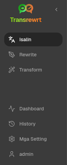
    </td>
    <td valign="top">
      <br/><br/>
      <ul>
        <li><strong>Isalin</strong> ay nagbubukas ng workspace para sa pagsasalin.</li><br/>
        <li><strong>Muling isulat</strong> ay nagbubukas ng workspace para sa pag-rewriting.</li><br/>
        <li><strong>Baguhin</strong> ay nagbubukas ng workspace para sa custom prompt.</li><br/>
        <li><strong>Dashboard</strong> ay nagpapakita ng impormasyon tungkol sa paggamit at gastos.</li><br/>
        <li><strong>Mga Setting</strong> ay nagbubukas ng panel ng mga setting.</li><br/>
        <li><strong>Kasaysayan</strong> ay nagpapakita ng kasaysayan ng paggamit kasama ang input at output na teksto</li><br/>
        <li><strong>User</strong> ay nagpapakita ng username ng naka-log in na user (web lang).</li>
      </ul>
    </td>
  </tr>
</table>

<br/>

<a id="toolbar"></a>
### Toolbar

Kaunti lamang nagbabago ang toolbar depende sa kung saan ka sa loob ng app.

- Sa kaliwa, ipinapakita nito ang pangalan ng kasalukuyang pahina.
- Sa kanan, ipinapakita nito ang **piliin ng preset o modelo** at ang kontrol sa **Wika ng interface**.

Sa **Madali** na mode, ang toolbar ay nagpapakita ng isang **piliin ng preset** na may mga naka-embed na preset na **Libre (OpenRouter)**, **Karaniwan**, **Advanced**, at **Teknikal**. Ang mga lumilitaw na preset ay nakadepende sa napiling **Provider** mo sa [**Mga Setting** > **Mga Pangkalahatang Setting**](#general-settings)—halimbawa, ang **Libre (OpenRouter)** ay lilitaw lamang kapag ang provider ay OpenRouter. Kung ang **Provider** ay **Ollama**, ang toolbar ay naglilista ng mga lokal na modelo na naka-install sa iyong makina imbes na mga preset.

Sa **Advanced** na mode, pinapayagan ka ng **selector ng modelo** na pumili kung aling AI engine ang gagamitin para sa kasalukuyang gawain.

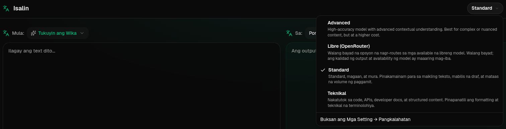

Sa Advanced mode, ang ilang libreng modelo ay maaaring hindi laging magagamit—maaaring offline o umabot na sa limitasyon ng paggamit. Maaaring awtomatikong alisin ng app ang modelo mula sa iyong listahan. Para kontrolin kung aling mga modelo ang lilitaw, pumunta sa [**Mga Setting** > **Mga Modelo**](#models). Maaari mong buksan ang mga setting ng modelo mula sa icon ng provider sa kaliwa ng pangalan ng modelo sa toolbar.

<br/>

Ang **icon + language code** ay nagbabago ng wika ng interface ng app, tulad ng mga menu at mga button. Ito ay **hindi** nagbabago ng mga wika ng pagsasalin na ginagamit sa **Isalin**.

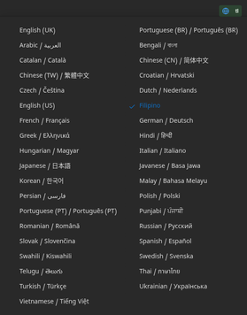

<br/>

<a id="input-and-output-panels"></a>
### Mga panel ng Input at Output

Karamihan sa mga workspace ay gumagamit ng **Input** panel sa kaliwa at **Output** panel sa kanan.

Ang bawat panel ay nagpapakita rin ng:

| **Input**                                                          | **Output**                                                                                                                  |
|--------------------------------------------------------------------|-----------------------------------------------------------------------------------------------------------------------------|
| - Bilang ng karakter <br/>- Bilang ng salita <br/>- Bilang ng talata   <br/> | - Gaano katagal ang gawain<br/>- **TPS** (mga token bawat segundo)<br/>- Bilang ng karakter, salita, at talata<br/>- Ang modelo na ginamit |

Kung nagtatanong ka tungkol sa mga teknikal na termino:

- Ang **token** ay nangangahulugang maliit na bahagi ng teksto. Maaari mo itong iisipin bilang bahagi ng salita o maikling salita.
- Ang **TPS** ay nangangahulugang bilang ng mga bahaging teksto na naproseso ng modelo bawat segundo.

<br/>

Maaari mo ring subaybayan ang gastos ng bawat operasyon (kung magagamit) at ang kabuuang gastos, sa pamamagitan ng pag-enable ng opsyon na `Show cost information on the actions` sa [**Mga Setting** > **Mga Pangkalahatang Setting**](#general-settings).

<br/><br/>

[--------------------------------------------------------------------------------------------------------------------------]: #

<a id="translate"></a>
## Isalin

Gamitin ang **Isalin** kapag nais mong i-convert ang teksto mula sa isang wika patungo sa isa pa.

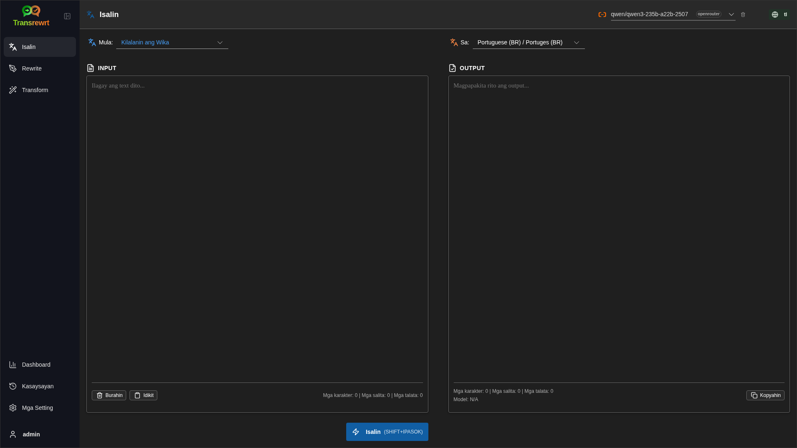

<br/>

<a id="translate-text"></a>
### I-salin ang teksto

1. Buksan ang **Isalin**.
2. Pumili ng wika sa **Mula sa**.
3. Pumili ng wika sa **Patungo sa**.
4. Pumili ng preset (Madali) o modelo (Advanced) sa toolbar.
5. I-type o i-paste ang teksto sa **Input**.
6. I-click ang **Translate**.
7. Basahin ang resulta sa **Output**.
8. Gamitin ang button na kopya kung gusto mong kopyahin ang resulta.
9. Opsyonal na pinuhin ang resulta gamit ang **Mag-rephrase…** o mga alternatibong salita — tingnan ang [Pagpino ng iyong pagsasalin](#refining-translation).

<br/>

<a id="language-selection"></a>
### Pagpili ng wika

- Maaaring tiyak na wika ang **From** o **Detect Language**.
- Ang **To** ay ang wika kung saan gusto mong isalin ang resulta.

Ang iyong napiling **Top languages** ay lilitaw sa tuktok ng listahan. Maaari mong itakda ang mga ito sa [**Settings** > **Languages**](#languages).

<br/>

<a id="helpful-translation-settings"></a>
### Mga kapaki-pakinabang na setting sa pagsasalin

Sa [**Settings** > **General Settings**](#general-settings), maaari mong baguhin kung paano gumagana ang pagsasalin:

- **Awtomatikong-ipatupad kapag nailagay** ay nagpapatakbo ng pagsasalin sa sandaling i-paste mo ang teksto.
- **Awtomatikong-kopyahin ang resulta sa clipboard** ay awtomatikong kinokopya ang resulta pagkatapos ng matagumpay na pagpapatakbo.
- **Pagsasalin sa real-time habang nagta-type** (⚠️ Maaaring tumaas ang mga gastos sa paggamit) ay nagpapatakbo ng mga pagsasalin habang nagta-type ka.
- **Timeout (ms)** ay kumokontrol kung gaano katagal naghihintay ang app bago magpatakbo ng isang pagsasalin sa real-time.
- **Pag-uugali para sa ENTER** ay pumipili kung ang `Enter` ay nagpapatakbo ng gawain o nag-iinsert ng bagong linya:
  - **Enter** ay nagpapatakbo ng pagsasalin o rewrite (default).
  - **Shift + Enter** ay nagpapatakbo ng pagsasalin o rewrite; ang plain **Enter** ay nag-iinsert ng bagong linya.

<br/>

<a id="refining-translation"></a>
### Pagpapahusay ng iyong pagsasalin

Pagkatapos ng matagumpay na pagsasalin, ang **Mag-rephrase…** at ang dropdown ng bersyon ay lumalabas sa header ng output, katabi ng **Sa:** na selector ng wika. Maaari mong pinuhin ang resulta doon:

1. **Rephrase…** — nang walang text na napili sa output, kumuha ng isa pang buong pagsasalin ng parehong input na may ibang pananalita. Natatanggap ng modelo ang bawat bersyon na mayroon ka na upang ang bagong pananalita ay maaaring magkaiba sa lahat ng mga ito. Maaari kang mag-imbak ng hanggang **limang** bersyon at lumipat sa pagitan ng mga ito sa dropdown ng bersyon. Sa napiling text, binubuksan ng **Rephrase…** ang mga alternatibo sa salita malapit sa seleksyon (katulad ng right-click). Kung walang seleksyon, hindi pinagana ang **Rephrase…** kapag naabot mo na ang limang bersyon; sa isang seleksyon, gumagana pa rin ito sa limang bersyon (mga alternatibo sa salita lamang, ina-update ang bersyon 5). Habang tumatakbo ang isang buong rephrase, i-click ang **Huminto sa Pagsasalin** upang kanselahin; bumalik ang output sa bersyon na aktibo nang magsimula ang rephrase.
2. **Mga alternatibo sa salita** — pumili ng isa o higit pang salita o isang maikling parirala sa output (kung bahagi lamang ng isang salita ang pipiliin mo, pinalalawak ng app ang seleksyon sa buong salita), pagkatapos ay mag-right-click o i-click ang **Rephrase…**. Lumilitaw ang isang maikling listahan ng mga alternatibo malapit sa seleksyon; i-click ang isa upang palitan ito. Maaaring palitan ng bawat opsyon ang bahagyang mas malawak na span kaysa sa iyong seleksyon (halimbawa, isang katabing preposisyon o artikulo) upang manatiling gramatikal ang pangungusap. Kung mayroon kang mas kaunti sa limang bersyon, ang na-edit na output ay nai-save bilang isang bagong bersyon; sa limang bersyon, **bersyon 5** lamang ang ina-update. Ang right-click nang walang seleksyon ay pipili ng salita sa ilalim ng cursor (o walang ginagawa kung walang salita doon). Pindutin ang **Esc** o mag-click sa labas ng listahan upang kanselahin nang hindi binabago ang output.
3. **Mga Gastos** — bawat buong **Rephrase…** (walang seleksyon) at bawat kahilingan sa alternatibo sa salita ay gumagamit muli ng modelo at maaaring magdagdag sa gastos sa paggamit (katulad ng isang normal na pagpapatakbo ng pagsasalin).

<br/>

<a id="using-the-glossary"></a>
### Paggamit ng glossary

Ang **glossary** ay isang listahan ng mga pares ng source/target term para sa isang partikular na pares ng wika. Kapag naka-on ang glossary, ipapadala ng Transrewrt ang mga tumutugmang termino sa modelo upang manatiling pare-pareho ang iyong ginustong mga salita sa mga pagsasalin (halimbawa, isang pangalan ng produkto, isang termino ng brand, o isang titulo ng trabaho na dapat laging isalin sa parehong paraan).

Para gamitin ito sa **Translate** page:

1. I-on ang **Glossary** switch sa input panel (sa tabi ng mga switch ng auto-execute at auto-copy).
2. Piliin ang iyong mga wika na **Mula** at **Patungo** at isalin gaya ng dati. Awtomatikong ia-apply ang mga terminong na-save para sa pares ng wikang iyon.
3. Para makuha ang isang bagong pares habang ginagamit, i-click ang **Idagdag sa Glossary** (sa tabi ng **Mula:** language selector). Ang dialog ay pre-filled ng iyong kasalukuyang mga wika kaya kailangan mo lang punan ang **termino sa pinagmulan** at **termino sa target**.
4. Gamitin ang link na **Glossary** sa footer ng output (o ang link na **Pamahalaan ang glossary** sa loob ng dialog) para pumunta sa [**Mga Setting** > **Glossary**](#glossary-settings) at suriin ang lahat ng iyong mga termino.

Magdaragdag, mag-e-edit, mag-i-import, at mag-e-export ka ng mga termino sa [**Mga Setting** > **Glossary**](#glossary-settings) tab — tingnan sa ibaba.

<br/>

> ℹ️ **PAALALA**<br/>
> Ang mga termino sa glossary ay itinutugma ayon sa **pares ng wika**, kaya ang isang terminong na-save para sa English → French ay hindi ia-apply kapag nagsasalin ng English → German. Hindi magagamit ang glossary sa **Tukuyin ang Wika** bilang source, dahil kailangan ang isang partikular na wika ng pinagmulan para maitugma ang mga termino.

[--------------------------------------------------------------------------------------------------------------------------]: #

<a id="rewrite"></a>
## Muling isulat

Gamitin ang **Rewrite** kapag gusto mong pagbutihin ang pananalita nang hindi binabago ang pangunahing kahulugan. Ang text ay nananatili sa parehong wika (hindi ito isinasalin).

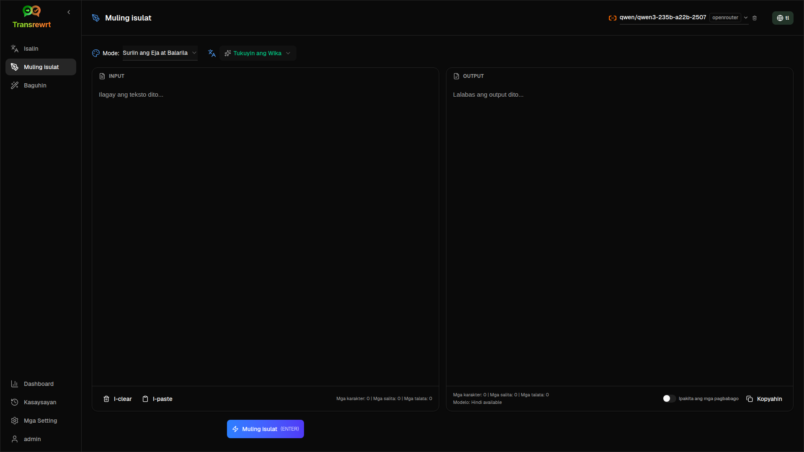

Makakatulong ito sa:

- pagwawasto ng eja at balarila (**Suriin ang Eja at Balarila**)
- pagpapalinaw ng teksto (**Pabutihin ang Linaw**)
- ilang iba't ibang pagbabago sa isang pagkakataon (**Mga alternatibong bersyon**)
- pagpapormal o pagpapaimplormal ng teksto (**Gawing Pormal** / **Gawing Impormal**)
- pagpapaiikli o pagpapalawak ng teksto (**Shorten** / **Expand**)
- pagpaparami ng tono ng teksto na teknikal (**Make Technical**)

<br/>

<a id="rewrite-text"></a>
### Rewrite text

1. Buksan ang **Rewrite**.
2. Pumili ng **Mode** (halimbawa **Improve Clarity** o **Make Formal**).
3. Opsyonal na itakda ang **From** sa wika ng iyong text (o iwanan ang **Detect Language**).
4. Mag-type o mag-paste ng text sa **Input**.
5. I-click ang **Rewrite**.
6. Basahin ang resulta sa **Output**.
7. Opsyonal na pinuhin ang resulta gamit ang **Rephrase…** o mga alternatibo sa salita — tingnan ang [Pagpino ng iyong rewrite](#refining-rewrite).

<br/>

> 💡 **TIP**<br/>
> Kapag ginamit mo ang mode na "**Check Spelling & Grammar**", lumilitaw ang switch na **Show changes** sa output panel (nakalapit sa **Copy**).
> I-on o i-off ito upang ipakita o itago ang mga tiyak na pagkakamali na tinamaan sa iyong teksto.

<br/>

> ℹ️ **TANDAAN**<br/>
> Ang rewrite mode na **Alternative versions** ay nagbabalik ng ilang reformulation sa isang **solong** pagtakbo, na pinaghihiwalay ng `----` sa output. Iba ito sa **Rephrase…**, na bumubuo ng history ng bersyon sa paglipas ng panahon (isang bagong variant bawat pag-click). Tingnan ang [Pagpino ng iyong rewrite](#refining-rewrite).

<br/>

<a id="refining-rewrite"></a>
### Pagpino ng iyong rewrite

Pagkatapos ng matagumpay na rewrite, lumalabas ang **Rephrase…** at ang dropdown ng bersyon sa output side ng workspace (sa split layout, sa tuktok na toolbar sa itaas ng output column, sa tabi ng run metrics; sa stacked layout, sa itaas ng output panel sa tabi ng **From:**). Maaari mong pinuhin ang resulta doon — parehong ideya sa [Pagpino ng iyong translation](#refining-translation), ngunit ang text ay nananatili sa parehong wika at pinapanatili ang kasalukuyang rewrite **Mode**:

1. **Rephrase…** — nang walang text na napili sa output, kumuha ng isa pang buong rewrite ng parehong input na may ibang pananalita, na inilalapat pa rin ang napiling mode (halimbawa mas malinaw, mas maikli, o mas pormal). Natatanggap ng modelo ang bawat bersyon na mayroon ka na upang ang bagong pananalita ay maaaring magkaiba sa lahat ng mga ito. Maaari kang mag-imbak ng hanggang **limang** bersyon at lumipat sa pagitan ng mga ito sa dropdown ng bersyon. Sa napiling text, binubuksan ng **Rephrase…** ang mga alternatibo sa salita malapit sa selection (katulad ng right-click). Kung walang selection, hindi pinagana ang **Rephrase…** kapag naabot mo na ang limang bersyon; sa isang selection, gumagana pa rin ito sa limang bersyon (mga alternatibo sa salita lamang, ina-update ang bersyon 5). Habang tumatakbo ang isang buong rephrase, i-click ang **Stop Rewrite** upang kanselahin; ang output ay bumalik sa bersyon na aktibo nang magsimula ang rephrase.
2. **Mga alternatibo sa salita** — pumili ng isa o higit pang salita o isang maikling parirala sa output (kung pipiliin mo lamang ang bahagi ng isang salita, pinalalawak ng app ang selection sa buong salita), pagkatapos ay mag-right-click o i-click ang **Rephrase…**. Lumalabas ang isang maikling listahan ng mga alternatibo malapit sa selection; i-click ang isa upang palitan ito. Maaaring palitan ng bawat opsyon ang bahagyang mas malawak na span kaysa sa iyong selection upang manatiling gramatikal ang pangungusap. Kung mayroon kang mas kaunti sa limang bersyon, ang na-edit na output ay nai-save bilang isang bagong bersyon; sa limang bersyon, **bersyon 5** lamang ang ina-update. Ang right-click nang walang selection ay pipili ng salita sa ilalim ng cursor (o walang ginagawa kung walang salita doon). Pindutin ang **Esc** o i-click sa labas ng listahan upang kanselahin nang hindi binabago ang output.
3. **Gastos** — ang bawat buong **Rephrase…** (walang selection) at bawat kahilingan ng alternatibo sa salita ay gumagamit muli ng modelo at maaaring magdagdag sa gastos sa paggamit (katulad ng isang normal na rewrite run).

<br/><br/>

[--------------------------------------------------------------------------------------------------------------------------]: #

<a id="transform"></a>
## Baguhin

Gamitin ang **Transform** kapag gusto mong sundin ng AI ang isang pasadyang hanay ng mga tagubilin.

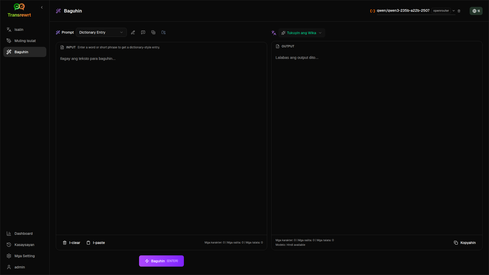

Ito ang pinakamalawak na bahagi ng app. Maaari mo itong gamitin para sa mga gawain tulad ng:

- pagbuod ng mga tala
- pagbabago ng hilaw na teksto sa isang maayos na email
- pagkuha ng mga pangunahing punto
- pagbabago ng teksto sa isang tiyak na format
- anumang iba pang pasadyang gawain sa input na teksto

<br/>

<a id="run-an-existing-prompt"></a>
### Patakbuhin ang umiiral na prompt

1. Buksan ang **Transform**.
2. Pumili ng prompt mula sa listahan ng prompt.
3. Kung may lumitaw na **From** na kahon ng wika, pumili ng wika kung nais mo.
4. I-type o i-paste ang teksto sa **Input**.
5. I-click ang **Baguhin**.
6. Basahin ang resulta sa **Output**.

<br/>

<a id="if-you-have-no-prompts-yet"></a>
### Kung wala ka pang mga prompt

Kung walang laman ang iyong listahan ng prompt, i-click ang **I-load ang mga sample prompt** sa workspace ng Baguhin. Ang parehong kontrol ay laging magagamit sa [**Mga Setting** > **Baguhin**](#transform-settings) sa row ng export/import. Pareho ang nagdadagdag ng mga built-in na halimbawa upang magsimula ka nang mabilis.

<br/>

> ℹ️ **PAUNAWA**<br/>
> Ang mga sample na prompt ay ibinibigay sa Ingles. Matapos i-load ang mga ito, maaari mong i-edit ang isang prompt at gamitin ang **Isalin ang prompt** upang isalin ito sa iyong wika.

<br/>

<a id="create-a-prompt-quickly"></a>
### Mabilisang gumawa ng prompt

Ang pinakamabilis na paraan para gumawa ng prompt ay:

1. I-click ang **Bagong prompt**.
2. I-click ang **Bumuo ng prompt**.
3. Ilarawan kung ano ang gusto mong gawin ng prompt.
4. Pumili ng preset (Madali) o modelo (Advanced).
5. Hayaan ang app na lumikha ng draft para sa iyo.
6. Suriin ang draft at i-click ang **I-save**.

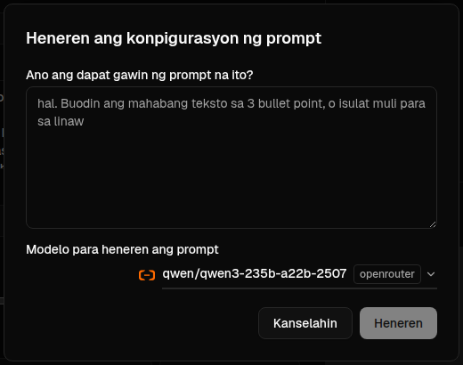

<br/>

<a id="edit-a-prompt"></a>
### I-edit ang isang prompt

Kapag gumawa o nag-edit ka ng prompt, ang editor ay lilitaw sa kaliwa at ang test area ay lilitaw sa kanan.

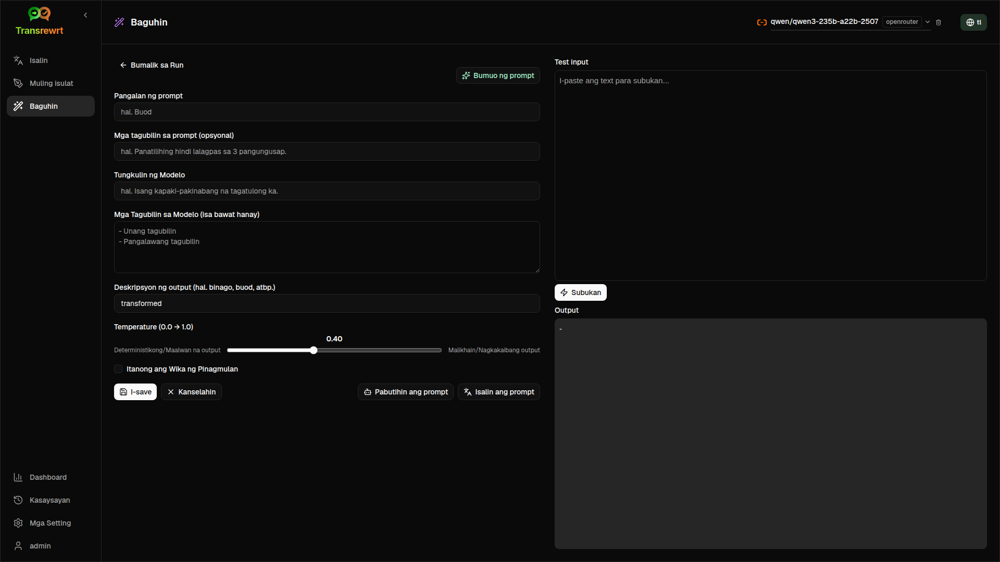

Ang pangunahing mga field ay:

- **Pangalan ng prompt**: ang pangalan na ipinapakita sa listahan ng prompt.
- **Mga tagubilin sa prompt (opsyonal)**: maikling tulong na ipinapakita sa user kapag pinapatakbo ang prompt.
- **Tungkulin ng Modelo**: ang pangkalahatang tungkulin na itinakda sa AI, tulad ng 'Ikaw ay isang mapaglingkod na katulong.'
- **Mga Tagubilin sa Modelo (isa bawat hanay)**: ang tiyak na mga alituntunin na gusto mong sundin ng AI.
- **Paglalarawan ng Output (hal. binago, na-summarize, atbp.)**: isang maikling salita na naglalarawan sa resulta.
- **Temperatura (0.0 → 1.0)**: kung paano mag-uugali ang modelo; tingnan sa ibaba.
- **Humiling ng target na wika**: nagdadagdag ng selector ng wika kapag pinapatakbo ang prompt.
Kung ang teknikal na termino na **Temperatura** ay bago sa iyo, isipin ito na parang ganito:

- Ang **mas mababang** temperature ay nagbibigay ng mas matatag at higit na nakaplanong resulta.
- Ang **mas mataas** na temperature ay nagbibigay ng higit na iba't-iba at malikhain.

Maaari mo ring gamitin:

- `Generate prompt` upang lumikha ng bagong draft mula sa simpleng paglalarawan
- `Improve prompt` upang palinawin ang umiiral na prompt
- `Translate prompt` upang isalin ang mga field ng prompt

<br/>

> ⚠️ **BABAALA**<br/>
> I-click ang `Save` bago i-click ang `Back to Run`. Kung babalik ka nang hindi i-save, mawawala ang iyong mga pagbabago.

<br/>

<a id="test-a-prompt-before-using-it"></a>
### Subukan ang prompt bago gamitin

Ang test panel sa kanan ay nagbibigay-daan upang subukan ang iyong prompt gamit ang sample text bago mo ito gamitin sa pang-araw-araw na gawain.

Makakatulong ito kapag:

- gumagawa ka ng bagong prompt
- inihahambing mo ang dalawang bersyon ng isang prompt
- nais mong suriin ang tono, haba, o format ng output

<br/>

> ℹ️ **PAUNAWA**<br/>
> Maaari mong i-export at i-import ang mga nai-save na prompt sa [**Mga Setting** > **Baguhin**](#transform-settings).

Kapag gumagamit ka ng **Bumuo ng prompt**, **Pabutihin ang prompt**, o **Isalin ang prompt** sa editor ng prompt, ang **Madali** na mode ay nag-aalok ng parehong selector ng preset tulad ng sa Isalin at Muling Isulat; ang **Advanced** na mode ay gumagamit ng listahan ng modelo.

<br/><br/>

[--------------------------------------------------------------------------------------------------------------------------]: #

<a id="dashboard"></a>
## Dashboard

Gamitin ang **Dashboard** upang makita kung gaano karami ang iyong paggamit sa app at kung magkano ang gastos nito (para sa mga bayad na modelo).

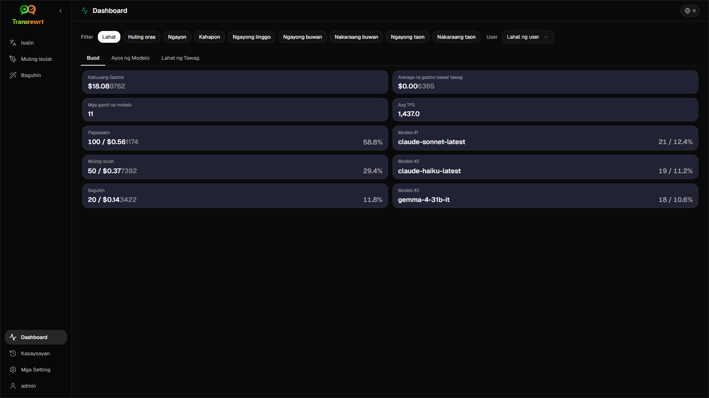

<br/>

> ℹ️ **NOTE**<br/>
> Kung gumagamit ka lamang ng **free** na mga modelo, maaaring zero ang mga halaga ng **cost** at maaaring walang laman ang mga cost-focused KPI. Ipapakita pa rin ng **Summary** tab ang bilang ng mga tawag para sa translate, rewrite, at transform kapag may aktibidad sa napiling panahon.

<br/>

<a id="filter-the-data"></a>
### I-filter ang data

Gamitin ang mga filter button sa itaas upang baguhin ang saklaw ng oras.


<br/>

> ℹ️ **PAUNAWA**<br/>
> Ang filter na **User** ay nakikita lamang ng mga admin sa web na bersyon. Ang mga regular na user ay hindi makakakita ng filter na ito, at hindi ito available sa desktop app.

<br/>

<a id="dashboard-tabs"></a>
### Mga tab ng Dashboard

- Ang **Summary** ay nagpapakita ng mga KPI card: kabuuang gastos, mga gamit na modelo, bilang ng tawag bawat mode at gastos (kasama ang bahagi sa kabuuang mga tawag), average na gastos bawat tawag, average na TPS, at ang top three na mga modelo batay sa bilang ng tawag.
- Ang **By Model** ay naglilista ng bawat modelo kasama ang kabuuang tawag, kabuuang gastos, at average na TPS; palawakin ang isang row para sa detalyadong breakdown ayon sa translate, rewrite, at transform.
- Ang **All Calls** ay nagpapakita ng buong log ng mga tawag (naka-paginate sa malalapad na layout, mga card sa makitid na screen) at nagbibigay-daan upang i-export ito.

<br/>

<a id="export-data"></a>
### I-export ang data

Maaaring i-export ng mga table sa dashboard ang data sa:

- **JSON**
- **CSV**
- **XLSX**

Makakatulong ito kung gusto mong suriin ang aktibidad sa labas ng app o ibahagi ang isang report.

<br/>

<a id="delete-stored-records-for-a-model"></a>
### Tanggalin ang naka-imbak na mga tala para sa isang modelo

Sa **Ayos ng Modelo** o **Lahat ng Tawag**, maaari mong alisin ang naka-imbak na mga tala para sa isang modelo sa pamamagitan ng pag-click sa icon ng "trash bin".

> ⚠️ **WARNING**<br/>
> Ang pagtanggal ng naka-imbak na mga tala ay hindi na maibabalik. Gamitin lamang ito kung sigurado ka na hindi mo na kailangan ang kasaysayang iyon.

Para tanggalin ang lahat ng data o alisin ang mga tala batay sa kanilang edad, pumunta sa [**Mga Setting** > **Pagsusubaybay ng Gastos**](#cost-tracking). Doon makikita mo ang mga opsyon para tanggalin ang lahat ng naka-imbak na data o mga datang mas matanda kaysa sa tiyak na petsa.

<br/><br/>

[--------------------------------------------------------------------------------------------------------------------------]: #

<a id="history"></a>
## Kasaysayan

I-click ang **Kasaysayan** para tingnan ang kasaysayan ng iyong mga aksyon sa loob ng **Transrewrt**, kasama ang input at output ng bawat operasyon.

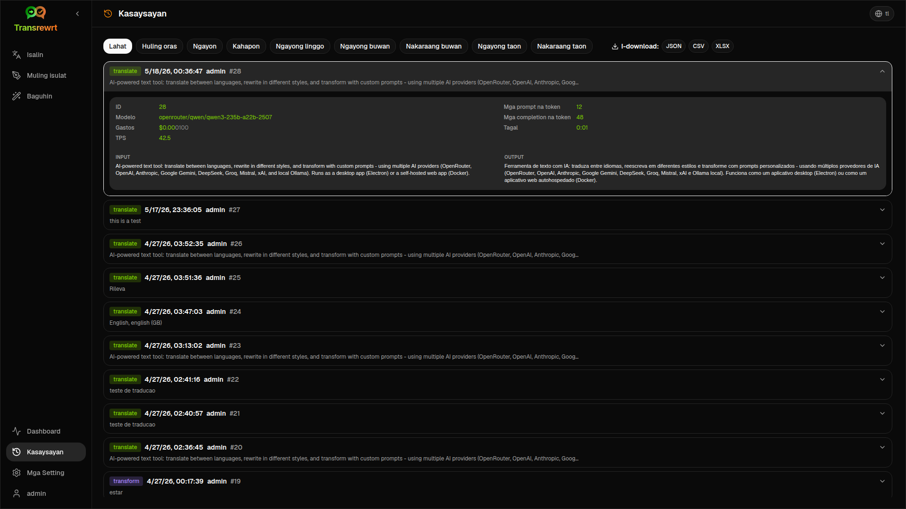

<br/>

<a id="filter-the-history"></a>
### I-filter ang kasaysayan

Ginagamit ng **History** ang parehong mga time-range filter tulad ng **Dashboard** page.


<br/>

> ℹ️ **NOTE**<br/>
> Sa **web app**, ang bawat isa (kabilang ang mga administrator) ay nakakakita lamang ng kanilang sariling execution history. Ang **User** filter sa **Dashboard** ay para sa mga admin upang suriin ang paggamit at gastos sa lahat ng account; hindi ito nalalapat sa **History**.

<br/>

<a id="export-history-data"></a>
### I-export ang data ng kasaysayan

Ang pahina ng kasaysayan ay maaaring i-export ang nafilter na data sa:

- **JSON**
- **CSV**
- **XLSX**

Makakatulong ito kung gusto mong suriin ang aktibidad sa labas ng app o ibahagi ang isang report.

<br/><br/>

[--------------------------------------------------------------------------------------------------------------------------]: #

<a id="settings"></a>
## Mga Setting

Buksan ang **Mga Setting** mula sa sidebar para i-customize kung paano kumikilos ang app.

Ang mga available na tab ay nakadepende sa platform at sa iyong tungkulin:

| Tab              | Desktop | Web (admin) | Web (regular user) | Notes                                        |
  |------------------|:-------:|:-----------:|:------------------:|----------------------------------------------|
  | General Settings |   yes   |     yes     |        yes         | Kasama ang **AI experience** (Easy / Advanced) |
  | Models           |   yes   |     yes     |        yes         | Lamang kapag **AI experience** ay **Advanced** |
  | Languages        |   yes   |     yes     |        yes         |                                              |
  | Cost Tracking    |   yes   |     yes     |         -          |                                              |
  | Transform        |   yes   |     yes     |        yes         | Bulk import/export ng mga prompt sa pagbabago      |
  | Glossary         |   oo   |     oo     |        oo         | Mga pares ng termino na inilapat habang nagsasalin        |
  | Users            |    -    |     yes     |         -          |                                              |
  | API Config       |   yes   |     yes     |         -          |                                              |
  | About            |   yes   |     yes     |        yes         |                                              |

Sa **Madali** na mode, ang pagpili ng modelo ay ginagawa sa pamamagitan ng mga preset sa toolbar at ang **Provider** sa Mga Pangkalahatang Setting; ang tab na **Mga Modelo** ay nakatago.

<br/>

> ℹ️ **PAUNAWA**<br/>
> Sa bersyon ng web, ang bawat user ay may sariling configuration. Ang mga setting tulad ng karanasan sa AI, provider, napiling mga modelo o preset, mga wika, pangkalahatang opsyon, at mga prompt sa pagbabago ay iniimbak bawat user. Ang mga pagbabagong ginawa mo ay hindi nakakaapekto sa ibang mga gumagamit.

<br/>

[--------------------------------------------------------------------------------------------------------------------------]: #

<a id="general-settings"></a>
### Mga Pangkalahatang Setting

Gumamit ng **General Settings** upang kontrolin ang pag-uugali sa pag-type, kung iniimbak ang mga detalye ng pagpapatupad para sa **History**, hitsura, at kung paano mo pipiliin ang AI para sa Translate, Rewrite, at Transform.

**AI experience**

- **Madali** (default): pumili ng **Provider** (OpenRouter, OpenAI, Anthropic, Google Gemini, DeepSeek, Groq, Mistral, xAI, Cerebras, o Ollama). Ang mga cloud provider ay gumagamit ng mga naka-embed na preset sa toolbar. Ang **Ollama** ay naglilista ng mga modelo na naka-install sa iyong makina imbes na mga preset. Sa Madaling mode, ang **Katalogo ng mga preset** ay nagpapakita ng bersyon ng katalogo at oras ng huling pag-update; i-click ang **I-refresh ang katalogo ng mga preset** para i-fetch ang pinakabagong listahan ng preset mula sa repository ng proyekto (ang app ay nagsusuri rin nang pana-panahon sa background).
- **Advanced**: pumili ng mga indibidwal na modelo sa toolbar; pamahalaan ang listahan sa ilalim ng [**Mga Setting** > **Mga Modelo**](#models).

**Hitsura**

- Ang **Tema** ay nagbabago sa pagitan ng maliwanag, madilim, at hitsura ng sistema.
- Ang **Ipakita ang impormasyon ng gastos sa mga aksyon** ay kontrolado ang display ng gastos bawat operasyon (kung magagamit) at ang kabuuang gastos sa mga panel ng output ng Isalin, Muling Isulat, at Baguhin.
- Ang **Cost fraction digits** ay nagbabago kung paano ipinapakita ang mga desimal sa gastos.
- **Web lamang:** Ang **magpakita ng margin sa paligid ng app** ay nagdadagdag ng ekstrang espasyo sa paligid ng interface.
- Ang **Pamilya ng Font** ay nagbabago sa font ng pagsulat sa mga panel ng teksto.
- Ang **Laki** ay nagbabago sa laki ng font.

**Pag-uugali**

- **Pag-uugali para sa ENTER** ay pumipili kung ang `Enter` ay nagpapatakbo ng gawain o nag-iinsert ng bagong linya.
- **Awtomatikong-ipatupad kapag nailagay** ay nagsisimula ng pagsasalin sa sandaling i-paste mo ang teksto.
- **Awtomatikong-kopyahin ang resulta sa clipboard** ay awtomatikong kinokopya ang matagumpay na mga resulta.
- **Pagsasalin sa real-time habang nagta-type** (⚠️ Maaaring tumaas ang mga gastos sa paggamit) ay nagsasalin habang nagta-type ka.
- Ang **Timeout (ms)** ay nagtatakda ng oras ng paghihintay para sa real-time na pagsasalin.

**Kasaysayan**

- **Panatilihin ang kasaysayan ng pagpapatakbo** ay kontrolado kung ang bawat isalin, muling isulat, at baguhin ay nag-iimbak ng **input at tekstong lalabas** para sa tab na [**Kasaysayan**](#history). Ang pag-off nito ay maghihingi ng kumpirmasyon; kung ikaw ay kumpirmado, ang naka-imbak na kasaysayan ng teksto ay tatanggalin sa database. Kung ang label ay nagpapakita ng *hindi pinagana ng tagapangasiwa*, ang iyong pag-install ay may nakatakda na `HISTORY_DISABLED` sa environment (tingnan ang [README](README.tl.md#configuration-and-environment)); hindi mo maaaring i-on muli ang kasaysayan mula sa UI.
- **Tanggalin ang data ng kasaysayan** ay nagbibigay-daan sa iyo na alisin ang naka-imbak na teksto batay sa edad (halimbawa, mas matanda kaysa ilang buwan, o **lahat ng data (linisin)**) gamit ang **Tanggalin ang data**. Ito ay nakakaapekto lamang sa naka-save na teksto ng pagpapatakbo para sa view na **Kasaysayan**; hindi ito **tinatanggal** ang gastos o kabuuang paggamit. Para alisin o bawasan ang data ng **gastos**, gamitin ang [**Mga Setting** > **Pagsusubaybay ng Gastos**](#cost-tracking).

**Backup ng Configuration** (desktop app at web administrators lamang)
- **Isama ang data ng paggamit sa backup** - kapag pinagana, ang ZIP ay naglalaman din ng kasaysayan ng pagpapatakbo at data ng tawag sa API.
- **I-backup ang configuration** - lumilikha ng isang solong ZIP (`transrewrt-config-backup-YYYY-MM-DD_HHMMSS.zip` sa lokal na oras) na may `config.json`, `state.json`, opsyonal na susi ng encryption, mga gumagamit, mga kagustuhan, mga custom na prompt, at data ng paggamit kung ikaw ay pumayag. Pagkatapos ng matagumpay na backup, ang kumpirmasyon ay nagpapakita ng pangalan ng na-save na file.
- **Ibalik mula sa backup** - nagbubukas ng **confirmation dialog first**. Pumili ng backup ZIP sa loob ng dialog (**Browse** / file picker o drag-and-drop kung suportado), pagkatapos ay suriin ang mga opsyon:
  - **I-restore ang data ng paggamit** - i-import ang paggamit/kasaysayan mula sa ZIP kapag ito ay na-backup na may kasamang paggamit; iwanan kung nais mo lamang ang mga setting at prompt.
  - **Burahin ang lumang data ng paggamit bago i-restore** - alisin ang umiiral na paggamit/kasaysayan sa pag-install na ito bago ilapat ang backup (opsyonal; gamitin kapag nais mo ng malinis na kapalit).
Ang mga backup na nilikha sa alinman sa web o desktop na bersyon ay maaaring ma-restore sa iba. Kapag nag-restore ng desktop backup sa web na bersyon, ang data ay maibabalik sa administrator user.

<br/>

<a id="models"></a>
### Mga Modelo

Ang tab na ito ay magagamit lamang kapag ang **Karanasan sa AI** ay nakatakda sa **Advanced** sa [**Mga Pangkalahatang Setting**](#general-settings). Gamitin ang **Mga Setting** > **Mga Modelo** para pumili kung aling mga modelo ang lilitaw sa toolbar.

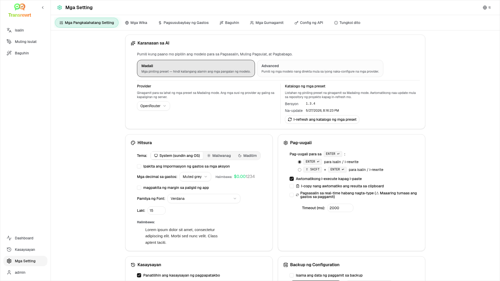

Ang pahina ay may dalawang listahan:

- **Mga Available na Modelo** sa kaliwa
- **Mga Napiling Modelo** sa kanan

Kabilang sa mga kapaki-pakinabang na kontrol:

- **Hanapin ang mga modelo...** upang makita ang modelo batay sa pangalan
- **Provider** chips upang paikliin ang listahan sa isang engine (OpenRouter, OpenAI, Ollama, …)
- **Tanging Libre Lang** upang ipakita lamang ang mga libreng modelo
- **I-refresh** upang i-reload ang listahan
- **Palawakin Lahat** at **I-collapse Lahat** kapag nagso-sort ka ayon sa provider

Ang mga model id ay may kasamang prefix ng provider (halimbawa `openrouter/…` laban sa `openai/…`). Ang mga badge tulad ng **OpenAI (OpenRouter)** laban sa **OpenAI (direkta)** ay nagpapakita kung paano na-reroute ang trapiko.

> ℹ️ **PAUNAWA**<br/>
> Ang **OpenRouter Body Builder** (`openrouter/bodybuilder`) ay isang router model, hindi isang pangkalahatang chat model: ang sagot nito ay JSON na naglalarawan sa OpenRouter API request bodies (halimbawa ay isang `requests` array na may `model` at `messages`). Kung gagamitin mo ito para sa **Isalin**, **Muling isulat**, o **Baguhin**, ang output panel ay magpapakita ng JSON na iyon imbes na tapos na teksto. Pumili ng normal na text model para sa mga gawaing ito. Tingnan ang [pahina ng Body Builder model](https://openrouter.ai/openrouter/bodybuilder) sa OpenRouter.

Mga Aksyon:

- Para idagdag ang isang modelo, i-click ang **Idagdag** o kahit saan sa entry.

- Para alisin ang isang modelo, i-click ang **X** sa tabi nito sa **Mga Napiling Modelo** o **Napili** sa entry sa Mga Available na Modelo.

- Para i-clear ang listahan, i-click ang **Huwag Piliin ang Lahat**. Ang kinakailangang libreng modelo ay mananatili sa listahan.

<br/>

> ℹ️ **PAUNAWA**<br/>
> Kung ayaw mo pang idagdag ang credits sa OpenRouter agad, magsimula sa pamamagitan ng pag-enable ng **Tanging Libre Lang** at pumili ng mga libreng modelo (walang credit card ang kailangan). Maaari mo ring gamitin ang Ollama upang i-run ang mga modelo nang lokal nang walang anumang API key.

<br/>

<a id="languages"></a>
### Mga Wika

Gamitin ang **Mga Setting** > **Mga Wika** upang ayusin ang mga listahan ng wika na ginagamit sa app.

- Ang **Mga Nangungunang wika** ay nakapirmi malapit sa tuktok ng mga listahan ng wika sa **Isalin** at **Baguhin**.
- Ang **Custom na Wika** ay nagbibigay-daan sa iyo na magdagdag ng wika na wala sa built-in na listahan.

Kung magdadagdag ka ng custom na wika, lilitaw ito sa mga selector ng wika kasama ang mga built-in na opsyon.

<br/>

<a id="cost-tracking"></a>
### Pagsusubaybay ng Gastos

Gamitin ang **Mga Setting** > **Pagsusubaybay ng Gastos** upang pamahalaan ang impormasyon ng gastos.

- Ang **Kabuuang Gastos** ay nagpapakita ng kabuuang running total.
- Ang **Kopyahin ang Halaga** ay kinokopya ang kabuuan sa clipboard.
- Ang **I-reset ang Gastos** ay i-reset ang naitagong kabuuan patungo sa zero.
- Ang **Isabay sa paggamit ng API key** ay nagtatakda sa kabuuan upang tugma sa paggamit na na-report ng iyong OpenRouter account (OpenRouter lamang).
- Ang **Paggamit ng API Key** ay nagpapakita ng detalye ng paggamit sa OpenRouter, kung available.
- Ang **Tanggalin ang data ng gastos** ay tinatanggal ang lahat ng data, o mga entry na mas matanda sa napiling petsa lamang.

**Pagsusubaybay ng gastos:** Kapag gumagamit ka ng mga modelo ng OpenRouter, ipinapakita ng app ang iyong aktuwal na paggamit at paggastos batay sa impormasyon ng gastos mula sa OpenRouter. Para sa lahat ng iba pang provider, tinataya ng app ang mga gastos gamit ang mga presyo na inilathala ng OpenRouter; kung hindi available ang presyo, maaaring zero ang tantiya.

<br/>

> ℹ️ **PAUNAWA**<br/>
> **Ang lahat ng mga pigura ng gastos ay mga tantiya lamang para sa iyong sanggunian, hindi opisyal na mga pahayag sa pagbili.**

<br/>

> ⚠️ **BABAALA**<br/>
> Ang pagtanggal ng data ay hindi na maibabalik. Bago tanggalin, siguraduhing i-back up ang iyong data o i-export ito sa pamamagitan ng [**Kasaysayan**](#history)
> o [**Dashboard** > **Lahat ng Tawag**](#dashboard-tabs), kung hindi man ay mawawala ito nang permanente.
> Ang lahat ng kasaysayan ng input/output na nauugnay sa bawat entry ng API call ay matatanggal din.

<br/>

<a id="transform-settings"></a>
### Baguhin (tab ng mga setting)

Gamitin ang **Mga Setting** > **Baguhin** para pamahalaan ang mga prompt nang buo.

Maaari mong:

- suriin ang mga na-save mong prompt
- tanggalin ang mga prompt
- i-import ang mga prompt mula sa isang file
- i-export ang mga prompt para sa backup o pagbabahagi
- i-load ang mga sample prompt sa listahan ng prompt

<br/>

<a id="glossary-settings"></a>
### Glossary (tab ng mga setting)

Gamitin ang **Mga Setting** > **Glossary** upang pamahalaan ang mga pares ng termino na inilalapat sa pagsasalin (tingnan ang [Paggamit ng glossary](#using-the-glossary)). Ang bawat termino ay may **wika ng pinagmulan**, **wika ng target**, **termino sa pinagmulan**, at **termino sa target**.

Maaari mong:

- **Magdagdag ng termino** — punan ang hilera sa ibaba ng talahanayan (piliin ang mga wika, i-type ang mga termino sa pinagmulan at target) at i-click ang **+** na button.
- **Maghanap ng mga termino** — i-filter ang listahan ayon sa **Wika ng Pinagmulan**, **Wika ng Target**, o libreng **teksto**; i-click ang **Alisin ang mga filter** upang i-reset.
- **I-delete ang termino** — i-click ang icon ng trash-bin sa hilera nito.
- **Mag-import** — mag-load ng mga termino mula sa isang `.csv`, `.xlsx`, o `.xls` file. Dapat ay may mga column na `source_language`, `target_language`, `source_text`, at `target_text` ang file.
- **I-export ang CSV** / **I-export ang XLSX** — i-download ang lahat ng iyong mga termino para sa backup o pagbabahagi.
- **Template CSV** / **Template XLSX** — i-download ang isang walang laman na file na may tamang mga header ng column upang punan at i-import.

<br/>

> ℹ️ **TANDAAN**<br/>
> Sa **desktop app**, ang glossary ay naka-imbak nang lokal. Sa **web version**, ang bawat user ay may sariling glossary, kaya ang iyong mga termino ay hindi makakaapekto sa ibang mga user.

<br/>

<a id="users"></a>
### Mga Gumagamit

Gamitin ang **Mga Gumagamit** para pamahalaan ang mga user account sa web na bersyon. Maaari kang magdagdag ng mga user, i-update ang kanilang detalye, i-reset ang password, at tanggalin ang mga account.

<br/>

<a id="api-config"></a>
### Config ng API

Ang mga suportadong provider ay: OpenRouter, OpenAI, Anthropic, Google Gemini, DeepSeek, Groq, Mistral, xAI, Cerebras, NVIDIA, Alibaba Cloud, apikey.fun, **Ollama** (mga lokal na modelo sa pamamagitan ng base URL), at isang opsyonal na **custom OpenAI-compatible provider** (pangalan, URL, at API key — Advanced mode lamang). Kailangan mo lang i-configure ang mga provider na ginagamit mo.

**Web application: administrator lamang**

Ang mga API key ay naka-configure sa pamamagitan ng system o Docker environment variables - hindi ito ipinapasok sa web UI. Para sa custom provider, itakda ang `CUSTOM_PROVIDER_NAME`, `CUSTOM_PROVIDER_URL`, at `CUSTOM_PROVIDER_API_KEY` (lahat ng tatlo ay kinakailangan). Ipinapakita ng pahinang ito kung aling mga provider ang may naka-configure na key at hinahayaan kang subukan ang bawat isa sa pamamagitan ng pag-click sa `Test` button.

<br/>

> ℹ️ **PAUNAWA**<br/>
> Para baguhin ang isang API key, i-update ang environment variable sa iyong system o Docker configuration at i-restart ang server o container.

<br/>

> ℹ️ **PAUNAWA**<br/>
> Ang **Backup ng Configuration** (tingnan ang [**Mga Pangkalahatang Setting** → Backup ng Configuration](#general-settings)) ay maaaring isama ang **nare-resolve** na mga key ng provider sa loob ng `config.json` ng ZIP. Ang pag-re-restore ng ZIP na ito ay **hindi** kinokopya ang mga key na iyon pabalik sa naka-save na config file ng server – ang mga live key ay patuloy na nagmumula sa environment at umiiral na file state gaya ng inilarawan doon.

<br/>

**Desktop application**

Gamitin ang **API Config** upang i-store ang mga API key para sa bawat provider na ginagamit mo. Para sa Ollama, ilagay ang **base URL** sa halip na API key. Para sa isang custom OpenAI-compatible provider (anumang endpoint na wala sa built-in na listahan, tulad ng isang self-hosted server o gateway), ilagay ang **provider name**, **base URL** (tulad ng `https://my-llm.example.com/v1`), at **API key**; lahat ng tatlo ay kinakailangan. Ang URL at pangalan ay ine-edit inline; gamitin ang **Edit** upang palitan ang API key. Ang mga custom provider model ay lumalabas sa **Advanced** mode lamang (Mga Setting → Mga Modelo).

<br/>

> 💡 **Tip** <br/>
> Kung hindi mo gustong gumamit ng API key o magbayad para sa paggamit, maaari mong [i-download ang Ollama](https://ollama.com) at patakbuhin ang mga modelo (tulad ng `translategemma:4b`) nang lokal sa iyong makina nang libre. Bilang alternatibo, maaari kang lumikha ng libreng OpenRouter account (hindi kailangan ng credit card) upang gamitin ang kanilang mga libreng modelo, o makakuha ng libreng API key mula sa Cerebras, Google, Groq, Mistral AI, o [NVIDIA](https://build.nvidia.com/).

<br/>

- Magdagdag lamang ng mga provider na kailangan mo. Sa **Mga Setting** > **Mga Modelo**, ang bawat model id ay nagsisimula sa provider (halimbawa `openrouter/openrouter/free`, `openai/gpt-4o`, `nvidia/nvidia/nemotron-nano-3-30b-a3b`, `ollama/llama3`, `MyProvider/…` para sa isang custom endpoint na pinangalanang `MyProvider`).

Para magdagdag ng API key, ilagay ang halaga sa text field at i-click ang `Save`. Para palitan ang umiiral na key, i-click ang `Edit`. Para i-verify kung gumagana ang key, i-click ang `Test`. Para sa Ollama base URL, i-click palagi ang `Test` upang suriin ang koneksyon.

<br/>

> ℹ️ **PAUNAWA**<br/>
> Hindi mo maaaring makita ang kasalukuyang halaga ng isang API key. Maaari mo lamang itong palitan gamit ang button na `Edit`.
> Ang mga API key ay iniimbak nang naka-encrypt sa configuration.

<br/>

<a id="about"></a>
### Tungkol dito

Ipapakita ng tab na **Tungkol dito**:

- ang pangalan ng app at tagline
- ang numero ng bersyon at petsa ng build
- impormasyon ng lisensya at copyright, na may link para buksan ang **Mga abiso ng third-party**
- isang link sa repository ng proyekto

<br/><br/>

<a id="common-issues"></a>
## Karaniwang isyu

Kung may bagay na hindi gumagana ayon sa inaasahan, suriin muna ang mga sumusunod.

<br/>

<a id="the-app-will-not-translate-rewrite-or-transform-text"></a>
### Hindi nagsasalin, muling isinusulat, o binabago ng app ang teksto

Suriin na:

- napili mo ang isang **preset** (Madali) o **modelo** (Advanced) sa toolbar
- sa **Madali** na mode, ang [**Mga Setting** > **Mga Pangkalahatang Setting**](#general-settings) ay may **Provider** na may gumaganang key (o Ollama URL) at hindi bababa sa isang preset para sa provider na iyon
- sa **Advanced** na mode, nakalista ang hindi bababa sa isang modelo sa [**Mga Setting** > **Mga Modelo**](#models)
- gumagana ang iyong API setup

Kung gumagamit ka ng desktop app:

1. Buksan ang [**Mga Setting** > **Config ng API**](#api-config).
2. Tiyaking may naka-save nang kahit isang API key.
3. I-click ang **Subukan** sa tabi ng provider upang kumpirmahin na gumagana ang key.

<br/>

<a id="the-model-list-is-empty"></a>
### Walang laman ang listahan ng modelo

Sa **Madali** na mode, buksan ang [**Mga Setting** > **Mga Pangkalahatang Setting**](#general-settings), kumpirmahin na nakatakda ang **Provider**, at magdagdag o subukan ang mga key sa [**Config ng API**](#api-config) (desktop) o humingi sa iyong tagapangasiwa (web). Para sa **Ollama**, patakbuhin ang **Subukan** sa base URL at tiyaking naka-install ang mga modelo nang lokal.

Sa **Advanced** na mode, buksan ang [**Mga Setting** > **Mga Modelo**](#models) at i-click ang **I-refresh**. Kung kinakailangan, maghanap ng isang modelo, i-on ang **Tanging Libre Lang**, at idagdag ang mga modelo sa **Mga Napiling Modelo**.

<br/>

<a id="the-result-is-too-slow-or-too-expensive"></a>
### Masyadong mabagal o mahal ang resulta

Subukan ang isa o higit pa sa mga sumusunod:

- pumili ng ibang naka-preset (Madali) o modelo (Abante)
- gumamit ng mas maiikli na input
- i-off ang **Pagsasalin sa real-time habang nagta-type** sa [**Mga Setting** > **Pangkalahatang Mga Setting**](#general-settings)
- gumamit ng mga libreng modelo para sa simpleng mga gawain (tingnan ang [Mga Modelo](#models))
<br/>

<a id="the-interface-is-in-the-wrong-language"></a>
### Hindi tamang wika ang ginagamit sa interface

I-click ang icon ng mundo sa [toolbar](#toolbar) at pumili ng iyong nais na **Wika ng interface**.

<br/>

<a id="the-text-is-too-small-or-hard-to-read"></a>
### Masyadong maliit o mahirap basahin ang teksto

Buksan ang [**Mga Setting** > **Mga Pangkalahatang Setting**](#general-settings) at baguhin ang:

- **Pamilya ng Font**
- **Laki**

<br/>

<a id="dashboard-summary-looks-empty"></a>
### Walang laman ang Dashboard Buod

Ito ay normal kung:

- gumagamit ka lamang ng **mga libreng modelo** at tinitingnan mo ang mga numero ng **gastos** (maaaring zero); ang mga KPI sa bilang ng tawag sa **Buod** ay nangangailangan pa rin ng data mula sa napiling panahon
- ang napiling **filter ng oras** ay hindi sumasakop sa panahon kung kailan isinagawa ang mga tawag — subukang **Lahat** upang suriin

Kung ang mga KPI ay zero pa rin pagkatapos piliin ang **Lahat**, kumpirmahin na lumilitaw ang mga tawag sa [**Kasaysayan**](#history) o sa tab na **Lahat ng Tawag**.

<br/>

<a id="cost-shows-not-available-or-seems-wrong"></a>
### Ang gastos ay nagpapakita ng "hindi magagamit" o tila mali

Kapag gumagamit ka ng mga modelo sa pamamagitan ng **OpenRouter**, ipinapakita ng app ang aktuwal mong gastusin na iniulat ng OpenRouter.

Para sa **mga ibang provider** (OpenAI direkta, Anthropic direkta, atbp.), tinataya ang gastos batay sa datos ng presyo na inilathala ng OpenRouter. Kung walang tugmang presyo na natagpuan para sa isang modelo, ipapakita ito bilang **hindi magagamit** at hindi idaragdag sa kabuuang gastos mo.

<br/>

<a id="total-cost-does-not-match-my-provider-bill"></a>
### Hindi tugma ang kabuuang gastos sa bill ng aking provider

Ang lahat ng pigura ng gastos sa app ay **mga tinatayang halaga para sa reperensya lamang**, hindi opisyal na pahayag ng singil.

Upang mapalapit ang kabuuan sa iyong aktuwal na gastusin sa OpenRouter, buksan ang [**Mga Setting** > **Pagsusubaybay ng Gastos**](#cost-tracking) at i-click ang **Isabay sa paggamit ng API key**.

<br/>

<a id="the-history-page-is-missing-from-the-sidebar"></a>
### Nawawala ang History page sa sidebar

Posibleng naka-off ang **Panatilihin ang kasaysayan ng pagpapatakbo**. Buksan ang [**Mga Setting** > **Mga Pangkalahatang Setting**](#general-settings) at i-enable ito maliban kung ang kasaysayan ay *hindi pinagana ng tagapangasiwa* (nakatakda ang `HISTORY_DISABLED` sa environment — tingnan ang [README](README.tl.md#configuration-and-environment)). Ang pag-on sa kasaysayan ay hindi ibabalik ang dati nang tinanggal na teksto.

<br/>

<a id="web-app-session-expired"></a>
### Web app: biglang na-redirect sa login page

Maaaring natapos na ang session mo. Mag-login muli. Kung madalas itong nangyayari, suriin ang server configuration para sa mga setting ng haba ng session.

<br/>

<a id="web-admin-forgot-or-lost-a-password"></a>
### Web admin: nakalimutan o nawala ang password

Ito ay para sa **web app na self-hosted** (Docker), hindi sa desktop (Electron) app.

- Kung may iba pang administrator na makakapag-sign in, maaari nilang buksan ang [**Mga Setting** > **Mga Gumagamit**](#users), piliin ang account, at itakda ang **bagong password** doon.
- Kung ikaw ay **naka-lock out** ngunit may **shell access** sa machine o container, i-reset ang password gamit ang helper na kasama sa imahe (palitan ang `transrewrt` kung binago mo ang default na pangalan, at i-quote ang password kung may espasyo o espesyal na karakter ito):

```bash
docker exec transrewrt reset-web-password '<username>' '<new-password>'
```

Ang default na admin username ay `admin` kung hindi ka pa naglalikha ng ibang account. Kapag nagbigay ka lamang ng isang argumento, ito ay itinuturing na bagong password para sa `admin`.

Kung tumatakbo ka mula sa **source checkout** imbes na Docker, gamitin ang:

```bash
pnpm run reset-web-password -- <username> <new-password>
```

Ang script ay nag-update sa talaan ng user sa SQLite database (at maaaring lumikha ng `admin` user kung kulang ito). Pagkatapos i-reset, mag-sign in gamit ang bagong password.

<br/>

<a id="dashboard-shows-no-data-for-other-users"></a>
### Walang data ang Dashboard para sa ibang user (web)

Tanging ang mga **administrator** lamang ang makakakita ng data mula sa lahat ng user sa pamamagitan ng **User** na filter. Ang karaniwang user ay nakakakita lamang ng kanilang sariling gawain ayon sa disenyo.

<br/>

<a id="i-changed-a-prompt-and-lost-the-edits"></a>
### Binago ko ang isang prompt at nawala ang mga pag-edit

Kapag nag-e-edit ng prompt, i-click palagi ang **I-save** bago i-click ang **Bumalik sa Run**.

<br/><br/>

<a id="quick-tips"></a>
## Mga mabilis na tip

- Magsimula sa [**Isalin**](#translate) upang matiyak na gumagana ang iyong setup bago ka magpatuloy sa [**Muling isulat**](#rewrite) o [**Baguhin**](#transform).
- Gamitin ang [**Muling isulat**](#rewrite) para sa pang-araw-araw na pagpapabuti ng mga salita.
- Gamitin ang [**Baguhin**](#transform) kapag kailangan mo ng paulit-ulit na workflow para sa isang tiyak na gawain.
- Gamitin ang [**Dashboard**](#dashboard) kung gusto mong bantayan ang paggamit at gastos.
- Gamitin ang [**Kasaysayan**](#history) para suriin ang mga nakaraang operasyon at ang buong input/output na teksto nito.
- I-export ang mga prompt nang regular kung gumagawa ka ng isang library ng prompt na gusto mong mapanatiling ligtas (tingnan ang [Baguhin](#transform)) o kung gusto mong ibahagi ito sa iba.
- Manatili sa **Madali** na mode hanggang sa kailanganin mo ng mas detalyadong kontrol sa mga ID ng modelo; lumipat sa **Advanced** kapag alam mo na kung aling mga modelo ang gusto mo.

<br/><br/>

<a id="disclaimer"></a>
## Paalala

Ang mga pangalan ng produkto at icon ay pagmamay-ari ng kanilang mga respektibong may-ari at ginagamit lamang para sa identification. Ang software na ito ay hindi konektado o iniindorso ng anumang mga banggit na brand.

<br/><br/>

<a id="license"></a>
## Lisensya

Copyright © 2026 Waldemar Scudeller Jr.

[Apache License 2.0](../LICENSE)
