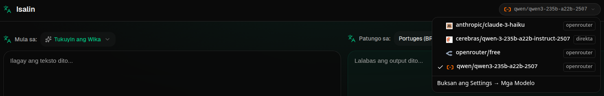

# Gabay para sa Transrewrt

 

## Panimula

Ang Transrewrt ay tumutulong sa iyo sa pagtrabaho sa teksto sa tatlong pangunahing paraan:

- **Isalin** - baguhin ang teksto mula sa isang wika papunta sa iba.
- **Isulat Muli** - baguhin ang anyo o istilo ng teksto, tulad ng mas malinaw, mas maiksi, o mas pormal.
- **Baguhin** - proseso ang teksto gamit ang mga naka-custom na mga utos ng AI na tinatawag na mga prompt.

 

Ang gabay na ito ay nagpapaliwanag kung paano gamitin ang app pagkatapos na ito ay ma-install at na-run. Para sa mga hakbang sa pag-install, tingnan ang pangunahing [README](../README.md).

 

> ℹ️ **PAALALA** 
> Ang Transrewrt ay available bilang desktop app para sa Windows at Linux, at bilang self-hosted web app. Ang gabay na ito ay nakatuon sa pang-araw-araw na paggamit ng app. Kung may bagay na naa申請 lamang sa isang bersyon, malinaw na itinatalaga.

<small>**Basahin sa ibang mga wika:** [English (UK)](../USER-GUIDE.md) · [Português (BR)](USER-GUIDE.pt-BR.md) · [العربية](USER-GUIDE.ar.md) · [বাংলা](USER-GUIDE.bn.md) · [Català](USER-GUIDE.ca.md) · [简体中文](USER-GUIDE.zh-CN.md) · [繁體中文](USER-GUIDE.zh-TW.md) · [Hrvatski](USER-GUIDE.hr.md) · [Čeština](USER-GUIDE.cs.md) · [Nederlands](USER-GUIDE.nl.md) · [English (US)](USER-GUIDE.en-US.md) · [Filipino](USER-GUIDE.tl.md) · [Français](USER-GUIDE.fr.md) · [Deutsch](USER-GUIDE.de.md) · [Ελληνικά](USER-GUIDE.el.md) · [हिन्दी](USER-GUIDE.hi.md) · [Magyar](USER-GUIDE.hu.md) · [Italiano](USER-GUIDE.it.md) · [日本語](USER-GUIDE.ja.md) · [Basa Jawa](USER-GUIDE.jv.md) · [한국어](USER-GUIDE.ko.md) · [Bahasa Melayu](USER-GUIDE.ms.md) · [فارسی](USER-GUIDE.fa.md) · [Polski](USER-GUIDE.pl.md) · [Português (PT)](USER-GUIDE.pt.md) · [ਪੰਜਾਬੀ](USER-GUIDE.pa.md) · [Română](USER-GUIDE.ro.md) · [Русский](USER-GUIDE.ru.md) · [Slovenčina](USER-GUIDE.sk.md) · [Español](USER-GUIDE.es.md) · [Kiswahili](USER-GUIDE.sw.md) · [Svenska](USER-GUIDE.sv.md) · [తెలుగు](USER-GUIDE.te.md) · [ภาษาไทย](USER-GUIDE.th.md) · [Türkçe](USER-GUIDE.tr.md) · [Українська](USER-GUIDE.uk.md) · [Tiếng Việt](USER-GUIDE.vi.md)</small>

 

<!-- START doctoc generated TOC please keep comment here to allow auto update -->
<!-- DON'T EDIT THIS SECTION, INSTEAD RE-RUN doctoc TO UPDATE -->
**Talaan ng Nilalaman** 

- [Bago ka magsimula](#bago-ka-magsimula)
  - [Kung paano makakuha ng API key (desktop app)](#kung-paano-makakuha-ng-api-key-desktop-app)
- [Magsimula](#magsimula)
- [Mga pangunahing bahagi ng window](#mga-pangunahing-bahagi-ng-window)
  - [Sidebar](#sidebar)
  - [Toolbar](#toolbar)
  - [Mga panel ng input at output](#mga-panel-ng-input-at-output)
- [Isalin](#isalin)
  - [Isalin ang teksto](#isalin-ang-teksto)
  - [Pagpili ng wika](#pagpili-ng-wika)
  - [Mga kapaki-pakinabang na setting sa pagsasalin](#mga-kapaki-pakinabang-na-setting-sa-pagsasalin)
  - [Mga shortcut sa keyboard](#mga-shortcut-sa-keyboard)
- [Isulat Muli](#isulat-muli)
  - [Isulat muli ang teksto](#isulat-muli-ang-teksto)
- [Baguhin](#baguhin)
  - [Patakbuhin ang umiiral na prompt](#patakbuhin-ang-umiiral-na-prompt)
  - [Kung wala ka pang mga prompt](#kung-wala-ka-pang-mga-prompt)
  - [Gumawa ng prompt nang mabilis](#gumawa-ng-prompt-nang-mabilis)
  - [Baguhin ang isang prompt](#baguhin-ang-isang-prompt)
  - [Subukan ang isang prompt bago gamitin ito](#subukan-ang-isang-prompt-bago-gamitin-ito)
  - [ Pamahalaan ang mga naka-save na prompt](#pamahalaan-ang-mga-naka-save-na-prompt)
- [Dashboard](#dashboard)
  - [Pilipin ang data](#pilipin-ang-data)
  - [Mga tab sa dashboard](#mga-tab-sa-dashboard)
  - [I-export ang data](#i-export-ang-data)
  - [Burahin ang mga naka-imbak na record para sa isang modelo](#burahin-ang-mga-naka-imbak-na-record-para-sa-isang-modelo)
- [Mga Setting](#mga-setting)
  - [Mga pang-eskwelang setting](#mga-pang-eskwelang-setting)
  - [Mga modelo](#mga-modelo)
  - [Mga wika](#mga-wika)
  - [Pagsusubaybay sa gastos](#pagsusubaybay-sa-gastos)
  - [Mga prompt sa pagbabago](#mga-prompt-sa-pagbabago)
  - [Mga user](#mga-user)
  - [Pagkakonekta sa API](#pagkakonekta-sa-api)
  - [Tungkol sa](#tungkol-sa)
- [Mga karaniwang isyu](#mga-karaniwang-isyu)
  - [Hindi isasalin, isusulat muli, o babaguhin ng app ang teksto](#hindi-isasalin-isusulat-muli-o-babaguhin-ng-app-ang-teksto)
  - [Walang laman ang listahan ng modelo](#walang-laman-ang-listahan-ng-modelo)
  - [Ang resulta ay masyadong mabagal o masyadong mahal](#ang-resulta-ay-masyadong-mabagal-o-masyadong-mahal)
  - [Ang interface ay nasa maling wika](#ang-interface-ay-nasa-maling-wika)
  - [Masyaadong maliit o mahirap basahin ang teksto](#masyaadong-maliit-o-mahirap-basahin-ang-teksto)
  - [Binago ko ang isang prompt at nawala ang mga edit](#binago-ko-ang-isang-prompt-at-nawala-ang-mga-edit)
- [Mga tip](#mga-tip)

<!-- END doctoc generated TOC please keep comment here to allow auto update -->

  

## Bago mo simulan

Upang gumamit ng Transrewrt, kailangan mong ma-access ang AI service sa pamamagitan ng OpenRouter.

Hindi mo kailangang pumili ng modelo na may bayad bago simulan. Ang app ay laging may kasamang built-in na **libre** na modelo, kaya para sa normal na paggamit, sapat na ito upang magsimula sa pagsasalin, pagsusulat muli, at pagbabago ng teksto.

Sa simpleng wika:

- Ang **modelo** ay ang AI engine na gumagawa ng trabaho.
- Ang **API key** ay iyong personal na kredensyal para ma-access ang serbisyong iyon.

Kung ikaw ay gumagamit ng **desktop app**, kailangan mo ng API key. Para sa mga detalye, tingnan ang [Paano makakuha ng API key](#how-to-get-an-api-key-desktop-app) sa ibaba. Sa maikling salita: gumawa ng account sa [OpenRouter](https://openrouter.ai), buksan ang pahina ng [Keys](https://openrouter.ai/keys), gumawa ng bagong key, at i-paste ito sa [**Mga Setting** > **API Config**](#api-config) sa Transrewrt.

Kung ikaw ay gumagamit ng **web version**, ang may-ari ng server ay karaniwang nagse-set up para sa iyo, kaya hindi mo karaniwang kailangang mag-enter ng API key nang personal.

 

### Paano makakuha ng API key (desktop app)

Kung ikaw ay gumagamit ng desktop app, sundin ang mga hakbang na ito:

1. Pumunta sa [OpenRouter](https://openrouter.ai) sa iyong web browser.
2. Gumawa ng account o mag-sign in.
3. Buksan ang pahina ng [Keys](https://openrouter.ai/keys).
4. I-click ang buton upang gumawa ng bagong API key.
5. Bigyan ng pangalan ang key upang ma-alam mo ito mamaya.
6. Kopyahin ang bagong API key.
7. Bumalik sa Transrewrt at buksan ang **Mga Setting** > **API Config**.
8. I-paste ang key sa **OpenRouter API Key**.
9. I-click ang **Test API Configuration** upang siguraduhing gumagana ito.

> ℹ️ **NOTE** 
Maaari mong simulan ang free route ng OpenRouter o ang iba pang mga libre na modelo na available. Sa maraming kaso, sapat na ito upang magsimulang gumamit ng Transrewrt nang hindi pumipili ng modelo na may bayad.

  

## Pagpapatakbo

Kung ito ang iyong unang paggamit ng Transrewrt, sundin ang pagkakasunod-sunod na ito:

1. Buksan ang app.
2. Pumili ng iyong **Wika ng interface** mula sa globe icon kung kinakailangan.
3. Kung ikaw ay nasa **desktop app**, buksan ang [**Mga Setting** > **API Config**](#api-config), i-paste ang iyong OpenRouter API key, at i-click ang **Test API Configuration**.
4. Buksan ang [**Mga Setting** > **Mga Modelo**](#models) at magdagdag ng isa o higit pang modelo sa **Mga Napiling Modelo**.
5. Buksan ang [**Mga Setting** > **Mga Wika**](#languages) at pumili ng iyong **Mga pangunahing wika** kung nais na maging una ang iyong mga karaniwang ginagamit na wika.
6. Pumunta sa **Isalin** at magpatakbo ng simpleng pagsasalin upang siguraduhing gumagana ang lahat.
7. Kapag gumana na iyon, subukan ang **Isulat muli** at kasunod ang **Baguhin**.

Mahalaga ang pagkakasunod-sunod na ito. Ito ay pinaghahadaran ang pinakakaraniwang problema sa unang paggamit: pagsusubok na patakbuhan ang isang gawain bago ang app ay may gumaganang API connection o napiling modelo.

  

## Mga pangunahing bahagi ng window

Ang app ay hinati sa tatlong pangunahing area:

- Ang **sidebar** sa kaliwa.
- Ang **toolbar** sa itaas.
- Ang **work area** sa gitna.

 

### Sidebar

Gamitin ang sidebar upang gumalaw sa app:

 

<table>
  <tr>
    <td valign="top">
       
    </td>
    <td valign="top">
       
      <ul>
        <li><strong>Isalin</strong> ay nagbubukas ng workspace ng pagsasalin.</li>
        <li><strong>Isulat muli</strong> ay nagbubukas ng workspace ng pagsusulat muli.</li>
        <li><strong>Baguhin</strong> ay nagbubukas ng workspace ng custom prompt.</li>
        <li><strong>Dashboard</strong> ay nagpapakita ng impormasyon sa paggamit at gastos.</li>
        <li><strong>Mga Setting</strong> ay nagbubukas ng panel ng mga setting.</li>
        <li><strong>User</strong> ay nagpapakita ng username ng naka-log in na user (web lang).</li>
      </ul>
       
      
Maaari mo ring ma-iba ang sidebar para sa mas maraming espasyo sa pamamagitan ng pag-click ng icon sa tabi ng logo ng app.

    </td>
  </tr>
</table>

 

### Toolbar

Ang toolbar ay nag-iiba nang bahagya depende kung saan ka sa app.

- Sa kaliwa, ito ay nagpapakita ng pangalan ng kasalukuyang pahina.
- Sa kanan, ito ay nagpapakita ng **model selector** at ang kontrol sa **Wika ng interface**.

Ang **model selector** ay nagbibigay-daan sa iyong pumili kung anong AI engine ang gagamitin para sa kasalukuyang gawain.

  

> ℹ️ **NOTE** 
Ang ilang libre na mga modelo ay maaaring huminto sa paggawa nang pansamantala kung hindi sila available o nakareless ng limitasyon sa paggamit. Kung mangyari iyon, ang app ay awtomatikong aalisin ang modelo na iyon mula sa iyong listahan.

Ang **globe icon + language code** ay nagbabago ng wika ng interface ng app, tulad ng mga menu at buton. Ito ay **hindi** nagbabago ng mga wika na ginagamit sa pagsasalin sa **Isalin**.

  

 

### Mga panel ng Panloob at Panlabas

Karamihan sa mga workspace ay gumagamit ng panel na **Panloob** sa kaliwan at panel na **Panlabas** sa kanan.

Ang panel na **Panloob** ay nagpapakita ng:

- Bilang ng mga character
- Bilang ng mga salita
- Bilang ng mga talata

Ang panel na **Panlabas** ay maaaring magpakita ng:

- Gaano katagal ang gawain
- Ang gastos para sa gawain na iyon
- Iyong kabuuang gastos na tumatakbo
- **TPS** (tokens bawat segundo), na isang simpleng sukatan ng bilis
- Bilang ng mga character, salita, at talata
- Ang ginamit na model

Kung nagtataka ka sa mga teknikal na termino:

- **Token** ay nangangahulugang isang maliit na piraso ng teksto. Maaari mong isipin ito bilang isang bahagi ng salita o isang maikling salita.
- **TPS** ay nangangahulugang ilan sa mga pirasong iyon ng teksto ang pinroseso ng modelo bawat segundo.

  

## Isalin

Gumamit ng **Isalin** kapag nais mong i-convert ang teksto mula sa isang wika papunta sa iba.

 

### Pagsasalin ng teksto

1. Buksan ang **Isalin**.
2. Pumili ng wika sa **Mula**.
3. Pumili ng wika sa **Patungo**.
4. Pumili ng modelo sa toolbar.
5. I-type o i-paste ang teksto sa **Panloob**.
6. I-click ang **Isalin**.
7. Basahin ang resulta sa **Panlabas**.
8. Gamitin ang copy button kung nais mong kopyahin ang resulta.

 

### Pagpili ng wika

- **Mula** ay maaaring isang partikular na wika o **Detect Language**.
- **Patungo** ay ang wika na nais mong ilagay ang resulta.

Ang iyong piniling **Mga Nangingibabaw na Wika** ay lilitaw sa itaas ng listahan. Maaari mong itakda ang mga ito sa [**Mga Setting** > **Mga Wika**](#languages).

 

### Mga nakakabulong na setting para sa pagsasalin

Sa [**Mga Setting** > **Mga Pangkalahatang Setting**](#general-settings), maaari mong baguhin ang pagkakasasalin:

- **Auto-isalin sa pag-paste** ay nagpapatakbo ng pagsasalin agad kapag naipaste mo na ang teksto.
- **Auto-kopyahin ang resulta sa clipboard** ay awtomatikong kumokopya ng resulta matapos ang matagumpay na pagpapatakbo.
- **Real-time na pagsasalin (habang nagta-type)** ay nagpapatakbo ng pagsasalin habang nagta-type ka.
- **Timeout (ms)** ay kumokontrol kung gaano katagal hinihintay ng app bago patakbuhin ang real-time na pagsasalin.

 

### Mga shortcut ng keyboard

Sa [**Mga Setting** > **Mga Pangkalahatang Setting**](#general-settings), **Gawi para sa ENTER** ay kumokontrol kung ano ang mangyayari kapag pindot mo ang Enter:

- Ang **Enter** ay maaaring patakbuhin ang gawain at ang **Shift+Enter** ay maaaring magdagdag ng bagong linya.
- O maaaring gawin ng app ang kabaligtaran.

Ang kasalukuyang shortcut ay lilitaw din sa **Isalin** button.

  

## Isulat Muli

Gumamit ng **Isulat Muli** kapag nais mong pagbutihin ang pagbibigay-kahulugan nang hindi binabago ang pangunahing kahulugan.

Ito ay kapaki-pakinabang para sa:

- pag-aayos ng mga spelling at grammar
- pagiging mas malinaw ng teksto
- pagiging mas pormal o mas di-pormal ng teksto
- pagpaliit o pagpapalawak ng teksto
- pagiging mas teknikal ng tunog ng teksto

 

### Pagbabago ng teksto

1. Buksan ang **Isulat Muli**.
2. Pumili ng **Mode**.
3. Pumili ng modelo sa toolbar.
4. I-type o i-paste ang teksto sa **Panloob**.
5. I-click ang **Isulat Muli**.
6. Suriin ang resulta sa **Panlabas**.

Ang parehong gawi ng Enter key na inilalarawan sa [**Isalin**](#keyboard-shortcuts) ayMurang apply din rito.

  

## Baguhin

Gumamit ng **Baguhin** kapag nais mong sundin ng AI ang isang custom na set ng mga tagubilin.

Ito ang pinakamaluwag na bahagi ng app. Maaari mong gamitin ito para sa mga gawain gaya ng:

- pagsasaysay ng mga tala
- pagpapadali ng magaspang na teksto sa isang polished na email
- pagkuha ng mga susunod na punto
- pag-convert ng teksto sa isang tiyak na format

 

### Patakbuhin ang umiiral na prompt

1. Buksan ang **Baguhin**.
2. Pumili ng prompt mula sa listahan ng mga prompt.
3. Kung lilitaw ang isang **Target** na kahon ng wika, pumili ng wika kung gusto mo.
4. I-type o i-paste ang teksto sa **Panloob**.
5. I-click ang **Baguhin**.
6. Basahin ang resulta sa **Panlabas**.

 

### Kung wala ka pang mga prompt

Kung ang iyong listahan ng mga prompt ay walang laman, i-click ang **Mag-load ng mga halimbawang prompt**. Idinaragdag nito ang mga built-in na halimbawa upang maumpisahan kang mabilis.

> ℹ️ **PALIWANAG** 
> Ang mga halimbawang prompt ay ibinibigay sa Ingles. Matapos i-load ang mga ito, maaari mong baguhin ang isang prompt at gamitin ang **Isalin ang prompt** kung nais mong i-adapt ang teksto ng prompt para sa ibang wika.

 

### Gumawa ng prompt nang mabilis

Pinakamabilis na paraan para gumawa ng prompt:

1. I-click ang **New prompt**.
2. I-click ang **Generate prompt**.
3. Ilarawan kung ano ang nais gawin ng prompt.
4. Pumili ng modelo.
5. Pahintulutan ang app na gumawa ng draft para sa iyo.
6. Suriin ang draft at i-click ang **Save**.

 

### Mag-edit ng prompt

Kapag gumagawa o nag-e-edit ka ng prompt, lilitaw ang editor sa kaliwa at ang lugar ng pagsusuri sa kanan.

Ang mga pangunahing mga field ay:

- **Prompt name**: ang pangalan na ipinapakita sa listahan ng prompt.
- **Prompt instructions (optional)**: maikling hint na ipinapakita sa user kapag pinatatakbo ang prompt.
- **Model Role**: ang kabuuang tungkulin na ina-assign sa AI, tulad ng 'You are a helpful assistant.'
- **Model Instructions (one per line)**: ang mga tiyak na alituntunin na nais ipatupad ng AI.
- **Output description**: maikling salitang naglalarawan ng resulta, tulad ng 'summary' o 'rewrite'.
- **Temperature (0.0 → 1.0)**: slider ng pagkamalikhain.
- **Ask for target language**: nagdadagdag ng selector ng target na wika kapag pinatatakbo ang prompt.

Kung ang natitira na teknikal na term na **Temperature** ay bago sa iyo, isipin ito ganito:

- Ang **mababang** temperatura ay nagbibigay ng mas matatag, mas predictable na mga resulta.
- Ang **mataas** temperatura ay nagbibigay ng mas maraming uri at pagkamalikhain.

Maaari mo ding gamitin ang:

- **`Generate prompt`** para gumawa ng bagong draft mula sa simpleng paglalarawan
- **`Improve prompt`** para ayusin ang umiiral na prompt
- **`Translate prompt`** para isalin ang mga field ng prompt

> ⚠️ **WARNING** 
> I-click ang **`Save`** bago i-click ang **`Back to Run`**. Kapag bumalik nang hindi sinasave, mawawala ang iyong mga pagbabago.

 

### Subukan ang prompt bago gamitin ito

Ang panel ng pagsusuri sa kanan ay nagbibigay-daan para subukan ang iyong prompt gamit ang sample na teksto bago gamitin ito sa pang-araw-araw na gawain.

Ito kapaki-pakinabang kapag:

- gumagawa ka ng bagong prompt
- inihahambing mo ang dalawang bersyon ng prompt
- nais mong suriin ang tono, haba, o format ng output

 

### Pangasiwaan ang mga naka-save na prompt

Upang pamahalaan ang mga naka-save na prompt sa isang lugar, buksan ang [**Settings** > **Transform Prompts**](#transform-prompts).

Doon, maaari mong:

- ilista at burahin ang iyong mga prompt
- i-export ang mga prompt bilang **JSON**, **CSV**, o **XLSX**
- i-import ang mga prompt mula sa file

  

## Dashboard

Gamitin ang **Dashboard** upang makita kung gaano ka kadalas gumagamit ng app at magkano ang air babayaran.

 

### I-filter ang data

Gamitin ang mga pindot ng filter sa itaas para baguhin ang saklaw ng panahon.

> ℹ️ **NOTE** 
> Sa bersyong web, maaaring makita rin ng mga administrator ang pilter na **User**. Nagbibigay-daan ito sa kanila na lumipat sa pagitan ng **All users** at indibidwal na user.

 

### Mga tab sa Dashboard

- Ang **Summary** ay nagbibigay-daan sa iyo ng pangkalahatang tanawin ng paggamit at gastusin.
- Ang **By Usage** ay naghahati sa aktibidad batay sa wika ng pagsasalin, mode ng pagbuo, at transform prompt.
- Ang **By Model** ay nagpapakita kung anong mga modelo ang iyong ginamit at magkano ang gastos sa mga ito.
- Ang **By Day** ay nagpapakita ng mga kabuuang bawat araw.
- Ang **All Calls** ay nagpapakita ng buong kasaysayan ng tawag at nagpapahintulot sa iyo na i-export ito.

 

### I-export ang data

Ang mga table sa dashboard ay maaaring mag-export ng data sa:

- **JSON**
- **CSV**
- **XLSX**

Ito kapaki-pakinabang kung nais mong suriin ang aktibidad sa labas ng app o ibahagi ang ulat.

 

### Burahin ang mga naka-imbak na record para sa isang modelo

Sa **By Model** o **All Calls**, maaari mong tanggalin ang mga naka-imbak na record para sa isang modelo.

> ⚠️ **WARNING** 
> Ang pagbura ng mga naka-imbak na record ay hindi na maaaring bawiin. Gamitin lang ito kung sigurado ka na hindi mo na kailangan ang kasaysayang iyon.

Upang burahin ang lahat ng data o tanggalin ang mga record batay sa kanilang edad, pumunta sa [**Settings** > **Cost Tracking**](#cost-tracking). Doon makakakita ka ng mga opsyon para burahin ang lahat ng naka-imbak na data o ang data lamang na mas matanda sa tiyak na petsa.

  

## Mga Setting

Buksan ang **Settings** mula sa sidebar upang baguhin ang pagkakasunod-sunod ng aplikasyon.

Ang mga available na tab ay maaaring mag-iba:

- Ang **API Config** ay available lamang sa desktop app.
- Ang **Users** ay available lamang sa web app, at para lamang sa mga administrator.

 

### Mga Pangkalahatang Setting

Gamitin ang **General Settings** upang kontrolin ang pagtpype at hitsura.

**Paggalaw**

- **Behavior for ENTER** ay pipiliin kung ang Enter ay gagana ang gawain o mag-iinsert ng bagong linya.
- **Auto-translate on paste** ay magsisimulang mag-isalin agad kapag na-paste mo ang text.
- **Auto-copy result to clipboard** ay awtomatikong kukopya ang matagumpay na resulta.
- **Real-time translation (while typing)** ay mag-iisalin habang nagta-type ka.
- **Timeout (ms)** ay nagsasaad ng habang-bait na paghihintay para sa real-time na pagsasalin.

**Hitsura**

- **Cost fraction digits** ay binabago kung paano ipinapakita ang mga decimal ng gastos.
- **Font Family** ay binabago ang font sa mga text panel.
- **Size** ay binabago ang laki ng font.
- **Web only:** **show a margin around the app** ay nagdadagdag ng extra space sa paligid ng interface.

 

### Mga Modelo

Gamitin ang **Settings** > **Models** upang pumili kung anong mga modelo ang lilitaw sa toolbar.

May dalawang lista ang pahina:

- **Available Models** sa kaliwa
- **Selected Models** sa kanan

Mga kapaki-pakinabang na kontrol:

- **Search models...** upang hanapin ang modelo ayon sa pangalan
- **Free Only** upang ipakita lang ang mga libreng modelo
- **Refresh** upang i-reload ang lista
- **Expand All** at **Collapse All** kapag nagso-sort ka ayon sa provider

Upang magdagdag ng modelo, i-click ang **Add**.

Upang tanggalin ang modelo, i-click ang **X** sa tabi nito sa **Selected Models**.

Upang linisin ang lista, i-click ang **Deselect all**. Ang kinakailangang libreng modelo ay mananatili sa lista.

> ℹ️ **NOTE** 
> Kung ayaw mong magdagdag ng credits sa OpenRouter agad, simulan sa pag-enable ng **Free Only** at pumili ng mga libreng modelo.

 

### Mga Wika

Gamitin ang **Settings** > **Languages** upang ayusin ang mga lista ng wika na ginagamit sa app.

- **Top languages** ay naka-pin malapit sa itaas ng mga lista ng wika sa **Translate** at **Transform**.
- **Custom language** ay nagbibigay-daan sa iyo na magdagdag ng wika na wala sa built-in na lista.

Kung nagdadagdag ka ng custom na wika, ito ay lilitaw sa mga selector ng wika kasama ang mga built-in na opsyon.

 

### Cost tracking

Gamitin ang **Settings** > **Cost Tracking** upang pamahalaan ang impormasyon ng gastos.

- **Total Cost** ay nagpapakita ng patuloy na kabuuang halaga.
- **Copy Value** ay naggigowa ng kabuuang halaga sa clipboard.
- **Reset Cost** ay nagri-reset ng naka-imbak na kabuuang halaga sa zero.
- **Sync with API key usage** ay nagse-set ng kabuuang halaga na tumutugma sa ginamit na ulat ni OpenRouter.
- **API Key Usage** ay nagpapakita ng mga detalye ng paggamit, kungavailable.
- **Delete cost data** ay nagtatanggal ng lahat ng data, o lamang mga entry na mas lumang sa napiling petsa.

> ⚠️ **WARNING** 
> Ang pagbura ng data ay hindi naibabalik. Bago burahin, siguraduhing mag-back up ng iyong data o i-export ito sa pamamagitan ng [**Dashboard** > **All Calls**](#dashboard-tabs), kung hindi ito mawawala nang permanentlye.

 

### Mga Prompt sa Pagbabago

Gamitin ang **Settings** > **Transform Prompts** upang pamahalaan ang mga prompt nang marami.

Maaari kang:

- suriin ang iyong mga nai-save na prompt
- burahin ang mga prompt
- i-import ang mga prompt mula sa file
- i-export ang mga prompt para sa backup o pagbabahagi

 

### Mga User

**Web only - administrator only**

Gamitin ang **Users** upang pamahalaan ang mga account ng user sa web version. Maaari kang magdagdag ng mga user, mag-update ng kanilang detalye, mag-reset ng mga password, at magbura ng mga account.

 

### API config

**Desktop only**

Gamitin ang **API Config** upang ikonekta ang desktop app sa OpenRouter o sa Transrewrt proxy.

- **OpenRouter API Key** ay kung saan i-paste ang iyong key.
- **API URL** ay ang address ng serbisyo. Iwan ito sa default maliban kung iba ang ibinigay sa iyo.
- **Use Transrewrt Proxy** ay nagro-route ng mga hiling sa pamamagitan ng proxy service sa halip na direkta sa OpenRouter.
- **Key Seed** ay lilitaw kapag ang proxy na opsyon ay enabled.
- **Test API Configuration** ay nagsusuri kung gumagana ang kasalukuyang setup.

Para sa mga detalye na hakbang sa pagkuha ng iyong API key, tingnan ang [Paano makuha ang API key](#how-to-get-an-api-key-desktop-app) sa itaas.

> ℹ️ **NOTE** 
> Kung hindi ka sigurado kung ano ang ibig sabihin ng **API URL**, **Use Transrewrt Proxy**, o **Key Seed**, iwan itong hindi nababago at gumamit ng default na OpenRouter setup. May karagdagang impormasyon tungkol sa proxy na available sa [Transrewrt Proxy repository](https://github.com/wsj-br/transrewrt-proxy).

 

### Tungkol

Ang tab na **Tungkol** ay nagpapakita ng:

- pangalan ng app
- numero ng bersyon
- petsa ng build
- link sa repositoryo ng proyekto

  

## Mga Karaniwang Isyu

Kung may hindi gumagana nang inaasahan, suriin muna ang mga sumusunod na punto.

 

### Hindi makakapag-translate, makakapag-rewrite, o makakapag-transorma ang app ng teksto

Siguraduhing:

- nakapili ka ng modelo sa toolbar
- mayroong hindi bababa sa isang modelo na nakalista sa [**Mga Setting** > **Mga Modelo**](#models)
- gumagana ang iyong API setup

Kung gumagamit ka ng desktop app:

1. Buksan ang [**Mga Setting** > **API Config**](#api-config).
2. Siguraduhing na-save ang iyong API key.
3. I-click ang **Subukan ang API Configuration**.

 

### Walang laman ang listahan ng mga modelo

Buksan ang [**Mga Setting** > **Mga Modelo**](#models) at i-click ang **Refresh**.

Kung kailangan:

- maghanap ng modelo
- patayin ang **Free Only**
- magdagdag ng isa o higit pang mga modelo sa **Mga Napiling Modelo**

 

### Ang resulta ay masyadong mabagal o masyadong mahal

Subukan ang isa o higit sa mga sumusunod:

- pumili ng ibang modelo
- gumamit ng mas maikling input
- patayin ang **Real-time translation (while typing)** sa [**Mga Setting** > **Mga General na Setting**](#general-settings)
- gumamit ng mga libreng modelo para sa mga simpleng gawain (tingnan ang [Mga Modelo](#models))

 

### Ang interface ay sa maling wika

I-click ang globe icon sa [toolbar](#toolbar) at piliin ang iyong nais na **Wika ng Interface**.

 

### Ang teksto ay masyadong maliit o mahirap basahin

Buksan ang [**Mga Setting** > **Mga General na Setting**](#general-settings) at baguhin ang:

- **Pamilya ng Font**
- **Laki**

 

### Binago ko ang prompt at nawala ang mga pagbabago

Kapag nag-eedit ng prompt, laging i-click ang **Save** bago i-click ang **Balik sa Pagpapatakbo**.

  

## Mga Mabilis na Tip

- Magsimula sa [**Translate**](#translate) upang siguraduhing gumagana ang iyong setup bago lumipat sa [**Rewrite**](#rewrite) o [**Transform**](#transform).
- Gumamit ng [**Rewrite**](#rewrite) para sa pang-araw-araw na pagpapabuti ng pagkakasulat.
- Gumamit ng [**Transform**](#transform) kapag kailangan ng isang uulitin na workflow para sa isang partikular na gawain.
- Gumamit ng [**Dashboard**](#dashboard) kung nais mong subaybayan ang paggamit at gastos.
- I-export ang mga prompt nang regular kung nagbuo ka ng librarya ng prompt na nais mong panatilihing ligtas (tingnan ang [Mga Prompt para sa Transform](#transform-prompts)).

  

## Disclaimer

Ang mga pangalan ng produkto at mga icon ay pag-aari ng mga katangi-tanging may-ari at ginagamit lamang para sa layuning pag-identify. Ang software na ito ay hindi konektado o kinukundena ng alinman sa mga nabanggit na brand.

  

## Lisensya

Copyright © 2026 Waldemar Scudeller Jr.

[Apache License 2.0](LICENSE)