<a id="transrewrt-user-guide"></a>
# Kullanıcı Kılavuzu

<br/>

<a id="introduction"></a>
## Giriş

Transrewrt, metinle çalışmanıza üç ana yoldan yardımcı olur:

- Çevir** - metni bir dilden başka bir dile dönüştürün.
- **Yeniden yaz** - metni daha açık, daha kısa veya daha resmî gibi farklı bir stilde yeniden ifade edin.
- **Dönüştür** - metni, istemler olarak adlandırılan özel yapay zekâ talimatlarını kullanarak işleyin.

<br/>

Bu kılavuz, uygulama yüklendikten ve çalıştırıldıktan sonra nasıl kullanılacağını açıklar. Kurulum adımları için ana [**README**](README.tr.md) sayfasına bakın.

<br/>

> ℹ️ **NOT**<br/>
> Transrewrt, Windows ve Linux için masaüstü uygulaması olarak ve kendin barındırılan bir web uygulaması olarak mevcuttur. Bu kılavuz, uygulamanın günlük kullanımına odaklanır. Bir şey yalnızca bir sürüme uygulanıyorsa, bunun açıkça belirtilir.

<small>**Diğer dillerde oku:** </small>
<small id="lang-list">[English (GB)](../USER-GUIDE.md) · [Português (Brasil)](./USER-GUIDE.pt-BR.md) · [العربية](./USER-GUIDE.ar.md) · [বাংলা](./USER-GUIDE.bn.md) · [Català](./USER-GUIDE.ca.md) · [中文 (中国大陆)](./USER-GUIDE.zh-CN.md) · [中文 (台灣)](./USER-GUIDE.zh-TW.md) · [Hrvatski](./USER-GUIDE.hr.md) · [Čeština](./USER-GUIDE.cs.md) · [Nederlands](./USER-GUIDE.nl.md) · [English (US)](./USER-GUIDE.en-US.md) · [Tagalog](./USER-GUIDE.tl.md) · [Français](./USER-GUIDE.fr.md) · [Deutsch](./USER-GUIDE.de.md) · [Ελληνικά](./USER-GUIDE.el.md) · [हिन्दी](./USER-GUIDE.hi.md) · [Magyar](./USER-GUIDE.hu.md) · [Italiano](./USER-GUIDE.it.md) · [日本語](./USER-GUIDE.ja.md) · [한국어](./USER-GUIDE.ko.md) · [Bahasa Melayu](./USER-GUIDE.ms.md) · [فارسی](./USER-GUIDE.fa.md) · [Polski](./USER-GUIDE.pl.md) · [Basa Jawa](./USER-GUIDE.jv.md) · [Português](./USER-GUIDE.pt.md) · [ਪੰਜਾਬੀ](./USER-GUIDE.pa.md) · [Română](./USER-GUIDE.ro.md) · [Русский](./USER-GUIDE.ru.md) · [Slovenčina](./USER-GUIDE.sk.md) · [Español](./USER-GUIDE.es.md) · [Kiswahili](./USER-GUIDE.sw.md) · [Svenska](./USER-GUIDE.sv.md) · [తెలుగు](./USER-GUIDE.te.md) · [ไทย](./USER-GUIDE.th.md) · [Türkçe](./USER-GUIDE.tr.md) · [Українська](./USER-GUIDE.uk.md) · [Tiếng Việt](./USER-GUIDE.vi.md)</small>

<small>

> **Kullanıcı arayüzü ve belgelerin çevirileri hakkında not:** İngilizce (UK) orijinali hariç tüm arayüz dilleri 
> yapay zekâ modelleri kullanılarak çevrildi; ifade tarzı eksik olabilir veya hatalar içerebilir.

</small>

<br/>

<!-- START doctoc generated TOC please keep comment here to allow auto update -->
<!-- DON'T EDIT THIS SECTION, INSTEAD RE-RUN doctoc TO UPDATE -->
**İçindekiler Tablosu**

- [Başlamadan önce](#before-you-start)
  - [Ücretsiz OpenRouter API anahtarı nasıl alınır (masaüstü uygulaması)](#how-to-get-a-free-openrouter-api-key-desktop-app)
- [Başlarken](#getting-started)
- [Pencerenin ana bölümleri](#main-parts-of-the-window)
  - [Kenar çubuğu](#sidebar)
  - [Araç çubuğu](#toolbar)
  - [Girdi ve çıktı panelleri](#input-and-output-panels)
- [Çevir](#translate)
  - [Metni çevir](#translate-text)
  - [Dil seçimi](#language-selection)
  - [Yararlı çeviri ayarları](#helpful-translation-settings)
- [Yeniden yaz](#rewrite)
- [Dönüştür](#transform)
  - [Var olan bir istemi çalıştır](#run-an-existing-prompt)
  - [Henüz isteminiz yoksa](#if-you-have-no-prompts-yet)
  - [Hızlıca bir istem oluştur](#create-a-prompt-quickly)
  - [Bir istemi düzenle](#edit-a-prompt)
  - [Kullanmadan önce bir istemi test et](#test-a-prompt-before-using-it)
- [Kontrol Paneli](#dashboard)
  - [Verileri filtrele](#filter-the-data)
  - [Kontrol Paneli sekmeleri](#dashboard-tabs)
  - [Verileri dışa aktar](#export-data)
  - [Bir model için saklanan kayıtları sil](#delete-stored-records-for-a-model)
- [Geçmiş](#history)
  - [Geçmişi filtrele](#filter-the-history)
  - [Geçmiş verilerini dışa aktar](#export-history-data)
- [Ayarlar](#settings)
  - [Genel ayarlar](#general-settings)
  - [Modeller](#models)
  - [Diller](#languages)
  - [Maliyet takibi](#cost-tracking)
  - [İstemleri Dönüştür](#transform-prompts)
  - [Kullanıcılar](#users)
  - [API yapılandırması](#api-config)
  - [Hakkında](#about)
- [Sık karşılaşılan sorunlar](#common-issues)
  - [Uygulama metni çevirmiyor, yeniden yazmıyor veya dönüştürmüyor](#the-app-will-not-translate-rewrite-or-transform-text)
  - [Model listesi boş](#the-model-list-is-empty)
  - [Sonuç çok yavaş veya çok maliyetli](#the-result-is-too-slow-or-too-expensive)
  - [Arayüz yanlış dilde](#the-interface-is-in-the-wrong-language)
  - [Metin çok küçük veya okunması zor](#the-text-is-too-small-or-hard-to-read)
  - [Kontrol Paneli grafikleri boş](#dashboard-charts-are-empty)
  - [Maliyet "mevcut değil" gösteriyor veya yanlış görünüyor](#cost-shows-not-available-or-seems-wrong)
  - [Toplam maliyet sağlayıcımın faturasıyla eşleşmiyor](#total-cost-does-not-match-my-provider-bill)
  - [Geçmiş sayfası kenar çubuğunda eksik](#the-history-page-is-missing-from-the-sidebar)
  - [Web uygulaması: beklenmedik şekilde oturum açma sayfasına yönlendiriliyorsunuz](#web-app-redirected-to-the-login-page-unexpectedly)
  - [Web yönetici: şifreyi unuttum veya kaybettim](#web-admin-forgot-or-lost-a-password)
  - [Kontrol Paneli diğer kullanıcılar için veri göstermiyor (web)](#dashboard-shows-no-data-for-other-users-web)
  - [Bir istemi değiştirdim ve düzenlemeleri kaybettim](#i-changed-a-prompt-and-lost-the-edits)
- [Hızlı ipuçları](#quick-tips)
- [Sorumluluk reddi](#disclaimer)
- [Lisans](#license)

<!-- END doctoc generated TOC please keep comment here to allow auto update -->

<br/><br/>

<a id="before-you-start"></a>
## Başlamadan önce

Transrewrt'ı kullanmak için en az bir yapay zeka sağlayıcısına erişim sahibi olmanız gerekir. Desteklenen sağlayıcılar şunlardır: [OpenRouter](https://openrouter.ai) (birçok modeli bir araya getirir), OpenAI, Anthropic, Google Gemini, DeepSeek, Groq, Mistral, xAI, Cerebras ve yerel modeller için [Ollama](https://ollama.com).

Başlarken ücretli bir model seçmeniz gerekmez. OpenRouter API anahtarınızı eklediğiniz anda uygulama yerleşik bir **ücretsiz** OpenRouter seçeneğini otomatik olarak etkinleştirir. Bu sayede hemen çeviri yapmaya, metinleri yeniden yazmaya ve dönüştürmeye başlayabilirsiniz. Alternatif olarak Cerebras, Google, Groq veya Mistral AI'dan ücretsiz bir API anahtarı da alabilirsiniz.

Basitçe:

- Bir **model**, işi yapan yapay zeka altyapısıdır. Modeller bir **sağlayıcı öneki** ile birlikte listelenir (örneğin `openrouter/…`, `openai/…`, `ollama/…`).
- Bir **API anahtarı** (veya Ollama için bir **temel URL**), uygulamanın bu sağlayıcıya ulaşmasını sağlar.

**Masaüstü uygulamasını** kullanıyorsanız, kullandığınız her sağlayıcı için [**Ayarlar** > **API Yapılandırması**](#api-config) kısmına anahtar ekleyin. Sadece OpenRouter kullanacaksanız aşağıda [Bir API anahtarı nasıl alınır?](#how-to-get-an-api-key-desktop-app) bölümüne bakın. API anahtarı kullanmak istemiyorsanız, [ollama.com](https://ollama.com) adresinden Ollama'yı yükleyebilir ve `translategemma:4b` gibi yerel modeller kullanabilirsiniz.

**Web sürümünü** kullanıyorsanız, sunucu sahibi sağlayıcıları ortam değişkenleri ile yapılandırır. Bu yüzden uygulamada doğrudan API anahtarları giremezsiniz.

<br/>

<a id="how-to-get-an-api-key-desktop-app"></a>
### Ücretsiz OpenRouter API anahtarı nasıl alınır (masaüstü uygulaması)

Masaüstü uygulamasını kullanıyorsanız şu adımları izleyin:

1. Web tarayıcınızda [OpenRouter](https://openrouter.ai) adresine gidin.
2. Bir hesap oluşturun veya oturum açın.
3. [Keys](https://openrouter.ai/keys) sayfasını açın.
4. Yeni bir API anahtarı oluşturmak için butona tıklayın.
5. Anahtarı daha sonra tanıyabilmeniz için bir ad verin.
6. Yeni API anahtarını kopyalayın.
7. Transrewrt'ye dönün ve **Ayarlar** > **API Yapılandırması** kısmını açın.
8. Anahtarı **OpenRouter API anahtarı** alanına yapıştırın (**Ayarlar** > **API Yapılandırması** altında).
9. Çalışıp çalışmadığını kontrol etmek için **OpenRouter anahtarını test et** butonuna tıklayın.

<br/><br/>

<a id="getting-started"></a>
## Başlarken

Transrewrt'ı ilk defa kullanıyorsanız şu sırayı izleyin:

1. Uygulamayı açın.
2. Gerekirse dünya simgesinden **Arayüz dilini** seçin.
3. **Masaüstü uygulamasını** kullanıyorsanız [**Ayarlar** > **API Yapılandırması**](#api-config) kısmını açın, en az bir sağlayıcı için bir API anahtarı ekleyin (örneğin OpenRouter) ve çalıştığını doğrulamak için **Test** butonuna tıklayın.
4. [**Ayarlar** > **Modeller**](#models) kısmını açın ve **Seçilen Modeller** bölümüne bir veya daha fazla model ekleyin.
5. [**Ayarlar** > **Diller**](#languages) kısmını açın ve en çok kullandığınız dillerin en üstte görünmesini istiyorsanız **En üstteki diller** seçeneğini ayarlayın.
6. **Çevir** sekmesine gidin ve her şeyin düzgün çalıştığını doğrulamak için basit bir çeviri işlemi çalıştırın.
7. Bu işlem başarılı olursa, ardından **Yeniden yaz** ve sonra **Dönüştür** işlevlerini deneyin.

Bu sıralama önemlidir. En yaygın ilk kullanım sorununu önler: Uygulamanın çalışır bir API bağlantısı veya seçili bir modeli olmadan önce bir görev çalıştırmayı denemek.

<br/><br/>

<a id="main-parts-of-the-window"></a>
## Pencerenin ana bölümleri

Uygulama üç ana bölüme ayrılmıştır:

- Soldaki **kenar çubuğu**.
- Üstteki **araç çubuğu**.
- Ortadaki **çalışma alanı**.

<br/>

<a id="sidebar"></a>
### Yan Çubuk

Uygulama içinde dolaşmak için yan çubuğu kullanın. Uygulama logosunun yanındaki simgeye tıklayarak yan çubuğu daraltabilir ve daha fazla alan açabilirsiniz.

<br/>

<table>
  <tr>
    <td valign="top">
       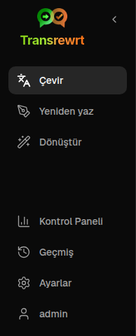
    </td>
    <td valign="top">
      <br/><br/>
      <ul>
        <li><strong>Çevir</strong> çeviri çalışma alanını açar.</li><br/>
        <li><strong>Yeniden yaz</strong> yeniden yazma çalışma alanını açar.</li><br/>
        <li><strong>Dönüştür</strong> özel istem çalışma alanını açar.</li><br/>
        <li><strong>Kontrol Paneli</strong> kullanım ve maliyet bilgilerini gösterir.</li><br/>
        <li><strong>Ayarlar</strong> ayarlar panelini açar.</li><br/>
        <li><strong>Geçmiş</strong> girdi ve çıktı metniyle birlikte kullanım geçmişini gösterir.</li><br/>
        <li><strong>Kullanıcı</strong> oturum açmış kullanıcının kullanıcı adını gösterir (sadece web).</li>
      </ul>
    </td>
  </tr>
</table>

<br/>

<a id="toolbar"></a>
### Araç Çubuğu

Araç çubuğu, uygulama içinde nerede olduğunuza göre hafifçe değişir.

- Solda, geçerli sayfanın adı gösterilir.
- Sağda, **model seçici** ve **Arayüz dili** denetimi yer alır.

**Model seçici**, geçerli görev için hangi yapay zekâ motorunu kullanacağınızı seçmenizi sağlar.

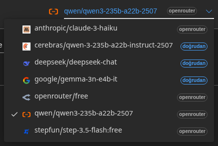

Bazı ücretsiz modeller her zaman mevcut olmayabilir; bazen çevrimdışı olabilirler veya kullanım sınırına sahip olabilirler. Böyle bir durumda uygulama bu modeli otomatik olarak kullanılabilir listenizden kaldırır. Hangi modellerin görüneceğini kontrol etmek için [**Ayarlar** > **Modeller**](#models) bölümüne gidin ve model listenizi düzenleyin.
 Ayrıca model ayarlarını, araç çubuğundaki model adının solundaki sağlayıcı simgesine tıklayarak doğrudan da açabilirsiniz.

<br/>

**Dünya simgesi + dil kodu**, menüler ve düğmeler gibi uygulama arayüz dilini değiştirir. **Çevir** işlevinde kullanılan çeviri dillerini **değiştirmez**.

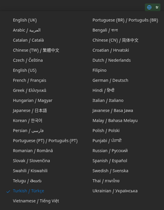

<br/>

<a id="input-and-output-panels"></a>
### Girdi ve çıktı panelleri

Çoğu çalışma alanı, sol taraftaki **Girdi** panelini ve sağ taraftaki **Çıktı** panelini kullanır.

Her panel ayrıca şunları gösterir:

| **Girdi**                                                          | **Çıktı**                                                                                                                  |
|--------------------------------------------------------------------|-----------------------------------------------------------------------------------------------------------------------------|
| - Karakter sayısı <br/>- Kelime sayısı <br/>- Paragraf sayısı   <br/> | - Görevin ne kadar sürdüğü<br/>- **TPS** (saniyede token sayısı)<br/>- Karakter, kelime ve paragraf sayıları<br/>- Kullanılan model |

Teknik terimler hakkında merak ediyorsanız:

- **Token**, küçük bir metin parçası anlamına gelir. Bir kelimenin parçası ya da kısa bir kelime olarak düşünebilirsiniz.
- **TPS**, modelin saniyede kaç tane bu metin parçasını işlediğini belirtir.

<br/>

Her işlemin maliyetini (mevcutsa) ve toplam maliyeti de [**Ayarlar** > **Genel Ayarlar**](#general-settings) bölümünde `Show cost information on the actions` seçeneğini etkinleştirerek izleyebilirsiniz.

<br/><br/>

[--------------------------------------------------------------------------------------------------------------------------]: #

<a id="translate"></a>
## Çevir

Metni bir dilden başka bir dile çevirmek istediğinizde **Çevir** seçeneğini kullanın.

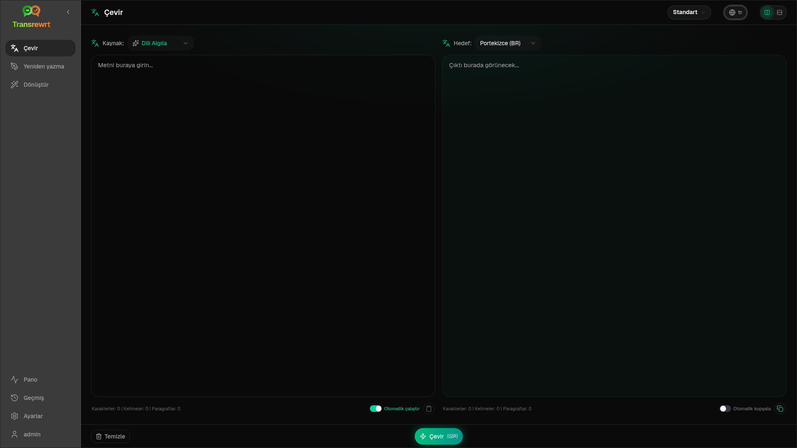

<br/>

<a id="translate-text"></a>
### Metin çevir

1. **Çevir** seçeneğini açın.
2. **Kimden** alanında bir dil seçin.
3. **Kime** alanında bir dil seçin.
4. Araç çubuğundan bir model seçin.
5. **Girdi** alanına metin yazın veya yapıştırın.
6. **Çevir**'e tıklayın.
7. Sonucu **Çıktı** alanında okuyun.
8. Sonucu kopyalamak istiyorsanız kopyalama düğmesini kullanın.

<br/>

<a id="language-selection"></a>
### Dil seçimi

- **Kimden**, belirli bir dil ya da **Dili Algıla** olabilir.
- **Kime**, sonucun olmasını istediğiniz dil olur.

Seçtiğiniz **Üst diller** listede en üstte görünür. Bunları [**Ayarlar** > **Diller**](#languages) menüsünde ayarlayabilirsiniz.

<br/>

<a id="helpful-translation-settings"></a>
### Yararlı çeviri ayarları

[**Ayarlar** > **Genel Ayarlar**](#general-settings) bölümünde çeviri davranışını değiştirebilirsiniz:

- **Yapıştırmada otomatik çeviri**, metni yapıştırdığınız anda bir çeviri başlatır.
- **Sonucu panoya otomatik kopyala**, başarılı bir çeviri sonrasında sonucu otomatik olarak kopyalar.
- **Gerçek zamanlı çeviri (yazarken)**, yazarken çevirileri çalıştırır.
- **Zaman aşımı (ms)**, uygulamanın gerçek zamanlı çeviri yapmadan önce ne kadar bekleyeceğini belirler.
- **Enter**, `Enter` tuşuna bastığınızda ne olacağını belirler:

<br/><br/>

[--------------------------------------------------------------------------------------------------------------------------]: #

<a id="rewrite"></a>
## Yeniden yaz

Ana anlamı değiştirmeden metnin ifade biçimini iyileştirmek istediğinizde **Yeniden yaz** seçeneğini kullanın.

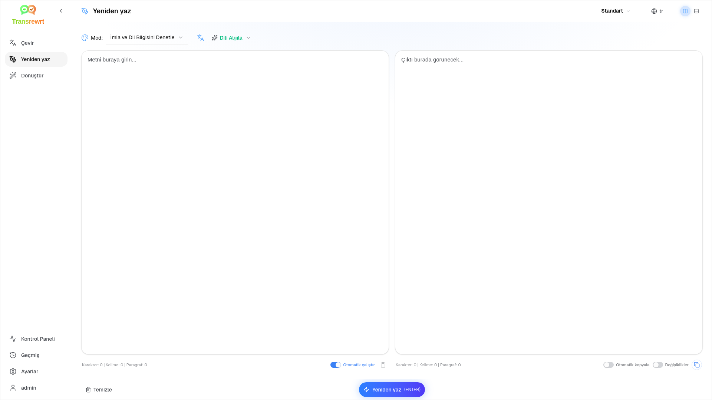

Bu işlem şu durumlarda yararlıdır:

- yazım ve dil bilgisi hatalarını düzeltmek (**İmla ve Dil Bilgisini Denetle**)
- metni daha anlaşılır hâle getirmek (**Anlaşılırlığı İyileştir**)
- tek bir çalıştırma ile birkaç farklı yeniden düzenleme sunmak (**Alternatif sürümler**)
- metni daha resmî veya daha gayriresmî hâle getirmek (**Resmî** / **Gayriresmî**)
- metni kısaltmak veya uzatmak (**Kısalt** / **Uzat**)
- metni daha teknik hâle getirmek (**Teknik Hale Getir**)

<br/>

> 💡 **İPUCU**<br/>
> "**İmla ve Dil Bilgisini Denetle**" modunu kullandığınızda, çıktı panelinde (**Kopyala**'nın yanında) bir **Değişiklikleri göster** anahtarı belirir.
> Metninizde uygulanan belirli düzeltmeleri göstermek veya gizlemek için onu açıp kapatabilirsiniz.

<br/><br/>

[--------------------------------------------------------------------------------------------------------------------------]: #

<a id="transform"></a>
## Dönüştür

Yapay zekanın özel talimatlar takip etmesini istediğinizde **Dönüştür** seçeneğini kullanın.

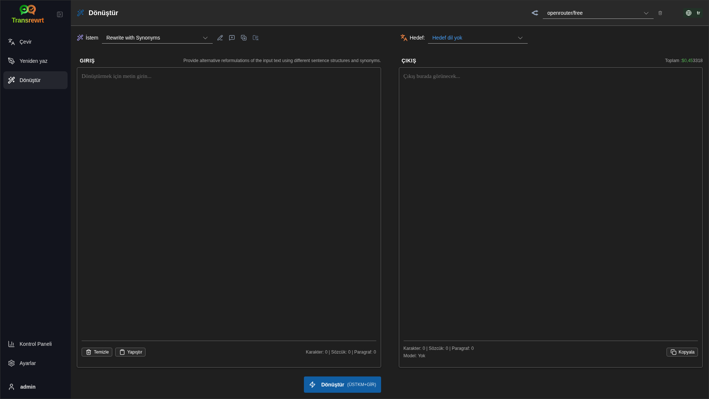

Bu, uygulamanın en esnek bölümüdür. Bunu şu tür görevler için kullanabilirsiniz:

- notları özetlemek
- ham metni pürüzsüz bir e-postaya dönüştürmek
- ana noktaları ayıklamak
- metni belirli bir biçime dönüştürmek
- girdi metniyle ilgili diğer tüm özel işlemler

<br/>

<a id="run-an-existing-prompt"></a>
### Var olan bir istemi çalıştırın

1. **Dönüştür**'ü açın.
2. İstem listesinden bir istem seçin.
3. Bir **Hedef** dil kutusu görünürse, isterseniz bir dil seçin.
4. **Girdi** alanına metin yazın veya yapıştırın.
5. **Dönüştür**'e tıklayın.
6. Sonucu **Çıktı** alanında okuyun.

<br/>

<a id="if-you-have-no-prompts-yet"></a>
### Henüz isteminiz yoksa

İstem listeniz boşsa, Dönüştür çalışma alanında **Örnek istemleri yükle**'ye tıklayın. Aynı kontrol, dışa aktarma/ithalat satırında her zaman [**Ayarlar** > **İstemleri Dönüştür**](#transform-prompts) bölümünde mevcuttur. İkisi de yerleşik örnekler ekler, böylece hızlıca başlayabilirsiniz.

<br/>

> ℹ️ **NOT**<br/>
> Örnek istemler İngilizce olarak sağlanır. Yüklendikten sonra bir istemi düzenleyebilir ve **İstemi çevir** seçeneğini kullanarak dilinize çevirebilirsiniz.

<br/>

<a id="create-a-prompt-quickly"></a>
### Hızlıca bir istem oluşturun

Bir istem oluşturmanın en hızlı yolu:

1. **Yeni istem**'e tıklayın.
2. **İstem oluştur**'a tıklayın.
3. İstemin ne yapmasını istediğinizi açıklayın.
4. Bir model seçin.
5. Uygulamanın sizin için bir taslak oluşturmasına izin verin.
6. Taslağı gözden geçirin ve **Kaydet**'e tıklayın.

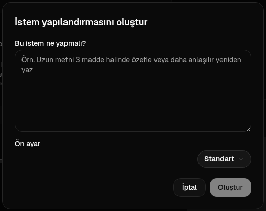

<br/>

<a id="edit-a-prompt"></a>
### Bir istemi düzenleyin

Bir istem oluşturduğunuzda veya düzenlediğinizde, düzenleyici solda görünür ve sağda bir test alanı görünür.

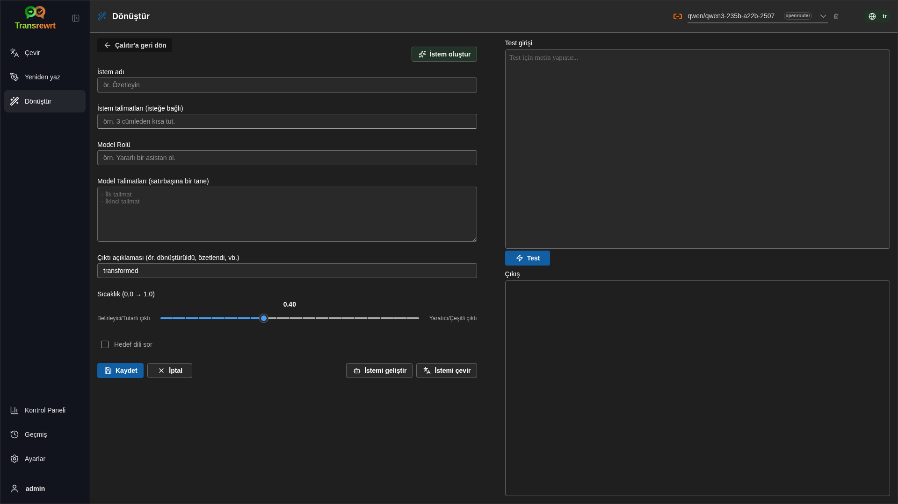

Ana alanlar şunlardır:

- **İstem adı**: istem listesinde gösterilen ad.
- **İstem talimatları (isteğe bağlı)**: istem çalıştırıldığında kullanıcıya gösterilen kısa bir ipucu.
- **Model Rolü**: 'Yararlı bir asistan olduğunu varsay' gibi, yapay zekaya atanan genel rol.
- **Model Talimatları (satır başı yapın)**: yapay zekanın uymasını istediğiniz özel kurallar.
- **Çıktı açıklaması**: 'özet' veya 'yeniden yaz' gibi sonucu tanımlayan kısa bir kelime.
- **Sıcaklık (0,0 → 1,0)**: modelin nasıl davranacağını belirler; aşağıya bakın.
- **Hedef dil iste**: istem çalıştırıldığında hedef dil seçici ekler.

Eğer teknik terim **Sıcaklık** sizin için yeniyseniz, şöyle düşünebilirsiniz:

- **Daha düşük** sıcaklık, daha durağan ve öngörülebilir sonuçlar verir.
- **Daha yüksek** sıcaklık, daha fazla çeşitlilik ve yaratıcılık sağlar.

Ayrıca şunları da kullanabilirsiniz:

- `Generate prompt` basit bir açıklamadan yeni bir taslak oluşturmak için
- `Improve prompt` mevcut bir istemi iyileştirmek için
- `Translate prompt` istem alanlarını çevirmek için

<br/>

> ⚠️ **UYARI**<br/>
> `Back to Run`'e tıklamadan önce `Save`'a tıklayın. Kaydetmeden geri dönerseniz, değişiklikleriniz kaybolur.

<br/>

<a id="test-a-prompt-before-using-it"></a>
### Kullanmadan önce bir istemi test edin

Sağdaki test paneli, istemi günlük işlerinizde kullanmadan önce örnek metinle denemenizi sağlar.

Bu durumlarda kullanışlıdır:

- Yeni bir istem oluşturuyorsanız
- İki istem sürümünü karşılaştırıyorsanız
- Ton, uzunluk veya çıktı biçimi kontrolü yapmak istiyorsanız

<br/>

> ℹ️ **NOT**<br/>
> Kayıtlı istemleri [**Ayarlar** > **İstemleri Dönüştür**](#transform-prompts) bölümünde dışa aktarabilir ve içe aktarabilirsiniz.

<br/><br/>

[--------------------------------------------------------------------------------------------------------------------------]: #

<a id="dashboard"></a>
## Kontrol Paneli

**Kontrol Paneli**'ni kullanarak uygulamayı ne kadar kullandığınızı ve maliyetinin ne kadar olduğunu görebilirsiniz (ücretli modeller için).

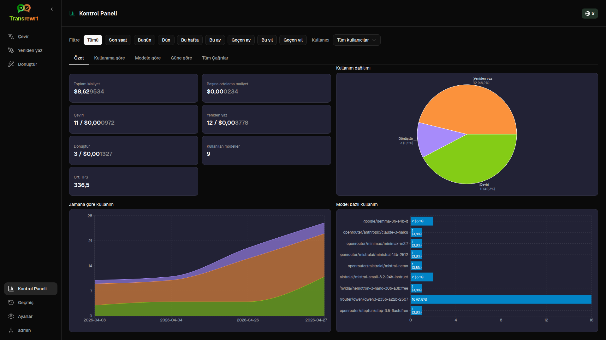

<br/>

> ℹ️ **NOT**<br/>
> Yalnızca **ücretsiz** modelleri kullanıyorsanız, **maliyet** tutarları sıfır olabilir ve maliyete odaklanan özetler boş görünebilir. **Özet** sekmesinde, seçili dönemde etkinliğiniz olduğunda **Zaman içinde kullanım** ve **Modele göre kullanım** bölümleri yine de yapılan **çağrı sayılarını** (çevir, yeniden yaz ve dönüştür) gösterir.

<br/>

<a id="filter-the-data"></a>
### Verileri filtrele

Zaman aralığını değiştirmek için üstteki filtre düğmelerini kullanın.

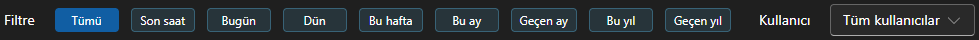

<br/>

> ℹ️ **NOT**<br/>
> **Kullanıcı** filtresi yalnızca web sürümünde yönetici kullanıcılar tarafından görünür. Normal kullanıcılar bu filtreyi göremez ve masaüstü uygulamasında bu filtre kullanılamaz.

<br/>

<a id="dashboard-tabs"></a>
### Kontrol Paneli sekmeleri

- **Özet**, kullanım ve maliyet genel görünümünü sunar. **Zamana göre kullanım** (günlük olarak çeviri, yeniden yazma ve dönüştürme için yığılmış kümülatif **çağrı sayısı**) ve **Modele göre kullanım** (dönüştürme dahil olmak üzere **model başına toplam çağrılar**) içerir.
- **Kullanıma göre**, etkinliği çeviri dili, yeniden yazma modu ve dönüştürme istemine göre ayırır.
- **Modele göre**, hangi modelleri kullandığınızı ve maliyetlerini gösterir.
- **Güne göre**, günlük toplamları gösterir.
- **Tüm Çağrılar**, tam çağrı geçmişini gösterir ve dışa aktarmanıza olanak tanır.

<br/>

<a id="export-data"></a>
### Verileri dışa aktar

Kontrol paneli tabloları verileri şu biçimlerde dışa aktarabilir:

- **JSON**
- **CSV**
- **XLSX**

Bu, etkinlikleri uygulamanın dışında incelemek veya bir rapor paylaşmak istiyorsanız kullanışlıdır.

<br/>

<a id="delete-stored-records-for-a-model"></a>
### Bir model için kayıtlı kayıtları sil

**Modele göre** veya **Tüm Çağrılar** sekmesinde, "çöp kutusu" simgesine tıklayarak bir model için kayıtlı kayıtları kaldırabilirsiniz.

> ⚠️ **UYARI**<br/>
> Kayıtlı kayıtların silinmesi geri alınamaz. Yalnızca o geçmişe artık ihtiyacınız olmadığından emin olduğunuzda kullanın.

Tüm verileri silmek veya kayıtları yaşlarına göre kaldırmak için [**Ayarlar** > **Maliyet Takibi**](#cost-tracking) bölümüne gidin. Burada tüm saklanan verileri veya yalnızca belirli bir tarihten daha eski verileri silme seçeneklerini bulacaksınız.

<br/><br/>

[--------------------------------------------------------------------------------------------------------------------------]: #

<a id="history"></a>
## Geçmiş

**Transrewrt** içindeki işlemlerinizin geçmişini görmek için **Geçmiş**'e tıklayın. Her işlemin girdi ve çıktısını buradan inceleyebilirsiniz.

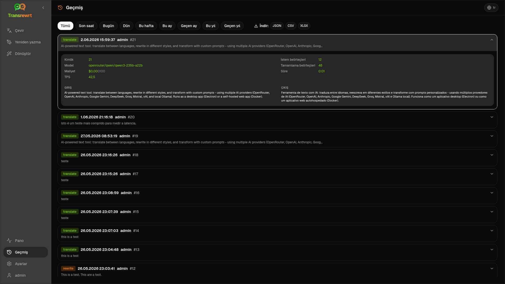

<br/>

<a id="filter-the-history"></a>
### Geçmişi filtrele

**Geçmiş**, **Kontrol Paneli** sayfasıyla aynı filtreleri kullanır. Zaman aralığını seçmek için bunları kullanın.


<br/>

> ℹ️ **NOT**<br/>
> **Kullanıcı** filtresi yalnızca web sürümünde yönetici kullanıcılar tarafından görünür. Normal kullanıcılar bu filtreyi göremez ve masaüstü uygulamasında bu filtre kullanılamaz.

<br/>

<a id="export-history-data"></a>
### Geçmiş verilerini dışa aktar

Geçmiş sayfası, filtrelenmiş verileri şu biçimlerde dışa aktarabilir:

- **JSON**
- **CSV**
- **XLSX**

Bu, etkinlikleri uygulamanın dışında incelemek veya bir rapor paylaşmak istiyorsanız kullanışlıdır.

<br/><br/>

[--------------------------------------------------------------------------------------------------------------------------]: #

<a id="settings"></a>
## Ayarlar

Uygulamanın davranışını özelleştirmek için kenar çubuğundan **Ayarlar**'ı açın.

Kullanılabilir sekmeler, platforma ve rolünüze göre değişir:

| Sekme               | Masaüstü | Web (yönetici) | Web (normal kullanıcı) |
  |-------------------|:-------:|:-----------:|:------------------:|
  | Genel Ayarlar  |   Evet   |     Evet     |        Evet         |
  | Modeller            |   Evet   |     Evet     |        Evet         |
  | Diller         |   Evet   |     Evet     |        Evet         |
  | Maliyet Takibi     |   Evet   |     Evet     |         -          |
  | İstemleri Dönüştür |   Evet   |     Evet     |        Evet         |
  | Kullanıcılar             |    -    |     Evet     |         -          |
  | API Yapılandırması        |   Evet   |     Evet     |         -          |
  | Hakkında             |   evet   |     evet     |        evet         |

<br/>

> ℹ️ **NOT**<br/>
> Web sürümünde her kullanıcı kendi yapılandırmasına sahiptir. Seçilen modeller, diller, genel seçenekler ve dönüşüm istemleri gibi ayarlar kullanıcı bazında saklanır. Yaptığınız değişiklikler diğer kullanıcıları etkilemez.

<br/>

[--------------------------------------------------------------------------------------------------------------------------]: #

<a id="general-settings"></a>
### Genel Ayarlar

**Genel Ayarlar**'ı kullanarak yazma davranışını, yürütme ayrıntılarının **Geçmiş** için saklanıp saklanmayacağını ve görünümü kontrol edebilirsiniz.

**Davranış**

- **ENTER için Davranış**, `Enter` görevi çalıştırır ya da yeni bir satır ekler.
- **Yapıştırmada otomatik çeviri**, metni yapıştırdığınız anda çeviriyi başlatır.
- **Sonucu panoya otomatik kopyala**, başarılı sonuçları otomatik olarak kopyalar.
- **Gerçek zamanlı çeviri (yazarken)**, yazarken çeviriyi yapar.
- **Zaman aşımı (ms)**, gerçek zamanlı çeviri için bekleme süresini ayarlar.

**Geçmiş**

- **Çalıştırma geçmişini tut**, her çeviri, yeniden yazma ve dönüştürmenin, kenar çubuğundaki [**Geçmiş**](#history) görünümü için **girdi ve çıktı metnini** saklayıp saklamayacağını denetler. Kapalı konuma getirildiğinde onay istenir; onaylarsanız, saklanan geçmiş metni veritabanından kaldırılır.
- **Geçmiş verilerini sil**, saklanan metni yaşına göre (örneğin birkaç aydan eski olanlar veya **tüm veriler (temizle)**) **Verileri sil** seçeneğiyle kaldırmanıza olanak tanır. Bu yalnızca **Geçmiş** görünümü için kaydedilmiş yürütme metnini etkiler; **maliyet** veya kullanım toplamlarını **silmek** için [**Ayarlar** > **Maliyet Takibi**](#cost-tracking) kullanın.

**Görünüm**

- **Eylemlerde maliyet bilgisini göster**, işlem başına maliyetin (varsa) ve toplam maliyetin Çevir, Yeniden Yaz ve Dönüştür çıktı panellerinde görüntülenip görüntülenmeyeceğini kontrol eder.
- **Maliyet ondalık basamakları**, maliyet ondalıklarının nasıl gösterileceğini değiştirir.
- **Sadece web:** **uygulama etrafında bir kenar boşluğu göster**, arayüz etrafına ekstra boşluk ekler.
- **Yazı Tipi Ailesi**, metin panellerindeki yazım fontunu değiştirir.
- **Boyut**, yazı tipi boyutunu değiştirir.

**Yapılandırma Yedekleme**

- **Yedekte kullanım verilerini dahil et** - etkinleştirildiğinde ZIP dosyası ayrıca yürütme geçmişi ve API çağrısı verilerini de içerir.
- **Yapılandırmayı yedekle** - `config.json`, `state.json`, isteğe bağlı şifreleme anahtarı, kullanıcılar, tercihler, özel istemler ve kullanım verileri (eğer kabul ettiyseniz) ile tek bir ZIP dosyası oluşturur (varsayılan olarak UTC'ye göre `transrewrt-config-backup-YYYY-MM-DD_HHMMSS.zip`). Başarılı bir yedeklemeden sonra onay, kaydedilen dosya adını gösterir.
- **Yedekten geri yükle** - önce bir **onay iletişim kutusu** açar. İletişim kutusu içinde yedek ZIP dosyasını seçin (**Gözat** / dosya seçici veya destekleniyorsa sürükleyip bırakma), ardından seçenekleri gözden geçirin:
  - **Kullanım verilerini geri yükle** - yedekleme sırasında kullanım verileri dahil edildiyse ZIP'deki kullanım/geçmişi içe aktarın; yalnızca ayarları ve istemleri istiyorsanız işaretini kaldırın.
  - **Geri yüklemeden önce eski kullanım verilerini temizle** - yedek uygulanmadan önce bu kurulumdaki mevcut kullanım/geçmişi kaldırır (isteğe bağlı; temiz bir değiştirme yapmak istediğinizde kullanın).

Web veya masaüstü sürümünde oluşturulan yedeklemeler, diğerinde geri yüklenebilir. Masaüstü yedeklemesi web sürümüne geri yüklenirse, veriler yönetici kullanıcısına geri yüklenir.

<br/>

<a id="models"></a>
### Modeller

Araç çubuğunda hangi modellerin görüneceğini seçmek için **Ayarlar** > **Modeller**'i kullanın.

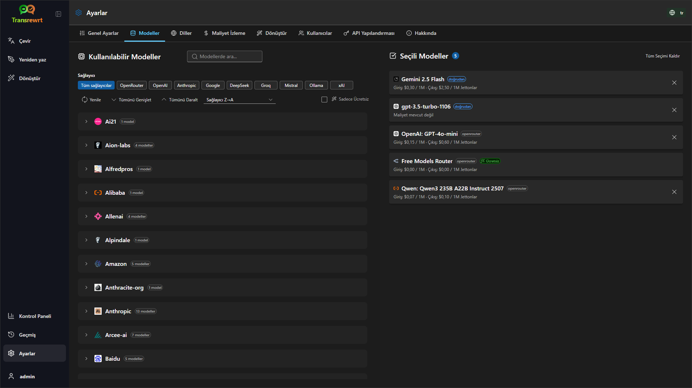

Sayfada iki liste bulunur:

- Sol tarafta **Kullanılabilir Modeller**
- Sağ tarafta **Seçilen Modeller**

Kullanışlı kontroller şunları içerir:

- **Modellerde ara...** adını yazarak bir model bulun
- Listeyi tek bir altyapıya (OpenRouter, OpenAI, Ollama, …) daraltmak için **Sağlayıcı** etiketlerini kullanın
- Sadece ücretsiz modelleri göstermek için **Sadece Ücretsiz** seçeneğini kullanın
- Listeyi yeniden yüklemek için **Yenile**'yi tıklayın
- Sağlayıcıya göre sıralarken **Tümünü Genişlet** ve **Tümünü Daralt** kullanabilirsiniz

Model kimlikleri sağlayıcı önekini içerir (örneğin `openrouter/…` ve `openai/…` gibi). **OpenAI (OpenRouter)** ve **OpenAI (doğrudan)** gibi rozetler, trafiğin nasıl yönlendirildiğini gösterir.

> ℹ️ **NOT**<br/>
> **OpenRouter Body Builder** (`openrouter/bodybuilder`), genel bir sohbet modeli değil, yönlendirici bir modeldir: yanıtı, OpenRouter API istek gövdelerini açıklayan bir JSON'dur (örneğin `requests` dizisi içinde `model` ve `messages` ile). Bunu **Çevir**, **Yeniden yaz** veya **Dönüştür** için kullanırsanız, çıktı paneli tamamlanmış metin yerine bu JSON'u gösterecektir. Bu görevler için normal bir metin modeli seçin. OpenRouter'daki [Body Builder model sayfasına](https://openrouter.ai/openrouter/bodybuilder) bakın.

İşlemler:

- Bir model eklemek için **Ekle**'ye veya listedeki girişin herhangi bir yerine tıklayın.

- Bir modeli kaldırmak için **Seçilen Modeller** bölümünde yanındaki **X** işaretine veya Kullanılabilir Modeller listesindeki girişte **Seçildi** etiketine tıklayın.

- Listeyi temizlemek için **Tüm Seçimi Kaldır**'a tıklayın. Gerekli olan ücretsiz model listede kalır.

<br/>

> ℹ️ **NOT**<br/>
> OpenRouter'a hemen kredi eklemek istemiyorsanız, önce **Sadece Ücretsiz** seçeneğini etkinleştirin ve ücretsiz modelleri seçin (kredi kartı gerekmez). Ayrıca, herhangi bir API anahtarı olmadan modelleri yerel olarak çalıştırmak için Ollama kullanabilirsiniz.

<br/>

<a id="languages"></a>
### Diller

Uygulamada kullanılan dil listelerini düzenlemek için **Ayarlar** > **Diller**'i kullanın.

- **En çok kullanılan diller**, **Çevir** ve **Dönüştür** bölümlerinde dil listelerinin en üstünde sabitlenir.
- **Özel Dil**, yerleşik listede olmayan bir dil eklemenizi sağlar.

Özel bir dil eklerseniz, yerleşik seçeneklerin yanında dil seçicilerinde görünür.

<br/>

<a id="cost-tracking"></a>
### Maliyet takibi

Maliyet bilgilerini yönetmek için **Ayarlar** > **Maliyet Takibi**'ni kullanın.

- **Toplam Maliyet**, biriken toplamı gösterir.
- **Değeri Kopyala**, toplamı panoya kopyalar.
- **Maliyeti Sıfırla**, kayıtlı toplamı sıfırlar.
- **API anahtarı kullanımıyla eşitle**, toplamı OpenRouter hesabınızda bildirilen kullanım ile eşleşecek şekilde ayarlar (sadece OpenRouter için).
- **API Anahtarı Kullanımı**, varsa OpenRouter kullanım ayrıntılarını gösterir.
- **Maliyet verilerini sil**, tüm verileri veya yalnızca seçilen tarihten daha eski olanları kaldırır.

**Maliyet takibi:** OpenRouter modellerini kullandığınızda, uygulama OpenRouter'dan alınan maliyet bilgilerine göre gerçek kullanımınızı ve harcamanızı gösterir. Diğer tüm sağlayıcılar için uygulama OpenRouter tarafından yayınlanan fiyatlar kullanılarak maliyet tahmini yapar. Fiyat bilgisi yoksa tahmini maliyet sıfır olabilir.

<br/>

> ℹ️ **NOT**<br/>
> **Tüm maliyet rakamları yalnızca başvuru amaçlıdır, resmi fatura değildir.**

<br/>

> ⚠️ **UYARI**<br/>
> Veri silme işlemi geri alınamaz. Silmeden önce verilerinizi yedeklediğinizden emin olun veya [**Geçmiş**](#history) veya [**Kontrol Paneli** > **Tüm Çağrılar**](#dashboard-tabs) üzerinden dışa aktarın, aksi takdirde kalıcı olarak kaybolur.
> Her API çağrısıyla ilgili tüm girdi/çıktı geçmişi de silinecektir.

<br/>

<a id="transform-prompts"></a>
### İstemleri Dönüştür

**Ayarlar** > **İstemleri Dönüştür** seçeneğini kullanarak istemleri toplu olarak yönetin.

Şunları yapabilirsiniz:

- kayıtlı istemlerinizi gözden geçirin
- istemleri silin
- bir dosyadan istem içeri aktarın
- yedekleme veya paylaşım için istemleri dışa aktarın
- örnek istemleri istem listesine yükleyin

<br/>

<a id="users"></a>
### Kullanıcılar

Web sürümünde kullanıcı hesaplarını yönetmek için **Kullanıcılar** bölümünü kullanın. Kullanıcı ekleyebilir, bilgilerini güncelleyebilir, şifrelerini sıfırlayabilir ve hesapları silebilirsiniz.

<br/>

<a id="api-config"></a>
### API yapılandırması

Desteklenen sağlayıcılar şunlardır: OpenRouter, OpenAI, Anthropic, Google Gemini, DeepSeek, Groq, Mistral, xAI, Cerebras ve **Ollama** (temel bir URL aracılığıyla yerel modeller). Sadece kullandığınız sağlayıcıları yapılandırmanız gerekir.

**Web uygulaması: yalnızca yönetici**

API anahtarları sistem veya Docker ortam değişkenleri aracılığıyla yapılandırılır - web arayüzünde girilmez. Bu sayfa hangi sağlayıcıların anahtarla yapılandırıldığını gösterir ve her birini `Test` düğmesine tıklayarak test etmenizi sağlar.

<br/>

> ℹ️ **NOT**<br/>
> Bir API anahtarını değiştirmek için sistem veya Docker yapılandırmanızdaki ortam değişkenini güncelleyin ve sunucuyu veya kapsayıcıyı yeniden başlatın.

<br/>

> ℹ️ **NOT**<br/>
> **Yapılandırma yedeklemeleri** ([**Genel Ayarlar** → Yapılandırma Yedekleme](#general-settings) bölümüne bakın) ZIP dosyasındaki `config.json` içine **çözümlenmiş** sağlayıcı anahtarlarını gömebilir. Bu ZIP dosyasının geri yüklenmesi, bu anahtarları sunucunun kalıcı yapılandırma dosyasına **kopyalamaz** - canlı anahtarlar hâlâ burada anlatıldığı gibi ortamdan ve mevcut dosya durumundan gelir.

<br/>

**Masaüstü uygulaması**

Kullandığınız her sağlayıcı için API anahtarlarını depolamak üzere **API Yapılandırması** bölümünü kullanın. Ollama için bir API anahtarı yerine **temel URL** girin.

<br/>

> 💡 **İpucu** <br/>
> API anahtarı kullanmak istemiyor veya ücret ödemek istemiyorsanız, makinenizde ücretsiz olarak modelleri (örneğin `translategemma:4b`) çalıştırmak için [Ollama'yı indirebilirsiniz](https://ollama.com). Alternatif olarak, ücretsiz modellerini kullanmak için kredi kartı gerektirmeyen ücretsiz bir OpenRouter hesabı oluşturabilir veya Cerebras, Google, Groq veya Mistral AI'den ücretsiz bir API anahtarı alabilirsiniz.

<br/>

- Sadece ihtiyacınız olan sağlayıcıları ekleyin. **Ayarlar** > **Modeller** bölümünde, her model kimliği sağlayıcıyla başlar (örneğin `openrouter/openrouter/free`, `openai/gpt-4o`, `ollama/llama3`).

Bir API anahtarı eklemek için metin alanına değeri girin ve `Save` düğmesine tıklayın. Mevcut bir anahtarı değiştirmek için `Edit` düğmesine tıklayın. Bir anahtarın çalışıp çalışmadığını doğrulamak için `Test` düğmesine tıklayın. Ollama temel URL'si için bağlantıyı kontrol etmek üzere her zaman `Test` düğmesine tıklayın.

<br/>

> ℹ️ **NOT**<br/>
> Mevcut bir API anahtarının değerini göremezsiniz. Yalnızca `Edit` düğmesini kullanarak değiştirebilirsiniz.
> API anahtarları yapılandırmada şifrelenmiş olarak saklanır.

<br/>

<a id="about"></a>
### Hakkında

**Hakkında** sekmesi şunları gösterir:

- uygulama adı
- sürüm numarası
- yapı tarihi
- proje deposuna bir bağlantı

<br/><br/>

<a id="common-issues"></a>
## Yaygın sorunlar

Bir şey beklenildiği gibi çalışmıyorsa, önce aşağıdaki noktaları kontrol edin.

<br/>

<a id="the-app-will-not-translate-rewrite-or-transform-text"></a>
### Uygulama metni çevirmiyor, yeniden yazmıyor veya dönüştüremiyor

Aşağıdakileri kontrol edin:

- araç çubuğunda bir model seçtiğinizden emin olun
- [**Ayarlar** > **Modeller**](#models) bölümünde en az bir model listeleniyor olmalı
- API kurulumunuz çalışıyor olmalı

Masaüstü uygulamasını kullanıyorsanız:

1. [**Ayarlar** > **API Yapılandırması**](#api-config) sayfasını açın.
2. En az bir API anahtarının kaydedildiğini doğrulayın.
3. Anahtarın çalıştığını onaylamak için sağlayıcının yanındaki **Test** düğmesine tıklayın.

<br/>

<a id="the-model-list-is-empty"></a>
### Model listesi boş

[**Ayarlar** > **Modeller**](#models) bölümüne gidin ve **Yenile**'ye tıklayın.

Gerekirse:

- bir model arayın
- **Sadece Ücretsiz** seçeneğini etkinleştirin
- bir veya daha fazla modeli **Seçilen Modeller** listesine ekleyin

<br/>

<a id="the-result-is-too-slow-or-too-expensive"></a>
### Sonuç çok yavaş veya çok maliyetli

Aşağıdakilerden birini veya birkaçını deneyin:

- farklı bir model seçin
- daha kısa bir girdi kullanın
- [**Ayarlar** > **Genel Ayarlar**](#general-settings) bölümünde **Gerçek zamanlı çeviri (yazarken)** seçeneğini devre dışı bırakın
- basit görevler için ücretsiz modeller kullanın (bkz. [Modeller](#models))

<br/>

<a id="the-interface-is-in-the-wrong-language"></a>
### Arayüz yanlış dilde

[Araç çubuğundaki](#toolbar) dünya simgesine tıklayın ve tercih ettiğiniz **Arayüz dili**'ni seçin.

<br/>

<a id="the-text-is-too-small-or-hard-to-read"></a>
### Metin çok küçük veya okunması zor

[**Ayarlar** > **Genel Ayarlar**](#general-settings) bölümüne gidin ve şunu değiştirin:

- **Yazı Tipi Ailesi**
- **Boyut**

<br/>

<a id="dashboard-charts-are-empty"></a>
### Kontrol Paneli grafikleri boş

Bu durum şu durumlarda normaldir:

- yalnızca **ücretsiz modeller** kullanıyorsanız ve **maliyet** rakamlarına bakıyorsanız (bu değerler sıfır olabilir); **Özet** sekmesindeki **kullanım** çağrı sayısı grafikleri hâlâ seçilen dönemden veri almalıdır
- seçilen **zaman filtresi**, çağrıların yapıldığı dönemi kapsamıyorsa - kontrol etmek için **Tümü** seçeneğini deneyin

Eğer **Tümü** seçildikten sonra grafikler hâlâ boşsa, çağrıların [**Geçmiş**](#history) sayfasında veya **Tüm Çağrılar** sekmesinde görünür olduğundan emin olun.

<br/>

<a id="cost-shows-not-available-or-seems-wrong"></a>
### Maliyet "mevcut değil" gösteriyor veya yanlış görünüyor

**OpenRouter** üzerinden modeller kullandığınızda, uygulama OpenRouter tarafından bildirilen gerçek harcamanızı gösterir.

**Diğer sağlayıcılar** (OpenAI doğrudan, Anthropic doğrudan, vb.) için maliyet, OpenRouter tarafından yayınlanan fiyatlandırma verilerine göre tahmini olarak hesaplanır. Bir modele eşleşen bir fiyat bulunamazsa, maliyet **mevcut değil** olarak gösterilir ve toplamınıza eklenmez.

<br/>

<a id="total-cost-does-not-match-my-provider-bill"></a>
### Toplam maliyet sağlayıcınızın faturanızla eşleşmiyor

Uygulamadaki tüm maliyet rakamları yalnızca **referans amaçlı tahminlerdir**, resmi fatura beyanları değildir.

Toplam maliyetinizi gerçek OpenRouter harcamanıza daha yakın hâle getirmek için [**Ayarlar** > **Maliyet Takibi**](#cost-tracking) sayfasını açın ve **API anahtarı kullanımıyla eşitle** seçeneğine tıklayın.

<br/>

<a id="the-history-page-is-missing-from-the-sidebar"></a>
### Yan çubukta Geçmiş sayfası eksik

**Çalıştırma geçmişini tut** seçeneği devre dışı olabilir. [**Ayarlar** > **Genel Ayarlar**](#general-settings) sayfasını açın ve etkinleştirin. Bu seçeneğin açılmasının daha önce silinmiş geçmiş verilerini geri getirmeyeceğini unutmayın.

<br/>

<a id="web-app-session-expired"></a>
### Web uygulaması: beklenmedik şekilde giriş sayfasına yönlendiriliyorsunuz

Oturum süreniz dolmuş olabilir. Yeniden giriş yapın. Eğer sık sık oluyorsa, sunucu yapılandırmasında oturum süresi ayarlarını kontrol edin.

<br/>

<a id="web-admin-forgot-or-lost-a-password"></a>
### Web yöneticisi: parolayı unuttunuz veya kaybettiniz

Bu, masaüstü (Electron) uygulaması için değil, yalnızca **kendi barındırılan web uygulaması** (Docker) için geçerlidir.

- Başka bir yönetici hâlâ giriş yapabiliyorsa, [**Ayarlar** > **Kullanıcılar**](#users) sayfasını açabilir, hesabı seçebilir ve oradan bir **yeni parola** atayabilir.
- Eğer **erişiminiz engellendi**yse ancak makineye veya konteynere **komut satırı erişiminiz** varsa, imajla birlikte gelen yardımcı aracı kullanarak parolayı sıfırlayın (varsayılan adı değiştirirseniz `transrewrt` değerini de değiştirin ve parolada boşluk veya özel karakter varsa tırnak içine alın):

```bash
docker exec transrewrt reset-web-password '<username>' '<new-password>'
```

Varsayılan yönetici kullanıcı adı başka bir hesap oluşturmadıysanız `admin` şeklindedir. Yalnızca bir argüman verirseniz, bu değer `admin` için yeni parola olarak kabul edilir.

Eğer Docker yerine bir **kaynak kodu kopyasından** çalıştırıyorsanız, bunu kullanın:

```bash
pnpm run reset-web-password -- <username> <new-password>
```

Betik, SQLite veritabanındaki kullanıcı kaydını günceller (ve eksikse `admin` kullanıcısını oluşturabilir). Sıfırlamadan sonra yeni parolayla oturum açın.

<br/>

<a id="dashboard-shows-no-data-for-other-users"></a>
### Kontrol Paneli diğer kullanıcılar için veri göstermiyor (web)

Yalnızca **yöneticiler**, **Kullanıcı** filtresi aracılığıyla tüm kullanıcıların verilerini görüntüleyebilir. Düzenli kullanıcılar, tasarımı gereği yalnızca kendi etkinliklerini görür.

<br/>

<a id="i-changed-a-prompt-and-lost-the-edits"></a>
### Bir istemi değiştirdim ve düzenlemeleri kaybettim

Bir istemi düzenlerken her zaman **Çalıştır'a geri dön**'e tıklamadan önce **Kaydet**'e tıklayın.

<br/><br/>

<a id="quick-tips"></a>
## Hızlı ipuçları

- [**Çevir**](#translate) ile başlayarak kurulumunuzun çalıştığından emin olun, sonra [**Yeniden yaz**](#rewrite) veya [**Dönüştür**](#transform) adımına geçin.
- Günlük kelime düzenlemeleri için [**Yeniden yaz**](#rewrite) seçeneğini kullanın.
- Belirli bir görev için tekrarlanabilir bir iş akışı gerekiyorsa [**Dönüştür**](#transform) seçeneğini kullanın.
- Kullanım ve maliyeti takip etmek istiyorsanız [**Kontrol Paneli**](#dashboard) kullanın.
- Geçmiş işlemlerinizi ve tam girdi/çıktı metinlerinizi incelemek için [**Geçmiş](#history) bölümünü kullanın.
- Bir parola kitaplığı oluşturuyorsanız ve bunu güvende tutmak istiyorsanız düzenli olarak dışa aktarın (bkz. [İstemleri Dönüştür](#transform-prompts)) veya başkalarıyla paylaşmak istiyorsanız.

<br/><br/>

<a id="disclaimer"></a>
## Sorumluluk reddi

Ürün adları ve simgeleri ilgili sahiplerine aittir ve sadece tanımlama amacıyla kullanılır. Bu yazılım, bahsedilen markalarla bağlantılı değildir veya onların desteğiyle değildir.

<br/><br/>

<a id="license"></a>
## Lisans

Telif Hakkı © 2026 Waldemar Scudeller Jr.

[Apache License 2.0](../LICENSE)
