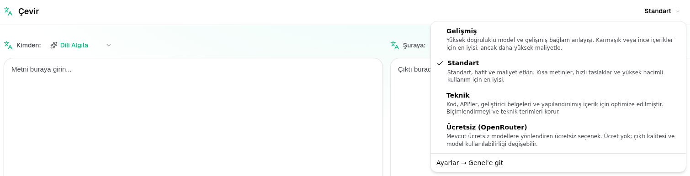

<a id="transrewrt-user-guide"></a>
# Kullanıcı Kılavuzu

<br/>

<a id="introduction"></a>
## Giriş

Transrewrt, metinle çalışmanıza üç ana yoldan yardımcı olur:

- **Çevir** - metni bir dilden diğerine dönüştür.
- **Yeniden yaz** - metni daha açık, daha kısa veya daha resmi gibi farklı bir şekilde yeniden ifade et.
- **Dönüştür** - istem adı verilen özel AI talimatlarını kullanarak metni işle.

Varsayılan olarak uygulama **Kolay** modda çalışır: Ayarlar'da bir **ön ayar** (örneğin Ücretsiz (OpenRouter), Standart, Gelişmiş veya Teknik) ve bir **sağlayıcı** seçersiniz, model kimliklerini seçmenize gerek kalmaz. Klasik model listesini kullanmak istiyorsanız [**Ayarlar** > **Genel Ayarlar**](#general-settings) üzerinden **Gelişmiş** moda geçin ve [**Ayarlar** > **Modeller**](#models) bölümüne gidin.

<br/>

Bu kılavuz, uygulama yüklendikten ve çalıştırıldıktan sonra nasıl kullanılacağını açıklar. Kurulum adımları için ana [**README**](README.tr.md) sayfasına bakın.

<br/>

> ℹ️ **NOT**<br/>
> Transrewrt, Windows ve Linux için masaüstü uygulaması olarak ve kendin barındırılan bir web uygulaması olarak mevcuttur. Bu kılavuz, uygulamanın günlük kullanımına odaklanır. Bir şey yalnızca bir sürüme uygulanıyorsa, bunun açıkça belirtilir.

<small>**Diğer dillerde oku:** </small>
<small id="lang-list">[English (UK)](../USER-GUIDE.md) · [Português (Brasil)](./USER-GUIDE.pt-BR.md) · [العربية](./USER-GUIDE.ar.md) · [বাংলা](./USER-GUIDE.bn.md) · [Català](./USER-GUIDE.ca.md) · [简体中文](./USER-GUIDE.zh-Hans.md) · [繁體中文](./USER-GUIDE.zh-Hant.md) · [Hrvatski](./USER-GUIDE.hr.md) · [Čeština](./USER-GUIDE.cs.md) · [Nederlands](./USER-GUIDE.nl.md) · [English (US)](./USER-GUIDE.en-US.md) · [Tagalog](./USER-GUIDE.tl.md) · [Français](./USER-GUIDE.fr.md) · [Deutsch](./USER-GUIDE.de.md) · [Ελληνικά](./USER-GUIDE.el.md) · [Hindi (Roman)](./USER-GUIDE.hi-Latn.md) · [Magyar](./USER-GUIDE.hu.md) · [Italiano](./USER-GUIDE.it.md) · [日本語](./USER-GUIDE.ja.md) · [한국어](./USER-GUIDE.ko.md) · [Bahasa Melayu](./USER-GUIDE.ms.md) · [فارسی](./USER-GUIDE.fa.md) · [Polski](./USER-GUIDE.pl.md) · [Basa Jawa](./USER-GUIDE.jv.md) · [Português](./USER-GUIDE.pt.md) · [پنجابی](./USER-GUIDE.pa-PK.md) · [Română](./USER-GUIDE.ro.md) · [Русский](./USER-GUIDE.ru.md) · [Slovenčina](./USER-GUIDE.sk.md) · [Español](./USER-GUIDE.es.md) · [Kiswahili](./USER-GUIDE.sw.md) · [Svenska](./USER-GUIDE.sv.md) · [తెలుగు](./USER-GUIDE.te.md) · [ไทย](./USER-GUIDE.th.md) · [Türkçe](./USER-GUIDE.tr.md) · [Українська](./USER-GUIDE.uk.md) · [Tiếng Việt](./USER-GUIDE.vi.md)</small>

<small>

> **Kullanıcı arayüzü ve belgelerin çevirileri hakkında not:** İngilizce (UK) orijinali hariç tüm arayüz dilleri 
> yapay zekâ modelleri kullanılarak çevrildi; ifade tarzı eksik olabilir veya hatalar içerebilir.

</small>

<br/>

<!-- START doctoc generated TOC please keep comment here to allow auto update -->
<!-- DON'T EDIT THIS SECTION, INSTEAD RE-RUN doctoc TO UPDATE -->
**İçindekiler Tablosu**

- [Başlamadan önce](#before-you-start)
  - [Ücretsiz OpenRouter API anahtarı nasıl alınır (masaüstü uygulaması)](#how-to-get-a-free-openrouter-api-key-desktop-app)
- [Başlarken](#getting-started)
- [Pencerenin ana bölümleri](#main-parts-of-the-window)
  - [Kenar çubuğu](#sidebar)
  - [Araç çubuğu](#toolbar)
  - [Girdi ve çıktı panelleri](#input-and-output-panels)
- [Çevir](#translate)
  - [Metni çevir](#translate-text)
  - [Dil seçimi](#language-selection)
  - [Faydalı çeviri ayarları](#helpful-translation-settings)
  - [Çevirinizi iyileştirme](#refining-your-translation)
  - [Sözlüğü kullanma](#using-the-glossary)
- [Yeniden yazma](#rewrite)
- [Dönüştürme](#transform)
  - [Mevcut bir isteği çalıştırma](#run-an-existing-prompt)
  - [Henüz isteğiniz yoksa](#if-you-have-no-prompts-yet)
  - [Hızlı bir istek oluşturma](#create-a-prompt-quickly)
  - [Bir isteği düzenleme](#edit-a-prompt)
  - [Kullanmadan önce bir isteği test etme](#test-a-prompt-before-using-it)
- [Pano](#dashboard)
  - [Verileri filtreleme](#filter-the-data)
  - [Pano sekmeleri](#dashboard-tabs)
  - [Veri dışa aktarma](#export-data)
  - [Bir model için depolanan kayıtları silme](#delete-stored-records-for-a-model)
- [Geçmiş](#history)
  - [Geçmişi filtreleme](#filter-the-history)
  - [Geçmiş verilerini dışa aktarma](#export-history-data)
- [Ayarlar](#settings)
  - [Genel ayarlar](#general-settings)
  - [Modeller](#models)
  - [Diller](#languages)
  - [Maliyet takibi](#cost-tracking)
  - [Dönüştürme (ayarlar sekmesi)](#transform-settings-tab)
  - [Sözlük (ayarlar sekmesi)](#glossary-settings-tab)
  - [Kullanıcılar](#users)
  - [API yapılandırması](#api-config)
  - [Hakkında](#about)
- [Yaygın sorunlar](#common-issues)
  - [Uygulama metni çevirmeyecek, yeniden yazmayacak veya dönüştürmeyecek](#the-app-will-not-translate-rewrite-or-transform-text)
  - [Model listesi boş](#the-model-list-is-empty)
  - [Sonuç çok yavaş veya çok pahalı](#the-result-is-too-slow-or-too-expensive)
  - [Arayüz yanlış dilde](#the-interface-is-in-the-wrong-language)
  - [Metin çok küçük veya okunması zor](#the-text-is-too-small-or-hard-to-read)
  - [Pano Özeti boş görünüyor](#dashboard-summary-looks-empty)
  - [Maliyet "kullanılamıyor" gösteriyor veya yanlış görünüyor](#cost-shows-not-available-or-seems-wrong)
  - [Toplam maliyet sağlayıcı faturamla eşleşmiyor](#total-cost-does-not-match-my-provider-bill)
  - [Geçmiş sayfası kenar çubuğunda eksik](#the-history-page-is-missing-from-the-sidebar)
  - [Web uygulaması: beklenmedik bir şekilde oturum açma sayfasına yönlendirildi](#web-app-redirected-to-the-login-page-unexpectedly)
  - [Web yöneticisi: parola unutuldu veya kaybedildi](#web-admin-forgot-or-lost-a-password)
  - [Pano, diğer kullanıcılar için veri göstermiyor (web)](#dashboard-shows-no-data-for-other-users-web)
  - [Bir isteği değiştirdim ve düzenlemeleri kaybettim](#i-changed-a-prompt-and-lost-the-edits)
- [Hızlı ipuçları](#quick-tips)
- [Yasal Uyarı](#disclaimer)
- [Lisans](#license)

<!-- END doctoc generated TOC please keep comment here to allow auto update -->

<br/><br/>

<a id="before-you-start"></a>
## Başlamadan önce

Transrewrt'i kullanmak için en az bir AI sağlayıcısına erişiminiz olmalıdır. Desteklenen sağlayıcılar şunlardır: [OpenRouter](https://openrouter.ai) (birçok modeli bir araya getirir), OpenAI, Anthropic, Google Gemini, DeepSeek, Groq, Mistral, xAI, Cerebras, NVIDIA, Alibaba Cloud, apikey.fun, herhangi bir OpenAI uyumlu sağlayıcı ve [Ollama](https://ollama.com) yerel modeller için.

Başlamak için ücretli bir model seçmeniz gerekmez. OpenRouter API anahtarınızı eklediğiniz anda uygulama otomatik olarak yerleşik bir **ücretsiz** OpenRouter seçeneğini etkinleştirir. Bu, metni hemen çevirmeye, yeniden yazmaya ve dönüştürmeye başlamanızı sağlar. Alternatif olarak, Cerebras, Google, Groq, Mistral AI veya [NVIDIA](https://build.nvidia.com/) (OpenAI uyumlu API) adresinden de ücretsiz bir API anahtarı alabilirsiniz.

Basitçe:

- **Kolay** modda, bir **ön ayar** (Ücretsiz (OpenRouter), Standart, Gelişmiş veya Teknik), seçili **sağlayıcınız** için (OpenRouter, OpenAI, Ollama ve diğerleri) bir modele karşılık gelir. Geçerli sağlayıcı için eşleme olan ön ayarlar araç çubuğunda görünür. Ön ayarı Çevir, Yeniden Yaz ve Dönüştür işlemlerinde seçersiniz.
- **Gelişmiş** modda, doğrudan seçtiğiniz yapay zeka motoru bir **model**dir. Model kimlikleri bir **sağlayıcı öneki** kullanır (örneğin `openrouter/…`, `openai/…`, `ollama/…`).
- Bir **API anahtarı** (veya Ollama için bir **temel URL**) uygulamanın sağlayıcıya nasıl ulaşacağını belirler.

**Masaüstü uygulamasını** kullanıyorsanız, kullandığınız her sağlayıcı için [**Ayarlar** > **API Yapılandırması**](#api-config) bölümünde anahtar ekleyin. Sadece OpenRouter kullanıyorsanız aşağıda [Ücretsiz bir OpenRouter API anahtarı nasıl alınır?](#how-to-get-a-free-openrouter-api-key-desktop-app) bölümüne bakın. API anahtarı kullanmak istemiyorsanız, [ollama.com](https://ollama.com) adresinden Ollama'yı yükleyebilir ve `translategemma:4b` gibi yerel modeller kullanabilirsiniz.

**Web sürümünü** kullanıyorsanız, sunucu sahibi sağlayıcıları ortam değişkenleri ile yapılandırır. Bu yüzden uygulamada doğrudan API anahtarları giremezsiniz.

<br/>

<a id="how-to-get-a-free-openrouter-api-key-desktop-app"></a>
### Ücretsiz bir OpenRouter API anahtarı nasıl alınır? (masaüstü uygulaması)

Masaüstü uygulamasını kullanıyorsanız şu adımları izleyin:

1. Web tarayıcınızda [OpenRouter](https://openrouter.ai) adresine gidin.
2. Bir hesap oluşturun veya oturum açın.
3. [Keys](https://openrouter.ai/keys) sayfasını açın.
4. Yeni bir API anahtarı oluşturmak için butona tıklayın.
5. Anahtarı daha sonra tanıyabilmeniz için bir ad verin.
6. Yeni API anahtarını kopyalayın.
7. Transrewrt'ye dönün ve **Ayarlar** > **API Yapılandırması** kısmını açın.
8. Anahtarı **OpenRouter API anahtarı** alanına yapıştırın (**Ayarlar** > **API Yapılandırması** altında).
9. Çalışıp çalışmadığını kontrol etmek için **OpenRouter anahtarını test et** butonuna tıklayın.

<br/><br/>

<a id="getting-started"></a>
## Başlarken

Transrewrt'ı ilk defa kullanıyorsanız şu sırayı izleyin:

1. Uygulamayı açın.
2. Gerekirse dünya simgesinden **Arayüz dilinizi** seçin.
3. **Masaüstü uygulamasını** kullanıyorsanız [**Ayarlar** > **API Yapılandırması**](#api-config) bölümüne gidin, en az bir sağlayıcı için bir API anahtarı ekleyin (örneğin OpenRouter) ve çalıştığını doğrulamak için **Test** seçeneğine tıklayın.
4. [**Ayarlar** > **Genel Ayarlar**](#general-settings) bölümüne gidin. Varsayılan olan **Kolay** modda, yapılandırılmış bir anahtarı olan bir **Sağlayıcı** seçin. **Gelişmiş** modda [**Ayarlar** > **Modeller**](#models) bölümüne gidin ve bir veya daha fazla modeli **Seçilen Modeller** listesine ekleyin.
5. **Çevir** sekmesinde araç çubuğundan bir **ön ayar** (Kolay) veya **model** (Gelişmiş) seçin.
6. En çok kullandığınız dillerin en üstte görünmesini istiyorsanız [**Ayarlar** > **Diller**](#languages) sayfasını açın ve **En üstteki diller** seçeneğini belirleyin.
7. Her şeyin düzgün çalıştığını doğrulamak için basit bir çeviri yapın, ardından **Yeniden Yaz** ve **Dönüştür** işlevlerini deneyin.

Bu sıralama önemlidir. En yaygın ilk kullanım sorununu önler: Uygulamanın çalışan bir API bağlantısına veya seçili bir ön ayar/modeline sahip olmadan bir görev çalıştırmayı denemek.

<br/><br/>

<a id="main-parts-of-the-window"></a>
## Pencerenin ana bölümleri

Uygulama üç ana bölüme ayrılmıştır:

- Soldaki **kenar çubuğu**.
- Üstteki **araç çubuğu**.
- Ortadaki **çalışma alanı**.

<br/>

<a id="sidebar"></a>
### Yan Çubuk

Uygulama içinde dolaşmak için yan çubuğu kullanın. Uygulama logosunun yanındaki simgeye tıklayarak yan çubuğu daraltabilir ve daha fazla alan açabilirsiniz.

<br/>

<table>
  <tr>
    <td valign="top">
       
    </td>
    <td valign="top">
      <br/><br/>
      <ul>
        <li><strong>Çevir</strong> çeviri çalışma alanını açar.</li><br/>
        <li><strong>Yeniden yaz</strong> yeniden yazma çalışma alanını açar.</li><br/>
        <li><strong>Dönüştür</strong> özel istem çalışma alanını açar.</li><br/>
        <li><strong>Kontrol Paneli</strong> kullanım ve maliyet bilgilerini gösterir.</li><br/>
        <li><strong>Ayarlar</strong> ayarlar panelini açar.</li><br/>
        <li><strong>Geçmiş</strong> girdi ve çıktı metniyle birlikte kullanım geçmişini gösterir.</li><br/>
        <li><strong>Kullanıcı</strong> oturum açmış kullanıcının kullanıcı adını gösterir (sadece web).</li>
      </ul>
    </td>
  </tr>
</table>

<br/>

<a id="toolbar"></a>
### Araç Çubuğu

Araç çubuğu, uygulama içinde nerede olduğunuza göre hafifçe değişir.

- Solda, geçerli sayfa adı gösterilir.
- Sağda, **ön ayar veya model seçici** ve **Arayüz dili** denetimi yer alır.

**Kolay** modda, araç çubuğu yerleşik ön ayarlar olan **Ücretsiz (OpenRouter)**, **Standart**, **Gelişmiş** ve **Teknik** ile bir **ön ayar seçici** gösterir. Hangi ön ayarların görüneceği, [**Ayarlar** > **Genel Ayarlar**](#general-settings) bölümünde seçtiğiniz **Sağlayıcıya** bağlıdır — örneğin, **Ücretsiz (OpenRouter)** yalnızca sağlayıcı OpenRouter olduğunda listelenir. **Sağlayıcı** **Ollama** ise araç çubuğu yerel olarak yüklenmiş modellerinizi ön ayarlar yerine listeler.

**Gelişmiş** modda, **model seçici** geçerli görev için hangi yapay zekâ motorunun kullanılacağını seçmenizi sağlar.



Gelişmiş modda, bazı ücretsiz modeller her zaman mevcut olmayabilir—çevrimdışı olabilir veya kullanım sınırına ulaşmış olabilir. Uygulama bu modeli listeden otomatik olarak kaldırabilir. Hangi modellerin görünmesini kontrol etmek için [**Ayarlar** > **Modeller**](#models) bölümüne gidin. Araç çubuğundaki model adının solundaki sağlayıcı simgesinden model ayarlarını açabilirsiniz.

<br/>

**Dünya simgesi + dil kodu**, menüler ve düğmeler gibi uygulama arayüz dilini değiştirir. **Çevir** işlevinde kullanılan çeviri dillerini **değiştirmez**.


<br/>

<a id="input-and-output-panels"></a>
### Girdi ve çıktı panelleri

Çoğu çalışma alanı, sol taraftaki **Girdi** panelini ve sağ taraftaki **Çıktı** panelini kullanır.

Her panel ayrıca şunları gösterir:

| **Girdi**                                                          | **Çıktı**                                                                                                                  |
|--------------------------------------------------------------------|-----------------------------------------------------------------------------------------------------------------------------|
| - Karakter sayısı <br/>- Kelime sayısı <br/>- Paragraf sayısı   <br/> | - Görevin ne kadar sürdüğü<br/>- **TPS** (saniyede token sayısı)<br/>- Karakter, kelime ve paragraf sayıları<br/>- Kullanılan model |

Teknik terimler hakkında merak ediyorsanız:

- **Token**, küçük bir metin parçası anlamına gelir. Bir kelimenin parçası ya da kısa bir kelime olarak düşünebilirsiniz.
- **TPS**, modelin saniyede kaç tane bu metin parçasını işlediğini belirtir.

<br/>

Her işlemin maliyetini (mevcutsa) ve toplam maliyeti de [**Ayarlar** > **Genel Ayarlar**](#general-settings) bölümünde `Show cost information on the actions` seçeneğini etkinleştirerek izleyebilirsiniz.

<br/><br/>

[--------------------------------------------------------------------------------------------------------------------------]: #

<a id="translate"></a>
## Çevir

Metni bir dilden başka bir dile çevirmek istediğinizde **Çevir** seçeneğini kullanın.


<br/>

<a id="translate-text"></a>
### Metin çevir

1. **Çevir** sekmesini açın.
2. **Kimden** alanında bir dil seçin.
3. **Kime** alanında bir dil seçin.
4. Araç çubuğundan bir ön ayar (Kolay) veya model (Gelişmiş) seçin.
5. **Girdi** alanına metin yazın veya yapıştırın.
6. **Çevir**'e tıklayın.
7. Sonucu **Çıktı** alanında okuyun.
8. Sonucu kopyalamak istiyorsanız kopyalama düğmesini kullanın.
9. İsteğe bağlı olarak sonucu **Ekle…** veya kelime alternatifleri ile geliştirin — [Çevirinizi Geliştirme](#refining-translation) bölümüne bakın.

<br/>

<a id="language-selection"></a>
### Dil seçimi

- **Kimden**, belirli bir dil ya da **Dili Algıla** olabilir.
- **Kime**, sonucun olmasını istediğiniz dil olur.

Seçtiğiniz **Üst diller** listede en üstte görünür. Bunları [**Ayarlar** > **Diller**](#languages) menüsünde ayarlayabilirsiniz.

<br/>

<a id="helpful-translation-settings"></a>
### Yararlı çeviri ayarları

[**Ayarlar** > **Genel Ayarlar**](#general-settings) bölümünde çeviri davranışını değiştirebilirsiniz:

- **Yapıştırırken otomatik çalıştır** metni yapıştırdığınız anda bir çeviri çalıştırır.
- **Sonucu panoya otomatik kopyala** başarılı bir çalıştırmadan sonra sonucu otomatik olarak kopyalar.
- **Yazarken gerçek zamanlı çeviri** (⚠️ Bu kullanım maliyetlerini artırabilir) yazarken çevirileri çalıştırır.
- **Zaman aşımı (ms)** uygulamanın gerçek zamanlı çeviri çalıştırmadan önce ne kadar bekleyeceğini kontrol eder.
- **ENTER için davranış** `Enter` görevi çalıştırıp çalıştırmayacağına veya yeni bir satır ekleyip eklemeyeceğine karar verir:
  - **Enter** çeviriyi veya yeniden yazmayı çalıştırır (varsayılan).
  - **Shift + Enter** çeviriyi veya yeniden yazmayı çalıştırır; düz **Enter** yeni bir satır ekler.

<br/>

<a id="refining-translation"></a>
### Çevirinizi iyileştirme

Başarılı bir çeviriden sonra, **Ekle…** ve sürüm açılır menüsü çıktı başlığında, **Hedef:** dil seçicisinin yanında görünür. Sonucu burada geliştirebilirsiniz:

1. **Ekle…** — çıktıdaki metin seçilmeden, aynı girdi için farklı kelimelerle başka bir tam çeviri alın. Model, zaten sahip olduğunuz her sürümü alır, böylece yeni kelimeler hepsinden farklı olabilir. En fazla **beş** sürüm saklayabilir ve sürüm açılır menüsünde bunlar arasında geçiş yapabilirsiniz. Metin seçildiğinde, **Ekle…** seçiminiz yakınında kelime alternatiflerini açar (sağ tıklama ile aynı). Seçim olmadan, **Ekle…** beş sürüme ulaştığınızda devre dışı kalır; bir seçim ile, yine de beş sürümde çalışır (sadece kelime alternatifleri, sürüm 5'i günceller). Tam bir yeniden ifade işlemi devam ederken, iptal etmek için **Durdur Çevir** butonuna tıklayın; çıktı, yeniden ifade işlemi başladığında aktif olan sürüme döner.
2. **Kelime alternatifleri** — çıktıda bir veya daha fazla kelimeyi veya kısa bir ifadeyi seçin (eğer sadece bir kelimenin bir kısmını seçerseniz, uygulama seçimi tam kelimelere genişletir), ardından sağ tıklayın veya **Ekle…** butonuna tıklayın. Seçiminiz yakınında kısa bir alternatif listesi görünür; birine tıklayarak onu değiştirebilirsiniz. Her seçenek, seçiminizden biraz daha geniş bir aralığı değiştirebilir (örneğin, bitişik bir edat veya tanım) böylece cümle gramatik kalır. Beşten az sürümünüz varsa, düzenlenmiş çıktı yeni bir sürüm olarak kaydedilir; beş sürümde, yalnızca **sürüm 5** güncellenir. Seçim olmadan sağ tıklamak hiçbir şey yapmaz. Çıktıyı değiştirmeden iptal etmek için **Esc** tuşuna basın veya liste dışında bir yere tıklayın.
3. **Maliyetler** — her tam **Ekle…** (seçim yok) ve her kelime-alternatif isteği modeli tekrar kullanır ve kullanım maliyetine ekleyebilir (normal bir çeviri çalışmasıyla aynı).

<br/>

<a id="using-the-glossary"></a>
### Sözlüğü kullanma

Bir **sözlük**, belirli bir dil çifti için kaynak/hedef terim çiftlerinin bir listesidir. Sözlük açık olduğunda, Transrewrt tercih ettiğiniz kelimenin çeviriler boyunca tutarlı kalmasını sağlamak için eşleşen terimleri modele gönderir (örneğin, her zaman aynı şekilde çevrilmesi gereken bir ürün adı, marka terimi veya iş unvanı).

Bunu **Çevir** sayfasında kullanmak için:

1. Giriş panelindeki **Sözlük** anahtarını açın (otomatik çalıştırma ve otomatik kopyalama anahtarlarının yanında).
2. **Kaynak** ve **Hedef** dillerinizi seçin ve her zamanki gibi çevirin. O dil çifti için kaydedilen terimler otomatik olarak uygulanır.
3. Uçuş sırasında yeni bir çift yakalamak için, **Ekle** ( **Kaynak:** dil seçicisinin yanında) düğmesine tıklayın. Diyalog, mevcut dillerinizle önceden doldurulmuş olarak gelir, bu nedenle yalnızca **kaynak terim** ve **hedef terim** alanlarını doldurmanız gerekir.
4. Tüm terimlerinizi gözden geçirmek için çıktı altbilgisindeki **Sözlük** bağlantısını (veya diyalog içindeki **Sözlüğü yönet** bağlantısını) kullanarak [**Ayarlar** > **Sözlük**](#glossary-settings) bölümüne gidin.

Terimleri [**Ayarlar** > **Sözlük**](#glossary-settings) sekmesinde ekler, düzenler, içe aktarır ve dışa aktarırsınız — aşağıya bakın.

<br/>

> ℹ️ **NOT**<br/>
> Sözlük terimleri **dil çiftine** göre eşleştirilir, bu nedenle İngilizce → Fransızca için kaydedilen bir terim, İngilizce → Almanca çevirisi yaparken uygulanmaz. Kaynak olarak **Dili Algıla** ile sözlük kullanılamaz, çünkü terimleri eşleştirmek için belirli bir kaynak dil gereklidir.

[--------------------------------------------------------------------------------------------------------------------------]: #

<a id="rewrite"></a>
## Yeniden yaz

Ana anlamı değiştirmeden metnin ifade biçimini iyileştirmek istediğinizde **Yeniden yaz** seçeneğini kullanın.


Bu işlem şu durumlarda yararlıdır:

- yazım ve dil bilgisi düzeltme (**İmla ve Dil Bilgisini Denetle**)
- metni daha anlaşılır hâle getirme (**Anlaşılırlığı İyileştir**)
- tek bir çalıştırmada birkaç farklı yeniden ifade (**Alternatif sürümler**)
- metni daha resmi veya daha gayriresmi hâle getirme (**Resmi Hale Getir** / **Gayriresmi Hale Getir**)
- metni kısaltmak veya uzatmak (**Kısalt** / **Uzat**)
- metni daha teknik hâle getirmek (**Teknik Hale Getir**)

<br/>

> 💡 **İPUCU**<br/>
> "**İmla ve Dil Bilgisini Denetle**" modunu kullandığınızda, çıktı panelinde (**Kopyala**'nın yanında) bir **Değişiklikleri göster** anahtarı belirir.
> Metninizde uygulanan belirli düzeltmeleri göstermek veya gizlemek için onu açıp kapatabilirsiniz.

<br/><br/>

[--------------------------------------------------------------------------------------------------------------------------]: #

<a id="transform"></a>
## Dönüştür

Yapay zekanın özel talimatlar takip etmesini istediğinizde **Dönüştür** seçeneğini kullanın.


Bu, uygulamanın en esnek bölümüdür. Bunu şu tür görevler için kullanabilirsiniz:

- notları özetlemek
- ham metni pürüzsüz bir e-postaya dönüştürmek
- ana noktaları ayıklamak
- metni belirli bir biçime dönüştürmek
- girdi metniyle ilgili diğer tüm özel işlemler

<br/>

<a id="run-an-existing-prompt"></a>
### Var olan bir istemi çalıştırın

1. **Dönüştür**'ü açın.
2. İstek listesinden bir istek seçin.
3. Eğer bir **From** dil kutusu görünüyorsa, isterseniz bir dil seçin.
4. **Giriş** alanına metin yazın veya yapıştırın.
5. **Dönüştür**'e tıklayın.
6. Sonucu **Çıktı** alanında okuyun.

<br/>

<a id="if-you-have-no-prompts-yet"></a>
### Henüz isteminiz yoksa

İstem listeniz boşsa, Dönüştür çalışma alanında **Örnek istemleri yükle** seçeneğine tıklayın. Aynı kontrol [**Ayarlar** > **Dönüştür**](#transform-settings) bölümünde dışa aktarma/içe aktarma satırında her zaman mevcuttur. Her ikisi de yerleşik örnekler ekler, böylece hızlıca başlayabilirsiniz.

<br/>

> ℹ️ **NOT**<br/>
> Örnek istemler İngilizce olarak sağlanır. Yüklendikten sonra bir istemi düzenleyebilir ve **İstemi çevir** seçeneğini kullanarak dilinize çevirebilirsiniz.

<br/>

<a id="create-a-prompt-quickly"></a>
### Hızlıca bir istem oluşturun

Bir istem oluşturmanın en hızlı yolu:

1. **Yeni istem** seçeneğine tıklayın.
2. **İstem oluştur** seçeneğine tıklayın.
3. İstemin ne yapmasını istediğinizi açıklayın.
4. Bir ön ayar (Kolay) veya model (Gelişmiş) seçin.
5. Uygulamanın sizin için bir taslak oluşturmasına izin verin.
6. Taslağı gözden geçirin ve **Kaydet**'e tıklayın.


<br/>

<a id="edit-a-prompt"></a>
### Bir istemi düzenleyin

Bir istem oluşturduğunuzda veya düzenlediğinizde, düzenleyici solda görünür ve sağda bir test alanı görünür.


Ana alanlar şunlardır:

- **İstem adı**: istem listesinde gösterilen ad.
- **İstem talimatları (isteğe bağlı)**: istem çalıştırıldığında kullanıcıya gösterilen kısa bir ipucu.
- **Model Rolü**: 'Yararlı bir asistan olduğunu varsay' gibi, yapay zekaya atanan genel rol.
- **Model Talimatları (satır başı yapın)**: yapay zekanın uymasını istediğiniz özel kurallar.
- **Çıktı açıklaması (dönüştürülmüş, özetlenmiş vb.)**: sonucu tanımlayan kısa bir kelime.
- **Sıcaklık (0.0 → 1.0)**: modelin nasıl davranacağını kontrol eder; aşağıya bakın.
- **Hedef dili sor**: istek çalıştırıldığında bir dil seçici ekler.
Eğer teknik terim **Sıcaklık** size yeni geliyorsa, bunu şöyle düşünün:

- **Daha düşük** sıcaklık, daha durağan ve öngörülebilir sonuçlar verir.
- **Daha yüksek** sıcaklık, daha fazla çeşitlilik ve yaratıcılık sağlar.

Ayrıca şunları da kullanabilirsiniz:

- `Generate prompt` basit bir açıklamadan yeni bir taslak oluşturmak için
- `Improve prompt` mevcut bir istemi iyileştirmek için
- `Translate prompt` istem alanlarını çevirmek için

<br/>

> ⚠️ **UYARI**<br/>
> `Back to Run`'e tıklamadan önce `Save`'a tıklayın. Kaydetmeden geri dönerseniz, değişiklikleriniz kaybolur.

<br/>

<a id="test-a-prompt-before-using-it"></a>
### Kullanmadan önce bir istemi test edin

Sağdaki test paneli, istemi günlük işlerinizde kullanmadan önce örnek metinle denemenizi sağlar.

Bu durumlarda kullanışlıdır:

- Yeni bir istem oluşturuyorsanız
- İki istem sürümünü karşılaştırıyorsanız
- Ton, uzunluk veya çıktı biçimi kontrolü yapmak istiyorsanız

<br/>

> ℹ️ **NOT**<br/>
> Kayıtlı istemleri [**Ayarlar** > **Dönüştür**](#transform-settings) bölümünde dışa aktarabilir ve içe aktarabilirsiniz.

İstem düzenleyicide **İstem oluştur**, **İstemi geliştir** veya **İstemi çevir** kullanıldığında, **Kolay** mod Çevir ve Yeniden Yaz ile aynı ön ayar seçeneğini sunar; **Gelişmiş** mod ise model listesini kullanır.

<br/><br/>

[--------------------------------------------------------------------------------------------------------------------------]: #

<a id="dashboard"></a>
## Kontrol Paneli

**Kontrol Paneli**'ni kullanarak uygulamayı ne kadar kullandığınızı ve maliyetinin ne kadar olduğunu görebilirsiniz (ücretli modeller için).


<br/>

> ℹ️ **NOT**<br/>
> Yalnızca **ücretsiz** modeller kullanıyorsanız, **maliyet** tutarları sıfır olabilir ve maliyet odaklı KPI'lar boş görünebilir. Yine de seçilen dönemde etkinlik olduğunda **Özet** sekmesi, çevirme, yeniden yazma ve dönüştürme işlemleri için çağrı sayılarını gösterir.

<br/>

<a id="filter-the-data"></a>
### Verileri filtrele

Zaman aralığını değiştirmek için üstteki filtre düğmelerini kullanın.


<br/>

> ℹ️ **NOT**<br/>
> **Kullanıcı** filtresi yalnızca web sürümünde yönetici kullanıcılar tarafından görünür. Normal kullanıcılar bu filtreyi göremez ve masaüstü uygulamasında bu filtre kullanılamaz.

<br/>

<a id="dashboard-tabs"></a>
### Kontrol Paneli sekmeleri

- **Özet**, toplam maliyet, kullanılan modeller, modlara göre çağrı sayısı ve maliyet (toplam çağrıların yüzdesi), çağrı başına ortalama maliyet, ortalama TPS ve çağrı sayısı en yüksek ilk üç modeli içeren KPI kartlarını gösterir.
- **Modele göre**, her modeli toplam çağrı, toplam maliyet ve ortalama TPS ile listeler; çevir, yeniden yaz ve dönüştür işlemlerine göre ayrımları görmek için bir satırı genişletin.
- **Tüm Çağrılar**, tam çağrı kaydını gösterir (geniş ekranlarda sayfalanmış, dar ekranlarda kartlar halinde) ve dışa aktarmanıza olanak tanır.

<br/>

<a id="export-data"></a>
### Verileri dışa aktar

Kontrol paneli tabloları verileri şu biçimlerde dışa aktarabilir:

- **JSON**
- **CSV**
- **XLSX**

Bu, etkinlikleri uygulamanın dışında incelemek veya bir rapor paylaşmak istiyorsanız kullanışlıdır.

<br/>

<a id="delete-stored-records-for-a-model"></a>
### Bir model için kayıtlı kayıtları sil

**Modele göre** veya **Tüm Çağrılar** sekmesinde, "çöp kutusu" simgesine tıklayarak bir model için kayıtlı kayıtları kaldırabilirsiniz.

> ⚠️ **UYARI**<br/>
> Kayıtlı kayıtların silinmesi geri alınamaz. Yalnızca o geçmişe artık ihtiyacınız olmadığından emin olduğunuzda kullanın.

Tüm verileri silmek veya kayıtları yaşlarına göre kaldırmak için [**Ayarlar** > **Maliyet Takibi**](#cost-tracking) bölümüne gidin. Burada tüm saklanan verileri veya yalnızca belirli bir tarihten daha eski verileri silme seçeneklerini bulacaksınız.

<br/><br/>

[--------------------------------------------------------------------------------------------------------------------------]: #

<a id="history"></a>
## Geçmiş

**Transrewrt** içindeki işlemlerinizin geçmişini görmek için **Geçmiş**'e tıklayın. Her işlemin girdi ve çıktısını buradan inceleyebilirsiniz.


<br/>

<a id="filter-the-history"></a>
### Geçmişi filtrele

**Geçmiş**, **Kontrol Paneli** sayfasıyla aynı zaman aralığı filtrelerini kullanır.


<br/>

> ℹ️ **NOT**<br/>
> **Web uygulamasında**, herkes (yöneticiler dahil) yalnızca kendi yürütme geçmişini görür. **Kontrol Paneli**'ndeki **Kullanıcı** filtresi, yöneticilerin hesaplar genelinde kullanım ve maliyeti incelemesi içindir; **Geçmiş** için geçerli değildir.

<br/>

<a id="export-history-data"></a>
### Geçmiş verilerini dışa aktar

Geçmiş sayfası, filtrelenmiş verileri şu biçimlerde dışa aktarabilir:

- **JSON**
- **CSV**
- **XLSX**

Bu, etkinlikleri uygulamanın dışında incelemek veya bir rapor paylaşmak istiyorsanız kullanışlıdır.

<br/><br/>

[--------------------------------------------------------------------------------------------------------------------------]: #

<a id="settings"></a>
## Ayarlar

Uygulamanın davranışını özelleştirmek için kenar çubuğundan **Ayarlar**'ı açın.

Kullanılabilir sekmeler, platforma ve rolünüze göre değişir:

| Sekme              | Masaüstü | Web (yönetici) | Web (normal kullanıcı) | Notlar                                        |
  |------------------|:-------:|:-----------:|:------------------:|----------------------------------------------|
  | Genel Ayarlar |   evet   |     evet     |        evet         | **Yapay zeka deneyimi** (Kolay / Gelişmiş) içerir |
  | Modeller           |   evet   |     evet     |        evet         | Yalnızca **yapay zeka deneyimi** **Gelişmiş** olduğunda |
  | Diller        |   evet   |     evet     |        evet         |                                              |
  | Maliyet Takibi    |   evet   |     evet     |         -          |                                              |
  | Dönüştür        |   evet   |     evet     |        evet         | Dönüştürme istemlerinin toplu içe/dışa aktarımı      |
  | Sözlük         |   evet   |     evet     |        evet         | Çeviri sırasında uygulanan terim çiftleri        |
  | Kullanıcılar            |    -    |     evet     |         -          |                                              |
  | API Yapılandırması       |   evet   |     evet     |         -          |                                              |
  | Hakkında            |   evet   |     evet     |        evet         |                                              |

**Kolay** modda, model seçimi araç çubuğundaki ön ayarlar ve Genel Ayarlar'daki **Sağlayıcı** aracılığıyla yapılır; **Modeller** sekmesi gizlidir.

<br/>

> ℹ️ **NOT**<br/>
> Web sürümünde her kullanıcı kendi yapılandırmasına sahiptir. Yapay zeka deneyimi, sağlayıcı, seçili modeller veya ön ayarlar, diller, genel seçenekler ve dönüşüm istemleri gibi ayarlar kullanıcı bazında saklanır. Yaptığınız değişiklikler diğer kullanıcıları etkilemez.

<br/>

[--------------------------------------------------------------------------------------------------------------------------]: #

<a id="general-settings"></a>
### Genel Ayarlar

**Genel Ayarlar**'ı kullanarak yazma davranışını, yürütme ayrıntılarının **Geçmiş** için saklanıp saklanmayacağını, görünümü ve Çevir, Yeniden Yaz ve Dönüştür işlemleri için yapay zekayı nasıl seçtiğinizi kontrol edin.

**Yapay zeka deneyimi**

- **Kolay** (varsayılan): bir **Sağlayıcı** seçin (OpenRouter, OpenAI, Anthropic, Google Gemini, DeepSeek, Groq, Mistral, xAI, Cerebras veya Ollama). Bulut sağlayıcılar araç çubuğundaki yerleşik ön ayarları kullanır. **Ollama**, ön ayarlar yerine makinenizde kurulu modelleri listeler. Kolay modda, **Ön ayar kataloğu** katalog sürümünü ve son güncelleme zamanını gösterir; proje deposundan en son ön ayar listesini almak için **Ön ayar kataloğunu yenile**'ye tıklayın (uygulama ayrıca arka planda periyodik olarak kontrol eder).
- **Gelişmiş**: araç çubuğunda bireysel modelleri seçin; listeyi [**Ayarlar** > **Modeller**](#models) altında yönetin.

**Görünüm**

- **Tema**, açık, koyu ve sistem görünümü arasında geçiş yapar.
- **Eylemlerde maliyet bilgisini göster**, işlem başına maliyetin (mevcutsa) ve Toplam Maliyet'in Çevir, Yeniden Yaz ve Dönüştür çıktı panellerinde görüntülenmesini kontrol eder.
- **Maliyet ondalık basamakları**, maliyet ondalıklarının nasıl gösterileceğini değiştirir.
- **Sadece web için:** **uygulama etrafında bir kenar boşluğu göster**, arayüz etrafına ekstra boşluk ekler.
- **Yazı Tipi Ailesi**, metin panellerindeki yazım yazı tipini değiştirir.
- **Boyut**, yazı tipi boyutunu değiştirir.

**Davranış**

- **ENTER için davranış** `Enter` görevi çalıştırıp çalıştırmayacağına veya yeni bir satır ekleyip eklemeyeceğine karar verir.
- **Yapıştırırken otomatik çalıştır** metni yapıştırdığınız anda çeviriyi başlatır.
- **Sonucu panoya otomatik kopyala** başarılı sonuçları otomatik olarak kopyalar.
- **Yazarken gerçek zamanlı çeviri** (⚠️ Bu kullanım maliyetlerini artırabilir) yazarken çevirileri çalıştırır.
- **Zaman aşımı (ms)**, gerçek zamanlı çeviri için bekleme süresini ayarlar.

**Geçmiş**

- **Çalıştırma geçmişini tut** her çeviri, yeniden yazma ve dönüştürme işleminin **girdi ve çıktı metni**'ni yan paneldeki [**Geçmiş**](#history) görünümü için saklayıp saklamayacağını kontrol eder. Bunu kapatmak onay ister; onaylarsanız, saklanan geçmiş metni veritabanından kaldırılır. Etiket *yönetici tarafından devre dışı bırakıldı* olarak görünüyorsa, kurulumunuzda `HISTORY_DISABLED` ortamda ayarlanmıştır (bkz. [README](README.tr.md#configuration-and-environment)); geçmişi UI'dan tekrar açamazsınız.
- **Geçmiş verilerini sil** saklanan metni yaşıyla (örneğin birkaç aydan daha eski veya **tüm veriler (temizle)**) **Verileri sil** kullanarak kaldırmanıza olanak tanır. Bu yalnızca **Geçmiş** görünümü için kaydedilen çalıştırma metnini etkiler; maliyet veya kullanım toplamlarını **silmez**. **Maliyet** verilerini kaldırmak veya kısaltmak için [**Ayarlar** > **Maliyet Takibi**](#cost-tracking) kullanın.

**Yapılandırma Yedekleme** (masaüstü uygulaması ve web yöneticileri için yalnızca)
- **Yedeklemeye kullanım verilerini dahil et** - etkinleştirildiğinde, ZIP ayrıca yürütme geçmişi ve API çağrı verilerini içerir.
- **Yapılandırmayı yedekle** - `transrewrt-config-backup-YYYY-MM-DD_HHMMSS.zip` yerel saatte tek bir ZIP oluşturur; `config.json`, `state.json`, isteğe bağlı şifreleme anahtarı, kullanıcılar, tercihler, özel istekler ve eğer katıldıysanız kullanım verilerini içerir. Başarılı bir yedeklemeden sonra, onay kaydedilen dosya adını gösterir.
- **Yedekten geri yükle** - önce bir **onay iletişim kutusu açar**. İletişim kutusundaki yedek ZIP'i seçin (**Gözat** / dosya seçici veya destekleniyorsa sürükleyip bırakın), ardından seçenekleri gözden geçirin:
  - **Kullanım verilerini geri yükle** - yedekleme sırasında kullanım dahil edilmişse ZIP'ten kullanım/tarihçeyi içe aktar; yalnızca ayarları ve istekleri istiyorsanız kapatın.
  - **Geri yüklemeden önce eski kullanım verilerini temizle** - bu kurulumda mevcut kullanım/tarihçeyi yedeklemeyi uygulamadan önce kaldırın (isteğe bağlı; temiz bir değişim istediğinizde kullanın).
Web veya masaüstü sürümünde oluşturulan yedeklemeler diğerinde geri yüklenebilir. Web sürümünde bir masaüstü yedeği geri yüklerken, veriler yönetici kullanıcıya geri yüklenecektir.

<br/>

<a id="models"></a>
### Modeller

Bu sekme yalnızca [**Genel Ayarlar**](#general-settings) bölümünde **Yapay zeka deneyimi** **Gelişmiş** olarak ayarlandığında kullanılabilir. Araç çubuğunda hangi modellerin görüneceğini seçmek için **Ayarlar** > **Modeller** seçeneğini kullanın.


Sayfada iki liste bulunur:

- Sol tarafta **Kullanılabilir Modeller**
- Sağ tarafta **Seçilen Modeller**

Kullanışlı kontroller şunları içerir:

- **Modellerde ara...** adını yazarak bir model bulun
- Listeyi tek bir altyapıya (OpenRouter, OpenAI, Ollama, …) daraltmak için **Sağlayıcı** etiketlerini kullanın
- Sadece ücretsiz modelleri göstermek için **Sadece Ücretsiz** seçeneğini kullanın
- Listeyi yeniden yüklemek için **Yenile**'yi tıklayın
- Sağlayıcıya göre sıralarken **Tümünü Genişlet** ve **Tümünü Daralt** kullanabilirsiniz

Model kimlikleri sağlayıcı önekini içerir (örneğin `openrouter/…` ve `openai/…` gibi). **OpenAI (OpenRouter)** ve **OpenAI (doğrudan)** gibi rozetler, trafiğin nasıl yönlendirildiğini gösterir.

> ℹ️ **NOT**<br/>
> **OpenRouter Body Builder** (`openrouter/bodybuilder`), genel bir sohbet modeli değil, yönlendirici bir modeldir: yanıtı, OpenRouter API istek gövdelerini açıklayan bir JSON'dur (örneğin `requests` dizisi içinde `model` ve `messages` ile). Bunu **Çevir**, **Yeniden yaz** veya **Dönüştür** için kullanırsanız, çıktı paneli tamamlanmış metin yerine bu JSON'u gösterecektir. Bu görevler için normal bir metin modeli seçin. OpenRouter'daki [Body Builder model sayfasına](https://openrouter.ai/openrouter/bodybuilder) bakın.

İşlemler:

- Bir model eklemek için **Ekle**'ye veya listedeki girişin herhangi bir yerine tıklayın.

- Bir modeli kaldırmak için **Seçilen Modeller** bölümünde yanındaki **X** işaretine veya Kullanılabilir Modeller listesindeki girişte **Seçildi** etiketine tıklayın.

- Listeyi temizlemek için **Tüm Seçimi Kaldır**'a tıklayın. Gerekli olan ücretsiz model listede kalır.

<br/>

> ℹ️ **NOT**<br/>
> OpenRouter'a hemen kredi eklemek istemiyorsanız, önce **Sadece Ücretsiz** seçeneğini etkinleştirin ve ücretsiz modelleri seçin (kredi kartı gerekmez). Ayrıca, herhangi bir API anahtarı olmadan modelleri yerel olarak çalıştırmak için Ollama kullanabilirsiniz.

<br/>

<a id="languages"></a>
### Diller

Uygulamada kullanılan dil listelerini düzenlemek için **Ayarlar** > **Diller**'i kullanın.

- **En çok kullanılan diller**, **Çevir** ve **Dönüştür** bölümlerinde dil listelerinin en üstünde sabitlenir.
- **Özel Dil**, yerleşik listede olmayan bir dil eklemenizi sağlar.

Özel bir dil eklerseniz, yerleşik seçeneklerin yanında dil seçicilerinde görünür.

<br/>

<a id="cost-tracking"></a>
### Maliyet takibi

Maliyet bilgilerini yönetmek için **Ayarlar** > **Maliyet Takibi**'ni kullanın.

- **Toplam Maliyet**, biriken toplamı gösterir.
- **Değeri Kopyala**, toplamı panoya kopyalar.
- **Maliyeti Sıfırla**, kayıtlı toplamı sıfırlar.
- **API anahtarı kullanımıyla eşitle**, toplamı OpenRouter hesabınızda bildirilen kullanım ile eşleşecek şekilde ayarlar (sadece OpenRouter için).
- **API Anahtarı Kullanımı**, varsa OpenRouter kullanım ayrıntılarını gösterir.
- **Maliyet verilerini sil**, tüm verileri veya yalnızca seçilen tarihten daha eski olanları kaldırır.

**Maliyet takibi:** OpenRouter modellerini kullandığınızda, uygulama OpenRouter'dan alınan maliyet bilgilerine göre gerçek kullanımınızı ve harcamanızı gösterir. Diğer tüm sağlayıcılar için uygulama OpenRouter tarafından yayınlanan fiyatlar kullanılarak maliyet tahmini yapar. Fiyat bilgisi yoksa tahmini maliyet sıfır olabilir.

<br/>

> ℹ️ **NOT**<br/>
> **Tüm maliyet rakamları yalnızca başvuru amaçlıdır, resmi fatura değildir.**

<br/>

> ⚠️ **UYARI**<br/>
> Veri silme işlemi geri alınamaz. Silmeden önce verilerinizi yedeklediğinizden emin olun veya [**Geçmiş**](#history) veya [**Kontrol Paneli** > **Tüm Çağrılar**](#dashboard-tabs) üzerinden dışa aktarın, aksi takdirde kalıcı olarak kaybolur.
> Her API çağrısıyla ilgili tüm girdi/çıktı geçmişi de silinecektir.

<br/>

<a id="transform-settings"></a>
### Dönüştür (ayarlar sekmesi)

İstekleri toplu olarak yönetmek için **Ayarlar** > **Dönüştür** seçeneğini kullanın.

Şunları yapabilirsiniz:

- kayıtlı istemlerinizi gözden geçirin
- istemleri silin
- bir dosyadan istem içeri aktarın
- yedekleme veya paylaşım için istemleri dışa aktarın
- örnek istemleri istem listesine yükleyin

<br/>

<a id="glossary-settings"></a>
### Sözlük (ayarlar sekmesi)

Çeviri sırasında uygulanan terim çiftlerini yönetmek için **Ayarlar** > **Sözlük** seçeneğini kullanın (bkz. [Sözlüğü kullanma](#using-the-glossary)). Her terimin bir **kaynak dil**, **hedef dil**, **kaynak terim** ve **hedef terim** vardır.

Şunları yapabilirsiniz:

- **Terim ekle** — tablonun altındaki satırı doldurun (dilleri seçin, kaynak ve hedef terimleri yazın) ve **+** düğmesine tıklayın.
- **Terim bul** — listeyi **Kaynak dil**, **Hedef dil** veya serbest **metin** ile filtreleyin; sıfırlamak için **Filtreleri temizle**'ye tıklayın.
- **Terim sil** — satırındaki çöp kutusu simgesine tıklayın.
- **İçe Aktar** — terimleri bir `.csv`, `.xlsx` veya `.xls` dosyasından yükleyin. Dosya `source_language`, `target_language`, `source_text` ve `target_text` sütunlarına sahip olmalıdır.
- **CSV'yi Dışa Aktar** / **XLSX'i Dışa Aktar** — yedekleme veya paylaşım için tüm terimlerinizi indirin.
- **Şablon CSV** / **Şablon XLSX** — doldurup içe aktarmak için doğru sütun başlıklarına sahip boş bir dosya indirin.

<br/>

> ℹ️ **NOT**<br/>
> **Masaüstü uygulamasında**, sözlük yerel olarak saklanır. **Web sürümünde**, her kullanıcının kendi sözlüğü vardır, bu nedenle terimleriniz diğer kullanıcıları etkilemez.

<br/>

<a id="users"></a>
### Kullanıcılar

Web sürümünde kullanıcı hesaplarını yönetmek için **Kullanıcılar** bölümünü kullanın. Kullanıcı ekleyebilir, bilgilerini güncelleyebilir, şifrelerini sıfırlayabilir ve hesapları silebilirsiniz.

<br/>

<a id="api-config"></a>
### API yapılandırması

Desteklenen sağlayıcılar şunlardır: OpenRouter, OpenAI, Anthropic, Google Gemini, DeepSeek, Groq, Mistral, xAI, Cerebras, NVIDIA, Alibaba Cloud, apikey.fun, **Ollama** (yerel modeller için bir temel URL aracılığıyla), ve isteğe bağlı **özel OpenAI uyumlu sağlayıcı** (ad, URL ve API anahtarı — yalnızca Gelişmiş mod). Sadece kullandığınız sağlayıcıları yapılandırmanız gerekir.

**Web uygulaması: yalnızca yönetici**

API anahtarları sistem veya Docker ortam değişkenleri aracılığıyla yapılandırılır - web kullanıcı arayüzüne girilmez. Özel sağlayıcı için `CUSTOM_PROVIDER_NAME`, `CUSTOM_PROVIDER_URL` ve `CUSTOM_PROVIDER_API_KEY` (her üçü de gereklidir) ayarlayın. Bu sayfa, hangi sağlayıcıların yapılandırılmış bir anahtarı olduğunu gösterir ve `Test` düğmesine tıklayarak her birini test etmenizi sağlar.

<br/>

> ℹ️ **NOT**<br/>
> Bir API anahtarını değiştirmek için sistem veya Docker yapılandırmanızdaki ortam değişkenini güncelleyin ve sunucuyu veya kapsayıcıyı yeniden başlatın.

<br/>

> ℹ️ **NOT**<br/>
> **Yapılandırma yedeklemeleri** ([**Genel Ayarlar** → Yapılandırma Yedekleme](#general-settings) bölümüne bakın) ZIP dosyasındaki `config.json` içine **çözümlenmiş** sağlayıcı anahtarlarını gömebilir. Bu ZIP dosyasının geri yüklenmesi, bu anahtarları sunucunun kalıcı yapılandırma dosyasına **kopyalamaz** - canlı anahtarlar hâlâ burada anlatıldığı gibi ortamdan ve mevcut dosya durumundan gelir.

<br/>

**Masaüstü uygulaması**

Her sağlayıcı için API anahtarlarını depolamak için **API Yapılandırması**'nı kullanın. Ollama için API anahtarı yerine **temel URL**'yi girin. Özel OpenAI uyumlu bir sağlayıcı için (yerleşik listede olmayan herhangi bir son nokta, örneğin kendi sunucunuz veya ağ geçidi), bir **sağlayıcı adı**, **temel URL** (örneğin `https://my-llm.example.com/v1`) ve **API anahtarı** girin; üçü de gereklidir. URL ve ad yerinde düzenlenebilir; API anahtarını değiştirmek için **Düzenle**'yi kullanın. Özel sağlayıcı modelleri yalnızca **Gelişmiş** modda görünür (Ayarlar → Modeller).

<br/>

> 💡 **İpucu** <br/>
> Bir API anahtarı kullanmak veya kullanım için ödeme yapmak istemiyorsanız, [Ollama'yı indirebilir](https://ollama.com) ve modelleri (örneğin `translategemma:4b`) makinenizde ücretsiz olarak yerel olarak çalıştırabilirsiniz. Alternatif olarak, ücretsiz modellerini kullanmak için ücretsiz bir OpenRouter hesabı oluşturabilir (kredi kartı gerekmez) veya Cerebras, Google, Groq, Mistral AI veya [NVIDIA](https://build.nvidia.com/) adresinden ücretsiz bir API anahtarı alabilirsiniz.

<br/>

- Sadece ihtiyacınız olan sağlayıcıları ekleyin. **Ayarlar** > **Modeller**'de, her model kimliği sağlayıcı ile başlar (örneğin `openrouter/openrouter/free`, `openai/gpt-4o`, `nvidia/nvidia/nemotron-nano-3-30b-a3b`, `ollama/llama3`, `MyProvider/…` için `MyProvider` adlı bir özel son nokta için).

Bir API anahtarı eklemek için metin alanına değeri girin ve `Save` düğmesine tıklayın. Mevcut bir anahtarı değiştirmek için `Edit` düğmesine tıklayın. Bir anahtarın çalışıp çalışmadığını doğrulamak için `Test` düğmesine tıklayın. Ollama temel URL'si için bağlantıyı kontrol etmek üzere her zaman `Test` düğmesine tıklayın.

<br/>

> ℹ️ **NOT**<br/>
> Mevcut bir API anahtarının değerini göremezsiniz. Yalnızca `Edit` düğmesini kullanarak değiştirebilirsiniz.
> API anahtarları yapılandırmada şifrelenmiş olarak saklanır.

<br/>

<a id="about"></a>
### Hakkında

**Hakkında** sekmesi şunları gösterir:

- uygulama adı ve sloganı
- sürüm numarası ve yapı tarihi
- lisans ve telif hakkı bilgileri, **Üçüncü taraf duyuruları** açmak için bir bağlantı
- proje deposuna bir bağlantı

<br/><br/>

<a id="common-issues"></a>
## Yaygın sorunlar

Bir şey beklenildiği gibi çalışmıyorsa, önce aşağıdaki noktaları kontrol edin.

<br/>

<a id="the-app-will-not-translate-rewrite-or-transform-text"></a>
### Uygulama metni çevirmiyor, yeniden yazmıyor veya dönüştüremiyor

Aşağıdakileri kontrol edin:

- araç çubuğunda bir **ön ayar** (Kolay) veya **model** (Gelişmiş) seçmiş olmanız
- **Kolay** modda [**Ayarlar** > **Genel Ayarlar**](#general-settings) içinde çalışan bir anahtara (veya Ollama URL'sine) sahip bir **Sağlayıcı** ve bu sağlayıcı için en az bir ön ayar tanımlı olması
- **Gelişmiş** modda [**Ayarlar** > **Modeller**](#models) içinde en az bir modelin listelenmiş olması
- API kurulumunuzun düzgün çalışması

Masaüstü uygulamasını kullanıyorsanız:

1. [**Ayarlar** > **API Yapılandırması**](#api-config) sayfasını açın.
2. En az bir API anahtarının kaydedildiğini doğrulayın.
3. Anahtarın çalıştığını onaylamak için sağlayıcının yanındaki **Test** düğmesine tıklayın.

<br/>

<a id="the-model-list-is-empty"></a>
### Model listesi boş

**Kolay** modda, [**Ayarlar** > **Genel Ayarlar**](#general-settings) bölümünü açın, **Sağlayıcı** ayarlandığını doğrulayın ve [**API Yapılandırması**](#api-config) bölümünde anahtar ekleyin veya test edin (masaüstü) ya da yöneticinize başvurun (web). **Ollama** için temel URL'yi **Test** edin ve modellerin yerel olarak yüklü olduğundan emin olun.

**Gelişmiş** modda, [**Ayarlar** > **Modeller**](#models) bölümünü açın ve **Yenile**'ye tıklayın. Gerekirse bir model arayın, **Sadece Ücretsiz** seçeneğini etkinleştirin ve modelleri **Seçilen Modeller** listesine ekleyin.

<br/>

<a id="the-result-is-too-slow-or-too-expensive"></a>
### Sonuç çok yavaş veya çok maliyetli

Aşağıdakilerden birini veya birkaçını deneyin:

- farklı bir ön ayar (Kolay) veya model (Gelişmiş) seçin
- daha kısa bir giriş kullanın
- [**Ayarlar** > **Genel Ayarlar**](#general-settings) içinde **Yazarken gerçek zamanlı çeviri**'yi kapatın
- basit görevler için ücretsiz modeller kullanın (bakınız [Modeller](#models))
<br/>

<a id="the-interface-is-in-the-wrong-language"></a>
### Arayüz yanlış dilde

[Araç çubuğundaki](#toolbar) dünya simgesine tıklayın ve tercih ettiğiniz **Arayüz dili**'ni seçin.

<br/>

<a id="the-text-is-too-small-or-hard-to-read"></a>
### Metin çok küçük veya okunması zor

[**Ayarlar** > **Genel Ayarlar**](#general-settings) bölümüne gidin ve şunu değiştirin:

- **Yazı Tipi Ailesi**
- **Boyut**

<br/>

<a id="dashboard-summary-looks-empty"></a>
### Kontrol Paneli Özeti boş görünüyor

Bu durum şu durumlarda normaldir:

- yalnızca **ücretsiz modelleri** kullanıyorsanız ve **maliyet** rakamlarına bakıyorsanız (sıfır olabilir); **Özet** sekmesindeki çağrı sayısı KPI'ları hâlâ seçili dönemden veri gerektirir
- seçili **zaman filtresi**, çağrıların yapıldığı dönemi kapsamıyor olabilir — kontrol etmek için **Tümü** seçeneğini deneyin

KPI'lar hâlâ **Tümü** seçildikten sonra sıfır ise, çağrıların [**Geçmiş**](#history) bölümünde veya **Tüm Çağrılar** sekmesinde görünür olduğundan emin olun.

<br/>

<a id="cost-shows-not-available-or-seems-wrong"></a>
### Maliyet "mevcut değil" gösteriyor veya yanlış görünüyor

**OpenRouter** üzerinden modeller kullandığınızda, uygulama OpenRouter tarafından bildirilen gerçek harcamanızı gösterir.

**Diğer sağlayıcılar** (OpenAI doğrudan, Anthropic doğrudan, vb.) için maliyet, OpenRouter tarafından yayınlanan fiyatlandırma verilerine göre tahmini olarak hesaplanır. Bir modele eşleşen bir fiyat bulunamazsa, maliyet **mevcut değil** olarak gösterilir ve toplamınıza eklenmez.

<br/>

<a id="total-cost-does-not-match-my-provider-bill"></a>
### Toplam maliyet sağlayıcınızın faturanızla eşleşmiyor

Uygulamadaki tüm maliyet rakamları yalnızca **referans amaçlı tahminlerdir**, resmi fatura beyanları değildir.

Toplam maliyetinizi gerçek OpenRouter harcamanıza daha yakın hâle getirmek için [**Ayarlar** > **Maliyet Takibi**](#cost-tracking) sayfasını açın ve **API anahtarı kullanımıyla eşitle** seçeneğine tıklayın.

<br/>

<a id="the-history-page-is-missing-from-the-sidebar"></a>
### Yan çubukta Geçmiş sayfası eksik

**Çalıştırma geçmişini tut** kapatılmış olabilir. [**Ayarlar** > **Genel Ayarlar**](#general-settings) bölümünü açın ve geçmiş *yönetici tarafından devre dışı bırakılmadıysa* etkinleştirin (ortamda `HISTORY_DISABLED` ayarlıysa — bkz. [README](README.tr.md#configuration-and-environment)). Geçmişi etkinleştirmek daha önce silinmiş metinleri geri getirmez.

<br/>

<a id="web-app-session-expired"></a>
### Web uygulaması: beklenmedik şekilde giriş sayfasına yönlendiriliyorsunuz

Oturum süreniz dolmuş olabilir. Yeniden giriş yapın. Eğer sık sık oluyorsa, sunucu yapılandırmasında oturum süresi ayarlarını kontrol edin.

<br/>

<a id="web-admin-forgot-or-lost-a-password"></a>
### Web yöneticisi: parolayı unuttunuz veya kaybettiniz

Bu, masaüstü (Electron) uygulaması için değil, yalnızca **kendi barındırılan web uygulaması** (Docker) için geçerlidir.

- Başka bir yönetici hâlâ giriş yapabiliyorsa, [**Ayarlar** > **Kullanıcılar**](#users) sayfasını açabilir, hesabı seçebilir ve oradan bir **yeni parola** atayabilir.
- Eğer **erişiminiz engellendi**yse ancak makineye veya konteynere **komut satırı erişiminiz** varsa, imajla birlikte gelen yardımcı aracı kullanarak parolayı sıfırlayın (varsayılan adı değiştirirseniz `transrewrt` değerini de değiştirin ve parolada boşluk veya özel karakter varsa tırnak içine alın):

```bash
docker exec transrewrt reset-web-password '<username>' '<new-password>'
```

Varsayılan yönetici kullanıcı adı başka bir hesap oluşturmadıysanız `admin` şeklindedir. Yalnızca bir argüman verirseniz, bu değer `admin` için yeni parola olarak kabul edilir.

Eğer Docker yerine bir **kaynak kodu kopyasından** çalıştırıyorsanız, bunu kullanın:

```bash
pnpm run reset-web-password -- <username> <new-password>
```

Betik, SQLite veritabanındaki kullanıcı kaydını günceller (ve eksikse `admin` kullanıcısını oluşturabilir). Sıfırlamadan sonra yeni parolayla oturum açın.

<br/>

<a id="dashboard-shows-no-data-for-other-users"></a>
### Kontrol Paneli diğer kullanıcılar için veri göstermiyor (web)

Yalnızca **yöneticiler**, **Kullanıcı** filtresi aracılığıyla tüm kullanıcıların verilerini görüntüleyebilir. Düzenli kullanıcılar, tasarımı gereği yalnızca kendi etkinliklerini görür.

<br/>

<a id="i-changed-a-prompt-and-lost-the-edits"></a>
### Bir istemi değiştirdim ve düzenlemeleri kaybettim

Bir istemi düzenlerken her zaman **Çalıştır'a geri dön**'e tıklamadan önce **Kaydet**'e tıklayın.

<br/><br/>

<a id="quick-tips"></a>
## Hızlı ipuçları

- [**Çevir**](#translate) ile başlayarak kurulumunuzun çalıştığından emin olun, sonra [**Yeniden yaz**](#rewrite) veya [**Dönüştür**](#transform) adımına geçin.
- Günlük kelime düzenlemeleri için [**Yeniden yaz**](#rewrite) seçeneğini kullanın.
- Belirli bir görev için tekrarlanabilir bir iş akışı gerekiyorsa [**Dönüştür**](#transform) seçeneğini kullanın.
- Kullanım ve maliyeti takip etmek istiyorsanız [**Kontrol Paneli**](#dashboard) kullanın.
- Geçmiş işlemleri ve tam girdi/çıktı metinlerini gözden geçirmek için [**Geçmiş**](#history) bölümünü kullanın.
- Düzenli olarak istekleri dışa aktarın, korumak istediğiniz bir istek kitaplığı oluşturuyorsanız (bkz. [Dönüştür](#transform)) veya başkalarıyla paylaşmak istiyorsanız.
- Model kimlikleri üzerinde ayrıntılı kontrol ihtiyacınız olana kadar **Kolay** modda kalmaya devam edin; hangi modelleri istediğinizi zaten biliyorsanız **Gelişmiş** moda geçin.

<br/><br/>

<a id="disclaimer"></a>
## Sorumluluk reddi

Ürün adları ve simgeleri ilgili sahiplerine aittir ve sadece tanımlama amacıyla kullanılır. Bu yazılım, bahsedilen markalarla bağlantılı değildir veya onların desteğiyle değildir.

<br/><br/>

<a id="license"></a>
## Lisans

Telif Hakkı © 2026 Waldemar Scudeller Jr.

[Apache License 2.0](../LICENSE)
