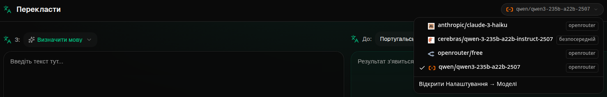
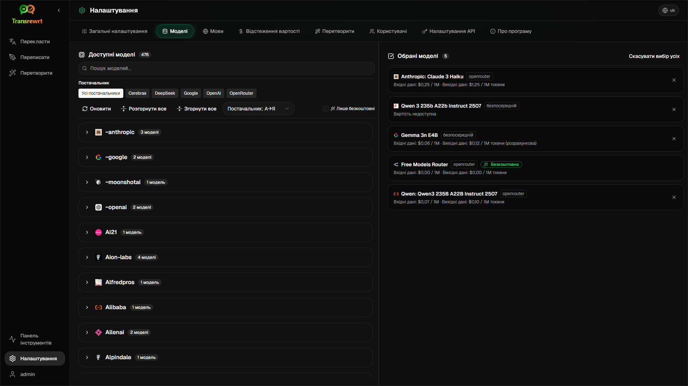

# Посібник для користувача

 

## Вступ

Transrewrt допомагає вам працювати з текстом трьома основними способами:

- **Перекласти** — перетворити текст з однієї мови на іншу.
- **Переписати** — переформулювати текст іншим стилем, наприклад, яснішим, коротшим або офіційнішим.
- **Перетворити** — обробити текст за допомогою спеціальних інструкцій для ШШ, які називаються промптами.

 

Цей посібник пояснює, як користуватися додатком після його встановлення та запуску. Інструкції щодо встановлення див. у головному файлі **[README](README.uk.md)**.

 

> ℹ️ **ПРИМІТКА** 
> Transrewrt доступний як настільний додаток для Windows і Linux, а також як веб-додаток для самостійного розгортання. Цей посібник присвячений щоденному використанню додатку. Там, де якась функція доступна лише для певної версії, це чітко позначено.

<small>**Читайте іншими мовами:** [English (UK)](../USER-GUIDE.md) · [Português (BR)](USER-GUIDE.pt-BR.md) · [العربية](USER-GUIDE.ar.md) · [বাংলা](USER-GUIDE.bn.md) · [Català](USER-GUIDE.ca.md) · [简体中文](USER-GUIDE.zh-CN.md) · [繁體中文](USER-GUIDE.zh-TW.md) · [Hrvatski](USER-GUIDE.hr.md) · [Čeština](USER-GUIDE.cs.md) · [Nederlands](USER-GUIDE.nl.md) · [English (US)](USER-GUIDE.en-US.md) · [Filipino](USER-GUIDE.tl.md) · [Français](USER-GUIDE.fr.md) · [Deutsch](USER-GUIDE.de.md) · [Ελληνικά](USER-GUIDE.el.md) · [हिन्दी](USER-GUIDE.hi.md) · [Magyar](USER-GUIDE.hu.md) · [Italiano](USER-GUIDE.it.md) · [日本語](USER-GUIDE.ja.md) · [Basa Jawa](USER-GUIDE.jv.md) · [한국어](USER-GUIDE.ko.md) · [Bahasa Melayu](USER-GUIDE.ms.md) · [فارسی](USER-GUIDE.fa.md) · [Polski](USER-GUIDE.pl.md) · [Português (PT)](USER-GUIDE.pt.md) · [ਪੰਜਾਬੀ](USER-GUIDE.pa.md) · [Română](USER-GUIDE.ro.md) · [Русский](USER-GUIDE.ru.md) · [Slovenčina](USER-GUIDE.sk.md) · [Español](USER-GUIDE.es.md) · [Kiswahili](USER-GUIDE.sw.md) · [Svenska](USER-GUIDE.sv.md) · [తెలుగు](USER-GUIDE.te.md) · [ภาษาไทย](USER-GUIDE.th.md) · [Türkçe](USER-GUIDE.tr.md) · [Українська](USER-GUIDE.uk.md) · [Tiếng Việt](USER-GUIDE.vi.md)</small>

<small>

> **Примітка щодо перекладів інтерфейсу та документації:** Усі мови інтерфейсу, окрім оригінальної англійської (UK), 
> були перекладені за допомогою моделей ШІ; формулювання можуть бути неточними або містити помилки.

</small>

 

<!-- START doctoc generated TOC please keep comment here to allow auto update -->
<!-- DON'T EDIT THIS SECTION, INSTEAD RE-RUN doctoc TO UPDATE -->
**Зміст**

- [Перш ніж почати](#before-you-start)
  - [Як отримати безкоштовний ключ API OpenRouter (настільний додаток)](#how-to-get-a-free-openrouter-api-key-desktop-app)
- [Початок роботи](#getting-started)
- [Основні частини вікна](#main-parts-of-the-window)
  - [Бічна панель](#sidebar)
  - [Панель інструментів](#toolbar)
  - [Панелі введення та виведення](#input-and-output-panels)
- [Переклад](#translate)
  - [Перекласти текст](#translate-text)
  - [Вибір мови](#language-selection)
  - [Корисні параметри перекладу](#helpful-translation-settings)
- [Переписання](#rewrite)
- [Перетворення](#transform)
  - [Виконати існуючий промпт](#run-an-existing-prompt)
  - [Якщо у вас ще немає жодного промпту](#if-you-have-no-prompts-yet)
  - [Швидко створити промпт](#create-a-prompt-quickly)
  - [Редагувати промпт](#edit-a-prompt)
  - [Протестувати промпт перед використанням](#test-a-prompt-before-using-it)
- [Панель управління](#dashboard)
  - [Фільтрування даних](#filter-the-data)
  - [Вкладки панелі управління](#dashboard-tabs)
  - [Експорт даних](#export-data)
  - [Видалення збережених записів для моделі](#delete-stored-records-for-a-model)
- [Історія](#history)
  - [Фільтрування даних](#filter-the-data-1)
  - [Експорт історії](#export-history-data)
- [Налаштування](#settings)
  - [Загальні налаштування](#general-settings)
  - [Моделі](#models)
  - [Мови](#languages)
  - [Відстеження вартості](#cost-tracking)
  - [Промпти перетворення](#transform-prompts)
  - [Користувачі](#users)
  - [Конфігурація API](#api-config)
  - [Про програму](#about)
- [Поширені проблеми](#common-issues)
  - [Додаток не перекладає, не переписує та не перетворює текст](#the-app-will-not-translate-rewrite-or-transform-text)
  - [Список моделей порожній](#the-model-list-is-empty)
  - [Результат дуже повільний або надто дорогий](#the-result-is-too-slow-or-too-expensive)
  - [Інтерфейс використовує неправильну мову](#the-interface-is-in-the-wrong-language)
  - [Текст замалий або важко читати](#the-text-is-too-small-or-hard-to-read)
  - [Графіки на панелі управління порожні](#dashboard-charts-are-empty)
  - [Вартість показує "недоступно" або здається неправильною](#cost-shows-not-available-or-seems-wrong)
  - [Загальна вартість не відповідає рахунку постачальника](#total-cost-does-not-match-my-provider-bill)
  - [Сторінка Історія відсутня в бічній панелі](#the-history-page-is-missing-from-the-sidebar)
  - [Веб-додаток: неочікувано перенаправляє на сторінку входу](#web-app-redirected-to-the-login-page-unexpectedly)
  - [На панелі управління відсутні дані для інших користувачів (веб)](#dashboard-shows-no-data-for-other-users-web)
  - [Я змінив промпт і втратив зміни](#i-changed-a-prompt-and-lost-the-edits)
- [Швидкі поради](#quick-tips)
- [Відмова від відповідальності](#disclaimer)
- [Ліцензія](#license)

<!-- END doctoc generated TOC please keep comment here to allow auto update -->

  

## Перш ніж почати

Для використання Transrewrt вам знадобиться доступ щонайменше до одного постачальника ШІ. Підтримувані постачальники: [OpenRouter](https://openrouter.ai) (який агрегує багато моделей), OpenAI, Anthropic, Google Gemini, DeepSeek, Groq, Mistral, xAI, Cerebras та [Ollama](https://ollama.com) для локальних моделей.

Обирати платну модель для початку не обов’язково. Як тільки ви додасте свій OpenRouter API-ключ, додаток автоматично активує вбудовану **безкоштовну** опцію OpenRouter. Це дозволяє одразу починати перекладати, переписувати та перетворювати текст. Крім того, ви також можете отримати безкоштовний API-ключ від Cerebras, Google, Groq або Mistral AI.

Простими словами:

- **Модель** — це штучний інтелект, що виконує завдання. Моделі позначаються з **префіксом постачальника** (наприклад, `openrouter/…`, `openai/…`, `ollama/…`).
- **API-ключ** (або для Ollama — **базова URL-адреса**) — це спосіб, за допомогою якого додаток зв'язується з постачальником.

Якщо ви використовуєте **десктопну версію**, додавайте ключі в розділі [**Налаштування** > **Налаштування API**](#api-config) для кожного постачальника, якого використовуєте. Для використання лише OpenRouter дивіться нижче [Як отримати API-ключ](#how-to-get-an-api-key-desktop-app). Якщо ви не хочете використовувати API-ключ, ви можете встановити Ollama (із [ollama.com](https://ollama.com)) і використовувати локальні моделі, наприклад `translategemma:4b`.

Якщо ви використовуєте **веб-версію**, серверний адміністратор налаштовує постачальників через змінні середовища, тому ви не можете вводити API-ключі безпосередньо в додатку.

 

### Як отримати безкоштовний API-ключ OpenRouter (десктопна версія)

Якщо ви використовуєте десктопний додаток, виконайте такі кроки:

1. Перейдіть на сайт [OpenRouter](https://openrouter.ai) у своєму веб-браузері.
2. Створіть обліковий запис або увійдіть.
3. Відкрийте сторінку [Keys](https://openrouter.ai/keys).
4. Натисніть кнопку для створення нового API-ключа.
5. Дайте ключеві назву, за якою ви зможете його розпізнати пізніше.
6. Скопіюйте новий API-ключ.
7. Поверніться до Transrewrt і відкрийте **Налаштування** > **Налаштування API**.
8. Вставте ключ у поле **OpenRouter API-ключ** (у розділі **Налаштування** > **Налаштування API**).
9. Натисніть **Тестувати OpenRouter-ключ**, щоб переконатися, що він працює.

  

## Перші кроки

Якщо це ваш перший досвід з Transrewrt, дійте в такому порядку:

1. Запустіть додаток.
2. За бажанням оберіть **Мову інтерфейсу**, натиснувши на піктограму глобуса.
3. Якщо ви використовуєте **десктопну версію**, відкрийте [**Налаштування** > **Налаштування API**](#api-config), додайте API-ключ хоча б одного постачальника (наприклад, OpenRouter) та натисніть **Тест**, щоб переконатися у його роботі.
4. Відкрийте [**Налаштування** > **Моделі**](#models) і додайте одну або кілька моделей до **Вибраних моделей**.
5. Відкрийте [**Налаштування** > **Мови**](#languages) і оберіть **Найчастіші мови**, якщо хочете, щоб найвикористовуваніші мови з’являлися першими.
6. Перейдіть до **Перекладу** і виконайте простий переклад, щоб перевірити працездатність усього.
7. Після цього спробуйте **Переписання**, а потім — **Перетворення**.

Саме цей порядок важливий. Він запобігає найпоширенішій проблемі при першому використанні: спробі виконати завдання до того, як додаток має робоче з'єднання через API або обрану модель.

  

## Основні частини вікна

Додаток розділено на три основні області:

- **Бічна панель** зліва.
- **Панель інструментів** зверху.
- **Робоча область** у центрі.

 

### Бічна панель

Використовуйте бічну панель, щоб переміщатися між розділами додатку. Ви можете згорнути бічну панель для більшого простору, натиснувши на піктограму біля логотипу додатку.

 

<table>
  <tr>
    <td valign="top">
       
    </td>
    <td valign="top">
        
      <ul>
        <li><strong>Переклад</strong> відкриває робочу область для перекладу.</li> 
        <li><strong>Переписання</strong> відкриває робочу область для переписування тексту.</li> 
        <li><strong>Перетворення</strong> відкриває робочу область для налаштованих запитів.</li> 
        <li><strong>Панель стану</strong> показує інформацію про використання та вартість.</li> 
        <li><strong>Налаштування</strong> відкриває панель налаштувань.</li> 
        <li><strong>Історія</strong> показує історію використання разом з вхідним і вихідним текстом.</li> 
        <li><strong>Користувач</strong> показує ім’я поточного користувача (лише для веб-версії).</li>
      </ul>
    </td>
  </tr>
</table>

 

### Панель інструментів

Панель інструментів трохи змінюється залежно від того, де ви перебуваєте в додатку.

- Зліва відображається назва поточної сторінки.
- Справа — **вибір моделі** та елемент керування **Мовою інтерфейсу**.

**Вибір моделі** дозволяє вибрати, який рушій ШІ використовувати для поточного завдання.

  

Деякі безкоштовні моделі можуть бути не завжди доступними — іноді вони вимкнені або мають обмеження використання. Якщо це трапиться, додаток автоматично вилучить таку модель зі списку доступних. Щоб керувати тим, які моделі відображаються, перейдіть до [**Налаштувань** > **Моделі**](#models) та змініть свій список моделей.  
Ви також можете відкрити налаштування моделі безпосередньо, натиснувши на іконку постачальника ліворуч від назви моделі на панелі інструментів.

 

**Іконка глобуса та код мови** змінюють мову інтерфейсу додатку (меню, кнопки тощо). Вони **не** змінюють мови перекладу, які використовуються в розділі **Переклад**.

  

 

### Панелі вводу та виводу

Більшість робочих областей використовують панель **Введення** зліва та панель **Виведення** справа.

Кожна панель також відображає:

| **Введення**                                                       | **Виведення**                                                                                                            |
|--------------------------------------------------------------------|--------------------------------------------------------------------------------------------------------------------------|
| - Кількість символів  - Кількість слів  - Кількість абзаців | - Тривалість виконання завдання - **TPS** (токени на секунду) - Кількість символів, слів, абзаців - Використана модель |

Якщо ви цікавитесь технічними термінами:

- **Токен** означає невелику частину тексту. Можна уявити це як частину слова або коротке слово.
- **TPS** означає кількість таких частин тексту, які модель обробляє щосекунди.

 

Ви також можете стежити за вартістю кожної операції (якщо доступно) та загальною вартістю, увімкнувши опцію `Показувати вартість операцій` в розділі [**Налаштування** > **Загальні налаштування**](#general-settings). 
 
  

[--------------------------------------------------------------------------------------------------------------------------]: # 

## Переклад

Використовуйте **Переклад**, коли хочете перетворити текст з однієї мови на іншу.

 

### Перекласти текст

1. Відкрийте **Переклад**.
2. Виберіть мову в полі **З**.
3. Виберіть мову в полі **На**.
4. Виберіть модель на панелі інструментів.
5. Введіть або вставте текст у поле **Введення**.
6. Натисніть **Перекласти**.
7. Прочитайте результат у полі **Виведення**.
8. Скористайтеся кнопкою копіювання, якщо хочете скопіювати результат.

 

### Вибір мови

- **З** може бути певною мовою або **Визначити мову**.
- **На** — це мова, на яку ви хочете отримати результат.

Ваші вибрані **Найпопулярніші мови** з'являються вгорі списку. Ви можете встановити їх у розділі [**Налаштування** > **Мови**](#languages).

 

### Корисні налаштування перекладу

У розділі [**Налаштування** > **Загальні налаштування**](#general-settings) ви можете змінити поведінку перекладу:

- **Автоматичний переклад після вставки** виконує переклад одразу після вставки тексту.
- **Автоматично копіювати результат у буфер** копіює результат автоматично після успішного виконання.
- **Переклад у реальному часі (під час друку)** виконує переклад, поки ви друкуєте.
- **Час очікування (мс)** визначає, як довго додаток чекає, перш ніж запустити переклад у реальному часі.
- **Enter** визначає, що відбуватиметься при натисканні клавіші `Enter`:

  

[--------------------------------------------------------------------------------------------------------------------------]: # 

## Переписати

Використовуйте **Переписати**, коли хочете поліпшити формулювання, не змінюючи основного змісту.

Це корисно для:

- виправлення правопису та граматики
- уточнення тексту
- надання тексту більш формального або неформального стилю
- скорочення або розширення тексту
- стилізації тексту як більш технічного

 

> 💡 **ПОРАДА** 
> Якщо використовувати режим "**Перевірити правопис і граматику**", у панелі виведення з'явиться кнопка `Показати зміни`. 
> Натисніть цю кнопку, щоб показати або приховати внесені виправлення.

  

[--------------------------------------------------------------------------------------------------------------------------]: # 

## Перетворення

Використовуйте **Перетворення**, коли хочете, щоб ШІ дотримувався ваших особливих інструкцій.

Це найбільш гнучка частина додатку. Ви можете використовувати її для таких завдань:

- стиснення нотаток
- перетворення сирах текстів на відредаговані електронні листи
- витягнення ключових моментів
- перетворення тексту в певний формат
- різних інших завдань із вхідним текстом

 

### Запуск наявного запиту

1. Відкрийте **Перетворення**.
2. Виберіть запит із списку запитів.
3. Якщо з’явиться поле **Цільова** мова, виберіть мову, якщо це потрібно.
4. Надрукуйте або вставте текст у поле **Введення**.
5. Натисніть **Перетворити**.
6. Прочитайте результат у полі **Виведення**.

 

### Якщо ще немає запитів

Якщо список запитів порожній, натисніть **Завантажити приклади запитів**. Це додасть вбудовані приклади, щоб ви могли почати швидко.

 

> ℹ️ **ПРИМІТКА** 
> Приклади запитів надаються англійською. Після завантаження ви можете редагувати запит і використати **Перекласти запит**, щоб перекласти його вашою мовою.

 

### Швидке створення запиту

Найшвидший спосіб створити запит:

1. Натисніть **Новий запит**.
2. Натисніть **Створити запит**.
3. Опишіть, що має робити запит.
4. Виберіть модель.
5. Дозвольте додатку створити чернетку для вас.
6. Перегляньте чернетку та натисніть **Зберегти**.

 

### Редагування запиту

Коли ви створюєте або редагуєте запит, редактор з'являється зліва, а зправа — область тестування.

Основні поля:

- **Назва запиту**: назва, що відображається у списку запитів.
- **Інструкції до запиту (необов’язково)**: коротка підказка, що відображається під час запуску запиту.
- **Роль моделі**: загальна роль, призначена для ШІ, наприклад «Ви — допоміжний асистент».
- **Інструкції моделі (одна на рядок)**: конкретні правила, яких ви хочете дотримуватися ШІ.
- **Опис виведення**: коротке слово, що описує результат, наприклад «підсумок» або «переписання».
- **Температура (0.0 → 1.0)**: характер поведінки моделі; див. нижче.
- **Запитувати цільову мову**: додає вибір цільової мови під час запуску запиту.

Якщо термін **Температура** новий для вас, уявіть це так:

- **Нижча** температура дає стабільніші, передбачуваніші результати.
- **Вища** температура дає більше різноманітності та креативності.

Також можна використовувати:

- **`Створити запит`** для створення нової чернетки на основі простого опису
- **`Покращити запит`** для вдосконалення наявного запиту
- **`Перекласти запит`** для перекладу полів запиту

 

> ⚠️ **ПОПЕРЕДЖЕННЯ** 
> Натисніть **`Зберегти`**, перш ніж натиснути **`Назад до запуску`**. Якщо ви повернетеся без збереження, ваші зміни буде втрачено.

 

### Тестування запиту перед використанням

Панель тестування справа дозволяє спробувати свій запит із прикладним текстом до використання у повсякденній роботі.

Це корисно, коли:

- ви створюєте новий запит
- ви порівнюєте дві версії запиту
- хочете перевірити стиль, довжину чи формат виведення

 

> ℹ️ **ПРИМІТКА** 
> Ви можете експортувати та імпортувати збережені запити в розділі [**Налаштування** > **Запити перетворення**](#transform-prompts).

  

[--------------------------------------------------------------------------------------------------------------------------]: #

## Панель статистики

Використовуйте **Панель статистики**, щоб бачити, наскільки активно ви використовуєте додаток та які витрати виникають (для платних моделей).

 

> ℹ️ **ПРИМІТКА** 
> Якщо ви використовуєте тільки безкоштовні моделі, діаграми, пов’язані з витратами, залишатимуться порожніми.

 

### Фільтрація даних

Скористайтеся кнопками фільтрів угорі, щоб змінити часовий діапазон.

 

> ℹ️ **ПРИМІТКА** 
> Фільтр **Користувач** доступний лише адміністраторам у веб-версії. Звичайні користувачі не побачать цей фільтр, а в десктопному додатку він недоступний.

 

### Вкладки інформаційної панелі

- **Зведення** — дає загальний огляд використання та вартості.
- **За використанням** — аналізує активність за мовами перекладу, режимами переписування та запитами перетворення.
- **За моделлю** — показує, які моделі ви використовували та скільки вони коштують.
- **За днями** — демонструє щоденні підсумки.
- **Усі запити** — відображає повну історію запитів і дозволяє експортувати її.

 

### Експорт даних

Таблиці на інформаційній панелі дозволяють експортувати дані у форматах:

- **JSON**
- **CSV**
- **XLSX**

Це корисно, якщо ви хочете проаналізувати активність поза додатком або поширити звіт.

 

### Видалення збережених записів для моделі

На вкладках **За моделлю** або **Усі запити** ви можете видалити збережені записи для моделі, натиснувши на іконку «смітника».

> ⚠️ **ПОПЕРЕДЖЕННЯ** 
> Видалення збережених записів є безповоротним. Використовуйте цю функцію лише тоді, коли ви точно впевнені, що ця історія більше не потрібна.

Щоб видалити всі дані або вилучити записи за критерієм віку, перейдіть до розділу [**Налаштування** > **Відстеження вартості**](#cost-tracking). Там ви знайдете опції для видалення всіх даних або лише тих, які старіші за певну дату.

  

[--------------------------------------------------------------------------------------------------------------------------]: # 

## Історія

Натисніть на **Історію**, щоб переглянути історію ваших дій у **Transrewrt**, включаючи вхідні та вихідні дані кожної операції.

 

### Фільтрація даних

**Історія** використовує ті ж фільтри, що й сторінка **Інформаційна панель**. Використовуйте їх для вибору часового діапазону.

 

> ℹ️ **ПРИМІТКА** 
> Фільтр **Користувач** є видимим лише для адміністраторів у веб-версії. Звичайні користувачі не побачать цей фільтр, а в десктопному додатку він недоступний.

 

### Експорт даних історії

Сторінка історії дозволяє експортувати фільтровані дані у форматах:

- **JSON**
- **CSV**
- **XLSX**

Це корисно, якщо ви хочете проаналізувати активність поза додатком або поширити звіт.

  

[--------------------------------------------------------------------------------------------------------------------------]: # 

## Налаштування

Відкрийте **Налаштування** з бічної панелі, щоб налаштувати поведінку додатка.

Наявні вкладки залежать від платформи та вашої ролі:

  | Вкладка               | Десктоп | Веб (адмін) | Веб (звичайний користувач) |
  |-----------------------|:-------:|:-----------:|:--------------------------:|
  | Загальні налаштування |   так   |     так     |             так            |
  | Моделі                |   так   |     так     |             так            |
  | Мови                  |   так   |     так     |             так            |
  | Відстеження вартості  |   так   |     так     |              —             |
  | Запити перетворення   |   так   |     так     |             так            |
  | Користувачі           |    —    |     так     |              —             |
  | Налаштування API      |   так   |     так     |              —             |
  | Про програму          |   так   |     так     |             так            |

 

> ℹ️ **ПРИМІТКА** 
> У веб-версії кожен користувач має власну конфігурацію. Налаштування, такі як вибрані моделі, мови, загальні параметри та запити перетворення, зберігаються для кожного користувача окремо. Зміни, які ви вносите, не впливають на інших користувачів.

 

[--------------------------------------------------------------------------------------------------------------------------]: # 

### Загальні налаштування

Використовуйте **Загальні налаштування**, щоб керувати поведінкою під час вводу тексту, збереженням деталей виконання для **Історії** та зовнішнім виглядом.

**Поведінка**

- **Поведінка клавіші ENTER** — визначає, чи `Enter` виконує завдання чи вставляє новий рядок.
- **Автоматичний переклад при вставці** — починає переклад одразу після вставки тексту.
- **Автоматичне копіювання результату в буфер обміну** — автоматично копіює успішні результати.
- **Переклад у реальному часі (під час вводу)** — перекладає текст під час введення.
- **Час очікування (мс)** — встановлює час затримки для перекладу в режимі реального часу.

**Історія**

- **Зберігати історію виконання** — визначає, чи зберігається **вхідний і вихідний текст** для кожної операції перекладу, переписування чи перетворення у відображеній у бічній панелі [**Історії**](#history). Якщо вимкнути — буде запит підтвердження; після підтвердження з бази даних буде видалено збережений текст історії.
- **Видалення даних історії** — дозволяє видалити збережений текст за віком (наприклад, старіше кількох місяців або **всі дані (очистити)**) за допомогою функції **Видалити дані**. Це впливає лише на збережений текст виконаних операцій для відображення **Історії**; це **не** видаляє дані про вартість або підсумки використання. Щоб видалити або скоротити **дані про вартість**, скористайтеся [**Налаштування** > **Відстеження вартості**](#cost-tracking).

**Зовнішній вигляд**

- **Показувати інформацію про вартість у діях** — керує відображенням вартості кожної операції (якщо доступно) та загальної вартості на панелях виведення Перекладу, Переписування та Перетворення.
- **Кількість знаків після коми у вартості** — змінює відображення десяткових знаків вартості.
- **Лише веб-версія**: **показувати поля навколо додатка** — додає додатковий простір навколо інтерфейсу.
- **Сімейство шрифтів** — змінює шрифт у текстових панелях.
- **Розмір** — змінює розмір шрифту.

 

### Моделі

Використовуйте **Налаштування** > **Моделі**, щоб обрати, які моделі з’являться на панелі інструментів.

Сторінка має два списки:

- **Доступні моделі** на лівій стороні
- **Обрані моделі** на правій стороні

Корисні елементи керування:

- **Пошук моделей...**, щоб знайти модель за назвою
- Вкладки **Постачальника** для звуження списку до одного постачальника (OpenRouter, OpenAI, Ollama, …)
- **Лише безкоштовні**, щоб показувати лише безкоштовні моделі
- **Оновити**, щоб перезавантажити список
- **Розгорнути всі** та **Згорнути всі**, коли сортуєте за постачальником

Ідентифікатори моделей включають префікс постачальника (наприклад, `openrouter/…` або `openai/…`). Мітки, такі як **OpenAI (OpenRouter)** порівняно з **OpenAI (безпосередньо)**, вказують, як маршрутиться трафік.

> ℹ️ **ПРИМІТКА** 
> Модель-маршрутизатор **OpenRouter Body Builder** (`openrouter/bodybuilder`) не є звичайною текстовою чат-моделлю: її відповідь — це JSON, який описує тіла запитів до API OpenRouter (наприклад, масив `requests` із `model` та `messages`). Якщо використовувати її для **Перекладу**, **Переформулювання** або **Трансформації**, на панелі виводу буде показано цей JSON замість готового тексту. Для цих завдань оберіть звичайну текстову модель. Дивіться сторінку [моделі Body Builder](https://openrouter.ai/openrouter/bodybuilder) на OpenRouter.

Дії:

 - Щоб додати модель, натисніть **Додати** або у будь-якому місці запису.

 - Щоб вилучити модель, натисніть **X** біля неї у списку **Обрані моделі** або **Обрано** у записі у списку Доступних моделей.

 - Щоб очистити список, клацніть **Скасувати вибір усіх**. Обов’язкова безкоштовна модель залишиться у списку.

 

> ℹ️ **ПРИМІТКА** 
> Якщо ви не хочете одразу додавати кошти на баланс OpenRouter, спочатку увімкніть **Лише безкоштовні** та оберіть безкоштовні моделі (без необхідності картки). Ви також можете використовувати Ollama для запуску моделей локально без ключів API.

 

### Мови

Використовуйте **Налаштування** > **Мови**, щоб упорядкувати списки мов, що використовуються в додатку.

- **Найпопулярніші мови** закріплені у верхній частині спливаючих меню мов у **Перекладі** та **Трансформації**.
- **Користувацька мова** дозволяє додати мову, якої немає у вбудованому списку.

Якщо ви додасте користувацьку мову, вона з’явиться у вибірках мов разом із вбудованими варіантами.

 

### Відстеження витрат

Використовуйте **Налштування** > **Відстеження витрат** для керування інформацією про витрати.

- **Загальні витрати** відображають сукупну суму.
- **Копіювати значення** копіює загальну суму в буфер обміну.
- **Скинути витрати** обнуляє збережену суму.
- **Синхронізувати із використанням ключа API** встановлює загальну суму, щоб вона відповідала даним використання, повідомленим вашим обліковим записом OpenRouter (лише для OpenRouter).
- **Використання ключа API** відображає деталі використання OpenRouter, якщо дані доступні.
- **Вилучити дані про витрати** видаляє всі дані або лише записи старші за вказану дату.

**Відстеження витрат:** під час використання моделей OpenRouter додаток показує ваші реальні витрати на основі інформації від OpenRouter. Для інших постачальників додаток оцінює витрати, використовуючи ціни, опубліковані OpenRouter. Якщо ціни недоступні, оцінка може бути нульовою.

 

> ℹ️ **ПРИМІТКА** 
> **Усі цифри щодо витрат — лише орієнтовні значення для вашого ознайомлення, не є офіційними рахунками.**

 

> ⚠️ **ПОПЕРЕДЖЕННЯ** 
> Видалення даних неможливо скасувати. Перш ніж видаляти, обов’язково збережіть резервну копію або експортуйте дані через [**Історію**](#history) 
> або [**Панель стану** > **Усі запити**](#dashboard-tabs), інакше дані буде втрачено назавжди. 
> Разом із кожним записом API-запиту буде видалено й історію вхідних та вихідних даних.

 

### Промпти трансформації

Використовуйте **Налаштування** > **Промпти трансформації**, щоб керувати промптами групово.

Ви можете:

- переглянути збережені промпти
- видалити промпти
- імпортувати промпти з файлу
- експортувати промпти для резервного копіювання або обміну

 

### Користувачі

Використовуйте **Користувачі**, щоб керувати обліковими записами у веб-версії. Ви можете додавати користувачів, оновлювати їхні дані, скидати паролі та видаляти облікові записи.

 

### Конфігурація API

Підтримувані постачальники: OpenRouter, OpenAI, Anthropic, Google Gemini, DeepSeek, Groq, Mistral, xAI, Cerebras та **Ollama** (локальні моделі через базовий URL). Вам потрібно налаштовувати лише тих постачальників, яких ви використовуєте.

**Веб-додаток: лише адміністратор**

Ключі API налаштовуються через системні або Docker-змінні середовища — їх не вводять у веб-інтерфейсі. На цій сторінці відображається, для яких постачальників налаштовано ключ, і ви можете протестувати кожен з них, натиснувши кнопку **`Тест`**.

 

> ℹ️ **ПРИМІТКА** 
> Щоб змінити ключ API, оновіть змінну середовища у вашій системі або конфігурації Docker і перезапустіть сервер або контейнер.

 

**Десктоп-додаток**

Використовуйте **Налаштування API**, щоб зберігати ключі API для кожного постачальника, якого ви використовуєте. Для Ollama замість ключа API введіть **базовий URL**.

 

> 💡 **Порада**  
> Якщо ви не хочете використовувати ключ API або платити за використання, ви можете [завантажити Ollama](https://ollama.com) і безкоштовно запускати моделі (наприклад, `translategemma:4b`) локально на своїй машині. Або створіть безкоштовний обліковий запис OpenRouter (без кредитної картки), щоб використовувати їхні безкоштовні моделі, або отримайте безкоштовний ключ API від Cerebras, Google, Groq або Mistral AI.

 

- Додавайте лише потрібних постачальників. У **Налаштуваннях** > **Моделі** кожен ідентифікатор моделі починається з постачальника (наприклад, `openrouter/openrouter/free`, `openai/gpt-4o`, `ollama/llama3`).

Щоб додати ключ API, введіть значення в текстове поле та натисніть **`Зберегти`**. Щоб змінити існуючий ключ, натисніть **`Редагувати`**. Щоб перевірити, чи ключ працює, клацніть **`Тест`**. Для базової адреси Ollama завжди натискайте **`Тест`**, щоб перевірити з’єднання.

 

> ℹ️ **ПРИМІТКА** 
> Ви не можете переглянути поточне значення ключа API. Ви можете лише замінити його, використовуючи кнопку **`Редагувати`**.
> Ключі API зберігаються в зашифрованому вигляді в конфігурації.

 

### Про програму

На вкладці **Про програму** відображається:

- назва програми
- номер версії
- дата збірки
- посилання на сховище проекту

  

## Поширені проблеми

Якщо щось не працює, як очікувалося, перш за все перевірте наступне.

 

### Програма не перекладає, не переписує та не перетворює текст

Переконайтеся, що:

- ви вибрали модель на панелі інструментів
- принаймні одна модель вказана в розділі [**Налаштування** > **Моделі**](#models)
- налаштування API працює правильно

Якщо ви використовуєте настільну програму:

1. Відкрийте [**Налаштування** > **Налаштування API**](#api-config).
2. Переконайтеся, що хоча б один API-ключ збережено.
3. Натисніть **Тест** біля провайдера, щоб підтвердити роботу ключа.

 

### Список моделей порожній

Відкрийте [**Налаштування** > **Моделі**](#models) і натисніть **Оновити**.

За потреби:

- пошукайте модель
- увімкніть **Тільки безкоштовні**
- додайте одну або кілька моделей до **Обрані моделі**

 

### Результат надто повільний або надто дорогий

Спробуйте одне або кілька з наступного:

- виберіть іншу модель
- використовуйте коротший вхідний текст
- вимкніть **Переклад у реальному часі (під час введення)** в розділі [**Налаштування** > **Загальні налаштування**](#general-settings)
- використовуйте безкоштовні моделі для простих задач (див. [Моделі](#models))

 

### Інтерфейс на неправильній мові

Натисніть на іконку глобуса на [панелі інструментів](#toolbar) і виберіть бажану **Мову інтерфейсу**.

 

### Текст надто малий або важко читати

Відкрийте [**Налаштування** > **Загальні налаштування**](#general-settings) і змініть:

- **Сімейство шрифтів**
- **Розмір**

 

### Діаграми на інформаційній панелі порожні

Це нормально, якщо:

- ви використовуєте лише **безкоштовні моделі** (діаграми вартості будуть порожніми)
- вибраний **фільтр часу** не охоплює період, коли були зроблені запити — спробуйте вибрати **Усі**, щоб перевірити

Якщо діаграми все ще порожні після вибору **Усі**, переконайтеся, що запити відображаються в розділі [**Історія**](#history) або на вкладці **Усі запити**.

 

### Вартість показує "недоступно" або виглядає неправильною

Коли ви використовуєте моделі через **OpenRouter**, додаток відображає ваші фактичні витрати, повідомлені OpenRouter.

Для **інших провайдерів** (безпосередньо OpenAI, безпосередньо Anthropic тощо) вартість є оцінкою на основі прайсів, опублікованих OpenRouter. Якщо відповідна ціна для моделі не знайдена, вартість відобразиться як **недоступна** і не буде врахована в загальній сумі.

 

### Загальна вартість не збігається з рахунком провайдера

Усі показники вартості в додатку є **означеними вартостями для довідки**, а не офіційними рахунками.

Щоб загальна сума була ближчою до ваших реальних витрат через OpenRouter, відкрийте [**Налаштування** > **Відстеження вартості**](#cost-tracking) і натисніть **Синхронізувати за використанням API-ключа**.

 

### Сторінку Історія відсутня в бічній панелі

Опція **Зберігати історію виконання** може бути вимкненою. Відкрийте [**Налаштування** > **Загальні налаштування**](#general-settings) і увімкніть її. Зверніть увагу, що її увімкнення не відновить раніше видалені дані історії.

 

### Веб-додаток: неочікувано перенаправляє на сторінку входу

Сесія могла закінчитися. Увійдіть знову. Якщо це трапляється часто, перевірте конфігурацію сервера щодо налаштувань терміну дії сесії.

 

### Інформаційна панель не показує дані інших користувачів (веб)

Лише **адміністратори** можуть переглядати дані всіх користувачів за допомогою фільтра **Користувач**. Звичайні користувачі за замовчуванням бачать лише власну активність.

 

### Я змінив підказку і втратив редагування

Під час редагування підказки завжди натискайте **Зберегти**, перш ніж натискати **Назад до запуску**.

  

## Швидкі поради

- Почніть з [**Перекласти**](#translate), щоб переконатися, що ваша конфігурація працює, перш ніж переходити до [**Переписати**](#rewrite) або [**Перетворити**](#transform).
- Використовуйте [**Переписати**](#rewrite) для щоденного покращення формулювань.
- Використовуйте [**Перетворити**](#transform), коли вам потрібен повторюваний робочий процес для певного завдання.
- Використовуйте [**Інформаційну панель**](#dashboard), щоб стежити за використанням та вартістю.
- Використовуйте [**Історію**](#history), щоб переглянути попередні операції та повний вхідний/вихідний текст.
- Регулярно експортуйте підказки, якщо ви створюєте бібліотеку підказок, яку хочете зберегти, (див. [Підказки перетворення](#transform-prompts)) або якщо хочете поділитися нею з іншими.

  

## Застереження

Назви продуктів і значки належать їх відповідним власникам і використовуються виключно з метою ідентифікації. Це програмне забезпечення не афілійоване з жодним із згаданих брендів і не підтримується ними.

  

## Ліцензія

Авторське право © 2026 Вальдемар Скіделлер-молодший.

[Ліцензія Apache 2.0](LICENSE)