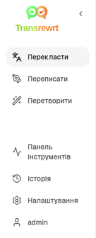
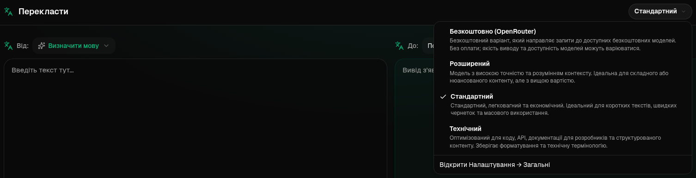
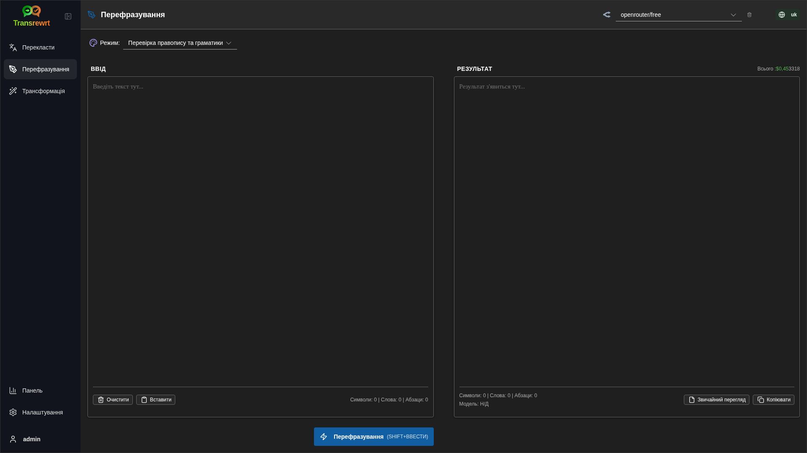
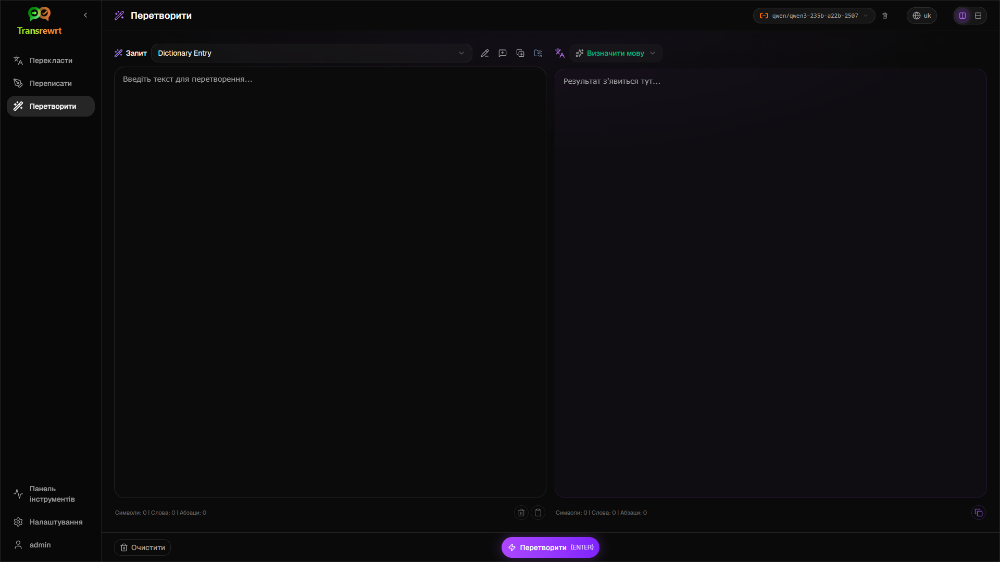
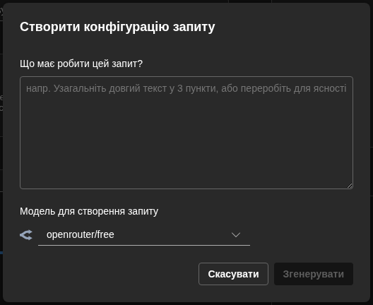
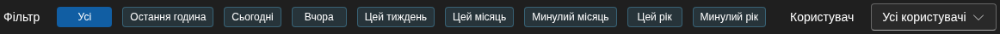

<a id="transrewrt-user-guide"></a>
# Посібник для користувача

<br/>

<a id="introduction"></a>
## Вступ

Transrewrt допомагає працювати з текстом трьома основними способами:

- **Перекласти** — перетворити текст з однієї мови на іншу.
- **Переписати** — перефразувати текст у різному стилі, наприклад, зрозуміліше, коротше або формальніше.
- **Перетворити** — обробити текст за допомогою спеціальних інструкцій для штучного інтелекту, які називаються промптами.

За замовчуванням додаток працює в **Простому** режимі: ви вибираєте **попереднє налаштування** (наприклад, Безкоштовно (OpenRouter), Стандартний, Розширений або Технічний) та **постачальника** в розділі Налаштування, не вказуючи ідентифікатори моделей. Перемкніться на **Розширений** режим у [**Налаштування** > **Загальні налаштування**](#general-settings), якщо хочете отримати класичний список моделей з [**Налаштування** > **Моделі**](#models).

<br/>

У цьому посібнику пояснюється, як користуватися додатком після його встановлення та запуску. Щодо кроків встановлення див. основний [**README**](README.uk.md).

<br/>

> ℹ️ **ПРИМІТКА**<br/>
> Transrewrt доступний як настільний додаток для Windows і Linux, а також як веб-додаток для самостійного розгортання. Цей посібник присвячений повсякденному використанню додатка. Якщо якась функція стосується лише однієї версії, це чітко позначено.

<small>**Читати іншими мовами:** </small>
<small id="lang-list">[English (GB)](../USER-GUIDE.md) · [Português (Brasil)](./USER-GUIDE.pt-BR.md) · [العربية](./USER-GUIDE.ar.md) · [বাংলা](./USER-GUIDE.bn.md) · [Català](./USER-GUIDE.ca.md) · [中文 (中国大陆)](./USER-GUIDE.zh-CN.md) · [中文 (台灣)](./USER-GUIDE.zh-TW.md) · [Hrvatski](./USER-GUIDE.hr.md) · [Čeština](./USER-GUIDE.cs.md) · [Nederlands](./USER-GUIDE.nl.md) · [English (US)](./USER-GUIDE.en-US.md) · [Tagalog](./USER-GUIDE.tl.md) · [Français](./USER-GUIDE.fr.md) · [Deutsch](./USER-GUIDE.de.md) · [Ελληνικά](./USER-GUIDE.el.md) · [हिन्दी](./USER-GUIDE.hi.md) · [Magyar](./USER-GUIDE.hu.md) · [Italiano](./USER-GUIDE.it.md) · [日本語](./USER-GUIDE.ja.md) · [한국어](./USER-GUIDE.ko.md) · [Bahasa Melayu](./USER-GUIDE.ms.md) · [فارسی](./USER-GUIDE.fa.md) · [Polski](./USER-GUIDE.pl.md) · [Basa Jawa](./USER-GUIDE.jv.md) · [Português](./USER-GUIDE.pt.md) · [ਪੰਜਾਬੀ](./USER-GUIDE.pa.md) · [Română](./USER-GUIDE.ro.md) · [Русский](./USER-GUIDE.ru.md) · [Slovenčina](./USER-GUIDE.sk.md) · [Español](./USER-GUIDE.es.md) · [Kiswahili](./USER-GUIDE.sw.md) · [Svenska](./USER-GUIDE.sv.md) · [తెలుగు](./USER-GUIDE.te.md) · [ไทย](./USER-GUIDE.th.md) · [Türkçe](./USER-GUIDE.tr.md) · [Українська](./USER-GUIDE.uk.md) · [Tiếng Việt](./USER-GUIDE.vi.md)</small>

<small>

> **Примітка щодо перекладів інтерфейсу та документації:** Усі мови інтерфейсу, крім оригінальної англійської (Великобританія), 
> були перекладені за допомогою моделей ШІ; формулювання можуть бути неточними або містити помилки.

</small>

<br/>

<!-- START doctoc generated TOC please keep comment here to allow auto update -->
<!-- DON'T EDIT THIS SECTION, INSTEAD RE-RUN doctoc TO UPDATE -->
**Зміст**

- [Перш ніж почати](#before-you-start)
  - [Як отримати безкоштовний ключ API OpenRouter (настільний додаток)](#how-to-get-a-free-openrouter-api-key-desktop-app)
- [Початок роботи](#getting-started)
- [Основні елементи вікна](#main-parts-of-the-window)
  - [Бічна панель](#sidebar)
  - [Панель інструментів](#toolbar)
  - [Панелі вхідних і вихідних даних](#input-and-output-panels)
- [Переклад](#translate)
  - [Перекласти текст](#translate-text)
  - [Вибір мови](#language-selection)
  - [Корисні налаштування перекладу](#helpful-translation-settings)
  - [Уточнення вашого перекладу](#refining-translation)
- [Перезапис](#rewrite)
- [Трансформація](#transform)
  - [Запустити існуючу підказку](#run-an-existing-prompt)
  - [Якщо у вас ще немає підказок](#if-you-have-no-prompts-yet)
  - [Швидко створити підказку](#create-a-prompt-quickly)
  - [Редагувати підказку](#edit-a-prompt)
  - [Тестувати підказку перед використанням](#test-a-prompt-before-using-it)
- [Панель керування](#dashboard)
  - [Фільтрувати дані](#filter-the-data)
  - [Вкладки панелі керування](#dashboard-tabs)
  - [Експортувати дані](#export-data)
  - [Видалити збережені записи для моделі](#delete-stored-records-for-a-model)
- [Історія](#history)
  - [Фільтрувати історію](#filter-the-history)
  - [Експортувати дані історії](#export-history-data)
- [Налаштування](#settings)
  - [Загальні налаштування](#general-settings)
  - [Моделі](#models)
  - [Мови](#languages)
  - [Відстеження витрат](#cost-tracking)
  - [Трансформація (вкладка налаштувань)](#transform-settings-tab)
  - [Користувачі](#users)
  - [Налаштування API](#api-config)
  - [Про](#about)
- [Загальні проблеми](#common-issues)
  - [Додаток не перекладає, не перезаписує або не трансформує текст](#the-app-will-not-translate-rewrite-or-transform-text)
  - [Список моделей порожній](#the-model-list-is-empty)
  - [Результат занадто повільний або занадто дорогий](#the-result-is-too-slow-or-too-expensive)
  - [Інтерфейс не тією мовою](#the-interface-is-in-the-wrong-language)
  - [Текст занадто малий або важко читати](#the-text-is-too-small-or-hard-to-read)
  - [Підсумок панелі керування виглядає порожнім](#dashboard-summary-looks-empty)
  - [Вартість показує "не доступно" або виглядає неправильно](#cost-shows-not-available-or-seems-wrong)
  - [Загальна вартість не відповідає рахунку мого постачальника](#total-cost-does-not-match-my-provider-bill)
  - [Сторінка Історії відсутня в бічній панелі](#the-history-page-is-missing-from-the-sidebar)
  - [Веб-додаток: несподівано перенаправлено на сторінку входу](#web-app-redirected-to-the-login-page-unexpectedly)
  - [Веб-адміністратор: забув або втратив пароль](#web-admin-forgot-or-lost-a-password)
  - [Панель керування не показує дані для інших користувачів (веб)](#dashboard-shows-no-data-for-other-users-web)
  - [Я змінив підказку і втратив редагування](#i-changed-a-prompt-and-lost-the-edits)
- [Швидкі поради](#quick-tips)
- [Відмова від відповідальності](#disclaimer)
- [Ліцензія](#license)

<!-- END doctoc generated TOC please keep comment here to allow auto update -->

<br/><br/>

<a id="before-you-start"></a>
## Перш ніж почати

Щоб використовувати Transrewrt, вам потрібен доступ хоча б до одного постачальника ШІ. Підтримувані постачальники: [OpenRouter](https://openrouter.ai) (який об'єднує багато моделей), OpenAI, Anthropic, Google Gemini, DeepSeek, Groq, Mistral, xAI, Cerebras та [Ollama](https://ollama.com) для локальних моделей.

Вам не потрібно вибирати платну модель для початку. Як тільки ви додасте свій ключ API OpenRouter, програма автоматично ввімкне вбудований **безкоштовний** варіант OpenRouter. Це дозволить вам одразу ж перекладати, переписувати та трансформувати текст. Альтернативно, ви також можете отримати безкоштовний ключ API від Cerebras, Google, Groq, Mistral AI або [NVIDIA](https://build.nvidia.com/) (OpenAI-сумісний API).

Простими словами:

- У **Простому** режимі **попереднє налаштування** (Безкоштовно (OpenRouter), Стандартний, Розширений або Технічний) відповідає моделі обраного **постачальника** (OpenRouter, OpenAI, Ollama та інші). У панелі інструментів відображаються лише ті попередні налаштування, які підтримуються поточним постачальником. Ви обираєте попереднє налаштування при перекладі, переписанні або перетворенні.
- У **Розширеному** режимі **модель** — це рушій ШІ, який ви обираєте безпосередньо. Ідентифікатори моделей використовують **префікс постачальника** (наприклад, `openrouter/…`, `openai/…`, `ollama/…`).
- **API-ключ** (або для Ollama — **базовий URL**) дозволяє додатку зв’язатися з постачальником.

Якщо ви використовуєте **настільний додаток**, додайте ключі в [**Налаштування** > **Налаштування API**](#api-config) для кожного постачальника, якого використовуєте. Якщо ви використовуєте лише OpenRouter, див. нижче [Як отримати безкоштовний ключ API OpenRouter](#how-to-get-a-free-openrouter-api-key-desktop-app). Якщо ви не хочете використовувати ключ API, ви можете встановити Ollama (із [ollama.com](https://ollama.com)) і використовувати локальні моделі, наприклад `translategemma:4b`.

Якщо ви використовуєте **веб-версію**, адміністратор сервера налаштовує постачальників через змінні середовища, тому ви не можете безпосередньо вводити ключі API в додатку.

<br/>

<a id="how-to-get-a-free-openrouter-api-key-desktop-app"></a>
### Як отримати безкоштовний ключ API OpenRouter (настільний додаток)

Якщо ви використовуєте настільний додаток, виконайте такі кроки:

1. Перейдіть на сайт [OpenRouter](https://openrouter.ai) у своєму веб-браузері.
2. Створіть обліковий запис або увійдіть.
3. Відкрийте сторінку [Keys](https://openrouter.ai/keys).
4. Натисніть кнопку, щоб створити новий ключ API.
5. Надайте ключу назву, щоб ви змогли розпізнати його пізніше.
6. Скопіюйте новий ключ API.
7. Поверніться до Transrewrt і відкрийте **Налаштування** > **Налаштування API**.
8. Вставте ключ у поле **OpenRouter API key** (у розділі **Налаштування** > **Налаштування API**).
9. Натисніть **Test OpenRouter key**, щоб переконатися, що він працює.

<br/><br/>

<a id="getting-started"></a>
## Початок роботи

Якщо ви вперше використовуєте Transrewrt, дотримуйтесь такого порядку:

1. Відкрийте додаток.
2. Виберіть свою **Мову інтерфейсу** з іконки глобуса, якщо потрібно.
3. Якщо ви на **десктопному додатку**, відкрийте [**Налаштування** > **Налаштування API**](#api-config), додайте API-ключ для принаймні одного постачальника (наприклад, OpenRouter) і натисніть **Тест** для перевірки його роботи.
4. Відкрийте [**Налаштування** > **Загальні налаштування**](#general-settings). У режимі **Простий** (за замовчуванням) виберіть **Постачальника**, у якого налаштований ключ. У режимі **Розширений** відкрийте [**Налаштування** > **Моделі**](#models) і додайте одну або кілька моделей до **Обраних моделей**.
5. Натисніть **Перекласти**, виберіть **попереднє налаштування** (Простий) або **модель** (Розширений) на панелі інструментів.
6. Відкрийте [**Налаштування** > **Мови**](#languages) і виберіть свої **Найчастіші мови**, якщо хочете, щоб найчастіше використовувані мови відображалися першими.
7. Виконайте простий переклад, щоб переконатися, що все працює, потім спробуйте **Переписати** та **Перетворити**.

Цей порядок має значення. Він запобігає найпоширенішій проблемі для нових користувачів: спробі виконати завдання до того, як додаток отримав робоче API-з’єднання або обране попереднє налаштування/модель.

<br/><br/>

<a id="main-parts-of-the-window"></a>
## Основні частини вікна

Додаток поділено на три основні області:

- **Бічна панель** зліва.
- **Панель інструментів** зверху.
- **Робоча область** по центру.

<br/>

<a id="sidebar"></a>
### Бічна панель

Використовуйте бічну панель, щоб переміщатися по додатку. Ви можете згорнути бічну панель, щоб звільнити місце, натиснувши піктограму біля логотипу додатка.

<br/>

<table>
  <tr>
    <td valign="top">
       
    </td>
    <td valign="top">
      <br/><br/>
      <ul>
        <li><strong>Перекласти</strong> відкриває робочу область перекладу.</li><br/>
        <li><strong>Переписати</strong> відкриває робочу область переписування.</li><br/>
        <li><strong>Перетворити</strong> відкриває робочу область з власним запитом.</li><br/>
        <li><strong>Панель інструментів</strong> показує інформацію про використання та вартість.</li><br/>
        <li><strong>Налаштування</strong> відкриває панель налаштувань.</li><br/>
        <li><strong>Історія</strong> показує історію використання з вхідним і вихідним текстом</li><br/>
        <li><strong>Користувач</strong> показує ім'я користувача, який увійшов у систему (лише для веб-версії).</li>
      </ul>
    </td>
  </tr>
</table>

<br/>

<a id="toolbar"></a>
### Панель інструментів

Панель інструментів трохи змінюється залежно від того, де ви перебуваєте в додатку.

- Зліва відображається назва поточної сторінки.
- Справа — **вибір попереднього налаштування або моделі** та керування **Мовою інтерфейсу**.

У **Простому** режимі панель інструментів містить **вибір попереднього налаштування** з вбудованими варіантами: **Безкоштовно (OpenRouter)**, **Стандартний**, **Розширений** та **Технічний**. Які саме попередні налаштування відображаються, залежить від обраного **постачальника** у [**Налаштування** > **Загальні налаштування**](#general-settings). Наприклад, **Безкоштовно (OpenRouter)** показується лише, якщо постачальник — OpenRouter. Якщо **постачальник** — **Ollama**, замість попередніх налаштувань у панелі інструментів відображаються ваші встановлені локальні моделі.

У режимі **Розширений** **вибір моделі** дозволяє вам вибрати, який AI-двигун використовувати для поточної задачі.



У режимі Розширений деякі безкоштовні моделі можуть бути не завжди доступні — вони можуть бути офлайн або досягти обмеження використання. Додаток може автоматично видалити цю модель зі списку. Щоб контролювати, які моделі з'являються, перейдіть до [**Налаштування** > **Моделі**](#models). Ви можете відкрити налаштування моделі з іконки постачальника ліворуч від назви моделі на панелі інструментів.

<br/>

Піктограма **глобуса та коду мови** змінює мову інтерфейсу додатка, наприклад, меню та кнопки. Вона **не** змінює мови перекладу, які використовуються в **Перекладі**.


<br/>

<a id="input-and-output-panels"></a>
### Панелі введення та виведення

Більшість робочих областей використовують ліву панель **Вхідні дані** та праву панель **Вихідні дані**.

Кожна панель також показує:

| **Вхідні дані**                                                          | **Вихідні дані**                                                                                                                  |
|--------------------------------------------------------------------|-----------------------------------------------------------------------------------------------------------------------------|
| - Кількість символів <br/>- Кількість слів <br/>- Кількість абзаців   <br/> | - Як довго виконувалося завдання<br/>- **TPS** (токени за секунду)<br/>- Кількість символів, слів і абзаців<br/>- Використана модель |

Якщо ви цікавитесь технічними термінами:

- **Токен** означає невелику частину тексту. Можна уявити це як частину слова або коротке слово.
- **TPS** означає, скільки таких частин тексту модель обробляє за секунду.

<br/>

Ви також можете відстежувати вартість кожної операції (якщо доступно) та загальну вартість, увімкнувши опцію `Show cost information on the actions` в [**Налаштування** > **Загальні налаштування**](#general-settings).

<br/><br/>

[--------------------------------------------------------------------------------------------------------------------------]: #

<a id="translate"></a>
## Перекласти

Використовуйте **Перекласти**, коли потрібно перетворити текст з однієї мови на іншу.


<br/>

<a id="translate-text"></a>
### Перекласти текст

1. Відкрийте **Переклад**.
2. Виберіть мову в полі **З**.
3. Виберіть мову в полі **На**.
4. Виберіть попереднє налаштування (Простий) або модель (Розширений) на панелі інструментів.
5. Введіть або вставте текст у поле **Вхідні дані**.
6. Натисніть **Перекласти**.
7. Прочитайте результат у полі **Вихідні дані**.
8. Скористайтеся кнопкою копіювання, якщо хочете скопіювати результат.
9. За бажанням уточніть результат за допомогою **Перефразувати…** або альтернатив слів — див. [Уточнення вашого перекладу](#refining-translation).

<br/>

<a id="language-selection"></a>
### Вибір мови

- **З** може бути конкретною мовою або **Визначити мову**.
- **На** — це мова, на яку ви хочете отримати результат.

Обрані вами **Найчастіші мови** відображаються вгорі списку. Ви можете встановити їх у розділі [**Налаштування** > **Мови**](#languages).

<br/>

<a id="helpful-translation-settings"></a>
### Корисні налаштування перекладу

У розділі [**Налаштування** > **Загальні налаштування**](#general-settings) можна змінити поведінку перекладу:

- **Автоматичне виконання при вставці** запускає переклад, як тільки ви вставляєте текст.
- **Автоматичне копіювання результату в буфер обміну** автоматично копіює результат після успішного виконання.
- **Переклад в реальному часі під час введення** (⚠️ Це може збільшити витрати на використання) виконує переклади під час введення тексту.
- **Тайм-аут (мс)** контролює, як довго додаток чекає перед виконанням перекладу в реальному часі.
- **Поведінка для ENTER** вибирає, чи `Enter` виконує завдання або вставляє новий рядок:
  - **Enter** виконує переклад або перезапис (за замовчуванням).
  - **Shift + Enter** виконує переклад або перезапис; простий **Enter** вставляє новий рядок.

<br/>

<a id="refining-translation"></a>
### Уточнення вашого перекладу

Після успішного перекладу **Перефразувати…** та випадаюче меню версій з'являються в заголовку виводу, поруч із селектором мови **До:**. Ви можете уточнити результат там:

1. **Перефразувати…** — без вибраного тексту у виводі отримайте ще один повний переклад того ж введення з іншими формулюваннями. Модель отримує всі версії, які у вас вже є, тому нове формулювання може відрізнятися від усіх них. Ви можете зберігати до **п'яти** версій і перемикатися між ними у випадаючому меню версій. При вибраному тексті **Перефразувати…** відкриває альтернативи слів поблизу вибору (так само, як правий клік). Без вибору **Перефразувати…** вимкнено, коли ви досягаєте п'яти версій; при виборі воно все ще працює на п'яти версіях (тільки альтернативи слів, оновлюючи версію 5). Поки триває повне перефразування, натисніть **Зупинити переклад**, щоб скасувати; вивід повертається до версії, яка була активною, коли почалося перефразування.
2. **Альтернативи слів** — виберіть одне або кілька слів або коротку фразу у виводі (якщо ви виберете лише частину слова, програма розширить вибір до повних слів), потім клацніть правою кнопкою миші або натисніть **Перефразувати…**. Короткий список альтернатив з'являється поблизу вибору; натисніть одну, щоб замінити її. Кожен варіант може замінити трохи ширшу частину, ніж ваш вибір (наприклад, сусідній прийменник або артикль), щоб речення залишалося граматичним. Якщо у вас менше ніж п'ять версій, відредагований вивід зберігається як нова версія; при п'яти версіях оновлюється лише **версія 5**. Клацання правою кнопкою без вибору нічого не робить. Натисніть **Esc** або клацніть поза списком, щоб скасувати без зміни виводу.
3. **Витрати** — кожне повне **Перефразувати…** (без вибору) та кожен запит альтернативи слів використовують модель знову і можуть додати до витрат на використання (так само, як звичайний переклад).

[--------------------------------------------------------------------------------------------------------------------------]: #

<a id="rewrite"></a>
## Переписати

Скористайтеся функцією **Переписати**, якщо хочете покращити формулювання, не змінюючи основного змісту.



Це корисно для:

- виправлення правопису та граматики (**Перевірити правопис і граматику**)
- покращення чіткості тексту (**Покращити чіткість**)
- кілька різних переформулювань за один запуск (**Альтернативні варіанти**)
- зробити текст більш формальним або неформальним (**Зробити формальним** / **Зробити неформальним**)
- скорочення або розширення тексту (**Скоротити** / **Розширити**)
- зробити текст більш технічним (**Зробити технічним**)

<br/>

> 💡 **ПОРАДА**<br/>
> Коли ви використовуєте режим "**Перевірити правопис і граматику**", у панелі виведення (поруч із **Копіювати**) з'являється перемикач **Показати зміни**.
> Увімкніть або вимкніть його, щоб показати або приховати конкретні виправлення, внесені до вашого тексту.

<br/><br/>

[--------------------------------------------------------------------------------------------------------------------------]: #

<a id="transform"></a>
## Перетворити

Скористайтеся функцією **Перетворити**, коли хочете, щоб ШІ дотримувався вашого власного набору інструкцій.



Це найгнучкіший розділ додатка. Його можна використовувати для таких завдань, як:

- узагальнення нотаток
- перетворення необробленого тексту на відредаговане електронне листування
- витягнення ключових моментів
- перетворення тексту у певний формат
- будь-які інші нестандартні дії з вхідним текстом

<br/>

<a id="run-an-existing-prompt"></a>
### Виконати існуючий запит

1. Відкрийте **Трансформація**.
2. Виберіть підказку зі списку підказок.
3. Якщо з'являється поле **З** для мови, виберіть мову, якщо хочете.
4. Введіть або вставте текст у **Введення**.
5. Натисніть **Перетворити**.
6. Перегляньте результат у полі **Вихідні дані**.

<br/>

<a id="if-you-have-no-prompts-yet"></a>
### Якщо у вас ще немає запитів

Якщо ваш список запитів порожній, натисніть **Завантажити приклади запитів** у робочій області Перетворення. Той самий елемент управління завжди доступний у [**Налаштування** > **Перетворити**](#transform-settings) на рядку експорту/імпорту. Обидва додають вбудовані приклади, щоб ви могли швидко почати.

<br/>

> ℹ️ **ПРИМІТКА**<br/>
> Приклади запитів надаються англійською мовою. Після їх завантаження ви можете відредагувати запит і скористатися функцією **Перекласти запит**, щоб перекласти його на вашу мову.

<br/>

<a id="create-a-prompt-quickly"></a>
### Швидке створення запиту

Найшвидший спосіб створити запит:

1. Натисніть **Новий запит**.
2. Натисніть **Створити запит**.
3. Опишіть, що має робити запит.
4. Виберіть попереднє налаштування (Простий) або модель (Розширений).
5. Дайте додатку створити проект за вас.
6. Перегляньте проект і натисніть **Зберегти**.



<br/>

<a id="edit-a-prompt"></a>
### Редагування запиту

Коли ви створюєте або редагуєте запит, редактор з'являється зліва, а зправа — область тестування.


Основні поля:

- **Назва запиту**: назва, яка відображається у списку запитів.
- **Інструкції до запиту (необов'язково)**: коротка підказка, яка відображається користувачеві під час виконання запиту.
- **Роль моделі**: загальна роль, призначена для ШІ, наприклад: «Ви — корисний помічник».
- **Інструкції для моделі (по одній на рядок)**: конкретні правила, яких має дотримуватися ШІ.
- **Опис виводу (напр. перетворений, підсумований тощо)**: коротке слово, що описує результат.
- **Температура (0.0 → 1.0)**: як модель буде поводитися; дивіться нижче.
- **Запитати цільову мову**: додає вибір мови, коли підказка виконується.
Якщо технічний термін **Температура** новий для вас, подумайте про це так:

- **Нижча** температура дає стабільніші, передбачуваніші результати.
- **Вища** температура дає більше різноманітності та креативності.

Ви також можете використовувати:

- `Generate prompt` — щоб створити новий проект на основі простого опису
- `Improve prompt` — щоб уточнити існуючий запит
- `Translate prompt` — щоб перекласти поля запиту

<br/>

> ⚠️ **ПОПЕРЕДЖЕННЯ**<br/>
> Натисніть `Save`, перш ніж натиснути `Back to Run`. Якщо ви повернетесь назад без збереження, зміни буде втрачено.

<br/>

<a id="test-a-prompt-before-using-it"></a>
### Перевірка запиту перед використанням

Панель тестування праворуч дозволяє спробувати свій запит із прикладом тексту, перш ніж використовувати його у повсякденній роботі.

Це корисно, коли:

- ви створюєте новий запит
- ви порівнюєте дві версії запиту
- ви хочете перевірити тон, довжину або формат вихідних даних

<br/>

> ℹ️ **ПРИМІТКА**<br/>
> Ви можете експортувати та імпортувати збережені запити в [**Налаштування** > **Перетворити**](#transform-settings).

Коли ви використовуєте **Створити запит**, **Покращити запит** або **Перекласти запит** в редакторі запитів, **Простий** режим пропонує той самий вибір попередніх налаштувань, що й у Перекладі та Переписанні; **Розширений** режим використовує список моделей.

<br/><br/>

[--------------------------------------------------------------------------------------------------------------------------]: #

<a id="dashboard"></a>
## Панель інструментів

Використовуйте **Панель інструментів**, щоб побачити, наскільки активно ви використовуєте додаток, і скільки це коштує (для платних моделей).


<br/>

> ℹ️ **ПРИМІТКА**<br/>
> Якщо ви використовуєте лише **безкоштовні** моделі, суми **вартості** можуть бути нульовими, а KPI, зосереджені на вартості, можуть виглядати порожніми. Вкладка **Підсумок** все ще показує кількість викликів для перекладу, переписування та перетворення, коли у вас є активність у вибраному періоді.

<br/>

<a id="filter-the-data"></a>
### Фільтрація даних

Використовуйте кнопки фільтрації вгорі, щоб змінити часовий діапазон.



<br/>

> ℹ️ **ПРИМІТКА**<br/>
> Фільтр **Користувач** видимий лише адміністраторам у веб-версії. Звичайні користувачі не бачитимуть цей фільтр, і він недоступний у настільному додатку.

<br/>

<a id="dashboard-tabs"></a>
### Вкладки панелі інструментів

- **Підсумок** показує картки KPI: загальна вартість, використані моделі, кількість викликів за режимами та вартість (з часткою від загальної кількості викликів), середня вартість за виклик, середній TPS та три найкращі моделі за кількістю викликів.
- **За моделлю** перераховує кожну модель з загальною кількістю викликів, загальною вартістю та середнім TPS; розширте рядок для розподілу за перекладом, переписуванням та перетворенням.
- **Усі виклики** показує повний журнал викликів (пагінований на широких макетах, картки на вузьких екранах) і дозволяє експортувати його.

<br/>

<a id="export-data"></a>
### Експорт даних

Таблиці панелі інструментів дозволяють експортувати дані у форматах:

- **JSON**
- **CSV**
- **XLSX**

Це корисно, якщо ви хочете переглянути активність поза додатком або поділитися звітом.

<br/>

<a id="delete-stored-records-for-a-model"></a>
### Видалення збережених записів для моделі

У розділах **За моделлю** або **Усі виклики** ви можете видалити збережені записи для моделі, натиснувши піктограму «смітника».

> ⚠️ **ПОПЕРЕДЖЕННЯ**<br/>
> Видалення збережених записів не можна скасувати. Використовуйте це тільки тоді, коли ви впевнені, що більше не потребуєте цю історію.

Щоб видалити всі дані або видалити записи на основі їх віку, перейдіть до [**Налаштування** > **Відстеження вартості**](#cost-tracking). Там ви знайдете опції для видалення всіх збережених даних або лише даних, які старіші за певну дату.

<br/><br/>

[--------------------------------------------------------------------------------------------------------------------------]: #

<a id="history"></a>
## Історія

Натисніть **Історія**, щоб переглянути історію ваших дій у **Transrewrt**, включаючи вхідні та вихідні дані кожної операції.


<br/>

<a id="filter-the-history"></a>
### Фільтрація історії

**Історія** використовує ті ж фільтри діапазону часу, що й сторінка **Панель інструментів**.


<br/>

> ℹ️ **ПРИМІТКА**<br/>
> У **веб-додатку** всі (включаючи адміністраторів) бачать лише свою власну історію виконання. Фільтр **Користувач** на **Панелі інструментів** призначений для адміністраторів, щоб переглядати використання та вартість по рахунках; він не застосовується до **Історії**.

<br/>

<a id="export-history-data"></a>
### Експорт даних історії

На сторінці історії можна експортувати відфільтровані дані у форматах:

- **JSON**
- **CSV**
- **XLSX**

Це корисно, якщо ви хочете переглянути активність поза додатком або поділитися звітом.

<br/><br/>

[--------------------------------------------------------------------------------------------------------------------------]: #

<a id="settings"></a>
## Налаштування

Відкрийте **Налаштування** з бічної панелі, щоб налаштувати поведінку додатку.

Доступні вкладки залежать від платформи та вашої ролі:

| Вкладка           | Десктоп | Веб (адміністратор) | Веб (звичайний користувач) | Примітки                                        |
  |------------------|:-------:|:-----------:|:------------------:|----------------------------------------------|
  | Загальні налаштування |   так    |     так     |        так         | Включає **Досвід роботи з ШІ** (Простий / Розширений) |
  | Моделі           |   так    |     так     |        так         | Тільки коли **Досвід роботи з ШІ** є **Розширеним** |
  | Мови            |   так    |     так     |        так         |                                              |
  | Відстеження вартості |   так    |     так     |         -          |                                              |
  | Перетворити      |   так    |     так     |        так         | Масове імпорт/експорт перетворених підказок      |
  | Користувачі      |    -    |     так     |         -          |                                              |
  | Налаштування API |   так    |     так     |         -          |                                              |
  | Про програму     |   так    |     так     |        так         |                                              |

У **Простому** режимі вибір моделі відбувається через попередні налаштування на панелі інструментів та **постачальника** в Загальних налаштуваннях; вкладка **Моделі** прихована.

<br/>

> ℹ️ **ПРИМІТКА**<br/>
> У веб-версії кожен користувач має власну конфігурацію. Налаштування, такі як досвід роботи з ШІ, постачальник, обрані моделі чи попередні налаштування, мови, загальні параметри та перетворені підказки, зберігаються окремо для кожного користувача. Зміни, які ви вносите, не впливають на інших користувачів.

<br/>

[--------------------------------------------------------------------------------------------------------------------------]: #

<a id="general-settings"></a>
### Загальні налаштування

Використовуйте **Загальні налаштування**, щоб контролювати поведінку введення, чи зберігаються деталі виконання для **Історії**, зовнішній вигляд і як ви обираєте ШІ для Перекладу, Переписування та Перетворення.

**Досвід роботи з ШІ**

- **Простий** (за замовчуванням): виберіть **постачальника** (OpenRouter, OpenAI, Anthropic, Google Gemini, DeepSeek, Groq, Mistral, xAI, Cerebras або Ollama). Для хмарних постачальників використовуються вбудовані попередні налаштування на панелі інструментів. **Ollama** замість попередніх налаштувань показує моделі, встановлені на вашому пристрої. У Простому режимі **Каталог попередніх налаштувань** відображає версію каталогу та час останнього оновлення; натисніть **Оновити каталог попередніх налаштувань**, щоб отримати найновіший список попередніх налаштувань із репозиторію проекту (додаток також періодично перевіряє оновлення у фоновому режимі).
- **Розширений**: вибір окремих моделей на панелі інструментів; керування списком у розділі [**Налаштування** > **Моделі**](#models).

**Зовнішній вигляд**

- **Тема** перемикається між світлою, темною та системною темою.
- **Показувати інформацію про вартість у діях** керує відображенням вартості кожної операції (якщо доступно) та загальної вартості на панелях виведення Перекласти, Переписати та Перетворити.
- **Кількість знаків після коми для вартості** змінює відображення десяткових значень вартості.
- **Лише для веб-версії:** **показувати поля навколо додатку** додає додатковий простір навколо інтерфейсу.
- **Сімейство шрифтів** змінює шрифт у текстових панелях.
- **Розмір** змінює розмір шрифту.

**Поведінка**

- **Поведінка для ENTER** вибирає, чи `Enter` виконує завдання або вставляє новий рядок.
- **Автоматичне виконання при вставці** починає переклад, як тільки ви вставляєте текст.
- **Автоматичне копіювання результату в буфер обміну** автоматично копіює успішні результати.
- **Переклад в реальному часі під час введення** (⚠️ Це може збільшити витрати на використання) перекладає, поки ви вводите.
- **Час очікування (мс)** встановлює час очікування для перекладу в реальному часі.

**Історія**

- **Зберігати історію виконання** контролює, чи зберігаються **вхідні та вихідні дані** для кожного перекладу, переписування та перетворення в бічній панелі [**Історія**](#history). Вимкнення цього параметра вимагає підтвердження; якщо ви підтвердите, збережений текст історії буде видалено з бази даних. Якщо мітка показує *вимкнено адміністратором*, ваша установка має `HISTORY_DISABLED` встановленим в середовищі (див. [README](README.uk.md#configuration-and-environment)); ви не можете знову увімкнути історію з інтерфейсу.
- **Видалити історію** дозволяє вам видалити збережений текст за віком (наприклад, старіший за кілька місяців, або **усі дані (очистити)**), використовуючи **Видалити дані**. Це вплине лише на збережений текст виконання для перегляду **Історія**; це **не** видаляє загальні витрати або використання. Щоб видалити або скоротити дані **вартості**, використовуйте [**Налаштування** > **Відстеження вартості**](#cost-tracking).

**Резервне копіювання конфігурації** (тільки для адміністраторів настільного додатку та веб)
- **Включити дані використання в резервну копію** - коли увімкнено, ZIP також містить історію виконання та дані викликів API.
- **Створити резервну копію конфігурації** - створює один ZIP (`transrewrt-config-backup-YYYY-MM-DD_HHMMSS.zip` у локальному часі) з `config.json`, `state.json`, необов'язковим ключем шифрування, користувачами, налаштуваннями, користувацькими підказками та даними використання, якщо ви погодилися. Після успішного резервного копіювання підтвердження показує збережене ім'я файлу.
- **Відновити з резервної копії** - спочатку відкриває **діалог підтвердження**. Виберіть резервний ZIP у діалозі (**Переглянути** / вибір файлу або перетягування, де підтримується), потім перегляньте параметри:
  - **Відновити дані використання** - імпортувати дані використання/історії з ZIP, коли він був створений з включеними даними використання; залиште вимкненим, якщо ви хочете лише налаштування та підказки.
  - **Очистити старі дані використання перед відновленням** - видалити існуючі дані використання/історії на цьому встановленні перед застосуванням резервної копії (необов'язково; використовуйте, коли хочете чисту заміну).
Резервні копії, створені в веб-версії або настільному додатку, можуть бути відновлені в іншій. При відновленні резервної копії настільного додатку у веб-версії дані будуть відновлені для адміністратора.

<br/>

<a id="models"></a>
### Моделі

Ця вкладка доступна лише тоді, коли **Досвід роботи з ШІ** встановлено на **Розширений** в [**Загальних налаштуваннях**](#general-settings). Використовуйте **Налаштування** > **Моделі**, щоб вибрати, які моделі з'являються на панелі інструментів.


На сторінці є два списки:

- **Доступні моделі** зліва
- **Обрані моделі** справа

Корисні елементи керування включають:

- **Пошук моделей...**, щоб знайти модель за назвою
- Чіпи **Постачальник**, щоб звузити список до одного движка (OpenRouter, OpenAI, Ollama, …)
- **Лише безкоштовні**, щоб показати лише безкоштовні моделі
- **Оновити**, щоб перезавантажити список
- **Розгорнути все** та **Згорнути все**, коли ви сортуєте за постачальником

Ідентифікатори моделей включають префікс постачальника (наприклад, `openrouter/…` проти `openai/…`). Бейджі, такі як **OpenAI (OpenRouter)** проти **OpenAI (безпосередній)**, показують, як маршрутизується трафік.

> ℹ️ **ПРИМІТКА**<br/>
> **OpenRouter Body Builder** (`openrouter/bodybuilder`) — це модель-маршрутизатор, а не загальна чат-модель: її відповідь — це JSON, який описує тіла запитів до API OpenRouter (наприклад, масив `requests` з `model` та `messages`). Якщо ви використовуєте її для **Перекласти**, **Переписати** або **Перетворити**, на панелі виводу буде показано цей JSON замість готового тексту. Для цих завдань оберіть звичайну текстову модель. Див. сторінку моделі [Body Builder](https://openrouter.ai/openrouter/bodybuilder) на OpenRouter.

Дії:

- Щоб додати модель, натисніть **Додати** або в будь-якому місці запису.

- Щоб видалити модель, натисніть **X** поруч із нею в **Обраних моделях** або **Обрано** у записі Доступні моделі.

- Щоб очистити список, натисніть **Скасувати вибір усіх**. Обов’язкова безкоштовна модель залишиться у списку.

<br/>

> ℹ️ **ПРИМІТКА**<br/>
> Якщо ви не хочете додавати кредити до OpenRouter одразу, спочатку увімкніть **Лише безкоштовні** та оберіть безкоштовні моделі (без кредитної картки). Ви також можете використовувати Ollama для запуску моделей локально без будь-якого ключа API.

<br/>

<a id="languages"></a>
### Мови

Використовуйте **Налаштування** > **Мови**, щоб організувати списки мов, які використовуються в додатку.

- **Найпопулярніші мови** закріплені вгорі списків мов у **Перекласти** та **Перетворити**.
- **Користувацька мова** дозволяє додати мову, якої немає у вбудованому списку.

Якщо ви додаєте користувацьку мову, вона з’являється у вибірниках мов поряд зі вбудованими варіантами.

<br/>

<a id="cost-tracking"></a>
### Відстеження вартості

Використовуйте **Налаштування** > **Відстеження вартості**, щоб керувати інформацією про вартість.

- **Загальна вартість** показує поточну суму.
- **Копіювати значення** копіює загальну суму в буфер обміну.
- **Скинути вартість** скидає збережену суму до нуля.
- **Синхронізувати з використанням ключа API** встановлює суму відповідно до використання, зазначеного у вашому обліковому записі OpenRouter (лише OpenRouter).
- **Використання ключа API** показує деталі використання OpenRouter, якщо доступно.
- **Видалити дані вартості** видаляє всі дані або лише записи, старіші за вибрану дату.

**Відстеження вартості:** Коли ви використовуєте моделі OpenRouter, додаток показує ваше фактичне використання та витрати на основі даних про вартість від OpenRouter. Для всіх інших постачальників додаток оцінює вартість, використовуючи ціни, опубліковані OpenRouter; якщо ціна недоступна, оцінка може бути нульовою.

<br/>

> ℹ️ **ПРИМІТКА**<br/>
> **Усі фінансові показники є орієнтовними і наведені лише для довідки, а не є офіційними рахунками.**

<br/>

> ⚠️ **ПОПЕРЕДЖЕННЯ**<br/>
> Видалення даних не можна скасувати. Перед видаленням обов’язково зробіть резервну копію або експортуйте дані через [**Історію**](#history)
> або [**Панель інструментів** > **Усі виклики**](#dashboard-tabs), інакше вони будуть втрачені назавжди.
> Вся історія вхідних/вихідних даних, пов’язана з кожним записом виклику API, також буде видалена.

<br/>

<a id="transform-settings"></a>
### Перетворити (вкладка налаштувань)

Використовуйте **Налаштування** > **Перетворити**, щоб керувати запитами масово.

Ви можете:

- переглянути збережені запити
- видалити запити
- імпортувати запити з файлу
- експортувати запити для резервного копіювання або обміну
- завантажити приклади запитів до списку запитів

<br/>

<a id="users"></a>
### Користувачі

Використовуйте **Користувачі**, щоб керувати обліковими записами у веб-версії. Ви можете додавати користувачів, оновлювати їхні дані, скидати паролі та видаляти облікові записи.

<br/>

<a id="api-config"></a>
### Налаштування API

Підтримувані постачальники: OpenRouter, OpenAI, Anthropic, Google Gemini, DeepSeek, Groq, Mistral, xAI, Cerebras, **Ollama** (локальні моделі через базову URL-адресу) та опціональний **власний OpenAI-сумісний провайдер** (ім'я, URL та ключ API — тільки в розширеному режимі). Вам потрібно налаштувати лише ті постачальники, якими ви користуєтеся.

**Веб-застосунок: лише адміністратор**

Ключі API налаштовуються через системні змінні середовища або змінні середовища Docker — вони не вводяться у веб-інтерфейсі. Для власного провайдера встановіть `CUSTOM_PROVIDER_NAME`, `CUSTOM_PROVIDER_URL` та `CUSTOM_PROVIDER_API_KEY` (всі три обов'язкові). Ця сторінка показує, які постачальники мають налаштований ключ, і дозволяє протестувати кожен з них, натиснувши кнопку `Test`.

<br/>

> ℹ️ **ПРИМІТКА**<br/>
> Щоб змінити ключ API, оновіть змінну середовища у вашій системі або конфігурації Docker і перезапустіть сервер або контейнер.

<br/>

> ℹ️ **ПРИМІТКА**<br/>
> **Резервні копії конфігурації** (див. [**Загальні налаштування** → Резервне копіювання конфігурації](#general-settings)) можуть включати **розшифровані** ключі постачальників у файлі `config.json` у ZIP-архіві. Відновлення цього архіву **не** копіює ці ключі назад у файл конфігурації сервера — активні ключі все ще беруться з середовища та існуючого стану файлів, як описано там.

<br/>

**Настільний застосунок**

Використовуйте **Налаштування API** для зберігання ключів API для кожного постачальника, якого ви використовуєте. Для Ollama введіть **базову URL-адресу** замість ключа API. Для власного OpenAI-сумісного провайдера (наприклад, [NVIDIA NIM](https://build.nvidia.com/)) введіть **ім'я постачальника**, **базову URL-адресу** (наприклад, `https://integrate.api.nvidia.com/v1`) та **ключ API**; усі три є обов'язковими. URL-адреса та ім'я редагуються вбудовано; використовуйте **Редагувати**, щоб замінити ключ API. Моделі власного провайдера з'являються лише в **Розширеному** режимі (Налаштування → Моделі).

<br/>

> 💡 **Порада** <br/>
> Якщо ви не хочете використовувати ключ API або платити за використання, ви можете [завантажити Ollama](https://ollama.com) та безкоштовно запускати моделі (наприклад, `translategemma:4b`) локально на своєму комп'ютері. Альтернативно, ви можете створити безкоштовний обліковий запис OpenRouter (кредитна картка не потрібна), щоб використовувати їхні безкоштовні моделі, або отримати безкоштовний ключ API від Cerebras, Google, Groq, Mistral AI або [NVIDIA](https://build.nvidia.com/).

<br/>

- Додавайте лише тих постачальників, які вам потрібні. У розділі **Налаштування** > **Моделі** кожен ідентифікатор моделі починається з постачальника (наприклад, `openrouter/openrouter/free`, `openai/gpt-4o`, `ollama/llama3`, `NVIDIA/nvidia/nemotron-nano-3-30b-a3b` для власного кінцевого пункту під назвою NVIDIA).

Щоб додати ключ API, введіть значення у текстове поле та натисніть `Save`. Щоб замінити існуючий ключ, натисніть `Edit`. Щоб перевірити, чи ключ працює, натисніть `Test`. Для базового URL Ollama завжди натискайте `Test`, щоб перевірити з'єднання.

<br/>

> ℹ️ **ПРИМІТКА**<br/>
> Ви не можете переглянути поточне значення ключа API. Ви можете лише замінити його за допомогою кнопки `Edit`.
> Ключі API зберігаються в зашифрованому вигляді в конфігурації.

<br/>

<a id="about"></a>
### Про програму

Вкладка **Про програму** містить:

- назва додатка та слоган
- номер версії та дата збірки
- інформація про ліцензію та авторські права з посиланням на відкриття **Повідомлень про сторонні компоненти**
- посилання на репозиторій проекту

<br/><br/>

<a id="common-issues"></a>
## Поширені проблеми

Якщо щось не працює як очікувалося, спочатку перевірте такі пункти.

<br/>

<a id="the-app-will-not-translate-rewrite-or-transform-text"></a>
### Програма не перекладає, не переписує та не перетворює текст

Переконайтеся, що:

- ви вибрали **попереднє налаштування** (Простий) або **модель** (Розширений) на панелі інструментів
- у **Простому** режимі в [**Налаштування** > **Загальні налаштування**](#general-settings) встановлено **Постачальника** з діючим ключем (або URL Ollama) і принаймні одне попереднє налаштування для цього постачальника
- у **Розширеному** режимі принаймні одна модель додана в [**Налаштування** > **Моделі**](#models)
- ваша конфігурація API працює

Якщо ви використовуєте настільну програму:

1. Відкрийте [**Налаштування** > **Налаштування API**](#api-config).
2. Переконайтеся, що збережено принаймні один ключ API.
3. Натисніть **Тест** біля постачальника, щоб підтвердити роботу ключа.

<br/>

<a id="the-model-list-is-empty"></a>
### Список моделей порожній

В режимі **Простий**, відкрийте [**Налаштування** > **Загальні налаштування**](#general-settings), підтвердіть, що **Постачальник** встановлено, і додайте або протестуйте ключі в [**Налаштування API**](#api-config) (настільна версія) або запитайте у вашого адміністратора (веб). Для **Ollama**, запустіть **Тест** на базовому URL і переконайтеся, що моделі встановлені локально.

В режимі **Розширений**, відкрийте [**Налаштування** > **Моделі**](#models) і натисніть **Оновити**. Якщо потрібно, знайдіть модель, увімкніть **Лише безкоштовні** і додайте моделі до **Обрані моделі**.

<br/>

<a id="the-result-is-too-slow-or-too-expensive"></a>
### Результат надто повільний або надто дорогий

Спробуйте один або кілька із цих варіантів:

- виберіть іншу попередню настройку (Легкий) або модель (Розширений)
- використовуйте коротше введення
- вимкніть **Переклад в реальному часі під час введення** в [**Налаштування** > **Загальні налаштування**](#general-settings)
- використовуйте безкоштовні моделі для простих завдань (див. [Моделі](#models))
<br/>

<a id="the-interface-is-in-the-wrong-language"></a>
### Інтерфейс використовує неправильну мову

Натисніть на піктограму глобуса на [панелі інструментів](#toolbar) і виберіть потрібну **Мову інтерфейсу**.

<br/>

<a id="the-text-is-too-small-or-hard-to-read"></a>
### Текст занадто малий або важко читати

Відкрийте [**Налаштування** > **Загальні налаштування**](#general-settings) і змініть:

- **Сімейство шрифтів**
- **Розмір**

<br/>

<a id="dashboard-summary-looks-empty"></a>
### Підсумок панелі інструментів виглядає порожнім

Це нормально, якщо:

- ви використовуєте лише **безкоштовні моделі** і дивитесь на показники **вартості** (вони можуть бути нульовими); показники KPI за кількістю викликів на **Підсумку** все ще потребують даних за вибраний період
- вибраний **фільтр часу** не охоплює період, коли були зроблені виклики — спробуйте **Усі**, щоб перевірити

Якщо KPI все ще нульові після вибору **Усі**, підтвердіть, що виклики з'являються в [**Історії**](#history) або на вкладці **Усі виклики**.

<br/>

<a id="cost-shows-not-available-or-seems-wrong"></a>
### Вартість показує «недоступно» або виглядає неправильною

Коли ви використовуєте моделі через **OpenRouter**, додаток показує фактичні витрати, повідомлені OpenRouter.

Для **інших постачальників** (OpenAI безпосередньо, Anthropic безпосередньо тощо) вартість розраховується на основі цінових даних, опублікованих OpenRouter. Якщо для моделі не знайдено відповідної ціни, вартість буде вказана як **недоступно** і не буде додана до загальної суми.

<br/>

<a id="total-cost-does-not-match-my-provider-bill"></a>
### Загальна вартість не відповідає моєму рахунку від постачальника

Усі показники вартості в додатку є **розрахунковими для довідки**, а не офіційними рахунками.

Щоб зробити загальну суму ближчою до реальних витрат у OpenRouter, відкрийте [**Налаштування** > **Відстеження вартості**](#cost-tracking) і натисніть **Синхронізувати з використанням ключа API**.

<br/>

<a id="the-history-page-is-missing-from-the-sidebar"></a>
### Сторінка Історія відсутня в бічній панелі

**Зберігати історію виконання** може бути вимкнено. Відкрийте [**Налаштування** > **Загальні налаштування**](#general-settings) і увімкніть його, якщо історія не *вимкнена адміністратором* (`HISTORY_DISABLED` в середовищі — див. [README](README.uk.md#configuration-and-environment)). Увімкнення історії не відновлює раніше видалений текст.

<br/>

<a id="web-app-session-expired"></a>
### Веб-додаток: неочікувано перенаправляє на сторінку входу

Можливо, ваш сеанс закінчився за часом. Увійдіть знову. Якщо це трапляється часто, перевірте конфігурацію сервера налаштувань тривалості сеансу.

<br/>

<a id="web-admin-forgot-or-lost-a-password"></a>
### Веб-адміністратор: забули або втратили пароль

Це стосується **веб-додатку, розміщеного самостійно** (Docker), а не настільного додатку (Electron).

- Якщо інший адміністратор може увійти, він може відкрити [**Налаштування** > **Користувачі**](#users), вибрати обліковий запис і встановити там **новий пароль**.
- Якщо ви **заблоковані**, але маєте **доступ до оболонки** машини або контейнера, скиньте пароль за допомогою вбудованого інструменту (замініть `transrewrt`, якщо ви змінили ім'я за замовчуванням, і вкажіть пароль у лапках, якщо він містить пробіли або спеціальні символи):

```bash
docker exec transrewrt reset-web-password '<username>' '<new-password>'
```

Ім'я адміністратора за замовчуванням — `admin`, якщо ви ніколи не створювали інші облікові записи. Коли ви передаєте лише один аргумент, він вважається новим паролем для `admin`.

Якщо ви запускаєте з **локального клону коду**, а не з Docker, використовуйте:

```bash
pnpm run reset-web-password -- <username> <new-password>
```

Скрипт оновлює запис користувача в базі даних SQLite (а також може створити користувача `admin`, якщо його немає). Після скидання увійдіть знову, використовуючи новий пароль.

<br/>

<a id="dashboard-shows-no-data-for-other-users"></a>
### Панель інструментів не відображає дані інших користувачів (веб)

Лише **адміністратори** можуть переглядати дані всіх користувачів за допомогою фільтра **Користувач**. Звичайні користувачі за задумом бачать лише власну активність.

<br/>

<a id="i-changed-a-prompt-and-lost-the-edits"></a>
### Я змінив підказку і втратив редагування

Під час редагування підказки завжди натискайте **Зберегти**, перш ніж натиснути **Назад до запуску**.

<br/><br/>

<a id="quick-tips"></a>
## Швидкі поради

- Почніть із [**Перекласти**](#translate), щоб переконатися, що ваша конфігурація працює, перш ніж переходити до [**Переписати**](#rewrite) або [**Перетворити**](#transform).
- Використовуйте [**Переписати**](#rewrite) для повсякденного поліпшення формулювань.
- Використовуйте [**Перетворити**](#transform), коли потрібен повторюваний робочий процес для певного завдання.
- Використовуйте [**Панель інструментів**](#dashboard), якщо хочете стежити за використанням і вартістю.
- Використовуйте [**Історію**](#history), щоб переглянути минулі операції та їх повний вхідний/вихідний текст.
- Експортуйте запити регулярно, якщо ви створюєте бібліотеку запитів, яку хочете зберегти в безпеці (див. [Перетворити](#transform)) або якщо ви хочете поділитися нею з іншими.
- Залишайтеся в режимі **Простий**, поки вам не знадобиться детальний контроль над ідентифікаторами моделей; переключайтеся на **Розширений**, коли ви вже знаєте, які моделі вам потрібні.

<br/><br/>

<a id="disclaimer"></a>
## Відмова від відповідальності

Назви продуктів та іконки належать їхнім відповідним власникам і використовуються лише з метою ідентифікації. Це програмне забезпечення не пов'язане з жодним із згаданих брендів і не схвалене ними.

<br/><br/>

<a id="license"></a>
## Ліцензія

Авторське право © 2026 Вальдемар Скуделлер молодший.

[Apache License 2.0](../LICENSE)
