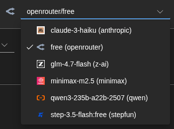

<a id="transrewrt-user-guide"></a>
# Hướng dẫn Người dùng

<br/>

<a id="introduction"></a>
## Giới thiệu

Transrewrt giúp bạn xử lý văn bản theo ba cách chính:

- **Dịch** - chuyển đổi văn bản từ một ngôn ngữ sang ngôn ngữ khác.
- **Viết lại** - diễn đạt lại văn bản theo phong cách khác, ví dụ như rõ ràng hơn, ngắn gọn hơn hoặc trang trọng hơn.
- **Chuyển đổi** - xử lý văn bản bằng các hướng dẫn AI tùy chỉnh gọi là lời nhắc.

<br/>

Hướng dẫn này giải thích cách sử dụng ứng dụng sau khi đã cài đặt và chạy. Để biết các bước cài đặt, hãy xem **[README](README.vi.md)** chính.

<br/>

> ℹ️ **LƯU Ý**<br/>
> Transrewrt có sẵn dưới dạng ứng dụng máy tính để bàn cho Windows và Linux, và dưới dạng ứng dụng web tự lưu trữ. Hướng dẫn này tập trung vào việc sử dụng hàng ngày ứng dụng. Những nội dung chỉ áp dụng cho một phiên bản cụ thể sẽ được đánh dấu rõ ràng.

<small>**Đọc bằng các ngôn ngữ khác:** </small>
<small id="lang-list">[English (GB)](../USER-GUIDE.md) · [Português (Brasil)](./USER-GUIDE.pt-BR.md) · [العربية](./USER-GUIDE.ar.md) · [বাংলা](./USER-GUIDE.bn.md) · [Català](./USER-GUIDE.ca.md) · [中文 (中国大陆)](./USER-GUIDE.zh-CN.md) · [中文 (台灣)](./USER-GUIDE.zh-TW.md) · [Hrvatski](./USER-GUIDE.hr.md) · [Čeština](./USER-GUIDE.cs.md) · [Nederlands](./USER-GUIDE.nl.md) · [English (US)](./USER-GUIDE.en-US.md) · [Tagalog](./USER-GUIDE.tl.md) · [Français](./USER-GUIDE.fr.md) · [Deutsch](./USER-GUIDE.de.md) · [Ελληνικά](./USER-GUIDE.el.md) · [हिन्दी](./USER-GUIDE.hi.md) · [Magyar](./USER-GUIDE.hu.md) · [Italiano](./USER-GUIDE.it.md) · [日本語](./USER-GUIDE.ja.md) · [한국어](./USER-GUIDE.ko.md) · [Bahasa Melayu](./USER-GUIDE.ms.md) · [فارسی](./USER-GUIDE.fa.md) · [Polski](./USER-GUIDE.pl.md) · [Basa Jawa](./USER-GUIDE.jv.md) · [Português](./USER-GUIDE.pt.md) · [ਪੰਜਾਬੀ](./USER-GUIDE.pa.md) · [Română](./USER-GUIDE.ro.md) · [Русский](./USER-GUIDE.ru.md) · [Slovenčina](./USER-GUIDE.sk.md) · [Español](./USER-GUIDE.es.md) · [Kiswahili](./USER-GUIDE.sw.md) · [Svenska](./USER-GUIDE.sv.md) · [తెలుగు](./USER-GUIDE.te.md) · [ไทย](./USER-GUIDE.th.md) · [Türkçe](./USER-GUIDE.tr.md) · [Українська](./USER-GUIDE.uk.md) · [Tiếng Việt](./USER-GUIDE.vi.md)</small>

<small>

> **Lưu ý về bản dịch giao diện người dùng và tài liệu:** Tất cả các ngôn ngữ giao diện ngoại trừ tiếng Anh (UK) gốc 
> đều được dịch bằng các mô hình AI; cách diễn đạt có thể không chính xác hoặc chứa lỗi.

</small>

<br/>

<!-- START doctoc generated TOC please keep comment here to allow auto update -->
<!-- DON'T EDIT THIS SECTION, INSTEAD RE-RUN doctoc TO UPDATE -->
**Mục lục**

- [Trước khi bắt đầu](#before-you-start)
  - [Cách lấy khóa API OpenRouter miễn phí (ứng dụng desktop)](#how-to-get-a-free-openrouter-api-key-desktop-app)
- [Bắt đầu](#getting-started)
- [Các phần chính của cửa sổ](#main-parts-of-the-window)
  - [Thanh bên](#sidebar)
  - [Thanh công cụ](#toolbar)
  - [Các bảng nhập và xuất](#input-and-output-panels)
- [Dịch](#translate)
  - [Dịch văn bản](#translate-text)
  - [Chọn ngôn ngữ](#language-selection)
  - [Các thiết lập dịch hữu ích](#helpful-translation-settings)
- [Viết lại](#rewrite)
- [Biến đổi](#transform)
  - [Chạy một lời nhắc hiện có](#run-an-existing-prompt)
  - [Nếu bạn chưa có lời nhắc nào](#if-you-have-no-prompts-yet)
  - [Tạo nhanh một lời nhắc](#create-a-prompt-quickly)
  - [Chỉnh sửa lời nhắc](#edit-a-prompt)
  - [Thử lời nhắc trước khi sử dụng](#test-a-prompt-before-using-it)
- [Bảng điều khiển](#dashboard)
  - [Lọc dữ liệu](#filter-the-data)
  - [Các tab bảng điều khiển](#dashboard-tabs)
  - [Xuất dữ liệu](#export-data)
  - [Xóa các bản ghi đã lưu cho một mô hình](#delete-stored-records-for-a-model)
- [Lịch sử](#history)
  - [Lọc dữ liệu](#filter-the-data-1)
  - [Xuất dữ liệu lịch sử](#export-history-data)
- [Cài đặt](#settings)
  - [Cài đặt chung](#general-settings)
  - [Mô hình](#models)
  - [Ngôn ngữ](#languages)
  - [Theo dõi chi phí](#cost-tracking)
  - [Lời nhắc biến đổi](#transform-prompts)
  - [Người dùng](#users)
  - [Cấu hình API](#api-config)
  - [Giới thiệu](#about)
- [Các vấn đề thường gặp](#common-issues)
  - [Ứng dụng không dịch, viết lại hoặc biến đổi văn bản](#the-app-will-not-translate-rewrite-or-transform-text)
  - [Danh sách mô hình trống](#the-model-list-is-empty)
  - [Kết quả quá chậm hoặc quá tốn kém](#the-result-is-too-slow-or-too-expensive)
  - [Giao diện hiển thị sai ngôn ngữ](#the-interface-is-in-the-wrong-language)
  - [Văn bản quá nhỏ hoặc khó đọc](#the-text-is-too-small-or-hard-to-read)
  - [Biểu đồ bảng điều khiển trống](#dashboard-charts-are-empty)
  - [Chi phí hiển thị "không khả dụng" hoặc có vẻ sai](#cost-shows-not-available-or-seems-wrong)
  - [Tổng chi phí không khớp với hóa đơn từ nhà cung cấp](#total-cost-does-not-match-my-provider-bill)
  - [Trang Lịch sử bị thiếu trong thanh bên](#the-history-page-is-missing-from-the-sidebar)
  - [Ứng dụng web: bị chuyển hướng về trang đăng nhập bất ngờ](#web-app-redirected-to-the-login-page-unexpectedly)
  - [Quản trị web: quên hoặc mất mật khẩu](#web-admin-forgot-or-lost-a-password)
  - [Bảng điều khiển không hiển thị dữ liệu cho người dùng khác (web)](#dashboard-shows-no-data-for-other-users-web)
  - [Tôi đã chỉnh sửa lời nhắc và mất các thay đổi](#i-changed-a-prompt-and-lost-the-edits)
- [Mẹo nhanh](#quick-tips)
- [Tuyên bố từ chối trách nhiệm](#disclaimer)
- [Giấy phép](#license)

<!-- END doctoc generated TOC please keep comment here to allow auto update -->

<br/><br/>

<a id="before-you-start"></a>
## Trước khi bắt đầu

Để sử dụng Transrewrt, bạn cần truy cập vào ít nhất một nhà cung cấp AI. Các nhà cung cấp được hỗ trợ gồm có: [OpenRouter](https://openrouter.ai) (tổng hợp nhiều mô hình), OpenAI, Anthropic, Google Gemini, DeepSeek, Groq, Mistral, xAI, Cerebras, và [Ollama](https://ollama.com) cho các mô hình cục bộ.

Bạn không cần chọn một mô hình trả phí để bắt đầu. Ngay khi bạn thêm khóa API OpenRouter của mình, ứng dụng sẽ tự động bật một tùy chọn OpenRouter **miễn phí** tích hợp. Điều này cho phép bạn bắt đầu dịch, viết lại và biến đổi văn bản ngay lập tức. Ngoài ra, bạn cũng có thể lấy khóa API miễn phí từ Cerebras, Google, Groq hoặc Mistral AI.

Nói một cách đơn giản:

- Một **mô hình** là động cơ AI thực hiện công việc. Các mô hình được liệt kê với **tiền tố nhà cung cấp** (ví dụ: `openrouter/…`, `openai/…`, `ollama/…`).
- Một **khóa API** (hoặc, đối với Ollama, một **URL gốc**) là cách ứng dụng kết nối với nhà cung cấp đó.

Nếu bạn đang sử dụng **ứng dụng máy tính để bàn**, hãy thêm các khóa trong [**Cài đặt** > **Cấu hình API**](#api-config) cho từng nhà cung cấp bạn sử dụng. Đối với việc chỉ sử dụng OpenRouter, hãy xem [Cách lấy khóa API](#how-to-get-an-api-key-desktop-app) bên dưới. Nếu bạn không muốn sử dụng khóa API, bạn có thể cài đặt Ollama (từ [ollama.com](https://ollama.com)) và sử dụng các mô hình cục bộ thay thế, chẳng hạn như `translategemma:4b`.

Nếu bạn đang sử dụng **phiên bản web**, người quản trị máy chủ sẽ cấu hình các nhà cung cấp thông qua các biến môi trường, do đó bạn không thể nhập khóa API trực tiếp trong ứng dụng.

<br/>

<a id="how-to-get-an-api-key-desktop-app"></a>
### Cách lấy khóa API OpenRouter miễn phí (ứng dụng máy tính để bàn)

Nếu bạn đang sử dụng ứng dụng máy tính để bàn, hãy làm theo các bước sau:

1. Truy cập [OpenRouter](https://openrouter.ai) bằng trình duyệt web của bạn.
2. Tạo tài khoản hoặc đăng nhập.
3. Mở trang [Khóa](https://openrouter.ai/keys).
4. Nhấp vào nút để tạo khóa API mới.
5. Đặt tên cho khóa để bạn có thể nhận biết nó sau này.
6. Sao chép khóa API mới.
7. Quay lại Transrewrt và mở **Cài đặt** > **Cấu hình API**.
8. Dán khóa vào **Khóa API OpenRouter** (trong **Cài đặt** > **Cấu hình API**).
9. Nhấp **Kiểm tra khóa OpenRouter** để đảm bảo nó hoạt động.

<br/><br/>

<a id="getting-started"></a>
## Bắt đầu

Nếu đây là lần đầu tiên bạn sử dụng Transrewrt, hãy làm theo thứ tự này:

1. Mở ứng dụng.
2. Chọn **Ngôn ngữ giao diện** của bạn từ biểu tượng quả địa cầu nếu cần.
3. Nếu bạn đang dùng **ứng dụng desktop**, mở [**Cài đặt** > **Cấu hình API**](#api-config), thêm khóa API cho ít nhất một nhà cung cấp (ví dụ như OpenRouter), và nhấp **Kiểm tra** để xác minh nó hoạt động.
4. Mở [**Cài đặt** > **Mô hình**](#models) và thêm một hoặc nhiều mô hình vào **Mô hình đã chọn**.
5. Mở [**Cài đặt** > **Ngôn ngữ**](#languages) và chọn **Ngôn ngữ hàng đầu** nếu bạn muốn các ngôn ngữ thường dùng xuất hiện đầu tiên.
6. Đi tới **Dịch** và thực hiện một bản dịch đơn giản để xác nhận mọi thứ đang hoạt động.
7. Khi đã ổn, hãy thử **Viết lại** rồi đến **Biến đổi**.

Thứ tự này rất quan trọng. Nó giúp tránh vấn đề phổ biến nhất khi sử dụng lần đầu: cố gắng thực hiện một tác vụ trước khi ứng dụng có kết nối API hoạt động hoặc một mô hình đã chọn.

<br/><br/>

<a id="main-parts-of-the-window"></a>
## Các phần chính của cửa sổ

Ứng dụng được chia thành ba khu vực chính:

- **Thanh bên** ở bên trái.
- **Thanh công cụ** ở phía trên.
- **Khu vực làm việc** ở giữa.

<br/>

<a id="sidebar"></a>
### Thanh bên

Sử dụng thanh bên để di chuyển trong ứng dụng. Bạn có thể thu gọn thanh bên để có thêm không gian bằng cách nhấp vào biểu tượng kế bên logo ứng dụng.

<br/>

<table>
  <tr>
    <td valign="top">
       
    </td>
    <td valign="top">
      <br/><br/>
      <ul>
        <li><strong>Dịch</strong> mở không gian làm việc dịch.</li><br/>
        <li><strong>Viết lại</strong> mở không gian làm việc viết lại.</li><br/>
        <li><strong>Chuyển đổi</strong> mở không gian làm việc lời nhắc tùy chỉnh.</li><br/>
        <li><strong>Bảng điều khiển</strong> hiển thị thông tin sử dụng và chi phí.</li><br/>
        <li><strong>Cài đặt</strong> mở bảng cài đặt.</li><br/>
        <li><strong>Lịch sử</strong> hiển thị lịch sử sử dụng với văn bản đầu vào và đầu ra</li><br/>
        <li><strong>Người dùng</strong> hiển thị tên đăng nhập của người dùng đã đăng nhập (chỉ trên web).</li>
      </ul>
    </td>
  </tr>
</table>

<br/>

<a id="toolbar"></a>
### Thanh công cụ

Thanh công cụ thay đổi nhẹ tùy theo vị trí bạn đang ở trong ứng dụng.

- Bên trái, nó hiển thị tên trang hiện tại.
- Bên phải, nó hiển thị **bộ chọn mô hình** và điều khiển **Ngôn ngữ giao diện**.

**Bộ chọn mô hình** cho phép bạn chọn công cụ AI nào sẽ sử dụng cho tác vụ hiện tại.



Một số mô hình miễn phí có thể không luôn sẵn sàng — đôi khi chúng ngoại tuyến hoặc có giới hạn sử dụng. Nếu điều này xảy ra, ứng dụng sẽ tự động xóa mô hình đó khỏi danh sách khả dụng của bạn. Để kiểm soát các mô hình xuất hiện, hãy đi tới [**Cài đặt** > **Mô hình**](#models) và chỉnh sửa danh sách mô hình của bạn. 
Bạn cũng có thể mở cài đặt mô hình trực tiếp bằng cách nhấp vào biểu tượng nhà cung cấp nằm bên trái tên mô hình trong thanh công cụ.

<br/>

**Biểu tượng quả địa cầu + mã ngôn ngữ** thay đổi ngôn ngữ giao diện ứng dụng, như các menu và nút bấm. Nó **không** thay đổi các ngôn ngữ dịch được sử dụng trong **Dịch**.


<br/>

<a id="input-and-output-panels"></a>
### Các bảng đầu vào và đầu ra

Hầu hết các không gian làm việc sử dụng bảng **Đầu vào** bên trái và bảng **Đầu ra** bên phải.

Mỗi bảng cũng hiển thị:

| **Đầu vào**                                                          | **Đầu ra**                                                                                                                  |
|--------------------------------------------------------------------|-----------------------------------------------------------------------------------------------------------------------------|
| - Số lượng ký tự <br/>- Số lượng từ <br/>- Số lượng đoạn văn   <br/> | - Thời gian thực hiện tác vụ<br/>- **TPS** (mã thông báo mỗi giây)<br/>- Số lượng ký tự, từ và đoạn văn<br/>- Mô hình được sử dụng |

Nếu bạn đang thắc mắc về các thuật ngữ kỹ thuật:

- **M?? tr???** nghĩa là một phần nhỏ văn bản. Bạn có thể hiểu đó là một phần của từ hoặc một từ ngắn.
- **TPS** nghĩa là số lượng các phần văn bản đó mà mô hình xử lý mỗi giây.

<br/>

Bạn cũng có thể theo dõi chi phí của từng thao tác (nếu có sẵn) và tổng chi phí bằng cách bật tùy chọn `Show cost information on the actions` tại [**Cài đặt** > **Cài đặt chung**](#general-settings).

<br/><br/>

[--------------------------------------------------------------------------------------------------------------------------]: #

<a id="translate"></a>
## Dịch

Sử dụng **Dịch** khi bạn muốn chuyển đổi văn bản từ một ngôn ngữ sang ngôn ngữ khác.


<br/>

<a id="translate-text"></a>
### Dịch văn bản

1. Mở **Dịch**.
2. Chọn ngôn ngữ tại **Từ**.
3. Chọn ngôn ngữ tại **Sang**.
4. Chọn một mô hình trong thanh công cụ.
5. Gõ hoặc dán văn bản vào **Nhập**.
6. Nhấp **Dịch**.
7. Đọc kết quả tại **Xuất**.
8. Sử dụng nút sao chép nếu bạn muốn sao chép kết quả.

<br/>

<a id="language-selection"></a>
### Chọn ngôn ngữ

- **Từ** có thể là một ngôn ngữ cụ thể hoặc **Phát hiện ngôn ngữ**.
- **Đến** là ngôn ngữ bạn muốn kết quả hiển thị.

Các ngôn ngữ **Đã chọn** hàng đầu của bạn sẽ xuất hiện ở đầu danh sách. Bạn có thể thiết lập chúng trong [**Cài đặt** > **Ngôn ngữ**](#languages).

<br/>

<a id="helpful-translation-settings"></a>
### Các cài đặt dịch hữu ích

Trong [**Cài đặt** > **Cài đặt chung**](#general-settings), bạn có thể thay đổi cách thức hoạt động của tính năng dịch:

- **Tự động dịch khi dán** sẽ thực hiện dịch ngay khi bạn dán văn bản.
- **Tự động sao chép kết quả vào clipboard** sẽ tự động sao chép kết quả sau khi chạy thành công.
- **Dịch thời gian thực (trong khi gõ)** thực hiện dịch trong khi bạn đang gõ.
- **Thời gian chờ (ms)** điều chỉnh khoảng thời gian ứng dụng chờ trước khi thực hiện dịch thời gian thực.
- **Enter** điều khiển hành động xảy ra khi bạn nhấn `Enter`:

<br/><br/>

[--------------------------------------------------------------------------------------------------------------------------]: #

<a id="rewrite"></a>
## Viết lại

Sử dụng **Viết lại** khi bạn muốn cải thiện cách diễn đạt mà không thay đổi ý chính.


Tính năng này hữu ích cho:

- sửa lỗi chính tả và ngữ pháp (**Kiểm tra chính tả & ngữ pháp**)
- làm cho văn bản rõ ràng hơn (**Cải thiện độ rõ ràng**)
- đưa ra nhiều cách diễn đạt khác nhau trong một lần chạy (**Các phiên bản thay thế**)
- làm cho văn bản trang trọng hơn hoặc thân mật hơn (**Trang trọng** / **Thân mật**)
- rút gọn hoặc mở rộng văn bản (**Rút gọn** / **Mở rộng**)
- làm cho văn bản mang tính kỹ thuật hơn (**Tăng tính kỹ thuật**)

<br/>

> 💡 **MẸO**<br/>
> Khi bạn sử dụng chế độ "**Kiểm tra chính tả & ngữ pháp**", một công tắc **Hiển thị thay đổi** sẽ xuất hiện trong bảng đầu ra (bên cạnh **Sao chép**).
> Bật hoặc tắt để hiển thị hoặc ẩn các sửa đổi cụ thể được áp dụng cho văn bản của bạn.

<br/><br/>

[--------------------------------------------------------------------------------------------------------------------------]: #

<a id="transform"></a>
## Chuyển đổi

Sử dụng **Chuyển đổi** khi bạn muốn AI tuân theo một tập hợp hướng dẫn tùy chỉnh.


Đây là khu vực linh hoạt nhất của ứng dụng. Bạn có thể sử dụng nó cho các tác vụ như:

- tóm tắt ghi chú
- biến văn bản thô thành email hoàn chỉnh
- trích xuất các điểm chính
- chuyển đổi văn bản sang định dạng cụ thể
- bất kỳ hoạt động tùy chỉnh nào khác với văn bản đầu vào

<br/>

<a id="run-an-existing-prompt"></a>
### Chạy một lời nhắc hiện có

1. Mở **Biến đổi**.
2. Chọn một lời nhắc từ danh sách lời nhắc.
3. Nếu xuất hiện ô **Ngôn ngữ đích**, hãy chọn ngôn ngữ nếu bạn muốn.
4. Gõ hoặc dán văn bản vào ô **Đầu vào**.
5. Nhấp **Biến đổi**.
6. Đọc kết quả ở ô **Đầu ra**.

<br/>

<a id="if-you-have-no-prompts-yet"></a>
### Nếu bạn chưa có lời nhắc nào

Nếu danh sách lời nhắc của bạn trống, hãy nhấp vào **Tải các nhắc mẫu** trong không gian làm việc Chuyển đổi. Điều khiển tương tự luôn có sẵn trong [**Cài đặt** > **Lời nhắc chuyển đổi**](#transform-prompts) ở hàng xuất/nhập. Cả hai đều thêm các ví dụ tích hợp để bạn có thể bắt đầu nhanh chóng.

<br/>

> ℹ️ **LƯU Ý**<br/>
> Các lời nhắc mẫu được cung cấp bằng tiếng Anh. Sau khi tải chúng, bạn có thể chỉnh sửa lời nhắc và sử dụng **Dịch nhắc** để dịch sang ngôn ngữ của bạn.

<br/>

<a id="create-a-prompt-quickly"></a>
### Tạo lời nhắc nhanh chóng

Cách nhanh nhất để tạo lời nhắc là:

1. Nhấp **Lời nhắc mới**.
2. Nhấp **Tạo lời nhắc**.
3. Mô tả những gì bạn muốn lời nhắc thực hiện.
4. Chọn một mô hình.
5. Để ứng dụng tạo bản nháp cho bạn.
6. Xem lại bản nháp và nhấp **Lưu**.


<br/>

<a id="edit-a-prompt"></a>
### Chỉnh sửa lời nhắc

Khi bạn tạo hoặc chỉnh sửa lời nhắc, trình soạn thảo sẽ xuất hiện ở bên trái và khu vực thử sẽ xuất hiện ở bên phải.


Các trường chính là:

- **Tên lời nhắc**: tên hiển thị trong danh sách lời nhắc.
- **Hướng dẫn lời nhắc (tùy chọn)**: gợi ý ngắn hiển thị cho người dùng khi thực hiện lời nhắc.
- **Vai trò mô hình**: vai trò tổng thể được giao cho AI, ví dụ: 'Bạn là trợ lý hữu ích.'
- **Hướng dẫn mô hình (mỗi dòng một hướng dẫn)**: các quy tắc cụ thể mà bạn muốn AI tuân theo.
- **Mô tả đầu ra**: từ ngắn mô tả kết quả, ví dụ: 'tóm tắt' hoặc 'viết lại'.
- **Nhiệt độ (0,0 → 1,0)**: cách mô hình sẽ hành xử; xem bên dưới.
- **Yêu cầu ngôn ngữ đích**: thêm bộ chọn ngôn ngữ đích khi thực hiện lời nhắc.

Nếu thuật ngữ kỹ thuật **Temperature** mới đối với bạn, hãy hình dung như sau:

- **Nhiệt độ** thấp hơn sẽ cho kết quả ổn định và dễ dự đoán hơn.
- **Nhiệt độ** cao hơn sẽ mang lại sự đa dạng và sáng tạo hơn.

Bạn cũng có thể sử dụng:

- **`Generate prompt`** để tạo bản nháp mới từ mô tả đơn giản  
- **`Improve prompt`** để tinh chỉnh lời nhắc hiện có  
- **`Translate prompt`** để dịch các trường lời nhắc

<br/>

> ⚠️ **CẢNH BÁO**<br/>  
> Nhấp **`Save`** trước khi nhấp **`Back to Run`**. Nếu bạn quay lại mà không lưu, các thay đổi sẽ bị mất.

<br/>

<a id="test-a-prompt-before-using-it"></a>  
### Thử lời nhắc trước khi sử dụng

Bảng thử nghiệm ở bên phải cho phép bạn thử lời nhắc với văn bản mẫu trước khi sử dụng trong công việc hàng ngày.

Điều này hữu ích khi:

- bạn đang tạo một lời nhắc mới
- bạn đang so sánh hai phiên bản của một lời nhắc
- bạn muốn kiểm tra giọng điệu, độ dài hoặc định dạng đầu ra

<br/>

> ℹ️ **LƯU Ý**<br/>
> Bạn có thể xuất và nhập các lời nhắc đã lưu trong [**Cài đặt** > **Lời nhắc chuyển đổi**](#transform-prompts).

<br/><br/>

[--------------------------------------------------------------------------------------------------------------------------]: #

<a id="dashboard"></a>
## Bảng điều khiển

Sử dụng **Bảng điều khiển** để xem bạn đang sử dụng ứng dụng bao nhiêu và chi phí là bao nhiêu (đối với các mô hình có phí).


<br/>

> ℹ️ **LƯU Ý**<br/>
> Nếu bạn chỉ sử dụng các mô hình **miễn phí**, các khoản **chi phí** có thể bằng không và các bản tóm tắt tập trung vào chi phí có thể trông trống rỗng. Trên **Tóm tắt**, **Sử dụng theo thời gian** và **Sử dụng theo mô hình** vẫn hiển thị **số lượng cuộc gọi** (dịch, viết lại và chuyển đổi) khi bạn có hoạt động trong khoảng thời gian đã chọn.

<br/>

<a id="filter-the-data"></a>
### Bộ lọc dữ liệu

Sử dụng các nút bộ lọc ở phía trên để thay đổi khoảng thời gian.


<br/>

> ℹ️ **GHI CHÚ**<br/>
> Bộ lọc **Người dùng** chỉ hiển thị với quản trị viên trong phiên bản web. Người dùng thông thường sẽ không thấy bộ lọc này, và nó không khả dụng trong ứng dụng máy tính để bàn.

<br/>

<a id="dashboard-tabs"></a>
### Các tab Bảng điều khiển

- **Tổng quan** cung cấp cái nhìn tổng thể về mức sử dụng và chi phí. Bao gồm **Sử dụng theo thời gian** (tổng tích lũy số **lượt gọi** theo ngày cho dịch, viết lại và biến đổi) và **Sử dụng theo mô hình** (tổng **số lượt gọi theo mô hình**, bao gồm biến đổi).
- **Theo mức sử dụng** phân tích hoạt động theo ngôn ngữ dịch, chế độ viết lại và lời nhắc biến đổi.
- **Theo mô hình** hiển thị các mô hình bạn đã sử dụng và chi phí tương ứng.
- **Theo ngày** hiển thị tổng số theo từng ngày.
- **Tất cả các lượt gọi** hiển thị toàn bộ lịch sử gọi và cho phép bạn xuất dữ liệu.

<br/>

<a id="export-data"></a>
### Xuất dữ liệu

Các bảng trong bảng điều khiển có thể xuất dữ liệu ở định dạng:

- **JSON**
- **CSV**
- **XLSX**

Điều này hữu ích nếu bạn muốn xem lại hoạt động bên ngoài ứng dụng hoặc chia sẻ báo cáo.

<br/>

<a id="delete-stored-records-for-a-model"></a>
### Xóa các bản ghi đã lưu cho một mô hình

Trong **Theo Mô hình** hoặc **Tất cả các cuộc gọi**, bạn có thể xóa các bản ghi đã lưu cho một mô hình bằng cách nhấp vào biểu tượng "thùng rác".

> ⚠️ **CẢNH BÁO**<br/>
> Việc xóa các bản ghi đã lưu không thể hoàn tác. Chỉ sử dụng tùy chọn này nếu bạn chắc chắn rằng bạn không còn cần lịch sử đó nữa.

Để xóa tất cả dữ liệu hoặc xóa các bản ghi dựa trên thời gian lưu trữ, hãy đi tới [**Cài đặt** > **Theo dõi chi phí**](#cost-tracking). Tại đó, bạn sẽ tìm thấy các tùy chọn để xóa tất cả dữ liệu đã lưu hoặc chỉ dữ liệu cũ hơn một ngày nhất định.

<br/><br/>

[--------------------------------------------------------------------------------------------------------------------------]: #

<a id="history"></a>
## Lịch sử

Nhấp vào **Lịch sử** để xem lịch sử các thao tác của bạn bên trong **Transrewrt**, bao gồm đầu vào và đầu ra của từng thao tác.


<br/>

<a id="filter-the-history"></a>
### Bộ lọc dữ liệu

**Lịch sử** sử dụng các bộ lọc giống như trang **Bảng điều khiển**. Sử dụng chúng để chọn khoảng thời gian.


<br/>

> ℹ️ **GHI CHÚ**<br/>
> Bộ lọc **Người dùng** chỉ hiển thị với quản trị viên trong phiên bản web. Người dùng thông thường sẽ không thấy bộ lọc này, và nó không khả dụng trong ứng dụng máy tính để bàn.

<br/>

<a id="export-history-data"></a>
###  Xuất dữ liệu lịch sử

Trang lịch sử có thể xuất dữ liệu đã lọc theo các định dạng:

- **JSON**
- **CSV**
- **XLSX**

Điều này hữu ích nếu bạn muốn xem lại hoạt động bên ngoài ứng dụng hoặc chia sẻ báo cáo.

<br/><br/>

[--------------------------------------------------------------------------------------------------------------------------]: #

<a id="settings"></a>
## Cài đặt

Mở **Cài đặt** từ thanh bên để tùy chỉnh cách ứng dụng hoạt động.

Các tab có sẵn phụ thuộc vào nền tảng và vai trò của bạn:

| Tab               | Máy tính để bàn | Web (quản trị viên) | Web (người dùng thường) |
  |-------------------|:-------:|:-----------:|:------------------:|
  | Cài đặt chung     |   có    |      có     |         có          |
  | Mô hình           |   có    |      có     |         có          |
  | Ngôn ngữ          |   có    |      có     |         có          |
  | Theo dõi chi phí  |   có    |      có     |         -           |
  | Lời nhắc Biến đổi |   có    |      có     |         có          |
  | Người dùng        |    -    |      có     |         -           |
  | Cấu hình API        |   có   |     có     |         -          |
  | Giới thiệu             |   có   |     có     |        có         |

<br/>

> ℹ️ **LƯU Ý**<br/>
> Trong phiên bản web, mỗi người dùng có cấu hình riêng. Các cài đặt như mô hình đã chọn, ngôn ngữ, tùy chọn chung và lời nhắc chuyển đổi được lưu riêng cho từng người dùng. Những thay đổi bạn thực hiện sẽ không ảnh hưởng đến người dùng khác.

<br/>

[--------------------------------------------------------------------------------------------------------------------------]: #

<a id="general-settings"></a>
### Cài đặt chung

Sử dụng **Cài đặt chung** để điều chỉnh hành vi gõ phím, việc lưu chi tiết thực thi vào **Lịch sử**, và giao diện.

**Hành vi**

- **Hành vi của phím ENTER** chọn việc `Enter` thực thi tác vụ hay chèn dòng mới.
- **Tự động dịch khi dán** bắt đầu dịch ngay khi bạn dán văn bản.
- **Tự động sao chép kết quả vào bộ nhớ tạm** tự động sao chép các kết quả thành công.
- **Dịch thời gian thực (trong khi gõ)** dịch trong khi bạn đang gõ.
- **Thời gian chờ (ms)** đặt khoảng thời gian chờ cho dịch thời gian thực.

**Lịch sử**

- **Giữ lịch sử thực thi** kiểm soát việc mỗi lần dịch, viết lại và chuyển đổi có lưu **văn bản đầu vào và đầu ra** cho chế độ xem [**Lịch sử**](#history) ở thanh bên hay không. Khi tắt tùy chọn này sẽ yêu cầu xác nhận; nếu bạn xác nhận, văn bản lịch sử đã lưu sẽ bị xóa khỏi cơ sở dữ liệu.  
- **Xóa dữ liệu lịch sử** cho phép bạn xóa văn bản đã lưu theo độ tuổi (ví dụ như những dữ liệu cũ hơn vài tháng, hoặc **tất cả dữ liệu (xóa sạch)**) bằng cách sử dụng **Xóa dữ liệu**. Thao tác này chỉ ảnh hưởng đến văn bản thực thi đã lưu cho chế độ xem **Lịch sử**; nó **không** xóa tổng chi phí hoặc dữ liệu sử dụng. Để xóa hoặc thu gọn dữ liệu **chi phí**, hãy sử dụng [**Cài đặt** > **Theo dõi chi phí**](#cost-tracking).

**Giao diện**

- **Hiển thị thông tin chi phí trên các thao tác** điều khiển việc hiển thị chi phí cho mỗi thao tác (nếu có) và tổng chi phí trên các bảng kết quả Dịch, Viết lại và Biến đổi.
- **Số chữ số phần thập phân của chi phí** thay đổi cách hiển thị các chữ số thập phân của chi phí.
- **Chỉ trên web:** **hiển thị lề xung quanh ứng dụng** thêm khoảng trống xung quanh giao diện.
- **Họ phông chữ** thay đổi phông chữ trong các bảng văn bản.
- **Kích thước** thay đổi kích cỡ phông chữ.

**Sao lưu cấu hình**

- **Bao gồm dữ liệu sử dụng trong bản sao lưu** - khi bật, tệp ZIP cũng chứa lịch sử thực thi và dữ liệu gọi API. 
- **Sao lưu cấu hình** - tạo một tệp ZIP duy nhất (`transrewrt-config-backup-YYYY-MM-DD_HHMMSS.zip` theo múi giờ UTC theo mặc định) bao gồm `config.json`, `state.json`, khóa mã hóa tùy chọn, người dùng, tùy chọn, lời nhắc tùy chỉnh và dữ liệu sử dụng nếu bạn đã chọn tham gia. Sau khi sao lưu thành công, thông báo xác nhận sẽ hiển thị tên tệp đã lưu.
- **Khôi phục từ bản sao lưu** - mở **hộp thoại xác nhận trước tiên**. Chọn tệp ZIP sao lưu bên trong hộp thoại (**Duyệt** / trình chọn tệp hoặc kéo-thả nếu được hỗ trợ), sau đó xem lại các tùy chọn:
  - **Khôi phục dữ liệu sử dụng** - nhập dữ liệu sử dụng/lịch sử từ tệp ZIP khi bản sao lưu đó có bao gồm dữ liệu sử dụng; bỏ chọn nếu bạn chỉ muốn cài đặt và lời nhắc.
  - **Xóa dữ liệu sử dụng cũ trước khi khôi phục** - xóa dữ liệu sử dụng/lịch sử hiện có trên bản cài đặt này trước khi áp dụng bản sao lưu (tùy chọn; dùng khi bạn muốn thay thế hoàn toàn).

Bản sao lưu được tạo trong phiên bản web hoặc phiên bản máy tính để bàn đều có thể được khôi phục trên phiên bản còn lại. Khi khôi phục bản sao lưu từ máy tính để bàn trên phiên bản web, dữ liệu sẽ được khôi phục vào tài khoản người dùng quản trị.

<br/>

<a id="models"></a>
### Mô hình

Sử dụng **Cài đặt** > **Mô hình** để chọn các mô hình sẽ hiển thị trên thanh công cụ.


Trang này có hai danh sách:

- **Các mô hình khả dụng** ở bên trái
- **Các mô hình đã chọn** ở bên phải

Các điều khiển hữu ích bao gồm:

- **Tìm kiếm mô hình...** để tìm mô hình theo tên
- Các thẻ **Nhà cung cấp** để thu hẹp danh sách theo một nền tảng (OpenRouter, OpenAI, Ollama, …)
- **Chỉ miễn phí** để chỉ hiển thị các mô hình miễn phí
- **Làm mới** để tải lại danh sách
- **Mở rộng tất cả** và **Thu gọn tất cả** khi bạn đang sắp xếp theo nhà cung cấp

Các ID mô hình bao gồm tiền tố nhà cung cấp (ví dụ `openrouter/…` so với `openai/…`). Các huy hiệu như **OpenAI (OpenRouter)** so với **OpenAI (trực tiếp)** cho biết cách định tuyến lưu lượng truy cập.

> ℹ️ **LƯU Ý**<br/>
> **OpenRouter Body Builder** (`openrouter/bodybuilder`) là một mô hình định tuyến, không phải mô hình trò chuyện tổng quát: phản hồi của nó là JSON mô tả các nội dung yêu cầu API OpenRouter (ví dụ một mảng `requests` với `model` và `messages`). Nếu bạn dùng nó cho **Dịch**, **Viết lại**, hoặc **Chuyển đổi**, bảng đầu ra sẽ hiển thị JSON đó thay vì văn bản hoàn chỉnh. Hãy chọn một mô hình văn bản thông thường cho các tác vụ đó. Xem [trang mô hình Body Builder](https://openrouter.ai/openrouter/bodybuilder) trên OpenRouter.

Hành động:

- Để thêm một mô hình, hãy nhấp vào **Thêm** hoặc bất kỳ đâu trong mục nhập.

- Để xóa một mô hình, hãy nhấp vào **X** bên cạnh nó trong **Các mô hình đã chọn** hoặc **Đã chọn** trên mục nhập trong Các mô hình khả dụng.

- Để xóa danh sách, hãy nhấp vào **Bỏ chọn tất cả**. Mô hình miễn phí bắt buộc sẽ vẫn còn trong danh sách.

<br/>

> ℹ️ **LƯU Ý**<br/>
> Nếu bạn không muốn thêm tín dụng vào OpenRouter ngay lập tức, hãy bắt đầu bằng cách bật **Chỉ miễn phí** và chọn các mô hình miễn phí (không cần thẻ tín dụng). Bạn cũng có thể sử dụng Ollama để chạy mô hình cục bộ mà không cần khóa API nào.

<br/>

<a id="languages"></a>
### Ngôn ngữ

Sử dụng **Cài đặt** > **Ngôn ngữ** để sắp xếp các danh sách ngôn ngữ được dùng trong ứng dụng.

- **Ngôn ngữ hàng đầu** sẽ được ghim gần đầu danh sách ngôn ngữ trong **Dịch** và **Chuyển đổi**.
- **Ngôn ngữ tùy chỉnh** cho phép bạn thêm một ngôn ngữ không có trong danh sách tích hợp sẵn.

Nếu bạn thêm một ngôn ngữ tùy chỉnh, nó sẽ xuất hiện trong các trình chọn ngôn ngữ cùng với các tùy chọn tích hợp sẵn.

<br/>

<a id="cost-tracking"></a>
### Theo dõi chi phí

Sử dụng **Cài đặt** > **Theo dõi chi phí** để quản lý thông tin chi phí.

- **Tổng chi phí** hiển thị tổng cộng dồn.
- **Sao chép giá trị** sao chép tổng cộng vào bộ nhớ tạm.
- **Đặt lại chi phí** đặt lại tổng đã lưu về không.
- **Đồng bộ với mức sử dụng khóa API** đặt tổng cộng bằng với mức sử dụng được báo cáo bởi tài khoản OpenRouter của bạn (chỉ OpenRouter).
- **Mức sử dụng khóa API** hiển thị chi tiết mức sử dụng OpenRouter, nếu có.
- **Xóa dữ liệu chi phí** xóa tất cả dữ liệu, hoặc chỉ các mục cũ hơn ngày đã chọn.

**Theo dõi chi phí:** Khi bạn sử dụng các mô hình OpenRouter, ứng dụng sẽ hiển thị mức sử dụng và chi tiêu thực tế của bạn dựa trên thông tin chi phí từ OpenRouter. Đối với tất cả các nhà cung cấp khác, ứng dụng sẽ ước tính chi phí bằng cách sử dụng giá do OpenRouter công bố; nếu không có sẵn giá, mức ước tính có thể bằng không.

<br/>

> ℹ️ **LƯU Ý**<br/>
>  **Tất cả các con số chi phí chỉ là ước tính để bạn tham khảo, không phải là hóa đơn chính thức.**

<br/>

> ⚠️ **CẢNH BÁO**<br/>
> Việc xóa dữ liệu không thể hoàn tác. Trước khi xóa, hãy sao lưu dữ liệu của bạn hoặc xuất nó qua [**Lịch sử**](#history) 
> hoặc [**Bảng điều khiển** > **Tất cả các cuộc gọi**](#dashboard-tabs), nếu không dữ liệu sẽ bị mất vĩnh viễn. 
> Toàn bộ lịch sử đầu vào/đầu ra liên quan đến mỗi mục gọi API cũng sẽ bị xóa.

<br/>

<a id="transform-prompts"></a>
### Lời nhắc chuyển đổi

Sử dụng **Cài đặt** > **Lời nhắc chuyển đổi** để quản lý các lời nhắc theo nhóm.

Bạn có thể:

- xem lại các lời nhắc đã lưu
- xóa lời nhắc
- nhập lời nhắc từ tệp
- xuất lời nhắc để sao lưu hoặc chia sẻ
- tải các lời nhắc mẫu vào danh sách lời nhắc

<br/>

<a id="users"></a>
### Người dùng

Sử dụng **Người dùng** để quản lý tài khoản người dùng trong phiên bản web. Bạn có thể thêm người dùng, cập nhật thông tin chi tiết của họ, đặt lại mật khẩu và xóa tài khoản.

<br/>

<a id="api-config"></a>
### Cấu hình API

Các nhà cung cấp được hỗ trợ gồm: OpenRouter, OpenAI, Anthropic, Google Gemini, DeepSeek, Groq, Mistral, xAI, Cerebras và **Ollama** (mô hình cục bộ thông qua URL gốc). Bạn chỉ cần cấu hình những nhà cung cấp mà bạn sử dụng.

**Ứng dụng web: chỉ dành cho quản trị viên**

Các khóa API được cấu hình thông qua biến môi trường hệ thống hoặc Docker - chúng không được nhập trong giao diện web. Trang này hiển thị các nhà cung cấp đã được cấu hình khóa và cho phép bạn thử từng nhà cung cấp bằng cách nhấp vào nút **`Test`**.

<br/>

> ℹ️ **LƯU Ý**<br/>
> Để thay đổi khóa API, hãy cập nhật biến môi trường trong cấu hình hệ thống hoặc Docker của bạn và khởi động lại máy chủ hoặc bộ chứa.

> ℹ️ **LƯU Ý**<br/>
> **Sao lưu cấu hình** (xem [**Cài đặt chung** → Sao lưu cấu hình](#general-settings)) có thể nhúng các khóa nhà cung cấp đã **giải quyết** vào bên trong tệp `config.json` của ZIP. Việc khôi phục tệp ZIP đó sẽ **không** sao chép các khóa đó trở lại vào tệp cấu hình được lưu trữ trên máy chủ - các khóa đang hoạt động vẫn được lấy từ môi trường và trạng thái tệp hiện có như đã mô tả ở đó.

<br/>

**Ứng dụng máy tính để bàn**

Sử dụng **Cấu hình API** để lưu trữ các khóa API cho từng nhà cung cấp mà bạn sử dụng. Đối với Ollama, hãy nhập **URL gốc** thay vì khóa API.

<br/>

> 💡 **Mẹo** <br/>
> Nếu bạn không muốn sử dụng khóa API hoặc trả phí sử dụng, bạn có thể [tải xuống Ollama](https://ollama.com) và chạy các mô hình (như `translategemma:4b`) cục bộ trên máy của bạn hoàn toàn miễn phí. Ngoài ra, bạn có thể tạo một tài khoản OpenRouter miễn phí (không cần thẻ tín dụng) để sử dụng các mô hình miễn phí của họ, hoặc lấy khóa API miễn phí từ Cerebras, Google, Groq hoặc Mistral AI.

<br/>

- Chỉ thêm các nhà cung cấp bạn cần. Trong **Cài đặt** > **Mô hình**, mỗi ID mô hình bắt đầu bằng nhà cung cấp (ví dụ: `openrouter/openrouter/free`, `openai/gpt-4o`, `ollama/llama3`).

Để thêm khóa API, nhập giá trị vào trường văn bản và nhấp vào **`Save`**. Để thay thế khóa hiện có, nhấp vào **`Edit`**. Để xác minh khóa có hoạt động hay không, nhấp vào **`Test`**. Với URL cơ sở Ollama, luôn nhấp vào **`Test`** để kiểm tra kết nối.

<br/>

> ℹ️ **LƯU Ý**<br/>
> Bạn không thể xem giá trị hiện tại của một khóa API. Bạn chỉ có thể thay thế nó bằng cách sử dụng nút **`Edit`**.
> Các khóa API được lưu trữ dưới dạng mã hóa trong cấu hình.

<br/>

<a id="about"></a>
### Giới thiệu

Thẻ **Giới thiệu** hiển thị:

- tên ứng dụng
- số phiên bản
- ngày xây dựng
- liên kết đến kho lưu trữ dự án

<br/><br/>

<a id="common-issues"></a>
## Các vấn đề thường gặp

Nếu có điều gì đó không hoạt động như mong đợi, hãy kiểm tra các điểm sau trước tiên.

<br/>

<a id="the-app-will-not-translate-rewrite-or-transform-text"></a>
### Ứng dụng sẽ không dịch, viết lại hoặc chuyển đổi văn bản

Hãy kiểm tra rằng:

- bạn đã chọn một mô hình trong thanh công cụ
- ít nhất một mô hình được liệt kê trong [**Cài đặt** > **Mô hình**](#models)
- thiết lập API của bạn đang hoạt động

Nếu bạn đang sử dụng ứng dụng máy tính để bàn:

1. Mở [**Cài đặt** > **Cấu hình API**](#api-config).
2. Kiểm tra xem ít nhất một khóa API đã được lưu chưa.
3. Nhấp vào **Thử** bên cạnh nhà cung cấp để xác nhận khóa đang hoạt động.

<br/>

<a id="the-model-list-is-empty"></a>
### Danh sách mô hình trống

Mở [**Cài đặt** > **Mô hình**](#models) và nhấp vào **Làm mới**.

Nếu cần:

- tìm kiếm một mô hình
- bật **Chỉ miễn phí**
- thêm một hoặc nhiều mô hình vào **Các mô hình đã chọn**

<br/>

<a id="the-result-is-too-slow-or-too-expensive"></a>
### Kết quả quá chậm hoặc quá tốn kém

Hãy thử một hoặc nhiều cách sau:

- chọn một mô hình khác
- sử dụng đầu vào ngắn hơn
- tắt **Dịch thời gian thực (khi đang nhập)** trong [**Cài đặt** > **Cài đặt chung**](#general-settings)
- sử dụng các mô hình miễn phí cho các tác vụ đơn giản (xem [Mô hình](#models))

<br/>

<a id="the-interface-is-in-the-wrong-language"></a>
### Giao diện ở ngôn ngữ sai

Nhấp vào biểu tượng quả địa cầu trên [thanh công cụ](#toolbar) và chọn **Ngôn ngữ giao diện** bạn muốn.

<br/>

<a id="the-text-is-too-small-or-hard-to-read"></a>
### Văn bản quá nhỏ hoặc khó đọc

Mở [**Cài đặt** > **Cài đặt chung**](#general-settings) và thay đổi:

- **Họ phông chữ**
- **Kích cỡ**

<br/>

<a id="dashboard-charts-are-empty"></a>
### Biểu đồ Bảng điều khiển trống

Điều này là bình thường nếu:

- bạn chỉ sử dụng **mô hình miễn phí** và bạn đang xem các con số về **chi phí** (chúng có thể bằng không); biểu đồ số lượng **cuộc gọi** sử dụng trên **Tóm tắt** vẫn cần dữ liệu từ khoảng thời gian đã chọn
- **bộ lọc** thời gian đã chọn không bao gồm khoảng thời gian thực hiện cuộc gọi - hãy thử **Tất cả** để kiểm tra

Nếu biểu đồ vẫn trống sau khi chọn **Tất cả**, hãy xác nhận rằng các cuộc gọi xuất hiện trong [**Lịch sử**](#history) hoặc trong tab **Tất cả các cuộc gọi**.

<br/>

<a id="cost-shows-not-available-or-seems-wrong"></a>
### Chi phí hiển thị "không khả dụng" hoặc dường như sai

Khi bạn sử dụng các mô hình thông qua **OpenRouter**, ứng dụng sẽ hiển thị khoản chi tiêu thực tế do OpenRouter báo cáo.

Đối với **các nhà cung cấp khác** (OpenAI trực tiếp, Anthropic trực tiếp, v.v.), chi phí được ước tính dựa trên dữ liệu giá do OpenRouter công bố. Nếu không tìm thấy giá phù hợp cho một mô hình, chi phí sẽ hiển thị là **không khả dụng** và sẽ không được cộng vào tổng chi phí của bạn.

<br/>

<a id="total-cost-does-not-match-my-provider-bill"></a>
### Tổng chi phí không khớp với hóa đơn từ nhà cung cấp của tôi

Tất cả các con số chi phí trong ứng dụng đều là **ước tính để tham khảo**, không phải là hóa đơn chính thức.

Để đưa tổng chi phí gần hơn với khoản chi tiêu thực tế trên OpenRouter của bạn, hãy mở [**Cài đặt** > **Theo dõi chi phí**](#cost-tracking) và nhấn **Đồng bộ với việc sử dụng khóa API**.

<br/>

<a id="the-history-page-is-missing-from-the-sidebar"></a>
### Trang Lịch sử bị thiếu trong thanh bên

**Giữ lịch sử thực thi** có thể đã bị tắt. Mở [**Cài đặt** > **Cài đặt chung**](#general-settings) và bật tùy chọn này. Lưu ý rằng việc bật nó sẽ không phục hồi dữ liệu lịch sử đã bị xóa trước đó.

<br/>

<a id="web-app-session-expired"></a>
### Ứng dụng web: bị chuyển hướng đến trang đăng nhập một cách bất ngờ

Phiên của bạn có thể đã hết hạn. Hãy đăng nhập lại. Nếu sự cố xảy ra thường xuyên, hãy kiểm tra cấu hình máy chủ về các thiết lập thời gian tồn tại của phiên.

<br/>

<a id="web-admin-forgot-or-lost-a-password"></a>
### Quản trị web: quên hoặc mất mật khẩu

Điều này áp dụng cho **ứng dụng web tự lưu trữ** (Docker), không áp dụng cho ứng dụng máy tính để bàn (Electron).

- Nếu quản trị viên khác vẫn có thể đăng nhập, họ có thể mở [**Cài đặt** > **Người dùng**](#users), chọn tài khoản và đặt **mật khẩu mới** tại đó.
- Nếu bạn bị **khóa tài khoản** nhưng vẫn có **quyền truy cập shell** vào máy hoặc container, hãy đặt lại mật khẩu bằng công cụ hỗ trợ đi kèm theo hình ảnh (thay đổi `transrewrt` nếu bạn đổi tên mặc định, và đặt dấu ngoặc kép quanh mật khẩu nếu chứa khoảng trắng hoặc ký tự đặc biệt):

```bash
docker exec transrewrt reset-web-password '<username>' '<new-password>'
```

Tên đăng nhập mặc định của quản trị viên là `admin` nếu bạn chưa từng tạo tài khoản nào khác. Khi bạn chỉ truyền một đối số, đối số đó sẽ được coi là mật khẩu mới cho `admin`.

Nếu bạn chạy từ bản **kiểm tra mã nguồn** thay vì Docker, hãy sử dụng:

```bash
pnpm run reset-web-password -- <username> <new-password>
```

Lệnh script cập nhật bản ghi người dùng trong cơ sở dữ liệu SQLite (và có thể tạo người dùng `admin` nếu thiếu). Sau khi đặt lại, hãy đăng nhập bằng mật khẩu mới.

<br/>

<a id="dashboard-shows-no-data-for-other-users"></a>
### Bảng điều khiển hiển thị không có dữ liệu cho các người dùng khác (web)

Chỉ **quản trị viên** mới có thể xem dữ liệu từ tất cả người dùng thông qua bộ lọc **Người dùng**. Người dùng thông thường chỉ xem được hoạt động của chính họ theo thiết kế.

<br/>

<a id="i-changed-a-prompt-and-lost-the-edits"></a>
### Tôi đã thay đổi một lời nhắc và bị mất các chỉnh sửa

Khi chỉnh sửa lời nhắc, hãy luôn nhấn **Lưu** trước khi nhấn **Quay lại Chạy**.

<br/><br/>

<a id="quick-tips"></a>
## Mẹo nhanh

- Bắt đầu với [**Dịch**](#translate) để đảm bảo cấu hình của bạn hoạt động trước khi chuyển sang [**Viết lại**](#rewrite) hoặc [**Biến đổi**](#transform).
- Sử dụng [**Viết lại**](#rewrite) để cải thiện văn phong hàng ngày.
- Sử dụng [**Biến đổi**](#transform) khi bạn cần một quy trình lặp lại cho một tác vụ cụ thể.
- Sử dụng [**Bảng điều khiển**](#dashboard) nếu bạn muốn theo dõi mức sử dụng và chi phí.
- Sử dụng [**Lịch sử**](#history) để xem lại các thao tác trước đó cùng toàn bộ văn bản đầu vào/đầu ra.
- Xuất lời nhắc định kỳ nếu bạn đang xây dựng thư viện lời nhắc muốn giữ an toàn (xem [Lời nhắc Biến đổi](#transform-prompts)) hoặc nếu bạn muốn chia sẻ với người khác.

<br/><br/>

<a id="disclaimer"></a>
## Miễn trừ trách nhiệm

Tên sản phẩm và biểu tượng thuộc về chủ sở hữu tương ứng và chỉ được sử dụng nhằm mục đích nhận dạng. Phần mềm này không liên kết hoặc được bảo trợ bởi bất kỳ thương hiệu nào được đề cập.

<br/><br/>

<a id="license"></a>
## Giấy phép

Bản quyền © 2026 Waldemar Scudeller Jr.

[Apache License 2.0](../LICENSE)
