<a id="transrewrt-user-guide"></a>
# Hướng dẫn Người dùng

<br/>

<a id="introduction"></a>
## Giới thiệu

Transrewrt giúp bạn làm việc với văn bản theo ba cách chính:

- **Dịch** - chuyển đổi văn bản từ ngôn ngữ này sang ngôn ngữ khác.
- **Viết lại** - diễn đạt lại văn bản theo phong cách khác, ví dụ như rõ ràng hơn, ngắn gọn hơn hoặc trang trọng hơn.
- **Chuyển đổi** - xử lý văn bản bằng các hướng dẫn trí tuệ nhân tạo tùy chỉnh gọi là lời nhắc.

Mặc định, ứng dụng chạy ở chế độ **Dễ**: bạn chọn một **thiết lập sẵn** (ví dụ: Miễn phí (OpenRouter), Tiêu chuẩn, Nâng cao hoặc Kỹ thuật) và một **nhà cung cấp** trong Cài đặt, mà không cần chọn ID mô hình. Chuyển sang **Nâng cao** tại [**Cài đặt** > **Cài đặt chung**](#general-settings) nếu bạn muốn danh sách mô hình cổ điển từ [**Cài đặt** > **Mô hình**](#models).

<br/>

Hướng dẫn này giải thích cách sử dụng ứng dụng sau khi đã cài đặt và đang chạy. Để biết các bước cài đặt, hãy xem [**README**](README.vi.md) chính.

<br/>

> ℹ️ **LƯU Ý**<br/>
> Transrewrt có sẵn dưới dạng ứng dụng máy tính để bàn dành cho Windows và Linux, và dưới dạng ứng dụng web tự lưu trữ. Hướng dẫn này tập trung vào việc sử dụng hàng ngày ứng dụng. Những nội dung chỉ áp dụng cho một phiên bản cụ thể sẽ được ghi rõ.

<small>**Đọc bằng các ngôn ngữ khác:** </small>
<small id="lang-list">[English (GB)](../USER-GUIDE.md) · [Português (Brasil)](./USER-GUIDE.pt-BR.md) · [العربية](./USER-GUIDE.ar.md) · [বাংলা](./USER-GUIDE.bn.md) · [Català](./USER-GUIDE.ca.md) · [中文 (中国大陆)](./USER-GUIDE.zh-CN.md) · [中文 (台灣)](./USER-GUIDE.zh-TW.md) · [Hrvatski](./USER-GUIDE.hr.md) · [Čeština](./USER-GUIDE.cs.md) · [Nederlands](./USER-GUIDE.nl.md) · [English (US)](./USER-GUIDE.en-US.md) · [Tagalog](./USER-GUIDE.tl.md) · [Français](./USER-GUIDE.fr.md) · [Deutsch](./USER-GUIDE.de.md) · [Ελληνικά](./USER-GUIDE.el.md) · [हिन्दी](./USER-GUIDE.hi.md) · [Magyar](./USER-GUIDE.hu.md) · [Italiano](./USER-GUIDE.it.md) · [日本語](./USER-GUIDE.ja.md) · [한국어](./USER-GUIDE.ko.md) · [Bahasa Melayu](./USER-GUIDE.ms.md) · [فارسی](./USER-GUIDE.fa.md) · [Polski](./USER-GUIDE.pl.md) · [Basa Jawa](./USER-GUIDE.jv.md) · [Português](./USER-GUIDE.pt.md) · [ਪੰਜਾਬੀ](./USER-GUIDE.pa.md) · [Română](./USER-GUIDE.ro.md) · [Русский](./USER-GUIDE.ru.md) · [Slovenčina](./USER-GUIDE.sk.md) · [Español](./USER-GUIDE.es.md) · [Kiswahili](./USER-GUIDE.sw.md) · [Svenska](./USER-GUIDE.sv.md) · [తెలుగు](./USER-GUIDE.te.md) · [ไทย](./USER-GUIDE.th.md) · [Türkçe](./USER-GUIDE.tr.md) · [Українська](./USER-GUIDE.uk.md) · [Tiếng Việt](./USER-GUIDE.vi.md)</small>

<small>

> **Lưu ý về bản dịch giao diện người dùng và tài liệu:** Tất cả các ngôn ngữ giao diện ngoại trừ tiếng Anh (UK) gốc 
> đều được dịch bằng các mô hình AI; cách diễn đạt có thể không chính xác hoặc chứa lỗi.

</small>

<br/>

<!-- START doctoc generated TOC please keep comment here to allow auto update -->
<!-- DON'T EDIT THIS SECTION, INSTEAD RE-RUN doctoc TO UPDATE -->
**Mục lục**

- [Trước khi bắt đầu](#before-you-start)
  - [Cách lấy khóa API OpenRouter miễn phí (ứng dụng máy tính để bàn)](#how-to-get-a-free-openrouter-api-key-desktop-app)
- [Bắt đầu](#getting-started)
- [Các phần chính của cửa sổ](#main-parts-of-the-window)
  - [Thanh bên](#sidebar)
  - [Thanh công cụ](#toolbar)
  - [Bảng đầu vào và đầu ra](#input-and-output-panels)
- [Dịch](#translate)
  - [Dịch văn bản](#translate-text)
  - [Chọn ngôn ngữ](#language-selection)
  - [Các cài đặt dịch hữu ích](#helpful-translation-settings)
- [Viết lại](#rewrite)
- [Chuyển đổi](#transform)
  - [Chạy một lời nhắc hiện có](#run-an-existing-prompt)
  - [Nếu bạn chưa có lời nhắc nào](#if-you-have-no-prompts-yet)
  - [Tạo nhanh một lời nhắc](#create-a-prompt-quickly)
  - [Chỉnh sửa lời nhắc](#edit-a-prompt)
  - [Kiểm tra lời nhắc trước khi sử dụng](#test-a-prompt-before-using-it)
- [Bảng điều khiển](#dashboard)
  - [Lọc dữ liệu](#filter-the-data)
  - [Các tab bảng điều khiển](#dashboard-tabs)
  - [Xuất dữ liệu](#export-data)
  - [Xóa các bản ghi đã lưu cho một mô hình](#delete-stored-records-for-a-model)
- [Lịch sử](#history)
  - [Lọc lịch sử](#filter-the-history)
  - [Xuất dữ liệu lịch sử](#export-history-data)
- [Cài đặt](#settings)
  - [Cài đặt chung](#general-settings)
  - [Mô hình](#models)
  - [Ngôn ngữ](#languages)
  - [Theo dõi chi phí](#cost-tracking)
  - [Chuyển đổi (tab cài đặt)](#transform-settings-tab)
  - [Người dùng](#users)
  - [Cấu hình API](#api-config)
  - [Giới thiệu](#about)
- [Sự cố thường gặp](#common-issues)
  - [Ứng dụng không dịch, viết lại hoặc chuyển đổi văn bản](#the-app-will-not-translate-rewrite-or-transform-text)
  - [Danh sách mô hình trống](#the-model-list-is-empty)
  - [Kết quả quá chậm hoặc quá tốn kém](#the-result-is-too-slow-or-too-expensive)
  - [Giao diện hiển thị sai ngôn ngữ](#the-interface-is-in-the-wrong-language)
  - [Văn bản quá nhỏ hoặc khó đọc](#the-text-is-too-small-or-hard-to-read)
  - [Tóm tắt Bảng điều khiển trông trống rỗng](#dashboard-summary-looks-empty)
  - [Chi phí hiển thị "không khả dụng" hoặc có vẻ sai](#cost-shows-not-available-or-seems-wrong)
  - [Tổng chi phí không khớp với hóa đơn từ nhà cung cấp của tôi](#total-cost-does-not-match-my-provider-bill)
  - [Trang Lịch sử bị thiếu trong thanh bên](#the-history-page-is-missing-from-the-sidebar)
  - [Ứng dụng web: bị chuyển hướng về trang đăng nhập một cách bất ngờ](#web-app-redirected-to-the-login-page-unexpectedly)
  - [Quản trị viên web: quên hoặc mất mật khẩu](#web-admin-forgot-or-lost-a-password)
  - [Bảng điều khiển không hiển thị dữ liệu của người dùng khác (web)](#dashboard-shows-no-data-for-other-users-web)
  - [Tôi đã thay đổi một lời nhắc và mất các chỉnh sửa](#i-changed-a-prompt-and-lost-the-edits)
- [Mẹo nhanh](#quick-tips)
- [Tuyên bố từ chối trách nhiệm](#disclaimer)
- [Giấy phép](#license)

<!-- END doctoc generated TOC please keep comment here to allow auto update -->

<br/><br/>

<a id="before-you-start"></a>
## Trước khi bắt đầu

Để sử dụng Transrewrt, bạn cần truy cập vào ít nhất một nhà cung cấp AI. Các nhà cung cấp được hỗ trợ gồm: [OpenRouter](https://openrouter.ai) (tích hợp nhiều mô hình), OpenAI, Anthropic, Google Gemini, DeepSeek, Groq, Mistral, xAI, Cerebras và [Ollama](https://ollama.com) cho các mô hình nội bộ.

Bạn không cần chọn mô hình trả phí để bắt đầu. Ngay khi bạn thêm khóa API OpenRouter, ứng dụng sẽ tự động kích hoạt tùy chọn OpenRouter **miễn phí** được tích hợp sẵn. Điều này cho phép bạn bắt đầu dịch, viết lại và chuyển đổi văn bản ngay lập tức. Ngoài ra, bạn cũng có thể lấy khóa API miễn phí từ Cerebras, Google, Groq hoặc Mistral AI.

Nói một cách đơn giản:

- Ở chế độ **Dễ**, một **thiết lập sẵn** (Miễn phí (OpenRouter), Tiêu chuẩn, Nâng cao hoặc Kỹ thuật) sẽ ánh xạ tới một mô hình tương ứng với **nhà cung cấp** bạn đã chọn (OpenRouter, OpenAI, Ollama và các nhà cung cấp khác). Chỉ những thiết lập sẵn có ánh xạ với nhà cung cấp hiện tại mới xuất hiện trên thanh công cụ. Bạn chọn thiết lập sẵn khi thực hiện Dịch, Viết lại và Chuyển đổi.
- Ở chế độ **Nâng cao**, một **mô hình** là công cụ AI mà bạn chọn trực tiếp. Các ID mô hình sử dụng **tiền tố nhà cung cấp** (ví dụ: `openrouter/…`, `openai/…`, `ollama/…`).
- Một **khóa API** (hoặc với Ollama là **URL gốc**) là cách ứng dụng kết nối tới nhà cung cấp đó.

Nếu bạn đang sử dụng **ứng dụng máy tính để bàn**, hãy thêm khóa tại [**Cài đặt** > **Cấu hình API**](#api-config) cho từng nhà cung cấp bạn sử dụng. Nếu chỉ dùng OpenRouter, hãy xem phần [Cách lấy khóa API OpenRouter miễn phí](#how-to-get-a-free-openrouter-api-key-desktop-app) bên dưới. Nếu bạn không muốn dùng khóa API, bạn có thể cài đặt Ollama (từ [ollama.com](https://ollama.com)) và dùng các mô hình nội bộ thay thế, ví dụ như `translategemma:4b`.

Nếu bạn đang sử dụng **phiên bản web**, chủ máy chủ sẽ cấu hình các nhà cung cấp thông qua các biến môi trường, do đó bạn không thể nhập khóa API trực tiếp trong ứng dụng.

<br/>

<a id="how-to-get-a-free-openrouter-api-key-desktop-app"></a>
### Cách lấy khóa API OpenRouter miễn phí (ứng dụng máy tính để bàn)

Nếu bạn đang dùng ứng dụng máy tính để bàn, hãy làm theo các bước sau:

1. Truy cập [OpenRouter](https://openrouter.ai) bằng trình duyệt web của bạn.
2. Tạo tài khoản hoặc đăng nhập.
3. Mở trang [Keys](https://openrouter.ai/keys).
4. Nhấp vào nút để tạo khóa API mới.
5. Đặt tên cho khóa để bạn có thể nhận biết nó sau này.
6. Sao chép khóa API mới.
7. Quay lại Transrewrt và mở **Cài đặt** > **Cấu hình API**.
8. Dán khóa vào ô **OpenRouter API key** (trong mục **Cài đặt** > **Cấu hình API**).
9. Nhấp **Kiểm tra khóa OpenRouter** để đảm bảo khóa hoạt động.

<br/><br/>

<a id="getting-started"></a>
## Bắt đầu sử dụng

Nếu đây là lần đầu tiên bạn sử dụng Transrewrt, hãy làm theo thứ tự sau:

1. Mở ứng dụng.
2. Nếu cần, chọn **Ngôn ngữ giao diện** từ biểu tượng quả địa cầu.
3. Nếu bạn dùng **ứng dụng máy tính để bàn**, mở [**Cài đặt** > **Cấu hình API**](#api-config), thêm khóa API cho ít nhất một nhà cung cấp (ví dụ: OpenRouter), sau đó nhấn **Kiểm tra** để xác minh khóa hoạt động.
4. Mở [**Cài đặt** > **Cài đặt chung**](#general-settings). Ở chế độ **Dễ** (mặc định), chọn một **Nhà cung cấp** đã được cấu hình khóa. Ở chế độ **Nâng cao**, mở [**Cài đặt** > **Mô hình**](#models) và thêm một hoặc nhiều mô hình vào **Mô hình đã chọn**.
5. Khi chọn **Dịch**, hãy chọn một **thiết lập sẵn** (Dễ) hoặc **mô hình** (Nâng cao) trên thanh công cụ.
6. Mở [**Cài đặt** > **Ngôn ngữ**](#languages) và chọn **Ngôn ngữ hàng đầu** nếu bạn muốn các ngôn ngữ thường dùng nhất xuất hiện đầu tiên.
7. Thực hiện một bản dịch đơn giản để xác nhận mọi thứ đang hoạt động, sau đó thử **Viết lại** và **Chuyển đổi**.

Thứ tự này rất quan trọng. Nó ngăn chặn vấn đề phổ biến nhất khi sử dụng lần đầu: cố gắng thực hiện tác vụ trước khi ứng dụng có kết nối API hoạt động hoặc chưa chọn thiết lập sẵn/mô hình.

<br/><br/>

<a id="main-parts-of-the-window"></a>
## Các phần chính của cửa sổ

Ứng dụng được chia thành ba khu vực chính:

- **Thanh bên** ở bên trái.
- **Thanh công cụ** ở phía trên.
- **Khu vực làm việc** ở giữa.

<br/>

<a id="sidebar"></a>
### Thanh bên

Sử dụng thanh bên để di chuyển trong ứng dụng. Bạn có thể thu gọn thanh bên để có thêm không gian bằng cách nhấp vào biểu tượng kế bên logo ứng dụng.

<br/>

<table>
  <tr>
    <td valign="top">
       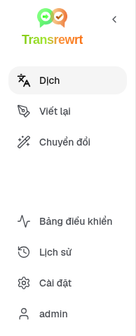
    </td>
    <td valign="top">
      <br/><br/>
      <ul>
        <li><strong>Dịch</strong> mở không gian làm việc dịch.</li><br/>
        <li><strong>Viết lại</strong> mở không gian làm việc viết lại.</li><br/>
        <li><strong>Chuyển đổi</strong> mở không gian làm việc lời nhắc tùy chỉnh.</li><br/>
        <li><strong>Bảng điều khiển</strong> hiển thị thông tin về mức sử dụng và chi phí.</li><br/>
        <li><strong>Cài đặt</strong> mở bảng cài đặt.</li><br/>
        <li><strong>Lịch sử</strong> hiển thị lịch sử sử dụng với văn bản đầu vào và đầu ra</li><br/>
        <li><strong>Người dùng</strong> hiển thị tên người dùng đã đăng nhập (chỉ trên web).</li>
      </ul>
    </td>
  </tr>
</table>

<br/>

<a id="toolbar"></a>
### Thanh công cụ

Thanh công cụ thay đổi nhẹ tùy theo vị trí bạn đang ở trong ứng dụng.

- Bên trái, hiển thị tên trang hiện tại.
- Bên phải, hiển thị **bộ chọn thiết lập sẵn hoặc mô hình** và điều khiển **Ngôn ngữ giao diện**.

Ở chế độ **Dễ**, thanh công cụ hiển thị **bộ chọn thiết lập sẵn** với các thiết lập sẵn tích hợp sẵn là **Miễn phí (OpenRouter)**, **Tiêu chuẩn**, **Nâng cao** và **Kỹ thuật**. Các thiết lập sẵn nào xuất hiện phụ thuộc vào **Nhà cung cấp** bạn đã chọn trong [**Cài đặt** > **Cài đặt chung**](#general-settings) — ví dụ: **Miễn phí (OpenRouter)** chỉ được liệt kê khi nhà cung cấp là OpenRouter. Nếu **Nhà cung cấp** là **Ollama**, thanh công cụ sẽ liệt kê các mô hình nội bộ đã cài đặt trên máy bạn thay vì các thiết lập sẵn.

Ở chế độ **Nâng cao**, **bộ chọn mô hình** cho phép bạn chọn công cụ AI nào sẽ dùng cho tác vụ hiện tại.

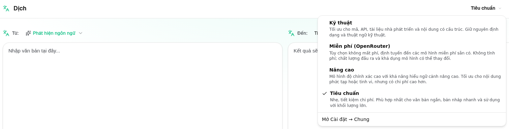

Ở chế độ Nâng cao, một số mô hình miễn phí có thể không luôn khả dụng — chúng có thể ngoại tuyến hoặc đã đạt giới hạn sử dụng. Ứng dụng có thể tự động xóa mô hình đó khỏi danh sách của bạn. Để kiểm soát các mô hình hiển thị, hãy vào [**Cài đặt** > **Mô hình**](#models). Bạn có thể mở cài đặt mô hình từ biểu tượng nhà cung cấp nằm bên trái tên mô hình trên thanh công cụ.

<br/>

Biểu tượng **hình quả địa cầu + mã ngôn ngữ** thay đổi ngôn ngữ giao diện ứng dụng, ví dụ như menu và nút bấm. Nó **không** thay đổi ngôn ngữ dịch được dùng trong chức năng **Dịch**.

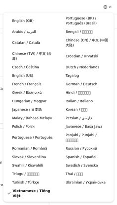

<br/>

<a id="input-and-output-panels"></a>
### Bảng đầu vào và đầu ra

Hầu hết các không gian làm việc sử dụng bảng **Đầu vào** bên trái và bảng **Đầu ra** bên phải.

Mỗi bảng cũng hiển thị:

| **Đầu vào**                                                          | **Đầu ra**                                                                                                                  |
|--------------------------------------------------------------------|-----------------------------------------------------------------------------------------------------------------------------|
| - Số ký tự <br/>- Số từ <br/>- Số đoạn văn   <br/> | - Thời gian thực hiện tác vụ<br/>- **TPS** (tokens mỗi giây)<br/>- Số ký tự, số từ và số đoạn văn<br/>- Mô hình đã dùng |

Nếu bạn thắc mắc về các thuật ngữ kỹ thuật:

- **Token** nghĩa là một đoạn văn bản nhỏ. Bạn có thể hiểu là một phần của từ hoặc một từ ngắn.
- **TPS** nghĩa là số lượng các đoạn văn bản như vậy mà mô hình xử lý mỗi giây.

<br/>

Bạn cũng có thể theo dõi chi phí cho mỗi thao tác (nếu có sẵn) và tổng chi phí, bằng cách bật tùy chọn `Show cost information on the actions` tại [**Cài đặt** > **Cài đặt chung**](#general-settings).

<br/><br/>

[--------------------------------------------------------------------------------------------------------------------------]: #

<a id="translate"></a>
## Dịch

Sử dụng **Dịch** khi bạn muốn chuyển đổi văn bản từ một ngôn ngữ sang ngôn ngữ khác.

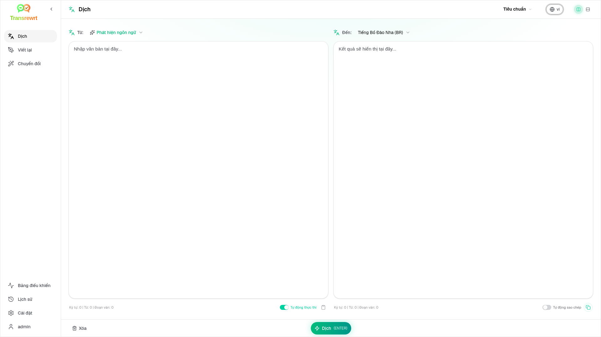

<br/>

<a id="translate-text"></a>
### Dịch văn bản

1. Mở **Dịch**.
2. Chọn một ngôn ngữ ở mục **Từ**.
3. Chọn một ngôn ngữ ở mục **Sang**.
4. Chọn một thiết lập sẵn (Dễ) hoặc mô hình (Nâng cao) trên thanh công cụ.
5. Nhập hoặc dán văn bản vào **Đầu vào**.
6. Nhấp **Dịch**.
7. Đọc kết quả ở phần **Đầu ra**.
8. Sử dụng nút sao chép nếu bạn muốn sao chép kết quả.

<br/>

<a id="language-selection"></a>
### Chọn ngôn ngữ

- **Từ** có thể là một ngôn ngữ cụ thể hoặc **Phát hiện ngôn ngữ**.
- **Sang** là ngôn ngữ bạn muốn kết quả hiển thị.

Các **Ngôn ngữ hàng đầu** bạn chọn sẽ xuất hiện ở đầu danh sách. Bạn có thể thiết lập các ngôn ngữ này tại [**Cài đặt** > **Ngôn ngữ**](#languages).

<br/>

<a id="helpful-translation-settings"></a>
### Các cài đặt dịch hữu ích

Trong [**Cài đặt** > **Cài đặt chung**](#general-settings), bạn có thể thay đổi cách thức hoạt động của tính năng dịch:

- **Tự động dịch khi dán** sẽ thực hiện dịch ngay khi bạn dán văn bản.
- **Tự động sao chép kết quả vào bộ nhớ tạm** sẽ tự động sao chép kết quả sau khi dịch thành công.
- **Dịch thời gian thực (trong khi gõ)** sẽ dịch khi bạn đang gõ văn bản.
- **Thời gian chờ (ms)** điều chỉnh khoảng thời gian ứng dụng chờ trước khi thực hiện dịch thời gian thực.
- **Hành vi cho ENTER** điều khiển hành động khi bạn nhấn `Enter`:
  - **Enter** thực hiện dịch hoặc viết lại (mặc định).
  - **Shift + Enter** thực hiện dịch hoặc viết lại; **Enter** thuần túy chèn dòng mới.

[--------------------------------------------------------------------------------------------------------------------------]: #

<a id="rewrite"></a>
## Viết lại

Sử dụng **Viết lại** khi bạn muốn cải thiện cách diễn đạt mà không làm thay đổi ý chính.

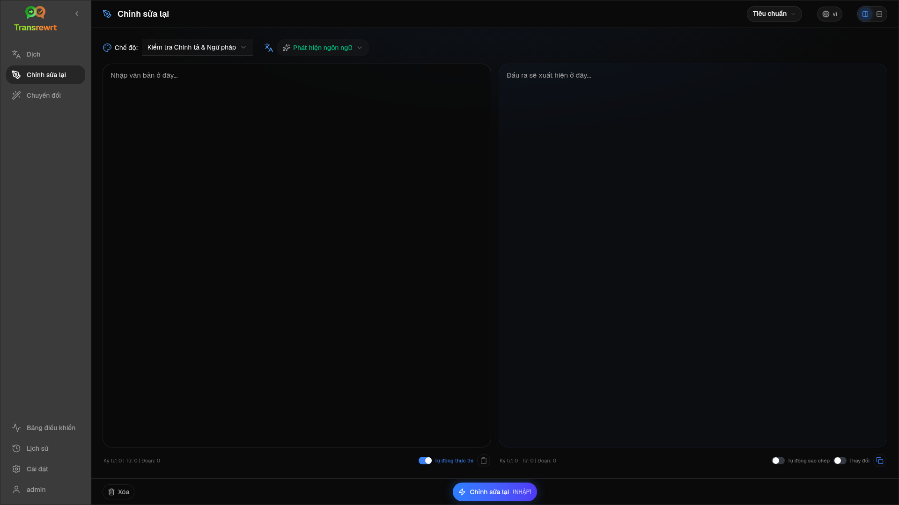

Tính năng này hữu ích để:

- sửa lỗi chính tả và ngữ pháp (**Kiểm tra chính tả & ngữ pháp**)
- làm cho văn bản rõ ràng hơn (**Cải thiện độ rõ ràng**)
- tạo nhiều phiên bản diễn đạt khác nhau trong một lần chạy (**Các phiên bản thay thế**)
- làm văn bản trang trọng hơn hoặc thân mật hơn (**Chuyển thành trang trọng** / **Chuyển thành thân mật**)
- rút gọn hoặc mở rộng văn bản (**Rút gọn** / **Mở rộng**)
- làm cho văn bản mang tính chuyên môn hơn (**Chuyển thành chuyên môn**)

<br/>

> 💡 **MẸO**<br/>
> Khi bạn sử dụng chế độ "**Kiểm tra chính tả & ngữ pháp**", một công tắc **Hiển thị thay đổi** sẽ xuất hiện ở bảng đầu ra (bên cạnh **Sao chép**).
> Bật hoặc tắt để hiển thị hoặc ẩn các sửa đổi cụ thể được áp dụng cho văn bản của bạn.

<br/><br/>

[--------------------------------------------------------------------------------------------------------------------------]: #

<a id="transform"></a>
## Chuyển đổi

Sử dụng **Chuyển đổi** khi bạn muốn AI tuân theo một tập hướng dẫn tùy chỉnh.

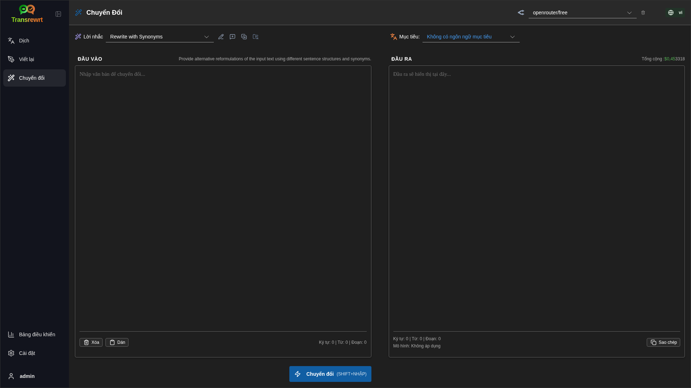

Đây là khu vực linh hoạt nhất của ứng dụng. Bạn có thể dùng để thực hiện các tác vụ như:

- tóm tắt ghi chú
- biến văn bản thô thành email hoàn chỉnh
- trích xuất các điểm chính
- chuyển đổi văn bản sang định dạng cụ thể
- bất kỳ hoạt động tùy chỉnh nào khác với văn bản đầu vào

<br/>

<a id="run-an-existing-prompt"></a>
### Chạy một lời nhắc có sẵn

1. Mở **Chuyển đổi**.
2. Chọn một lời nhắc từ danh sách lời nhắc.
3. Nếu xuất hiện hộp **Đích** ngôn ngữ, hãy chọn một ngôn ngữ nếu bạn muốn.
4. Nhập hoặc dán văn bản vào **Đầu vào**.
5. Nhấp **Chuyển đổi**.
6. Đọc kết quả trong **Đầu ra**.

<br/>

<a id="if-you-have-no-prompts-yet"></a>
### Nếu bạn chưa có lời nhắc nào

Nếu danh sách lời nhắc của bạn trống, hãy nhấn **Tải lời nhắc mẫu** trong không gian làm việc Chuyển đổi. Cùng điều khiển này luôn có sẵn tại [**Cài đặt** > **Chuyển đổi**](#transform-settings) ở hàng xuất/nhập. Cả hai đều thêm các ví dụ tích hợp để bạn bắt đầu nhanh chóng.

<br/>

> ℹ️ **LƯU Ý**<br/>
> Các lời nhắc mẫu được cung cấp bằng tiếng Anh. Sau khi tải, bạn có thể chỉnh sửa lời nhắc và sử dụng **Dịch lời nhắc** để dịch sang ngôn ngữ của bạn.

<br/>

<a id="create-a-prompt-quickly"></a>
### Tạo nhanh một lời nhắc

Cách nhanh nhất để tạo một lời nhắc là:

1. Nhấp vào **Lời nhắc mới**.
2. Nhấp vào **Tạo lời nhắc**.
3. Mô tả điều bạn muốn lời nhắc thực hiện.
4. Chọn một thiết lập sẵn (Dễ) hoặc mô hình (Nâng cao).
5. Để ứng dụng tạo bản nháp cho bạn.
6. Xem lại bản nháp và nhấp **Lưu**.

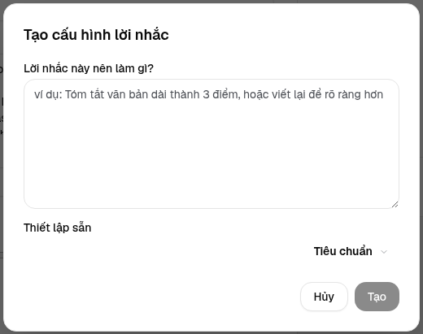

<br/>

<a id="edit-a-prompt"></a>
### Chỉnh sửa lời nhắc

Khi bạn tạo hoặc chỉnh sửa một lời nhắc, trình soạn thảo sẽ xuất hiện bên trái và khu vực kiểm tra sẽ xuất hiện bên phải.

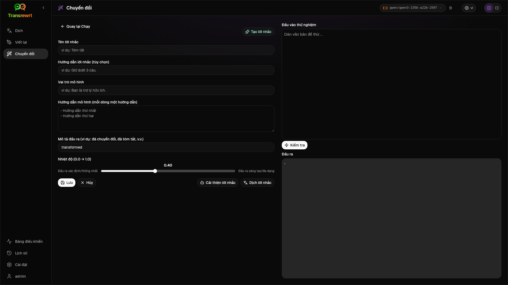

Các trường chính gồm:

- **Tên lời nhắc**: tên hiển thị trong danh sách lời nhắc.
- **Hướng dẫn lời nhắc (tùy chọn)**: gợi ý ngắn hiển thị cho người dùng khi chạy lời nhắc.
- **Vai trò mô hình**: vai trò tổng thể được gán cho AI, ví dụ: 'Bạn là trợ lý hữu ích.'
- **Hướng dẫn mô hình (mỗi dòng một hướng dẫn)**: các quy tắc cụ thể mà bạn muốn AI tuân theo.
- **Mô tả đầu ra**: từ ngắn mô tả kết quả, ví dụ: 'tóm tắt' hoặc 'viết lại'.
- **Nhiệt độ (0.0 → 1.0)**: cách mô hình sẽ hành xử; xem bên dưới.
- **Yêu cầu ngôn ngữ đích**: thêm bộ chọn ngôn ngữ đích khi chạy lời nhắc.

Nếu bạn chưa quen với thuật ngữ kỹ thuật **Nhiệt độ**, hãy hiểu như sau:

- **Nhiệt độ thấp hơn** cho kết quả ổn định và dự đoán được hơn.
- **Nhiệt độ cao hơn** cho sự đa dạng và sáng tạo hơn.

Bạn cũng có thể sử dụng:

- `Generate prompt` để tạo bản nháp mới từ mô tả đơn giản
- `Improve prompt` để tinh chỉnh lời nhắc hiện có
- `Translate prompt` để dịch các trường của lời nhắc

<br/>

> ⚠️ **CẢNH BÁO**<br/>
> Nhấp `Save` trước khi nhấp `Back to Run`. Nếu bạn quay lại mà không lưu, các thay đổi sẽ bị mất.

<br/>

<a id="test-a-prompt-before-using-it"></a>
### Kiểm tra lời nhắc trước khi sử dụng

Bảng kiểm tra ở bên phải cho phép bạn thử lời nhắc của mình với văn bản mẫu trước khi sử dụng trong công việc hàng ngày.

Điều này hữu ích khi:

- bạn đang tạo một lời nhắc mới
- bạn đang so sánh hai phiên bản của một lời nhắc
- bạn muốn kiểm tra giọng điệu, độ dài hoặc định dạng đầu ra

<br/>

> ℹ️ **LƯU Ý**<br/>
> Bạn có thể xuất và nhập các lời nhắc đã lưu tại [**Cài đặt** > **Chuyển đổi**](#transform-settings).

Khi bạn sử dụng **Tạo lời nhắc**, **Cải thiện lời nhắc** hoặc **Dịch lời nhắc** trong trình soạn thảo lời nhắc, chế độ **Dễ** cung cấp bộ chọn thiết lập sẵn giống như khi Dịch và Viết lại; chế độ **Nâng cao** sử dụng danh sách mô hình.

<br/><br/>

[--------------------------------------------------------------------------------------------------------------------------]: #

<a id="dashboard"></a>
## Bảng điều khiển

Sử dụng **Bảng điều khiển** để xem bạn đang sử dụng ứng dụng bao nhiêu và chi phí là bao nhiêu (đối với các mô hình có trả phí).

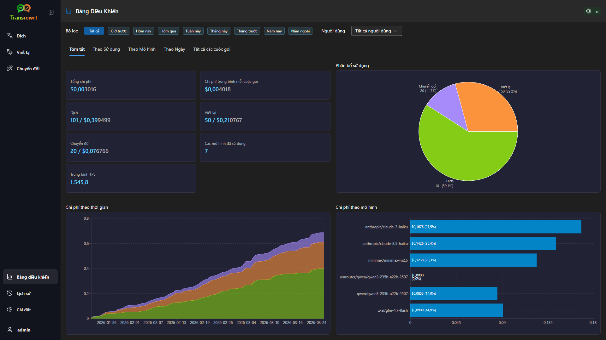

<br/>

> ℹ️ **LƯU Ý**<br/>
> Nếu bạn chỉ sử dụng các mô hình **miễn phí**, các khoản **chi phí** có thể bằng không và các KPI tập trung vào chi phí có thể trông trống rỗng. Tab **Tóm tắt** vẫn hiển thị số lượng cuộc gọi cho dịch, viết lại và chuyển đổi khi bạn có hoạt động trong khoảng thời gian đã chọn.

<br/>

<a id="filter-the-data"></a>
### Lọc dữ liệu

Sử dụng các nút bộ lọc ở đầu để thay đổi khoảng thời gian.

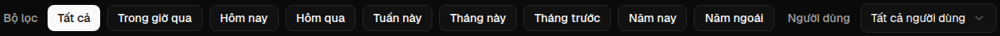

<br/>

> ℹ️ **LƯU Ý**<br/>
> Bộ lọc **Người dùng** chỉ hiển thị với quản trị viên trong phiên bản web. Người dùng thông thường sẽ không thấy bộ lọc này, và nó không khả dụng trong ứng dụng desktop.

<br/>

<a id="dashboard-tabs"></a>
### Các tab Bảng điều khiển

- **Tóm tắt** hiển thị các thẻ KPI: tổng chi phí, các mô hình đã sử dụng, số lượng cuộc gọi và chi phí theo chế độ (với tỷ lệ phần trăm so với tổng số cuộc gọi), chi phí trung bình mỗi cuộc gọi, TPS trung bình và ba mô hình hàng đầu theo số lượng cuộc gọi.
- **Theo mô hình** liệt kê từng mô hình với tổng số cuộc gọi, tổng chi phí và TPS trung bình; mở rộng một hàng để xem chi tiết theo dịch, viết lại và chuyển đổi.
- **Tất cả các cuộc gọi** hiển thị nhật ký cuộc gọi đầy đủ (phân trang trên bố cục rộng, dạng thẻ trên màn hình hẹp) và cho phép bạn xuất dữ liệu.

<br/>

<a id="export-data"></a>
### Xuất dữ liệu

Các bảng trong bảng điều khiển có thể xuất dữ liệu sang:

- **JSON**
- **CSV**
- **XLSX**

Điều này hữu ích nếu bạn muốn xem lại hoạt động bên ngoài ứng dụng hoặc chia sẻ báo cáo.

<br/>

<a id="delete-stored-records-for-a-model"></a>
### Xóa bản ghi đã lưu cho một mô hình

Trong **Theo mô hình** hoặc **Tất cả các cuộc gọi**, bạn có thể xóa các bản ghi đã lưu cho một mô hình bằng cách nhấp vào biểu tượng "thùng rác".

> ⚠️ **CẢNH BÁO**<br/>
> Việc xóa bản ghi đã lưu không thể hoàn tác. Chỉ sử dụng tính năng này nếu bạn chắc chắn rằng bạn không còn cần lịch sử đó nữa.

Để xóa tất cả dữ liệu hoặc xóa các bản ghi dựa trên thời gian tồn tại của chúng, hãy đi tới [**Cài đặt** > **Theo dõi chi phí**](#cost-tracking). Tại đó, bạn sẽ thấy các tùy chọn để xóa tất cả dữ liệu đã lưu hoặc chỉ những dữ liệu cũ hơn một ngày nhất định.

<br/><br/>

[--------------------------------------------------------------------------------------------------------------------------]: #

<a id="history"></a>
## Lịch sử

Nhấp vào **Lịch sử** để xem lịch sử các hành động của bạn trong **Transrewrt**, bao gồm đầu vào và đầu ra của từng thao tác.

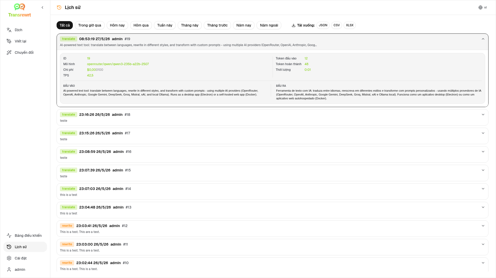

<br/>

<a id="filter-the-history"></a>
### Bộ lọc lịch sử

**Lịch sử** sử dụng các bộ lọc khoảng thời gian giống như trang **Bảng điều khiển**.


<br/>

> ℹ️ **LƯU Ý**<br/>
> Trong **ứng dụng web**, mọi người (kể cả quản trị viên) chỉ xem được lịch sử thực thi của chính họ. Bộ lọc **Người dùng** trên **Bảng điều khiển** dành cho quản trị viên xem lại việc sử dụng và chi phí trên các tài khoản; nó không áp dụng cho **Lịch sử**.

<br/>

<a id="export-history-data"></a>
### Xuất dữ liệu lịch sử

Trang lịch sử có thể xuất dữ liệu đã lọc theo các định dạng:

- **JSON**
- **CSV**
- **XLSX**

Điều này hữu ích nếu bạn muốn xem lại hoạt động bên ngoài ứng dụng hoặc chia sẻ báo cáo.

<br/><br/>

[--------------------------------------------------------------------------------------------------------------------------]: #

<a id="settings"></a>
## Cài đặt

Mở **Cài đặt** từ thanh bên để tùy chỉnh cách ứng dụng hoạt động.

Các tab khả dụng phụ thuộc vào nền tảng và vai trò của bạn:

| Tab              | Desktop | Web (admin) | Web (người dùng thường) | Ghi chú                                        |
  |------------------|:-------:|:-----------:|:------------------:|----------------------------------------------|
  | Cài đặt chung |   có   |     có     |        có         | Bao gồm **Trải nghiệm AI** (Dễ / Nâng cao) |
  | Mô hình           |   có   |     có     |        có         | Chỉ hiển thị khi **Trải nghiệm AI** ở chế độ **Nâng cao** |
  | Ngôn ngữ        |   có   |     có     |        có         |                                              |
  | Theo dõi chi phí    |   có   |     có     |         -          |                                              |
  | Chuyển đổi        |   có   |     có     |        có         | Nhập/xuất hàng loạt các lời nhắc chuyển đổi      |
  | Người dùng            |    -    |     có     |         -          |                                              |
  | Cấu hình API       |   có   |     có     |         -          |                                              |
  | Giới thiệu            |   có   |     có     |        có         |                                              |

Ở chế độ **Dễ**, việc chọn mô hình được thực hiện thông qua các thiết lập sẵn trên thanh công cụ và **Nhà cung cấp** trong Cài đặt chung; tab **Mô hình** bị ẩn.

<br/>

> ℹ️ **LƯU Ý**<br/>
> Trong phiên bản web, mỗi người dùng có cấu hình riêng. Các cài đặt như trải nghiệm AI, nhà cung cấp, mô hình hoặc thiết lập sẵn đã chọn, ngôn ngữ, tùy chọn chung và lời nhắc chuyển đổi được lưu riêng cho từng người dùng. Những thay đổi bạn thực hiện sẽ không ảnh hưởng đến người dùng khác.

<br/>

[--------------------------------------------------------------------------------------------------------------------------]: #

<a id="general-settings"></a>
### Cài đặt chung

Sử dụng **Cài đặt chung** để điều chỉnh hành vi gõ, việc lưu chi tiết thực thi cho **Lịch sử**, giao diện và cách bạn chọn AI cho Dịch, Viết lại và Chuyển đổi.

**Trải nghiệm AI**

- **Dễ** (mặc định): chọn một **Nhà cung cấp** (OpenRouter, OpenAI, Anthropic, Google Gemini, DeepSeek, Groq, Mistral, xAI, Cerebras hoặc Ollama). Các nhà cung cấp đám mây sử dụng các thiết lập sẵn tích hợp trên thanh công cụ. **Ollama** liệt kê các mô hình đã cài đặt trên máy bạn thay vì các thiết lập sẵn. Ở chế độ Dễ, **Danh mục thiết lập sẵn** hiển thị phiên bản danh mục và thời gian cập nhật lần cuối; nhấp vào **Làm mới danh mục thiết lập sẵn** để tải về danh sách thiết lập sẵn mới nhất từ kho lưu trữ dự án (ứng dụng cũng tự động kiểm tra định kỳ trong nền).
- **Nâng cao**: chọn từng mô hình riêng lẻ trên thanh công cụ; quản lý danh sách này tại [**Cài đặt** > **Mô hình**](#models).

Trong **ứng dụng web**, các nhà cung cấp hiển thị phụ thuộc vào khóa API được thiết lập trong môi trường máy chủ. Trong **ứng dụng desktop**, hãy cấu hình khóa tại [**Cấu hình API**](#api-config).

**Hành vi**

- **Hành vi cho ENTER** chọn xem `Enter` thực thi tác vụ hay chèn dòng mới.
- **Tự động dịch khi dán** bắt đầu dịch ngay khi bạn dán văn bản.
- **Tự động sao chép kết quả vào bộ nhớ tạm** tự động sao chép kết quả thành công.
- **Dịch thời gian thực (trong khi gõ)** dịch trong khi bạn gõ.
- **Thời gian chờ (ms)** đặt thời gian chờ cho dịch thời gian thực.

**Lịch sử**

- **Giữ lịch sử thực thi** kiểm soát việc mỗi thao tác dịch, viết lại và chuyển đổi có lưu **văn bản đầu vào và đầu ra** để hiển thị trong khung bên [**Lịch sử**](#history) hay không. Khi tắt tính năng này, hệ thống sẽ yêu cầu xác nhận; nếu bạn xác nhận, dữ liệu lịch sử đã lưu sẽ bị xóa khỏi cơ sở dữ liệu. Nếu nhãn hiển thị *bị tắt bởi quản trị viên*, cài đặt của bạn đã có `HISTORY_DISABLED` được thiết lập trong môi trường (xem [README](README.vi.md#configuration-and-environment)); bạn không thể bật lại lịch sử từ giao diện người dùng.
- **Xóa dữ liệu lịch sử** cho phép bạn xóa văn bản đã lưu theo độ tuổi (ví dụ: cũ hơn vài tháng, hoặc **tất cả dữ liệu (xóa)**) bằng cách sử dụng **Xóa dữ liệu**. Thao tác này chỉ ảnh hưởng đến văn bản thực thi đã lưu cho chế độ xem **Lịch sử**; nó **không** xóa tổng chi phí hoặc dữ liệu sử dụng. Để xóa hoặc thu gọn dữ liệu **chi phí**, hãy sử dụng [**Cài đặt** > **Theo dõi chi phí**](#cost-tracking).

**Giao diện**

- **Chủ đề** chuyển đổi giữa chế độ sáng, tối và hệ thống.
- **Hiển thị thông tin chi phí trên các hành động** điều khiển việc hiển thị chi phí cho mỗi thao tác (nếu có) và tổng chi phí trên các bảng kết quả Dịch, Viết lại và Chuyển đổi.
- **Số chữ số phần thập phân chi phí** thay đổi cách hiển thị số thập phân chi phí.
- **Chỉ dành cho web:** **hiển thị khoảng trống xung quanh ứng dụng** thêm khoảng trống xung quanh giao diện.
- **Họ phông chữ** thay đổi phông chữ trong các bảng văn bản.
- **Kích cỡ** thay đổi kích thước phông chữ.

**Sao lưu cấu hình** (chỉ dành cho quản trị viên ứng dụng máy tính để bàn và web)

- **Bao gồm dữ liệu sử dụng trong bản sao lưu** - khi được bật, tệp ZIP cũng chứa dữ liệu lịch sử thực thi và dữ liệu gọi API.
- **Sao lưu cấu hình** - tạo một tệp ZIP duy nhất (mặc định là `transrewrt-config-backup-YYYY-MM-DD_HHMMSS.zip` theo múi giờ UTC) bao gồm `config.json`, `state.json`, khóa mã hóa tùy chọn, người dùng, tùy chọn, lời nhắc tùy chỉnh và dữ liệu sử dụng nếu bạn đã chọn tham gia. Sau khi sao lưu thành công, thông báo xác nhận sẽ hiển thị tên tệp đã lưu.
- **Phục hồi từ bản sao lưu** - mở **hộp thoại xác nhận trước tiên**. Chọn tệp ZIP sao lưu trong hộp thoại (**Duyệt** / trình chọn tệp hoặc kéo và thả nếu được hỗ trợ), sau đó xem lại các tùy chọn:
  - **Khôi phục dữ liệu sử dụng** - nhập dữ liệu sử dụng/lịch sử từ tệp ZIP khi bản sao lưu đó được thực hiện với tùy chọn bao gồm dữ liệu sử dụng; bỏ chọn nếu bạn chỉ muốn cài đặt và lời nhắc.
  - **Xóa dữ liệu sử dụng cũ trước khi khôi phục** - xóa dữ liệu sử dụng/lịch sử hiện có trên bản cài đặt này trước khi áp dụng bản sao lưu (tùy chọn; sử dụng khi bạn muốn thay thế hoàn toàn).

Bản sao lưu được tạo trên phiên bản web hay desktop đều có thể được khôi phục trên phiên bản còn lại. Khi khôi phục bản sao lưu từ desktop trên phiên bản web, dữ liệu sẽ được khôi phục vào tài khoản người dùng quản trị.

<br/>

<a id="models"></a>
### Mô hình

Tab này chỉ khả dụng khi **Trải nghiệm AI** được đặt thành **Nâng cao** trong [**Cài đặt chung**](#general-settings). Sử dụng **Cài đặt** > **Mô hình** để chọn các mô hình xuất hiện trên thanh công cụ.

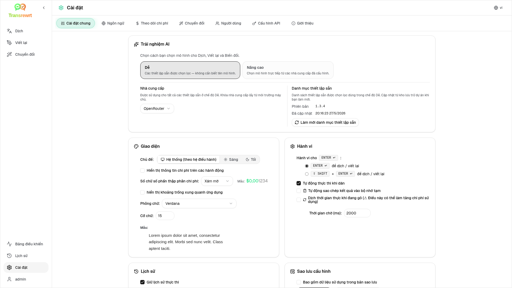

Trang này có hai danh sách:

- **Các mô hình khả dụng** ở bên trái
- **Mô hình đã chọn** ở bên phải

Các điều khiển hữu ích bao gồm:

- **Tìm kiếm mô hình...** để tìm mô hình theo tên
- Các thẻ **Nhà cung cấp** để thu hẹp danh sách theo một nền tảng (OpenRouter, OpenAI, Ollama, …)
- **Chỉ miễn phí** để chỉ hiển thị các mô hình miễn phí
- **Làm mới** để tải lại danh sách
- **Mở rộng tất cả** và **Thu gọn tất cả** khi bạn sắp xếp theo nhà cung cấp

Các ID mô hình bao gồm tiền tố nhà cung cấp (ví dụ `openrouter/…` so với `openai/…`). Các nhãn như **OpenAI (OpenRouter)** so với **OpenAI (trực tiếp)** cho biết cách lưu lượng truy cập được định tuyến.

> ℹ️ **LƯU Ý**<br/>
> **OpenRouter Body Builder** (`openrouter/bodybuilder`) là một mô hình định tuyến, không phải mô hình trò chuyện tổng quát: phản hồi của nó là JSON mô tả nội dung yêu cầu API OpenRouter (ví dụ một mảng `requests` với `model` và `messages`). Nếu bạn sử dụng nó cho **Dịch**, **Viết lại**, hoặc **Chuyển đổi**, bảng đầu ra sẽ hiển thị JSON đó thay vì văn bản hoàn chỉnh. Hãy chọn một mô hình văn bản thông thường cho các tác vụ này. Xem [trang mô hình Body Builder](https://openrouter.ai/openrouter/bodybuilder) trên OpenRouter.

Hành động:

- Để thêm mô hình, nhấn **Thêm** hoặc bất kỳ đâu trong mục đó.

- Để xóa mô hình, nhấn **X** bên cạnh nó trong **Mô hình đã chọn** hoặc **Đã chọn** trên mục trong Danh sách mô hình khả dụng.

- Để xóa danh sách, nhấn **Bỏ chọn tất cả**. Mô hình miễn phí bắt buộc sẽ vẫn được giữ lại trong danh sách.

<br/>

> ℹ️ **LƯU Ý**<br/>
> Nếu bạn không muốn thêm tín dụng vào OpenRouter ngay lập tức, hãy bắt đầu bằng cách bật **Chỉ miễn phí** và chọn các mô hình miễn phí (không cần thẻ tín dụng). Bạn cũng có thể dùng Ollama để chạy mô hình cục bộ mà không cần khóa API nào.

<br/>

<a id="languages"></a>
### Ngôn ngữ

Sử dụng **Cài đặt** > **Ngôn ngữ** để quản lý danh sách ngôn ngữ được dùng trong ứng dụng.

- **Ngôn ngữ hàng đầu** sẽ được ghim gần đầu danh sách ngôn ngữ trong **Dịch** và **Chuyển đổi**.
- **Ngôn ngữ tùy chỉnh** cho phép bạn thêm ngôn ngữ không có trong danh sách tích hợp sẵn.

Nếu bạn thêm ngôn ngữ tùy chỉnh, nó sẽ xuất hiện trong các trình chọn ngôn ngữ cùng với các tùy chọn tích hợp.

<br/>

<a id="cost-tracking"></a>
### Theo dõi chi phí

Sử dụng **Cài đặt** > **Theo dõi chi phí** để quản lý thông tin chi phí.

- **Tổng chi phí** hiển thị tổng số đang tích lũy.
- **Sao chép giá trị** sao chép tổng số vào bộ nhớ tạm.
- **Đặt lại chi phí** đặt lại tổng đã lưu về không.
- **Đồng bộ với việc sử dụng khóa API** đặt tổng số bằng với mức sử dụng được báo cáo từ tài khoản OpenRouter của bạn (chỉ dành cho OpenRouter).
- **Sử dụng khóa API** hiển thị chi tiết mức sử dụng OpenRouter, nếu có sẵn.
- **Xóa dữ liệu chi phí** xóa tất cả dữ liệu, hoặc chỉ các mục cũ hơn ngày đã chọn.

**Theo dõi chi phí:** Khi bạn sử dụng các mô hình OpenRouter, ứng dụng sẽ hiển thị mức sử dụng và chi tiêu thực tế dựa trên thông tin chi phí từ OpenRouter. Với tất cả các nhà cung cấp khác, ứng dụng ước tính chi phí dựa trên giá do OpenRouter công bố; nếu không có giá, ước tính có thể bằng không.

<br/>

> ℹ️ **LƯU Ý**<br/>
> **Tất cả các con số chi phí chỉ mang tính ước lượng để bạn tham khảo, không phải là hóa đơn chính thức.**

<br/>

> ⚠️ **CẢNH BÁO**<br/>
> Việc xóa dữ liệu không thể hoàn tác. Trước khi xóa, hãy sao lưu dữ liệu hoặc xuất nó qua [**Lịch sử**](#history)
> hoặc [**Bảng điều khiển** > **Tất cả các cuộc gọi**](#dashboard-tabs), nếu không dữ liệu sẽ bị mất vĩnh viễn.
> Toàn bộ lịch sử đầu vào/đầu ra liên quan đến mỗi mục gọi API cũng sẽ bị xóa.

<br/>

<a id="transform-settings"></a>
### Chuyển đổi (tab cài đặt)

Sử dụng **Cài đặt** > **Chuyển đổi** để quản lý hàng loạt các lời nhắc.

Bạn có thể:

- xem lại các lời nhắc đã lưu
- xóa lời nhắc
- nhập lời nhắc từ tệp
- xuất lời nhắc để sao lưu hoặc chia sẻ
- tải lời nhắc mẫu vào danh sách lời nhắc

<br/>

<a id="users"></a>
### Người dùng

Sử dụng **Người dùng** để quản lý tài khoản người dùng trong phiên bản web. Bạn có thể thêm người dùng, cập nhật thông tin, đặt lại mật khẩu và xóa tài khoản.

<br/>

<a id="api-config"></a>
### Cấu hình API

Các nhà cung cấp được hỗ trợ gồm: OpenRouter, OpenAI, Anthropic, Google Gemini, DeepSeek, Groq, Mistral, xAI, Cerebras, và **Ollama** (mô hình nội bộ thông qua URL gốc). Bạn chỉ cần cấu hình các nhà cung cấp mà bạn sử dụng.

**Ứng dụng web: chỉ dành cho quản trị viên**

Các khóa API được cấu hình thông qua biến môi trường hệ thống hoặc Docker - chúng không được nhập trong giao diện web. Trang này hiển thị các nhà cung cấp đã được cấu hình khóa và cho phép bạn kiểm tra từng nhà cung cấp bằng cách nhấn nút `Test`.

<br/>

> ℹ️ **LƯU Ý**<br/>
> Để thay đổi khóa API, hãy cập nhật biến môi trường trong cấu hình hệ thống hoặc Docker của bạn và khởi động lại máy chủ hoặc container.

<br/>

> ℹ️ **LƯU Ý**<br/>
> **Sao lưu cấu hình** (xem [**Cài đặt chung** → Sao lưu cấu hình](#general-settings)) có thể nhúng các khóa nhà cung cấp đã **giải quyết** vào bên trong tệp `config.json` của ZIP. Việc khôi phục tệp ZIP đó sẽ **không** sao chép lại các khóa này vào tệp cấu hình đã lưu trên máy chủ - các khóa đang hoạt động vẫn được lấy từ môi trường và trạng thái tệp hiện có như đã mô tả ở đó.

<br/>

**Ứng dụng máy tính để bàn**

Sử dụng **Cấu hình API** để lưu trữ các khóa API cho từng nhà cung cấp bạn sử dụng. Với Ollama, hãy nhập **URL gốc** thay vì khóa API.

<br/>

> 💡 **Mẹo** <br/>
> Nếu bạn không muốn sử dụng khóa API hoặc trả phí sử dụng, bạn có thể [tải xuống Ollama](https://ollama.com) và chạy các mô hình (ví dụ như `translategemma:4b`) trên máy tính của bạn miễn phí. Ngoài ra, bạn có thể tạo tài khoản OpenRouter miễn phí (không cần thẻ tín dụng) để sử dụng các mô hình miễn phí của họ, hoặc lấy khóa API miễn phí từ Cerebras, Google, Groq hoặc Mistral AI.

<br/>

- Chỉ thêm các nhà cung cấp mà bạn cần. Trong **Cài đặt** > **Mô hình**, mỗi ID mô hình bắt đầu bằng tên nhà cung cấp (ví dụ: `openrouter/openrouter/free`, `openai/gpt-4o`, `ollama/llama3`).

Để thêm khóa API, nhập giá trị vào ô văn bản và nhấn `Save`. Để thay thế khóa hiện có, nhấn `Edit`. Để xác minh khóa hoạt động, nhấn `Test`. Với URL gốc Ollama, luôn nhấn `Test` để kiểm tra kết nối.

<br/>

> ℹ️ **LƯU Ý**<br/>
> Bạn không thể xem giá trị hiện tại của một khóa API. Bạn chỉ có thể thay thế nó bằng cách sử dụng nút `Edit`.
> Các khóa API được lưu trữ dưới dạng mã hóa trong cấu hình.

<br/>

<a id="about"></a>
### Giới thiệu

Tab **Giới thiệu** hiển thị:

- tên ứng dụng và khẩu hiệu
- số phiên bản và ngày build
- thông tin giấy phép và bản quyền, kèm liên kết mở **Thông báo của bên thứ ba**
- liên kết đến kho lưu trữ dự án

<br/><br/>

<a id="common-issues"></a>
## Các vấn đề thường gặp

Nếu có điều gì không hoạt động như mong đợi, hãy kiểm tra các điểm sau trước tiên.

<br/>

<a id="the-app-will-not-translate-rewrite-or-transform-text"></a>
### Ứng dụng không dịch, viết lại hoặc chuyển đổi văn bản

Hãy kiểm tra rằng:

- bạn đã chọn một **thiết lập sẵn** (Dễ) hoặc **mô hình** (Nâng cao) trên thanh công cụ
- ở chế độ **Dễ**, [**Cài đặt** > **Cài đặt chung**](#general-settings) có một **Nhà cung cấp** với khóa hoạt động (hoặc URL Ollama) và ít nhất một thiết lập sẵn cho nhà cung cấp đó
- ở chế độ **Nâng cao**, ít nhất một mô hình được liệt kê trong [**Cài đặt** > **Mô hình**](#models)
- cấu hình API của bạn đang hoạt động

Nếu bạn đang sử dụng ứng dụng trên máy tính:

1. Mở [**Cài đặt** > **Cấu hình API**](#api-config).
2. Kiểm tra rằng ít nhất một khóa API đã được lưu.
3. Nhấp **Kiểm tra** bên cạnh nhà cung cấp để xác nhận khóa đang hoạt động.

<br/>

<a id="the-model-list-is-empty"></a>
### Danh sách mô hình trống

Ở chế độ **Dễ**, mở [**Cài đặt** > **Cài đặt chung**](#general-settings), xác nhận rằng **Nhà cung cấp** đã được thiết lập, và thêm hoặc kiểm tra khóa trong [**Cấu hình API**](#api-config) (trên máy tính để bàn) hoặc yêu cầu quản trị viên của bạn (trên web). Đối với **Ollama**, chạy **Kiểm tra** trên URL gốc và đảm bảo rằng các mô hình đã được cài đặt cục bộ.

Ở chế độ **Nâng cao**, mở [**Cài đặt** > **Mô hình**](#models) và nhấn **Làm mới**. Nếu cần, tìm kiếm một mô hình, bật **Chỉ miễn phí**, và thêm các mô hình vào **Mô hình đã chọn**.

<br/>

<a id="the-result-is-too-slow-or-too-expensive"></a>
### Kết quả quá chậm hoặc quá tốn kém

Hãy thử một hoặc nhiều cách sau:

- chọn một thiết lập sẵn (Dễ) hoặc mô hình (Nâng cao) khác
- sử dụng đầu vào ngắn hơn
- tắt **Dịch thời gian thực (khi gõ)** trong [**Cài đặt** > **Cài đặt chung**](#general-settings)
- sử dụng các mô hình miễn phí cho các tác vụ đơn giản (xem [Mô hình](#models))

<br/>

<a id="the-interface-is-in-the-wrong-language"></a>
### Giao diện hiển thị sai ngôn ngữ

Nhấp vào biểu tượng quả địa cầu trong [thanh công cụ](#toolbar) và chọn **Ngôn ngữ giao diện** ưa thích của bạn.

<br/>

<a id="the-text-is-too-small-or-hard-to-read"></a>
### Văn bản quá nhỏ hoặc khó đọc

Mở [**Cài đặt** > **Cài đặt chung**](#general-settings) và thay đổi:

- **Họ phông chữ**
- **Kích cỡ**

<br/>

<a id="dashboard-summary-looks-empty"></a>
### Bảng điều khiển Tóm tắt trông trống rỗng

Điều này là bình thường nếu:

- bạn chỉ sử dụng các **mô hình miễn phí** và đang xem các số liệu **chi phí** (có thể bằng không); các chỉ số KPI theo lượt gọi trong **Tóm tắt** vẫn cần dữ liệu từ khoảng thời gian đã chọn
- **bộ lọc thời gian** đã chọn không bao gồm khoảng thời gian thực hiện các cuộc gọi — hãy thử chọn **Tất cả** để kiểm tra

Nếu các chỉ số KPI vẫn bằng không sau khi chọn **Tất cả**, hãy xác nhận rằng các cuộc gọi xuất hiện trong [**Lịch sử**](#history) hoặc trong tab **Tất cả các cuộc gọi**.

<br/>

<a id="cost-shows-not-available-or-seems-wrong"></a>
### Chi phí hiển thị "không khả dụng" hoặc có vẻ sai

Khi bạn sử dụng mô hình thông qua **OpenRouter**, ứng dụng sẽ hiển thị số tiền thực tế mà bạn đã chi tiêu do OpenRouter báo cáo.

Đối với các **nhà cung cấp khác** (OpenAI trực tiếp, Anthropic trực tiếp, v.v.), chi phí được ước tính dựa trên dữ liệu giá công bố bởi OpenRouter. Nếu không tìm thấy giá phù hợp cho một mô hình, chi phí sẽ hiển thị là **không khả dụng** và sẽ không được cộng vào tổng chi phí của bạn.

<br/>

<a id="total-cost-does-not-match-my-provider-bill"></a>
### Tổng chi phí không khớp với hóa đơn từ nhà cung cấp

Tất cả các con số chi phí trong ứng dụng đều là **ước tính để tham khảo**, không phải là hóa đơn chính thức.

Để đưa tổng chi phí gần hơn với số tiền thực tế bạn đã chi tiêu trên OpenRouter, hãy mở [**Cài đặt** > **Theo dõi chi phí**](#cost-tracking) và nhấn **Đồng bộ với việc sử dụng khóa API**.

<br/>

<a id="the-history-page-is-missing-from-the-sidebar"></a>
### Trang Lịch sử bị thiếu trong thanh bên

**Giữ lịch sử thực thi** có thể đã bị tắt. Mở [**Cài đặt** > **Cài đặt chung**](#general-settings) và bật nó lên, trừ khi lịch sử đang bị *tắt bởi quản trị viên* (`HISTORY_DISABLED` trong môi trường — xem [README](README.vi.md#configuration-and-environment)). Việc bật lại lịch sử sẽ không khôi phục văn bản đã bị xóa trước đó.

<br/>

<a id="web-app-session-expired"></a>
### Ứng dụng web: bị chuyển hướng về trang đăng nhập một cách bất ngờ

Phiên làm việc của bạn có thể đã hết hạn. Hãy đăng nhập lại. Nếu điều này xảy ra thường xuyên, hãy kiểm tra cấu hình máy chủ về cài đặt thời gian tồn tại của phiên.

<br/>

<a id="web-admin-forgot-or-lost-a-password"></a>
### Quản trị viên web: quên hoặc mất mật khẩu

Tình huống này áp dụng cho **ứng dụng web tự lưu trữ** (Docker), không áp dụng cho ứng dụng máy tính để bàn (Electron).

- Nếu một quản trị viên khác vẫn có thể đăng nhập, họ có thể mở [**Cài đặt** > **Người dùng**](#users), chọn tài khoản, và đặt **mật khẩu mới** tại đó.
- Nếu bạn bị **khóa tài khoản** nhưng vẫn có **quyền truy cập shell** vào máy hoặc container, hãy đặt lại mật khẩu bằng công cụ hỗ trợ đi kèm theo hình ảnh (thay thế `transrewrt` nếu bạn đổi tên mặc định, và đặt dấu ngoặc kép quanh mật khẩu nếu nó chứa khoảng trắng hoặc ký tự đặc biệt):

```bash
docker exec transrewrt reset-web-password '<username>' '<new-password>'
```

Tên người dùng mặc định của quản trị viên là `admin` nếu bạn chưa từng tạo tài khoản nào khác. Khi bạn chỉ truyền một đối số, đối số đó sẽ được coi là mật khẩu mới cho `admin`.

Nếu bạn chạy từ bản **checkout mã nguồn** thay vì Docker, hãy sử dụng:

```bash
pnpm run reset-web-password -- <username> <new-password>
```

Mã lệnh cập nhật bản ghi người dùng trong cơ sở dữ liệu SQLite (và có thể tạo `admin` người dùng nếu bị thiếu). Sau khi đặt lại, hãy đăng nhập bằng mật khẩu mới.

<br/>

<a id="dashboard-shows-no-data-for-other-users"></a>
### Bảng điều khiển hiển thị không có dữ liệu cho các người dùng khác (web)

Chỉ **quản trị viên** mới có thể xem dữ liệu từ tất cả người dùng thông qua bộ lọc **Người dùng**. Người dùng thông thường chỉ xem được hoạt động của chính họ theo thiết kế.

<br/>

<a id="i-changed-a-prompt-and-lost-the-edits"></a>
### Tôi đã thay đổi một lời nhắc và mất các chỉnh sửa

Khi chỉnh sửa lời nhắc, hãy luôn nhấn **Lưu** trước khi nhấn **Quay lại Chạy**.

<br/><br/>

<a id="quick-tips"></a>
## Mẹo nhanh

- Bắt đầu với [**Dịch**](#translate) để đảm bảo cấu hình của bạn hoạt động trước khi chuyển sang [**Viết lại**](#rewrite) hoặc [**Chuyển đổi**](#transform).
- Sử dụng [**Viết lại**](#rewrite) để cải thiện văn bản hàng ngày.
- Sử dụng [**Chuyển đổi**](#transform) khi bạn cần một quy trình làm việc có thể lặp lại cho một nhiệm vụ cụ thể.
- Sử dụng [**Bảng điều khiển**](#dashboard) nếu bạn muốn theo dõi mức sử dụng và chi phí.
- Sử dụng [**Lịch sử**](#history) để xem lại các thao tác trước đó cùng với toàn bộ văn bản đầu vào/đầu ra.
- Xuất các lời nhắc thường xuyên nếu bạn đang xây dựng thư viện lời nhắc mà bạn muốn lưu giữ an toàn (xem [Chuyển đổi](#transform)) hoặc nếu bạn muốn chia sẻ với người khác.
- Hãy tiếp tục ở chế độ **Dễ** cho đến khi bạn cần kiểm soát chi tiết theo ID mô hình; chuyển sang **Nâng cao** khi bạn đã biết rõ các mô hình mình muốn sử dụng.

<br/><br/>

<a id="disclaimer"></a>
## Miễn trừ trách nhiệm

Tên sản phẩm và biểu tượng thuộc về chủ sở hữu tương ứng và chỉ được sử dụng nhằm mục đích nhận dạng. Phần mềm này không liên kết hoặc được bảo trợ bởi bất kỳ thương hiệu nào được đề cập.

<br/><br/>

<a id="license"></a>
## Giấy phép

Bản quyền © 2026 Waldemar Scudeller Jr.

[Apache License 2.0](../LICENSE)
