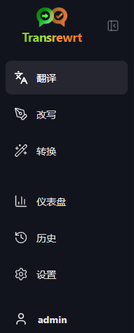
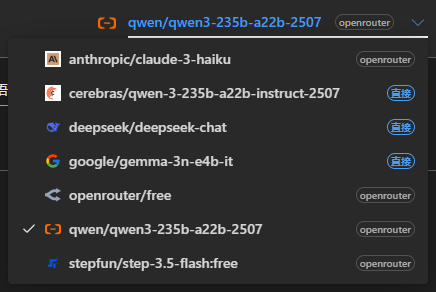
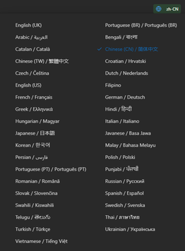
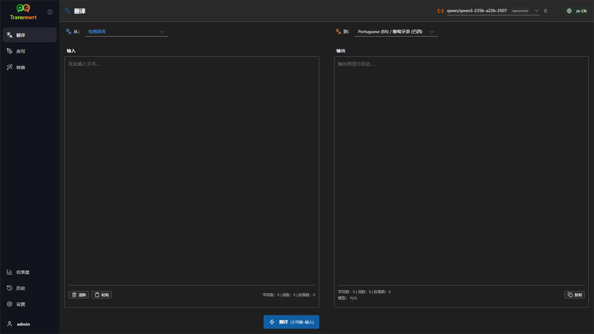
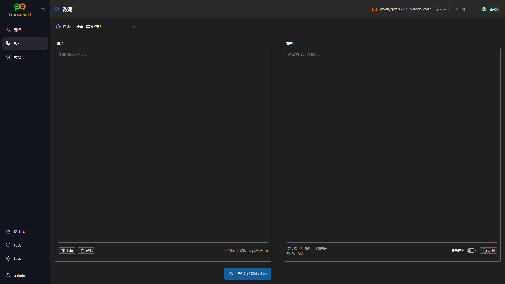
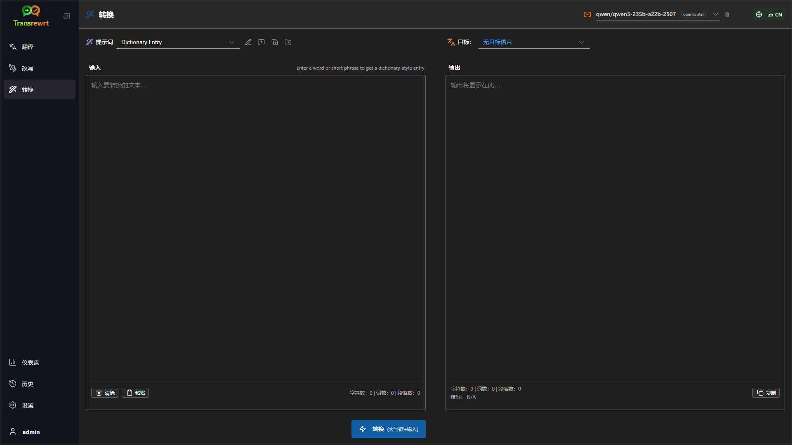
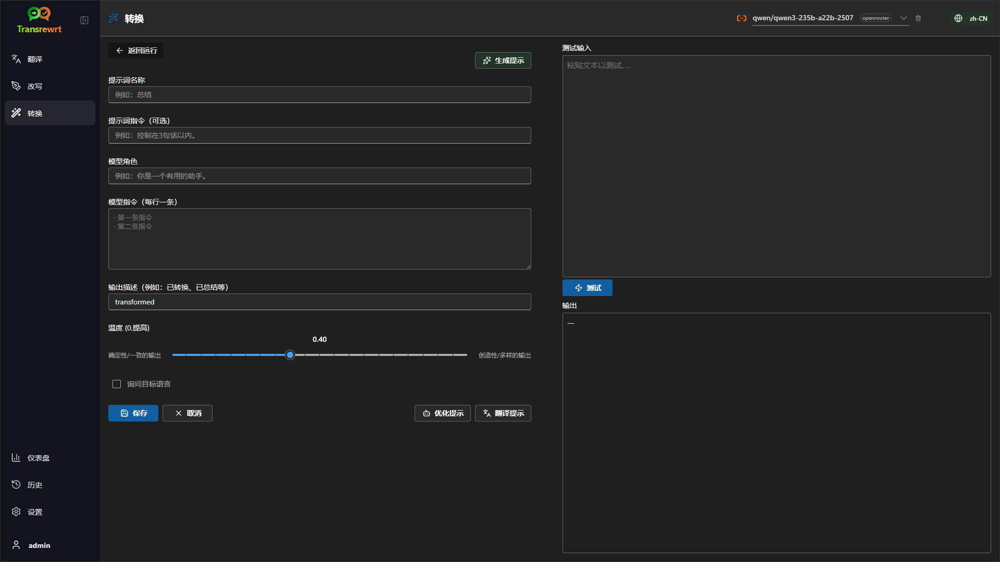
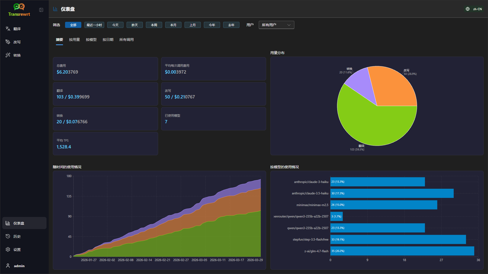
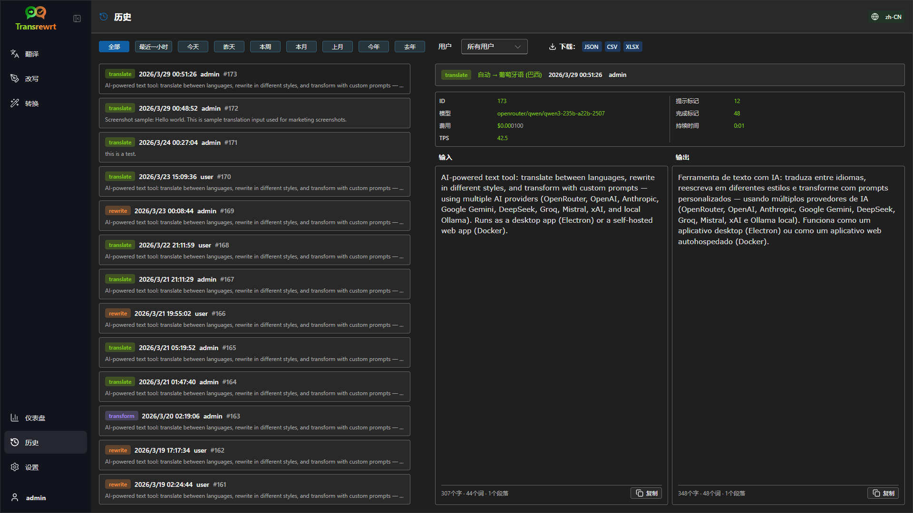
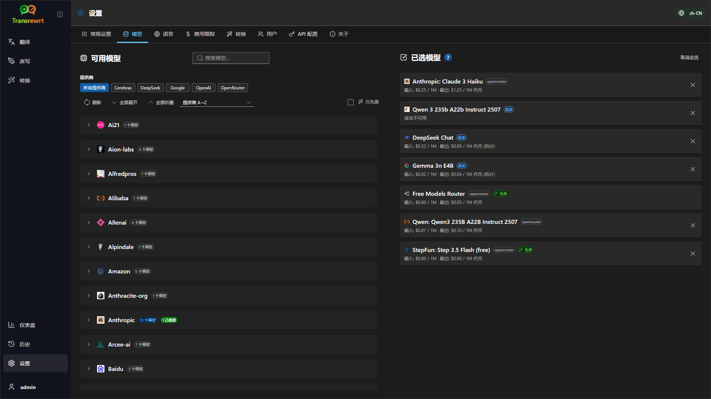

<a id="transrewrt-user-guide"></a>

# 用户指南

<br/>

<a id="introduction"></a>

## 简介

Transrewrt 可从以下三个方面帮助您处理文本：

- **翻译** - 将文本从一种语言转换为另一种语言。
- **重写** - 以不同风格重述文本，例如更清晰、更简洁或更正式。
- **转换** - 使用称为“提示（prompts）”的自定义 AI 指令处理文本。

<br/>

本指南介绍了应用安装并运行后的使用方法。有关安装步骤，请参阅主 **[README](README.zh-CN.md)** 文件。

<br/>

> ℹ️ **注意**<br/>
> Transrewrt 可作为适用于 Windows 和 Linux 的桌面应用程序，以及可自行托管的 Web 应用程序使用。本指南重点介绍应用的日常使用。如果某项功能仅适用于某一版本，文中会明确标注。

<small>**阅读其他语言版本：** </small>

<small id="lang-list"> [English (UK)](../USER-GUIDE.md) · [Português (BR)](USER-GUIDE.pt-BR.md) · [العربية](USER-GUIDE.ar.md) · [বাংলা](USER-GUIDE.bn.md) · [Català](USER-GUIDE.ca.md) · [简体中文](USER-GUIDE.zh-CN.md) · [繁體中文](USER-GUIDE.zh-TW.md) · [Hrvatski](USER-GUIDE.hr.md) · [Čeština](USER-GUIDE.cs.md) · [Nederlands](USER-GUIDE.nl.md) · [English (US)](USER-GUIDE.en-US.md) · [Filipino](USER-GUIDE.tl.md) · [Français](USER-GUIDE.fr.md) · [Deutsch](USER-GUIDE.de.md) · [Ελληνικά](USER-GUIDE.el.md) · [हिन्दी](USER-GUIDE.hi.md) · [Magyar](USER-GUIDE.hu.md) · [Italiano](USER-GUIDE.it.md) · [日本語](USER-GUIDE.ja.md) · [Basa Jawa](USER-GUIDE.jv.md) · [한국어](USER-GUIDE.ko.md) · [Bahasa Melayu](USER-GUIDE.ms.md) · [فارسی](USER-GUIDE.fa.md) · [Polski](USER-GUIDE.pl.md) · [Português (PT)](USER-GUIDE.pt.md) · [ਪੰਜਾਬੀ](USER-GUIDE.pa.md) · [Română](USER-GUIDE.ro.md) · [Русский](USER-GUIDE.ru.md) · [Slovenčina](USER-GUIDE.sk.md) · [Español](USER-GUIDE.es.md) · [Kiswahili](USER-GUIDE.sw.md) · [Svenska](USER-GUIDE.sv.md) · [తెలుగు](USER-GUIDE.te.md) · [ภาษาไทย](USER-GUIDE.th.md) · [Türkçe](USER-GUIDE.tr.md) · [Українська](USER-GUIDE.uk.md) · [Tiếng Việt](USER-GUIDE.vi.md)</small>

ER-GUIDE.ms.md) · [波斯语](USER-GUIDE.fa.md) · [波兰语](USER-GUIDE.pl.md) · [葡萄牙语 (PT)](USER-GUIDE.pt.md) · [旁遮普语](USER-GUIDE.pa.md) · [罗马尼亚语](USER-GUIDE.ro.md) · [俄语](USER-GUIDE.ru.md) · [斯洛伐克语](USER-GUIDE.sk.md) · [西班牙语](USER-GUIDE.es.md) · [斯瓦希里语](USER-GUIDE.sw.md) · [瑞典语](USER-GUIDE.sv.md) · [泰卢固语](USER-GUIDE.te.md) · [泰语](USER-GUIDE.th.md) · [土耳其语](USER-GUIDE.tr.md) · [乌克兰语](USER-GUIDE.uk.md) · [越南语](USER-GUIDE.vi.md)</small>

<small>

> **关于界面和文档翻译的说明：** 除原始英文（英国）外，所有界面语言均通过 AI 模型翻译；  
> 用词可能不准确或存在错误。

</small>

<br/>


<!-- START doctoc generated TOC please keep comment here to allow auto update -->
<!-- DON'T EDIT THIS SECTION, INSTEAD RE-RUN doctoc TO UPDATE -->
**目录**

- [开始之前](#before-you-start)
  - [如何获取免费的 OpenRouter API 密钥（桌面应用）](#how-to-get-a-free-openrouter-api-key-desktop-app)
- [快速入门](#getting-started)
- [窗口的主要部分](#main-parts-of-the-window)
  - [侧边栏](#sidebar)
  - [工具栏](#toolbar)
  - [输入和输出面板](#input-and-output-panels)
- [翻译](#translate)
  - [翻译文本](#translate-text)
  - [语言选择](#language-selection)
  - [有用的翻译设置](#helpful-translation-settings)
- [重写](#rewrite)
- [转换](#transform)
  - [运行现有提示](#run-an-existing-prompt)
  - [如果你还没有提示](#if-you-have-no-prompts-yet)
  - [快速创建提示](#create-a-prompt-quickly)
  - [编辑提示](#edit-a-prompt)
  - [使用前测试提示](#test-a-prompt-before-using-it)
- [仪表板](#dashboard)
  - [筛选数据](#filter-the-data)
  - [仪表板标签页](#dashboard-tabs)
  - [导出数据](#export-data)

- [删除某个模型的存储记录](#delete-stored-records-for-a-model)
- [历史记录](#history)
  - [筛选数据](#filter-the-data-1)
  - [导出历史数据](#export-history-data)
- [设置](#settings)
  - [常规设置](#general-settings)
  - [模型](#models)
  - [语言](#languages)
  - [费用追踪](#cost-tracking)
  - [转换提示词](#transform-prompts)
  - [用户](#users)
  - [API 配置](#api-config)
  - [关于](#about)
- [常见问题](#common-issues)
  - [应用无法翻译、重写或转换文本](#the-app-will-not-translate-rewrite-or-transform-text)
  - [模型列表为空](#the-model-list-is-empty)
  - [结果响应太慢或成本过高](#the-result-is-too-slow-or-too-expensive)
  - [界面语言错误](#the-interface-is-in-the-wrong-language)
  - [文本太小或难以阅读](#the-text-is-too-small-or-hard-to-read)
  - [仪表板图表为空](#dashboard-charts-are-empty)

- [费用显示“不可用”或似乎有误](#cost-shows-not-available-or-seems-wrong)
  - [总费用与服务提供商账单不一致](#total-cost-does-not-match-my-provider-bill)
  - [侧边栏中缺少历史记录页面](#the-history-page-is-missing-from-the-sidebar)
  - [网页应用：意外重定向到登录页面](#web-app-redirected-to-the-login-page-unexpectedly)
  - [网页管理员：忘记或丢失密码](#web-admin-forgot-or-lost-a-password)
  - [仪表板未显示其他用户的数据（网页端）](#dashboard-shows-no-data-for-other-users-web)
  - [我修改了一个提示词但编辑内容丢失](#i-changed-a-prompt-and-lost-the-edits)
- [快速提示](#quick-tips)
- [免责声明](#disclaimer)
- [许可证](#license)

<!-- END doctoc generated TOC please keep comment here to allow auto update -->

<br/><br/>

<a id="before-you-start"></a>

## 开始之前

要使用 Transrewrt，你需要至少接入一个 AI 服务商。支持的服务商包括：[OpenRouter](https://openrouter.ai)（聚合了多种模型）、OpenAI、Anthropic、Google Gemini、DeepSeek、Groq、Mistral、xAI、Cerebras，以及用于本地模型的 [Ollama](https://ollama.com)。

你无需选择付费模型即可开始使用。一旦你添加了 OpenRouter 的 API 密钥，应用程序会自动启用一个内置的**免费**OpenRouter 选项，让你立即开始翻译、重写和文本转换。此外，你也可以从 Cerebras、Google、Groq 或 Mistral AI 获取免费的 API 密钥。

简单来说：

- 一个 **模型** 是执行任务的 AI 引擎。模型名称会带有 **服务商前缀**（例如 `openrouter/…`、`openai/…`、`ollama/…`）。
- 一个 **API 密钥**（或对 Ollama 而言是 **基础 URL**）是应用程序连接该服务商的方式。

如果你使用的是**桌面应用**，请在[**设置** > **API 配置**](#api-config)中为你所使用的每个提供商添加密钥。如果仅使用 OpenRouter，请参见下方的[如何获取 API 密钥](#how-to-get-an-api-key-desktop-app)。如果不想使用 API 密钥，你也可以安装 Ollama（来自 [ollama.com](https://ollama.com)）并改用本地模型，例如 `translategemma:4b`。

如果你使用的是**网页版**，服务器管理员会通过环境变量配置提供商，因此你无法直接在应用中输入 API 密钥。

<br/>

<a id="how-to-get-an-api-key-desktop-app"></a>

### 如何获取免费的 OpenRouter API 密钥（桌面应用程序）

如果你正在使用桌面应用程序，请按照以下步骤操作：

1. 在你的网络浏览器中前往 [OpenRouter](https://openrouter.ai)。
2. 创建一个账户或登录。
3. 打开 [密钥页面](https://openrouter.ai/keys)。
4. 点击按钮创建一个新的 API 密钥。
5. 为该密钥设置一个名称，以便日后识别。
6. 复制新生成的 API 密钥。
7. 返回 Transrewrt，打开 **设置** > **API 配置**。
8. 将密钥粘贴到 **OpenRouter API 密钥** 字段中（位于 **设置** > **API 配置** 内）。
9. 点击 **测试 OpenRouter 密钥**，以确保其正常工作。

<br/><br/>

<a id="getting-started"></a>

## 快速入门

如果您是首次使用 Transrewrt，请按照以下顺序操作：

1. 打开应用程序。
2. 如有需要，点击地球图标选择您的**界面语言**。
3. 如果您使用的是**桌面应用程序**，请打开[**设置** > **API 配置**](#api-config)，为至少一个服务商（例如 OpenRouter）添加 API 密钥，并点击**测试**以确认其正常工作。
4. 打开[**设置** > **模型**](#models)，将一个或多个模型添加到**已选模型**中。
5. 打开[**设置** > **语言**](#languages)，选择您的**首选语言**，以便您最常用的语言优先显示。
6. 进入**翻译**页面，执行一次简单翻译以确认所有设置正常。
7. 确认正常后，尝试使用**重写**功能，然后尝试**转换**功能。

此顺序很重要，可避免首次使用时最常见的问题：在应用尚未配置有效的 API 连接或未选择模型的情况下尝试执行任务。

<br/><br/>

<a id="main-parts-of-the-window"></a>

## 窗口的主要部分

应用程序分为三个主要区域：

- 左侧的**侧边栏**。
- 顶部的**工具栏**。
- 中间的**工作区**。

<br/>

<a id="sidebar"></a>

### 侧边栏

通过侧边栏可在应用内导航。点击应用标志旁的图标可收起侧边栏，以获得更大的显示空间。

<br/>

<table>
  <tr>
    <td valign="top">
       
    </td>
    <td valign="top">
      <br/><br/>
      <ul>
        <li><strong>翻译</strong> 打开翻译工作区。</li><br/>
        <li><strong>重写</strong> 打开重写工作区。</li><br/>
        <li><strong>转换</strong> 打开自定义提示词工作区。</li><br/>
        <li><strong>仪表板</strong> 显示使用情况和费用信息。</li><br/>
        <li><strong>设置</strong> 打开设置面板。</li><br/>
        <li><strong>历史记录</strong> 显示包含输入与输出文本的使用历史。</li><br/>
        <li><strong>用户</strong> 显示当前登录用户的用户名（仅限网页版）。</li>
      </ul>

</td>
  </tr>
</table>

<br/>

<a id="toolbar"></a>

### 工具栏

工具栏会根据您在应用程序中的位置略有不同。

- 左侧显示当前页面的名称。
- 右侧显示 **模型选择器** 和 **界面语言** 控件。

**模型选择器** 可让您选择用于当前任务的 AI 引擎。

  

某些免费模型可能并非始终可用——有时它们会离线或存在使用上限。如果发生这种情况，应用程序将自动从您的可用列表中移除该模型。要控制显示哪些模型，请前往 [**设置** > **模型**](#models) 并编辑您的模型列表。  
您也可以通过点击工具栏中模型名称左侧的提供商图标，直接打开模型设置。

<br/>

**地球图标 + 语言代码** 用于更改应用程序界面语言（例如菜单和按钮）。它 **不会** 更改 **翻译** 功能中使用的翻译语言。



<br/>

<a id="input-and-output-panels"></a>

### 输入和输出面板

大多数工作区使用左侧的 **输入** 面板和右侧的 **输出** 面板。

每个面板还显示以下信息：

| **输入**                                                          | **输出**                                                                                                                  |
|--------------------------------------------------------------------|-----------------------------------------------------------------------------------------------------------------------------|
| - 字符数 <br/>- 词数 <br/>- 段落数   <br/> | - 任务耗时<br/>- **TPS**（每秒处理的令牌数）<br/>- 字符、词和段落数量<br/>- 使用的模型 |


如果您对技术术语有疑问：

- **令牌（Token）** 指一小段文本，可以将其视为一个词的一部分或一个短词。
- **TPS** 表示模型每秒处理的文本片段数量。

<br/>

您还可以监控每次操作的成本（如果可用）以及总成本，只需在[**设置** > **常规设置**](#general-settings)中启用`在操作中显示成本信息`选项即可。


<br/><br/>

[--------------------------------------------------------------------------------------------------------------------------]: # 

<a id="translate"></a>

## 翻译

当你需要将文本从一种语言转换为另一种语言时，请使用**翻译**功能。



<br/>

<a id="translate-text"></a>

### 翻译文本

1. 打开 **翻译**。
2. 在 **从** 中选择一种语言。
3. 在 **到** 中选择一种语言。
4. 在工具栏中选择一个模型。
5. 在 **输入** 框中键入或粘贴文本。
6. 点击 **翻译**。
7. 在 **输出** 框中查看结果。
8. 如果需要复制结果，请使用复制按钮。

<br/>

<a id="language-selection"></a>

### 语言选择

- **源语言** 可以是某种具体语言，也可以选择 **自动检测语言**。
- **目标语言** 是您希望翻译结果所呈现的语言。

您设置的 **常用语言** 会显示在语言列表的顶部。您可以在 [**设置** > **语言**](#languages) 中进行配置。

<br/>

<a id="helpful-translation-settings"></a>

### 有用的翻译设置

在 [**设置** > **常规设置**](#general-settings) 中，您可以更改翻译的行为方式：

- **粘贴时自动翻译**：在您粘贴文本时立即执行翻译。
- **自动复制结果到剪贴板**：在成功运行翻译后自动复制结果。
- **实时翻译（输入时）**：在您输入时实时执行翻译。
- **超时时间（毫秒）**：控制应用程序在执行实时翻译前等待的时间。
- **回车键功能**：控制按下 `Enter` 键时执行的操作：

<br/><br/>

[--------------------------------------------------------------------------------------------------------------------------]: # 

<a id="rewrite"></a>

## 重写

当你希望在不改变主要含义的情况下优化措辞时，使用 **重写** 功能。



此功能适用于：

- 修正拼写和语法错误（**检查拼写和语法**）
- 使文本更清晰（**提升清晰度**）
- 一次生成多种不同的表达方式（**不同版本**）
- 使文本更正式或更口语化（**正式** / **非正式**）
- 缩短或扩展文本（**缩短** / **扩展**）
- 使文本更具技术性（**转为技术性表达**）

<br/>

> 💡 **提示**<br/>
> 使用“**检查拼写和语法**”模式时，输出面板中会显示一个“**显示修改**”开关（位于“复制”按钮旁）。
> 打开或关闭该开关，可显示或隐藏对你文本所作的具体修改。

<br/><br/>

[--------------------------------------------------------------------------------------------------------------------------]: # 

<a id="transform"></a>

## 转换

当你希望 AI 遵循一组自定义指令时，请使用**转换**功能。



这是应用程序中最灵活的功能区域。你可以将其用于以下任务：

- 摘要笔记
- 将草稿文本润色为正式邮件
- 提取要点
- 将文本转换为特定格式
- 对输入文本执行任何其他自定义操作

<br/>

<a id="run-an-existing-prompt"></a>

### 运行现有提示

1. 打开 **转换**。
2. 从提示列表中选择一个提示。
3. 如果出现 **目标** 语言框，可根据需要选择一种语言。
4. 在 **输入** 框中键入或粘贴文本。
5. 点击 **转换**。
6. 在 **输出** 中查看结果。

<br/>

<a id="if-you-have-no-prompts-yet"></a>

### 如果你还没有提示词

如果你的提示词列表为空，可以点击“转换”工作区中的 **加载示例提示词**。同样的功能在 [**设置** > **转换提示词**](#transform-prompts) 的导出/导入行也始终可用。两者都会添加内置示例，帮助你快速开始使用。

<br/>

> ℹ️ **注意**<br/>
> 示例提示词以英文提供。加载后，你可以编辑提示词，并使用 **翻译提示词** 将其翻译成你的语言。

<br/>

<a id="create-a-prompt-quickly"></a>

### 快速创建提示

创建提示的最快方式是：

1. 点击 **新建提示**。
2. 点击 **生成提示**。
3. 描述你希望该提示实现的功能。
4. 选择一个模型。
5. 让应用程序为你生成草稿。
6. 审核草稿并点击 **保存**。


<br/>

<a id="edit-a-prompt"></a>

### 编辑提示词

创建或编辑提示词时，左侧会显示编辑器，右侧会显示测试区域。



主要字段包括：

- **提示词名称**：在提示词列表中显示的名称。
- **提示词说明（可选）**：运行提示词时向用户显示的简短提示。
- **模型角色**：分配给AI的总体角色，例如“你是一个乐于助人的助手。”
- **模型指令（每行一条）**：你希望AI遵循的具体规则。
- **输出描述**：简短描述输出结果的词语，例如“摘要”或“重写”。
- **温度（0.0 → 1.0）**：控制模型行为的方式；见下文说明。
- **询问目标语言**：运行提示词时会添加一个目标语言选择器。

如果你不熟悉技术术语**温度**，可以这样理解：

- **较低**的温度会生成更稳定、更可预测的结果。

- **较高的** 温度会带来更多的多样性和创造性。

您还可以使用：

- **`生成提示`** 根据简要描述创建一个新草稿
- **`优化提示`** 改进现有的提示
- **`翻译提示`** 翻译提示字段

<br/>

> ⚠️ **警告**<br/>
> 在点击 **`返回运行`** 之前，请先点击 **`保存`**。如果未保存就返回，您的更改将会丢失。

<br/>

<a id="test-a-prompt-before-using-it"></a>

### 在使用前测试提示词

右侧的测试面板允许你在日常工作中使用提示词之前，通过示例文本进行测试。

这在以下情况下非常有用：

- 你正在创建一个新的提示词
- 你正在比较两个不同版本的提示词
- 你希望检查输出的语气、长度或格式

<br/>

> ℹ️ **注意**<br/>
> 你可以在 [**设置** > **转换提示词**](#transform-prompts) 中导出和导入已保存的提示词。

<br/><br/>

[--------------------------------------------------------------------------------------------------------------------------]: # 

<a id="dashboard"></a>

## 仪表板

使用**仪表板**查看您使用本应用的程度以及所产生的费用（针对付费模型）。



<br/>

> ℹ️ **注意**<br/>
> 如果您仅使用**免费**模型，**费用**金额可能会为零，因此以费用为主的统计数据可能显示为空。但在**概览**、**时间使用情况**和**按模型使用情况**中，只要在所选时间段内有使用记录，仍会显示调用次数（翻译、重写和转换）。

<br/>

<a id="filter-the-data"></a>

### 筛选数据

使用顶部的筛选按钮来更改时间范围。


<br/>

> ℹ️ **注意**<br/>
> **用户**筛选器仅对网页版中的管理员可见。普通用户将看不到此筛选器，且桌面应用程序中不可用。

<br/>

<a id="dashboard-tabs"></a>

### 仪表板标签

- **概览**：提供使用情况和成本的总体信息。包括 **使用情况随时间变化**（按天统计的翻译、改写和转换的累计调用次数堆叠图）和 **按模型统计的使用情况**（每个模型的总调用次数，包括转换任务）。
- **按使用统计**：按翻译语言、改写模式和转换提示词分解活动详情。
- **按模型统计**：显示您所使用的模型及其花费。
- **按天统计**：显示每日使用总量。
- **所有调用**：显示完整的调用历史记录，并允许您导出数据。

<br/>

<a id="export-data"></a>

### 导出数据

仪表盘表格可将数据导出为以下格式：

- **JSON**
- **CSV**
- **XLSX**

如果您希望在应用程序外部查看活动记录或分享报告，此功能非常有用。

<br/>

<a id="delete-stored-records-for-a-model"></a>

### 删除特定模型的存储记录

在 **按模型** 或 **全部调用** 页面中，您可以通过点击“垃圾桶”图标来删除某个模型的存储记录。

> ⚠️ **警告**<br/>
> 删除存储记录的操作无法撤销。请仅在确认不再需要该历史记录时使用此功能。

如需删除所有数据或根据记录的创建时间删除记录，请前往 [**设置** > **成本跟踪**](#cost-tracking)。在那里，您可以选择删除所有存储的数据，或仅删除早于特定日期的数据。

<br/><br/>

[--------------------------------------------------------------------------------------------------------------------------]: # 

<a id="history"></a>

## 历史记录

单击 **历史记录** 可查看您在 **Transrewrt** 中执行操作的历史，包括每次操作的输入和输出内容。



<br/>

<a id="filter-the-history"></a>

### 筛选数据

“历史”页面使用的筛选器与“仪表板”页面相同。请使用这些筛选器选择时间范围。


<br/>

> ℹ️ **注意**<br/>
> “用户”筛选器仅对网页版的管理员可见。普通用户不会看到此筛选器，并且该筛选器在桌面应用程序中不可用。

<br/>

<a id="export-history-data"></a>

### 导出历史数据

历史记录页面可以将筛选后的数据导出为以下格式：

- **JSON**
- **CSV**
- **XLSX**

如果您希望在应用程序之外查看活动记录，或分享报告，此功能非常有用。

<br/><br/>

[--------------------------------------------------------------------------------------------------------------------------]: # 

<a id="settings"></a>

## 设置

从侧边栏打开**设置**，自定义应用程序的行为。

可用的选项卡取决于您的平台和角色：

  | 选项卡             | 桌面端 | 网页端（管理员） | 网页端（普通用户） |
  |-------------------|:------:|:--------------:|:----------------:|
  | 常规设置          |  是   |      是        |        是         |
  | 模型              |  是   |      是        |        是         |
  | 语言              |  是   |      是        |        是         |
  | 成本追踪          |  是   |      是        |        —         |
  | 转换提示词        |  是   |      是        |        是         |
  | 用户              |   —   |      是        |        —         |
  | API 配置          |  是   |      是        |        —         |
  | 关于              |  是   |      是        |        是         |

<br/>

> ℹ️ **注意**<br/>

> 在网页版本中，每位用户都有自己的配置。所选模型、语言、常规选项和转换提示等设置均按用户分别保存。您所做的更改不会影响其他用户。

<br/>

[--------------------------------------------------------------------------------------------------------------------------]: # 

<a id="general-settings"></a>

### 一般设置

使用**一般设置**来控制输入行为、是否为**历史记录**保存执行详情，以及外观设置。

**行为**

- **Enter 键行为** 用于选择按下 `Enter` 键时是运行任务还是插入新行。
- **粘贴时自动翻译** 在你粘贴文本后立即开始翻译。
- **自动复制结果到剪贴板** 会自动复制成功的翻译结果。
- **实时翻译（输入时）** 在你输入的同时进行翻译。
- **超时时间（毫秒）** 设置实时翻译的等待时间。

**历史记录**

- **保留执行历史** 控制每次翻译、改写和转换时是否在侧边栏的[**历史记录**](#history)视图中保存**输入和输出文本**。关闭此功能时会要求确认；如果确认，已保存的历史记录文本将从数据库中删除。

- **删除历史数据** 允许您按时间（例如几个月前，或**全部数据（清除）**）使用 **删除数据** 来移除已存储的文本。这只会影响 **历史记录** 视图中保存的执行文本，**不会** 删除费用或使用量总计。若要移除或修剪 **成本** 数据，请使用[**设置** > **成本跟踪**](#cost-tracking)。

**外观**

- **在操作中显示成本信息** 用于控制是否显示每次操作的成本（如果可用）以及“翻译”、“重写”和“转换”输出面板中的总成本。
- **成本小数位数** 用于更改成本小数的显示方式。
- **仅限网页版**：**在应用周围显示边距** 可在界面周围添加额外空间。
- **字体族** 用于更改文本面板中的书写字体。
- **大小** 用于更改字体大小。

**配置备份**

- **在备份中包含使用数据** — 启用后，ZIP 文件还将包含执行历史记录和 API 调用数据。

- **备份配置** — 创建一个单独的 ZIP 文件（默认为 UTC 时间格式：`transrewrt-config-backup-YYYY-MM-DD_HHMMSS.zip`），其中包含 `config.json`、`state.json`、可选的加密密钥、用户信息、偏好设置、自定义提示词以及使用数据（如果已选择包含使用数据）。备份成功后，系统将显示保存的文件名作为确认。
- **从备份恢复** — 首先会打开一个**确认对话框**。在对话框中选择备份的 ZIP 文件（通过**浏览**/文件选择器，或在支持的情况下使用拖放操作），然后查看以下选项：
  - **恢复使用数据** — 如果原始备份包含使用记录，则导入该使用/历史数据；若仅需恢复设置和提示词，请不要勾选此项。
  - **恢复前清除旧的使用数据** — 在应用备份之前，清除当前安装中的现有使用/历史记录（可选；当您希望完全替换时使用）。

在网页版或桌面版中创建的备份均可在另一版本中恢复。在网页版中恢复桌面版备份时，数据将恢复到管理员用户。

<br/>

<a id="models"></a>

### 模型

使用 **设置** > **模型** 来选择工具栏中显示的模型。



该页面包含两个列表：

- 左侧的 **可用模型**
- 右侧的 **已选模型**

有用的控件包括：

- **搜索模型...** 按名称查找模型
- **提供商** 标签，用于将列表缩小到特定引擎（如 OpenRouter、OpenAI、Ollama 等）
- **仅免费** 仅显示免费模型
- **刷新** 重新加载列表
- 按提供商排序时的 **全部展开** 和 **全部折叠**

模型 ID 包含提供商前缀（例如 `openrouter/…` 与 `openai/…`）。徽章如 **OpenAI (OpenRouter)** 与 **OpenAI (direct)** 表示流量的路由方式。

> ℹ️ **注意**<br/>

> **OpenRouter Body Builder** (`openrouter/bodybuilder`) 是一个路由模型，而非通用的聊天模型：其回复是描述 OpenRouter API 请求体的 JSON（例如包含 `model` 和 `messages` 的 `requests` 数组）。如果你将其用于**翻译**、**改写**或**转换**任务，输出面板将显示该 JSON，而不是最终的文本。请为这些任务选择普通的文本模型。详见 OpenRouter 上的 [Body Builder 模型页面](https://openrouter.ai/openrouter/bodybuilder)。

操作说明：

 - 添加模型：点击 **Add** 按钮，或点击任一模型条目中的任意位置。

 - 删除模型：在“已选模型”列表中点击其旁边的 **X**，或在“可用模型”中的对应条目上点击 **X**。

 - 清空列表：点击 **Deselect all**。必需的免费模型将保留在列表中。

<br/>

> ℹ️ **注意**<br/>

> 如果您不希望立即向 OpenRouter 添加积分，请先启用 **仅限免费** 选项并选择免费模型（无需信用卡）。您也可以使用 Ollama 在本地运行模型，无需任何 API 密钥。

<br/>

<a id="languages"></a>

### 语言

使用 **设置** > **语言** 来管理应用程序中使用的语言列表。

- **常用语言** 会在 **翻译** 和 **转换** 功能的语言列表顶部附近固定显示。
- **自定义语言** 可让你添加一个不在内置列表中的语言。

如果你添加了自定义语言，它将与内置选项一起显示在语言选择器中。

<br/>

<a id="cost-tracking"></a>

### 费用追踪

使用 **设置** > **费用追踪** 来管理费用信息。

- **总费用** 显示累计总额。
- **复制数值** 将总费用复制到剪贴板。
- **重置费用** 将已存储的总额重置为零。
- **与 API 密钥使用情况同步** 将总费用设置为与您的 OpenRouter 账户报告的使用情况一致（仅限 OpenRouter）。
- **API 密钥使用情况** 显示 OpenRouter 的使用详情（如可用）。
- **删除费用数据** 删除所有数据，或仅删除早于指定日期的条目。

**费用追踪说明：** 当您使用 OpenRouter 模型时，应用程序会根据 OpenRouter 提供的成本信息显示您的实际使用量和支出。对于其他所有服务商，应用程序将使用 OpenRouter 公布的价格来估算费用；如果某模型无可用价格，估算费用可能为零。

<br/>

> ℹ️ **注意**<br/>
> **所有费用数据仅为估算值，仅作参考用途，非正式账单凭证。**

<br/>

> ⚠️ **警告**<br/>

> 数据删除操作不可撤销。在删除之前，请务必备份数据或通过[**历史记录**](#history)  
> 或[**控制面板** > **所有调用**](#dashboard-tabs)导出数据，否则数据将永久丢失。  
> 每个API调用条目相关的所有输入/输出历史记录也将被删除。


<br/>

<a id="transform-prompts"></a>

### 转换提示

使用**设置** > **转换提示**来批量管理提示。

您可以：

- 查看已保存的提示
- 删除提示
- 从文件导入提示
- 导出提示以备份或分享
- 加载示例提示到提示列表中

<br/>

<a id="users"></a>

### 用户

使用**用户**功能来管理网页版中的用户账户。您可以添加用户、更新用户信息、重置密码以及删除账户。

<br/>

<a id="api-config"></a>

### API 配置

支持的提供商包括：OpenRouter、OpenAI、Anthropic、Google Gemini、DeepSeek、Groq、Mistral、xAI、Cerebras 以及 **Ollama**（通过基础 URL 使用本地模型）。您只需配置实际使用的提供商。

**Web 应用程序：仅限管理员**

API 密钥需通过系统或 Docker 环境变量进行配置——无法在 Web 界面中直接输入。本页面将显示哪些提供商已配置密钥，并允许您点击 **`测试`** 按钮来测试每个提供商。

<br/>

> ℹ️ **注意**<br/>
> 如需更改 API 密钥，请更新系统或 Docker 配置中的环境变量，然后重启服务器或容器。

> ℹ️ **注意**<br/>

> **配置备份**（参见[**常规设置** → 配置备份](#general-settings)）可以在 ZIP 文件的 `config.json` 中嵌入**已解析的**提供方密钥。但恢复该 ZIP 文件时，**不会**将这些密钥复制回服务器的持久化配置文件中——运行中的密钥仍如前述来自环境变量和现有文件状态。

<br/>

**桌面应用程序**

使用 **API 配置** 来存储您使用的每个提供方的 API 密钥。对于 Ollama，请输入**基础 URL** 而非 API 密钥。

<br/>

> 💡 **提示** <br/>
> 如果您不想使用 API 密钥或支付使用费用，可以[下载 Ollama](https://ollama.com) 并在本地免费运行模型（例如 `translategemma:4b`）。或者，您也可以创建一个免费的 OpenRouter 账户（无需信用卡），使用其免费模型，或从 Cerebras、Google、Groq 或 Mistral AI 获取免费的 API 密钥。

<br/>

- 仅添加您需要的提供商。在 **设置** > **模型** 中，每个模型 ID 都以提供商名称开头（例如 `openrouter/openrouter/free`、`openai/gpt-4o`、`ollama/llama3`）。

要添加 API 密钥，请在文本框中输入值，然后点击 **`保存`**。如需替换现有密钥，请点击 **`编辑`**。要验证密钥是否有效，请点击 **`测试`**。对于 Ollama 基础 URL，请始终点击 **`测试`** 以检查连接。

<br/>

> ℹ️ **注意**<br/>
> 您无法查看当前 API 密钥的具体值，只能通过 **`编辑`** 按钮进行替换。  
> API 密钥将以加密形式存储在配置文件中。

<br/>

<a id="about"></a>

### 关于

**关于** 选项卡显示以下内容：

- 应用名称
- 版本号
- 构建日期
- 项目仓库的链接

<br/><br/>

<a id="common-issues"></a>

## 常见问题

如果某些功能未按预期工作，请首先检查以下几点。

<br/>

<a id="the-app-will-not-translate-rewrite-or-transform-text"></a>

### 应用不会翻译、重写或转换文本

请检查以下事项：

- 您已在工具栏中选择了一个模型
- [**设置** > **模型**](#models) 中至少列出一个模型
- 您的 API 配置正常工作

如果您使用的是桌面应用程序：

1. 打开 [**设置** > **API 配置**](#api-config)。
2. 确认至少已保存一个 API 密钥。
3. 点击对应服务提供商旁边的 **测试** 按钮，确认密钥是否有效。

<br/>

<a id="the-model-list-is-empty"></a>

### 模型列表为空

打开 [**设置** > **模型**](#models) 并点击 **刷新**。

如有需要：

- 搜索一个模型
- 开启 **仅显示免费模型**
- 添加一个或多个模型到 **已选模型**

<br/>

<a id="the-result-is-too-slow-or-too-expensive"></a>

### 结果太慢或太贵

请尝试以下一项或多项操作：

- 选择另一个模型
- 使用较短的输入
- 在 [**设置** > **常规设置**](#general-settings) 中关闭**实时翻译（输入时翻译）**功能
- 对简单任务使用免费模型（参见 [模型](#models)）

<br/>

<a id="the-interface-is-in-the-wrong-language"></a>

### 界面语言错误

点击[工具栏](#toolbar)中的地球图标，选择您偏好的**界面语言**。

<br/>

<a id="the-text-is-too-small-or-hard-to-read"></a>

### 文本太小或难以阅读

打开 [**设置** > **常规设置**](#general-settings) 并更改：

- **字体系列**
- **大小**

<br/>

<a id="dashboard-charts-are-empty"></a>

### 仪表板图表为空

如果出现以下情况，这是正常的：

- 您仅使用**免费模型**，并且正在查看**成本**数据（这些数据可能为零）；**汇总**页面中的**使用量**调用次数图表仍需要所选时间段内的数据
- 所选的**时间筛选器**未覆盖实际调用发生的时段——请尝试选择**全部**来检查

如果在选择**全部**后图表仍然为空，请确认调用记录是否显示在[**历史记录**](#history)或**全部调用**选项卡中。

<br/>

<a id="cost-shows-not-available-or-seems-wrong"></a>

### 费用显示为“不可用”或看起来不正确

当你通过 **OpenRouter** 使用模型时，应用程序将显示由 OpenRouter 报告的实际消费金额。

对于 **其他提供商**（如直接使用 OpenAI、直接使用 Anthropic 等），费用是根据 OpenRouter 发布的定价数据估算的。如果未找到对应模型的匹配价格，费用将显示为 **不可用**，并且不会计入你的累计总额中。

<br/>

<a id="total-cost-does-not-match-my-provider-bill"></a>

### 总费用与我的提供商账单不符

应用程序中的所有费用数据均为**仅作参考的估算值**，并非正式账单。

若要使总费用更接近您的实际 OpenRouter 支出，请打开[**设置** > **费用跟踪**](#cost-tracking)并点击**与 API 密钥使用情况同步**。

<br/>

<a id="the-history-page-is-missing-from-the-sidebar"></a>

### 侧边栏中缺少历史记录页面

**保留执行历史记录** 可能已关闭。请打开 [**设置** > **常规设置**](#general-settings) 并启用此选项。请注意，启用后无法恢复之前已删除的历史记录数据。

<br/>

<a id="web-app-session-expired"></a>

### 网页应用：意外重定向到登录页面

您的会话可能已超时，请重新登录。如果频繁发生此问题，请检查服务器会话超时设置的配置。

<br/>

<a id="web-admin-forgot-or-lost-a-password"></a>

### 网页管理端：忘记或丢失密码

此方法适用于**自托管网页应用**（Docker），不适用于桌面端（Electron）应用。

- 如果还有其他管理员可以登录，他们可以打开 [**设置** > **用户**](#users)，选择对应账户，并在那里设置**新密码**。
- 如果你已**无法登录**，但可以**通过命令行访问**机器或容器，请使用镜像自带的辅助工具重置密码（如果更改了默认名称，请将 `transrewrt` 替换为对应名称；若密码包含空格或特殊字符，请用引号括起）：

```bash
docker exec transrewrt reset-web-password '<username>' '<new-password>'
```

如果你从未创建过其他账户，默认管理员用户名为 `admin`。如果仅传递一个参数，则该参数将被视为 `admin` 账户的新密码。

如果你使用的是**源码运行**而非 Docker，请使用以下命令：

```bash
pnpm run reset-web-password -- <username> <new-password>

该脚本会更新 SQLite 数据库中的用户记录（如果 `admin` 用户不存在，也可以创建该用户）。重置后，请使用新密码登录。


<br/>

<a id="dashboard-shows-no-data-for-other-users"></a>

### 仪表板对其他用户不显示数据（网页版）

只有 **管理员** 可以通过 **用户** 筛选器查看所有用户的数据。普通用户按设计只能看到自己的活动记录。

<br/>

<a id="i-changed-a-prompt-and-lost-the-edits"></a>

### 我修改了一个提示词但丢失了编辑内容

编辑提示词时，务必在点击**返回运行**之前先点击**保存**。

<br/><br/>

<a id="quick-tips"></a>

## 快速提示

- 首先使用[**翻译**](#translate)，确保你的配置正常工作后，再进行[**改写**](#rewrite)或[**转换**](#transform)。
- 使用[**改写**](#rewrite)来日常优化文字表达。
- 当你需要为特定任务建立可重复的工作流程时，请使用[**转换**](#transform)。
- 如果你想监控使用情况和成本，请使用[**仪表板**](#dashboard)。
- 使用[**历史记录**](#history)来查看过去的所有操作及其完整的输入/输出内容。
- 如果你正在构建一个需要安全保存的提示库，或希望与他人分享，请定期导出提示（参见[转换提示](#transform-prompts)）。

<br/><br/>

<a id="disclaimer"></a>

## 免责声明

产品名称和图标归其各自所有者所有，仅用于识别目的。本软件与任何上述提及的品牌均无关联，亦未获得其认可。

<br/><br/>

<a id="license"></a>

## 许可证

版权所有 © 2026 Waldemar Scudeller Jr.

[Apache 许可证 2.0](LICENSE)