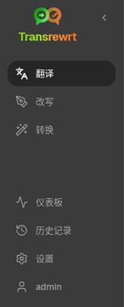
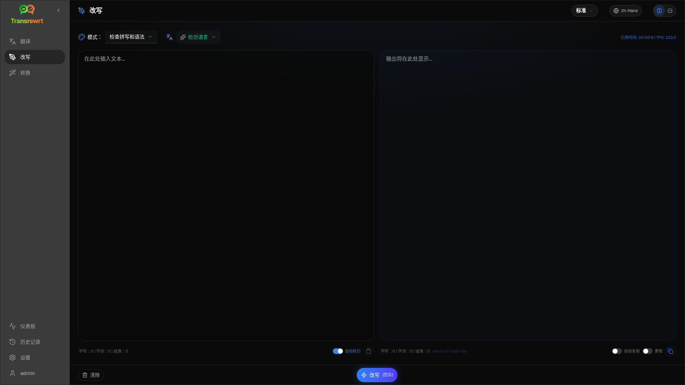
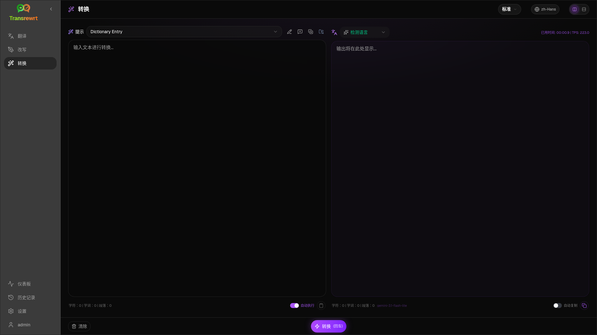
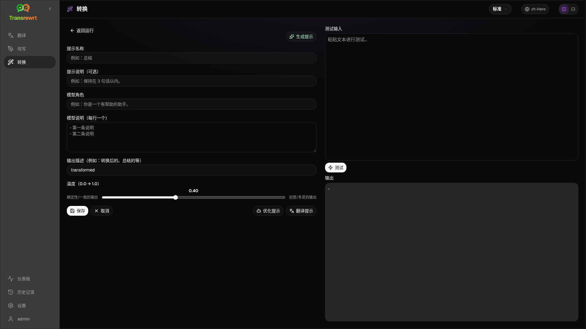
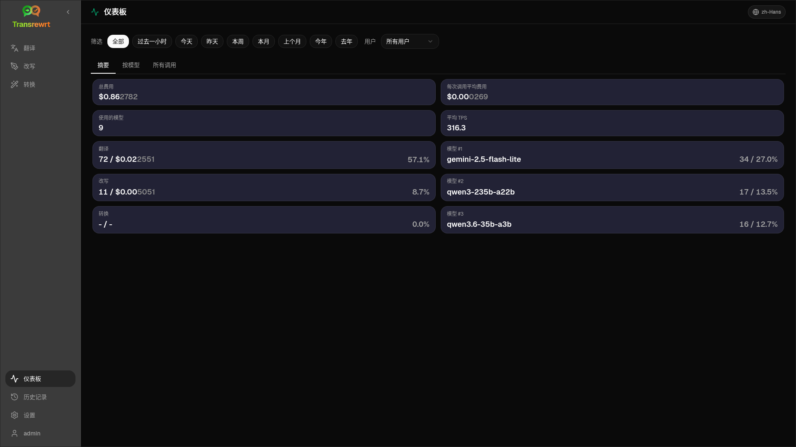
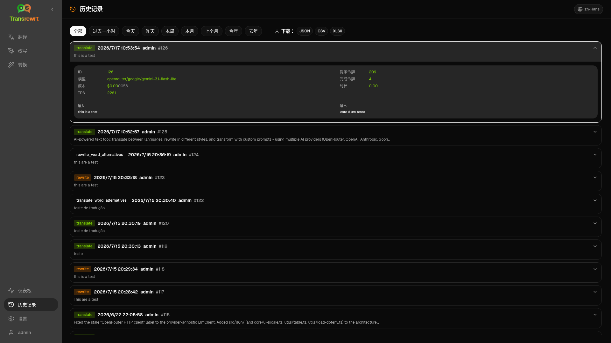
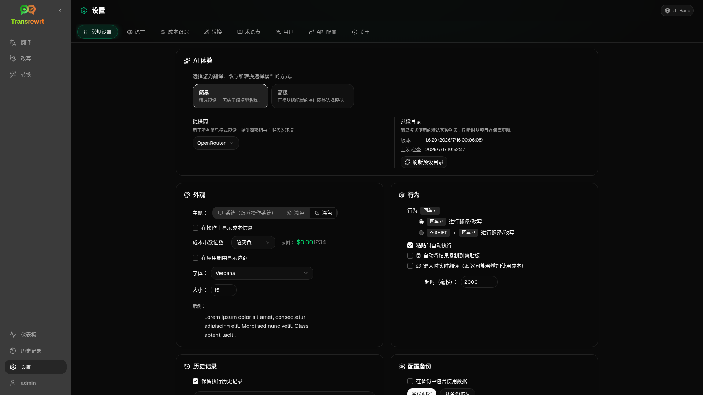

<a id="transrewrt-user-guide"></a>
# 用户指南

<br/>

<a id="introduction"></a>
## 简介

Transrewrt 帮助您通过三种主要方式处理文本：

- **翻译** - 将文本从一种语言转换为另一种语言。
- **改写** - 以不同的风格重述文本，例如更清晰、更简短或更正式。
- **转换** - 使用称为提示的自定义 AI 指令处理文本。

默认情况下，应用程序以 **简易** 模式运行：您在设置中选择一个 **预设**（例如 免费 (OpenRouter)、标准、高级或技术）和一个 **提供商**，而无需选择模型 ID。如果您想要来自 [**设置** > **模型**](#models) 的经典模型列表，请在 [**设置** > **常规设置**](#general-settings) 中切换到 **高级**。

<br/>

本指南解释了在应用程序安装并运行后如何使用它。有关安装步骤，请参阅主 [**README**](README.zh-Hans.md)。

<br/>

> ℹ️ **注意**<br/>
> Transrewrt 可作为 Windows 和 Linux 的桌面应用程序，以及自托管的 Web 应用程序使用。本指南侧重于应用程序的日常使用。如果某项仅适用于一个版本，则会清楚标明。

<small>**以其他语言阅读：** </small>
<small id="lang-list">[English (UK)](../USER-GUIDE.md) · [Português (Brasil)](./USER-GUIDE.pt-BR.md) · [العربية](./USER-GUIDE.ar.md) · [বাংলা](./USER-GUIDE.bn.md) · [Català](./USER-GUIDE.ca.md) · [简体中文](./USER-GUIDE.zh-Hans.md) · [繁體中文](./USER-GUIDE.zh-Hant.md) · [Hrvatski](./USER-GUIDE.hr.md) · [Čeština](./USER-GUIDE.cs.md) · [Nederlands](./USER-GUIDE.nl.md) · [English (US)](./USER-GUIDE.en-US.md) · [Tagalog](./USER-GUIDE.tl.md) · [Français](./USER-GUIDE.fr.md) · [Deutsch](./USER-GUIDE.de.md) · [Ελληνικά](./USER-GUIDE.el.md) · [Hindi (Roman)](./USER-GUIDE.hi-Latn.md) · [Magyar](./USER-GUIDE.hu.md) · [Italiano](./USER-GUIDE.it.md) · [日本語](./USER-GUIDE.ja.md) · [한국어](./USER-GUIDE.ko.md) · [Bahasa Melayu](./USER-GUIDE.ms.md) · [فارسی](./USER-GUIDE.fa.md) · [Polski](./USER-GUIDE.pl.md) · [Basa Jawa](./USER-GUIDE.jv.md) · [Português](./USER-GUIDE.pt.md) · [پنجابی](./USER-GUIDE.pa-PK.md) · [Română](./USER-GUIDE.ro.md) · [Русский](./USER-GUIDE.ru.md) · [Slovenčina](./USER-GUIDE.sk.md) · [Español](./USER-GUIDE.es.md) · [Kiswahili](./USER-GUIDE.sw.md) · [Svenska](./USER-GUIDE.sv.md) · [తెలుగు](./USER-GUIDE.te.md) · [ไทย](./USER-GUIDE.th.md) · [Türkçe](./USER-GUIDE.tr.md) · [Українська](./USER-GUIDE.uk.md) · [Tiếng Việt](./USER-GUIDE.vi.md)</small>

<small>

> **关于 UI 和文档翻译的说明：** 除原始英语（英国）外的所有界面语言
> 均使用 AI 模型翻译；措辞可能不精确或包含错误。

</small>

<br/>

<!-- START doctoc generated TOC please keep comment here to allow auto update -->
<!-- DON'T EDIT THIS SECTION, INSTEAD RE-RUN doctoc TO UPDATE -->
**目录**

- [开始之前](#before-you-start)
  - [如何获取免费的 OpenRouter API 密钥（桌面应用程序）](#how-to-get-a-free-openrouter-api-key-desktop-app)
- [入门](#getting-started)
- [窗口的主要部分](#main-parts-of-the-window)
  - [侧边栏](#sidebar)
  - [工具栏](#toolbar)
  - [输入和输出面板](#input-and-output-panels)
- [翻译](#translate)
  - [翻译文本](#translate-text)
  - [语言选择](#language-selection)
  - [有用的翻译设置](#helpful-translation-settings)
  - [优化您的翻译](#refining-your-translation)
  - [使用术语表](#using-the-glossary)
- [改写](#rewrite)
  - [改写文本](#rewrite-text)
  - [改进你的改写](#refining-your-rewrite)
- [转换](#transform)
  - [运行现有提示](#run-an-existing-prompt)
  - [如果你还没有提示](#if-you-have-no-prompts-yet)
  - [快速创建提示](#create-a-prompt-quickly)
  - [编辑提示](#edit-a-prompt)
  - [在使用前测试提示](#test-a-prompt-before-using-it)
- [仪表板](#dashboard)
  - [筛选数据](#filter-the-data)
  - [仪表板标签页](#dashboard-tabs)
  - [导出数据](#export-data)
  - [删除模型的已存储记录](#delete-stored-records-for-a-model)
- [历史记录](#history)
  - [筛选历史记录](#filter-the-history)
  - [导出历史数据](#export-history-data)
- [设置](#settings)
  - [常规设置](#general-settings)
  - [模型](#models)
  - [语言](#languages)
  - [成本跟踪](#cost-tracking)
  - [转换（设置标签页）](#transform-settings-tab)
  - [术语表（设置标签页）](#glossary-settings-tab)
  - [用户](#users)
  - [API 配置](#api-config)
  - [关于](#about)
- [常见问题](#common-issues)
  - [应用无法翻译、改写或转换文本](#the-app-will-not-translate-rewrite-or-transform-text)
  - [模型列表为空](#the-model-list-is-empty)
  - [结果太慢或太贵](#the-result-is-too-slow-or-too-expensive)
  - [界面语言不正确](#the-interface-is-in-the-wrong-language)
  - [文字太小或难以阅读](#the-text-is-too-small-or-hard-to-read)
  - [仪表板摘要看起来是空的](#dashboard-summary-looks-empty)
  - [成本显示为"不可用"或似乎不正确](#cost-shows-not-available-or-seems-wrong)
  - [总费用与提供商账单不一致](#total-cost-does-not-match-my-provider-bill)
  - [侧边栏中缺少历史记录页面](#the-history-page-is-missing-from-the-sidebar)
  - [Web 应用：意外被重定向到登录页面](#web-app-redirected-to-the-login-page-unexpectedly)
  - [Web 管理员：忘记或丢失密码](#web-admin-forgot-or-lost-a-password)
  - [仪表板不显示其他用户的数据（Web）](#dashboard-shows-no-data-for-other-users-web)
  - [我修改了提示但丢失了编辑内容](#i-changed-a-prompt-and-lost-the-edits)
- [快速提示](#quick-tips)
- [免责声明](#disclaimer)
- [许可证](#license)

<!-- END doctoc generated TOC please keep comment here to allow auto update -->

<br/><br/>

<a id="before-you-start"></a>
## 开始之前

要使用 Transrewrt，您需要至少有一个 AI 提供商的访问权限。支持的提供商包括：[OpenRouter](https://openrouter.ai)（聚合了许多模型）、OpenAI、Anthropic、Google Gemini、DeepSeek、Groq、Mistral、xAI、Cerebras、NVIDIA、阿里云、apikey.fun、任何 OpenAI 兼容提供商，以及用于本地模型的 [Ollama](https://ollama.com)。

您无需选择付费模型即可开始。一旦添加了 OpenRouter API 密钥，应用程序就会自动启用内置的 **免费** OpenRouter 选项。这使您可以立即开始翻译、改写和转换文本。或者，您也可以从 Cerebras、Google、Groq、Mistral AI 或 [NVIDIA](https://build.nvidia.com/)（OpenAI 兼容 API）获取免费 API 密钥。

通俗地说：

- 在 **简易** 模式下，一个 **预设**（免费 (OpenRouter)、标准、高级或技术）会映射到您所选 **提供商**（OpenRouter、OpenAI、Ollama 等）的模型。只有与当前提供商有映射的预设才会出现在工具栏中。您在翻译、改写和转换时选择预设。
- 在 **高级** 模式下，**模型**是您直接选择的 AI 引擎。模型 ID 使用 **提供商前缀**（例如 `openrouter/…`、`openai/…`、`ollama/…`）。
- **API 密钥**（或 Ollama 的 **基础 URL**）是应用程序访问该提供商的方式。

如果您使用的是 **桌面应用**，请在每个您使用的提供商的 [**设置** > **API 配置**](#api-config) 中添加密钥。仅用于 OpenRouter 的情况，请参阅下面的 [如何获取免费 OpenRouter API 密钥](#how-to-get-a-free-openrouter-api-key-desktop-app)。如果您不想使用 API 密钥，可以安装 Ollama（来自 [ollama.com](https://ollama.com)）并改用本地模型，例如 `translategemma:4b`。

如果您使用的是 **Web 版本**，服务器所有者会通过环境变量配置提供商，因此您无法直接在应用程序中输入 API 密钥。

<br/>

<a id="how-to-get-a-free-openrouter-api-key-desktop-app"></a>
### 如何获取免费 OpenRouter API 密钥（桌面应用）

如果您使用的是桌面应用，请按照以下步骤操作：

1. 在您的网页浏览器中访问 [OpenRouter](https://openrouter.ai)。
2. 创建账户或登录。
3. 打开 [密钥](https://openrouter.ai/keys) 页面。
4. 点击按钮创建新的 API 密钥。
5. 为密钥命名，以便以后识别。
6. 复制新的 API 密钥。
7. 返回 Transrewrt 并打开 **设置** > **API 配置**。
8. 将密钥粘贴到 **OpenRouter API 密钥**（位于 **设置** > **API 配置** 下）。
9. 点击 **测试 OpenRouter 密钥** 以确保其正常工作。

<br/><br/>

<a id="getting-started"></a>
## 入门

如果您是第一次使用 Transrewrt，请按以下顺序操作：

1. 打开应用程序。
2. 如果需要，请从地球图标中选择您的 **界面语言**。
3. 如果您使用的是 **桌面应用程序**，请打开 [**设置** > **API 配置**](#api-config)，为至少一个提供商（例如 OpenRouter）添加 API 密钥，然后点击 **测试** 以验证其是否正常工作。
4. 打开 [**设置** > **常规设置**](#general-settings)。在 **简易** 模式（默认）下，选择一个已配置密钥的 **提供商**。在 **高级** 模式下，打开 [**设置** > **模型**](#models) 并将一个或多个模型添加到 **已选模型**。
5. 在 **翻译** 页面，在工具栏中选择一个 **预设**（简易模式）或 **模型**（高级模式）。
6. 打开 [**设置** > **语言**](#languages) 并选择您的 **常用语言**，以便您最常使用的语言排在前面。
7. 运行一个简单的翻译以确认一切正常，然后尝试 **改写** 和 **转换**。

此顺序很重要。它可以防止最常见的首次使用问题：在应用程序具有有效的 API 连接或已选预设/模型之前尝试运行任务。

<br/><br/>

<a id="main-parts-of-the-window"></a>
## 窗口的主要部分

该应用程序分为三个主要区域：

- 左侧的 **侧边栏**。
- 顶部的 **工具栏**。
- 中间的 **工作区**。

<br/>

<a id="sidebar"></a>
### 侧边栏

使用侧边栏在应用程序中移动。您可以通过点击应用程序 logo 旁边的图标来折叠侧边栏以获得更多空间。

<br/>

<table>
  <tr>
    <td valign="top">
       
    </td>
    <td valign="top">
      <br/><br/>
      <ul>
        <li><strong>Translate</strong> 打开翻译工作区。</li><br/>
        <li><strong>Rewrite</strong> 打开改写工作区。</li><br/>
        <li><strong>Transform</strong> 打开自定义提示工作区。</li><br/>
        <li><strong>Dashboard</strong> 显示使用情况和成本信息。</li><br/>
        <li><strong>Settings</strong> 打开设置面板。</li><br/>
        <li><strong>History</strong> 显示使用历史记录，包含输入和输出文本</li><br/>
        <li><strong>User</strong> 显示已登录用户的用户名（仅限网页版）。</li>
      </ul>
    </td>
  </tr>
</table>

<br/>

<a id="toolbar"></a>
### 工具栏

工具栏根据您在应用程序中的位置会略有不同。

- 左侧显示当前页面名称。
- 右侧显示 **预设或模型选择器** 和 **界面语言**控件。

在 **简易** 模式下，工具栏显示一个 **预设选择器**，其中包含内置预设 **免费 (OpenRouter)**、**标准**、**高级** 和 **技术**。显示哪些预设取决于您在 [**设置** > **常规设置**](#general-settings) 中选择的 **提供商** — 例如，**免费 (OpenRouter)** 仅在提供商为 OpenRouter 时列出。如果 **提供商** 是 **Ollama**，则工具栏会列出您安装的本地模型而不是预设。

在 **高级** 模式下，**模型选择器**允许您选择要用于当前任务的 AI 引擎。


在高级模式下，某些免费模型可能不总是可用 — 它们可能已离线或已达到使用上限。应用程序可能会自动从您的列表中移除该模型。要控制显示哪些模型，请转到 [**设置** > **模型**](#models)。您可以从工具栏中模型名称左侧的提供商图标打开模型设置。

<br/>

**地球图标 + 语言代码** 用于更改应用程序界面语言，例如菜单和按钮。它 **不会** 更改 **翻译** 中使用的翻译语言。


<br/>

<a id="input-and-output-panels"></a>
### 输入和输出面板

大多数工作区使用左侧的 **输入** 面板和右侧的 **输出** 面板。

每个面板还显示：

| **输入**                                                          | **输出**                                                                                                                  |
|--------------------------------------------------------------------|-----------------------------------------------------------------------------------------------------------------------------|
| - 字符数 <br/>- 字数 <br/>- 段落数 <br/> | - 任务耗时 <br/>- **TPS**（每秒令牌数）<br/>- 字符、字数和段落数 <br/>- 使用的模型 |

如果您对技术术语感到好奇：

- **令牌** 指一小段文本。您可以将其视为单词的一部分或一个短单词。
- **TPS** 指模型每秒处理的文本块数量。

<br/>

您还可以监控每次操作的成本（如果可用）以及总成本，方法是在 [**设置** > **常规设置**](#general-settings) 中启用 `Show cost information on the actions` 选项。

<br/><br/>

[--------------------------------------------------------------------------------------------------------------------------]: #

<a id="translate"></a>
## 翻译

当您想将文本从一种语言转换为另一种语言时，请使用 **翻译**。


<br/>

<a id="translate-text"></a>
### 翻译文本

1. 打开 **翻译**。
2. 在 **从** 中选择一种语言。
3. 在 **到** 中选择一种语言。
4. 在工具栏中选择一个预设（简易）或模型（高级）。
5. 在 **输入** 中键入或粘贴文本。
6. 点击 **翻译**。
7. 在 **输出** 中阅读结果。
8. 如果要复制结果，请使用复制按钮。
9. 可选地使用 **改写…** 或单词选项来优化结果 — 请参阅 [优化您的翻译](#refining-translation)。

<br/>

<a id="language-selection"></a>
### 语言选择

- **从** 可以是特定语言或 **检测语言**。
- **到** 是您希望结果显示的语言。

您选择的 **常用语言** 出现在列表顶部。您可以在 [**设置** > **语言**](#languages) 中进行设置。

<br/>

<a id="helpful-translation-settings"></a>
### 有用的翻译设置

在 [**设置** > **常规设置**](#general-settings) 中，您可以更改翻译行为：

- **粘贴时自动执行** 会在您粘贴文本后立即运行翻译。
- **自动将结果复制到剪贴板** 会在成功运行后自动复制结果。
- **键入时实时翻译** (⚠️ 这可能会增加使用成本) 会在您键入时运行翻译。
- **超时（毫秒）** 控制应用程序在运行实时翻译之前等待多长时间。
- **Enter** 键的行为决定了是`Enter`运行任务还是插入新行：
  - **Enter** 运行翻译或改写（默认）。
  - **Shift + Enter** 运行翻译或改写；普通 **Enter** 插入新行。

<br/>

<a id="refining-translation"></a>
### 优化您的翻译

成功翻译后，**Rephrase…** 和版本下拉菜单会出现在输出标题中，位于 **To:** 语言选择器的旁边。您可以在那里优化结果：

1. **改写措辞…** — 在输出中未选中文本时，获取同一输入的另一个完整翻译，措辞不同。模型会接收你已有的每个版本，以便新措辞与所有版本都不同。你最多可以存储 **五个** 版本，并在版本下拉菜单中切换。选中文本时，**改写措辞…** 会在选中内容附近打开词语替换（与右键相同）。未选中时，达到五个版本后 **改写措辞…** 将被禁用；选中时，即使达到五个版本仍可使用（仅词语替换，更新版本 5）。在完整改写措辞运行期间，点击 **停止翻译** 取消；输出会返回到改写开始时处于活动状态的版本。
2. **词语替换** — 在输出中选择一个或多个词或一个短短语（如果你只选中了某个词的一部分，应用会将选中范围扩展到完整词），然后右键点击或点击 **改写措辞…**。选中内容附近会出现一个简短的替换列表；点击其中一个即可替换。每个选项可能会替换比你的选中范围稍大的跨度（例如相邻的介词或冠词），以保持句子语法正确。如果你的版本少于五个，编辑后的输出会保存为新版本；达到五个版本时，仅更新 **版本 5**。未选中时右键点击会选中光标下的词（如果该处没有词则不做任何操作）。按 **Esc** 或点击列表外部可取消而不更改输出。
3. **成本** — 每次完整 **改写措辞…**（未选中）和每次词语替换请求都会再次使用模型，并可能增加使用成本（与正常翻译运行相同）。

<br/>

<a id="using-the-glossary"></a>
### 使用术语表

**Glossary**（术语表）是特定语言对的源/目标术语对列表。启用术语表后，Transrewrt 会将匹配的术语发送给模型，从而确保您偏好的措辞在翻译中保持一致（例如，产品名称、品牌术语或应始终以相同方式翻译的职位名称）。

要在 **Translate** 页面上使用它：

1. 在输入面板中打开 **Glossary** 开关（位于自动执行和自动复制开关旁边）。
2. 选择您的 **From** 和 **To** 语言，然后像往常一样进行翻译。为该语言对保存的术语将自动应用。
3. 要即时捕获新术语对，请单击 **Add to Glossary**（位于 **From:** 语言选择器旁边）。对话框将预先填充您当前的语言，因此您只需填写 **source term**（源术语）和 **target term**（目标术语）。
4. 使用输出页脚中的 **Glossary** 链接（或对话框内的 **Manage glossary** 链接）跳转到 [**Settings** > **Glossary**](#glossary-settings)。

您可以在 [**Settings** > **Glossary**](#glossary-settings) 选项卡中添加、编辑、导入和导出术语 — 见下文。

<br/>

> ℹ️ **NOTE**<br/>
> 术语表中的术语按 **语言对** 进行匹配，因此为英语 → 法语保存的术语在翻译英语 → 德语时不会应用。术语表不能与 **Detect Language**（检测语言）作为源语言一起使用，因为需要特定的源语言来匹配术语。

[--------------------------------------------------------------------------------------------------------------------------]: #

<a id="rewrite"></a>
## Rewrite

当你想在不改变主要含义的情况下改进措辞时，请使用 **改写**。文本保持同一语言（不会被翻译）。



这对于以下情况很有用：

- 修复拼写和语法（**检查拼写和语法**）
- 使文本更清晰（**提高清晰度**）
- 一次运行多个不同的改写（**其他版本**）
- 使文本更正式或更非正式（**设为正式** / **设为非正式**）
- 缩短或扩展文本（**缩短** / **展开**）
- 使文本听起来更技术化（**设为技术**）

<br/>

<a id="rewrite-text"></a>
### 改写文本

1. 打开 **改写**。
2. 选择一个 **模式**（例如 **提高清晰度** 或 **设为正式**）。
3. 可选：将 **从** 设置为你的文本语言（或保留 **检测语言**）。
4. 在 **输入** 中输入或粘贴文本。
5. 点击 **改写**。
6. 在 **输出** 中查看结果。
7. 可选：使用 **重新措辞…** 或词语替换来优化结果 — 参见[优化你的改写](#refining-rewrite)。

<br/>

> 💡 **提示**<br/>
> 当您使用“**检查拼写和语法**”模式时，输出面板中会出现一个“**显示更改**”开关（位于**复制**旁边）。
> 打开或关闭它，以显示或隐藏应用于您文本的具体更正。

<br/>

> ℹ️ **注意**<br/>
> 改写模式 **其他版本** 会在 **单次** 运行中返回多个改写版本，在输出中以 `----` 分隔。这与 **重新措辞…** 不同，后者会随时间积累版本历史（每次点击生成一个新变体）。参见[优化你的改写](#refining-rewrite)。

<br/>

<a id="refining-rewrite"></a>
### 优化你的改写

改写成功后，**重新措辞…** 和版本下拉菜单会出现在工作区的输出侧（在分栏布局中，位于输出列上方的顶部工具栏中，运行指标旁边；在堆叠布局中，位于输出面板上方 **从：** 旁边）。你可以在那里优化结果 — 与[优化你的翻译](#refining-translation) 的思路相同，但文本保持同一语言，并保留当前的改写 **模式**：

1. **重新措辞…** — 在输出中未选择文本时，对相同输入获取另一个完整的改写，使用不同的措辞，仍应用所选模式（例如更清晰、更简短或更正式）。模型会接收你已有的每个版本，因此新措辞可以与所有版本都不同。你最多可以存储 **五个** 版本，并在版本下拉菜单中切换。选择文本后，**重新措辞…** 会在选区附近打开词语替换（与右键相同）。未选择时，达到五个版本后 **重新措辞…** 会禁用；选择文本后，在五个版本时仍然可用（仅词语替换，更新版本 5）。在完整重新措辞运行期间，点击 **停止改写** 取消；输出会返回到重新措辞开始时活动的版本。
2. **词语替换** — 在输出中选择一个或多个词或一个短词组（如果你只选择了词的一部分，应用会将选区扩展到完整词），然后右键点击或点击 **重新措辞…**。选区附近会出现一个简短的替换列表；点击其中一个进行替换。每个选项可能会替换比你的选区稍大的范围，以保持句子语法正确。如果你少于五个版本，编辑后的输出会保存为新版本；在五个版本时，仅更新 **版本 5**。未选择时右键点击会选择光标下的词（如果光标下没有词则不做任何操作）。按 **Esc** 或点击列表外部可取消而不更改输出。
3. **成本** — 每次完整的 **重新措辞…**（未选择）和每次词语替换请求都会再次使用模型，并可能增加使用成本（与正常改写运行相同）。

<br/><br/>

[--------------------------------------------------------------------------------------------------------------------------]: #

<a id="transform"></a>
## 转换

当您希望 AI 遵循自定义指令集时，请使用 **转换**。



这是应用程序中最灵活的区域。您可以将其用于以下任务：

- 总结笔记
- 将粗略文本转化为润色的电子邮件
- 提取要点
- 将文本转换为特定格式
- 输入文本的任何其他自定义活动

<br/>

<a id="run-an-existing-prompt"></a>
### 运行现有提示

1. 打开 **转换**。
2. 从提示列表中选择一个提示。
3. 如果出现“**从**”语言框，请选择一种语言（如果您需要）。
4. 在 **输入** 中键入或粘贴文本。
5. 点击 **转换**。
6. 在 **输出** 中阅读结果。

<br/>

<a id="if-you-have-no-prompts-yet"></a>
### 如果您还没有提示

如果您的提示列表为空，请在“转换”工作区中点击 **加载示例提示**。此控件始终可在 [**设置** > **转换**](#transform-settings) 的导出/导入行中找到。两者都会添加内置示例，以便您可以快速开始。

<br/>

> ℹ️ **注意**<br/>
> 示例提示以英语提供。加载它们后，您可以编辑提示并使用 **翻译提示** 将其翻译成您的语言。

<br/>

<a id="create-a-prompt-quickly"></a>
### 快速创建提示

创建提示的最快方法是：

1. 点击 **新建提示**。
2. 点击 **生成提示**。
3. 描述您希望提示执行的操作。
4. 选择一个预设（简易）或模型（高级）。
5. 让应用程序为您创建草稿。
6. 查看草稿并点击 **保存**。


<br/>

<a id="edit-a-prompt"></a>
### 编辑提示

创建或编辑提示时，编辑器显示在左侧，测试区域显示在右侧。



主要字段包括：

- **提示名称**：显示在提示列表中的名称。
- **提示说明（可选）**：运行提示时向用户显示的简短提示。
- **模型角色**：分配给 AI 的总体角色，例如“你是一个有帮助的助手”。
- **模型说明（每行一个）**：您希望 AI 遵循的具体规则。
- **输出描述（例如：转换后的、总结的等）**：描述结果的简短词语。
- **温度（0.0 → 1.0）**：模型将如何表现；见下文。
- **请求目标语言**：运行时添加语言选择器。
如果您不熟悉 **温度** 这个技术术语，可以这样理解：

- **较低**的温度会产生更稳定、更可预测的结果。
- **较高**的温度会产生更多样化和更具创造性的结果。

您还可以使用：

- `Generate prompt` 根据简单描述创建新草稿
- `Improve prompt` 优化现有提示
- `Translate prompt` 翻译提示字段

<br/>

> ⚠️ **警告**<br/>
> 点击 `Save` 再点击 `Back to Run`。如果不保存就返回，您的更改将丢失。

<br/>

<a id="test-a-prompt-before-using-it"></a>
### 测试提示后再使用

右侧的测试面板允许您在日常工作中使用提示之前，先用示例文本进行尝试。

这在以下情况下很有用：

- 您正在构建一个新提示
- 您正在比较提示的两个版本
- 您想检查语气、长度或输出格式

<br/>

> ℹ️ **注意**<br/>
> 您可以在 [**设置** > **转换**](#transform-settings) 中导出和导入已保存的提示。

在提示编辑器中使用 **生成提示**、**优化提示** 或 **翻译提示** 时，**简易**模式提供与翻译和改写相同的预设选择器；**高级**模式使用模型列表。

<br/><br/>

[--------------------------------------------------------------------------------------------------------------------------]: #

<a id="dashboard"></a>
## 仪表板

使用 **仪表板** 查看您使用了多少应用程序以及需要支付多少费用（针对付费模型）。



<br/>

> ℹ️ **注意**<br/>
> 如果您只使用 **免费** 模型，**成本**金额可能为零，并且以成本为中心的 KPI 可能看起来为空。在选定的时间段内有活动时，**摘要**选项卡仍然显示翻译、改写和转换的调用次数。

<br/>

<a id="filter-the-data"></a>
### 筛选数据

使用顶部的筛选按钮更改时间范围。


<br/>

> ℹ️ **注意**<br/>
> **用户**筛选器仅在 Web 版本中对管理员可见。普通用户将看不到此筛选器，并且桌面应用程序中也不提供此筛选器。

<br/>

<a id="dashboard-tabs"></a>
### 仪表板选项卡

- **摘要**显示 KPI 卡片：总成本、使用的模型、按模式的调用次数和成本（占总调用次数的比例）、每次调用的平均成本、平均 TPS 以及按调用次数排名前三的模型。
- **按模型**列出了每个模型及其总调用次数、总成本和平均 TPS；展开一行可按翻译、改写和转换进行细分。
- **所有调用**显示完整的调用日志（宽布局下分页，窄屏幕下显示卡片）并允许您导出。

<br/>

<a id="export-data"></a>
### 导出数据

仪表板表格可以导出数据为：

- **JSON**
- **CSV**
- **XLSX**

如果想查看应用外的活动或分享报告，此功能会很有用。

<br/>

<a id="delete-stored-records-for-a-model"></a>
### 删除模型的已存储记录

在 **按模型** 或 **所有调用** 中，您可以通过点击“垃圾桶”图标来删除模型的已存储记录。

> ⚠️ **警告**<br/>
> 删除已存储的记录无法撤销。仅在确定不再需要该历史记录时才使用此功能。

要删除所有数据或根据年龄删除记录，请转到 [**设置** > **成本跟踪**](#cost-tracking)。在那里您将找到删除所有已存储数据或仅删除超过特定日期的数据的选项。

<br/><br/>

[--------------------------------------------------------------------------------------------------------------------------]: #

<a id="history"></a>
## 历史记录

点击 **历史记录** 可查看您在 **Transrewrt** 内操作的历史记录，包括每次操作的输入和输出。



<br/>

<a id="filter-the-history"></a>
### 筛选历史记录

**历史记录** 使用与 **仪表板** 页面相同的日期范围筛选器。


<br/>

> ℹ️ **注意**<br/>
> 在 **Web 应用** 中，所有用户（包括管理员）只能看到自己的执行历史记录。**仪表板** 上的 **用户** 筛选器供管理员查看跨账户的使用情况和成本；它不适用于 **历史记录**。

<br/>

<a id="export-history-data"></a>
### 导出历史记录数据

历史记录页面可以导出筛选后的数据为：

- **JSON**
- **CSV**
- **XLSX**

如果想查看应用外的活动或分享报告，此功能会很有用。

<br/><br/>

[--------------------------------------------------------------------------------------------------------------------------]: #

<a id="settings"></a>
## 设置

从侧边栏打开 **设置** 以自定义应用的行为。

可用的选项卡取决于平台和您的角色：

| 选项卡              | 桌面版 | Web 版（管理员） | Web 版（普通用户） | 备注                                        |
  |------------------|:-------:|:-----------:|:------------------:|----------------------------------------------|
  | 常规设置 |   是   |     是     |        是         | 包括 **AI 体验**（简易 / 高级） |
  | 模型           |   是   |     是     |        是         | 仅当 **AI 体验**为 **高级** 时 |
  | 语言        |   是   |     是     |        是         |                                              |
  | 成本跟踪    |   是   |     是     |         -          |                                              |
  | 转换        |   是   |     是     |        是         | 批量导入/导出转换提示      |
  | 术语表         |   是   |     是     |        是         | 翻译过程中应用的术语对        |
  | 用户            |    -    |     是     |         -          |                                              |
  | API 配置       |   是   |     是     |         -          |                                              |
  | 关于            |   是   |     是     |        是         |                                              |

在 **简易** 模式下，模型选择通过工具栏中的预设和常规设置中的 **提供商** 进行；**模型** 选项卡将隐藏。

<br/>

> ℹ️ **注意**<br/>
> 在 Web 版本中，每个用户都有自己的配置。AI 体验、提供商、选定的模型或预设、语言、常规选项和转换提示等设置是按用户存储的。您所做的更改不会影响其他用户。

<br/>

[--------------------------------------------------------------------------------------------------------------------------]: #

<a id="general-settings"></a>
### 常规设置

使用 **常规设置** 来控制输入行为、是否为 **历史记录** 存储执行详细信息、外观以及如何选择用于翻译、改写和转换的 AI。

**AI 体验**

- **简易**（默认）：选择一个 **提供商**（OpenRouter、OpenAI、Anthropic、Google Gemini、DeepSeek、Groq、Mistral、xAI、Cerebras 或 Ollama）。云提供商使用工具栏中的内置预设。**Ollama** 列出您计算机上安装的模型，而不是预设。在简易模式下，**预设目录** 显示目录版本和上次更新时间；单击 **刷新预设目录** 以从项目代码库获取最新的预设列表（应用也会在后台定期检查）。
- **高级**：在工具栏中选择单个模型；在 [**设置** > **模型**](#models) 下管理列表。

**外观**

- **主题** 在浅色、深色和系统外观之间切换。
- **在操作上显示成本信息** 控制每个操作的成本（如果可用）以及“翻译”、“改写”和“转换”输出面板上的总成本的显示。
- **成本小数位数** 更改成本小数的显示方式。
- **仅限 Web：** **在应用周围显示边距** 在界面周围添加额外的空间。
- **字体系列** 更改文本面板中的书写字体。
- **大小** 更改字体大小。

**行为**

- **ENTER 键行为** 选择是 `Enter` 运行任务还是插入新行。
- **粘贴时自动执行** 粘贴文本后立即开始翻译。
- **自动将结果复制到剪贴板** 自动复制成功的结果。
- **键入时实时翻译** (⚠️ 这可能会增加使用成本) 在键入时进行翻译。
- **超时（毫秒）** 设置实时翻译的等待时间。

**历史记录**

- **保留执行历史记录**控制每次翻译、改写和转换是否会存储侧边栏 [**历史记录**](#history) 视图的**输入和输出文本**。关闭此选项会请求确认；如果您确认，则会从数据库中移除已存储的历史记录文本。如果标签显示 *已被管理员禁用*，则表示您的安装在环境中设置了 `HISTORY_DISABLED`（请参阅 [README](README.zh-Hans.md#configuration-and-environment)）；您无法从用户界面重新启用历史记录。
- **删除历史记录数据**允许您使用 **删除数据** 按年龄（例如，超过几个月，或**所有数据（清除）**）移除已存储的文本。这只会影响“**历史记录**”视图已保存的执行文本；它**不会**删除成本或使用总量。要移除或修剪**成本**数据，请使用 [**设置** > **成本跟踪**](#cost-tracking)。

**配置备份**（仅限桌面应用和 Web 管理员）
- **在备份中包含使用数据** - 启用后，ZIP 文件还将包含执行历史记录和 API 调用数据。
- **备份配置** - 创建一个 ZIP 文件（`transrewrt-config-backup-YYYY-MM-DD_HHMMSS.zip` 按本地时间），其中包含 `config.json`、`state.json`、可选的加密密钥、用户、首选项、自定义提示和使用数据（如果您选择加入）。成功备份后，确认消息将显示保存的文件名。
- **从备份恢复** - 首先打开一个**确认对话框**。在对话框中选择备份 ZIP 文件（**浏览** / 文件选择器或支持的拖放区域），然后查看选项：
  - **恢复使用数据** - 在备份包含使用数据时导入 ZIP 中的使用/历史记录；如果您只想恢复设置和提示，请将其关闭。
  - **恢复前清除旧的使用数据** - 在应用备份之前删除此安装上的现有使用/历史记录（可选；当您想要干净替换时使用）。
在 Web 版本或桌面版本中创建的备份可以在另一个版本中恢复。在 Web 版本中恢复桌面备份时，数据将被恢复到管理员用户。

<br/>

<a id="models"></a>
### 模型

此选项卡仅在 [**常规设置**](#general-settings) 中将 **AI 体验** 设置为 **高级** 时可用。使用 **设置** > **模型** 选择要在工具栏中显示的模型的。 



该页面包含两个列表：

- 左侧的 **可用模型**
- 右侧的 **已选模型**

有用的控件包括：

- **搜索模型...** 按名称查找模型
- **提供商** 芯片可将列表缩小到单个引擎（OpenRouter、OpenAI、Ollama 等）
- **仅免费** 显示免费模型
- **刷新** 重新加载列表
- **全部展开** 和 **全部折叠** 当您按提供商排序时

模型 ID 包含提供商前缀（例如 `openrouter/…` 而不是 `openai/…`）。徽章，如 **OpenAI (OpenRouter)** 与 **OpenAI (直接)** 显示流量的路由方式。

> ℹ️ **注意**<br/>
> **OpenRouter Body Builder** (`openrouter/bodybuilder`) 是一个路由模型，而不是通用聊天模型：它的回复是描述 OpenRouter API 请求体的 JSON（例如，一个包含 `requests` 和 `model` 的 `messages` 数组）。如果您将其用于 **翻译**、**改写** 或 **转换**，输出面板将显示该 JSON 而不是完成的文本。请为这些任务选择一个普通文本模型。请参阅 OpenRouter 上的[Body Builder 模型页面](https://openrouter.ai/openrouter/bodybuilder)。

操作：

- 要添加模型，请点击 **添加** 或条目中的任意位置。

- 要移除模型，请点击 **已选模型** 中的模型旁边的 **X**，或在可用模型中的条目上点击 **已选择**。

- 要清除列表，请点击 **取消全选**。必需的免费模型将保留在列表中。

<br/>

> ℹ️ **注意**<br/>
> 如果您不想立即向 OpenRouter 添加积分，请先启用 **仅免费** 并选择免费模型（无需信用卡）。您还可以使用 Ollama 在本地运行模型，无需任何 API 密钥。

<br/>

<a id="languages"></a>
### 语言

使用 **设置** > **语言** 来组织应用程序中使用的语言列表。

- **顶部语言** 会固定在 **翻译** 和 **转换** 的语言列表顶部附近。
- **自定义语言** 允许您添加不在内置列表中的语言。

如果您添加自定义语言，它将与内置选项一起出现在语言选择器中。

<br/>

<a id="cost-tracking"></a>
### 成本跟踪

使用 **设置** > **成本跟踪** 来管理成本信息。

- **总费用** 显示运行总计。
- **复制值** 将总计复制到剪贴板。
- **重置成本** 将存储的总计重置为零。
- **与 API 密钥使用情况同步** 将总计设置为与您的 OpenRouter 账户报告的使用情况匹配（仅限 OpenRouter）。
- **API 密钥使用情况** 显示 OpenRouter 的使用情况详细信息（如果可用）。
- **删除成本数据** 删除所有数据，或仅删除选择日期之前的所有条目。

**成本跟踪：** 当您使用 OpenRouter 模型时，应用程序会根据 OpenRouter 提供的成本信息显示您的实际使用情况和支出。对于所有其他提供商，应用程序会使用 OpenRouter 公布的价格估算成本；如果价格不可用，估算值可能为零。

<br/>

> ℹ️ **注意**<br/>
> **所有费用数字仅供参考估算，并非官方账单。**

<br/>

> ⚠️ **警告**<br/>
> 数据删除无法撤销。在删除之前，请确保备份您的数据或通过 [**历史记录**](#history) 或 [**仪表板** > **所有调用**](#dashboard-tabs) 导出数据，否则数据将永久丢失。
> 与每个 API 调用条目相关的输入/输出历史记录也将被删除。

<br/>

<a id="transform-settings"></a>
### 转换（设置选项卡）

使用 **设置** > **转换** 来批量管理提示。

您可以：

- 查看已保存的提示
- 删除提示
- 从文件导入提示
- 导出提示以进行备份或共享
- 加载示例提示到提示列表

<br/>

<a id="glossary-settings"></a>
### 术语表（设置选项卡）

使用 **设置** > **术语表** 来管理翻译过程中应用的术语对（请参阅 [使用术语表](#using-the-glossary))。每个术语都有一个 **源语言**、**目标语言**、**源术语** 和 **目标术语**。

您可以：

- **添加术语** — 填写表格底部的行（选择语言，输入源术语和目标术语），然后点击 **+** 按钮。
- **查找术语** — 按 **源语言**、**目标语言** 或自由 **文本** 筛选列表；点击 **清除筛选条件** 进行重置。
- **删除术语** — 点击其所在行的垃圾桶图标。
- **导入** — 从 `.csv`、`.xlsx` 或 `.xls` 文件加载术语。文件应包含 `source_language`、`target_language`、`source_text` 和 `target_text` 列。
- **导出 CSV** / **导出 XLSX** — 下载所有术语以进行备份或共享。
- **模板 CSV** / **模板 XLSX** — 下载带有正确列标题的空文件，以便填写和导入。

<br/>

> ℹ️ **注意**<br/>
> 在 **桌面应用** 中，术语表是本地存储的。在 **Web 版本** 中，每个用户都有自己的术语表，因此您的术语不会影响其他用户。

<br/>

<a id="users"></a>
### 用户

使用 **用户** 来管理 Web 版本中的用户帐户。您可以添加用户、更新其详细信息、重置密码以及删除帐户。

<br/>

<a id="api-config"></a>
### API 配置

支持的提供商包括：OpenRouter、OpenAI、Anthropic、Google Gemini、DeepSeek、Groq、Mistral、xAI、Cerebras、NVIDIA、阿里云、apikey.fun、**Ollama**（通过基础 URL 的本地模型），以及一个可选的 **自定义 OpenAI 兼容提供商**（名称、URL 和 API 密钥 — 仅限高级模式）。您只需要配置您使用的提供商。

**Web 应用程序：仅限管理员**

API 密钥通过系统或 Docker 环境变量进行配置 - 不在 Web UI 中输入。对于自定义提供商，请设置 `CUSTOM_PROVIDER_NAME`、`CUSTOM_PROVIDER_URL` 和 `CUSTOM_PROVIDER_API_KEY`（三者都必需）。此页面显示了已配置密钥的提供商，并允许您通过点击 `Test` 按钮来测试每个提供商。

<br/>

> ℹ️ **注意**<br/>
> 要更改 API 密钥，请更新系统或 Docker 配置中的环境变量并重新启动服务器或容器。

<br/>

> ℹ️ **注意**<br/>
> **配置备份**（请参阅 [**常规设置** → 配置备份](#general-settings)）可以将**已解析的**提供商密钥嵌入到 ZIP 的 `config.json` 中。恢复该 ZIP **不会**将这些密钥复制回服务器的持久化配置文件中 — 实时密钥仍然来自环境和现有文件状态，如其中所述。

<br/>

**桌面应用程序**

使用 **API 配置** 来存储您使用的每个提供商的 API 密钥。对于 Ollama，请输入 **基础 URL** 而不是 API 密钥。对于自定义 OpenAI 兼容提供商（不在内置列表中的任何端点，例如自托管服务器或网关），请输入 **提供商名称**、**基础 URL**（例如 `https://my-llm.example.com/v1`）和 **API 密钥**；这三者都是必需的。URL 和名称是内联编辑的；使用 **编辑** 来替换 API 密钥。自定义提供商的模型仅在 **高级** 模式下显示（设置 → 模型）。

<br/>

> 💡 **提示** <br/>
> 如果您不想使用 API 密钥或付费使用，可以 [下载 Ollama](https://ollama.com) 并在本地机器上免费运行模型（例如 `translategemma:4b`）。或者，您可以创建一个免费的 OpenRouter 帐户（无需信用卡）来使用其免费模型，或从 Cerebras、Google、Groq、Mistral AI 或 [NVIDIA](https://build.nvidia.com/) 获取免费 API 密钥。

<br/>

- 只添加您需要的提供商。在 **设置** > **模型** 中，每个模型 ID 都以提供商开头（例如，对于名为 `MyProvider` 的自定义端点，模型 ID 为 `openrouter/openrouter/free`、`openai/gpt-4o`、`nvidia/nvidia/nemotron-nano-3-30b-a3b`、`ollama/llama3`、`MyProvider/…`）。

输入 API 密钥值，然后点击 `Save` 进行添加。点击 `Edit` 可替换现有密钥。点击 `Test` 可验证密钥是否有效。对于 Ollama 基本 URL，请务必点击 `Test` 来检查连接。

<br/>

> ℹ️ **注意**<br/>
> 您无法查看 API 密钥的当前值。您只能使用 `Edit` 按钮进行替换。
> API 密钥以加密形式存储在配置文件中。

<br/>

<a id="about"></a>
### 关于

**关于** 选项卡显示：

- 应用名称和标语
- 版本号和构建日期
- 许可证和版权信息，以及一个用于打开“**第三方声明**”的链接
- 指向项目代码库的链接

<br/><br/>

<a id="common-issues"></a>
## 常见问题

如果某些功能未按预期工作，请首先检查以下几点。

<br/>

<a id="the-app-will-not-translate-rewrite-or-transform-text"></a>
### 应用无法翻译、改写或转换文本

检查是否：

- 您已在工具栏中选择了 **预设**（简易）或 **模型**（高级）
- 在 **简易**模式下，[**设置** > **常规设置**](#general-settings) 中有一个 **提供商**，并附带一个有效的密钥（或 Ollama URL）以及该提供商的至少一个预设
- 在 **高级**模式下，[**设置** > **模型**](#models) 中至少列出了一个模型
- 您的 API 设置正常工作

如果您使用的是桌面应用：

1. 打开 [**设置** > **API 配置**](#api-config)。
2. 检查是否至少保存了一个 API 密钥。
3. 点击提供商旁边的 **测试** 以确认密钥有效。

<br/>

<a id="the-model-list-is-empty"></a>
### 模型列表为空

在 **简易**模式下，打开 [**设置** > **常规设置**](#general-settings)，确认 **提供商** 已设置，并在 [**API 配置**](#api-config) 中添加或测试密钥（桌面版）或咨询您的管理员（网页版）。对于 **Ollama**，请运行 **测试** 来检查基本 URL 并确保模型已在本地安装。

在 **高级**模式下，打开 [**设置** > **模型**](#models) 并点击 **刷新**。如有需要，搜索模型，开启 **仅免费**，并将模型添加到 **已选模型**。

<br/>

<a id="the-result-is-too-slow-or-too-expensive"></a>
### 结果响应太慢或太昂贵

尝试以下一项或多项操作：

- 选择不同的预设（简易）或模型（高级）
- 使用更短的输入
- 在 [**设置** > **常规设置**](#general-settings) 中关闭 **键入时实时翻译**
- 对简单任务使用免费模型（参见 [模型](#models)）
<br/>

<a id="the-interface-is-in-the-wrong-language"></a>
### 界面语言错误

单击 [工具栏](#toolbar) 中的地球图标，然后选择您偏好的 **界面语言**。

<br/>

<a id="the-text-is-too-small-or-hard-to-read"></a>
### 文本太小或难以阅读

打开 [**设置** > **常规设置**](#general-settings) 并更改：

- **字体**
- **大小**

<br/>

<a id="dashboard-summary-looks-empty"></a>
### 仪表板摘要看起来是空的

如果出现以下情况，这是正常的：

- 您只使用了 **免费模型** 并且正在查看 **成本** 数据（它们可能为零）；**摘要** 中的调用次数 KPI 仍需要选定期间的数据
- 选定的 **时间筛选** 未涵盖调用发生的期间 — 尝试选择 **全部** 进行检查

如果在选择 **全部** 后 KPI 仍为零，请确认调用出现在 [**历史记录**](#history) 或 **所有调用** 选项卡中。

<br/>

<a id="cost-shows-not-available-or-seems-wrong"></a>
### 成本显示“不可用”或似乎不正确

当您通过 **OpenRouter** 使用模型时，应用程序会显示 OpenRouter 报告的实际花费。

对于 **其他提供商**（OpenAI 直接、Anthropic 直接等），成本是根据 OpenRouter 公布的定价数据估算的。如果找不到匹配模型价格，成本将显示为 **不可用** 且不会计入您的累计总额。

<br/>

<a id="total-cost-does-not-match-my-provider-bill"></a>
### 总成本与我的提供商账单不符

应用程序中的所有成本数据 **仅供参考估算**，并非官方账单。

为了使总成本更接近您的实际 OpenRouter 支出，请打开 [**设置** > **成本跟踪**](#cost-tracking) 并点击 **与 API 密钥使用情况同步**。

<br/>

<a id="the-history-page-is-missing-from-the-sidebar"></a>
### 侧边栏缺少“历史记录”页面

**保留执行历史记录** 可能已关闭。打开 [**设置** > **常规设置**](#general-settings) 并启用它，除非历史记录 *已被管理员禁用*（在 `HISTORY_DISABLED` 环境中 — 请参阅 [README](README.zh-Hans.md#configuration-and-environment))。启用历史记录不会恢复先前删除的文本。

<br/>

<a id="web-app-session-expired"></a>
### Web 应用：意外重定向到登录页面

您的会话可能已超时。请重新登录。如果频繁发生，请检查服务器配置中的会话生命周期设置。

<br/>

<a id="web-admin-forgot-or-lost-a-password"></a>
### Web 管理员：忘记或丢失了密码

这适用于 **自托管的 Web 应用**（Docker），不适用于桌面（Electron）应用。

- 如果另一位管理员仍可登录，他们可以打开 [**设置** > **用户**](#users)，选择账户，并在那里设置 **新密码**。
- 如果您被 **锁定** 但拥有机器或容器的 **shell 访问权限**，请使用随镜像提供的辅助工具重置密码（如果您更改了默认名称，请替换 `transrewrt`，如果密码包含空格或特殊字符，请将其加引号）：

```bash
docker exec transrewrt reset-web-password '<username>' '<new-password>'
```

如果您从未创建其他账户，默认的管理员用户名是 `admin`。当您只传递一个参数时，它被视为 `admin` 的新密码。

如果您从 **源代码检出** 运行而不是从 Docker 运行，请使用：

```bash
pnpm run reset-web-password -- <username> <new-password>
```

该脚本会更新 SQLite 数据库中的用户记录（如果 `admin` 用户缺失，也可以创建它）。重置后，使用新密码登录。

<br/>

<a id="dashboard-shows-no-data-for-other-users"></a>
### 仪表板未显示其他用户的数据（Web）

只有 **管理员** 可以通过 **用户** 筛选器查看所有用户的数据。普通用户按设计只能看到自己的活动。

<br/>

<a id="i-changed-a-prompt-and-lost-the-edits"></a>
### 我更改了提示并丢失了编辑内容

编辑提示时，请务必先点击 **保存**，然后再点击 **返回运行**。

<br/><br/>

<a id="quick-tips"></a>
## 快速提示

- 从 [**翻译**](#translate) 开始，确保您的设置正常工作，然后再继续进行 [**改写**](#rewrite) 或 [**转换**](#transform) 操作。
- 日常的措辞改进请使用 [**改写**](#rewrite) 功能。
- 当您需要一个可重复的工作流程来完成特定任务时，请使用 [**转换**](#transform) 功能。
- 如果您想监控使用情况和 {{B}}成本{{B}}，请使用 [**仪表板**](#dashboard)。
- 使用 [**历史记录**](#history) 来查看过去的操作及其完整的输入/输出文本。
- 定期导出提示，如果您正在构建一个想要妥善保管的提示库（请参阅 [转换](#transform)) 或者您希望与他人共享。
- 保持在 **简易** 模式下，直到您需要对模型 ID 进行精细控制；当您已经知道想要使用的模型时，切换到 **高级** 模式。

<br/><br/>

<a id="disclaimer"></a>
## 免责声明

产品名称和图标属于其各自所有者，仅用于识别目的。本软件不隶属于任何提及的品牌，也未得到其认可。

<br/><br/>

<a id="license"></a>
## 许可证

版权所有 © 2026 Waldemar Scudeller Jr.

[Apache License 2.0](../LICENSE)
