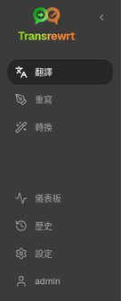
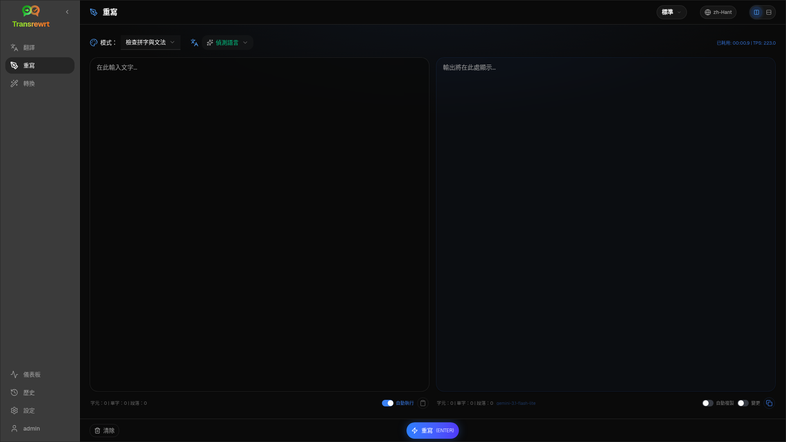
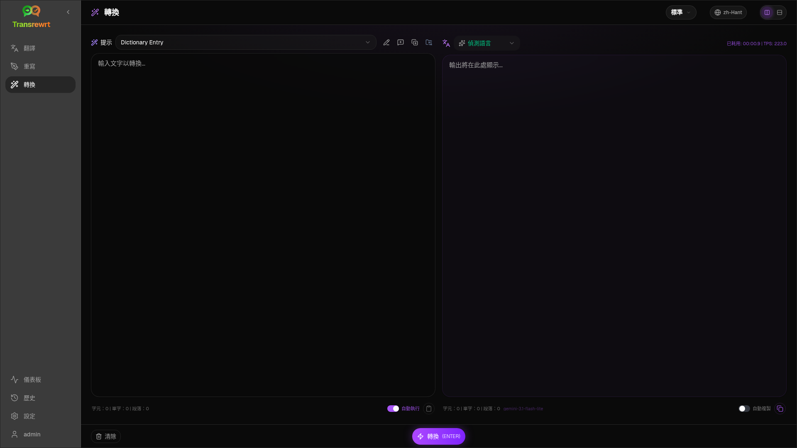
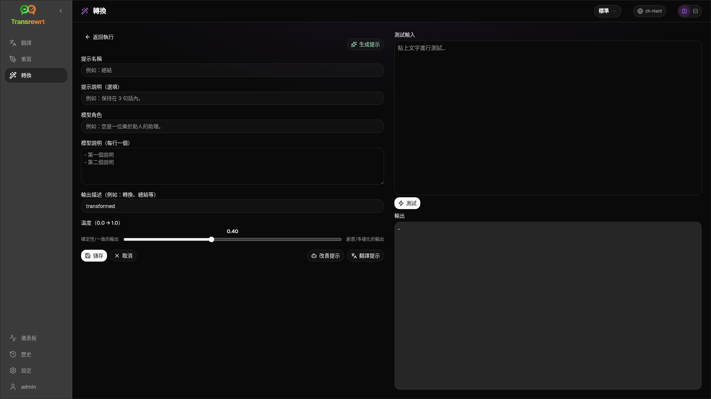
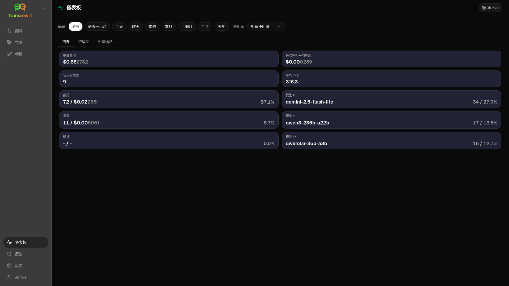
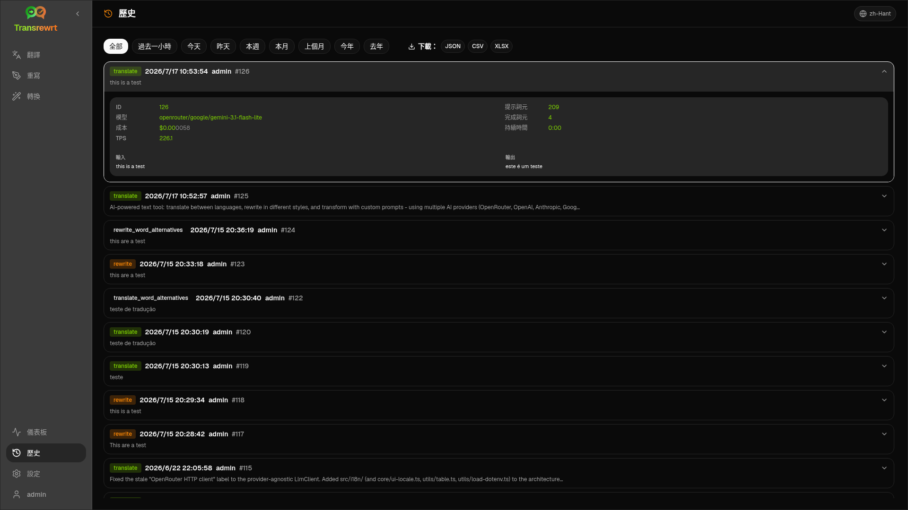
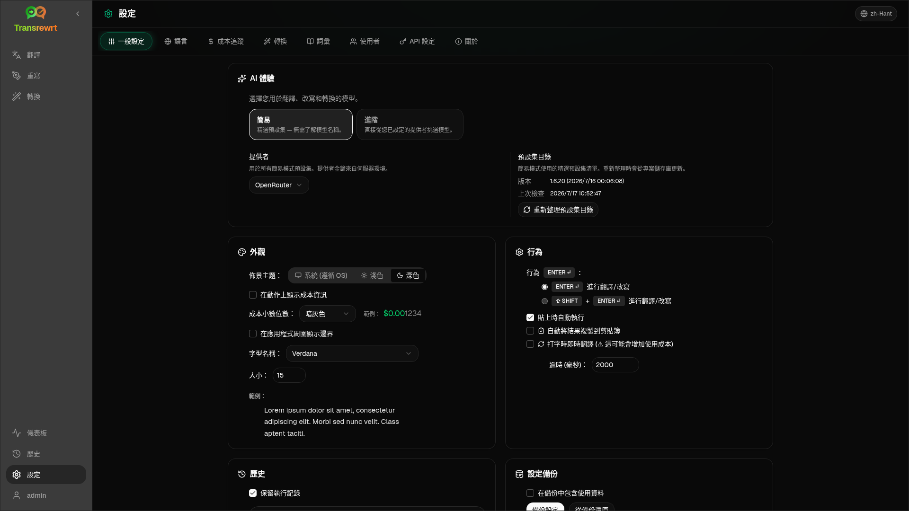

<a id="transrewrt-user-guide"></a>
# 使用者指南

<br/>

<a id="introduction"></a>
## 簡介

Transrewrt 可協助您透過三種主要方式處理文字：

- **翻譯** - 將文字從一種語言轉換為另一種語言。
- **重寫** - 以不同的風格重新措辭文字，例如更清晰、更簡短或更正式。
- **轉換** - 使用稱為提示的自訂 AI 指示來處理文字。

預設情況下，應用程式以 **簡易** 模式執行：您可以在設定中選擇 **預設**（例如 免費 (OpenRouter)、標準、進階或技術）和 **提供者**，而無需選擇模型 ID。如果您想要來自 [**設定** > **模型**](#models) 的經典模型清單，請在 [**設定** > **一般設定**](#general-settings) 中切換至 **進階**。

<br/>

本指南說明應用程式安裝並執行後的使用方式。如需安裝步驟，請參閱主要的 [**README**](README.zh-Hant.md)。

<br/>

> ℹ️ **注意**<br/>\n> Transrewrt 可作為 Windows 和 Linux 的桌面應用程式，以及自行託管的網頁應用程式。本指南著重於應用程式的日常使用。若有僅適用於單一版本的內容，會清楚標示。

<small>**以其他語言閱讀：** </small>
<small id="lang-list">[English (UK)](../USER-GUIDE.md) · [Português (Brasil)](./USER-GUIDE.pt-BR.md) · [العربية](./USER-GUIDE.ar.md) · [বাংলা](./USER-GUIDE.bn.md) · [Català](./USER-GUIDE.ca.md) · [简体中文](./USER-GUIDE.zh-Hans.md) · [繁體中文](./USER-GUIDE.zh-Hant.md) · [Hrvatski](./USER-GUIDE.hr.md) · [Čeština](./USER-GUIDE.cs.md) · [Nederlands](./USER-GUIDE.nl.md) · [English (US)](./USER-GUIDE.en-US.md) · [Tagalog](./USER-GUIDE.tl.md) · [Français](./USER-GUIDE.fr.md) · [Deutsch](./USER-GUIDE.de.md) · [Ελληνικά](./USER-GUIDE.el.md) · [Hindi (Roman)](./USER-GUIDE.hi-Latn.md) · [Magyar](./USER-GUIDE.hu.md) · [Italiano](./USER-GUIDE.it.md) · [日本語](./USER-GUIDE.ja.md) · [한국어](./USER-GUIDE.ko.md) · [Bahasa Melayu](./USER-GUIDE.ms.md) · [فارسی](./USER-GUIDE.fa.md) · [Polski](./USER-GUIDE.pl.md) · [Basa Jawa](./USER-GUIDE.jv.md) · [Português](./USER-GUIDE.pt.md) · [پنجابی](./USER-GUIDE.pa-PK.md) · [Română](./USER-GUIDE.ro.md) · [Русский](./USER-GUIDE.ru.md) · [Slovenčina](./USER-GUIDE.sk.md) · [Español](./USER-GUIDE.es.md) · [Kiswahili](./USER-GUIDE.sw.md) · [Svenska](./USER-GUIDE.sv.md) · [తెలుగు](./USER-GUIDE.te.md) · [ไทย](./USER-GUIDE.th.md) · [Türkçe](./USER-GUIDE.tr.md) · [Українська](./USER-GUIDE.uk.md) · [Tiếng Việt](./USER-GUIDE.vi.md)</small>

<small>

> **關於 UI 和文件翻譯的注意事項：** 除了原始英文 (UK) 之外的所有介面語言\n> 均使用 AI 模型進行翻譯；措辭可能不精確或包含錯誤。

</small>

<br/>

<!-- START doctoc generated TOC please keep comment here to allow auto update -->
<!-- DON'T EDIT THIS SECTION, INSTEAD RE-RUN doctoc TO UPDATE -->
**目錄**

- [開始之前](#before-you-start)
  - [如何取得免費的 OpenRouter API 金鑰（桌面應用程式）](#how-to-get-a-free-openrouter-api-key-desktop-app)
- [開始使用](#getting-started)
- [視窗的主要部分](#main-parts-of-the-window)
- [側邊欄](#sidebar)
- [工具欄](#toolbar)
- [輸入和輸出面板](#input-and-output-panels)
- [翻譯](#translate)
- [翻譯文本](#translate-text)
- [語言選擇](#language-selection)
- [有用的翻譯設定](#helpful-translation-settings)
- [完善你的翻譯](#refining-your-translation)
  - [使用詞彙](#using-the-glossary)
- [重寫](#rewrite)
  - [重寫文字](#rewrite-text)
  - [改善你的重寫](#refining-your-rewrite)
- [轉換](#transform)
  - [執行現有提示](#run-an-existing-prompt)
  - [如果你還沒有提示](#if-you-have-no-prompts-yet)
  - [快速建立提示](#create-a-prompt-quickly)
  - [編輯提示](#edit-a-prompt)
  - [在使用前測試提示](#test-a-prompt-before-using-it)
- [儀表板](#dashboard)
  - [篩選資料](#filter-the-data)
  - [儀表板分頁](#dashboard-tabs)
  - [匯出資料](#export-data)
  - [刪除模型的已儲存記錄](#delete-stored-records-for-a-model)
- [歷史](#history)
  - [篩選歷史](#filter-the-history)
  - [匯出歷史資料](#export-history-data)
- [設定](#settings)
  - [一般設定](#general-settings)
  - [模型](#models)
  - [語言](#languages)
  - [成本追蹤](#cost-tracking)
  - [轉換（設定分頁）](#transform-settings-tab)
  - [詞彙（設定分頁）](#glossary-settings-tab)
  - [使用者](#users)
  - [API 設定](#api-config)
  - [關於](#about)
- [常見問題](#common-issues)
  - [應用程式無法翻譯、重寫或轉換文字](#the-app-will-not-translate-rewrite-or-transform-text)
  - [模型清單是空的](#the-model-list-is-empty)
  - [結果太慢或太昂貴](#the-result-is-too-slow-or-too-expensive)
  - [介面語言不正確](#the-interface-is-in-the-wrong-language)
  - [文字太小或難以閱讀](#the-text-is-too-small-or-hard-to-read)
  - [儀表板摘要看起來是空的](#dashboard-summary-looks-empty)
  - [成本顯示「不可用」或似乎不正確](#cost-shows-not-available-or-seems-wrong)
  - [總計費用與我的提供者帳單不符](#total-cost-does-not-match-my-provider-bill)
  - [側邊欄缺少歷史頁面](#the-history-page-is-missing-from-the-sidebar)
  - [網頁應用程式：意外被重新導向至登入頁面](#web-app-redirected-to-the-login-page-unexpectedly)
  - [網頁管理員：忘記或遺失密碼](#web-admin-forgot-or-lost-a-password)
  - [儀表板顯示其他使用者無資料（網頁）](#dashboard-shows-no-data-for-other-users-web)
  - [我修改了提示但遺失了編輯內容](#i-changed-a-prompt-and-lost-the-edits)
- [快速提示](#quick-tips)
- [免責聲明](#disclaimer)
- [授權](#license)

<!-- END doctoc generated TOC please keep comment here to allow auto update -->

<br/><br/>

<a id="before-you-start"></a>
## 開始之前

若要使用 Transrewrt，您需要至少一個 AI 提供者的存取權。支援的提供者包括：[OpenRouter](https://openrouter.ai)（聚合了許多模型）、OpenAI、Anthropic、Google Gemini、DeepSeek、Groq、Mistral、xAI、Cerebras、NVIDIA、Alibaba Cloud、apikey.fun、任何 OpenAI 相容提供者，以及用於本機模型的 [Ollama](https://ollama.com)。

您不需要一開始就選擇付費模型。只要新增您的 OpenRouter API 金鑰，應用程式便會自動啟用內建的 **免費** OpenRouter 選項。這可讓您立即開始翻譯、重寫和轉換文字。或者，您也可以從 Cerebras、Google、Groq、Mistral AI 或 [NVIDIA](https://build.nvidia.com/)（OpenAI 相容 API）取得免費的 API 金鑰。

簡單來說：

- 在 **簡易** 模式下，一個 **預設**（免費（OpenRouter）、標準、進階或技術）會對應到您所選 **提供者**（OpenRouter、OpenAI、Ollama 等）的模型。只有對目前提供者有對應關係的預設才會出現在工具列中。您可以在翻譯、重寫和轉換頁面選擇預設。
- 在 **進階** 模式下，**模型**是您直接選擇的 AI 引擎。模型 ID 使用 **提供者前綴**（例如 `openrouter/…`、`openai/…`、`ollama/…`）。
- **API 金鑰**（或 Ollama 的 **基礎 URL**）是應用程式連線到該提供者的方式。

如果您使用的是 **桌面應用程式**，請在每個您使用的提供者的 [**設定** > **API 設定**](#api-config) 中新增金鑰。僅限 OpenRouter 使用，請參閱下方的 [如何取得免費 OpenRouter API 金鑰](#how-to-get-a-free-openrouter-api-key-desktop-app)。如果您不想使用 API 金鑰，可以安裝 Ollama（從 [ollama.com](https://ollama.com)）並改用本機模型，例如 `translategemma:4b`。

如果您使用的是 **網頁版本**，伺服器擁有者會透過環境變數設定提供者，因此您無法直接在應用程式中輸入 API 金鑰。

<br/>

<a id="how-to-get-a-free-openrouter-api-key-desktop-app"></a>
### 如何取得免費 OpenRouter API 金鑰（桌面應用程式）

如果您使用的是桌面應用程式，請依照以下步驟操作：

1. 在您的網頁瀏覽器中前往 [OpenRouter](https://openrouter.ai)。
2. 建立帳戶或登入。
3. 開啟 [金鑰](https://openrouter.ai/keys) 頁面。
4. 點擊按鈕以建立新的 API 金鑰。
5. 為金鑰命名，以便日後辨識。
6. 複製新的 API 金鑰。
7. 返回 Transrewrt 並開啟 **設定** > **API 設定**。
8. 將金鑰貼到 **OpenRouter API 金鑰**（位於 **設定** > **API 設定** 下方）。
9. 點擊 **測試 OpenRouter 金鑰** 以確保其正常運作。

<br/><br/>

<a id="getting-started"></a>
## 開始使用

如果您是第一次使用 Transrewrt，請依照以下順序操作：

1. 開啟應用程式。
2. 如有需要，請從地球圖示選擇您的 **介面語言**。
3. 如果您使用的是 **桌面應用程式**，請開啟 [**設定** > **API 設定**](#api-config)，為至少一個提供者（例如 OpenRouter）新增 API 金鑰，然後按一下 **測試** 以驗證其是否正常運作。
4. 開啟 [**設定** > **一般設定**](#general-settings)。在 **簡易** 模式（預設）下，選擇一個已設定金鑰的 **提供者**。在 **進階** 模式下，開啟 [**設定** > **模型**](#models) 並將一個或多個模型新增至 **已選取的模型**。
5. 在 **翻譯** 中，於工具列選擇一個 **預設**（簡易）或 **模型**（進階）。
6. 開啟 [**設定** > **語言**](#languages) 並選擇您的 **常用語言**，以便您最常使用的語言優先顯示。
7. 執行一次簡單的翻譯以確認一切正常運作，然後嘗試 **重寫** 和 **轉換**。

此順序很重要。它可以避免最常見的首次使用問題：在應用程式尚未建立有效的 API 連線或選取預設/模型之前就嘗試執行任務。

<br/><br/>

<a id="main-parts-of-the-window"></a>
## 視窗的主要部分

應用程式分為三個主要區域：

- 左側的 **側邊欄**。
- 頂部的 **工具列**。
- 中間的 **工作區**。

<br/>

<a id="sidebar"></a>
### 側邊欄

使用側邊欄在應用程式中移動。您可以按一下應用程式標誌旁邊的圖示來摺疊側邊欄，以獲得更多空間。

<br/>

<table>
  <tr>
    <td valign="top">
       
    </td>
    <td valign="top">
      <br/><br/>
      <ul>
        <li><strong>翻譯</strong> 會開啟翻譯工作區。</li><br/>
        <li><strong>重寫</strong> 會開啟重寫工作區。</li><br/>
        <li><strong>轉換</strong> 會開啟自訂提示工作區。</li><br/>
        <li><strong>儀表板</strong> 顯示使用量和成本資訊。</li><br/>
        <li><strong>設定</strong> 會開啟設定面板。</li><br/>
        <li><strong>歷史</strong> 顯示使用歷史記錄，包含輸入和輸出文字</li><br/>
        <li><strong>使用者</strong> 顯示已登入使用者的名稱（僅限網頁版）。</li>
      </ul>
    </td>
  </tr>
</table>

<br/>

<a id="toolbar"></a>
### 工具列

工具列會根據您在應用程式中的位置而略有不同。

- 左側顯示目前頁面的名稱。
- 右側顯示 **預設或模型選擇器** 和 **介面語言** 控制項。

在 **簡易** 模式下，工具列會顯示一個 **預設選擇器**，其中包含內建的預設設定 **免費 (OpenRouter)**、**標準**、**進階** 和 **技術**。顯示哪些預設設定取決於您在 [**設定** > **一般設定**](#general-settings) 中選擇的 **提供者** — 例如，**免費 (OpenRouter)** 僅在提供者為 OpenRouter 時列出。如果 **提供者** 是 **Ollama**，則工具列會列出您已安裝的本機模型，而非預設設定。

在 **進階** 模式下，**模型選擇器** 可讓您選擇要用於目前任務的 AI 引擎。


在進階模式下，某些免費模型可能無法隨時使用 — 它們可能離線或達到使用上限。應用程式可能會自動從您的清單中移除該模型。若要控制顯示哪些模型，請前往 [**設定** > **模型**](#models)。您可以從工具列中模型名稱左側的提供者圖示開啟模型設定。

<br/>

**地球圖示 + 語言代碼** 可變更應用程式的介面語言，例如選單和按鈕。它 **不會** 變更 **翻譯** 中使用的翻譯語言。


<br/>

<a id="input-and-output-panels"></a>
### 輸入與輸出面板

大多數工作區使用左側的 **輸入** 面板和右側的 **輸出** 面板。

每個面板還會顯示：

| **輸入**                                                          | **輸出**                                                                                                                  |
|--------------------------------------------------------------------|-----------------------------------------------------------------------------------------------------------------------------|
| - 字元數 <br/>- 字數 <br/>- 段落數 <br/> | - 任務耗時 <br/>- **TPS**（每秒處理的 token 數）<br/>- 字元、字數和段落數 <br/>- 使用的模型 |

如果您對技術術語感到好奇：

- **Token** 指的是一小段文字。您可以將其視為單字的一部分或一個短字。
- **TPS** 指的是模型每秒處理的文字區塊數量。

<br/>

您還可以監控每次操作的成本（如果可用）以及總計費用，方法是在 [**設定** > **一般設定**](#general-settings) 中啟用 `Show cost information on the actions` 選項。

<br/><br/>

[--------------------------------------------------------------------------------------------------------------------------]: #

<a id="translate"></a>
## 翻譯

當您想將文字從一種語言轉換成另一種語言時，請使用 **翻譯**。


<br/>

<a id="translate-text"></a>
### 翻譯文字

1. 開啟 **翻譯**。
2. 在 **來源** 中選擇一種語言。
3. 在 **目標** 中選擇一種語言。
4. 在工具列中選擇一個預設（簡易）或模型（進階）。
5. 在 **輸入** 中鍵入或貼上文字。
6. 按一下 **翻譯**。
7. 在 **輸出** 中閱讀結果。
8. 如果您想複製結果，請使用複製按鈕。
9. 您可以選擇使用 **改寫…** 或單字替代選項來細修結果 — 請參閱 [細修您的翻譯](#refining-translation)。

<br/>

<a id="language-selection"></a>
### 語言選擇

- **來源** 可以是特定語言或 **偵測語言**。
- **目標** 是您希望獲得結果的語言。

您選取的 **熱門語言** 會出現在列表頂端。您可以在 [**設定** > **語言**](#languages) 中設定這些選項。

<br/>

<a id="helpful-translation-settings"></a>
### 有用的翻譯設定

在 [**設定** > **一般設定**](#general-settings) 中，您可以變更翻譯行為：

- **貼上時自動執行** 會在您貼上文字後立即執行翻譯。
- **自動將結果複製到剪貼簿** 會在成功執行後自動複製結果。
- **輸入時即時翻譯**（⚠️ 這可能會增加使用成本）會在您輸入時執行翻譯。
- **逾時（毫秒）** 控制應用程式在執行即時翻譯前等待的時間。
- **行為 for ENTER** 選擇 `Enter` 執行任務或插入新行：
  - **Enter** 執行 翻譯 或 重寫 (預設)。
  - **Shift + Enter** 執行 翻譯 或 重寫；普通 **Enter** 插入新行。

<br/>

<a id="refining-translation"></a>
### 精煉您的翻譯

成功翻譯後，**重述…** 和版本下拉選單會出現在輸出標頭中，位於 **至：** 語言選擇器的旁邊。您可以在此精煉結果：

1. **改寫…** — 在輸出中未選取文字時，取得相同輸入的另一個完整翻譯，使用不同的措辭。模型會接收你已有的每個版本，使新措辭能與所有版本不同。你最多可以儲存 **五** 個版本，並在版本下拉選單中切換。選取文字後，**改寫…** 會在選取範圍附近開啟詞語替代選項（與右鍵點擊相同）。未選取時，達到五個版本後 **改寫…** 會停用；選取時，即使達到五個版本仍可使用（僅詞語替代選項，更新版本 5）。完整改寫正在執行時，點擊 **停止翻譯** 取消；輸出會回到改寫開始時的活動版本。
2. **詞語替代選項** — 在輸出中選取一個或多個詞語或短語（如果你只選取詞語的一部分，應用程式會將選取範圍擴展至完整詞語），然後右鍵點擊或點擊 **改寫…**。選取範圍附近會出現簡短的替代選項清單；點擊其中一個來取代。每個選項可能取代比你的選取範圍稍大的跨度（例如相鄰的介詞或冠詞），以保持句子語法正確。如果你少於五個版本，編輯後的輸出會儲存為新版本；達到五個版本時，僅更新 **版本 5**。未選取時右鍵點擊會選取游標下的詞語（如果該處沒有詞語則不做任何動作）。按 **Esc** 或點擊清單外部可取消而不變更輸出。
3. **成本** — 每次完整 **改寫…**（未選取）和每次詞語替代選項請求都會再次使用模型，並可能增加使用成本（與正常翻譯執行相同）。

<br/>

<a id="using-the-glossary"></a>
### 使用詞彙表

**詞彙表**是特定語言對的來源/目標術語對列表。啟用詞彙表後，Transrewrt 會將匹配的術語傳送給模型，以便您偏好的措辭在翻譯中保持一致（例如產品名稱、品牌術語或職稱，應始終以相同方式翻譯）。

要在 **翻譯** 頁面上使用它：

1. 在輸入面板中開啟 **詞彙表** 開關（位於自動執行和自動複製開關旁邊）。
2. 選擇您的 **從** 和 **至** 語言，然後像平常一樣進行翻譯。為該語言對儲存的術語會自動套用。
3. 要即時擷取新術語對，請單擊 **新增至詞彙表**（位於 **從：** 語言選擇器旁邊）。對話方塊會預先填入您目前的語言，因此您只需填寫 **來源術語** 和 **目標術語**。
4. 使用輸出頁腳中的 **詞彙表** 連結（或對話方塊內的 **管理詞彙表** 連結）跳至 [**設定** > **詞彙表**](#glossary-settings) 並檢閱您的所有術語。

您可以在 [**設定** > **詞彙表**](#glossary-settings) 標籤頁中新增、編輯、匯入和匯出術語 — 請參閱下方。

<br/>

> ℹ️ **注意**<br/>
> 詞彙表術語是按 **語言對** 匹配的，因此為英文 → 法文儲存的術語在翻譯英文 → 德文時不會套用。詞彙表無法與 **偵測語言** 作為來源語言一起使用，因為需要特定的來源語言來匹配術語。

[--------------------------------------------------------------------------------------------------------------------------]: #

<a id="rewrite"></a>
## 重寫

當你想在不改變主要含義的情況下改善措辭時，請使用 **重寫**。文字會保持相同的語言（不會被翻譯）。



這對於以下情況很有用：

- 修正拼字與文法 (**檢查拼字與文法**)
- 改善文字清晰度 (**改善清晰度**)
- 一次執行多種不同的改寫 (**其他版本**)
- 讓文字更正式或更非正式 (**設為正式** / **設為非正式**)
- 縮短或擴充文字 (**縮短** / **展開**)
- 讓文字聽起來更技術化 (**設為技術**)

<br/>

<a id="rewrite-text"></a>
### 重寫文字

1. 開啟 **重寫**。
2. 選擇 **模式**（例如 **改善清晰度** 或 **設為正式**）。
3. 可選擇將 **從** 設為您文字的語言（或保留 **偵測語言**）。
4. 在 **輸入** 中輸入或貼上文字。
5. 點擊 **重寫**。
6. 在 **輸出** 中閱讀結果。
7. 可選擇使用 **重新措辭…** 或詞語替代選項來微調結果 — 請參閱[微調您的重寫](#refining-rewrite)。

<br/>

> 💡 **提示**<br/>
> 當您使用「**檢查拼字與文法**」模式時，輸出面板中會出現一個「**顯示變更**」開關 (位於 **複製** 旁邊)。
> 開啟或關閉此開關，即可顯示或隱藏套用到您文字的具體修正。

<br/>

> ℹ️ **注意**<br/>
> 重寫模式 **其他版本** 會在 **單次** 執行中傳回數個改寫版本，在輸出中以 `----` 分隔。這與 **重新措辭…** 不同，後者會隨時間建立版本歷史（每次點擊產生一個新變體）。請參閱[微調您的重寫](#refining-rewrite)。

<br/>

<a id="refining-rewrite"></a>
### 微調您的重寫

成功重寫後，**重新措辭…** 和版本下拉選單會出現在工作區的輸出側（在分割版面配置中，位於輸出欄上方的頂部工具列，在執行指標旁；在堆疊版面配置中，位於輸出面板上方，在 **從：** 旁）。您可以在那裡微調結果 — 與[微調您的翻譯](#refining-translation)相同的概念，但文字保持相同語言並保留目前的重寫 **模式**：

1. **重新措辭…** — 在輸出中未選取文字時，取得相同輸入的另一個完整重寫，使用不同的措辭，仍套用所選模式（例如更清晰、更簡短或更正式）。模型會接收您已有的每個版本，因此新措辭可以與所有版本不同。您最多可以儲存 **五個** 版本，並在版本下拉選單中切換它們。選取文字時，**重新措辭…** 會在選取範圍附近開啟詞語替代選項（與右鍵點擊相同）。未選取時，一旦達到五個版本，**重新措辭…** 即停用；選取時，在五個版本下仍可運作（僅詞語替代選項，更新版本 5）。完整重新措辭執行時，點擊 **停止重寫** 以取消；輸出會回到重新措辭開始時的活動版本。
2. **詞語替代選項** — 在輸出中選取一個或多個詞語或短語（如果您只選取詞語的一部分，應用程式會將選取範圍擴展至完整詞語），然後右鍵點擊或點擊 **重新措辭…**。選取範圍附近會出現簡短的替代選項清單；點擊其中一個以取代。每個選項可能取代比您選取範圍稍大的跨度，以保持句子語法正確。如果您的版本少於五個，編輯後的輸出會儲存為新版本；在五個版本時，僅更新 **版本 5**。未選取時右鍵點擊會選取游標下的詞語（如果該處沒有詞語則不做任何動作）。按下 **Esc** 或點擊清單外部以取消而不變更輸出。
3. **成本** — 每次完整 **重新措辭…**（未選取）和每次詞語替代請求都會再次使用模型，並可能增加使用成本（與正常重寫執行相同）。

<br/><br/>

[--------------------------------------------------------------------------------------------------------------------------]: #

<a id="transform"></a>
## 轉換

當您希望 AI 遵循一組自訂指示時，請使用 **轉換**。



這是應用程式中最具彈性的區域。您可以將其用於諸如以下任務：

- 摘要筆記
- 將草稿文字轉為精煉的電子郵件
- 擷取重點
- 將文字轉換為特定格式
- 任何其他針對輸入文字的自訂活動

<br/>

<a id="run-an-existing-prompt"></a>
### 執行現有提示

1. 開啟 **轉換**。
2. 從提示列表中選擇一個提示。
3. 如果出現「**從**」語言方塊，請選擇您想要的語言。
4. 在 **輸入** 中鍵入或貼上文字。
5. 按一下 **轉換**。
6. 在 **輸出** 中閱讀結果。

<br/>

<a id="if-you-have-no-prompts-yet"></a>
### 如果您還沒有任何提示

如果您的提示列表是空的，請在「轉換」工作區中按一下 **載入範例提示**。此控制項始終可在 [**設定** > **轉換**](#transform-settings) 的匯出/匯入列中找到。兩者都會加入內建範例，讓您可以快速開始。

<br/>

> ℹ️ **注意**<br/>
> 範例提示以英文提供。載入後，您可以編輯提示並使用 **翻譯提示** 將其翻譯成您的語言。

<br/>

<a id="create-a-prompt-quickly"></a>
### 快速建立提示

建立提示最快的方法是：

1. 按一下 **新增提示**。
2. 按一下 **生成提示**。
3. 描述您希望提示執行的操作。
4. 選擇一個預設 (簡易) 或模型 (進階)。
5. 讓應用程式為您建立草稿。
6. 檢閱草稿並按一下 **儲存**。


<br/>

<a id="edit-a-prompt"></a>
### 編輯提示

當您建立或編輯提示時，編輯器會顯示在左側，測試區域會顯示在右側。



主要欄位如下：

- **提示名稱**：顯示在提示清單中的名稱。
- **提示說明（選填）**：執行提示時顯示給使用者的簡短提示。
- **模型角色**：指派給 AI 的整體角色，例如「您是一位樂於助人的助理」。
- **模型說明（每行一個）**：您希望 AI 遵循的特定規則。
- **輸出描述（例如：轉換、總結等）**：描述結果的簡短詞語。
- **溫度（0.0 → 1.0）**：模型將如何表現；請參閱下方。
- **要求目標語言**：執行提示時會加入語言選擇器。
如果您不熟悉技術術語 **溫度**，可以這樣理解：

- 較低的 **溫度** 會產生更穩定、更可預測的結果。
- 較高的 **溫度** 會產生更多樣性和創意。

您也可以使用：

- `Generate prompt`：從簡單的描述建立新的草稿
- `Improve prompt`：改進現有的提示
- `Translate prompt`：翻譯提示欄位

<br/>

> ⚠️ **警告**<br/>
> 在點擊 `Back to Run` 之前，請先點擊 `Save`。如果您在未儲存的情況下返回，您的變更將會遺失。

<br/>

<a id="test-a-prompt-before-using-it"></a>
### 在使用提示前進行測試

右側的測試面板可讓您在日常工作中實際使用提示前，先用範例文字進行測試。

這在以下情況很有用：

- 您正在建立一個新提示
- 您正在比較提示的兩個版本
- 您想檢查語氣、長度或輸出格式

<br/>

> ℹ️ **注意**<br/>
> 您可以在 [**設定** > **轉換**](#transform-settings) 中匯出和匯入已儲存的提示。

當您在提示編輯器中使用 **生成提示**、**改善提示** 或 **翻譯提示** 時，**簡易** 模式會提供與翻譯和重寫相同的預設選擇器；**進階** 模式則使用模型清單。

<br/><br/>

[--------------------------------------------------------------------------------------------------------------------------]: #

<a id="dashboard"></a>
## 儀表板

使用 **儀表板** 查看您使用了多少應用程式以及需要支付多少費用（針對付費模型）。



<br/>

> ℹ️ **注意**<br/>
> 如果您只使用 **免費** 模型，**成本** 金額可能為零，且以成本為中心的 KPI 可能會顯示為空白。在選定的期間內，如果您有活動，**摘要** 標籤仍會顯示翻譯、重寫和轉換的呼叫次數。

<br/>

<a id="filter-the-data"></a>
### 篩選資料

使用頂部的篩選按鈕來變更時間範圍。


<br/>

> ℹ️ **注意**<br/>
> **使用者**篩選器僅在網頁版中對管理員可見。一般使用者將不會看到此篩選器，且桌面應用程式中亦不提供。

<br/>

<a id="dashboard-tabs"></a>
### 儀表板分頁

- **摘要**顯示關鍵績效指標卡：總計費用、使用的模型、依模式區分的通話計數與費用（佔總通話數的比例）、每次通話的平均費用、平均 TPS，以及依通話數排名前三的模型。
- **依模型**列出每個模型及其總通話數、總計費用和平均 TPS；展開某列可查看依翻譯、重寫和轉換細分的資訊。
- **所有通話**顯示完整的通話記錄（寬版佈局下為分頁顯示，窄版螢幕下為卡片顯示），並可供匯出。

<br/>

<a id="export-data"></a>
### 匯出資料

儀表板表格的資料可匯出為：

- **JSON**
- **CSV**
- **XLSX**

這在您想檢視應用程式外的活動或分享報告時很有用。

<br/>

<a id="delete-stored-records-for-a-model"></a>
### 刪除模型的儲存記錄

在 **依模型** 或 **所有通話** 中，您可以點擊「垃圾桶」圖示來移除模型的儲存記錄。

> ⚠️ **警告**<br/>
> 刪除儲存記錄的操作無法復原。請僅在確定不再需要該歷史記錄時使用此功能。

若要刪除所有資料或移除依年齡篩選的記錄，請前往 [**設定** > **成本追蹤**](#cost-tracking)。您可以在此找到刪除所有儲存資料或僅刪除特定日期之前資料的選項。

<br/><br/>

[--------------------------------------------------------------------------------------------------------------------------]: #

<a id="history"></a>
## 歷史

點擊 **歷史** 可查看您在 **Transrewrt** 中執行的動作歷史記錄，包括每次操作的輸入和輸出。



<br/>

<a id="filter-the-history"></a>
### 篩選歷史記錄

**歷史** 使用與 **儀表板** 頁面相同的時間範圍篩選器。


<br/>

> ℹ️ **注意**<br/>
> 在 **網頁應用程式** 中，所有人（包括管理員）只能看到自己的執行歷史記錄。**儀表板** 上的 **使用者** 篩選器供管理員檢視跨帳戶的使用情況和成本；它不適用於 **歷史**。

<br/>

<a id="export-history-data"></a>
### 匯出歷史記錄資料

歷史記錄頁面可將篩選後的資料匯出為：

- **JSON**
- **CSV**
- **XLSX**

這在您想檢視應用程式外的活動或分享報告時很有用。

<br/><br/>

[--------------------------------------------------------------------------------------------------------------------------]: #

<a id="settings"></a>
## 設定

從側邊欄開啟 **設定** 以自訂應用程式的行為。

可用的標籤頁取決於平台和您的角色：

| 標籤頁           | 桌面版 | 網頁版（管理員） | 網頁版（一般使用者） | 備註                                       |
  |------------------|:-------:|:-----------:|:------------------:|----------------------------------------------|
  | 一般設定         |   是    |     是      |        是          | 包含 **AI 體驗**（簡易 / 進階） |
  | 模型             |   是    |     是      |        是          | 僅在 **AI 體驗** 為 **進階** 時顯示 |
  | 語言             |   是    |     是      |        是          |                                              |
  | 成本追蹤         |   是    |     是      |         -          |                                              |
  | 轉換             |   是    |     是      |        是          | 大量匯入/匯出轉換提示      |
  | 詞彙             |   是    |     是      |        是          | 翻譯期間套用的詞組配對        |
  | 使用者           |    -    |     是      |         -          |                                              |
  | API 設定         |   是    |     是      |         -          |                                              |
  | 關於             |   是    |     是      |        是          |                                              |

在 **簡易** 模式下，模型選擇透過工具列中的預設集和一般設定中的 **提供者** 進行；**模型** 標籤頁會隱藏。

<br/>

> ℹ️ **注意**<br/>
> 在網頁版本中，每個使用者都有自己的設定。例如 AI 體驗、提供者、選取的模型或預設集、語言、一般選項和轉換提示等設定會儲存於每個使用者。您所做的變更不會影響其他使用者。

<br/>

[--------------------------------------------------------------------------------------------------------------------------]: #

<a id="general-settings"></a>
### 一般設定

使用 **一般設定** 來控制輸入行為、是否儲存執行詳細資訊以供 **歷史** 記錄、外觀，以及如何選擇用於翻譯、重寫和轉換的 AI。

**AI 體驗**

- **簡易**（預設）：選擇一個 **提供者**（OpenRouter、OpenAI、Anthropic、Google Gemini、DeepSeek、Groq、Mistral、xAI、Cerebras 或 Ollama）。雲端提供者使用工具列中的內建預設集。**Ollama** 會列出您電腦上安裝的模型，而非預設集。在簡易模式下，**預設集目錄** 會顯示目錄版本和上次更新時間；按一下 **重新整理預設集目錄** 以從專案儲存庫擷取最新的預設集清單（應用程式也會在背景中定期檢查）。
- **進階**：在工具列中選擇個別模型；在 [**設定** > **模型**](#models) 下管理清單。

**外觀**

- **佈景主題** 在淺色、深色和系統外觀之間切換。
- **在動作上顯示成本資訊** 控制每個操作的成本（如果可用）以及「翻譯」、「重寫」和「轉換」輸出面板上的總成本。
- **成本小數位數** 變更成本小數的顯示方式。
- **僅限網頁版：** **在應用程式周圍顯示邊界** 在介面周圍增加額外的空間。
- **字體** 變更文字面板中的書寫字體。
- **大小** 變更字體大小。

**行為**

- **行為 for ENTER** 選擇 `Enter` 執行任務或插入新行。
- **貼上時自動執行** 貼上文字後立即啟動翻譯。
- **自動將結果複製到剪貼簿** 自動複製成功的結果。
- **輸入時即時翻譯** (⚠️ 這可能會增加使用成本) 隨著輸入進行翻譯。
- **逾時 (毫秒)** 設定即時翻譯的等待時間。

**歷史**

- **保留執行記錄** 控制每次翻譯、重寫和轉換是否儲存側邊欄 [**歷史**](#history) 檢視的**輸入和輸出文字**。關閉此功能會要求確認；如果確認，儲存的歷史文字將從資料庫中移除。如果標籤顯示*已被管理員停用*，則您的安裝已在環境中設定 `HISTORY_DISABLED` (請參閱 [README](README.zh-Hant.md#configuration-and-environment))；您無法從使用者介面重新開啟歷史記錄。
- **刪除歷史記錄** 允許您按時間 (例如，早於幾個月，或**所有資料 (清除)**) 使用**刪除資料**來移除儲存的文字。這只會影響**歷史**檢視中儲存的執行文字；它**不會**刪除成本或使用總計。若要移除或修剪**成本**資料，請使用 [**設定** > **成本追蹤**](#cost-tracking)。

**設定備份** (僅限桌面應用程式和網頁管理員)
- **在備份中包含使用資料** - 啟用時，ZIP 檔案還包含執行記錄和 API 呼叫資料。
- **備份設定** - 建立一個單一 ZIP 檔案（`transrewrt-config-backup-YYYY-MM-DD_HHMMSS.zip` 依當地時間）包含 `config.json`、`state.json`、選用的加密金鑰、使用者、偏好設定、自訂提示和使用資料（如果您選擇包含）。成功備份後，確認訊息會顯示已儲存的檔案名稱。
- **從備份還原** - 會先開啟一個 **確認對話方塊**。在對話方塊中選擇備份 ZIP 檔案（**瀏覽** / 檔案選擇器或支援的拖放），然後檢閱選項：
  - **還原使用資料** - 在備份時（如果包含使用資料）匯入 ZIP 中的使用量/歷史記錄。如果您只想匯入設定和提示，請保持關閉。
  - **還原前清除舊的使用資料** - 在套用備份之前，移除此安裝上的現有使用量/歷史記錄（選用；當您想要完全取代時使用）。
在網頁版或桌面版中建立的備份可以在另一版本中還原。在網頁版中還原桌面備份時，資料將還原給管理員使用者。

<br/>

<a id="models"></a>
### 模型

此標籤僅在 [**一般設定**](#general-settings) 中將 **AI 體驗** 設定為 **進階** 時可用。使用 **設定** > **模型** 來選擇要在工具列中顯示哪些模型。



此頁面有兩個列表：

- 左側的 **可用模型**
- 右側的 **已選取的模型**

有用的控制項包括：

- **搜尋模型...** 按名稱尋找模型
- **提供者** 標籤將列表縮小到單一引擎（OpenRouter、OpenAI、Ollama 等）
- **僅免費** 顯示免費模型
- **重新整理** 重新載入列表
- **全部展開** 和 **全部摺疊** 當您按提供者排序時

模型 ID 包含提供者前綴（例如 `openrouter/…` 而非 `openai/…`）。像 **OpenAI (OpenRouter)** 與 **OpenAI (直接)** 這樣的標記顯示流量的路由方式。

> ℹ️ **注意**<br/>
> **OpenRouter Body Builder** (`openrouter/bodybuilder`) 是一個路由模型，而非通用聊天模型：其回覆是描述 OpenRouter API 請求主體的 JSON（例如，一個包含 `requests` 和 `model` 的 `messages` 陣列）。如果您將其用於 **翻譯**、**重寫** 或 **轉換**，輸出面板將顯示該 JSON 而非完成的文字。請為這些任務選擇一個正常的文字模型。請參閱 OpenRouter 上的 [Body Builder 模型頁面](https://openrouter.ai/openrouter/bodybuilder)。

動作：

- 若要新增模型，請點擊 **新增** 或該項目中的任何位置。

- 若要移除模型，請點擊 **已選取的模型** 中該模型旁的 **X**，或在可用模型中的該項目上點擊 **已選取**。

- 若要清除列表，請點擊 **取消全選**。必要的免費模型將保留在列表中。

<br/>

> ℹ️ **注意**<br/>
> 如果您不想立即為 OpenRouter 新增點數，請先啟用 **僅免費** 並選擇免費模型（無需信用卡）。您也可以使用 Ollama 在本機執行模型，無需任何 API 金鑰。

<br/>

<a id="languages"></a>
### 語言

使用 **設定** > **語言** 來整理應用程式中使用的語言列表。

- **頂部語言** 會釘選在 **翻譯** 和 **轉換** 的語言列表頂部附近。
- **自訂語言** 可讓您新增列表中沒有的語言。

如果您新增自訂語言，它將與內建選項一起出現在語言選擇器中。

<br/>

<a id="cost-tracking"></a>
### 成本追蹤

使用 **設定** > **成本追蹤** 來管理成本資訊。

- **總計費用** 顯示累計總額。
- **複製值** 將總計複製到剪貼簿。
- **重設成本** 將儲存的總計重設為零。
- **與 API 金鑰使用量同步** 將總計設定為與您的 OpenRouter 帳戶報告的使用量相符（僅限 OpenRouter）。
- **API 金鑰使用量** 顯示 OpenRouter 的使用量詳細資訊（如果可用）。
- **刪除成本資料** 會移除所有資料，或僅移除選定日期之前的項目。

**成本追蹤：** 當您使用 OpenRouter 模型時，應用程式會根據 OpenRouter 的成本資訊顯示您的實際使用量和支出。對於所有其他提供者，應用程式會使用 OpenRouter 發布的價格估算成本；如果價格不可用，估計值可能為零。

<br/>

> ℹ️ **注意**<br/>
> **所有費用數字僅供參考的估計值，並非官方帳單。**

<br/>

> ⚠️ **警告**<br/>
> 資料刪除無法復原。刪除前，請確保備份您的資料或透過 [**歷史**](#history) 或 [**儀表板** > **所有通話**](#dashboard-tabs) 匯出，否則資料將永久遺失。
> 與每個 API 呼叫項目相關的所有輸入/輸出歷史記錄也將被刪除。

<br/>

<a id="transform-settings"></a>
### 轉換（設定標籤頁）

使用 **設定** > **轉換** 來大量管理提示。

您可以：

- 檢視您儲存的提示
- 刪除提示
- 從檔案匯入提示
- 匯出提示以進行備份或共用
- 將範例提示載入至提示清單

<br/>

<a id="glossary-settings"></a>
### 詞彙 (設定標籤頁)

使用 **設定** > **詞彙** 來管理翻譯期間套用的術語配對 (請參閱 [使用詞彙](#using-the-glossary))。每個術語都有 **來源語言**、**目標語言**、**來源術語** 和 **目標術語**。

您可以：

- **新增術語** — 填寫表格底部的列 (選擇語言，輸入來源和目標術語) 並按一下 **+** 按鈕。
- **尋找術語** — 按 **來源語言**、**目標語言** 或自由 **文字** 篩選清單；按一下 **清除篩選條件** 以重設。
- **刪除術語** — 按一下其列上的垃圾桶圖示。
- **匯入** — 從 `.csv`、`.xlsx` 或 `.xls` 檔案載入術語。檔案應包含 `source_language`、`target_language`、`source_text` 和 `target_text` 等欄位。
- **匯出 CSV** / **匯出 XLSX** — 下載您的所有術語以進行備份或共用。
- **CSV 範本** / **XLSX 範本** — 下載具有正確欄位標題的空白檔案，以便填寫和匯入。

<br/>

> ℹ️ **注意**<br/>
> 在 **桌面應用程式** 中，詞彙是本機儲存的。在 **網頁版本** 中，每個使用者都有自己的詞彙，因此您的術語不會影響其他使用者。

<br/>

<a id="users"></a>
### 使用者

使用 **使用者** 來管理網頁版本中的使用者帳戶。您可以新增使用者、更新其詳細資料、重設密碼以及刪除帳戶。

<br/>

<a id="api-config"></a>
### API 設定

支援的提供者包括：OpenRouter、OpenAI、Anthropic、Google Gemini、DeepSeek、Groq、Mistral、xAI、Cerebras、NVIDIA、Alibaba Cloud、apikey.fun、**Ollama**（透過基礎 URL 的本機模型），以及一個可選的 **自訂 OpenAI 相容提供者**（名稱、URL 和 API 金鑰 — 僅限進階模式）。您只需要設定您使用的提供者。

**網頁應用程式：僅限管理員**

API 金鑰透過系統或 Docker 環境變數進行設定 — 不會在網頁 UI 中輸入。對於自訂提供者，請設定 `CUSTOM_PROVIDER_NAME`、`CUSTOM_PROVIDER_URL` 和 `CUSTOM_PROVIDER_API_KEY` (三者皆為必要)。此頁面顯示哪些提供者已設定金鑰，並允許您透過按一下 `Test` 按鈕來測試每個提供者。

<br/>

> ℹ️ **注意**<br/>
> 若要變更 API 金鑰，請更新您的系統或 Docker 設定中的環境變數，然後重新啟動伺服器或容器。

<br/>

> ℹ️ **注意**<br/>
> **設定備份**（請參閱 [**一般設定** → 設定備份](#general-settings)) 可將 **已解析** 的提供者金鑰嵌入 ZIP 的 `config.json` 中。還原該 ZIP 並不會將這些金鑰 **複製** 回伺服器的持續性設定檔——即時金鑰仍來自環境和其中所述的現有檔案狀態。

<br/>

**桌面應用程式**

使用 **API 設定** 來儲存您使用的每個提供者的 API 金鑰。對於 Ollama，請輸入 **基礎 URL** 而非 API 金鑰。對於自訂 OpenAI 相容提供者（不在內建清單中的任何端點，例如自行託管的伺服器或閘道），請輸入 **提供者名稱**、**基礎 URL**（例如 `https://my-llm.example.com/v1`）和 **API 金鑰**；這三者都是必需的。URL 和名稱會內嵌編輯；請使用 **編輯** 來取代 API 金鑰。自訂提供者的模型僅在 **進階** 模式下顯示（設定 → 模型）。

<br/>

> 💡 **提示** <br/>
> 如果您不想使用 API 金鑰或支付使用費用，您可以 [下載 Ollama](https://ollama.com) 並在您的機器上免費執行模型 (例如 `translategemma:4b`)。或者，您可以建立免費的 OpenRouter 帳戶 (無需信用卡) 來使用其免費模型，或從 Cerebras、Google、Groq、Mistral AI 或 [NVIDIA](https://build.nvidia.com/) 取得免費 API 金鑰。

<br/>

- 只新增您需要的提供者。在 **設定** > **模型** 中，每個模型 ID 都以提供者開頭（例如，對於名為 `MyProvider` 的自訂端點，則為 `openrouter/openrouter/free`、`openai/gpt-4o`、`nvidia/nvidia/nemotron-nano-3-30b-a3b`、`ollama/llama3`、`MyProvider/…`）。

輸入文字欄位中的值，然後按一下 `Save` 以新增 API 金鑰。按一下 `Edit` 以取代現有的金鑰。按一下 `Test` 以驗證金鑰是否正常運作。對於 Ollama 基本 URL，請務必按一下 `Test` 以檢查連線。

<br/>

> ℹ️ **注意**<br/>
> 您無法查看 API 金鑰的目前值。您只能使用 `Edit` 按鈕來取代它。
> API 金鑰會以加密方式儲存在設定中。

<br/>

<a id="about"></a>
### 關於

**關於** 標籤頁顯示：

- 應用程式名稱和標語
- 版本號碼和建置日期
- 授權和版權資訊，以及開啟「**第三方聲明**」的連結
- 前往專案儲存庫的連結

<br/><br/>

<a id="common-issues"></a>
## 常見問題

如果某項功能無法如預期般運作，請先檢查以下幾點。

<br/>

<a id="the-app-will-not-translate-rewrite-or-transform-text"></a>
### 應用程式無法翻譯、重寫或轉換文字

檢查是否：

- 您已在工具列中選取了 **預設**（簡易）或 **模型**（進階）
- 在 **簡易** 模式下，[**設定** > **一般設定**](#general-settings) 中有具有有效金鑰（或 Ollama URL）的 **提供者**，且該提供者至少有一個預設
- 在 **進階** 模式下，[**設定** > **模型**](#models) 中至少列出了一個模型
- 您的 API 設定正常運作

如果您正在使用桌面應用程式：

1. 開啟 [**設定** > **API 設定**](#api-config)。
2. 檢查是否已儲存至少一個 API 金鑰。
3. 按一下提供者旁邊的 **測試** 以確認金鑰正常運作。

<br/>

<a id="the-model-list-is-empty"></a>
### 模型清單為空白

在 **簡易** 模式下，開啟 [**設定** > **一般設定**](#general-settings)，確認 **提供者** 已設定，並在 [**API 設定**](#api-config) 中新增或測試金鑰（桌面版），或詢問您的管理員（網頁版）。對於 **Ollama**，請執行 **測試** 基本 URL 並確保模型已在本機安裝。

在 **進階** 模式下，開啟 [**設定** > **模型**](#models) 並按一下 **重新整理**。如果需要，請搜尋模型，開啟 **僅免費**，然後將模型新增至 **已選取的模型**。

<br/>

<a id="the-result-is-too-slow-or-too-expensive"></a>
### 結果太慢或太貴

嘗試以下一項或多項：

- 選擇不同的預設（簡易）或模型（進階）
- 使用較短的輸入
- 在 [**設定** > **一般設定**](#general-settings) 中關閉 **輸入時即時翻譯**
- 對於簡單的任務，請使用免費模型（請參閱 [模型](#models)）
<br/>

<a id="the-interface-is-in-the-wrong-language"></a>
### 介面語言錯誤

在 [工具列](#toolbar) 中按一下地球圖示，然後選擇您偏好的 **介面語言**。

<br/>

<a id="the-text-is-too-small-or-hard-to-read"></a>
### 文字太小或難以閱讀

開啟[**設定** > **一般設定**](#general-settings)並變更：

- **字型**
- **大小**

<br/>

<a id="dashboard-summary-looks-empty"></a>
### 儀表板摘要看起來是空的

如果發生以下情況，這是正常的：

- 您只使用 **免費** 模型，並且正在查看 **成本** 數據（可能為零）；**摘要** 上的呼叫計數 KPI 仍需要來自所選期間的數據
- 所選的 **時間篩選** 並未涵蓋進行呼叫的期間 — 請嘗試 **全部** 以進行檢查

如果在選取**全部**後 KPI 仍為零，請確認呼叫是否出現在[**歷史**](#history)或**所有通話**標籤頁中。

<br/>

<a id="cost-shows-not-available-or-seems-wrong"></a>
### 成本顯示為「無法使用」或似乎不正確

當您透過**OpenRouter**使用模型時，應用程式會顯示 OpenRouter 回報的實際支出。

對於**其他提供者**（OpenAI 直接、Anthropic 直接等），成本是根據 OpenRouter 發布的定價數據估計的。如果找不到符合條件的模型價格，成本將顯示為**無法使用**，且不會計入您的總計費用。

<br/>

<a id="total-cost-does-not-match-my-provider-bill"></a>
### 總計費用與我的提供者帳單不符

應用程式中的所有費用數據均為**僅供參考的估計值**，並非官方帳單。

為了讓總計費用更接近您的實際 OpenRouter 支出，請開啟[**設定** > **成本追蹤**](#cost-tracking)並按一下**與 API 金鑰使用量同步**。

<br/>

<a id="the-history-page-is-missing-from-the-sidebar"></a>
### 側邊欄遺失了歷史記錄頁面

**保留執行記錄**可能已關閉。開啟[**設定** > **一般設定**](#general-settings)並啟用它，除非記錄已被*管理員停用*（在環境中`HISTORY_DISABLED` — 請參閱[README](README.zh-Hant.md#configuration-and-environment))。啟用記錄不會還原先前刪除的文字。

<br/>

<a id="web-app-session-expired"></a>
### Web 應用程式：意外重新導向至登入頁面

您的會話可能已過期。請重新登入。如果經常發生，請檢查伺服器設定中的會話存留時間。

<br/>

<a id="web-admin-forgot-or-lost-a-password"></a>
### Web 管理員：忘記或遺失密碼

這適用於**自行託管的 Web 應用程式**（Docker），而非桌面（Electron）應用程式。

- 如果另一位管理員仍可登入，他們可以開啟 [**設定** > **使用者**](#users)，選擇帳戶，然後在那裡設定 **新密碼**。
- 如果您被 **鎖定** 但擁有機器的容器的 **Shell 存取權**，請使用隨映像檔提供的輔助程式重設密碼（如果您更改預設名稱，請替換 `transrewrt`，如果密碼包含空格或特殊字元，請加上引號）：

```bash
docker exec transrewrt reset-web-password '<username>' '<new-password>'
```

如果您從未建立其他帳戶，預設的管理員使用者名稱是 `admin`。當您只傳遞一個引數時，它會被視為 `admin` 的新密碼。

如果您從 **原始程式碼簽出** 執行而非 Docker，請使用：

```bash
pnpm run reset-web-password -- <username> <new-password>
```

該指令碼會更新 SQLite 資料庫中的使用者記錄（如果 `admin` 使用者遺失，也可以建立該使用者）。重設後，請使用新密碼登入。

<br/>

<a id="dashboard-shows-no-data-for-other-users"></a>
### 儀表板未顯示其他使用者的資料（網頁）

依設計，只有 **管理員** 可以透過 **使用者** 篩選器查看所有使用者的資料。一般使用者只能看到自己的活動。

<br/>

<a id="i-changed-a-prompt-and-lost-the-edits"></a>
### 我更改了提示並遺失了編輯內容

編輯提示時，請務必先點擊 **儲存**，然後再點擊 **返回執行**。

<br/><br/>

<a id="quick-tips"></a>
## 快速提示

- 開始時請先使用 [**翻譯**](#translate)，確保您的設定正常運作，然後再繼續進行 [**重寫**](#rewrite) 或 [**轉換**](#transform)。
- 日常的措辭改進請使用 [**重寫**](#rewrite)。
- 當您需要一個可重複的特定任務工作流程時，請使用 [**轉換**](#transform)。
- 如果您想監控使用情況和成本，請使用 [**儀表板**](#dashboard)。
- 使用 [**歷史**](#history) 來檢閱過去的操作及其完整的輸入/輸出文字。
- 如果您正在建立一個想要妥善保管的提示庫（請參閱 [轉換](#transform)) 或希望與他人分享，請定期匯出提示。
- 在您需要對模型 ID 進行細緻控制之前，請保持在 **簡易** 模式；當您已經知道想要使用的模型時，請切換到 **進階** 模式。

<br/><br/>

<a id="disclaimer"></a>
## 免責聲明

產品名稱和圖示屬於其各自擁有者，僅用於識別目的。本軟體與提及的任何品牌無關聯或未獲其認可。

<br/><br/>

<a id="license"></a>
## 授權

Copyright © 2026 Waldemar Scudeller Jr.

[Apache License 2.0](../LICENSE)
