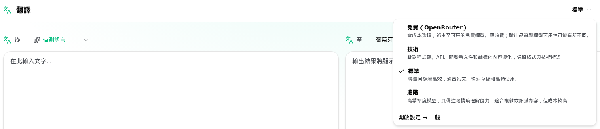

<a id="transrewrt-user-guide"></a>
# 使用者指南

<br/>

<a id="introduction"></a>
## 簡介

Transrewrt 可協助您以三種主要方式處理文字：

- **翻譯** - 將文字從一種語言轉換為另一種語言。
- **重寫** - 以不同的風格重新表述文字，例如更清晰、更簡潔或更正式。
- **轉換** - 使用稱為提示的自訂 AI 指示來處理文字。

預設情況下，應用程式以 **簡易** 模式運行：您可以在設定中選擇一個 **預設設定**（例如 免費（OpenRouter）、標準、進階或技術）和一個 **供應商**，而無需選擇模型 ID。如果您想要從 [**設定** > **模型**](#models) 中獲得經典模型列表，請切換到 **進階** 模式，方法是前往 [**設定** > **一般設定**](#general-settings)。

<br/>

本指南說明應用程式安裝並執行後的使用方式。安裝步驟請參閱主 [**README**](README.zh-TW.md)。

<br/>

> ℹ️ **注意**<br/>
> Transrewrt 可作為 Windows 和 Linux 的桌面應用程式，以及自託管的網路應用程式使用。本指南著重於應用程式的日常使用。若僅適用於某個版本的功能，會明確標示。

<small>**以其他語言閱讀：** </small>
<small id="lang-list">[English (GB)](../USER-GUIDE.md) · [Português (Brasil)](./USER-GUIDE.pt-BR.md) · [العربية](./USER-GUIDE.ar.md) · [বাংলা](./USER-GUIDE.bn.md) · [Català](./USER-GUIDE.ca.md) · [中文 (中国大陆)](./USER-GUIDE.zh-CN.md) · [中文 (台灣)](./USER-GUIDE.zh-TW.md) · [Hrvatski](./USER-GUIDE.hr.md) · [Čeština](./USER-GUIDE.cs.md) · [Nederlands](./USER-GUIDE.nl.md) · [English (US)](./USER-GUIDE.en-US.md) · [Tagalog](./USER-GUIDE.tl.md) · [Français](./USER-GUIDE.fr.md) · [Deutsch](./USER-GUIDE.de.md) · [Ελληνικά](./USER-GUIDE.el.md) · [हिन्दी](./USER-GUIDE.hi.md) · [Magyar](./USER-GUIDE.hu.md) · [Italiano](./USER-GUIDE.it.md) · [日本語](./USER-GUIDE.ja.md) · [한국어](./USER-GUIDE.ko.md) · [Bahasa Melayu](./USER-GUIDE.ms.md) · [فارسی](./USER-GUIDE.fa.md) · [Polski](./USER-GUIDE.pl.md) · [Basa Jawa](./USER-GUIDE.jv.md) · [Português](./USER-GUIDE.pt.md) · [ਪੰਜਾਬੀ](./USER-GUIDE.pa.md) · [Română](./USER-GUIDE.ro.md) · [Русский](./USER-GUIDE.ru.md) · [Slovenčina](./USER-GUIDE.sk.md) · [Español](./USER-GUIDE.es.md) · [Kiswahili](./USER-GUIDE.sw.md) · [Svenska](./USER-GUIDE.sv.md) · [తెలుగు](./USER-GUIDE.te.md) · [ไทย](./USER-GUIDE.th.md) · [Türkçe](./USER-GUIDE.tr.md) · [Українська](./USER-GUIDE.uk.md) · [Tiếng Việt](./USER-GUIDE.vi.md)</small>

<small>

> **關於介面與文件翻譯的說明：** 除原始英文（英國）外，
> 所有介面語言皆由 AI 模型翻譯，用詞可能不精確或含有錯誤。

</small>

<br/>

<!-- START doctoc generated TOC please keep comment here to allow auto update -->
<!-- DON'T EDIT THIS SECTION, INSTEAD RE-RUN doctoc TO UPDATE -->
**目錄**

- [開始之前](#before-you-start)
  - [如何取得免費的 OpenRouter API 金鑰（桌面應用程式）](#how-to-get-a-free-openrouter-api-key-desktop-app)
- [快速入門](#getting-started)
- [視窗的主要部分](#main-parts-of-the-window)
  - [側邊欄](#sidebar)
  - [工具列](#toolbar)
  - [輸入與輸出面板](#input-and-output-panels)
- [翻譯](#translate)
  - [翻譯文字](#translate-text)
  - [語言選擇](#language-selection)
  - [實用的翻譯設定](#helpful-translation-settings)
- [重寫](#rewrite)
- [轉換](#transform)
  - [執行現有的提示](#run-an-existing-prompt)
  - [如果您還沒有提示](#if-you-have-no-prompts-yet)
  - [快速建立提示](#create-a-prompt-quickly)
  - [編輯提示](#edit-a-prompt)
  - [使用前測試提示](#test-a-prompt-before-using-it)
- [儀表板](#dashboard)
  - [篩選資料](#filter-the-data)
  - [儀表板分頁](#dashboard-tabs)
  - [匯出資料](#export-data)
  - [刪除某模型的儲存記錄](#delete-stored-records-for-a-model)
- [歷史記錄](#history)
  - [篩選歷史記錄](#filter-the-history)
  - [匯出歷史記錄資料](#export-history-data)
- [設定](#settings)
  - [一般設定](#general-settings)
  - [模型](#models)
  - [語言](#languages)
  - [成本追蹤](#cost-tracking)
  - [轉換 (設定分頁)](#transform-settings-tab)
  - [使用者](#users)
  - [API 設定](#api-config)
  - [關於](#about)
- [常見問題](#common-issues)
  - [應用程式無法翻譯、重寫或轉換文字](#the-app-will-not-translate-rewrite-or-transform-text)
  - [模型清單為空](#the-model-list-is-empty)
  - [結果太慢或成本太高](#the-result-is-too-slow-or-too-expensive)
  - [介面語言錯誤](#the-interface-is-in-the-wrong-language)
  - [文字太小或難以閱讀](#the-text-is-too-small-or-hard-to-read)
  - [儀表板摘要看起來是空的](#dashboard-summary-looks-empty)
  - [成本顯示「不可用」或似乎有誤](#cost-shows-not-available-or-seems-wrong)
  - [總成本與供應商帳單不符](#total-cost-does-not-match-my-provider-bill)
  - [側邊欄中缺少歷史記錄頁面](#the-history-page-is-missing-from-the-sidebar)
  - [網路應用程式：意外被重新導向至登入頁面](#web-app-redirected-to-the-login-page-unexpectedly)
  - [網路管理員：忘記或遺失密碼](#web-admin-forgot-or-lost-a-password)
  - [儀表板未顯示其他使用者的資料（網路版）](#dashboard-shows-no-data-for-other-users-web)
  - [我變更提示後遺失編輯內容](#i-changed-a-prompt-and-lost-the-edits)
- [快速提示](#quick-tips)
- [免責聲明](#disclaimer)
- [授權](#license)

<!-- END doctoc generated TOC please keep comment here to allow auto update -->

<br/><br/>

<a id="before-you-start"></a>
## 開始之前

若要使用 Transrewrt，您至少需要一個 AI 供應商的存取權限。支援的供應商包括：[OpenRouter](https://openrouter.ai)（整合多種模型）、OpenAI、Anthropic、Google Gemini、DeepSeek、Groq、Mistral、xAI、Cerebras，以及用於本機模型的 [Ollama](https://ollama.com)。

您不需要選擇付費模型即可開始使用。只要新增 OpenRouter API 金鑰，應用程式就會自動啟用內建的 **免費** OpenRouter 選項，讓您立即開始翻譯、重寫和轉換文字。或者，您也可以從 Cerebras、Google、Groq 或 Mistral AI 取得免費的 API 金鑰。

簡單來說：

- 在 **簡易** 模式中，**預設設定**（例如「免費 (OpenRouter)」、「標準」、「進階」或「技術」）會根據您選擇的 **供應商**（如 OpenRouter、OpenAI、Ollama 等）對應到特定模型。只有當前供應商支援的預設設定才會顯示於工具列中。您可在「翻譯」、「重寫」和「轉換」時選擇預設設定。
- 在 **進階** 模式中，**模型** 是您直接選取的 AI 引擎。模型 ID 會使用 **供應商前綴**（例如 `openrouter/…`、`openai/…`、`ollama/…`）。
- **API 金鑰**（或針對 Ollama 的 **基礎 URL**）是應用程式連接該供應商的方式。

如果您使用的是 **桌面應用程式**，請在 [**設定** > **API 設定**](#api-config) 中為您使用的每個供應商新增金鑰。若僅使用 OpenRouter，請參閱下方的 [如何取得免費的 OpenRouter API 金鑰](#how-to-get-a-free-openrouter-api-key-desktop-app)。如果您不想使用 API 金鑰，也可以安裝 Ollama（來自 [ollama.com](https://ollama.com)）並改用本機模型，例如 `translategemma:4b`。

如果您使用的是 **網頁版**，伺服器管理員會透過環境變數設定供應商，因此您無法直接在應用程式中輸入 API 金鑰。

<br/>

<a id="how-to-get-a-free-openrouter-api-key-desktop-app"></a>
### 如何取得免費的 OpenRouter API 金鑰（桌面應用程式）

如果您使用的是桌面應用程式，請依照以下步驟操作：

1. 在您的網頁瀏覽器中前往 [OpenRouter](https://openrouter.ai)。
2. 建立帳號或登入。
3. 開啟 [Keys](https://openrouter.ai/keys) 頁面。
4. 按一下按鈕建立新的 API 金鑰。
5. 為金鑰命名，以便日後識別。
6. 複製新的 API 金鑰。
7. 返回 Transrewrt 並開啟 **設定** > **API 設定**。
8. 將金鑰貼到 **OpenRouter API 金鑰** 中（位於 **設定** > **API 設定**）。
9. 按一下 **測試 OpenRouter 金鑰** 以確認其正常運作。

<br/><br/>

<a id="getting-started"></a>
## 開始使用

如果您是第一次使用 Transrewrt，請依照以下順序操作：

1. 開啟應用程式。
2. 如有需要，從地球圖示選擇您的 **介面語言**。
3. 如果您使用的是 **桌面應用程式**，請開啟 [**設定** > **API 設定**](#api-config)，為至少一個供應商新增 API 金鑰（例如 OpenRouter），然後點選 **測試** 以確認其正常運作。
4. 開啟 [**設定** > **一般設定**](#general-settings)。在 **簡易** 模式（預設）下，選擇一個已設定金鑰的 **供應商**。在 **進階** 模式下，請開啟 [**設定** > **模型**](#models) 並在 **已選取的模型** 中新增一個或多個模型。
5. 在 **翻譯** 時，於工具列中選擇 **預設設定**（簡易）或 **模型**（進階）。
6. 開啟 [**設定** > **語言**](#languages) 並選擇您的 **常用語言**，讓最常使用的語言優先顯示。
7. 執行一次簡單的翻譯以確認一切正常，然後再嘗試 **重寫** 和 **轉換**。

此順序至關重要。它可避免最常見的初次使用問題：在應用程式尚未建立有效的 API 連線或尚未選擇預設設定／模型前就嘗試執行任務。

<br/><br/>

<a id="main-parts-of-the-window"></a>
## 視窗的主要部分

應用程式分為三個主要區域：

- 左側的 **側邊欄**。
- 頂部的 **工具列**。
- 中央的 **工作區域**。

<br/>

<a id="sidebar"></a>
### 側邊欄

使用側邊欄在應用程式中導覽。您可以點擊應用程式圖示旁的按鈕來收合側邊欄，以獲得更多空間。

<br/>

<table>
  <tr>
    <td valign="top">
       
    </td>
    <td valign="top">
      <br/><br/>
      <ul>
        <li><strong>翻譯</strong>會開啟翻譯工作區。</li><br/>
        <li><strong>重寫</strong>會開啟重寫工作區。</li><br/>
        <li><strong>轉換</strong>會開啟自訂提示工作區。</li><br/>
        <li><strong>儀表板</strong>會顯示使用量與成本資訊。</li><br/>
        <li><strong>設定</strong>會開啟設定面板。</li><br/>
        <li><strong>歷史記錄</strong>會顯示包含輸入與輸出文字的使用歷史。</li><br/>
        <li><strong>使用者</strong>會顯示已登入使用者的使用者名稱（僅限網頁版）。</li>
      </ul>
    </td>
  </tr>
</table>

<br/>

<a id="toolbar"></a>
### 工具列

工具列會根據您在應用程式中的位置而略有不同。

- 左側顯示目前頁面的名稱。
- 右側顯示 **預設設定或模型選擇器** 以及 **介面語言** 控制項。

在 **簡易** 模式中，工具列會顯示一個 **預設設定選擇器**，內含內建的 **免費 (OpenRouter)**、**標準**、**進階** 和 **技術** 預設設定。實際顯示的預設設定取決於您在 [**設定** > **一般設定**](#general-settings) 中選擇的 **供應商** — 例如，只有當供應商設定為 OpenRouter 時，才會列出 **免費 (OpenRouter)**。若 **供應商** 為 **Ollama**，工具列將改為列出您本機安裝的模型，而非預設設定。

在 **進階** 模式中，**模型選擇器** 可讓您選擇用於目前任務的 AI 引擎。



在進階模式中，某些免費模型可能並非隨時可用——它們可能離線或已達到使用上限。應用程式可能會自動從您的清單中移除該模型。若要控制哪些模型顯示，請前往 [**設定** > **模型**](#models)。您可以在工具列中，點選模型名稱左側的供應商圖示來開啟模型設定。

<br/>

使用 **地球圖示 + 語言代碼** 可變更應用程式的介面語言（例如選單和按鈕）。這 **不會** 改變 **翻譯** 功能中使用的翻譯語言。


<br/>

<a id="input-and-output-panels"></a>
### 輸入與輸出面板

大多數工作區都使用左側的 **輸入** 面板和右側的 **輸出** 面板。

每個面板還會顯示以下資訊：

| **輸入**                                                          | **輸出**                                                                                                                  |
|--------------------------------------------------------------------|-----------------------------------------------------------------------------------------------------------------------------|
| - 字元數 <br/>- 字數 <br/>- 段落數   <br/> | - 工作耗時<br/>- **TPS** (每秒 tokens 數)<br/>- 字元、字數與段落數<br/>- 使用的模型 |

如果您對這些技術術語感到疑惑：

- **token** 指的是文字的小片段，可視為單字的一部分或一個短詞。
- **TPS** 表示模型每秒處理了多少個這樣的文字片段。

<br/>

您也可以在 [**設定** > **一般設定**](#general-settings) 啟用 `Show cost information on the actions` 選項，以監控每次操作的成本（若可用）以及總成本。

<br/><br/>

[--------------------------------------------------------------------------------------------------------------------------]: #

<a id="translate"></a>
## 翻譯

當您想將文字從一種語言轉換為另一種語言時，請使用 **翻譯**。


<br/>

<a id="translate-text"></a>
### 翻譯文字

1. 開啟 **翻譯**。
2. 在 **從** 中選擇一種語言。
3. 在 **至** 中選擇一種語言。
4. 在工具列中選擇預設設定（簡易）或模型（進階）。
5. 在 **輸入**中輸入或貼上文字。
6. 按一下 **翻譯**。
7. 在 **輸出**中閱讀結果。
8. 如果要複製結果，請使用複製按鈕。

<br/>

<a id="language-selection"></a>
### 語言選擇

- **從** 可以是特定語言或 **偵測語言**。
- **到** 是您希望結果輸出的語言。

您選取的 **常用語言** 會出現在清單頂端。您可以在 [**設定** > **語言**](#languages) 中設定這些語言。

<br/>

<a id="helpful-translation-settings"></a>
### 有用的翻譯設定

在 [**設定** > **一般設定**](#general-settings) 中，您可以變更翻譯的運作方式：

- **貼上時自動翻譯**：當您貼上文字時，立即執行翻譯。
- **自動複製結果到剪貼簿**：成功執行後自動複製結果。
- **即時翻譯（輸入時）**：當您在輸入時即執行翻譯。
- **逾時時間（毫秒）**：控制應用程式在執行即時翻譯前等待的時間長度。
- **ENTER 鍵行為** 控制按下 `Enter` 時的動作：
  - **Enter** 執行翻譯或重寫（預設）。
  - **Shift + Enter** 執行翻譯或重寫；單獨按下 **Enter** 則插入新行。

[--------------------------------------------------------------------------------------------------------------------------]: #

<a id="rewrite"></a>
## 重寫

當您想要改善文字措辭但不改變主要意義時，請使用 **重寫**。


這對於以下情況很有用：

- 修正拼字與文法（**檢查拼字與文法**）
- 提升文字清晰度（**提升清晰度**）
- 一次產生多種不同改寫版本（**其他版本**）
- 將文字改為更正式或更非正式語氣（**改為正式語氣** / **改為非正式語氣**）
- 縮短或擴展文字（**縮短** / **擴展**）
- 讓文字聽起來更具專業性（**改為專業術語**）

<br/>

> 💡 **提示**<br/>
> 當您使用「**檢查拼字與文法**」模式時，輸出面板中會出現一個 **顯示變更** 切換開關（位於 **複製** 旁）。
> 打開或關閉此開關，以顯示或隱藏套用至您文字的具體修正內容。

<br/><br/>

[--------------------------------------------------------------------------------------------------------------------------]: #

<a id="transform"></a>
## 轉換

當您希望 AI 遵循自訂指示時，請使用 **轉換**。


這是應用程式中最靈活的功能區域。您可以將其用於以下任務：

- 摘要筆記
- 將草稿文字轉為精緻的電子郵件
- 提取重點
- 將文字轉換為特定格式
- 對輸入文字執行任何其他自訂操作

<br/>

<a id="run-an-existing-prompt"></a>
### 執行現有的提示

1. 開啟 **轉換**。
2. 從提示列表中選擇一個提示。
3. 如果出現 **目標**語言欄位，請選擇您想要的語言。
4. 在 **輸入**區域中輸入或貼上文字。
5. 按一下 **轉換**。
6. 在 **輸出**區域中閱讀結果。

<br/>

<a id="if-you-have-no-prompts-yet"></a>
### 如果您還沒有提示

如果您的提示列表是空的，請在轉換工作區中點選 **載入範例提示**。相同的控制項也始終可在 [**設定** > **轉換**](#transform-settings) 的匯出/匯入列中找到。兩者都會加入內建範例，讓您能快速開始。

<br/>

> ℹ️ **注意**<br/>
> 範例提示是以英文提供。載入後，您可以編輯提示並使用 **翻譯提示** 將其翻譯成您的語言。

<br/>

<a id="create-a-prompt-quickly"></a>
### 快速建立提示

建立提示的最快方式為：

1. 按一下 **新提示**。
2. 按一下 **產生提示**。
3. 描述您希望提示執行的任務。
4. 選擇預設設定（簡易）或模型（進階）。
5. 讓應用程式為您建立草稿。
6. 檢閱草稿後按一下 **儲存**。


<br/>

<a id="edit-a-prompt"></a>
### 編輯提示

當您建立或編輯提示時，編輯器會出現在左側，測試區域會出現在右側。


主要欄位包括：

- **提示名稱**：顯示於提示列表中的名稱。
- **提示說明（選填）**：執行提示時顯示給使用者的簡短提示。
- **模型角色**：指派給 AI 的整體角色，例如「你是一個樂於助人的助手。」
- **模型說明（每行一項）**：您希望 AI 遵循的具體規則。
- **輸出描述**：用以簡短描述結果的詞語，例如「摘要」或「重寫」。
- **溫度 (0.0 → 1.0)**：模型的行為方式；詳見下方說明。
- **詢問目標語言**：執行提示時會加入目標語言選擇器。

如果您不熟悉技術術語 **溫度**，可以這樣理解：

- **較低**的溫度會產生更穩定、更可預測的結果。
- **較高**的溫度會產生更多樣化和更具創造力的結果。

您也可以使用：

- `Generate prompt` 根據簡短描述建立新草稿
- `Improve prompt` 精修現有提示
- `Translate prompt` 翻譯提示欄位

<br/>

> ⚠️ **警告**<br/>
> 請先按一下 `Save`，再按 `Back to Run`。如果您未儲存就返回，變更將會遺失。

<br/>

<a id="test-a-prompt-before-using-it"></a>
### 在使用前測試提示

右側的測試面板可讓您在日常工作中使用提示之前，先用範例文字進行測試。

當您在以下情況時非常有用：

- 正在建立新提示
- 正在比較兩個版本的提示
- 想要檢查語氣、長度或輸出格式

<br/>

> ℹ️ **注意**<br/>
> 您可以在 [**設定** > **轉換**](#transform-settings) 匯出和匯入已儲存的提示。

當您在提示編輯器中使用 **產生提示**、**改善提示** 或 **翻譯提示** 時，**簡易** 模式會提供與「翻譯」和「重寫」相同的預設設定選擇器；而 **進階** 模式則使用模型清單。

<br/><br/>

[--------------------------------------------------------------------------------------------------------------------------]: #

<a id="dashboard"></a>
## 儀表板

使用 **儀表板** 可查看您使用此應用程式的程度以及相關成本（適用於付費模型）。


<br/>

> ℹ️ **注意**<br/>
> 如果您只使用 **免費** 模型，**成本** 數值可能為零，且以成本為主的 KPI 可能看起來是空的。當您在所選期間內有活動時，**摘要** 分頁仍會顯示翻譯、重寫和轉換的呼叫次數。

<br/>

<a id="filter-the-data"></a>
### 篩選資料

使用頂部的篩選按鈕來變更時間範圍。


<br/>

> ℹ️ **注意**<br/>
> **使用者** 篩選器僅在 Web 版本中對管理員可見。一般使用者不會看到此篩選器，且該功能在桌面應用程式中不可用。

<br/>

<a id="dashboard-tabs"></a>
### 儀表板分頁

- **摘要** 會顯示 KPI 卡片：總成本、使用的模型、各模式的呼叫次數與成本（佔總呼叫次數的比例）、每次呼叫的平均成本、平均 TPS，以及呼叫次數最多的前三個模型。
- **依模型** 會列出每個模型的總呼叫次數、總成本和平均 TPS；展開列可查看翻譯、重寫和轉換的細項。
- **所有呼叫** 會顯示完整的呼叫記錄（寬版面為分頁顯示，窄螢幕為卡片顯示），並允許您匯出。

<br/>

<a id="export-data"></a>
### 匯出資料

儀表板表格可將資料匯出為：

- **JSON**
- **CSV**
- **XLSX**

若您希望在應用程式外檢視活動記錄或分享報告，此功能將非常實用。

<br/>

<a id="delete-stored-records-for-a-model"></a>
### 刪除某模型的儲存記錄

在 **依模型** 或 **所有呼叫** 中，您可以點擊「垃圾桶」圖示來移除某模型的儲存記錄。

> ⚠️ **警告**<br/>
> 刪除儲存記錄無法復原。僅當您確定不再需要該歷史記錄時才使用此功能。

若要刪除所有資料或根據資料的建立時間刪除記錄，請前往 [**設定** > **成本追蹤**](#cost-tracking)。在該處，您可選擇刪除所有儲存的資料，或僅刪除早於特定日期的資料。

<br/><br/>

[--------------------------------------------------------------------------------------------------------------------------]: #

<a id="history"></a>
## 歷史記錄

按一下 **歷史記錄**，查看您在 **Transrewrt** 內執行的各項操作的歷史，包括每次操作的輸入與輸出內容。


<br/>

<a id="filter-the-history"></a>
### 篩選歷史記錄

**歷史記錄** 使用與 **儀表板** 頁面相同的時間範圍篩選器。


<br/>

> ℹ️ **注意**<br/>
> 在 **網頁應用程式** 中，每個人（包括管理員）都只能看到自己的執行歷史。**儀表板** 上的 **使用者** 篩選器是供管理員審查各帳戶的使用情況與成本；它不適用於 **歷史記錄**。

<br/>

<a id="export-history-data"></a>
### 匯出歷史記錄資料

歷史記錄頁面可將篩選後的資料匯出為以下格式：

- **JSON**
- **CSV**
- **XLSX**

若您希望在應用程式外檢視活動記錄或分享報告，此功能將非常實用。

<br/><br/>

[--------------------------------------------------------------------------------------------------------------------------]: #

<a id="settings"></a>
## 設定

從側邊欄開啟 **設定**，自訂應用程式的行為方式。

可用的標籤頁取決於您使用的平台以及您的角色：

| 索引標籤              | 桌面版 | 網頁版 (管理員) | 網頁版 (一般使用者) | 備註                                        |
  |------------------|:-------:|:-----------:|:------------------:|----------------------------------------------|
  | 一般設定 |   是   |     是     |        是         | 包含 **AI 體驗** (簡易 / 進階) |
  | 模型           |   是   |     是     |        是         | 僅當 **AI 體驗** 為 **進階** 時顯示 |
  | 語言         |   是   |     是     |        是         | |
  | 成本追蹤     |   是   |     是     |         -          | |
  | 轉換         |   是   |     是     |        是         | 大量匯入/匯出轉換提示 |
  | 使用者             |    -    |     是     |         -          | |
  | API 設定        |   是   |     是     |         -          | |
  | 關於             |   是   |     是     |        是         | |

在 **簡易** 模式中，模型選擇是透過工具列中的預設設定和「一般設定」中的 **供應商** 來完成；**模型** 分頁會被隱藏。

<br/>

> ℹ️ **注意**<br/>
> 在網頁版本中，每位使用者都有各自的設定。諸如 AI 體驗、供應商、已選取的模型或預設設定、語言、一般選項與轉換提示等設定皆為個別儲存。您所做的變更不會影響其他使用者。

<br/>

[--------------------------------------------------------------------------------------------------------------------------]: #

<a id="general-settings"></a>
### 一般設定

使用 **一般設定** 來控制輸入行為、是否儲存執行詳細資料至 **歷史記錄**、外觀，以及您選擇用於翻譯、重寫和轉換的 AI 方式。

**AI 體驗**

- **簡易**（預設）：選擇 **供應商**（OpenRouter、OpenAI、Anthropic、Google Gemini、DeepSeek、Groq、Mistral、xAI、Cerebras 或 Ollama）。雲端供應商會使用工具列中的內建預設設定。**Ollama** 則會列出您機器上安裝的本機模型以取代預設設定。在簡易模式中，**預設設定目錄** 會顯示目錄版本與上次更新時間；點選 **重新整理預設設定目錄** 可從專案儲存庫取得最新的預設設定清單（應用程式也會在背景定期自動檢查更新）。
- **進階**：在工具列中選擇個別模型；並在 [**設定** > **模型**](#models) 中管理模型清單。

在 **網頁應用程式** 中，顯示的供應商取決於伺服器環境中設定的 API 金鑰。在 **桌面應用程式** 中，請於 [**API 設定**](#api-config) 下設定金鑰。

**行為**

- **ENTER 鍵行為** 可選擇 `Enter` 是執行任務還是插入新行。
- **貼上時自動翻譯** 在您貼上文字後立即開始翻譯。
- **自動複製結果到剪貼簿** 會自動複製成功的結果。
- **即時翻譯（輸入時）** 在您輸入的同時進行翻譯。
- **逾時時間（毫秒）** 設定即時翻譯的等待時間。

**歷史**

- **保留執行歷史** 控制每次翻譯、重寫和轉換是否儲存 **輸入和輸出文字** 以供側邊欄的 [**歷史記錄**](#history) 檢視。關閉此功能時會要求確認；若確認，儲存的歷史文字將從資料庫中移除。如果標籤顯示 *已由管理員停用*，表示您的安裝環境中已設定 `HISTORY_DISABLED`（請參閱 [README](README.zh-TW.md#configuration-and-environment)）；您無法從使用者介面重新啟用歷史記錄。
- **刪除歷史資料** 可讓您依時間（例如幾個月前，或 **所有資料（清除）**）使用 **刪除資料** 移除儲存的文字。這只會影響 **歷史記錄** 檢視中儲存的執行文字；**不會** 刪除成本或使用量總計。若要移除或修剪 **成本** 資料，請使用 [**設定** > **成本追蹤**](#cost-tracking)。

**外觀**

- **主題** 可在淺色、深色及系統外觀之間切換。
- **在動作上顯示成本資訊** 可控制是否顯示每次操作的成本（若可用）以及「翻譯」、「重寫」和「轉換」輸出面板上的總成本。
- **成本小數位數** 可調整成本小數點的顯示方式。
- **僅限網頁版：** **在應用程式周圍顯示邊距** 會在介面周圍增加額外空間。
- **字型** 變更文字面板中的書寫字型。
- **大小** 變更字型大小。

**設定備份**（僅限桌面應用程式與網頁管理員）

- **在備份中包含使用資料** — 啟用後，ZIP 檔案還會包含執行歷史和 API 呼叫資料。
- **備份設定** — 建立單一 ZIP 檔案（預設為 UTC 時間的 `transrewrt-config-backup-YYYY-MM-DD_HHMMSS.zip`），內容包含 `config.json`、`state.json`、選擇性加密金鑰、使用者、偏好設定、自訂提示，以及若您選擇包含的使用資料。備份成功後，確認畫面會顯示已儲存的檔案名稱。
- **從備份還原** — 首先會開啟 **確認對話框**。在對話框中選擇備份 ZIP 檔案（**瀏覽** / 檔案選擇器，或在支援的環境中拖放），然後檢視選項：
  - **還原使用資料** — 當備份 ZIP 包含使用資料時，匯入備份當時的使用/歷史資料；若您僅想還原設定和提示，請勿勾選。
  - **還原前清除舊的使用資料** — 在套用備份前，先移除本機安裝的現有使用/歷史資料（可選；當您希望完全取代時使用）。

在網頁版或桌面版建立的備份皆可在另一版本中還原。當您在網頁版中還原桌面版備份時，資料將會還原至管理員使用者。

<br/>

<a id="models"></a>
### 模型

只有當在 [**一般設定**](#general-settings) 中將 **AI 體驗** 設定為 **進階** 時，此分頁才會顯示。請使用 **設定** > **模型** 來選擇工具列中要顯示的模型。


此頁面有兩個清單：

- 左側的 **可用模型**
- 右側的 **已選取的模型**

包含以下實用控制項：

- **搜尋模型...** 依名稱尋找模型
- **供應商** 標籤可將清單縮小至單一引擎（OpenRouter、OpenAI、Ollama 等）
- **僅限免費** 以僅顯示免費模型
- **重新整理** 以重新載入清單
- 當您依供應商排序時，可使用 **展開全部** 和 **收合全部**

模型 ID 包含供應商前綴（例如 `openrouter/…` 與 `openai/…`）。徽章如 **OpenAI (OpenRouter)** 與 **OpenAI (直接)** 顯示流量的路由方式。

> ℹ️ **注意**<br/>
> **OpenRouter Body Builder** (`openrouter/bodybuilder`) 是路由器模型，而非一般聊天模型：其回應為描述 OpenRouter API 請求主體的 JSON（例如包含 `requests` 和 `model` 的 `messages` 陣列）。若您將其用於 **翻譯**、**重寫** 或 **轉換**，輸出面板將顯示該 JSON 而非完成的文字。執行這些任務時，請選擇一般文字模型。詳情請見 OpenRouter 上的 [Body Builder 模型頁面](https://openrouter.ai/openrouter/bodybuilder)。

操作：

- 若要新增模型，請點選 **新增** 或任一項目中的任意位置。

- 若要移除模型，請點選 **Selected Models** 中該模型旁的 **X**，或在「可用模型」清單中點選項目上的 **已選取**。

- 若要清除清單，請點選 **取消全部選取**。必要的免費模型將保留在清單中。

<br/>

> ℹ️ **注意**<br/>
> 如果您不希望立即為 OpenRouter 帳戶添加信用額度，可先啟用 **僅限免費** 並選擇免費模型（無需信用卡）。您也可以使用 Ollama 在本機執行模型，無需任何 API 金鑰。

<br/>

<a id="languages"></a>
### 語言

使用 **設定** > **語言** 來管理應用程式中使用的語言清單。

- **常用語言** 會固定在 **翻譯** 和 **轉換** 中語言清單的頂端。
- **自訂語言** 可讓您新增內建清單中沒有的語言。

若您新增自訂語言，它將與內建選項一同出現在語言選擇器中。

<br/>

<a id="cost-tracking"></a>
### 成本追蹤

使用 **設定** > **成本追蹤** 來管理成本資訊。

- **總成本** 顯示累計總額。
- **複製數值** 將總額複製到剪貼簿。
- **重設成本** 將儲存的總額重設為零。
- **與 API 金鑰使用情況同步** 會將總額設定為與 OpenRouter 帳戶報告的使用量相符（僅限 OpenRouter）。
- **API 金鑰使用情況** 會顯示 OpenRouter 的使用詳細資料（若可用）。
- **刪除成本資料** 可移除所有資料，或僅移除早於指定日期的資料。

**成本追蹤：** 當您使用 OpenRouter 模型時，應用程式會根據 OpenRouter 提供的成本資訊顯示實際使用量與花費。對於其他所有供應商，應用程式會使用 OpenRouter 公布的價格來估算成本；若無可用價格，估算值可能為零。

<br/>

> ℹ️ **注意**<br/>
>  **所有成本數值僅供您參考，並非正式帳單。**

<br/>

> ⚠️ **警告**<br/>
> 資料刪除後無法復原。刪除前，請務必備份資料或透過 [**歷史記錄**](#history) 
> 或 [**儀表板** > **所有呼叫**](#dashboard-tabs) 匯出，否則資料將永久遺失。
> 每筆 API 呼叫相關的所有輸入/輸出歷史也將一併刪除。

<br/>

<a id="transform-settings"></a>
### 轉換（設定分頁）

使用 **設定** > **轉換** 來批次管理提示。

您可以：

- 檢視已儲存的提示
- 刪除提示
- 從檔案匯入提示
- 匯出提示以備份或分享
- 將範例提示載入提示清單中

<br/>

<a id="users"></a>
### 使用者

使用 **使用者** 可在 Web 版本中管理使用者帳戶。您可以新增使用者、更新其詳細資料、重設密碼以及刪除帳戶。

<br/>

<a id="api-config"></a>
### API 設定

支援的供應商包括：OpenRouter、OpenAI、Anthropic、Google Gemini、DeepSeek、Groq、Mistral、xAI、Cerebras，以及 **Ollama**（透過基底 URL 使用本機模型）。您只需設定您要使用的供應商。

**Web 應用程式：僅限管理員**

API 金鑰是透過系統或 Docker 環境變數進行設定的 — 不需在 Web UI 中輸入。此頁面會顯示哪些供應商已設定金鑰，並讓您透過點擊 `Test` 按鈕來測試每一個。

<br/>

> ℹ️ **注意**<br/>
> 若要變更 API 金鑰，請更新系統或 Docker 設定中的環境變數，並重新啟動伺服器或容器。

<br/>

> ℹ️ **注意**<br/>
> **設定備份**（請參閱 [**一般設定** → 設定備份](#general-settings)）可將 **已解析**的供應商金鑰嵌入 ZIP 檔案中的 `config.json`。還原該 ZIP 檔案時，**不會**將這些金鑰複製回伺服器的永久儲存設定檔中 — 實際的金鑰仍來自環境變數及現有的檔案狀態，如該處所述。

<br/>

**桌面應用程式**

使用 **API 設定** 儲存您所使用之每個供應商的 API 金鑰。對於 Ollama，請輸入 **基底 URL** 而非 API 金鑰。

<br/>

> 💡 **提示** <br/>
> 如果您不想使用 API 金鑰或支付費用，可以 [下載 Ollama](https://ollama.com) 並在您的機器上免費執行模型（例如 `translategemma:4b`）。或者，您也可以建立一個免費的 OpenRouter 帳戶（無需信用卡）來使用他們的免費模型，或從 Cerebras、Google、Groq 或 Mistral AI 取得免費的 API 金鑰。

<br/>

- 僅新增您需要的供應商。在 **設定** > **模型** 中，每個模型 ID 都以供應商名稱開頭（例如 `openrouter/openrouter/free`、`openai/gpt-4o`、`ollama/llama3`）。

要新增 API 金鑰，請在文字欄位中輸入值，然後點擊 `Save`。要取代現有的金鑰，請點擊 `Edit`。要驗證金鑰是否有效，請點擊 `Test`。對於 Ollama 基底 URL，請務必點擊 `Test` 來檢查連線。

<br/>

> ℹ️ **注意**<br/>
> 您無法檢視目前的 API 金鑰值。您只能使用 `Edit` 按鈕來取代它。
> API 金鑰會以加密方式儲存在設定中。

<br/>

<a id="about"></a>
### 關於

**關於**分頁顯示：

- 應用程式名稱和標語
- 版本號碼與建置日期
- 授權與版權資訊，並提供連結以開啟 **第三方聲明**
- 專案儲存庫的連結

<br/><br/>

<a id="common-issues"></a>
## 常見問題

如果某些功能未如預期運作，請先檢查以下項目。

<br/>

<a id="the-app-will-not-translate-rewrite-or-transform-text"></a>
### 應用程式無法翻譯、重寫或轉換文字

請檢查：

- 您已在工具列中選擇 **預設設定**（簡易）或 **模型**（進階）
- 在 **簡易** 模式中，[**設定** > **一般設定**](#general-settings) 已設定 **供應商**，且擁有有效的金鑰（或 Ollama URL），以及至少一個該供應商的預設設定
- 在 **進階** 模式中，[**設定** > **模型**](#models) 中至少列出一個模型
- 您的 API 設定運作正常

如果您使用的是桌面應用程式：

1. 開啟[**設定** > **API 設定**](#api-config)。
2. 確認至少已儲存一個 API 金鑰。
3. 點選供應商旁邊的**測試**，以確認金鑰正常運作。

<br/>

<a id="the-model-list-is-empty"></a>
### 模型清單為空

在 **簡易** 模式下，開啟 [**設定** > **一般設定**](#general-settings)，確認已設定 **供應商**，並在 [**API 設定**](#api-config)（桌面版）中新增或測試金鑰，或向您的管理員詢問（網頁版）。對於 **Ollama**，請對基礎 URL 執行 **測試**，並確保模型已安裝在本機。

在 **進階** 模式下，開啟 [**設定** > **模型**](#models) 並點選 **重新整理**。如有需要，搜尋模型，開啟 **僅限免費**，並將模型加入 **已選取的模型**。

<br/>

<a id="the-result-is-too-slow-or-too-expensive"></a>
### 結果產生太慢或成本過高

請嘗試以下一項或多項：

- 選擇其他預設設定（簡易）或模型（進階）
- 使用較短的輸入內容
- 在 [**設定** > **一般設定**](#general-settings) 中關閉 **即時翻譯（輸入時翻譯）**
- 對簡單任務使用免費模型（請參閱 [模型](#models)）

<br/>

<a id="the-interface-is-in-the-wrong-language"></a>
### 介面語言錯誤

點選[工具列](#toolbar)中的地球圖示，並選擇您偏好的**介面語言**。

<br/>

<a id="the-text-is-too-small-or-hard-to-read"></a>
### 文字太小或難以閱讀

開啟[**設定** > **一般設定**](#general-settings)並變更：

- **字型家族**
- **大小**

<br/>

<a id="dashboard-summary-looks-empty"></a>
### 儀表板摘要顯示為空

如果符合以下情況，這是正常的：

- 您僅使用 **免費模型**，且正在查看 **成本** 數值（可能為零）；**摘要** 上的呼叫次數 KPI 仍需選定期間的資料
- 選定的 **時間篩選** 未涵蓋實際呼叫的期間 — 請嘗試 **全部** 來檢查

如果在選取 **全部** 後 KPI 仍為零，請確認 [**歷史記錄**](#history) 或 **所有呼叫** 分頁中是否有顯示呼叫記錄。

<br/>

<a id="cost-shows-not-available-or-seems-wrong"></a>
### 成本顯示「不可用」或數值似乎有誤

當您透過 **OpenRouter** 使用模型時，應用程式會顯示 OpenRouter 報告的實際花費。

對於 **其他供應商**（如直接使用 OpenAI、Anthropic 等），成本是根據 OpenRouter 公布的定價資料估算的。若找不到對應模型的價格，成本將顯示為 **不可用**，且不會計入您的累計總額。

<br/>

<a id="total-cost-does-not-match-my-provider-bill"></a>
### 總成本與供應商帳單不符

應用程式中的所有成本數值均為 **僅供參考的估計值**，並非正式的帳單文件。

若要讓總金額更接近您實際的 OpenRouter 花費，請開啟 [**設定** > **成本追蹤**](#cost-tracking) 並點選 **與 API 金鑰使用情況同步**。

<br/>

<a id="the-history-page-is-missing-from-the-sidebar"></a>
### 側邊欄中遺失歷史記錄頁面

**保留執行歷史** 可能已關閉。請開啟 [**設定** > **一般設定**](#general-settings) 並啟用此功能，除非歷史記錄 *已由管理員停用*（環境中設定 `HISTORY_DISABLED` — 請參閱 [README](README.zh-TW.md#configuration-and-environment)）。啟用歷史記錄不會還原先前已刪除的文字。

<br/>

<a id="web-app-session-expired"></a>
### 網頁應用程式：意外被重新導向至登入頁面

您的工作階段可能已逾時，請重新登入。若此情況頻繁發生，請檢查伺服器設定中的工作階段有效期限設定。

<br/>

<a id="web-admin-forgot-or-lost-a-password"></a>
### 網頁管理員：忘記或遺失密碼

此情況適用於 **自行託管的網頁應用程式**（Docker），不適用於桌面版（Electron）應用程式。

- 如果還有其他管理員可以登入，他們可前往 [**設定** > **使用者**](#users)，選擇該帳號並在那裡設定 **新密碼**。
- 如果您 **被鎖定在外**，但仍有 **shell 存取權限** 到機器或容器，可使用映像內附的工具重設密碼（若您更改了預設名稱，請替換 `transrewrt`；若密碼包含空格或特殊字元，請加上引號）：

```bash
docker exec transrewrt reset-web-password '<username>' '<new-password>'
```

若您未曾建立其他帳號，預設管理員使用者名稱為 `admin`。當您只傳入一個參數時，該參數將被視為 `admin` 的新密碼。

若您是從 **原始碼檢出** 運行程式而非使用 Docker，請使用：

```bash
pnpm run reset-web-password -- <username> <new-password>
```

此指令碼會更新 SQLite 資料庫中的使用者記錄（如果該使用者不存在，也可以建立 `admin` 使用者）。重設後，請使用新密碼登入。

<br/>

<a id="dashboard-shows-no-data-for-other-users"></a>
### 儀表板未顯示其他使用者的資料（網頁）

只有 **管理員**才能透過 **使用者** 篩選器檢視所有使用者的資料。一般使用者依設計僅能看見自己的活動紀錄。

<br/>

<a id="i-changed-a-prompt-and-lost-the-edits"></a>
### 我修改了一個提示但遺失了編輯內容

編輯提示時，務必先按 **儲存**，再按 **返回執行**。

<br/><br/>

<a id="quick-tips"></a>
## 快速提示

- 請先從 [**翻譯**](#translate) 開始，確認設定正常運作後，再進行 [**重寫**](#rewrite) 或 [**轉換**](#transform)。
- 使用 [**重寫**](#rewrite) 來進行日常的文字優化。
- 當你需要為特定任務建立可重複使用的流程時，請使用 [**轉換**](#transform)。
- 如果你想監控使用狀況和成本，請使用 [**儀表板**](#dashboard)。
- 使用 [**歷史記錄**](#history) 來檢視過去的操作及其完整的輸入/輸出文字。
- 若您正在建立希望保留或與他人分享的提示庫，請定期匯出提示（參見 [轉換](#transform)）。
- 除非需要細緻控制模型 ID，否則請保持在 **簡易** 模式；當您已明確知道所需模型時，再切換至 **進階** 模式。

<br/><br/>

<a id="disclaimer"></a>
## 免責聲明

產品名稱與圖示屬於其各自擁有者，僅供識別用途使用。本軟體未經任何提及品牌之授權或背書。

<br/><br/>

<a id="license"></a>
## 授權條款

版權所有 © 2026 Waldemar Scudeller Jr.

[Apache License 2.0](../LICENSE)
