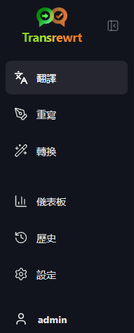
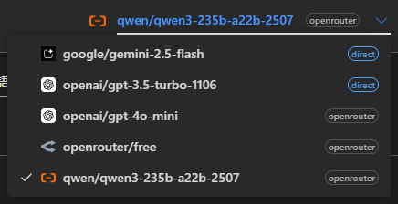
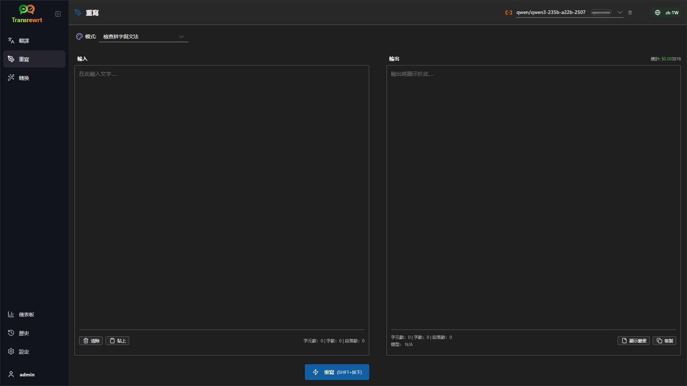
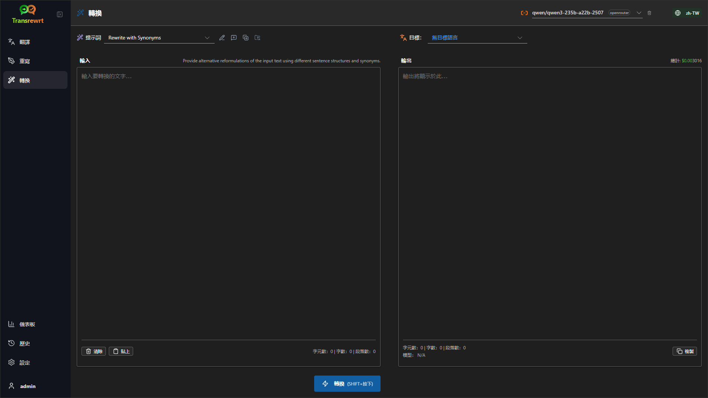
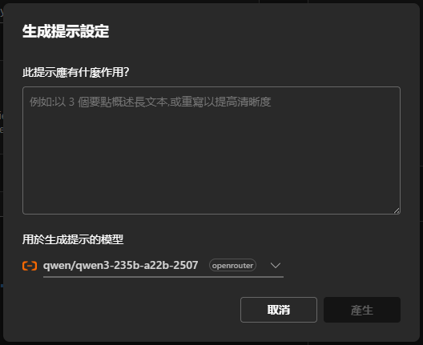

# 使用者指南

 

## 簡介

Transrewrt 可幫助您以三種主要方式處理文字：

- **翻譯** - 將文字從一種語言轉換為另一種語言。
- **改寫** - 以不同風格重新表述文字，例如更清晰、更簡短或更正式。
- **轉換** - 使用稱為提示（prompts）的自訂 AI 指令來處理文字。

 

本指南說明應用程式安裝並運行後的使用方法。安裝步驟請參閱主要的 **[README](README.zh-TW.md)**。

 

> ℹ️ **注意** 
> Transrewrt 可作為 Windows 和 Linux 的桌面應用程式，以及自架式網頁應用程式使用。本指南重點介紹應用程式的日常使用。若僅適用於其中一個版本的功能，將會明確標示。

<small>**以其他語言閱讀：** [English (UK)](USER-GUIDE.zh-TW.md) · [Português (BR)](USER-GUIDE.pt-BR.md) · [العربية](USER-GUIDE.ar.md) · [বাংলা](USER-GUIDE.bn.md) · [Català](USER-GUIDE.ca.md) · [简体中文](USER-GUIDE.zh-CN.md) · [繁體中文](USER-GUIDE.zh-TW.md) · [Hrvatski](USER-GUIDE.hr.md) · [Čeština](USER-GUIDE.cs.md) · [Nederlands](USER-GUIDE.nl.md) · [English (US)](USER-GUIDE.en-US.md) · [Filipino](USER-GUIDE.tl.md) · [Français](USER-GUIDE.fr.md) · [Deutsch](USER-GUIDE.de.md) · [Ελληνικά](USER-GUIDE.el.md) · [हिन्दी](USER-GUIDE.hi.md) · [Magyar](USER-GUIDE.hu.md) · [Italiano](USER-GUIDE.it.md) · [日本語](USER-GUIDE.ja.md) · [Basa Jawa](USER-GUIDE.jv.md) · [한국어](USER-GUIDE.ko.md) · [Bahasa Melayu](USER-GUIDE.ms.md) · [فارسی](USER-GUIDE.fa.md) · [Polski](USER-GUIDE.pl.md) · [Português (PT)](USER-GUIDE.pt.md) · [ਪੰਜਾਬੀ](USER-GUIDE.pa.md) · [Română](USER-GUIDE.ro.md) · [Русский](USER-GUIDE.ru.md) · [Slovenčina](USER-GUIDE.sk.md) · [Español](USER-GUIDE.es.md) · [Kiswahili](USER-GUIDE.sw.md) · [Svenska](USER-GUIDE.sv.md) · [తెలుగు](USER-GUIDE.te.md) · [ภาษาไทย](USER-GUIDE.th.md) · [Türkçe](USER-GUIDE.tr.md) · [Українська](USER-GUIDE.uk.md) · [Tiếng Việt](USER-GUIDE.vi.md)</small>

 

<!-- START doctoc generated TOC please keep comment here to allow auto update -->
<!-- DON'T EDIT THIS SECTION, INSTEAD RE-RUN doctoc TO UPDATE -->
**目錄**

- [開始之前](#before-you-start)
  - [如何取得免費的 OpenRouter API 金鑰（桌面應用程式）](#how-to-get-a-free-openrouter-api-key-desktop-app)
- [快速入門](#getting-started)
- [視窗主要元件](#main-parts-of-the-window)
  - [側邊欄](#sidebar)
  - [工具列](#toolbar)
  - [輸入與輸出面板](#input-and-output-panels)
- [翻譯](#translate)
  - [翻譯文字](#translate-text)
  - [語言選擇](#language-selection)
  - [實用的翻譯設定](#helpful-translation-settings)
  - [鍵盤快速鍵](#keyboard-shortcuts)
- [改寫](#rewrite)
  - [改寫文字](#rewrite-text)
- [轉換](#transform)
  - [執行現有的提示](#run-an-existing-prompt)
  - [若您尚未有提示](#if-you-have-no-prompts-yet)
  - [快速建立提示](#create-a-prompt-quickly)
  - [編輯提示](#edit-a-prompt)
  - [使用前先測試提示](#test-a-prompt-before-using-it)
  - [管理已儲存的提示](#manage-saved-prompts)
- [儀表板](#dashboard)
  - [篩選資料](#filter-the-data)
  - [儀表板分頁](#dashboard-tabs)
  - [匯出資料](#export-data)
  - [刪除某模型的儲存記錄](#delete-stored-records-for-a-model)
- [歷史記錄](#history)
  - [篩選資料](#filter-the-data-1)
  - [匯出歷史資料](#export-history-data)
- [設定](#settings)
  - [一般設定](#general-settings)
  - [模型](#models)
  - [語言](#languages)
  - [成本追蹤](#cost-tracking)
  - [轉換提示](#transform-prompts)
  - [使用者](#users)
  - [API 設定](#api-config)
  - [關於](#about)
- [常見問題](#common-issues)
  - [應用程式無法翻譯、改寫或轉換文字](#the-app-will-not-translate-rewrite-or-transform-text)
  - [模型清單為空](#the-model-list-is-empty)
  - [結果太慢或太昂貴](#the-result-is-too-slow-or-too-expensive)
  - [介面語言錯誤](#the-interface-is-in-the-wrong-language)
  - [文字太小或難以閱讀](#the-text-is-too-small-or-hard-to-read)
  - [儀表板圖表為空白](#dashboard-charts-are-empty)
  - [成本顯示「未提供」或似乎有誤](#cost-shows-not-available-or-seems-wrong)
  - [總成本與供應商帳單不符](#total-cost-does-not-match-my-provider-bill)
  - [側邊欄中遺失歷史記錄頁面](#the-history-page-is-missing-from-the-sidebar)
  - [網頁應用程式：意外重新導向至登入頁面](#web-app-redirected-to-the-login-page-unexpectedly)
  - [儀表板未顯示其他使用者資料（網頁版）](#dashboard-shows-no-data-for-other-users-web)
  - [修改提示後遺失編輯內容](#i-changed-a-prompt-and-lost-the-edits)
- [快速技巧](#quick-tips)
- [免責聲明](#disclaimer)
- [授權條款](#license)

<!-- END doctoc generated TOC please keep comment here to allow auto update -->

  

## 開始之前的準備

若要使用 Transrewrt，您必須至少能存取一個 AI 服務提供商。支援的提供商包括：[OpenRouter](https://openrouter.ai)（整合多種模型）、OpenAI、Anthropic、Google Gemini、DeepSeek、Groq、Mistral、xAI，以及用於本地模型的 [Ollama](https://ollama.com)。

開始時您不需要選擇付費模型。一旦您新增了 OpenRouter 的 API 金鑰，應用程式就會自動啟用內建的 **免費** OpenRouter 選項。這樣您就可以立即開始翻譯、重寫與轉換文字。

簡單來說：

- 一個 **模型** 是執行工作的 AI 引擎。模型會以 **供應商前綴** 列出（例如 `openrouter/…`、`openai/…`、`ollama/…`）。
- 一個 **API 金鑰**（對 Ollama 而言是 **基礎網址**）是應用程式連接到該提供商的方式。

如果您使用的是 **桌面應用程式**，請在 [**設定** > **API 設定**](#api-config) 中為您使用的每個提供商新增金鑰。若僅使用 OpenRouter，請參閱下方的 [如何取得 API 金鑰](#how-to-get-an-api-key-desktop-app)。如果您不想使用 API 金鑰，也可以從 [ollama.com](https://ollama.com) 安裝 Ollama 並使用本地模型。

如果您使用的是 **網頁版本**，伺服器管理者會透過環境變數來設定服務提供商，因此您通常不需要自行輸入 API 金鑰。

 

### 如何取得免費的 OpenRouter API 金鑰（桌面應用程式）

如果您使用的是桌面應用程式，請依照下列步驟操作：

1. 在您的網路瀏覽器中前往 [OpenRouter](https://openrouter.ai)。
2. 建立帳號或登入。
3. 開啟 [Keys](https://openrouter.ai/keys) 頁面。
4. 按一下按鈕來建立新的 API 金鑰。
5. 為金鑰命名，以便日後辨識。
6. 複製新建立的 API 金鑰。
7. 回到 Transrewrt 並開啟 **設定** > **API 設定**。
8. 將金鑰貼上至 **OpenRouter API 金鑰** 欄位中（位於 **設定** > **API 設定**）。
9. 點選 **測試 OpenRouter 金鑰** 以確認其功能正常。

 

> ℹ️ **注意** 
> 您可以使用 OpenRouter 的免費通道或其他可用的免費模型開始使用，而無需提供信用卡資料。在許多情況下，這已足夠讓您開始使用 Transrewrt，無需選擇付費模型。或者，您也可以使用 Ollama 在本地執行模型，完全不需要 API 金鑰。

  

## 開始使用

如果您是第一次使用 Transrewrt，請依照以下順序操作：

1. 開啟應用程式。
2. 如有需要，按一下地球圖示選擇您的 **介面語言**。
3. 如果您使用的是 **桌面應用程式**，請開啟 [**設定** > **API 設定**](#api-config)，為至少一個提供商新增 API 金鑰（例如 OpenRouter），並點選 **測試** 來確認它能正常運作。
4. 開啟 [**設定** > **模型**](#models) 並在 **選取的模型** 中新增一個或更多模型。
5. 開啟 [**設定** > **語言**](#languages) 並設定您的 **首選語言**，以便最常用的語言優先顯示。
6. 前往 **翻譯** 並執行簡單的翻譯，以確認一切正常運作。
7. 一旦翻譯成功，再嘗試 **重寫** 和 **轉換** 功能。

這個順序很重要。它可以避免最常見的初次使用問題：在應用程式尚未建立有效的 API 連線或尚未選取模型之前就嘗試執行任務。

  

## 視窗的主要組成部分

應用程式分為三個主要區域：

- 左側的 **側邊欄**。
- 頂部的 **工具列**。
- 中央的 **工作區**。

 

### 側邊欄

使用側邊欄可在應用程式中導覽。您可以點擊應用程式圖示旁的按鈕來收合側邊欄，以獲得更多空間。

 

<table>
  <tr>
    <td valign="top">
       
    </td>
    <td valign="top">
        
      <ul>
        <li><strong>翻譯</strong>：開啟翻譯工作區。</li> 
        <li><strong>重寫</strong>：開啟文字重寫工作區。</li> 
        <li><strong>轉換</strong>：開啟自訂提示詞工作區。</li> 
        <li><strong>儀表板</strong>：顯示使用量與成本資訊。</li> 
        <li><strong>設定</strong>：開啟設定面板。</li> 
        <li><strong>歷史記錄</strong>：顯示使用歷史，包含輸入與輸出的文字。</li> 
        <li><strong>使用者</strong>：顯示已登入使用者的使用者名稱（僅限網頁版）。</li>
      </ul>
    </td>
  </tr>
</table>

 

### 工具列

工具列會根據您在應用程式中的位置而略有不同。

- 左側顯示目前頁面的名稱。
- 右側顯示**模型選擇器**與**介面語言**控制項。

**模型選擇器**可讓您選擇用於目前任務的 AI 引擎。

  

> ℹ️ **注意** 
> 某些免費模型可能無法隨時使用 — 有時會離線或有使用上限。若發生此情況，應用程式會自動將該模型從您的可用清單中移除。 
> 若要控制出現的模型，請前往[**設定** > **模型**](#models) 並編輯您的模型清單。  
> 您也可以直接點擊工具列中模型名稱左側的供應商圖示，以直接開啟模型設定。

 

**地球圖示 + 語言代碼** 可變更應用程式的介面語言（例如選單和按鈕）。它**不會**變更**翻譯**功能中所使用的翻譯語言。

  

 

### 輸入與輸出面板

大多數工作區都使用左側的 **輸入** 面板和右側的 **輸出** 面板。

**輸入** 面板顯示：

- 字元數
- 字數
- 段落數

**輸出** 面板可顯示：

- 任務所花費的時間
- 該任務的成本（如果有）
- 您累計的總成本
- **TPS**（每秒處理的 token 數）
- 字元、字數與段落數
- 所使用的模型

如果您對技術術語感到疑惑：

- **Token** 指的是小段文字，您可以將其視為部分單字或一個短詞。
- **TPS** 指的是模型每秒處理了多少段文字。

  

[--------------------------------------------------------------------------------------------------------------------------]: # 

## 翻譯

當您想要將文字從一種語言轉換為另一種語言時，請使用 **翻譯**。

 

### 翻譯文字

1. 開啟 **翻譯**。
2. 在 **來自** 選擇一種語言。
3. 在 **翻譯成** 選擇一種語言。
4. 在工具列中選擇一個模型。
5. 在 **輸入** 區域鍵入或貼上文字。
6. 按一下 **翻譯**。
7. 在 **輸出** 區域閱讀結果。
8. 如需複製結果，請使用複製按鈕。

 

### 語言選擇

- **來自** 可以是特定語言，或是 **偵測語言**。
- **翻譯成** 是您希望結果呈現的語言。

您選定的 **首選語言** 將會出現在清單頂端。您可以在 [**設定** > **語言**](#languages) 中設定這些語言。

 

### 實用的翻譯設定

在 [**設定** > **一般設定**](#general-settings) 中，您可以變更翻譯的運作方式：

- **貼上時自動翻譯**：當您一貼上文字就會立即執行翻譯。
- **自動複製結果到剪貼簿**：成功執行後自動複製結果。
- **即時翻譯（輸入時翻譯）**：在您輸入時即時執行翻譯。
- **逾時時間（毫秒）**：控制應用程式在執行即時翻譯前等待的時間。

 

### 鍵盤快速鍵

在 [**設定** > **一般設定**](#general-settings) 中，**Enter 鍵行為** 可控制按下 `Enter` 時的動作：

- **Enter** 可執行任務，**Shift+Enter** 可插入新行。
- 或是應用程式可反向操作。

目前的模式也會顯示在 **翻譯** 按鈕上。

  

[--------------------------------------------------------------------------------------------------------------------------]: # 

## 改寫

當您希望改善文句但不改變主要意義時，請使用 **改寫**。

這在以下情況特別有用：

- 修正拼字與文法
- 讓文字更清晰
- 讓文字更正式或更口語
- 縮短或擴充文字
- 讓文字聽起來更具專業性

 

### 重寫文字

1. 開啟 **重寫**。
2. 選擇一個 **模式**。
3. 在工具列中選擇一個模型。
4. 在 **輸入** 區域中鍵入或貼上文字。
5. 按一下 **重寫**。
6. 在 **輸出** 區域中檢視結果。

[**翻譯**](#keyboard-shortcuts) 章節中所述的 Enter 鍵行為在此同樣適用。

 

> 💡 **提示** 
> 當您使用「**檢查拼字與文法**」模式時，輸出面板中會出現一個 `顯示變更` 按鈕。
> 按一下此按鈕可切換修正內容的顯示，以顯示或隱藏對您文字所做的具體變更。

  

[--------------------------------------------------------------------------------------------------------------------------]: # 

## 轉換

當您希望 AI 遵循自訂指示時，請使用 **轉換** 功能。

這是應用程式中最靈活的功能區。您可以將它用於以下各項任務：

- 摘要筆記
- 將草稿文字轉為精修過的電子郵件
- 提取重點
- 將文字轉換成特定格式

 

### 執行現有的提示

1. 開啟 **轉換**。
2. 從提示清單中選擇一個提示。
3. 若出現 **目標** 語言欄位，請選擇您需要的語言。
4. 在 **輸入** 區域中鍵入或貼上文字。
5. 按一下 **轉換**。
6. 在 **輸出** 區域中查看結果。

 

### 如果您目前沒有任何提示

如果您的提示清單是空的，請按一下 **載入範例提示**。這會新增內建範例，讓您快速開始使用。

 

> ℹ️ **注意** 
> 範例提示以英文提供。載入後，您可以編輯提示，並使用 **翻譯提示** 將其翻譯成您的語言。

 

### 快速建立提示

建立提示的最快方式如下：

1. 按一下 **新增提示**。
2. 按一下 **產生提示**。
3. 描述您希望此提示完成的任務。
4. 選擇一個模型。
5. 讓應用程式為您建立草稿。
6. 檢視草稿後按一下 **儲存**。

 

### 編輯提示

當您建立或編輯提示時，左側會出現編輯器，右側則會出現測試區域。

主要欄位包括：

- **提示名稱**：在提示清單中顯示的名稱。
- **提示說明 (選填)**：執行提示時會顯示給使用者的一個簡短提示。
- **模型角色**：賦予 AI 的整體角色，例如「你是一位樂於助人的助手。」
- **模型指示 (每行一項)**：您希望 AI 遵循的具體規則。
- **輸出描述**：簡短描述結果的詞語，例如「摘要」或「重寫」。
- **Temperature (0.0 → 1.0)**：決定模型的行為方式；詳見以下說明。
- **詢問目標語言**：執行提示時會出現目標語言選擇器。

如果您不熟悉術語 **Temperature**，可以這樣理解：

- **較低** 的 Temperature 會產生更穩定、可預測的結果。
- **較高** 的 Temperature 會產生更多樣化、具創造力的結果。

您也可以使用：

- **`產生提示`**：根據簡短描述建立新的提示草稿
- **`改善提示`**：優化現有的提示
- **`翻譯提示`**：翻譯提示的各個欄位

 

> ⚠️ **警告** 
> 在按一下 **`返回執行`** 之前，請務必先按一下 **`儲存`**。若未儲存就返回，您所做的變更將會遺失。

 

### 使用前先測試提示

右側的測試面板可讓您在日常工作中正式使用提示之前，先以範例文字進行測試。

這在以下情況特別有用：

- 您正在建立新提示
- 您正在比較兩個提示版本
- 您想要檢查語氣、長度或輸出格式

 

### 管理已儲存的提示

如需集中管理已儲存的提示，請開啟 [**設定** > **轉換提示**](#transform-prompts)。

在這裡您可以：

- 列出及刪除您的提示
- 將提示匯出為 **JSON**、**CSV** 或 **XLSX** 格式
- 從檔案中匯入提示

  

[--------------------------------------------------------------------------------------------------------------------------]: # 

## 儀表板

使用**儀表板**來查看您使用應用程式的程度以及相關花費（僅適用於付費模型）。

 

> ℹ️ **注意** 
> 如果您僅使用免費模型，與成本相關的圖表將為空白。

 

### 篩選資料

使用頂部的篩選按鈕變更時間範圍。

 

> ℹ️ **注意** 
> **使用者**篩選僅在 Web 版本中對管理員可見。一般使用者不會看到此篩選選項，且在桌面應用程式中也不可用。

 

### 儀表板分頁

- **摘要** 提供使用量和成本的總覽。
- **依使用量** 將活動細分為翻譯語言、重寫模式和轉換提示。
- **依模型** 顯示您使用的模型及其花費。
- **依日期** 顯示每日總計。
- **全部呼叫** 顯示完整的呼叫記錄，並可讓您匯出資料。

 

### 匯出資料

儀表板表格可將資料匯出為以下格式：

- **JSON**
- **CSV**
- **XLSX**

如果您想在應用程式外檢視活動記錄或分享報告，這會很有用。

 

### 刪除模型的儲存記錄

在 **依模型** 或 **全部呼叫** 分頁中，您可以點擊「垃圾桶」圖示來移除特定模型的儲存記錄。

> ⚠️ **警告** 
> 刪除儲存的記錄無法復原。僅當您確定不再需要該歷史記錄時才使用此功能。

如需刪除所有資料，或根據資料儲存時間長短來移除記錄，請前往 [**設定** > **成本追蹤**](#cost-tracking)。在那裡您可以選擇刪除所有儲存的資料，或僅刪除早於特定日期的資料。

  

[--------------------------------------------------------------------------------------------------------------------------]: # 

## 歷史記錄

點擊 **歷史記錄** 可查看您在 **Transrewrt** 中的操作歷程，包含每次操作的輸入與輸出內容。

 

### 篩選歷史記錄

**歷史記錄** 使用與 **儀表板** 頁面相同的篩選條件。您可以使用它們來選擇時間範圍。

 

> ℹ️ **注意** 
> **使用者**篩選僅在 Web 版本中對管理員可見。一般使用者不會看到此篩選選項，且在桌面應用程式中也不可用。

 

### 匯出歷史記錄資料

歷史記錄頁面可以將篩選後的資料匯出為以下格式：

- **JSON**
- **CSV**
- **XLSX**

如果您想在應用程式外檢視活動記錄或分享報告，這會很有用。

  

[--------------------------------------------------------------------------------------------------------------------------]: # 

## 設定

從側邊欄開啟 **設定** 以自訂應用程式的行為。

可用的分頁依平台和您的角色而異：

  | 分頁               | 桌面版 | 網頁版 (管理員) | 網頁版 (一般使用者) |
  |-------------------|:-------:|:-----------:|:------------------:|
  | 一般設定          |   是   |     是     |        是         |
  | 模型              |   是   |     是     |        是         |
  | 語言              |   是   |     是     |        是         |
  | 成本追蹤          |   是   |     是     |         —          |
  | 轉換提示          |   是   |     是     |        是         |
  | 使用者            |    —    |     是     |         —          |
  | API 設定          |   是   |     是     |         —          |
  | 關於              |   是   |     是     |        是         |

 

> ℹ️ **注意** 
> 在 Web 版本中，每位使用者都有各自的設定。所選模型、語言、一般選項和轉換提示等設定均以使用者為單位儲存。您所做的變更不會影響其他使用者。

 

[--------------------------------------------------------------------------------------------------------------------------]: # 

### 一般設定

使用「**一般設定**」來控制輸入行為、是否儲存執行細節以供「**歷史記錄**」使用，以及外觀顯示。

**行為**

- **Enter 鍵行為**：選擇按下 `Enter` 時要執行任務，還是插入新行。
- **貼上時自動翻譯**：貼上文字時立即開始翻譯。
- **自動複製結果到剪貼簿**：成功時自動複製翻譯結果。
- **即時翻譯（輸入時）**：在您輸入的同時進行翻譯。
- **逾時時間（毫秒）**：設定即時翻譯的等待時間。

**歷史記錄**

- **保留執行歷史**：控制每次翻譯、改寫與轉換是否將「**輸入與輸出文字**」儲存至側邊欄的「[**歷史記錄**](#history)」頁面。關閉此功能將會要求確認；若您確認，已儲存的歷史資料將從資料庫中刪除。
- **刪除歷史資料**：使用「**刪除資料**」依時間（例如幾個月前，或「**全部資料（清除）**」）移除已儲存的文字。此操作僅影響「歷史記錄」檢視中保存的執行文字，**不會**刪除成本或使用量統計。如需刪除或修剪**成本**資料，請使用「[**設定** > **成本追蹤**](#cost-tracking)」。

**外觀**

- **成本小數位數**：變更成本小數點的顯示方式。
- **僅限網頁版**：**在應用程式周圍顯示邊距**，可在介面周圍增加額外空白。
- **字型**：變更文字面板中的書寫字型。
- **大小**：變更字型大小。

 

### 模型

使用「**設定** > **模型**」來選擇哪些模型會出現在工具列中。

此頁面包含兩個清單：

- 左側的「**可用模型**」
- 右側的「**已選模型**」

實用的控制功能包括：

- **搜尋模型…**：依名稱尋找模型
- **供應商**標籤：將清單限定為單一引擎（如 OpenRouter、OpenAI、Ollama 等）
- **僅限免費**：只顯示免費模型
- **重新整理**：重新載入清單
- **全部展開** 與 **全部收合**：當您按供應商排序時可使用

模型 ID 包含供應商前綴（例如 `openrouter/…` 與 `openai/…`）。標籤如「**OpenAI (OpenRouter)**」與「**OpenAI (直接)**」顯示流量路由的方式。

操作方式：

- 若要新增模型，點選「**新增**」或可用模型項目中的任一處。
- 若要移除模型，點選「已選模型」清單中項目旁的「**X**」，或在「可用模型」中點選項目上的「**已選取**」按鈕。
- 若要清除清單，點選「**取消全部選取**」。必要之免費模型將保留在清單中。

 

> ℹ️ **注意** 
> 若您不希望立即為 OpenRouter 帳戶加值，建議先啟用「**僅限免費**」並選擇免費模型（無需信用卡）。您也可以使用 Ollama 在本機執行模型，無需任何 API 金鑰。

 

### 語言

使用「**設定** > **語言**」來管理應用程式中使用的語言清單。

- **常用語言**：會固定顯示在「翻譯」與「轉換」功能語言清單的頂端。
- **自訂語言**：可新增不在內建清單中的語言。

若您新增自訂語言，它將與內建選項一同出現在語言選擇器中。

 

### 成本追蹤

使用「**設定** > **成本追蹤**」來管理成本資訊。

- **總成本**：顯示累計總額。
- **複製數值**：將總額複製到剪貼簿。
- **重設成本**：將儲存的總額歸零。
- **與 API 金鑰使用量同步**：將總額設定為與 OpenRouter 帳戶報告的使用量相符（僅限 OpenRouter）。
- **API 金鑰使用量**：若可用，顯示 OpenRouter 的使用詳情。
- **刪除成本資料**：可移除所有資料，或僅刪除指定日期之前的項目。

**成本追蹤說明**：當您使用 OpenRouter 模型時，應用程式會根據 OpenRouter 的資料顯示實際使用量與花費。對於其他所有供應商，應用程式會使用 OpenRouter 公布的價格來估算成本；若無可用價格，估算值可能為零。

 

> ℹ️ **注意** 
> 所有成本數值僅供您參考，非正式帳單文件。

 

> ⚠️ **警告** 
> 資料刪除後無法復原。刪除前，請務必備份資料或透過「[**儀表板** > **所有請求**](#dashboard-tabs)」匯出，否則資料將永久遺失。 
> 每筆 API 請求相關的所有歷史記錄也將一併刪除。

 

### 轉換提示詞

使用**設定** > **轉換提示詞**來批量管理提示詞。

您可以：

- 檢視已儲存的提示詞
- 刪除提示詞
- 從檔案匯入提示詞
- 匯出提示詞以備份或分享

 

### 使用者

**網頁版：僅限管理員**

在网页版本中，使用**使用者**來管理使用者帳號。您可以新增使用者、更新其資料、重設密碼以及刪除帳號。

 

### API 設定

支援的服務提供者包括：OpenRouter、OpenAI、Anthropic、Google Gemini、DeepSeek、Groq、Mistral、xAI，以及 **Ollama**（透過基本 URL 使用本地模型）。您只需設定您實際使用的服務提供者。

**網頁應用程式：僅限管理員**

API 金鑰透過系統或 Docker 環境變數進行設定——無法在網頁 UI 中直接輸入。此頁面會顯示哪些提供者已設定金鑰，並允許您點擊**`測試`**按鈕來測試每一個提供者。

 

> ℹ️ **注意** 
> 若要變更 API 金鑰，請更新系統或 Docker 設定中的環境變數，然後重新啟動伺服器或容器。

 

**桌面應用程式**

使用**API 設定**來儲存您所用每個提供者的 API 金鑰。對於 Ollama，請輸入**基礎 URL**而非 API 金鑰。

 

> 💡 **提示**  
> 如果您不想使用 API 金鑰或付費用戶服務，可以[下載 Ollama](https://ollama.com)並在您的設備上免費運行本地模型。或者，您也可以建立一個免費的 OpenRouter 帳號（無需信用卡）來使用他們提供的免費模型。

- 僅新增您需要的服務提供者。在**設定** > **模型**中，每個模型 ID 都會以提供者名稱開頭（例如 `openrouter/openrouter/free`、`openai/gpt-4o`、`ollama/llama3`）。

要新增 API 金鑰，請在文字欄位中輸入值並點選**`儲存`**。要取代現有的金鑰，請點選**`編輯`**。若要檢查金鑰是否正常運作，請點選**`測試`**。

 

> ℹ️ **注意** 
> 您無法查看目前儲存的 API 金鑰內容，只能使用**`編輯`**按鈕來取代它。
> API 金鑰會以加密形式儲存在設定檔中。

 

如需取得 OpenRouter 金鑰的詳細步驟，請參閱上方的[如何取得 API 金鑰](#how-to-get-an-api-key-desktop-app)。

 

### 關於

**關於**分頁會顯示以下內容：

- 應用程式名稱
- 版本號碼
- 建置日期
- 專案倉儲的連結

  

## 常見問題

如果某些功能未如預期運作，請先檢查以下幾點。

 

### 應用程式無法翻譯、改寫或轉換文字

請檢查：

- 您是否已在工具列中選擇了一個模型
- 在[**設定** > **模型**](#models)中是否至少列出一個模型
- 您的 API 設定是否正常運作

若您使用的是桌面應用程式：

1. 開啟[**設定** > **API 設定**](#api-config)。
2. 確認至少已儲存一個 API 金鑰。
3. 點選提供者旁邊的**測試**以確認金鑰是否有效。

 

### 模型清單為空白

請開啟[**設定** > **模型**](#models)並點選**重新整理**。

如有需要：

- 搜尋特定模型
- 啟用**僅限免費**
- 將一或多個模型加入**已選模型**

 

### 結果產生太慢或成本過高

請嘗試以下一項或多項：

- 選擇不同的模型
- 使用較短的輸入內容
- 在[**設定** > **一般設定**](#general-settings)中關閉**即時翻譯（輸入時翻譯）**
- 對簡單任務使用免費模型（參見[模型](#models)）

 

### 介面語言錯誤

點擊[工具列](#toolbar)中的地球圖示，並選擇您偏好的**介面語言**。

 

### 文字太小或難以閱讀

開啟[**設定** > **一般設定**](#general-settings)，然後變更：

- **字型家族**
- **大小**

 

### 儀表板圖表為空白

若出現以下情況，此為正常現象：

- 您僅使用**免費模型**（成本圖表將為空白）
- 所選的**時間篩選**未涵蓋實際呼叫的時間範圍——可嘗試選擇**全部**來檢查

若選擇**全部**後圖表仍為空白，請確認呼叫紀錄是否出現在[**歷史記錄**](#history)或**全部呼叫**分頁中。

 

### 費用顯示「不可用」或數值有誤

當您透過 **OpenRouter** 使用模型時，應用程式會顯示 OpenRouter 所回報的實際花費。

對於**其他供應商**（如直接使用 OpenAI、Anthropic 等），費用是根據 OpenRouter 公布的價目資料進行估算。如果找不到對應模型的價格，費用將顯示為**不可用**，且不會計入總花費中。

 

### 總費用與供應商帳單不符

應用程式內所有的費用數值僅為**估算參考**，並非正式帳單。

若要讓總費用更接近您實際在 OpenRouter 的開支，請開啟 [**設定** > **成本追蹤**](#cost-tracking)，並點選**與 API 用量同步**。

 

### 側邊欄中遺失歷史記錄頁面

可能是**保留執行歷史**功能已關閉。請開啟 [**設定** > **一般設定**](#general-settings) 並啟用此選項。請注意，開啟後並不會恢復先前已刪除的歷史資料。

 

### 網頁應用程式：非預期地被導向登入頁面

您的工作階段可能已逾時，請重新登入。若頻繁發生此情況，請檢查伺服器設定中的工作階段有效期設定。

 

### 儀表板未顯示其他使用者的資料（僅限網頁版）

僅**管理員**可透過**使用者**篩選器查看所有使用者的資料。一般使用者預設僅能查看自己的活動紀錄。

 

### 我修改了提示內容卻遺失變更

編輯提示時，務必先點選**儲存**，再點選**返回執行**。

  

## 快速提示

- 首先使用 [**翻譯**](#translate) 功能，確認設定正常運作後，再進行 [**重寫**](#rewrite) 或 [**轉換**](#transform)。
- 使用 [**重寫**](#rewrite) 來進行日常文字潤飾。
- 當您需要為特定任務建立可重複使用的流程時，使用 [**轉換**](#transform)。
- 使用 [**儀表板**](#dashboard) 來監控使用量與花費。
- 使用 [**歷史記錄**](#history) 來檢視過往操作及其完整的輸入／輸出內容。
- 若您正在建立想妥善保存的提示語彙庫，請定期匯出提示（參見 [轉換提示](#transform-prompts)），或當您想與他人分享時亦可如此操作。

  

## 免責聲明

產品名稱與圖示屬於其各自所有者，僅用於識別目的。本軟體與所述任何品牌無任何隸屬關係或未獲其背書。

  

## 授權條款

著作權 © 2026 Waldemar Scudeller Jr.

[Apache 授權條款 2.0 版](LICENSE)